# Neural Rate Estimator and Unsupervised Learning for Efficient Distributed Image Analytics in Split-DNN models

Nilesh Ahuja1, Parual Datta1, Bhavya Kanzariya1,2, V. Srinivasa Somayazulu1, Omesh Tickoo1 1 Intel Labs, 2 IIT Hyderabad

{nilesh.ahuja, parual.datta, bhavya.kanzariya, v.srinivasa.somayazulu, omesh.tickoo}@intel.com

## Abstract

Thanks to advances in computer vision and AI, there has been a large growth in the demandfor cloud-based visual analytics in which images captured by a low-powered edge device are transmitted to the cloudfor analytics. Use of conventional codecs (JPEG, MPEG, HEVC, etc.) for compressing such data introduces artifacts that can seriously degrade the performance of the downstream analytic tasks. Split-DNN computing has emerged as a paradigm to address such usages, in which a DNN is partitioned into a client-side portion and a server side portion. Lowcomplexity neural networks called ‘bottleneck units’ are introduced at the split point to transform the intermediate layerfeatures into a lower-dimensional representation better suited for compression and transmission. Optimizing the pipelinefor both compression and task-performance requires high-quality estimates of the information-theoretic rate of the intermediate features. Most works on compression for image analytics use heuristic approaches to estimate the rate, leading to suboptimal performance. We propose a high-quality ‘neural rate-estimator’ to address this gap. We interpret the lower-dimensional bottleneck output as a latent representation of the intermediate feature and cast the rate-distortion optimization problem as one of training an equivalent variational auto-encoder with an appropriate loss function. We show that this leads to improved rate-distortion outcomes. We further show that replacing supervised loss terms (such as cross-entropy loss) by distillation-based losses in a teacher-studentframework allowsfor unsupervised training ofbottleneck units without the needfor explicit training labels. This makes our method very attractive for real world deployments where access to labeled training data is difficult or expensive. We demonstrate that our method outperforms several state-of-the-art methods by obtaining improved task accuracy at lower bitrates on image classification and semantic segmentation tasks.

## 1. Introduction

Visual analytics powered by computer-vision and AI are being ubiquitously deployed in various domains including retail, industry 4.0, security, and smart-cities [16]. These analytics are increasingly being powered by deep-neural networks (DNN) that are often too complex to be implemented on low-powered mobile or client devices. Instead, visual data captured by a mobile device is transmitted over the network to a server or the cloud. Data-compression techniques are applied in order to keep the data-rate manageable. Standard data compression techniques for images and videos, such as JPEG, BPG, H.264, H.265, etc. are known to be suboptimal for visual analytics since these optimize rate-distortion performance for human perception rather than for semantics-based analytics. Consequently, task performance can degrade severely in the presence of even relatively mild compression artifacts.

To address this, split DNN-computing (also called collaborative intelligence [8, 17]) has emerged as a recent paradigm in which a DNN is partitioned into two: a frontend comprising the input layer and a number of subsequent layers deployed on the mobile or client side, and a backend comprising the remaining layers residing on the server or cloud. Specially designed neural networks, called bottleneck layers [12, 21, 24] are introduced at the partition point. These layers transform the high-dimensional intermediate features at the split point into a lower-dimensional space, enabling greater compression. This has important benefits over the traditional approach. First, the model can be trained to learn features that are jointly optimized both for task performance and for compression, resulting in greater compression efficiency; second, there is no need to reconstruct the original signal resulting in greater computational efficiency.

Early approaches [5] to split-computing explored the use of simple lossless and lossy compression techniques to compress the intermediate features. While lossless techniques resulted in only mild reduction in bandwidth, naively quantizing the intermediate features during inference to reduce bitrate leads to a drop in the task performance. Inspired by the impressive results of ML-based image compression approaches [2, 3, 26], subsequent approaches [7,23,25] include the quantization operation in the end-to-end training of the model. These approaches yield significantly better rate-distortion performance (task accuracy vs compression level) than that obtained by traditional image compression methods such as JPEG and the more recent HEIC.

These approaches suffer, however, from a couple of major limitations in practical, real-world scenarios. First, the parameters of the trained DNN model are valid only for a particular split-point, and for a particular compression level. Changing either the split point or the compression level (as is needed for variable bit-rate communication) requires, therefore, a complete retraining of the entire model. Such multiple retrainings increase training complexity significantly. Inference also becomes highly inefficient since entire sets of DNN parameters (which can run into tens of millions) have to be reloaded each time the compression level needs to be changed. A second limitation is the need for large volumes of labeled training data. Such data may often not be available in real-world situations; and gathering and annotating data might be expensive and impractical.

To address the first challenge, a recent approach [10] outlined a systematic procedure to both design and train the bottleneck layers introduced at various split points and for various compression levels. Crucially, the parameters of the original DNN were left untouched. However, the method used a sub-optimal formulation to estimate the rate of the transmitted data at the bottleneck; further, it did not tackle the unsupervised scenario. Despite these simplifications, the method did achieve state-of-the-art results. To handle unsupervised training, another method [20] explored the use of distillation-based approaches. However, that too involved training all or part of the network, in particular the front-end of the network (also called its head). Hence, it has the same limitations as other methods when deployed in dynamic, variable-bit rate usages.

Contributions: We present in this $\mathrm { \mathbf { w o r k } ^ { 1 } }$ , an approach to split DNN computing for image analytics that addresses the challenges outlined above. We make use of bottleneck layers and similar to [10], we train the weights of the bottleneck layer only. We propose an improved modeling of the rate-loss via a neural rate-estimator using methods of variational inference and show that this results in large reductions in bit-rate without sacrificing task accuracy. Further, we present a distillation-based approach to enable unsupervised training of the bottleneck layers. We observe that while lack of a supervisory signal does result in a drop in the rate-distortion performance, our method still outperforms most other published methods that used supervised training.

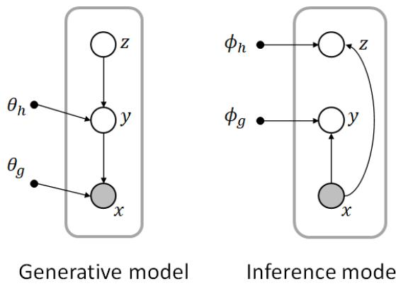  
Figure 1. Variational model [3]: x is a vector to be compressed; y is its latent representation derived from an analysis network with parameters $\phi _ { g } . \ \theta _ { g }$ are the parameters of a synthesis network that recovers x from y. z are hyper-latents introduced to capture dependencies in y; $\phi _ { h }$ and $\theta _ { h }$ are the corresponding analysis and synthesis networks relating y and z.

## 2. Background

In this section we present background on two topics central to our approach: (i) connection between rate-distortion optimization for compression and training an equivalent VAE, and (ii) designing and training bottleneck layers for variable-rate, split-DNN computing.

## 2.1. Variational Image Compression

Several works have explored the connection between the rate-distortion objective of lossy compression and the loss function of variational autoencoders (VAE) [2,3,22,28]. We follow the expositions of [3,28] below. A convolutional encoder network $g _ { a } ( x ; \phi _ { g } )$ transforms the image vector x into a continuous latent representation y. This is then quantized to a discrete variable $\hat { y }$ which is then entropy-coded and transmitted. The decoder recovers $\hat { y } ,$ and obtains a lossy image reconstruction via a deconvolutional neural network $g _ { s } ( \hat { y } ; \theta _ { g } )$ . $\theta _ { g }$ and $\phi _ { g }$ are the weights of the corresponding DNNs.

To cast this formally as a VAE, the problem needs to be relaxed because of the quantization involved which is a nondifferentiable operation. This can be achieved by either replacing quantization by additive noise [2], using a stochastic form of binarization [26], or using a smooth approximation of the gradient [25]. The relaxed optimization problem can then be represented as a variational autoencoder: a probabilistic generative model (“generating” a reconstructed image from the latent representation) of the image combined with an approximate inference model (“inferring” the latent representation from the source image) as shown in Fig. 1

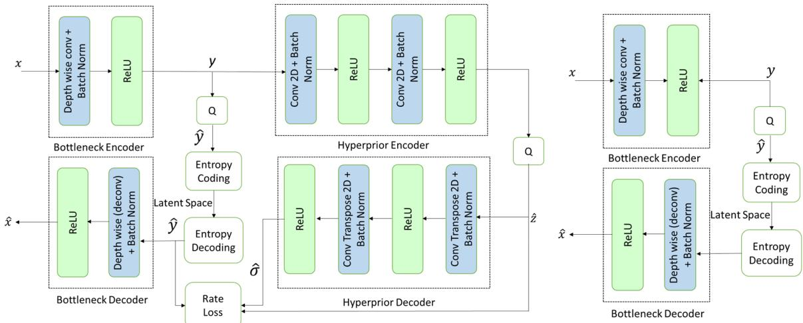  
(a) Training mode: Architecture of the hyperprior-network used at the output of the bottle- (b) Inference mode: Hyperprior network is neck module for estimation of the rate-loss term $L _ { r }$ not used during inference, only bottleneck module is present.  
Figure 2. Pipeline in training and in inference mode. Note that the hyperprior network is present only during training.

In order to capture the dependencies that were observed to exist between elements of $\hat { y } ,$ an additional set of random variables, $z ,$ called ‘hyperlatents’ were introduced [3]. The hyperprior $p ( y | z )$ was modeled as Gaussian and the scale of this (σ) was the output of a second DNN $h _ { s }$ with weights $\theta _ { h }$ . The inference model was accordingly extended through a DNN $h _ { a }$ with weights $\phi _ { h }$ such that $z = h _ { a } ( y ; \phi _ { h } )$

The relaxed rate-distortion objective is then given by:

$$
\begin{array} { r l } & { \mathcal { L } = \mathbb { E } \left[ - \log _ { 2 } p ( z ) - \log _ { 2 } p ( y | z ) + \lambda \left. x - g _ { s } ( y ) \right. ^ { 2 } \right] } \\ & { \quad = R + \lambda D } \end{array}\tag{1}
$$

where the rate, $R ,$ is the sum first two terms which are the rates of the hyper-latents and latents respectively, and the final term is the distortion, D.

In section 3.1, we will apply these principles to the intermediate feature at the split point in order to obtain a neural rate-estimator for the output of the bottleneck encoder.

## 2.2. Design and Training of Bottleneck Units

We follow the approach of Datta et al. [10] for the design and training of bottleneck units. The procedure is briefly outlined next. Inspired by methods in neural architecture search (NAS), the procedure involves exploring a joint space of architectural hyper-parameters and training hyper-parameters. The architectural space comprises parameters related to the design or topology of the bottleneck encoder. In [10], this space comprised two hyperparameters: the number of channels at the output of the bottleneck encoder and the stride of the convolutional kernels used therein. More broadly, though, this could encompass various other architectural parameters of interest such as number of layers in the bottleneck encoder, topology of the layers (convolutional, linear, residual, etc.), etc. The training hyper-parameter space comprises variables such as the weight (Lagrange multipliers) λ in the training loss function (see Eq. (2)), and the quantization step size, Q, used to discretize the latent space. A sample is generated from this joint space which fixes the topology of the bottleneck unit and the hyper-parameters to be used for its training. A training run is then performed to train the weights of this bottleneck unit (importantly, without modifying the weights of the original network). The accuracy of the pipeline with the trained bottleneck is measured on the task of interest along with the average bit-rate required to transmit the compressed features. This results in a candidate bottleneck layer that yields a certain accuracy and bit-rate. This process is then repeated multiple times – each time with a different sample from the joint hyper-parameter space – to generate sufficient number of such candidates. From this set, Pareto optimal set of points are determined. The points lying on the Pareto frontier correspond to the set of trained bottleneck layers that yield the optimal accuracy vs compression performance.

## 3. Approach

We consider a split DNN architecture, where the intermediate features from the final layer at the front-end are compressed and transmitted to the back-end. A specially designed bottleneck unit is introduced at the split point. The bottleneck encoder, which resides at the client, transforms the output of the front-end into a lower-dimensional space more suited for compression. The outputs of this encoder are discretized (quantized) by a uniform quantizer of step-size $Q ,$ entropy-coded, and transmitted to the server or cloud where the back-end resides. Here, following entropy decoding and inverse quantization, the bottleneck decoder – which is a mirror of the bottleneck encoder – restores the lower-dimensional features into the original higher dimensional space and the rest of the inference is completed. Our objective is to design and train the bottleneck layers to jointly optimize for task-performance and compression. For this we follow the procedure outlined in section 2.2. We first define a joint space of architectural and training hyperparameters, and an appropriate training loss function. These are described next.

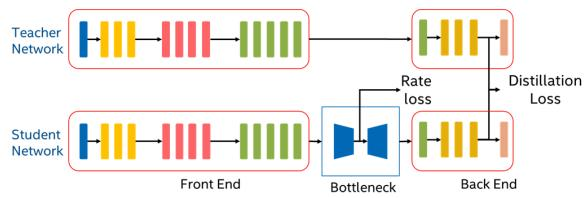  
Figure 3. Unsupervised training of bottlenecks using a teacherstudent model.

Architectural hyper-parameters: The bottleneck encoder transforms the front-end output from an $H \times W \times C$ dimensional latent space (height × width × channels) into $H _ { r } \times W _ { r } \times C _ { r }$ dimensional space. The output height and width can be related to the input by a single scale factor of S, i.e. $H _ { r } = H / S , W _ { r } = W / S$ . Choosing $S > 1$ and $C _ { r } ~ < ~ C$ leads to a lower-dimensional output. We model the bottleneck encoder as a single neural network layer to keep its computational complexity low (since the decoder is a mirror image of the encoder, the decoder is also single layer). We experimented with various topologies for the bottleneck layers and eventually selected a depthwiseseparable topology as this has the fewest parameters and the lowest computational complexity [15]. Details are presented in Section 5.3.

Training loss and training hyper-parameters: The model is trained with a loss function of the form:

$$
L = L _ { r } + \lambda L _ { t } ,\tag{2}
$$

where, $L _ { t }$ is a task-loss to maximize task performance, $L _ { r }$ is a rate-loss term to minimize bit-rate of the encoded data, and λ is a term that controls the relative weighting of the two terms. We note the similarity between equations (1) and (2) and observe that Eq. (2) also represents a form of rate-distortion objective with the distortion-term D being replaced by an equivalent task-loss, $L _ { t }$

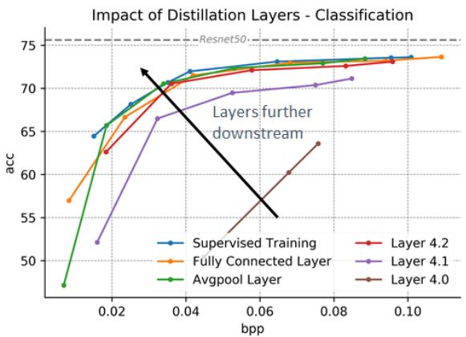  
Figure 4. Unsupervised classification curves for different distillation layers

For $L _ { t } ,$ the usual loss functions such as cross-entropy loss for classification, and sum of per-pixel cross-entropy losses for segmentation are used. Various approaches have been explored in literature to choose an appropriate $L _ { r } .$ . Since, after quantization, the feature values are discrete-valued, the rate is the expected code length which is lower-bounded by the entropy of the probability distribution of the quantized alphabet [9]. Estimation of this quantity is challenging; hence, several published works adopt indirect approaches. These include using the $\ell _ { 2 }$ -norm or $\ell _ { 1 }$ -norm of the compressed feature [6]; or the $\ell _ { 1 }$ -norm of the DCT coefficients of the original image, either directly [19], or along with spatial prediction [1]. However, these are proxies for the true rate and hence suboptimal. Instead, we will present next an approach based on variational inference to train the bottleneck and learn a neural rate-estimator from the training data. Together, λ and Q form the training hyper-parameter space.

The search procedure from section 2.2 is performed over the 4-dimensional space of $( S , C _ { r } , \lambda , Q )$ .

## 3.1. Variational formulation of $L _ { r }$

As described earlier in section 2.1, use of variational methods to learn an entropy model from data have primarily been explored in the context of image compression for reconstruction. In this section, we present an approach based on those principles to perform compression of latent representations for image analytics instead. Consider the variational model shown in Fig. 1 where x is not the input image, but instead the tensor output of the intermediate layer just before the split point, and $y$ is the latent representation at the output of the bottleneck encoder. Hence, the transform $g _ { a } ( x )$ in this case is simply the bottleneck encoder. $y$ is then quantized to yˆ which is then entropy-coded and transmitted. The decoder recovers $\hat { y } ,$ and obtains a lossy reconstruction of the original tensor x via the bottleneck decoder $g _ { s } ( \hat { y } )$ Similar to [3], we extend this model by adding hyperlatent, $z ,$ with a corresponding hyperprior encoder (inference) and hyperprior decoder (generative). From Eq. 1 the rate is measured by

Table 1. Parameters and their ranges for search space exploration. Here ‘S’ indicates supervised, and $\mathbf { \partial } ^ { \circ } \mathrm { U S } ^ { \prime }$ indicates unsupervised
<table><tr><td rowspan="2">Parameter</td><td colspan="2">Range</td></tr><tr><td>Classification (Resnet50)</td><td>Segmentation (DeepLab v3)</td></tr><tr><td>No. of Channels  $C _ { r }$ </td><td>{32, 64, 96, 128}</td><td>{2, 4, 8, 16, 32, 48,64}</td></tr><tr><td>Stride S</td><td>{2, 4, 6}</td><td></td></tr><tr><td>Quant. parameter Q</td><td>[0.5, 10.0]</td><td>[0.5,6.0]</td></tr><tr><td rowspan="2">L, where  $\lambda = 1 0 ^ { L }$ </td><td>[-9,-6] (S)</td><td>[-4,-1] (S)</td></tr><tr><td>[-11, -7] (US)</td><td>[-16,-6] (US)</td></tr></table>

$$
\mathcal { R } = \mathbb { E } \left[ - \log _ { 2 } p ( z ) - \log _ { 2 } p ( y | z ) \right]\tag{3}
$$

We use the above estimate of rate as the rate-loss term in $\operatorname { E q } .$ (2). The architecture of the hyperprior encoder, as shown in Fig. 2, comprises two convolutional layers with ReLu activations (details in supplementary material). The hyperprior decoder is the mirror of the encoder using transpose convolutions.

These hyperprior models help improve the rate estimation as will be evident from results later. However, a separate set of hyperprior encoder and decoder has to be trained for each separate compression level. Including them in the overall pipeline would lead to the same limitations of other methods that were outlined in Section 1, viz. having to reload a large set of network weights everytime the bit-rate is to be changed. To circumvent this, we include the hyperprior models only to provide an estimate for the rateloss term during training; during inference, only the bottleneck layers are included, not the hyperprior models. This increases training complexity somewhat compared to training only the bottleneck layers (as was done in [10]), but no overhead is introduced during inference. Thus, we retain the benefits of being able to efficiently support variable bitrate operation and adaptive splitting.

## 4. Unsupervised Training of Bottleneck Units

Access to labeled training data is often challenging in real-world situations. We present, therefore, a method to train the bottleneck units in an unsupervised manner when we have access to only unlabeled training data. We adopt the student-teacher paradigm from literature on knowledgedistillation (KD) [27]. In the KD framework, knowledgetransfer from the teacher to student can be achieved by using either the logits or feature information from the teacher. In our scenario, the teacher network is simply the original task network without any split points or bottleneck units. Instead of using a supervisory task-loss, $L _ { t } .$ we instead use a distillation-loss , $L _ { d } ,$ obtained by matching features from the same layer in both teacher and student networks that is downstream from the split point, as shown in Fig. 3. $L _ { d }$ is simply the mean-absolute error (MAE) or mean-square error (MSE) between such features. There remains the question of which downstream layer to choose for such feature matching. Recent work [13] explores the effects of such layer choice and has proved, by means of the data processing inequality, that matching features from deeper layers is preferable in the sense of rate-distortion. We verify this result empirically while training bottleneck units for a classification task. Fig. 4 shows plots of accuracy vs compression level (measured in bits-per-pixel or BPP) obtained by matching features from different layers. In the figure, the fully-connected layer is the final layer, preceded by the avgpool layer, preceded respectively by layer 4.2, layer 4.1, and layer 4.0. We see a clear trend of the curves improving as downstream layers are selected. For our experiments, therefore, we choose the final layer of the network for feature matching.

Table 2. Split points within the models.
<table><tr><td></td><td>Resnet50</td><td>DeepLab v3</td></tr><tr><td>Split 1</td><td>layer4[2]</td><td>Classifier[0].conv[1]</td></tr><tr><td>Split 2</td><td>layer4[0]</td><td>Resnet50.layer4[1]</td></tr><tr><td>Split 3</td><td>layer3[4]</td><td>Resnet50.layer3[5]</td></tr></table>

## 5. Experiments and Results

We have tested our approach on two analytic tasks: image classification and semantic segmentation2. For the classification task, we test on the ImageNet dataset [11] using a Resnet50 [14] model. For segmentation, we test on the the MS-COCO 2017 dataset [18], and use a DeepLab v3 model [4]. For both tasks, we tested our approach at three different split points listed in Table 2 along their respective DNN models. The images are scaled to 224×224 resolution for the classification task, and $5 1 3 \times 5 1 3$ for the segmentation. Details about the training parameters (learning rates, schedulers, etc.) are provided in the supplementary material for the interested reader. For a given split point, we follow the hyper-parameter search-space procedure outlined in section 2.2 to train the bottleneck units for various compression levels and derive the Pareto optimal curve of the taskaccuracy metric against the compression level. The hyperparameters involved in our search are $( S , C _ { r } , \lambda , Q )$ as described in Section 3. The ranges of values used for these are described in Table 1. In the table, ‘S’ indicates ranges used for supervised training, and ‘US’ indicates ranges for unsupervised training. For classification, the metric is simply the classification accuracy; for segmentation, it is the Jaccard index as measured by the mean intersection-over-union (mIOU). The compression level is represented by bits-perpixel (bpp), which, as the name indicates is the number of bits of information that needs to be transmitted divided by the number of pixels in the input image.

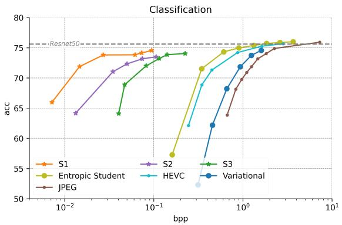  
Figure 5. Accuracy vs BPP on Imagenet classification using Resnet50. Our method achieves significantly lower bit-rates compared to other methods at similar accuracy levels for all splits.

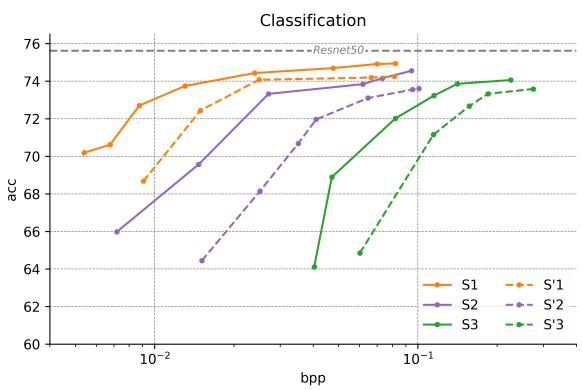  
Figure 6. Improvement on ImageNet classification by using neural compression for three different split point. S indicates result with neural compression and $s \mathrm { \cdot }$ are the results without.

We first report results with neural compression when the bottleneck layers are trained with a supervised task-loss term, and next report results when an unsupervised distillation loss is used.

## 5.1. Supervised Neural Compression

We benchmark our method against standard image compression algorithms - JPEG and HEIC (high-efficiency image compression) - and also against some of the recent MLbased image compression methods which include the Entropic Student [21], variational image compression [3], and the variable bit-rate split-DNN method from [10]. For both tasks, we test our approach at three different split points within their respective models, details of which are included in the supplementary material. First, we show the benefit of using a neural rate-estimator (our approach) as opposed to the $\ell _ { 1 }$ -norm of the latent representations (as was done in [10]). The results are shown in Figs. 6 and 8 for both classification and segmentation tasks. The neural rateestimator outperforms the $\ell _ { 1 }$ -norm rate estimator across the entire curve for all split points. Importantly, it also achieves higher peak accuracy in the classification task. In the segmentation task, not only does it achieve higher peak mIOU than [10], but surprisingly, it also outperforms the the original pretrained Deeplab-v3 model that does not have split points or any compression.

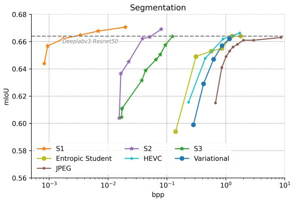  
Figure 7. mIOU vs BPP on COCO2017 segmentation using Deeplab v3. Our method achieves significantly lower bit-rates compared to other methods at similar mIOU levels for all splits (S1 to S3), and also slightly higher peak mIOU (∼ 1% higher).

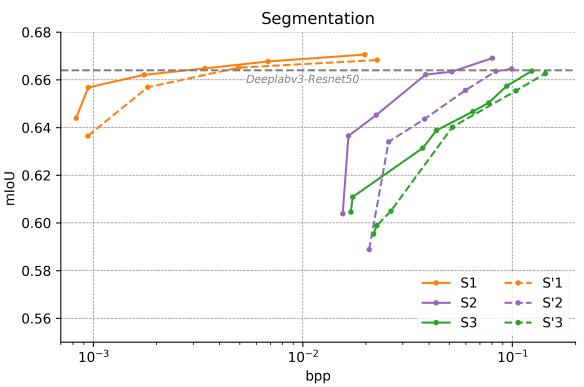  
Figure 8. Improvement on COCO2017 segmentation by using neural compression for three different split point. S indicates result with neural compression and S’ are the results without.

We also compare results against the other four baselines mentioned earlier. The results are shown in Figs. 5 and 7. Here, we see that our method outperforms these baselines by large margins at all split points. For a given task accuracy level, the bit-rate of our method is often orders of magnitude lower.

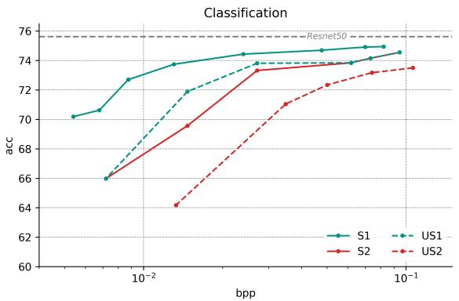  
Figure 9. Accuracy-BPP curve using supervised (S) loss and unsupervised (US) loss.

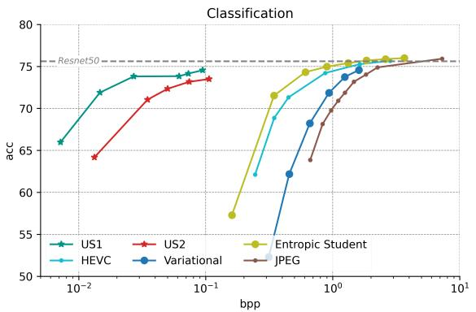  
Figure 10. Accuracy-BPP curves similar to Fig. 5, but using unsuperivsed (US) training for our method.

## 5.2. Unsupervised Neural Compression

Next, we present results when the bottleneck layers are trained in an unsupervised manner by distillation techniques as described in Section 4. As explained, we use the the most downstream layer, i.e. the last layer in the model for performing feature matching. We tested both MAE and MSE to perform feature matching between the teacher and student network and found no difference in performance. The following results were generated using MAE loss for distillation. We test our approach at two different split points, details of which are again included in the supplementary material. We first observe the impact of using an unsupervised loss. The results, as shown in Figures 9 and 11, show a drop in performance relative to the supervised method. Clearly, the lack of a supervisory signal appears to have an adverse impact on the outcome. Despite this, our method with unsupervised training still outperforms the other state-of-the-art methods, as is evident from Figs. 10 and 12. The bit-rates achieved are significantly lower than those of other methods for the same task-performance (accuracy or mIOU). There is, however, a drop in the peak accuracy

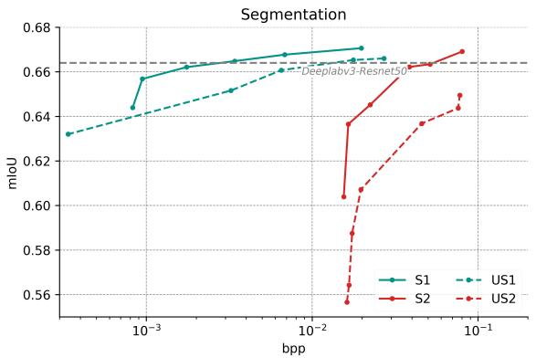  
Figure 11. mIOU-BPP curve using supervised (S) loss and unsupervised (US) loss.

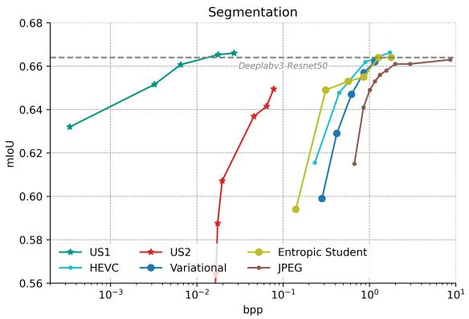  
Figure 12. mIOU-BPP curves similar to Fig. 7, but using unsuperivsed (US) training for our method.

Table 3. Complexity and task-performance of various bottleneck topologies.
<table><tr><td rowspan="2">Bottleneck Topology</td><td colspan="3">Classification</td></tr><tr><td>Accuracy</td><td>BPP</td><td># Params</td></tr><tr><td>One conv layer</td><td>73.37</td><td>0.068</td><td>4.72M</td></tr><tr><td>Two conv layers</td><td>72.79</td><td>0.069</td><td>5.58M</td></tr><tr><td>One depthwise sep conv layer</td><td>74.91</td><td>0.069</td><td>0.57M</td></tr><tr><td>Two depthwise sep conv layer</td><td>74.58</td><td>0.068</td><td>0.58M</td></tr></table>

## 5.3. Complexity

Introduction of the bottleneck unit into the split-DNN pipeline increases the total compute involved. We wish to keep the overhead incurred by the bottleneck units low compared to the overall compute. Hence, we considered several different topologies of varying computational complexities for the bottleneck encoder (recall that the bottleneck decoder is a mirror image of the encoder). These included: (a) a single convolutional layer (b) A single depthwiseseparable convolutional layer (c) A two-layer network comprising two convolutional layers, and (d) A two-layer network comprising two depthwise-separable convolutional layers. Table 3 shows the best accuracy attained by different bottleneck encoder topologies (all reducing the tensor at the split point to the same-shaped reduced-dimension tensor) along with the corresponding bitrates. The results presented here are for Split 1 of the classification model; additional results for segmentation along with details about topologies chosen are included in the supplementary material. We observe that the task performance does not vary significantly between various bottleneck topologies despite significant differences in their computational capabilities. Somewhat surprisingly, though, the best performance was obtained by a single depthwise-separable convolutional layer, which has by far the lowest computational complexity among the various options considered. Hence, we opted for that topology as it simultaneously provided both the lowest complexity and the best performance. Table 4 shows the complexity of the bottleneck unit introduced relative to the complexity of the original DNN. We see that the overhead is virtually negligible attesting to the efficiency of our approach.

Table 4. Computational overhead of bottleneck layers.
<table><tr><td></td><td>Network params</td><td>Bottleneck params</td><td>Overhead</td></tr><tr><td>Resnet50 (cls)</td><td>25.55M</td><td>0.57M</td><td>0.02%</td></tr><tr><td>Deeplab-v3 (seg)</td><td>42.01M</td><td>0.34M</td><td>0.008 %</td></tr></table>

## 6. Conclusions and Future Work

We presented in this work an approach to enhance the performance of split-computing models for image analytics. We showed how improved modeling of the rate-function via a neural rate-estimator improves the rate-distortion performance. We further showed our framework can easily be extended for unsupervised training of the bottleneck layers by replacing a supervisory loss by a distillation-based loss. This capability can potentially be particularly useful in scenarios where models pretrained on standard image datasets are to be deployed in scenarios involving different application-specific custom data. Hence, training of bottlenecks inserted in pretrained models with different unlabeled datasets is something we will be exploring as future work.

## References

[1] Saeed Ranjbar Alvar and Ivan V Bajic. Multi-task learning´ with compressible features for collaborative intelligence. In 2019 IEEE International Conference on Image Processing (ICIP), pages 1705–1709. IEEE, 2019. 4

[2] Johannes Balle, Valero Laparra, and Eero P Simoncelli. End-´ to-end optimized image compression. In International Conference on Learning Representations (ICLR), 2017. 2

[3] Johannes Balle, David Minnen, Saurabh Singh, Sung Jin´ Hwang, and Nick Johnston. Variational image compression with a scale hyperprior. In International Conference on Learning Representations, 2018. 2, 3, 5, 6

[4] Liang-Chieh Chen, George Papandreou, Florian Schroff, and Hartwig Adam. Rethinking atrous convolution for semantic image segmentation. arXiv preprint arXiv:1706.05587, 2017. 5

[5] Zhuo Chen, Kui Fan, Shiqi Wang, Lingyu Duan, Weisi Lin, and Alex Chichung Kot. Toward intelligent sensing: Intermediate deep feature compression. IEEE Transactions on Image Processing, 29:2230–2243, 2019. 1

[6] Zhengxue Cheng, Heming Sun, Masaru Takeuchi, and Jiro Katto. Deep convolutional autoencoder-based lossy image compression. In 2018 Picture Coding Symposium (PCS), pages 253–257. IEEE, 2018. 4

[7] Hyomin Choi and Ivan V Bajic. Deep feature compression´ for collaborative object detection. In 2018 25th IEEE International Conference on Image Processing (ICIP), pages 3743–3747. IEEE, 2018. 2

[8] Robert A Cohen, Hyomin Choi, and Ivan V Bajic.´ Lightweight compression of neural network feature tensors for collaborative intelligence. In 2020 IEEE International Conference on Multimedia and Expo (ICME), pages 1–6. IEEE, 2020. 1

[9] Thomas M Cover. Elements of information theory. John Wiley & Sons, 1999. 4

[10] Parual Datta, Nilesh Ahuja, V Srinivasa Somayazulu, and Omesh Tickoo. A low-complexity approach to ratedistortion optimized variable bit-rate compression for split dnn computing. In 2022 International Conference on Pattern Recognition (ICPR), 2022. 2, 3, 5, 6

[11] J. Deng, W. Dong, R. Socher, L.-J. Li, K. Li, and L. Fei-Fei. ImageNet: A Large-Scale Hierarchical Image Database. In CVPR09, 2009. 5

[12] Amir Erfan Eshratifar, Amirhossein Esmaili, and Massoud Pedram. Bottlenet: A deep learning architecture for intelligent mobile cloud computing services. In 2019 IEEE/ACM International Symposium on Low Power Electronics and Design (ISLPED), pages 1–6. IEEE, 2019. 1

[13] Alon Harell, Anderson De Andrade, and Ivan V Bajic. Ratedistortion in image coding for machines. In 2022 Picture Coding Symposium (PCS). IEEE, 2022. 5

[14] Kaiming He, Xiangyu Zhang, Shaoqing Ren, and Jian Sun. Deep residual learning for image recognition. In Proceedings of the IEEE conference on computer vision and pattern recognition, pages 770–778, 2016. 5

[15] Andrew G Howard, Menglong Zhu, Bo Chen, Dmitry Kalenichenko, Weijun Wang, Tobias Weyand, Marco An-

dreetto, and Hartwig Adam. Mobilenets: Efficient convolutional neural networks for mobile vision applications. arXiv preprint arXiv:1704.04861, 2017. 4

[16] Ravi Iyer and Emre Ozer. Visual iot: Architectural challenges and opportunities; toward a self-learning and energyneutral iot. IEEE Micro, 36(6):45–49, 2016. 1

[17] Yiping Kang, Johann Hauswald, Cao Gao, Austin Rovinski, Trevor Mudge, Jason Mars, and Lingjia Tang. Neurosurgeon: Collaborative intelligence between the cloud and mobile edge. ACM SIGARCH Computer Architecture News, 45(1):615–629, 2017. 1

[18] Tsung-Yi Lin, Michael Maire, Serge Belongie, James Hays, Pietro Perona, Deva Ramanan, Piotr Dollar, and C Lawrence´ Zitnick. Microsoft coco: Common objects in context. In European conference on computer vision, pages 740–755. Springer, 2014. 5

[19] Dong Liu, Haichuan Ma, Zhiwei Xiong, and Feng Wu. Cnnbased dct-like transform for image compression. In International Conference on Multimedia Modeling, pages 61–72. Springer, 2018. 4

[20] Yoshitomo Matsubara, Davide Callegaro, Sabur Baidya, Marco Levorato, and Sameer Singh. Head network distillation: Splitting distilled deep neural networks for resource-constrained edge computing systems. IEEE Access, 8:212177–212193, 2020. 2

[21] Yoshitomo Matsubara and Marco Levorato. Neural compression and filtering for edge-assisted real-time object detection in challenged networks. In 2020 25th International Conference on Pattern Recognition (ICPR), pages 2272–2279. IEEE, 2021. 1, 6

[22] David Minnen, Johannes Balle, and George D Toderici.´ Joint autoregressive and hierarchical priors for learned image compression. Advances in neural information processing systems, 31, 2018. 2

[23] Neel Patwa, Nilesh Ahuja, Srinivasa Somayazulu, Omesh Tickoo, Srenivas Varadarajan, and Shashidhar Koolagudi. Semantic-preserving image compression. In 2020 IEEE International Conference on Image Processing (ICIP), pages 1281–1285. IEEE, 2020. 2

[24] Jiawei Shao and Jun Zhang. Bottlenet++: An end-to-end approach for feature compression in device-edge co-inference systems. In 2020 IEEE International Conference on Communications Workshops (ICC Workshops), pages 1–6. IEEE, 2020. 1

[25] Lucas Theis, Wenzhe Shi, Andrew Cunningham, and Ferenc Huszar. Lossy image compression with compressive autoen-´ coders. In International Conference on Learning Representations (ICLR), 2017. 2

[26] George Toderici, Sean M O’Malley, Sung Jin Hwang, Damien Vincent, David Minnen, Shumeet Baluja, Michele Covell, and Rahul Sukthankar. Variable rate image compression with recurrent neural networks. In International Conference on Learning Representations (ICLR), 2016. 2

[27] Lin Wang and Kuk-Jin Yoon. Knowledge distillation and student-teacher learning for visual intelligence: A review and new outlooks. IEEE Transactions on Pattern Analysis and Machine Intelligence, 2021. 5

[28] Yibo Yang, Robert Bamler, and Stephan Mandt. Improving inference for neural image compression. Advances in Neural Information Processing Systems, 33:573–584, 2020. 2