# Neural Residual Radiance Fields for Streamably Free-Viewpoint Videos

Liao Wang1,3

Qiang Hu1

Tinne Tuytelaars2 1 ShanghaiTech University

Qihan He1,4

Ziyu Wang1

Jingyi Yu1

Lan Xu1† 2 KU Leuven

Minye Wu2† 3 NeuDim 4 DGene

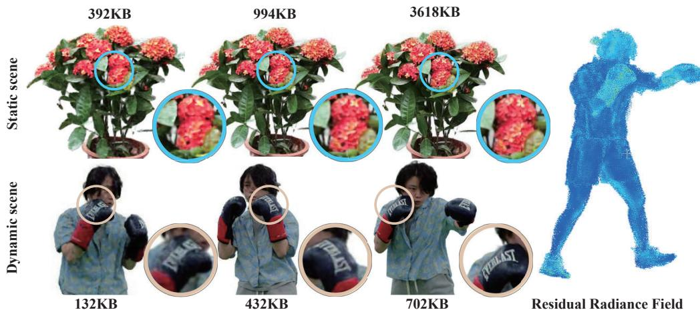

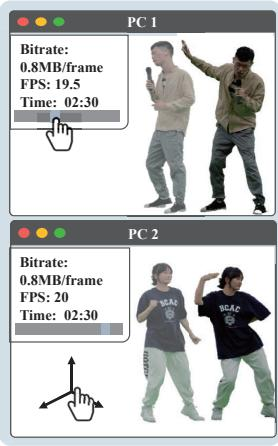  
Streamable 4D Player

Figure 1. Our proposed ReRF utilizes a residual radiance field and a global MLP to enable highly compressible and streamable radiance field modeling. Our ReRF-based codec scheme and streaming player gives users a rich interactive experience.

## Abstract

The success of the Neural Radiance Fields (NeRFs) for modeling and free-view rendering static objects has inspired numerous attempts on dynamic scenes. Current techniques that utilize neural rendering for facilitating freeview videos (FVVs) are restricted to either offline rendering or are capable ofprocessing only brief sequences with minimal motion. In this paper, we present a novel technique, Residual Radiance Field or ReRF, as a highly compact neural representation to achieve real-time FVV rendering on long-duration dynamic scenes. ReRF explicitly models the residual information between adjacent timestamps in the spatial-temporal feature space, with a global coordinate-based tiny MLP as the feature decoder. Specifically, ReRF employs a compact motion grid along with a residual feature grid to exploit inter-frame feature similarities. We show such a strategy can handle large motions without sacrificing quality. We further present a sequential training scheme to maintain the smoothness and the sparsity ofthe motion/residual grids. Based on ReRF, we design

a special FVV codec that achieves three orders of magnitudes compression rate and provides a companion ReRF player to support online streaming of long-duration FVVs of dynamic scenes. Extensive experiments demonstrate the effectiveness of ReRF for compactly representing dynamic radiance fields, enabling an unprecedented free-viewpoint viewing experience in speed and quality.

## 1. Introduction

Photo-realistic free-viewpoint videos (FVVs) of dynamic scenes, in particular, human performances, reduce the gap between the performer and the viewer. But the goal of producing and viewing FVVs as simple as clicking and viewing regular 2D videos on streaming platforms remains far-reaching. The challenges range from data processing and compression to streaming and rendering.

Geometry-based solutions reconstruct dynamic 3D meshes or points [14,16], whereas image-based ones interpolate novel views on densely transmitted footages [6, 83]. Both techniques rely on high-quality reconstructions that are often vulnerable to occlusions and textureless regions. Recent neural advances [44, 61] bring an alternative route that bypasses explicit geometric reconstruction. The seminal work of the Neural Radiance Field (NeRF) [44] compactly represents a static scene in a coordinate-based multilayer perceptron (MLP) to conduct volume rendering at photo-realism. The MLP can be viewed as an implicit feature decoder from a spatially continuous feature space to the radiance output with RGB and density. However, using even a moderately deep MLP can be too expensive for real-time rendering. Various extensions have hence focused on “sculpting” the feature space using smart representations to strike an intricate balance between computational speed and accuracy. Latest examples include explicit feature volumes [21, 57, 77], multi-scale hashing [45], codebook [59], tri-planes [8], tensors [11, 60], etc.

Although effective, by far nearly all methods are tailored to handle static scenes. In contrast, streaming dynamic radiance fields require using a global coordinate-based MLP to decode features from a spatial-temporally continuous feature space into radiance outputs. A na¨ıve per-frame solution would be to apply static methods [45,60] on a series of independent spatial feature spaces. Such schemes discard important temporal coherency, yielding low quality and inefficiency for long sequences. Recent methods attempt to maintain a canonical feature space to reproduce features in each live frame by temporally warping them back into the canonical space. Various schemes to compensate for temporal motions have been proposed by employing implicit matching [18, 38, 48, 49, 62] or data-driven priors such as depth [73], Fourier features [67], optical flow [17, 37], or skeletal/facial motion priors [28,50,69,82]. However, heavy reliance on the global canonical space makes them fragile to large motions or topology changes. The training overhead also significantly increases according to the sequence length. Recent work [34] sets out to explore feature redundancy between adjacent frames but it falls short of maintaining a coherent spatial-temporal feature space.

In this paper, we present a novel neural modeling technique that we call the Residual Radiance Field or ReRF as a highly compact representation of dynamic scenes, enabling high-quality FVV streaming and rendering (Fig. 1). ReRF explicitly models the residual of the radiance field between adjacent timestamps in the spatial-temporal feature space. Specifically, we employ a global tiny MLP to approximate radiance output of the dynamic scene in a sequential manner. To maintain high efficiency in training and inference, ReRF models the feature space using an explicit grid representation analogous to [57]. However, ReRF only performs the training on the first key frame to obtain an MLP decoder for the whole sequence and at the same time it uses the resulting grid volume as the initial feature volume. For each subsequent frame, ReRF uses a compact motion grid and a residual feature grid: the low-resolution motion grid represents the position offset from the current frame to the previous whereas a sparse residual grid is used to compensate for errors and newly observed regions. A major benefit of such a design is that ReRF fully exploits feature similarities between adjacent frames where the complete feature grid of the current frame can be simply obtained from the two while avoiding the use of a global canonical space. In addition, both motion and residual grids are amenable for compression, especially for long-duration dynamic scenes.

We present a two-stage scheme to efficiently obtain the ReRF from RGB videos via sequential training. In particular, we introduce a novel motion pooling strategy to maintain the smoothness and compactness of the inter-frame motion grid along with sparsity regularizers to improve the compactness of ReRF. To make ReRF practical for users, we further design a ReRF-based codec that follows the traditional keyframe-based strategy, achieving three orders of magnitudes compression rate compared to per-framebased neural representations [57]. Finally, we demonstrate a companion ReRF player suitable for conducting online streaming of long-duration FVVs of dynamic scenes. With ReRF, a user, for the first time, can pause, play, fast forward/backward, and seek on dynamic radiance fields as if viewing 2D videos, resulting in an unprecedented highquality free-viewpoint viewing experience (see Fig. 2).

To summarize, our contributions include:

• We introduce Residual Radiance Field (ReRF), a novel neural representation, to support streamable free-viewpoint viewing of dynamic radiance fields.

• We present tailored motion and residual grids to support sequential training and at the same time eliminate the need for using a global canonical space notorious for large motions. We further introduce a number of training strategies to achieve a high compression rate while maintaining high rendering quality.

• We develop a ReRF-based codec and a companion FVV player to stream dynamic radiance fields of long sequences, with broad control functions.

## 2. Related work

Novel View Synthesis for Static Scenes. Novel view synthesis, the problem of synthesizing new viewpoints given a set of 2D images, has recently attracted considerable attention. Light field representations [1, 7, 19, 23, 33] formulates the problem by two-plane parametrization. Early methods [7, 23, 33] generate rays of a novel viewpoint via interpolation, which can achieve real-time rendering but require caching all rays. Recent works [1, 19] use neural networks for compact storage. Mesh-based representations [10, 63, 71] allow for efficient storage and can record the view-dependent texture [10, 71]. However, optimizing a mesh to fit a scene with complex topology is still a challenge. Multi-plane images [13, 20, 51, 58, 70] have shown the ability to handle complex scenes because of their topology-free nature. More recently, the breakthrough approach NeRF [44] greatly improves the realism of rendering and inspires numerous follow-up works including multiscale [2, 3], relighting [5,56,80], editing [76,78], 3D-aware generation [8, 15, 24, 52, 68], etc. However, [44] assumes a static scene and cannot handle scene variations over time.

Novel View Synthesis for Dynamic Scenes. Dynamic scenes are more complex because of illumination variations and object movements. One way is to reconstruct the dynamic scene and render the geometry from novel views. RGB [14, 31, 36, 42, 43, 54, 81] or RGB-D [16, 29, 30, 46, 74, 75] solutions have been widely explored. Other methods [4,40,72] model the dynamic scene by neural networks for view synthesis. [4] use a neural network to regress each image from all others to achieve view, time, or light interpolation. [40] use an encoder-decoder network to transfer the 2D images into 3D volume, and leverages volumetric rendering for end-to-end training. [72] combines the points feature with multi-view images for dynamic human rendering. Using motion-advected feature vectors [27] for still image animation is also an interesting direction.

More recently, [17, 18, 22, 35, 37, 37, 38, 41, 47–49, 53, 62, 65–67, 73, 79] extend NeRF [44] into the dynamic settings. Some [17, 22, 73] directly condition the neural radiance field on time to handle spatial changes. Others [35, 37, 48, 53, 62, 79, 82] learn spatial offsets from the current scene to a learned canonical radiance field at each timestamp. [49] conditions NeRF on additional higherdimensional coordinates to tackle the discontinuous topological changes beyond the continuous deformation field. [65] handles scene dynamic change by modeling the trajectory of each point in the scene. [38] uses explicit voxels to model both the canonical space and deformation field for dynamic scenes. [67] models the time-varying density and color by Fourier coefficients to extend the octree-based radiance field [77] to dynamic scenes. Compared to [67], our method uses three orders of magnitude smaller storage and enables long sequences with large motions.

NeRF Acceleration and Compression. NeRF [44] shows extraordinary results in free-view rendering, but its training and rendering speed are slow. Recent approaches reduce the complex MLP computation by decomposing NeRF into explicit 3D feature encoding with a shallow MLP decoder. Methods have been explored involving voxel grids [26, 34, 39, 57], octrees [21, 67, 77], tri-planes [8], multi-scale hashing [45], codebook [59], tensor decomposition [11, 55, 60], and textured polygons [12].

Using explicit encoding greatly reduces training and inference time, but the additional storage consumption associated with these 3D structures is a concern. Some methods achieve high compression ratios through CPdecomposition [11], rank reduction [60] or vector quantization [59] but are limited to static scenes. Recent dynamic approaches [34] employ narrow band tuning on sparse voxel grids for video sequences, which is efficient to train but still has a size of MB per frame. [55] decomposes the 4D space into static, deforming, and new areas for efficient dynamic scene training and rendering, but is limited by the length of the video sequence. In contrast, we embrace residual radiance field and ReRF-based codec scheme, which enables high compression and streaming for long sequences with large motion.

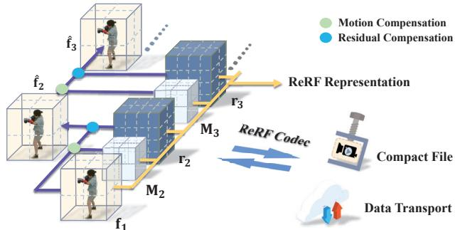  
Figure 2. Overview of our method. We first use our sequential training scheme (Sec. 3) to generate compact ReRF representation with motion grid Mi and $\mathbf { r } _ { i }$ for each frame i. Next, our ReRFbased codec scheme and player (Sec. 4) will compress it to enable fast data transport and online playing.

## 3. Neural Residual Radiance Field

In this section, we introduce the details about the proposed ReRF representation for dynamic scenes (Sec. 3.1), followed by a companion training scheme to generate ReRF from RGB video inputs (Sec. 3.2).

## 3.1. Motion-aware Residual Fields

Recall that the radiance with color and density (c, σ) in NeRF is formulated as $\mathbf { c } , \sigma ~ = ~ \boldsymbol { \Psi } ( \mathbf { x } , \mathbf { d } )$ , using MLPs as decoder given the 3D position x and viewing direction d. Then, volume rendering is adopted for photo-realistic novel view synthesis based on the radiance fields. To maintain high efficiency in training and inference, in ReRF, we use an explicit grid representation similar to previous work [57]. Specifically, with an explicit density grid $\mathbf { V } _ { \sigma }$ and a color feature grid $\mathbf { V } _ { c } ,$ , the radiance field of a static scene is:

$$
\begin{array} { r l } & { \sigma = i n t e r p ( \mathbf x , \mathbf V _ { \sigma } ) } \\ & { \mathbf c = \Phi ( i n t e r p ( \mathbf x , \mathbf V _ { c } ) , \mathbf d ) , } \end{array}\tag{1}
$$

where interp( ) denotes the trilinear interpolation function on the grids, and Φ is a relatively shallow MLP for acceleration. For simplification, we can union $\mathbf { V } _ { \sigma }$ and $\mathbf { V } _ { c }$ into a common feature grid f by appending an additional channel to $\mathbf { V } _ { c }$ . To that end, the explicit grid representation for a static radiance field consists of a feature grid f and a tiny MLP Φ as the implicit feature decoder.

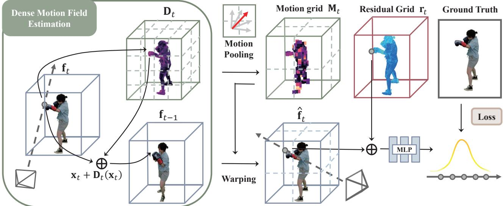  
Figure 3. Illustration of our Neural Residual Radiance Field (ReRF). First, we estimate a dense motion field $\mathbf { D } _ { t }$ . Next, we generate a compact motion grid Mt through motion pooling. Finally, we warp $\mathbf { f } _ { t - 1 }$ to a base grid $\hat { \mathbf { f } } _ { t }$ and learn our residual grid $\mathbf { r } _ { t }$ to increase feature sparsity and promote compression.

To further represent a dynamic radiance field, we adopt a coordinated-based tiny MLP Φ as the global feature decoder for the spatial-temporal feature space. A na¨ıve solution would be to utilize per-frame feature grids $\{ \mathbf { f } _ { t } \} _ { t = 1 } ^ { N }$ for the dynamic scene with N frames, yet discarding important temporal coherency. Recent work DeVRF [38] maintains a canonical feature grid $\mathbf { f } _ { 1 }$ with dense motion fields $\{ \mathbf { D } _ { t } \} _ { t = 1 } ^ { N }$ to reproduce features in each live frame, but it’s fragile to large motions or topology changes due to the reliance on a canonical space. In stark contrast, we propose to explicitly exploit the feature similarities between adjacent timestamps in the spatial-temporal feature space. Here, we introduce a compact motion grid $\mathbf { M } _ { t }$ and a residual feature grid $\mathbf { r } _ { t }$ for the current frame t. The low-resolution motion grid $\mathbf { M } _ { t }$ denotes the voxel offset to indicate the corresponding voxel index in the previous frame for a voxel in the current frame. The residual grid $\mathbf { r } _ { t }$ denotes the sparse compensation for both the adjacent warping error and the newly observed regions in the current frame. Besides, for the first frame, we adopt a complete explicit feature grid representation $\mathbf { f } _ { 1 }$ with the companion global MLP Φ. Finally, our ReRF sequentially represents a dynamic radiance field with N frames as Φ, f , and $\{ \mathbf { M } _ { t } , \mathbf { r } _ { t } \} _ { t = 1 } ^ { N }$ , as illustrated in Fig. 2.

Note that our ReRF enables highly efficient sequential feature modeling. Given the previous $\mathbf { f } _ { t - 1 }$ , current feature grid $\mathbf { f } _ { t }$ can be simply obtained from $\mathbf { M } _ { t }$ and $\mathbf { r } _ { t }$ while avoiding the use of global canonical space. Specifically, we first apply Mt to $\mathbf { f } _ { t - 1 }$ to extract the inter-frame redundancy and obtain a base feature grid $\hat { \mathbf { f } } _ { t }$ for the current frame. Let $\mathbf { p }$ denote the index of our explicit grids. Then, the per-voxel base feature grid is formulated as:

$$
\hat { \mathbf { f } } _ { t } ( \mathbf { p } ) = \mathbf { f } _ { t - 1 } ( \mathbf { p } + \mathbf { M } _ { t } ( \mathbf { p } ) ) ,\tag{2}
$$

which turns to exploiting the inter-frame feature similarities as much as possible. We then recover the entire feature grid by adding the residual compensation: $\mathbf { f } _ { t } = \hat { \mathbf { f } } _ { t } + \mathbf { r } _ { t } ,$ , enabling the reconstruction of the current radiance field by applying the global MLP $\Phi$ on $\mathbf { f } _ { t }$ according to Eqn 1. Compared to the explicit feature grids ft , our motion-aware residual representation $\{ \mathbf { M } _ { t } , \mathbf { r } _ { t } \}$ is compact and compressionfriendly, which naturally models feature changes in the coherent spatial-temporal feature space.

## 3.2. Sequential Residual Field Generation

Here, we introduce a two-stage and sequential training scheme to obtain a ReRF representation including Φ, $\mathbf { f } _ { 1 }$ , and $\{ \mathbf { M } _ { t } , \mathbf { r } _ { t } \} _ { t = 1 } ^ { N }$ from long-duration RGB video inputs, which naturally enforces the compactness of both residual and motion grids to enable the fascinating streamable applications in Sec. 4. At the very beginning, we utilize the off-the-shelf approach [57] to obtain the complete explicit feature grid $\mathbf { f } _ { 1 }$ for the first frame, companion with the global MLP Φ as feature decoder. Then, sequentially given the feature grid $\mathbf { f } _ { t - 1 }$ of the previous frame and the input images for the current frame, we compactly generate the motion grid $\mathbf { M } _ { t }$ and residual grid $\mathbf { r } _ { t }$ in the following two stages.

Motion Grid Estimation. We first follow DeVRF [38] to a dense motion field $\mathbf { D } _ { t }$ yet only from the current frame to the previous one by treating the previous frame as the canonical space. To maintain a smooth and compact motion grid $\mathbf { M } _ { t }$ , we further introduce a motion pooling strategy. Motion vectors in a voxel $\mathbf { p } _ { t }$ may point to different voxels $\mathbf { p } _ { t - 1 }$ in the previous frame. Thus, analogous to the standard average pooling operation, we select the voxel $\bar { \mathbf p } _ { t - 1 }$ that the mean vector points to as the voxel motion ${ \bf M } _ { t } ( { \bf p } _ { t } ) =$ $\bar { \bf p } _ { t - 1 }$ . Specifically, we first split the $\mathbf { D } _ { t }$ into cubes, where each cube contains continuous $8 \times 8 \times 8$ voxels. Then, for each cube we apply an average pooling on the $\mathbf { D } _ { t }$ at the kernel of $8 \times 8 \times 8$ , to enforce that each cube shares the same motion vector. After that, we downsample it to generate a low-resolution motion grid $\mathbf { M } _ { t }$ . Note that our compact motion grid $\mathbf { M } _ { t }$ is compression-friendly since its size is 512 times smaller than the original dense one. In this way, some feature cubes from the former frame can be tracked through the motion field, so that the entropy of the residual voxels can be further decreased. To that end, we generate a low-resolution Mt that compactly represents the smooth motions across frames.

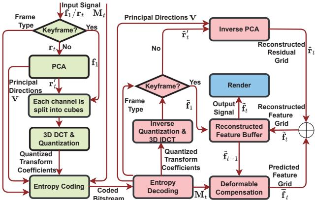  
Figure 4. Overview of our proposed ReRF-based codec and player (the modeling elements of the encoder and decoder are shaded in light green and pink, respectively). The encoder compresses the input signal to produce a bitstream by using PCA, 3D-DCT, quantization, and entropy coding. The decoder receives the compressed bitstream, decodes each of the syntax elements, and reverses the coding process. Additionally, given the decoded motion field $\mathbf { M } _ { t }$ and the previously reconstructed feature grid $\ddot { \mathbf { f } } _ { t - 1 }$ , we can obtain the predicted feature grid ft by deformation.

Residual Grid Optimization. With the aid of the compact motion grid Mt, we warp previous feature grid $\mathbf { f } _ { t - 1 }$ into the current base grid $\hat { \mathbf { f } } _ { t } ^ { } .$ , which coarsely compensates the feature differences caused by inter-frame motion. During optimizing the residual grid, we fix $\hat { \mathbf { f } } _ { t }$ and Φ and backpropagate the gradients to the residual grid $\mathbf { r } _ { t }$ to only update $\mathbf { r } _ { t } .$ . Apart from the photometric loss, we also regularize $\mathbf { r } _ { t }$ by using an L1 loss to enhance its sparsity to improve compactness. Such sparse formulation also enforces that $\mathbf { r } _ { t }$ only compensates the sparse information for inter-frame residue or the newly observed regions. The total loss function $\mathcal { L } _ { t o t a l }$ for learning $\mathbf { f } _ { t }$ is formulated as:

$$
\mathcal { L } _ { t o t a l } = \sum _ { \mathbf { l } \in \mathbb { L } } \| \mathbf { c } ( \mathbf { l } ) - \hat { \mathbf { c } } ( \mathbf { l } ) \| ^ { 2 } + \lambda \| \mathbf { r } _ { t } \| _ { 1 }\tag{3}
$$

where $\mathbb { L }$ is the set of training pixel rays; $\mathbf { c } ( 1 )$ and $\hat { \mathbf { c } } ( 1 )$ are the ground truth color and predicted color of a ray l respectively; $\lambda = 0 . 0 1$ is the weight of the regularization term.

Once obtained $\mathbf { M } _ { t } , \mathbf { r } _ { t }$ , we can recover the explicit feature grid $\mathbf { f } _ { t }$ of the current frame as illustrated in Sec. 3.1, and also enables the successive training of next frame. Note that the design and generation mechanism of $\mathbf { M } _ { t }$ and $\mathbf { r } _ { t }$ makes

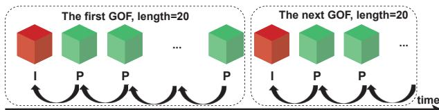  
Figure 5. GOF structure.  
them compression-friendly due to their compact representation and sparse property, enabling following ReRF codec and streaming Please refer to our supplementary material for more training details of ReRF.

## 4. ReRF Codec and Streamble Application

## 4.1. Feature-level Residual Compression.

Both motion and residual grids are amenable for compression, especially for long-duration dynamic scenes. To make ReRF practical for users, we further propose a ReRFbased codec and a companion FVV player for online streaming of long-duration dynamic scenes, as shown in Fig. 4. We first divide the feature grid sequence into several continuous groups of feature grids (GOF), which is a collection of successive grids as shown in Fig 5. GOFs are comprised of an I-feature grid (keyframe) and a P-feature grid. Each GOF begins with an I-feature grid which is coded independently of all other feature grids. The p-feature grid contains a deformable compensated residual grid relative to the previous feature grid. Let $\{ \mathbf { f } _ { 1 } , \mathbf { r } _ { 2 } , \cdot \cdot \cdot , \mathbf { r } _ { t - 1 } , \mathbf { r } _ { t } , \cdot \cdot \cdot \}$ denote a GOF, where $\mathbf { f } _ { 1 }$ is the feature grid and $\mathbf { r } _ { t }$ is the residual grid.

We first reshape $\mathbf { f } _ { 1 }$ and $\mathbf { r } _ { t }$ into ${ \bf f } _ { 1 } ( m , n )$ and $\mathbf { r } _ { t } ( m , n )$ a $m \ \times \ n$ feature matrix, where m and n are the number of non-empty feature voxels and feature channels, respectively. Then, we perform linear Principal Component Analysis (PCA) [25] on $\mathbf { r } _ { t } ( m , n )$ to get principal directions $\mathbf { V } .$ Finally, we project the $\mathbf { r } _ { t }$ to principal directions by $\mathbf { r } _ { t } ^ { \prime } = \mathbf { r } _ { t } \cdot \mathbf { V }$ . Each channel of grid $\mathbf { f } _ { 1 }$ and $\mathbf { r } _ { t } ^ { \prime }$ is divided into cubes of $8 \times 8 \times 8$ voxels and each cube is separately transformed by using a 3D DCT [9, 32]. Thereafter, the transform coefficients are quantized using a quantization matrix.

The quantized transform coefficients are entropy coded and transmitted together with auxiliary information such as motion field $\mathbf { M } _ { t } ,$ frame type, etc. Specifically, the DC coefficients are coded using the Differential Pulse Code Modulation (DPCM) method [64].

The AC coefficients coding involves arranging the quantized DCT coefficients in $\mathrm { ~ a ~ } ^ { \mathsf { \Omega } }$ zigzag” order [32], employing a run-length encoding (RLE) algorithm to group similar frequencies together, inserting length coding zeros. Finally, we use Huffman coding to further compress the DPCM-coded DC coefficients and the RLE-coded AC coefficients. An advantage of our compression method is the ability to achieve variable bitrates via adjusting the quantization parameters, thus enabling dynamic adaptive streaming of ReRF according to the available bandwidth.

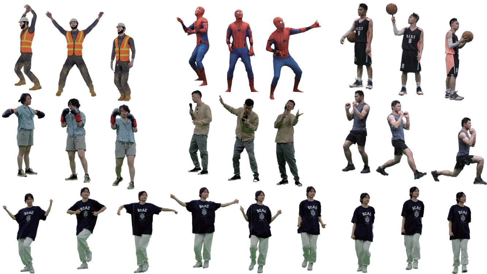  
145.95KB  
162.72KB  
189.21KB  
205.40KB  
216.32KB  
248.95KB  
284.53KB  
726.01KB  
463.25KB

Figure 6. The rendered appearance results of our ReRF method on inward 360◦ long sequences with large motions. The last row shows that we can enable variable bitrate.

## 4.2. Network Streaming ReRF Player

We also implement a companion ReRF player for online streaming dynamic radiance fields of long sequences, with broad control functions. When the bitstream is received, the I-feature grid $\widetilde { \mathbf { f } } _ { 1 }$ is first reconstructed by performing inverse quantization and inverse transform on the quantized transform coefficients.

After the I-feature grid is reconstructed, the subsequently received P-feature grid will then be reconstructed. Specifically, the initial reconstructed residual grid $\hat { \mathbf { r } } _ { t } ^ { \prime }$ is generated by inverse quantization and inverse transform of the quantized transform coefficients. Then $\hat { \mathbf { r } } _ { t } ^ { \prime }$ is back-projected to the origin space $\hat { \mathbf { r } } _ { t } ~ = ~ \hat { \mathbf { r } } _ { t } ^ { \prime } \cdot \mathbf { V } ^ { T }$ . Additionally, given the decoded motion field Mt and the previously reconstructed feature grid $\widetilde { \mathbf { f } } _ { t - 1 }$ , we can obtain the predicted feature grid $\overline { { \mathbf { f } } } _ { t }$ by deformation. Finally, $\overline { { \mathbf { f } } } _ { t }$ as well as $\hat { \mathbf { r } } _ { t }$ are added to produce the final reconstructed feature grid $\dot { \mathbf { f } } _ { t }$ . $\ddot { \mathbf { f } } _ { t }$ is output to the renderer to generate photo-realistic FVV of dynamic scenes.

Benefiting from the design of the GOF structure, our ReRF player allows fast seeking to a new position to play during playback. Because encountering a new GOF in a compressed bitstream means that the decoder can decode a compressed feature grid without reconstructing any previous feature grid. With ReRF player, for the first time, users can pause, play, fast forward/backward, and seek dynamic radiance fields just like viewing a 2D video, bringing an unprecedented high-quality free-viewpoint viewing experience.

## 5. Experimental Results

In this section, we evaluate our ReRF on a variety of challenging scenarios. Our captured dynamic datasets contain around 74 views at the resolution of 1920 1080 at 25 fps. We use the PyTorch Framework to train the proposed network on a single NVIDIA GeForce RTX3090. We also implement a companion ReRF player for online streaming dynamic fields of long sequences. To verify the effectiveness of the proposed ReRF player, we use a PC with Intel(R) Core(TM) i9-11900 CPU@2.5 GHz and NVIDIA GeForce RTX3090 GPU as the test platform. In the experiments, the length of each GOF is set to 20. As demonstrated in Fig. 6 and Fig. 4 in the supplementary, we can generate high-quality appearance results in both inward 360◦and forward-facing scenes with long sequences and large, challenging motions. Our method can flexibly adjust storage by scaling the quantization factor shown in the third row of Fig. 6. Please refer to the supplementary video for more video results.

## 5.1. Comparison

Dynamic Scene Comparison. We provide the experimental results to demonstrate the effectiveness of our proposed ReRF method. We compare with other state-of-theart methods for dynamic scenes including DeVRF [38], DVGO [57], INGP [45], INGP-T, and TiNeuVox [18] both qualitatively and quantitatively. INGP-T is a modified timeconditioned NGP version. It takes normalized 4D input [x, y, z, t] as hash table input. In Fig. 7, we report the visual quality results of different methods when compared with our ReRF compression method on both short and long sequences. Specifically, our approach can achieve photorealistic free-viewpoint rendering comparable to per-frame reconstruction DVGO and INGP, but with much less storage overload. Compared to dynamic reconstruction methods (DeVRF, INGP-T, TiNeuVox), we achieve the most vivid rendering result in terms of photo-realism and sharpness, which, in addition, without losing performance in long sequences. DeVRF learns an explicit deformation field from the live frame to the first frame. When the motion is large, especially in long sequences, it is difficult to warp directly from the first frame. INGP-T and TiNeuVox suffer from severe blurring effects as the frame count increases. Note that no matter how the number of frames increases (even to 4000 frames), our method always maintains high photorealism and sharpness as shown in Fig. 8.

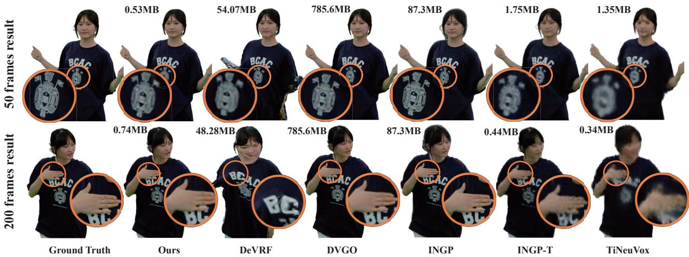  
Figure 7. Qualitative comparison against dynamic scene reconstruction methods and per frame static reconstruction methods.

<table><tr><td></td><td colspan="5">50 frames</td><td colspan="5">200 frames</td></tr><tr><td>Method</td><td>Size(MB)↓</td><td>PSNR↑</td><td>SSIM↑</td><td>MAE↓</td><td>LPIPS↓</td><td>Size(MB)↓</td><td>PSNR↑</td><td>SSIM↑</td><td>MAE↓</td><td>LPIPS↓</td></tr><tr><td>DeVRF [38]</td><td>54.07</td><td>26.03</td><td>0.9508</td><td>0.0142</td><td>0.0587</td><td>48.28</td><td>20.63</td><td>0.9192</td><td>0.0275</td><td>0.0978</td></tr><tr><td>DVGO [57]</td><td>785.6</td><td>37.88</td><td>0.9922</td><td>0.0021</td><td>0.0199</td><td>785.6</td><td>37.80</td><td>0.9920</td><td>0.0020</td><td>0.0192</td></tr><tr><td>INGP [45]</td><td>87.30</td><td>38.75</td><td>0.9936</td><td>0.0014</td><td>0.0192</td><td>87.30</td><td>38.86</td><td>0.9943</td><td>0.0015</td><td>0.0189</td></tr><tr><td>INGP-T</td><td>1.746</td><td>31.72</td><td>0.9668</td><td>0.0064</td><td>0.0488</td><td>0.436</td><td>30.40</td><td>0.9683</td><td>0.0059</td><td>0.0464</td></tr><tr><td>TiNeuVox [18]</td><td>1.348</td><td>27.79</td><td>0.9515</td><td>0.0097</td><td>0.0671</td><td>0.337</td><td>25.84</td><td>0.9422</td><td>0.0131</td><td>0.0836</td></tr><tr><td>Ours</td><td>0.650</td><td>37.03</td><td>0.9902</td><td>0.0023</td><td>0.0232</td><td>0.645</td><td>37.02</td><td>0.9902</td><td>0.0023</td><td>0.0244</td></tr></table>

Table 1. Qualitative comparison against dynamic scene reconstruction methods and per frame static reconstruction methods. We calculate the storage averaged among the frames and PSNR averaged among the frames and views. Compared to origin DVGO, our model size is three order smaller and preserves the visual quality.

For quantitative comparison, we adopt the peak signalto-noise ratio (PSNR), structural similarity index (SSIM)

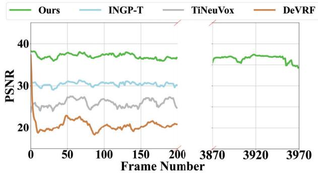  
Figure 8. Quantitative comparison on the number of frames. We show that the performance of our method does not decrease as the number of frames increases.

as metrics to evaluate our rendering accuracy. We choose 70 captured views as training set and the other 4 views as testing set. In Tab.1, we show that we can effectively use the small storage to achieve high-quality results. In long sequences with large motions, our method outperforms other dynamic methods in terms of appearance.

Also, note that our method can achieve fast training (about 10 mins per frame) and fast rendering (20fps), significantly faster than NeRF and many previous methods.

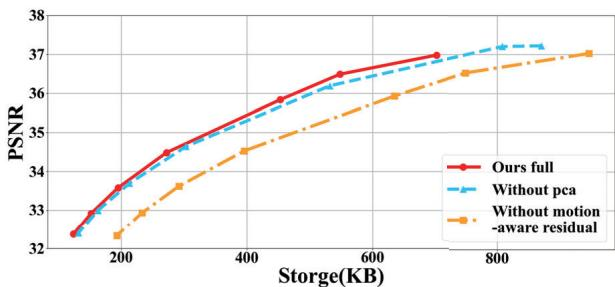  
Figure 9. Rate distortion curve. This figure shows the rate distortion of our different components. Our complete architecture is the most compact and is able to dynamically scale the bitrate to different storage requirements.

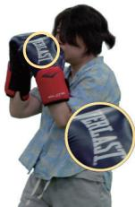  
Ground Truth

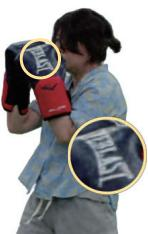

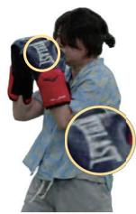  
Ours-full  
Without motionaware residual

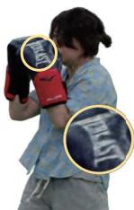  
Without pca  
Figure 10. Qualitative evaluation of different variations in our method.

## 5.2. Evaluation

Ablation Study. We analyze the motion-aware residual module and our PCA module. For without motion-aware residual, we train each frame independently and directly encode the residual of 2 frames. Fig. 9 highlights that our motion-aware can significantly improve compactness. Also, our PCA module can improve even further. In Fig. 10, we show the result under the limit of 700KB storage. In contrast, our complete model generates photorealistic results with minimal noise caused by compression.

Analysis of storage. We show the storage of each component in our high-quality version in Tab. 2. We report the average bitrate of our compressed residual feature, voxel motion field, PCA back-project matrix V T and others including masks to indicate the empty space and header file information. Note that, our total average model size is 793KB which is three orders of magnitude more compact.

Analysis of runtime. As shown in the runtime breakdown analysis on Tab. 3, our ReRF player supports realtime decoding and rendering of on-demand ReRF streams. The average time to decode and render one frame is about 47.03ms and 44.62ms, respectively. In addition, the decoding time and rendering time are close to each other, which is more friendly to parallel processing. The total processing time of the player, achieved by decoding and rendering in parallel, is about 50ms. Users can experience free-view videos at high frame rates in an immersive manner, just as smoothly as viewing 2D videos on YouTube.

<table><tr><td rowspan=1 colspan=1>Components</td><td rowspan=1 colspan=1>Residual</td><td rowspan=1 colspan=1>Motion</td><td rowspan=1 colspan=1>PCA</td><td rowspan=1 colspan=1>others</td></tr><tr><td rowspan=1 colspan=1>Size (KB)</td><td rowspan=1 colspan=1>755.31</td><td rowspan=1 colspan=1>31.80</td><td rowspan=1 colspan=1>0.68</td><td rowspan=1 colspan=1>4.86</td></tr><tr><td rowspan=1 colspan=5>Origin Size                         786MB</td></tr></table>

Table 2. Quantitative evaluation on the storage of different Components. We show that our proposed method is 1000 times smaller than the original model size without compression.
<table><tr><td>Stage</td><td>Action</td><td>Avg Time</td></tr><tr><td>Decoding</td><td>entropy decoding inverse quantization 3D IDCT others</td><td>~ 26.01 ms ~ 0.08 ms ~ 1.32 ms ~ 19.62 ms</td></tr><tr><td>Rendering</td><td></td><td>~ 44.62 ms</td></tr></table>

Table 3. Breakdown of processing per-frame time in each stage of ReRF player. The result is averaged over a whole sequence.

## 6. Discussion

Limitation. As the first trial to enable streamable radiance field modeling and rendering for long sequences with rich experiences, our approach has some limitations. First, compared to storage, our averaged per-frame training time needs to be improved. We will try some training acceleration techniques from [34, 45]. Second, although we have reached 20 fps, speeding up our rendering for more fluent interaction is the direction we need to explore. Moreover, we need a multiview capture system to provide dynamic sequences, which is expensive and hard to construct.

Conclusion. We have presented a novel Residual Radiance Field (ReRF) technique for compactly modeling longduration dynamic scenes. Our novel motion/residual grids in ReRF are compression-friendly to model the spatialtemporal feature space of dynamic scenes in a sequential manner. Our ReRF-based codec scheme achieves three orders of magnitude compression improvement, while our ReRF player further enables online dynamic radiance fields streaming and free-viewing. Our experimental results demonstrate the effectiveness of ReRF for highly compact and effective dynamic scene modeling. With the unique streamable ability for long-duration dynamic scenes, we believe that our approach serves as a critical step for neural scene modeling, with various potential immersive applications in VR/AR.

## 7. Acknowledgements

This work was supported by Shanghai YangFan Program (21YF1429500), Shanghai Local college capacity building program (22010502800), NSFC programs (61976138, 61977047), STCSM (2015F0203-000-06), and SHMEC (2019-01-07-00-01-E00003). We also acknowledge support from Shanghai Frontiers Science Center of Human-centered Artificial Intelligence (Shang-HAI). We thank Peihao Wang, Zhipeng He and Zhirui Zhang for their assistance in the experiments and figures.

## References

[1] Benjamin Attal, Jia-Bin Huang, Michael Zollhofer, Jo-¨ hannes Kopf, and Changil Kim. Learning neural light fields with ray-space embedding networks. In Proceedings of the IEEE/CVF Conference on Computer Vision and Pattern Recognition (CVPR), 2022. 2

[2] Jonathan T Barron, Ben Mildenhall, Matthew Tancik, Peter Hedman, Ricardo Martin-Brualla, and Pratul P Srinivasan. Mip-nerf: A multiscale representation for anti-aliasing neural radiance fields. In Proceedings of the IEEE/CVF International Conference on Computer Vision, pages 5855–5864, 2021. 3

[3] Jonathan T Barron, Ben Mildenhall, Dor Verbin, Pratul P Srinivasan, and Peter Hedman. Mip-nerf 360: Unbounded anti-aliased neural radiance fields. In Proceedings of the IEEE/CVF Conference on Computer Vision and Pattern Recognition, pages 5470–5479, 2022. 3

[4] Mojtaba Bemana, Karol Myszkowski, Hans-Peter Seidel, and Tobias Ritschel. X-fields: implicit neural view-, lightand time-image interpolation. ACM Transactions on Graphics (TOG), 39(6):1–15, 2020. 3

[5] Mark Boss, Raphael Braun, Varun Jampani, Jonathan T Barron, Ce Liu, and Hendrik Lensch. Nerd: Neural reflectance decomposition from image collections. In Proceedings of the IEEE/CVF International Conference on Computer Vision, pages 12684–12694, 2021. 3

[6] Michael Broxton, John Flynn, Ryan Overbeck, Daniel Erickson, Peter Hedman, Matthew Duvall, Jason Dourgarian, Jay Busch, Matt Whalen, and Paul Debevec. Immersive light field video with a layered mesh representation. ACM Transactions on Graphics (TOG), 39(4):86–1, 2020. 1

[7] Jin-Xiang Chai, Xin Tong, Shing-Chow Chan, and Heung-Yeung Shum. Plenoptic sampling. In Proceedings of the 27th annual conference on Computer graphics and interactive techniques, pages 307–318, 2000. 2

[8] Eric R Chan, Connor Z Lin, Matthew A Chan, Koki Nagano, Boxiao Pan, Shalini De Mello, Orazio Gallo, Leonidas J Guibas, Jonathan Tremblay, Sameh Khamis, et al. Efficient geometry-aware 3d generative adversarial networks. In Proceedings of the IEEE/CVF Conference on Computer Vision and Pattern Recognition, pages 16123–16133, 2022. 2, 3

[9] Raymond KW Chan and MC Lee. 3d-dct quantization as a compression technique for video sequences. In Proceedings. International Conference on Virtual Systems and MultiMedia VSMM’97 (Cat. No. 97TB100182), pages 188–196. IEEE, 1997. 5

[10] Anpei Chen, Minye Wu, Yingliang Zhang, Nianyi Li, Jie Lu, Shenghua Gao, and Jingyi Yu. Deep surface light fields. Proceedings of the ACM on Computer Graphics and Interactive Techniques, 1(1):1–17, 2018. 2

[11] Anpei Chen, Zexiang Xu, Andreas Geiger, Jingyi Yu, and Hao Su. Tensorf: Tensorial radiance fields. In European Conference on Computer Vision (ECCV), 2022. 2, 3

[12] Zhiqin Chen, Thomas Funkhouser, Peter Hedman, and Andrea Tagliasacchi. Mobilenerf: Exploiting the polygon rasterization pipeline for efficient neural field rendering on mo-

bile architectures. arXiv preprint arXiv:2208.00277, 2022. 3

[13] Inchang Choi, Orazio Gallo, Alejandro Troccoli, Min H Kim, and Jan Kautz. Extreme view synthesis. In Proceedings ofthe IEEE/CVF International Conference on Computer Vision, pages 7781–7790, 2019. 3

[14] Alvaro Collet, Ming Chuang, Pat Sweeney, Don Gillett, Dennis Evseev, David Calabrese, Hugues Hoppe, Adam Kirk, and Steve Sullivan. High-quality streamable free-viewpoint video. ACM Transactions on Graphics (TOG), 34(4):69, 2015. 1, 3

[15] Yu Deng, Jiaolong Yang, Jianfeng Xiang, and Xin Tong. Gram: Generative radiance manifolds for 3d-aware image generation. In Proceedings of the IEEE/CVF Conference on Computer Vision and Pattern Recognition, pages 10673– 10683, 2022. 3

[16] Mingsong Dou, Philip Davidson, Sean Ryan Fanello, Sameh Khamis, Adarsh Kowdle, Christoph Rhemann, Vladimir Tankovich, and Shahram Izadi. Motion2fusion: Realtime volumetric performance capture. ACM Trans. Graph., 36(6):246:1–246:16, Nov. 2017. 1, 3

[17] Yilun Du, Yinan Zhang, Hong-Xing Yu, Joshua B. Tenenbaum, and Jiajun Wu. Neural radiance flow for 4d view synthesis and video processing. In Proceedings of the IEEE/CVF International Conference on Computer Vision, 2021. 2, 3

[18] Jiemin Fang, Taoran Yi, Xinggang Wang, Lingxi Xie, Xiaopeng Zhang, Wenyu Liu, Matthias Nießner, and Qi Tian. Fast dynamic radiance fields with time-aware neural voxels. In SIGGRAPH Asia 2022 Conference Papers, 2022. 2, 3, 7

[19] Brandon Yushan Feng and Amitabh Varshney. Signet: Efficient neural representation for light fields. In Proceedings of the IEEE/CVF International Conference on Computer Vision, pages 14224–14233, 2021. 2

[20] John Flynn, Michael Broxton, Paul Debevec, Matthew Du-Vall, Graham Fyffe, Ryan Overbeck, Noah Snavely, and Richard Tucker. Deepview: View synthesis with learned gradient descent. In 2019 IEEE/CVF Conference on Computer Vision and Pattern Recognition (CVPR), pages 2362–2371, 2019. 3

[21] Sara Fridovich-Keil, Alex Yu, Matthew Tancik, Qinhong Chen, Benjamin Recht, and Angjoo Kanazawa. Plenoxels: Radiance fields without neural networks. In Proceedings of the IEEE/CVF Conference on Computer Vision and Pattern Recognition, pages 5501–5510, 2022. 2, 3

[22] Chen Gao, Ayush Saraf, Johannes Kopf, and Jia-Bin Huang. Dynamic view synthesis from dynamic monocular video. In Proceedings of the IEEE International Conference on Computer Vision, 2021. 3

[23] Steven J. Gortler, Radek Grzeszczuk, Richard Szeliski, and Michael F. Cohen. The lumigraph. In Proceedings of the 23rd Annual Conference on Computer Graphics and Interactive Techniques, SIGGRAPH ’96, page 43–54, New York, NY, USA, 1996. Association for Computing Machinery. 2

[24] Jiatao Gu, Lingjie Liu, Peng Wang, and Christian Theobalt. Stylenerf: A style-based 3d aware generator for highresolution image synthesis. In International Conference on Learning Representations, 2022. 3

[25] N. Halko, P. G. Martinsson, and J. A. Tropp. Finding structure with randomness: Probabilistic algorithms for constructing approximate matrix decompositions. SIAM Review, 53(2):217–288, 2011. 5

[26] Peter Hedman, Pratul P. Srinivasan, Ben Mildenhall, Jonathan T. Barron, and Paul Debevec. Baking neural radiance fields for real-time view synthesis. In Proceedings of the IEEE/CVF International Conference on Computer Vision (ICCV), pages 5875–5884, October 2021. 3

[27] Aleksander Holynski, Brian L. Curless, Steven M. Seitz, and Richard Szeliski. Animating pictures with eulerian motion fields. In Proceedings of the IEEE/CVF Conference on Computer Vision and Pattern Recognition (CVPR), pages 5810– 5819, June 2021. 3

[28] Yang Hong, Bo Peng, Haiyao Xiao, Ligang Liu, and Juyong Zhang. Headnerf: A real-time nerf-based parametric head model. In Proceedings of the IEEE/CVF Conference on Computer Vision and Pattern Recognition, pages 20374– 20384, 2022. 2

[29] Yuheng Jiang, Suyi Jiang, Guoxing Sun, Zhuo Su, Kaiwen Guo, Minye Wu, Jingyi Yu, and Lan Xu. Neuralhofusion: Neural volumetric rendering under human-object interactions. In Proceedings ofthe IEEE/CVF Conference on Computer Vision and Pattern Recognition (CVPR), pages 6155– 6165, June 2022. 3

[30] Hanbyul Joo, Tomas Simon, and Yaser Sheikh. Total capture: A 3d deformation model for tracking faces, hands, and bodies. In 2018 IEEE/CVF Conference on Computer Vision and Pattern Recognition, pages 8320–8329, 2018. 3

[31] Hansung Kim, Jean-Yves Guillemaut, Takeshi Takai, Muhammad Sarim, and Adrian Hilton. Outdoor dynamic 3- d scene reconstruction. IEEE Transactions on Circuits and Systemsfor Video Technology, 22(11):1611–1622, 2012. 3

[32] M.C. Lee, Raymond K.W. Chan, and Donald A. Adjeroh. Quantization of 3d-dct coefficients and scan order for video compression. Journal of Visual Communication and Image Representation, 8(4):405–422, 1997. 5

[33] Marc Levoy and Pat Hanrahan. Light field rendering. In SIGGRAPH, pages 31–42, 1996. 2

[34] Lingzhi Li, Zhen Shen, Zhongshu Wang, Li Shen, and Ping Tan. Streaming radiance fields for 3d video synthesis. In NeurIPS, 2022. 2, 3, 8

[35] Tianye Li, Mira Slavcheva, Michael Zollhoefer, Simon Green, Christoph Lassner, Changil Kim, Tanner Schmidt, Steven Lovegrove, Michael Goesele, Richard Newcombe, et al. Neural 3d video synthesis from multi-view video. In Proceedings of the IEEE/CVF Conference on Computer Vision and Pattern Recognition, pages 5521–5531, 2022. 3

[36] Zhengqi Li, Tali Dekel, Forrester Cole, Richard Tucker, Noah Snavely, Ce Liu, and William T. Freeman. Learning the depths of moving people by watching frozen people. In 2019 IEEE/CVF Conference on Computer Vision and Pattern Recognition (CVPR), pages 4516–4525, 2019. 3

[37] Zhengqi Li, Simon Niklaus, Noah Snavely, and Oliver Wang. Neural scene flow fields for space-time view synthesis of dynamic scenes. In Proceedings of the IEEE/CVF Conference on Computer Vision and Pattern Recognition (CVPR), pages 6498–6508, June 2021. 2, 3

[38] Jia-Wei Liu, Yan-Pei Cao, Weijia Mao, Wenqiao Zhang, David Junhao Zhang, Jussi Keppo, Ying Shan, Xiaohu Qie, and Mike Zheng Shou. Devrf: Fast deformable voxel radiance fields for dynamic scenes. In Advances in Neural Information Processing Systems. 2, 3, 4, 7

[39] Lingjie Liu, Jiatao Gu, Kyaw Zaw Lin, Tat-Seng Chua, and Christian Theobalt. Neural sparse voxel fields. NeurIPS, 2020. 3

[40] Stephen Lombardi, Tomas Simon, Jason Saragih, Gabriel Schwartz, Andreas Lehrmann, and Yaser Sheikh. Neural volumes: Learning dynamic renderable volumes from images. ACM Trans. Graph., 38(4), jul 2019. 3

[41] Haimin Luo, Teng Xu, Yuheng Jiang, Chenglin Zhou, Qiwei Qiu, Yingliang Zhang, Wei Yang, Lan Xu, and Jingyi Yu. Artemis: Articulated neural pets with appearance and motion synthesis. ACM Trans. Graph., 41(4), jul 2022. 3

[42] Xuan Luo, Jia-Bin Huang, Richard Szeliski, Kevin Matzen, and Johannes Kopf. Consistent video depth estimation. ACM Transactions on Graphics (TOG), 39(4):71–1, 2020. 3

[43] Zhaoyang Lv, Kihwan Kim, Alejandro Troccoli, Deqing Sun, James M. Rehg, and Jan Kautz. Learning rigidity in dynamic scenes with a moving camera for 3d motion field estimation. In Vittorio Ferrari, Martial Hebert, Cristian Sminchisescu, and Yair Weiss, editors, Computer Vision – ECCV 2018, pages 484–501, Cham, 2018. Springer International Publishing. 3

[44] Ben Mildenhall, Pratul P Srinivasan, Matthew Tancik, Jonathan T Barron, Ravi Ramamoorthi, and Ren Ng. Nerf: Representing scenes as neural radiance fields for view synthesis. In European conference on computer vision, pages 405–421. Springer, 2020. 1, 2, 3

[45] Thomas Muller, Alex Evans, Christoph Schied, and Alexan-¨ der Keller. Instant neural graphics primitives with a multiresolution hash encoding. ACM Trans. Graph., 41(4):102:1– 102:15, July 2022. 2, 3, 7, 8

[46] Richard A. Newcombe, Dieter Fox, and Steven M. Seitz. Dynamicfusion: Reconstruction and tracking of non-rigid scenes in real-time. In 2015 IEEE Conference on Computer Vision and Pattern Recognition (CVPR), pages 343– 352, 2015. 3

[47] Julian Ost, Fahim Mannan, Nils Thuerey, Julian Knodt, and Felix Heide. Neural scene graphs for dynamic scenes. 2020. 3

[48] Keunhong Park, Utkarsh Sinha, Jonathan T. Barron, Sofien Bouaziz, Dan B Goldman, Steven M. Seitz, and Ricardo Martin-Brualla. Nerfies: Deformable neural radiance fields. In Proceedings of the IEEE/CVF International Conference on Computer Vision (ICCV), pages 5865–5874, October 2021. 2, 3

[49] Keunhong Park, Utkarsh Sinha, Peter Hedman, Jonathan T. Barron, Sofien Bouaziz, Dan B Goldman, Ricardo Martin-Brualla, and Steven M. Seitz. Hypernerf: A higherdimensional representation for topologically varying neural radiance fields. ACM Trans. Graph., 40(6), dec 2021. 2, 3

[50] Sida Peng, Yuanqing Zhang, Yinghao Xu, Qianqian Wang, Qing Shuai, Hujun Bao, and Xiaowei Zhou. Neural body: Implicit neural representations with structured latent codes

for novel view synthesis of dynamic humans. In CVPR, 2021. 2

[51] Eric Penner and Li Zhang. Soft 3d reconstruction for view synthesis. ACM Transactions on Graphics (TOG), 36(6):1– 11, 2017. 3

[52] Ben Poole, Ajay Jain, Jonathan T. Barron, and Ben Mildenhall. Dreamfusion: Text-to-3d using 2d diffusion. arXiv, 2022. 3

[53] Albert Pumarola, Enric Corona, Gerard Pons-Moll, and Francesc Moreno-Noguer. D-nerf: Neural radiance fields for dynamic scenes. In Proceedings of the IEEE/CVF Conference on Computer Vision and Pattern Recognition, pages 10318–10327, 2021. 3

[54] Rene Ranftl, Vibhav Vineet, Qifeng Chen, and Vladlen ´ Koltun. Dense monocular depth estimation in complex dynamic scenes. In 2016 IEEE Conference on Computer Vision and Pattern Recognition (CVPR), pages 4058–4066, 2016. 3

[55] Liangchen Song, Anpei Chen, Zhong Li, Zhang Chen, Lele Chen, Junsong Yuan, Yi Xu, and Andreas Geiger. Nerfplayer: A streamable dynamic scene representation with decomposed neural radiance fields, 2022. 3

[56] Pratul P Srinivasan, Boyang Deng, Xiuming Zhang, Matthew Tancik, Ben Mildenhall, and Jonathan T Barron. Nerv: Neural reflectance and visibility fields for relighting and view synthesis. In Proceedings of the IEEE/CVF Conference on Computer Vision and Pattern Recognition, pages 7495–7504, 2021. 3

[57] Cheng Sun, Min Sun, and Hwann-Tzong Chen. Direct voxel grid optimization: Super-fast convergence for radiance fields reconstruction. In 2022 IEEE/CVF Conference on Computer Vision and Pattern Recognition (CVPR), pages 5449–5459, 2022. 2, 3, 4, 7

[58] Richard Szeliski and Polina Golland. Stereo matching with transparency and matting. In Sixth International Conference on Computer Vision (IEEE Cat. No. 98CH36271), pages 517–524. IEEE, 1998. 3

[59] Towaki Takikawa, Alex Evans, Jonathan Tremblay, Thomas Muller, Morgan McGuire, Alec Jacobson, and Sanja Fidler.¨ Variable bitrate neural fields. In ACM SIGGRAPH 2022 Conference Proceedings, pages 1–9, 2022. 2, 3

[60] Jiaxiang Tang, Xiaokang Chen, Jingbo Wang, and Gang Zeng. Compressible-composable nerf via rank-residual decomposition. 2, 3

[61] A. Tewari, O. Fried, J. Thies, V. Sitzmann, S. Lombardi, K. Sunkavalli, R. Martin-Brualla, T. Simon, J. Saragih, M. Nießner, R. Pandey, S. Fanello, G. Wetzstein, J.-Y. Zhu, C. Theobalt, M. Agrawala, E. Shechtman, D. B Goldman, and M. Zollhofer. State of the art on neural rendering. ¨ Computer Graphics Forum, 39(2):701–727, 2020. 1

[62] Edgar Tretschk, Ayush Tewari, Vladislav Golyanik, Michael Zollhofer, Christoph Lassner, and Christian Theobalt. Non-¨ rigid neural radiance fields: Reconstruction and novel view synthesis of a dynamic scene from monocular video. In Proceedings of the IEEE/CVF International Conference on Computer Vision (ICCV), pages 12959–12970, October 2021. 2, 3

[63] Michael Waechter, Nils Moehrle, and Michael Goesele. Let there be color! large-scale texturing of 3d reconstructions.

In European conference on computer vision, pages 836–850. Springer, 2014. 2

[64] G.K. Wallace. The jpeg still picture compression standard. IEEE Transactions on Consumer Electronics, 38(1):xviii– xxxiv, 1992. 5

[65] Chaoyang Wang, Ben Eckart, Simon Lucey, and Orazio Gallo. Neural trajectory fields for dynamic novel view synthesis. arXiv preprint arXiv:2105.05994, 2021. 3

[66] Liao Wang, Ziyu Wang, Pei Lin, Yuheng Jiang, Xin Suo, Minye Wu, Lan Xu, and Jingyi Yu. ibutter: Neural interactive bullet time generator for human free-viewpoint rendering. In Proceedings of the 29th ACM International Conference on Multimedia, pages 4641–4650, 2021. 3

[67] Liao Wang, Jiakai Zhang, Xinhang Liu, Fuqiang Zhao, Yanshun Zhang, Yingliang Zhang, Minye Wu, Jingyi Yu, and Lan Xu. Fourier plenoctrees for dynamic radiance field rendering in real-time. In Proceedings of the IEEE/CVF Conference on Computer Vision and Pattern Recognition, pages 13524–13534, 2022. 2, 3

[68] Ziyu Wang, Yu Deng, Jiaolong Yang, Jingyi Yu, and Xin Tong. Generative deformable radiance fields for disentangled image synthesis of topology-varying objects. Computer Graphics Forum, 2022. 3

[69] Chung-Yi Weng, Brian Curless, Pratul P Srinivasan, Jonathan T Barron, and Ira Kemelmacher-Shlizerman. Humannerf: Free-viewpoint rendering of moving people from monocular video. In Proceedings of the IEEE/CVF Conference on Computer Vision and Pattern Recognition, pages 16210–16220, 2022. 2

[70] Suttisak Wizadwongsa, Pakkapon Phongthawee, Jiraphon Yenphraphai, and Supasorn Suwajanakorn. NeX: Real-time view synthesis with neural basis expansion. In 2021. 3

[71] Daniel N Wood, Daniel I Azuma, Ken Aldinger, Brian Curless, Tom Duchamp, David H Salesin, and Werner Stuetzle. Surface light fields for 3d photography. In Proceedings of the 27th annual conference on Computer graphics and interactive techniques, pages 287–296, 2000. 2

[72] Minye Wu, Yuehao Wang, Qiang Hu, and Jingyi Yu. Multiview neural human rendering. In 2020 IEEE/CVF Conference on Computer Vision and Pattern Recognition (CVPR), pages 1679–1688, 2020. 3

[73] Wenqi Xian, Jia-Bin Huang, Johannes Kopf, and Changil Kim. Space-time neural irradiance fields for free-viewpoint video. In Proceedings of the IEEE/CVF Conference on Computer Vision and Pattern Recognition (CVPR), pages 9421– 9431, June 2021. 2, 3

[74] Lan Xu, Wei Cheng, Kaiwen Guo, Lei Han, Yebin Liu, and Lu Fang. Flyfusion: Realtime dynamic scene reconstruction using a flying depth camera. IEEE Transactions on Visualization and Computer Graphics, 27(1):68–82, 2021. 3

[75] Lan Xu, Zhuo Su, Lei Han, Tao Yu, Yebin Liu, and Lu Fang. Unstructuredfusion: Realtime 4d geometry and texture reconstruction using commercial rgbd cameras. IEEE Trans. Pattern Anal. Mach. Intell., 42(10):2508–2522, Oct. 2020. 3

[76] Bangbang Yang, Yinda Zhang, Yinghao Xu, Yijin Li, Han Zhou, Hujun Bao, Guofeng Zhang, and Zhaopeng Cui. Learning object-compositional neural radiance field for ed-

itable scene rendering. In International Conference on Computer Vision (ICCV), October 2021. 3

[77] Alex Yu, Ruilong Li, Matthew Tancik, Hao Li, Ren Ng, and Angjoo Kanazawa. Plenoctrees for real-time rendering of neural radiance fields. In Proceedings of the IEEE/CVF International Conference on Computer Vision, pages 5752– 5761, 2021. 2, 3

[78] Yu-Jie Yuan, Yang-Tian Sun, Yu-Kun Lai, Yuewen Ma, Rongfei Jia, and Lin Gao. Nerf-editing: geometry editing of neural radiance fields. In Proceedings of the IEEE/CVF Conference on Computer Vision and Pattern Recognition, pages 18353–18364, 2022. 3

[79] Jiakai Zhang, Xinhang Liu, Xinyi Ye, Fuqiang Zhao, Yanshun Zhang, Minye Wu, Yingliang Zhang, Lan Xu, and Jingyi Yu. Editable free-viewpoint video using a layered neural representation. ACM Transactions on Graphics (TOG), 40(4):1–18, 2021. 3

[80] Xiuming Zhang, Pratul P Srinivasan, Boyang Deng, Paul Debevec, William T Freeman, and Jonathan T Barron. Nerfactor: Neural factorization of shape and reflectance under an unknown illumination. ACM Transactions on Graphics (TOG), 40(6):1–18, 2021. 3

[81] Fuqiang Zhao, Yuheng Jiang, Kaixin Yao, Jiakai Zhang, Liao Wang, Haizhao Dai, Yuhui Zhong, Yingliang Zhang, Minye Wu, Lan Xu, and Jingyi Yu. Human performance modeling and rendering via neural animated mesh. ACM Trans. Graph., 41(6), nov 2022. 3

[82] Fuqiang Zhao, Wei Yang, Jiakai Zhang, Pei Lin, Yingliang Zhang, Jingyi Yu, and Lan Xu. Humannerf: Efficiently generated human radiance field from sparse inputs. In Proceedings of the IEEE/CVF Conference on Computer Vision and Pattern Recognition, pages 7743–7753, 2022. 2, 3

[83] C Lawrence Zitnick, Sing Bing Kang, Matthew Uyttendaele, Simon Winder, and Richard Szeliski. High-quality video view interpolation using a layered representation. ACM transactions on graphics (TOG), 23(3):600–608, 2004. 1