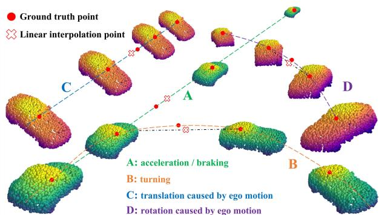
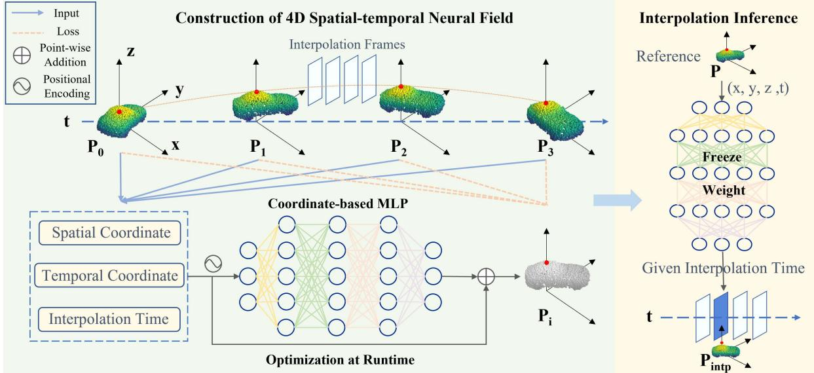
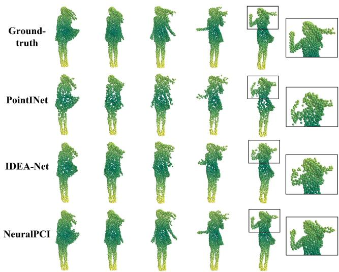
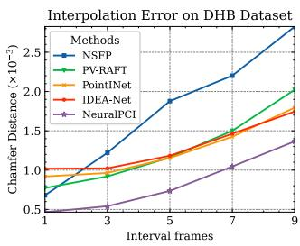
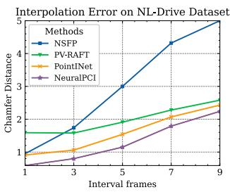
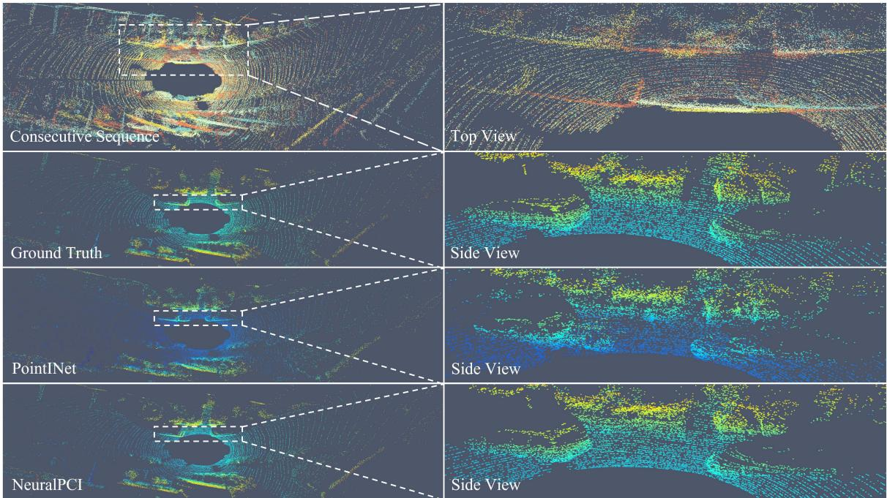
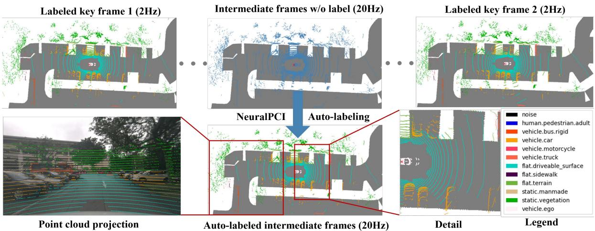
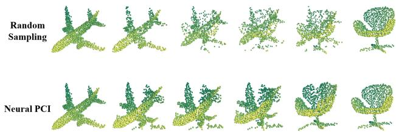

# NeuralPCI: Spatio-temporal Neural Field for 3D Point Cloud Multi-frame Non-linear Interpolation

Zehan Zheng∗, Danni Wu∗, Ruisi Lu, Fan Lu, Guang Chen†, Changjun Jiang Tongji University

{zhengzehan, woodannie, lrs910, lufan, guangchen, cjjiang}@tongji.edu.cn

## Abstract

In recent years, there has been a significant increase in focus on the interpolation task of computer vision. Despite the tremendous advancement of video interpolation, point cloud interpolation remains insufficiently explored. Meanwhile, the existence of numerous nonlinear large motions in real-world scenarios makes the point cloud interpolation task more challenging. In light of these issues, we present NeuralPCI: an end-to-end 4D spatio-temporal Neuralfield for 3D Point Cloud Interpolation, which implicitly integrates multi-frame information to handle nonlinear large motions for both indoor and outdoor scenarios. Furthermore, we construct a new multi-frame point cloud interpolation dataset called NL-Drive for large nonlinear motions in autonomous driving scenes to better demonstrate the superiority of our method. Ultimately, NeuralPCI achieves state-of-the-art performance on both DHB (Dynamic Human Bodies) and NL-Drive datasets. Beyond the interpolation task, our method can be naturally extended to point cloud extrapolation, morphing, and auto-labeling, which indicates its substantial potential in other domains. Codes are available at https://github.com/ispc-lab/NeuralPCI.

## 1. Introduction

In the field of computer vision, sequential point clouds are frequently utilized in many applications, such as VR/AR techniques [11, 38, 49] and autonomous driving [4, 32, 46]. The relatively low frequency of LiDAR compared to other sensors, i.e., 10–20 Hz, impedes exploration for high temporal resolution point clouds [47]. Therefore, interpolation tasks for point cloud sequences, which have not been substantially investigated, are receiving increasing attention.

With the similar goal of obtaining a smooth sequence with high temporal resolution, we can draw inspiration from the video frame interpolation (VFI) task. Several VFI methods [6,8,20,35,45,48] concentrate on nonlinear movements in the real world. They take multiple frames as input and generate explicit multi-frame fusion results based on flow estimation [6, 8, 20, 45, 48] or transformer [35]. Nonetheless, due to the unique structure of point clouds [31], it is non-trivial to extend VFI methods to the 3D domain.

  
Figure 1. Common cases of nonlinear motions in autonomous driving scenarios. Spatially uniform linear interpolation ( ) using the middle two frames of the point cloud differs significantly from the actual situation ( ), so it is necessary to take multiple point clouds into consideration for nonlinear interpolation.

Some early works [18,19] rely on stereo images to generate pseudo-LiDAR point cloud interpolation. For pure point cloud input, previous methods [22,47] take two consecutive frames as input and output the point cloud at a given intermediate moment. However, with limited two input frames, these approaches can only produce linear interpolation results [22], or perform nonlinear compensation by fusing input frames in the feature dimension linearly [47], which is inherently a data-driven approach to learning the datasetspecified distribution of nonlinear motions rather than an actual nonlinear interpolation. Only when the frame rate of the input point cloud sequence is high enough or the object motion is small enough, can the two adjacent point clouds satisfy the linear motion assumption. Nonetheless, there are numerous nonlinear motions in real-world cases. For instance, as illustrated in Fig. 1, the result of linear interpolation between two adjacent point cloud frames has a large deviation from the actual situation. A point cloud sequence rather than just two point cloud frames allows us to view further into the past and future. Neighboring multiple point clouds contain additional spatial-temporal cues, namely different perspectives, complementary geometry, and implicit high-order motion information. Therefore, it is time to rethink the point cloud interpolation task with an expanded design space, which is an open challenge yet.

Methods that explicitly fuse multiple point cloud frames generally just approximate the motion model over time, which actually simplifies real-world complex motion. The neural field provides a more elegant way to parameterize the continuous point cloud sequence implicitly. Inspired by NeRF [25] whose view synthesis of images is essentially an interpolation, we propose NeuralPCI, a neural field to exploit the spatial and temporal information of multi-frame point clouds. We build a 4D neural spatio-temporal field, which takes sequential 3D point clouds and the independent interpolation time as input, and predicts the in-between or future point cloud at the given time. Moreover, NeuralPCI is optimized on runtime in a self-supervised manner, without relying on costly ground truths, which makes it free from the out-of-the-distribution generalization problem. Our method can be flexibly applied to segmentation auto-labeling and morphing. Besides, we newly construct a challenging multi-frame point cloud interpolation dataset called NL-Drive from public autonomous driving datasets. Finally, we achieve state-of-the-art performance on indoor DHB dataset and outdoor NL-Drive dataset.

Our main contributions are summarized as follows:

• We propose a novel multi-frame point cloud interpolation algorithm to deal with the nonlinear complex motion in real-world indoor and outdoor scenarios.

• We introduce a 4D spatio-temporal neural field to integrate motion information implicitly over space and time to generate the in-between point cloud frames at the arbitrary given time.

• A flexible unified framework to conduct both the interpolation and extrapolation, facilitating several applications as well.

## 2. Related Work

Video Frame Interpolation. Most VFI approaches are based on optical flow estimation, focusing on the motion cues between two consecutive input frames. These methods warp source frames with the aid of the optical flow to generate the intermediate frame [1, 13, 26, 33]. In order to deal with complex motions, some works exploit nonlinear information by expanding the design domain to multiple consecutive frames [6, 8, 20, 35, 45]. QVI [45] approximates the flow-based velocity and acceleration of the quadratic motion model explicitly. Following QVI, EQVI [20] improves the training strategy. Recently, Dutta et al. [8] utilizes space-time convolution to adaptively switch motion models with discontinuous motions. These works inspire us to design a point cloud interpolation network with multiple input frames. However, it is still challenging to extend these methods to the unordered and unstructured point cloud.

Point Cloud Interpolation. Existing point cloud interpolation methods try to find point-to-point correspondences between two point cloud reference frames. An intuitive way is to utilize scene flow, the extension of optical flow in the 3D domain. PointINet [22] warps two input frames with bi-directional flows to the intermediate frame, then samples the two warped results adaptively and fuses them with attentive weights. This approach is performed under the linear motion assumption and relies heavily on the accuracy of the scene flow backbone. IDEA-Net [47] proposes an alternative method to solve the correlation between two input frames by learning a one-to-one alignment matrix and refining linear interpolation results with a trajectory compensation module. However, the one-to-one correspondence assumption limits its application for large-scale outdoor point cloud datasets. Moreover, the higher-order motion information in the temporal domain is overlooked [8] when taking two frames as input. Therefore, there remain challenges to capturing and modeling the complex nonlinear motion in the real world. To address this issue, we propose a novel neural field that takes advantage of the more comprehensive spatio-temporal information of multiple point cloud frames.

Neural Implicit Representation. Distinct from the common paradigm of learning-based methods, neural fields are fitted to a single degraded sample rather than a large dataset of samples. The neural field can be seen as a parameterization of diverse input types, such as 2D images [5, 14], 3D shapes [24, 27], etc. Since NeRF [25] presents a novel neural radiance field, which encodes a scene with spatial location and view direction as input and outputs volume rendering, several dynamic scene synthesis studies [7, 10, 16, 17, 28, 30, 36, 43] have been proposed to exploit the representation ability of neural radiance fields for dynamic scenes. Based on the linear motion assumption, Li et al. [17] proposes a time-variant continuous neural representation for space-time view synthesis. NSFP [16] presents a neural prior to regularize scene flow implicitly. Following NSFP, Wang et al. [37] introduce a neural trajectory prior to representing the trajectories as a vector field. Coordinate-based networks show great potential for encoding a continuous input domain over arbitrary dimensions at an arbitrary resolution. Our work utilizes and exploits the ability of the coordinate-based network to represent continuous spatio-temporal motions of dynamic nonlinear scenes.

## 3. Methodology

In this section, we propose a novel end-to-end 4D spatio-temporal neural field for 3D point cloud interpolation named NeuralPCI. Firstly, we state the problem of multi-frame point cloud interpolation. Sec. 3.1 then provides an overview of NeuralPCI’s architecture and design philosophy. Following this, we explain the details of how to construct the 4D spatio-temporal neural field and integrate neighboring multi-frame nonlinear information of point clouds in Secs. 3.2 and 3.3. Finally, in Sec. 3.4, we further elaborate on the self-supervised optimization manner of the whole neural field.

  
Figure 2. Overview of our proposed NeuralPCI. The 4D neural field is constructed by encoding the spatio-temporal coordinate of the multi-frame input point clouds via a coordinate-based multi-layer perceptron network. In the inference stage after self-supervised optimization, NeuralPCI receives a reference point cloud and an arbitrary interpolation frame moment as input to generate the point cloud of the associated spatio-temporal location.

Problem Formulation. Let $P \in \mathbb { R } ^ { N \times 3 }$ be one frame of a dynamic point cloud sequence, with N sampled points at the time $t \in \mathbb { R }$ . Given a low temporal resolution sequence of M frames of point clouds ${ \cal S } = \{ P _ { 0 } , P _ { 1 } , . . . , P _ { M - 1 } \}$ with their corresponding timestamps $T = \{ t _ { 0 } , t _ { 1 } , . . . , t _ { M - 1 } \}$ , the goal of NeuralPCI is to predict the intermediate point cloud frame $P _ { i }$ at an arbitrary given time $t _ { i }$ for interpolation. Interpolating $n \in \mathbb { Z } ^ { + }$ frames of point clouds at equal intervals between every two consecutive frames yields a sequence of point clouds with $n + 1$ times higher temporal resolution.

For the multi-frame point cloud interpolation task, we define the input as every four consecutive point cloud frames in the sequence $S$ and assume that these frames are equally time-spaced for convenience. The output is the temporally uniform interpolation result of n point cloud frames between the middle two frames. Then, sliding the window of multi-frame inputs traverses the entire sequence.

## 3.1. NeuralPCI Overview

Mildenhall et al. [25] build the neural radiance field by inputting a series of 2D images with different viewpoints, and then generate the unknown image under a new viewpoint using neural volume rendering. Although the huge gap between images and point clouds makes it non-trivial to apply the neural field technique to the point cloud interpolation task, we still want to find a way to address the nonlinear interpolation problem of multi-frame point clouds under a similar design philosophy. That is, encoding a sequence of 3D point clouds at different moments to construct a 4D neural spatio-temporal field and then feeding an arbitrary interpolation frame moment into the network to generate the point cloud of the associated spatio-temporal location.

Consequently, we propose NeuralPCI whose overall structure is depicted in Fig. 2. It can be divided into three main sections for elaboration. In the optimization stage, the 4D neural field is constructed by encoding the spatiotemporal coordinate of the multi-frame input point cloud via a coordinate-based Multi-Layer Perceptron (MLP) network. For each point cloud frame of the input, the interpolation time is set to the corresponding timestamps of four input frames in order to provide the network with the ability to generate the point cloud of the respective spatio-temporal position, and then optimize the neural field through selfsupervised losses. In the inference stage, we run forward the neural field with the spatio-temporal coordinate of a reference point cloud and the moment of the interpolation frame as input to obtain the corresponding in-between point cloud.

## 3.2. 4D Spatio-temporal Neural Field

Following the statement in [44], a field is a quantity defined for all spatial and/or temporal coordinates, and a neural field is a field that is parameterized fully or in part by a neural network. Here, we use a coordinate-based MLP network to represent the scenes, which takes as input the 3D spatial coordinate $\mathbf { x } \in \mathbb { R } ^ { 3 }$ and the 1D temporal coordinate $t \in \mathbb R$ , and produces as output the motions $\Delta \mathbf { x } \in \mathbb { R } ^ { 3 }$ The MLP is parameterized by Θ and it can be viewed as a mapping from the coordinate field to the motion field.

Furthermore, we leverage an independent input, the interpolation frame time $t _ { i n t p } \in \mathbb { R }$ , to provide MLP with time cues and regulate the scene motion output at the interpolation moment relative to the original input spatio-temporal coordinates. Then, we conduct the point-wise addition of the interpolation frame motion and the input point cloud to generate the final output of the neural field, which is the 3D point cloud coordinate at the interpolation frame moment $\mathbf { x } _ { i n t p } \in \mathbb { R } ^ { 3 }$ . Formally, the neural field Φ is defined as:

$$
\Phi \left( \mathbf { z } ; \Theta \right) : \mathbf { x } _ { i n t p } = \mathbf { x } + F _ { \Theta } \left( \mathbf { z } \right)\tag{1}
$$

where z represents the spatial-temporal coordinate input of point clouds, and $F _ { \Theta }$ is defined as:

$$
F _ { \Theta } : \mathbb { R } ^ { 5 } \to \mathbb { R } ^ { 3 } , \quad \Delta \mathbf { x } = F _ { \Theta } \left( \mathbf { z } \right) = F _ { \Theta } \left( \mathbf { x } , t , t _ { i n t p } \right)\tag{2}
$$

In such a manner, we implicitly construct a 4D, i.e., (x, y, z, t) in physical, spatio-temporal neural field to represent the entire scenarios of sequential point clouds. Eventually, we are able to utilize the continuity of the dedicated neural field to smoothly interpolate the point cloud at an arbitrary in-between moment.

## 3.3. Multi-frame Nonlinear Integration

In order to integrate multi-frame information, an intuitive way is utilizing the existing pair-frame point cloud interpolation algorithm for every two frames among the multiframe point cloud input and fuse the predicted results. We adopt it as a baseline model (see Supplementary Material), and it turns out that directly fusing multiple intermediate predictions by random sampling leads to worse results.

Besides, an alternative way is to explicitly model the nonlinear kinematic equations taking advantage of multiframe point clouds. We follow the nonlinear video interpolation algorithm [45] and extend it to the 3D domain to formulate the high order equation of point clouds. Nonetheless, the explicit modeling approach is also ineffective in real-world scenarios with complex motions (see Supplementary Material). Consequently, we integrate multi-frame point clouds more effectively using spatio-temporal neural fields.

Our proposed NeuralPCI does not impose a restriction on the frame number of the input point clouds, and thus can be naturally expanded to multi-frame point clouds. When the number of multi-frame inputs is $^ { 4 , }$ for example, the input set containing a point cloud sequence and corresponding timestamps are $S ~ = ~ \{ P _ { 0 } , P _ { 1 } , P _ { 2 } , P _ { 3 } \}$ and $T ~ = ~ \{ t _ { 0 } , t _ { 1 } , t _ { 2 } , t _ { 3 } \}$ , respectively. As shown in Fig. $^ { 2 , }$ the neural field receives the point cloud $P _ { 0 }$ and time $t _ { 0 }$ as input, and the time step for interpolation $t _ { i n t p }$ is adjusted to one of $\{ t _ { 0 } , t _ { 1 } , t _ { 2 } , t _ { 3 } \}$ to yield the predicted point clouds $\{ \hat { P } _ { 0 } ^ { t _ { 0 } } , \hat { P } _ { 0 } ^ { t _ { 1 } } , \hat { P } _ { 0 } ^ { t _ { 2 } } , \hat { P } _ { 0 } ^ { t _ { 3 } } \}$ The loss function (described in Sec. 3.4) is then calculated between the prediction $\hat { P } _ { i } ^ { t _ { j } }$ and each of the four input frames of point clouds $P _ { j } .$ The entire point cloud sequence is traversed through the same operation, with the spatio-temporal neural field endto-end optimized meanwhile.

Each input frame serves as a constraint to supervise optimization, allowing us to incorporate the information from multiple frames of point clouds more elegantly. Owing to the continuity, smoothness, and excellent fitting ability of MLP, the derivative of the final spatio-temporal neural field function with respect to the interpolated frame time $t _ { i n t p }$ is an implicit higher-order continuous function, which can better handle complex motion scenes and can yield smooth interpolation outputs.

## 3.4. Self-supervised Optimization

NeuralPCI optimizes the weights of the neural field in a self-supervised manner. As illustrated in Fig. 2, the interpolation time is adjusted as each timestamp of inputs to generate predictions for all input point cloud frames, and the neural field back-propagates the gradients to update the samplespecified parameters by minimizing the following distribution loss between the input and predicted point clouds.

CD Loss. Chamfer Distance (CD) [9] measures the distribution difference between two point clouds. We adopt CD as the main term in the loss function, which can be expressed as the following equation:

$$
\mathcal { L } _ { C D } = \frac { 1 } { N } \sum _ { \hat { p } _ { i } \in \hat { \cal P } } \operatorname* { m i n } _ { p _ { i } \in \cal P } \left\| \hat { p } _ { i } - p _ { i } \right\| _ { 2 } ^ { 2 } + \frac { 1 } { N } \sum _ { p _ { i } \in \cal P } \operatorname* { m i n } _ { \hat { p } _ { i } \in \hat { \cal P } } \left\| p _ { i } - \hat { p } _ { i } \right\| _ { 2 } ^ { 2 }\tag{3}
$$

where $P$ and $\hat { P }$ are the input and predicted point cloud frames. $p _ { i }$ and $\hat { p } _ { i }$ represent the points in the respective point clouds. $\lVert . \rVert _ { 2 }$ denotes the $L _ { 2 }$ norm of the spatial coordinate.

EMD Loss. Earth Mover’s Distance (EMD) [34] calculates the corresponding points by solving the optimal transmission matrix of the two point clouds. We minimize the EMD loss to encourage the two point clouds to have the same density distribution, calculated as:

$$
\mathcal { L } _ { E M D } = \operatorname* { m i n } _ { \phi : \hat { P } \to P } \frac { 1 } { N } \sum _ { \hat { p } \in \hat { P } } \| \hat { p } - \phi \left( \hat { p } \right) \| _ { 2 } ^ { 2 }\tag{4}
$$

where $\phi : { \hat { P } }  P$ denotes a bijection from $\hat { P }$ to $P$ . Due to its high computational complexity, we only use it in the loss function for sparse point clouds.

Smoothness Loss. To better regulate the estimated motion, we introduce the smoothness loss, which facilitates the interpolation of point clouds for local rigid motions and is utilized in autonomous driving scenarios.

$$
\mathcal { L } _ { S } = \sum _ { p _ { i } \in P } \frac { 1 } { | N \left( p _ { i } \right) | } \sum _ { p _ { j } \in N \left( p _ { i } \right) } \| \Delta \mathbf { x } _ { j } - \Delta \mathbf { x } _ { i } \| _ { 2 } ^ { 2 }\tag{5}
$$

where $N ( p _ { i } )$ stands for the nearest neighbors of the $i ^ { t h }$ point $p _ { i }$ and $\left. \cdot \right.$ denotes the number of points. And $\Delta { \bf x } _ { i }$ denotes the scene flow estimation from point cloud P to $\hat { P }$ (defined in Eq. (2)) of the $i ^ { t h }$ point $p _ { i }$

Total Loss Function. We utilize the above three terms of loss and balance them with separately given weights (defined as $\alpha , \beta , \gamma$ in Eq. (6)) to obtain the total loss. We define multiple input frames and their corresponding timestamps as the input set. Then, we traverse the input set by assigning each point cloud of input frames as the reference and generate predictions of all input frames at their corresponding time steps. The overall loss is computed by summing the losses of every pair of point clouds as Eq. (7).

$$
\Psi = \alpha \mathcal { L } _ { C D } + \beta \mathcal { L } _ { E M D } + \gamma \mathcal { L } _ { S }\tag{6}
$$

$$
\mathcal { L } = \sum _ { P _ { i } \in S } \sum _ { t _ { j } \in T } \Psi \left( P _ { t _ { j } } , \hat { P } _ { i } ^ { t _ { j } } \right)\tag{7}
$$

where $S$ and $T$ are the multiple input frames and their corresponding timestamps. $P _ { t _ { j } }$ denotes the input frame at time $t _ { j }$ and $\hat { P } _ { i } ^ { t _ { j } }$ denotes the neural field prediction when $P _ { i }$ is the reference frame and the interpolation time is $t _ { j }$

## 4. Experiments

## 4.1. Experimental Setup

Datasets. We evaluate NeuralPCI in both indoor and outdoor datasets. Indoor Dynamic Human Bodies dataset (DHB) [47] contains point cloud sequences for the nonrigid deformable 3D human motion with sampled 1024 points. We construct a challenging multi-frame interpolation dataset named Nonliner-Drive (NL-Drive) dataset. Based on the principle of hard-sample selection and the diversity of scenarios, NL-Drive dataset contains point cloud sequences with large nonlinear movements from three public large-scale autonomous driving datasets: KITTI [12], Argoverse [3] and Nuscenes [2]. More details of NL-Drive dataset are provided in Supplementary Material.

Baselines. To demonstrate the performance of NeuralPCI, we compare our method with previous SOTA approaches, namely IDEA-Net [47] and PointINet [22] for the interpolation task and MoNet [21] for the extrapolation task. We reproduced the results on DHB Dataset of IDEA-Net and PointINet using official implementation. Moreover, we train PointINet and MoNet on NL-Drive dataset according to the official training setting (Since the training code of IDEA-Net has not been released yet, we do not report its results here). In addition, we utilize state-of-the-art scene flow estimation methods, i.e., neural-based NSFP [16] and recurrent-based PV-RAFT [39], with linear interpolation to produce corresponding results on both DHB and NL-Drive datasets for comprehensive comparison. Remarkably, we evaluate all the optimization-based methods directly on the test set without using the training set.

Metrics. We adopt CD and EMD as quantitative evaluation metrics following [21, 22, 47], which are described in Eqs. (3) and (4), respectively.

## 4.2. Implementation Details

We implement NeuralPCI with PyTorch [29]. We define our NeuralPCI as a coordinate-based 8-layer MLP architecture with 512 units per layer and adopt LeakyReLU as the activation function. The network weights are randomly initialized with the Adam [15] optimizer (the lr is 0.001). For each sample, the maximum optimization step is limited to 1000 iterations. The spatio-temporal coordinates of the point clouds are position-encoded by a sinusoidal function and fed into the MLP, while the interpolation time is inserted into the penultimate hidden layer to control the final output. All experiments were conducted on a single NVIDIA GeForce RTX 3090 GPU. For more implementation details, please refer to Supplementary Material.

## 4.3. Evaluation of Point Cloud Interpolation

Results on DHB dataset. The quantitative comparison on DHB dataset is displayed in Table 1, where our NeuralPCI outperforms other baseline approaches by a large margin. In particular, our overall CD is about half that of other baselines, and our overall EMD is 40% lower than the suboptimal PV-RAFT [39]. As can be seen, IDEA-Net [47] does not perform well in all scenarios, but in contrast, our method achieves the best results in every single scene, especially in the Squat scenario. This demonstrates the flexibility and adaptability of the neural field in various indoor scenarios. Furthermore, Fig. 3 clearly exhibits the outcomes of qualitative experiments. The interpolation results of PointINet [22] and IDEA-Net contain several outlier noise points and lack lots of detailed information in local areas, such as hair, hands, and skirt hems. Instead, our method benefits from the higher-order implicit function of the neural field, which better handles these complex motions.

Results on NL-Drive dataset. Table 2 shows results on NL-Drive dataset, where NeuralPCI achieves the best results on most frames and overall metrics. For instance, our method reaches comparable EMD error in the intermediate frames and significantly reduces the CD error, eventually outperforming SOTA by 24.5% and 4% in the overall results of CD and EMD metrics, respectively. In the qualitative experiments, we show in detail the nonlinear motion in the outdoor autonomous driving scenario as well as the interpolation frame comparison results in Fig. 5. This indicates that NeuralPCI is scalable to large dense point clouds. As noted in the local zoomed-in view, the vehicle edges are clearer and sharper in the results of our method, while they are blurrier and noisier in the results of PointINet [22].

Table 1. Quantitative comparison $\left( \times 1 0 ^ { - 3 } \right)$ with other open-sourced methods on DHB-Dataset [47]. Baseline methods include IDEA-Net [47], PointINet [22] and the results of linear interpolation of scene flow estimated by NSFP [17] and PV-RAFT [39].
<table><tr><td rowspan="2">Methods</td><td colspan="2">Longdress</td><td colspan="2">Loot</td><td colspan="2">Red&amp;Black</td><td colspan="2">Soldier</td><td colspan="2">Squat</td><td colspan="2">Swing</td><td colspan="2">Overall</td></tr><tr><td>CD</td><td>EMD</td><td>CD</td><td>EMD</td><td>CD</td><td>EMD</td><td>CD</td><td>EMD</td><td>CD</td><td>EMD</td><td>CD</td><td>EMD</td><td>CD↓</td><td>EMD↓</td></tr><tr><td>IDEA-Net</td><td>0.89</td><td>6.01</td><td>0.86</td><td>8.62</td><td>0.94</td><td>10.34</td><td>1.63</td><td>30.07</td><td>0.62</td><td>6.68</td><td>1.24</td><td>6.93</td><td>1.02</td><td>12.03</td></tr><tr><td>PointINet</td><td>0.98</td><td>10.87</td><td>0.85</td><td>12.10</td><td>0.87</td><td>10.68</td><td>0.97</td><td>12.39</td><td>0.90</td><td>13.99</td><td>1.45</td><td>14.81</td><td>0.96</td><td>12.25</td></tr><tr><td>NSFP</td><td>1.04</td><td>7.45</td><td>0.81</td><td>7.13</td><td>0.97</td><td>8.14</td><td>0.68</td><td>5.25</td><td>1.14</td><td>7.97</td><td>3.09</td><td>11.39</td><td>1.22</td><td>7.81</td></tr><tr><td>PV-RAFT</td><td>1.03</td><td>6.88</td><td>0.82</td><td>5.99</td><td>0.94</td><td>7.03</td><td>0.91</td><td>5.31</td><td>0.57</td><td>2.81</td><td>1.42</td><td>10.54</td><td>0.92</td><td>6.14</td></tr><tr><td>NeuralPCI</td><td>0.70</td><td>4.36</td><td>0.61</td><td>4.76</td><td>0.67</td><td>4.79</td><td>0.59</td><td>4.63</td><td>0.03</td><td>0.02</td><td>0.53</td><td>2.22</td><td>0.54</td><td>3.68</td></tr></table>

Table 2. Quantitative comparison with other open-sourced methods on NL-Drive Dataset. Type indicates whether the interpolation results are based on forward, backward, bidirectional flow, or neural field. Frame-1, Frame-2 and Frame-3 refer to the three interpolation frames located at equal intervals between the two intermediate input frames.
<table><tr><td rowspan="2">Methods</td><td rowspan="2">Type</td><td colspan="2">Frame-1</td><td colspan="2">Frame-2</td><td colspan="2">Frame-3</td><td colspan="2">Average</td></tr><tr><td>CD</td><td>EMD</td><td>CD</td><td>EMD</td><td>CD</td><td>EMD</td><td>CD↓</td><td>EMD↓</td></tr><tr><td rowspan="2">NSFP</td><td>forward flow</td><td>0.94</td><td>95.18</td><td>1.75</td><td>132.30</td><td>2.55</td><td>168.91</td><td>1.75</td><td>132.13</td></tr><tr><td>backward flow</td><td>2.53</td><td>168.75</td><td>1.74</td><td>132.19</td><td>0.95</td><td>95.23</td><td>1.74</td><td>132.05</td></tr><tr><td rowspan="2">PV-RAFT</td><td>forward flow</td><td>1.36</td><td>104.57</td><td>1.92</td><td>146.87</td><td>1.63</td><td>169.82</td><td>1.64</td><td>140.42</td></tr><tr><td>backward flow</td><td>1.58</td><td>173.18</td><td>1.85</td><td>145.48</td><td>1.30</td><td>102.71</td><td>1.58</td><td>140.46</td></tr><tr><td>PointINet</td><td>bi-directional flow</td><td>0.93</td><td>97.48</td><td>1.24</td><td>110.22</td><td>1.01</td><td>95.65</td><td>1.06</td><td>101.12</td></tr><tr><td>NeuralPCI</td><td>neural field</td><td>0.72</td><td>89.03</td><td>0.94</td><td>113.45</td><td>0.74</td><td>88.61</td><td>0.80</td><td>97.03</td></tr></table>

  
Figure 3. Qualitative results on DHB dataset. Each column represents one interpolation frame result in the point cloud sequence, where our method is more consistent with the ground truth and preserves local details better than previous SOTA methods.

Additional Evaluation. To evaluate the capability of NeuralPCI under large motions, we conduct additional experiments to observe the robustness of each method with increasing time interval between input frames. As illustrated in Fig. 4, the results on both datasets show that the performance of our method still lies at the optimum under large motion interpolation.

  
Figure 4. Quantitative experiments at different intervals. The CD error increases as the input frame interval grows. Our method is always optimal at different time intervals and has good robustness under long-distance motion.

## 4.4. Evaluation of Point Cloud Extrapolation

As a parameterization of continuous point clouds over space and time, NeuralPCI is generalizable to predict the near future frame by adjusting the timestamp, making it more flexible than existing methods. We conduct extrapolation experiments on NL-Drive dataset with the same input settings as the interpolation task, while the outputs are four consecutive point cloud frames in the future. According to recent works about point cloud prediction [21, 23, 40, 41], we adopt the state-of-the-art method MoNet [21] and also the linear extrapolation results based on scene flow from PV-RAFT [39] and NSFP [16] as baseline methods.

A quantitative comparison with baseline methods is shown in Table 3. Flow-based methods suffer a sharp growth in error when the time for the future frame increases.

  
Figure 5. Qualitative results on NL-Drive dataset. We transform four frames of the input point cloud to the same coordinate system, and the overall motion of the point cloud sequence is depicted in the first row. The following three rows compare the interpolation results, demonstrating that our approach is more accurate and robust, whereas interpolation results of PointINet [22] are noisier.

Table 3. Quantitative comparison with other baseline methods for point cloud extrapolation on NL-Drive dataset. Here we adopt MoNet [21] and linear extrapolation results based on scene flow from PV-RAFT [39] and NSFP [16]. Frames 1-4 refer to the consecutive extrapolation frames after the last input frame.
<table><tr><td rowspan="2">Methods</td><td colspan="2">Frame 1</td><td colspan="2">Frame 2</td><td colspan="2">Frame 3</td><td colspan="2">Frame 4</td></tr><tr><td>CD</td><td>EMD</td><td>CD</td><td>EMD</td><td>CD</td><td>EMD</td><td>CD↓</td><td>EMD↓</td></tr><tr><td>NSFP</td><td>4.70</td><td>209.96</td><td>5.45</td><td>233.33</td><td>6.24</td><td>254.72</td><td>6.61</td><td>268.44</td></tr><tr><td>PV-RAFT</td><td>2.05</td><td>206.93</td><td>3.90</td><td>248.94</td><td>6.55</td><td>293.27</td><td>10.02</td><td>377.25</td></tr><tr><td>MoNet</td><td>0.66</td><td>81.90</td><td>0.96</td><td>108.41</td><td>1.28</td><td>135.96</td><td>1.37</td><td>159.20</td></tr><tr><td>NeuralPCI</td><td>0.78</td><td>84.26</td><td>1.20</td><td>108.43</td><td>1.61</td><td>135.42</td><td>1.87</td><td>156.64</td></tr></table>

Our method surpasses MoNet in terms of EMD error in the last two frames and achieves suboptimal results in the other remaining frames. MoNet’s RNN module predicts each frame recurrently, while our neural field lacks constraints on the future direction. Despite that, NeuralPCI still achieves comparable results, indicating its flexibility to accomplish both inter-/extra-polation in a unified framework.

## 4.5. Ablation Study

Contributions of key modules in NeuralPCI, namely the multi-frame integration, NN-intp, EMD loss, smoothness loss, and network enhancement are shown in Table 4.

Multi-frame and NN-intp. We begin with a simple neural field with pair-frame input and optimized using only CD loss. With the multi-frame integration (ID 2&7), NeuralPCI gains 9.2% and 3.1% reductions in CD and EMD error on DHB dataset, and 2.3% and 2.0% on NL-Drive dataset. By adopting the nearest neighbor in the time domain as the reference frame (ID 3&8), the long-term error growth is effectively reduced, and another EMD improvement of 15.7% and 6.5% is achieved on the respective datasets.

Table 4. Quantitative results of ablation studies on DHB dataset [47] $( \times 1 0 ^ { - 3 } )$ and NL-Drive dataset. Methods A∼F denote CD loss, multi-frame integration, NN-intp, EMD loss, smoothness loss and network enhancement, respectively.
<table><tr><td rowspan="2">Datasets</td><td rowspan="2">ID</td><td colspan="5">Methods</td><td colspan="3">Metrics</td></tr><tr><td>A</td><td>B</td><td>C</td><td>D</td><td>E</td><td>F</td><td>CD↓</td><td>EMD↓</td></tr><tr><td rowspan="5">DHB</td><td>1</td><td>√</td><td></td><td></td><td></td><td></td><td></td><td>0.65</td><td>5.24</td></tr><tr><td>2</td><td>√</td><td>√</td><td></td><td></td><td></td><td></td><td>0.59</td><td>5.08</td></tr><tr><td>3</td><td>√</td><td>√</td><td>√</td><td></td><td></td><td></td><td>0.57</td><td>4.28</td></tr><tr><td>4</td><td>√</td><td>√</td><td>√</td><td>√</td><td></td><td></td><td>0.56</td><td>3.84</td></tr><tr><td>5</td><td>√</td><td>√</td><td>√</td><td>√</td><td></td><td>√</td><td>0.54</td><td>3.68</td></tr><tr><td rowspan="5">NL-Drive</td><td>6</td><td>√</td><td></td><td></td><td></td><td></td><td></td><td>0.86</td><td>114.31</td></tr><tr><td>7</td><td>√</td><td>√</td><td></td><td></td><td></td><td></td><td>0.84</td><td>112.03</td></tr><tr><td>8</td><td>√</td><td>√</td><td>√</td><td></td><td></td><td></td><td>0.81</td><td>104.71</td></tr><tr><td>9</td><td>√</td><td>√</td><td>√</td><td></td><td>√</td><td></td><td>0.82</td><td>99.25</td></tr><tr><td>10</td><td>√</td><td>5</td><td>√</td><td></td><td>√</td><td>√</td><td>0.80</td><td>97.03</td></tr></table>

EMD and smoothness loss. To prevent the network from overfitting on a single CD metric, we introduce additional loss terms to regulate the output. The extra EMD loss and smoothness loss help NeuralPCI achieve a significant reduction in EMD metric error, namely 10.3% (ID 4) on DHB dataset and 5.2% (ID 9) on NL-Drive dataset.

  
Figure 6. Visual results of NeuralPCI based auto-labeling. We use NeuralPCI to take the labeled keyframe point clouds as input, output the interpolation results, and automatically assign labels to the intermediate frames. The second row shows the results of the auto-labeling, which intuitively achieves high labeling accuracy.

  
Figure 7. The process of point clouds morphing between the airplane and the chair samples in ModelNet40 [42] using NeuralPCI.

Network enhancement. The impact of network structure is future investigated. Previously, NeuralPCI utilized an 8-layer 256-hidden-unit MLP with a ReLU activation function and received the direct spatio-temporal coordinate as input. Here, we introduce a sinusoidal function-based position encoding, switch to the LeakyReLU activation function, and increase the width of the MLP. In the end, the network enhancement brings another improvement of 3.6% and 4.2% (ID 5) on DHB dataset and 2.4% and 2.2% (ID 10) on NL-Drive dataset.

## 4.6. Applications

Auto-labeling. The annotated point clouds with perpoint segmentation GT in Nuscenes [2] are at 2 Hz, only one tenth of the dataset. Even so, the labeling workload was laborious and enormous with a total of 1,400,000,000 points. Here, we explore the potential of NeuralPCI to generate keyframe-based interpolation results and assign point-wise labels to unannotated intermediate frames, which shows remarkable capability as depicted in Fig. 6. We use four keyframes as input to predict intermediate point clouds, so the predicted outputs could inherit the corresponding keyframe labels in order. Then the kNN algorithm is applied between the unlabeled intermediate frame and the labeled predicted frame to annotate each ground-truth point.

Point cloud morphing. In addition to the conventional meaning of nonlinear motion under indoor and outdoor scenes, the transformation relationship across point clouds with totally different topological shapes is also needed. This transformation, i.e., point cloud morphing, is of interest for computer graphics simulation and data enhancement. We deploy NeuralPCI to output interpolation point clouds between two different classes of object point clouds under the ModelNet40 [42] dataset to establish the process of point cloud morphing. As illustrated in Fig. 7, our method enables a more natural and smooth transformation between different shapes compared to random sampling.

## 5. Conclusion

In this paper, we redefine the input domain of the point cloud interpolation task as multiple consecutive frames instead of the two consecutive frames used in previous works, which increases the receptive field of the time domain. To achieve that, we presented NeuralPCI, a 4D spatio-temporal neural field for 3D point cloud interpolation that is able to implicitly integrate multi-frame information to handle nonlinear large motions. Our approach achieves state-of-the-art results in both indoor and outdoor datasets. Since neuralfield-based methods are optimized at runtime, the application of our method is limited in terms of real-time efficiency. Based on NeuralPCI, further development can be considered in the future by improving its real-time performance and generalization over unknown samples.

Acknowledgments This work is supported by Shanghai Municipal Science and Technology Major Project (No.2018SHZDZX01), ZJ Lab, and Shanghai Center for Brain Science and Brain-Inspired Technology, and the Shanghai Rising Star Program (No.21QC1400900) and Tongji-Westwell Autonomous Vehicle Joint Lab Project.

## References

[1] Wenbo Bao, Wei-Sheng Lai, Chao Ma, Xiaoyun Zhang, Zhiyong Gao, and Ming-Hsuan Yang. Depth-aware video frame interpolation. In Proceedings of the IEEE/CVF Conference on Computer Vision and Pattern Recognition, pages 3703–3712, 2019. 2

[2] Holger Caesar, Varun Bankiti, Alex H Lang, Sourabh Vora, Venice Erin Liong, Qiang Xu, Anush Krishnan, Yu Pan, Giancarlo Baldan, and Oscar Beijbom. nuscenes: A multimodal dataset for autonomous driving. In Proceedings of the IEEE/CVF conference on computer vision and pattern recognition, pages 11621–11631, 2020. 5, 8

[3] Ming-Fang Chang, John Lambert, Patsorn Sangkloy, Jagjeet Singh, Slawomir Bak, Andrew Hartnett, De Wang, Peter Carr, Simon Lucey, Deva Ramanan, et al. Argoverse: 3d tracking and forecasting with rich maps. In Proceedings of the IEEE/CVF Conference on Computer Vision and Pattern Recognition, pages 8748–8757, 2019. 5

[4] Xieyuanli Chen, Shijie Li, Benedikt Mersch, Louis Wiesmann, Jurgen Gall, Jens Behley, and Cyrill Stachniss. Mov-¨ ing object segmentation in 3d lidar data: A learning-based approach exploiting sequential data. IEEE Robotics and Automation Letters, 6(4):6529–6536, 2021. 1

[5] Zhiqin Chen. IM-NET: Learning implicit fields for generative shape modeling. PhD thesis, Applied Sciences: School of Computing Science, 2019. 2

[6] Zhixiang Chi, Rasoul Mohammadi Nasiri, Zheng Liu, Juwei Lu, Jin Tang, and Konstantinos N Plataniotis. All at once: Temporally adaptive multi-frame interpolation with advanced motion modeling. In European Conference on Computer Vision, pages 107–123. Springer, 2020. 1, 2

[7] Yilun Du, Yinan Zhang, Hong-Xing Yu, Joshua B Tenenbaum, and Jiajun Wu. Neural radiance flow for 4d view synthesis and video processing. In 2021 IEEE/CVF International Conference on Computer Vision (ICCV), pages 14304–14314. IEEE Computer Society, 2021. 2

[8] Saikat Dutta, Arulkumar Subramaniam, and Anurag Mittal. Non-linear motion estimation for video frame interpolation using space-time convolutions. In Proceedings of the IEEE/CVF Conference on Computer Vision and Pattern Recognition, pages 1726–1731, 2022. 1, 2

[9] Haoqiang Fan, Hao Su, and Leonidas J Guibas. A point set generation network for 3d object reconstruction from a single image. In Proceedings of the IEEE conference on computer vision and pattern recognition, pages 605–613, 2017. 4

[10] Chen Gao, Ayush Saraf, Johannes Kopf, and Jia-Bin Huang. Dynamic view synthesis from dynamic monocular video. In Proceedings of the IEEE/CVF International Conference on Computer Vision, pages 5712–5721, 2021. 2

[11] Daniel Garrido, Rui Rodrigues, A Augusto Sousa, Joao Jacob, and Daniel Castro Silva. Point cloud interaction and manipulation in virtual reality. In 2021 5th International Conference on Artificial Intelligence and Virtual Reality (AIVR), pages 15–20, 2021. 1

[12] Andreas Geiger, Philip Lenz, and Raquel Urtasun. Are we ready for autonomous driving? the kitti vision benchmark

suite. In 2012 IEEE conference on computer vision and pattern recognition, pages 3354–3361. IEEE, 2012. 5

[13] Huaizu Jiang, Deqing Sun, Varun Jampani, Ming-Hsuan Yang, Erik Learned-Miller, and Jan Kautz. Super slomo: High quality estimation of multiple intermediate frames for video interpolation. In Proceedings of the IEEE conference on computer vision and pattern recognition, pages 9000– 9008, 2018. 2

[14] Tero Karras, Miika Aittala, Samuli Laine, Erik Hark¨ onen,¨ Janne Hellsten, Jaakko Lehtinen, and Timo Aila. Alias-free generative adversarial networks. Advances in Neural Information Processing Systems, 34:852–863, 2021. 2

[15] Diederik P Kingma and Jimmy Ba. Adam: A method for stochastic optimization. arXiv preprint arXiv:1412.6980, 2014. 5

[16] Xueqian Li, Jhony Kaesemodel Pontes, and Simon Lucey. Neural scene flow prior. Advances in Neural Information Processing Systems, 34:7838–7851, 2021. 2, 5, 6, 7

[17] Zhengqi Li, Simon Niklaus, Noah Snavely, and Oliver Wang. Neural scene flow fields for space-time view synthesis of dynamic scenes. In Proceedings of the IEEE/CVF Conference on Computer Vision and Pattern Recognition, pages 6498– 6508, 2021. 2, 6

[18] Haojie Liu, Kang Liao, Chunyu Lin, Yao Zhao, and Yulan Guo. Pseudo-lidar point cloud interpolation based on 3d motion representation and spatial supervision. IEEE Transactions on Intelligent Transportation Systems, 23(7):6379– 6389, 2021. 1

[19] Haojie Liu, Kang Liao, Chunyu Lin, Yao Zhao, and Meiqin Liu. Plin: A network for pseudo-lidar point cloud interpolation. Sensors, 20(6):1573, 2020. 1

[20] Yihao Liu, Liangbin Xie, Li Siyao, Wenxiu Sun, Yu Qiao, and Chao Dong. Enhanced quadratic video interpolation. In European Conference on Computer Vision, pages 41–56. Springer, 2020. 1, 2

[21] Fan Lu, Guang Chen, Zhijun Li, Lijun Zhang, Yinlong Liu, Sanqing Qu, and Alois Knoll. Monet: Motion-based point cloud prediction network. IEEE Transactions on Intelligent Transportation Systems, 2021. 5, 6, 7

[22] Fan Lu, Guang Chen, Sanqing Qu, Zhijun Li, Yinlong Liu, and Alois Knoll. Pointinet: Point cloud frame interpolation network. In Proceedings of the AAAI Conference on Artificial Intelligence, volume 35, pages 2251–2259, 2021. 1, 2, 5, 6, 7

[23] Benedikt Mersch, Xieyuanli Chen, Jens Behley, and Cyrill Stachniss. Self-supervised point cloud prediction using 3d spatio-temporal convolutional networks. In Conference on Robot Learning, pages 1444–1454. PMLR, 2022. 6

[24] Lars Mescheder, Michael Oechsle, Michael Niemeyer, Sebastian Nowozin, and Andreas Geiger. Occupancy networks: Learning 3d reconstruction in function space. In Proceedings ofthe IEEE/CVF conference on computer vision and pattern recognition, pages 4460–4470, 2019. 2

[25] Ben Mildenhall, Pratul P Srinivasan, Matthew Tancik, Jonathan T Barron, Ravi Ramamoorthi, and Ren Ng. Nerf: Representing scenes as neural radiance fields for view synthesis. Communications ofthe ACM, 65(1):99–106, 2021. 2, 3

[26] Junheum Park, Keunsoo Ko, Chul Lee, and Chang-Su Kim. Bmbc: Bilateral motion estimation with bilateral cost volume for video interpolation. In European Conference on Computer Vision, pages 109–125. Springer, 2020. 2

[27] Jeong Joon Park, Peter Florence, Julian Straub, Richard Newcombe, and Steven Lovegrove. Deepsdf: Learning continuous signed distance functions for shape representation. In Proceedings ofthe IEEE/CVF conference on computer vision and pattern recognition, pages 165–174, 2019. 2

[28] Keunhong Park, Utkarsh Sinha, Jonathan T Barron, Sofien Bouaziz, Dan B Goldman, Steven M Seitz, and Ricardo Martin-Brualla. Nerfies: Deformable neural radiance fields. In Proceedings of the IEEE/CVF International Conference on Computer Vision, pages 5865–5874, 2021. 2

[29] Adam Paszke, Sam Gross, Francisco Massa, Adam Lerer, James Bradbury, Gregory Chanan, Trevor Killeen, Zeming Lin, Natalia Gimelshein, Luca Antiga, et al. Pytorch: An imperative style, high-performance deep learning library. Advances in neural information processing systems, 32, 2019. 5

[30] Albert Pumarola, Enric Corona, Gerard Pons-Moll, and Francesc Moreno-Noguer. D-nerf: Neural radiance fields for dynamic scenes. In Proceedings of the IEEE/CVF Conference on Computer Vision and Pattern Recognition, pages 10318–10327, 2021. 2

[31] Charles R Qi, Hao Su, Kaichun Mo, and Leonidas J Guibas. Pointnet: Deep learning on point sets for 3d classification and segmentation. In Proceedings of the IEEE conference on computer vision and pattern recognition, pages 652–660, 2017. 1

[32] Charles R Qi, Yin Zhou, Mahyar Najibi, Pei Sun, Khoa Vo, Boyang Deng, and Dragomir Anguelov. Offboard 3d object detection from point cloud sequences. In Proceedings of the IEEE/CVF Conference on Computer Vision and Pattern Recognition, pages 6134–6144, 2021. 1

[33] Fitsum A Reda, Deqing Sun, Aysegul Dundar, Mohammad Shoeybi, Guilin Liu, Kevin J Shih, Andrew Tao, Jan Kautz, and Bryan Catanzaro. Unsupervised video interpolation using cycle consistency. In Proceedings of the IEEE/CVF International Conference on Computer Vision, pages 892–900, 2019. 2

[34] Yossi Rubner, Carlo Tomasi, and Leonidas J Guibas. The earth mover’s distance as a metric for image retrieval. International journal of computer vision, 40(2):99–121, 2000. 4

[35] Zhihao Shi, Xiangyu Xu, Xiaohong Liu, Jun Chen, and Ming-Hsuan Yang. Video frame interpolation transformer. In Proceedings of the IEEE/CVF Conference on Computer Vision and Pattern Recognition, pages 17482–17491, 2022. 1, 2

[36] Edgar Tretschk, Ayush Tewari, Vladislav Golyanik, Michael Zollhofer, Christoph Lassner, and Christian Theobalt. Non-¨ rigid neural radiance fields: Reconstruction and novel view synthesis of a dynamic scene from monocular video. In Proceedings of the IEEE/CVF International Conference on Computer Vision, pages 12959–12970, 2021. 2

[37] Chaoyang Wang, Xueqian Li, Jhony Kaesemodel Pontes, and Simon Lucey. Neural prior for trajectory estimation.

In Proceedings of the IEEE/CVF Conference on Computer Vision and Pattern Recognition, pages 6532–6542, 2022. 2

[38] Haiyan Wang, Liang Yang, Xuejian Rong, Jinglun Feng, and Yingli Tian. Self-supervised 4d spatio-temporal feature learning via order prediction of sequential point cloud clips. In Proceedings of the IEEE/CVF Winter Conference on Applications of Computer Vision, pages 3762–3771, 2021. 1

[39] Yi Wei, Ziyi Wang, Yongming Rao, Jiwen Lu, and Jie Zhou. Pv-raft: point-voxel correlation fields for scene flow estimation of point clouds. In Proceedings of the IEEE/CVF conference on computer vision and pattern recognition, pages 6954–6963, 2021. 5, 6, 7

[40] Xinshuo Weng, Junyu Nan, Kuan-Hui Lee, Rowan McAllister, Adrien Gaidon, Nicholas Rhinehart, and Kris M Kitani. S2net: Stochastic sequential pointcloud forecasting. In Computer Vision–ECCV 2022: 17th European Conference, Tel Aviv, Israel, October 23–27, 2022, Proceedings, Part XXVII, pages 549–564. Springer, 2022. 6

[41] Xinshuo Weng, Jianren Wang, Sergey Levine, Kris Kitani, and Nicholas Rhinehart. Inverting the pose forecasting pipeline with spf2: Sequential pointcloud forecasting for sequential pose forecasting. In Conference on robot learning, pages 11–20. PMLR, 2021. 6

[42] Zhirong Wu, Shuran Song, Aditya Khosla, Fisher Yu, Linguang Zhang, Xiaoou Tang, and Jianxiong Xiao. 3d shapenets: A deep representation for volumetric shapes. In Proceedings ofthe IEEE conference on computer vision and pattern recognition, pages 1912–1920, 2015. 8

[43] Wenqi Xian, Jia-Bin Huang, Johannes Kopf, and Changil Kim. Space-time neural irradiance fields for free-viewpoint video. In Proceedings ofthe IEEE/CVF Conference on Computer Vision and Pattern Recognition, pages 9421–9431, 2021. 2

[44] Yiheng Xie, Towaki Takikawa, Shunsuke Saito, Or Litany, Shiqin Yan, Numair Khan, Federico Tombari, James Tompkin, Vincent Sitzmann, and Srinath Sridhar. Neural fields in visual computing and beyond. In Computer Graphics Forum, volume 41, pages 641–676. Wiley Online Library, 2022. 3

[45] Xiangyu Xu, Li Siyao, Wenxiu Sun, Qian Yin, and Ming-Hsuan Yang. Quadratic video interpolation. Advances in Neural Information Processing Systems, 32, 2019. 1, 2, 4

[46] Bin Yang, Min Bai, Ming Liang, Wenyuan Zeng, and Raquel Urtasun. Auto4d: Learning to label 4d objects from sequential point clouds. arXiv preprint arXiv:2101.06586, 2021. 1

[47] Yiming Zeng, Yue Qian, Qijian Zhang, Junhui Hou, Yixuan Yuan, and Ying He. Idea-net: Dynamic 3d point cloud interpolation via deep embedding alignment. In Proceedings of the IEEE/CVF Conference on Computer Vision and Pattern Recognition, pages 6338–6347, 2022. 1, 2, 5, 6, 7

[48] Haoxian Zhang, Ronggang Wang, and Yang Zhao. Multiframe pyramid refinement network for video frame interpolation. IEEE Access, 7:130610–130621, 2019. 1

[49] Zihao Zhang, Lei Hu, Xiaoming Deng, and Shihong Xia. Sequential 3d human pose estimation using adaptive point cloud sampling strategy. In IJCAI, pages 1330–1337, 2021. 1