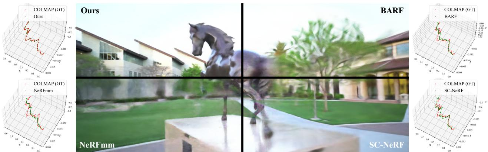
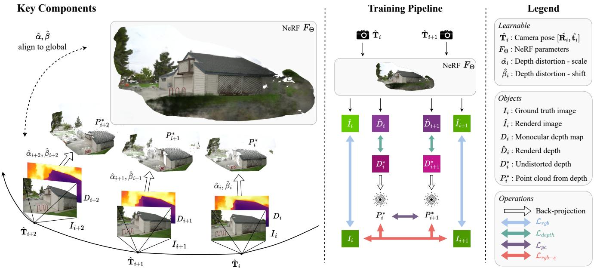
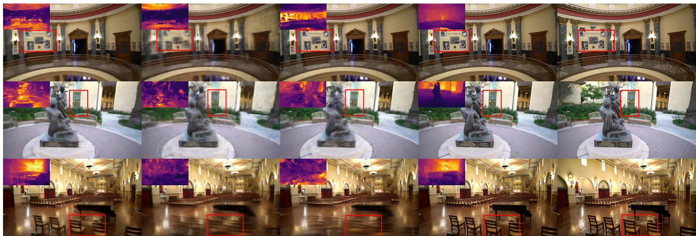
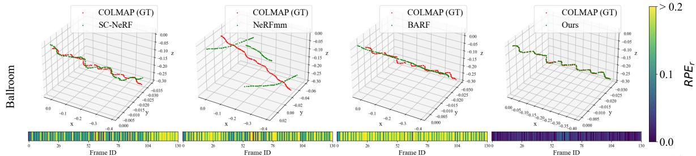
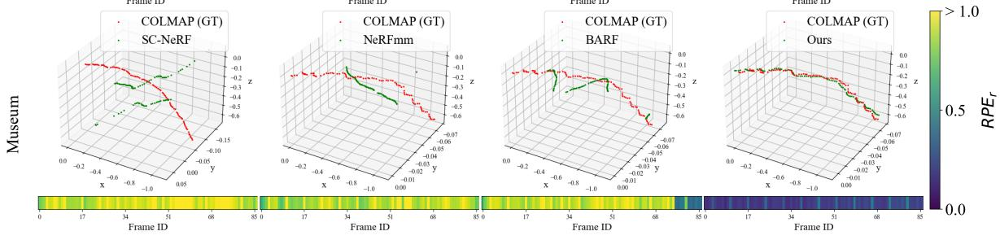
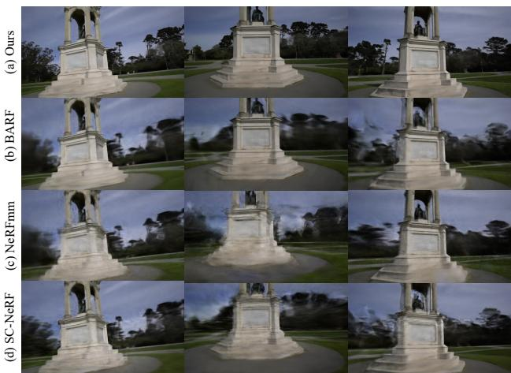
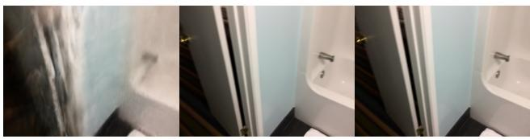

# NoPe-NeRF: Optimising Neural Radiance Field with No Pose Prior

Wenjing Bian Zirui Wang Kejie Li Jia-Wang Bian Victor Adrian Prisacariu Active Vision Lab, University of Oxford {wenjing, ryan, kejie, jiawang, victor}@robots.ox.ac.uk

  
Figure 1. Novel view synthesis comparison. We propose NoPe-NeRF for joint pose estimation and novel view synthesis. Our method enables more robust pose estimation and renders better novel view synthesis than previous state-of-the-art methods.

## Abstract

Training a Neural Radiance Field (NeRF) without precomputed camera poses is challenging. Recent advances in this direction demonstrate the possibility ofjointly optimising a NeRF and camera poses in forward-facing scenes. However, these methods still face difficulties during dramatic camera movement. We tackle this challenging problem by incorporating undistorted monocular depth priors. These priors are generated by correcting scale and shift parameters during training, with which we are then able to constrain the relative poses between consecutive frames. This constraint is achieved using our proposed novel loss functions. Experiments on real-world indoor and outdoor scenes show that our method can handle challenging camera trajectories and outperforms existing methods in terms of novel view rendering quality and pose estimation accuracy. Our project page is https://nope-nerf. active.vision.

## 1. Introduction

The photo-realistic reconstruction of a scene from a stream of RGB images requires both accurate 3D geometry reconstruction and view-dependent appearance modelling. Recently, Neural Radiance Fields (NeRF) [24] have demonstrated the ability to build high-quality results for generating photo-realistic images from novel viewpoints given a sparse set of images.

An important preparation step for NeRF training is the estimation of camera parameters for the input images. A current go-to option is the popular Structure-from-Motion (SfM) library COLMAP [35]. Whilst easy to use, this preprocessing step could be an obstacle to NeRF research and real-world deployments in the long term due to its long processing time and its lack of differentiability. Recent works such as NeRFmm [46], BARF [18] and SC-NeRF [12] propose to simultaneously optimise camera poses and the neural implicit representation to address these issues. Nevertheless, these methods can only handle forward-facing scenes when no initial parameters are supplied, and fail in dramatic camera motions, e.g.a casual handheld captured video.

This limitation has two key causes. First, all these methods estimate a camera pose for each input image individually without considering relative poses between images. Looking back to the literature of Simultaneous localisation and mapping (SLAM) and visual odometry, pose estimation can significantly benefit from estimating relative poses between adjacent input frames. Second, the radiance field is known to suffer from shape-radiance ambiguity [55]. Estimating camera parameters jointly with NeRF adds another degree of ambiguity, resulting in slow convergence and unstable optimisation.

To handle the limitation of large camera motion, we seek help from monocular depth estimation [22, 28, 29, 51]. Our motivation is threefold: First, monocular depth provides strong geometry cues that are beneficial to constraint shaperadiance ambiguity. Second, relative poses between adjacent depth maps can be easily injected into the training pipeline via Chamfer Distance. Third, monocular depth is lightweight to run and does not require camera parameters as input, in contrast to multi-view stereo depth estimation. For simplicity, we use the term mono-depth from now on.

Utilising mono-depth effectively is not straightforward with the presence of scale and shift distortions. In other words, mono-depth maps are not multi-view consistent. Previous works [9, 17, 47] simply take mono-depth into a depth-wise loss along with NeRF training. Instead, we propose a novel and effective way to thoroughly integrate mono-depth into our system. First, we explicitly optimise scale and shift parameters for each mono-depth map during NeRF training by penalising the difference between rendered depth and mono-depth. Since NeRF by itself is trained based on multiview consistency, this step transforms mono-depth maps to undistorted multiview consistent depth maps. We further leverage these multiview consistent depth maps in two loss terms: a) a Chamfer Distance loss between two depth maps of adjacent images, which injects relative pose to our system; and b) a depth-based surface rendering loss, which further improves relative pose estimation.

In summary, we propose a method to jointly optimise camera poses and a NeRF from a sequence of images with large camera motion. Our system is enabled by three contributions. First, we propose a novel way to integrate monodepth into unposed-NeRF training by explicitly modelling scale and shift distortions. Second, we supply relative poses to the camera-NeRF joint optimisation via an inter-frame loss using undistorted mono-depth maps. Third, we further regularise our relative pose estimation with a depth-based surface rendering loss.

As a result, our method is able to handle large camera motion, and outperforms state-of-the-art methods by a significant margin in terms of novel view synthesis quality and camera trajectory accuracy.

## 2. Related Work

Novel View Synthesis. While early Novel View Synthesis (NVS) approaches applied interpolations between pixels [3], later works often rendered images from 3D reconstruction [1, 6]. In recent years, different representations of the 3D scene are used, e.g.meshes [30, 31], Multi-Plane

Images [41, 59], layered depth [42] etc. Among them, NeRF [24] has become a popular scene representation for its photorealistic rendering.

A number of techniques are proposed to improve NeRF’s performance with additional regularisation [13, 26, 54], depth priors [7,32,47,53], surface enhancements [27,43,49] or latent codes [40, 44, 52]. Other works [2, 10, 25, 34] have also accelerated NeRF training and rendering. However, most of these approaches require pre-computed camera parameters obtained from SfM algorithms [11, 35].

NeRF With Pose Optimisation. Removing camera parameter preprocessing is an active line of research recently. One category of the methods [33, 38, 60] use a SLAM-style pipeline, that either requires RGB-D inputs or relies on accurate camera poses generated from the SLAM tracking system. Another category of works optimises camera poses with the NeRF model directly. We term this type of method as unposed-NeRF in this paper. iNeRF [50] shows that poses for novel view images can be estimated using a reconstructed NeRF model. GNeRF [21] combines Generative Adversarial Networks with NeRF to estimate camera poses but requires a known sampling distribution for poses. More relevant to our work, NeRFmm [46] jointly optimises both camera intrinsics and extrinsics alongside NeRF training. BARF [18] proposes a coarse-to-fine positional encoding strategy for camera poses and NeRF joint optimisation. SC-NeRF [12] further parameterises camera distortion and employs a geometric loss to regularise rays. GARF [4] shows that using Gaussian-MLPs makes joint pose and scene optimisation easier and more accurate. Recently, SiNeRF [48] uses SIREN [36] layers and a novel sampling strategy to alleviate the sub-optimality of joint optimisation in NeRFmm. Although showing promising results on the forward-facing dataset like LLFF [23], these approaches face difficulties when handling challenging camera trajectories with large camera motion. We address this issue by closely integrating mono-depth maps with the joint optimisation of camera parameters and NeRF.

## 3. Method

We tackle the challenge of handling large camera motions in unposed-NeRF training. Given a sequence of images, camera intrinsics, and their mono-depth estimations, our method recovers camera poses and optimises a NeRF simultaneously. We assume camera intrinsics are available in the image meta block, and we run an off-the-shelf monodepth network DPT [7] to acquire mono-depth estimations. Without repeating the benefit of mono-depth, we unroll this section around the effective integration of monocular depth into unposed-NeRF training.

The training is a joint optimisation of the NeRF, camera poses, and distortion parameters of each mono-depth map. The distortion parameters are supervised by minimising the discrepancies between the mono-depth maps and depth maps rendered from the NeRF, which are multiview consistent. The undistorted depth maps in return effectively mediate the shape-radiance ambiguity, which eases the training of NeRF and camera poses.

  
Figure 2. Method Overview. Our method takes a sequence of images as input to reconstruct NeRF and jointly estimates the camera poses of the frames. We first generate monocular depth maps from a mono-depth estimation network and reconstruct the point clouds. We then optimise NeRF, camera poses, and depth distortion parameters jointly with inter-frame and NeRF losses.

Specifically, the undistorted depth maps enable two constraints. We constrain global pose estimation by supplying relative pose between adjacent images. This is achieved via a Chamfer-Distance-based correspondence between two point clouds, back-projected from undistorted depth maps. Further, we regularise relative pose estimation with a surface-based photometric consistency where we treat undistorted depth as surface.

We detail our method in the following sections, starting from NeRF in Sec. 3.1 and unposed-NeRF training in Sec. 3.2, looking into mono-depth distortions in Sec. 3.3, followed by our mono-depth enabled loss terms in Sec. 3.4, and finishing with an overall training pipeline Sec. 3.5.

## 3.1. NeRF

Neural Radiance Field (NeRF) [24] represents a scene as a mapping function $F _ { \Theta } : \left( \mathbf { x } , \mathbf { d } \right) \to \left( \mathbf { c } , \sigma \right)$ that maps a 3D location $\mathbf { \bar { x } } \in \mathbb { R } ^ { 3 }$ and a viewing direction d $\in \mathbb { R } ^ { 3 }$ to a radiance colour $\mathbf { c } \in \mathbb { R } ^ { 3 }$ and a volume density value σ. This mapping is usually implemented with a neural network parameterised by $F _ { \Theta }$ . Given N images $\mathcal { T } = \{ I _ { i } \ | \ i = 0 \ldots N - 1 \}$ with their camera poses $\Pi = \{ \pi _ { i } | i = 0 \ldots N - 1 \}$ NeRF can be optimised by minimising photometric error $\begin{array} { r } { \mathcal { L } _ { r g b } = \sum _ { i } ^ { N } \| I _ { i } - \hat { I } _ { i } \| _ { 2 } ^ { 2 } } \end{array}$ between synthesised images $\hat { \mathcal { T } }$ and captured images I:

$$
\Theta ^ { * } = \arg \operatorname* { m i n } _ { \Theta } \mathcal { L } _ { r g b } ( \hat { \mathcal { T } } \mid \mathcal { T } , \Pi ) ,\tag{1}
$$

where $\hat { I } _ { i }$ is rendered by aggregating radiance colour on camera rays $\mathbf { r } ( h ) = \mathbf { o } + h \mathbf { d }$ between near and far bound $h _ { n }$ and $h _ { f } .$ . More concretely, we synthesise $\hat { I } _ { i }$ with a volumetric rendering function

$$
\hat { I } _ { i } ( \mathbf { r } ) = \int _ { h _ { n } } ^ { h _ { f } } T ( h ) \sigma ( \mathbf { r } ( h ) ) \mathbf { c } ( \mathbf { r } ( h ) , \mathbf { d } ) d h ,\tag{2}
$$

where $\begin{array} { r } { T ( h ) \ = \ \exp ( - \int _ { h _ { \ n } } ^ { h } \sigma ( { \bf r } ( s ) ) d s ) } \end{array}$ is the accumulated transmittance along a ray. We refer to [24] for further details.

## 3.2. Joint Optimisation of Poses and NeRF

Prior works [12, 18, 46] show that it is possible to estimate both camera parameters and a NeRF at the same time by minimising the above photometric error $\mathcal { L } _ { r g b }$ under the same volumetric rendering process in Eq. (2).

The key lies in conditioning camera ray casting on variable camera parameters Π, as the camera ray r is a function of camera pose. Mathematically, this joint optimisation can be formulated as:

$$
\Theta ^ { * } , \Pi ^ { * } = \arg \operatorname* { m i n } _ { \Theta , \Pi } \mathcal { L } _ { \boldsymbol { r g b } } ( \hat { \mathcal { Z } } , \hat { \Pi } \mid \mathcal { T } ) ,\tag{3}
$$

where Πˆ denotes camera parameters that are updated during optimising. Note that the only difference between Eq. (1)

and Eq. (3) is that Eq. (3) considers camera parameters as variables.

In general, the camera parameters Π include camera intrinsics, poses, and lens distortions. We only consider estimating camera poses in this work, $e . g .$ , camera pose for frame $I _ { i }$ is a transformation $\mathbf { T } _ { i } = \left[ \mathbf { R } _ { i } \ | \ \mathbf { t } _ { i } \right]$ with a rotation $\mathbf { R } _ { i } \in \mathrm { S O } ( 3 )$ and a translation $\mathbf { t } _ { i } \in \mathbb { R } ^ { 3 }$

## 3.3. Undistortion of Monocular Depth

With an off-the-shelf monocular depth network, $e . g .$ DPT [28], we generate mono-depth sequence $\begin{array} { r l } { \mathcal { D } } & { { } = } \end{array}$ $\{ D _ { i } \mid i = 0 \ldots N - 1 \}$ from input images. Without surprise, mono-depth maps are not multi-view consistent so we aim to recover a sequence of multi-view consistent depth maps, which are further leveraged in our relative pose loss terms.

Specifically, we consider two linear transformation parameters for each mono-depth map, resulting in a sequence of transformation parameters for all frames $\Psi =$ $\{ ( \alpha _ { i } , \beta _ { i } ) \mid i = 0 . . . N - 1 \}$ , where $\alpha _ { i }$ and $\beta _ { i }$ denote a scale and a shift factor. With multi-view consistent constraint from NeRF, we aim to recover a multi-view consistent depth map $D _ { i } ^ { * }$ for $D _ { i }$ :

$$
D _ { i } ^ { * } = \alpha _ { i } D _ { i } + \beta _ { i } ,\tag{4}
$$

by joint optimising $\alpha _ { i }$ and $\beta _ { i }$ along with a NeRF. This joint optimisation is mostly achieved by enforcing the consistency between an undistorted depth map $D _ { i } ^ { * }$ and a NeRF rendered depth map $\hat { D } _ { i }$ via a depth loss:

$$
\mathcal { L } _ { d e p t h } = \sum _ { i } ^ { N } \left\| D _ { i } ^ { * } - \hat { D } _ { i } \right\| ,\tag{5}
$$

where

$$
\hat { D } _ { i } ( { \bf r } ) = \int _ { h _ { n } } ^ { h _ { f } } T ( h ) \sigma ( { \bf r } ( h ) ) d h\tag{6}
$$

denotes a volumetric rendered depth map from NeRF.

It is important to note that both NeRF and mono-depth benefit from Eq. (5). On the one hand, mono-depth provides strong geometry prior for NeRF training, reducing shaperadiance ambiguity. On the other hand, NeRF provides multi-view consistency so we can recover a set of multiview consistent depth maps for relative pose estimations.

## 3.4. Relative Pose Constraint

Aforementioned unposed-NeRF methods [12,18,46] optimise each camera pose independently, resulting in an overfit to target images with incorrect poses. Penalising incorrect relative poses between frames can help to regularise the joint optimisation towards smooth convergence, especially in a complex camera trajectory. Therefore, we propose two losses that constrain relative poses.

Point Cloud Loss. We back-project the undistorted depth maps $\mathcal { D } ^ { * }$ using the known camera intrinsics, to point clouds $\mathcal { P } ^ { * } ~ = ~ \{ P _ { i } ^ { * } ~ | ~ i = 0 \ldots N - 1 \}$ and optimise the relative pose between consecutive point clouds by minimising a point cloud loss $\mathcal { L } _ { p c } \mathrm { : }$

$$
\mathcal { L } _ { p c } = \sum _ { ( i , j ) } l _ { c d } ( P _ { j } ^ { * } , \mathbf { T } _ { j i } P _ { i } ^ { * } ) ,\tag{7}
$$

where $\mathbf { T } _ { j i } = \mathbf { T } _ { j } \mathbf { T } _ { i } ^ { - 1 }$ represents the related pose that transforms point cloud $P _ { i } ^ { * }$ to $P _ { j } ^ { * }$ , tuple $( i , j )$ denotes indices of a consecutive pair of instances, and $l _ { c d }$ denotes Chamfer Distance:

$$
l _ { c d } ( P _ { i } , P _ { j } ) = \sum _ { p _ { i } \in P _ { i } } \operatorname* { m i n } _ { p _ { j } \in P _ { j } } \| p _ { i } - p _ { j } \| _ { 2 } + \sum _ { p _ { j } \in P _ { j } } \operatorname* { m i n } _ { p _ { i } \in P _ { i } } \| p _ { i } - p _ { j } \| _ { 2 } .\tag{8}
$$

Surface-based Photometric Loss. While the point cloud loss $\mathcal { L } _ { p c }$ offers supervision in terms of 3D-3D matching, we observe that a surface-based photometric error can alleviate incorrect matching. With the photometric consistency assumption, this photometric error penalises the differences in appearance between associated pixels. The association is established by projecting the point cloud $P _ { i } ^ { * }$ onto images $I _ { i }$ and $I _ { j }$

The surface-based photometric loss can then be defined as:

$$
\mathcal { L } _ { r g b - s } = \sum _ { ( i , j ) } \| I _ { i } \langle \mathbf { K } _ { i } P _ { i } ^ { * } \rangle - I _ { j } \langle \mathbf { K } _ { j } \mathbf { T } _ { j } \mathbf { T } _ { i } ^ { - 1 } P _ { i } ^ { * } \rangle \| ,\tag{9}
$$

where $\langle \cdot \rangle$ represents the sampling operation on the image and $\mathbf { K } _ { i }$ denotes a projection matrix for $i _ { t h }$ camera.

## 3.5. Overall Training Pipeline

Assembling all loss terms, we get the overall loss function:

$$
\mathcal { L } = \mathcal { L } _ { r g b } + \lambda _ { 1 } \mathcal { L } _ { d e p t h } + \lambda _ { 2 } \mathcal { L } _ { p c } + \lambda _ { 3 } \mathcal { L } _ { r g b - s } ,\tag{10}
$$

where $\lambda _ { 1 } , \lambda _ { 2 } , \lambda _ { 3 }$ are the weighting factors for respective loss terms. By minimising the combined of loss $\mathcal { L } \mathrm { : }$

$$
\Theta ^ { * } , \Pi ^ { * } , \Psi ^ { * } = \arg \operatorname* { m i n } _ { \Theta , \Pi , \Psi } \mathcal { L } ( \hat { \mathcal { L } } , \hat { \mathcal { D } } , \hat { \Pi } , \hat { \Psi } \mid \mathcal { Z } , \mathcal { D } ) ,\tag{11}
$$

our method returns the optimised NeRF parameters $\Theta ,$ camera poses Π, and distortion parameters Ψ.

## 4. Experiments

We begin with a description of our experimental setup in Sec. 4.1. In Sec. 4.2, we compare our method with poseunknown methods. Next, we compare our method with the COLMAP-assisted NeRF baseline in Sec. 4.3. Lastly, we conduct ablation studies in Sec. 4.4.

  
(a) BARF  
(b) NeRFmm  
(c) SC-NeRF  
(d) Ours  
(e) Ground Truth  
Figure 3. Qualitative results of novel view synthesis and depth prediction on Tanks and Temples. We visualise the synthesised images and the rendered depth maps (top left of each image) for all methods. NoPe-NeRF is able to recover details for both colour and geometry.

## 4.1. Experimental Setup

Datasets. We conduct experiments on two datasets Tanks and Temples [15] and ScanNet [5]. Tanks and Temples: we use 8 scenes to evaluate pose accuracy and novel view synthesis quality. We chose scenes captured at both indoor and outdoor locations, with different frame sampling rates and lengths. All images are down-sampled to a resolution of $9 6 0 \times 5 4 0$ . For the family scene, we sample 200 images and take 100 frames with odd frame ids as training images and the remaining 100 frames for novel view synthesis, in order to analyse the performance under smooth motion. For the remaining scenes, following NeRF [24], 1/8 of the images in each sequence are held out for novel view synthesis, unless otherwise specified. ScanNet: we select 4 scenes for evaluating pose accuracy, depth accuracy, and novel view synthesis quality. For each scene, we take 80-100 consecutive images and use 1/8 of these images for novel view synthesis. For evaluation, we employ depth maps and poses provided by ScanNet as ground truth. ScanNet images are down-sampled to 648 × 484. We crop images with dark orders during preprocessing.

Metrics. We evaluate our proposed method in three aspects. For novel view synthesis, we follow previous methods [12,18,46], and use standard evaluation metrics, including Peak Signal-to-Noise Ratio (PSNR), Structural Similarity Index Measure (SSIM) [45] and Learned Perceptual Image Patch Similarity (LPIPS) [56]. For pose evaluation, We use standard visual odometry metrics [16, 37, 57], including the Absolute Trajectory Error (ATE) and Relative Pose Error (RPE). ATE measures the difference between the estimated camera positions and the ground truth positions. RPE measures the relative pose errors between pairs of images, which consists of relative rotation error (RPEr) and relative translation error $( \mathrm { R P E } _ { t } )$ . The estimated trajectory is aligned with the ground truth using Sim(3) with 7 degrees of freedom. We use standard depth metrics [8,19,20,39] (Abs Rel, $\mathrm { S q }$ Rel, RMSE, RMSE log, $\delta _ { 1 } , \delta _ { 2 }$ and $\delta _ { 3 } )$ for depth evaluation. For further detail, please refer to the supplementary material. To recover the metric scale, we follow Zhou et al. [58] and match the median value between rendered and ground truth depth maps.

Implementation Details. Our model architecture is based on NeRF [24] with a few modifications: a) replacing ReLU activation function with Softplus and b) sampling 128 points along each ray uniformly with noise, between a predefined range (0.1, 10). We use 2 separate Adam optimisers [14] for NeRF and other parameters. The initial learning rate for NeRF is 0.001 and for the pose and distortion is 0.0005. Camera rotations are optimised in axisangle representation $\phi _ { i } \in { \mathfrak { s o } } ( 3 )$ . We first train the model with all losses with constant learning rates until the interframe losses converge. Then, we remove the inter-frame losses and depth loss to refine the model with the RGB loss only. We decay the learning rates with different schedulers to refine for 10,000 epochs. We balance the loss terms with $\lambda _ { 1 } = 0 . 0 4 , \lambda _ { 2 } = 1 . 0$ and $\lambda _ { 3 } = 1 . 0$ . For each training step, we randomly sample 1024 pixels (rays) from each input image and 128 samples per ray. More details are provided in the supplementary material.

## 4.2. Comparing With Pose-Unknown Methods

We compare our method with pose-unknown baselines, including BARF [18], NeRFmm [46] and SC-NeRF [12].

View Synthesis Quality. To obtain the camera poses of test views for rendering, we minimise the photometric error of the synthesised images while keeping the NeRF model fixed, as in NeRFmm [46]. Each test pose is initialised with the learned pose of the training frame that is closest to it. We use the same pre-processing for all baseline approaches, which results in higher accuracy than their original implementations. More details are provided in the supplementary material. Our method outperforms all the baselines by a large margin. The quantitative results are summarised in Tab. 1, and qualitative results are shown in Fig. 3.

  
(a) BARF  
(b) NeRFmm  
(c) SC-NeRF  
(d) Ours

Figure 4. Pose Estimation Comparison. We visualise the trajectory (3D plot) and relative rotation errors RPE (bottom colour bar) of each method on Ballroom and Museum. The colour bar on the right shows the relative scaling of colour. More results are in the supplementary.
<table><tr><td rowspan="2"></td><td rowspan="2">scenes</td><td colspan="3">Ours</td><td colspan="3">BARF</td><td colspan="3">NeRFmm</td><td colspan="3">SC-NeRF</td></tr><tr><td>PSNR ↑</td><td>SSIM ↑</td><td>LPIPS↓</td><td>PSNR</td><td>SSIM</td><td>LPIPS</td><td>PSNR</td><td>SSIM</td><td>LPIPS</td><td>PSNR</td><td>SSIM</td><td>LPIPS</td></tr><tr><td rowspan="6">Saet</td><td>0079_00</td><td>32.47</td><td>0.84</td><td>0.41</td><td>32.31</td><td>0.83</td><td>0.43</td><td>30.59</td><td>0.81</td><td>0.49</td><td>31.33</td><td>0.82</td><td>0.46</td></tr><tr><td>0418-00</td><td>31.33</td><td>0.79</td><td>0.34</td><td>31.24</td><td>0.79</td><td>0.35</td><td>30.00</td><td>0.77</td><td>0.40</td><td>29.05</td><td>0.75</td><td>0.43</td></tr><tr><td>0301_00</td><td>29.83</td><td>0.77</td><td>0.36</td><td>29.31</td><td>0.76</td><td>0.38</td><td>27.84</td><td>0.72</td><td>0.45</td><td>29.45</td><td>0.77</td><td>0.35</td></tr><tr><td>0431_00</td><td>33.83</td><td>0.91</td><td>0.39</td><td>32.77</td><td>0.90</td><td>0.41</td><td>31.44</td><td>0.88</td><td>0.45</td><td>32.57</td><td>0.90</td><td>0.40</td></tr><tr><td>mean</td><td>31.86</td><td>0.83</td><td>0.38</td><td>31.41</td><td>0.82</td><td>0.39</td><td>29.97</td><td>0.80</td><td>0.45</td><td>30.60</td><td>0.81</td><td>0.41</td></tr><tr><td>Church</td><td>25.17</td><td>0.73</td><td>0.39</td><td>23.17</td><td>0.62</td><td>0.52</td><td>21.64</td><td>0.58</td><td>0.54</td><td>21.96</td><td>0.60</td><td>0.53</td></tr><tr><td rowspan="6">Tans ns pes</td><td>Barn</td><td>26.35</td><td>0.69</td><td>0.44</td><td>25.28</td><td>0.64</td><td>0.48</td><td>23.21</td><td>0.61</td><td>0.53</td><td>23.26</td><td>0.62</td><td>0.51</td></tr><tr><td>Museum</td><td>26.77</td><td>0.76</td><td>0.35</td><td>23.58</td><td>0.61</td><td>0.55</td><td>22.37</td><td>0.61</td><td>0.53</td><td>24.94</td><td>0.69</td><td>0.45</td></tr><tr><td>Family</td><td>26.01</td><td>0.74</td><td>0.41</td><td>23.04</td><td>0.61</td><td>0.56</td><td>23.04</td><td>0.58</td><td>0.56</td><td>22.60</td><td>0.63</td><td>0.51</td></tr><tr><td>Horse</td><td>27.64</td><td>0.84</td><td>0.26</td><td>24.09</td><td>0.72</td><td>0.41</td><td>23.12</td><td>0.70</td><td>0.43</td><td>25.23</td><td>0.76</td><td>0.37</td></tr><tr><td>Ballroom</td><td>25.33</td><td>0.72</td><td>0.38</td><td>20.66</td><td>0.50</td><td>0.60</td><td>20.03</td><td>0.48</td><td>0.57</td><td>22.64</td><td>0.61</td><td>0.48</td></tr><tr><td>Francis</td><td>29.48</td><td>0.80</td><td>0.38</td><td>25.85</td><td>0.69</td><td>0.57</td><td>25.40</td><td>00.69</td><td>0.52</td><td>26.46</td><td>0.73</td><td>0.49</td></tr><tr><td rowspan="3"></td><td>Ignatius</td><td>23.96</td><td>0.61</td><td>0.47</td><td>21.78</td><td>0.47</td><td>0.60</td><td>21.16</td><td>0.45</td><td>0.60</td><td>23.00</td><td>0.55</td><td>0.53</td></tr><tr><td>mean</td><td>26.34</td><td>0.74</td><td>0.39</td><td>23.42</td><td>0.61</td><td>0.54</td><td>22.50</td><td>0.59</td><td>0.54</td><td>23.76</td><td>0.65</td><td>0.48</td></tr><tr><td></td><td></td><td></td><td></td><td></td><td></td><td></td><td></td><td></td><td></td><td></td><td></td><td></td></tr></table>

Table 1. Novel view synthesis results on ScanNet and Tanks and Temples. Each baseline method is trained with its public code under the original settings and evaluated with the same evaluation protocol.

We recognised that because the test views, which are sampled from videos, are close to the training views, good results may be obtained due to overfitting to the training images. Therefore, we conduct an additional qualitative evaluation on more novel views. Specifically, we fit a bezier curve from the estimated training poses and sample interpolated poses for each method to render novel view videos. Sampled results are shown in Fig. 5, and the rendered videos are in the supplementary material. These results show that our method renders photo-realistic images consistently, while other methods generate visible artifacts.

Camera Pose. Our method significantly outperforms other baselines in all metrics. The quantitative pose evaluation results are shown in Tab. 2. For ScanNet, we use the camera poses provided by the dataset as ground truth. For Tanks and Temples, not every video comes with ground truth poses, so we use COLMAP estimations for reference. Our estimated trajectory is better aligned with the ground truth than other methods, and our estimated rotation is two orders of magnitudes more accurate than others. We visualise the camera trajectories and rotations in Fig. 4.

<table><tr><td rowspan="2"></td><td rowspan="2">scenes</td><td colspan="3">Ours</td><td colspan="3">BARF</td><td colspan="3">NeRFmm</td><td colspan="3">SC-NeRF</td></tr><tr><td>RPEt ↓</td><td>RPEr↓</td><td>ATE↓</td><td>RPEt</td><td>RPET</td><td>ATE</td><td>RPEt</td><td>RPEr</td><td>ATE</td><td>RPEt</td><td>RPET</td><td>ATE</td></tr><tr><td rowspan="6">SCaNet</td><td>0079_00</td><td>0.752</td><td>0.204</td><td>0.023</td><td>1.110</td><td>0.480</td><td>0.062</td><td>1.706</td><td>0.636</td><td>0.100</td><td>2.064</td><td>0.664</td><td>0.115</td></tr><tr><td>0418.00</td><td>0.455</td><td>0.119</td><td>0.015</td><td>1.398</td><td>0.538</td><td>0.020</td><td>1.402</td><td>0.460</td><td>0.013</td><td>1.528</td><td>0.502</td><td>0.016</td></tr><tr><td>0301_00</td><td>0.399</td><td>0.123</td><td>0.013</td><td>1.316</td><td>0.777</td><td>0.219</td><td>3.097</td><td>0.894</td><td>0.288</td><td>1.133</td><td>0.422</td><td>0.056</td></tr><tr><td>0431_00</td><td>1.625</td><td>0.274</td><td>0.069</td><td>6.024</td><td>0.754</td><td>0.168</td><td>6.799</td><td>0.624</td><td>0.496</td><td>4.110</td><td>0.499</td><td>0.205</td></tr><tr><td>mean</td><td>0.808</td><td>0.180</td><td>0.030</td><td>2.462</td><td>0.637</td><td>0.117</td><td>3.251</td><td>0.654</td><td>0.224</td><td>2.209</td><td>0.522</td><td>0.098</td></tr><tr><td>Church</td><td>0.034</td><td>0.008</td><td>0.008</td><td>0.114</td><td>0.038</td><td>0.052</td><td>0.626</td><td>0.127</td><td>0.065</td><td>0.836</td><td>0.187</td><td>0.108</td></tr><tr><td>anns a ppes</td><td>Barn</td><td>0.046</td><td>0.032</td><td>0.004</td><td>0.314</td><td>0.265</td><td>0.050</td><td>1.629</td><td>0.494</td><td>0.159</td><td>1.317</td><td>0.429</td><td>0.157</td></tr><tr><td rowspan="5"></td><td>Museum</td><td>0.207</td><td>0.202</td><td>0.020</td><td>3.442</td><td>1.128</td><td>0.263</td><td>4.134</td><td>1.051</td><td>0.346</td><td>8.339</td><td>1.491</td><td>0.316</td></tr><tr><td>Family</td><td>0.047</td><td>0.015</td><td>0.001</td><td>1.371</td><td>0.591</td><td>0.115</td><td>2.743</td><td>0.537</td><td>0.120</td><td>1.171</td><td>0.499</td><td>0.142</td></tr><tr><td>Horse</td><td>0.179</td><td>0.017</td><td>0.003</td><td>1.333</td><td>0.394</td><td>0.014</td><td>1.349</td><td>0.434</td><td>0.018</td><td>1.366</td><td>0.438</td><td>0.019</td></tr><tr><td>Ballroom</td><td>0.041</td><td>0.018</td><td>0.002</td><td>0.531</td><td>0.228</td><td>0.018</td><td>0.449</td><td>0.177</td><td>0.031</td><td>0.328</td><td>0.146</td><td>0.012</td></tr><tr><td>Francis</td><td>0.057</td><td>0.009</td><td>0.005</td><td>1.321</td><td>0.558</td><td>0.082</td><td>1.647</td><td>0.618</td><td>0.207</td><td>1.233</td><td>0.483</td><td>0.192</td></tr><tr><td rowspan="3"></td><td>Ignatius</td><td>0.026</td><td>0.005</td><td>0.002</td><td>0.736</td><td>0.324</td><td>0.029</td><td>1.302</td><td>0.379</td><td>0.041</td><td>0.533</td><td>0.240</td><td>0.085</td></tr><tr><td>mean</td><td>0.080</td><td>0.038</td><td>0.006</td><td>1.046</td><td>0.441</td><td>0.078</td><td>1.735</td><td>0.477</td><td>0.123</td><td>1.890</td><td>0.489</td><td>0.129</td></tr><tr><td></td><td></td><td></td><td></td><td></td><td></td><td></td><td></td><td></td><td></td><td></td><td></td><td></td></tr></table>

Table 2. Pose accuracy on ScanNet and Tanks and Temples. Note that we use COLMAP poses in Tanks and Temples as the “ground truth”. The unit of RPE is in degrees, ATE is in the ground truth scale and RPE is scaled by 100.

<table><tr><td colspan="5">Abs Rel ↓ Sq Rel ↓ RMSE ↓ RMSE log ↓  $\delta _ { 1 } \uparrow \quad \delta _ { 2 } \uparrow \quad \delta _ { 3 } \uparrow$ </td></tr><tr><td>Ours</td><td>0.141</td><td>0.137</td><td>0.568</td><td>0.176</td></tr><tr><td></td><td></td><td></td><td>0.401</td><td>0.828 0.970 0.987 0.490 0.751 0.884</td></tr><tr><td>BARF NeRFmm</td><td>0.376</td><td>0.684 0.990</td><td></td></tr><tr><td>0.590</td><td>1.721</td><td>1.672 0.587</td><td>0.316 0.560 0.743</td></tr><tr><td>SC-NeRF 0.417</td><td>0.642</td><td>1.079</td><td>0.476 0.3620.6580.832</td></tr><tr><td>DPT 0.197</td><td>0.246 0.751</td><td>0.226</td><td>0.7470.934 0.975</td></tr><tr><td></td><td></td><td></td><td></td></tr><tr><td></td><td></td><td></td><td></td></tr><tr><td></td><td></td><td></td><td></td></tr><tr><td></td><td></td><td></td><td></td></tr><tr><td></td><td></td><td></td><td></td></tr><tr><td></td><td></td><td></td><td></td></tr><tr><td></td><td></td><td></td><td></td></tr><tr><td></td><td></td><td></td><td></td></tr><tr><td></td><td></td><td></td><td></td></tr></table>

Table 3. Depth map evaluation on ScanNet. Our depth estimation is more accurate than baseline models BARF [18], NeRFmm [46] and SC-NeRF [12]. Compared with DPT [58], we show our depth is more accurate after undistortion.

Depth. We evaluate the accuracy of the rendered depth maps on ScanNet, which provides the ground-truth depths for evaluation. Our rendered depth maps achieve superior accuracy over the previous alternatives. We also compare with the mono-depth maps estimated by DPT. Our rendered depth maps, after undistortion using multiview consistency in the NeRF optimisation, outperform DPT by a large margin. The results are summarised in Tab. 3, and sampled qualitative results are illustrated in Fig. 3.

## 4.3. Comparing With COLMAP Assisted NeRF

We make a comparison of pose estimation accuracy between our method and COLMAP against ground truth poses in ScanNet. We achieve on-par accuracy with COLMAP, as shown in Tab. 4. We further analyse the novel view synthesis quality of the NeRF model trained with our learned poses to COLMAP poses on ScanNet and Tanks and Temples. The original NeRF training contains two stages, finding poses using COLMAP and optimising the scene representation. In order to make our comparison fairer, in this section only, we mimic a similar two-stage training as the original NeRF [24]. In the first stage, we train our method with all losses for camera pose estimation, i.e., mimicking the COLMAP processing. Then, we fix the optimised poses and train a NeRF model from scratch, using the same settings and loss as the original NeRF. This evaluation enables us to compare our estimated poses to the COLMAP poses indirectly, i.e., in terms of contribution to view synthesis.

View 1  
View 2  
View 3  
  
Figure 5. Sampled frames from rendered novel view videos. For each method, we fit the learned trajectory with a bezier curve and uniformly sample new viewpoints for rendering. Our method generates significantly better results than previous methods, which show visible artifacts. The full rendered videos and details about generating novel views are provided in the supplementary.

Our two-stage method outperforms the COLMAPassisted NeRF baseline, which indicates a better pose estimation for novel view synthesis. The results are summarised in Tab. 5.

As is commonly known, COLMAP performs poorly in low-texture scenes and sometimes fails to find accurate camera poses. Fig. 6 shows an example of a low-texture scene where COLMAP provides inaccurate pose estimation that causes NeRF to render images with visible artifacts. In contrast, our method renders high-quality images, thanks to robust optimisation of camera pose.

<table><tr><td rowspan="2">scenes</td><td colspan="3">Ours</td><td colspan="3">COLMAP</td></tr><tr><td>RPEt↓</td><td>RPEr↓</td><td>ATE↓</td><td>RPEt</td><td>RPE</td><td>ATE</td></tr><tr><td>0079.00</td><td>0.752</td><td>0.204</td><td>0.023</td><td>0.655</td><td>0.221</td><td>0.012</td></tr><tr><td>0418_00</td><td>0.455</td><td>0.119</td><td>0.015</td><td>0.491</td><td>0.124</td><td>0.016</td></tr><tr><td>0301_00</td><td>0.399</td><td>0.123</td><td>0.013</td><td>0.414</td><td>0.136</td><td>0.009</td></tr><tr><td>0431_00</td><td>1.625</td><td>0.274</td><td>0.069</td><td>1.292</td><td>0.249</td><td>0.051</td></tr><tr><td>mean</td><td>0.808</td><td>0.180</td><td>0.030</td><td>0.713</td><td>0.182</td><td>0.022</td></tr></table>

Table 4. Comparison of pose accuracy with COLMAP on ScanNet.  
  
(a) COLMAP+NeRF  
(b) Ours  
(c) Ground Truth

Figure 6. COLMAP failure case. On a rotation-dominant sequence with low-texture areas, COLMAP fails to estimate correct poses, which results in artifacts in synthesised images.
<table><tr><td rowspan="2" colspan="2">scenes</td><td colspan="3">Ours</td><td colspan="3">Ours-r</td><td colspan="3">COLMAP+NeRF</td></tr><tr><td></td><td></td><td>PSNR ↑ SSIM ↑ LPIPS ↓</td><td></td><td></td><td>PSNR SSIM LPIPS</td><td>PSNR SSIM LPIPS</td><td></td><td></td></tr><tr><td></td><td>0079.00</td><td>32.47</td><td>0.84</td><td>0.41</td><td>33.12</td><td>0.85</td><td>0.40</td><td>31.98</td><td>0.83</td><td>0.43</td></tr><tr><td>SCcanNet</td><td>0418_00</td><td>31.33</td><td>0.79</td><td>0.34</td><td>30.49</td><td>0.77</td><td>0.40</td><td>30.60</td><td>0.78</td><td>0.40</td></tr><tr><td></td><td>0301-00</td><td>29.83</td><td>0.77</td><td>0.36</td><td>30.05</td><td>0.78</td><td>0.34</td><td>30.01</td><td>0.78</td><td>0.36</td></tr><tr><td></td><td>0431.00</td><td>33.83</td><td>0.91</td><td>0.39</td><td>33.86</td><td>0.91</td><td>0.39</td><td>33.54</td><td>0.91</td><td>0.39</td></tr><tr><td></td><td>mean</td><td>31.86</td><td>0.83</td><td>0.38</td><td>31.88</td><td>0.83</td><td>0.38</td><td>31.53</td><td>0.82</td><td>0.40</td></tr><tr><td>Tans ns pes</td><td>Church</td><td>25.17</td><td>0.73</td><td>0.39</td><td>26.74</td><td>0.78</td><td>0.32</td><td>25.72</td><td>0.75</td><td>0.37</td></tr><tr><td></td><td>Barn</td><td>26.35</td><td>0.69</td><td>0.44</td><td>26.58</td><td>0.71</td><td>0.42</td><td>26.72</td><td>0.71</td><td>0.42</td></tr><tr><td></td><td>Museum</td><td>26.77</td><td>0.76</td><td>0.35</td><td>26.98</td><td>0.77</td><td>0.36</td><td>27.21</td><td>0.78</td><td>0.34</td></tr><tr><td></td><td>Family</td><td>26.01</td><td>0.74</td><td>0.41</td><td>26.21</td><td>0.75</td><td>0.40</td><td>26.61</td><td>0.77</td><td>0.39</td></tr><tr><td></td><td>Horse</td><td>27.64</td><td>0.84</td><td>0.26</td><td>28.06</td><td>0.84</td><td>0.26</td><td>27.02</td><td>0.82</td><td>0.29</td></tr><tr><td></td><td>Ballroom</td><td>25.33</td><td>0.72</td><td>0.38</td><td>25.53</td><td>0.73</td><td>0.38</td><td>25.47</td><td>0.73</td><td>0.38</td></tr><tr><td></td><td>Francis</td><td>29.48</td><td>0.80</td><td>0.38</td><td>29.73</td><td>0.81</td><td>0.38</td><td>30.05</td><td>0.81</td><td>0.38</td></tr><tr><td></td><td>Ignatius</td><td>23.96</td><td>0.61</td><td>0.47</td><td>23.98</td><td>0.62</td><td>0.46</td><td>24.08</td><td>0.61</td><td>0.47</td></tr><tr><td></td><td>mean</td><td>26.34</td><td>0.74</td><td>0.39</td><td>26.73</td><td>0.75</td><td>0.37</td><td>26.61</td><td>0.75</td><td>0.38</td></tr></table>

Table 5. Comparison to NeRF with COLMAP poses. Our twostage method (Ours-r) outperforms both COLMAP+NeRF and our one-stage method (Ours).

Interestingly, this experiment also reveals that the twostage method shows higher accuracy than the one-stage method. We hypothesise that the joint optimisation (from randomly initialised poses) in the one-stage approach causes the NeRF optimisation to be trapped in a local minimum, potentially due to the bad pose initialisation. The two-stage approach circumvents this issue by re-initialising the NeRF and re-training with well-optimised poses, resulting in higher performance.

## 4.4. Ablation Study

In this section, we analyse the effectiveness of the parameters and components that have been added to our model. The results of ablation studies are shown in Tab. 6.

Effect of Distortion Parameters. We find that ignoring depth distortions (i.e., setting scales to 1 and shifts to 0 as constants) leads to a degradation in pose accuracy, as inconsistent distortions of depth maps introduce errors to the estimation of relative poses and confuse NeRF for geometry reconstruction.

<table><tr><td rowspan="2"></td><td colspan="3">NVS</td><td colspan="3">Pose</td></tr><tr><td></td><td></td><td>PSNR↑ SSIM ↑ LPIPS</td><td>RPEt ↓</td><td>RPEr↓</td><td>ATE↓</td></tr><tr><td>Ours</td><td>31.86</td><td>0.83</td><td>0.38</td><td>0.801</td><td>0.181</td><td>0.031</td></tr><tr><td>Ours w/o  $\alpha , \beta$ </td><td>31.46</td><td>0.82</td><td>0.39</td><td>1.929</td><td>0.321</td><td>0.066</td></tr><tr><td>Ours w/o  $L _ { p c }$ </td><td>31.73</td><td>0.82</td><td>0.38</td><td>2.227</td><td>0.453</td><td>0.101</td></tr><tr><td>Ours w/o  $L _ { r g b - s }$ </td><td>31.05</td><td>0.81</td><td>0.41</td><td>1.814</td><td>0.401</td><td>0.156</td></tr><tr><td>Ours w/o  $\underline { { L _ { d e p t h } } }$ </td><td>31.20</td><td>0.81</td><td>0.40</td><td>1.498</td><td>0.383</td><td>0.089</td></tr></table>

Table 6. Ablation study results on ScanNet.

Effect of Inter-frame Losses. We observe that the interframe losses are the major contributor to improving relative poses. When removing the pairwise point cloud loss $L _ { p c }$ or the surface-based photometric loss $L _ { r g b - s } $ , there is less constraint between frames, and thus the pose accuracy becomes lower.

Effect of NeRF Losses. When the depth loss $L _ { d e p t h }$ is removed, the distortions of input depth maps are only optimised locally through the inter-frame losses. We find that this can lead to drift and degradation in pose accuracy.

## 4.5. Limitations

Our proposed method optimises camera pose and the NeRF model jointly and works on challenging scenes where other baselines fail. However, the optimisation of the model is also affected by non-linear distortions and the accuracy of the mono-depth estimation, which we did not consider.

## 5. Conclusion

In this work, we present NoPe-NeRF, an end-to-end differentiable model for joint camera pose estimation and novel view synthesis from a sequence of images. We demonstrate that previous approaches have difficulty with complex trajectories. To tackle this challenge, we use mono-depth maps to constrain the relative poses between frames and regularise the geometry of NeRF, which leads to better pose estimation. We show the effectiveness and robustness of NoPe-NeRF on challenging scenes. The improved pose estimation leads to better novel view synthesis quality and geometry reconstruction compared with other approaches. We believe our method is an important step towards applying the unknown-pose NeRF models to largescale scenes in the future.

## Acknowledgements

We thank Theo Costain, Michael Hobley, Shuai Chen and Xinghui Li for their helpful proofreading and discussions. Wenjing Bian is supported by the China Scholarship Council - University of Oxford Scholarship.

## References

[1] Chris Buehler, Michael Bosse, Leonard McMillan, Steven Gortler, and Michael Cohen. Unstructured lumigraph rendering. In SIGGRAPH, 2001. 2

[2] Anpei Chen, Zexiang Xu, Andreas Geiger, Jingyi Yu, and Hao Su. Tensorf: Tensorial radiance fields. In ECCV, 2022. 2

[3] Shenchang Eric Chen and Lance Williams. View interpolation for image synthesis. In SIGGRAPH, 1993. 2

[4] Shin-Fang Chng, Sameera Ramasinghe, Jamie Sherrah, and Simon Lucey. Garf: Gaussian activated radiance fields for high fidelity reconstruction and pose estimation. arXiv eprints, 2022. 2

[5] Angela Dai, Angel X Chang, Manolis Savva, Maciej Halber, Thomas Funkhouser, and Matthias Nießner. Scannet: Richly-annotated 3d reconstructions of indoor scenes. In CVPR, 2017. 5

[6] Paul E Debevec, Camillo J Taylor, and Jitendra Malik. Modeling and rendering architecture from photographs: A hybrid geometry-and image-based approach. In SIGGRAPH, 1996. 2

[7] Kangle Deng, Andrew Liu, Jun-Yan Zhu, and Deva Ramanan. Depth-supervised nerf: Fewer views and faster training for free. In CVPR, 2022. 2

[8] Huan Fu, Mingming Gong, Chaohui Wang, Kayhan Batmanghelich, and Dacheng Tao. Deep ordinal regression network for monocular depth estimation. In CVPR, 2018. 5

[9] Chen Gao, Ayush Saraf, Johannes Kopf, and Jia-Bin Huang. Dynamic view synthesis from dynamic monocular video. In ICCV, 2021. 2

[10] Stephan J Garbin, Marek Kowalski, Matthew Johnson, Jamie Shotton, and Julien Valentin. Fastnerf: High-fidelity neural rendering at 200fps. In ICCV, 2021. 2

[11] Richard Hartley and Andrew Zisserman. Multiple view geometry in computer vision. 2003. 2

[12] Yoonwoo Jeong, Seokjun Ahn, Christopher Choy, Anima Anandkumar, Minsu Cho, and Jaesik Park. Self-calibrating neural radiance fields. In ICCV, 2021. 1, 2, 3, 4, 5, 7

[13] Mijeong Kim, Seonguk Seo, and Bohyung Han. Infonerf: Ray entropy minimization for few-shot neural volume rendering. In CVPR, 2022. 2

[14] Diederik P. Kingma and Jimmy Ba. Adam: A method for stochastic optimization. In Yoshua Bengio and Yann LeCun, editors, ICLR, 2015. 5

[15] Arno Knapitsch, Jaesik Park, Qian-Yi Zhou, and Vladlen Koltun. Tanks and temples: Benchmarking large-scale scene reconstruction. ACM Transactions on Graphics, 2017. 5

[16] Johannes Kopf, Xuejian Rong, and Jia-Bin Huang. Robust consistent video depth estimation. In CVPR, 2021. 5

[17] Zhengqi Li, Simon Niklaus, Noah Snavely, and Oliver Wang. Neural scene flow fields for space-time view synthesis of dynamic scenes. In CVPR, 2021. 2

[18] Chen-Hsuan Lin, Wei-Chiu Ma, Antonio Torralba, and Simon Lucey. Barf: Bundle-adjusting neural radiance fields. In ICCV, 2021. 1, 2, 3, 4, 5, 7

[19] Fayao Liu, Chunhua Shen, Guosheng Lin, and Ian Reid. Learning depth from single monocular images using deep convolutional neural fields. TPAMI, 2015. 5

[20] Xuan Luo, Jia-Bin Huang, Richard Szeliski, Kevin Matzen, and Johannes Kopf. Consistent video depth estimation. ToG. 5

[21] Quan Meng, Anpei Chen, Haimin Luo, Minye Wu, Hao Su, Lan Xu, Xuming He, and Jingyi Yu. Gnerf: Gan-based neural radiance field without posed camera. In Proceedings ofthe IEEE/CVF International Conference on Computer Vision, 2021. 2

[22] S Mahdi H Miangoleh, Sebastian Dille, Long Mai, Sylvain Paris, and Yagiz Aksoy. Boosting monocular depth estimation models to high-resolution via content-adaptive multiresolution merging. In CVPR, 2021. 2

[23] Ben Mildenhall, Pratul P Srinivasan, Rodrigo Ortiz-Cayon, Nima Khademi Kalantari, Ravi Ramamoorthi, Ren Ng, and Abhishek Kar. Local light field fusion: Practical view synthesis with prescriptive sampling guidelines. ACM Transactions on Graphics (TOG), 2019. 2

[24] Ben Mildenhall, Pratul P Srinivasan, Matthew Tancik, Jonathan T Barron, Ravi Ramamoorthi, and Ren Ng. Nerf: Representing scenes as neural radiance fields for view synthesis. Communications ofthe ACM, 2021. 1, 2, 3, 5, 7

[25] Thomas Muller, Alex Evans, Christoph Schied, and Alexan-¨ der Keller. Instant neural graphics primitives with a multiresolution hash encoding. ACM Trans. Graph. 2

[26] Michael Niemeyer, Jonathan T Barron, Ben Mildenhall, Mehdi SM Sajjadi, Andreas Geiger, and Noha Radwan. Regnerf: Regularizing neural radiance fields for view synthesis from sparse inputs. In CVPR, 2022. 2

[27] Michael Oechsle, Songyou Peng, and Andreas Geiger. Unisurf: Unifying neural implicit surfaces and radiance fields for multi-view reconstruction. In ICCV, 2021. 2

[28] Rene Ranftl, Alexey Bochkovskiy, and Vladlen Koltun. Vi-´ sion transformers for dense prediction. In ICCV, 2021. 2, 4

[29] Rene Ranftl, Katrin Lasinger, David Hafner, Konrad´ Schindler, and Vladlen Koltun. Towards robust monocular depth estimation: Mixing datasets for zero-shot cross-dataset transfer. TPAMI, 2020. 2

[30] Gernot Riegler and Vladlen Koltun. Free view synthesis. In ECCV, 2020. 2

[31] Gernot Riegler and Vladlen Koltun. Stable view synthesis. In CVPR, 2021. 2

[32] Barbara Roessle, Jonathan T Barron, Ben Mildenhall, Pratul P Srinivasan, and Matthias Nießner. Dense depth priors for neural radiance fields from sparse input views. In CVPR, 2022. 2

[33] Antoni Rosinol, John J Leonard, and Luca Carlone. Nerfslam: Real-time dense monocular slam with neural radiance fields. arXiv preprint arXiv:2210.13641, 2022. 2

[34] Sara Fridovich-Keil and Alex Yu, Matthew Tancik, Qinhong Chen, Benjamin Recht, and Angjoo Kanazawa. Plenoxels: Radiance fields without neural networks. In CVPR, 2022. 2

[35] Johannes L Schonberger and Jan-Michael Frahm. Structurefrom-motion revisited. In CVPR, 2016. 1, 2

[36] Vincent Sitzmann, Julien Martel, Alexander Bergman, David Lindell, and Gordon Wetzstein. Implicit neural representations with periodic activation functions. NeurIPS, 2020. 2

[37] Jurgen Sturm, Nikolas Engelhard, Felix Endres, Wolfram¨ Burgard, and Daniel Cremers. A benchmark for the evaluation of rgb-d slam systems. In IROS. IEEE, 2012. 5

[38] Edgar Sucar, Shikun Liu, Joseph Ortiz, and Andrew Davison. iMAP: Implicit mapping and positioning in real-time. In ICCV, 2021. 2

[39] Libo Sun, Jia-Wang Bian, Huangying Zhan, Wei Yin, Ian Reid, and Chunhua Shen. Sc-depthv3: Robust selfsupervised monocular depth estimation for dynamic scenes. arXiv preprint arXiv:2211.03660, 2022. 5

[40] Alex Trevithick and Bo Yang. Grf: Learning a general radiance field for 3d representation and rendering. In ICCV, 2021. 2

[41] Richard Tucker and Noah Snavely. Single-view view synthesis with multiplane images. In CVPR, 2020. 2

[42] Shubham Tulsiani, Richard Tucker, and Noah Snavely. Layer-structured 3d scene inference via view synthesis. In ECCV, 2018. 2

[43] Peng Wang, Lingjie Liu, Yuan Liu, Christian Theobalt, Taku Komura, and Wenping Wang. Neus: Learning neural implicit surfaces by volume rendering for multi-view reconstruction. NeurIPS, 2021. 2

[44] Qianqian Wang, Zhicheng Wang, Kyle Genova, Pratul P Srinivasan, Howard Zhou, Jonathan T Barron, Ricardo Martin-Brualla, Noah Snavely, and Thomas Funkhouser. Ibrnet: Learning multi-view image-based rendering. In CVPR, 2021. 2

[45] Zhou Wang, Alan C Bovik, Hamid R Sheikh, and Eero P Simoncelli. Image quality assessment: from error visibility to structural similarity. IEEE transactions on image processing, 2004. 5

[46] Zirui Wang, Shangzhe Wu, Weidi Xie, Min Chen, and Victor Adrian Prisacariu. NeRF−−: Neural radiance fields without known camera parameters. arXiv preprint arXiv:2102.07064, 2021. 1, 2, 3, 4, 5, 6, 7

[47] Yi Wei, Shaohui Liu, Yongming Rao, Wang Zhao, Jiwen Lu, and Jie Zhou. Nerfingmvs: Guided optimization of neural radiance fields for indoor multi-view stereo. In ICCV, 2021. 2

[48] Yitong Xia, Hao Tang, Radu Timofte, and Luc Van Gool. Sinerf: Sinusoidal neural radiance fields for joint pose estimation and scene reconstruction. 2022. 2

[49] Lior Yariv, Jiatao Gu, Yoni Kasten, and Yaron Lipman. Volume rendering of neural implicit surfaces. In NeurIPS, 2021. 2

[50] Lin Yen-Chen, Pete Florence, Jonathan T Barron, Alberto Rodriguez, Phillip Isola, and Tsung-Yi Lin. inerf: Inverting neural radiance fields for pose estimation. In IROS, 2021. 2

[51] Wei Yin, Jianming Zhang, Oliver Wang, Simon Niklaus, Simon Chen, Yifan Liu, and Chunhua Shen. Towards accurate reconstruction of 3d scene shape from a single monocular image. TPAMI, 2022. 2

[52] Alex Yu, Vickie Ye, Matthew Tancik, and Angjoo Kanazawa. pixelnerf: Neural radiance fields from one or few images. In CVPR, 2021. 2

[53] Zehao Yu, Songyou Peng, Michael Niemeyer, Torsten Sattler, and Andreas Geiger. Monosdf: Exploring monocular geometric cues for neural implicit surface reconstruction. NeurIPS, 2022. 2

[54] Jian Zhang, Yuanqing Zhang, Huan Fu, Xiaowei Zhou, Bowen Cai, Jinchi Huang, Rongfei Jia, Binqiang Zhao, and Xing Tang. Ray priors through reprojection: Improving neural radiance fields for novel view extrapolation. In CVPR, 2022. 2

[55] Kai Zhang, Gernot Riegler, Noah Snavely, and Vladlen Koltun. Nerf++: Analyzing and improving neural radiance fields. arXiv preprint arXiv:2010.07492, 2020. 2

[56] Richard Zhang, Phillip Isola, Alexei A Efros, Eli Shechtman, and Oliver Wang. The unreasonable effectiveness of deep features as a perceptual metric. In CVPR, 2018. 5

[57] Zichao Zhang and Davide Scaramuzza. A tutorial on quantitative trajectory evaluation for visual (-inertial) odometry. In IROS. IEEE, 2018. 5

[58] Tinghui Zhou, Matthew Brown, Noah Snavely, and David G Lowe. Unsupervised learning of depth and ego-motion from video. In CVPR, 2017. 5, 7

[59] Tinghui Zhou, Richard Tucker, John Flynn, Graham Fyffe, and Noah Snavely. Stereo magnification: Learning view synthesis using multiplane images. 2018. 2

[60] Zihan Zhu, Songyou Peng, Viktor Larsson, Weiwei Xu, Hujun Bao, Zhaopeng Cui, Martin R. Oswald, and Marc Pollefeys. Nice-slam: Neural implicit scalable encoding for slam. In CVPR, 2022. 2