# Object pop-up: Can we infer 3D objects and their poses from human interactions alone?

Ilya A. Petrov1, Riccardo Marin1, Julian Chibane2,1, and Gerard Pons-Moll1,2,3

1University of Tubingen, Germany¨

2Max Planck Institute for Informatics, Saarland Informatics Campus, Germany 3Tubingen AI Center, Germany¨

{i.petrov, gerard.pons-moll}@uni-tuebingen.de, riccardo.marin@mnf.uni-tuebingen.de, jchibane@mpi-inf.mpg.de

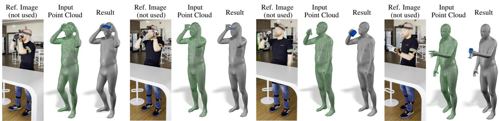  
Figure 1. Human-Centric prediction of Human-Object Interaction. We explore Human-Object interaction when only the cues of the human pose interacting with an unobserved object are available (’Input’). We propose a neural model that, for the first time, can infer the location of the object (’Result’) from such input. This is possible even when our subject simulates the interactions with the object (’Reference Image’).

## Abstract

The intimate entanglement between objects affordances and human poses is of large interest, among others, for behavioural sciences, cognitive psychology, and Computer Vision communities. In recent years, the latter has developed several object-centric approaches: starting from items, learning pipelines synthesizing human poses and dynamics in a realistic way, satisfying both geometrical and functional expectations. However, the inverse perspective is significantly less explored: Can we infer 3D objects and their poses from human interactions alone? Our investigation follows this direction, showing that a generic 3D human point cloud is enough to pop up an unobserved object, even when the user is just imitating a functionality (e.g., looking through a binocular) without involving a tangible counterpart. We validate our method qualitatively and quantitatively, with synthetic data and sequences acquired for the task, showing applicabilityfor XR/VR.

## 1. Introduction

Complex interactions with the world are among the unique skills distinguishing humans from other living beings. Even though our perception might be imperfect (we cannot hear ultrasonic sounds or see ultraviolet light [49]), our cognitive representation is enriched with a functional perspective, i.e., potential ways of interacting with objects or, as introduced by Gibson and colleagues, the affordance of the objects [19]. Several behavioural studies confirmed the centrality of this concept [2, 9, 43], which plays a fundamental role also for kids’ development [2]. Computer Vision is well-aware that the function of an object complements its appearance [21], and exploited this in tasks like human and object reconstruction [62]. Previous literature approaches the interaction analysis from an object perspective (i.e., given an object, analyze the human interaction) [8,22,63], building object-centric priors [73], generating realistic grasps given the object [13, 34], reconstructing hand-object interactions [8, 22, 63]. Namely, objects induce functionality, so a human interaction (e.g., a mug suggests a drinking action; an handle a grasping one). For the first time, our work reverts the perspective, suggesting that analyzing human motion and behaviour is naturally a humancentric problem (i.e., given a human interaction, what kind of functionality is it suggesting, Fig. 2). Moving the first step in this new research direction, we pose a fundamental question: Can we infer 3D objects and their poses from human interactions alone?

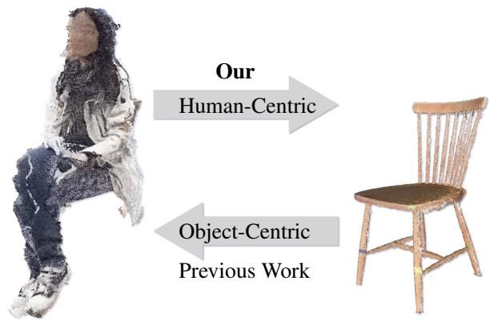  
Figure 2. Human-Centric vs. Object-Centric inference. A common perspective in the prior work is to infer affordances or human pose starting from an object. We explore the inverse, Human-Centric perspective of the human-object interaction relationship: given the human, we are interested in predicting the object.

At first sight, the problem seems particularly hard and significantly under-constrained since several geometries might fit the same action. However, the human body complements this information in several ways: physical relations, characteristic poses, or body dynamics serve as valuable proxies for the involved functionality, as suggested by Fig. 1. Such hints are so powerful that we can easily imagine the kind of object and its location, even if such an object does not exist. Furthermore, even if the given pose might fit several possible solutions, our mind naturally comes to the most natural one indicated by the observed behaviour. It also suggests that solely focusing on the contact region (an approach often preferred by previous works) is insufficient in this new viewpoint. The reification principle of Gestalt psychology [37] highlights that ”the whole” arises from ”the parts” and their relation. Similarly, in Fig. 3, the hand grasps in B) pop up a binocular in our mind because we naturally consider the relationship with the other body parts.

Finally, moving to a human-centric perspective in human-object interaction is critical for human studies and daily-life applications. Modern systems for AR/VR [24], and digital interaction [26] are both centered on humans, often manipulating objects that do not have a real-world counterpart. Learning to decode an object from human behaviour enables unprecedented applications.

To answer our question, we deploy a first straightforward and effective pipeline to ”pop up” a rigid object from a 3D human point cloud. Starting from the input human point cloud and a class, we train an end-to-end pipeline to infer object location. In case a temporal sequence of point clouds is available, we suggest post-processing to avoid jittering and inconsistencies in the predictions, showing the relevance of this information to handle ambiguous poses. We show promising results on previously unaddressed tasks in digital and real-world scenes. Finally, our method allows us to analyze different features of human behaviour, highlight their contribution to object retrieval, and point to exciting directions for future works.

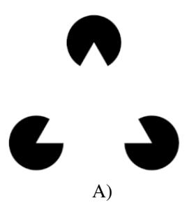

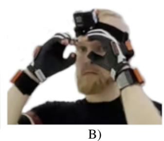  
Figure 3. Reification principle. Gestalt theory suggests our perception considers the whole before the single parts (A). This served as inspiration for our work: the object can arise considering the body parts as a whole (B).

In summary, our main contributions are:

1. We formulate a novel problem, changing the perspective taken by previous works in the field, and open to a yet unexplored research direction;

2. We introduce a method capable of predicting the object starting from an input human point cloud;

3. We analyze different components of the human-object relationship: the contribution of different pieces of interactions (hands, body, time sequence), the point-wise saliency of input points, and the confusion produced by objects with similar functions.

All the code will be made publicly available.

## 2. Related Work

## 2.1. Object Functionality

In the core of human perception of objects, functionality complements physical appearance, enhancing our perception. Gibson [19] introduced the idea that humans use affordances of objects for perception. Affordance can be defined as: ”an intrinsic property of an object, allowing an action to be performed with the object” [35].

From a Computer Vision perspective, object functionality supports several tasks such as scene analysis [21], object classification [17, 35], object properties inferring [71], and it is also possible to learn object-specific human interaction models from 2D images [62]. These works suggest an intimate entanglement between the action and the object itself.

## 2.2. Human-Object interaction

Modelling environment-aware humans and their interactions in 3D is one of the most recent challenges to creating virtual humans. We see two main lines of work there: handfocused and full-body ones.

Hand-Object Interaction. Several works tackle the problem of human interaction, focusing solely on the hands [10]. This has been done starting from 2D [8, 15, 18, 22, 25, 29, 30, 34, 61, 63], 2.5D [3, 5], and 3D data [4, 34, 55]. Particularly promising seems the application of well-designed priors for the motion [73]. The class of objects involved in these works are mainly limited to graspable ones. We argue that interactions involving different body parts are common in everyday life, more attractive from an applicative perspective, and more challenging. Moreover, full-body context is crucial in reconstructing even grasp interactions since body pose contains information on an object’s properties, e.g. pounding with a hammer affects the whole posture to support the action.

Fully-Body Interaction. On this line, several works focus on the interaction between a human and a scene [12,28, 31,38,57,64,65,69]. Also, in this case, priors can be used to regularize the motion [48]. Several datasets are also available to study the interaction between a human and a single object. For example, recent BEHAVE [1], GRAB [55], and InterCap [32] capture full-body interactions with diverse objects. Works address the task of humans interactions reconstruction from different kinds of data sources like single image [59, 67], video [16, 50, 60], and multiview capturing [1, 33, 51], and synthetization of them as well [7,27,41,54,56,58,66,70]. However, in all these works, we observe a general object-centric perspective: given a scene or an object, they aim to recreate the humans interacting with them. We argue that the significantly less explored complementary one has more concrete applications in daily life, especially in VR/XR contexts where the human is central to the system.

## 2.3. Human-centric perspective

While the general trend mainly focuses on the surrounding environment and objects, there is a growing interest and availability of egocentric tools for humans [23, 68] also interacting with objects [24,36,39]. They provide a subjective view and a valuable paradigm for several applications, like letting a user interact with objects in the digital world. Recent works also involve more sophisticated devices [52,53], while they are still far from applicability. In a similar direction to our work, others propose to recover objects arrangements in a room starting from the human motion [42], to hallucinate a coherent 2D image from a human pose [6], or predicting physical properties of the objects (e.g., the weight of a box) from human joints [71]. While the principle inspires us, our study significantly differs: we focus on object pose and its spatial relation with humans, starting solely from unordered point clouds.

## 3. Method

This section describes our setting and the main components of our methodology, both at inference and training time. An overview of our pipeline can be found in Fig. 4.

## 3.1. Object Pop-Up

Input. Our method starts from a single human point cloud $\bar { \mathbf { P } } \in \mathbb { R } ^ { N _ { P } \times 3 }$ with $N _ { P }$ points and a hot-encoded object class $c .$ The input point cloud can result from 3D/4D scans, IMUs template fitting, or any other shape-from-X approach. Regardless of the point cloud source, we remark that no further information is used apart from the 3D coordinates of the points. We represent each object as 1500 key points $\mathbf { K } _ { c }$ uniformly sampled on the template mesh.

Object Center. Training a model to predict an object pose from a human point cloud poses several challenges. Such a task requires the network to understand the location of different body parts and their subtle relations while jointly developing a sense of its spatial relationship with the human. Empirically, we observed that this is only feasible by carefully deconstructing the problem and designing different features to ease the learning process. As the first step to decompose this problem, we train a PointNet++ architecture [11,45] to predict the object center $\mathbf { o } _ { P }$ starting from P. At training time, this is supervised with an L2 loss against the ground truth center $\widehat { \mathbf { o } } _ { P } \mathbf { : }$

$$
L _ { { \mathbf { o } } _ { P } } ( { \bf P } ) = \| { \mathbf { o } } _ { P } - \widehat { \mathbf { o } } _ { P } \| _ { 2 } ^ { 2 } .\tag{1}
$$

Solving this task provides a good initialization for the object pose, and we move the key points associated with the input class c to the predicted center $\mathbf { o } _ { P }$ . Also, the features $\mathbf { F } _ { o } \in$ $\mathbb { R } ^ { 5 1 2 }$ extracted by the network encode import information on the whole human body.

Local Neighbourhood. The center prediction module can be further exploited using the nearest human regions. Intuitively, considering the closest body parts is essential to infer a contact relationship, but also the influence of body parts not directly in touch with the object (e.g., head orientation while using binoculars). To learn these connections, we consider the centered key points together with the 3000 closest points of the input human point cloud: ${ \bf P } _ { L } = K N N ( { \bf P } , { \bf o } _ { P } )$ . We pass these two sets as a unique point cloud to a PointNet++ network, obtaining a new set of per-point features $\mathbf { F } _ { P _ { L } } \in \mathbb { R } ^ { 1 2 8 }$

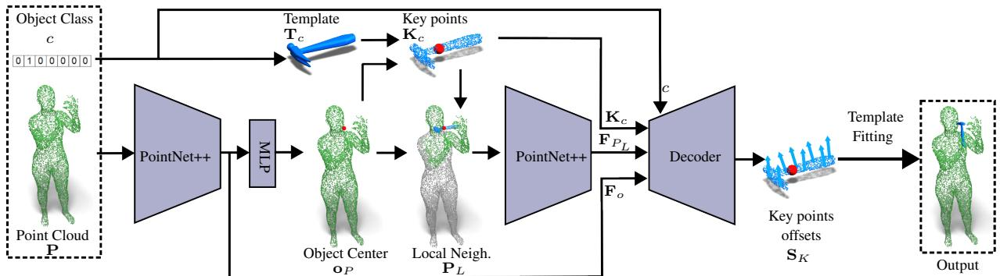  
Figure 4. Object pop-up. Our method predicts the position of an object, starting only from an input point cloud and an object class. It relies on a careful problem decomposition in several sub-tasks, extracting features that involve the entire human body and relations between body parts near the object.

Object displacement. To predict the object’s final position, we empirically observed that directly predicting a rotation and a translation is not a good solution. Inspired by recent works that suggest a point-wise offset prediction to recover 3D human shapes [14], we apply a similar approach to our task. Our goal is to predict a point-wise shift $\mathbf { S } _ { K }$ for the $\mathbf { K } _ { c }$ vertices to align them to the target pose. We append the features $\mathbf { F } _ { o } , \mathbf { F } _ { P _ { L } }$ , the one-hot encoding of the object class c, and a positional encoding to the centered key points, and we pass them to a decoder. At training time, we consider the following loss:

$$
L _ { o f f } ( \mathbf { K } _ { c } , \mathbf { F } _ { o } , \mathbf { F } _ { P _ { L } } , c ) = \| \mathbf { S } _ { K } - \widehat { \mathbf { S } } _ { K } \| _ { F } ^ { 2 } .\tag{2}
$$

The network is then trained end-to-end using:

$$
L = L _ { \mathbf { o } _ { P } } + \alpha L _ { o f f } .\tag{3}
$$

The weighting coefficient is $\alpha = 1 0$

## 3.2. Template fitting

Procrustes alignment. The point-wise offset produced by the network potentially distorts the key points structure in a non-rigid way. To recover the desired global rigid transformation, we rely on a Procrustes alignment [20]. This procedure takes as input two point clouds and returns the rotation R and the translation t to minimize the L2 distances of the points:

$$
P ( \cdot , \cdot )  ( { \bf R } , { \bf t } ) .\tag{4}
$$

We apply this to the template key points and their configuration obtained with our network:

$$
P ( \mathbf { K } _ { c } , \mathbf { K } _ { c } + { \mathbf { o } _ { P } } + \mathbf { S } _ { K } )  ( \mathbf { R } , \mathbf { t } ) .\tag{5}
$$

Finally, we recover the desired object pose as:

$$
\mathbf { T } ^ { \prime } = \mathbf { R } \mathbf { T } _ { c } + \mathbf { t }\tag{6}
$$

Time Smoothing. While our pipeline is designed to work with a single point cloud as input, considering the temporal evolution of interaction is often crucial, shaping the context of the individual poses. If a temporal sequence of point clouds is available, we provide a post-processing smoothing technique to take advantage of this further information. After running our method for each frame, we smooth the centering prediction across the sequence using a Gaussian kernel. Later, we will discuss a variation of our approach that also predicts the object class. In that case, we consider the most frequent class prediction over the whole set of frames to fix a class for the sequence.

## 4. Experiments

In this Section, we will describe the datasets used for training and testing our method. Then, we will present the baseline and the evaluation metrics. Finally, we will provide validation of our method as well as an analysis of its extended version that allows object class prediction.

Datasets We jointly train on the union of BEHAVE [1] and GRAB [55], obtaining a set of:

• 15 subjects, first 8 subjects from the GRAB dataset and 7 subjects from the official training part of BEHAVE;

• 40 different classes of objects, including all 20 objects from the BEHAVE dataset and 20 selected objects from the GRAB dataset;

We downsample training sequences of GRAB and BE-HAVE to $1 0 f p s$ . To evaluate our method, we select subjects 9 and 10 from the GRAB dataset and downsample the sequences to $3 0 f p s$ . For the BEHAVE dataset, we use the official test part, which includes all sequences at $1 f p s$ with subject 3 and part of the sequences with subjects 4, 5. As an input, we use point clouds with 9000 points sampled uniformly over the SMPL-H [44] meshes. We refer to raw point clouds from the BEHAVE dataset used in our experiments as BEHAVE-Raw. We use point clouds that are fused from 4 Kinect sensors and subsample 90k points from them.

<table><tr><td rowspan="2">Methods</td><td colspan="2">GRAB</td><td colspan="2">BEHAVE</td><td colspan="2">BEHAVE-Raw</td></tr><tr><td> $\overline { { E _ { c } \downarrow } }$ </td><td> $\overline { { E _ { v 2 v } \mathcal { L } } }$ </td><td> $\overline { { E _ { c } \downarrow } }$ </td><td> $\overline { { E _ { v 2 v } \mathcal { L } } }$ </td><td> $\overline { { E _ { c } \downarrow } }$ </td><td> $\overline { { E _ { v 2 v } \mathcal { L } } }$ </td></tr><tr><td>NN</td><td>0.0362</td><td>0.1445</td><td>0.0802</td><td>0.3445</td><td></td><td></td></tr><tr><td>Ours</td><td>0.0237</td><td>0.0943</td><td>0.0663</td><td>0.2900</td><td>0.0806</td><td>0.3143</td></tr></table>

Table 1. Comparison with the baseline. Our method significantly outperforms the baseline, even though the baseline uses the vertex order as additional information. Moreover, the baseline method does not generalize to point clouds with an arbitrary number of vertices.

Data augmentation. During training, to simulate errors in the center prediction, we randomly translate and rotate the object around the ground-truth center $\widehat { \mathbf { o } } _ { P }$

Implementation details. We implement our method using PyTorch framework and use Nvidia RTX3090 GPU for training and evaluation. The model is trained using Adam optimizer for 60 epochs with a learning rate of $1 e ^ { - 4 }$ , which decays 10 times after 30-th and 40-th epochs. For the first 20 epochs of training, we use ground-truth object center $\widehat { \mathbf { o } } _ { P }$ instead of predicted $\mathbf { o } _ { P }$ to select local neighborhood $\mathbf { F } _ { P _ { L } }$ to warm up the local PointNet++ encoder.

Nearest-Neighbor Baseline. Since we are the first to tackle this task and no competitors are available, we propose a simple while informative baseline. Given the input point cloud, we recover the most similar in the training dataset in an L2 sense. Then, we recover the object handled by that subject and pose it in space in the same way. This baseline demonstrates that the task is non-trivial and the generalization to unseen poses and subjects of our method. Also, this baseline requires that the target point cloud and the ones in the training set share the same number of points. Hence, if the input point cloud is a raw scan, this baseline is not applicable. Our method, instead, does not rely on this assumption and is more general.

Object classification. In our research, we also investigate the possibility of incorporating class prediction inside the network training. This task is significantly difficult at a single-frame level since an isolated pose often does not suggest a clear functionality. However, including this step is interesting to analyze the interaction and the nature of the network confusion. Hence, we modify our method by adding a decoder module that takes the global features $\mathbf { F } _ { o }$ and the local ones $\mathbf { F } _ { P _ { L } }$ as input to predict the object class. Then, we add to the training a simple cross-entropy loss between the predicted class and the ground truth one $\widehat { C } _ { P }$

## 4.1. Metrics

In qualitative experiments, we use three main metrics to evaluate our results. In the tables, we report the average error across the considered test samples.

Vertex-to-vertex. In most cases, our resulting object and the target one share the same number of vertices. Hence, we can compute the error between our prediction and the ground truth $\widehat { \mathbf { T } } ^ { \prime }$ as a point-to-point error:

$$
E _ { v 2 v } = \lVert \mathbf { T } ^ { \prime } - \widehat { \mathbf { T } } ^ { \prime } \rVert _ { F } .\tag{7}
$$

When such error is computed only between the object centers, we will refer to it as $E _ { c }$

Chamfer distance. When we evaluate the network that also predicts the class, target objects and selected templates might not share the same number of vertices. In that case, as a metric we use bi-directional Chamfer distance:

$$
E _ { c h } = \frac { 1 } { \| \mathbf { T } ^ { \prime } \| } \sum _ { x \in \mathbf { T } ^ { \prime } } \operatorname* { m i n } _ { y \in \hat { \mathbf { T } } ^ { \prime } } \| x - y \| _ { 2 } + \frac { 1 } { \| \widehat { \mathbf { T } } ^ { \prime } \| } \sum _ { y \in \widehat { \mathbf { T } } ^ { \prime } } \operatorname* { m i n } _ { x \in \mathbf { T } ^ { \prime } } \| y - x \| _ { 2 }\tag{8}
$$

Classification Accuracy. In case we use our network to predict the object class, we measure our misclassification error in terms of accuracy.

## 4.2. Object pose Evaluation

In Tab. 1, we report the quantitative evaluation on the test set of the datasets, comparing our method to the baseline. Our approach significantly outperforms the baseline, even if this latter exploits the points order information. We obtain the most significant margin on the GRAB dataset, where objects are small and mainly involve hands, showing the precision of our method. The baseline cannot be applied on BEHAVE-Raw since it does not share the same number of vertices as the training set, while our method shows only a limited performance decrease, pointing to generalization also to point clouds coming from different sources. We report qualitative results of our method on GRAB (first two rows) and BEHAVE (last row) in Fig. 5, and on BEHAVE-Raw in Fig. 6. Finally, to further evaluate the generalization of our method to unseen poses and subjects, we also considered point clouds obtained by an egocentric pipeline.

# 11 1 1 中 中 19

Figure 5. Qualitative results. Results of our method on GRAB (first and second rows) and BEHAVE (third row) datasets.

In this scenario, we record a user motion with an XSens system [46], retarget the pose to an SMPL+H model, and obtain the point cloud by sampling the resulting mesh. Outputs of our method can be observed in Fig. 1 and Fig. 7. Generalizing to unseen poses and subjects acquired with wearable systems prone to measurement errors opens several exciting applications for VR/XR contexts.

## 4.3. Human Affordance analysis

We use our method to analyze human-object interaction considering three key factors: changes in the input information, the points saliency, and confusion in classification.

Input information. Since we are curious to analyze how information is encoded in the inputs, we consider three more scenarios:

• Hands: We generate the input data using the MANO [47] hand model annotations included in GRAB dataset. Hence, the model should infer the pose of the object without relying on other body parts.

• SMPL: We consider all the points of the subject, but the ones from the hands are in the rest pose provided by SMPL [40]. In this way, we analyze how much the network captures the information of the finger pose.

<table><tr><td rowspan="2">Methods</td><td colspan="2">GRAB</td><td colspan="2">BEHAVE</td><td colspan="2">BEHAVE-Raw</td></tr><tr><td>Ec ↓</td><td>Ev2v ↓</td><td> $\overline { { E _ { c } } }$  ↓</td><td>Ev2v ↓</td><td>Ec↓</td><td>Ev2v ↓</td></tr><tr><td>Ours, hands</td><td>0.3015</td><td>0.7358</td><td>一</td><td></td><td></td><td></td></tr><tr><td>Ours, SMPL</td><td>0.0245</td><td>0.1009</td><td>0.0667</td><td>0.2877</td><td>0.0843</td><td>0.3205</td></tr><tr><td>Ours, SMPLH</td><td>0.0237</td><td>0.0943</td><td>0.0663</td><td>0.2900</td><td>0.0806</td><td>0.3143</td></tr><tr><td>Ours, SMPLH+T</td><td>0.0235</td><td>0.0983</td><td>0.0686</td><td>0.2880</td><td>0.0823</td><td>0.3161</td></tr></table>

Table 2. Human Affordance. We use our pipeline to explore how different inputs affect the object pose prediction. Using full body provides richer features for object recovery.

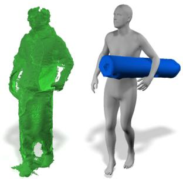

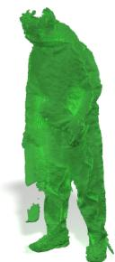

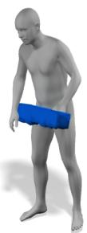

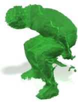

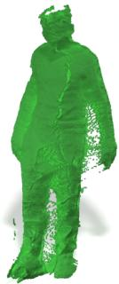

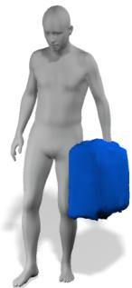

Figure 6. BEHAVE-Raw. Results of our method considering as input raw point clouds from BEHAVE dataset. Despite the amount of noise and occlusions, our method is able to generalize and performs reliably.

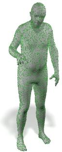

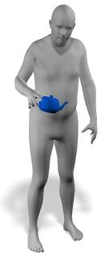

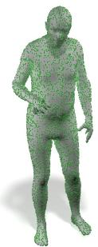

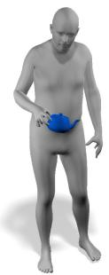

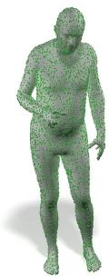

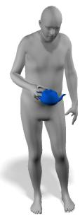

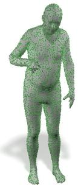

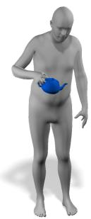

Figure 7. Human from IMUs. Results of our method from a motion sequence acquired with IMUs. Even if the subject is unseen and the motion is subject to noise in the IMUs sensors, our method produces stable results.

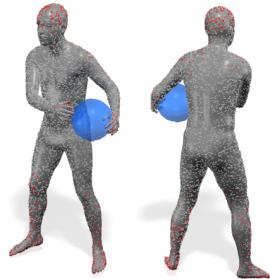  
Basketball

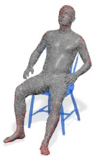  
Chairwood

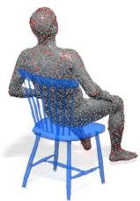

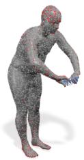

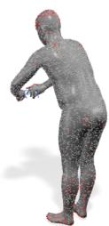  
Eyeglasses

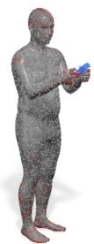

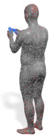  
Controller

Figure 8. Saliency. Point cloud saliency computed for different objects, rendered from two perspectives. The contact region is relevant for all the interactions, while the network also focuses on the feet and head regions. All the predictions are results of our method.

• SMPLH+T: We consider all the points of the subject with the finger correctly posed (as in our method), and also we apply the temporal smoothing outlined in Sec. 3. Temporal information contextualizes the interactions and regularizes the predictions throughout the sequence.

only hands is not sufficient to achieve satisfactory performance on the GRAB dataset. However, introducing more contextual information helps refine these results, unavailing information on other body parts.

For the first two cases, we train ad-hoc networks. Results of this analysis are reported in Tab. 2. We notice that using

Points saliency. As further evidence that object interaction involves different body parts, we conducted a study to discover what input points are crucial for the network.

<table><tr><td rowspan="2">Method</td><td colspan="3">GRAB</td><td colspan="3">BEHAVE</td></tr><tr><td> $\overline { { E _ { c } \downarrow } }$ </td><td> $\overline { { E _ { c h } \ : , } }$ </td><td>Acc.↑</td><td> $\overline { { E _ { c } \downarrow } }$ </td><td> $\overline { { E _ { c h } \downarrow } }$ </td><td>Acc.↑</td></tr><tr><td>NN, SMPLH</td><td>0.0404</td><td>0.1938</td><td>15.42</td><td>0.0880</td><td>0.3873</td><td>21.48</td></tr><tr><td>Ours, SMPLH</td><td>0.0290</td><td>0.1387</td><td>20.80</td><td>0.0728</td><td>0.3046</td><td>24.16</td></tr><tr><td>Ours, SMPLH + T</td><td>0.0263</td><td>0.1384</td><td>30.15</td><td>0.0722</td><td>0.3069</td><td>49.28</td></tr></table>

Table 3. Object classification. Quantitative results of models with object class prediction. Introducing temporal information has a dramatic impact on object classification.
<table><tr><td rowspan=5 colspan=1>CoffemugCnpDorkknobHamer</td><td rowspan=1 colspan=1>Coffeemug</td><td rowspan=1 colspan=1>Cup</td><td rowspan=1 colspan=1>Dorknoob</td><td rowspan=1 colspan=1>Hammer</td></tr><tr><td rowspan=1 colspan=1>394</td><td rowspan=1 colspan=1>6</td><td rowspan=1 colspan=1>1</td><td rowspan=1 colspan=1>42</td></tr><tr><td rowspan=1 colspan=1>396</td><td rowspan=1 colspan=1>213</td><td rowspan=1 colspan=1>1</td><td rowspan=1 colspan=1>26</td></tr><tr><td rowspan=1 colspan=1>0</td><td rowspan=1 colspan=1>0</td><td rowspan=1 colspan=1>274</td><td rowspan=1 colspan=1>0</td></tr><tr><td rowspan=1 colspan=1>8</td><td rowspan=1 colspan=1>19</td><td rowspan=1 colspan=1>0</td><td rowspan=1 colspan=1>279</td></tr></table>

Figure 9. Confusion Matrix. The confusion matrix for a subset of the predicted classes. Objects with similar functionality are often confused (Coffemug vs Cup), while ones that suggest characteristic human poses (Dorknoob, Hammer) are well separated.

We follow a recent protocol to find 3D point cloud saliency [72]: we cast the input through the network, we compute a loss on the output (in our case, the one in Eq. (2)), and we modify the input using the backpropagated gradient. This procedure is performed iteratively, and we refer to [72] for the details. We report the results of this study in Fig. 8, where points modified by the procedure are highlighted in red. We find the results of this analysis fascinating. As expected, the contact region is always essential to infer the correct object location. However, feet play a crucial role in all the reported cases, since they provide information about the human position and the consequent pose of the body. Another highlighted region is the head: different orientations give clues about object location and body posture.

Confusion in classification. As a final analysis, we explore the learning object classification during the training. We jointly train a further MLP module that takes as an input ${ \bf F } _ { o }$ and predicts the object class, using a cross-entropy loss. When a time sequence of point clouds is available, we exploit it by selecting the class with the highest score across the frames and applying it to the whole sequence. We report results in Tab. 3. Our experiment suggests that the task is challenging while, given the number of classes (40), we still consider our results a promising first step. Also, we notice that temporal smoothing significantly helps classification accuracy. Temporal context disambiguate poses without a clear functionality. In Fig. 9, we report the confusion matrix for a subset of the classes for our method. The misclassification mainly arises from interactions of objects with similar functionality.

## 5. Conclusions

In this work, we have addressed a novel and inspiring problem that changes the perspective on object-human interaction. Our proposed model is simple, carefully designed, and inspired by behavioural studies. We collected evidence of the method’s effectiveness on a large set of object classes and empirically proved its generalization on noisy and different inputs. Finally, our analysis of human affordance is unprecedented, showing that human-object interaction can also involve body parts distant from the object and pointing to interesting relations useful for applications and subsequent works.

Limitations and Future Works. As the first exploration in this direction, our study enables several future possibilities. In this work, the temporal information is only used after the training procedure. Incorporating this information can create other patterns, further improving the results quality. Our empirical evidence suggests that class prediction requires further investigation and more sophisticated techniques, like specialized attention mechanisms. Finally, we do not consider sequences that involve long (e.g., hourslong) and complex (e.g., multi-objects) interactions, which are difficult to capture. We hope our work can foster the community to collect such datasets.

Acknowledgements Special thanks to the RVH team and reviewers, their feedback helped improve the manuscript. This work is funded by the Deutsche Forschungsgemeinschaft (DFG, German Research Foundation) - 409792180 (EmmyNoether Programme, project: Real Virtual Humans) and the German Federal Ministry of Education and Research (BMBF): Tubingen AI Center, FKZ: 01IS18039A. G. Pons-Moll is a mem-¨ ber of the Machine Learning Cluster of Excellence, EXC number 2064/1 – Project number 390727645. The authors thank the International Max Planck Research School for Intelligent Systems (IMPRS-IS) for supporting I. Petrov. R. Marin is supported by an Alexander von Humboldt Foundation Research Fellowship.

## References

[1] Bharat Lal Bhatnagar, Xianghui Xie, Ilya A. Petrov, Cristian Sminchisescu, Christian Theobalt, and Gerard Pons-Moll. BEHAVE: Dataset and Method for Tracking Human Object Interactions. In Proceedings of the IEEE/CVF Conference on Computer Vision and Pattern Recognition, pages 15935– 15946, 2022. 3, 4

[2] Amy E Booth and Sandra Waxman. Object names and object functions serve as cues to categories for infants. Developmental psychology, 38(6):948, 2002. 1

[3] Samarth Brahmbhatt, Cusuh Ham, Charles C Kemp, and James Hays. Contactdb: Analyzing and predicting grasp contact via thermal imaging. In Proceedings of the IEEE/CVF conference on computer vision and pattern recognition, pages 8709–8719, 2019. 3

[4] Samarth Brahmbhatt, Ankur Handa, James Hays, and Dieter Fox. Contactgrasp: Functional multi-finger grasp synthesis from contact. In 2019 IEEE/RSJ International Conference on Intelligent Robots and Systems (IROS), pages 2386–2393. IEEE, 2019. 3

[5] Samarth Brahmbhatt, Chengcheng Tang, Christopher D Twigg, Charles C Kemp, and James Hays. Contactpose: A dataset of grasps with object contact and hand pose. In European Conference on Computer Vision, pages 361–378. Springer, 2020. 3

[6] Tim Brooks and Alexei A Efros. Hallucinating posecompatible scenes. In European Conference on Computer Vision, pages 510–528. Springer, 2022. 3

[7] Zhe Cao, Hang Gao, Karttikeya Mangalam, Qi-Zhi Cai, Minh Vo, and Jitendra Malik. Long-term human motion prediction with scene context. In European Conference on Computer Vision, pages 387–404. Springer, 2020. 3

[8] Zhe Cao, Ilija Radosavovic, Angjoo Kanazawa, and Jitendra Malik. Reconstructing Hand-Object Interactions in the Wild. In Proceedings of the IEEE/CVF International Conference on Computer Vision, pages 12417–12426, 2021. 1, 3

[9] Laura A Carlson-Radvansky, Eric S Covey, and Kathleen M Lattanzi. “what” effects on “where”: Functional influences on spatial relations. Psychological Science, 10(6):516–521, 1999. 1

[10] Yu-Wei Chao, Wei Yang, Yu Xiang, Pavlo Molchanov, Ankur Handa, Jonathan Tremblay, Yashraj S Narang, Karl Van Wyk, Umar Iqbal, Stan Birchfield, et al. Dexycb: A benchmark for capturing hand grasping of objects. In Proceedings of the IEEE/CVF Conference on Computer Vision and Pattern Recognition, pages 9044–9053, 2021. 3

[11] R. Qi Charles, Hao Su, Mo Kaichun, and Leonidas J. Guibas. PointNet: Deep Learning on Point Sets for 3D Classification and Segmentation. In 2017 IEEE Conference on Computer Vision and Pattern Recognition (CVPR), pages 77–85, July 2017. 3

[12] Yixin Chen, Siyuan Huang, Tao Yuan, Siyuan Qi, Yixin Zhu, and Song-Chun Zhu. Holistic++ scene understanding: Single-view 3d holistic scene parsing and human pose estimation with human-object interaction and physical commonsense. In Proceedings of the IEEE/CVF International Conference on Computer Vision, pages 8648–8657, 2019. 3

[13] Sammy Christen, Muhammed Kocabas, Emre Aksan, Jemin Hwangbo, Jie Song, and Otmar Hilliges. D-Grasp: Physically Plausible Dynamic Grasp Synthesis for Hand-Object Interactions. arXiv:2112.03028 [cs], Mar. 2022. 1

[14] Enric Corona, Gerard Pons-Moll, Guillem Alenya, and\` Francesc Moreno-Noguer. Learned vertex descent: A new direction for 3d human model fitting. arXiv preprint arXiv:2205.06254, 2022. 4

[15] Enric Corona, Albert Pumarola, Guillem Alenya, Francesc Moreno-Noguer, and Gregory Rogez. Ganhand: Predicting´ human grasp affordances in multi-object scenes. In Proceedings of the IEEE/CVF conference on computer vision and pattern recognition, pages 5031–5041, 2020. 3

[16] Rishabh Dabral, Soshi Shimada, Arjun Jain, Christian Theobalt, and Vladislav Golyanik. Gravity-Aware Monocular 3D Human-Object Reconstruction. In 2021 IEEE/CVF International Conference on Computer Vision (ICCV), pages 12345–12354, Oct. 2021. 3

[17] Shengheng Deng, Xun Xu, Chaozheng Wu, Ke Chen, and Kui Jia. 3d affordancenet: A benchmark for visual object affordance understanding. In Proceedings of the IEEE/CVF Conference on Computer Vision and Pattern Recognition, pages 1778–1787, 2021. 3

[18] Kiana Ehsani, Shubham Tulsiani, Saurabh Gupta, Ali Farhadi, and Abhinav Gupta. Use the force, luke! learning to predict physical forces by simulating effects. In Proceedings of the IEEE/CVF Conference on Computer Vision and Pattern Recognition, pages 224–233, 2020. 3

[19] Eleanor J Gibson. The concept of affordances in development: The renascence of functionalism. In The concept of development: The Minnesota symposia on child psychology. Vol, volume 15, pages 55–81, 1982. 1, 2

[20] John C Gower. Generalized procrustes analysis. Psychometrika, 40(1):33–51, 1975. 4

[21] Helmu t Grabner, Juergen Gall, and Luc Van Gool. What makes a chair a chair? In CVPR 2011, pages 1529–1536, Colorado Springs, CO, USA, June 2011. IEEE. 1, 2

[22] Patrick Grady, Chengcheng Tang, Christopher D. Twigg, Minh Vo, Samarth Brahmbhatt, and Charles C. Kemp. ContactOpt: Optimizing Contact to Improve Grasps. In 2021 IEEE/CVF Conference on Computer Vision and Pattern Recognition (CVPR), pages 1471–1481, June 2021. 1, 3

[23] Vladimir Guzov, Aymen Mir, Torsten Sattler, and Gerard Pons-Moll. Human poseitioning system (hps): 3d human pose estimation and self-localization in large scenes from body-mounted sensors. In Proceedings of the IEEE/CVF Conference on Computer Vision and Pattern Recognition, pages 4318–4329, 2021. 3

[24] Vladimir Guzov, Torsten Sattler, and Gerard Pons-Moll. Visually plausible human-object interaction capture from wearable sensors. In arXiv, 2022. 2, 3

[25] Shreyas Hampali, Sayan Deb Sarkar, Mahdi Rad, and Vincent Lepetit. Keypoint transformer: Solving joint identification in challenging hands and object interactions for accurate 3d pose estimation. In Proceedings of the IEEE/CVF Conference on Computer Vision and Pattern Recognition, pages 11090–11100, 2022. 3

[26] Gregor Harih and Bojan Dolsak. Tool-handle design basedˇ on a digital human hand model. International Journal of Industrial Ergonomics, 43(4):288–295, July 2013. 2

[27] Mohamed Hassan, Duygu Ceylan, Ruben Villegas, Jun Saito, Jimei Yang, Yi Zhou, and Michael J Black. Stochastic scene-aware motion prediction. In Proceedings of the IEEE/CVF International Conference on Computer Vision, pages 11374–11384, 2021. 3

[28] Mohamed Hassan, Vasileios Choutas, Dimitrios Tzionas, and Michael J Black. Resolving 3d human pose ambiguities with 3d scene constraints. In Proceedings of the IEEE/CVF international conference on computer vision, pages 2282– 2292, 2019. 3

[29] Yana Hasson, Gul Varol, Cordelia Schmid, and Ivan¨ Laptev. Towards unconstrained joint hand-object reconstruction from rgb videos. In 2021 International Conference on 3D Vision (3DV), pages 659–668. IEEE, 2021. 3

[30] Yana Hasson, Gul Varol, Dimitrios Tzionas, Igor Kalevatykh, Michael J Black, Ivan Laptev, and Cordelia Schmid. Learning joint reconstruction of hands and manipulated objects. In Proceedings of the IEEE/CVF conference on computer vision and pattern recognition, pages 11807–11816, 2019. 3

[31] Chun-Hao P. Huang, Hongwei Yi, Markus Hoschle, Matvey¨ Safroshkin, Tsvetelina Alexiadis, Senya Polikovsky, Daniel Scharstein, and Michael J. Black. Capturing and inferring dense full-body human-scene contact. In IEEE/CVF Conf. on Computer Vision and Pattern Recognition (CVPR), pages 13274–13285, June 2022. 3

[32] Yinghao Huang, Omid Taheri, Michael J Black, and Dimitrios Tzionas. Intercap: Joint markerless 3d tracking of humans and objects in interaction. In DAGM German Conference on Pattern Recognition, pages 281–299. Springer, 2022. 3

[33] Yuheng Jiang, Suyi Jiang, Guoxing Sun, Zhuo Su, Kaiwen Guo, Minye Wu, Jingyi Yu, and Lan Xu. Neuralhofusion: Neural volumetric rendering under human-object interactions. In Proceedings of the IEEE/CVF Conference on Computer Vision and Pattern Recognition, pages 6155– 6165, 2022. 3

[34] Korrawe Karunratanakul, Jinlong Yang, Yan Zhang, Michael J. Black, Krikamol Muandet, and Siyu Tang. Grasping Field: Learning Implicit Representations for Human Grasps. In 2020 International Conference on 3D Vision (3DV), pages 333–344, Nov. 2020. 1, 3

[35] Hedvig Kjellstrom, Javier Romero, and Danica Kragi¨ c. Vi-´ sual object-action recognition: Inferring object affordances from human demonstration. Computer Vision and Image Understanding, 115(1):81–90, Jan. 2011. 2, 3

[36] Taein Kwon, Bugra Tekin, Jan Stuhmer, Federica Bogo, and¨ Marc Pollefeys. H2o: Two hands manipulating objects for first person interaction recognition. In Proceedings of the IEEE/CVF International Conference on Computer Vision, pages 10138–10148, 2021. 3

[37] Steven M Lehar. The world in your head: A gestalt view of the mechanism of conscious experience. Psychology Press, 2003. 2

[38] Zhi Li, Soshi Shimada, Bernt Schiele, Christian Theobalt, and Vladislav Golyanik. Mocapdeform: Monocular 3d human motion capture in deformable scenes. In International Conference on 3D Vision (3DV), 2022. 3

[39] Yunze Liu, Yun Liu, Che Jiang, Kangbo Lyu, Weikang Wan, Hao Shen, Boqiang Liang, Zhoujie Fu, He Wang, and Li Yi. Hoi4d: A 4d egocentric dataset for category-level humanobject interaction. In Proceedings of the IEEE/CVF Conference on Computer Vision and Pattern Recognition, pages 21013–21022, 2022. 3

[40] Matthew Loper, Naureen Mahmood, Javier Romero, Gerard Pons-Moll, and Michael J Black. Smpl: A skinned multiperson linear model. ACM transactions on graphics (TOG), 34(6):1–16, 2015. 6

[41] Priyanka Mandikal and Kristen Grauman. Learning dexterous grasping with object-centric visual affordances. In 2021 IEEE International Conference on Robotics and Automation (ICRA), pages 6169–6176. IEEE, 2021. 3

[42] Yinyu Nie, Angela Dai, Xiaoguang Han, and Matthias Nießner. Pose2room: understanding 3d scenes from human activities. In European Conference on Computer Vision, pages 425–443. Springer, 2022. 3

[43] Lisa M Oakes and Kelly L Madole. Function revisited: How infants construe functional features in their representation of objects. In Advances in child development and behavior, volume 36, pages 135–185. Elsevier, 2008. 1

[44] Georgios Pavlakos, Vasileios Choutas, Nima Ghorbani, Timo Bolkart, Ahmed AA Osman, Dimitrios Tzionas, and Michael J Black. Expressive body capture: 3d hands, face, and body from a single image. In Proceedings of the IEEE/CVF conference on computer vision and pattern recognition, pages 10975–10985, 2019. 4

[45] Charles Ruizhongtai Qi, Li Yi, Hao Su, and Leonidas J Guibas. PointNet++: Deep Hierarchical Feature Learning on Point Sets in a Metric Space. In Advances in Neural Information Processing Systems, volume 30. Curran Associates, Inc., 2017. 3

[46] Daniel Roetenberg, Henk Luinge, and Per Slycke. Moven: Full 6dof human motion tracking using miniature inertial sensors. Xsen Technologies, December, 2007. 6

[47] Javier Romero, Dimitrios Tzionas, and Michael J. Black. Embodied hands: Modeling and capturing hands and bodies together. ACM Transactions on Graphics, (Proc. SIG-GRAPH Asia), 36(6), Nov. 2017. 6

[48] Manolis Savva, Angel X Chang, Pat Hanrahan, Matthew Fisher, and Matthias Nießner. Pigraphs: learning interaction snapshots from observations. ACM Transactions on Graphics (TOG), 35(4):1–12, 2016. 3

[49] Colin G. Scanes. Chapter 1 - animal perception including differences with humans. In Colin G. Scanes and Samia R. Toukhsati, editors, Animals and Human Society, pages 1–11. Academic Press, 2018. 1

[50] Zhuo Su, Lan Xu, Dawei Zhong, Zhong Li, Fan Deng, Shuxue Quan, and Lu Fang. Robustfusion: Robust volumetric performance reconstruction under human-object interactions from monocular rgbd stream. arXiv preprint arXiv:2104.14837, 2021. 3

[51] Guoxing Sun, Xin Chen, Yizhang Chen, Anqi Pang, Pe Lin, Yuheng Jiang, Lan Xu, Jingyi Yu, and Jingya Wang. Neural free-viewpoint performance rendering under complex human-object interactions. In Proceedings of the 29th ACM International Conference on Multimedia, pages 4651–4660, 2021. 3

[52] Zhongda Sun, Minglu Zhu, Xuechuan Shan, and Chengkuo Lee. Augmented tactile-perception and haptic-feedback rings as human-machine interfaces aiming for immersive interactions. Nature communications, 13(1):1–13, 2022. 3

[53] Subramanian Sundaram, Petr Kellnhofer, Yunzhu Li, Jun-Yan Zhu, Antonio Torralba, and Wojciech Matusik. Learning the signatures of the human grasp using a scalable tactile glove. Nature, 569(7758):698–702, May 2019. 3

[54] Omid Taheri, Vasileios Choutas, Michael J. Black, and Dimitrios Tzionas. GOAL: Generating 4D whole-body motion for hand-object grasping. In IEEE/CVF Conf. on Computer Vision and Pattern Recognition (CVPR), pages 13263– 13273, June 2022. 3

[55] Omid Taheri, Nima Ghorbani, Michael J. Black, and Dimitrios Tzionas. GRAB: A Dataset of Whole-Body Human Grasping of Objects. In Andrea Vedaldi, Horst Bischof, Thomas Brox, and Jan-Michael Frahm, editors, Computer Vision – ECCV 2020, volume 12349, pages 581– 600. Springer International Publishing, Cham, 2020. 3, 4

[56] Weilin Wan, Lei Yang, Lingjie Liu, Zhuoying Zhang, Ruixing Jia, Yi-King Choi, Jia Pan, Christian Theobalt, Taku Komura, and Wenping Wang. Learn to predict how humans manipulate large-sized objects from interactive motions. IEEE Robotics and Automation Letters, 7(2):4702–4709, 2022. 3

[57] Zhenzhen Weng and Serena Yeung. Holistic 3d human and scene mesh estimation from single view images. In Proceedings of the IEEE/CVF Conference on Computer Vision and Pattern Recognition, pages 334–343, 2021. 3

[58] Yan Wu, Jiahao Wang, Yan Zhang, Siwei Zhang, Otmar Hilliges, Fisher Yu, and Siyu Tang. Saga: Stochastic wholebody grasping with contact. In Proceedings of the European Conference on Computer Vision (ECCV), 2022. 3

[59] Xianghui Xie, Bharat Lal Bhatnagar, and Gerard Pons-Moll. Chore: Contact, human and object reconstruction from a single rgb image. In European Conference on Computer Vision (ECCV). Springer, October 2022. 3

[60] Xianghui Xie, Bharat Lal Bhatnagar, and Gerard Pons-Moll. Visibility aware human-object interaction tracking from single rgb camera. In IEEE Conference on Computer Vision and Pattern Recognition (CVPR), June 2023. 3

[61] Lixin Yang, Xinyu Zhan, Kailin Li, Wenqiang Xu, Jiefeng Li, and Cewu Lu. Cpf: Learning a contact potential field to model the hand-object interaction. In Proceedings of the IEEE/CVF International Conference on Computer Vision, pages 11097–11106, 2021. 3

[62] Bangpeng Yao, Jiayuan Ma, and Li Fei-Fei. Discovering Object Functionality. In Proceedings of the IEEE International Conference on Computer Vision, pages 2512–2519, 2013. 1, 3

[63] Yufei Ye, Abhinav Gupta, and Shubham Tulsiani. What’s in your hands? 3d reconstruction of generic objects in hands.

In Proceedings of the IEEE/CVF Conference on Computer Vision and Pattern Recognition, pages 3895–3905, 2022. 1, 3

[64] Hongwei Yi, Chun-Hao P. Huang, Dimitrios Tzionas, Muhammed Kocabas, Mohamed Hassan, Siyu Tang, Justus Thies, and Michael J. Black. Human-Aware Object Placement for Visual Environment Reconstruction. In Proceedings of the IEEE/CVF Conference on Computer Vision and Pattern Recognition, pages 3959–3970, 2022. 3

[65] Andrei Zanfir, Elisabeta Marinoiu, and Cristian Sminchisescu. Monocular 3d pose and shape estimation of multiple people in natural scenes-the importance of multiple scene constraints. In Proceedings of the IEEE Conference on Computer Vision and Pattern Recognition, pages 2148– 2157, 2018. 3

[66] Jason Y Zhang, Panna Felsen, Angjoo Kanazawa, and Jitendra Malik. Predicting 3d human dynamics from video. In Proceedings of the IEEE/CVF International Conference on Computer Vision, pages 7114–7123, 2019. 3

[67] Jason Y Zhang, Sam Pepose, Hanbyul Joo, Deva Ramanan, Jitendra Malik, and Angjoo Kanazawa. Perceiving 3d human-object spatial arrangements from a single image in the wild. In European conference on computer vision, pages 34–51. Springer, 2020. 3

[68] Siwei Zhang, Qianli Ma, Yan Zhang, Zhiyin Qian, Marc Pollefeys, Federica Bogo, and Siyu Tang. Egobody: Human body shape, motion and social interactions from headmounted devices. arXiv preprint arXiv:2112.07642, 2021. 3

[69] Siwei Zhang, Yan Zhang, Federica Bogo, Marc Pollefeys, and Siyu Tang. Learning motion priors for 4d human body capture in 3d scenes. In Proceedings of the IEEE/CVF International Conference on Computer Vision, pages 11343– 11353, 2021. 3

[70] Xiaohan Zhang, Bharat Lal Bhatnagar, Sebastian Starke, Vladimir Guzov, and Gerard Pons-Moll. Couch: Towards controllable human-chair interactions. In European Conference on Computer Vision (ECCV). Springer, October 2022. 3

[71] Qian Zheng, Weikai Wu, Hanting Pan, Niloy Mitra, Daniel Cohen-Or, and Hui Huang. Inferring object properties from human interaction and transferring them to new motions. Computational Visual Media, 7(3):375–392, Sept. 2021. 3

[72] Tianhang Zheng, Changyou Chen, Junsong Yuan, Bo Li, and Kui Ren. Pointcloud saliency maps. In Proceedings of the IEEE/CVF International Conference on Computer Vision, pages 1598–1606, 2019. 8

[73] Keyang Zhou, Bharat Lal Bhatnagar, Jan Eric Lenssen, and Gerard Pons-Moll. TOCH: Spatio-Temporal Object-to-Hand Correspondence for Motion Refinement, July 2022. 1, 3