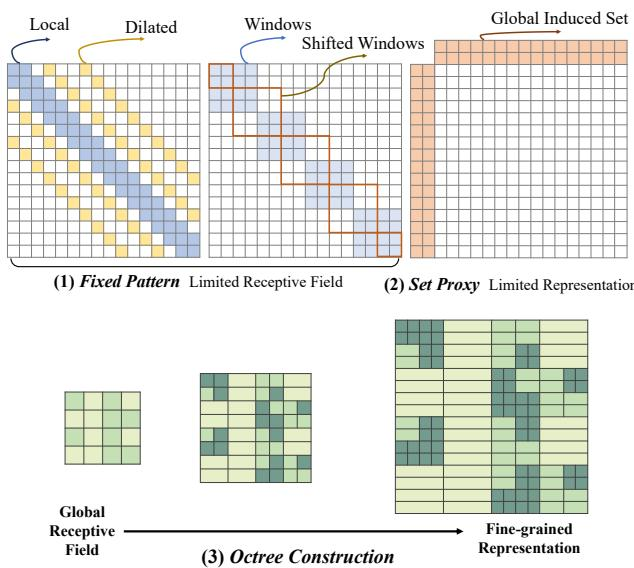
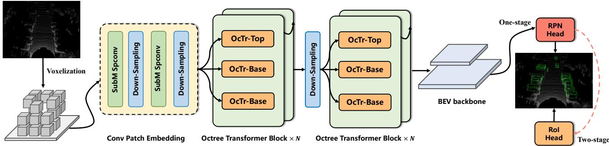
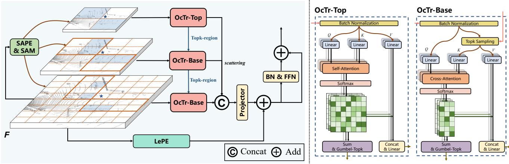
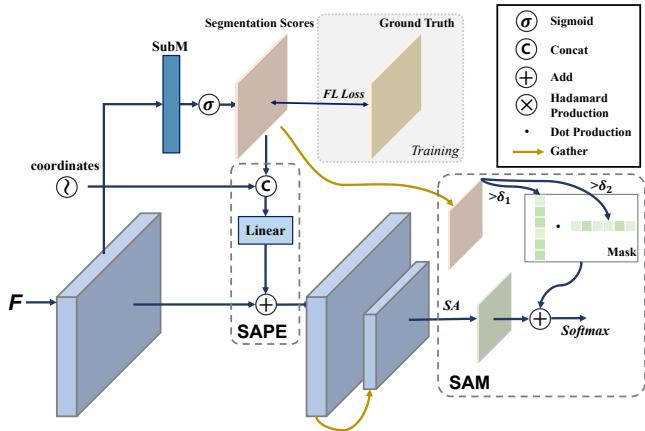
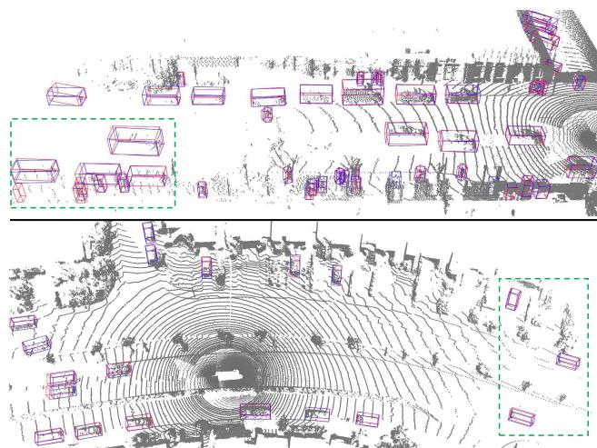

# OcTr: Octree-based Transformer for 3D Object Detection

Chao Zhou1,2, Yanan Zhang1,2, Jiaxin Chen2, Di Huang1,2,3\*

1State Key Laboratory of Software Development Environment, Beihang University, Beijing, China 2School of Computer Science and Engineering, Beihang University, Beijing, China 3Hangzhou Innovation Institute, Beihang University, Hangzhou, China {zhouchaobeing, zhangyanan, jiaxinchen, dhuang}@buaa.edu.cn

## Abstract

A key challenge for LiDAR-based 3D object detection is to capture sufficientfeaturesfrom large scale 3D scenes especially for distant or/and occluded objects. Albeit recent efforts made by Transformers with the long sequence modeling capability, they fail to properly balance the accuracy and efficiency, sufferingfrom inadequate receptive fields or coarse-grained holistic correlations. In this paper, we propose an Octree-based Transformer, named OcTr, to address this issue. It first constructs a dynamic octree on the hierarchical feature pyramid through conducting self-attention on the top level and then recursively propagates to the level below restricted by the octants, which captures rich global context in a coarse-to-fine manner while maintaining the computational complexity under control. Furthermore, for enhanced foreground perception, we propose a hybrid positional embedding, composed of the semantic-aware positional embedding and attention mask, to fully exploit semantic and geometry clues. Extensive experiments are conducted on the Waymo Open Dataset and KITTI Dataset, and OcTr reaches newly state-of-the-art results.

## 1. Introduction

3D object detection from point clouds has received extensive attention during the past decade for its ability to provide accurate and stable recognition and localization in autonomous driving perception systems. In this task, feature learning plays a very fundamental and crucial role; yet it is rather challenging due to not only the disordered and sparse nature of data sampling, but also to insufficient acquisition under occlusion or at a distance. To address this issue, many methods have been proposed, which can be taxonomized into two major classes, i.e. grid-based and point-based. The former first regularize point clouds into multi-view images or voxels and then apply 2D or 3D CNNs to build shape representations [4, 52], while the latter directly conduct MLP based networks such as PointNet++ [33] and DGCNN [50] on original points for geometry description [32, 40, 42, 60]. Unfortunately, they fail to capture necessary context information through the small receptive fields in the deep models, leading to limited results.

  
Figure 1. Illustration of three sparsification strategies of attention matrices. Fixed pattern (1) narrows receptive fields and set proxy (2) discards elaborate correlations. The proposed octree construction (3) keeps the global receptive field in a coarse-grained manner while maintaining fine-grained representations.

Witnessing the recent success of Transformers in NLP, many studies have investigated and extended such architectures for 3D vision [24, 29, 58, 61]. Transformers are reputed to model long-range dependencies, delivering global receptive fields, and to be suitable for scattered inputs of arbitrary sizes. Meanwhile, in contrast to those static weights that are learned in convolutions, Transformers dynamically aggregate the input features according to the relationships between tokens. Regarding the case in 3D object detection, compared to point-based Transformers [11,61], voxel-based ones show the superiority in efficiency. However, they tend to suffer heavy computations when dealing with large scale scenes because of the quadratic complexity of Transformers, with the underlying dilemma between the grid size and the grid amount in voxelization. Taking the KITTI dataset as an example, it is unrealistic for Transformers to operate on the feature map with the spatial shape of $2 0 0 \times 1 7 6 \times 5 .$ which is commonly adopted in most of the detection heads [38, 46, 52, 55].

More recently, there have appeared an influx of efficient self-attention model variants that attempt to tackle long sequences as input. They generally sparsify the attention matrix by fixed patterns [7, 23, 34], learned patterns [21, 45] or a combination of them [1, 56]. Fixed patterns chunk the input sequence into blocks of local windows or dilation windows, whilst learned patterns determine a notion of token relevance and eliminate or cluster outliers. Specific to 3D object detection from point clouds, VoTr [24] modifies selfattention with pre-defined patterns including local windows and stride dilation ones in a sparse query manner, and the dilation mechanism enlarges the receptive field by sampling attending tokens in a radius. SST [9] splits input tokens into non-overlapping patterns in a block-wise way and enables window shifting to capture cross-window correlation. Despite some improvements reported, they both only achieve bigger local receptive fields rather than the expected global ones, and computations still increase rapidly with the expansion of receptive fields.

Another alternative on self-attention is to take advantage of a proxy memory bank which has the access to the entire sequence tokens [1, 2, 56]. By using a small number of induced proxies to compress the whole sequence, it diffuses the global context efficiently. VoxSet [12] adapts Set Transformer [19] to 3D object detection and exploits an induced set to model a set-to-set point cloud translation. With the help of the compressed global proxies and Conv-FFN, it obtains a global receptive field; nevertheless, as they admit, it is sub-optimal to set only a few latent codes as proxies for a large 3D scene, prone to impairing the representation of different point cloud structures and their correlations. Therefore, there remains space for a stronger solution.

In this paper, we present a novel Transformer network, namely Octree-based Transformer (OcTr), for 3D object detection. We firstly devise an octree-based learnable sparse pattern, i.e. OctAttn, which meticulously and efficiently encodes point clouds of scenes as shown in Fig. 1. The OctAttn module constructs a feature pyramid by gathering and applies self-attention to the top level of the feature pyramid to select the most relevant tokens, which are deemed as the octants to be divided in the subsequent. When propagating to the level below, the key/value inputs are restricted by the octants from the top. Through recursively conducting this process, OctAttn captures rich global context features by a global receptive field in a coarse-to-fine manner while reducing the quadratic complexity of vanilla self-attention to the linear complexity. In addition, for better foreground perception, we propose a hybrid positional embedding, which consists of the semantic-aware positional embedding and attention mask, to fully exploit geometry and semantic clues. Thanks to the designs above, OcTr delivers a competitive trade-off between accuracy and efficiency.

Our contribution is summarized in three-fold:

1. We propose OcTr for voxel-based 3D object detection, which efficiently learns enhanced representations by a global receptive field with rich contexts.

2. We propose an octree-based learnable attention sparsification scheme (OctAttn) and a hybrid positional embedding combining geometry and semantics.

3. We carry out experiments on the Waymo Open Dataset (WOD) and the KITTI dataset and report state-of-theart performance with significant gains on far objects.

## 2. Related Work

## 2.1. 3D Object Detection from Point Clouds

There exist two prevailing point-cloud representations in 3D object detection, i.e. point-based and voxel-based.

The point-based methods [31,40,42,60] directly process raw point clouds in the irregular 3D space. As a pioneering attempt, F-Pointnet [32] employs instance segmentation in frustums to extract proposals. VoteNet [31] clusters objects from the surface in a deep Hough voting manner. PointR-CNN [40] generates 3D RoIs with foreground segmentation and applies an RCNN-style [35] two-stage refinement. Different from PointRCNN, some existing methods [3, 53, 59] build a lightweight and efficient single stage 3D object detection framework. However, the current point-based methods still suffer from a large computation burden, which is not suitable for large-scale point cloud scenes.

The voxel-based ones [4,6,13,52,55,62,63] conduct voxelization on entire point clouds to construct regular grids. VoxelNet [63] exploits the voxel feature encoding layer with 3D convolutions to extract the feature of each voxel. SEC-OND [52] improves the model with sparse 3D convolutions, significantly increasing the speed of both training and inference. Pointpillars [18] compacts point clouds into vertical columns and encodes them with 2D CNNs. Several recent methods [13, 38, 54] also explore merging point-based and voxel-based networks into one framework for complementary features from different representations of point clouds. Unfortunately, they all use small convolution kernels with limited receptive fields, which are not competent to capture global context that is important to 3D detection.

  
Figure 2. Framework overview of the proposed Octree-based Transformer (OcTr) model.

## 2.2. Transformer in 3D Vision

Inspired by the great success of the self-attention mechanism in NLP [47] and CV [8, 23], Transformers have been adapted to 3D vision for their ability to capture long-range dependencies. For instance, Point Transformer [61] brings in vector attention that modulates individual feature channels for point cloud classification and segmentation; PCT [11] presents offset-attention with the implicit Laplace operator and normalization refinement which is more suitable for point cloud learning. To address the high latency, some methods [30, 57] adopt voxels or patches for acceleration.

For 3D detection, 3DETR [28] treats and predicts bounding boxes as sequences in an end-to-end manner. CT3D [37] leverages a channel-wise Transformer architecture to refine the RoI head. To learn context-aware representations, some studies [9,12,24,29] introduce Transformers into a point- or voxel-based encoder. Pointformer [29] stacks local, global and local-global Transformers based on the point-based encoder; VoTr [24] exploits dilated attention with fast query to enlarge receptive fields; VoxSet [12] builds an induced point set as proxies of global context and applies point-to-point translation using voxels as mediums; and SST [9] embraces single strides without down-sampling and conducts window attention combining with its shifted version. Even though they all expand receptive fields by diverse Transformer variants, global context is not adequately involved or efficiently utilized. In contrast, we propose Octree-based Transformer (OcTr) for voxel-based 3D object detection, achieving a true global receptive field that balances accuracy and efficiency.

## 3. Method

## 3.1. Framework

This sub-section describes the overall framework of the proposed OcTr model as shown in Fig. 2. Specifically, as inspired by [51], we first voxelize the point cloud into regular grids and adopt the sparse 3D convolution for patch embedding, where the girds are regarded as the “tokens” and are passed through the Octree Transformer Blocks (OTB). Compared with the vanilla Transformer block, the self-attention module is substituted by the proposed octreeattention OctAttn, which encodes global context in a more efficient way. After applying a hybrid semantic embedding on multi-scale features, we sequentially stack two OTBs, tailed by a down-sampling layer. The voxel features are then projected into the BEV view by point-wise convolutions and are passed through a multi-scale dense 2D backbone. Ultimately, an anchor-based or anchor-free RPN head is used for 3D proposal generation, and the RoI head is optional for refinement. Note that our OcTr can be adopted for most of the voxel-based detection frameworks by simply altering 3D backbones.

## 3.2. Self-attention Revisit

According to [47], Transformer encoder blocks typically include a multi-head self-attention (MHSA) mechanism, a feed-forward network (FFN), a normalization function, and the residual connections [14]. Given an input sequence X, the principle part of MHSA is formulated as

$$
\mathbf { M H S A } ( X ) = \sum _ { h = 1 } ^ { H } W _ { h } [ \sigma ( \frac { X W _ { q } W _ { k } ^ { T } X ^ { T } } { \sqrt { d } } ) \cdot X W _ { v } ] ,\tag{1}
$$

where h denotes the index of the head, and H, σ, W and d are the amount of heads, softmax function, learnable weight and feature dimension, respectively. The subscripts of q, k and v indicate query, key and value. The inputs and outputs of the MHSA module are connected by residual connectors and normalization layers. The MLP-based FFN connects its inputs/outputs in a similar manner.

## 3.3. Octree Attention

An octree is a multi-scale asymmetric and efficient representation for unstructured 3D data such as point clouds. To build an octree for the input point cloud, we recursively sub-divide it in the breadth-first order until the pre-defined octree depth is reached. Whether to sub-divide an octant is determined by the occupancy [36, 48], the surface approximation [44, 49] or a learning algorithm [26].

  
Figure 3. Octree Attention (OctAttn). The OctAttn module constructs a dynamic octree on a hierarchical feature pyramid with a partitive criterion of attention scores. For illustration, an octree representation is individually pruned from the pyramid for each grid in F. For example, the blue grids are the divided octants for the grids with stars. The detailed structures of OcTr-Top and OcTr-Base are shown at the right side.

Despite of being resource-friendly, the octree representation is discrete and non-differentiable, which motivates us to ameliorate previous cumbersome pre-processing division by introducing a novel octree-based attention mechanism.As depicted in [21, 45], the attention matrices calculated by self-attention imply the relevance of input tokens and guide feature selection. We thus prune the dense attention matrices of the multi-scale feature pyramid to sparse octree attention in an adaptive and parallel manner, namely OctAttn.

As shown in Fig. 3, let the output feature map and coordinates of convolutional patch embedding be $\bar { F _ { 0 } } \in \mathbb { R } ^ { M \times d }$ and $I _ { 0 } \in \mathbb { R } ^ { M \times 3 }$ ; M and d indicate the amount of the nonempty grids in a batch and feature dimension, respectively. Based on $F _ { 0 }$ , we generate a multi-scale feature pyramid as

$$
C = \{ F _ { n } , I _ { n } \} ^ { N } , n \in [ 0 , N ) ,\tag{2}
$$

where

$$
I _ { n } = \lfloor \frac { I _ { 0 } } { 2 ^ { n } } \rfloor , \ F _ { n } = \mathbf { B N } ( S _ { m a x } ( F _ { 0 } , I _ { n } ) ) ,\tag{3}
$$

n, N, BN and $S _ { m a x }$ are the index of the level of the multiscale feature pyramid, the height of the pyramid, batch normalization [16] and the max scatter function, respectively.

The pruning begins from the top of the pyramid. The top feature map, $i . e . \ F _ { N - 1 }$ , is reorganized to dense input tokens $\bar { F } _ { N - 1 } \in \mathbb { R } ^ { B \times m _ { N - 1 } \times d }$ , where B and $m _ { N - 1 }$ are the batch size and maximum number of non-empty voxels per batch, respectively. The voxel is padded with 0 if it is empty. As shown in Eq. (4), the MHSA takes $\bar { F } _ { N - 1 } \mathrm { a s }$ input and outputs the attention score matrices $\mathcal { A } _ { N - 1 } \in \mathbb { R } ^ { \bar { B } \times m _ { N - 1 } \times m _ { N - 1 } }$ and attentive features $\bar { F } _ { N - 1 } ^ { ' }$ as

$$
\begin{array} { l } { \displaystyle \mathcal { A } _ { N - 1 } = \sum _ { h = 1 } ^ { H } \sigma ( \frac { \bar { F } _ { N - 1 } W _ { q } W _ { k } ^ { T } \bar { F } _ { N - 1 } ^ { T } } { \sqrt { d } } ) , } \\ { \displaystyle \bar { F } _ { N - 1 } ^ { ' } = \sum _ { h = 1 } ^ { H } W _ { h } [ \sigma ( \frac { \bar { F } _ { N - 1 } W _ { q } W _ { k } ^ { T } \bar { F } _ { N - 1 } ^ { T } } { \sqrt { d } } ) \cdot \bar { F } _ { N - 1 } W _ { v } ] . } \end{array}\tag{4}
$$

For each query token, we select the topk attention scores as its most relevant token group in a row-wise way, denoted by $O _ { N - 1 } \in \mathbb { Z } ^ { B \times m _ { N - 1 } \times k }$

When propagating from top to bottom through the pyramid and reaching the n-th level, we uniformly sample limited K attending octants from the selected regions with features in ${ \bar { F } } _ { n }$ and topk indices in $O _ { n + 1 }$ . We conduct crossattention instead of self-attention with the dense query sequence of the n-th level, $\bar { Q } _ { n } \in \mathbb { R } ^ { B \times m _ { n } \times d }$ , and the compact sampled key/value sequence of the n-th level, $\bar { K } _ { n } / \bar { V } _ { n } ~ \in$ $\mathbb { R } ^ { B \times m _ { n } \times K \times d }$ , which is formulated as below

$$
\begin{array} { l } { { \displaystyle { \mathcal A } _ { n } = \sum _ { h = 1 } ^ { H } \sigma ( \frac { { \bar { Q } } _ { n } W _ { q } W _ { k } ^ { T } { \bar { K } } _ { n } ^ { T } } { \sqrt d } ) } , } \\ { { \displaystyle { \bar { F } } _ { n } ^ { ' } = \sum _ { h = 1 } ^ { H } W _ { h } [ \sigma ( \frac { { \bar { Q } } _ { n } W _ { q } W _ { k } ^ { T } { \bar { K } } _ { n } ^ { T } } { \sqrt d } ) \cdot { \bar { V } } _ { n } W _ { v } ] } . } \end{array}\tag{5}
$$

Backing off the sampling, this can be treated as an attention mask on self-attention matrices. The above process is run recursively until reaching the bottom level of the pyramid.

Furthermore, as the topk selection is a hard decision that disables gradient back-propagation, we adopt the Gumbeltopk technique [17] to perform a differentiable and continuous approximation by replacing the vanilla topk selection.

The normalized scores used in topk are derived from the distribution in Eq. (6) during training, maintaining the original ones during inference. $g , \tau , m _ { n }$ denote the noise sampled from the Gumbel distribution, the temperature and the amount of non-empty voxels in layer n, respectively.

$$
p _ { i } = \frac { \exp ( ( \mathcal { A } _ { n } ^ { i } + g _ { i } ) / \tau ) } { \displaystyle \sum _ { i } ^ { m _ { n } } \exp ( ( \mathcal { A } _ { n } ^ { i } + g _ { i } ) / \tau ) } \in [ 0 , 1 ] .\tag{6}
$$

In order to leverage the multi-scale features in distinct spatial shapes, we concatenate them by upsampling, which is implemented by inverse indices of the scatter function, followed by a linear projection layer for aligning the input feature dimension.

As the local context is generally critical for object detection, inspired by [7], we additionally introduce a Locally enhanced Positional Embedding (LePE) which enables local neighbor interactions on the value sequence. With submanifold sparse convolutions, we replace the residual connections in the attention mechanism with LePE.

Finally, OTB is formulated as follows

$$
\begin{array} { r l } & { \tilde { F } = \tilde { \mathrm { F C } } ( \{ F _ { N - 1 } ^ { ' } | F _ { N - 2 } ^ { ' } | . . . | F _ { 0 } ^ { ' } \} ) + \mathrm { L e P E } ( F _ { 0 } ) , } \\ & { \tilde { F } ^ { ' } = \tilde { \mathrm { B N } } ( \mathrm { F F N } ( \tilde { F } ) ) + \tilde { F } , } \end{array}\tag{7}
$$

where $F _ { n } ^ { ' } \in \mathbb { R } ^ { m _ { 0 } \times d }$ denotes the compact tensor of the upsampled $\bar { F } _ { n } ^ { ' } , |$ indicates concatenation, and FC denotes the fully-connected layer.

Besides, we analyze the time complexity of the octree attention as below

$$
\begin{array} { l } { \displaystyle \mathcal { O } ( ( \frac { M } { \omega ^ { N - 1 } } ) ^ { 2 } + \sum _ { n = 0 } ^ { N - 2 } \frac { K M } { \omega ^ { n } } ) } \\ { \displaystyle = \mathcal { O } ( ( \frac { M } { \omega ^ { N - 1 } } ) ^ { 2 } + \frac { \omega } { \omega - 1 } K M ( 1 - \omega ^ { 1 - N } ) ) , } \end{array}\tag{8}
$$

where ω is the average down-sampling ratio in the sparse voxel representation.

## 3.4. Semantic Positional Embedding

Due to the large proportion of background grids in point clouds, the attention matrices are dominated by background grid pairs, leading to a sub-optimal solution. To fully leverage the local 3D shape patterns and original voxel coordinates, we propose a hybrid positional embedding to capture both the geometry and semantic clues as displayed in Fig. 4.

Specifically, we first segment foreground grids using the supervision from the ground truth. Segmentation scores are predicted by a sub-manifold sparse convolution branch with a sigmoid function; and the focal loss [22] is applied to balance the foreground and background.

  
Figure 4. Illustration of semantic positional embedding, where an extra foreground segmentation branch is adopted with supervision and semantic scores are concatenated as absolute positional embeddings and serve as relative masks on attention matrices.

We concatenate the center coordinate $( x , y , z )$ and the semantic score with the feature $f$ in a grid-wise manner, followed by a linear projection without the bias as below

$$
\begin{array} { r } { \operatorname { S A P E } ( X ) = \operatorname { F C } _ { d + 4 \to d } ( \{ x , y , z , s c o r e | f \} ) \quad } \\ { = \operatorname { F C } _ { d \to d } ( f ) + \operatorname { F C } _ { 4 \to d } ( x , y , z , s c o r e ) . } \end{array}\tag{9}
$$

Eq. (9) is equivalent to the absolute positional embedding (APE), thus being denoted as the Semantic APE (SAPE). The scatter function such as the mean, max and batch normalization naturally provide position and semantic information of the downsampled voxel grids, making it applicable for the multi-scale feature pyramid.

Besides the semantic clues implicitly used in SAPE, we employ the Semantic Attention Mask (SAM) based on the segmentation scores and we mask the attention matrices to address correlations between inferior queries and superior keys in a simple yet effective way. Given a scalar attention matrix $\mathcal { A } \in \dot { \mathbb { R } } ^ { N _ { q } \times N _ { k } }$ before softmax and the segmentation scores of query and key/value $S _ { q } \in \mathbb { R } ^ { N _ { q } }$ and $S _ { k } \in \mathbb { R } ^ { N _ { k } }$ we formulate the attention matrix after softmax as

$$
\begin{array} { r } { \boldsymbol { \mathcal { A } } ^ { \prime } = \sigma ( - \Gamma \cdot [ 1 - ( S _ { q } \geq \delta _ { q } ) ( S _ { k } \geq \delta _ { k } ) ^ { T } ] + \boldsymbol { \mathcal { A } } ) , } \end{array}\tag{10}
$$

where $N _ { q } , \delta _ { q } , N _ { k } , \delta _ { k } , \sigma$ and Γ are the length and threshold of the query sequence, length and threshold of the key sequence, softmax function and infinite scalar, respectively.

Finally, we broadcast the semantic mask $\mathcal { A } ^ { ' }$ to all heads.

## 4. Experiments

We evaluate the proposed OcTr network on the Waymo Open Dataset (WOD) and KITTI dataset, both of which are popular in 3D object detection. In this section, we introduce the benchmarks and implementation details, make comparison to the previous state-of-the-art counterparts, and ablate the key designs of OcTr.

<table><tr><td rowspan="2">Model</td><td rowspan="2">Vehicle (L1) mAP/mAPH</td><td rowspan="2">Vehicle (L2) mAP/mAPH</td><td rowspan="2">Pedes. (L1) mAP/mAPH</td><td rowspan="2">Pedes. (L2)</td><td rowspan="2">Cyclist (L1) mAP/mAPH</td><td rowspan="2">Cyclist (L2) mAP/mAPH</td></tr><tr><td>mAP/mAPH</td></tr><tr><td>SECOND [52]</td><td>70.96/70.34</td><td>62.58/62.02</td><td>65.23/54.24</td><td>57.22/47.49</td><td>57.13/55.62</td><td>54.97/53.53</td></tr><tr><td>PointPillar [18]</td><td>70.43/69.83</td><td>62.18/61.64</td><td>66.21/46.32</td><td>58.18/40.64</td><td>55.26/51.75</td><td>53.18/49.80</td></tr><tr><td>PartA²Net [41]</td><td>74.82/74.32</td><td>65.88/65.42</td><td>71.76/63.64</td><td>62.53/55.30</td><td>67.35/66.15</td><td>65.05/63.89</td></tr><tr><td>PVRCNN [38]</td><td>75.41/74.74</td><td>67.44/66.80</td><td>71.98/61.24</td><td>63.70/53.95</td><td>65.88/64.25</td><td>63.39/61.82</td></tr><tr><td>CenterPoint [55]</td><td>71.33/70.76</td><td>63.16/62.65</td><td>72.09/65.49</td><td>64.27/58.23</td><td>68.68/67.39</td><td>66.11/64.87</td></tr><tr><td>LiDAR-RCNN [20]</td><td>73.5/73.0</td><td>64.7/64.2</td><td>71.2/58.7</td><td>63.1/51.7</td><td>68.6/66.9</td><td>66.1/64.4</td></tr><tr><td>Voxel-RCNN [6]</td><td>75.59/-</td><td>66.59/-</td><td>-1-</td><td>-1-</td><td>-1-</td><td>-1-</td></tr><tr><td>PVRCNN++ [39]</td><td>77.82/77.32</td><td>69.07/68.62</td><td>77.99/71.36</td><td>69.92/63.74</td><td>71.80/70.71</td><td>69.31/68.26</td></tr><tr><td>SST† [9]</td><td>76.22/75.79</td><td>68.04/67.64</td><td>81.39/74.05</td><td>72.82/65.93</td><td>-1-</td><td>-/-</td></tr><tr><td>PDV [15]</td><td>76.85/76.33</td><td>69.30/68.81</td><td>74.19/65.96</td><td>65.85/58.28</td><td>68.71/67.55</td><td>66.49/65.36</td></tr><tr><td>Ours</td><td>78.12/77.63</td><td>69.79/69.34</td><td>80.76/74.39</td><td>72.48/66.52</td><td>72.58/71.50</td><td>69.93/68.90</td></tr></table>

Table 1. Performance on WOD with 202 validation sequences for vehicle (IoU=0.7), pedestrian (IoU=0.5) and cyclist (IoU=0.5), using 20% samples for training. All the results are achieved by the models simultaneously trained for 3 classes on single frames, except the ones of the model marked by †, which is only trained for a single class. Refer to Supp. B for the results trained with 100% samples.
<table><tr><td rowspan="2">Model</td><td colspan="4"> $\mathbf { m } \mathbf { A } \mathbf { P } _ { 3 D }$  (L1)@Vehicle</td></tr><tr><td>Overall</td><td>0-30m</td><td>30m-50m</td><td>50m-inf</td></tr><tr><td>PV-RCNN [38]</td><td>70.30</td><td>91.92</td><td>69.21</td><td>42.17</td></tr><tr><td>Voxel-RCNN [6]</td><td>75.59</td><td>92.49</td><td>74.09</td><td>53.15</td></tr><tr><td>VoTR-TSD [24]</td><td>74.95</td><td>92.28</td><td>73.36</td><td>51.09</td></tr><tr><td>CT3D [37]</td><td>76.30</td><td>92.51</td><td>75.07</td><td>55.36</td></tr><tr><td>Pyramid_PV [25]</td><td>76.30</td><td>92.67</td><td>74.91</td><td>54.54</td></tr><tr><td>PDV [15]</td><td>76.85</td><td>93.13</td><td>75.49</td><td>54.75</td></tr><tr><td>VoxSeT [12]</td><td>77.82</td><td>92.78</td><td>77.21</td><td>54.41</td></tr><tr><td>Ours</td><td>78.82</td><td>92.99</td><td>77.66</td><td>58.02</td></tr><tr><td>Model</td><td></td><td> $\overline { { \mathbf { m A P } _ { 3 D } } }$ </td><td>(L2)@Vehicle</td><td></td></tr><tr><td>PV-RCNN [38]</td><td>Overall 65.36</td><td>0-30m</td><td>30-50m</td><td>50m-inf</td></tr><tr><td>Voxel-RCNN [6]</td><td></td><td>91.58</td><td>65.13</td><td>36.46</td></tr><tr><td></td><td>66.59</td><td>91.74</td><td>67.89</td><td>40.80</td></tr><tr><td>CT3D [37]</td><td>69.04</td><td>91.76</td><td>68.93</td><td>42.60</td></tr><tr><td>PDV [15]</td><td>69.30</td><td>92.41</td><td>69.36</td><td>42.16</td></tr><tr><td>VoxSeT [12]</td><td>70.21</td><td>92.05</td><td>70.10</td><td>43.20</td></tr><tr><td>Ours</td><td>70.50</td><td>91.78</td><td>71.28</td><td>45.46</td></tr></table>

Table 2. Results on the WOD validation set in different ranges for vehicle detection.

## 4.1. Datasets and Implementation Details

WOD [43] is a large dataset of autonomous driving scenes. It totally contains 798 training sequences with around 160K LiDAR samples and 202 validation sequences with 40K Li-DAR samples, with the mean Average Precision (mAP) and mAP weighted by heading accuracy (mAPH) as evaluation metrics. There are also two levels of difficulty describing the sparsity in each bounding box, and LEVEL 1 (L1) and LEVEL 2 (L2) denote more than 5 points and 1-5 points, respectively. For detection performance along distance, it provides mAP/mAPH on 0-30m, 30m-50m and 50m-inf.

KITTI [10] is a widely used benchmark for 3D object detection, which includes 3,712, 3,769 and 7,518 frames for training, validation and testing, respectively. mAP is used as the official metric with 11 recall points for the val set and

40 for the test set, and the IoU thresholds are set to 0.7, 0.5, and 0.5 for car, pedestrian and cyclist. We use the official setting in all experiments.

Implementation Details The total loss for optimizing the overall two-stage detection is formulated as Eq. (11), where $\mathcal { L } _ { r c n n }$ can be omitted if there is no RoI head. Refer to Supp. A.1 for more information.

$$
\mathcal { L } _ { d e t } = \mathcal { L } _ { r p n } + \mathcal { L } _ { r c n n } + \mathcal { L } _ { s e g } .\tag{11}
$$

## 4.2. Results on WOD

The results on the validation set are displayed in Tab. 1, and it can be seen that we achieve new state-of-the-art performance on all the three classes. In particular, for pedestrian, we outperform the baseline model PV-RCNN++ [39] by 2.77%/2.56% in terms of both L1 and L2 mAP, which indicates the effectiveness of the proposed model in handling hard examples.

In comparison with other Transformer-based models, we focus on vehicle since the counterparts only report the performance on it. As Tab. 2 shows, our OcTr achieves the best mAP among all these convolution- and Transformer-based backbones. It also outperforms the Transformer-based detection head network CT3D [37] by 2.52% and 1.46% in L1 and L2 mAP. Regarding the accuracies at different distances, OcTr ranks the first place in the range of 30m-50m and 50m-inf, which surpasses the previous best by 0.45%, 2.66% in L1 mAP and 1.18%, 2.26% in L2 mAP respectively. It clearly illustrates that OcTr has the advantage in capturing long-range fine-grained context, which facilitates dealing with objects far away. Indeed, far objects generally have much more sparse points than near ones and heavily rely on context for detection, thus benefiting more from OcTr. Refer to Fig. 5 for visualization.

<table><tr><td rowspan="2">Model</td><td colspan="3"> $\mathbf { m } \mathbf { A } \mathbf { P } _ { 3 D } @ \mathbf { C a r }$ </td><td colspan="3"> $\mathbf { m } \mathbf { A } \mathbf { P } _ { 3 D }$  @Pedestrian</td><td colspan="3"> $\mathbf { m A P } _ { 3 D } @ \mathbf { C y c l i s t }$ </td></tr><tr><td>Easy</td><td>Mod.</td><td>Hard</td><td>Easy</td><td>Mod.</td><td>Hard</td><td>Easy</td><td>Mod.</td><td>Hard</td></tr><tr><td>SECOND [52]</td><td>88.61</td><td>78.62</td><td>77.22</td><td>56.55</td><td>52.98</td><td>47.73</td><td>80.58</td><td>67.15</td><td>63.10</td></tr><tr><td>PointPillars [18]</td><td>88.46</td><td>77.28</td><td>74.65</td><td>57.75</td><td>52.29</td><td>47.90</td><td>80.04</td><td>62.61</td><td>59.52</td></tr><tr><td>VoTR [24]</td><td>87.86</td><td>78.27</td><td>76.93</td><td></td><td></td><td></td><td></td><td></td><td></td></tr><tr><td>VoxSeT [12]</td><td>88.45</td><td>78.48</td><td>77.07</td><td>60.62</td><td>54.74</td><td>50.39</td><td>84.07</td><td>68.11</td><td>65.14</td></tr><tr><td>Ours</td><td>88.43</td><td>78.57</td><td>77.16</td><td>61.49</td><td>57.17</td><td>52.35</td><td>85.29</td><td>70.44</td><td>66.17</td></tr></table>

Table 3. Results of the single-stage models on the KITTI val set. All the models adopt the same anchor-based region proposal network as the detection head. “Mod.” denotes the moderate difficulty level.
<table><tr><td rowspan="2">Model</td><td colspan="4"> $\mathbf { m } \mathbf { A } \mathbf { P } _ { 3 D }$  @Car on test</td><td colspan="4">m  $\mathbf { A P } _ { 3 D }$  @Car on val</td></tr><tr><td>Easy</td><td>Mod.</td><td>Hard</td><td>Mean</td><td>Easy</td><td>Mod.</td><td>Hard</td><td>Mean</td></tr><tr><td>SECOND [52]</td><td>83.34</td><td>72.55</td><td>65.82</td><td>73.90</td><td>88.61</td><td>78.62</td><td>77.22</td><td>81.48</td></tr><tr><td>PointPillars [18]</td><td>82.58</td><td>74.31</td><td>68.99</td><td>75.29</td><td>86.62</td><td>76.06</td><td>68.91</td><td>77.20</td></tr><tr><td>STD [54]</td><td>87.95</td><td>79.71</td><td>75.09</td><td>80.92</td><td>89.70</td><td>79.80</td><td>79.30</td><td>82.93</td></tr><tr><td>SA-SSD [13]</td><td>88.75</td><td>79.79</td><td>74.16</td><td>80.90</td><td>90.15</td><td>79.91</td><td>78.78</td><td>82.95</td></tr><tr><td>3DSSD [53]</td><td>88.36</td><td>79.57</td><td>74.55</td><td>80.83</td><td>89.71</td><td>79.45</td><td>78.67</td><td>82.61</td></tr><tr><td>PV-RCNN [38]</td><td>90.25</td><td>81.43</td><td>76.82</td><td>82.83</td><td>89.35</td><td>83.69</td><td>78.70</td><td>83.91</td></tr><tr><td>Voxel-RCNN [6]</td><td>90.90</td><td>81.62</td><td>77.06</td><td>83.19</td><td>89.41</td><td>84.52</td><td>78.93</td><td>84.29</td></tr><tr><td>CT3D [37]</td><td>87.83</td><td>81.77</td><td>77.16</td><td>82.25</td><td>89.54</td><td>86.06</td><td>78.99</td><td>84.86</td></tr><tr><td>VoTR-TSD [24]</td><td>89.90</td><td>82.09</td><td>79.14</td><td>83.71</td><td>89.04</td><td>84.04</td><td>78.68</td><td>83.92</td></tr><tr><td>VoxSeT [12]</td><td>88.53</td><td>82.06</td><td>77.46</td><td>82.68</td><td>89.21</td><td>86.71</td><td>78.56</td><td>84.83</td></tr><tr><td>Focals Conv [4]</td><td>90.55</td><td>82.28</td><td>77.59</td><td>83.47</td><td>89.52</td><td>84.93</td><td>79.18</td><td>84.54</td></tr><tr><td>Ours</td><td>90.88</td><td>82.64</td><td>77.77</td><td>83.76</td><td>89.80</td><td>86.97</td><td>79.28</td><td>85.35</td></tr></table>

Table 4. Comparison to the state-of-the-art models on the KITTI test and val sets. “Mod.” and “Mean” denote the moderate difficulty level and the average mAP for the three levels, respectively. The best results are bolded and the second best ones are underlined.

<table><tr><td>Detector</td><td>Veh. mAP (L1/L2)</td><td>Pedes. mAP (L1/L2)</td></tr><tr><td rowspan="2">SECOND [52] Ours</td><td>70.96/62.58</td><td>65.23/57.22</td></tr><tr><td>73.28/65.05</td><td>68.08/60.36</td></tr><tr><td rowspan="2">PV-RCNN [38] Ours</td><td>75.41/67.44</td><td>71.98/63.70</td></tr><tr><td>76.77/68.31</td><td>73.22/64.30</td></tr><tr><td rowspan="2">PV-RCNN++ [39] Ours</td><td>77.82/69.07</td><td>77.99/69.92</td></tr><tr><td>78.01/69.60</td><td>80.75/72.45</td></tr></table>

Table 5. Results of extensions to different representative detectors on the WOD validation set.

## 4.3. Results on KITTI

The performance of the single-stage detectors is shown in Tab. 3. We take SECOND [52], a commonly used anchorbased model, as the baseline, and compare OcTr with another two advanced Transformer-based variants VoxSet [12] and VoTR [24]. We can see that OcTr achieves comparable results with SECOND and VoxSeT in car, while it significantly outperforms all the counterparts and reports the best performance both in pedestrian and cyclist. Benefiting from the large receptive field and fine-grained global context, it exceeds SECOND by 4.19% and 3.29% for pedestrians and cyclists respectively, where hard samples often appear.

We summarize the performance of the two-stage models on the KITTI test set in Tab. 4. With the help of the multi-scale backbone features and rich global context, OcTr reaches a leading mAP in car at the moderate level, surpassing the state-of-the-art Focals-Conv [4] by 0.36%. We also evaluate OcTr on the KITTI val set, and OcTr again delivers the best performance in the average score, outperforming the second-best by 0.49%. One can observe that we rank the best or the second best in all the cases.

<table><tr><td>Attention</td><td>Veh. mAP (L1/L2)</td><td>Pedes. mAP (L1/L2)</td></tr><tr><td>Ours (OctAttn)</td><td>73.3/65.1</td><td>68.1/60.4</td></tr><tr><td>Performer [5]</td><td>71.4/63.6</td><td>65.7/57.9</td></tr><tr><td>ACT [27]</td><td>71.7/63.5</td><td>64.3/56.1</td></tr><tr><td>VoTr [24]</td><td>69.4/61.5</td><td>65.0/57.0</td></tr><tr><td>Nearest K</td><td>68.2/59.8</td><td>64.9/56.7</td></tr></table>

Table 6. Ablation on various attention mechanisms and sampling patterns on the WOD validation set.

## 4.4. Ablation study

Scalability on various detectors As summarized in Tab. 5, we conduct experiments on three different and representative detectors, SECOND (single-stage, anchor-based), PV-RCNN (two-stage, anchor-based) and PV-RCNN++ (twostage, anchor-free). Regardless of the number of stages or region proposal network, we acquire sound improvements compared to the baselines of the sparse convolution backbones, highlighting its scalability.

<table><tr><td>LEPE</td><td>SAPE</td><td>SAM</td><td>Veh. mAP (L1/L2)</td><td>Pedes. mAP (L1/L2)</td></tr><tr><td></td><td></td><td></td><td>71.35/63.30</td><td>65.75/57.89</td></tr><tr><td>√</td><td></td><td></td><td>72.34/64.32</td><td>66.56/58.62</td></tr><tr><td>√</td><td>√</td><td></td><td>72.64/64.46</td><td>66.62/58.83</td></tr><tr><td>√</td><td></td><td>√</td><td>72.86/64.40</td><td>67.79/59.90</td></tr><tr><td>√</td><td></td><td>√</td><td>73.28/65.05</td><td>68.08/60.36</td></tr></table>

Table 7. Ablation on semantic positional embedding on the WOD validation set.
<table><tr><td>topk number</td><td>Veh. mAP (L1/L2)</td><td>Pedes. mAP (L1/L2)</td></tr><tr><td>1</td><td>70.38/62.20</td><td>64.19/56.43</td></tr><tr><td>4</td><td>72.58/64.42</td><td>66.21/58.42</td></tr><tr><td>8</td><td>73.28/65.05</td><td>68.08/60.36</td></tr><tr><td>16</td><td>73.25/65.01</td><td>67.89/60.10</td></tr></table>

Table 8. Results of different k values on the WOD validation set.
<table><tr><td>Method</td><td>#Param. (M)</td><td>Latency (ms)</td><td>Memory (GB)</td></tr><tr><td>SECOND [52]</td><td>5.3</td><td>48</td><td>2.3</td></tr><tr><td>VoTR-SSD [24]</td><td>4.8</td><td>67</td><td>3.0</td></tr><tr><td>VoxSeT-SSD [12]</td><td>3.0</td><td>37</td><td>3.6</td></tr><tr><td>OcTr-SSD</td><td>2.9</td><td>64</td><td>2.5</td></tr></table>

Table 9. Resource costs of different backbones with single-stage detectors on the KITTI dataset, test on GTX2080Ti.

Ablation on OctAttn We carry out additional experiments to make apple-to-apple comparison with several representative linear Transformer methods, including Performer [5] (kernel-based linear attention), ACT [27] (cluster-based linear attention), VoTr [24] (fixed patterns) and the Nearest-K strategy. Tab. 6 lists the results, and our OctAttn clearly performs the best, showing its ability.

Ablation on semantic positional embedding We individually evaluate the contributions of LePE, SAPE and SAM with SECOND as the baseline detector on WOD in Tab. 7. By incorporating LePE, the L1/L2 performance is boosted by 0.99%/1.02% and 0.81%/0.73% on vehicle and pedestrian, illustrating its necessity. Furthermore, we separately verify the validity of SAPE and SAM. With semantic clues, we observe that SAPE increases by 0.3% L1 mAP on vehicle, while SAM provides an L1/L2 mAP improvement of 0.52%/0.08% and 1.23%/1.28% on vehicle and pedestrian. Finally, we simultaneously apply SAPE and SAM and construct the full model of OcTr, which gains 0.94%/0.73% and 1.52%/1.74% L1/L2 mAP on vehicle and pedestrian, showing its impact.

Influence by topk Tab. 8 shows the performance of OcTr with various values of k. As we can see, the performance improves when k becomes larger but quickly saturates. Due to the redundancy of the scanned scenes, we argue that only a few tokens with high relevance need to be subdivided to embrace fine-grained features.

Analysis on model complexity We compare OcTr with two recent Transformer-based models in terms of resource cost by keeping the same detection head. Tab. 9 shows that with the learnable octree attention mechanism, OcTr consistently maintains less model parameters and less memory occupancies than the counterparts. Regarding the inference speed, VoxSeT runs faster, but it should be noted that VoxSeT inputs with pillars which discard the height dimension, leading to inferior results. As for VoTR, we deliver a mild improvement in efficiency while bringing a large gain in performance.

  
Figure 5. Visualization of results by OcTr on the WOD validation split. Blue/red indicates predicted/ground-truth bounding boxes

## 5. Conclusion

This paper proposes a novel voxel-based approach to 3D object detection, namely OcTr. It aims to balance the finegrained global representation and efficiency with acceptable resource costs. To this end, we propose a learned sparsification attention mechanism, OctAttn, which adaptively prunes the octants from the multi-scale feature pyramid in a top-tobottom manner. Furthermore, we adopt a hybrid semanticaware positional embedding based on foreground segmentation. Extensive experiments are conducted on WOD and KITTI, and OcTr reaches the state-of-the-art performance, validating its effectiveness.

## Acknowledgment

This work is partly supported by the National Natural Science Foundation of China (No. 62022011 and No. 62202034), the Research Program of State Key Laboratory of Software Development Environment (SKLSDE-2021ZX-04), and the Fundamental Research Funds for the Central Universities.

## References

[1] Joshua Ainslie, Santiago Ontanon, Chris Alberti, Vaclav Cvicek, Zachary Fisher, Philip Pham, Anirudh Ravula, Sumit Sanghai, Qifan Wang, and Li Yang. Etc: Encoding long and structured inputs in transformers. In EMNLP, 2020. 2

[2] Iz Beltagy, Matthew E Peters, and Arman Cohan. Longformer: The long-document transformer. arXiv preprint arXiv:2004.05150, 2020. 2

[3] Chen Chen, Zhe Chen, Jing Zhang, and Dacheng Tao. Sasa: Semantics-augmented set abstraction for point-based 3d object detection. In AAAI, volume 1, 2022. 2

[4] Yukang Chen, Yanwei Li, Xiangyu Zhang, Jian Sun, and Jiaya Jia. Focal sparse convolutional networks for 3d object detection. In CVPR, pages 5428–5437, 2022. 1, 2, 7

[5] Krzysztof Marcin Choromanski, Valerii Likhosherstov, David Dohan, Xingyou Song, Andreea Gane, Tamas Sarl´ os,´ Peter Hawkins, Jared Quincy Davis, Afroz Mohiuddin, Lukasz Kaiser, David Benjamin Belanger, Lucy J. Colwell, and Adrian Weller. Rethinking attention with performers. In ICLR, 2021. 7, 8

[6] Jiajun Deng, Shaoshuai Shi, Peiwei Li, Wengang Zhou, Yanyong Zhang, and Houqiang Li. Voxel r-cnn: Towards high performance voxel-based 3d object detection. In AAAI, volume 35, pages 1201–1209, 2021. 2, 6, 7

[7] Xiaoyi Dong, Jianmin Bao, Dongdong Chen, Weiming Zhang, Nenghai Yu, Lu Yuan, Dong Chen, and Baining Guo. Cswin transformer: A general vision transformer backbone with cross-shaped windows. In CVPR, pages 12124–12134, 2022. 2, 5

[8] Alexey Dosovitskiy, Lucas Beyer, Alexander Kolesnikov, Dirk Weissenborn, Xiaohua Zhai, Thomas Unterthiner, Mostafa Dehghani, Matthias Minderer, Georg Heigold, Sylvain Gelly, et al. An image is worth 16x16 words: Transformers for image recognition at scale. In ICLR, 2020. 3

[9] Lue Fan, Ziqi Pang, Tianyuan Zhang, Yu-Xiong Wang, Hang Zhao, Feng Wang, Naiyan Wang, and Zhaoxiang Zhang. Embracing single stride 3d object detector with sparse transformer. In CVPR, pages 8458–8468, 2022. 2, 3, 6

[10] Andreas Geiger, Philip Lenz, and Raquel Urtasun. Are we ready for autonomous driving? the kitti vision benchmark suite. In CVPR, pages 3354–3361. IEEE, 2012. 6

[11] Meng-Hao Guo, Jun-Xiong Cai, Zheng-Ning Liu, Tai-Jiang Mu, Ralph R Martin, and Shi-Min Hu. Pct: Point cloud transformer. CVM, 7(2):187–199, 2021. 2, 3

[12] Chenhang He, Ruihuang Li, Shuai Li, and Lei Zhang. Voxel set transformer: A set-to-set approach to 3d object detection from point clouds. In CVPR, pages 8417–8427, 2022. 2, 3, 6, 7, 8

[13] Chenhang He, Hui Zeng, Jianqiang Huang, Xian-Sheng Hua, and Lei Zhang. Structure aware single-stage 3d object detection from point cloud. In CVPR, pages 11873–11882, 2020. 2, 7

[14] Kaiming He, Xiangyu Zhang, Shaoqing Ren, and Jian Sun. Deep residual learning for image recognition. In CVPR, pages 770–778, 2016. 3

[15] Jordan SK Hu. Point density-aware voxels for lidar 3d object detection. In CVPR, pages 8469–8478, 2022. 6

[16] Sergey Ioffe and Christian Szegedy. Batch normalization: Accelerating deep network training by reducing internal covariate shift. In ICML, pages 448–456. PMLR, 2015. 4

[17] Eric Jang, Shixiang Gu, and Ben Poole. Categorical reparameterization with gumbel-softmax. In ICLR, 2016. 4

[18] Alex H Lang, Sourabh Vora, Holger Caesar, Lubing Zhou, Jiong Yang, and Oscar Beijbom. Pointpillars: Fast encoders for object detection from point clouds. In CVPR, pages 12697–12705, 2019. 2, 6, 7

[19] Juho Lee, Yoonho Lee, Jungtaek Kim, Adam Kosiorek, Seungjin Choi, and Yee Whye Teh. Set transformer: A framework for attention-based permutation-invariant neural networks. In ICML, pages 3744–3753. PMLR, 2019. 2

[20] Zhichao Li, Feng Wang, and Naiyan Wang. Lidar r-cnn: An efficient and universal 3d object detector. In CVPR, pages 7546–7555, 2021. 6

[21] Youwei Liang, Chongjian Ge, Zhan Tong, Yibing Song, Jue Wang, and Pengtao Xie. Not all patches are what you need: Expediting vision transformers via token reorganizations. In ICLR, 2022. 2, 4

[22] Tsung-Yi Lin, Priya Goyal, Ross Girshick, Kaiming He, and Piotr Dollar. Focal loss for dense object detection. In´ ICCV, pages 2980–2988, 2017. 5

[23] Ze Liu, Yutong Lin, Yue Cao, Han Hu, Yixuan Wei, Zheng Zhang, Stephen Lin, and Baining Guo. Swin transformer: Hierarchical vision transformer using shifted windows. In ICCV, pages 10012–10022, 2021. 2, 3

[24] Jiageng Mao. Voxel transformer for 3d object detection. In ICCV, pages 3164–3173, 2021. 1, 2, 3, 6, 7, 8

[25] Jiageng Mao, Minzhe Niu, Haoyue Bai, Xiaodan Liang, Hang Xu, and Chunjing Xu. Pyramid r-cnn: Towards better performance and adaptability for 3d object detection. In ICCV, pages 2723–2732, 2021. 6

[26] Julien NP Martel, David B Lindell, Connor Z Lin, Eric R Chan, Marco Monteiro, and Gordon Wetzstein. Acorn: Adaptive coordinate networks for neural scene representation. In ACM SIGGRAPH, 2021. 3

[27] Zheng Minghang, Gao Peng, Zhang Renrui, Li Kunchang, Li Hongsheng, and Dong Hao. End-to-end object detection with adaptive clustering transformer. In BMVC, page 226, 2021. 7, 8

[28] Ishan Misra, Rohit Girdhar, and Armand Joulin. An endto-end transformer model for 3d object detection. In ICCV, pages 2906–2917, 2021. 3

[29] Xuran Pan, Zhuofan Xia, Shiji Song, Li Erran Li, and Gao Huang. 3d object detection with pointformer. In CVPR, pages 7463–7472, 2021. 1, 3

[30] Chunghyun Park, Yoonwoo Jeong, Minsu Cho, and Jaesik Park. Fast point transformer. In CVPR, pages 16949–16958, 2022. 3

[31] Charles R Qi, Or Litany, Kaiming He, and Leonidas J Guibas. Deep hough voting for 3d object detection in point clouds. In ICCV, pages 9277–9286, 2019. 2

[32] Charles R Qi, Wei Liu, Chenxia Wu, Hao Su, and Leonidas J Guibas. Frustum pointnets for 3d object detection from rgb-d data. In CVPR, pages 918–927, 2018. 1, 2

[33] Charles Ruizhongtai Qi, Li Yi, Hao Su, and Leonidas J Guibas. Pointnet++: Deep hierarchical feature learning on point sets in a metric space. In NeurIPS, volume 30, 2017. 1

[34] Jiezhong Qiu, Hao Ma, Omer Levy, Scott Wen-tau Yih, Sinong Wang, and Jie Tang. Blockwise selfattention for long document understanding. arXiv preprint arXiv:1911.02972, 2019. 2

[35] Shaoqing Ren, Kaiming He, Ross Girshick, and Jian Sun. Faster r-cnn: Towards real-time object detection with region proposal networks. In NeurIPS, volume 28, 2015. 2

[36] Gernot Riegler, Ali Osman Ulusoy, and Andreas Geiger. Octnet: Learning deep 3d representations at high resolutions. In CVPR, pages 3577–3586, 2017. 3

[37] Hualian Sheng, Sijia Cai, Yuan Liu, Bing Deng, Jianqiang Huang, Xian-Sheng Hua, and Min-Jian Zhao. Improving 3d object detection with channel-wise transformer. In ICCV, pages 2743–2752, 2021. 3, 6, 7

[38] Shaoshuai Shi, Chaoxu Guo, Li Jiang, Zhe Wang, Jianping Shi, Xiaogang Wang, and Hongsheng Li. Pv-rcnn: Pointvoxel feature set abstraction for 3d object detection. In CVPR, pages 10529–10538, 2020. 2, 6, 7

[39] Shaoshuai Shi, Li Jiang, Jiajun Deng, Zhe Wang, Chaoxu Guo, Jianping Shi, Xiaogang Wang, and Hongsheng Li. Pvrcnn++: Point-voxel feature set abstraction with local vector representation for 3d object detection. IEEE TPAMI, 2021. 6, 7

[40] Shaoshuai Shi, Xiaogang Wang, and Hongsheng Li. Pointrcnn: 3d object proposal generation and detection from point cloud. In CVPR, pages 770–779, 2019. 1, 2

[41] Shaoshuai Shi, Zhe Wang, Jianping Shi, Xiaogang Wang, and Hongsheng Li. From points to parts: 3d object detection from point cloud with part-aware and part-aggregation network. IEEE TPAMI, 43(8):2647–2664, 2020. 6

[42] Weijing Shi and Raj Rajkumar. Point-gnn: Graph neural network for 3d object detection in a point cloud. In CVPR, pages 1711–1719, 2020. 1, 2

[43] Pei Sun, Henrik Kretzschmar, Xerxes Dotiwalla, Aurelien Chouard, Vijaysai Patnaik, Paul Tsui, James Guo, Yin Zhou, Yuning Chai, Benjamin Caine, et al. Scalability in perception for autonomous driving: Waymo open dataset. In CVPR, pages 2446–2454, 2020. 6

[44] Jia-Heng Tang, Weikai Chen, Jie Yang, Bo Wang, Songrun Liu, Bo Yang, and Lin Gao. Octfield: Hierarchical implicit functions for 3d modeling. In NeurIPS, 2021. 3

[45] Shitao Tang, Jiahui Zhang, Siyu Zhu, and Ping Tan. Quadtree attention for vision transformers. In ICLR, 2022. 2, 4

[46] OpenPCDet Development Team. Openpcdet: An opensource toolbox for 3d object detection from point clouds. https://github.com/open-mmlab/OpenPCDet, 2020. 2

[47] Ashish Vaswani, Noam Shazeer, Niki Parmar, Jakob Uszkoreit, Llion Jones, Aidan N Gomez, Łukasz Kaiser, and Illia Polosukhin. Attention is all you need. In NeurIPS, volume 30, 2017. 3

[48] Peng-Shuai Wang, Yang Liu, Yu-Xiao Guo, Chun-Yu Sun, and Xin Tong. O-cnn: Octree-based convolutional neura networks for 3d shape analysis. ACM TOG, 36(4):1–11, 2017. 3

[49] Peng-Shuai Wang, Chun-Yu Sun, Yang Liu, and Xin Tong. Adaptive o-cnn: A patch-based deep representation of 3d shapes. ACM TOG, 37(6):1–11, 2018. 3

[50] Yue Wang, Yongbin Sun, Ziwei Liu, Sanjay E Sarma, Michael M Bronstein, and Justin M Solomon. Dynamic graph cnn for learning on point clouds. ACM TOG, 38(5):1– 12, 2019. 1

[51] Tete Xiao, Mannat Singh, Eric Mintun, Trevor Darrell, Piotr Dollar, and Ross Girshick. Early convolutions help trans-´ formers see better. In NeurIPS, volume 34, pages 30392– 30400, 2021. 3

[52] Yan Yan, Yuxing Mao, and Bo Li. Second: Sparsely embedded convolutional detection. Sensors, 18(10):3337, 2018. 1, 2, 6, 7, 8

[53] Zetong Yang, Yanan Sun, Shu Liu, and Jiaya Jia. 3dssd: Point-based 3d single stage object detector. In CVPR, pages 11040–11048, 2020. 2, 7

[54] Zetong Yang, Yanan Sun, Shu Liu, Xiaoyong Shen, and Jiaya Jia. Std: Sparse-to-dense 3d object detector for point cloud. In CVPR, pages 1951–1960, 2019. 2, 7

[55] Tianwei Yin, Xingyi Zhou, and Philipp Krahenbuhl. Centerbased 3d object detection and tracking. In CVPR, pages 11784–11793, 2021. 2, 6

[56] Manzil Zaheer, Guru Guruganesh, Kumar Avinava Dubey, Joshua Ainslie, Chris Alberti, Santiago Ontanon, Philip Pham, Anirudh Ravula, Qifan Wang, Li Yang, et al. Big bird: Transformers for longer sequences. In NeurIPS, volume 33, pages 17283–17297, 2020. 2

[57] Cheng Zhang, Haocheng Wan, Xinyi Shen, and Zizhao Wu. Patchformer: An efficient point transformer with patch attention. In CVPR, pages 11799–11808, 2022. 3

[58] Yanan Zhang, Jiaxin Chen, and Di Huang. Cat-det: Contrastively augmented transformer for multi-modal 3d object detection. In CVPR, pages 908–917, 2022. 1

[59] Yifan Zhang, Qingyong Hu, Guoquan Xu, Yanxin Ma, Jianwei Wan, and Yulan Guo. Not all points are equal: Learning highly efficient point-based detectors for 3d lidar point clouds. In CVPR, pages 18953–18962, 2022. 2

[60] Yanan Zhang, Di Huang, and Yunhong Wang. Pc-rgnn: Point cloud completion and graph neural network for 3d object detection. In AAAI, volume 35, pages 3430–3437, 2021. 1, 2

[61] Hengshuang Zhao, Li Jiang, Jiaya Jia, Philip HS Torr, and Vladlen Koltun. Point transformer. In ICCV, pages 16259– 16268, 2021. 1, 2, 3

[62] Wu Zheng, Weiliang Tang, Sijin Chen, Li Jiang, and Chi-Wing Fu. Cia-ssd: Confident iou-aware single-stage object detector from point cloud. In AAAI, volume 35, pages 3555– 3562, 2021. 2

[63] Yin Zhou and Oncel Tuzel. Voxelnet: End-to-end learning for point cloud based 3d object detection. In CVPR, pages 4490–4499, 2018. 2