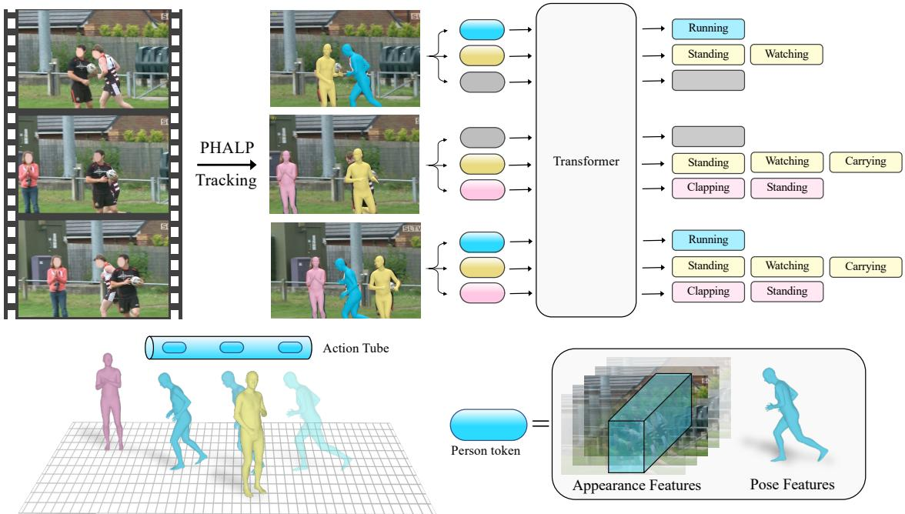
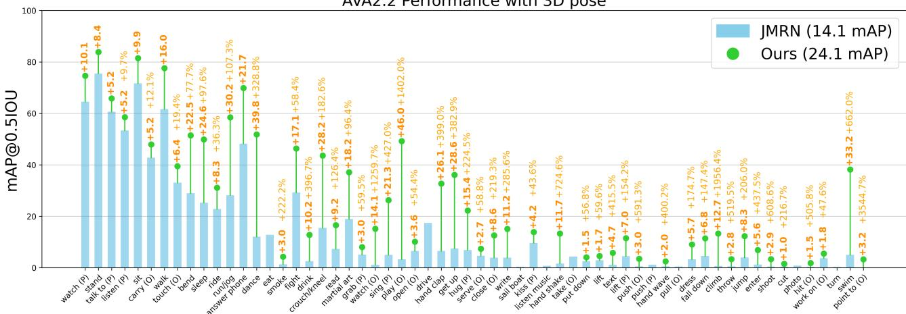
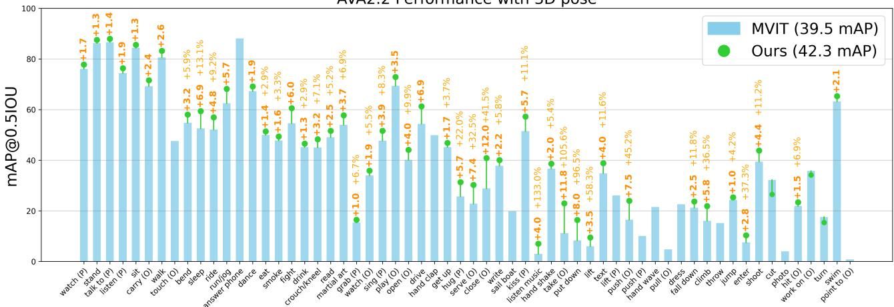
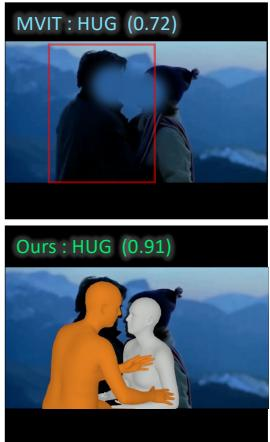
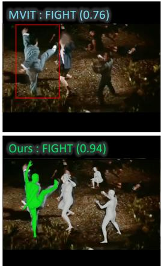
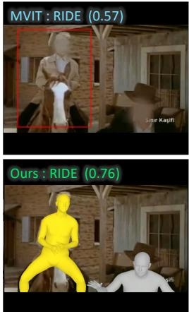
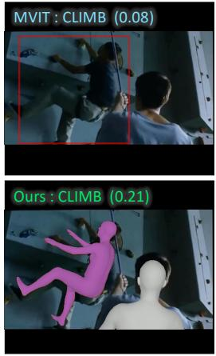
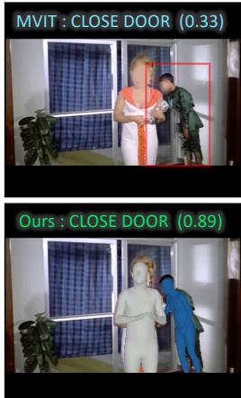

# On the Benefits of 3D Pose and Tracking for Human Action Recognition

Jathushan Rajasegaran1,2, Georgios Pavlakos1, Angjoo Kanazawa1, Christoph Feichtenhofer2, Jitendra Malik1,2 1UC Berkeley, 2Meta AI, FAIR

## Abstract

In this work we study the benefits of using tracking and 3D posesfor action recognition. To achieve this, we take the Lagrangian view on analysing actions over a trajectory of human motion rather than at a fixed point in space. Taking this stand allows us to use the tracklets of people to predict their actions. In this spirit,first we show the benefits of using 3D pose to infer actions, and study person-person interactions. Subsequently, we propose a Lagrangian Action Recognition model by fusing 3D pose and contextualized appearance over tracklets. To this end, our method achieves state-of-the-art performance on the AVA v2.2 dataset on bothpose only settings and on standard benchmark settings. When reasoning about the action using only pose cues, our pose model achieves +10.0 mAP gain over the corresponding state-of-the-art while ourfused model has a gain of+2.8 mAP over the best state-of-the-art model. Code and results are available at: https://brjathu.github.io/LART

## 1. Introduction

In fluid mechanics, it is traditional to distinguish between the Lagrangian and Eulerian specifications of the flow field. Quoting the Wikipedia entry, “Lagrangian specification of the flow field is a way of looking at fluid motion where the observer follows an individual fluid parcel as it moves through space and time. Plotting the position of an individual parcel through time gives the pathline of the parcel. This can be visualized as sitting in a boat and drifting down a river. The Eulerian specification of the flow field is a way oflooking atfluid motion thatfocuses on specific locations in the space through which the fluid flows as time passes. This can be visualized by sitting on the bank of a river and watching the water pass thefixed location.”

These concepts are very relevant to how we analyze videos of human activity. In the Eulerian viewpoint, we would focus on feature vectors at particular locations, either (x, y) or (x, y, z), and consider evolution over time while staying fixed in space at the location. In the Lagrangian viewpoint, we would track, say a person over space-time and track the associated feature vector across space-time.

While the older literature for activity recognition e.g., [11, 18, 53] typically adopted the Lagrangian viewpoint, ever since the advent of neural networks based on 3D spacetime convolution, e.g., [50], the Eulerian viewpoint became standard in state-of-the-art approaches such as SlowFast Networks [16]. Even after the switch to transformer architectures [12, 52] the Eulerian viewpoint has persisted. This is noteworthy because the tokenization step for transformers gives us an opportunity to freshly examine the question, “What should be the counterparts ofwords in video analysis?”. Dosovitskiy et al. [10] suggested that image patches were a good choice, and the continuation of that idea to video suggests that spatiotemporal cuboids would work for video as well.

On the contrary, in this work we take the Lagrangian viewpoint for analysing human actions. This specifies that we reason about the trajectory ofan entity over time. Here, the entity can be low-level, e.g., a pixel or a patch, or highlevel, e.g., a person. Since, we are interested in understanding human actions, we choose to operate on the level of “humans-as-entities”. To this end, we develop a method that processes trajectories of people in video and uses them to recognize their action. We recover these trajectories by capitalizing on a recently introduced 3D tracking method PHALP [43] and HMR 2.0 [19]. As shown in Figure 1 PHALP recovers person tracklets from video by lifting people to 3D, which means that we can both link people over a series of frames and get access to their 3D representation. Given these 3D representations of people (i.e., 3D pose and 3D location), we use them as the basic content of each token. This allows us to build a flexible system where the model, here a transformer, takes as input tokens corresponding to the different people with access to their identity, 3D pose and 3D location. Having 3D location of the people in the scene allow us to learn interaction among people. Our model relying on this tokenization can benefit from 3D tracking and pose, and outperforms previous baseline that only have access to pose information [8, 45].

While the change in human pose over time is a strong signal, some actions require more contextual information about the appearance and the scene. Therefore, it is important to also fuse pose with appearance information from humans and the scene, coming directly from pixels. To achieve this, we also use the state-of-the-art models for action recognition [12, 34] to provide complementary information from the contextualized appearance of the humans and the scene in a Lagrangian framework. Specifically, we densely run such models over the trajectory of each tracklet and record the contextualized appearance features localized around the tracklet. As a result, our tokens include explicit information about the 3D pose of the people and densely sampled appearance information from the pixels, processed by action recognition backbones [12]. Our complete system outperforms the previous state of the art by a large margin of 2.8 mAP, on the challenging AVA v2.2 dataset.

  
Figure 1. Overview of our method: Given a video, first, we track every person using a tracking algorithm (e.g. PHALP [43]). Then every detection in the track is tokenized to represent a human-centric vector (e.g. pose, appearance). To represent 3D pose we use SMPL [35] parameters and estimated 3D location of the person, for contextualized appearance we use MViT [12] (pre-trained on MaskFeat [59]) features. Then we train a transformer network to predict actions using the tracks. Note that, at the second frame we do not have detection for the blue person , at these places we pass a mask token to in-fill the missing detections.

Overall, our main contribution is introducing an approach that highlights the effects of tracking and 3D poses for human action understanding. To this end, in this work, we propose a Lagrangian Action Recognition with Tracking (LART) approach, which utilizes the tracklets of people to predict their action. Our baseline version leverages tracklet trajectories and 3D pose representations of the people in the video to outperform previous baselines utilizing pose information. Moreover, we demonstrate that the proposed Lagrangian viewpoint of action recognition can be easily combined with traditional baselines that rely only on appearance and context from the video, achieving significant gains compared to the dominant paradigm.

## 2. Related Work

Recovering humans in 3D: A lot of the related work has been using the SMPL human body model [35] for recovering 3D humans from images. Initially, the related methods were relying on optimization-based approaches, like SM-PLify [5], but since the introduction of the HMR [23], there has been a lot of interest in approaches that can directly regress SMPL parameters [35] given the corresponding image of the person as input. Many follow-up works have improved upon the original model, estimating more accurate pose [31] or shape [7], increasing the robustness of the model [41], incorporating side information [30,32], investigating different architecture choices [29, 64], etc.

While these works have been improving the basic singleframe reconstruction performance, there have been parallel efforts toward the temporal reconstruction of humans from video input. The HMMR model [24] uses a convolutional temporal encoder on HMR image features [23] to reconstruct humans over time. Other approaches have investigated recurrent [28] or transformer [41] encoders. Instead of performing the temporal pooling on image features, recent work has been using the SMPL parameters directly for the temporal encoding [2, 44].

One assumption of the temporal methods in the above category is that they have access to tracklets of people in the video. This means that they rely on tracking methods, most of which operate on the 2D domain [3, 13, 37, 62] and are responsible for introducing many errors. To overcome this limitation, recent work [42, 43] has capitalized on the advances of 3D human recovery to perform more robust identity tracking from video. More specifically, the PHALP method of Rajasegaran et al. [43] allows for robust tracking in a variety of settings, including in the wild videos and movies. Here, we make use of the PHALP system to discover long tracklets from large-scale video datasets. This allows us to train our method for recognizing actions from 3D pose input.

Action Recognition: Earlier works on action recognition relied on hand-crafted features such as HOG3D [27], Cuboids [9] and Dense Trajectories [53, 54]. After the introduction of deep learning, 3D convolutional networks became the main backbone for action recognition [6, 48, 50]. However, the 3D convolutional models treat both space and time in a similar fashion, so to overcome this issue, twostream architectures were proposed [46]. In two-steam networks, one pathway is dedicated to motion features, usually taking optical flow as input. This requirement of computing optical flow makes it hard to learn these models in an endto-end manner. On the other hand, SlowFast networks [16] only use video streams but at different frame rates, allowing it to learn motion features from the fast pathway and lateral connections to fuse spatial and temporal information. Recently, with the advancements in transformer architectures, there has been a lot of work on action recognition using transformer backbones [1, 4, 12, 38].

While the above-mentioned works mainly focus on the model architectures for action recognition, another line of work investigates more fine-grained relationships between actors and objects [47, 55, 56, 65]. Non-local networks [55] use self-attention to reason about entities in the video and learn long-range relationships. ACAR [39] models actorcontext-actor relationships by first extracting actor-context features through pooling in bounding box region and then learning higher-level relationships between actors. Compared to ACAR, our method does not explicitly design any priors about actor relationships, except their track identity.

Along these lines, some works use the human pose to understand the action [8, 45, 51, 60, 63]. PoTion [8] uses a keypoint-based pose representation by colorizing the temporal dependencies. Recently, JMRN [45] proposed a jointmotion re-weighting network to learn joint trajectories separately and then fuse this information to reason about interjoint motion. While these works rely on 2D key points and design-specific architectures to encode the representation, we use more explicit 3D SMPL parameters.

## 3. Method

Understanding human action requires interpreting multiple sources of information [26]. These include head and gaze direction, human body pose and dynamics, interactions with objects or other humans or animals, the scene as a whole, the activity context (e.g. immediately preceding actions by self or others), and more. Some actions can be recognized by pose and pose dynamics alone, as demonstrated by Johansson et al [22] who showed that people are remarkable at recognizing walking, running, crawling just by looking at moving point-lights. However, interpreting complex actions requires reasoning with multiple sources of information e.g. to recognize that someone is slicing a tomato with a knife, it helps to see the knife and the tomato.

There are many design choices that can be made here. Should one use “disentangled” representations, with elements such as pose, interacted objects, etc, represented explicitly in a modular way? Or should one just input video pixels into a large capacity neural network model and rely on it to figure out what is discriminatively useful? In this paper, we study two options: a) human pose reconstructed from an HMR model [19, 23] and b) human pose with contextual appearance as computed by an MViT model [12].

Given a video with number of frames T, we first track every person using PHALP [43], which gives us a unique identity for each person over time. Let a person $i \in$ $[ 1 , 2 , 3 , . . . n ]$ at time $t \in [ 1 , 2 , 3 , . . . T ]$ be represented by a person-vector $\mathbf { H } _ { t } ^ { i }$ . Here n is the number of people in a frame. This person-vector is constructed such that, it contains human-centric representation $\mathbf { P } _ { \mathrm { ~ } t } ^ { i }$ and some contextualized appearance information $\mathbf { Q } _ { t }$

$$
\mathbf { H } _ { t } ^ { i } = \{ \mathbf { P } _ { t } ^ { i } , \mathbf { Q } _ { t } ^ { i } \} .\tag{1}
$$

Since we know the identity of each person from the tracking, we can create an action-tube [18] representation for each person. Let Φi be the action-tube of person i, then this action-tube contains all the person-vectors over time.

$$
\Phi _ { i } = \{ \mathbf { H } _ { 1 } ^ { i } , \mathbf { H } _ { 2 } ^ { i } , \mathbf { H } _ { 3 } ^ { i } , . . . , \mathbf { H } _ { T } ^ { i } \} .\tag{2}
$$

Given this representation, we train our model LART to predict actions from action-tubes (tracks). In this work we use a vanilla transformer [52] to model the network ${ \mathcal { F } } ,$ , and this allow us to mask attention, if the track is not continuous due to occlusions and failed detections etc. Please see the Appendix for more details on network architecture.

$$
\mathcal { F } \big ( \Phi _ { 1 } , \Phi _ { 2 } , . . . , \Phi _ { i } , . . . , \Phi _ { n } ; \Theta \big ) = \widehat { Y } _ { i } .\tag{3}
$$

Here, Θ is the model parameters, $\widehat { Y _ { i } } = \{ y _ { 1 } ^ { i } , y _ { 2 } ^ { i } , y _ { 3 } ^ { i } , . . . , y _ { T } ^ { i } \}$ is the predictions for a track, and $y _ { t } ^ { i }$ is the predicted action of the track i at time t. The model can use the actions of others for reasoning when predicting the action for the person-ofinterest i. Finally, we use binary cross-entropy loss to train our model and measure mean Average Precision (mAP) for evaluation.

## 3.1. Action Recognition with 3D Pose

In this section, we study the effect of human-centric pose representation on action recognition. To do that, we consider a person-vector that only contains the pose representation, $\mathbf { H } _ { t } ^ { i } = \{ \mathbf { P } _ { t } ^ { i } \}$ . While, $\mathbf { P } _ { \mathrm { ~ } t } ^ { i }$ can in general contain any information about the person, in this work train a pose only model LART-pose which uses 3D body pose of the person based on the SMPL [35] model. This includes the joint angles of the different body parts, ${ \theta } _ { t } ^ { i } \in \mathcal { R } ^ { 2 3 \times 3 \times 3 }$ and is considered as an amodal representation, which means we make a prediction about all body parts, even those that are potentially occluded/truncated in the image. Since the global body orientation $\psi _ { t } ^ { i } \in \mathcal { R } ^ { 3 \times 3 }$ is represented separately from the body pose, our body representation is invariant to the specific viewpoint of the video. In addition to the 3D pose, we also use the 3D location $L _ { t } ^ { i }$ of the person in the camera view (which is also predicted by the PHALP model [43]). This makes it possible to consider the relative location of the different people in 3D. More specifically, each person is represented as,

$$
\mathbf { H } _ { t } ^ { i } = \mathbf { P } _ { t } ^ { i } = \{ \theta _ { t } ^ { i } , \psi _ { t } ^ { i } , L _ { t } ^ { i } \} .\tag{4}
$$

Let us assume that there are n tracklets $\left\{ \Phi _ { 1 } , \Phi _ { 2 } , \Phi _ { 3 } , . . . , \Phi _ { n } \right\}$ in a given video. To study the action of the tracklet i, we consider that person i as the person-of-interest and having access to other tracklets can be helpful to interpret the person-person interactions for person i. Therefore, to predict the action for all n tracklets we need to make n number of forward passes. If person i is the person-of-interest, then we randomly sample $N - 1$ number of other tracklets and pass it to the model $\mathcal { F } ( ; \Theta )$ along with the $\Phi _ { i }$

$$
\mathcal { F } ( \Phi _ { i } , \{ \Phi _ { j } | j \in [ N ] \} ; \Theta ) = { \widehat { Y } } _ { i }\tag{5}
$$

Therefore, the model sees N number of tracklets and predicts the action for the main (person-of-interest) track. To do this, we first tokenize all the person-vectors, by passing them through a linear layer and project it in $f _ { p r o j } ( \mathcal { H } _ { t } ^ { i } ) \in$ $\mathcal { R } ^ { \bar { d } }$ a d dimensional space. Afterward, we add positional embeddings for a) time, b) tracklet-id. For time and tracklet-id we use 2D sine and cosine functions as positional encoding [57], by assigning person i as the zeroth track, and the rest of the tracklets use tracklet-ids $\{ 1 , 2 , 3 , . . . , N - 1 \}$

$$
\begin{array} { r l r } & { } & { P E ( t , i , 2 r ) = \sin ( t / 1 0 0 0 0 ^ { 4 r / d } ) } \\ & { } & { P E ( t , i , 2 r + 1 ) = \cos ( t / 1 0 0 0 0 ^ { 4 r / d } ) } \\ & { } & { P E ( t , i , 2 s + D / 2 ) = \sin ( i / 1 0 0 0 0 ^ { 4 s / d } ) } \\ & { } & { P E ( t , i , 2 s + D / 2 + 1 ) = \cos ( i / 1 0 0 0 0 ^ { 4 s / d } ) } \end{array}
$$

Here, t is the time index, i is the track-id, $r , s \in [ 0 , d / 2 )$ specifies the dimensions and $D$ is the dimensions of the token.

After adding the position encodings for time and identity, each person token is passed to the transformer network. The $( t + \bar { i } \times N ) ^ { t h }$ token is given by,

$$
t o k e n _ { ( t + i \times N ) } = f _ { p r o j } ( \mathcal { H } _ { t } ^ { i } ) + P E ( t , i , : )\tag{6}
$$

Our person of interest formulation would allow us to use other actors in the scene to make better predictions for the main actor. When there are multiple actors involved in the scene, knowing one person’s action could help in predicting another’s action. Some actions are correlated among the actors in a scene (e.g. dancing, fighting), while in some cases, people will be performing reciprocal actions (e.g. speaking and listening). In these cases knowing one person’s action would help in predicting the other person’s action with more confidence.

## 3.2. Actions from Appearance and 3D Pose

While human pose plays a key role in understanding actions, more complex actions require reasoning about the scene and context. Therefore, in this section, we investigate the benefits of combining pose and contextual appearance features for action recognition and train model LART to benefit from 3D poses and appearance over a trajectory. For every track, we run a 2D action recognition model (i.e. MaskFeat [59] pretrained MViT [12]) at a frequency $f _ { s }$ and store the feature vectors before the classification layer. For example, consider a track $\Phi _ { i } ,$ which has detections $\{ D _ { 1 } ^ { i } , D _ { 2 } ^ { i } , \bar { D } _ { 3 } ^ { i } , . . . , D _ { T } ^ { i } \}$ We get the predictions form the 2D action recognition models, for the detections at $\{ t , t + f _ { F P S } / f _ { s } , t + 2 f _ { F P S } / f _ { s } , \ldots \}$ . Here, $f _ { F P S }$ is the rate at which frames appear on the screen. Since these action recognition models capture temporal information to some extent, $\mathbf { Q } _ { t - f _ { F P S } / 2 f _ { s } } ^ { i } \mathrm { ~ t o ~ } \mathbf { Q } _ { t + f _ { F P S } / 2 f _ { s } } ^ { i }$ share the same appearance features. Let’s assume we have a pre-trained action recognition model ${ \mathcal { A } } .$ and it takes a sequence of frames and a detection bounding box at mid-frame, then the feature vectors for $\mathbf { Q } _ { t } ^ { i }$ is given by:

$$
\mathcal { A } \left( D _ { t } ^ { i } , \{ I \} _ { t - M } ^ { t + M } \right) = \mathbf { U } _ { t } ^ { i }
$$

Here, $\{ I \} _ { t - M } ^ { t + M }$ is the sequence of image frames, 2M is the number of frames seen by the action recognition model, and $\mathbf { U } _ { t } ^ { i }$ is the contextual appearance vector. Note that, since the action recognition models look at the whole image frame, this representation implicitly contains information about the scene and objects and movements. However, we argue that human-centric pose representation has orthogonal information compared to feature vectors taken from convolutional or transformer networks. For example, the 3D pose is a geometric representation while $\mathbf { U } _ { t } ^ { i }$ is more photometric, the SMPL parameters have more priors about human actions/pose and it is amodal while the appearance representation is learned from raw pixels. Now that we have both pose-centric representation and appearance-centric representation in the person vector $\mathbf { H } _ { t } ^ { i }$ :

$$
\mathbf { H } _ { t } ^ { i } = \{ \underbrace { \theta _ { t } ^ { i } , \psi _ { t } ^ { i } , L _ { t } ^ { i } } _ { \mathbf { P } _ { t } ^ { i } } , \underbrace { \mathbf { U } _ { t } ^ { i } } _ { \mathbf { Q } _ { t } ^ { i } } \}\tag{7}
$$

So, each human is represented by their 3D pose, 3D location, and with their appearance and scene content. We follow the same procedure as discussed in the previous section to add positional encoding and train a transformer network $\mathcal { F } ( \Theta )$ with pose+appearance tokens.

## 4. Experiments

We evaluate our method on AVA [20] in various settings. AVA [20] poses an action detection problem, where people are localized in a spatio-temporal volume with action labels. It provides annotations at $1 \mathrm { H z } ,$ and each actor will have 1 pose action, up to 3 person-object interactions (optional), and up to 3 person-person interaction (optional) labels. For the evaluations, we use AVA v2.2 annotations and follow the standard protocol as in [20]. We measure mean average precision (mAP) on 60 classes with a frame-level IoU of 0.5. In addition to that, we also evaluate our method on AVA-Kinetics [33] dataset, which provides spatio-temporal localized annotations for Kinetics videos.

We use PHALP [43] to track people in the AVA dataset. PHALP falls into the tracking-by-detection paradigm and uses Mask R-CNN [21] for detecting people in the scene. At the training stage, where the bounding box annotations are available only at 1Hz, we use Mask R-CNN detections for the in-between frames and use the ground-truth bounding box for every 30 frames. For validation, we use the bounding boxes used by [39] and do the same strategy to complete the tracking. We ran, PHALP on Kinetics-400 [25] and AVA [20]. Both datasets contain over 1 million tracks with an average length of 3.4s and over 100 million detections. In total, we use about 900 hours length of tracks, which is about 40x more than previous works [24]. See Table 1 for more details.

Tracking allows us to train actions densely. Since, we have tokens for each actor at every frame, we can supervise every token by assuming the human action remains the same in a 1 sec window [20]. First, we pre-train our model on Kinetics-400 dataset [25] and AVA [20] dataset. We run MViT [12] (pretrained on MaskFeat [58]) at 1Hz on every track in Kinetics-400 to generate pseudo groundtruth annotations. Every 30 frames will share the same annotations and we train our model end-to-end with binary cross-entropy loss. Then we fine-tune the pretrained model, with tracks generated by us, on AVA ground-truth action labels. At inference, we take a track, and randomly sample N − 1 of other tracks from the same video and pass it through the model. We take an average pooling on the prediction head over a sequence of 12 frames, and evaluate at the center-frame. For more details on model architecture, hyper-parameters, and training procedure/trainingtime please see Appendix A1.

<table><tr><td>Dataset</td><td># clips</td><td># tracks</td><td># bbox</td></tr><tr><td>AVA [20]</td><td>184k</td><td>320k</td><td>32.9m</td></tr><tr><td>Kinetics [25]</td><td>217k</td><td>686k</td><td>71.4m</td></tr><tr><td>Total</td><td>400k</td><td>1m</td><td>104.3m</td></tr></table>

Table 1. Tracking statistics on AVA [20] and Kinetics-400 [25]: We report the number tracks returned by PHALP [43] for each datasets (m: million). This results in over 900 hours of tracks, with a mean length of 3.4 seconds (with overlaps).
<table><tr><td>Model</td><td>Pose</td><td>OM</td><td>PI</td><td>PM</td><td>mAP</td></tr><tr><td>PoTion [8]</td><td>2D</td><td>-</td><td></td><td>一</td><td>13.1</td></tr><tr><td>JMRN [45]</td><td>2D</td><td>7.1</td><td>17.2</td><td>27.6</td><td>14.1</td></tr><tr><td>LART-pose</td><td>SMPL</td><td>11.9</td><td>24.6</td><td>45.8</td><td>22.3</td></tr><tr><td>LART-pose</td><td>SMPL+Joints</td><td>13.3</td><td>25.9</td><td>48.7</td><td>24.1</td></tr></table>

Table 2. AVA Action Recognition with 3D pose: We evaluate human-centric representation on AVA dataset [20]. Here OM : Object Manipulation, PI : Person Interactions, and PM : Person Movement. LART-posecan achieve about 80% performance of MViT models on person movement tasks without looking at scene information.

## 4.1. Action Recognition with 3D Pose

In this section, we discuss the performance of our method on AVA action recognition, when using 3D pose cues, corresponding to Section 3.1. We train our 3D pose model LART-pose, on Kinetics-400 and AVA datasets. For Kinetics-400 tracks, we use MaskFeat [59] pseudo-ground truth labels and for AVA tracks, we train with ground-truth labels. We train a single person model and a multi-person model to study the interactions of a person over time, and person-person interactions. Our method achieves 24.1 mAP on multi-person (N=5) setting (See Table 2). While this is well below the state-of-the-art performance, this is a first time a 3D model achieves more than 15.6 mAP on AVA dataset. Note that the first reported performance on AVA was 15.6 mAP [20], and our 3D pose model is already above this baseline.

We evaluate the performance of our method on three AVA sub-categories (Object Manipulation (OM), Person Interactions (PI), and Person Movement(PM)). For the person-movement task, which includes actions such as running, standing, and sitting etc., the 3D pose model achieves 48.7 mAP. In contrast, MaskFeat performance in this subcategory is 58.6 mAP. This shows that the 3D pose model can perform about 80% good as a strong state-of-the-art model. On the person-person interaction category, our multi-person model achieves a gain of +2.4 mAP compared to the single-person model, showing that the multiperson model was able to capture the person-person interactions. As shown in the Fig 2, for person-person interactions classes such as dancing, fighting, lifting a person and handshaking etc., the multi-person model performs much better than the current state-of-the-art pose-only models. For example, in dancing multi-person model gains +39.8 mAP, and in hugging the relative gain is over +200%.

AVA2.2 Performance with 3D pose  
  
Figure 2. Class-wise performance on AVA: We show the performance of JMRN [45] and LART-pose on 60 AVA classes (average precision and relative gain). For pose based classes such as standing, sitting, and walking our 3D pose model can achieve above 60 mAP average precision performance by only looking at the 3D poses over time. By modeling multiple trajectories as input our model can understand the interactions among people. For example, activities such as dancing (+30.1%), martial art (+19.8%) and hugging (+62.1%) have large relative gains over state-of-the-art pose only model. We only plot the gains if it is above or below 1 mAP.

On the other hand, object manipulation has the lowest score among these three tasks. Since we do not model objects explicitly, the model has no information about which object is being manipulated and how it is being associated with the person. However, since some tasks have a unique pose when interacting with objects such as answering a phone or carrying an object, knowing the pose would help in identifying the action, which results in 13.3 mAP.

## 4.2. Actions from Appearance and 3D Pose

While the 3D pose model can capture about 50% performance compared to the state-of-the-art methods, it does not reason about the scene context. To model this, we concatenate the human-centric 3D representation with feature vectors from MaskFeat [59] as discussed in Section 3.2. Mask-Feat has a MViT2 [34] as the backbone and it learns a strong representation about the scene and contextualized appearance. First, we pretrain this model on Kinetics-400 [25] and AVA [20] datasets, using the pseudo ground truth labels. Then, we fine-tune this model on AVA tracks using the ground-truth action annotation.

In Table 3 we compare our method with other state-ofthe-art methods. Overall our method has a gain of +2.8 mAP compared to Video MAE [15, 49]. In addition to that if we train with extra annotations from AVA-Kinetics our method achieves 42.3 mAP. Figure 3 show the class-wise performance of our method compared to MaskFeat [58]. Our method overall improves the performance of 56 classes in 60 classes. For some classes (e.g. fighting, hugging, climbing) our method improves the performance by more than +5 mAP. In Table 4 we evaluate our method on AVA-Kinetics [33] dataset. Compared to the previous state-ofthe-art methods our method has a gain of +1.5 mAP.

In Figure 4, we show qualitative results from MViT [12] and our method. As shown in the figure, having explicit access to the tracks of everyone in the scene allow us to make more confident predictions for actions like hugging and fighting, where it is easy to interpret close interactions. In addition to that, some actions like riding a horse and climbing can benefit from having access to explicit 3D poses over time. Finally, the amodal nature of 3D meshes also allows us to make better predictions during occlusions.

## 4.3. Ablation Experiments

Effect of tracking: All the current works on action recognition do not associate people over time, explicitly. They only use the mid-frame bounding box to predict the action. For example, when a person is running across the scene from left to right, a feature volume cropped at the midframe bounding box is unlikely to contain all the information about the person. However, if we can track this person we could simply know their exact position over time and that would give more localized information to the model to predict the action.

AVA2.2 Performance with 3D pose  
  
Figure 3. Comparison with State-of-the-art methods: We show class-level performance (average precision and relative gain) of MViT [12] (pretrained on MaskFeat [59]) and ours. Our methods achieve better performance compared to MViT on over 50 classes out of 60 classes. Especially, for actions like running, fighting, hugging, and sleeping etc., our method achieves over +5 mAP. This shows the benefit of having access to explicit tracks and 3D poses for action recognition. We only plot the gains if it is above or below 1 mAP.

<table><tr><td>Model</td><td>Pretrain</td><td>mAP</td></tr><tr><td>SlowFast R101, 8×8 [16] MViTv1-B, 64×3 [12]</td><td>K400</td><td>23.8 27.3</td></tr><tr><td>SlowFast 16×8 +NL [16] X3D-XL [14]</td><td></td><td>27.5 27.4</td></tr><tr><td>MViTv1-B-24, 32×3 [12] Object Transformer [61]</td><td>K600</td><td>28.7 31.0</td></tr><tr><td>ACAR R101, 8×8 +NL [39]</td><td></td><td>31.4</td></tr><tr><td>ACAR R101, 8×8 +NL [39]</td><td>K700</td><td>33.3</td></tr><tr><td>MViT-L↑312, 40×3 [34],</td><td>IN-21K+K400</td><td>31.6</td></tr><tr><td>MaskFeat [59]</td><td>K400</td><td>37.5</td></tr><tr><td>MaskFeat [59]</td><td>K600</td><td>38.8</td></tr><tr><td>Video MAE [15,49]</td><td>K600</td><td>39.3</td></tr><tr><td>Video MAE [15,49]</td><td>K400</td><td>39.5</td></tr><tr><td>LART</td><td>K400</td><td>42.3 (+2.8)</td></tr></table>

Table 3. Comparison with state-of-the-art methods on AVA 2.2:. Our model uses features from MaskFeat [59] with full crop inference. Compared to Video MAE [15, 49] our method achieves a gain of +2.8 mAP.

To this end, first, we evaluate MaskFeat [58] with the same detection bounding boxes [39] used in our evaluations, and it results in 40.2 mAP. With this being the baseline for our system, we train a model which only uses MaskFeat features as input, but over time. This way we can measure the effect of tracking in action recognition. Unsurprisingly, as shown in Table 5 when training MaskFeat with tracking, the model performs +1.2 mAP better than the baseline. This clearly shows that the use of tracking is helpful in action recognition. Specifically, having access to the tracks help to localize a person over time, which in return provides a second order signal of how joint angles changes over time. In addition, knowing the identity of each person also gives a discriminative signal between people, which is helpful for learning interactions between people.

<table><tr><td>Model</td><td>mAP</td></tr><tr><td>SlowFast [16]</td><td>32.98</td></tr><tr><td>ACAR [39]</td><td>36.36</td></tr><tr><td>RM [17]</td><td>37.34</td></tr><tr><td>LART</td><td>38.91</td></tr></table>

Table 4. Performance on AVA-Kinetics Dataset. We evaluate the performance of our model on AVA-Kinetics [33] using a single model (no ensembles) and compare the performance with previous state-of-the-art single models.

Effect of Pose: The second contribution from our work is to use 3D pose information for action recognition. As discussed in Section 4.1 by only using 3D pose, we can achieve 24.1 mAP on AVA dataset. While it is hard to measure the exact contribution of 3D pose and 2D features, we compare our method with a model trained with only MaskFeat and tracking, where the only difference is the use of 3D pose. As shown in Table 5, the addition of 3D pose gives a gain of +0.8 mAP. While this is a relatively small gain compared to the use of tracking, we believe with more robust and accurate 3D pose systems, this can be improved.

  
Figure 4. Qualitative Results: We show the predictions from MViT [12] and our model on validation samples from AVA v2.2. The person with the colored mesh indicates the person-of-interest for which we recognise the action and the one with the gray mesh indicates the supporting actors. The first two columns demonstrate the benefits of having access to the action-tubes of other people for action prediction. In the first column, the orange person is very close to the other person with hugging posture, which makes it easy to predict hugging with higher probability. Similarly, in the second column, the explicit interaction between the multiple people, and knowing others also fighting increases the confidence for the fighting action for the green person over the 2D recognition model. The third and the fourth columns show the benefit of explicitly modeling the 3D pose over time (using tracks) for action recognition. Where the yellow person is in riding pose and purple person is looking upwards and legs on a vertical plane. The last column indicates the benefit of representing people with an amodal representation. Here the hand of the blue person is occluded, so the 2D recognition model does not see the action as a whole. However, SMPL meshes are amodal, therefore the hand is still present, which boosts the probability of predicting the action label for closing the door.

<table><tr><td>Model</td><td>OM</td><td>PI</td><td>PM</td><td>mAP</td></tr><tr><td>MViT</td><td>32.2</td><td>41.1</td><td>58.6</td><td>40.2</td></tr><tr><td>MViT + Tracking</td><td>33.4</td><td>43.0</td><td>59.3</td><td>41.4 (+1.2)</td></tr><tr><td>MViT + Tracking + Pose</td><td>34.4</td><td>43.9</td><td>59.9</td><td>42.3 (+0.9)</td></tr></table>

Table 5. Ablation on the main components: We ablate the contribution of tracking and 3D poses using the same detections. First, we only use MViT features over the tracks to evaluate the contribution from tracking. Then we add 3D pose features to study the contribution from 3D pose for action recognition.

## 4.4. Implementation details

In both the pose model and pose+appearance model, we use the same vanilla transformer architecture [52] with 16 layers and 16 heads. For both models the embedding dimension is 512. We train with 0.4 mask ratio and at test time use the same mask token to in-fill the missing detections. The output token from the transformer is passed to a linear layer to predict the AVA action labels. We pre-train our model on kinetics for 30 epochs with MViT [12] predictions as pseudo-supervision and then fine-tune on AVA with AVA ground truth labels for few epochs. We train our models with AdamW [36] with base learning rate of 0.001 and betas = (0.9, 0.95). We use cosine annealing scheduling with a linear warm-up. For additional details please see the Appendix.

## 5. Conclusion

In this paper, we investigated the benefits of 3D tracking and pose for the task of human action recognition. By leveraging a state-of-the-art method for person tracking, PHALP [43], we trained a transformer model that takes as input tokens the state of the person at every time instance. We investigated two design choices for the content of the token. First, when using information about the 3D pose of the person, we outperform previous baselines that rely on pose information for action recognition by 8.2 mAP on the AVA v2.2 dataset. Then, we also proposed fusing the pose information with contextualized appearance information coming from a typical action recognition backbone [12] applied over the tracklet trajectory. With this model, we improved upon the previous state-of-the-art on AVA v2.2 by 2.8 mAP. There are many avenues for future work and further improvements for action recognition. For example, one could achieve better performance for more fine-grained tasks by more expressive 3D reconstruction of the human body (e.g., using the SMPL-X model [40] to capture also the hands), and by explicit modeling of the objects in the scene (potentially by extending the “tubes” idea to objects).

Acknowledgements: This work was supported by the FAIR-BAIR program as well as ONR MURI (N00014-21- 1-2801). We thank Shubham Goel, for helpful discussions.

## References

[1] Anurag Arnab, Mostafa Dehghani, Georg Heigold, Chen Sun, Mario Luciˇ c, and Cordelia Schmid. ViViT: A video´ vision transformer. In ICCV, 2021.

[2] Fabien Baradel, Thibault Groueix, Philippe Weinzaepfel, Romain Bregier, Yannis Kalantidis, and Gr´ egory Rogez.´ Leveraging MoCap data for human mesh recovery. In 3DV, 2021.

[3] Philipp Bergmann, Tim Meinhardt, and Laura Leal-Taixe. Tracking without bells and whistles. In ICCV, 2019.

[4] Gedas Bertasius, Heng Wang, and Lorenzo Torresani. Is space-time attention all you need for video understanding? In ICML, 2021.

[5] Federica Bogo, Angjoo Kanazawa, Christoph Lassner, Peter Gehler, Javier Romero, and Michael J Black. Keep it SMPL: Automatic estimation of 3D human pose and shape from a single image. In ECCV, 2016.

[6] Joao Carreira and Andrew Zisserman. Quo vadis, action recognition? a new model and the kinetics dataset. In CVPR, 2017.

[7] Vasileios Choutas, Lea Muller, Chun-Hao P Huang, Siyu¨ Tang, Dimitrios Tzionas, and Michael J Black. Accurate 3D body shape regression using metric and semantic attributes. In CVPR, 2022.

[8] Vasileios Choutas, Philippe Weinzaepfel, Jer´ ome Revaud,ˆ and Cordelia Schmid. PoTion: Pose motion representation for action recognition. In CVPR, 2018.

[9] Piotr Dollar, Vincent Rabaud, Garrison Cottrell, and Serge´ Belongie. Behavior recognition via sparse spatio-temporal features. In 2005 IEEE international workshop on visual surveillance and performance evaluation of tracking and surveillance, 2005.

[10] Alexey Dosovitskiy, Lucas Beyer, Alexander Kolesnikov, Dirk Weissenborn, Xiaohua Zhai, Thomas Unterthiner, Mostafa Dehghani, Matthias Minderer, Georg Heigold, Sylvain Gelly, Jakob Uszkoreit, and Neil Houlsby. An image is worth 16x16 words: Transformers for image recognition at scale. 2021.

[11] Alexei A Efros, Alexander C Berg, Greg Mori, and Jitendra Malik. Recognizing action at a distance. In ICCV, 2003.

[12] Haoqi Fan, Bo Xiong, Karttikeya Mangalam, Yanghao Li, Zhicheng Yan, Jitendra Malik, and Christoph Feichtenhofer. Multiscale vision transformers. In ICCV, 2021.

[13] Hao-Shu Fang, Shuqin Xie, Yu-Wing Tai, and Cewu Lu. RMPE: Regional multi-person pose estimation. In ICCV, 2017.

[14] Christoph Feichtenhofer. X3D: Expanding architectures for efficient video recognition. In CVPR, 2020.

[15] Christoph Feichtenhofer, Haoqi Fan, Yanghao Li, and Kaiming He. Masked autoencoders as spatiotemporal learners. In NeurIPS, 2022.

[16] Christoph Feichtenhofer, Haoqi Fan, Jitendra Malik, and Kaiming He. Slowfast networks for video recognition. In ICCV, 2019.

[17] Yutong Feng, Jianwen Jiang, Ziyuan Huang, Zhiwu Qing, Xiang Wang, Shiwei Zhang, Mingqian Tang, and Yue Gao. Relation modeling in spatio-temporal action localization. arXiv preprint arXiv:2106.08061, 2021.

[18] Georgia Gkioxari and Jitendra Malik. Finding action tubes. In CVPR, 2015.

[19] Shubham Goel, Georgios Pavlakos, Jathushan Rajasegaran, Angjoo Kanazawa, and Jitendra Malik. Humans in 4D: Reconstructing and tracking humans with transformers. arXiv preprint (forthcoming), 2023.

[20] Chunhui Gu, Chen Sun, David A Ross, Carl Vondrick, Caroline Pantofaru, Yeqing Li, Sudheendra Vijayanarasimhan, George Toderici, Susanna Ricco, Rahul Sukthankar, Cordelia Schmid, and Jitendra Malik. AVA: A video dataset of spatio-temporally localized atomic visual actions. In CVPR, 2018.

[21] Kaiming He, Georgia Gkioxari, Piotr Dollar, and Ross Gir-´ shick. Mask R-CNN. In ICCV, 2017.

[22] Gunnar Johansson. Visual perception of biological motion and a model for its analysis. Perception & psychophysics, 14(2):201–211, 1973.

[23] Angjoo Kanazawa, Michael J Black, David W Jacobs, and Jitendra Malik. End-to-end recovery of human shape and pose. In CVPR, 2018.

[24] Angjoo Kanazawa, Jason Y Zhang, Panna Felsen, and Jitendra Malik. Learning 3D human dynamics from video. In CVPR, 2019.

[25] Will Kay, Joao Carreira, Karen Simonyan, Brian Zhang, Chloe Hillier, Sudheendra Vijayanarasimhan, Fabio Viola, Tim Green, Trevor Back, Paul Natsev, et al. The kinetics human action video dataset. arXiv preprint arXiv:1705.06950, 2017.

[26] Machiel Keestra. Understanding human action. Integrating meanings, mechanisms, causes, and contexts. 2015.

[27] Alexander Klaser, Marcin Marszałek, and Cordelia Schmid. A spatio-temporal descriptor based on 3D-gradients. In BMVC, 2008.

[28] Muhammed Kocabas, Nikos Athanasiou, and Michael J Black. VIBE: Video inference for human body pose and shape estimation. In CVPR, 2020.

[29] Muhammed Kocabas, Chun-Hao P Huang, Otmar Hilliges, and Michael J Black. PARE: Part attention regressor for 3D human body estimation. In ICCV, 2021.

[30] Muhammed Kocabas, Chun-Hao P Huang, Joachim Tesch, Lea Muller, Otmar Hilliges, and Michael J Black. SPEC: Seeing people in the wild with an estimated camera. In ICCV, 2021.

[31] Nikos Kolotouros, Georgios Pavlakos, Michael J Black, and Kostas Daniilidis. Learning to reconstruct 3D human pose and shape via model-fitting in the loop. In ICCV, 2019.

[32] Nikos Kolotouros, Georgios Pavlakos, Dinesh Jayaraman, and Kostas Daniilidis. Probabilistic modeling for human mesh recovery. In ICCV, 2021.

[33] Ang Li, Meghana Thotakuri, David A Ross, Joao Car-˜ reira, Alexander Vostrikov, and Andrew Zisserman. The ava-kinetics localized human actions video dataset. arXiv preprint arXiv:2005.00214, 2020.

[34] Yanghao Li, Chao-Yuan Wu, Haoqi Fan, Karttikeya Mangalam, Bo Xiong, Jitendra Malik, and Christoph Feichtenhofer. MViTv2: Improved multiscale vision transformers for classification and detection. In CVPR, 2022.

[35] Matthew Loper, Naureen Mahmood, Javier Romero, Gerard Pons-Moll, and Michael J Black. SMPL: A skinned multiperson linear model. ACM Transactions on Graphics (TOG), 34(6):1–16, 2015.

[36] Ilya Loshchilov and Frank Hutter. Decoupled weight decay regularization. arXiv preprint arXiv:1711.05101, 2017.

[37] Tim Meinhardt, Alexander Kirillov, Laura Leal-Taixe, and Christoph Feichtenhofer. TrackFormer: Multi-object tracking with transformers. In CVPR, 2022.

[38] Daniel Neimark, Omri Bar, Maya Zohar, and Dotan Asselmann. Video transformer network. In ICCV, 2021.

[39] Junting Pan, Siyu Chen, Mike Zheng Shou, Yu Liu, Jing Shao, and Hongsheng Li. Actor-context-actor relation network for spatio-temporal action localization. In CVPR, 2021.

[40] Georgios Pavlakos, Vasileios Choutas, Nima Ghorbani, Timo Bolkart, Ahmed AA Osman, Dimitrios Tzionas, and Michael J Black. Expressive body capture: 3D hands, face, and body from a single image. In CVPR, 2019.

[41] Georgios Pavlakos, Jitendra Malik, and Angjoo Kanazawa. Human mesh recovery from multiple shots. In CVPR, 2022.

[42] Jathushan Rajasegaran, Georgios Pavlakos, Angjoo Kanazawa, and Jitendra Malik. Tracking people with 3D representations. In NeurIPS, 2021.

[43] Jathushan Rajasegaran, Georgios Pavlakos, Angjoo Kanazawa, and Jitendra Malik. Tracking people by predicting 3D appearance, location and pose. In CVPR, 2022.

[44] Davis Rempe, Tolga Birdal, Aaron Hertzmann, Jimei Yang, Srinath Sridhar, and Leonidas J Guibas. HuMoR: 3D human motion model for robust pose estimation. In ICCV, 2021.

[45] Anshul Shah, Shlok Mishra, Ankan Bansal, Jun-Cheng Chen, Rama Chellappa, and Abhinav Shrivastava. Pose and joint-aware action recognition. In WACV, 2022.

[46] Karen Simonyan and Andrew Zisserman. Two-stream convolutional networks for action recognition in videos. NIPS, 2014.

[47] Chen Sun, Abhinav Shrivastava, Carl Vondrick, Rahul Sukthankar, Kevin Murphy, and Cordelia Schmid. Relational action forecasting. In CVPR, 2019.

[48] Graham W Taylor, Rob Fergus, Yann LeCun, and Christoph Bregler. Convolutional learning of spatio-temporal features. In ECCV, 2010.

[49] Zhan Tong, Yibing Song, Jue Wang, and Limin Wang. VideoMAE: Masked autoencoders are data-efficient learners for self-supervised video pre-training. In NeurIPS, 2022.

[50] Du Tran, Lubomir Bourdev, Rob Fergus, Lorenzo Torresani, and Manohar Paluri. Learning spatiotemporal features with 3D convolutional networks. In ICCV, 2015.

[51] Gul Varol, Ivan Laptev, Cordelia Schmid, and Andrew Zis-¨ serman. Synthetic humans for action recognition from unseen viewpoints. International Journal of Computer Vision, 129(7):2264–2287, 2021.

[52] Ashish Vaswani, Noam Shazeer, Niki Parmar, Jakob Uszkoreit, Llion Jones, Aidan N Gomez, Łukasz Kaiser, and Illia Polosukhin. Attention is all you need. In NIPS, 2017.

[53] Heng Wang, A. Klaser, C. Schmid, and Cheng-Lin Liu. Action recognition by dense trajectories. In CVPR, 2011.

[54] Heng Wang and Cordelia Schmid. Action recognition with improved trajectories. In ICCV, 2013.

[55] Xiaolong Wang, Ross Girshick, Abhinav Gupta, and Kaiming He. Non-local neural networks. In CVPR, 2018.

[56] Xiaolong Wang and Abhinav Gupta. Videos as space-time region graphs. In ECCV, 2018.

[57] Zelun Wang and Jyh-Charn Liu. Translating math formula images to latex sequences using deep neural networks with sequence-level training. International Journal on Document Analysis and Recognition (IJDAR), 24(1):63–75, 2021.

[58] Chen Wei, Haoqi Fan, Saining Xie, Chao-Yuan Wu, Alan Yuille, and Christoph Feichtenhofer. Masked feature prediction for self-supervised visual pre-training. arXiv preprint arXiv:2112.09133, 2021.

[59] Chen Wei, Haoqi Fan, Saining Xie, Chao-Yuan Wu, Alan Yuille, and Christoph Feichtenhofer. Masked feature prediction for self-supervised visual pre-training. In CVPR, 2022.

[60] Philippe Weinzaepfel and Gregory Rogez. Mimetics: To-´ wards understanding human actions out of context. IJCV, 2021.

[61] Chao-Yuan Wu and Philipp Krahenbuhl. Towards long-form video understanding. In CVPR, 2021.

[62] Yuliang Xiu, Jiefeng Li, Haoyu Wang, Yinghong Fang, and Cewu Lu. Pose Flow: Efficient online pose tracking. In BMVC, 2018.

[63] An Yan, Yali Wang, Zhifeng Li, and Yu Qiao. PA3D: Poseaction 3D machine for video recognition. In CVPR, 2019.

[64] Hongwen Zhang, Yating Tian, Xinchi Zhou, Wanli Ouyang, Yebin Liu, Limin Wang, and Zhenan Sun. PyMAF: 3D human pose and shape regression with pyramidal mesh alignment feedback loop. In ICCV, 2021.

[65] Yubo Zhang, Pavel Tokmakov, Martial Hebert, and Cordelia Schmid. A structured model for action detection. In CVPR, 2019.