# On the Difficulty of Unpaired Infrared-to-Visible Video Translation: Fine-Grained Content-Rich Patches Transfer

Zhenjie Yu1 Shuang Li1  Yirui Shen1 Chi Harold Liu1 Shuigen Wang2 1Beijing Institute of Technology 2Yantai IRay Technologies Lt. Co.

{zjyu, shuangli, yiruishen, chiliu}@bit.edu.cn shuigen.wang@iraytek.com

## Abstract

Explicit visible videos can provide sufficient visual information andfacilitate vision applications. Unfortunately, the image sensors of visible cameras are sensitive to light conditions like darkness or overexposure. To make up for this, recently, infrared sensors capable of stable imaging have received increasing attention in autonomous driving and monitoring. However, most prosperous vision models are still trained on massive clear visible data, facing huge visual gaps when deploying to infrared imaging scenarios. In such cases, transferring the infrared video to a distinct visible one with fine-grained semantic patterns is a worthwhile endeavor. Previous works improve the outputs by equally optimizing each patch on the translated visible results, which is unfair for enhancing the details on content-rich patches due to the long-tail effect ofpixel distribution. Here we propose a novel CPTrans framework to tackle the challenge via balancing gradients of different patches, achieving the fine-grained Content-rich Patches Transferring. Specifically, the content-aware optimization module encourages model optimization along gradients of target patches, ensuring the improvement of visual details. Additionally, the content-aware temporal normalization module enforces the generator to be robust to the motions of target patches. Moreover, we extend the existing dataset InfraredCity to more challenging adverse weather conditions (rain and snow), dubbed as InfraredCity-Adverse1. Extensive experiments show that the proposed CPTrans achieves state-of-the-art performance under diverse scenes while requiring less training time than competitive methods.

## 1. Introduction

Visible light cameras have broad applicability in computer vision algorithms for the sufficient visual information (e.g., structure, texture, and color) of their captured results. Most state-of-the-art vision algorithms have been observed to show admirable performance under clear visibility conditions [10, 16, 50]. Unfortunately, in most cases, the real-world weather is unpredictable and diverse, leading to complex and variable light conditions like overexposure on snowing days. While image sensors of visible cameras are sensitive to light conditions, their imaging results are ambiguous in adverse weather. Under such circumstances, people take infrared sensors to make up for the deficiencies of visible cameras. These infrared sensors can capture stable structural information in diverse environments due to the thermal imaging principle. In emergency avoidance or hazard detection, they could be applied in autonomous driving and monitoring scenarios [28,30]. However, most computer vision models are trained under visible data. Although infrared videos outline surrounding objects all the time, the existing huge gaps and semantic lacking problems hinder the applications in infrared imaging scenarios. Therefore, it is worth translating stable and accessible infrared videos into clear visible ones. The translated visible results may provide visual information for supporting visual applications like object detection and semantic segmentation.

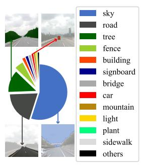  
(a)

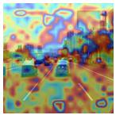

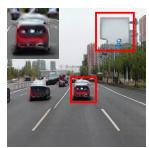

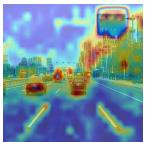

ROMA  
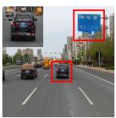  
(b)  
Ours  
Figure 1. (a) Visualization of pixel category distribution on dataset IRVI [25] and semantic examples in random selected frames. We conduct semantic segmentation via a pre-trained SegFormer [47] on all visible video frames of IRVI and predict all pixels according to the predefined categories in ADE20K [52]. (b) Outputs and GradCAM++ results of different methods. ROMA pays equal attention on the whole output, and the long-tail effect of training data leads to the generation optimization along prejudiced gradients caused by the large proportion of pixels (e.g., sky and road). We can generate more vivid details for content-rich patches (e.g., cars and road signs) than other methods.

To tackle the unpaired infrared-to-visible translation challenge, previous methods [12, 13, 33, 37] mainly focus on learning color mapping functions with complex manual coloring. The high costs and inevitable human bias limit the application of such approaches. Inspired by GANs [11], unpaired image translation methods have emerged. For instance, cycle-based methods [17, 21, 22, 48] preserve content during the translation via the cycle consistency [19]. Furthermore, one-sided methods [20, 31, 51] maintain the content through hand-designed feature-level restraints. However, substantial visual gaps between infrared and visible data lead to difficulties in generating fine-grained visible results. Additionally, continuous infrared video signals are more challenging to transfer because of the need to ensure temporal consistency. Thus, taking long-term information into account, [3, 7, 25] propose their temporal consistency losses to refine frameworks based on unpaired image translation methods. Besides, I2V-GAN [25] and ROMA [49] are tailored approaches for unpaired infrared-to-visible video translation. Especially, ROMA has achieved state-of-art performance, illustrating the importance of retaining structural information and proposing cross-similarity consistency for structure. Despite its success, experiments indicate that crosssimilarity still faces challenges in accurately transferring fine-grained (i.e., realistic and delicate) details, especially for the content-rich patches.

In fact, most GAN-based methods utilize the PatchGAN discriminator [19] for style optimization. Similar to the classification task, the discriminator outputs w × h predictions (True or False) for corresponding patches. To analyze the optimizing behavior of discriminators in the training process, we visualize the gradients via GradCAM++ [6] and pixel category distribution as shown in Fig. 1. Grad-CAM++ utilizes the gradients of the classification score to identify the parts of interest. The left part (a) shows that a few majority categories occupy most of the pixels while most minority categories contain a limited number of pixels. Additionally, content-rich patches (including rich visual details like patches of cars) are mostly the minority categories, while those content-lacking patches (including lacking visual details like patches of the sky) are mostly the majority. Upon exposure to new data, gradient-based optimization methods, without any constraint, change the learned encoding to minimize the objective function with global respect [36]. Thus, equal optimization for each patch (GradCAM++ of ROMA on Fig. 1 (b)) faces prejudiced gradients to content-lacking patches (i.e., major pixels) when applied to the generation. Moreover, it will lead to the inability of discriminators to improve the qualities of contentrich patches. An approach is needed to break the prejudice on optimization caused by the usually exhibiting long-tail distribution in real-world training data [24, 45, 54].

In this paper, we start with the analysis of difficulty for fine-grained Content-rich Patches Transfer on unpaired infrared-to-visible video translation and propose the CP-Trans framework To improve the results of content-rich patches, we introduce two novel modules: Content-aware Optimization (CO), balancing the gradients of patches for improving generated content-rich patches, and Contentaware Temporal Normalization (CTN), which enforces the generator to be robust to the motion of content. Besides, we extend the InfraredCity dataset to adverse weather conditions (i.e., raining and snowing scenes), noted as InfraredCity-Adverse, for promoting infrared-related research. Our extensive evaluations of diverse datasets show that our approach improves upon the previous ROMA method, setting new state-of-the-art performances on unpaired infrared-to-visible video translation. Remarkably, further applications validate our task’s value and confirm our approach’s admirable performance. Contributions are:

• We focus on the difficulty of fine-grained unpaired infrared-to-visible video translation and point out the existing problem that models are optimized along prejudiced gradients due to the long-tail effect.

• We propose a novel CPTrans framework consisting of content-aware optimization and temporal normalization, which benefits the generation of content-rich patches.

• We extend the InfraredCity to more challenging adverse weather conditions (rain and snow), noted as InfraredCity-Adverse for infrared-related study and validate the remarkable success of CPTrans through sufficient experiments (including further applications, i.e., object detection, video fusion, and semantic segmentation).

## 2. Related Work

## 2.1. Image and Video Translation

Image-to-Image translation intends to render an image with another style guided by reference images while maintaining the content information. [32, 44] explore the possibility of deep models on this task with manual labels. Then, to enhance the applicability, CycleGAN [19] proposes a cycle consistency module, which removes labeled data but requires another pair of generators and discriminators for reverse mapping. This simple yet effective module has incubated many translation approaches [17, 21, 22, 48]. In contrast, CUT [31] adopts contrastive loss to maintain the content, eliminating the extra computational resources. Following approaches [1, 4, 18, 20, 51] explore the superiority of one-sided frameworks, designing diverse content/structure consistency losses with respect to feature.

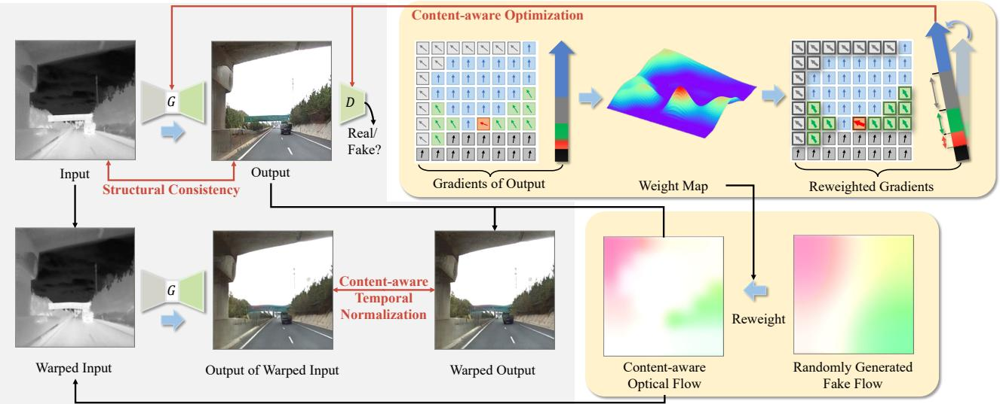  
Figure 2. An illustration of CPTrans framework. The translation is performed firstly to obtain the output frame via the generator G. We utilize the discriminator D to predict the output and obtain the gradients of binary classification score for each patch with respect to the model parameters. Then, according to the gradients, we design the weight map to encourage generation optimization along gradients of content-rich patches. Additionally, we access the content-aware optical flows via weight maps. Such pixel-level guidance on content-rich patches enables the generator to be robust for continuity signals.

By taking a further step based on image-to-image translation, video-to-video translation methods can generate continuous results by considering temporal coherence. [42, 43] firstly explore this task and incorporate long-term information into video translation. These supervised translation methods achieve exceptional results while still requiring expensive video labeling costs. To address unpaired video translation, based on CycleGAN, [3, 7, 40] utilize auxiliary systems (i.e., prediction model, flownet, and random flow) to obtain estimating motion for temporal consistency. However, most of the auxiliary systems fail to accurately estimate the motion of the content under infrared scenes.

## 2.2. Unpaired Infrared-to-Visible Translation

Generally, infrared sensors can stably work in scenarios where visible cameras are unavailable, e.g., darkness or overexposure, while gray-style representations disappoint human beings and vision applications. In such a case, unpaired infrared-to-visible translation is proposed to obtain detailed visible data via stable infrared data. Previous works [15, 26, 33, 38, 39] simply attempt this translation via learning color mapping functions.

Recently proposed I2V-GAN [25] and ROMA [49] point out the importance of structural information covered under gray appearance. Especially, ROMA has attained state-ofart performance with its cross-similarity, which shows excellent potential for preserving structural consistency. However, experimental results discover the visual details are chaotic in complex scenes like numerous cars appearing concurrently. In contrast, we analyze the observation and raise two content-aware operations for improving the generation of content-rich patches with sufficient details.

## 3. Proposed Method

In this paper, we devise CPTrans framework, depicted in Fig. 2, to achieve fine-grained content-rich patch transferring. We begin with a description of notation and problem formulation. Then we indicate the problem that models are optimized along prejudiced gradients, which is caused by the long-tail effect. To tackle the problem, we introduce two novel modules, Content-aware Optimization (CO) and Content-aware Temporal Normalization (CTN).

## 3.1. Problem Formulation

Unpaired Infrared-to-Visible Video Translation. Given infrared video frames collection ${ \mathcal { X } } = \{ x \}$ (noted as source domain) from diverse conditions and visible video frames collection $\mathcal { V } = \{ \boldsymbol { y } \}$ (noted as target domain), we intend to render the input videos under the guidance of distinct daytime visible videos, i.e., $\tilde { y } \ = \ G ( x )$ . Here G is the generator for obtaining visible results $\tilde { \mathcal { V } } = \{ \tilde { y } \}$ . In particular, the structure of the output y˜ is enforced to be consistent with corresponding input x while the style is required to be similar to that of visible collection Y in the unpaired infrared-to-visible video translation.

Structural Consistency Loss. We briefly introduce the main ideas for structural consistency, which shows promising results in style transfer [31, 49, 51].

In particular, CUT [31] proposes contrastive loss for the maintenance of the structure during training. It encourages the mapping of two pair elements to a similar point in a learned feature space, relative to other elements. However, the features conflate structure and appearance attributes, and the different style information in features will hinder the effectiveness of contrastive functions. To reduce the impact of style, F/LSeSim [51] proposes to retain the patterns of self-similarity from the feature aspect in both source and translated results. The proposed self-similarity maps help but continue to be influenced by domain-specific style. Taking a step further, ROMA [49] introduces the crosssimilarity maps to represent the domain-invariant structural information. It accesses the token embeddings $T _ { s } , T _ { t } \in$ $\mathbb { R } ^ { L \times N \times C }$ from input and output via a pre-trained ViT [8]. $L , N , C$ represent the number of selected layers, patches, and channels, respectively. The loss is formulated as:

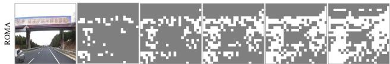  
(a) The most deviated parts from patches without Content-aware Optimization

(b) The most deviated parts from patches with Content-aware Optimization  
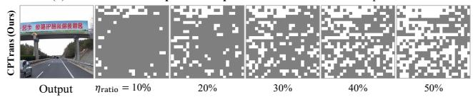  
Figure 3. Visualization for the influence of our Content-aware Optimization for gradients. We select the most deviated ηratio patches to display based on the cosine similarity to the final gradient. (a) confirms that content-rich patches receive less attention in Finalthe optimization process; (b) proves the CO module’s ability to encourage the optimization along gradients of content-rich patches that are no longer the most deviated part of the optimization.

$$
\mathcal { L } _ { c s } = d i s ( \pmb { T _ { s } } \cdot \pmb { T _ { t } ^ { \intercal } } , \pmb { T _ { t } } \cdot \pmb { T _ { s } ^ { \intercal } } ) ,\tag{1}
$$

where $d i s ( \cdot )$ is a function calculating cosine distance. By minimizing the cross-similarity loss, the translation is enforced to be structurally consistent. More details can be found in [49]. Although these relevant methods show remarkable success in maintaining structure knowledge, experimental results show the generated visual details are blurred in complex scenes with many objects. We denote these regions with sufficient visual details as content-rich patches for enhancement.

## 3.2. Content-Aware Optimization

In the training process of GANs [11], the visual quality of outputs from the generator is mainly directed by the discriminator via the minimax game, formulated as:

$$
\begin{array} { r l } & { \mathcal { L } _ { a d v } = \mathbb { E } _ { y } [ \log D ( y ) ] } \\ & { \quad \quad \quad + \mathbb { E } _ { x } [ \log ( 1 - D ( G ( x ) ) ) ] , } \end{array}\tag{2}
$$

where G intends to generate the results $\{ G ( x ) \}$ that look similar to data from target domain Y, while D tries to distinguish between translated samples $\{ G ( x ) \}$ and real samples $\{ y \}$ . Thus, the ability of the discriminator greatly influences the visual quality of generated results $\{ G ( x ) \}$ }. Most GANbased methods apply the PatchGAN discriminator [19] for style optimization, and it will output N prediction scores $\{ \bar { p } _ { i } \} _ { i = 1 } ^ { N }$ and $\{ \tilde { p } _ { j } \} _ { j = 1 } ^ { N }$ from visible video frame y and generated frame $G ( x )$ , respectively. The $\mathcal { L } _ { a d v } ^ { p a t c h }$ and its gradients to model parameter $\theta _ { D }$ are formulated as:

$$
\mathcal { L } _ { a d v } ^ { p a t c h } = \mathbb { E } _ { y } \left[ \frac { 1 } { N } \sum _ { i = 1 } ^ { N } \log p _ { i } \right] + \mathbb { E } _ { x } \left[ \frac { 1 } { N } \sum _ { j = 1 } ^ { N } \log ( 1 - \tilde { p } _ { j } ) \right] ,\tag{3}
$$

$$
\begin{array} { l } { \displaystyle \nabla _ { \theta _ { D } } \mathcal { L } _ { a d v } ^ { p a t c h } } \\ { = \mathbb { E } _ { y } \left[ \frac { 1 } { N } \sum _ { i = 1 } ^ { N } \nabla _ { \theta _ { D } } \log p _ { i } \right] + \mathbb { E } _ { x } \left[ \frac { 1 } { N } \sum _ { j = 1 } ^ { N } \nabla _ { \theta _ { D } } \log ( 1 - \tilde { p } _ { j } ) \right] , } \end{array}\tag{4}
$$

where $N = w \times h$ and $w , h$ represent the size of Patch-GAN’s output. Such approach brings global improvement but is unfair for content-rich patches. Since gradients from different content patches tend to vary [2, 34], plus realworld training data usually exhibits long-tailed distribution [24, 45, 54], the optimization can be prejudiced against content-rich patches (i.e., minority pixels). Thus we propose to locate these content-rich patches and perform enhancement on their generation.

The optimization of the model is more favorable to the content-lacking regions and diverges from the optimization of the content-rich regions, so we locate the regions with the most deviated gradient directions as the content-rich ones for enhancement. Taking $\nabla _ { \boldsymbol { \theta } _ { D } }$ log pi as an example, we can obtain the collection of content-rich patches on $y ,$ denoted as $\mathcal { U } _ { r } = \{ \boldsymbol { u } \}$ , according to the cosine similarity:

$$
\delta _ { i } = \cos \left( \nabla _ { \theta _ { D } } \log p _ { i } , \nabla _ { \theta _ { D } } \frac { 1 } { N } \sum _ { j = 1 } ^ { N } \log p _ { j } \right) ,\tag{5}
$$

where $\nabla _ { \boldsymbol { \theta } _ { D } }$ log $\begin{array} { r l } { p _ { i } , \nabla _ { \theta _ { D } } \frac { 1 } { N } \sum _ { j = 1 } ^ { N } } & { { } } \end{array}$ log $p _ { j }$ are obtained by taking the derivative of log $\begin{array} { r } { p _ { i } , \frac { 1 } { N } \sum _ { j = 1 } ^ { N } } \end{array}$ log $p _ { j }$ with respect to $\theta _ { D }$ , respectively. We identify the most deviated ηratio patches as content-rich areas via the cosine similarity δ. We display the selected content-rich patches $\mathcal { U } _ { r }$ in Fig. 3 (a), with different $\eta _ { r a t i o } .$ . Then, to enhance the optimization of content-rich patches, we design a weight map to amplify their gradients:

$$
w _ { i } = \left\{ \begin{array} { l l } { \frac { \lambda _ { i n c } } { \exp ( | \delta _ { i } | ) } , } & { \quad u _ { i } \in \mathcal { U } _ { r } , } \\ { 1 . 0 , } & { \quad o t h e r w i s e , } \end{array} \right.\tag{6}
$$

where $\lambda _ { i n c }$ is a hyperparameter controlling the increment of attention to content-rich patches. Similarly, we can obtain the weight map w˜ for $\dot { \nabla } _ { \boldsymbol { \theta } } \log ( 1 - \tilde { p } _ { j } )$ . We apply our weight maps w and w˜ to gradients of θ (either $\theta _ { G } \ : \mathrm { o r } \ : \bar { \theta } _ { D } )$ and get: $w _ { i } \nabla _ { \boldsymbol { \theta } }$ log $p _ { i } = \nabla _ { \theta } w _ { i }$ log pi and $\tilde { w } _ { i } \nabla _ { \theta } \log ( 1 - \tilde { p } _ { j } ) =$ $\nabla _ { \boldsymbol { \theta } } \tilde { \boldsymbol { w } } _ { i }$ log $( 1 - \tilde { p } _ { j } )$ . Therefore, the enhancement can be achieved through a modification to $\mathcal { L } _ { a d v } ^ { p a t c h }$ as follows:

$$
= \mathbb { E } _ { y } \left[ \frac { 1 } { N } \sum _ { i = 1 } ^ { N } w _ { i } \log p _ { i } \right] + \mathbb { E } _ { x } \left[ \frac { 1 } { N } \sum _ { j = 1 } ^ { N } \tilde { w } _ { j } \log ( 1 - \tilde { p } _ { j } ) \right] .\tag{7}
$$

Thus, based on PatchGAN, we utilize the weight maps to enlarge the gradients of content-rich patches via directly augmenting the optimization objective and get the $\mathcal { L } _ { c o - a d v } ^ { p a t c h }$ for the content-aware optimization. As shown in Fig 3 (b), since we adjust the overall gradients in favor of contentrich patches, our content-aware optimization module could encourage the model to pay more attention to content-rich patches during training.

## 3.3. Content-Aware Temporal Normalization

Additionally, temporal coherence is required for videorelated translation methods. Previous works for temporal normalization are mostly based on motion or optical flow estimation between adjacent frames [3, 7], formulated as:

$$
\mathcal { L } _ { t } = | | G ( x _ { t } ) - T ( G ( x _ { t - 1 } ) ) | | _ { 2 } ,\tag{8}
$$

where $T ( \cdot )$ is an auxiliary system like a prediction model and flownet. However, most auxiliary systems $T ( \cdot )$ cannot bring pixel-level precise guidance to the infrared-to-visible video translation task. [9, 41] suggest normalizing the generator via fake flows. They randomly warp arbitrary areas on the frame but add an additional motion gap with realworld scenes. To address this issue, we propose a novel content-aware temporal normalization for pixel-level temporal consistency. Instead of directly obtaining a random fake flow, we first locate the content-rich patches as introduced in § 3.2. Generally, the content-rich patches (e.g., cars) tend to be more mobile than the content-lacking ones (e.g., sky). Thus, the optical flow utilized for temporal normalization should take this fact into consideration. We apply the weight map w˜ to generate the content-aware optical flow, which is described as:

$$
F _ { c o n t e n t } = S m o o t h ( N o r m a l i z e ( \tilde { w } ) \cdot \gamma _ { s t r i d e } \cdot z ) ,\tag{9}
$$

where $z \in \mathbb { R } ^ { W \times H \times 2 }$ is a noise from the standard Gaussian distribution $z \sim \mathcal { N } ( 0 , I )$ and $\gamma _ { s t r i d e }$ is the hyperparameter for controlling the size of the overall motion. Smooth(·) is an image smoothing operation utilized to maintain the structure of objects. We normalize the w˜ to reduce the offset of the content-lacking patches. In Fig. 2, our $F _ { c o n t e n t }$ is more relevant to real-world scenarios. We formulate the content-aware temporal normalization as follows:

$$
\mathcal { L } _ { c t n } = \mathbb { E } _ { x } \Vert W ( G ( x ) , F _ { c o n t e n t } ) - G ( W ( x , F _ { c o n t e n t } ) ) \Vert _ { 2 } ,\tag{10}
$$

where $W ( \cdot , \cdot )$ is the warping function. This temporal constraint ensures the pixel-level consistency between synthetic frame and the warped version, especially for content-rich patches, which enforces the generator to be robust to the motions of content-rich patches.

## 3.4. Full Objective

We train the networks $\theta _ { G }$ and $\theta _ { D }$ by optimizing the following objective:

$$
\operatorname* { m i n } _ { \theta _ { G } } \operatorname* { m a x } _ { \theta _ { D } } \mathcal { L } = \mathcal { L } _ { c o - a d v } ^ { p a t c h } + \lambda _ { 1 } \cdot \mathcal { L } _ { c s } + \lambda _ { 2 } \cdot \mathcal { L } _ { c t n } .\tag{11}
$$

where $\lambda _ { 1 }$ and $\lambda _ { 2 }$ are tradeoff parameters that control the impact of $\mathcal { L } _ { c s }$ and $\mathcal { L } _ { c t n } .$ , respectively. Additionally, our CO module optimizes the models through $\mathcal { L } _ { c o - a d \iota } ^ { p a t c h }$ . The algorithm CPTrans can be found in the Supplementary Material.

## 4. Experiments

## 4.1. Settings

Datasets. InfraredCity-Lite [49] is released for nighttime infrared to daytime visible video translation, containing around 40K video frames. Besides, the IRVI [25] dataset contains around 20K infrared and visible video frames. All videos of IRVI are captured during the day, including traffic and monitoring scenes.

We extend the InfraredCity dataset to adverse scenes (i.e., rain and snow), dubbed as InfraredCity-Adverse, which can evaluate the performance of different methods under adverse weather scenes. Compared with other datasets, there is noise in the infrared data (e.g., raindrops), which is more challenging to generate fine-grained visual details. We detail it in the Supplementary Material.

Baselines. We choose the eight related translation methods, including CycleGAN [19], CUT [31], F/LSeSim [51], Recycle-GAN [3], Mocycle-GAN [7], UnsupRecycle [40], I2V-GAN [25] and ROMA [49]. Baseline models are officially released and trained with the official implementation. We show more details in Supplementary Material.

Implementation Details. Our CPTrans consists of a generator and a discriminator. For a fair comparison, we adopt the resnet 9blocks as the backbone of the generator following [19] and apply the setting for all competitive methods. We utilize the PatchGAN discriminator following [49] while removing its multiscale operation. Besides, the $\eta _ { r a t i o }$ for content-rich patches selection is set as 40%. $\lambda _ { 1 }$ and $\lambda _ { 2 }$ in Eq. (11) are 6.0 and 10.0, respectively. We train our method for 100 epochs with the learning oo rate of $2 \times 1 0 ^ { - 6 }$ , using the batch size of 1. More details can be obtained in Supplementary Material and released codes.

Evaluation Metrics. Features can effectively represent the visual information for the input, especially for contentrich patches. Frechet Inception Distance´ (FID) [14] is the most common feature-wise metric, measuring the difference in mean and slope variance. Following [29], we additionally access the Kernel Inception Distance (KID) [5] score, which utilizes the maximum mean discrepancy (MMD) to appraise the difference between feature representations of real and generated images. Additionally, KID has an unbiased estimator, which makes it more reliable. While KID is not bounded, the lower its value, the more shared visual similarities there are between real and generated images. For a more detailed comparison, we set the hyperparameter degree in MMD to 21 to enhance the ability of the polynomial kernel.

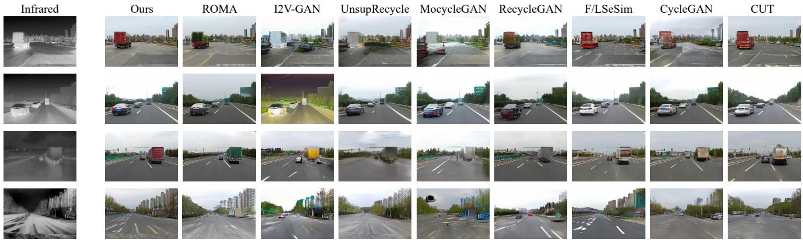  
Figure 4. Qualitative comparisons with different methods on diverse scenes, including clearday, overcast, rain, and snow, respectively, from top to bottom. Our outputs show cleaner and sufficient visual information compared with other results, especially on the adverse scenes. Additionally, our CPTrans dramatically improves the quality of content-rich patches. Best view when zoom in.

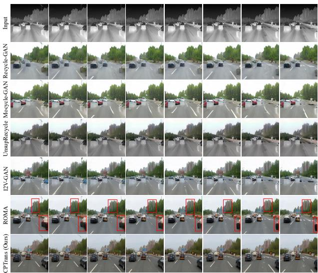  
Figure 5. Quality comparisons for continuous video frames from different methods. In the complex scene, we achieve the superior performance in terms of continuity and correctness. We highlight key error-prone regions via red bounding boxes.

To evaluate the generated results comprehensively, we employ the YOLO score described in [49] in this work. Specifically, we perform the object detection task with a pre-trained YOLOv3 [35] model on the visible results of different methods on a specific scene. The scene is a subset with manual labels from InfraredCity-Lite, containing 4320 video frames. The setting of the YOLOv3 model remains unchanged for fairness. Thus, the calculated YOLO scores represent the quality of generated vehicles from different methods. Higher is better.

## 4.2. Main Results

Comparison with Baseline Methods. Tab. 1 and Tab. 2 report the FID and KID results on IRVI, InfraredCity-Lite, and InfraredCity-Adverse, which are progressively more difficult in fine-grained unpaired infrared-to-visible video translation. We achieve the state-of-the-art performance of FID and KID on all datasets. Especially, CPTrans indicates remarkable improvement compared with ROMA on the InfraredCity-Adverse dataset, demonstrating that our method can still provide sufficient visual information when existing huge domian gaps and noise (e.g., raindrops).

Ablation Study. We quantitatively evaluate the improvement introduced by different components of CPTrans. Results in Tab. 1 and Tab. 2 confirm the advancement of both modules. The baseline in the tables shows the result of our method when both the CO and CTN modules are removed. CO module is designed to increase the attention on content-rich patches. We can observe a noticeable drop in performance without CO, especially for the adverse scenes. Additionally, applying the CTN module improves the results in all cases, strengthening the framework in temporal respect. In summary, we can observe the effectiveness of both components in our model. The best performance is achieved with a combination of both CO and CTN.

Quality Comparison. We display the qualitative comparisons in Fig. 4. Our CPTrans achieves the best visual quality compared with others. Notably, our visual information on outputs maintains clear and correct in diverse scenes. Other methods preserve the structural information well in clearday and overcast scenes, but semantic errors exist in some objects like trucks and road signs. Moreover, all related methods generate vehicles with seriously wrong semantics in the raining scene, except our CPTrans. Also, our method stands out from the rest in snowy scenes where snow noise is present, generating correct visual information.

Table 1. Comparison on InfraredCity-Lite. Our method achieve state-of-the-art scores with respect to both FID and KID on all scenes.
<table><tr><td rowspan="2">Method</td><td colspan="11">Traffic</td><td colspan="2"></td><td rowspan="2" colspan="2">Monitoring</td></tr><tr><td></td><td colspan="4">City</td><td colspan="2"></td><td colspan="4">Highway</td><td colspan="2">all</td></tr><tr><td></td><td>clear</td><td></td><td>overcast</td><td></td><td>all</td><td></td><td>clear</td><td></td><td>overcast</td><td></td><td>all</td><td></td><td></td><td></td><td></td></tr><tr><td></td><td>FID↓</td><td>KID↓</td><td>FID↓</td><td>KID↓</td><td>FID↓</td><td>KID↓</td><td>FID↓</td><td>KID↓</td><td>FID↓</td><td>KID↓</td><td>FID↓</td><td>KID↓</td><td>FID↓ KID↓</td><td>FID↓</td><td>KID↓</td></tr><tr><td>CUT [31]</td><td>0.5809</td><td>5.9174</td><td>0.5607</td><td>5.2185</td><td>0.6086</td><td>7.6174</td><td>0.4544</td><td>4.4742 4.6475</td><td>0.5133</td><td>5.6331</td><td>0.4739</td><td>6.2903 4.6128</td><td>0.4089 1.8202</td><td>0.9785</td><td>1.9126</td></tr><tr><td>CycleGAN [19]</td><td>0.6299</td><td>6.1114</td><td>0.5879</td><td>5.9409</td><td>0.7125</td><td>6.3001</td><td>0.4787</td><td></td><td>0.5489</td><td>5.4571</td><td>0.4920</td><td>0.4204</td><td>2.0781</td><td>0.8129</td><td>0.8728</td></tr><tr><td>F/LSeSim [51]</td><td>0.4984</td><td>3.9748</td><td>0.5369</td><td>6.1659</td><td>0.4834</td><td>4.3672</td><td>0.5108</td><td>5.9615</td><td>0.5288</td><td>5.2294</td><td>0.4809</td><td>4.9801 0.2724</td><td>1.9895</td><td>0.8984</td><td>0.8283</td></tr><tr><td>Recycle-GAN [3]</td><td>0.5942</td><td>5.3031</td><td>0.5974</td><td>6.2001</td><td>0.5969</td><td>5.3129</td><td>0.5173</td><td>6.1773</td><td>0.5998</td><td>8.2207</td><td>0.5101</td><td>5.2925 0.3431</td><td>3.0240</td><td>0.9433</td><td>0.9928</td></tr><tr><td>Mocycle-GAN [7]</td><td>0.5117</td><td>4.5128</td><td>0.5346</td><td>5.2772</td><td>0.5011</td><td>4.0732</td><td>0.5029</td><td>5.5982</td><td>0.5976</td><td>7.4907</td><td>0.4791 6.1446</td><td>0.3163</td><td>3.1973</td><td>0.7298</td><td>1.4637</td></tr><tr><td>UnsupRecycle [40]</td><td>0.7519</td><td>5.7289</td><td>0.9816</td><td>7.5554</td><td>0.8050</td><td>5.7288</td><td>0.4907</td><td>6.3411</td><td>0.5328</td><td>6.1268</td><td>0.4307 5.9160</td><td>0.3206</td><td>2.9047</td><td>0.8142</td><td>0.9785</td></tr><tr><td>I2V-GAN [25]</td><td>0.5052</td><td>4.2976</td><td>0.5574</td><td>5.9438</td><td>0.4649</td><td>4.1209</td><td>0.5064</td><td>5.9077</td><td>0.5105</td><td>6.3017</td><td>0.4515 4.7805</td><td>0.2872</td><td>2.4127</td><td>0.7039</td><td>1.8313</td></tr><tr><td>ROMA [49]</td><td>0.4018</td><td>3.8081</td><td>0.5149</td><td>5.7762</td><td>0.3929</td><td>3.3665</td><td>0.3325</td><td>3.9694</td><td>0.3823</td><td>4.9334</td><td>0.3444 4.3441</td><td>0.2002</td><td>0.6787</td><td>0.5488</td><td>0.7058</td></tr><tr><td>baseline</td><td>0.4332</td><td>4.0315</td><td>0.5258</td><td>5.8336</td><td>0.4038</td><td>3.5282</td><td>0.3474</td><td>4.3295</td><td>0.4245</td><td>5.3277</td><td>0.3916 4.5129</td><td>0.2324</td><td>1.0197</td><td>0.5731</td><td>0.8114</td></tr><tr><td>Ours w/o co</td><td>0.3890</td><td>3.2683</td><td>0.4762</td><td>5.0883</td><td>0.3891</td><td>3.3113</td><td>0.3453</td><td>3.3077</td><td>0.3712</td><td>4.3453</td><td>0.3389 3.7821</td><td>0.1835</td><td>0.4210</td><td>0.5303</td><td>0.6828</td></tr><tr><td>Ours w/o CTN</td><td>0.3824</td><td>3.3423</td><td>0.4779</td><td>4.9855</td><td>0.3867</td><td>3.5157</td><td>0.3267 0.3208</td><td>3.3171</td><td>0.3642 0.3475</td><td>3.9793</td><td>0.3343 3.8776</td><td>0.1816</td><td>0.2665</td><td>0.4949</td><td>0.6308</td></tr><tr><td>Ours</td><td>0.3728</td><td>2.7573</td><td>0.4393</td><td>4.4034</td><td>0.3632</td><td>3.1693</td><td></td><td>2.9591</td><td></td><td>3.0938</td><td>0.3234 3.4399</td><td>0.1738</td><td>0.1826</td><td></td><td>0.4742 0.4570</td></tr></table>

<table><tr><td rowspan="3">Method</td><td colspan="4">IRVI</td><td colspan="4">InfraredCity-Adverse</td></tr><tr><td colspan="2">Traffic</td><td colspan="2">Monitoring</td><td colspan="2">Rain</td><td colspan="2">Snow</td></tr><tr><td>FID↓</td><td>KID↓</td><td>FID↓</td><td>KID↓</td><td>FID↓</td><td>KID↓</td><td>FID↓</td><td>KID↓</td></tr><tr><td>CUT [31]</td><td>0.5739</td><td>5.7356</td><td>1.0893</td><td>6.2651</td><td>0.5236</td><td>5.9084</td><td>0.5244</td><td>7.8449</td></tr><tr><td>CycleGAN [19]</td><td>0.6714</td><td>6.8587</td><td>0.8792</td><td>6.9381</td><td>0.5723</td><td>6.1525</td><td>0.5557</td><td>6.8426</td></tr><tr><td>F/LSeSim [51]</td><td>0.4321</td><td>5.3427</td><td>0.9232</td><td>5.0691</td><td>0.5775</td><td>6.0347</td><td>0.5926</td><td>6.4179</td></tr><tr><td>Recycle-GAN [3]</td><td>0.5255</td><td>4.9063</td><td>1.0609</td><td>5.0650</td><td>0.6133</td><td>5.8008</td><td>0.5730</td><td>5.9962</td></tr><tr><td>Mocycle-GAN [7]</td><td>0.7911</td><td>7.1380</td><td>1.0515</td><td>6.8002</td><td>0.8872</td><td>8.1459</td><td>0.6650</td><td>6.5410</td></tr><tr><td>UnsupRecycle [40]</td><td>0.6831</td><td>6.2315</td><td>0.9821</td><td>6.5123</td><td>0.7041</td><td>8.1372</td><td>0.5822</td><td>5.8795</td></tr><tr><td>I2V-GAN [25]</td><td>0.4425</td><td>4.5102</td><td>0.8715</td><td>4.6178</td><td>0.5917</td><td>5.6455</td><td>0.5693</td><td>5.5491</td></tr><tr><td>ROMA [49]</td><td>0.3467</td><td>3.0880</td><td>0.7334</td><td>3.3972</td><td>0.5577</td><td>2.5185</td><td>0.5393</td><td>4.9271</td></tr><tr><td>baseline</td><td>0.3652</td><td>3.6835</td><td>0.7689</td><td>3.5101</td><td>0.5751</td><td>2.9861</td><td>0.5520</td><td>5.1179</td></tr><tr><td>Ours w/o co</td><td>0.3193</td><td>2.7356</td><td>0.7250</td><td>2.8762</td><td>0.5056</td><td>1.9855</td><td>0.5174</td><td>3.6446</td></tr><tr><td>Ours w/o CTN</td><td>0.3211</td><td>2.5720</td><td>0.7131</td><td>2.5886</td><td>0.4981</td><td>2.3112</td><td>0.4962</td><td>4.6301</td></tr><tr><td>Ours</td><td>0.2936</td><td>1.9178</td><td>0.7004</td><td>2.3760</td><td>0.4760</td><td>1.7907</td><td>0.4952</td><td>2.6382</td></tr></table>

Table 2. Comparison on IRVI and InfraredCity-Adverse.

<table><tr><td>Scenes</td><td>Nighttime Infrared</td><td>Nighttime Visible</td><td>I2V-GAN</td><td>ROMA</td><td>CPTrans (Ours)</td></tr><tr><td>AP</td><td>25.0</td><td>26.1</td><td>32.2</td><td>50.1</td><td>58.1</td></tr></table>

Table 3. Comparison of YOLO score for vehicle detection. CPTrans shows the best fine-grained performance of generation in supporting detection.

Additionally, Fig. 5 further confirms our translated results’ semantic correctness and continuity. Our details of content-rich patches like buildings and cars outperform all of the rest methods. Notably, the coherent lane lines in our results prove the validity of the CTN module. We display more video comparisons in the Supplementary Material.

Time Efficiency. The time efficiency metric is essential for choosing from different approaches when running for research and even for practical industrial applications. As shown in Fig. 6, our approach has the fastest optimization while achieving the best results. For each method, we selected six epoch time nodes, which are 10, 20, 40, 60, 80, and 100, respectively. Specifically, our method is about 5 times faster than ROMA. What makes CPTrans so remarkable is that we are not adding complex operations for improvement but breaking the prejudice on optimization during training. Meanwhile, our method in the figure performs better than other methods at every moment, proving that performing content-aware operations (CO and CTN) at each stage of training is beneficial for the optimization.

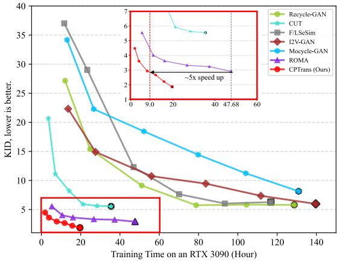  
Figure 6. Line chart of KID scores on training process from different methods. We apply 100 epochs for all approaches and provide the same dataset setting for fairness. Our CP-Trans achieves the best scores on any time node and is about five times faster than ROMA (detailed in the red box).

## 4.3. Further Applications

Object Detection. Object detection has long been a vision task of interest. Its significant value drives the application in various scenarios (e.g., autonomous driving, monitoring). Most appliable detection models are trained on visible light data. However, image sensors of the visible camera are sensitive to light conditions like darkness and overexposure. Thus, obtaining precise visible data via stable infrared data would be worthwhile, and we can perform object detection on translated visible results.

CPTrans (Ours)  
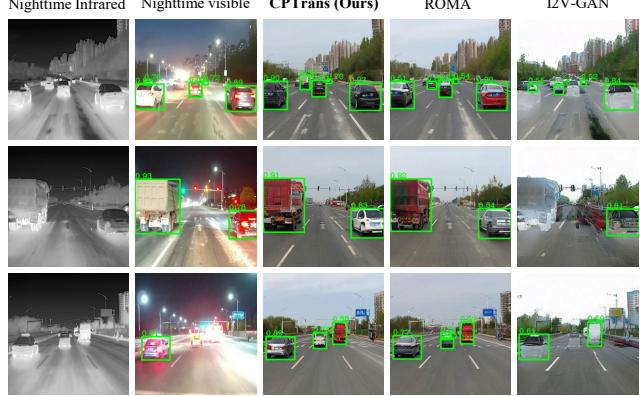

Figure 7. Comparisons of vehicle detection results. We perform the pre-trained YOLOv3 model on different results with the same setting. The higher confidence score, the more vivid generated results are. Best view when zoom in.  
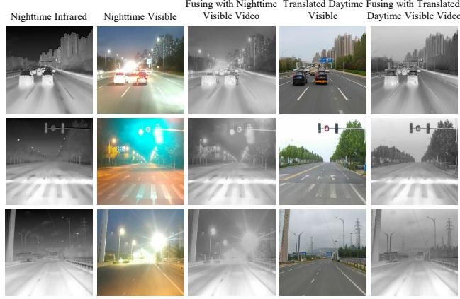  
Figure 8. Comparison of video fusions. For enhancing environmental perception, fusing the translated visible results from CP-Trans with the infrared inputs is more helpful than directly fusing nighttime visible videos and corresponding infrared ones.

In Fig. 7, we display the detection results from different methods. Notably, the settings of the detection model remain unchanged for fairness. Our methods exceed in both correctness and confidence of detection compared with others. Additionally, the YOLO scores shown in Tab. 3 confirm our excellence in vehicle generation.

Video Fusion. The fusion of infrared and visible video is utilized for context enhancement in diverse environments [23, 27, 53]. It aims to combine visible visual details with infrared structural information. However, the visible visual details are blurred under darkness and overexposure conditions. Here we fuse the visible results generated by CPTrans with the infrared videos, as shown in Fig. 8. Compared with the original fusion, the new fusion results can bring better context enhancement, further validating the value of the unpaired infrared-to-visible translation task.

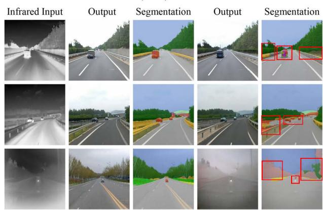  
Figure 9. Comparison of semantic segmentation. The generated results should be correct at the pixel level to support the semantic segmentation task. Our approach achieves the best performance in terms of detail, especially in rainy scenes (the bottom one).

Semantic Segmentation. Semantic segmentation, the task of comprehending an image at the pixel level, is the foundation for numerous application [46] such as autonomous driving and robot manipulation. Our unpaired infrared-to-visible translation could be the foundation for supporting semantic segmentation in adverse scenes. This requires that our translated results are correct at the pixel level. We perform the pre-trained SegFormer [47] model on translated results from different methods, displayed in Fig. 9. Compared with the state-of-the-art translation method, ROMA [49], we achieve better performance in both the Output and Segmentation. Our approach validates the applicability of infrared-to-visible video trainslation.

## 5. Conclusion

In this manuscript, we propose the CPTrans framework to address the fine-grained unpaired infrared-to-visible video translation. To break the prejudice on optimization due to the long-tail effect, we introduce the Content-aware Optimization (CO) and Content-aware Temporal Normalization (CTN) modules, which collaboratively enhance the generation of content-rich patches to obtain sufficient visual details on translated visible results. Additionally, we provide a more challenging extended dataset, InfraredCity-Adverse collected on raining and snowing scenes to promote infrared-related research. Our method achieves stateof-the-art performance under all scenes while requiring less training time than other methods. Moreover, the further application results validate the task’s value and confirm our superior performance on generated visual details.

Acknowledgements. This paper was supported by National Key R&D Program of China (No. 2021YFB3301503), and also supported by the National Natural Science Foundation of China under Grant No. 61902028.

## References

[1] Matthew Amodio and Smita Krishnaswamy. Travelgan: Image-to-image translation by transformation vector learning. In CVPR, pages 8983–8992, 2019.

[2] Aleksandar Armacki, Dragana Bajovic, Dusan Jakovetic, and Soummya Kar. Gradient based clustering. In ICML, pages 929–947, 2022.

[3] Aayush Bansal, Shugao Ma, Deva Ramanan, and Yaser Sheikh. Recycle-gan: Unsupervised video retargeting. In ECCV, pages 122–138, 2018.

[4] Sagie Benaim and Lior Wolf. One-sided unsupervised domain mapping. In NeurIPS, pages 752–762, 2017.

[5] Mikolaj Binkowski, Danica J. Sutherland, Michael Arbel, and Arthur Gretton. Demystifying MMD gans. In ICLR, 2018.

[6] A. Chattopadhyay, A. Sarkar, P. Howlader, and V. N. Balasubramanian. Grad-cam++: Improved visual explanations for deep convolutional networks. arXiv e-prints, 2017.

[7] Y chen, Y Pan, T Yao, X Tian, and T Mei. Mocycle-gan: Unpaired video-to-video translation. In ACM MM, pages 647– 655, 2019.

[8] Alexey Dosovitskiy, Lucas Beyer, Alexander Kolesnikov, Dirk Weissenborn, Xiaohua Zhai, Thomas Unterthiner, Mostafa Dehghani, Matthias Minderer, Georg Heigold, Sylvain Gelly, Jakob Uszkoreit, and Neil Houlsby. An image is worth 16x16 words: Transformers for image recognition at scale. In ICLR, 2021.

[9] Gabriel Eilertsen, Rafal K. Mantiuk, and Jonas Unger. Single-frame regularization for temporally stable cnns. In CVPR, pages 11176–11185, 2019.

[10] Kaixiong Gong, Shuang Li, Shugang Li, Rui Zhang, Chi Harold Liu, and Qiang Chen. Improving transferability for domain adaptive detection transformers. CoRR, abs/2204.14195, 2022.

[11] Ian J. Goodfellow, Jean Pouget-Abadie, Mehdi Mirza, Bing Xu, David Warde-Farley, Sherjil Ozair, Aaron C. Courville, and Yoshua Bengio. Generative adversarial networks. CoRR, abs/1406.2661, 2014.

[12] Raj Kumar Gupta, Alex Yong Sang Chia, Deepu Rajan, Ee Sin Ng, and Zhiyong Huang. Image colorization using similar images. In ACM MM, pages 369–378, 2012.

[13] Anwaar Ul Haq, Xiao-Xia Yin, Jing He, and Yanchun Zhang. FACE: fully automated context enhancement for night-time video sequences. J. Vis. Commun. Image Represent., pages 682–693, 2016.

[14] Martin Heusel, Hubert Ramsauer, Thomas Unterthiner, Bernhard Nessler, and Sepp Hochreiter. Gans trained by a two time-scale update rule converge to a local nash equilibrium. In NeurIPS, pages 6626–6637, 2017.

[15] M. A. Hogervorst and A. Toet. Fast and true-to-life application of daytime colours to night-time imagery. In ICIF, pages 1–8, 2007.

[16] Jiaxing Huang, Dayan Guan, Aoran Xiao, and Shijian Lu. Cross-view regularization for domain adaptive panoptic segmentation. In CVPR, pages 10133–10144, 2021.

[17] Xun Huang, Ming-Yu Liu, Serge J. Belongie, and Jan Kautz. Multimodal unsupervised image-to-image translation. In ECCV, pages 179–196, 2018.

[18] Liming Jiang, Changxu Zhang, Mingyang Huang, Chunxiao Liu, Jianping Shi, and Chen Change Loy. TSIT: A simple and versatile framework for image-to-image translation. In ECCV, pages 206–222, 2020.

[19] Zhu Jun-Yan, Park Taesung, Isola Phillip, and Efros Alexei A. Unpaired image-to-image translation using cycleconsistent adversarial networks. In ICCV, pages 2223–2232, 2017.

[20] Chanyong Jung, Gihyun Kwon, and Jong Chul Ye. Exploring patch-wise semantic relation for contrastive learning in image-to-image translation tasks. In CVPR, pages 18239– 18248, 2022.

[21] Taeksoo Kim, Moonsu Cha, Hyunsoo Kim, Jung Kwon Lee, and Jiwon Kim. Learning to discover cross-domain relations with generative adversarial networks. In ICML, pages 1857– 1865, 2017.

[22] Hsin-Ying Lee, Hung-Yu Tseng, Qi Mao, Jia-Bin Huang, Yu-Ding Lu, Maneesh Singh, and Ming-Hsuan Yang. DRIT++: diverse image-to-image translation via disentangled representations. Int. J. Comput. Vis., 128(10):2402– 2417, 2020.

[23] Hui Li and Xiao-Jun Wu. Infrared and visible image fusion using latent low-rank representation. CoRR, abs/1804.08992, 2018.

[24] Shuang Li, Kaixiong Gong, Chi Harold Liu, Yulin Wang, Feng Qiao, and Xinjing Cheng. Metasaug: Meta semantic augmentation for long-tailed visual recognition. In CVPR, pages 5212–5221, 2021.

[25] Shuang Li, Bingfeng Han, Zhenjie Yu, Chi Harold Liu, Kai Chen, and Shuigen Wang. I2V-GAN: unpaired infrared-tovisible video translation. In ACM MM, pages 3061–3069, 2021.

[26] Matthias Limmer and Hendrik P. A. Lensch. Infrared colorization using deep convolutional neural networks. In ICMLA, pages 61–68, 2016.

[27] Shuo Liu, Vijay John, Erik Blasch, Zheng Liu, and Ying Huang. IR2VI: enhanced night environmental perception by unsupervised thermal image translation. In CVPR, pages 1153–1160, 2018.

[28] Enrique D. Mart´ı, Miguel Angel de Miguel, Fernando´ Garc´ıa, and Joshue P ´ erez. A review of sensor technologies´ for perception in automated driving. IEEE Intell. Transp. Syst. Mag., 11(4):94–108, 2019.

[29] Youssef Alami Mejjati, Christian Richardt, James Tompkin, Darren Cosker, and Kwang In Kim. Unsupervised attentionguided image-to-image translation. In NeurIPS, pages 3697– 3707, 2018.

[30] Roque Alfredo Osornio-Rios, Jose Alfonso Antonino-Daviu, and Rene de Jesus Romero-Troncoso. Recent industrial applications of infrared thermography: A review. IEEE transactions on industrial informatics, pages 615–625, 2018.

[31] Taesung Park, Alexei A. Efros, Richard Zhang, and Jun-Yan Zhu. Contrastive learning for unpaired image-to-image translation. In ECCV, pages 319–345, 2020.

[32] Isola Phillip, Zhu Jun-Yan, Zhou Tinghui, and Efros Alexei A. Image-to-image translation with conditional adversarial networks. In CVPR, pages 1125–1134, 2017.

[33] Yingge Qu, Tien-Tsin Wong, and Pheng-Ann Heng. Manga colorization. ACM Trans. Graph., 25(3):1214–1220, 2006.

[34] Michael Rapp, Eneldo Loza Menc´ıa, Johannes Furnkranz,¨ and Eyke Hullermeier. Gradient-based label binning in¨ multi-label classification. In ECML/PKDD, pages 462–477, 2021.

[35] Joseph Redmon and Ali Farhadi. Yolov3: An incremental improvement. CoRR, abs/1804.02767, 2018.

[36] Gobinda Saha, Isha Garg, and Kaushik Roy. Gradient projection memory for continual learning. In ICLR, 2021.

[37] Bin Sheng, Hanqiu Sun, Marcus A. Magnor, and Ping Li. Video colorization using parallel optimization in feature space. IEEE Trans. Circuits Syst. Video Technol., 24(3):407– 417, 2014.

[38] Patricia L. Suarez, Angel Domingo Sappa, and Boris Xavier Vintimilla. Infrared image colorization based on a triplet DCGAN architecture. In CVPR, pages 212–217, 2017.

[39] Patricia L. Suarez, Angel Domingo Sappa, and Boris Xavier´ Vintimilla. Learning to colorize infrared images. In PAAMS, pages 164–172, 2017.

[40] Kaihong Wang, Kumar Akash, and Teruhisa Misu. Learning temporally and semantically consistent unpaired video-tovideo translation through pseudo-supervision from synthetic optical flow. In AAAI, pages 2477–2486, 2022.

[41] Kaihong Wang, Kumar Akash, and Teruhisa Misu. Learning temporally and semantically consistent unpaired video-tovideo translation through pseudo-supervision from synthetic optical flow. In AAAI, pages 2477–2486, 2022.

[42] Ting-Chun Wang, Ming-Yu Liu, Jun-Yan Zhu, Nikola Yakovenko, Andrew Tao, Jan Kautz, and Bryan Catanzaro. Video-to-video synthesis. In NeurIPS, pages 1152–1164, 2018.

[43] Ting-Chun Wang, Ming-Yu Liu, Andrew Tao, Guilin Liu, Jan Kautz, and Bryan Catanzaro. Few-shot video-to-video synthesis. In NeurIPS, pages 1152–1164, 2019.

[44] Ting-Chun Wang, Ming-Yu Liu, Jun-Yan Zhu, Andrew Tao, Jan Kautz, and Bryan Catanzaro. High-resolution image synthesis and semantic manipulation with conditional gans. In CVPR, pages 8798–8807, 2018.

[45] Tong Wu, Ziwei Liu, Qingqiu Huang, Yu Wang, and Dahua Lin. Adversarial robustness under long-tailed distribution. In CVPR, pages 8659–8668, 2021.

[46] Binhui Xie, Longhui Yuan, Shuang Li, Chi Harold Liu, and Xinjing Cheng. Towards fewer annotations: Active learning via region impurity and prediction uncertainty for domain adaptive semantic segmentation. In CVPR, pages 8058– 8068, 2022.

[47] Enze Xie, Wenhai Wang, Zhiding Yu, Anima Anandkumar, Jose M. Alvarez, and Ping Luo. Segformer: Simple and efficient design for semantic segmentation with transformers. In NeurIPS, pages 12077–12090, 2021.

[48] Zili Yi, Hao (Richard) Zhang, Ping Tan, and Minglun Gong. Dualgan: Unsupervised dual learning for image-to-image translation. In ICCV, pages 2868–2876, 2017.

[49] Zhenjie Yu, Kai Chen, Shuang Li, Bingfeng Han, Chi Harold Liu, and Shuigen Wang. ROMA: cross-domain region similarity matching for unpaired nighttime infrared to daytime visible video translation. In ACM MM, pages 5294–5302, 2022.

[50] Zhong-Qiu Zhao, Peng Zheng, Shou-tao Xu, and Xindong Wu. Object detection with deep learning: A review. IEEE Trans. Neural Networks Learn. Syst., pages 3212–3232, 2019.

[51] Chuanxia Zheng, Tat-Jen Cham, and Jianfei Cai. The spatially-correlative loss for various image translation tasks. In CVPR, pages 16407–16417, 2021.

[52] Bolei Zhou, Hang Zhao, Xavier Puig, Sanja Fidler, Adela Barriuso, and Antonio Torralba. Scene parsing through ADE20K dataset. In CVPR, pages 5122–5130, 2017.

[53] Zhiqiang Zhou, Mingjie Dong, Xiaozhu Xie, and Zhifeng Gao. Fusion of infrared and visible images for night-vision context enhancement. Applied optics, pages 6480–6490, 2016.

[54] Jianggang Zhu, Zheng Wang, Jingjing Chen, Yi-Ping Phoebe Chen, and Yu-Gang Jiang. Balanced contrastive learning for long-tailed visual recognition. In CVPR, pages 6898–6907, 2022.