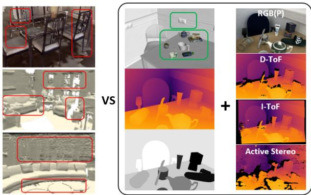

# On the Importance of Accurate Geometry Data for Dense 3D Vision Tasks

HyunJun Jung∗1, Patrick Ruhkamp∗1,2, Guangyao Zhai1, Nikolas Brasch1, Yitong Li1, Yannick Verdie1,3, Jifei Song3, Yiren Zhou3, Anil Armagan3, Slobodan Ilic1,4, Ales Leonardis3, Nassir Navab1, Benjamin Busam1,2

1 Technical University of Munich, 2 3Dwe.ai, 3 Huawei Noah’s Ark Lab, 4 Siemens AG, ∗ Equal Contribution hyunjun.jung@tum.de, p.ruhkamp@tum.de, guangyao.zhai@tum.de, b.busam@tum.de

## Abstract

Learning-based methods to solve dense 3D vision problems typically train on 3D sensor data. The respectively used principle of measuring distances provides advantages and drawbacks. These are typically not compared nor discussed in the literature due to a lack of multi-modal datasets. Texture-less regions are problematic for structure from motion and stereo, reflective material poses issues for active sensing, and distancesfor translucent objects are intricate to measure with existing hardware. Training on inaccurate or corrupt data induces model bias and hampers generalisation capabilities. These effects remain unnoticed if the sensor measurement is considered as ground truth during the evaluation. This paper investigates the effect of sensor errorsfor the dense 3D vision tasks ofdepth estimation and reconstruction. We rigorously show the significant impact of sensor characteristics on the learned predictions and notice generalisation issues arising from various technologies in everyday household environments. For evaluation, we introduce a carefully designed dataset1 comprising measurements from commodity sensors, namely D-ToF, I-ToF, passive/active stereo, and monocular RGB+P. Our study quantifies the considerable sensor noise impact and paves the way to improved dense vision estimates and targeted datafusion.

## 1. Introduction

Our world is 3D. Distance measurements are essential for machines to understand and interact with our environment spatially. Autonomous vehicles [23, 30, 50, 58] need this information to drive safely, robot vision requires distance information to manipulate objects [15,62,72,73], and AR realism benefits from spatial understanding [6, 31].

A variety of sensor modalities and depth predic-

Other Datasets

Our Dataset

Figure 1. Other datasets for dense 3D vision tasks reconstruct the scene as a whole in one pass [8,12,56], resulting in low quality and accuracy (cf. red boxes). On the contrary, our dataset scans the background and every object in the scene separately a priori and annotates them as dense and high-quality 3D meshes. Together with precise camera extrinsics from robotic forward-kinematics, this enables a fully dense rendered depth as accurate pixel-wise ground truth with multimodal sensor data, such as RGB with polarization, D-ToF, I-ToF and Active Stereo. Hence, it allows quantifying different downstream 3D vision tasks such as monocular depth estimation, novel view synthesis, or 6D object pose estimation.

tion pipelines exist. The computer vision community thereby benefits from a wide diversity of publicly available datasets [23, 51, 52, 57, 60, 61, 65], which allow for evaluation of depth estimation pipelines. Depending on the setup, different sensors are chosen to provide ground truth (GT) depth maps, all of which have their respective advantages and drawbacks determined by their individual principle of distance reasoning. Pipelines are usually trained on the data without questioning the nature of the depth sensor used for supervision and do not reflect areas of high or low confidence of the GT.

Popular passive sensor setups include multi-view stereo cameras where the known or calibrated spatial relationship between them is used for depth reasoning [51]. Corresponding image parts or patches are photometrically or structurally associated, and geometry allows to triangulate points within an overlapping field of view. Such photometric cues are not reliable in low-textured areas and with little ambient light where active sensing can be beneficial [52,57]. Active stereo can be used to artificially create texture cues in lowtextured areas and photon-pulses with a given sampling rate are used in Time-of-Flight (ToF) setups either directly (D-ToF) or indirectly (I-ToF) [26]. With the speed of light, one can measure the distance of objects from the return time of the light pulse, but unwanted multi-reflection artifacts also arise. Reflective and translucent materials are measured at incorrect far distances, and multiple light bounces distort measurements in corners and edges. While ToF signals can still be aggregated for dense depth maps, a similar setup is used with LiDAR sensors which sparsely measure the distance using coordinated rays that bounce from objects in the surrounding. The latter provides ground truth, for instance, for the popular outdoor driving benchmark KITTI [23]. While LiDAR sensing can be costly, radar [21] provides an even sparser but more affordable alternative. Multiple modalities can also be fused to enhance distance estimates. A common issue, however, is the inherent problem of warping onto a common reference frame which requires the information about depth itself [27, 37]. While multi-modal setups have been used to enhance further monocular depth estimation using self-supervision from stereo and temporal cues [25, 60], its performance analysis is mainly limited to average errors and restricted by the individual sensor used. An unconstrained analysis of depth in terms of RMSE compared against a GT sensor only shows part of the picture as different sensing modalities may suffer from drawbacks.

Where are the drawbacks of current depth-sensing modalities - and how does this impact pipelines trained with this (potentially partly erroneous) data? Can self- or semi-supervision overcome some of the limitations posed currently? To objectively investigate these questions, we provide multi modal sensor data as well as highly accurate annotated depth so that one can analyse the deterioration of popular monocular depth estimation and 3D reconstruction methods (see Fig. 1) on areas of different photometric complexity and with varying structural and material properties while changing the sensor modality used for training. To quantify the impact of sensor characteristics, we build a unique camera rig comprising a set of the most popular indoor depth sensors and acquire synchronised captures with highly accurate ground truth data using 3D scanners and aligned renderings. To this end, our main contributions can be summarized as follows:

1. We question the measurement quality from commodity depth sensor modalities and analyse their impact as supervision signals for the dense 3D vision tasks of depth estimation and reconstruction.

2. We investigate performance on texture-varying material as well as photometrically challenging reflective, translucent and transparent areas where learning methods systematically reproduce sensor errors.

3. To objectively assess and quantify different data sources, we contribute an indoor dataset comprising an unprecedented combination of multi-modal sensors, namely I-ToF, D-ToF, monocular RGB+P, monochrome stereo, and active light stereo together with highly accurate ground truth.

## 2. Related Work

## 2.1. Geometry from X

A variety of sensor modalities have been used to obtain depth maps. Typical datasets comprise one ground truth sensor used for all acquisitions, which is assumed to give accurate enough data to validate the models:

Stereo Vision. In the stereo literature, early approaches [51] use a pair of passive cameras and restrict scenes to piecewise planar objects for triangulation. Complex setups with an industrial robot and structured light can yield ground truth depth for stereo images [1]. Robots have also been used to annotate keypoints on transparent household objects [36]. As these methods are incapable of retrieving reliable depth in textureless areas where stereo matching fails, active sensors are used to project patterns onto the scenes to artificially create structures. The availability of active stereo sensors makes it also possible to acquire real indoor environments [52] where depth data at missing pixels is inpainted. Structure from motion (SfM) is used to generate the depth maps of Sun3D [65] where a moving camera acquires the scenes and data is fused ex post. A temporally tracked handheld active sensor is further used for depth mapping for SLAM evaluation in the pioneering dataset of Sturm et al. [57]. While advancing the field, its depth maps are limited to the active IR-pattern used by its RGB-D sensor.

Time-of-Flight Sensors. Further advances in active depth sensing emphasize ToF more. Initial investigations focus on simulated data [26] and controlled environments with little ambient noise [54]. The broader availability of ToF sensors in commercial products (e.g. Microsoft Kinect series) and modern smartphones (e.g. I-ToF of Huawei P30 Pro, D-ToF in Apple iPhone 12) creates a line of research around curing the most common sensor errors. These are multipath interference (MPI), motion artefacts and a high level of sparsity and shot noise [27]. Aside of classical active and passive stereo, we therefore also include D-ToF and I-ToF modalities in all our experiments.

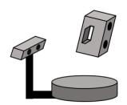  
(a) Object Scanning

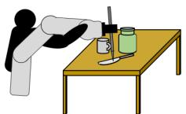  
(b) Tool tip calibration and object annotation

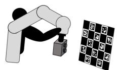  
(c) Hand-Eye calibration

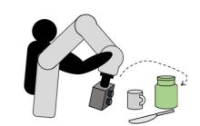

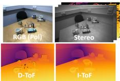

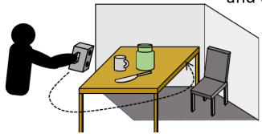  
(e) Dataset recording  
(d) Trajectory recording

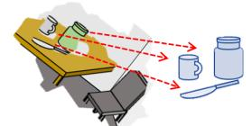  
(f) Partial scene scanning  
(g) Fit partially scanned mesh on the objects meshes

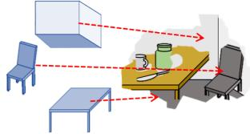  
(h) Fit large object meshes

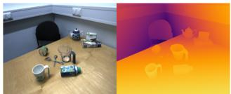  
(i) Render accurate depth from each camera view

Figure 2. Scanning Process Overview. To extract highly accurate geometry, we design a multi-stage acquisition process. At first, 3D models are extracted with structured light 3D scanners (a). Scene objects (b) and mounted sensor rig (b) are calibrated towards a robot for accurate camera pose retrieval [61]. A motion trajectory is recorded in gravity compensation mode (d) and repeated to record synchronized images of all involved sensors (e). A partial digital twin of the 3D scene (f) is aligned to small (g) and larger (h) objects to retrieve an entire in silico replica of the scene which can be rendered from the camera views of each sensor used (i) which results in highly accurate dense depth maps that enable investigations of individual sensor components.

Polarimetric Cues. Other properties of light are used to indirectly retrieve scene surface properties in the form of normals for which the amount of linearly polarized light and its polarization direction provide information, especially for highly reflective and transparent objects [17, 29]. Initial investigations for shape from polarization mainly analyse controlled setups [3,18,53,70]. More recent approaches investigate also sensor fusion methods [28] even in challenging scenes with strong ambient light [60]. We consequently also acquire RGB+P data for all scenes.

Synthetic Renderings. In order to produce pixel-perfect ground truth, some scholars render synthetic scenes [40]. While this produces the best possible depth maps, the scenes are artificially created and lack realism, causing pipelines trained on Sintel [7] or SceneFlow [40] to suffer from a synthetic-to-real domain gap. In contrast, we follow a hybrid approach and leverage pixel-perfect synthetic data from modern 3D engines to adjust highly accurate 3D models to real captures.

## 2.2. Monocular Depth Estimation

Depth estimation from a single image is inherently illposed. Deep learning has enabled this task for real scenes. Supervised Training. Networks can learn to predict depth with supervised training. Eigen et al. [14] designed the first monocular depth estimation network by learning to predict coarse depth maps, which are then refined by a second network. Laina et al. [32] improved the latter model by using only convolutional layers in a single CNN. The required ground truth often limits these methods to outdoor scenarios [22]. A way of bypassing this is to use synthetic data [39]. Narrowing down the resulting domain gap can be realized [26]. MiDaS [47] generalizes better to unknown scenes by mixing data from 3D movies. To predict highresolution depth, most methods use multi-scale features or post processing [41, 69] which complicates learning. If not trained on a massive set of data, these methods show limited generalization capabilities.

Self-Supervision. Self-supervised monocular methods try to circumvent this issue. The first such methods [19, 66] propose to use stereo images to train a network for depth prediction. With it, the left image is warped into the right where photometric consistency serves as training signal. Monodepth [24] added a left-right consistency loss to mutually leverage warping from one image into the other. Even though depth quality improves, it requires synchronized image pairs. Monocular training methods are developed that use only one camera where frames in a video are leveraged for the warping with simultaneously estimated poses between them. This task is more intricate, however, Monodepth2 [25] reduces the accuracy gap between the stereo and monocular training by automasking and with a minimum reprojection loss. A large body of work further improves the task [10,33,46,47,55,68] and investigates temporal consistency [38,50,64]. To compare the effect of various supervision signals for monocular depth estimation, we utilized the ResNet backbone of the popular Monodepth2 [25] together with its various training strategies.

## 2.3. Reconstruction and Novel View Synthesis

The 3D geometry of a scene can be reconstructed from 2D images and optionally their depth maps [43]. Scenes are stored explicitly or implicitly. Typical explicit representation include point clouds or meshes [11] while popular implicit representation are distance fields [71] which provide the scene as a level set of a given function, or neural fields where the scene is stored in the weights of a network [67]. NeRFs. Due to their photorealism in novel view synthesis, recent advances around neural radiance fields (NeRF) [42] experience severe attention. In this setup, one network is trained on a posed set of images to represent a scene. The method optimizes for the prediction of volume density and view-dependent emitted radiance within a volume. Integration along query rays allows to synthesize novel views of static and deformable [44] scenes. Most noticeable recent advances extend the initial idea to unbounded scenes of higher quality with Mip-NeRF 360 [5] or factor the representation into low-rank components with TensoRF [9] for faster and more efficient usage. Also robustness to pose estimates and calibration are proposed [34, 63]. While the initial training was computationally expensive, methods have been developed to improve inference and training. With spherical harmonics spaced in a voxel grid structure, Plenoxels [16] speed up processes even without a neural network and interpolation techniques [59] accelerate training. Geometric priors such as sparse and dense depth maps can regularize convergence, improve quality and training time [13,49]. Besides recent works on methods themselves, [48] propose to leverage real world objects from crowdsourced videos on a category level to construct a dataset to evaluate novel view synthesis and category-centric 3D reconstruction methods.

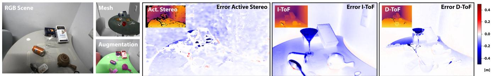  
Figure 3. Data Quality. A full 3D reconstruction of the RGB scene (left) allows to render highly accurate depth maps from arbitrary views. These serve as GT to study sensor errors of various depth sensors for different scene structures (right). E.g., due to the measurement principle, the translucent glass becomes invisible for the ToF sensors.

We make use of most recent NeRF advances and analyse the impact of sensor-specific depth priors in [49] for the task of implicit scene reconstruction. To neglect the influence of pose estimates and produce highly accurate data, we leverage the robotic pose GT of our dataset.

## 3. Data Acquisition & Sensor Modalities

We set up scenes composed of multiple objects with different shapes and materials to analyse sensor characteristics. 3D models of photometrically challenging objects with reflective or transparent surfaces are recorded with high quality a priori and aligned to the scenes. Images are captured from a synchronised multi-modal custom sensor mounted at a robot end-effector to allow for precise pose camera measurements [61]. High-quality rendered depth can be extracted a posteriori from the fully annotated scenes for the viewpoint of each sensor. The acquisition pipeline is depicted in Fig. 2.

Previous 3D and depth acquisition setups [8,12,56] scan the scene as a whole which limits the quality by the used sensor. We instead separately scan every single object, including chairs and background, as well as small household objects a priori with two high-quality structured light object scanners. This process significantly pushes the annotation quality for the scenes as the robotic 3D labelling process only has a point RMSE error of 0.80 mm [61]. For comparison, a Kinect Azure camera induces a standard deviation of 17 mm in its working range [35]. The accuracy allows us to investigate depth errors arising from sensor noise objectively, as shown in Fig. 3, while resolving common issues of imperfect meshes in available datasets (cf. Fig. 1, left).

## 3.1. Sensor Setup & Hardware Description

The table-top scanner (EinScan-SP, SHINING 3D Tech. Co., Ltd., Hangzhou, China) uses a rotating table and is designed for small objects. The other is a hand-held scanner (Artec Eva, Artec 3D, Luxembourg) which we use for larger objects and the background. For objects and areas with challenging material, self-vanishing 3D scanning spray (AESUB Blue) is used. For larger texture-less areas such as tables and walls we temporarily attach small markers [20] to the surface to allow for relocalization of the 3D scanner. The robotic manipulator is a KUKA LBR iiwa 7 R800 (KUKA Roboter GmbH, Germany) with a position accuracy of ±0.1 mm. We validated this during our pivot calibration stage (Fig. 2 b) by calculating the 3D location of the tool tip (using forward kinematics and hand-tip calibration) while varying robot poses. The position varied in [−0.158, 0.125] mm in line with this. Our dataset features a unique multi-modal setup with four different cameras, which provide four types of input images (RGB, polarization, stereo, Indirect ToF (I-ToF) correlation) and three different depth images modalities (Direct ToF (D-ToF), I-ToF, Active Stereo). RGB and polarization images are acquired with a Phoenix 5.0 MP Polarization camera (PHX050S1- QC, LUCID Vision Labs, Canada) equipped with a Sony Polarsens sensor (IMX264MYR CMOS, Sony, Japan). To acquire stereo images, we use an Intel RealSense D435 (Intel, USA) with switched off infrared projector. Depth is acquired from an Intel RealSense L515 D-ToF sensor, an Intel Realsense D435 active stereo sensor with infrared pattern projection, and a Lucid Helios (HLS003S-001, LUCID Vision Labs, Canada) I-ToF sensor. A Raspberry Pi triggers each camera separately to remove interference effects between infrared signals of depth sensors. The hardware is rigidly mounted at the robot end-effector (see Fig. 4) which allows to stop frame-by-frame for the synchronized acquisition of a pre-recorded trajectory.

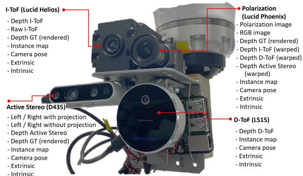  
Figure 4. Camera Rig and 3D Sensor Data. The custom multimodal sensor rig comprises depth sensors for I-ToF (top left), Stereo (lower left), D-ToF (lower right), and RGB-P (Polarization, top right). It is fixed to a robot end-effector (top) and a Raspberry Pi (right) triggers acquisition.

## 3.2. Scene Statistics & Data Comparison

We scanned 7 indoor areas, 6 tables, and 4 chairs, with the handheld scanner as background and large objects. 64 household objects from 9 categories (bottle, can, cup, cutlery, glass, remote, teapot, tube, shoe) are scanned with the tabletop structured light scanner. The data comprises 13 scenes split into 10 scenes for training and 3 scenes for testing. Each scene is recorded with 2 trajectories of 200-300 frames with and without the objects. This sums up to 800- 1200 frames per scene, with a total of 10k frames for training and 3k frames for our test set. The 3 test scenes have different background setups: 1) Seen background, 2) Seen background with different lighting conditions and 3) Unseen background and table, with three different object setups: 1) Seen objects 2) Unseen objects from the seen category 3) Unseen objects from unseen categories (shoe and tube). Table 1 compares our dataset with various existing setups. To the best of our knowledge, our dataset is the only multi-modal dataset comprising RGB, ToF, Stereo, Active Stereo, and Polarisation modalities simultaneously with reliable ground truth depth maps.

## 4. Methodology

The dataset described above allows for the first time for rigorous, in-depth analysis of different depth sensor modalities and a detailed quantitative evaluation of learning-based dense scene regression methods when trained with varying supervision signals. We focus on the popular tasks of monocular depth estimation and implicit 3D reconstruction with the application of novel view synthesis.

## 4.1. Depth Estimation

To train the depth estimation from a single image, we leverage the widely adopted architecture from [25]. We train an encoder-decoder network with a ResNet18 encoder and skip connections to regress dense depth. Using different supervision signals from varying depth modalities allows to study the influence and the characteristics of the 3D sensors. Additionally, we analyze whether complementary semi-supervision via information of the relative pose between monocular acquisitions and consecutive image information of the moving camera can overcome sensor issues.

We further investigate the network design influence on the prediction quality for the supervised case. For this, we train two high-capacity networks with transformer backbones on our data, namely DPT [46] and MIDAS [47].

Dense Supervision In the fully supervised setup, depth modalities from the dataset are used to supervise the prediction of the four pyramid level outputs after upsampling to the original input resolution with: $\mathcal { L } _ { \mathrm { s u p e r v i s e d } } =$ $\begin{array} { r } { \sum _ { i = 1 } ^ { i = 4 } \left. \widetilde { D } _ { i } - D \right. _ { 1 } } \end{array}$ , where $D$ is the supervision signal for valid pixels of the depth map and $\widetilde { D } _ { i }$ the predicted depth at pyramid scale i.

Self-Supervision Depth and relative pose prediction between consecutive frames of a moving camera can be formulated as coupled optimization problem. We follow established methods to formulate a dense image reconstruction loss through projective geometric warping [25]. In this process, a temporal image $I _ { t ^ { \prime } }$ at time $t ^ { \prime }$ is projectively transformed to the frame at time t via:   
${ \cal I } _ { t ^ { \prime } \to t } = { \cal I } _ { t ^ { \prime } } \big \langle \mathrm { p r o j } ( { \cal D } _ { t } , { \cal T } _ { t \to t ^ { \prime } } , K ) \big \rangle$ , where $D _ { t }$ is the predicted depth for frame $t , T _ { t  t ^ { \prime } }$ the relative camera pose, and $K$ the camera intrinsics. The photometric reconstruction error [25, 50, 64] between image $I _ { x }$ and $I _ { y } ,$ given by: $\begin{array} { r } { E _ { \mathrm { p e } } ( I _ { x } , I _ { y } ) \ = \ \alpha \frac { 1 - { \mathrm { S S I M } } ( I _ { x } , I _ { y } ) } { 2 } + ( 1 - \alpha ) \| I _ { x } - I _ { y } \| _ { 1 } } \end{array}$ is computed between target frame $I _ { t }$ and each source frame $I _ { s }$ with $s \in \ S$ The pixel-wise minimum error is retrieved to finally define $\scriptstyle { \mathcal { L } } _ { \mathrm { p h o t o } }$ over $S = [ t - F , t + F ]$ as $\begin{array} { r } { \mathcal { L } _ { \mathrm { p h o t o } } = \operatorname* { m i n } _ { s \in S } E _ { \mathrm { p e } } ( I _ { t } , I _ { s  t } ) } \end{array}$ . The edge-aware smoothness $\mathcal { L } _ { \mathrm { s } }$ is applied [25] to encourage locally smooth depth estimations with the mean-normalized inverse depth $\overline { { d _ { t } } }$ as ${ \mathcal { L } } _ { \mathrm { s } } = \left| \partial _ { x } { \overline { { d _ { t } } } } \right| e ^ { - | \partial _ { x } I _ { t } | } + \left| \partial _ { y } { \overline { { d _ { t } } } } \right| e ^ { - | \partial _ { y } I _ { t } | }$ . The final training loss for the self-supervised setup is: $\mathcal { L } _ { \mathrm { s e l f - s u p e r v i s e d } } ~ =$ $\mathcal { L } _ { \mathrm { p h o t o } } + \lambda _ { \mathrm { s } } \cdot \mathcal { L } _ { \mathrm { s } }$

Table 1. Comparison of Datasets. Shown are differences between our dataset and previous multi-modal depth datasets for indoor environments. Our dataset is the only one that provides highly accurate GT (Depth, Surface Normals, 6D Object Poses, Instance Masks, Camera Poses, Dense Scene Mesh) together with varying sensor data for real scenes.
<table><tr><td>Dataset</td><td>Acc.GT</td><td>RGB</td><td>D-ToF</td><td>I-ToF</td><td>Stereo</td><td>Act.Stereo</td><td>Polar.</td><td>Indoor</td><td>Real</td><td>Video</td><td>Frames</td></tr><tr><td>Agresti [2]</td><td></td><td></td><td></td><td>√</td><td></td><td></td><td></td><td>√</td><td>√</td><td></td><td>113</td></tr><tr><td>CroMo [60]</td><td></td><td></td><td></td><td>√</td><td>√</td><td></td><td>√</td><td>(√)</td><td>√</td><td>√</td><td>&gt;10k</td></tr><tr><td>Zhu [75]</td><td></td><td>(√)</td><td></td><td></td><td></td><td></td><td>√</td><td>√</td><td>√</td><td>一</td><td>1</td></tr><tr><td>Sturm [57]</td><td></td><td>√</td><td></td><td></td><td></td><td></td><td></td><td>√</td><td>√</td><td>√</td><td>&gt;10k</td></tr><tr><td>[28]/ [45]/ [4]</td><td></td><td>√</td><td></td><td></td><td></td><td></td><td>了</td><td>V</td><td>√</td><td></td><td>1/40/300</td></tr><tr><td>Guo [26]</td><td>√</td><td>一</td><td></td><td></td><td></td><td></td><td></td><td>V</td><td>一</td><td></td><td>2000</td></tr><tr><td>Ours</td><td>√</td><td>√</td><td>√</td><td>√</td><td></td><td>了</td><td>√</td><td>V</td><td>√</td><td>√</td><td>&gt;10k</td></tr></table>

Semi-Supervision For the semi-supervised training, the ground truth relative camera pose is leveraged. The predicted depth estimate is used to formulate the photometric image reconstruction. We also enforce the smoothness loss as detailed above.

Data Fusion Despite providing high accuracy ground truth, our annotation pipeline is time-consuming. One may ask whether this cannot be done with multi-view data aggregation. We therefore compare the quality against the dense structure from motion method Kinect Fusion [43] and an approach for TSDF Fusion [74]. The synchronized sensor availability allows also to investigate and improve sensor fusion pipelines. To illustrate the impact of high quality GT for this task, we also train the recent raw ToF+RGB fusion network Wild-ToFu [27] on our dataset.

## 4.2. Implicit 3D Reconstruction

Recent work on implicit 3D scene reconstruction leverages neural radiance fields (NeRF) [42]. The technique works particularly well for novel view synthesis and allows to render scene geometry or RGB views from unobserved viewpoints. Providing additional depth supervision regularizes the problem such that fewer views are required and training efficiency is increased [13, 49]. We follow the motivation of [49] and leverage different depth modalities to serve as additional depth supervision for novel view synthesis. Following NeRF literature [42, 49], we encode the radiance field for a scene in an MLP $F _ { \theta }$ to predict colour $\textbf { C } = ~ [ r , g , b ]$ and volume density σ for some 3D position $\textbf { x } \in \ \mathbb { R } ^ { 3 }$ and viewing direction $\textbf { d } \in \ \mathbb { S } ^ { 2 }$ We use the positional encoding from [49]. For each pixel, a ray $\mathbf { r } ( t ) = \mathbf { o } + t \mathbf { d }$ from the camera origin o is sampled through the volume at location $t _ { k } \in [ t _ { n } , t _ { f } ]$ between near and far planes by querying $F _ { \theta }$ to obtain colour and density: $\begin{array} { r } { \hat { \mathbf { C } } ( \mathbf { r } ) = \sum _ { k = 1 } ^ { K } w _ { k } \mathbf { c } _ { k } \operatorname { w i t h } w _ { k } = T _ { k } ( 1 - \exp ( - \sigma _ { k } \delta _ { k } ) ) } \end{array}$

$$
\begin{array} { r } { T _ { k } = \exp \left( - \sum _ { k ^ { \prime } = 1 } ^ { k } \sigma _ { k ^ { \prime } } \delta _ { k ^ { \prime } } \right) } \end{array}
$$

$$
\delta _ { k } = t _ { k + 1 } - t _ { k }
$$

The NeRF depth zˆ(r) is computed by: $\begin{array} { r } { \hat { z } ( \mathbf { r } ) = \sum _ { k = 1 } ^ { K } w _ { k } t _ { k } } \end{array}$ and the depth regularization for an image with rays R is:

$\mathcal { L } _ { \mathrm { D } } = \sum _ { \mathbf { r } \in \mathcal { R } } \frac { | \hat { z } ( \mathbf { r } ) - z ( \mathbf { r } ) | } { \hat { z } ( \mathbf { r } ) + z ( \mathbf { r } ) }$ , where z(r) is the depth of the sensor. Using the mean squared error (MSE) loss $\mathcal { L } _ { \mathrm { c o l o u r } } =$ $\mathbf { M S E } ( \hat { \mathbf { C } } , \mathbf { C } )$ for synthesized colours, the final training loss is: ${ \mathcal { L } } _ { \mathrm { N e R F } } = { \mathcal { L } } _ { \mathrm { c o l o u r } } + \lambda _ { \mathrm { D } } \cdot { \mathcal { L } } _ { \mathrm { D } }$

## 5. Sensor Impact for Dense 3D Vision Tasks

We train a series of networks for the task of monocular depth estimation and implicit scene reconstruction.

## 5.1. Depth Estimation

Results for monocular depth estimation with varying training signal are summarized in Table 2 and Fig. 5. We report average results for the scenes and separate performances for background, objects, and materials of different photometric complexity. The error varies from background to objects. Their varying photometric complexity can explain this. Not surprisingly, the ToF training is heavily influenced by reflective and transparent object material, where the active stereo camera can project some patterns onto diffusely reflective surfaces. Interestingly, the self- and semisupervised setups help to recover information in these challenging setups to some extent, such that these cases even

Table 2. Depth Prediction Results for Different Training Signals. Top: Dense supervision from different depth modalities. Bottom: Evaluation of semi-supervised (pose GT) and selfsupervised (mono and mono+stereo) training. The entire scene (Full), background (BG), and objects (Obj) are evaluated separately. Objects material is further split into textured, reflective and transparent. Best and 2nd best RMSE in mm are indicated.
<table><tr><td></td><td>Training Signal</td><td>Full</td><td>BG</td><td>Obj</td><td>Text.</td><td>Refl.</td><td>Transp.</td></tr><tr><td></td><td>I-ToF</td><td>113.29</td><td>111.13</td><td>119.72</td><td>54.45</td><td>87.84</td><td>207.89</td></tr><tr><td>dn$</td><td>D-ToF</td><td>77.97</td><td>69.87</td><td>112.83</td><td>37.88</td><td>71.59</td><td>207.85</td></tr><tr><td></td><td>Active Stereo</td><td>72.20</td><td>71.94</td><td>61.13</td><td>50.90</td><td>52.43</td><td>87.24</td></tr><tr><td>Pose</td><td></td><td>154.87</td><td>158.67</td><td>65.42</td><td>57.22</td><td>37.78</td><td>61.86</td></tr><tr><td></td><td>M</td><td>180.34</td><td>183.65</td><td>85.51</td><td>84.26</td><td>48.80</td><td>49.62</td></tr><tr><td>Sel/em</td><td>M+S</td><td>159.80</td><td>161.65</td><td>82.16</td><td>71.24</td><td>63.92</td><td>66.48</td></tr></table>

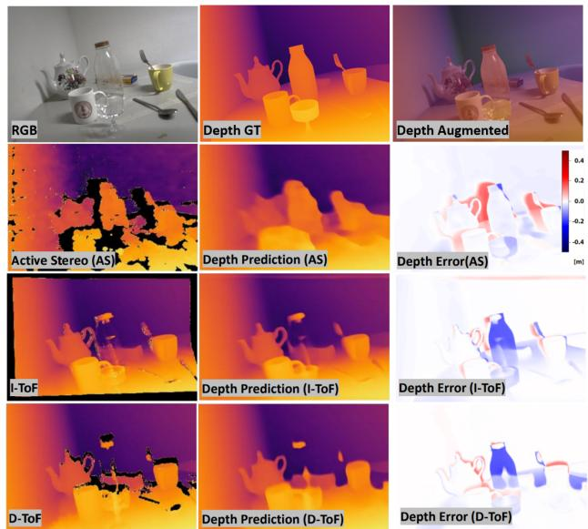  
Figure 5. Fully Supervised Monocular Depth. Monocular depth tends to overfit on the specific noise of the sensor the network is trained on. Prediction from Active Stereo GT is robust on the material while depth map is blurry, while both I-ToF and D-ToF has strong material dependent artifact but sharp on the edges.

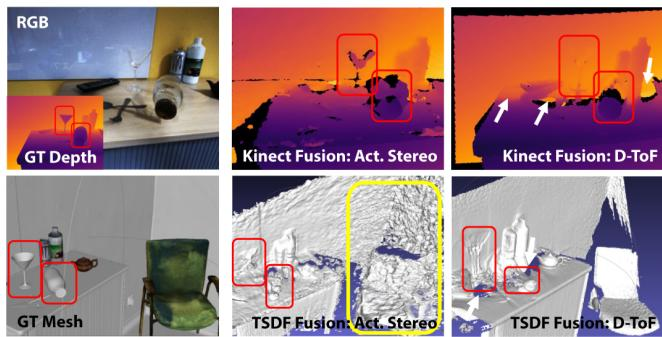  
Figure 6. Dense SfM. A scene with our GT (left), Kinect [43] (top) and TSDF [74] (bottom) fusion approaches. Inherent sensor noise due to MPI (white), transparent objects (red), and diffuse texture-less material (yellow) persists.

outperform the ToF supervision for photometrically challenging objects. In contrast, simpler structures (such as the background) benefit from the ToF supervision. This indicates that sensor-specific noise is learnt and reveals that systematic errors of learning approaches cannot be evaluated if such 3D devices are used for ground truth evaluation without critical analysis. This might ultimately lead to incorrect result interpretations, particularly if self-supervised approaches are evaluated against co-modality sensor data. The table also discloses that the mutual prediction of inter-frame poses in self-supervision indoor setups is challenging, and accurate pose labels can have an immediate and significant impact on the depth results (Pose vs. M).

Fig. 6 shows that multi-view data aggregation in the form of dense SfM fails to reproduce highly reliable 3D reconstructions. In particular transparent and diffuse textureless objects pose challenges to both Active Stereo and D-ToF. These can neither be recovered by the Kinect Fusion pipeline [43] nor by the TSDF Fusion implementation of Open3D [74] for which we use the GT camera poses. Inherent sensor artefacts are present even if depth maps from dif ferent viewpoints are combined. This quality advantage justifies our expensive annotation setup. We further analysed the results of training runs with DPT [46] and MIDAS [47], which we train from scratch. While these more complex architectures with higher capacity show the same trend and also learn sensor noise, the training time is significantly longer. More details are provided in the supplementary material. From the previous results, we have seen that ToF depth is problematic for translucent and reflective material. Fig 7 illustrates that an additional co-modal input signal at test time can cure these effects partly. It can be observed that the use of additional RGB data in [27] reduces the influence of MPI and resolves some material-induced depth artefacts. Our unique dataset also inspires cross-modal fusion pipelines’ development and objective analysis.

## 5.2. Implicit 3D Reconstruction & View Synthesis

Our implicit 3D reconstruction generates novel views for depth, normals and RGB with varying quality. If trained with only colour information, the NeRF produces convincing RGB views with the highest PSNR (cf. Fig. 8 and Table 3). However, the 3D scene geometry is not well reconstructed. In line with the literature [13, 49], depth regularization improves this (e.g. on texture-less regions). Regularising with different depth modalities makes the sensor noise of I-ToF, AS, and D-ToF clearly visible. While the RMSE behaves similarly to the monocular depth prediction results with AS as best, followed by D-ToF and I-ToF. The cosine similarity for surface normal estimates confirms this trend. The overall depth and normal reconstruction for AS are very noisy, but depth error metrics are more sensitive for significant erroneous estimates for reflective and translucent objects. Prior artefacts of the respective sensor influence the NeRF and translate into incorrect reconstructions (e.g. errors from D-ToF and I-ToF for translucent material or noisy background and inaccurate depth discontinuities at edges for AS). Interestingly, the D-ToF prior can improve the overall reconstruction for most of the scene but fails for the bottle, where the AS can give better depth priors. This is also visible in the synthesised depth. Leveraging synthetic depth GT (last row) mitigates these issues and positively affects the view synthesis with higher SSIM.

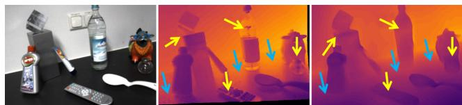  
Figure 7. Sensor Fusion. Scene (left) with I-ToF depth (centre) and ToF+RGB Fusion [27] (right). Fusion can help to resolve some material induced artefacts (yellow) as well as MPI (blue).

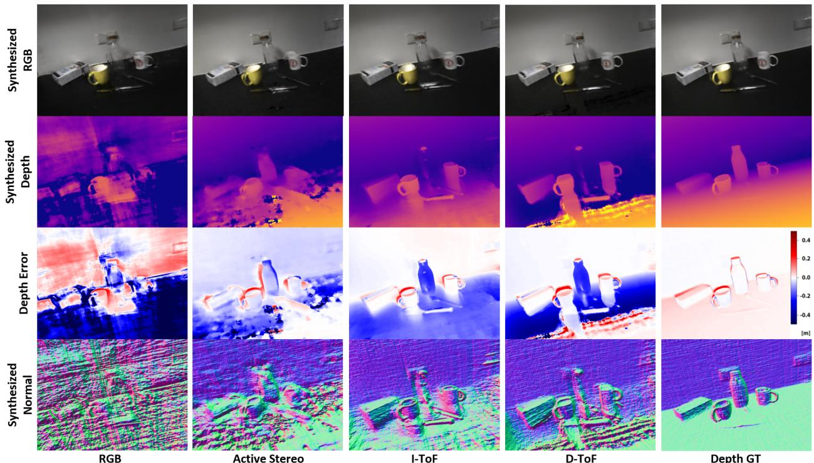  
Figure 8. Reconstruction Results. The results of an implicit scene reconstruction with a Neural Radiance Field (NeRF) are shown. Images are synthesised for depth, surface normals and RGB for an unseen view, which is shown together with the prediction errors. The columns allow us to compare different methods where a NeRF [42] is trained solely on RGB (first column) and various depth maps for regularisation as proposed in [49]. The last column illustrates synthesised results from training with GT depth for comparison. Differences are visible, especially for the partly reflective table edges, the translucent bottle and around depth discontinuities.

## 6. Discussion & Conclusion

This paper shows that questioning and investigating commonly used 3D sensors helps to understand their impact on dense 3D vision tasks. For the first time, we make it possible to study how sensor characteristics influence learning in these areas objectively. We quantify the effect of various photometric challenges, such as translucency and reflectivity for depth estimation, reconstruction and novel view synthesis and provide a unique dataset to stimulate research in this direction. While obvious sensor noise is not ”surprising”, our dataset quantifies this impact for the first time. For instance, interestingly, D-ToF supervision is significantly better suited (13.02 mm) for textured objects than AS, which in return surpasses I-ToF by 3.55 mm RMSE (cf. 2). Same trend holds true on mostly texture-less backgrounds where D-ToF is 37% more accurate than I-ToF. For targeted analysis and research of dense methods for reflective and transparent objects, a quantitative evaluation is of utmost interest - while our quantifiable error maps allow specifying the detailed deviations. Although our dataset tries to provide scenes with varying backgrounds, the possible location of the scene is restricted due to the limited working range of the robot manipulator. Aside from our investigations and the evaluation of sensor signals for standard 3D vision tasks, we firmly believe that our dataset can also pave the way for further investigation of cross-modal fusion pipelines.

Table 3. Novel View Synthesis from Implicit 3D Reconstruction. Evaluation against GT for RGB, depth and surface normal estimates for different optimisation strategies (RGB-only for supervision and + respective sensor depth). We indicate best, 2nd best and 3rd best. Depth metrics in mm.
<table><tr><td></td><td colspan="2">RGB</td><td colspan="4">Depth</td><td rowspan="2">Normal Cos.Sim.↓</td></tr><tr><td>Modality</td><td>PSNR ↑</td><td>SSIM↑</td><td>Abs.Rel.↓</td><td>Sq.Rel.↓</td><td>RMSE↓</td><td>σ &lt; 1.25 ↑</td></tr><tr><td>RGB Only</td><td>32.406</td><td>0.889</td><td>0.328</td><td>111.229</td><td>226.187</td><td>0.631</td><td>0.084</td></tr><tr><td>+ AS</td><td>17.570</td><td>0.656</td><td>0.113</td><td>16.050</td><td>94.520</td><td>0.853</td><td>0.071</td></tr><tr><td>+ I-ToF</td><td>18.042</td><td>0.653</td><td>0.296</td><td>91.426</td><td>217.334</td><td>0.520</td><td>0.102</td></tr><tr><td>+ D-ToF</td><td>31.812</td><td>0.888</td><td>0.112</td><td>24.988</td><td>119.455</td><td>0.882</td><td>0.031</td></tr><tr><td>+ Syn.</td><td>32.082</td><td>0.894</td><td>0.001</td><td>0.049</td><td>3.520</td><td>1.000</td><td>0.001</td></tr></table>

## References

[1] Henrik Aanæs, Rasmus Jensen, George Vogiatzis, Engin Tola, and Anders Dahl. Large-scale data for multiple-view stereopsis. International Journal of Computer Vision, 120, 11 2016. 2

[2] Gianluca Agresti, Henrik Schaefer, Piergiorgio Sartor, and Pietro Zanuttigh. Unsupervised domain adaptation for tof data denoising with adversarial learning. In Proceedings of the IEEE/CVF Conference on Computer Vision and Pattern Recognition (CVPR), June 2019. 6

[3] Gary A Atkinson and Edwin R Hancock. Recovery of surface orientation from diffuse polarization. IEEE transactions on image processing, 15(6):1653–1664, 2006. 3

[4] Yunhao Ba, Alex Gilbert, Franklin Wang, Jinfa Yang, Rui Chen, Yiqin Wang, Lei Yan, Boxin Shi, and Achuta Kadambi. Deep shape from polarization. In Computer Vision–ECCV 2020: 16th European Conference, Glasgow, UK, August 23–28, 2020, Proceedings, Part XXIV 16, pages 554–571. Springer, 2020. 6

[5] Jonathan T Barron, Ben Mildenhall, Dor Verbin, Pratul P Srinivasan, and Peter Hedman. Mip-nerf 360: Unbounded anti-aliased neural radiance fields. In Proceedings of the IEEE/CVF Conference on Computer Vision and Pattern Recognition, pages 5470–5479, 2022. 4

[6] Benjamin Busam, Matthieu Hog, Steven McDonagh, and Gregory Slabaugh. SteReFo: efficient image refocusing with stereo vision. In Proceedings ofthe IEEE/CVF International Conference on Computer Vision Workshops, 2019. 1

[7] D. J. Butler, J. Wulff, G. B. Stanley, and M. J. Black. A naturalistic open source movie for optical flow evaluation. In A. Fitzgibbon et al. (Eds.), editor, European Conf. on Computer Vision (ECCV), Part IV, LNCS 7577, pages 611–625. Springer-Verlag, Oct. 2012. 3

[8] Angel Chang, Angela Dai, Thomas Funkhouser, Maciej Halber, Matthias Niessner, Manolis Savva, Shuran Song, Andy Zeng, and Yinda Zhang. Matterport3d: Learning from rgbd data in indoor environments. International Conference on 3D Vision (3DV), 2017. 1, 4

[9] Anpei Chen, Zexiang Xu, Andreas Geiger, Jingyi Yu, and Hao Su. Tensorf: Tensorial radiance fields. arXiv preprint arXiv:2203.09517, 2022. 4

[10] Po-Yi Chen, Alexander H Liu, Yen-Cheng Liu, and Yu-Chiang Frank Wang. Towards scene understanding: Unsupervised monocular depth estimation with semantic-aware representation. In Proceedings of the IEEE Conference on Computer Vision and Pattern Recognition, pages 2624– 2632, 2019. 3

[11] Brian Curless and Marc Levoy. A volumetric method for building complex models from range images. In Proceedings of the 23rd annual conference on Computer graphics and interactive techniques, pages 303–312, 1996. 3

[12] Angela Dai, Angel X. Chang, Manolis Savva, Maciej Halber, Thomas Funkhouser, and Matthias Nießner. Scannet: Richly-annotated 3d reconstructions of indoor scenes. In Proc. Computer Vision and Pattern Recognition (CVPR), IEEE, 2017. 1, 4

[13] Kangle Deng, Andrew Liu, Jun-Yan Zhu, and Deva Ramanan. Depth-supervised nerf: Fewer views and faster training for free. In Proceedings of the IEEE/CVF Conference on Computer Vision and Pattern Recognition, pages 12882– 12891, 2022. 4, 6, 7

[14] David Eigen, Christian Puhrsch, and Rob Fergus. Depth map prediction from a single image using a multi-scale deep network. In Advances in neural information processing systems, pages 2366–2374, 2014. 3

[15] Hao-Shu Fang, Chenxi Wang, Minghao Gou, and Cewu Lu. Graspnet-1billion: A large-scale benchmark for general object grasping. In Proceedings of the IEEE/CVF Conference on Computer Vision and Pattern Recognition, pages 11444– 11453, 2020. 1

[16] Sara Fridovich-Keil, Alex Yu, Matthew Tancik, Qinhong Chen, Benjamin Recht, and Angjoo Kanazawa. Plenoxels: Radiance fields without neural networks. In Proceedings of the IEEE/CVF Conference on Computer Vision and Pattern Recognition, pages 5501–5510, 2022. 4

[17] Daoyi Gao, Yitong Li, Patrick Ruhkamp, Iuliia Skobleva, Magdalena Wysocki, HyunJun Jung, Pengyuan Wang, Arturo Guridi, and Benjamin Busam. Polarimetric pose prediction. In European Conference on Computer Vision, pages 735–752. Springer, 2022. 3

[18] N Missael Garcia, Ignacio De Erausquin, Christopher Edmiston, and Viktor Gruev. Surface normal reconstruction using circularly polarized light. Optics express, 23(11):14391– 14406, 2015. 3

[19] Ravi Garg, Vijay Kumar Bg, Gustavo Carneiro, and Ian Reid. Unsupervised cnn for single view depth estimation: Geometry to the rescue. In European conference on computer vision, pages 740–756. Springer, 2016. 3

[20] Sergio Garrido-Jurado, Rafael Munoz-Salinas, Fran-˜ cisco Jose Madrid-Cuevas, and Manuel Jes´ us Mar´ ´ın-Jimenez. Automatic generation and detection of highly´ reliable fiducial markers under occlusion. Pattern Recognition, 47(6):2280–2292, 2014. 4

[21] Stefano Gasperini, Patrick Koch, Vinzenz Dallabetta, Nassir Navab, Benjamin Busam, and Federico Tombari. R4dyn: Exploring radar for self-supervised monocular depth estimation of dynamic scenes. In 2021 International Conference on 3D Vision (3DV), pages 751–760. IEEE, 2021. 2

[22] A Geiger, P Lenz, C Stiller, and R Urtasun. Vision meets robotics: The kitti dataset. The International Journal of Robotics Research, 32(11):1231–1237, Aug 2013. 3

[23] Andreas Geiger, Philip Lenz, and Raquel Urtasun. Are we ready for autonomous driving? the kitti vision benchmark suite. In 2012 IEEE conference on computer vision and pattern recognition, pages 3354–3361. IEEE, 2012. 1, 2

[24] Clement Godard, Oisin Mac Aodha, and Gabriel J. Brostow. Unsupervised monocular depth estimation with leftright consistency. 2017 IEEE Conference on Computer Vision and Pattern Recognition (CVPR), Jul 2017. 3

[25] Clement Godard, Oisin Mac Aodha, Michael Firman, and´ Gabriel J. Brostow. Digging into self-supervised monocular depth prediction. In The International Conference on Computer Vision (ICCV), 2019. 2, 3, 5

[26] Qi Guo, Iuri Frosio, Orazio Gallo, Todd Zickler, and Jan Kautz. Tackling 3d tof artifacts through learning and the flat dataset. In The European Conference on Computer Vision (ECCV), September 2018. 2, 3, 6

[27] HyunJun Jung, Nikolas Brasch, Ales Leonardis, Nassirˇ Navab, and Benjamin Busam. Wild tofu: Improving range and quality of indirect time-of-flight depth with rgb fusion in challenging environments. In 2021 International Conference on 3D Vision (3DV), pages 239–248. IEEE, 2021. 2, 6, 7

[28] Achuta Kadambi, Vage Taamazyan, Boxin Shi, and Ramesh Raskar. Depth sensing using geometrically constrained polarization normals. International Journal of Computer Vision, 125(1-3):34–51, 2017. 3, 6

[29] Agastya Kalra, Vage Taamazyan, Supreeth Krishna Rao, Kartik Venkataraman, Ramesh Raskar, and Achuta Kadambi. Deep polarization cues for transparent object segmentation. In Proceedings of the IEEE/CVF Conference on Computer Vision and Pattern Recognition, pages 8602–8611, 2020. 3

[30] Xin Kong, Xuemeng Yang, Guangyao Zhai, Xiangrui Zhao, Xianfang Zeng, Mengmeng Wang, Yong Liu, Wanlong Li, and Feng Wen. Semantic graph based place recognition for 3d point clouds. In 2020 IEEE/RSJ International Conference on Intelligent Robots and Systems (IROS), pages 8216–8223. IEEE, 2020. 1

[31] Johannes Kopf, Xuejian Rong, and Jia-Bin Huang. Robust consistent video depth estimation. In Proceedings of the IEEE/CVF Conference on Computer Vision and Pattern Recognition, pages 1611–1621, 2021. 1

[32] Iro Laina, Christian Rupprecht, Vasileios Belagiannis, Federico Tombari, and Nassir Navab. Deeper depth prediction with fully convolutional residual networks. In 2016 Fourth international conference on 3D vision (3DV), pages 239– 248. IEEE, 2016. 3

[33] Sihaeng Lee, Janghyeon Lee, Byungju Kim, Eojindl Yi, and Junmo Kim. Patch-wise attention network for monocular depth estimation. In Proceedings of the AAAI Conference on Artificial Intelligence, volume 35, pages 1873–1881, 2021. 3

[34] Chen-Hsuan Lin, Wei-Chiu Ma, Antonio Torralba, and Simon Lucey. Barf: Bundle-adjusting neural radiance fields. In Proceedings of the IEEE/CVF International Conference on Computer Vision, pages 5741–5751, 2021. 4

[35] Xingyu Liu, Shun Iwase, and Kris M Kitani. Stereobj-1m: Large-scale stereo image dataset for 6d object pose estimation. In Proceedings ofthe IEEE/CVF International Conference on Computer Vision, pages 10870–10879, 2021. 4

[36] Xingyu Liu, Rico Jonschkowski, Anelia Angelova, and Kurt Konolige. Keypose: Multi-view 3d labeling and keypoint estimation for transparent objects. In Proceedings of the IEEE/CVF conference on computer vision and pattern recognition, pages 11602–11610, 2020. 2

[37] Adrian Lopez-Rodriguez, Benjamin Busam, and Krystian Mikolajczyk. Project to adapt: Domain adaptation for depth completion from noisy and sparse sensor data. In Proceedings ofthe Asian Conference on Computer Vision, 2020. 2

[38] Xuan Luo, Jia-Bin Huang, Richard Szeliski, Kevin Matzen, and Johannes Kopf. Consistent video depth estimation.

ACM Transactions on Graphics (Proceedings of ACM SIG-GRAPH), 39(4):71–1, 2020. 3

[39] Nikolaus Mayer, Eddy Ilg, Philipp Fischer, Caner Hazirbas, Daniel Cremers, Alexey Dosovitskiy, and Thomas Brox. What makes good synthetic training data for learning disparity and optical flow estimation? International Journal of Computer Vision, 126(9):942–960, 2018. 3

[40] Nikolaus Mayer, Eddy Ilg, Philip Hausser, Philipp Fischer, Daniel Cremers, Alexey Dosovitskiy, and Thomas Brox. A large dataset to train convolutional networks for disparity, optical flow, and scene flow estimation. In Proceedings of the IEEE conference on computer vision and pattern recognition, pages 4040–4048, 2016. 3

[41] S Mahdi H Miangoleh, Sebastian Dille, Long Mai, Sylvain Paris, and Yagiz Aksoy. Boosting monocular depth estimation models to high-resolution via content-adaptive multiresolution merging. In Proceedings of the IEEE/CVF Conference on Computer Vision and Pattern Recognition, pages 9685–9694, 2021. 3

[42] Ben Mildenhall, Pratul P Srinivasan, Matthew Tancik, Jonathan T Barron, Ravi Ramamoorthi, and Ren Ng. Nerf: Representing scenes as neural radiance fields for view synthesis. Communications ofthe ACM, 65(1):99–106, 2021. 4, 6, 8

[43] Richard A. Newcombe, Shahram Izadi, Otmar Hilliges, David Molyneaux, David Kim, Andrew J. Davison, Pushmeet Kohi, Jamie Shotton, Steve Hodges, and Andrew Fitzgibbon. Kinectfusion: Real-time dense surface mapping and tracking. In 2011 10th IEEE International Symposium on Mixed and Augmented Reality, pages 127–136, 2011. 3, 6, 7

[44] Keunhong Park, Utkarsh Sinha, Jonathan T Barron, Sofien Bouaziz, Dan B Goldman, Steven M Seitz, and Ricardo Martin-Brualla. Nerfies: Deformable neural radiance fields. In Proceedings of the IEEE/CVF International Conference on Computer Vision, pages 5865–5874, 2021. 4

[45] Simeng Qiu, Qiang Fu, Congli Wang, and Wolfgang Heidrich. Polarization demosaicking for monochrome and color polarization focal plane arrays. In Hans-Jorg Schulz,¨ Matthias Teschner, and Michael Wimmer, editors, Vision, Modeling and Visualization. The Eurographics Association, 2019. 6

[46] Rene Ranftl, Alexey Bochkovskiy, and Vladlen Koltun. Vi-´ sion transformers for dense prediction. In Proceedings of the IEEE/CVF International Conference on Computer Vision, pages 12179–12188, 2021. 3, 5, 7

[47] Rene Ranftl, Katrin Lasinger, David Hafner, Konrad´ Schindler, and Vladlen Koltun. Towards robust monocular depth estimation: Mixing datasets for zero-shot cross-dataset transfer. IEEE Transactions on Pattern Analysis and Machine Intelligence, 44(3), 2022. 3, 5, 7

[48] Jeremy Reizenstein, Roman Shapovalov, Philipp Henzler, Luca Sbordone, Patrick Labatut, and David Novotny. Common objects in 3d: Large-scale learning and evaluation of real-life 3d category reconstruction. In Proceedings of the IEEE/CVF International Conference on Computer Vision (ICCV), pages 10901–10911, October 2021. 4

[49] Barbara Roessle, Jonathan T Barron, Ben Mildenhall, Pratul P Srinivasan, and Matthias Nießner. Dense depth priors for neural radiance fields from sparse input views. In Proceedings of the IEEE/CVF Conference on Computer Vision and Pattern Recognition, pages 12892–12901, 2022. 4, 6, 7, 8

[50] Patrick Ruhkamp, Daoyi Gao, Hanzhi Chen, Nassir Navab, and Benjamin Busam. Attention meets geometry: Geometry guided spatial-temporal attention for consistent selfsupervised monocular depth estimation. In IEEE International Conference on 3D Vision (3DV), December 2021. 1, 3, 5

[51] Daniel Scharstein and Richard Szeliski. A taxonomy and evaluation of dense two-frame stereo correspondence algorithms. International journal of computer vision, 47(1):7– 42, 2002. 1, 2

[52] Nathan Silberman, Derek Hoiem, Pushmeet Kohli, and Rob Fergus. Indoor segmentation and support inference from rgbd images. In European conference on computer vision, pages 746–760. Springer, 2012. 1, 2

[53] William AP Smith, Ravi Ramamoorthi, and Silvia Tozza. Height-from-polarisation with unknown lighting or albedo. IEEE transactions on pattern analysis and machine intelligence, 41(12):2875–2888, 2018. 3

[54] Kilho Son, Ming-Yu Liu, and Yuichi Taguchi. Learning to remove multipath distortions in time-of-flight range images for a robotic arm setup. In 2016 IEEE International Conference on Robotics and Automation (ICRA), pages 3390–3397. IEEE, 2016. 2

[55] Jaime Spencer, Richard Bowden, and Simon Hadfield. Defeat-net: General monocular depth via simultaneous unsupervised representation learning. In Proceedings of the IEEE/CVF Conference on Computer Vision and Pattern Recognition, pages 14402–14413, 2020. 3

[56] Julian Straub, Thomas Whelan, Lingni Ma, Yufan Chen, Erik Wijmans, Simon Green, Jakob J. Engel, Raul Mur-Artal, Carl Ren, Shobhit Verma, Anton Clarkson, Mingfei Yan, Brian Budge, Yajie Yan, Xiaqing Pan, June Yon, Yuyang Zou, Kimberly Leon, Nigel Carter, Jesus Briales, Tyler Gillingham, Elias Mueggler, Luis Pesqueira, Manolis Savva, Dhruv Batra, Hauke M. Strasdat, Renzo De Nardi, Michael Goesele, Steven Lovegrove, and Richard Newcombe. The Replica dataset: A digital replica of indoor spaces. arXiv preprint arXiv:1906.05797, 2019. 1, 4

[57] Jurgen Sturm, Nikolas Engelhard, Felix Endres, Wolfram¨ Burgard, and Daniel Cremers. A benchmark for the evaluation of rgb-d slam systems. In 2012 IEEE/RSJ international conference on intelligent robots and systems, pages 573–580. IEEE, 2012. 1, 2, 6

[58] Yongzhi Su, Yan Di, Guangyao Zhai, Fabian Manhardt, Jason Rambach, Benjamin Busam, Didier Stricker, and Federico Tombari. Opa-3d: Occlusion-aware pixel-wise aggregation for monocular 3d object detection. IEEE Robotics and Automation Letters, 2023. 1

[59] Cheng Sun, Min Sun, and Hwann-Tzong Chen. Direct voxel grid optimization: Super-fast convergence for radiance fields reconstruction. In Proceedings ofthe IEEE/CVF Conference

on Computer Vision and Pattern Recognition, pages 5459– 5469, 2022. 4

[60] Yannick Verdie, Jifei Song, Barnabe Mas, Busam Ben-´ jamin, Ales Leonardis, , and Steven McDonagh. Cromo: Cross-modal learning for monocular depth estimation. In IEEE/CVF Conference on Computer Vision and Pattern Recognition (CVPR), 2022. 1, 2, 3, 6

[61] Pengyuan Wang, HyunJun Jung, Yitong Li, Siyuan Shen, Rahul Parthasarathy Srikanth, Loranzo Garattoni, Sven Meier, Nassir Navab, and Benjamin Busam. Phocal: A multimodal dataset for category-level object pose estimation with photometrically challenging objects. In IEEE/CVF Conference on Computer Vision and Pattern Recognition (CVPR), 2022. 1, 3, 4

[62] Pengyuan Wang, Fabian Manhardt, Luca Minciullo, Lorenzo Garattoni, Sven Meier, Nassir Navab, and Benjamin Busam. Demograsp: Few-shot learning for robotic grasping with human demonstration. In 2021 IEEE/RSJ International Conference on Intelligent Robots and Systems (IROS), pages 5733– 5740. IEEE, 2021. 1

[63] Zirui Wang, Shangzhe Wu, Weidi Xie, Min Chen, and Victor Adrian Prisacariu. Nerf–: Neural radiance fields without known camera parameters. arXiv preprint arXiv:2102.07064, 2021. 4

[64] Jamie Watson, Oisin Mac Aodha, Victor Prisacariu, Gabriel Brostow, and Michael Firman. The Temporal Opportunist: Self-Supervised Multi-Frame Monocular Depth. In Computer Vision and Pattern Recognition (CVPR), 2021. 3, 5

[65] Jianxiong Xiao, Andrew Owens, and Antonio Torralba. Sun3d: A database of big spaces reconstructed using sfm and object labels. In Proceedings of the IEEE international conference on computer vision, pages 1625–1632, 2013. 1, 2

[66] Junyuan Xie, Ross Girshick, and Ali Farhadi. Deep3d: Fully automatic 2d-to-3d video conversion with deep convolutional neural networks. In European Conference on Computer Vision, pages 842–857. Springer, 2016. 3

[67] Yiheng Xie, Towaki Takikawa, Shunsuke Saito, Or Litany, Shiqin Yan, Numair Khan, Federico Tombari, James Tompkin, Vincent Sitzmann, and Srinath Sridhar. Neural fields in visual computing and beyond. Computer Graphics Forum, 2022. 4

[68] Zhenheng Yang, Peng Wang, Yang Wang, Wei Xu, and Ram Nevatia. Lego: Learning edge with geometry all at once by watching videos. In Proceedings ofthe IEEE conference on computer vision and pattern recognition, pages 225–234, 2018. 3

[69] Wei Yin, Jianming Zhang, Oliver Wang, Simon Niklaus, Long Mai, Simon Chen, and Chunhua Shen. Learning to recover 3d scene shape from a single image. In Proc. IEEE Conf. Comp. Vis. Patt. Recogn. (CVPR), 2021. 3

[70] Ye Yu, Dizhong Zhu, and William AP Smith. Shape-frompolarisation: a nonlinear least squares approach. In Proceedings of the IEEE International Conference on Computer Vision Workshops, pages 2969–2976, 2017. 3

[71] Andy Zeng, Shuran Song, Matthias Nießner, Matthew Fisher, Jianxiong Xiao, and Thomas Funkhouser. 3dmatch:

Learning local geometric descriptors from rgb-d reconstructions. In CVPR, 2017. 3

[72] Guangyao Zhai, Dianye Huang, Shun-Cheng Wu, HyunJun Jung, Yan Di, Fabian Manhardt, Federico Tombari, Nassir Navab, and Benjamin Busam. Monograspnet: 6-dof grasping with a single rgb image. In IEEE International Conference on Robotics and Automation. IEEE, 2023. 1

[73] Guangyao Zhai, Yu Zheng, Ziwei Xu, Xin Kong, Yong Liu, Benjamin Busam, Yi Ren, Nassir Navab, and Zhengyou Zhang. Da2 dataset: Toward dexterity-aware dual-arm grasping. IEEE Robotics and Automation Letters, 7(4):8941– 8948, 2022. 1

[74] Qian-Yi Zhou, Jaesik Park, and Vladlen Koltun. Open3D: A modern library for 3D data processing. arXiv:1801.09847, 2018. 6, 7

[75] Dizhong Zhu and William AP Smith. Depth from a polarisation + rgb stereo pair. In Proceedings of the IEEE/CVF Conference on Computer Vision and Pattern Recognition, pages 7586–7595, 2019. 6