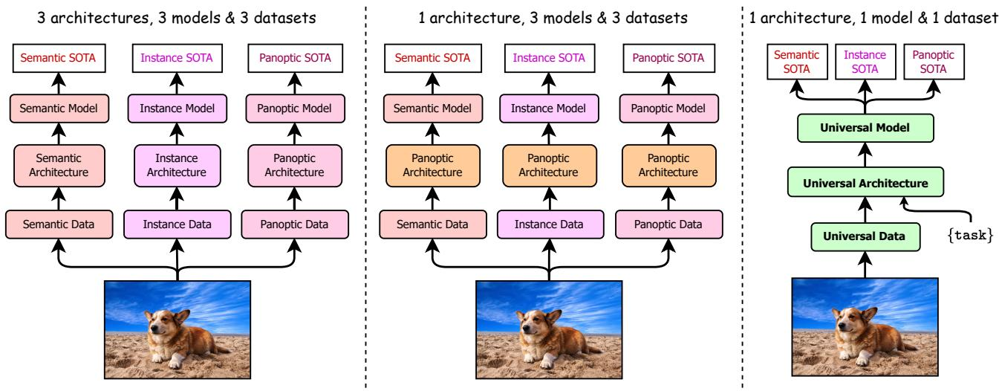
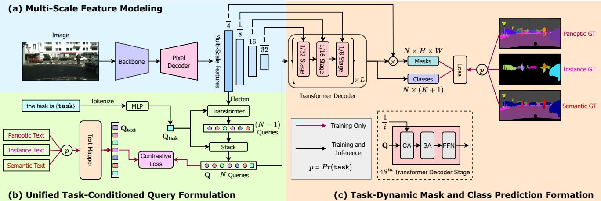
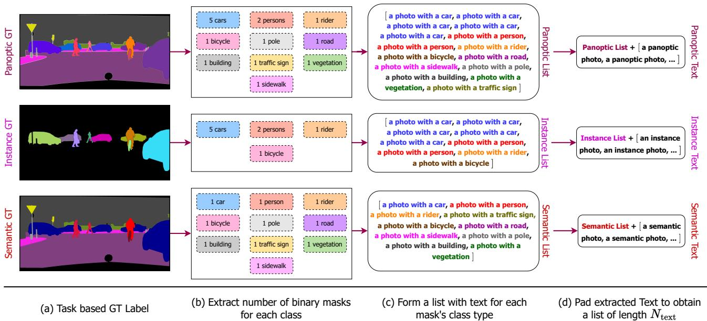
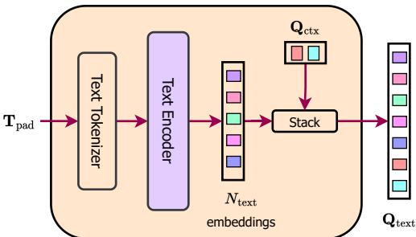
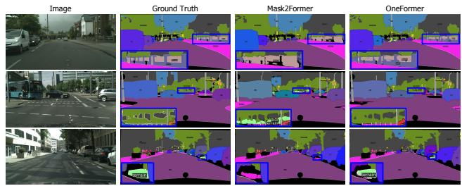

  
(a) Specialized Architectures, Models & Datasets  
(b) Panoptic Architecture BUT Specialized Models & Datasets  
(c) Universal Architecture, Model and Dataset

# OneFormer: One Transformer to Rule Universal Image Segmentation

Jitesh Jain1,2, Jiachen Li1∗, MangTik Chiu1∗, Ali Hassani1, Nikita Orlov3, Humphrey Shi1,3 1SHI Labs @ U of Oregon & UIUC, 2IIT Roorkee, 3Picsart AI Research (PAIR)

https://github.com/SHI-Labs/OneFormer

Figure 1. A Path to Universal Image Segmentation. (a) Traditional segmentation methods developed specialized architectures and models for each task to achieve top performance. (b) Recently, new panoptic/universal architectures [10, 47] used the same architecture to achieve top performance across diferent tasks. However, they still need to train diferent models for diferent tasks, resulting in a semi-universal approach. (c) We propose a unique multi-task universal architecture with a task-conditioned joint training strategy that sets new state-ofthe-arts across semantic, instance and panoptic segmentation tasks with a single model, unifying segmentation across architecture, model and dataset. Our work significantly reduces the underlying resource requirements, making segmentation more universal and accessible.

## Abstract

Universal Image Segmentation is not a new concept. Past attempts to unify image segmentation include scene parsing, panoptic segmentation, and, more recently, new panoptic architectures. However, such panoptic architectures do not truly unify image segmentation because they need to be trained individually on the semantic, instance, or panoptic segmentation to achieve the best performance. Ideally, a truly universal framework should be trained only once and achieve SOTA performance across all three image segmentation tasks. To that end, we propose OneFormer, a universal image segmentation framework that unifies segmentation with a multi-task train-once design. Wefirst propose a task-conditioned joint training strategy that enables training on ground truths of each domain (semantic, instance, and panoptic segmentation) within a single multitask training process. Secondly, we introduce a task token to condition our model on the task at hand, making our model task-dynamic to support multi-task training and inference.

Thirdly, we propose using a query-text contrastive loss during training to establish better inter-task and inter-class distinctions. Notably, our single OneFormer model outperforms specialized Mask2Former models across all three segmentation tasks on ADE20k, Cityscapes, and COCO, despite the latter being trained on each task individually. We believe OneFormer is a significant step towards making image segmentation more universal and accessible.

## 1. Introduction

Image Segmentation is the task of grouping pixels into multiple segments. Such grouping can be semanticbased (e.g., road, sky, building), or instance-based (objects with well-defined boundaries). Earlier segmentation approaches [6,19,32] tackled these two segmentation tasks individually, with specialized architectures and therefore separate research efort into each. In a recent efort to unify semantic and instance segmentation, Kirillov et al. [23] proposed panoptic segmentation, with pixels grouped into an amorphous segment for amorphous background regions (labeled “stuf”) and distinct segments for objects with welldefined shape (labeled “thing”). This efort, however, led to new specialized panoptic architectures [9] instead of unifying the previous tasks (see Fig. 1a). More recently, the research trend shifted towards unifying image segmentation with new panoptic architectures, such as K-Net [47], MaskFormer [11], and Mask2Former [10]. Such panoptic/universal architectures can be trained on all three tasks and obtain high performance without changing architecture. They do need to, however, be trained individually on each task to achieve the best performance (see Fig. 1b). The individual training policy requires extra training time and produces diferent sets of model weights for each task. In that regard, they can only be considered a semi-universal approach. For example, Mask2Former [10] is trained for 160K iterations on ADE20K [13] for each of the semantic, instance, and panoptic segmentation tasks to obtain the best performance for each task, yielding a total of 480k iterations in training, and three models to store and host for inference.

In an efort to truly unify image segmentation, we propose a multi-task universal image segmentation framework (OneFormer), which outperforms existing state-of-the-arts on all three image segmentation tasks (see Fig. 1c), by only training once on one panoptic dataset. Through this work, we aim to answer the following questions:

(i) Why are existing panoptic architectures [10,11] not successful with a single training process or model to tackle all three tasks? We hypothesize that existing methods need to train individually on each segmentation task due to the absence of task guidance in their architectures, making it challenging to learn the inter-task domain diferences when trained jointly or with a single model. To tackle this challenge, we introduce a task input token in the form of text: “the task is {task}”, to condition the model on the task in focus, making our architecture task-guided for training, and task-dynamic for inference, all with a single model. We uniformly sample {task} from {panoptic, instance, semantic} and the corresponding ground truth during our joint training process to ensure our model is unbiased in terms of tasks. Motivated by the ability of panoptic [23] data to capture both semantic and instance information, we derive the semantic and instance labels from the corresponding panoptic annotations during training. Consequently, we only need panoptic data during training. Moreover, our joint training time, model parameters, and FLOPs are comparable to the existing methods, decreasing training time and storage requirements up to 3×, making image segmentation less resource intensive and more accessible.

(ii) How can the multi-task model better learn inter-task and inter-class diferences during the single joint training process? Following the recent success of transformer frameworks [2,10,17,18,21,30,46] in computer vision, we formulate our framework as a transformer-based approach, which can be guided through the use of query tokens. To add taskspecific context to our model, we initialize our queries as repetitions of the task token (obtained from the task input) and compute a query-text contrastive loss [33, 43] with the text derived from the corresponding ground-truth label for the sampled task as shown in Fig. 2. We hypothesize that a contrastive loss on the queries helps guide the model to be task-sensitive and reduce category mispredictions.

We evaluate OneFormer on three major segmentation datasets: ADE20K [13], Cityscapes [12], and COCO [27], each with all three segmentation tasks. OneFormer sets the new state of the arts for all three tasks with a single jointly trained model. To summarize, our main contributions are:

• We propose OneFormer, the first transformer-based multi-task universal image segmentation framework that needs to be trained only once with a single universal architecture, a single model, and on a single dataset to outperform existing frameworks across the semantic, instance, and panoptic segmentation tasks, despite the latter need to be trained separately on each task.

• OneFormer uses a task-conditioned joint training strategy, uniformly sampling diferent ground truth domains (semantic, instance, or panoptic) by deriving all GT labels from panoptic annotations to train its multi-task model. Thus, OneFormer actually achieves the orignial unification goal of panoptic segmentation [23].

• We validate OneFormer through extensive experiments on three major benchmarks: ADE20K [13], Cityscapes [12], and COCO [27]. OneFormer sets a new state-of-the-art performance on all three segmentation tasks compared with methods using the standard Swin-L [30] backbone and improves even more with new ConvNeXt [31] and DiNAT [17] backbones.

## 2. Related Work

## 2.1. Image Segmentation

Image segmentation is one of the most fundamental tasks in image processing and computer vision. Traditional works usually tackle one of the three image segmentation tasks with specialized network architectures (Fig. 1a).

Semantic Segmentation. Semantic segmentation was long tackled as a pixel classification problem with CNNs [5, 6, 8, 20, 32]. More recent works [21, 34, 42] have shown the success of transformer-based methods in semantic segmentation following its success in language and vision [2, 37]. Among them, MaskFormer [11] treated semantic segmentation as a mask classification problem following early works [3,14,16], through using a transformer decoder with object queries [2]. We also formulate semantic segmentation as a mask classification problem.

  
Figure 2. OneFormer Framework Architecture. (a) We extract multi-scale features for an input image using a backbone, followed by a pixel decoder. (b) We formulate a unified set of N − 1 task-conditioned object queries with guidance from the task token $\mathbf { \Gamma } ( \mathbf { Q } _ { \mathrm { t a s k } } )$ and flattened 1/4-scale features inside a transformer [37]. Next, we concatenate $\mathbf { Q } _ { \mathrm { t a s k } }$ with the $N - 1$ queries from the transformer. We uniformly $( p = 1 / 3 )$ sample the task during training and generate the corresponding text queries $\mathbf { \Pi } ( \mathbf { Q } _ { \mathrm { t e x t } } )$ using a text mapper (Fig. 4). We calculate a query-text contrastive loss to learn the inter-task distinctions. We can drop the text mapper during inference, thus, making our model parameter eficient. (c) We use a multi-stage L-layer transformer decoder to obtain the task-dynamic class and mask predictions.

Instance Segmentation. Traditional instance segmentation methods [1, 4, 19] are also formulated as mask classifiers, which predict binary masks and a class label for each mask. We also formulate instance segmentation as a mask classification problem.

Panoptic Segmentation. Panoptic Segmentation [23] was proposed to unify instance and semantic segmentation. One of the earliest architectures in this scope was Panoptic-FPN [22], which introduced separate instance and semantic task branches. Works that followed significantly improved performance with transformer-based architectures [10,11,38,39,45,46]. Despite the progress made so far, panoptic segmentation models are still behind in performance compared to individual instance and semantic segmentation models, therefore not living up to their full unification potential. Motivated by this, we design our One-Former to be trained with panoptic annotations only.

## 2.2. Universal Image Segmentation

The concept of universal image segmentation has existed for some time, starting with image and scene parsing [35, 36, 44], followed by panoptic segmentation [23]. More recently, promising architectures [10,11,47] designed specifically for panoptic segmentation have emerged which also perform well on semantic and instance segmentation tasks. K-Net [47], a CNN, uses dynamic learnable instance and semantic kernels with bipartite matching. Inspired by DETR’s [2] reformulation of object detection with proposals based on queries, MaskFormer [11] used transformerbased architecture as a mask classifier. Mask2Former [10] improved upon MaskFormer with learnable queries, deformable multi-scale attention [51] in the decoder, a masked cross-attention and set the new state of the art on all three tasks. Unfortunately, it requires training the model individually on each task to achieve the best performance. Therefore, there remains a gap in truly unifying the three segmentation tasks. To the best of our knowledge, OneFormer is the first framework to beat state of the art on all three image segmentation tasks with a single universal model.

## 2.3. Transformer-based Architectures

Architectures based on the transformer encoder-decoder structure [2,25,28,51] have proved efective in object detection since the introduction of DETR [2]. Mask2Former [10, 11] demonstrated the efectiveness of such architectures for image segmentation with a mask classification formulation. Inspired by this success, we also formulate our framework as a query-based mask classification task. Additionally, we claim that calculating a query-text contrastive loss [33, 43] on the task-guided queries can help the model learn intertask diferences and reduce the category mispredictions in the model outputs. Concurrent to our work, LMSeg [50] uses text derived from multiple datasets’ taxonomy to calculate a query-text contrastive loss and tackle the multi-dataset segmentation training challenge. Unlike LMSeg [50], our work focuses on multiple tasks and uses the classes in the training sample’s GT label to calculate the contrastive loss.

## 3. Method

In this section, we introduce OneFormer, a universal image segmentation framework jointly trained on the panoptic, semantic, and instance segmentation and outperforms individually trained models. We provide an overview of OneFormer in Fig. 2. OneFormer uses two inputs: sample image and task input of the form “the task is {task}”. During our single joint training process, the task is uniformly tions, thus, using only one set of annotations.

  
Figure 3. Input Text Formation. (a) We uniformly sample the task during training. (b) We extract the number of distinct binary masks for each class from the corresponding GT label. (c) We form a list with text descriptions for each mask using the template “a photo with a {CLS}”, where CLS represents the corresponding class name for the object mask. (d) Finally, we pad the text list to a constant length of $N _ { \mathrm { t e x t } }$ using “a/an {task} photo” entries which represent the no-object detections; where task ∈ {panoptic, instance, semantic}.

sampled from {panoptic, instance, semantic} for each image. Firstly, we extract multi-scale features from the input image using a backbone and a pixel decoder. We tokenize the task input to obtain a 1-D task token used to condition the object queries and, consequently, our model on the task for each input. Additionally, we create a text list representing the number of binary masks for each class present in the GT label and map it to text query representations. Note that the text list depends on the input image and the {task}. For supervision of the model’s task-dynamic predictions, we derive the corresponding ground-truths from panoptic annotations. As the ground truth is task-dependent, we calculate a query-text contrastive loss between the object and text queries to ensure there is task distinction in the object queries. The object queries and multi-scale features are fed into a transformer decoder to produce final predictions. We provide more details in the following sections.

## 3.1. Task Conditioned Joint Training

Existing semi-universal architectures for image segmentation [10, 11, 47] face a significant drop in performance when jointly trained on all three segmentation tasks (Tab. 7). We attribute their failure to tackle the multi-task challenge to the absence of task-conditioning in their architecture.

We tackle the multi-task train-once challenge for image segmentation using a task-conditioned joint training strategy. Particularly, we first uniformly sample the task from {panoptic, semantic, instance} for the GT label. We realize the unification potential of panoptic annotations [23] by deriving the task-specific labels from the panoptic annota-

Next, we extract a set of binary masks for each category present in the image from the task-specific GT label, i.e., semantic task guarantees only one amorphous binary mask for each class present in the image, whereas, instance task signifies non-overlapping binary masks for only thing classes, ignoring the stuf regions. Panoptic task denotes a single amorphous mask for stuf classes and non-overlapping masks for thing classes as shown in Fig. 3. Subsequently, we iterate over the set of masks to create a list of text $( \mathbf { T } _ { \mathrm { l i s t } } )$ with a template “a photo with a {CLS}”, where CLS is the class name for the corresponding binary mask. The number of binary masks per sample varies over the dataset. Therefore, we pad $\mathbf { T } _ { \mathrm { l i s t } }$ with “a/an {task} photo” entries to obtain a padded list $( \mathbf { T } _ { \mathrm { p a d } } )$ of constant length $N _ { \mathrm { t e x t } } .$ , with padded entries representing no-object masks. We later use $\mathbf { T } _ { \mathrm { p a d } }$ for computing a query-text contrastive loss (Sec. 3.3).

We condition our architecture on the task using a task input $\mathbf { ( I _ { t a s k } ) }$ with the template “the task is {task}”, which is tokenized and mapped to a task-token $\mathbf { \Omega } ( \mathbf { Q } _ { \mathrm { t a s k } } )$ . We use $\mathbf { Q } _ { \mathrm { t a s k } }$ to condition OneFormer on the task (Sec. 3.2).

## 3.2. Query Representations

During training, we use two sets of queries in our architecture: text queries $\mathbf { \Pi } ( \mathbf { Q } _ { \mathrm { t e x t } } )$ and object queries (Q). $\mathbf { Q } _ { \mathrm { t e x t } }$ is the text-based representation for the segments in the image, while Q is the image-based representation.

To obtain $\mathbf { Q } _ { \mathrm { t e x t } } ,$ we first tokenize the text entries $\mathbf { T } _ { \mathrm { p a d } }$ and pass the tokenized representations through a textencoder [43], which is a 6-layer transformer [37]. The encoded $N _ { \mathrm { t e x t } }$ text embeddings represent the number of binary masks and their corresponding classes in the input image. We further concatenate a set of $N _ { \mathrm { c t x } }$ learnable text context embeddings $\mathbf { \Pi } ( \mathbf { Q } _ { \mathrm { c t x } } )$ to the encoded text embeddings to obtain the final N text queries $\mathbf { \Pi } ( \mathbf { Q } _ { \mathrm { t e x t } } )$ , as shown in Fig. 4. Our motivation behind using $\mathbf { Q } _ { \mathrm { c t x } }$ is to learn a unified textual context [48, 49] for a sample image. We only use the text queries during training; therefore, we can drop the text mapper module during inference to reduce the model size.

To obtain Q, we first initialize the object queries (Q′) as a $. N - 1$ times repetitions of the task-token $( \mathbf { Q } _ { \mathrm { t a s k } } )$ . Then, we update Q′ with guidance from the flattened 1/4-scale features inside a 2-layer transformer [2, 37]. The updated Q′ from the transformer (rich with image-contextual information) is concatenated with $\mathbf { Q } _ { \mathrm { t a s k } }$ to obtain a task-conditioned representation of N queries, Q. Unlike the vanilla all-zeros or random initialization [2], the task-guided initialization of the queries and the concatenation with $\mathbf { Q } _ { \mathrm { t a s k } }$ is critical for the model to learn multiple segmentation tasks (Sec. 4.3).

## 3.3. Task Guided Contrastive Queries

Developing a single model for all three segmentation tasks is challenging due to the inherent diferences among the three tasks. The meaning of the object queries, Q, is task-dependent. Should the queries focus only on the thing classes (instance segmentation), or should the queries predict only one amorphous object for each class present in the image (semantic segmentation) or a mix of both (panoptic segmentation)? Existing query-based architectures [10, 11] do not take such diferences into account and hence, fail at efectively training a single model on all three tasks.

To this end, we propose calculating a query-text contrastive loss using Q and $\mathbf { Q } _ { \mathrm { t e x t } }$ . We use $\mathbf { T } _ { \mathrm { p a d } }$ to obtain the text queries representation, $\mathbf { Q } _ { t e x t } ,$ where $\mathbf { T } _ { p a d }$ is a list of textual representations for each mask-to-be-detected in a given image with “a/an {task} photo” representing the no-object detections in Q [2]. Thus, the text queries align with the purpose of object queries, representing the objects/segments present [2] in an image. Therefore, we can successfully learn the inter-task distinctions in the query representations using a contrastive loss between the ground truth-derived text and object queries. Moreover, contrastive learning on the queries enables us to attend to inter-class diferences and reduce category misclassifications.

$$
\begin{array} { l } { { \displaystyle { \mathcal { L } } _ { \mathbf { Q } \to \mathbf { Q } _ { \mathrm { t e x t } } } = - \frac { 1 } { B } \sum _ { i = 1 } ^ { B } \log \frac { \exp ( q _ { i } ^ { o b j } \odot q _ { i } ^ { t x t } / \tau ) } { \sum _ { j = 1 } ^ { B } \exp ( q _ { i } ^ { o b j } \odot q _ { j } ^ { t x t } / \tau ) } , } } \\ { { \displaystyle { \mathcal { L } } _ { \mathbf { Q } _ { \mathrm { t e x t } } \to \mathbf { Q } } = - \frac { 1 } { B } \sum _ { i = 1 } ^ { B } \log \frac { \exp ( q _ { i } ^ { t x t } \odot q _ { i } ^ { o b j } / \tau ) } { \sum _ { j = 1 } ^ { B } \exp ( q _ { i } ^ { t x t } \odot q _ { j } ^ { o b j } / \tau ) } } } \\ { { \displaystyle { \mathcal { L } } _ { \mathbf { Q }  \mathbf { Q } _ { \mathrm { t e x t } } } = \mathcal { L } _ { \mathbf { Q } \to \mathbf { Q } _ { \mathrm { t e x t } } } + \mathcal { L } _ { \mathbf { Q } _ { \mathrm { t e x t } } \to \mathbf { Q } } } } \end{array}\tag{1}
$$

Considering that we have a batch of B object-text query pairs $\{ ( q _ { i } ^ { o b j } , x _ { i } ^ { t x t } ) \} _ { i = 1 } ^ { B } ,$ , where $q _ { i } ^ { o b j }$ and $q _ { i } ^ { t x t }$ are the corresponding object and text queries, respectively, of the i-th pair. We measure the similarity between the queries by calculating a dot product. The total contrastive loss is composed of [43]: (i) an object-to-text $( \mathcal { L } _ { \mathbf { Q }  \mathbf { Q } _ { \mathrm { t e x t } } } )$ and; (ii) a text-to-object contrastive loss $( \mathcal { L } _ { \mathbf { Q } _ { \mathrm { t e x t } }  \mathbf { Q } } )$ as shown in Eq. (1). τ is a learnable temperature parameter to scale the contrastive logits.

  
Figure 4. Text Mapper. We tokenize and then encode the input text list $( \mathbf { T } _ { \mathrm { p a d } } )$ using a 6-layer transformer text encoder [37, 43] to obtain a set of $N _ { \mathrm { t e x t } }$ embeddings. We concatenate a set of $N _ { \mathrm { c t x } }$ learnable embeddings to the encoded representations to obtain the final N text queries $\mathbf { \Pi } ( \mathbf { Q } _ { \mathrm { t e x t } } )$ . The N text queries stand for a textbased representation of the objects present in an image.

## 3.4. Other Architecture Components

Backbone and Pixel Decoder: We use the widely used ImageNet [24] pre-trained backbones [17, 30, 31] to extract multi-scale feature representations from the input image. Our pixel decoder aids the feature modeling by gradually upsampling the backbone features. Motivated by the recent success of multi-scale deformable attention [10,51], we use the same Multi-Scale Deformable Transformer (MSDeformAttn) based architecture for our pixel decoder.

Transformer Decoder: We use a multi-scale strategy [10] to utilize the higher resolution maps inside our transformer decoder. Specifically, we feed the object queries (Q) and the multi-scale outputs from the pixel decoder $( F _ { i } ) , ~ i ~ \in$ $\{ 1 / 4 , 1 / 8 , 1 / 1 6 , 1 / 3 2 \}$ as inputs. We use the features with resolution 1/8, 1/16 and 1/32 of the original image alternatively to update Q using a masked cross-attention (CA) operation [10], followed by a self-attention (SA) and finally a feed-forward network (FFN). We perform these sets of alternate operations L times inside the transformer decoder.

The final query outputs from the transformer decoder are mapped to a $K + 1$ dimensional space for class predictions, where K denotes the number of classes and an extra +1 for the no-object predictions. To obtain the final masks, we decode $F _ { 1 / 4 }$ with the help of an einsum operation between Q and $F _ { 1 / 4 }$ . During inference, we follow the same postprocessing technique as [10] to obtain the final panoptic, semantic, and instance segmentation predictions. We keep predictions with scores above a threshold of 0.5, 0.8, and 0.8 during panoptic post-processing on the ADE20K [13], Cityscapes [12] and COCO [27] datasets, respectively.

<table><tr><td>Method</td><td>Backbone</td><td>#Params</td><td>#FLOPs</td><td>#Queries</td><td>Crop Size</td><td>Iters</td><td>PQ</td><td>AP</td><td>mIoU (s.s.)</td><td>mIoU (m.s.)</td></tr><tr><td>Individual Training</td><td></td><td></td><td></td><td></td><td></td><td></td><td></td><td></td><td></td><td></td></tr><tr><td>UPerNet‡ [41]</td><td>SwinV2-L† [29]</td><td></td><td></td><td></td><td>640×640</td><td>40k</td><td></td><td></td><td></td><td>55.9</td></tr><tr><td>SeMask Mask2Former [21]</td><td>SeMask Swin-L† [21]</td><td>223M</td><td>426G</td><td>200</td><td>640×640</td><td>160k</td><td></td><td></td><td>56.4</td><td>57.5</td></tr><tr><td>UPerNet + K-Net [47]</td><td>Swin-L† [30]</td><td></td><td></td><td></td><td>640×640</td><td>160k</td><td></td><td></td><td></td><td>54.3</td></tr><tr><td>MaskFormer [11]</td><td>Swin-L† [30]</td><td>212M</td><td>375G</td><td>100</td><td>640×640</td><td>160k</td><td></td><td></td><td>54.1</td><td>55.6</td></tr><tr><td>Mask2Former-Panoptic* [10]</td><td>Swin-L† [30]</td><td>216M</td><td>413G</td><td>200</td><td>640×640</td><td>160k</td><td>48.7</td><td>34.2</td><td>54.5</td><td></td></tr><tr><td>Mask2Former-Instance [10]</td><td>Swin-L† [30]</td><td>216M</td><td>411G</td><td>200</td><td>640×640</td><td>160k</td><td></td><td>34.9</td><td></td><td></td></tr><tr><td>Mask2Former-Semantic [10]</td><td>Swin-L† [30]</td><td>215M</td><td>403G</td><td>100</td><td>640×640</td><td>160k</td><td></td><td></td><td>56.1</td><td>57.3</td></tr><tr><td>UPerNet [41]</td><td>SwinV2-G†† [29]</td><td>&gt;3B</td><td></td><td></td><td>640×640</td><td>80k</td><td></td><td></td><td>59.1</td><td></td></tr><tr><td>Mask2Former [10]</td><td>BEiT-3†† [40]</td><td>1.9B</td><td></td><td></td><td>896×896</td><td></td><td></td><td></td><td>62.0</td><td>62.8</td></tr><tr><td>Joint Training</td><td></td><td></td><td></td><td></td><td></td><td></td><td></td><td></td><td></td><td></td></tr><tr><td>OneFormer</td><td>Swin-L† [30]</td><td>219M</td><td>436G</td><td>250</td><td>640×640</td><td>160k</td><td>49.8</td><td>35.9</td><td>57.0</td><td>57.7</td></tr><tr><td>OneFormer</td><td>Swin-L† [30]</td><td>219M</td><td>801G</td><td>250</td><td>896×896</td><td>160k</td><td>51.1</td><td>37.6</td><td>57.4</td><td>58.3</td></tr><tr><td>OneFormer</td><td>ConvNeXt-L† [31]</td><td>220M</td><td>389G</td><td>250</td><td>640×640</td><td>160k</td><td>50.0</td><td>36.2</td><td>56.6</td><td>57.4</td></tr><tr><td>OneFormer</td><td>ConvNeXt-XL† [31]</td><td>372M</td><td>607G</td><td>250</td><td>640×640</td><td>160k</td><td>50.1</td><td>36.3</td><td>57.4</td><td>58.8</td></tr><tr><td>OneFormer</td><td>DiNAT-L† [17]</td><td>223M</td><td>359G</td><td>250</td><td>640×640</td><td>160k</td><td>50.5</td><td>36.0</td><td>58.3</td><td>58.4</td></tr><tr><td>OneFormer</td><td>DiNAT-L† [17]</td><td>223M</td><td>678G</td><td>250</td><td>896×896</td><td>160k</td><td>51.2</td><td>36.8</td><td>58.1</td><td>58.6</td></tr></table>

Table 1. SOTA Comparison on the ADE20K val set. $^ { \dagger } \colon$ backbones pretrained on ImageNet-22K, ‡: trained with batch size 32; ∗: 0.5 confidence threshold; ‡‡: batch size 64. OneFormer outperforms the individually trained Mask2Former [10]. Mask2Former’s performance with 250 queries is not listed, as its performance degrades with 250 queries. We compute FLOPs using the corresponding crop size.

## 3.5. Losses

In addition to the contrastive loss on the queries, we calculate the standard classification CE-loss $( \mathcal { L } _ { \mathrm { c l s } } )$ over the class predictions. Following [10], we use a combination of binary cross-entropy $( \mathcal { L } _ { \mathrm { b c e } } )$ and dice loss $( { \mathcal { L } } _ { \mathrm { d i c e } } )$ over the mask predictions. Therefore, our final loss function is a weighted sum of the four losses (Eq. (2)). We empirically set $\lambda _ { \mathbf { Q }  \mathbf { Q } _ { \mathrm { t e x t } } } = 0 . 5 , \lambda _ { \mathrm { c l s } } = 2 , \lambda _ { \mathrm { b c e } } = 5$ and $\lambda _ { \mathrm { d i c e } } = 5 .$ . To find the least cost assignment, we use bipartite matching [2, 11] between the set predictions and the ground truths. We set $\lambda _ { \mathrm { c l s } }$ as 0 1 for the no-object predictions [10].

$$
\begin{array} { r } { \mathcal { L } _ { \mathrm { f i n a l } } = \lambda _ { \mathbf { Q }  \mathbf { Q } _ { \mathrm { t e x t } } } \mathcal { L } _ { \mathbf { Q }  \mathbf { Q } _ { \mathrm { t e x t } } } + \lambda _ { \mathrm { c l s } } \mathcal { L } _ { c l s } } \\ { + \lambda _ { \mathrm { b c e } } \mathcal { L } _ { b c e } + \lambda _ { \mathrm { d i c e } } \mathcal { L } _ { d i c e } \quad } \end{array}\tag{2}
$$

## 4. Experiments

We illustrate that OneFormer, when trained only once with our task-conditioned joint-training strategy, generalizes well to all three image segmentation tasks on three widely used datasets. Furthermore, we provide extensive ablations to demonstrate the significance of OneFormer’s components. Due to space constraints, we provide implementation details in the appendix.

## 4.1. Datasets and Evaluation Metrics

Datasets. We experiment on three widely used datasets that support all three: semantic, instance, and panoptic segmentation tasks. Cityscapes [12] consists of a total 19 (11 “stuf” and 8 “thing”) classes with 2,975 training, 500 validation and 1,525 test images. ADE20K [13] is another benchmark dataset with 150 (50 “stuf” and 100 “thing”) classes among the 20,210 training and 2,000 validation images. COCO [27] has 133 (53 “stuf” and 80 “thing”) classes with 118k training and 5,000 validation images.

Evaluation Metrics. For all three image segmentation tasks, we report the PQ [23], AP [27], and mIoU [15] scores. Since we only have a single model for all three tasks, we use the value of the task token to decide the scores to consider. For $e . g .$ , when task is panoptic, we report the PQ score and similarly we report AP and mIoU scores when task is instance and semantic, respectively.

## 4.2. Main Results

ADE20K. We compare OneFormer with the existing stateof-the-art pseudo-universal and specialized architectures on the ADE20K [13] val dataset in Tab. 1. With the standard Swin-L† backbone, OneFormer, while being trained only once, outperforms Mask2Former’s [10] individually trained models on all three image segmentation tasks and sets a new state-of-the-art performance when compared with other methods using the same backbone.

Cityscapes. We compare OneFormer with the existing state-of-the-art pseudo-universal and specialized architectures on the Cityscapes [13] val dataset in Tab. 2. With Swin-L† backbone, OneFormer outperforms Mask2Former with a +0 6% and +1 9% improvement on the PQ and AP metrics, respectively. Additionally, with ConvNeXt-L† and ConvNeXt-XL† backbone, OneFormer sets a new state-ofthe-art of 68 5% PQ and 46 7% AP, respectively.

COCO. We compare OneFormer with the existing stateof-the-art pseudo-universal and specialized architectures on the COCO [27] val2017 dataset in Tab. 3. With Swin-L† backbone, OneFormer performs on-par with the individually trained Mask2Former [10] with a +0 1% improvement in the PQ score. Due to the discrepancies between the panoptic and instance annotations in COCO [27], we evaluate the AP score using the instance ground truths derived from the panoptic annotations. We provide more information in the appendix. Following [10], we evaluate mIoU on semantic ground truths derived from panoptic annotations.

<table><tr><td>Method</td><td>Backbone</td><td>#Params</td><td>#FLOPs</td><td>#Queries</td><td>Crop Size</td><td>Iters</td><td>PQ</td><td>AP</td><td>mIoU (s.s.)</td><td>mIoU (m.s.)</td></tr><tr><td>Individual Training</td><td></td><td></td><td></td><td></td><td></td><td></td><td></td><td></td><td></td><td></td></tr><tr><td>CMT-DeepLab‡ [45]</td><td>MaX-S† [38]</td><td></td><td></td><td></td><td>1025×2049</td><td>60k</td><td>64.6</td><td></td><td>81.4</td><td></td></tr><tr><td>Axial-DeepLab-L‡ [39]</td><td>Axial ResNet-L† [39]</td><td>45M</td><td>687G</td><td></td><td>1025×2049</td><td>60k</td><td>63.9</td><td>35.8</td><td>81.0</td><td>81.5</td></tr><tr><td>Axial-DeepLab-XL‡ [39]</td><td>Axial ResNet-XL† [39]</td><td>173M</td><td>2447G</td><td></td><td>1025×2049</td><td>60k</td><td>64.4</td><td>36.7</td><td>80.6</td><td>81.1</td></tr><tr><td>Panoptic-DeepLab‡ [9]</td><td>SWideRNet† [7]</td><td>536M</td><td>10365G</td><td></td><td>1025×2049</td><td>60k</td><td>66.4</td><td>40.1</td><td>82.2</td><td>82.9</td></tr><tr><td>Mask2Former-Panoptic [10]</td><td>Swin-L† [30]</td><td>216M</td><td>514G</td><td>200</td><td>512×1024</td><td>90k</td><td>66.6</td><td>43.6</td><td>82.9</td><td></td></tr><tr><td>Mask2Former-Instance [10]</td><td>Swin-L† [30]</td><td>216M</td><td>507G</td><td>200</td><td>512×1024</td><td>90k</td><td></td><td>43.7</td><td></td><td></td></tr><tr><td>Mask2Former-Semantic [10]</td><td>Swin-L† [30]</td><td>215M</td><td>494G</td><td>100</td><td>512×1024</td><td>90k</td><td></td><td></td><td>83.3</td><td>84.3</td></tr><tr><td>kMaX-DeepLab‡ [46]</td><td>ConvNeXt-L† [31]</td><td>232M</td><td>1673G</td><td>256</td><td>1025×2049</td><td>60k</td><td>68.4</td><td>44.0</td><td>83.5</td><td></td></tr><tr><td>Joint Training</td><td></td><td></td><td></td><td></td><td></td><td></td><td></td><td></td><td></td><td></td></tr><tr><td>OneFormer</td><td>Swin-L† [30]</td><td>219M</td><td>543G</td><td>250</td><td>512×1024</td><td>90k</td><td>67.2</td><td>45.6</td><td>83.0</td><td>84.4</td></tr><tr><td>OneFormer</td><td>ConvNeXt-L† [31]</td><td>220M</td><td>497G</td><td>250</td><td>512×1024</td><td>90k</td><td>68.5</td><td>46.5</td><td>83.0</td><td>84.0</td></tr><tr><td>OneFormer</td><td>ConvNeXt-XL† [31]</td><td>372M</td><td>775G</td><td>250</td><td>512×1024</td><td>90k</td><td>68.4</td><td>46.7</td><td>83.6</td><td>84.6</td></tr><tr><td>OneFormer</td><td>DiNAT-L† [17]</td><td>223M</td><td>450G</td><td>250</td><td>512×1024</td><td>90k</td><td>67.6</td><td>45.6</td><td>83.1</td><td>84.0</td></tr></table>

Table 2. SOTA Comparison on Cityscapes val set. †: backbones pretrained on ImageNet-22K; ‡: trained with batch size 32, ∗: hidden dimension 1024. OneFormer outperforms the individually trained Mask2Former [10] models. Mask2Former’s performance with 250 queries is not listed, as its performance degrades with 250 queries. We compute FLOPs using the corresponding crop size.
<table><tr><td>Method</td><td>Backbone</td><td>#Params</td><td>#FLOPs</td><td>#Queries</td><td>Epochs</td><td>PQ</td><td> $\mathbf { P Q } ^ { \mathrm { { T h } } }$ </td><td>PQSt</td><td>AP</td><td>Apinstance</td><td>mIoU</td></tr><tr><td colspan="10">Individual Training</td></tr><tr><td>MaskFormer [11]</td><td>Swin-L† [30]</td><td>212M</td><td>792G</td><td>100</td><td>300</td><td>52.7</td><td>58.5</td><td>44.0</td><td></td><td></td><td>64.8</td></tr><tr><td>K-Net [47]</td><td>Swin-L† [30]</td><td></td><td></td><td>100</td><td>36</td><td>54.6</td><td>60.2</td><td>46.0</td><td></td><td></td><td></td></tr><tr><td>Panoptic SegFormer [26]</td><td>Swin-L† [30]</td><td>221M</td><td>816G</td><td>353</td><td>24</td><td>55.8</td><td>61.7</td><td>46.9</td><td></td><td></td><td></td></tr><tr><td>Mask2Former-Panoptic [10]</td><td>Swin-L† [30]</td><td>216M</td><td>875G</td><td>200</td><td>100</td><td>57.8</td><td>64.2</td><td>48.1</td><td>48.7</td><td>48.6</td><td>67.4</td></tr><tr><td>Mask2Former-Instance [10]</td><td>Swin-L† [30]</td><td>216M</td><td>868G</td><td>200</td><td>100</td><td></td><td></td><td></td><td>49.1</td><td>50.1</td><td></td></tr><tr><td>Mask2Former-Semantic‡ [10]</td><td>Swin-L† [30]</td><td>216M</td><td>891G</td><td>200</td><td>100</td><td></td><td></td><td></td><td></td><td></td><td>67.2</td></tr><tr><td>kMaX-DeepLab* [46]</td><td>ConvNeXt-L† [31]</td><td>232M</td><td>749G</td><td>128</td><td>81</td><td>57.9</td><td>64.0</td><td>48.6</td><td></td><td></td><td></td></tr><tr><td>kMaX-DeepLab* [46]</td><td>ConvNeXt-L† [31]</td><td>232M</td><td>749G</td><td>256</td><td>81</td><td>58.0</td><td>64.2</td><td>48.6</td><td></td><td></td><td></td></tr><tr><td colspan="10">Joint Training</td></tr><tr><td>OneFormer</td><td>Swin-L† [30]</td><td>219M</td><td>891G</td><td>150</td><td>100</td><td>57.9</td><td>64.4</td><td>48.0</td><td>49.0</td><td>48.9</td><td>67.4</td></tr><tr><td>OneFormer</td><td>DiNAT-L† [17]</td><td>223M</td><td>736G</td><td>150</td><td>100</td><td>58.0</td><td>64.3</td><td>48.4</td><td>49.2</td><td>49.2</td><td>68.1</td></tr></table>

Table 3. SOTA Comparison on COCO val2017 set. †: Imagenet-22k pretrained; ‡: retrained model; ∗: trained with batch size 64. OneFormer competes with the individually trained Mask2Former [10]. We evaluate the AP score on instance ground truths derived from the panoptic annotations. Mask2Former’s performance with 150 queries is not listed, as its performance degrades with 150 queries. We compute FLOPs using 100 validation COCO images (varying sizes). APinstance represents evaluation on the original instance annotations.

## 4.3. Ablation Studies

We analyze OneFormer’s components through a series of ablation studies. Unless stated otherwise, we ablate with Swin-L† OneFormer on the Cityscapes [12] dataset.

Task-Conditioned Architecture. We validate the importance of the task token $\mathbf { \Pi } ( \mathbf { Q } _ { \mathrm { t a s k } } )$ , initializing the queries with repetitions of the task token (task-guided query init.) and the learnable text context $\mathbf { \Pi } ( \mathbf { Q } _ { \mathrm { c t x } } )$ by removing each component one at a time in Tab. 4. Without the task token, we observe a significant drop in the AP score (−2 7%). Furthermore, using a learnable text context $\mathbf { \Pi } ( \mathbf { Q } _ { \mathrm { c t x } } )$ leads to an improvement of +4 5% in the PQ score, proving its significance. Lastly, initializing the queries as repetitions of the task token (task-guided query init.) instead of using an allzeros initialization [2] leads to an improvement of +1 4% in the PQ and +1 1% in the AP score, indicating the importance of task-conditioning the initialization of the queries. Contrastive Query Loss. We report results without the query-text contrastive loss $( \mathcal { L } _ { \mathbf { Q }  \mathbf { Q } _ { \mathrm { t e x t } } } )$ in Tab. 5. We observe that the contrastive loss significantly benefits the PQ (+8 4%) and AP (+3 2%) scores. We also conduct experiments substituting our query-text contrastive loss with a classification loss $( \mathcal { L } _ { \mathrm { c l s } } )$ on the queries. ${ \mathcal { L } } _ { \mathrm { c l s } }$ can be regarded as a straightforward alternative for $\mathcal { L } _ { \mathbf { Q }  \mathbf { Q } _ { \mathrm { t e x t } } }$ as the both provide supervision for the number of masks for each class present in the image. However, we observe significant drops on all the metrics (−0 8% PQ, −0 9% AP, and −0 4% mIoU) using the classification loss instead of the contrastive loss. We attribute the drops to the inability of the classification loss to capture the inter-task diferences efectively.

Input Text Template. We study the importance of the template choice for the entries in the text list $( \mathbf { T } _ { \mathrm { l i s t } } )$ in Tab. 6. We experiment with “a photo with a {CLS} {TYPE}” template for our text entries where CLS is the class name for the object mask and TYPE is the task-dependent class-type: “stuf” for amorphous masks (panoptic and semantic task) and “thing” for all distinct object masks. We also experiment with the identity template “{CLS}”. Our choice of the template: “a photo with a {CLS}” gives a strong performance as a baseline. We believe more exploration in the text template space could help in improving the performance further.

<table><tr><td>1</td><td>PQ</td><td>AP</td><td>mIoU</td></tr><tr><td>OneFormer (ours)</td><td>1 67.2</td><td>45.6</td><td>83.0</td></tr><tr><td>– task-token  $( \mathbf { Q } _ { \mathrm { t a s k } } )$ </td><td>66.5 (-0.7)</td><td>43.3 (-2.3)</td><td> $8 2 . 9 \ ( - 0 . 1 )$ </td></tr><tr><td>– learnable text context  $\mathbf { \Pi } ( \mathbf { Q } _ { \mathrm { c r x } } )$ </td><td>62.7 (-4.5)</td><td>45.0 (-0.6)</td><td>82.8 (-0.2)</td></tr><tr><td>– task-guided query init.</td><td>65.8 (-1.4)</td><td>44.5 (-1.1)</td><td>83.1 (+0.1)</td></tr></table>

Table 4. Ablation on Components. A task-conditioned architecture significantly improves the AP scores and using learnable text context improves the PQ score.
<table><tr><td></td><td>1 PQ</td><td>AP</td><td>mIoU.</td><td>#param.</td></tr><tr><td>contrastive-loss (ours)</td><td>67.2</td><td>45.6</td><td>83.0</td><td>219M</td></tr><tr><td>query classification-loss</td><td>66.4 (-0.8)</td><td>44.7 (-0.9)</td><td>82.6 (-0.4)</td><td>219M</td></tr><tr><td>no contrastive-loss</td><td>58.8 (-8.4)</td><td>42.4 (-3.2)</td><td>82.5 (-0.5)</td><td>219M</td></tr></table>

Table 5. Ablation on Loss. The contrastive loss is essential for learning the inter-task distinctions during training.
<table><tr><td>1</td><td>PQ</td><td>AP</td><td>mIoU</td></tr><tr><td>“a photo with a {CLS}” (ours)</td><td>67.2</td><td>45.6</td><td>83.0</td></tr><tr><td>“a photo with a {CLS} {TYPE}&quot;</td><td> $6 5 . 4 \ ( - 1 . 8 )$ </td><td> $4 4 . 5 \ ( - 1 . 1 ) $ </td><td>82.8 (-0.2)</td></tr><tr><td> $\ " \{ \mathsf { C L S } \} ^ { \ast }$ </td><td> $6 6 . 6 \ ( - 0 . 6 )$ </td><td> $4 4 . 7 \ ( - 0 . 9 )$ </td><td>82.5 (-0.5)</td></tr></table>

Table 6. Ablation on Input Text Templates. The template for the input text list entries is a critical factor for good performance. CLS represents the class name and TYPE stands for the stuf/thing.

Task Conditioned Joint Training. We train a baseline Swin-L† Mask2Former-Joint model with our joint training strategy on the ADE20K [13] dataset. We compare the Mask2Former-Joint baseline with our Swin-L† OneFormer in Tab. 7. We train both models for 160k iterations with a batch size of 16. Our OneFormer achieves a +2 3%, +2 2%, and +0 8% improvement on the PQ, AP and mIoU metrics, respectively, proving the importance of our architecture design for practical multi-task joint training.

Task Token Input. We demonstrate that our framework is sensitive to the task token input by setting the value of {task} during inference as panoptic, instance, or semantic in Tab. 8. We report results with our Swin-L† OneFormer trained on ADE20K [13] dataset. We observe a significant drop in the PQ and mIoU metrics when task is instance compared to panoptic. Moreover, the $\mathrm { P Q } ^ { \mathrm { S t } }$ drops to 1 5%, and there is only a −0 8% drop on $\mathrm { P Q } ^ { \mathrm { T h } }$ metric, proving that the network learns to focus majorly on the distinct “thing” instances when the task is instance. Similarly, there is a sizable drop in the PQ, $\mathrm { P Q } ^ { \mathrm { T h } }$ and AP metrics for the semantic task with $\mathrm { P Q } ^ { \mathrm { S t } }$ staying the same, showing that our framework can segment out amorphous masks for “stuf” regions but does not predict diferent masks for “thing” objects. Therefore, OneFormer dynamically learns the intertask distinctions, which is critical for a train-once multi-task architecture. We include qualitative analysis on the task dynamic nature of OneFormer in the appendix.

<table><tr><td></td><td>PQ</td><td>AP</td><td>mIoU</td><td>#param.</td></tr><tr><td>OneFormer (ours)</td><td>49.8</td><td>35.9</td><td>57.0</td><td>219M</td></tr><tr><td>Mask2Former-Joint</td><td>48.7 (-1.1)</td><td>33.7 (-2.2)</td><td>56.2 (-0.8)</td><td>216M</td></tr></table>

Table 7. Ablation on Joint Training. OneFormer significantly beats the baseline’s scores. We report results with Swin-L† [30] backbone trained for 160k iterations on the ADE20K [13] dataset.
<table><tr><td>Task Token Input</td><td>PQ</td><td>PQTh</td><td>PQSt</td><td>AP</td><td>mIoU</td></tr><tr><td>the task is panoptic</td><td>49.3</td><td>49.6</td><td>50.2</td><td>35.8</td><td>57.0</td></tr><tr><td>the task is instance</td><td>33.1</td><td>48.8</td><td>1.5</td><td>35.9</td><td>26.4</td></tr><tr><td>the task is semantic</td><td>40.4</td><td>35.5</td><td>50.2</td><td>25.3</td><td>57.0</td></tr></table>

Table 8. Ablation on Task Token Input. Our OneFormer is sensitive to the input task token value. We report results with Swin-L† OneFormer on the ADE20K [13] val set. The numbers in pink denote results on secondary task metrics.

  
Figure 5. Reduced Category Misclassifications. Our OneFormer segments the regions (inside blue boxes) with similar classes more accurately than Mask2Former [10]. Zoom in for best view.

Reduced Category Misclassifications. Our query-text contrastive loss helps OneFormer learn the inter-task distinctions and reduce the number of category misclassifications in the predictions. Mask2Former incorrectly predicts “wall” as “fence” in the first row, “vegetation” as “terrain”, and “terrain” as “sidewalk”. At the same time, our One-Former produces more accurate predictions in regions (inside blue boxes) with similar classes, as shown in Fig. 5.

## 5. Conclusion

We present OneFormer, a transformer-based multi-task universal image segmentation framework with task-guided queries to unify the three image segmentation tasks with a single universal architecture, a single model, and training on a single dataset. Our jointly trained single One-Former model outperforms the individually trained specialized Mask2Former models, the previous single-architecture state of the art, on all three segmentation tasks across major datasets. Consequently, OneFormer can reduce training time, weight storage, and inference hosting requirements to a third. We believe OneFormer is a significant step towards making image segmentation more universal and accessible.

Acknowledgments. We thank the U of Oregon, UIUC, Picsart AI Research, and IARPA (Contract No. 2022- 21102100004) for generously supporting this work.

## References

[1] Zhaowei Cai and Nuno Vasconcelos. Cascade R-CNN: Delving into high quality object detection. In CVPR, 2018. 3

[2] Nicolas Carion, Francisco Massa, Gabriel Synnaeve, Nicolas Usunier, Alexander Kirillov, and Sergey Zagoruyko. End-to-end object detection with transformers. In ECCV, 2020. 2, 3, 5, 6, 7

[3] Joao Carreira, Rui Caseiro, Jorge Batista, and Cristian Sminchisescu. Semantic segmentation with secondorder pooling. In ECCV, 2012. 2

[4] Kai Chen, Jiangmiao Pang, Jiaqi Wang, Yu Xiong, Xiaoxiao Li, Shuyang Sun, Wansen Feng, Ziwei Liu, Jianping Shi, Wanli Ouyang, Chen Change Loy, and Dahua Lin. Hybrid task cascade for instance segmentation. In CVPR, 2019. 3

[5] Liang-Chieh Chen, George Papandreou, Iasonas Kokkinos, Kevin Murphy, and Alan L. Yuille. Semantic image segmentation with deep convolutional nets and fully connected crfs. In ICLR, 2015. 2

[6] Liang-Chieh Chen, George Papandreou, Iasonas Kokkinos, Kevin Murphy, and Alan L. Yuille. Deeplab: Semantic image segmentation with deep convolutional nets, atrous convolution, and fully connected crfs. In TPAMI, 2017. 1, 2

[7] Liang-Chieh Chen, Huiyu Wang, and Siyuan Qiao. Scaling wide residual networks for panoptic segmentation. arXiv, 2020. 7

[8] Bowen Cheng, Liang-Chieh Chen, Yunchao Wei, Yukun Zhu, Zilong Huang, Jinjun Xiong, Thomas S Huang, Wen-Mei Hwu, and Honghui Shi. Spgnet: Semantic prediction guidance for scene parsing. In CVPR, 2019. 2

[9] Bowen Cheng, Maxwell D Collins, Yukun Zhu, Ting Liu, Thomas S Huang, Hartwig Adam, and Liang-Chieh Chen. Panoptic-deeplab: A simple, strong, and fast baseline for bottom-up panoptic segmentation. In CVPR, 2020. 2, 7

[10] Bowen Cheng, Ishan Misra, Alexander G. Schwing, Alexander Kirillov, and Rohit Girdhar. Maskedattention mask transformer for universal image segmentation. In CVPR, 2022. 1, 2, 3, 4, 5, 6, 7, 8

[11] Bowen Cheng, Alexander G. Schwing, and Alexander Kirillov. Per-pixel classification is not all you need for semantic segmentation. In NeurIPS, 2021. 2, 3, 4, 5, 6, 7

[12] Marius Cordts, Mohamed Omran, Sebastian Ramos, Timo Rehfeld, Markus Enzweiler, Rodrigo Benenson, Uwe Franke, Stefan Roth, and Bernt Schiele. The cityscapes dataset for semantic urban scene understanding. In CVPR, 2016. 2, 5, 6, 7

[13] Marius Cordts, Mohamed Omran, Sebastian Ramos, Timo Rehfeld, Markus Enzweiler, Rodrigo Benenson, Uwe Franke, Stefan Roth, and Bernt Schiele. Semantic understanding of scenes through the ade20k dataset. In CVPR, 2017. 2, 5, 6, 8

[14] Jifeng Dai, Kaiming He, and Jian Sun. Convolutional feature masking for joint object and stuf segmentation. In CVPR, 2015. 2

[15] Mark Everingham, SM Ali Eslami, Luc Van Gool, Christopher KI Williams, John Winn, and Andrew Zisserman. The PASCAL visual object classes challenge: A retrospective. IJCV, 2015. 6

[16] Bharath Hariharan, Pablo Arbelaez, Ross Girshick,´ and Jitendra Malik. Simultaneous detection and segmentation. In ECCV, 2014. 2

[17] Ali Hassani and Humphrey Shi. Dilated neighborhood attention transformer. arXiv:2209.15001, 2022. 2, 5, 6, 7

[18] Ali Hassani, Steven Walton, Jiachen Li, Shen Li, and Humphrey Shi. Neighborhood attention transformer. arXiv:2204.07143, 2022. 2

[19] Kaiming He, Georgia Gkioxari, Piotr Dollar, and Ross´ Girshick. Mask r-cnn. In ICCV, 2017. 1, 3

[20] Zilong Huang, Xinggang Wang, Yunchao Wei, Lichao Huang, Humphrey Shi, Wenyu Liu, and Thomas S. Huang. Ccnet: Criss-cross attention for semantic segmentation. In TPAMI, 2020. 2

[21] Jitesh Jain, Anukriti Singh, Nikita Orlov, Zilong Huang, Jiachen Li, Steven Walton, and Humphrey Shi. Semask: Semantically masking transformer backbones for efective semantic segmentation. arXiv, 2021. 2, 6

[22] Alexander Kirillov, Ross Girshick, Kaiming He, and Piotr Dollar. Panoptic feature pyramid networks. In´ CVPR, 2019. 3

[23] Alexander Kirillov, Kaiming He, Ross Girshick, Carsten Rother, and Piotr Dollar. Panoptic segmen-´ tation. In CVPR, 2019. 1, 2, 3, 4, 6

[24] Alex Krizhevsky, Ilya Sutskever, and Geofrey E Hinton. Imagenet classification with deep convolutional neural networks. In NeurIPS, 2012. 5

[25] Feng Li, Hao Zhang, Shilong Liu, Jian Guo, Lionel M Ni, and Lei Zhang. Dn-detr: Accelerate detr training by introducing query denoising. In CVPR, pages 13619–13627, 2022. 3

[26] Zhiqi Li, Wenhai Wang, Enze Xie, Zhiding Yu, Anima Anandkumar, Jose M. Alvarez, Tong Lu, and Ping Luo. Panoptic segformer: Delving deeper into panoptic segmentation with transformers. In CVPR, 2022. 7

[27] Tsung-Yi Lin, Michael Maire, Serge Belongie, Lubomir Bourdev, Ross Girshick, James Hays, Pietro Perona, Deva Ramanan, C. Lawrence Zitnick, and Piotr Dollar. Microsoft coco: Common objects in con-´ text. In ECCV, 2014. 2, 5, 6

[28] Shilong Liu, Feng Li, Hao Zhang, Xiao Yang, Xianbiao Qi, Hang Su, Jun Zhu, and Lei Zhang. DAB-DETR: Dynamic anchor boxes are better queries for DETR. In ICLR, 2022. 3

[29] Ze Liu, Han Hu, Yutong Lin, Zhuliang Yao, Zhenda Xie, Yixuan Wei, Jia Ning, Yue Cao, Zheng Zhang, Li Dong, et al. Swin transformer v2: Scaling up capacity and resolution. arXiv, 2021. 6

[30] Ze Liu, Yutong Lin, Yue Cao, Han Hu, Yixuan Wei, Zheng Zhang, Stephen Lin, and Baining Guo. Swin transformer: Hierarchical vision transformer using shifted windows. In ICCV, 2021. 2, 5, 6, 7, 8

[31] Zhuang Liu, Hanzi Mao, Chao-Yuan Wu, Christoph Feichtenhofer, Trevor Darrell, and Saining Xie. A convnet for the 2020s. In CVPR, 2022. 2, 5, 6, 7

[32] Jonathan Long, Evan Shelhamer, and Trevor Darrell. Fully convolutional networks for semantic segmentation. In CVPR, 2015. 1, 2

[33] Alec Radford, Jong Wook Kim, Chris Hallacy, Aditya Ramesh, Gabriel Goh, Sandhini Agarwal, Girish Sastry, Amanda Askell, Pamela Mishkin, Jack Clark, Gretchen Krueger, and Ilya Sutskever. Learning transferable visual models from natural language supervision. arXiv, 2021. 2, 3

[34] Robin Strudel, Ricardo Garcia, Ivan Laptev, and Cordelia Schmid. Segmenter: Transformer for semantic segmentation. In ICCV, 2021. 2

[35] Joseph Tighe, Marc Niethammer, and Svetlana Lazebnik. Scene parsing with object instances and occlusion ordering. In CVPR, 2014. 3

[36] Z. Tu, Xiangrong Chen, Alan Yuille, and Song Zhu. Image parsing: Unifying segmentation, detection, and recognition. In IJCV, 2005. 3

[37] Ashish Vaswani, Noam Shazeer, Niki Parmar, Jakob Uszkoreit, Llion Jones, Aidan N. Gomez, Lukasz Kaiser, and Illia Polosukhin. Attention is all you need. In NeurIPS, 2017. 2, 3, 4, 5

[38] Huiyu Wang, Yukun Zhu, Hartwig Adam, Alan Yuille, and Liang-Chieh Chen. MaX-DeepLab: End-to-end panoptic segmentation with mask transformers. In CVPR, 2021. 3, 7

[39] Huiyu Wang, Yukun Zhu, Bradley Green, Hartwig Adam, Alan Yuille, and Liang-Chieh Chen. Axial-DeepLab: Stand-alone axial-attention for panoptic segmentation. In ECCV, 2020. 3, 7

[40] Wenhui Wang, Hangbo Bao, Li Dong, Johan Bjorck, Zhiliang Peng, Qiang Liu, Kriti Aggarwal, Owais Khan Mohammed, Saksham Singhal, Subhojit Som, and Furu Wei. Image as a foreign language: Beit pretraining for all vision and vision-language tasks. arXiv, 2022. 6

[41] Tete Xiao, Yingcheng Liu, Bolei Zhou, Yuning Jiang, and Jian Sun. Unified perceptual parsing for scene understanding. In ECCV, 2018. 6

[42] Enze Xie, Wenhai Wang, Zhiding Yu, Anima Anandkumar, Jose M. Alvarez, and Ping Luo. Segformer: Simple and eficient design for semantic segmentation with transformers. In NeurIPS, 2021. 2

[43] Jiarui Xu, Shalini De Mello, Sifei Liu, Wonmin Byeon, Thomas Breuel, Jan Kautz, and Xiaolong Wang. Groupvit: Semantic segmentation emerges from text supervision. In CVPR, 2022. 2, 3, 4, 5

[44] Jian Yao, Sanja Fidler, and Raquel Urtasun. Describing the scene as a whole: Joint object detection, scene classification and semantic segmentation. In CVPR, 2012. 3

[45] Qihang Yu, Huiyu Wang, Dahun Kim, Siyuan Qiao, Maxwell Collins, Yukun Zhu, Hartwig Adam, Alan Yuille, and Liang-Chieh Chen. Cmt-deeplab: Clustering mask transformers for panoptic segmentation. In CVPR, 2022. 3, 7

[46] Qihang Yu, Huiyu Wang, Siyuan Qiao, Maxwell Collins, Yukun Zhu, Hartwig Adam, Alan Yuille, and Liang-Chieh Chen. k-means mask transformer. In ECCV, 2022. 2, 3, 7

[47] Wenwei Zhang, Jiangmiao Pang, Kai Chen, and Chen Change Loy. K-Net: Towards unified image segmentation. In NeurIPS, 2021. 1, 2, 3, 4, 6, 7

[48] Kaiyang Zhou, Jingkang Yang, Chen Change Loy, and Ziwei Liu. Conditional prompt learning for visionlanguage models. In IEEE/CVF Conference on Computer Vision and Pattern Recognition (CVPR), 2022. 5

[49] Kaiyang Zhou, Jingkang Yang, Chen Change Loy, and Ziwei Liu. Learning to prompt for vision-language models. International Journal of Computer Vision (IJCV), 2022. 5

[50] Qiang Zhou, Yuang Liu, Chaohui Yu, Jingliang Li, Zhibin Wang, and Fan Wang. LMSeg: Languageguided multi-dataset segmentation. In ICLR, 2023. 3

[51] Xizhou Zhu, Weijie Su, Lewei Lu, Bin Li, Xiaogang Wang, and Jifeng Dai. Deformable detr: Deformable transformers for end-to-end object detection. arXiv, 2020. 3, 5