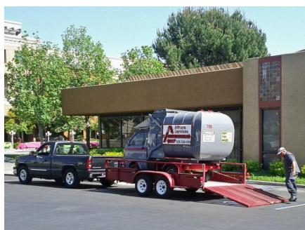
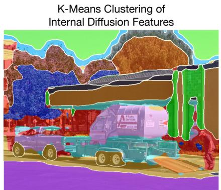
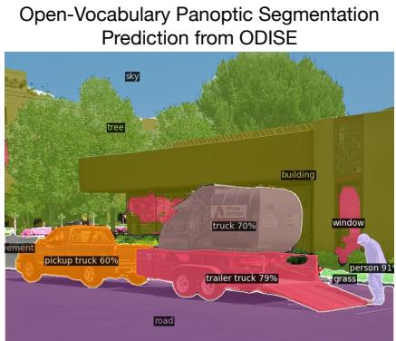
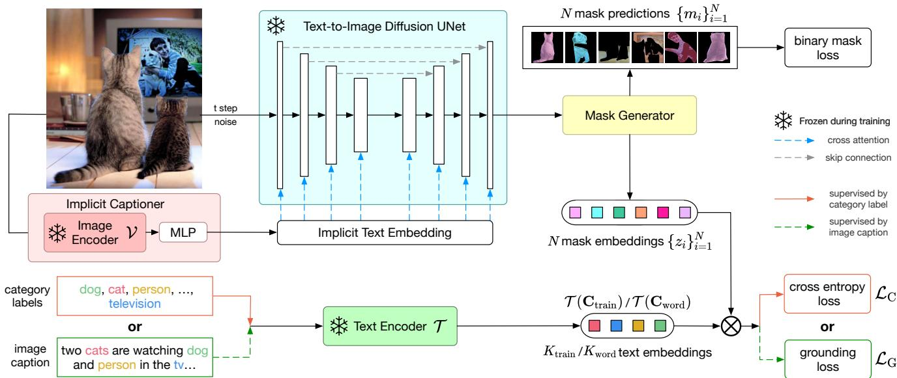
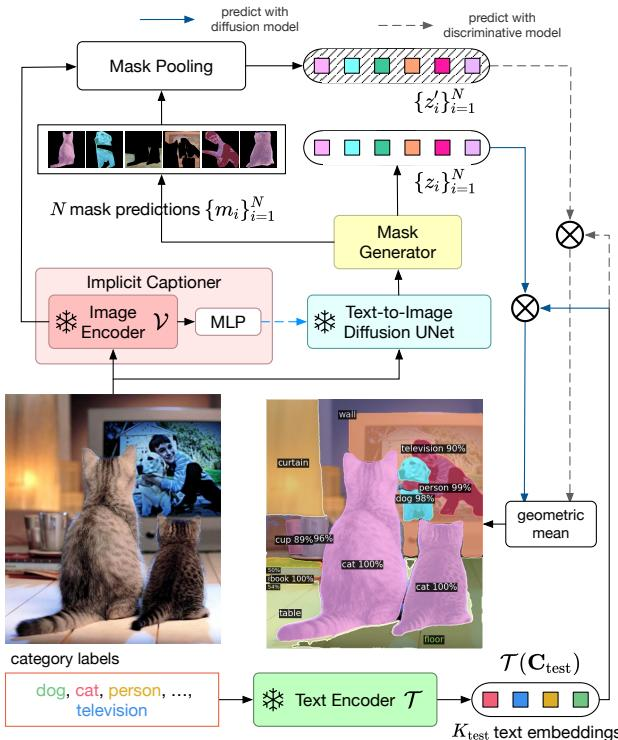
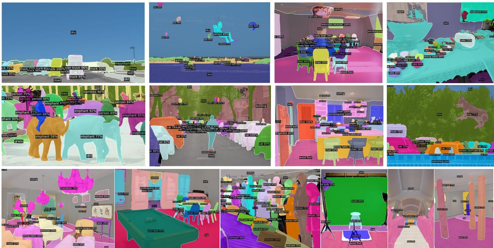

# Open-Vocabulary Panoptic Segmentation with Text-to-Image Diffusion Models

Jiarui Xu1\* Sifei Liu2† Arash Vahdat2† Wonmin Byeon2 Xiaolong Wang1 Shalini De Mello2 1UC San Diego 2NVIDIA

  
Figure 1. We learn open-vocabulary panoptic segmentation with the internal representation of text-to-image diffusion models. K-Means clustering of the diffusion model’s internal representation shows semantically differentiated and localized information wherein objects are well grouped together (middle figure). We leverage these dense and rich diffusion features to perform open-vocabulary panoptic segmentation (right figure).

## Abstract

We present ODISE: Open-vocabulary DIffusion-based panoptic SEgmentation, which unifies pre-trained textimage diffusion and discriminative models to perform openvocabulary panoptic segmentation. Text-to-image diffusion models have the remarkable ability to generate highquality images with diverse open-vocabulary language descriptions. This demonstrates that their internal representation space is highly correlated with open concepts in the real world. Text-image discriminative models like CLIP, on the other hand, are good at classifying images into openvocabulary labels. We leverage the frozen internal representations of both these models to perform panoptic segmentation of any category in the wild. Our approach outperforms the previous state ofthe art by significant margins on both open-vocabulary panoptic and semantic segmentation tasks. In particular, with COCO training only, our method achieves 23.4 PQ and 30.0 mIoU on the ADE20K dataset, with 8.3 PQ and 7.9 mIoU absolute improvement over the previous state of the art. We open-source our code and models at https://github.com/NVlabs/ ODISE.

## 1. Introduction

Humans look at the world and can recognize limitless categories. Given the scene presented in Fig. 1, besides identifying every vehicle as a “truck”, we immediately understand that one of them is a pickup truck requiring a trailer to move another truck. To reproduce an intelligence with such a fine-grained and unbounded understanding, the problem of open-vocabulary recognition [36, 57, 76, 89] has recently attracted a lot of attention in computer vision. However, very few works are able to provide a unified framework that parses all object instances and scene semantics at the same time, i.e., panoptic segmentation.

Most current approaches for open-vocabulary recognition rely on the excellent generalization ability of textimage discriminative models [30, 57] trained with Internetscale data. While such pre-trained models are good at classifying individual object proposals or pixels, they are not necessarily optimal for performing scene-level structural understanding. Indeed, it has been shown that CLIP [57] often confuses the spatial relations between objects [69]. We hypothesize that the lack of spatial and relational understanding in text-image discriminative models is a bottleneck for open-vocabulary panoptic segmentation.

On the other hand, text-to-image generation using diffusion models trained on Internet-scale data [1, 59, 61, 62,

90] has recently revolutionized the field of image synthesis. It offers unprecedented image quality, generalizability, composition-ability and, semantic control via the input text. An interesting observation is that to condition the image generation process on the provided text, diffusion models compute cross-attention between the text’s embedding and their internal visual representation. This design implies the plausibility of the internal representation of diffusion models being well-differentiated and correlated to high/mid-level semantic concepts that can be described by language. As a proof-of-concept, in Fig.1 (center), we visualize the results of clustering a diffusion model’s internal features for the image on the left. While not perfect, the discovered groups are indeed semantically distinct and localized. Motivated by this finding, we ask the question of whether Internet-scale text-to-image diffusion models can be exploited to create universal open-vocabulary panoptic segmentation learner for any concept in the wild?

To this end, we propose ODISE: Open-vocabulary DIffusion-based panoptic SEgmentation (pronounced o-disee), a model that leverages both large-scale text-image diffusion and discriminative models to perform state-of-theart panoptic segmentation of any category in the wild. An overview of our approach is illustrated in Fig. 2. At a high-level it contains a pre-trained frozen text-to-image diffusion model into which we input an image and its caption and extract the diffusion model’s internal features for them. With these features as input, our mask generator produces panoptic masks of all possible concepts in the image. We train the mask generator with annotated masks available from a training set. A mask classification module then categorizes each mask into one of many open-vocabulary categories by associating each predicted mask’s diffusion features with text embeddings of several object category names. We train this classification module with either mask category labels or image-level captions from the training dataset. Once trained, we perform open-vocabulary panoptic inference with both the text-image diffusion and discriminative models to classify a predicted mask. On many different benchmark datasets and across several open-vocabulary recognition tasks, ODISE achieves state-of-the-art accuracy outperforming the existing baselines by large margins.

Our contributions are the following:

• To the best of our knowledge, ODISE is the first work to explore large-scale text-to-image diffusion models for open-vocabulary segmentation tasks.

• We propose a novel pipeline to effectively leverage both text-image diffusion and discriminative models to perform open-vocabulary panoptic segmentation.

• We significantly advance the field forward by outperforming all existing baselines on many openvocabulary recognition tasks, and thus establish a new state of the art in this space.

## 2. Related Work

Panoptic Segmentation. Panoptic segmentation [35] is a fundamental vision task that encompasses both instance and semantic segmentation. However, previous works [5, 9–11, 35, 38, 43, 44, 60, 74, 79, 84] follow a closed closed-vocabulary assumption and only recognize categories present in the training set. They are hence limited in segmenting things/stuff present in finite-sized vocabularies, which are much smaller than the typical vocabularies that we use to describe the real world.

Open-Vocabulary Segmentation. Most prior works on open-vocabulary segmentation either perform object detection with instance segmentation alone [17, 22, 23, 40, 51, 80, 81, 86, 89] or open-vocabulary semantic segmentation alone [22, 36, 76, 88]. In contrast, we propose a novel unified framework for both open-vocabulary instance and semantic segmentation. Another distinction is that prior works only use large-scale models pre-trained for image discriminative tasks, e.g., image classification [27, 47] or image-text contrastive learning [30, 41, 53, 57]. The concurrent work MaskCLIP [15] also uses CLIP [57]. However, such discriminative models’ internal representations are sub-optimal for performing segmentation tasks versus those derived from image-to-text diffusion models as shown in our experiments.

Generative Models for Segmentation. There exist prior works, which are similar in spirit to ours in their use of image generative models, including GANs [3,18,32,33,91] or diffusion models [13, 16, 28, 31, 55, 64–68, 72] to perform semantic segmentation [2,20,37,50,71,85]. They first train generative models on small-vocabulary datasets, e.g., cats [78], human faces [32] or ImageNet [12] and then with the help of few-shot hand-annotated examples per category, learn to classify the internal representations of the generative models into semantic regions. They either synthesize many images and their mask labels to train a separate segmentation network [37, 85]; or directly use the generative model to perform segmentation [2]. Among them, DDPM-Seg [2] shows the state-of-the-art accuracy. These prior works introduce the key idea that the internal representations of generative models may be sufficiently differentiated and correlated to mid/high-level visual semantic concepts and could be used for semantic segmentation. Our work is inspired by them, but it is also different in many respects. While previous works primarily focus on label-efficient semantic segmentation of small closed vocabularies, we, on the other hand, tackle open-vocabulary panoptic segmentation of many more and unseen categories in the wild.

  
Figure 2. ODISE Overview and Training Pipeline. We first encode the input image into an implicit text embedding with an implicit captioner (image encoder V and MLP). With the image and its implicit text embedding as input, we extract their diffusion features from a frozen text-to-image diffusion UNet (Sec 3.3). With the UNet’s features, a mask generator predicts class-agnostic binary masks and their associated mask embedding features (Sec 3.4). We perform a dot product between the mask embedding features and the text embeddings of training category names (red box) or the nouns of the image’s caption (green box) to categorize them. The similarity matrix for mask classification is supervised by either a cross entropy loss with ground truth category labels (red solid path), or via a grounding loss with the paired image captions (green dash path) (Sec 3.5).

## 3. Method

## 3.1. Problem Definition

Following [15, 35], we train a model with a set of base training categories $\mathbf { C } _ { \mathrm { t r a i n } }$ , which may be different from the test categories, $\mathbf { C } _ { \mathrm { { t e s t } } } , \ \mathrm { { i . e . , } \ \mathbf { C } _ { \mathrm { { t r a i n } } } \ \neq \ \mathbf { C } _ { \mathrm { { t e s t } } } . \ \mathbf { C } _ { \mathrm { { t e s t } } } }$ may contain novel categories not seen during training. We assume that during training, the binary panoptic mask annotation for each category in an image is provided. Additionally, we also assume that either the category label of each mask or a text caption for the image is available. During testing, neither the category label nor the caption is available for any image, and only the names of the test categories $\mathbf { C } _ { \mathrm { t e s t } }$ are provided.

## 3.2. Method Overview

An overview of our method ODISE, for open-vocabulary panoptic segmentation of any category in the wild is shown in Fig. 2. At a high-level, it contains a text-to-image diffusion model into which we input an image and its caption and extract the diffusion model’s internal features for them (Sec 3.3). With these extracted features as input, and the provided training mask annotations, we train a mask generator to generate panoptic masks of all possible categories in the image (Sec 3.4). Using the provided training images’ category labels or text captions, we also train an openvocabulary mask classification module. It uses each predicted mask’s diffusion features along with a text encoder’s embeddings of the training category names to classify a mask (Sec 3.5). Once trained, we perform open-vocabulary panoptic inference with both the text-image diffusion and discriminative models (Sec 3.6 and Fig. 3). In the following sections, we describe each of these components.

## 3.3. Text-to-Image Diffusion Model

We first provide a brief overview of text-to-image diffusion models and then describe how we extract features from them for panoptic segmentation.

Background A text-to-image diffusion model can generate high-quality images from provided input text prompts. It is trained with millions of image-text pairs crawled from the Internet [54, 59, 62]. The text is encoded into a text embedding with a pre-trained text encoder, $e . g .$ , T5 [58] or CLIP [57]. Before being input into the diffusion network, an image is distorted by adding some level of Gaussian noise to it. The diffusion network is trained to undo the distortion given the noisy input and its paired text embedding. During inference, the model takes image-shaped pure Gaussian noise and the text embedding of a user provided description as input, and progressively de-noises it to a realistic image via several iterations of inference.

Visual Representation Extraction The prevalent diffusion-based text-to-image generative models [54, 59, 61, 62] typically use a UNet architecture to learn the denoising process. As shown in the blue block in Fig. 2, the UNet consists of convolution blocks, upsampling and downsampling blocks, skip connections and attention blocks, which perform cross-attention [73] between a text embedding and UNet features. At every step of the de-noising process, diffusion models use the text input to infer the de-noising direction of the noisy input image. Since the text is injected into the model via cross attention layers, it encourages visual features to be correlated to rich semantically meaningful text descriptions. Thus the feature maps output by the UNet blocks can be regarded as rich and dense features for panoptic segmentation.

Our method only requires a single forward pass of an input image through the diffusion model to extract its visual representation, as opposed to going through the entire multi-step generative diffusion process. Formally, given an input image-text pair (x, s), we first sample a noisy image $x _ { t }$ at time step t as:

$$
\begin{array} { r } { x _ { t } \triangleq \sqrt { \bar { \alpha } _ { t } } x + \sqrt { 1 - \bar { \alpha } _ { t } } \epsilon , \quad \epsilon \sim \mathcal { N } ( 0 , \mathbf { I } ) , } \end{array}\tag{1}
$$

where t is the diffusion step we use, $\alpha _ { 1 } , \ldots , \alpha _ { T }$ represent a pre-defined noise schedule where $\begin{array} { r } { \bar { \alpha } _ { t } = \prod _ { k = 1 } ^ { t } \alpha _ { k } } \end{array}$ , as defined in [28]. We encode the caption s with a pre-trained text encoder T and extract the text-to-image diffusion UNet’s internal features $f$ for the pair by feeding it into the UNet

$$
f = \mathrm { U N e t } ( x _ { t } , { \mathcal { T } } ( s ) ) .\tag{2}
$$

It is worth noting that the diffusion model’s visual representation f for x is dependent on its paired caption s. It can be extracted correctly when paired image-text data is available, $\mathrm { e . g . }$ ., during pre-training of the text-to-image diffusion model. However, it becomes problematic when we want to extract the visual representation of images without paired captions available, which is the common use case for our application. For an image without a caption, we could use an empty text as its caption input, but that is clearly suboptimal, which we also show in our experiments. In what follows, we introduce a novel Implicit Captioner that we design to overcome the need for explicitly captioned image data. It also yields optimal downstream task performance.

Implicit Captioner Instead of using an off-the-shelf captioning network to generate captions, we train a network to generate an implicit text embedding from the input image itself. We then input this text embedding into the diffusion model directly. We name this module an implicit captioner. The red block in Fig. 2 shows the architecture of the implicit captioner. Specifically, to derive the implicit text embedding for an image, we leverage a pre-trained frozen image encoder V, e.g., from CLIP [57] to encode the input image x into its embedding space. We further use a learned MLP to project the image embedding into an implicit text embedding, which we input into text-to-image diffusion UNet. During open-vocabulary panoptic segmentation training, the parameters of the image encoder and of the UNet are unchanged and we only fine-tune the parameters of the MLP.

Finally, the text-to-image diffusion model’s UNet along with the implicit captioner, together form ODISE’s feature extractor that computes the visual representation f for an input image x. Formally, we compute the visual representation $f$ as:

$$
\begin{array} { r l } & { f = \mathrm { { U N e t } } ( x _ { t } , { \mathrm { I m p l i c i t C a p t i o n e r } } ( x ) ) } \\ & { \quad = { \mathrm { U N e t } } ( x _ { t } , { \mathrm { M L P } } \circ \mathcal { V } ( x ) ) . } \end{array}\tag{3}
$$

## 3.4. Mask Generator

The mask generator takes the visual representation $f$ as input and outputs N class-agnostic binary masks $\{ m _ { i } \} _ { i = 1 } ^ { N }$ and their corresponding N mask embedding features $\{ z _ { i } \} _ { i = 1 } ^ { N }$ . The architecture of the mask generator is not restricted to a specific one. It can be any panoptic segmentation network capable of generating mask predictions of the whole image. We can instantiate our method with both bounding box-based [5, 34] and direct segmentation maskbased [9–11,74] methods. While using bounding box-based methods like [5,34], we can pool the ROI-Aligned [26] features of each predicted mask’s region to compute its mask embedding features. For segmentation mask-based methods like [9–11, 74], we can directly perform masked pooling on the final feature maps to compute the mask embedding features. Since our representation focuses on dense pixel-wise predictions, we use a direct segmentation-based architecture. Following [26], we supervise the predicted class-agnostic binary masks via a pixel-wise binary cross entropy loss along with their corresponding ground truth masks (treated as class-agnostic ones as well). Next, we describe how we classify each mask, represented by its mask embedding feature, into an open vocabulary.

## 3.5. Mask Classification

To assign each predicted binary mask a category label from an open vocabulary, we employ text-image discriminative models. These models [30, 53, 57], trained on Internet-scale image-text pairs, have shown strong openvocabulary classification capabilities. They consist of an image encoder V and a text encoder T. Following prior work [22, 36], while training, we employ two commonly used supervision signals to learn to predict the category label of each predicted mask. Next, we describe how we unify these two training approaches in ODISE.

Category Label Supervision Here, we assume that during training we have access to each mask’s ground truth category label. Thus, the training procedure is similar to that of traditional closed-vocabulary training. Suppose that there are $K _ { \mathrm { t r a i n } } = | \mathbf { C } _ { \mathrm { t r a i n } } |$ categories in the training set. For each mask embedding feature $z _ { i } ,$ , we dub its corresponding known ground truth category as $y _ { i } \in \mathbf { C } _ { \mathrm { t r a i n } }$ . We encode the names of all the categories in $\mathbf { C } _ { \mathrm { t r a i n } }$ with the frozen text encoder $\tau _ { \ast }$ , and define the set of embeddings of all the training

categories’ names as

$$
\begin{array} { r } { \mathcal { T } ( \mathbf { C } _ { \mathrm { t r a i n } } ) \triangleq [ \mathcal { T } ( c _ { 1 } ) , \mathcal { T } ( c _ { 2 } ) , \dots , \mathcal { T } ( c _ { K _ { \mathrm { t r a i n } } } ) ] , } \end{array}\tag{4}
$$

where the category name $c _ { k } \in \mathbf { C } _ { \mathrm { t r a i n } }$ . Then we compute the probability of the mask embedding feature $z _ { i }$ belonging to one of the $K _ { \mathrm { t r a i n } }$ classes via a classification loss as:

$$
\mathcal { L } _ { \mathrm { C } } = \frac { 1 } { N } \sum _ { i } ^ { N } \mathrm { C r o s s E n t r o p y } ( \mathbf { p } ( z _ { i } , \mathbf { C } _ { \mathrm { t r a i n } } ) , y _ { i } ) ,\tag{5}
$$

$$
\mathbf { p } ( z _ { i } , \mathbf { C _ { \mathrm { t r a i n } } } ) = \operatorname { S o f t m a x } ( z _ { i } \cdot \mathcal { T } ( \mathbf { C _ { \mathrm { t r a i n } } } ) / \tau ) ,\tag{6}
$$

where τ is a learnable temperature parameter.

Image Caption Supervision Here, we assume that we do not have any category labels associated with each annotated mask during training. Instead, we have access to a natural language caption for each image, and the model learns to classify the predicted mask embedding features using the image caption alone. To do so, we extract the nouns from each caption and treat them as the grounding category labels for their corresponding paired image. Following [22, 24, 82], we employ a grounding loss to supervise the prediction of the masks’ category labels. Specifically, given the image-caption pair $( \bar { x ^ { ( m ) } } , s ^ { ( m ) } )$ ), suppose that there are $K _ { \mathrm { w o r d } }$ nouns extracted from $s ^ { ( m ) }$ , denoted as $\mathbf { C } _ { \mathrm { w o r d } } = \{ w _ { k } \} _ { k = 1 } ^ { K _ { \mathrm { w o r d } } }$ . Suppose further that we sample B image-caption pairs $\bar { \{ }  ( x ^ { ( m ) } , s ^ { ( m ) } \} _ { m = 1 } ^ { B }$ to form a batch. To compute the grounding loss, we compute the similarity between each image-caption pair as

$$
g ( x ^ { ( m ) } , s ^ { ( m ) } ) = \frac { 1 } { K } \sum _ { k = 1 } ^ { K } \sum _ { i = 1 } ^ { N } \mathbf { p } ( z _ { i } , \mathbf { C } _ { \mathrm { w o r d } } ) _ { k } { \cdot } \langle z _ { i } , \mathcal { T } ( w _ { k } ) \rangle ,\tag{7}
$$

where $z _ { i }$ and $\tau ( w _ { k } )$ are vectors of the same dimension and $\mathbf { p } ( z _ { i } , \mathbf { C } _ { \mathrm { w o r d } } ) _ { k }$ is the k-th element of the vector defined in Eq. 6 after Softmax. This similarity function encourages each noun to be grounded by one or a few masked regions of the image and avoids penalizing the regions that are not grounded by any word at all. Similar to the image-text contrastive loss in [30, 57], the grounding loss is defined by

$$
\begin{array} { r l r } & { } & { \mathcal { L } _ { \mathrm { G } } = - \displaystyle \frac { 1 } { B } \sum _ { m = 1 } ^ { B } \log \frac { \exp ( g ( x ^ { ( m ) } , s ^ { ( m ) } ) / \tau ) } { \sum _ { n = 1 } ^ { B } \exp ( g ( x ^ { ( m ) } , s ^ { ( n ) } ) / \tau ) } } \\ & { } & { \quad \quad - \displaystyle \frac { 1 } { B } \sum _ { m = 1 } ^ { B } \log \frac { \exp ( g ( x ^ { ( m ) } , s ^ { ( m ) } ) / \tau ) } { \sum _ { n = 1 } ^ { B } \exp ( g ( x ^ { ( n ) } , s ^ { ( m ) } ) / \tau ) } , } \end{array}\tag{8}
$$

where τ is a learnable temperature parameter. Finally, note that we train the entire ODISE model with either $\mathcal { L } _ { \mathrm { C } }$ or $\mathcal { L } _ { \mathrm { G } }$ together with the class-agnostic binary mask loss. In our experiments, we explicitly state which of these two supervision signals (label or caption) we use for training ODISE when comparing to the relevant prior works.

  
Figure 3. Open-Vocabulary Inference Pipeline. To classify each mask embedding into the testing categories $\mathbf { C } _ { \mathrm { t e s t } } .$ , we compute its similarity to the text encoder $\gamma _ { s }$ embeddings of category names. Besides the mask embeddings from the text-to-image diffusion model $\{ z _ { i } \} _ { i = 1 } ^ { N }$ , we also perform masked pooling of the features of an image encoder V from a text-image discriminative model to get $\{ z _ { i } ^ { \prime } \} _ { i = 1 } ^ { N }$ . We fuse the predictions of the diffusion model (blue solid path) and the discriminative model (grey dash path) with a geometric mean.

## 3.6. Open-Vocabulary Inference

During inference (Fig. 3), the set of names of the test categories $\mathbf { C } _ { \mathrm { t e s t } }$ is available, The test categories may be different from the training ones. Additionally, no caption/labels are available for a test image. Hence we pass it through the implicit captioner to obtain its implicit caption; input the two into the diffusion model to obtain the UNet’s features; and use the mask generator to predict all possible binary masks of semantic categories in the image. To classify each predicted mask $m _ { i }$ into one of the test categories, we compute $\mathbf { p } ( z _ { i } , \mathbf { C } _ { \mathrm { t e s t } } )$ defined in Eq. 6 using ODISE and finally predict the category with the maximum probability.

In our experiments, we found that the internal representation of the diffusion model is spatially well-differentiated to produce many plausible masks for objects instances. However, its object classification ability can be further enhanced by combining it once again with a text-image discriminative model, e.g., CLIP [57], especially for openvocabularies. To this end, here we leverage a text-image discriminative model’s image encoder V to further classify each predicted masked region of the original input image into one of the test categories. Specifically, as Fig. 3 illustrates, given an input image x, we first encode it into a feature map with the image encoder V of a text-image discriminative model. Then for a mask $m _ { i }$ , predicted by ODISE for image $x ,$ we pool all the features at the output of the image encoder $\mathcal { V } ( x )$ that fall inside the predicted mask $m _ { i }$ to compute a mask pooled image feature for it

$$
z _ { i } ^ { \prime } = \mathbf { M a s k P o o l i n g } ( \mathcal { V } ( x ) , m _ { i } ) .\tag{9}
$$

We use $\mathbf { p } ( z _ { i } ^ { \prime M } , \mathbf { C } _ { \mathrm { t e s t } } )$ from Eq.6 to compute the final classification probabilities from the text-image discriminative model. Finally, we take the geometric mean of the category predictions from the diffusion and discriminative models as the final classification prediction,

$$
{ \bf p } _ { \mathrm { f i n a l } } ( z _ { i } , { \bf C } _ { \mathrm { t e s t } } ) \propto { \bf p } ( z _ { i } , { \bf C } _ { \mathrm { t e s t } } ) ^ { \lambda } { \bf p } ( z _ { i } ^ { \prime } , { \bf C } _ { \mathrm { t e s t } } ) ^ { ( 1 - \lambda ) } ,\tag{10}
$$

where $\lambda \in [ 0 , 1 ]$ is a fixed balancing factor. We find that pooling the masked features is more efficient and yet as effective as the alternative approach proposed in [14, 23], which crops each of the N predicted masked region’s bounding box from the original image and encodes it separately with the image encoder V (see details in the supplement).

## 4. Experiments

We first introduce our implementation details. Then we compare our results against the state of the art on openvocabulary panoptic and semantic segmentation. Lastly, we present ablation studies to demonstrate the effectiveness of the components of our method.

## 4.1. Implementation Details

Architecture We use the stable diffusion [61] model pretrained on a subset of the LAION [63] dataset as our text-toimage diffusion model. We extract feature maps from every three of its UNet blocks and, like FPN [45], resize them to create a feature pyramid. We set the time step used for the diffusion process to $t = 0$ , by default. We use CLIP [57] as our text-image discriminative model and its corresponding image V and text T encoders everywhere. We choose Mask2Former [10] as the architecture of our mask generator, and generate $N = 1 0 0$ binary mask predictions.

Training Details We train ODISE for 90k iterations with images of size $1 0 2 4 ^ { 2 }$ and use large scale jittering [21]. Our batch size is 64. For caption-supervised training, we set $K _ { \mathrm { w o r d } } = 8$ . We use the AdamW [49] optimizer with a learning rate 0.0001 and a weight decay of 0.05. We use the COCO dataset [46] as our training set. We utilize its provided panoptic mask annotations as the supervision signal for the binary mask loss. For training with image captions, for each image we randomly select one caption from the COCO dataset’s caption [7] annotations.

Inference and Evaluation We evaluate ODISE on ADE20K [87] for open-vocabulary panoptic, instance and semantic segmentation; and the Pascal datasets [19, 52] for semantic segmentation. We also provide the results ODISE for open-vocabulary object detection and open-world instance segmentation in the supplement. We use only a single checkpoint of ODISE for mask prediction on all tasks on all datasets. For panoptic segmentation, we report the panoptic quality (PQ) [35], mean average precision (mAP) on the “thing” categories, and the mean intersection over union (mIoU) metrics (additional SQ and RQ metrics are in the supplement). In panoptic segmentation annotations [35], the “thing” classes are countable objects like people, animals, etc. and the “stuff” classes are amorphous regions like sky, grass, etc. Since we train ODISE with panoptic mask annotations, we can directly infer both instance and semantic segmentation labels with it. When evaluating for panoptic segmentation, we use the panoptic test categories as $\mathbf { C } _ { \mathrm { t e s t } } .$ , and directly classify each predicted mask into the test category with the highest probability. For semantic segmentation, we merge all masks assigned to the same “thing” category into a single one and output it as the predicted mask.

Speed and Model Size ODISE has 28.1M trainable parameters (only 1.8% of the full model) and 1,493.8M frozen parameters. It performs inference for an image (10242) at 1.26 FPS on an NVIDIA V100 GPU and uses 11.9 GB memory.

## 4.2. Comparison with State of the Art

Open-Vocabulary Panoptic Segmentation For openvocabulary panoptic segmentation, we train ODISE on COCO [46] and test on ADE20K [87]. We report results in Table 1 (and more in the supplement). ODISE outperforms the concurrent work MaskCLIP [15] by 8.3 PQ on ADE20K. Besides the PQ metric, our approach also surpasses MaskCLIP [15] at open-vocabulary instance segmentation on ADE20K, with 8.4 points gain in mAP. ODISE’s qualitative results can be found in Fig. 4 and more in the supplement.

Open-Vocabulary Semantic Segmentation We show a comparison of ODISE to previous work on open-vocabulary semantic segmentation in Table 2. Following the experi ment in [22], we evaluate mIoU on 5 semantic segmentation datasets: (a) A-150 with 150 common classes and (b) A-847 with all the 847 classes of ADE20K [87], (c) PC-59 with 59 common classes and (d) PC-459 with full 459 classes of Pascal Context [52] and (e) the classic Pascal VOC dataset [19] with 20 foreground classes and 1 background class (PAS-21). For a fair comparison to prior work, we train ODISE with either category or image caption labels. ODISE outperforms the existing state-of-the-art methods on open-vocabulary semantic segmentation [15, 22] by a large margin: 7.6 mIoU on A-150, 4.7 mIoU on A-847,

<table><tr><td></td><td colspan="2">Supervision</td><td colspan="3">ADE20K</td><td colspan="3">COCO</td></tr><tr><td>Method</td><td>label mask</td><td>caption</td><td>PQ</td><td>mAP</td><td>mIoU</td><td>PQ</td><td>mAP</td><td>mIoU</td></tr><tr><td rowspan="2">MaskCLIP [15]</td><td colspan="2" rowspan="2">√ √</td><td rowspan="2">15.1</td><td>6.0</td><td rowspan="2">23.7</td><td rowspan="2">一</td><td rowspan="2"></td><td rowspan="2">一</td></tr><tr><td>22.6</td></tr><tr><td>ODISE (Ours)</td><td>√ √</td><td></td><td></td><td>14.4</td><td>29.9</td><td>55.4</td><td>46.0</td><td>65.2</td></tr><tr><td>ODISE (Ours)</td><td>√</td><td>√</td><td>23.4</td><td>13.9</td><td>28.7</td><td>45.6</td><td>38.4</td><td>52.4</td></tr></table>

Table 1. Open-vocabulary panoptic segmentation performance.
<table><tr><td rowspan="2">Method</td><td rowspan="2">Training Dataset</td><td colspan="3">Supervision</td><td rowspan="2">mIoU</td><td colspan="5"></td></tr><tr><td>label</td><td>mask caption</td><td>A-847</td><td>PC-459</td><td>A-150</td><td>PC-59</td><td>PAS-21</td><td>COCO</td></tr><tr><td>SPNet [75]</td><td>Pascal VOC</td><td>√</td><td>√</td><td></td><td></td><td></td><td></td><td>24.3</td><td>18.3</td><td></td></tr><tr><td>ZS3Net [4]</td><td>Pascal VOC</td><td>√</td><td>√</td><td></td><td></td><td></td><td></td><td>19.4</td><td>38.3</td><td></td></tr><tr><td>LSeg [36]</td><td>Pascal VOC</td><td>√</td><td>√</td><td></td><td></td><td></td><td></td><td></td><td>47.4</td><td></td></tr><tr><td>SimBaseline [77]</td><td>COCO</td><td>√</td><td>√</td><td></td><td></td><td></td><td>15.3</td><td></td><td>74.5</td><td></td></tr><tr><td>ZegFormer [14]</td><td>COCO</td><td>√</td><td>√</td><td></td><td></td><td></td><td>16.4</td><td></td><td>73.3</td><td></td></tr><tr><td>LSeg+ [22]</td><td>COCO</td><td>√</td><td>√</td><td></td><td>3.8</td><td>7.8</td><td>18.0</td><td>46.5</td><td></td><td>55.1</td></tr><tr><td>MaskCLIP [15]</td><td>COCO</td><td>√</td><td>√</td><td></td><td>8.2</td><td>10.0</td><td>23.7</td><td>45.9</td><td></td><td></td></tr><tr><td>ODISE (Ours)</td><td>COCO</td><td>√</td><td>√</td><td></td><td>11.1</td><td>14.5</td><td>29.9</td><td>57.3</td><td>84.6</td><td>65.2</td></tr><tr><td>GroupViT [76]</td><td>GCC+YFCC</td><td></td><td></td><td>√</td><td>4.3</td><td>4.9</td><td>10.6</td><td>25.9</td><td>50.7</td><td>21.1</td></tr><tr><td>OpenSeg [22]</td><td>COCO</td><td></td><td>√</td><td>√</td><td>6.3</td><td>9.0</td><td>21.1</td><td>42.1</td><td></td><td>36.1</td></tr><tr><td>ODISE (Ours)</td><td>COCO</td><td></td><td>√</td><td>√</td><td>11.0</td><td>13.8</td><td>28.7</td><td>55.3</td><td>82.7</td><td>52.4</td></tr></table>

Table 2. Open-vocabulary semantic segmentation performance.

4.8 mIoU on PC-459 with caption supervision; and by 6.2 mIoU on A-150, 4.5 mIoU on PC-459 with category label supervision, versus the next best method. Notably, it achieves this despite using supervision from panoptic mask annotations, which is noted to be suboptimal for semantic segmentation [10].

## 4.3. Ablation Study

To demonstrate the contribution of each component of our method, we conduct an extensive ablation study. For faster experimentation, we train ODISE with 5122 resolution images and use image caption supervision everywhere. Specifically, we evaluate different visual representations; caption generators; open-vocabulary inference pipelines and diffusion time-step(s) used to extract features (the latter two ablations are in the supplement).

Visual Representations We compare the internal representation of text-to-image diffusion models to those of other state-of-the-art pre-trained discriminative and generative models. We evaluate various discriminative models trained with full label, text or self-supervision. In all experiments we freeze the weights of the pre-trained models and use exactly the same training hyperparameters and mask generator as in our method. For each supervision category we select the best-performing and largest publicly available discriminative models. We observe from Table 3 that ODISE outperforms all other models in terms of PQ on both datasets. To offset any potential bias arising from the larger size of the LAION dataset (2B image-caption pairs) with which the stable diffusion model is trained, versus the smaller datasets used to train the discriminative models, we also compare to CLIP(H) [29, 57], which is trained on an equal-sized LAION [63] dataset. Our diffusion-based method outperforms CLIP(H) on all metrics. In the supplement (Fig 3.4), we show k-means clustering of frozen diffusion and CLIP features and find that the diffusion features are much more semantically differentiated. This demonstrates that the diffusion model’s internal representation is indeed superior for open-vocabulary segmentation that that of discriminative pre-trained models.

<table><tr><td rowspan=1 colspan=1>Model</td><td rowspan=1 colspan=2>TrainingData</td><td rowspan=1 colspan=1>ADE20KPQmAP mIoU</td><td rowspan=1 colspan=1>COCOPQmAP mIoU</td></tr><tr><td rowspan=1 colspan=5>Pre-trained with class labels</td></tr><tr><td rowspan=1 colspan=1>DeiT-v3(H) [70]</td><td rowspan=1 colspan=2>IN-21k</td><td rowspan=1 colspan=1>21.4 11.428.0</td><td rowspan=1 colspan=1>41.4 29.252.3</td></tr><tr><td rowspan=1 colspan=1>Swin(H) [47]</td><td rowspan=1 colspan=2>IN-21k</td><td rowspan=2 colspan=1>IN-21kIN-21kIN-1k</td><td rowspan=2 colspan=1>20.910.727.721.0011.027.821.1 11.628.120.710.9 26.5</td></tr><tr><td rowspan=1 colspan=1>ConvNeXt(H) [48]MViT(H) [42]LDM [61]</td><td rowspan=1 colspan=2></td></tr><tr><td rowspan=1 colspan=5>Pre-trained with self-supervision</td></tr><tr><td rowspan=1 colspan=1>MoCo-v3(H) [8]</td><td rowspan=1 colspan=2>IN-1k</td><td rowspan=1 colspan=1>19.39.6 25.8</td><td rowspan=2 colspan=1>37.126.8 47.139.529.849.537.931.6 46.341.429.252.3</td></tr><tr><td rowspan=1 colspan=1>DINO(B) [6]MAE(H) [25]BEiT-v2(H) [56]</td><td rowspan=1 colspan=2>IN-1kIN-1kIN-21k</td><td rowspan=1 colspan=1>20.610.526.321.510.927.621.411.428.0</td></tr><tr><td rowspan=1 colspan=5>Pre-trained with text</td></tr><tr><td rowspan=1 colspan=1>CLIP(L) [57]</td><td rowspan=1 colspan=2>WIT</td><td rowspan=2 colspan=1>20.49.6 27.021.210.828.123.313.029.2</td><td rowspan=2 colspan=1>40.626.752.141.027.952.144.2 38.353.8</td></tr><tr><td rowspan=1 colspan=1>CLIP(H) [57]ODISE</td><td rowspan=1 colspan=2>LAIONLAION</td></tr></table>

Table 3. Comparison with the state-of-the-art visual representations. B, L, H in the parentheses denote the model’s size.

The recent DDPMSeg [2] model is somewhat related to our model. Besides us, it is the only prior work that uses diffusion models and obtains state-of-the-art performance on label-efficient segmentation learning. Since DDPMSeg relies on category specific diffusion models it is not designed for open-world panoptic segmentation. Hence its direct comparison to our approach is not feasible. As an alternative, we compare against the internal representation of a class-conditioned generative model [61] trained on more categories from ImageNet [12] (LDM row in Table 3). Not surprisingly, we find that despite both generative models being diffusion-based, our approach of using a model trained on Internet-scale data is more effective at generalizing to open-vocabulary categories.

Figure 4. Qualitative Visualization on COCO (first 2 rows) and ADE20K (last row) validation and test sets. To demonstrate openvocabulary recognition capability, we merge category names of LVIS, COCO and ADE20K together and perform open-vocabulary inference with ∼1.5k classes directly. “Bamboo”, “swimming pool”, “conveyer belt”, “chandelier”, “booth”, “stool”, “column”, “pool table”, “bannister”, etc., are novel categories from LVIS/ADE20K that are not annotated in COCO. ODISE shows plausible open-vocabulary panoptic results. The supplement contains more visual results.
<table><tr><td colspan="2">Captioner</td><td colspan="3">ADE20K</td><td colspan="3">COCO</td></tr><tr><td></td><td></td><td>PQ 21.8</td><td>mAP</td><td>mIoU</td><td>PQ</td><td>mAP</td><td>mIoU</td></tr><tr><td>(a) (b)</td><td>Empty</td><td>22.2</td><td>11.8 12.1</td><td>27.3 28.1</td><td>43.5 44.0</td><td>37.0 36.3</td><td>52.3</td></tr><tr><td></td><td>Heuristic [83]</td><td>22.3</td><td></td><td></td><td></td><td></td><td>53.3</td></tr><tr><td>(c)</td><td>BLIP [39]</td><td></td><td>12.4</td><td>28.2</td><td>44.1</td><td>37.1</td><td>53.6</td></tr><tr><td>(d)</td><td>Implict</td><td>23.3</td><td>13.0</td><td>29.2</td><td>44.2</td><td>38.3</td><td>53.8</td></tr></table>

Caption Generators As discussed in Sec. 3.3, the internal features of a text-to-image diffusion model are dependent on the embedding of the input caption. To derive the optimal set of features for our downstream task, we introduce a novel implicit captioning module to directly generate an implicit text embedding from an image. This module also facilitates inference on images sans paired captions at test time. Here, we construct several baselines to show the effectiveness of our implicit captioning module (Table 4). The various alternatives that we compare are: providing an empty string to the text encoder for any given image, such that the text embedding for all images is fixed (row (a)); employing two different off-the-shelf image captioning networks to generate an explicit caption for each image on-thefly (rows (b) and (c)), where (c) [39] is trained on the COCO caption dataset, while (b) [83] is not; and our proposed implicit captioning module (row (d)). Overall, we find that using an explicit/implicit caption is better than using empty text. Furthermore, (c) improves over (b) on COCO but has similar PQ on ADE20K. It may be because the pre-trained BLIP [39] model does not see ADE20K’s image distribution during training. Lastly, since our implicit captioning module derives its caption from a text-image discriminative model trained on Internet-scale data, it is able to generalize best among all variants compared.

## 5. Conclusion

We take the first step in leveraging the frozen internal representation of large-scale text-to-image diffusion models for downstream recognition tasks. ODISE shows the great potential of large generative models in open-vocabulary segmentation tasks and establishes a new state of the art. We demonstrate that diffusion models are not only capable of generating plausible images but also of learning rich semantic representations. Our work opens a new direction for how to effectively leverage the internal representation of large diffusion models for other tasks as well in the future. Acknowledgements. We thank Golnaz Ghiasi for providing the prompt engineering labels for evaluation. Prof. Xiaolong Wang’s laboratory was supported, in part, by NSF CCF-2112665 (TILOS), NSF CAREER Award IIS-2240014, DARPA LwLL, Amazon Research Award, Adobe Data Science Research Award, and Qualcomm Innovation Fellowship.

## References

[1] Yogesh Balaji, Seungjun Nah, Xun Huang, Arash Vahdat, Jiaming Song, Karsten Kreis, Miika Aittala, Timo Aila, Samuli Laine, Bryan Catanzaro, Tero Karras, and Ming-Yu Liu. ediff-i: Text-to-image diffusion models with ensemble of expert denoisers. arXiv preprint arXiv:2211.01324, 2022. 1

[2] Dmitry Baranchuk, Ivan Rubachev, Andrey Voynov, Valentin Khrulkov, and Artem Babenko. Label-efficient semantic segmentation with diffusion models. arXiv preprint arXiv:2112.03126, 2021. 2, 7

[3] Andrew Brock, Jeff Donahue, and Karen Simonyan. Large scale gan training for high fidelity natural image synthesis. arXiv preprint arXiv:1809.11096, 2018. 2

[4] Maxime Bucher, Tuan-Hung Vu, Matthieu Cord, and Patrick Perez. Zero-shot semantic segmentation.´ Advances in Neural Information Processing Systems, 32, 2019. 7

[5] Nicolas Carion, Francisco Massa, Gabriel Synnaeve, Nicolas Usunier, Alexander Kirillov, and Sergey Zagoruyko. End-toend object detection with transformers. In European conference on computer vision, pages 213–229. Springer, 2020. 2, 4

[6] Mathilde Caron, Hugo Touvron, Ishan Misra, Herve J´ egou,´ Julien Mairal, Piotr Bojanowski, and Armand Joulin. Emerging properties in self-supervised vision transformers. In Proceedings of the IEEE/CVF International Conference on Computer Vision, pages 9650–9660, 2021. 7

[7] Xinlei Chen, Hao Fang, Tsung-Yi Lin, Ramakrishna Vedantam, Saurabh Gupta, Piotr Dollar, and C Lawrence Zitnick.´ Microsoft coco captions: Data collection and evaluation server. arXiv preprint arXiv:1504.00325, 2015. 6

[8] Xinlei Chen, Saining Xie, and Kaiming He. An empirical study of training self-supervised vision transformers. In Proceedings of the IEEE/CVF International Conference on Computer Vision, pages 9640–9649, 2021. 7

[9] Bowen Cheng, Maxwell D Collins, Yukun Zhu, Ting Liu, Thomas S Huang, Hartwig Adam, and Liang-Chieh Chen. Panoptic-deeplab: A simple, strong, and fast baseline for bottom-up panoptic segmentation. In Proceedings of the IEEE/CVF conference on computer vision and pattern recognition, pages 12475–12485, 2020. 2, 4

[10] Bowen Cheng, Ishan Misra, Alexander G Schwing, Alexander Kirillov, and Rohit Girdhar. Masked-attention mask transformer for universal image segmentation. In Proceedings of the IEEE/CVF Conference on Computer Vision and Pattern Recognition, pages 1290–1299, 2022. 2, 4, 6, 7

[11] Bowen Cheng, Alex Schwing, and Alexander Kirillov. Perpixel classification is not all you need for semantic segmentation. Advances in Neural Information Processing Systems, 34:17864–17875, 2021. 2, 4

[12] Jia Deng, Wei Dong, Richard Socher, Li-Jia Li, Kai Li, and Li Fei-Fei. Imagenet: A large-scale hierarchical image database. In 2009 IEEE conference on computer vision and pattern recognition, pages 248–255. Ieee, 2009. 2, 8

[13] Prafulla Dhariwal and Alexander Nichol. Diffusion models beat gans on image synthesis. Advances in Neural Information Processing Systems, 34:8780–8794, 2021. 2

[14] Jian Ding, Nan Xue, Gui-Song Xia, and Dengxin Dai. Decoupling zero-shot semantic segmentation. In Proceedings of the IEEE/CVF Conference on Computer Vision and Pattern Recognition, pages 11583–11592, 2022. 6, 7

[15] Zheng Ding, Jieke Wang, and Zhuowen Tu. Openvocabulary panoptic segmentation with maskclip. arXiv preprint arXiv:2208.08984, 2022. 2, 3, 6, 7

[16] Tim Dockhorn, Arash Vahdat, and Karsten Kreis. Scorebased generative modeling with critically-damped langevin diffusion. arXiv preprint arXiv:2112.07068, 2021. 2

[17] Yu Du, Fangyun Wei, Zihe Zhang, Miaojing Shi, Yue Gao, and Guoqi Li. Learning to prompt for open-vocabulary object detection with vision-language model. In Proceedings of the IEEE/CVF Conference on Computer Vision and Pattern Recognition, pages 14084–14093, 2022. 2

[18] Patrick Esser, Robin Rombach, and Bjorn Ommer. Taming transformers for high-resolution image synthesis. In Proceedings of the IEEE/CVF conference on computer vision and pattern recognition, pages 12873–12883, 2021. 2

[19] Mark Everingham, Luc Van Gool, Christopher KI Williams, John Winn, and Andrew Zisserman. The pascal visual object classes (voc) challenge. International journal of computer vision, 88(2):303–338, 2010. 6

[20] Danil Galeev, Konstantin Sofiiuk, Danila Rukhovich, Mikhail Romanov, Olga Barinova, and Anton Konushin. Learning high-resolution domain-specific representations with a gan generator. In Joint IAPR International Workshops on Statistical Techniques in Pattern Recognition (SPR) and Structural and Syntactic Pattern Recognition (SSPR), pages 108–118. Springer, 2021. 2

[21] Golnaz Ghiasi, Yin Cui, Aravind Srinivas, Rui Qian, Tsung-Yi Lin, Ekin D Cubuk, Quoc V Le, and Barret Zoph. Simple copy-paste is a strong data augmentation method for instance segmentation. In Proceedings of the IEEE/CVF Conference on Computer Vision and Pattern Recognition, pages 2918– 2928, 2021. 6

[22] Golnaz Ghiasi, Xiuye Gu, Yin Cui, and Tsung-Yi Lin. Open-vocabulary image segmentation. arXiv preprint arXiv:2112.12143, 2021. 2, 4, 5, 6, 7

[23] Xiuye Gu, Tsung-Yi Lin, Weicheng Kuo, and Yin Cui. Open-vocabulary object detection via vision and language knowledge distillation. arXiv preprint arXiv:2104.13921, 2021. 2, 6

[24] Tanmay Gupta, Arash Vahdat, Gal Chechik, Xiaodong Yang, Jan Kautz, and Derek Hoiem. Contrastive learning for weakly supervised phrase grounding. In European Conference on Computer Vision, pages 752–768. Springer, 2020. 5

[25] Kaiming He, Xinlei Chen, Saining Xie, Yanghao Li, Piotr Dollar, and Ross Girshick. Masked autoencoders are scalable´ vision learners. In Proceedings ofthe IEEE/CVF Conference on Computer Vision and Pattern Recognition, pages 16000– 16009, 2022. 7

[26] Kaiming He, Georgia Gkioxari, Piotr Dollar, and Ross Gir-´ shick. Mask r-cnn. In Proceedings of the IEEE international conference on computer vision, pages 2961–2969, 2017. 4

[27] Kaiming He, Xiangyu Zhang, Shaoqing Ren, and Jian Sun. Deep residual learning for image recognition. In Proceedings ofthe IEEE conference on computer vision and pattern recognition, pages 770–778, 2016. 2

[28] Jonathan Ho, Ajay Jain, and Pieter Abbeel. Denoising diffusion probabilistic models. Advances in Neural Information Processing Systems, 33:6840–6851, 2020. 2, 4

[29] Gabriel Ilharco, Mitchell Wortsman, Ross Wightman, Cade Gordon, Nicholas Carlini, Rohan Taori, Achal Dave, Vaishaal Shankar, Hongseok Namkoong, John Miller, Hannaneh Hajishirzi, Ali Farhadi, and Ludwig Schmidt. Openclip, July 2021. If you use this software, please cite it as below. 7

[30] Chao Jia, Yinfei Yang, Ye Xia, Yi-Ting Chen, Zarana Parekh, Hieu Pham, Quoc Le, Yun-Hsuan Sung, Zhen Li, and Tom Duerig. Scaling up visual and vision-language representation learning with noisy text supervision. In International Conference on Machine Learning, pages 4904–4916. PMLR, 2021. 1, 2, 4, 5

[31] Alexia Jolicoeur-Martineau, Remi Pich´ e-Taillefer, R´ emi Ta-´ chet des Combes, and Ioannis Mitliagkas. Adversarial score matching and improved sampling for image generation. arXiv preprint arXiv:2009.05475, 2020. 2

[32] Tero Karras, Samuli Laine, and Timo Aila. A style-based generator architecture for generative adversarial networks. In Proceedings of the IEEE/CVF conference on computer vision and pattern recognition, pages 4401–4410, 2019. 2

[33] Tero Karras, Samuli Laine, Miika Aittala, Janne Hellsten, Jaakko Lehtinen, and Timo Aila. Analyzing and improving the image quality of stylegan. In Proceedings of the IEEE/CVF conference on computer vision and pattern recognition, pages 8110–8119, 2020. 2

[34] Alexander Kirillov, Ross Girshick, Kaiming He, and Piotr Dollar. Panoptic feature pyramid networks. In ´ Proceedings ofthe IEEE/CVF conference on computer vision and pattern recognition, pages 6399–6408, 2019. 4

[35] Alexander Kirillov, Kaiming He, Ross Girshick, Carsten Rother, and Piotr Dollar. Panoptic segmentation. In ´ Proceedings of the IEEE/CVF Conference on Computer Vision and Pattern Recognition, pages 9404–9413, 2019. 2, 3, 6

[36] Boyi Li, Kilian Q Weinberger, Serge Belongie, Vladlen Koltun, and Rene Ranftl. Language-driven semantic seg-´ mentation. arXiv preprint arXiv:2201.03546, 2022. 1, 2, 4, 7

[37] Daiqing Li, Huan Ling, Seung Wook Kim, Karsten Kreis, Sanja Fidler, and Antonio Torralba. Bigdatasetgan: Synthesizing imagenet with pixel-wise annotations. In Proceedings of the IEEE/CVF Conference on Computer Vision and Pattern Recognition, pages 21330–21340, 2022. 2

[38] Feng Li, Hao Zhang, Shilong Liu, Lei Zhang, Lionel M Ni, Heung-Yeung Shum, et al. Mask dino: Towards a unified transformer-based framework for object detection and segmentation. arXiv preprint arXiv:2206.02777, 2022. 2

[39] Junnan Li, Dongxu Li, Caiming Xiong, and Steven Hoi. Blip: Bootstrapping language-image pre-training for unified vision-language understanding and generation. arXiv preprint arXiv:2201.12086, 2022. 8

[40] Liunian Harold Li, Pengchuan Zhang, Haotian Zhang, Jianwei Yang, Chunyuan Li, Yiwu Zhong, Lijuan Wang, Lu Yuan, Lei Zhang, Jenq-Neng Hwang, et al. Grounded language-image pre-training. In Proceedings of the IEEE/CVF Conference on Computer Vision and Pattern Recognition, pages 10965–10975, 2022. 2

[41] Yangguang Li, Feng Liang, Lichen Zhao, Yufeng Cui, Wanli Ouyang, Jing Shao, Fengwei Yu, and Junjie Yan. Supervision exists everywhere: A data efficient contrastive language-image pre-training paradigm. arXiv preprint arXiv:2110.05208, 2021. 2

[42] Yanghao Li, Chao-Yuan Wu, Haoqi Fan, Karttikeya Mangalam, Bo Xiong, Jitendra Malik, and Christoph Feichtenhofer. Mvitv2: Improved multiscale vision transformers for classification and detection. In Proceedings of the IEEE/CVF Conference on Computer Vision and Pattern Recognition, pages 4804–4814, 2022. 7

[43] Yanwei Li, Hengshuang Zhao, Xiaojuan Qi, Liwei Wang, Zeming Li, Jian Sun, and Jiaya Jia. Fully convolutional networks for panoptic segmentation. In Proceedings of the IEEE/CVF conference on computer vision and pattern recognition, pages 214–223, 2021. 2

[44] Zhiqi Li, Wenhai Wang, Enze Xie, Zhiding Yu, Anima Anandkumar, Jose M Alvarez, Ping Luo, and Tong Lu. Panoptic segformer: Delving deeper into panoptic segmentation with transformers. In Proceedings of the IEEE/CVF Conference on Computer Vision and Pattern Recognition, pages 1280–1289, 2022. 2

[45] Tsung-Yi Lin, Piotr Dollar, Ross Girshick, Kaiming He,´ Bharath Hariharan, and Serge Belongie. Feature pyramid networks for object detection. In Proceedings of the IEEE conference on computer vision and pattern recognition, pages 2117–2125, 2017. 6

[46] Tsung-Yi Lin, Michael Maire, Serge Belongie, James Hays, Pietro Perona, Deva Ramanan, Piotr Dollar, and C Lawrence´ Zitnick. Microsoft coco: Common objects in context. In European conference on computer vision, pages 740–755. Springer, 2014. 6

[47] Ze Liu, Yutong Lin, Yue Cao, Han Hu, Yixuan Wei, Zheng Zhang, Stephen Lin, and Baining Guo. Swin transformer: Hierarchical vision transformer using shifted windows. In Proceedings of the IEEE/CVF International Conference on Computer Vision, pages 10012–10022, 2021. 2, 7

[48] Zhuang Liu, Hanzi Mao, Chao-Yuan Wu, Christoph Feichtenhofer, Trevor Darrell, and Saining Xie. A convnet for the 2020s. In Proceedings of the IEEE/CVF Conference on Computer Vision and Pattern Recognition, pages 11976–11986, 2022. 7

[49] Ilya Loshchilov and Frank Hutter. Decoupled weight decay regularization. arXiv preprint arXiv:1711.05101, 2017. 6

[50] Chenlin Meng, Yutong He, Yang Song, Jiaming Song, Jiajun Wu, Jun-Yan Zhu, and Stefano Ermon. Sdedit: Guided image synthesis and editing with stochastic differential equations. In International Conference on Learning Representations, 2021. 2

[51] Matthias Minderer, Alexey Gritsenko, Austin Stone, Maxim Neumann, Dirk Weissenborn, Alexey Dosovitskiy, Aravindh

Mahendran, Anurag Arnab, Mostafa Dehghani, Zhuoran Shen, et al. Simple open-vocabulary object detection with vision transformers. arXiv preprint arXiv:2205.06230, 2022. 2

[52] Roozbeh Mottaghi, Xianjie Chen, Xiaobai Liu, Nam-Gyu Cho, Seong-Whan Lee, Sanja Fidler, Raquel Urtasun, and Alan Yuille. The role of context for object detection and semantic segmentation in the wild. In Proceedings of the IEEE conference on computer vision and pattern recognition, pages 891–898, 2014. 6

[53] Norman Mu, Alexander Kirillov, David Wagner, and Saining Xie. Slip: Self-supervision meets language-image pretraining. arXiv preprint arXiv:2112.12750, 2021. 2, 4

[54] Alex Nichol, Prafulla Dhariwal, Aditya Ramesh, Pranav Shyam, Pamela Mishkin, Bob McGrew, Ilya Sutskever, and Mark Chen. Glide: Towards photorealistic image generation and editing with text-guided diffusion models. arXiv preprint arXiv:2112.10741, 2021. 3

[55] Alexander Quinn Nichol and Prafulla Dhariwal. Improved denoising diffusion probabilistic models. In International Conference on Machine Learning, pages 8162–8171. PMLR, 2021. 2

[56] Zhiliang Peng, Li Dong, Hangbo Bao, Qixiang Ye, and Furu Wei. Beit v2: Masked image modeling with vector-quantized visual tokenizers. arXiv preprint arXiv:2208.06366, 2022. 7

[57] Alec Radford, Jong Wook Kim, Chris Hallacy, Aditya Ramesh, Gabriel Goh, Sandhini Agarwal, Girish Sastry, Amanda Askell, Pamela Mishkin, Jack Clark, et al. Learning transferable visual models from natural language supervision. In International Conference on Machine Learning, pages 8748–8763. PMLR, 2021. 1, 2, 3, 4, 5, 6, 7

[58] Colin Raffel, Noam Shazeer, Adam Roberts, Katherine Lee, Sharan Narang, Michael Matena, Yanqi Zhou, Wei Li, Peter J Liu, et al. Exploring the limits of transfer learning with a unified text-to-text transformer. J. Mach. Learn. Res., 21(140):1–67, 2020. 3

[59] Aditya Ramesh, Prafulla Dhariwal, Alex Nichol, Casey Chu, and Mark Chen. Hierarchical text-conditional image generation with clip latents. arXiv preprint arXiv:2204.06125, 2022. 1, 3

[60] Jiawei Ren, Cunjun Yu, Zhongang Cai, Mingyuan Zhang, Chongsong Chen, Haiyu Zhao, Shuai Yi, and Hongsheng Li. Refine: Prediction fusion network for panoptic segmentation. In Proceedings of the AAAI Conference on Artificial Intelligence, pages 2477–2485, 2021. 2

[61] Robin Rombach, Andreas Blattmann, Dominik Lorenz, Patrick Esser, and Bjorn Ommer. High-resolution image¨ synthesis with latent diffusion models. In Proceedings of the IEEE/CVF Conference on Computer Vision and Pattern Recognition, pages 10684–10695, 2022. 1, 3, 6, 7, 8

[62] Chitwan Saharia, William Chan, Saurabh Saxena, Lala Li, Jay Whang, Emily Denton, Seyed Kamyar Seyed Ghasemipour, Burcu Karagol Ayan, S Sara Mahdavi, Rapha Gontijo Lopes, et al. Photorealistic text-to-image diffusion models with deep language understanding. arXiv preprint arXiv:2205.11487, 2022. 1, 3

[63] Christoph Schuhmann, Richard Vencu, Romain Beaumont, Robert Kaczmarczyk, Clayton Mullis, Aarush Katta, Theo

Coombes, Jenia Jitsev, and Aran Komatsuzaki. Laion-400m: Open dataset of clip-filtered 400 million image-text pairs. arXiv preprint arXiv:2111.02114, 2021. 6, 7

[64] Jascha Sohl-Dickstein, Eric Weiss, Niru Maheswaranathan, and Surya Ganguli. Deep unsupervised learning using nonequilibrium thermodynamics. In International Conference on Machine Learning, pages 2256–2265. PMLR, 2015. 2

[65] Jiaming Song, Chenlin Meng, and Stefano Ermon. Denoising diffusion implicit models. arXiv preprint arXiv:2010.02502, 2020. 2

[66] Yang Song and Stefano Ermon. Generative modeling by estimating gradients of the data distribution. Advances in Neural Information Processing Systems, 32, 2019. 2

[67] Yang Song and Stefano Ermon. Improved techniques for training score-based generative models. Advances in neural information processing systems, 33:12438–12448, 2020. 2

[68] Yang Song, Jascha Sohl-Dickstein, Diederik P Kingma, Abhishek Kumar, Stefano Ermon, and Ben Poole. Score-based generative modeling through stochastic differential equations. arXiv preprint arXiv:2011.13456, 2020. 2

[69] Sanjay Subramanian, Will Merrill, Trevor Darrell, Matt Gardner, Sameer Singh, and Anna Rohrbach. Reclip: A strong zero-shot baseline for referring expression comprehension. arXiv preprint arXiv:2204.05991, 2022. 1

[70] Hugo Touvron, Matthieu Cord, and Herve J´ egou. Deit iii:´ Revenge of the vit. arXiv preprint arXiv:2204.07118, 2022. 7

[71] Nontawat Tritrong, Pitchaporn Rewatbowornwong, and Supasorn Suwajanakorn. Repurposing gans for one-shot semantic part segmentation. In Proceedings of the IEEE/CVF conference on computer vision and pattern recognition, pages 4475–4485, 2021. 2

[72] Arash Vahdat, Karsten Kreis, and Jan Kautz. Score-based generative modeling in latent space. Advances in Neural Information Processing Systems, 34:11287–11302, 2021. 2

[73] Ashish Vaswani, Noam Shazeer, Niki Parmar, Jakob Uszkoreit, Llion Jones, Aidan N Gomez, Łukasz Kaiser, and Illia Polosukhin. Attention is all you need. Advances in neural information processing systems, 30, 2017. 4

[74] Huiyu Wang, Yukun Zhu, Hartwig Adam, Alan Yuille, and Liang-Chieh Chen. Max-deeplab: End-to-end panoptic segmentation with mask transformers. In Proceedings of the IEEE/CVF conference on computer vision and pattern recognition, pages 5463–5474, 2021. 2, 4

[75] Yongqin Xian, Subhabrata Choudhury, Yang He, Bernt Schiele, and Zeynep Akata. Semantic projection network for zero-and few-label semantic segmentation. In Proceedings of the IEEE/CVF Conference on Computer Vision and Pattern Recognition, pages 8256–8265, 2019. 7

[76] Jiarui Xu, Shalini De Mello, Sifei Liu, Wonmin Byeon, Thomas Breuel, Jan Kautz, and Xiaolong Wang. GroupViT: Semantic Segmentation Emerges from Text Supervision. In Proceedings of the IEEE/CVF Conference on Computer Vision and Pattern Recognition, pages 18134–18144, 2022. 1, 2, 7

[77] Mengde Xu, Zheng Zhang, Fangyun Wei, Yutong Lin, Yue Cao, Han Hu, and Xiang Bai. A simple baseline for zeroshot semantic segmentation with pre-trained vision-language model. arXiv preprint arXiv:2112.14757, 2021. 7

[78] Fisher Yu, Ari Seff, Yinda Zhang, Shuran Song, Thomas Funkhouser, and Jianxiong Xiao. Lsun: Construction of a large-scale image dataset using deep learning with humans in the loop. arXiv preprint arXiv:1506.03365, 2015. 2

[79] Qihang Yu, Huiyu Wang, Siyuan Qiao, Maxwell Collins, Yukun Zhu, Hartwig Adam, Alan Yuille, and Liang-Chieh Chen. k-means mask transformer. In European Conference on Computer Vision, pages 288–307. Springer, 2022. 2

[80] Yuhang Zang, Wei Li, Kaiyang Zhou, Chen Huang, and Chen Change Loy. Open-vocabulary detr with conditional matching. arXiv preprint arXiv:2203.11876, 2022. 2

[81] Alireza Zareian, Kevin Dela Rosa, Derek Hao Hu, and Shih-Fu Chang. Open-vocabulary object detection using captions. In Proceedings of the IEEE/CVF Conference on Computer Vision and Pattern Recognition, pages 14393–14402, 2021. 2

[82] Alireza Zareian, Kevin Dela Rosa, Derek Hao Hu, and Shih-Fu Chang. Open-vocabulary object detection using captions. In Proceedings of the IEEE/CVF Conference on Computer Vision and Pattern Recognition, pages 14393–14402, 2021. 5

[83] Andy Zeng, Adrian Wong, Stefan Welker, Krzysztof Choromanski, Federico Tombari, Aveek Purohit, Michael Ryoo, Vikas Sindhwani, Johnny Lee, Vincent Vanhoucke, et al. Socratic models: Composing zero-shot multimodal reasoning with language. arXiv preprint arXiv:2204.00598, 2022. 8

[84] Wenwei Zhang, Jiangmiao Pang, Kai Chen, and Chen Change Loy. K-net: Towards unified image segmentation. Advances in Neural Information Processing Systems, 34:10326–10338, 2021. 2

[85] Yuxuan Zhang, Huan Ling, Jun Gao, Kangxue Yin, Jean-Francois Lafleche, Adela Barriuso, Antonio Torralba, and Sanja Fidler. Datasetgan: Efficient labeled data factory with minimal human effort. In Proceedings of the IEEE/CVF Conference on Computer Vision and Pattern Recognition, pages 10145–10155, 2021. 2

[86] Yiwu Zhong, Jianwei Yang, Pengchuan Zhang, Chunyuan Li, Noel Codella, Liunian Harold Li, Luowei Zhou, Xiyang Dai, Lu Yuan, Yin Li, et al. Regionclip: Regionbased language-image pretraining. In Proceedings of the IEEE/CVF Conference on Computer Vision and Pattern Recognition, pages 16793–16803, 2022. 2

[87] Bolei Zhou, Hang Zhao, Xavier Puig, Tete Xiao, Sanja Fidler, Adela Barriuso, and Antonio Torralba. Semantic understanding of scenes through the ade20k dataset. International Journal ofComputer Vision, 127(3):302–321, 2019. 6

[88] Chong Zhou, Chen Change Loy, and Bo Dai. Denseclip: Extract free dense labels from clip. arXiv preprint arXiv:2112.01071, 2021. 2

[89] Xingyi Zhou, Rohit Girdhar, Armand Joulin, Phillip Krahenb¨ uhl, and Ishan Misra. Detecting twenty-thousand¨ classes using image-level supervision. arXiv preprint arXiv:2201.02605, 2022. 1, 2

[90] Yufan Zhou, Ruiyi Zhang, Changyou Chen, Chunyuan Li, Chris Tensmeyer, Tong Yu, Jiuxiang Gu, Jinhui Xu, and Tong Sun. Towards language-free training for text-to-image generation. In Proceedings of the IEEE/CVF Conference on Computer Vision and Pattern Recognition, pages 17907– 17917, 2022. 1

[91] Jun-Yan Zhu, Taesung Park, Phillip Isola, and Alexei A Efros. Unpaired image-to-image translation using cycleconsistent adversarial networks. In Proceedings ofthe IEEE international conference on computer vision, pages 2223– 2232, 2017. 2