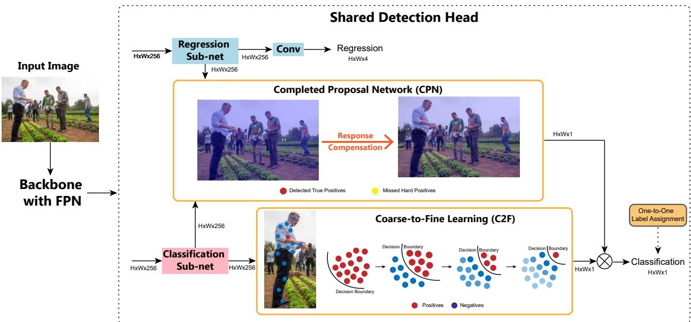
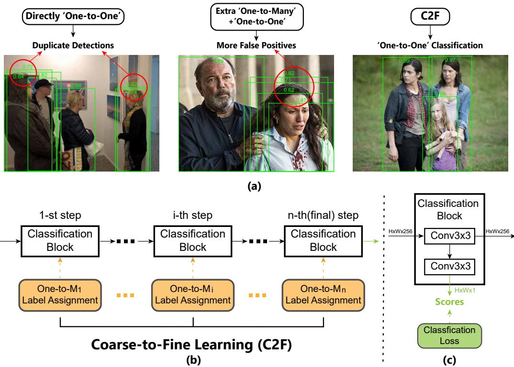
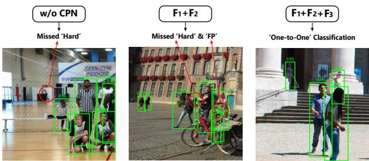
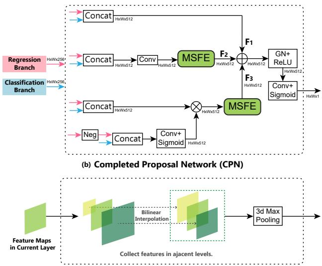

# Optimal Proposal Learning for Deployable End-to-End Pedestrian Detection

Xiaolin Song1 Binghui Chen Pengyu Li Jun-Yan He Biao Wang

Yifeng Geng Xuansong Xie Honggang Zhang1

1Beijing University of Posts and Telecommunications, Beijing, China

{sxlshirley, zhhg}@bupt.edu.cn, chenbinghui@bupt.cn, lipengyu007@gmail.com,

junyanhe1989@gmail.com, wangbiao225@foxmail.com, gengyifeng@gmail.com

## Abstract

End-to-end pedestrian detection focuses on training a pedestrian detection model via discarding the Non-Maximum Suppression (NMS) post-processing. Though a few methods have been explored, most of them still suffer from longer training time and more complex deployment, which cannot be deployed in the actual industrial applications. In this paper, we intend to bridge this gap and propose an Optimal Proposal Learning (OPL) framework for deployable end-to-end pedestrian detection. Specifically, we achieve this goal by using CNN-based light detector and introducing two novel modules, including a Coarse-to-Fine (C2F) learning strategy for proposing precise positive proposalsfor the Ground-Truth (GT) instances by reducing the ambiguity of sample assignment/output in training/testing respectively, and a Completed Proposal Network (CPN)for producing extra information compensation tofurther recall the hard pedestrian samples. Extensive experiments are conducted on CrowdHuman, TJU-Ped and Caltech, and the results show that our proposed OPL method significantly outperforms the competing methods.

## 1. Introduction

Pedestrian detection is a popular computer vision task, which has been widely employed in many applications such as robotics [20], intelligent surveillance [39] and autonomous driving [21]. It follows the conventional object detection pipeline and focuses on the detection of pedestrian. To improve the recall of pedestrians, the current popular pedestrian detectors always generate multiple boundingbox (bbox) proposals for a Ground-Truth (GT) instance during testing. And then the Non-Maximum Suppression (NMS) post-processing technique is used to guarantee the final precision of detection by removing the duplicated bboxes.

However, the crowd density is usually high in some realworld pedestrian detection scenarios, e.g. city centers, railway stations, airports and so on. NMS often performs poorly in these crowd scenes due to the naive duplicate removal of NMS by a single Intersection-over-Union (IoU) threshold. For example, a lower threshold may cause the missed detection of some highly overlapped true positives while a higher threshold could result in more false positives. Some existing works have attempted to make some improvements, e.g. generating more compact bounding boxes [62, 68], soft suppression strategy [1], learning NMS function by extra modules [25] and dynamic suppression threshold [33]. However, these works still cannot achieve end-toend training and easy deployment in actual industrial applications. To this end, a straightforward solution is to establish a fully end-to-end detection pipeline by discarding NMS. PED [30] and [71] have made some attempts by implementing a NMS-free pipeline for pedestrian detection. Both of them are query-based methods. Though achieving higher performances, they still suffer from longer training time, more complex deployment and larger computation costs and cannot be actually deployed on the resource limited devices in industrial applications. Therefore, obtaining a ‘light and sweet’ end-to-end pedestrian detector remains important.

Considering the possibility of deployment in actual industrial applications, performing NMS-free technique upon the one-stage anchor-free CNN-detector, e.g. FCOS [60], is more practical and attractive since it is much easier and efficient to be deployed on resource limited devices with light computational cost and less pre/post-processing. To achieve this goal, the CNN-detector should learn to adaptively and precisely produce true-positive pedestrian proposals at the correct locations as well as avoiding the duplicates. In general object detection, some works [53, 55, 61] propose to replace the commonly used one-to-many label assignment strategy with one-to-one label assignment during training. Specifically, for each GT instance, only one proposal will be assigned as positive sample while other candidate proposals are assigned as negatives.

However, this solution involves two challenges as follows: 1) Problem of ambiguous positive proposals for a larger instance. Specifically, the ideal produced positive proposal should get a much higher confidence score than other near-by candidate proposals for the same GT instance. However, in fact, the extracted features of close-by proposals are similar since they usually share some common pixels of the same instance. It is difficult for the classification branch to find a compact classification decision-boundary to separate them apart. As a result, it confounds the further model optimization and reduces the precision of the output proposals; 2) Poor representation ability for tiny and occluded instances. Specifically, various scales and occlusion patterns of pedestrians involve a wide range of appearance changes. It is difficult to guarantee the confidence outputs from different appearances to be consistent with each other. Hard pedestrian samples with small scales or in heavy occlusion states are difficult to attain high confidence scores as those easy samples. Moreover, one-to-one label assignment only provides fewer positive training samples for learning these hard instances, further increasing the learning difficulty.

To tackle these issues, this paper proposes the Optimal Proposal Learning (OPL) framework for deployable endto-end pedestrian detection. In OPL, we establish the overall framework upon CNN-based detector and then propose a Coarse-to-Fine (C2F) learning strategy for the classification branch so as to mitigate the issue of ambiguous positive proposals. Specifically, it is mainly achieved by progressively decreasing the average number of the positive samples assigned to each GT instances. C2F gives the classification branch chances of exploring the best classification decision-boundary via progressive boundary refinements. Moreover, to ease the problem of poor representation ability for hard instances, we propose a Completed Proposal Network (CPN). CPN is used to provide extra information compensation for the hard proposals and to give them more chances to be detected. Thus, we can get the reliable confidence scores for each proposal by combining the outputs of classification branch and CPN. The main contributions are summarized as follows:

• We propose Optimal Proposal Learning (OPL) framework for deployable end-to-end pedestrian detection.

• We design a Coarse-to-Fine (C2F) learning strategy, which progressively decreases the average number of positive samples assigned to each GT instance during training. C2F aims to give model chances of adaptively producing the precise positive samples without ambiguity.

• We propose a Completed Proposal Network (CPN) that can automatically provide extra compensation for the hard samples with different appearances. CPN is mainly used to further refine the proposal scores such that all pedestrians can be successfully recalled.

Extensive experiments conducted on CrowdHuman [49], TJU-Ped [45] and Caltech [16] demonstrate the superiority of the proposed OPL.

## 2. Related Work

End-to-End Object Detection. Recently, the fully end to-end pipeline has become a new trend in general ob ject detection, where NMS is eliminated from the pipeline and detection results are directly output without any postprocessing. RelationNet [26] is one of the most pioneering works, which builds an object relation module to enhance the instance recognition and learn duplicate removal. Also, DETR [8] firstly utilizes the popular transformer architecture to model the relations between each object and the global image context, where encoder takes a set of learnable object queries as input and decoder directly outputs sparse detection results. However, the dense information interaction manner leads to high computation complexity , slow convergence duration and relatively poor performance on objects of small scales. To alleviate these issues, deformable DETR [77] limits the relatively large attention field in [8] to a small set of sampling locations for each object. What’s more, some other variants [14, 19, 57, 72] of DETR [8] also make some remarkable improvements. To entirely discard the dense manner, Sparse-RCNN [56] makes further explorations. It utilizes a small set of learnable proposals to replace the dense candidate anchor boxes in RPN [48]. Besides, dynamic heads are constructed to enable the interactions between proposal boxes and corre sponding proposal features. Above methods can be generally called query-based methods. Moreover, when considering the efficiency requirements of industrial applications, building a simpler end-to-end object detector without any heuristic self-attention modules becomes an urgent issue. To tackle it, OneNet [55] and DeFCN [61] provide similar solutions, where the conventional one-to-many label assignment strategy in one-stage detectors is replaced by a one-to-one version. Though has been validated to be effective, assigning only one positive training samples for each GT usually makes the classification branch confused due to some ambiguous samples. To handle this dilemma, DeFCN [61] proposes auxiliary loss based on one-to-many label assignment and 3DMF module to facilitate training. These end-to-end detectors have achieved great success in general object detection, but does not consider more for the heavily crowded situation, i.e. Pedestrian Detection.

End-to-End Pedestrian Detection. Pedestrian detection has witness a rapid progress [2, 7, 22, 23, 34, 35, 50, 51, 70] in recent years. One stream of state-of-the-art works focus on occlusion handling [9, 10, 17, 18, 36, 38, 40–42, 44, 46, 52, 54, 59, 63, 64, 69, 73–75]. Almost all of them utilize NMS as a post-processing module to remove duplicated pedestrian proposals. However, NMS usually shows poor performance when crowded density is high. Many existing works [27,33,37,43,47,58,62,68,76] have made some explorations on pedestrian detection in crowded scenes. OR-CNN [68] and Repulsion Loss [62] propose to generate more compact detections by introducing extra penalty terms in loss function, which alleviates the dilemma of NMS. To provide additional clues for duplicate removal, visible box [27] and head box [12, 13] are predicted to serve as additional clues. Adaptive NMS [33] dynamically adjusts the NMS threshold in different regions according to corresponding predicted crowd density. Though potential performance improvements have been achieved, these methods still remain NMS, which prohibit the detection pipeline from end-to-end training. To fundamentally handle challenges in crowded scenes, eliminating NMS and constructing an end-to-end pedestrian detector is a prospective trend. A few existing works [30, 71] have made some efforts on this topic based on query-based detectors in general object detection. To boost their performances on pedestrian detection task, PED [30] proposes several improvement solutions for core modules, and [71] designs a progressive prediction method. However, their pipelines are heuristic and suffer from the drawbacks of query-based methods, which are not optimal choices for actual industrial deployment. In this paper, an Optimal Proposal Learning (OPL) pipeline is established based on SOTA one-stage detector FCOS [60], which can be easily deployed in industry as in DeSL [11].

  
Figure 1. The diagram of the proposed Optimal Proposal Learning (OPL) framework. In OPL, we propose two modules, i.e. Coarse-to Fine (C2F) learning strategy and Completed Proposal Network (CPN), which jointly handle the challenging NMS-free problem. As shown by the toy example of C2F, where positive and negative training samples are represented by red and blue points respectively, in order to make the classification branch only propose a single final positive output for a GT instance, we propose to progressively decrease the training number of positive samples assigned to this GT instance. By doing this, model will adaptively refine the classification decision boundary for learning and output the precise proposal, reducing the ambiguity issue in both training and testing phases. Moreover, in CPN module, we propose to introduce the utilization of the extra response compensation, so as to give the detector chances of recalling mor hard instances. Then, the outputs of C2F and CPN are combined by the hadamard product to serve as the more reliable final scores for classification.

We show that the deployable end-to-end pedestrian detection with high performance and efficiency is feasible.

## 3. Optimal Proposal Learning

In this paper, we propose an Optimal Proposal Learning (OPL) pipeline to solve the end-to-end pedestrian detection problem. We establish the pipeline on top of FCOS [60], which is the widely used one-stage anchor-free detector.

## 3.1. Overview

Pedestrian detection is formulated as a multi-task learning problem of localizing a set of pedestrians by jointly optimizing the classification and bounding box regression subtasks in most well-established one-stage detectors. For an input image of $H \times W \times 3$ , the predictions are confidence scores with size of $N \times 1$ and location coordinates with size of $N \times 4$ , where N denotes the total number of predicted bboxes.

As shown in Fig.1, the entire detection pipeline contains two parts: a backbone network (e.g. ResNet-50 [24]) with FPN [31] that extracts multi-scale feature maps from several pyramid levels, and a detection head with three separate branches that generate the final detection results. For efficiency, feature maps from all levels share the same detection head. The shared detection head has three components, i.e. regression branch, Completed Proposal Network (CPN) and classification branch. The original regression and classifica tion branches in FCOS have the same architecture, i.e. four conv. layers followed by an extra conv. layer for final detection results. For clarity, we call the first four conv. layers classification or regression sub-net. In this paper, the regression branch remains the same as FCOS. Additionally, we propose a Coarse-to-Fine (C2F) learning strategy especially for the classification branch, where the final conv. layer is replaced with a C2F module. Details of the proposed C2F and CPN will be described in Sec.3.2 and Sec.3.3 respectively. Taking an image I as input, a backbone network with FPN outputs the multi-scale feature maps $\varPhi ( I )$ with different resolutions. Given $\varPhi ( I )$ , the detection results ‘Dets’ can be obtained as follows:

$$
\mathrm { D e t s } = \mathcal { H } ( \varPhi ( I ) ) = \{ \mathcal { B } , S \} ,\tag{1}
$$

where the generated $\{ B , S \}$ represents the set of final detected bounding boxes B and corresponding scores S. $\mathcal { H } ( \cdot )$ represents the shared detection head for all feature maps. In our pipeline, $\mathcal { H } ( \cdot )$ contains three elements, i.e. Reg(·), Cls(·) and CPN(·), which denote regression branch, classification branch and the proposed CPN respectively. They can be formulated as:

$$
\begin{array} { r l } & { \mathrm { R e g } ( \phi ( I ) ) = \{ \mathcal { B } , f _ { r e g } \} , \mathrm { C l s } ( \phi ( I ) ) = \{ S _ { c l s } , f _ { c l s } \} , } \\ & { \quad \quad \mathrm { C P N } ( f _ { c l s } , f _ { r e g } ) = S _ { c p n } , \mathcal { S } = S _ { c l s } \cdot S _ { c p n } } \end{array}\tag{2}
$$

Following FCOS, we view all locations in feature maps as training samples. Every training samples will be labeled as positives or negatives according to the label assignment strategy. The OPL pipeline can be trained fully end-to-end by optimizing the following loss function:

$$
L = L _ { r e g } ( \boldsymbol { B } ) + L _ { c l s } ( \boldsymbol { S } ) + L _ { c 2 f } ,\tag{3}
$$

where $L _ { r e g }$ is IoU loss; $L _ { c l s }$ is focal loss [32], in which class labels are generated by one-to-one label assignment strategy as in [61]; $\ b { L _ { c 2 f } }$ is the loss used in C2F strategy and will be introduced in Sec.3.2.

## 3.2. Coarse-to-Fine Learning

The classification sub-task aims to find a decisionboundary to distinguish the pedestrian samples from other background samples. The main challenges come from occlusions, crowd density, different clothes and so on. If NMS is discarded from the detection pipeline, the challenge will further upgrade as the classification branch becomes the only source for distinguishing a single positive proposal from numerous close-by candidates. This new challenge can be described as one-to-one classification, i.e. one instance one proposal. Concretely, in the local area of a GT instance, only one positive proposal is expected to get high confidence score, while the other candidate proposals are expected with relatively lower scores. To this end, a common approach in general object detection [55,61] is to replace the conventional one-to-many label assignment strategy with a one-to-one counterpart, such that the model can be trained with a more strict classification objective. However, this solution cannot solve the problem fundamentally since CNN-based models are likely to extract similar appearance features for near-by candidate proposals especially in salient body parts of the same pedestrian. In other words, the one-to-one classification target has conflicts with the characteristic of CNN. As a result, many duplicate/ambiguous proposals will still be generated regardless of whether this one-to-one label assignment strategy is used. For example, as shown in the left of Fig.2(a), duplicated near-by bounding boxes are produced with high scores. These false positives with high confidence scores will damage the final detection precision. Then the auxiliary loss [61] is proposed to try to help the model mitigate the ambiguity of sample learning by separately learning one-tomany and one-to-one targets. However, it still fails to produce precise bboxes to some extent as shown in the middle column of Fig.2(a), since the combination of one-to-many and one-to-one optimization is too straightforward to guide the model to learn unambiguous knowledge.

Considering the above issues, a more effective learning strategy should be explored to guide the model towards the strict classification targets. Motivated by the popular “Coarse-to-Fine” idea, we attempt to learn “Coarse-to-Fine” feature representations via progressively classification boundary refinement. We present a toy model in Fig.1 to illustrate our idea. Concretely, we first loose the la bel assignment by assigning many positive samples, so as to provide sufficient supervision to make the model learn coarse but rich features. On this basis, we further tighten the assignment rule step by step. Then the classifier can have more chances to explore the best decision-boundary. During this training period, the learned features are getting finer and finer, the final decision-boundary is getting clearer and easier to be found. Specifically, the sequential progressive learning strategy can maintain the optimal optimization direction as any deviation will be corrected by the next more strict classification objectives. As shown in the right of Fig.2(a), only one bounding box is produced for the corresponding GT instance with high scores. We call this proposed learning approach Coarse-to-Fine (C2F) learning strategy.

We realize the C2F pipeline based on several stacked classification blocks, as depicted in Fig.2(b). We first define a basic classification block which consists of two conv. layers as presented in Fig.2(c). The upper conv. layer connects with adjacent blocks and the bottom one generates confidence scores for all proposals that supervised by a classification loss. Specifically, the classification block in 1- st step takes the output of classification sub-nets as input. For the classification block in i-th step, we utilize ‘One-to-$M _ { i } ^ { \mathrm { ~ , ~ } } ( \mathrm { ~ } M _ { i } > 0 \mathrm { ~ ) ~ }$ label assignment strategies, which means averagely assigning $M _ { i }$ positive samples for one GT instance according to the qualities of classification predictions from this block and localization predictions from regression branch simultaneously. The i-th classification block can be optimized as follows:

  
Figure 2. (a) Detection examples by different learning strategies for one-to-one classification. Green solid boxes and decimals denote detected bounding boxes and corresponding confidence scores. Red circle denotes incorrect detections. Boxes with scores larger than 0.1 are presented. (b) The diagram of Coarse-to-Fine (C2F) Learning pipeline $\cdot \mathrm { O n e - t o - } M _ { i } \cdot \ : ( \ M _ { i } \succ 0 \ )$ label assignment strategy averagely assigns Mi positive samples for each GT instance. We maintain $M _ { i - 1 } > M _ { i } ( i = 1 , 2 , . . . , n )$ for the progressive feature learning. (c) The architecture of the basic classification block in C2F. The classification loss is focal loss [32].

$$
L _ { i } = \frac { 1 } { N _ { p o s , i } } \sum _ { x , y } L _ { c l s } ( s _ { x , y , i } , c _ { x , y , i } ^ { * } ) ,\tag{4}
$$

where $L _ { c l s }$ is focal loss in [32]. For each location $( x , y )$ $s _ { x , y , i }$ represents the confidence score predicted by the i-th classification block and $c _ { x , y , i } ^ { * }$ is the corresponding class label assigned by $\cdot _ { \mathrm { O n e - t o - } } \dot { M _ { i } } ^ { \prime }$ rule. If location $( x , y )$ is a positive sample, $c _ { x , y , i } ^ { * } = 1$ , otherwise $c _ { x , y , i } ^ { * } = 0 . \ N _ { p o s , i }$ denotes the total number of positive samples in i-th classification block. The summation is calculated over all locations on the feature maps. Note that only scores predicted by the last classification block participate in inference.

A large M introduces more sufficient positive training samples for relatively coarse feature learning, while a smaller Mi produces positive samples in high quality for feature refinement. To achieve the progressively refinement, we maintain $M _ { i - 1 } > M _ { i } ( i = 1 , 2 , \dots , n )$ . As the features passed through n classification block with more and more strict label assignment, the network can progressively find a classification boundary to meet the training target, i.e. oneto-one classification. Then the overall loss function for the

C2F module is as follows:

$$
L _ { c 2 f } = \sum _ { i = 1 } ^ { n } L _ { i }\tag{5}
$$

## 3.3. Completed Proposal Network

C2F has made an attempt to explore a better classification decision-boundary. However, the learning mechanism of classification branch essentially makes it pay more attention to the salient human parts of pedestrians so as to learn discriminative features. Meanwhile, some hard instances may be neglected since the key parts of them are occluded. Also, some instances with small scales have insufficient resolutions to get distinctive representations. As a result, the model may get poor representation ability for those tiny and occluded hard instances. Moreover, in one-to-one label assignment manner, this problem will get worse due to the less positive training samples. For example, as shown in the left of Fig.3.(a), the left-most hard sample gets a much lower confidence score (lower than 0.1) than right easy ones.

To tackle this problem, we establish a Completed Proposal Network (CPN) to generate more robust and unbiased representations for instances in various difficulty levels and further facilitate one-to-one classification task. To take full use of extracted information, CPN takes features extracted from both classification and regression branch as input. Classification features (denoted as $f _ { c l s } )$ focus on discriminative parts of pedestrians, while regression features (denoted as $f _ { r e g } )$ are learned to locate the full human body with its boundaries. Two streams of features with different training objectives provide rich information from different perspectives, which can help CPN learn more robust representations. Figure 3(b) depicts the whole pipeline of CPN, which contains three flows, namely $F _ { 1 }$ $F _ { 2 }$ and $F _ { 3 }$

  
(a) Detection Examples and Issues under Different Settings

  
(c) Multi-scale Feature Enhancement (MSFE)  
Figure 3. (a) Detection examples under different settings. Green solid boxes and decimals denote detected bounding boxes and corresponding confidence scores. Red circle denotes the incorrect detections. Boxes with scores larger than 0.1 are presented (Scores lower than 0.1 can be seen as a missed instance.). $\mathrm { \Delta ^ { \circ } F P ^ { \bullet } }$ means false positive samples. ’Hard’ means hard examples that are occluded or have small scales. ’One-to-One’ denotes the goal of one-to-one classification. (b) The diagram of Completed Proposal Network (CPN). (c) The architecture of Multi-scale Feature Enhancement (MSFE) in CPN.

Given $f _ { c l s }$ and $f _ { r e g }$ in hand, these three flows deal with them in different ways. $F _ { 1 }$ is a residual flow without any extra operations. It ensures all proposals have chances to participate in the end-to-end optimization process so as to avoid over-fitting issue. $F _ { 1 }$ can be formulated as:

$$
F _ { 1 } = C ( f _ { c l s } , f _ { r e g } ) ,\tag{6}
$$

where C(·) denotes the concatenation operation.

Furthermore, in order to recall more hard instances, we construct $F _ { 2 }$ that leverages local maximum values to enhance the distinction of local regions, which is realized by a new module, i.e. Multi-scale Feature Enhancement (MSFE). As shown in Fig.3(c), MSFE gathers features in adjacent features levels and transforms their resolutions to the same as the current level by the bilinear interpolation operation. Then, these features are passed to a 3d max pooling layer. By this way, the maximum value in a range of nearby region across adjacent levels is searched to update the value in each location. Thus, the responses of missed hard proposals could be increased since their values are likely to be replaced with well-learned ones of high responses. This process can be formulated as:

$$
F _ { 2 } = \mathrm { M S F E } ( \operatorname { C o n v } ( C ( f _ { c l s } , f _ { r e g } ) ) )\tag{7}
$$

Despite $F _ { 2 }$ can provide some response compensation to hard samples, it may bring in two problems as follows: 1) Noise propagation. Local maximum values are not always reliable, especially in the early training stage. Their corresponding proposals may be outliers, false positives, which can be seen as noises. $F _ { 2 }$ may aggravate the errors since it transfers them to other proposals. 2) Missing gradients of hard proposals. Hard proposals may lose the chance to participate in further optimization since essentially it has been replaced by other sample in back-propagation process. We show a detection example in the middle column of Fig.3(a) to illustrate this problem, where some false positives are generated and some hard examples are still missed. To address above problems, $F _ { 3 }$ is designed to provide an additional path especially for hard samples. We have mentioned that classification features are biased to salient human parts. Also, regression features are biased to larger instances since the training targets (i.e. offsets from four boundaries) of large instances are relatively larger than small ones. Motivated by this, We attempt to apply a negation function on $f _ { r e g }$ to reverse it so that the small instances can get higher responses than large ones. However, the background pixels will also get high response, so we introduce the classification feature to alleviate the bad influence by backgrounds. Specifically, we pass the resulted feature to a MSFE so as to further enhance local features. $F _ { 3 }$ can catch hard samples and give additional enhancement way to them. The process can be formulated as:

$$
\begin{array} { c } { f _ { 1 } = C ( f _ { c l s } , f _ { r e g } ) , f _ { 2 } = \sigma ( \mathrm { C o n v } ( C ( \mathrm { N e g } ( f _ { r e g } ) , f _ { c l s } ) ) } \\ { F _ { 3 } = \mathrm { M S F E } ( f _ { 1 } \cdot f _ { 2 } ) , \qquad ( \frac { \mathrm { 0 } } { \mathrm { 0 } } } \end{array}\tag{8}
$$

where $\sigma ( \cdot )$ is the Sigmoid function and $\mathrm { N e g } ( \cdot )$ is the negation function. Finally, the output scores of CPN can be obtained by:

$$
S _ { c p n } = \sigma ( \mathbf { C o n v ( R e L U ( G N } ( F _ { 1 } + F _ { 2 } + F _ { 3 } ) ) ) ) ,\tag{9}
$$

where three flows are combined by an element-wise addition and several extra operations (i.e. Group Normalization, ReLU function, a conv. layer and Sigmoid function) to get

final scores for all proposals, which serve as auxiliary scores for one-to-one classification. By this way, we can get ideal detections as shown in the third column of Fig.3(a).

## 4. Experiments

Datasets: We evaluate our methods on three of the largest pedestrian detection datasets, i.e. CrowdHuman [49], TJU-Ped [45] and Caltech [16]. CrowdHuman is a challenging dataset with about 23 persons per image involving various complex and crowded scenes. It contains 15,000 training images and 4,370 validation images. TJU-Ped is a recently released diverse high-resolution dataset including two sets, i.e. TJU-Ped-campus (55,088 images with 329,623 instances) and TJU-Ped-traffic (20,338 images with 43,618 instances). Caltech is a popular dataset with approximately 10 hours of video, where the train and test sets contain 42,782 and 4,024 images respectively.

Evaluation Settings: Following the literature of pedestrian detection, we consider mMR as the main evaluation metric, which is the log-average miss rate over False Positives Per Image (FPPI) ranging in $[ 1 0 ^ { - 2 } , 1 0 ^ { 0 } ]$ The lower mMR is better. In some experiments, Average Precision (AP) and Recall are included for reference. What’s more, some subsets are used for evaluation, i.e. the reasonable set (R) with visibility in [0.65,1], the reasonable small set (RS) with height in [50,75] and visibility in [0.65,1], the reasonable heavy occlusion set (HO) with visibility in [0.2,0.65], R+HO and the all set (A). All subsets except RS contain pedestrians with height larger than 50. In all presented tables, best results are in bold.

Training Details: Our default backbone network is ResNet-50 [24] pre-trained on ImageNet [15] unless otherwise specified. For experiments on CrowdHuman and Caltech, we utlize 4 GPUs (Tesla-V100) with 2 images per GPU. For TJU-Ped, we utilize 8 GPUs (Tesla-V100) with 4 images per GPU. Note that the concrete label assignment rule is not the main issue of this paper. We exploit the oneto-one and one-to-many label assignment strategy in [61].

## 4.1. Comparisons with State-of-the-arts

Comparisons on Crowdhuman: On CrowdHuman dataset, our OPL significantly outperforms other state-ofthe-art NMS-based and NMS-free detectors as shown in Tab.1. Specifically, our OPL achieves 0.7% mMR and 1.5% AP and 3.7% Recall absolute gains over the most related NMS-free pedestrian detector PED [30]. For fair comparisons, we only consider the results of PED [30] with no usage of visible boxes.

Comparisons on TJU-Ped: We compare our OPL with state-of-the-arts on TJU-Ped-campus and TJU-Ped-traffic as presented in Tab.2 and Tab.3 respectively. It can be seen that our OPL achieves the consistent best performance on all subsets. Specifically, results on RS and HO can reflect our superior performance for hard instances.

Table 1. Performance comparisons on CrowdHuman val set. ’NMS’ column indicates whether the method uses NMS.
<table><tr><td rowspan=1 colspan=1>Methods</td><td rowspan=1 colspan=1>NMS</td><td rowspan=1 colspan=1>mMR↓  AP  Recall</td></tr><tr><td rowspan=1 colspan=1>Faster-RCNN [48]</td><td rowspan=1 colspan=1>√</td><td rowspan=1 colspan=1>50.4   85.0  90.2</td></tr><tr><td rowspan=1 colspan=1>RetinaNet [32]</td><td rowspan=1 colspan=1>√</td><td rowspan=1 colspan=1>57.6   81.7  88.6</td></tr><tr><td rowspan=1 colspan=1>FCOS [60]</td><td rowspan=1 colspan=1>√</td><td rowspan=1 colspan=1>54.9   86.1  94.2</td></tr><tr><td rowspan=2 colspan=1>ATSS [67]AdaptiveNMS [33]</td><td rowspan=1 colspan=1>√</td><td rowspan=1 colspan=1>49.7   87.2  94.0</td></tr><tr><td rowspan=1 colspan=1>√</td><td rowspan=1 colspan=1>49.7   84.7  91.3</td></tr><tr><td rowspan=4 colspan=1>DETR [8]Deformable DETR [77]OneNet [55]DeFCN [61]</td><td rowspan=1 colspan=1>X</td><td rowspan=1 colspan=1>80.1   72.8  82.7</td></tr><tr><td rowspan=1 colspan=1>×</td><td rowspan=4 colspan=1>54.0   86.7  92.548.2   90.7  97.648.9   89.1  96.545.6   89.5  94.0</td></tr><tr><td rowspan=1 colspan=1>X</td></tr><tr><td rowspan=1 colspan=1>×</td></tr><tr><td rowspan=1 colspan=1>PED [30]</td><td rowspan=1 colspan=1>X</td></tr><tr><td rowspan=1 colspan=1>OPL (ours)</td><td rowspan=1 colspan=1>X</td><td rowspan=1 colspan=1>44.9   91.0  97.7</td></tr></table>

Table 2. Performance comparisons on TJU-Ped-campus. ’NMS column indicates whether the method uses NMS.
<table><tr><td>Methods</td><td>NMS</td><td>R↓</td><td>RS↓</td><td>HO↓</td><td>R+HO↓</td><td>A↓</td></tr><tr><td>FCOS [60]</td><td>√</td><td>31.9</td><td>69.0</td><td>81.3</td><td>39.4</td><td>41.6</td></tr><tr><td>DeFCN [61]</td><td>X</td><td>32.1</td><td>62.7</td><td>72.7</td><td>39.9</td><td>42.1</td></tr><tr><td>OPL (Ours)</td><td>X</td><td>31.5</td><td>61.7</td><td>72.4</td><td>39.3</td><td>41.5</td></tr></table>

Table 3. Performance comparisons on TJU-Ped-traffic. ’NMS column indicates whether the method uses NMS.
<table><tr><td>Methods</td><td>NMS</td><td>R↓</td><td>RS↓ HO↓</td><td>R+HO↓</td><td>A↓</td></tr><tr><td>FCOS [60]</td><td>√</td><td>24.4</td><td>37.4 63.7</td><td>28.9</td><td>40.0</td></tr><tr><td>DeFCN [61]</td><td>X</td><td>24.2</td><td>29.1 62.8</td><td>29.0</td><td>39.7</td></tr><tr><td>OPL (Ours)</td><td>X</td><td>23.4</td><td>28.8 62.7</td><td>28.0</td><td>38.7</td></tr></table>

Comparisons on Caltech: The proposed OPL is extensively compared with the state-of-the-arts on Caltech test set. As shown in Tab.4, our OPL achieves the best performance on all subsets under different occlusion levels, which validates its great robustness of handling samples under different situations.

Table 4. Performance comparisons on Caltech test set. ’NMS column indicates whether the method uses NMS.
<table><tr><td>Method</td><td>NMS</td><td>R↓</td><td>HO↓</td><td>R+HO↓</td></tr><tr><td>ComACT-Deep [5]</td><td>√ √</td><td>11.75</td><td>65.78</td><td>24.61</td></tr><tr><td>DeepParts [59]</td><td></td><td>11.89</td><td>60.42</td><td>22.79</td></tr><tr><td>MCF [6]</td><td>√ √</td><td>10.40</td><td>66.69</td><td>22.85</td></tr><tr><td>FasterRCNN+ATT [69]</td><td>√</td><td>10.33</td><td>45.18</td><td>18.21</td></tr><tr><td>MS-CNN [4]</td><td>√</td><td>9.95</td><td>59.94</td><td>21.53</td></tr><tr><td>RPN+BF [65]</td><td>√</td><td>9.58</td><td>74.36</td><td>24.01</td></tr><tr><td>SA-FRCNN [28]</td><td>√</td><td>9.68</td><td>64.35</td><td>21.92</td></tr><tr><td>SDS-RCNN [3]</td><td>√</td><td>7.36</td><td>58.55</td><td>19.72</td></tr><tr><td>FasterRCNN [66]</td><td>√</td><td>9.18</td><td>57.58</td><td>20.03</td></tr><tr><td>GDFL [29]</td><td></td><td>7.85</td><td>43.18</td><td>15.64</td></tr><tr><td>Bi-Box [75]</td><td>√</td><td>7.61</td><td>44.40</td><td>16.06</td></tr><tr><td>MGAN [46]</td><td>√</td><td>6.83</td><td>38.16</td><td>13.84</td></tr><tr><td>FCOS [60]</td><td>√</td><td>6.9</td><td>34.1</td><td>14.2</td></tr><tr><td>DeFCN [61]</td><td>X</td><td>7.1</td><td>34.4</td><td>14.3</td></tr><tr><td>OPL (ours)</td><td>×</td><td>5.2</td><td>30.1</td><td>11.7</td></tr></table>

## 4.2. Ablation Study on CrowdHuman

In this section, we conduct an ablation analysis on CrowdHuman dataset. All models are trained on Crowd-Human training set and evaluated on val set.

Components of OPL: To analyze the effectiveness of our proposed C2F and CPN, we perform ablation study on each component. Table 5 summarizes the results. We first train a baseline detector without C2F and CPN, which directly applies one-to-one label assignment on FCOS [60] without the center-ness branch and NMS post-processing. Based on it, we add the C2F module and yield 2.1% mMR absolute gain. Also, we build CPN on top of the baseline detector and combine the outputs of original classification branch and CPN to get final scores for all proposals. It can be seen that CPN can obtain 2.3% mMR and 0.3% AP gains over the baseline. Finally, the entire OPL pipeline with both C2F and CPN achieves a significant improvement over the baseline, i.e. 4.4% mMR, 0.7% AP, which confirms the effectiveness of our proposed OPL.

Table 5. Effects of components of OPL on CrowdHuman val set.
<table><tr><td>C2F</td><td>CPN</td><td>mMR↓</td><td>AP</td><td>Recall</td></tr><tr><td rowspan="3"> $\checkmark$ </td><td rowspan="3"></td><td>49.3</td><td>90.3</td><td>97.8</td></tr><tr><td>47.2</td><td>90.3</td><td>97.7</td></tr><tr><td>47.0</td><td>90.6</td><td>97.7</td></tr><tr><td>√</td><td> $\checkmark$ </td><td>44.9</td><td>91.0</td><td>97.7</td></tr></table>

Table 6. Ablation study of different architectures of C2F on CrowdHuman val set, where n denotes the total number of learning steps and the set $M = \{ M _ { 1 } , \ldots , M _ { n } \}$ decides the ‘One-to-$M _ { i } '$ label assignment strategies for corresponding steps.
<table><tr><td rowspan=1 colspan=1>Method</td><td rowspan=1 colspan=1>n</td><td rowspan=1 colspan=1> $\overline { { \{ M _ { 1 } , \ldots , M _ { n } \} } }$ </td><td rowspan=1 colspan=1>mMR↓</td></tr><tr><td rowspan=1 colspan=1>Baseline</td><td rowspan=1 colspan=1>-</td><td rowspan=1 colspan=1>-</td><td rowspan=1 colspan=1>47.0</td></tr><tr><td rowspan=1 colspan=1>C2F-1step</td><td rowspan=1 colspan=1>111</td><td rowspan=1 colspan=1>{4}{9}{16}</td><td rowspan=1 colspan=1>46.145.846.4</td></tr><tr><td rowspan=1 colspan=1>C2F-2step</td><td rowspan=1 colspan=1>222</td><td rowspan=1 colspan=1>{16,9}{9,4}{16,4}</td><td rowspan=1 colspan=1>45.845.744.9</td></tr><tr><td rowspan=1 colspan=1>C2F-3step</td><td rowspan=1 colspan=1>3</td><td rowspan=1 colspan=1>{16,9,4}</td><td rowspan=1 colspan=1>45.3</td></tr></table>

Architectures of C2F: Table 6 studies the different architectures of C2F. The detector with CPN alone serves as the baseline, whose result is also shown in the fourth line of Tab.5. It can be seen our proposed C2F with multiple learning steps yields remarkable improvements over the baseline, which indicates that our progressive learning strategy can help the model explore the best classification decision-boundary during the process of supervised sequential refinements. Specifically, C2F-2step with M = {16, 4} obtains the best performance. This demonstrates that the 2-step refinement is enough for decision-boundary exploration and a ’steep’ label assignment transformation can provide more obvious clues for optimization direction.

Components of CPN: In Tab.7, we perform ablations on components of CPN. The detector with C2F alone in the third line of Tab.5 is reused as the baseline here. As a residual flow, $F _ { 1 }$ can raise 0.2% mMR gain, which indicates that the combined information from both regression and classification branches can benefit the one-to-one classification, even though obtained by the simplest concatenation. On this basis, we add $F _ { 2 }$ and obtain a further 1.0% mMR gain. This shows that the local maximum values can help amend the local responses to some extent. Based on it, $F _ { 3 }$ yields another 1.1% mMR gain, which reflects that the additional response compensation for hard samples can effectively improve the miss rate. In general, the entire version of CPN outperforms baseline significantly by 2.3% mMR.

Table 7. Ablations of compo- Table 8. Experiments with differnents in CPN on CrowdHuman ent backbones on CrowdHuman val set. val set.
<table><tr><td> $\overline { { F _ { 1 } } }$ </td><td> $\overline { { F _ { 2 } } }$ </td><td> $F _ { 3 }$ </td><td>mMR↓</td></tr><tr><td> $\checkmark$ </td><td></td><td></td><td>47.2 47.0</td></tr><tr><td> $\checkmark$ </td><td></td><td></td><td></td></tr><tr><td></td><td> $\checkmark$ </td><td></td><td>46.0</td></tr><tr><td> $\checkmark$ </td><td> $\checkmark$ </td><td> $\checkmark$ </td><td>44.9</td></tr></table>

<table><tr><td rowspan=1 colspan=1>Backbone</td><td rowspan=1 colspan=1>mMR↓</td></tr><tr><td rowspan=1 colspan=1>ResNet-50</td><td rowspan=1 colspan=1>44.9</td></tr><tr><td rowspan=1 colspan=1>ResNet-101</td><td rowspan=1 colspan=1>44.7</td></tr></table>

Larger Backbone: To further demonstrate the effectiveness and robustness of OPL, we conduct an experiment with a larger backbone, i.e. ResNet-101 [24], which is also pretrained on ImageNet [15]. Table 8 shows the result comparison. We can find that the performance gain obtained by using a larger backbone is not that remarkable as expected, i.e. 0.2% mMR. This phenomenon illustrates that there is no need to extract richer features from a larger backbone network as our proposed OPL can address the end-toend pedestrian detection task well based on a smaller backbone network with less computation cost. In general, our OPL achieves an excellent balance between cost and performance, which serves as a deployable solution for actual applications.

## 5. Conclusion

This paper has presented an Optimal Proposal Learning (OPL) detection pipeline for deployable end-to-end pedestrian detection. To reduce the classification ambiguity, a Coarse-to-Fine (C2F) learning strategy is designed to progressively learn precise positive proposals via sequential classification decision-boundary refinement. To further improve the detection performance of hard pedestrian samples, we propose a Completed Proposal Network (CPN) to provide extra information compensation for hard proposals. Extensive experiments have validated the effectiveness of our proposed methods. We hope that our OPL can serve as a strong alternative of existing mainstream pedestrian detectors in actual industrial applications. The core idea of OPL might also be applied on pipelines for other detection tasks or benefit other instance-level tasks. We will make more explorations in future work.

Acknowledgement. This work was funded by National Natural Science Foundation of China under Grant No.62076034. We hereby give specifical thanks to Alibaba Group for their contribution to this paper.

## References

[1] Navaneeth Bodla, Bharat Singh, Rama Chellappa, and Larry S Davis. Soft-nms–improving object detection with one line of code. In ICCV, 2017. 1

[2] Garrick Brazil and Xiaoming Liu. Pedestrian detection with autoregressive network phases. In CVPR, 2019. 2

[3] Garrick Brazil, Xi Yin, and Xiaoming Liu. Illuminating pedestrians via simultaneous detection & segmentation. In ICCV, 2017. 7

[4] Zhaowei Cai, Quanfu Fan, Rogerio Feris, and Nuno Vasconcelos. A unified multi-scale deep convolutional neural network for fast object detection. In ECCV, 2016. 7

[5] Zhaowei Cai, Mohammad Saberian, and Nuno Vasconcelos. Learning complexity-aware cascades for deep pedestrian detection. In ICCV, 2015. 7

[6] Jiale Cao, Yanwei Pang, and Xuelong Li. Learning multilayer channel features for pedestrian detection. TIP, 26(7):3210–3220, 2017. 7

[7] Jiale Cao, Yanwei Pang, Jin Xie, Fahad Shahbaz Khan, and Ling Shao. From handcrafted to deep features for pedestrian detection: a survey. PAMI, 2021. 2

[8] Nicolas Carion, Francisco Massa, Gabriel Synnaeve, Nicolas Usunier, Alexander Kirillov, and Sergey Zagoruyko. End-toend object detection with transformers. In ECCV, 2020. 2, 7

[9] Binghui Chen and Weihong Deng. Hybrid-attention based decoupled metric learning for zero-shot image retrieval. In Proceedings of the IEEE/CVF conference on computer vision and pattern recognition, pages 2750–2759, 2019. 2

[10] Binghui Chen, Weihong Deng, and Jiani Hu. Mixed highorder attention network for person re-identification. In Proceedings ofthe IEEE/CVF international conference on computer vision, pages 371–381, 2019. 2

[11] Binghui Chen, Pengyu Li, Xiang Chen, Biao Wang, Lei Zhang, and Xian-Sheng Hua. Dense learning based semisupervised object detection. In Proceedings ofthe IEEE/CVF Conference on Computer Vision and Pattern Recognition, pages 4815–4824, 2022. 3

[12] Cheng Chi, Shifeng Zhang, Junliang Xing, Zhen Lei, Stan Z Li, and Xudong Zou. Pedhunter: Occlusion robust pedestrian detector in crowded scenes. In AAAI, 2020. 3

[13] Cheng Chi, Shifeng Zhang, Junliang Xing, Zhen Lei, Stan Z Li, and Xudong Zou. Relational learning for joint head and human detection. In AAAI, 2020. 3

[14] Zhigang Dai, Bolun Cai, Yugeng Lin, and Junying Chen. Up-detr: Unsupervised pre-training for object detection with transformers. In CVPR, 2021. 2

[15] Jia Deng, Wei Dong, Richard Socher, Li-Jia Li, Kai Li, and Li Fei-Fei. Imagenet: A large-scale hierarchical image database. In CVPR, 2009. 7, 8

[16] Piotr Dollar, Christian Wojek, Bernt Schiele, and Pietro Perona. Pedestrian detection: An evaluation of the state of the art. PAMI, 34(4):743–761, 2011. 2, 7

[17] Genquan Duan, Haizhou Ai, and Shihong Lao. A structural filter approach to human detection. In ECCV, 2010. 2

[18] Markus Enzweiler, Angela Eigenstetter, Bernt Schiele, and Dariu M Gavrila. Multi-cue pedestrian classification with partial occlusion handling. In CVPR, 2010. 2

[19] Peng Gao, Minghang Zheng, Xiaogang Wang, Jifeng Dai, and Hongsheng Li. Fast convergence of detr with spatially modulated co-attention. In ICCV, 2021. 2

[20] Andreas Geiger, Philip Lenz, Christoph Stiller, and Raquel Urtasun. Vision meets robotics: The kitti dataset. The International Journal ofRobotics Research, 32, 2013. 1

[21] Andreas Geiger, Philip Lenz, and Raquel Urtasun. Are we ready for autonomous driving? the kitti vision benchmark suite. In CVPR, 2012. 1

[22] Irtiza Hasan, Shengcai Liao, Jinpeng Li, Saad Ullah Akram, and Ling Shao. Generalizable pedestrian detection: The elephant in the room. In CVPR, 2021. 2

[23] Irtiza Hasan, Shengcai Liao, Jinpeng Li, Saad Ullah Akram, and Ling Shao. Pedestrian detection: Domain generalization, cnns, transformers and beyond. arXiv preprint arXiv:2201.03176, 2022. 2

[24] Kaiming He, Xiangyu Zhang, Shaoqing Ren, and Jian Sun. Deep residual learning for image recognition. In CVPR, 2016. 3, 7, 8

[25] Jan Hosang, Rodrigo Benenson, and Bernt Schiele. Learning non-maximum suppression. In CVPR, 2017. 1

[26] Han Hu, Jiayuan Gu, Zheng Zhang, Jifeng Dai, and Yichen Wei. Relation networks for object detection. In CVPR, 2018. 2

[27] Xin Huang, Zheng Ge, Zequn Jie, and Osamu Yoshie. Nms by representative region: Towards crowded pedestrian detection by proposal pairing. In CVPR, 2020. 3

[28] Jianan Li, Xiaodan Liang, ShengMei Shen, Tingfa Xu, Jiashi Feng, and Shuicheng Yan. Scale-aware fast r-cnn for pedestrian detection. TMM, 20(4):985–996, 2017. 7

[29] Chunze Lin, Jiwen Lu, Gang Wang, and Jie Zhou. Graininess-aware deep feature learning for pedestrian detection. In ECCV, 2018. 7

[30] Matthieu Lin, Chuming Li, Xingyuan Bu, Ming Sun, Chen Lin, Junjie Yan, Wanli Ouyang, and Zhidong Deng. Detr for crowd pedestrian detection. arXiv preprint arXiv:2012.06785, 2020. 1, 3, 7

[31] Tsung-Yi Lin, Piotr Dollar, Ross Girshick, Kaiming He,´ Bharath Hariharan, and Serge Belongie. Feature pyramid networks for object detection. In CVPR, 2017. 3

[32] Tsung-Yi Lin, Priya Goyal, Ross Girshick, Kaiming He, and Piotr Dollar. Focal loss for dense object detection. In´ ICCV, 2017. 4, 5, 7

[33] Songtao Liu, Di Huang, and Yunhong Wang. Adaptive nms: Refining pedestrian detection in a crowd. In CVPR, 2019. 1, 3, 7

[34] Wei Liu, Shengcai Liao, Weidong Hu, Xuezhi Liang, and Xiao Chen. Learning efficient single-stage pedestrian detectors by asymptotic localization fitting. In ECCV, 2018. 2

[35] Wei Liu, Shengcai Liao, Weiqiang Ren, Weidong Hu, and Yinan Yu. High-level semantic feature detection: A new perspective for pedestrian detection. In CVPR, 2019. 2

[36] Yan Luo, Chongyang Zhang, Muming Zhao, Hao Zhou, and Jun Sun. Where, what, whether: Multi-modal learning meets pedestrian detection. In CVPR, 2020. 2

[37] Zekun Luo, Zheng Fang, Sixiao Zheng, Yabiao Wang, and Yanwei Fu. Nms-loss: learning with non-maximum suppression for crowded pedestrian detection. In Proceedings of the 2021 International Conference on Multimedia Retrieval, 2021. 3

[38] M. Mathias, R. Benenson, R. Timofte, and L. V. Gool. Handling occlusions with franken-classifiers. In ICCV, 2013. 2

[39] Jacinto C Nascimento and Jorge S Marques. Performance evaluation of object detection algorithms for video surveillance. TMM, 8, 2006. 1

[40] Junhyug Noh, Soochan Lee, Beomsu Kim, and Gunhee Kim. Improving occlusion and hard negative handling for singlestage pedestrian detectors. In CVPR, 2018. 2

[41] W. Ouyang and X. Wang. A discriminative deep mode for pedestrian detection with occlusion handling. In CVPR, 2012. 2

[42] W. Ouyang and X. Wang. Joint deep learning for pedestrian detection. In ICCV, 2013. 2

[43] Wanli Ouyang and Xiaogang Wang. Single-pedestrian detection aided by multi-pedestrian detection. In CVPR, 2013. 3

[44] W. Ouyang, X. Zeng, and X. Wang. Modeling mutual visibility relationship in pedestrian detection. In CVPR, 2013. 2

[45] Yanwei Pang, Jiale Cao, Yazhao Li, Jin Xie, Hanqing Sun, and Jinfeng Gong. Tju-dhd: A diverse high-resolution dataset for object detection. TIP, 2020. 2, 7

[46] Yanwei Pang, Jin Xie, Muhammad Haris Khan, Rao Muhammad Anwer, Fahad Shahbaz Khan, and Ling Shao. Mask-guided attention network for occluded pedestrian detection. In ICCV, 2019. 2, 7

[47] Bojan Pepikj, Michael Stark, Peter Gehler, and Bernt Schiele. Occlusion patterns for object class detection. In CVPR, 2013. 3

[48] Shaoqing Ren, Kaiming He, Ross Girshick, and Jian Sun. Faster r-cnn: Towards real-time object detection with region proposal networks. NIPS, 2015. 2, 7

[49] Shuai Shao, Zijian Zhao, Boxun Li, Tete Xiao, Gang Yu, Xiangyu Zhang, and Jian Sun. Crowdhuman: A benchmark for detecting human in a crowd. arXiv preprint arXiv:1805.00123, 2018. 2, 7

[50] Vinay D Shet, Jan Neumann, Visvanathan Ramesh, and Larry S Davis. Bilattice-based logical reasoning for human detection. In CVPR, 2007. 2

[51] Tao Song, Leiyu Sun, Di Xie, Haiming Sun, and Shiliang Pu. Small-scale pedestrian detection based on topological line localization and temporal feature aggregation. In ECCV, 2018. 2

[52] Xiaolin Song, Binghui Chen, Pengyu Li, Biao Wang, and Honggang Zhang. PRNet++: Learning towards generalized occluded pedestrian detection via progressive refinement network. Neurocomputing, 482:98–115, 2022. 2

[53] Xiaolin Song, Binghui Chen, Pengyu Li, Biao Wang, and Honggang Zhang. End-to-end object detection with enhanced positive sample filter. Applied Sciences, 13(3):1232, 2023. 1

[54] Xiaolin Song, Kaili Zhao, Wen-Sheng Chu, Honggang Zhang, and Jun Guo. Progressive refinement network for occluded pedestrian detection. In ECCV, 2020. 2

[55] Peize Sun, Yi Jiang, Enze Xie, Wenqi Shao, Zehuan Yuan, Changhu Wang, and Ping Luo. What makes for end-to-end object detection? In International Conference on Machine Learning, 2021. 1, 2, 4, 7

[56] Peize Sun, Rufeng Zhang, Yi Jiang, Tao Kong, Chenfeng Xu, Wei Zhan, Masayoshi Tomizuka, Lei Li, Zehuan Yuan, Changhu Wang, et al. Sparse r-cnn: End-to-end object detection with learnable proposals. In CVPR, 2021. 2

[57] Zhiqing Sun, Shengcao Cao, Yiming Yang, and Kris M Kitani. Rethinking transformer-based set prediction for object detection. In ICCV, 2021. 2

[58] Siyu Tang, M. Andriluka, and B. Schiele. Detection and tracking of occluded people. IJCV, 110(1):58–69, 2014. 3

[59] Y. Tian, P. Luo, X. Wang, and X. Tang. Deep learning strong parts for pedestrian detection. In ICCV, 2015. 2, 7

[60] Zhi Tian, Chunhua Shen, Hao Chen, and Tong He. Fcos: Fully convolutional one-stage object detection. In ICCV, 2019. 1, 3, 7, 8

[61] Jianfeng Wang, Lin Song, Zeming Li, Hongbin Sun, Jian Sun, and Nanning Zheng. End-to-end object detection with fully convolutional network. In CVPR, 2021. 1, 2, 4, 7

[62] X. Wang, T. Xiao, Y. Jiang, S. Shao, J. Sun, and C. Shen. Repulsion loss: Detecting pedestrians in a crowd. In CVPR, 2018. 1, 3

[63] Bo Wu and Ramakant Nevatia. Detection of multiple, partially occluded humans in a single image by bayesian combination of edgelet part detectors. In ICCV, 2005. 2

[64] Jialian Wu, Chunluan Zhou, Ming Yang, Qian Zhang, Yuan Li, and Junsong Yuan. Temporal-context enhanced detection of heavily occluded pedestrians. In CVPR, 2020. 2

[65] Liliang Zhang, Liang Lin, Xiaodan Liang, and Kaiming He. Is faster r-cnn doing well for pedestrian detection? In ECCV, 2016. 7

[66] Shanshan Zhang, Rodrigo Benenson, and Bernt Schiele. Citypersons: A diverse dataset for pedestrian detection. In CVPR, 2017. 7

[67] Shifeng Zhang, Cheng Chi, Yongqiang Yao, Zhen Lei, and Stan Z Li. Bridging the gap between anchor-based and anchor-free detection via adaptive training sample selection. In CVPR, 2020. 7

[68] Shifeng Zhang, Longyin Wen, Xiao Bian, Zhen Lei, and Stan Z. Li. Occlusion-aware R-CNN: Detecting pedestrians in a crowd. In ECCV, 2018. 1, 3

[69] Shanshan Zhang, Jian Yang, and Bernt Schiele. Occluded pedestrian detection through guided attention in CNNs. In CVPR, 2018. 2, 7

[70] Yuang Zhang, Huanyu He, Jianguo Li, Yuxi Li, John See, and Weiyao Lin. Variational pedestrian detection. In CVPR, 2021. 2

[71] Anlin Zheng, Yuang Zhang, Xiangyu Zhang, Xiaojuan Qi, and Jian Sun. Progressive end-to-end object detection in crowded scenes. In CVPR, 2022. 1, 3

[72] Minghang Zheng, Peng Gao, Renrui Zhang, Kunchang Li, Xiaogang Wang, Hongsheng Li, and Hao Dong. End-to-end

object detection with adaptive clustering transformer. arXiv preprint arXiv:2011.09315, 2020. 2

[73] Chunluan Zhou, Ming Yang, and Junsong Yuan. Discriminative feature transformation for occluded pedestrian detection. In ICCV, 2019. 2

[74] Chunluan Zhou and Junsong Yuan. Multi-label learning of part detectors for heavily occluded pedestrian detection. In ICCV, 2017. 2

[75] Chunluan Zhou and Junsong Yuan. Bi-box regression for pedestrian detection and occlusion estimation. In ECCV, 2018. 2, 7

[76] Penghao Zhou, Chong Zhou, Pai Peng, Junlong Du, Xing Sun, Xiaowei Guo, and Feiyue Huang. Noh-nms: Improving pedestrian detection by nearby objects hallucination. In ACMMM, 2020. 3

[77] Xizhou Zhu, Weijie Su, Lewei Lu, Bin Li, Xiaogang Wang, and Jifeng Dai. Deformable DETR: Deformable transformers for end-to-end object detection. In ICLR, 2021. 2, 7