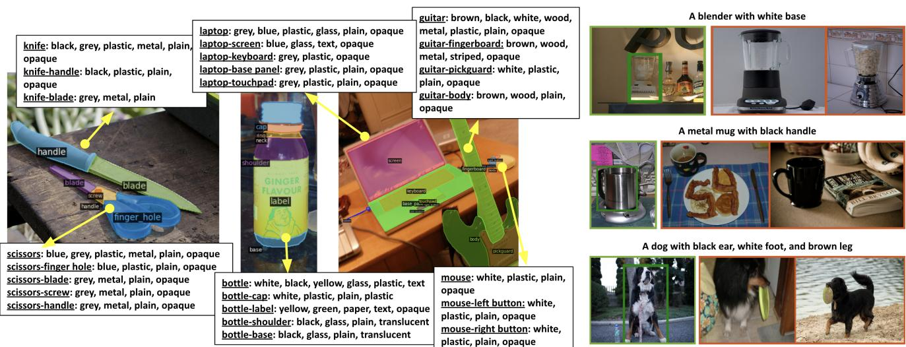
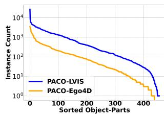
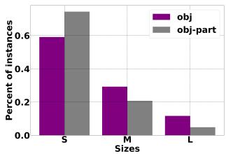
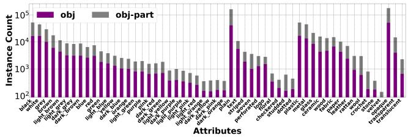
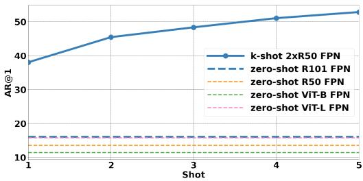

# PACO: Parts and Attributes of Common Objects

Vignesh Ramanathan∗1 Anmol Kalia∗1 Vladan Petrovic∗1 Yi Wen1 Baixue Zheng1 Baishan Guo1 Rui Wang1 Aaron Marquez1 Rama Kovvuri1 Abhishek Kadian1 Amir Mousavi2† Yiwen Song1 Abhimanyu Dubey1 Dhruv Mahajan1 1Meta AI 2Simon Fraser University

  
Figure 1. (left) PACO includes objects with object masks, object attributes, part masks, and part attributes. (right) Object instance queries composed of object and part attributes are shown with corresponding positive images in green and negative images in red.

## Abstract

Object models are gradually progressing from predicting just category labels to providing detailed descriptions of object instances. This motivates the need for large datasets which go beyond traditional object masks and provide richer annotations such as part masks and attributes. Hence, we introduce PACO: Parts and Attributes of Common Objects. It spans 75 object categories, 456 objectpart categories and 55 attributes across image (LVIS) and video (Ego4D) datasets. We provide 641K part masks annotated across 260K object boxes, with roughly half of them exhaustively annotated with attributes as well. We design evaluation metrics and provide benchmark results for three tasks on the dataset: part mask segmentation, object and part attribute prediction and zero-shot instance detection. Dataset, models, and code are open-sourced at https://github.com/facebookresearch/paco.

## 1. Introduction

Today, tasks requiring fine-grained understanding of objects like open vocabulary detection [8, 14, 20, 51], GQA [17], and referring expressions [3, 21, 32] are gaining importance besides traditional object detection. Representing objects through category labels is no longer sufficient. A complete object description requires more fine-grained properties like object parts and their attributes, as shown by the queries in Fig. 1.

Currently, there are no large benchmark datasets for common objects with joint annotation of part masks, object attributes and part attributes (Fig. 1). Such datasets are found only in specific domains like clothing [18, 47], birds [42] and pedestrian description [25]. Current datasets with part masks for common objects [2, 15, 50] are limited in number of object instances with parts (59K for ADE20K [2] Tab. 1). On the attributes side, there exists large-scale datasets like Visual Genome [23], VAW [35] and COCO-attributes [34] that provide object-level attributes.

However, none have part-level attribute annotations.

In this work, we enable research for the joint task of object detection, part segmentation, and attribute recognition, by designing a new dataset: PACO. With video object description becoming more widely studied as well [19], we construct both an image dataset (sourced from LVIS [13]) and a video dataset (sourced from Ego4D [11]) as part of PACO. Overall, PACO has 641K part masks annotated in 77K images for 260K object instances across 75 object classes and 456 object-specific part classes. It has an order of magnitude more objects with parts, compared to recently introduced PartImageNet dataset [15]. PACO further provides annotations for 55 different attributes for both objects and parts. We conducted user studies and multi-round manual curation to identify high-quality vocabulary of parts and attributes.

Along with the dataset, we provide three associated benchmark tasks to help the community evaluate its progress over time. These tasks include: a) part segmentation, b) attribute detection for objects and object-parts and c) zero-shot instance detection with part/attribute queries. The first two tasks are aimed at benchmarking stand alone capabilities of part and attribute understanding. The third task evaluates models directly for a downstream task.

While building the dataset and benchmarks, we navigate some key design choices: (a) Should we evaluate parts and attributes conditioned on the object or independent of the objects (eg: evaluating “leg” vs. “dog-leg”, “red” vs. “red cup”)? (b) How do we keep annotation workload limited without compromising fair benchmarking?

To answer the first question, we observed that the same semantic part can visually manifest very differently in different objects (“dog-leg” vs “chair-leg”). This makes the parts of different objects virtually independent classes, prompting us to evaluate them separately. This also forces models to not just identify parts or attributes independently, but predict objects, parts and attributes jointly. This is more useful for downstream applications.

Next, to keep annotation costs limited, we can construct a federated dataset as suggested in LVIS [13]. For object detection, LVIS showed that this enables fair evaluation without needing exhaustive annotations for every image. However, this poses a specific challenge in our setup. Object detection requires every region to be associated with only one label (object category), while we require multiple labels: object, part and attribute jointly. This subtle but important difference, makes it non-trivial to extend definition and implementation of metrics from LVIS to our setup. We provide a nuanced treatment of missing labels at different levels (missing attribute labels vs. missing part and attribute labels) to handle this.

Our design choices allow us to use popular detection metrics: Average Precision and Average Recall for all our tasks. To facilitate calibration of future research models, we also provide benchmark numbers for all tasks using simple variants of mask R-CNN [16] and ViT-det [28].

## 1.1. Related work

Availability of large-scale datasets like ImageNet [4], COCO [30], LVIS [13] have played a crucial role in the acceleration of object understanding. We briefly review datasets that provide a variety of annotations for objects besides category labels.

## Object detection and segmentation datasets

The task of detecting and segmenting object instances is well studied with popular benchmark datasets such as COCO [30], LVIS [13], Object365 [37], Open Images [24] and Pascal [7] for common objects. There are also domainspecific datasets for fashion [18, 47], medical images [45] and OCR [5, 39, 41]. Recent datasets like LVIS, Open-Images and Objects365 have focused on building larger object-level vocabulary without specific focus on parts or attributes. In particular, LVIS introduced the idea of federated annotations, making it possible to scale to larger vocabularies without drastically increasing annotation costs. We adopt this in our dataset construction as well.

## Part datasets

Pixel-level part annotations for common objects are provided by multiple datasets such as PartImageNet [15], PASCAL-Part [2], ADE20K [49, 50] and Cityscapes-Panoptic-Parts [33]. PASCAL provides part annotations for 20 object classes and PartImageNet provides parts for animals, vehicles and bottle. Cityscapes has parts defined for 9 object classes. In contrast we focus on a larger set of 75 common objects from LVIS vocabulary. Our dataset has ten times larger number of object boxes annotated with part masks compared to PartImageNet. ADE20K is a 28K image dataset for scene parsing which includes part masks. While it provides an instance segmentation benchmark for 100 object categories, part segmentation is benchmarked only for 8 object categories due to limited annotations. We provide a part segmentation benchmark for all 75 object classes. More detailed comparison of above datasets are provided in Tab. 1. Apart from common objects, part segmentation has also been studied for specific domains like human part segmentation: LIP [10], CIHP [46], MHP [26], birds: CUB-200 [42], fashion: ModaNet [47], Fashionopedia and cars: CarFusion [6], ApolloCar3D [40].

## Attribute datasets

Attributes have long been viewed as a fundamental way to describe objects. In particular, domain-specific attribute datasets have become more prevalent for fashion, animals, people, faces and scenes [12,22,27,31,48,50]. A motivation of our work is to extend such rich descriptions to common objects and object parts as well. More recently, Pham et al. [35] introduced the Visual Attributes in the Wild (VAW)

<table><tr><td></td><td>PartsIN</td><td>Pascal</td><td>City.-PP</td><td>VAW</td><td>COCO att.</td><td>FashionPedia</td><td>ADE</td><td>PACO-LVIS</td><td>PACO-EGO4D</td><td>PACO</td></tr><tr><td>object domain</td><td>comm.</td><td>comm.</td><td>comm.</td><td>comm.</td><td>comm.</td><td>fashion</td><td>comm.</td><td>comm.</td><td>comm.</td><td>comm.</td></tr><tr><td># obj cats</td><td>158</td><td>20</td><td>5</td><td>2260</td><td>29</td><td>27</td><td>2693</td><td>75</td><td>75</td><td>75</td></tr><tr><td># img with obj mask</td><td>24K</td><td>20K</td><td>3.5K</td><td>72.3K</td><td>84K</td><td>48.8K</td><td>27.6K</td><td>57.6K</td><td>23.9K</td><td>81.5K</td></tr><tr><td># obj mask</td><td>24K</td><td>50k</td><td>56k</td><td>260.9K</td><td>180K</td><td>167.7K</td><td>434.8K</td><td>274K</td><td>58.4K</td><td>332.3K</td></tr><tr><td># obj-part cats</td><td>609</td><td>193</td><td>23</td><td></td><td></td><td></td><td>476</td><td>456</td><td>456</td><td>456</td></tr><tr><td># obj-agn. part cats</td><td>13</td><td>127</td><td>9</td><td></td><td></td><td>19</td><td></td><td>200</td><td>194</td><td>200</td></tr><tr><td># img with part mask</td><td>24K</td><td>19K</td><td>3.5K</td><td></td><td></td><td>48.8K</td><td>12.6K</td><td>52.7K</td><td>24K</td><td>76.7K</td></tr><tr><td># part mask</td><td>112K</td><td>363.5k</td><td>100k</td><td></td><td></td><td>174.4K</td><td>193.2K</td><td>502K</td><td>139.3K</td><td>641.4K</td></tr><tr><td># obj with part mask</td><td>24K</td><td>40k</td><td>31k</td><td></td><td></td><td>NA</td><td>59K</td><td>209.4K</td><td>50.9K</td><td>260.3K</td></tr><tr><td># att cats</td><td></td><td></td><td></td><td>620</td><td>196</td><td>294</td><td>1314</td><td>55</td><td>55</td><td>55</td></tr><tr><td># img with att</td><td></td><td></td><td></td><td>72.3K</td><td>84K</td><td>48.8K</td><td>16.3K</td><td>48.6K</td><td>26.3K</td><td>74.9K</td></tr><tr><td># obj with att</td><td></td><td></td><td></td><td>260.9K</td><td>180K</td><td>78.9K</td><td>74.6K</td><td>74.4K</td><td>49.6K</td><td>124K</td></tr><tr><td># part with att</td><td></td><td></td><td></td><td></td><td></td><td>132.8K</td><td>31.4K</td><td>186K</td><td>110.6K</td><td>296.6K</td></tr><tr><td>avg # att / img</td><td></td><td></td><td></td><td>3.6</td><td>41</td><td>8.4</td><td>24.7</td><td>22.2</td><td>25.8</td><td>23.4</td></tr><tr><td>neg. att labels</td><td></td><td></td><td></td><td>TRUE</td><td>TRUE</td><td>TRUE</td><td>FALSE</td><td>TRUE</td><td>TRUE</td><td>TRUE</td></tr></table>

Table 1. Comparison of publicly available parts and attributes datasets. PartsIN refers to PartsImageNet, City.-PP refers to Cityscape PanopticParts. Salient features of our dataset are shown in bold.

dataset constructed from two source datasets: VGPhrase-Cut [43] and GQA [17]. VAW expanded and cleaned the attributes in the source datasets, and adds explicit negative attribute annotations to provide a rigorous benchmark for object attribute classification. VAW solely focused on attribute classification, and assumed the object box and label to be known apriori. VAW is not benchmarked for joint end-toend object/part localization and attribute recognition, which is the focus of our work.

## Part and attribute datasets

Fashionpedia [18] is a popular dataset for fashion providing both part and attribute annotations in an image. It is the closest line of work that also provides part localization and attribute recognition benchmarks. PACO aims to generalize this to common object categories.

## Instance recognition with queries

Attributes have been long used for zero-shot object recognition [36, 44]. We use this observation to build an instancelevel retrieval benchmark for retrieving a specific instance of an object from a collection of images using part and attribute queries. Recently, Cops-Ref [3] also introduced a challenging benchmark for object retrieval in the natural language setting with a focus on referring expressions [21, 32] that involve spatial relationships between objects. PACO is aimed at benchmarking part and attribute based queries at varying levels of compositions.

## 2. Dataset construction

## 2.1. Image sources

PACO is constructed from LVIS [13] in the image domain and Ego4D [11] in the video domain. We chose LVIS due to its large object vocabulary and federated dataset construction. Ego4D has temporally aligned narrations, making it easy to source frames corresponding to specific objects.

## 2.2. Object vocabulary selection

We first mined all object categories mentioned in the narrations accompanying Ego4D and took the intersection with common and frequent categories in LVIS. We then chose categories with at-least 20 instances in Ego4D, resulting in 75 categories commonly found in both LVIS and Ego4D.

## 2.3. Parts vocabulary selection

Excluding specific domains like fashion [18], there is no exhaustive ontology of parts for common objects. We mined part names from web-images obtained through queries like “parts of a car”. These images list part-names along with illustrations and pointers to the parts in the object. We manually curate such mined part names for an object category to only retain parts that are visible in majority of the object instances and clearly distinguishable. More details in the appendix. This resulted in a total of 200 part classes shared across all 75 objects. When expanded to object-specific parts this results in 456 object-part classes.

## 2.4. Attribute vocabulary selection

Attributes are particularly useful in distinguishing different instances of the same object type. Motivated by this, we conducted an in-depth user study (details in appendix) to identify the sufficient set of attributes that can separate all object instances in our dataset. This led to the final vocabulary of 29 colors, 10 patterns and markings, 13 materials and 3 levels of reflectance.

## 2.5. Annotation pipeline

Our overall data annotation pipeline consists of: a) Object bounding box and mask annotation (only for Ego4D) b) part mask annotation, c) object and part attributes annotation and d) instance IDs annotation (only for Ego4D).

## 2.5.1 Object annotation

Bounding boxes and masks are already available for the 75 object classes in LVIS, but not in Ego4D. For Ego4D, we use the provided narrations to identify timestamps in videos for specific object classes. We sampled 100 frames around these timestamps and asked annotators to choose at most 5 diverse (in lighting, viewpoint, etc.) frames that depict an instance of the object class. These frames are annotated with bounding boxes and object masks. A frame annotated with a specific object class is exhaustively annotated with every bounding box of the object class. For each object class in the evaluation splits we annotate negative images that are guaranteed to not contain the object.

## 2.5.2 Part mask annotation

We provide part masks for all annotated object boxes in both LVIS and Ego4D. A fraction of the object boxes were rejected by annotators due to low resolution, motion blur or significant occlusion. This resulted in a total of 209K, 43K object boxes with parts in LVIS, Ego4D respectively. For an object box to be annotated, we listed all the potential parts for the object class and asked annotators to annotate masks for the visible parts. Note that parts can be overlapping (for example, door and handle). We do not distinguish between different instances of a part in an object instance, but provide a single mask covering all pixels of a part class in the object (e.g., all car wheels are covered by a single mask).

## 2.5.3 Attributes annotation

Every bounding box in Ego4D is annotated with object and part-level attributes, unless rejected by annotators due to lack of resolution or blur. Obtaining exhaustive attribute annotations for all object and part instances in LVIS dataset for the 75 categories is very expensive. Hence, we randomly selected one medium or large1 bounding box per image, per object class for attribute annotations. We annotate a box with both object-level and part-level attributes for all 55 attributes in a single annotation job. This ensures consistency between object and part attributes and helped us annotate attributes for a diverse set of images with limited expense. This resulted in 74K (50K) object instances and 186K (111K) part instances annotated with attributes for LVIS (Ego4D) respectively.

## 2.5.4 Instance annotation

We also introduce a zero-shot instance detection task with our dataset. To do this we need unique instance IDs for each object box in the dataset. For LVIS data, we assume each individual object box to be a separate instance. However, this is not true for Ego4D. Different bounding boxes of an object could correspond to the same instance. Also, different videos in Ego4D could have the same object instance. We underwent a rigorous multi-stage process to annotate instance IDs, explained in the appendix. This resulted in 16908 unique object instances among the 49955 annotated object boxes in Ego4D.

  
(a)

  
(b)

  
(c)  
Figure 2. Dataset Statistics. Fig. (a) shows the distribution of instances across the 456 object-part categories. Fig. (b) shows the size distribution of object and part masks in PACO-LVIS. Fig. (c) shows the distribution of the 55 attribute classes across instances in PACO-LVIS

## 2.5.5 Managing annotation quality

Each stage in the annotation pipeline had multiple associated quality control methods such as use of gold standard and annotation audits. We had 10 − 50 instances of each object annotated by expert annotators and set aside as gold annotations. For part mask annotations, we measured mIoU with gold images for each object class and reannotated object classes with mIoU < 50% on gold annotations. Eventually, 90% of the object classes have mIoU ≥ 0.75 with the gold-annotated masks (shown in appendix). For all attribute annotations we were checking quality by randomly sampling annotations, finding patterns in annotation errors, updating guidelines to correct clear biases, and re-annotating erroneous examples. This eventually drove accuracy to more than 85% on the gold annotations provided by expert annotators.

## 3. Dataset statistics

Part statistics: Fig. 2a shows the number of part masks annotated for each object-part category in PACO-LVIS and PACO-EGO4D. We observe the typical long-tail distribution with certain categories like ‘book-cover’, ‘chair-back and ‘box-side’ having greater than 6500 instances, and, categories like ‘fan-logo’ and ‘kettle-cable’ having fewer than 5 instances. Fig. 2b shows the distribution of number of large, medium and small parts in PACO-LVIS. We observe that larger fraction of part masks belong to small and medium size, compared to object masks.

Attribute statistics: Fig. 2c shows number of annotations per attribute and attribute type in PACO-LVIS. We again observe a long-tail distribution with common attributes like colors having many annotations, while uncommon ones like ‘translucent’ having fewer annotations.

Comparison with other datasets: We also provide an overview of different parts and/or attributes datasets in Tab. 1. Among the datasets with part annotations, PACO provides 641K part mask annotations in the joint dataset, which is 3× bigger than other datasets like ADE20K (176K), PartImageNet (112K) and Fashionpedia (175K). While ADE20K has sizeable number of part masks overall, it doesn’t provide a well defined instance-level benchmark for parts due to limited test annotations. PACO has 10× more object instances with parts (260K) compared to the next closest parts benchmark dataset for common objects: PartsImageNet (25K). In terms of attributes, the joint dataset has 124K object and 297K part masks with attribute annotations. While VAW has 261K object masks with attributes, the combined set of attribute annotations for part and object masks (421K) in PACO is still larger. VAW has a larger vocabulary of attributes 620 vs 55. However, in PACO, every object/part mask annotated with attributes is exhaustively annotated with all attributes in the vocabulary unlike VAW. This makes the density of attributes per image 23.4 much larger than VAW 3.6. COCO-attributes provides attribute annotations for COCO images as well, but for much smaller set of object classes (29).

## 4. Tasks and evaluation benchmark

We now introduce three evaluation tasks. Our first two tasks directly evaluate the quality of parts segmentation and attributes prediction. The other task aims to leverage parts and attributes for zero-shot object instance detection.

## 4.1. Dataset splits

We split both PACO-LVIS and PACO-EGO4D datasets into train, val and test sets. The test split of PACO-LVIS is a strict subset of the LVIS-v1 val split and contains 9443 images. The train and val splits of PACO-LVIS are obtained by randomly splitting LVIS-v1 train subset for 75 classes, and contain 45790 and 2410 images respectively. Ego4D is split into 15667 train, 825 val and 9892 test images. The set of object instance IDs in Ego4D train and test sets are disjoint.

## 4.2. Federated dataset for object categories

We briefly review the concept of federated dataset from LVIS [13], where every image in the evaluation set is not annotated exhaustively with all object categories. However, every object category has (a) a set of negative images that are guaranteed to not contain any instance of the object, (b) a set of exhaustive positive images where all instances of the object are annotated and (c) a set of non-exhaustive positive images with at-least one instance of the object annotated. Non-exhaustive positive images are not guaranteed to have all instances of the object annotated. Only these three types of images are used to evaluate AP for the category.

## 4.3. Part segmentation

Our part segmentation task requires an algorithm to detect and segment the part-masks of different object instances in an unseen image and assign an (object, part) label with a confidence score to the part-mask. The (object, part) pairs are from a fixed known set. This is similar to the object instance segmentation task, but uses object-part labels instead of only object labels. We consider parts of different instances of the object in an image to be different objectpart instances.

We choose to evaluate the task for (object, part) labels instead of only part labels, since the appearance and definition of the same semantic part can be very different depending on the object it appears in. We expect the models to produce both an object and a part label, with a single joint score. This leaves us with 4562 object-parts in the dataset.

We use mask and box Average Precision (AP) metrics defined in COCO [41]. AP is averaged over different thresholds of intersection over union (IoU)3.

## AP calculation in federated setup

Given a set of predicted masks with a combined score for (object category o, part category p), we compute AP for the object-part (o, p) at a given IoU threshold. We use all positive and negative images of o to do this. We treat each predicted mask as a true positive, false positive or ignore it based on the following criteria.

Negative images: We treat all predicted masks in negative images of object o as false positives for the object-part (o, p). This is a valid choice, since an object-part cannot be present without the object.

Non-exhaustive positive images: We treat images marked as non-exhaustive for the object category as non-exhaustive for the object-part as well. There is also a subset of images exhaustively annotated for the object, but not for the objectpart. We provide an explicit flag to identify such additional non-exhaustive images for every object-part in our datasets.

<table><tr><td rowspan="2">Model</td><td colspan="2">mask AP</td><td colspan="2">box AP</td></tr><tr><td> $A P ^ { o b j }$ </td><td> $A P ^ { o p a r t }$ </td><td> $A P ^ { o b j }$ </td><td>APopart</td></tr><tr><td>R50 FPN</td><td> $3 1 . 5 \pm 0 . 3$ </td><td> $1 2 . 3 \pm 0 . 1$ </td><td> $3 4 . 6 \pm 0 . 3$ </td><td> $\overline { { 1 6 . 0 \pm 0 . 1 } }$ </td></tr><tr><td>+ cascade</td><td> $3 2 . 6 \pm 1 . 3$ </td><td> $1 2 . 5 \pm 0 . 7$ </td><td> $3 7 . 4 \pm 1 . 6$ </td><td> $1 6 . 3 \pm 1 . 1$ </td></tr><tr><td>R101 FPN</td><td> $3 1 . 5 \pm 0 . 6$ </td><td> $1 2 . 3 \pm 0 . 3$ </td><td> $3 4 . 8 \pm 0 . 8$ </td><td> $1 6 . 1 \pm 0 . 3$ </td></tr><tr><td>+ cascade</td><td> $3 5 . 1 \pm 0 . 1$ </td><td> $1 3 . 7 \pm 0 . 1$ </td><td> $4 0 . 2 \pm 0 . 1$ </td><td> $1 7 . 9 \pm 0 . 2$ </td></tr><tr><td>ViT-B FPN</td><td> $3 3 . 6 \pm 0 . 3$ </td><td> $1 3 . 5 \pm 0 . 1$ </td><td> $3 8 . 7 \pm 0 . 4$ </td><td> $1 7 . 5 \pm 0 . 0$ </td></tr><tr><td>+ cascade</td><td> $3 3 . 6 \pm 0 . 3$ </td><td> $1 3 . 5 \pm 0 . 1$ </td><td> $3 8 . 7 \pm 0 . 4$ </td><td> $1 7 . 5 \pm 0 . 0$ </td></tr><tr><td>ViT-L FPN</td><td> $\overline { { 4 2 . 8 \pm 0 . 3 } }$ </td><td> $\overline { { 1 7 . 3 \pm 0 . 1 } }$ </td><td> $\overline { { 4 7 . 3 \pm 0 . 2 } }$ </td><td> $2 2 . 0 \pm 0 . 1$ </td></tr><tr><td>+ cascade</td><td> $4 3 . 4 \pm 0 . 3$ </td><td> $1 7 . 7 \pm 0 . 0$ </td><td> $4 9 . 7 \pm 0 . 2$ </td><td> $2 2 . 9 \pm 0 . 0$ </td></tr><tr><td></td><td></td><td></td><td></td><td></td></tr></table>

Table 2. Object and object-part segmentation results for mask-RCNN and ViT-det models trained and evaluated on PACO-LVIS

In both cases of non-exhaustive images, we consider predicted masks overlapping (above the IoU threshold) with an annotated ground-truth object-part mask as true positives. We ignore other predicted masks in the images.

Exhaustive positive images: On the subset of positive images, where every instance of the object-part is exhaustively annotated, we treat predicted masks as true positives if they overlap (above the threshold) with a ground-truth annotated part mask, otherwise they are treated asfalse positives.

The true and false positive masks along with their predicted scores are used to calculate AP at a given threshold as defined in COCO [41]. We report mean Average Precision across all object-part categories $( A P ^ { o p a r t } )$ ).

## 4.4. Instance-level attributes prediction

In PACO, this is the task that requires an algorithm to produce masks and/or boxes along with both a category label (object or object-part) as well as an attribute label and a single joint confidence score for the category with the attribute (eg.: score for “red car”, “red car-wheel”).

Since multiple aspects are being evaluated together, we need to be meticulous in designing the evaluation metric. In particular, we need to be careful in our consideration of object and object-part masks with missing attribute annotations as we show next.

## AP calculation in federated setup

We continue with AP as our evaluation metric. Given a set of predicted masks with scores for a category c (can be an object o or object-part $( o , p ) )$ and attribute a combination, we compute AP for (c, a). We use all positive or negative images of object o to compute the AP for $( c , a )$ . We compute AP at different IoU thresholds and report the average. At a given threshold, we identify true positives, false positives or ignored masks as described below.

Negative images: We treat all predicted masks in negative images of the object o asfalse positives for $( c , a )$

Positive images: In both exhaustive and non-exhaustive positive images, we do the following. We treat masks overlapping with ground-truth masks of the category that are also annotated positively for the attribute a as true positives.

Masks overlapping with ground truth masks of the category c, but annotated negatively for attribute a are treated as false positives. We ignore mask predictions that overlap with ground-truth masks of category c with un-annotated attribute labels. We treat mask predictions not overlapping with any ground-truth mask differently in exhaustive and non-exhaustive positive images. In non-exhaustive images, we ignore such predictions, while in exhaustive images we treat such predictions asfalse positives.

We use the true and false positives along with their predicted confidence scores to calculate AP for $( c , a )$ . We only compute AP for $( c , a )$ if at-least one instance of c is positively annotated with attribute a in test set and at-least 40 other instances of c are negatively annotated for a.

We observe that some $( c , a )$ combinations can be $\mathbf { \ddot { r a r e } } ^ { , \mathbf { \vec { \nu } } }$ in the evaluation set with few positive occurrences only. As observed in LVIS [13] such “rare” combinations can have a higher variance in the metric and it helps to average the metric across categories to reduce variance. Hence, we aggregate AP at an attribute level for a, by averaging the AP across all categories that are evaluated with a. We aggregate over object categories and object-part categories separately, leading to object $\mathbf { A P } ( A P _ { a } ^ { o b j } )$ and object-part AP $( A P _ { a } ^ { o p a r t } )$ for each attribute a. In our experiments, we report the mean value of $A P _ { a } ^ { o b j }$ across all attributes: $A P _ { a t t } ^ { o b j }$ , as well as the mean values across attributes belonging to color $( A P _ { c o l } ^ { o b j } )$ , pattern & markings $( A P _ { p a t } ^ { o b j } )$ , material $( A P _ { m a t } ^ { o b j } )$ and reflectance $( A P _ { r e f } ^ { o b j } )$ . We do the same for object-parts and report $A P _ { a t t } ^ { o p a r t } , A P _ { c o l } ^ { o p a r t } , A P _ { p a t } ^ { o p a r t } , A P _ { m a t } ^ { o p a r t }$ and $A P _ { r e f } ^ { o p a r t }$

## 4.5. Zero-shot instance detection

Zero-shot instance detection requires an algorithm to retrieve the bounding box of a specific instance of an object based on a “query” describing the instance. No sample images of the instance are previously seen by the algorithm. This has similarity to referring expression tasks [3, 21, 32] that localize a specific object instance in an image based on attribute and spatial relation queries. However, we introduce a more fine-grained evaluation benchmark, where the queries are composed of both object and part attributes at different levels of composition.

We construct the evaluation dataset for both LVIS and Ego4D from their corresponding test splits. We first define level-k (Lk) query as describing an object instance in terms of k attributes of the object and/or parts. For example, ”blue mug” or “mug with a blue handle” are sample L1 queries, “blue striped mug” is a L2 query and “blue striped mug with white handle” is a L3 query. Each query is associated with 1 positive image with a bounding box and a distractor set of up to 100 images, see Fig 1.

To ensure pracitcal utility, we avoid queries with uninformative attributes like “car with a black wheel” since all

<table><tr><td>Model</td><td> $\overline { { A P _ { a t t } ^ { o b j } } }$ </td><td> $\overline { { A P _ { c o l } ^ { o b j } } }$ </td><td> $\overline { { A P _ { p a t } ^ { o b j } } }$ </td><td> $\overline { { A P _ { m a t } ^ { o b j } } }$ </td><td> $\overline { { { A P _ { r e f } ^ { o b j } } } }$ </td><td> $\overline { { A P _ { a t t } ^ { o p a r t } } }$ </td><td> $\overline { { A P _ { c o l } ^ { o p a r t } } }$ </td><td> $\overline { { A P _ { p a t } ^ { o p a r t } } }$ </td><td> $\overline { { A P _ { m a t } ^ { o p a r t } } }$ </td><td> $\frac { \overline { { A P _ { r e f } ^ { o p a r t } } } }  $ </td></tr><tr><td>R50 FPN</td><td> $1 3 . 5 \pm 0 . 3$ </td><td> $\overline { { 1 0 . 8 \pm 0 . 1 } }$ </td><td> $1 4 . 1 \pm 0 . 6$ </td><td> $9 . 9 \pm 0 . 4$ </td><td> $\overline { { 1 9 . 1 \pm 0 . 7 } }$ </td><td> $9 . 7 \pm 0 . 2$ </td><td> $\overline { { 1 0 . 7 \pm 0 . 2 } }$ </td><td> $\overline { { 1 0 . 6 \pm 0 . 5 } }$ </td><td> $\overline { { 6 . 9 \pm 0 . 0 } }$ </td><td> $\overline { { 1 0 . 7 \pm 0 . 2 } }$ </td></tr><tr><td>+ cascade</td><td> $1 5 . 0 \pm 1 . 0$ </td><td> $1 2 . 4 \pm 0 . 7$ </td><td> $1 6 . 1 \pm 0 . 7$ </td><td> $1 1 . 0 \pm 0 . 9$ </td><td> $2 0 . 6 \pm 1 . 6$ </td><td> $1 0 . 5 \pm 0 . 7$ </td><td> $1 1 . 6 \pm 0 . 8$ </td><td> $1 1 . 6 \pm 0 . 8$ </td><td> $7 . 6 \pm 0 . 7$ </td><td> $1 1 . 2 \pm 0 . 7$ </td></tr><tr><td>R101 FPN</td><td> $1 3 . 5 \pm 0 . 3$ </td><td> $1 1 . 0 \pm 0 . 2$ </td><td> $1 3 . 9 \pm 0 . 3$ </td><td> $9 . 9 \pm 0 . 4$ </td><td> $1 9 . 1 \pm 0 . 6$ </td><td> $9 . 9 \pm 0 . 1$ </td><td> $1 1 . 0 \pm 0 . 4$ </td><td> $\overline { { 1 0 . 8 \pm 0 . 4 } }$ </td><td> $7 . 1 \pm 0 . 2$ </td><td> $\overline { { 1 0 . 9 \pm 0 . 3 } }$ </td></tr><tr><td>+ cascade</td><td> $1 6 . 0 \pm 0 . 1$ </td><td> $1 3 . 4 \pm 0 . 2$ </td><td> $1 6 . 7 \pm 0 . 2$ </td><td> $1 2 . 3 \pm 0 . 1$ </td><td> $2 1 . 5 \pm 0 . 4$ </td><td> $1 1 . 5 \pm 0 . 2$ </td><td> $1 2 . 6 \pm 0 . 1$ </td><td> $1 2 . 5 \pm 0 . 3$ </td><td> $8 . 5 \pm 0 . 3$ </td><td> $1 2 . 6 \pm 0 . 3$ </td></tr><tr><td>ViT-B FPN</td><td> $1 5 . 0 \pm 0 . 2$ </td><td> $\overline { { 1 1 . 9 \pm 0 . 1 } }$ </td><td> $\overline { { 1 4 . 9 \pm 0 . 5 } }$ </td><td> $1 2 . 8 \pm 0 . 4$ </td><td> $2 0 . 4 \pm 0 . 8$ </td><td> $\overline { { 1 0 . 9 \pm 0 . 2 } }$ </td><td> $\overline { { 1 1 . 3 \pm 0 . 3 } }$ </td><td> $1 1 . 4 \pm 0 . 6$ </td><td> $9 . 0 \pm 0 . 1$ </td><td> $\overline { { 1 1 . 8 \pm 0 . 3 } }$ </td></tr><tr><td>+ cascade</td><td> $1 5 . 7 \pm 0 . 2$ </td><td> $1 2 . 6 \pm 0 . 1$ </td><td> $1 6 . 0 \pm 0 . 5$ </td><td> $1 3 . 2 \pm 0 . 4$ </td><td> $2 0 . 9 \pm 0 . 5$ </td><td> $1 1 . 0 \pm 0 . 2$ </td><td> $1 1 . 6 \pm 0 . 2$ </td><td> $1 1 . 7 \pm 0 . 4$ </td><td> $9 . 0 \pm 0 . 2$ </td><td> $1 1 . 5 \pm 0 . 3$ </td></tr><tr><td>ViT-L FPN</td><td> $1 8 . 8 \pm 0 . 3$ </td><td> $\overline { { 1 4 . 9 \pm 0 . 2 } }$ </td><td> $\overline { { 1 8 . 9 \pm 1 . 0 } }$ </td><td> $\overline { { 1 6 . 0 \pm 0 . 7 } }$ </td><td> $2 5 . 4 \pm 0 . 7$ </td><td> $\overline { { 1 3 . 5 \pm 0 . 2 } }$ </td><td> $\overline { { 1 4 . 0 \pm 0 . 2 } }$ </td><td> $\overline { { 1 4 . 0 \pm 0 . 4 } }$ </td><td> $1 1 . 7 \pm 0 . 4$ </td><td> $\overline { { 1 4 . 3 \pm 0 . 6 } }$ </td></tr><tr><td>+ cascade</td><td> $1 9 . 5 \pm 0 . 3$ </td><td> $1 5 . 6 \pm 0 . 3$ </td><td> $1 9 . 1 \pm 0 . 5$ </td><td> $1 6 . 3 \pm 0 . 3$ </td><td> $2 7 . 0 \pm 0 . 4$ </td><td> $1 3 . 8 \pm 0 . 1$ </td><td> $1 4 . 4 \pm 0 . 3$ </td><td> $1 5 . 1 \pm 0 . 0$ </td><td> $1 1 . 5 \pm 0 . 2$ </td><td> $1 4 . 5 \pm 0 . 4$ </td></tr></table>

Table 3. Attribute prediction results for mask R-CNN and ViT-det models trained and evaluated on PACO-LVIS. Box AP results are shown for both object attributes and object-part attributes prediction.

<table><tr><td>Model</td><td>LB-no attribute</td><td>Original</td><td>UB-perfect attribute</td></tr><tr><td>R-50 FPN</td><td> $\overline { { 8 . 6 \pm 0 . 3 } }$ </td><td> $1 3 . 5 \pm 0 . 3$ </td><td> $6 1 . 4 \pm 0 . 3$ </td></tr><tr><td>R-101 FPN</td><td> $8 . 6 \pm 0 . 3$ </td><td> $1 3 . 5 \pm 0 . 3$ </td><td> $6 3 . 0 \pm 0 . 3$ </td></tr><tr><td>ViT-B FPN</td><td> $9 . 0 \pm 0 . 1$ </td><td> $1 5 . 0 \pm 0 . 2$ </td><td> $6 0 . 5 \pm 0 . 1$ </td></tr><tr><td>ViT-L FPN</td><td> $1 0 . 6 \pm 0 . 2$ </td><td> $1 8 . 8 \pm 0 . 3$ </td><td> $7 2 . 6 \pm 0 . 3$ </td></tr></table>

Table 4. Bounds for $A P _ { a t t } ^ { o b j }$ keeping detection quality fixed and changing attribute scores. For lower bound (LB), we neglect attribute scores and for upper bound (UB), we assume perfect attribute scores.

We observed that object-parts in general have a smaller AP compared to objects. This is due to the typically smaller

We measure performance of an algorithm through average recall metrics AR@k where k = 1, 5 denotes the top-k boxes returned by the method for a query. We compute AR at different IoU thresholds and report the average over all thresholds, as defined in COCO [41].

cars have black wheel and eliminate part names that are infrequently used in large multimodal datasets (PMD [38]). The distractor images for each query contain hard-negatives corresponding to other instances of the same object category, but differing by at-least one attribute from the query. Queries have more than 40% hard negatives on average. PACO-LVIS has 931/2348/2000 and PACO-EGO4D has 793/1437/2115 L1/L2/L3 queries respectively.

## 5. Benchmarking experiments

## 5.1. Part segmentation

We train two mask R-CNN and two ViT-det [28] models with 531 classes comprising both 75 object categories and 456 object-part categories. We use the standard 100-epoch schedule recommended for LVIS with federated loss [52] and LSJ [9] augmentation. For all experiments on part segmentation and attribute detection, we train on train, search for hyper-parameters on val and report results on test splits. More implementation details are in the appendix. We trained with Cascade [1] as well as Feature Pyramid Network (FPN) [29]. The results for models trained and evaluated on PACO-LVIS are summarized in Tab. 2. We also provide results for models trained on joint image + video PACO dataset in the appendix.

size of parts compared to objects (Fig. 2b). Nevertheless larger and better backbones like ViT-L are seen to improve performance for the part segmentation task.

## 5.2. Instance-level attributes prediction

We train a simple extensions of mask R-CNN and ViTdet models with an additional attribute head on the shared backbone. The attribute head uses the same ROI-pooled features as the detection head to predict object and objectpart attributes. We use a separate cross-entropy loss for each attribute type. The model is shown in more detail in the appendix. We report box AP values for models trained on PACO-LVIS in Tab. 3. We also provide results for the joint dataset in the appendix. During inference, we rank the detected boxes for a specific object-attribute combination by the product of the corresponding object and attribute scores. For parts, we rank boxes by product of corresponding object-part score and attribute score.

Attribute prediction is a harder task than object detection, as witnessed by the lower AP values for both objectattributes and object-part-attributes, compared to AP values in Tab. 2. Larger models fair better for this task as well.

Since we measures multiple factors together, we analyze the sensitivity of $A P _ { a t t r } ^ { o b \hat { \jmath } }$ only to attribute prediction in Tab. 4. To do so, we keep detections from the trained models fixed and get (a) lower bounds by ignoring attribute scores and (b) upper bounds by assuming perfect attribute scores (details in appendix). We observe a huge gap between lower and upper bounds, with our original models only partially bridging it. This shows scope for future improvements in the attribute prediction ability of the models.

## 5.3. Zero-shot instance detection

We generate benchmark numbers for this task by directly leveraging the models trained in Sec. 5.2. For a given query, we use the scores corresponding to the object, part, object attributes, and part attributes mentioned in the query to rank object bounding boxes returned by the different joint models. We use a simple scoring function that combines these scores using geometric mean to get one final score for each box (explained in appendix). The results for FPN models trained and evaluated on PACO-LVIS are shown in Tab. 5 (see appendix for cascade model results). We notice an interesting trend. For all models, $\mathrm { L 1 } > \mathrm { L } 3 > \mathrm { L } 2$ . This is due to the trade-off between two opposing factors: (a) more complex queries provide more information about the object instance, making L3 task easier than L2, but (b) complex queries also cause errors from multiple attribute predictions to be compounded making L1 better than L3. We also include detailed ablation studies in appendix.

<table><tr><td></td><td colspan="2">L1 queries</td><td colspan="2">L2 queries</td><td colspan="2">L3 queries</td><td colspan="2">all queries</td></tr><tr><td>Model</td><td>AR@1</td><td>AR@5</td><td>AR@1</td><td>AR@5</td><td>AR@1</td><td>AR@5</td><td>AR@1</td><td>AR@5</td></tr><tr><td>R50 FPN</td><td> $2 2 . 5 \pm 0 . 7$ </td><td> $\overline { { 3 9 . 2 \pm 0 . 5 } }$ </td><td> $2 0 . 1 \pm 0 . 4$ </td><td> $3 8 . 5 \pm 0 . 1$ </td><td> $2 2 . 3 \pm 0 . 9$ </td><td> $\overline { { 4 4 . 5 \pm 1 . 1 } }$ </td><td> $2 1 . 4 \pm 0 . 6$ </td><td> $\overline { { 4 0 . 9 \pm 0 . 3 } }$ </td></tr><tr><td>R101 FPN</td><td> $2 3 . 1 \pm 0 . 7$ </td><td> $4 0 . 5 \pm 1 . 4$ </td><td> $2 0 . 0 \pm 0 . 6$ </td><td> $3 9 . 3 \pm 1 . 0$ </td><td> $2 3 . 1 \pm 0 . 7$ </td><td> $4 5 . 2 \pm 0 . 6$ </td><td> $2 1 . 7 \pm 0 . 6$ </td><td> $4 1 . 8 \pm 0 . 8$ </td></tr><tr><td>ViT-B FPN</td><td> $2 6 . 8 \pm 0 . 2$ </td><td> $4 5 . 8 \pm 0 . 2$ </td><td> $2 2 . 7 \pm 0 . 5$ </td><td> $4 0 . 0 \pm 0 . 7$ </td><td> $2 4 . 1 \pm 0 . 5$ </td><td> $4 2 . 5 \pm 1 . 5$ </td><td> $2 3 . 9 \pm 0 . 4$ </td><td> $4 2 . 0 \pm 0 . 9$ </td></tr><tr><td>ViT-L FPN</td><td> $3 5 . 3 \pm 0 . 7$ </td><td> $5 7 . 3 \pm 0 . 6$ </td><td> $2 9 . 7 \pm 0 . 6$ </td><td> $5 0 . 1 \pm 0 . 2$ </td><td> $3 1 . 1 \pm 0 . 8$ </td><td> $5 2 . 3 \pm 0 . 9$ </td><td> $3 1 . 2 \pm 0 . 4$ </td><td> $5 2 . 2 \pm 0 . 5$ </td></tr></table>

Table 5. Zero-shot instance detection results for different query levels for FPN models from Sec. 5.2 trained and evaluated on PACO-LVIS.

<table><tr><td rowspan=1 colspan=1>Model</td><td rowspan=1 colspan=1> $L 1 _ { o b j }$ </td><td rowspan=1 colspan=1> $L 1 _ { p a r t }$ </td><td rowspan=1 colspan=1>L1</td></tr><tr><td rowspan=1 colspan=1>MDETR R101R101 FPN (Ours)</td><td rowspan=1 colspan=1> $4 . 1 \pm 0 . 6$  $2 0 . 3 \pm 0 . 9$ </td><td rowspan=1 colspan=1> $\overline { { 5 . 3 \pm 0 . 6 } }$  $2 4 . 4 \pm 1 . 0$ </td><td rowspan=1 colspan=1> $\overline { { 4 . 9 \pm 0 . 3 } }$  $2 3 . 1 \pm 0 . 7$ </td></tr><tr><td rowspan=1 colspan=1>Detic Swin-BViT-B FPN (Ours)</td><td rowspan=1 colspan=1> $\overline { { 5 . 2 \pm 0 . 7 } }$  $2 2 . 6 \pm 0 . 8$ </td><td rowspan=1 colspan=1> $6 . 2 \pm 0 . 3$  $2 8 . 9 \pm 0 . 6$ </td><td rowspan=1 colspan=1> $\overline { { 5 . 9 \pm 0 . 2 } }$  $2 6 . 8 \pm 0 . 2$ </td></tr></table>

Table 6. Zero-shot instance detection performance of openvocabulary detectors on PACO-LVIS. This is a difficult task for existing methods. We compare AR@1 on a subset of queries, closest to the detection task: L1 queries additionally split into subsets with only object $( L 1 _ { o b j } )$ and only part $( L 1 _ { p a r t } )$ attributes. We include our results from comparable backbones not for direct comparison (we acknowledge that object/part/attribute detection task is more transferable to zero-shot instance detection than open-world detection) but merely as an indication of what is achievable.

## Comparison with open vocabulary detectors

To understand the gap between open vocabulary detectors and our task-specific models, we evaluate the publicly available models from Detic [51] and MDETR [20] without further fine-tuning on PACO-LVIS and report results in Tab. 6 (details in appendix). In theory, such models can handle arbitrary natural language queries describing object instances. We show results only for L1 queries and two additional subsets: L1 queries with only object attributes $( L 1 _ { o b j } )$ and only part attributes $( L 1 _ { p a r t } )$ . Unsurprisingly, we observe limited performance for the evaluated models. This can be attributed to the following factors. Even in the open vocabulary setting, Detic was trained specifically for nouns with little support for attributes. Similarly, MDETR was trained for referring expression tasks and with limited ability to handle negative images. This highlights the opportunity for future research in open world detectors to handle more descriptive object queries.

## Comparison with few-shot models on PACO-EGO4D

PACO-EGO4D has multiple frames corresponding to the same object instance. Hence, it can serve as a useful dataset for few-shot instance detection as well. Few-shot instance detection is the task where an algorithm is given as input k positive frames with bounding boxes for an object instance and is expected to retrieve another bounding box of the same instance from an unseen set of images. This is similar to our zero-shot task, but the model receives sample object boxes instead of a part/attribute query. We compare zero-shot and few-shot numbers on a subset of 1992 queries in PACO-EGO4D that have 6 or more boxes for the object instance corresponding to the query. We benchmark a naive 2-stage model: a pre-trained R50 FPN detector followed by ROI-pooling features from a pre-trained R50 FPN for nearest neighbor ranking (explained in appendix). We evaluate it for k ranging from 1-5 and compare with our zeroshot models trained on the joint PACO dataset in Fig. 3. We notice a 20+ point gap even between our best zero-shot model (R101 FPN) and one-shot model (k = 1), showing the scope for future improvements to zero-shot models.

  
Figure 3. Comparing performance of few-shot model with our zero-shot models on PACO-EGO4D instance detection task. Even at 1-shot we observe a huge gap compared to all zero-shot models.

## 6. Conclusion

We introduced PACO, a dataset designed to enable research towards joint detection of objects, parts and attributes of common objects. It provides part masks and attributes for 75 common object categories spanning both image and video datasets. We introduce three benchmark tasks which showcase unique challenges in the dataset. Unlike object detection, these tasks require algorithms to cope better with smaller masks belonging to parts and have features that are not invariant to instance-level attributes. For all tasks, we provide results from extensions of existing detection models to help calibrate future research on the dataset.

## References

[1] Zhaowei Cai and Nuno Vasconcelos. Cascade r-cnn: Delving into high quality object detection. In Proceedings of the IEEE conference on computer vision and pattern recognition, pages 6154–6162, 2018. 7

[2] Xianjie Chen, Roozbeh Mottaghi, Xiaobai Liu, Sanja Fidler, Raquel Urtasun, and Alan Yuille. Detect what you can: Detecting and representing objects using holistic models and body parts. In Proceedings ofthe IEEE conference on computer vision and pattern recognition, pages 1971–1978, 2014. 1, 2

[3] Zhenfang Chen, Peng Wang, Lin Ma, Kwan-Yee K. Wong, and Qi Wu. Cops-ref: A new dataset and task on compositional referring expression comprehension. In Proceedings of the IEEE/CVF Conference on Computer Vision and Pattern Recognition (CVPR), June 2020. 1, 3, 6

[4] Jia Deng, Wei Dong, Richard Socher, Li-Jia Li, Kai Li, and Li Fei-Fei. Imagenet: A large-scale hierarchical image database. In 2009 IEEE conference on computer vision and pattern recognition, pages 248–255. Ieee, 2009. 2

[5] Li Deng. The mnist database of handwritten digit images for machine learning research [best of the web]. IEEE signal processing magazine, 29(6):141–142, 2012. 2

[6] N. Dinesh Reddy, Minh Vo, and Srinivasa G. Narasimhan. Carfusion: Combining point tracking and part detection for dynamic 3d reconstruction of vehicles. In The IEEE Conference on Computer Vision and Pattern Recognition (CVPR), June 2018. 2

[7] M. Everingham, S. M. A. Eslami, L. Van Gool, C. K. I. Williams, J. Winn, and A. Zisserman. The pascal visual object classes challenge: A retrospective. International Journal ofComputer Vision, 111(1):98–136, Jan. 2015. 2

[8] Chengjian Feng, Yujie Zhong, Zequn Jie, Xiangxiang Chu, Haibing Ren, Xiaolin Wei, Weidi Xie, and Lin Ma. Promptdet: Expand your detector vocabulary with uncurated images. arXiv preprint arXiv:2203.16513, 2022. 1

[9] Golnaz Ghiasi, Yin Cui, Aravind Srinivas, Rui Qian, Tsung-Yi Lin, Ekin D Cubuk, Quoc V Le, and Barret Zoph. Simple copy-paste is a strong data augmentation method for instance segmentation. In Proceedings of the IEEE/CVF Conference on Computer Vision and Pattern Recognition, pages 2918– 2928, 2021. 7

[10] Ke Gong, Xiaodan Liang, Dongyu Zhang, Xiaohui Shen, and Liang Lin. Look into person: Self-supervised structuresensitive learning and a new benchmark for human parsing. In Proceedings of the IEEE conference on computer vision and pattern recognition, pages 932–940, 2017. 2

[11] Kristen Grauman, Andrew Westbury, Eugene Byrne, Zachary Chavis, Antonino Furnari, Rohit Girdhar, Jackson Hamburger, Hao Jiang, Miao Liu, Xingyu Liu, et al. Ego4d: Around the world in 3,000 hours of egocentric video. In Proceedings of the IEEE/CVF Conference on Computer Vision and Pattern Recognition, pages 18995–19012, 2022. 2, 3

[12] Sheng Guo, Weilin Huang, Xiao Zhang, Prasanna Srikhanta, Yin Cui, Yuan Li, Hartwig Adam, Matthew R Scott, and Serge Belongie. The imaterialist fashion attribute dataset.

In Proceedings of the IEEE/CVF International Conference on Computer Vision Workshops, pages 0–0, 2019. 2

[13] Agrim Gupta, Piotr Dollar, and Ross Girshick. LVIS: A dataset for large vocabulary instance segmentation. In Proceedings of the IEEE Conference on Computer Vision and Pattern Recognition, 2019. 2, 3, 5, 6

[14] Akshita Gupta, Sanath Narayan, KJ Joseph, Salman Khan, Fahad Shahbaz Khan, and Mubarak Shah. Ow-detr: Open-world detection transformer. In Proceedings of the IEEE/CVF Conference on Computer Vision and Pattern Recognition, pages 9235–9244, 2022. 1

[15] Ju He, Shuo Yang, Shaokang Yang, Adam Kortylewski, Xiaoding Yuan, Jie-Neng Chen, Shuai Liu, Cheng Yang, and Alan Yuille. Partimagenet: A large, high-quality dataset of parts. arXiv preprint arXiv:2112.00933, 2021. 1, 2

[16] Kaiming He, Georgia Gkioxari, Piotr Dollar, and Ross Gir-´ shick. Mask r-cnn. In Proceedings of the IEEE international conference on computer vision, pages 2961–2969, 2017. 2

[17] Drew A Hudson and Christopher D Manning. Gqa: A new dataset for real-world visual reasoning and compositional question answering. In Proceedings of the IEEE/CVF conference on computer vision and pattern recognition, pages 6700–6709, 2019. 1, 3

[18] Menglin Jia, Mengyun Shi, Mikhail Sirotenko, Yin Cui, Claire Cardie, Bharath Hariharan, Hartwig Adam, and Serge Belongie. Fashionpedia: Ontology, segmentation, and an attribute localization dataset. In European conference on computer vision, pages 316–332. Springer, 2020. 1, 2, 3

[19] Licheng Jiao, Ruohan Zhang, Fang Liu, Shuyuan Yang, Biao Hou, Lingling Li, and Xu Tang. New generation deep learning for video object detection: A survey. IEEE Transactions on Neural Networks and Learning Systems, 2021. 2

[20] Aishwarya Kamath, Mannat Singh, Yann LeCun, Gabriel Synnaeve, Ishan Misra, and Nicolas Carion. Mdetrmodulated detection for end-to-end multi-modal understanding. In Proceedings of the IEEE/CVF International Conference on Computer Vision, pages 1780–1790, 2021. 1, 8

[21] Sahar Kazemzadeh, Vicente Ordonez, Mark Matten, and Tamara Berg. Referitgame: Referring to objects in photographs of natural scenes. In Proceedings of the 2014 conference on empirical methods in natural language processing (EMNLP), pages 787–798, 2014. 1, 3, 6

[22] Ronak Kosti, Jose M Alvarez, Adria Recasens, and Agata Lapedriza. Emotion recognition in context. In Proceedings ofthe IEEE conference on computer vision and pattern recognition, pages 1667–1675, 2017. 2

[23] Ranjay Krishna, Yuke Zhu, Oliver Groth, Justin Johnson, Kenji Hata, Joshua Kravitz, Stephanie Chen, Yannis Kalantidis, Li-Jia Li, David A Shamma, et al. Visual genome: Connecting language and vision using crowdsourced dense image annotations. International journal of computer vision, 123(1):32–73, 2017. 1

[24] Alina Kuznetsova, Hassan Rom, Neil Alldrin, Jasper Uijlings, Ivan Krasin, Jordi Pont-Tuset, Shahab Kamali, Stefan Popov, Matteo Malloci, Alexander Kolesnikov, et al. The open images dataset v4. International Journal of Computer Vision, 128(7):1956–1981, 2020. 2

[25] Dangwei Li, Zhang Zhang, Xiaotang Chen, Haibin Ling, and Kaiqi Huang. A richly annotated dataset for pedestrian attribute recognition. arXiv preprint arXiv:1603.07054, 2016. 1

[26] Jianshu Li, Jian Zhao, Yunchao Wei, Congyan Lang, Yidong Li, Terence Sim, Shuicheng Yan, and Jiashi Feng. Multiplehuman parsing in the wild. arXivpreprint arXiv:1705.07206, 2017. 2

[27] Yining Li, Chen Huang, Chen Change Loy, and Xiaoou Tang. Human attribute recognition by deep hierarchical contexts. In European conference on computer vision, pages 684–700. Springer, 2016. 2

[28] Yanghao Li, Hanzi Mao, Ross B. Girshick, and Kaiming He. Exploring plain vision transformer backbones for object detection. ArXiv, abs/2203.16527, 2022. 2, 7

[29] Tsung-Yi Lin, Piotr Dollar, Ross Girshick, Kaiming He,´ Bharath Hariharan, and Serge Belongie. Feature pyramid networks for object detection. In Proceedings of the IEEE conference on computer vision and pattern recognition, pages 2117–2125, 2017. 7

[30] Tsung-Yi Lin, Michael Maire, Serge Belongie, James Hays, Pietro Perona, Deva Ramanan, Piotr Dollar, and C Lawrence´ Zitnick. Microsoft coco: Common objects in context. In European conference on computer vision, pages 740–755. Springer, 2014. 2

[31] Ziwei Liu, Ping Luo, Shi Qiu, Xiaogang Wang, and Xiaoou Tang. Deepfashion: Powering robust clothes recognition and retrieval with rich annotations. In Proceedings of the IEEE conference on computer vision and pattern recognition, pages 1096–1104, 2016. 2

[32] Junhua Mao, Jonathan Huang, Alexander Toshev, Oana Camburu, Alan L Yuille, and Kevin Murphy. Generation and comprehension of unambiguous object descriptions. In Proceedings ofthe IEEE conference on computer vision and pattern recognition, pages 11–20, 2016. 1, 3, 6

[33] Panagiotis Meletis, Xiaoxiao Wen, Chenyang Lu, Daan de Geus, and Gijs Dubbelman. Cityscapes-panoptic-parts and pascal-panoptic-parts datasets for scene understanding. arXiv preprint arXiv:2004.07944, 2020. 2

[34] Genevieve Patterson and James Hays. Coco attributes: Attributes for people, animals, and objects. European Conference on Computer Vision, 2016. 1

[35] Khoi Pham, Kushal Kafle, Zhe Lin, Zhihong Ding, Scott Cohen, Quan Tran, and Abhinav Shrivastava. Learning to predict visual attributes in the wild. In Proceedings of the IEEE/CVF Conference on Computer Vision and Pattern Recognition, pages 13018–13028, 2021. 1, 2

[36] Bernardino Romera-Paredes and Philip Torr. An embarrassingly simple approach to zero-shot learning. In International conference on machine learning, pages 2152–2161. PMLR, 2015. 3

[37] Shuai Shao, Zeming Li, Tianyuan Zhang, Chao Peng, Gang Yu, Xiangyu Zhang, Jing Li, and Jian Sun. Objects365: A large-scale, high-quality dataset for object detection. In Proceedings ofthe IEEE/CVF international conference on computer vision, pages 8430–8439, 2019. 2

[38] Amanpreet Singh, Ronghang Hu, Vedanuj Goswami, Guillaume Couairon, Wojciech Galuba, Marcus Rohrbach, and

Douwe Kiela. Flava: A foundational language and vision alignment model. In Proceedings of the IEEE/CVF Conference on Computer Vision and Pattern Recognition, pages 15638–15650, 2022. 7

[39] Amanpreet Singh, Guan Pang, Mandy Toh, Jing Huang, Wojciech Galuba, and Tal Hassner. Textocr: Towards large-scale end-to-end reasoning for arbitrary-shaped scene text. In Proceedings of the IEEE/CVF conference on computer vision and pattern recognition, pages 8802–8812, 2021. 2

[40] Xibin Song, Peng Wang, Dingfu Zhou, Rui Zhu, Chenye Guan, Yuchao Dai, Hao Su, Hongdong Li, and Ruigang Yang. Apollocar3d: A large 3d car instance understanding benchmark for autonomous driving. In Proceedings of the IEEE/CVF Conference on Computer Vision and Pattern Recognition, pages 5452–5462, 2019. 2

[41] Andreas Veit, Tomas Matera, Lukas Neumann, Jiri Matas, and Serge Belongie. Coco-text: Dataset and benchmark for text detection and recognition in natural images. arXiv preprint arXiv:1601.07140, 2016. 2, 4, 5, 6, 7

[42] Catherine Wah, Steve Branson, Peter Welinder, Pietro Perona, and Serge Belongie. The caltech-ucsd birds-200-2011 dataset. Technical report, 2011. 1, 2

[43] Chenyun Wu, Zhe Lin, Scott Cohen, Trung Bui, and Subhransu Maji. Phrasecut: Language-based image segmentation in the wild. In Proceedings of the IEEE/CVF Conference on Computer Vision and Pattern Recognition, pages 10216–10225, 2020. 3

[44] Yongqin Xian, Bernt Schiele, and Zeynep Akata. Zero-shot learning-the good, the bad and the ugly. In Proceedings of the IEEE conference on computer vision and pattern recognition, pages 4582–4591, 2017. 3

[45] Ke Yan, Youbao Tang, Yifan Peng, Veit Sandfort, Mohammadhadi Bagheri, Zhiyong Lu, and Ronald M Summers. Mulan: multitask universal lesion analysis network for joint lesion detection, tagging, and segmentation. In International Conference on Medical Image Computing and Computer-Assisted Intervention, pages 194–202. Springer, 2019. 2

[46] Lu Yang, Qing Song, Zhihui Wang, and Ming Jiang. Parsing r-cnn for instance-level human analysis. In Proceedings of the IEEE/CVF Conference on Computer Vision and Pattern Recognition, pages 364–373, 2019. 2

[47] Shuai Zheng, Fan Yang, M Hadi Kiapour, and Robinson Piramuthu. Modanet: A large-scale street fashion dataset with polygon annotations. In Proceedings of the 26th ACM international conference on Multimedia, pages 1670–1678, 2018. 1, 2

[48] Bolei Zhou, Agata Lapedriza, Aditya Khosla, Aude Oliva, and Antonio Torralba. Places: A 10 million image database for scene recognition. IEEE transactions on pattern analysis and machine intelligence, 40(6):1452–1464, 2017. 2

[49] Bolei Zhou, Hang Zhao, Xavier Puig, Sanja Fidler, Adela Barriuso, and Antonio Torralba. Scene parsing through ade20k dataset. In Proceedings of the IEEE conference on computer vision and pattern recognition, pages 633–641, 2017. 2

[50] Bolei Zhou, Hang Zhao, Xavier Puig, Tete Xiao, Sanja Fidler, Adela Barriuso, and Antonio Torralba. Semantic under-

standing of scenes through the ade20k dataset. International Journal ofComputer Vision, 127(3):302–321, 2019. 1, 2

[51] Xingyi Zhou, Rohit Girdhar, Armand Joulin, Phillip Krahenb¨ uhl, and Ishan Misra. Detecting twenty-thousand¨ classes using image-level supervision. arXiv preprint arXiv:2201.02605, 2022. 1, 8

[52] Xizhou Zhu, Weijie Su, Lewei Lu, Bin Li, Xiaogang Wang, and Jifeng Dai. Deformable detr: Deformable transformers for end-to-end object detection. arXiv preprint arXiv:2010.04159, 2020. 7