# PIP-Net: Patch-Based Intuitive Prototypes for Interpretable Image Classification

Meike Nauta University of Twente, the Netherlands University of Duisburg-Essen, Germany

Maurice van Keulen University of Twente, the Netherlands m.vankeulen@utwente.nl

Jörg Schlötterer University of Duisburg-Essen, Germany joerg.schloetterer@uni-due.de

Christin Seifert University of Duisburg-Essen, Germany christin.seifert@uni-due.de

## Abstract

Interpretable methods based on prototypical patches recognize various components in an image in order to explain their reasoning to humans. However, existing prototypebased methods can learn prototypes that are not in line with human visual perception, i.e., the same prototype can refer to different concepts in the real world, making interpretation not intuitive. Driven by the principle of explainability-bydesign, we introduce PIP-Net (Patch-based Intuitive Prototypes Network): an interpretable image classification model that learns prototypical parts in a self-supervised fashion which correlate better with human vision. PIP-Net can be interpreted as a sparse scoring sheet where the presence ofa prototypical part in an image adds evidencefor a class. The model can also abstainfrom a decisionfor out-ofdistribution data by saying “I haven’t seen this before”. We only use image-level labels and do not rely on any part annotations. PIP-Net is globally interpretable since the set of learned prototypes shows the entire reasoning ofthe model. A smaller local explanation locates the relevant prototypes in one image. We show that our prototypes correlate with ground-truth object parts, indicating that PIP-Net closes the “semantic gap” between latent space and pixel space. Hence, our PIP-Net with interpretable prototypes enables users to interpret the decision making process in an intuitive, faithful and semantically meaningful way. Code is available at https://github.com/M-Nauta/PIPNet.

## 1. Introduction

Deep neural networks are dominant in computer vision, but there is a high demand for understanding the reasoning of such complex models [23,30]. Consequently, interpretability and explainability have grown in importance. In contrast to the common post-hoc explainability that reverse-engineers a black box, we argue that we should take interpretability as a design starting point for in-model explainability. The recognition-by-components theory [1] describes how humans recognize objects by segmenting them into multiple components. We mimic this intuitive line of reasoning in an intrinsically interpretable image classifier. Specifically, our PIP-Net (Patch-based Intuitive Prototypes Network) automatically identifies semantically meaningful components, while only having access to image-level class labels and not relying on additional part annotations. The components are “prototypical parts” (prototypes) visualized as image patches, since exemplary natural images are more informative to humans than generated synthetic images [2]. PIP-Net is globally interpretable and designed to be highly intuitive as it uses simple scoring-sheet reasoning: the more relevant prototypical parts for a specific class are present in an image, the more evidence for that class is found, and the higher its score. When no relevant prototypes are present in the image, with e.g. out-of-distribution data, PIP-Net will abstain from a decision. PIP-Net is therefore able to say “I haven’t seen this before” (see Fig. 2). Additionally, following the principle of isolation of functional properties for aligning human and machine vision [5], the reasoning of PIP-Net is separated into multiple steps. This simplifies human identification of reasons for (mis)classification.

Recent interpretable part-prototype models are ProtoP-Net [3], ProtoTree [24], ProtoPShare [29] and ProtoPool [28]. These part-prototype models are only designed for finegrained image recognition tasks (birds and car types) and lack “semantic correspondence” [17] between learned prototypes and human concepts. This “semantic gap” in prototypebased methods between similarity in latent space and input space was also found by others [9, 14]. We hypothesize that the main cause of the semantic gap is the fact that existing part-prototype models only regularize interpretability on class-level, since their underlying assumption is that (parts of) images from the same class have the same prototypes. This assumption may however not hold, leading to similarity in latent space which does not correspond to visually perceived similarity. Consider the example in Fig. 1, where we have re-labeled images from a clipart dataset [43] to create a binary classification task: the two kids are happy when the sun or dog is present, and sad when there is neither a sun nor a dog. Hence, the classes are ‘sun OR dog’ and ‘NOT (sun OR dog)’. Intuitively, an easy-to-interpret model should learn two prototypes: one for the sun and one for the dog. However, existing interpretable part-prototype models, such as ProtoPNet [3] and ProtoTree [24], optimize images of the same class to have the same prototypes. They could, therefore, learn a single prototype that represents both the sun and the dog, especially when the model is optimized to have few prototypes (see Fig. 1, center). The model’s perception of patch similarity may thus not be in line with human visual perception, leading to the perceived “semantic gap”.

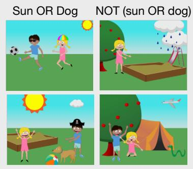  
Figure 1. Toy dataset with two classes (left). Existing models can learn representations of prototypes that do not align with human visually perceived similarity (center). Our objective is to learn prototypes that represent concepts that also look similar to humans (right).

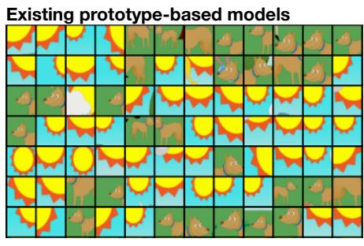  
Image patches similar to prototype 1

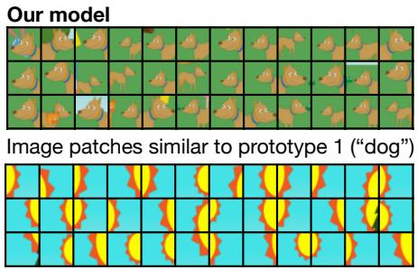  
Image patches similar to prototype 2 (“sun”)

To address the gap between latent and pixel space, we present PIP-Net: an interpretable model that is designed to be intuitive and optimized to correlate with human vision. A sparse linear layer connects learned interpretable prototypical parts to classes. A user only needs to inspect the prototypes and their relation to the classes in order to interpret the model. We restrict the weights of the linear layer to be non-negative, such that the presence of a class-relevant prototype increases the evidence for a class. The linear layer can be interpreted as a scoring sheet: the score for a class is the sum of all present prototypes multiplied by their weights. A local explanation (Fig. 2 and Fig. 3) explains a specific prediction and shows which prototypes were found at which locations in the image. The global explanation provides an overall view of the model’s decision layer, consisting of the sparse weights between classes and their relevant prototypes. Because of this interpretable and predictive linear layer, we ensure a direct relation between the prototypes and the classification, and thereby prevent unfaithful explanations which can arise with local or post-hoc XAI methods [16].

## Our Contributions:

1. We present the Patch-based Intuitive Prototypes Network (PIP-Net): an intrinsically interpretable image classifier, driven by three explainability requirements: the model should be intuitive, compact and able to handle out-of-distribution data.

2. PIP-Net has a surprisingly simple architecture and is trained with novel regularization for learning prototype similarity that better correlates with human visual perception, thereby closing a perceived semantic gap.

3. PIP-Net acts as a scoring sheet and therefore can detect that an image does not belong to any class or that it belongs to multiple classes.

4. Instead of specifying the number of prototypes beforehand as in ProtoPNet [3], ProtoPool [28] and Tes-Net [35], PIP-Net only needs an upper bound on the number of prototypes and selects as few prototypes as possible for good classification accuracy with compact explanations, reaching sparsity ratios > 99%.

## 2. Related Work

Interpretable Models Chen et al. [3] introduced the Prototypical Part Network (ProtoPNet), an intrinsically interpretable model with a predetermined number of prototypical parts per class. To classify an image, the similarity between the latent encoding of a prototype and an image patch is calculated by measuring the distance in latent space. The resulting similarity scores are weighted by values learned by a fully-connected layer. The explanation of ProtoPNet shows the reasoning process for a single image, by visualizing all prototypes together with their weighted similarity score. The explanation can therefore be understood as a scoring sheet, although with a fixed number of class-specific prototypes leading to large explanations which have been shown to contain redundant prototypes [22]. In contrast, our prototypes can be shared between classes and explanation size is minimized. TesNet [35] builds upon ProtoPNet by learning prototypes on a Grassman manifold in order to disentangle the latent space, but also uses a fixed number of 10 prototypes per class. They are applied to the CUB-200-2011 dataset [33] with 200 bird species, and Stanford Cars [15] with 196 car types, meaning that an explanation consists of 2000 prototypes, which can be overwhelming for a user. ProtoPShare [29] is a pruning mechanism for ProtoPNet to reduce the explanation size, and ProtoPFormer [39] adapts ProtoPNet for Transformers. ProtoTree [24] reduces the number of prototypes further and learns prototypical parts in a decision tree structure in order to reduce the local explana tion size. ProtoPool [28] is an improvement of ProtoPNet by sharing prototypes between classes without pruning. Their number of prototypes is fixed and has to be defined beforehand. All models are however only designed for fine-grained image recognition tasks (CUB-200-2011 and Stanford Cars) since their loss functions optimize latent prototypes to be near (parts of) images from the same class. This however does not explicitly optimize towards human perceptual similarity. Additionally, where other prototype-based models learn latent vectors for the prototypes, PIP-Net has a node per prototype indicating to what extent the prototype is present.

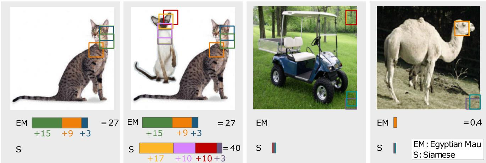  
Figure 2. Our classifier is a scoring sheet based on the presence of prototypical parts in an image. Reasoning is intuitive since a single-object classifier can handle multi-object images and out-of-distribution data. Our model is therefore able to abstain from a decision and instead say “I haven’t seen this before”. Figure shows actual predictions and prototype locations of PIP-Net trained on PETS (37 cat and dog species).

Prototypical parts are also related to concepts. Some concept-based XAI methods, e.g. TCAV [13], are supervised by relying on training data for specific concepts. In contrast, PIP-Net discovers prototypical parts in a self-supervised way. Other concept-based methods, e.g. [41], are post-hoc XAI methods, and are therefore not guaranteed to faithfully explain the model’s reasoning [6]. More related to our work is the post-hoc sparse explainer of Wong et al. [38] which fits a sparse linear classification layer to a trained CNN and explains the resulting sparse nodes with LIME [27] and activation maximization [42]. They show how the sparse linear layer helps users to understand the model better and that sparse interpretability contributes to easy debugging of the network. Our PIP-Net also contains a sparse linear decision layer to adopt these advantages, but in our intrinsically interpretable model the CNN features are optimized together with the linear layer rather than being frozen and each node can be visualized as a semantically meaningful prototype.

Self-supervised Representation Learning When there is a high variety between discriminative features for a class, extra regularization on the prototypes is needed to prevent a semantic gap (Fig 1). Since we do not require manual part annotations but only rely on image labels (for at least part of the data), we use self-supervised learning of prototypes. Danon et al. [4] learn patch similarity with a triplet loss based on spatial proximity. The intuition is that two neighboring patches should have a similar encoding (i.e., prototype in our case), whereas a distant patch should have a different encoding. However, such triplet losses can lead to false negatives (e.g. a car has multiple wheels on different locations in the image), and usually require complex hard-negative mining [10]. Instead, [37] obviate the need for negatives by optimizing only two properties for contrastive representation learning: alignment enforces two similar images to be mapped to nearby latent feature vectors, and uniformity induces a uniform distribution of the feature vectors on a unit hypersphere. Although applied to full images only, we show that the underlying concept can be applied to image patches as well. Since we want to model the presence or absence of prototypes, our image encodings are ideally binary rather than continuous. Most existing self-supervised feature learning methods (see [12] for an overview) are therefore not directly applicable. Most relevant to our work is the recently proposed method CARL (Consistent Assignment for Representation Learning) from [31]. Rather than directly learning continuous image embeddings, CARL learns a predetermined number of latent anchors. A softmax is applied to get the distribution of an image over all anchors. CARL’s alignment loss enforces different augmented views of an image to be assigned to the same anchors. This is similar to our approach, though we aim to learn a prototype per patch.

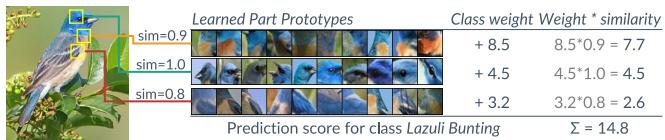  
Figure 3. Example of local explanation of PIP-Net with only 3 prototypes for the correct class. PIP-Net learns part-prototypes visualized as patches from the training data, and localizes similar image patches in an unseen input image.

## 3. Model Architecture and Reasoning

Consider a classification problem with K classes with training set $\tau$ containing N labeled1 images $\{ ( \pmb { x } ^ { ( 1 ) } , y ^ { ( 1 ) } ) , . . . , ( \pmb { x } ^ { ( N ) } , y ^ { ( N ) } ) \} \in \mathrm { ~ \bar { \mathcal { X } } ~ } \times \mathcal { Y }$ . Our main objective is to learn interpretable prototypes, which can then be used as input features for any interpretable model. The core of our model architecture is a convolutional neural network (CNN) backbone that learns an interpretable, 1-dimensional image encoding p indicating the presence or absence of prototypical parts in an image, based on the principle that a CNN’s latent map preserves spatial information. A sparse linear layer then connects those prototypical parts (prototypes) to classes (see Fig. 4 and Fig. 3).

An input image is first forwarded through CNN f. The resulting convolutional output ${ z } = f ( { \pmb x } ; { \omega } _ { f } )$ consists of D two-dimensional $( H \times W )$ feature maps, where $\omega _ { f }$ denotes the trainable parameters of $f .$ . We apply a softmax over D such that $\begin{array} { r } { \bar { \sum _ { d } ^ { D } } z _ { h , w , d } = 1 } \end{array}$ to force a patch $z _ { h , w , : }$ to belong to exactly one prototype. Each value $z _ { h , w , d }$ can be interpreted as the probability that the patch at location $h , w \in H \times W$ corresponds to prototype d. Ideally, $z _ { h , w , : }$ is a one-hot encoded representation signaling perfect allocation to one prototype. Since our goal is to identify the absence or presence of a prototypical part in an image, we apply a max-pooling operation per feature map $z _ { : , : , d } ,$ as shown by the colors in Fig. 4. The resulting tensor $\pmb { p } \in [ 0 . , 1 . ] ^ { D }$ represents the presence score of all D prototypes2 in the image, such that the dth-value in p indicates to what extent prototype d is present in the image. For example, image encoding p could be [0.9, 0.0, 0.0, 0.1, 0.8, 1.0], indicating that the first, fifth and sixth prototype are (substantially) present in this image. The image encoding p is used as input to a linear classification layer with weights $\omega _ { c } \in \mathbb { R } _ { \ge 0 } ^ { D \times \dot { K } }$ which connects prototypes to classes and acts as a scoring system. Learned weight $\omega _ { c } ^ { d , k }$ indicates the relevance of prototype d to class k. The output score per class is the sum of the prototype presence scores multiplied by the incoming class weights of this linear layer. By adding up scores for relevant present prototypical parts, we allow the model to find evidence for multiple classes or for none, as shown in Fig. 2. To improve interpretability, we restrict the linear layer to have non-negative weights and optimize for sparsity by learning many zero weights (see Sec. 5).

## 4. Self-Supervised Pre-Training of Prototypes

We use self-supervised learning with specially designed loss functions to generate semantically meaningful prototypes. We assume image-level labels and do not rely on expensive manual part-annotations. In the first step we pretrain the prototypes, while freezing (and not using) the linear layer to the classes. In this step, we optimize the prototypes to already learn semantic similarity, independent of the classification task. This will prevent perceptually different prototypes to be similar in latent space (see Fig. 1).

We learn image encodings p which indicate the presence of prototypes in input image x. In line with other selfsupervised learning methods [12], we create a positive pair $x ^ { \prime } , x ^ { \prime \prime }$ by applying different data augmentations to input image x. By selecting data augmentations such that humans would still consider the two views similar, we incorporate human perception into the training process.

Similar to the contrastive learning approach of [37], we optimize for alignment and uniformity of representations. However, rather than optimizing for alignment on imagelevel, we optimize for patch alignment by optimizing the model to assign the same prototype to two views of an augmented image patch. Specifically, for pretraining the prototypes we use a linear combination of only two loss terms: $\lambda _ { A } \mathcal { L } _ { A } + \lambda _ { T } \mathcal { L } _ { T }$ . The alignment loss $\mathcal { L } _ { A }$ optimizes two views of the same image patch to belong to the same, and ideally a single, prototype. We compute the similarity between the latent patches of two views of an image patch $( z _ { h , w , : } ^ { \prime }$ and $z _ { h , w , : } ^ { \prime \prime }$ as their dot product:

$$
\mathcal { L } _ { A } = - \frac { 1 } { H W } \sum _ { ( h , w ) \in H \times W } \log ( z _ { h , w , : } ^ { \prime } \cdot z _ { h , w , : } ^ { \prime \prime } ) .\tag{1}
$$

Since each patch encoding is normalized with softmax such that $\begin{array} { r } { \sum _ { d } ^ { D } z _ { h , w , d } = 1 } \end{array}$ , two identical one-hot encoded tensors result in $\mathcal { L } _ { A } ~ = ~ 0$ . This loss, similar to the consistency loss of CARL (Consistent Assignment for Representation Learning [31]), therefore implicitly optimizes for near-binary encodings where an image patch corresponds to exactly one prototype. One can imagine that binary presence scores are easier to interpret than soft scores where a prototype is present for $e . g .$ 50%.

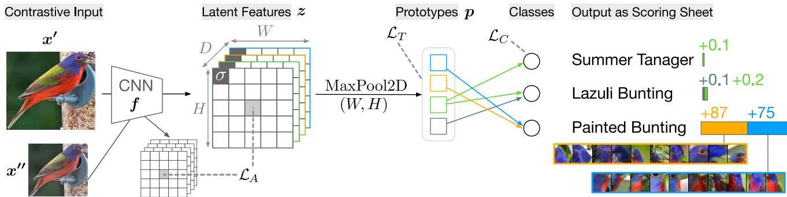  
Figure 4. PIP-Net consists of a CNN backbone (e.g. ConvNeXt) to learn prototypical representations z. The feature representations are pooled to a vector of prototype presence scores p. Contrastive learning implements the objective that two representations of patches for an image pair should be assigned the same prototype in the latent feature space (loss $\mathcal { L } _ { A } )$ . The tanh-loss $\mathcal { L } _ { T }$ prevents trivial solutions and regularizes the model to make use of all available prototypes. As such, PIP-Net disentangles the latent space into neurons that relate to specific object parts. Learned part-prototypes and classes are connected via a sparse linear layer. $\mathcal { L } _ { C }$ is the standard negative log-likelihood loss. Model outputs during test time are not normalized and allow the outputs to be interpreted as simple scoring sheets.

A naive solution for the model to get $\mathcal { L } _ { A } = 0$ is to let one prototype node be activated on all image patches in each image in the dataset. To prevent such a trivial solution and learn diverse image representations that make use of the whole space of D prototypes, we introduce our tanh-loss $\mathcal { L } _ { T }$ that regulates that every prototype should be at least once present in a mini-batch:

$$
\mathcal { L } _ { T } ( \pmb { p } ) = - \frac { 1 } { D } \sum _ { d } ^ { D } \log ( \operatorname { t a n h } ( \sum _ { b } ^ { B } \pmb { p } _ { b } ) + \epsilon ) ,\tag{2}
$$

where tanh and log are element-wise, B is the number of samples in a mini-batch and ϵ is a small number for numerical stability. The intuition behind $\mathcal { L } _ { T }$ is that the tanh checks whether a prototype is present in the mini-batch without taking into account how often a prototype is present, since some prototypes (e.g. sky) will naturally occur more frequently than others.

## 5. Training PIP-Net

After pretraining the prototypes, we unfreeze the last linear layer and train the model as a whole. To optimize for classification performance, we add a classification loss term $\mathcal { L } _ { C }$ , which is simply a standard negative log-likelihood loss between prediction yˆ and the one-hot encoded groundtruth label y. $\mathcal { L } _ { C }$ mainly influences the weights of the linear layer, but also finetunes the prototypes to be relevant for the downstream classification task. In addition to optimizing for classification performance, we have three requirements for our interpretable classifier: (i) it should be explainable with scoring-sheet reasoning (cf. Sec. 5.1, (ii) the explanation should be compact (cf. Sec. 5.2), and (iii) the model should be able to handle out-of-distribution data by being able to output “I haven’t seen this before”, i.e., be able to abstain (cf. Sec. 5.3). These three objectives are captured in a custom activation function (cf. Eq. (3)) in Sec. 5.4). The overall objective for the second training phase of PIP-Net is: $\lambda _ { C } \mathcal { L } _ { C } + \lambda _ { A } \mathcal { L } _ { A } + \lambda _ { T } \mathcal { L } _ { T }$

## 5.1. Scoring Sheet Reasoning

We implement the linear classification layer as an interpretable scoring sheet that looks for (only positive) class evidence in an input sample. Summing up the relevance of present prototypical parts allows the model to find evidence for multiple classes or for none (see Fig. 2).

Whereas usually class confidence scores are used to train neural networks, scoring-sheet inference results in unnormalized output scores. To train with the regular negative log-likelihood loss during the second training phase (after prototype pretraining), we apply a softmax activation function σ to the output of the linear layer o during training to convert unnormalized logits to class confidence scores.3

Naively applying softmax would however conflict with our goals of compactness and decision abstaining in scoringsheet reasoning, because softmax is not scale-invariant, i.e., $\sigma ( z ) ~ \neq ~ \sigma ( c ~ \cdot ~ z )$ for scalar c. More concretely, if the output-scores are initially large (for example, when there a many relevant prototypes present with large weights to classes), then softmax outputs a highly skewed distribution. In contrast, when the class scores are low (and hence when the weights or prototype presence scores are very small), the softmax output is close to a uniform distribution, e.g., $\sigma ( [ 0 . 1 2 , 0 . 6 5 , 0 . 2 1 ] ) ~ = ~ [ 0 . 2 6 , 0 . 4 5 , 0 . 2 9 ]$ . Having either very high or very low scores makes the model susceptible to weight initialization and hinders effective and stable training. Sections 5.2 to and 5.3 discuss this challenge in more detail before presenting the final solution in Section 5.4.

## 5.2. Compact Explanations

The overconfidence of softmax would also compete with our compactness goal. Consider the following example activations in a 3-class scenario: $\sigma ( [ 1 . 2 , 6 . 5 , 2 . 1 ) ] =$ [0.005, 0.983, 0.012]. The confidence score of the second class is already close to one, such that the model has no incentive to further reduce the output scores of the other classes. Prototypes which are actually irrelevant for a class, might therefore keep a positive weight, which results in explanations that are larger than necessary. Sparse weights between prototypes and classes would improve interpretabil ity because the number of relevant prototypes per class and consequently explanation size are reduced. Existing sparsity and pruning methods are mainly developed for reducing memory and computation costs [8] and often the sparsity ratio has to be predetermined by the user [8, 20], making them not directly relevant to our interpretability goal (further discussed in Suppl.). Instead, we introduce a novel function that optimizes classification performance and compactness simultaneously, as presented in Sec. 5.4.

## 5.3. Handling OoD Data

The standard solution for the scale-invariance issue is simply to apply normalization before softmax, as is often done in representation learning (e.g. [11, 34, 37]). However, established normalization layers such as batch normalization and instance normalization impede interpretability since the prototype absence scores with a value of zero become nonzero. With such normalization, we would lose the desirable property of scoring systems being able to output “I haven’t seen this before” by giving near-zero scores for all classes. Abstaining from a decision could add to the trustworthiness of explanations [19]. $L _ { p }$ normalization $( e . g . \ L _ { 2 } )$ is an alternative where zero remains zero. However, a near-zero score could still be significantly increased, limiting the OoD detection possibilities. More importantly, $L _ { p }$ normalization of p would make the scores in p dependent on each other. The presence score of one prototypical part would then influence the encoding of other prototypes in $\mathbf { \delta } _ { p . }$ Such dependence could result in unintuitive behaviour. As found by others, normal CNNs can be easily fooled by adding occluding objects (e.g. a prediction of a monkey changes to a human when a guitar partly occludes the monkey) [36]. Hence, to prevent unexpected and unintuitive behavior, we want the prototype presence scores to behave independently of each other. We therefore introduce in Sec. 5.4 another way of normalizing the logits, where a score of zero stays zero.

<table><tr><td>Method</td><td>Top-1 Acc↑</td><td>Global  $\mathrm { S i z e \downarrow }$ </td><td>Local Size↓</td><td>Spar- sity%↑</td></tr><tr><td>CUBB</td><td>PIP-Net C  $8 4 . 3 { \pm } 0 . 2 $  PIP-Net R  $8 2 . 0 { \pm } 0 . 3 $  ProtoPNet [3] 79.2 ProtoTree [24]  $8 2 . 2 { \pm } 0 . 7 $  ProtoPShare [29] 74.7 ProtoPool [28]  $8 5 . 5 { \pm } 0 . 1 $ </td><td> $4 9 5 { \pm } 6$   $7 3 1 { \pm } 1 9$  2000 202 400 202</td><td>10 (4) 12 (5) 2000 8.3 400 202</td><td>99.3 99.7</td></tr><tr><td>CARS</td><td>PIP-Net C  $8 8 . 2 { \pm } 0 . 5 $  PIP-Net R  $8 6 . 5 { \pm } 0 . 3 $  ProtoPNet [3] 86.1 ProtoTree [24]  $8 6 . 6 { \pm } 0 . 2 $  ProtoPShare [29] 86.4 ProtoPool [28]  $8 8 . 9 { \pm } 0 . 1 \ $ </td><td> $5 1 5 { \pm } 4$   $6 6 9 { \pm } 1 3$  1960 195 480 195</td><td>9 (4) 11 (4) 1960 8.5 480 195</td><td>99.4 99.8</td></tr><tr><td>PETS</td><td>PIP-Net-C  $9 2 . 0 { \pm } 0 . 3 $  PIP-Net R  $8 8 . 5 { \pm } 0 . 2 $ </td><td> $1 7 2 \pm 2$   $3 4 6 { \pm } 1 2$ </td><td>4 (2) 8 (5)</td><td>99.4 99.5</td></tr></table>

Table 1. Mean accuracy and standard deviation (3 random seeds). Global size indicates the total number of prototypes in the model. Local size indicates the number of non-zero prototypes used for a single prediction: for all classes in total, and between brackets for the predicted class only. Sparsity ratio indicates percentage of zero-weights in PIP-Net’s linear classification layer.

## 5.4. Overall Classification Objective

To regularize for sparsity during training, we calculate the output scores o, that are used as input to softmax, as follows:

$$
\begin{array} { r } { \pmb { o } = \log ( ( p \omega _ { c } ) ^ { 2 } + 1 ) , } \end{array}\tag{3}
$$

where p are the prototype presence scores and $\omega _ { c }$ the weights of the linear layer. Since we restrict the weights to be nonnegative such that $\omega _ { c } \in \mathbb { R } _ { > 0 } ^ { D \times K }$ , and $\pmb { p } \in [ 0 . , 1 . ] ^ { D }$ , o will be zero when the input is zero, such that the OoD-property is kept. Squaring $p \omega _ { c }$ helps the model to quickly adapt. Additionally, the natural logarithm reduces large weights to prevent overconfidence as the ‘loss gain’ by decreasing weights is higher than increasing weights, such that the model is incentivized to reduce the weights of irrelevant prototypes. This normalization step therefore implicitly optimizes for sparsity and smaller explanations. During inference (test time), the output scores are simply calculated as $p \omega _ { c }$ in order to support easy interpretation.

## 6. Experiments and Results

We evaluate our model on the standard benchmarks in prototype literature: CUB-200-2011 [33] (200 bird species), and Stanford Cars [15] (196 car models). Additionally, we evaluate on Oxford-IIIT Pet [25] (37 cat and dog species) to include a dataset with fewer classes.

## 6.1. Implementation Details

In our architecture, any convolutional backbone can be used and we apply ResNet50 and ConvNeXt-tiny [18], indicated with R and C respectively. We use the pretrained versions but change the strides of the last layers from 2 to 1, such that the width W and height H of the output feature maps are increased (from $7 \times 7$ to 28 × 28 for ResNet and $7 \times 7$ to $2 6 \times 2 6$ for ConvNeXt, see Suppl.). This small change results in a more fine-grained patch grid z which can be better optimized for patch similarity. Backbone f is finetuned with Adam with a learning rate of 0.0001 (CUB-R and PETS) or 0.0005 (CARS, CUB-C) in a cosine annealing schedule. The linear layer is trained with a learning rate of 0.05. Weights for the losses are set to $\lambda _ { C } = \lambda _ { T } = 2$ $\lambda _ { A } = 5$ . We pretrain the prototypes for 10 epochs, followed by training PIP-Net as a whole for 60 more epochs. Images are resized to $2 2 4 \times 2 2 4$ and augmented with TrivialAug ment [21]. See Suppl. and code for details.

## 6.2. Performance and Explanation Size

Table 1 presents the accuracy of recent prototypical-partsbased models and the compactness of the explanations. We measure the size of the global explanation as the number of prototypes in the model with at least one non-zero weight. The local explanation can either count all present prototypes that are relevant for any class, or only for the predicted class (Fig. 3). For a local explanation, we count all relevant prototypes with a similarity > 0.1. Table 1 shows that PIP-Net has a low number of prototypes, especially in a local expla nation, in combination with a competitive accuracy. Hence, a user only has to check a handful of prototypes to understand why PIP-Net predicted a specific class. Figure 2 shows the actual output of PIP-Net trained on PETS. The local explanation for one class consists of just 3 prototypes, and PIP-Net can indeed, as designed, abstain from classifying for out-of-distribution data. The supplementary material shows further examples of OoD and multi-object predictions.

PIP-Net is specifically designed for open set recognition [40], implying that it can detect OoD input while classifying in-distribution (ID) input. We quantify the OoDdetection of PIP-Net with the common FPR95-metric by determining class-specific thresholds for output score o such that 95% of the ID samples are classified as in-distribution. Table 2 shows that PIP-Net can detect most of the OoD samples, thereby contributing to intuitive reasoning. Our findings confirm the insight of [32] that sparsification is beneficial for OOD detection.

## 6.3. Semantic Quality of Prototypes

As the ‘sun OR dog’ issue from Fig. 1 illustrated, accuracy and number of prototypes is not sufficient for indicating interpretability. Figure 5 visualizes the top-10 patches of learned prototypes. To quantify the semantic correspondence between prototypes and image patches, we evaluate the purity of prototypes by using ground-truth center locations of object parts available in the CUB dataset. Our assumption is that an interpretable prototype should correspond to a single object part, e.g. an eye or a wing. We evaluate to what extent the top-10 image patches for a prototype are encoding the same part by calculating whether the center of the groundtruth object part is contained in a $3 2 \times 3 2$ image patch. For each part-prototype model, we select the 10 images with the highest similarity score for a particular prototype, in order to avoid model-specific similarity/distance thresholds. Table 3 presents the purity of learned CUB-prototypes. It shows a correlation between the size of the explanation and the purity of the prototypes for the existing models, which is in line with the ‘sun OR dog’ issue. Our PIP-Net is however compact and has pure, interpretable prototypes. PIP-Net with a ConvNeXt-tiny backbone achieves a substantially higher purity than other models. Interestingly, even the self-supervised prototypes of PIP-Net-C have a higher purity score than the prototypes learned by other models with classification loss. Also PIP-Net with a ResNet-backbone achieves a higher purity than ProtoPNet, ProtoPShare (a pruned version of

<table><tr><td colspan="4">FPR95 (↓) OOD</td></tr><tr><td>ID</td><td>PETS</td><td>CUB</td><td>CARS</td></tr><tr><td>PETS</td><td></td><td>0.129</td><td>0.009</td></tr><tr><td>CUB</td><td>0.081</td><td></td><td>0.011</td></tr><tr><td>CARS</td><td>0.056</td><td>0.078</td><td>一</td></tr></table>

Table 2. OOD detection results, which calculates the false positive rate of OOD detection when the true positive rate of ID samples is at 95%. When 95% of the PETS images are classified as indistribution, PIP-Net classifies only 0.9% of the CARS images and 12.9% of CUB images as in-distribution for PETS.
<table><tr><td>Model</td><td>Purity (train) ↑</td><td>Purity (test) ↑</td></tr><tr><td>ProtoPNet R [3] ProtoTree R [24] ProtoPShare R [29] PIP-Net C (self-sup)</td><td> $0 . 4 4 \pm 0 . 2 1$   $0 . 1 3 \pm 0 . 1 4$   $0 . 4 3 \pm 0 . 2 1$   ${ \bf 0 . 9 2 \pm 0 . 1 6 }$   $0 . 6 1 \pm 0 . 3 8$ </td><td> $0 . 4 6 \pm 0 . 2 2$   $0 . 1 4 \pm 0 . 1 6$   $0 . 4 3 \pm 0 . 2 2$   $0 . 2 9 \pm 0 . 3 2$   ${ \bf 0 . 9 3 \pm 0 . 1 5 }$   $0 . 6 0 \pm 0 . 3 8$ </td></tr><tr><td>CUB ProtoPool R [28] PIP-Net R (ours)</td><td> $0 . 3 5 \pm 0 . 2 0$ </td><td> $0 . 3 6 \pm 0 . 2 1$ </td></tr><tr><td>PIP-Net R (self-sup) PIP-Net C (ours)</td><td> $0 . 6 3 \pm 0 . 2 5$   $0 . 2 9 \pm 0 . 3 1$ </td><td> $0 . 6 5 \pm 0 . 2 5$ </td></tr></table>

Table 3. Purity of CUB-prototypes w.r.t. object part annotations, averaged over all relevant prototypes in the model (± std. dev.). Calculates how often the (center of the) same object part is present in the top-10 image patches per prototype. PIP-Net (self-supervised) indicates the purity after pretraining the prototypes (i.e. without classification loss ${ \mathcal { L } } _ { C } )$ . R is ResNet, C is ConvNeXt backbone.

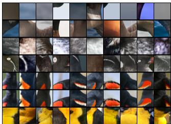  
(a) ProtoPNet - CUB

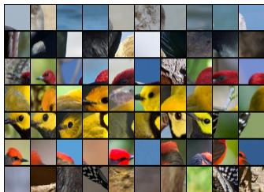  
(b) ProtoPool - CUB

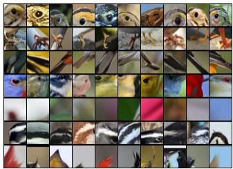

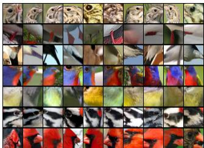

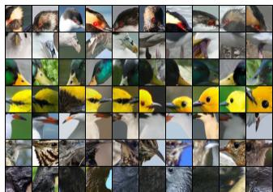  
(e) PIP-Net - CUB (more vis.)

(d) PIP-Net - CUB, full  
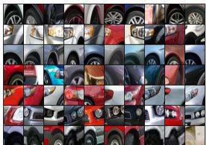  
(f) PIP-Net - CARS

(c) PIP-Net - CUB, self-supervised pretraining only  
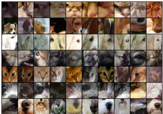  
(g) PIP-Net - PETS

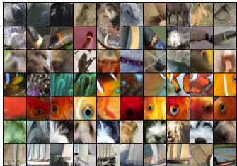  
(h) PIP-Net - PIN  
Figure 5. Example prototypes, one per row visualized with their top-10 image patches. Note that both ProtoPNet and ProtoPool learn interpretable and less-interpretable prototypes (e.g, first two rows). ProtoPNet might learn duplicate prototypes (fifth and sixth row). Showing the same prototypes pi for pretrained and fully trained PIP-Net. All prototypes visualized in the supplementary material.

ProtoPNet), ProtoPool and ProtoTree. We hypothesize that the “patchify stem” of ConvNeXt is beneficial for learning part prototypes, whereas ResNet might perform worse due to its larger number of prototypes (D = 2048 ResNet vs D = 768 for ConvNeXt), and because ResNets have weak spatial localization discriminativeness in the last layers [26].

The relatively high standard deviation in Tab. 3 indicates that some prototypes have a lower part purity. This could be due to the fact that some prototypes are semantically meaningful for humans but do not correspond to a single object part, such as a prototype encoding a specific color (e.g. ‘anything bright blue’) or a non-part-related concept (e.g. ‘human skin’ or ‘tree leaves’).

PIP-Net is also applicable to non-fine-grained image data. We train PIP-Net with a ConvNeXt backbone on PartImageNet [7] (PIN), a dataset with 158 classes from ImageNet with part segmentation annotations, allowing us to further evaluate prototype purity. PIP-Net achieves a top-1 accuracy of 85% with 262 prototypes, compared to 91% for a normal black-box ConvNeXt. We leave further hyperparameter tuning for improved classification performance for future work, and rather focused on the evaluation of prototype purity. We define prototype purity as the fraction of image patches of a prototype that have overlap with the same ground-truth object part. We measure the purity based on all image patches where a relevant prototype is detected (i.e., a prototype presence score > 0.5) and find that the purity averaged over all active non-zero-weighted PIN-prototypes is 92%. The high purity aligns with the visual evidence from Fig. 5 and confirms the interpretability of the learned prototypes.

## 7. Conclusion

We presented PIP-Net: an image classifier optimized to be aligned with human perception. By carefully crafting the loss terms and activation functions, PIP-Net learns high-quality prototypical parts, is globally interpretable and generates compact explanations. Additionally, it can abstain from decision making by outputting near-zero scores when no relevant prototypes are found. Our sparse linear decision layer makes PIP-Net an intuitive model, although such simplicity also has it limitations. PIP-Net learns whether a prototype is present or absent, but does not count the number of prototypes in an image. Hence, our model may not be suited for datasets where the number of occurrences of a prototype is the only discriminative feature.

Importantly, PIP-Net only relies on image labels and no other annotations to learn an interpretable part-prototype model. Since our prototypes are learned with a combination of supervised and self-supervised loss terms, it is possible to apply the self-supervised losses from Sec. 4 to unlabeled data. This is especially interesting for domains where manual image labeling is expensive. We leave the exploration of partly unlabeled data for future work. Lastly, we see further research opportunities to use PIP-Net for efficiently adapting the model’s reasoning for e.g. fixing shortcut learning. We think that interpretability-by-design should become the new standard for interpretable and explainable AI, especially for high stakes decisions. This approach resulted in our PIP-Net, which provides compact explanations that align well with human perception, allowing to interpret decisions in an intuitive, faithful and semantically meaningful way.

## References

[1] Irving Biederman. Recognition-by-components: a theory of human image understanding. Psychological review, 94(2):115, 1987. 1

[2] Judy Borowski, Roland Simon Zimmermann, Judith Schepers, Robert Geirhos, Thomas S. A. Wallis, Matthias Bethge, and Wieland Brendel. Exemplary natural images explain CNN activations better than state-of-the-art feature visualization. In 9th International Conference on Learning Representations, ICLR 2021, Virtual Event, Austria, May 3-7, 2021. OpenReview.net, 2021. 1

[3] Chaofan Chen, Oscar Li, Daniel Tao, Alina Barnett, Cynthia Rudin, and Jonathan K Su. This looks like that: Deep learning for interpretable image recognition. In H. Wallach, H. Larochelle, A. Beygelzimer, F. d'Alché-Buc, E. Fox, and R. Garnett, editors, Advances in Neural Information Processing Systems, volume 32. Curran Associates, Inc., 2019. 1, 2, 6, 7

[4] Dov Danon, Hadar Averbuch-Elor, Ohad Fried, and Daniel Cohen-Or. Unsupervised natural image patch learning. Computational Visual Media, 5(3):229–237, 2019. 3

[5] Christina M. Funke, Judy Borowski, Karolina Stosio, Wieland Brendel, Thomas S. A. Wallis, and Matthias Bethge. Five points to check when comparing visual perception in humans and machines. Journal ofVision, 21(3):16–16, 03 2021. 1

[6] Yash Goyal, Amir Feder, Uri Shalit, and Been Kim. Explaining classifiers with causal concept effect (cace). arXiv preprint arXiv:1907.07165, 2019. 3

[7] Ju He, Shuo Yang, Shaokang Yang, Adam Kortylewski, Xiaoding Yuan, Jie-Neng Chen, Shuai Liu, Cheng Yang, Qihang Yu, and Alan Yuille. Partimagenet: A large, high-quality dataset of parts. In Computer Vision–ECCV 2022: 17th Eu ropean Conference, Tel Aviv, Israel, October 23–27, 2022, Proceedings, Part VIII, pages 128–145. Springer, 2022. 8

[8] Torsten Hoefler, Dan Alistarh, Tal Ben-Nun, Nikoli Dryden, and Alexandra Peste. Sparsity in deep learning: Pruning and growth for efficient inference and training in neural networks. Journal ofMachine Learning Research, 22(241):1–124, 2021. 6

[9] Adrian Hoffmann, Claudio Fanconi, Rahul Rade, and Jonas Kohler. This looks like that... does it? shortcomings of latent space prototype interpretability in deep networks. arXiv preprint arXiv:2105.02968, 2021. 1

[10] Ashish Jaiswal, Ashwin Ramesh Babu, Mohammad Zaki Zadeh, Debapriya Banerjee, and Fillia Makedon. A survey on contrastive self-supervised learning. Technologies, 9(1), 2021. 3

[11] Ashish Jaiswal, Ashwin Ramesh Babu, Mohammad Zaki Zadeh, Debapriya Banerjee, and Fillia Makedon. A survey on contrastive self-supervised learning. Technologies, 9(1), 2021. 6

[12] Longlong Jing and Yingli Tian. Self-supervised visual feature learning with deep neural networks: A survey. IEEE Transactions on Pattern Analysis and Machine Intelligence, 43(11):4037–4058, 2021. 3, 4

[13] Been Kim, Martin Wattenberg, Justin Gilmer, Carrie Cai, James Wexler, Fernanda Viegas, and Rory sayres. Interpretability beyond feature attribution: Quantitative testing

with concept activation vectors (TCAV). In Jennifer Dy and Andreas Krause, editors, Proceedings of the 35th International Conference on Machine Learning, volume 80 of Proceedings ofMachine Learning Research, pages 2668–2677. PMLR, 10–15 Jul 2018. 3

[14] Sunnie S. Y. Kim, Nicole Meister, Vikram V. Ramaswamy, Ruth Fong, and Olga Russakovsky. HIVE: Evaluating the human interpretability of visual explanations. In European Conference on Computer Vision (ECCV), 2022. 1

[15] Jonathan Krause, Michael Stark, Jia Deng, and Li Fei-Fei. 3d object representations for fine-grained categorization. In 4th International IEEE Workshop on 3D Representation and Recognition (3dRR-13), Sydney, Australia, 2013. 3, 6

[16] Matthew L. Leavitt and Ari Morcos. Towards falsifiable interpretability research. arXiv:2010.12016 [cs, stat], Oct. 2020. arXiv: 2010.12016. 2

[17] Paul Pu Liang, Amir Zadeh, and Louis-Philippe Morency. Foundations and recent trends in multimodal machine learning: Principles, challenges, and open questions, 2022. 1

[18] Zhuang Liu, Hanzi Mao, Chao-Yuan Wu, Christoph Feicht enhofer, Trevor Darrell, and Saining Xie. A convnet for the 2020s. In Proceedings ofthe IEEE/CVF Conference on Computer Vision and Pattern Recognition (CVPR), pages 11976–11986, June 2022. 7

[19] Radek Mackowiak, Lynton Ardizzone, Ullrich Kothe, and Carsten Rother. Generative classifiers as a basis for trustworthy image classification. In Proceedings of the IEEE/CVF Conference on Computer Vision and Pattern Recognition (CVPR), pages 2971–2981, June 2021. 6

[20] Decebal Constantin Mocanu, Elena Mocanu, Tiago Pinto, Selima Curci, Phuong H. Nguyen, Madeleine Gibescu, Damien Ernst, and Zita A. Vale. Sparse training theory for scalable and efficient agents. In Proceedings of the 20th International Conference on Autonomous Agents and MultiAgent Systems, AAMAS ’21, page 34–38, Richland, SC, 2021. International Foundation for Autonomous Agents and Multiagent Systems. 6

[21] Samuel G. Müller and Frank Hutter. Trivialaugment: Tuningfree yet state-of-the-art data augmentation. In Proceedings of the IEEE/CVF International Conference on Computer Vision (ICCV), pages 774–782, October 2021. 7

[22] Meike Nauta, Annemarie Jutte, Jesper Provoost, and Christin Seifert. This looks like that, because ... explaining prototypes for interpretable image recognition. In Machine Learning and Principles and Practice ofKnowledge Discovery in Databases, pages 441–456, Cham, 2021. Springer International Publishing. 2

[23] Meike Nauta, Jan Trienes, Shreyasi Pathak, Elisa Nguyen, Michelle Peters, Yasmin Schmitt, Jörg Schlötterer, Maurice van Keulen, and Christin Seifert. From anecdotal evidence to quantitative evaluation methods: A systematic review on evaluating explainable ai. ACM Comput. Surv., feb 2023. 1

[24] Meike Nauta, Ron van Bree, and Christin Seifert. Neural prototype trees for interpretable fine-grained image recognition. In Proceedings of the IEEE/CVF Conference on Computer Vision and Pattern Recognition (CVPR), pages 14933–14943, June 2021. 1, 2, 3, 6, 7

[25] Omkar M Parkhi, Andrea Vedaldi, Andrew Zisserman, and C. V. Jawahar. Cats and dogs. In 2012 IEEE Conference on Computer Vision and Pattern Recognition, pages 3498–3505, 2012. 6

[26] Maithra Raghu, Thomas Unterthiner, Simon Kornblith, Chiyuan Zhang, and Alexey Dosovitskiy. Do vision transformers see like convolutional neural networks? In M. Ran zato, A. Beygelzimer, Y. Dauphin, P.S. Liang, and J. Wortman Vaughan, editors, Advances in Neural Information Processing Systems, volume 34, pages 12116–12128. Curran Associates, Inc., 2021. 8

[27] Marco Tulio Ribeiro, Sameer Singh, and Carlos Guestrin. "why should i trust you?": Explaining the predictions of any classifier. In Proceedings of the 22nd ACM SIGKDD International Conference on Knowledge Discovery and Data Mining, KDD ’16, page 1135–1144, New York, NY, USA, 2016. Association for Computing Machinery. 3

[28] Dawid Rymarczyk, Łukasz Struski, Michał Górszczak, Koryna Lewandowska, Jacek Tabor, and Bartosz Zielinski. In-´ terpretable image classification with differentiable prototypes assignment. In Shai Avidan, Gabriel Brostow, Moustapha Cissé, Giovanni Maria Farinella, and Tal Hassner, editors, Computer Vision – ECCV 2022, pages 351–368, Cham, 2022. Springer Nature Switzerland. 1, 2, 3, 6, 7

[29] Dawid Rymarczyk, Łukasz Struski, Jacek Tabor, and Bartosz Zielinski. ProtoPShare: Prototypical Parts Sharing for Sim-´ ilarity Discovery in Interpretable Image Classification. In Proceedings ofthe 27th ACM SIGKDD Conference on Knowledge Discovery & Data Mining, KDD ’21, page 1420–1430, New York, NY, USA, 2021. Association for Computing Machinery. 1, 3, 6, 7

[30] Wojciech Samek, Grégoire Montavon, Sebastian Lapuschkin, Christopher J. Anders, and Klaus-Robert Müller. Explaining deep neural networks and beyond: A review of methods and applications. Proceedings of the IEEE, 109(3):247–278, 2021. 1

[31] Thalles Silva and Adín Ramírez Rivera. Representation learning via consistent assignment of views to clusters. In Proceedings of the 37th ACM/SIGAPP Symposium on Applied Computing, SAC ’22, page 987–994, New York, NY, USA, 2022. Association for Computing Machinery. 3, 4

[32] Yiyou Sun and Yixuan Li. Dice: Leveraging sparsification for out-of-distribution detection. In Computer Vision–ECCV 2022: 17th European Conference, Tel Aviv, Israel, October 23– 27, 2022, Proceedings, Part XXIV, pages 691–708. Springer, 2022. 7

[33] C. Wah, S. Branson, P. Welinder, P. Perona, and S. Belongie. The Caltech-UCSD Birds-200-2011 Dataset. Technical Report CNS-TR-2011-001, California Institute of Technology, 2011. 3, 6

[34] Feng Wang, Xiang Xiang, Jian Cheng, and Alan Loddon Yuille. Normface: L2 hypersphere embedding for face verification. In Proceedings ofthe 25th ACM International Conference on Multimedia, MM ’17, page 1041–1049, New York, NY, USA, 2017. Association for Computing Machinery. 6

[35] Jiaqi Wang, Huafeng Liu, Xinyue Wang, and Liping Jing. Interpretable image recognition by constructing transparent

embedding space. In Proceedings of the IEEE/CVF Interna tional Conference on Computer Vision (ICCV), pages 895– 904, October 2021. 2

[36] Jianyu Wang, Zhishuai Zhang, Cihang Xie, Yuyin Zhou, Vittal Premachandran, Jun Zhu, Lingxi Xie, and Alan Yuille. Visual concepts and compositional voting. Annals ofMathematical Sciences and Applications, 3(1):151–188, 2018. 6

[37] Tongzhou Wang and Phillip Isola. Understanding contrastive representation learning through alignment and uniformity on the hypersphere. In Hal Daumé III and Aarti Singh, editors, Proceedings of the 37th International Conference on Machine Learning, volume 119 of Proceedings of Machine Learning Research, pages 9929–9939. PMLR, 13–18 Jul 2020. 3, 4, 6

[38] Eric Wong, Shibani Santurkar, and Aleksander Madry. Leveraging sparse linear layers for debuggable deep networks. In Marina Meila and Tong Zhang, editors, Proceedings of the 38th International Conference on Machine Learning, volume 139 of Proceedings of Machine Learning Research, pages 11205–11216. PMLR, 18–24 Jul 2021. 3

[39] Mengqi Xue, Qihan Huang, Haofei Zhang, Lechao Cheng, Jie Song, Minghui Wu, and Mingli Song. Protopformer: Concentrating on prototypical parts in vision transformers for interpretable image recognition. arXiv preprint arXiv:2208.10431, 2022. 3

[40] Jingkang Yang, Kaiyang Zhou, Yixuan Li, and Ziwei Liu. Generalized out-of-distribution detection: A survey. arXiv preprint arXiv:2110.11334, 2021. 7

[41] Chih-Kuan Yeh, Been Kim, Sercan Arik, Chun-Liang Li, Tomas Pfister, and Pradeep Ravikumar. On completenessaware concept-based explanations in deep neural networks. In H. Larochelle, M. Ranzato, R. Hadsell, M.F. Balcan, and H. Lin, editors, Advances in Neural Information Processing Systems, volume 33, pages 20554–20565. Curran Associates, Inc., 2020. 3

[42] Jason Yosinski, Jeff Clune, Anh Nguyen, Thomas Fuchs, and Hod Lipson. Understanding neural networks through deep visualization. arXiv preprint arXiv:1506.06579, 2015. 3

[43] C. L. Zitnick and Devi Parikh. Bringing semantics into focus using visual abstraction. In Proceedings of the IEEE Conference on Computer Vision and Pattern Recognition (CVPR), June 2013. 2