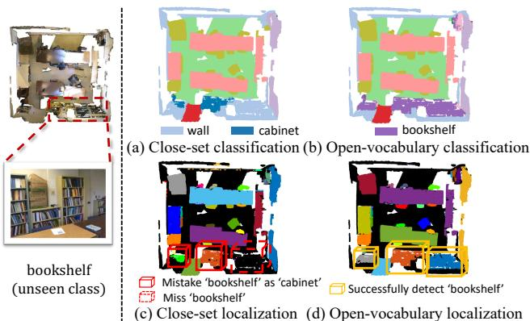
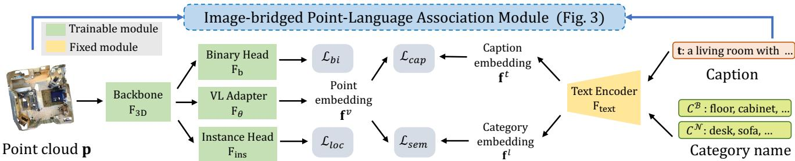
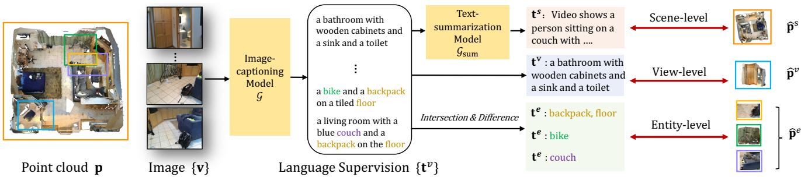
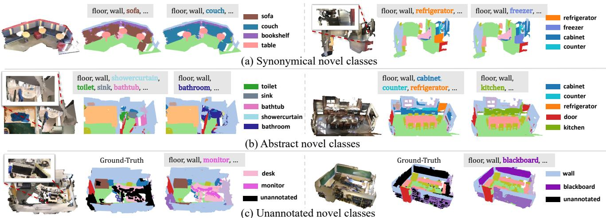

# PLA: Language-Driven Open-Vocabulary 3D Scene Understanding

Runyu Ding1\*† Jihan Yang1∗ Chuhui Xue2 Wenqing Zhang2 Song Bai2‡ Xiaojuan Qi1‡ 1The University of Hong Kong 2ByteDance

## Abstract

Open-vocabulary scene understanding aims to localize and recognize unseen categories beyond the annotated label space. The recent breakthrough of2D open-vocabulary perception is largely driven by Internet-scale paired imagetext data with rich vocabulary concepts. However, this success cannot be directly transferred to 3D scenarios due to the inaccessibility of large-scale 3D-text pairs. To this end, we propose to distill knowledge encoded in pretrained vision-language (VL) foundation models through captioning multi-view images from 3D, which allows explicitly associating 3D and semantic-rich captions. Further, to foster coarse-to-fine visual-semantic representation learning from captions, we design hierarchical 3Dcaption pairs, leveraging geometric constraints between 3D scenes and multi-view images. Finally, by employing contrastive learning, the model learns language-aware embeddings that connect 3D and text for open-vocabulary tasks. Our method not only remarkably outperforms baseline methods by 25.8% ∼ 44.7% hIoU and 14.5% ∼ 50.4% hAP in open-vocabulary semantic and instance segmentation, but also shows robust transferability on challenging zero-shot domain transfer tasks. See the project website at https://dingry.github.io/projects/PLA.

## 1. Introduction

3D scene understanding is a fundamental perception component in real-world applications such as robot manipulation, virtual reality and human-machine interaction. Deep learning has attained remarkable success in this area [13, 38, 28]. However, deep models trained on a human-annotated dataset are only capable of understanding semantic categories in that dataset, i.e. closet-set prediction. As a result, they fail to recognize unseen categories in the open world (see Fig. 1). This largely restricts their applicability in realworld scenarios with unbounded categories. Besides, heavy annotation costs on 3D datasets (e.g. 22.3 minutes for one scene with 20 classes [7]) further make it infeasible to rely on human labor to cover all real-world categories.

  
Figure 1. An example of 3D open-vocabulary scene understanding with “bookshelf” as unseen class for ScanNet [7]. The close-set model mistakes “bookshelf” as “cabinet” or simply misses “bookshelf” in (a) and (c). Our open-vocabulary model correctly localizes and recognizes “bookshelf” in (b) and (d).

This motivates us to study open-vocabulary 3D scene understanding, which equips a model with the ability to localize and recognize open-set classes beyond the label space of an annotated dataset (see Fig. 1). Recently, vision-language (VL) foundation models [33, 22, 47] trained on billions of web-crawled image data with semantic-rich captions [36] are capable of learning adequate vision-language embeddings to connect text and image, which are further leveraged to solve many 2D open-vocabulary tasks including object detection [15, 35], semantic segmentation [43, 26, 51], visual question answering [31] and etc. Albeit significantly advancing open-vocabulary image understanding tasks, this pre-training paradigm is not directly viable in the 3D domain due to the absence of large-scale 3D-text pairs.

To this end, initial efforts [50, 20] have attempted to project 3D data into 2D modalities, such as RGB images and depth maps, enabling pre-trained VL foundation models to process the 2D data and achieve object-level openvocabulary recognition. Nevertheless, this line of methods suffers from several major issues, making it suboptimal to handle scene-level understanding tasks (e.g., instance segmentation). First, multiple RGB images and depth maps are required to represent a 3D sample, which incurs heavy computation and memory costs during training and inference. Second, the projection from 3D to 2D induces information loss and prohibits direct learning from rich 3D data, leading to subpar performance. Our preliminary study shows the cutting-edge 2D open-vocabulary semantic segmentation method MaskCLIP [51] attains a mere 17.8% mIoU with a 20-fold increase in latency when applied to analyze projected 2D images from 3D ScanNet dataset.

Thus, considering the success of VL foundation models for a variety of vision-language tasks [15, 35, 43, 26, 51, 50, 20], we ask: is it possible to elicit knowledge encoded in powerful VL foundation models to build an explicit association between 3D and language for open-vocabulary understanding? To this end, our core idea is to exploit pre-trained VL foundation models [1, 39] to caption easily-obtained image data aligned with 3D data (i.e. the point set in the corresponding frustum to produce the image). Note that these images can be acquired through neural rendering [9, 46] or from the 3D data collection pipeline [7]. By doing so, we can distill semantic-rich textual descriptions to the 3D domain, which allows explicit association between 3D and vocabulary-rich text for zero-shot 3D scene understanding.

Given 3D-language association, the next question is enabling a 3D network to learn language-aware embeddings from (pseudo) captions. The key challenge stems from intricate object compositions in 3D scene-level data (see Fig. 3), making it difficult to connect objects with corresponding words in the caption. This differs from object-centric image data containing a single centered object [33]. Fortunately, the captioned multi-view images from a 3D scene are related by 3D geometry, which can be leveraged to build hierarchical point-caption pairs, including scene-, view- and entity-level captions. These multi-level point-caption pairs offer coarse-to-fine supervision signals, facilitating learning adequate visual-semantic representations from rich vocabulary by contrastive learning. Without task-specific design, our Point-Language Association paradigm, namely PLA, is generic for various open-vocabulary 3D scene understanding tasks, such as semantic and instance segmentation.

Experimental results for ScanNet [7] and S3IDS [2] datasets show the effectiveness of our method in in-domain open-vocabulary tasks with only category shifts, i.e. training and evaluation are conducted on the same dataset, surpassing baselines by 25.8% ∼ 44.7% hIoU on semantic segmentation and $1 4 . 5 \% \sim 5 0 . 4 \% \mathrm { h A P } _ { 5 0 }$ on instance segmentation. Besides, our model, trained on a dataset (i.e. Scan-Net), can generalize to another dataset (i.e. S3IDS) with both data distribution and category shifts, manifesting its transferability. Finally, our model can benefit from more advanced foundation models that provide higher-quality caption supervision, showing its scalability and extensibility.

## 2. Related Work

3D scene understanding focuses on understanding the semantic meaning of objects and surrounding environment from point clouds. In this work, we focus on two fundamental scene understanding tasks: semantic and instance segmentation. 3D semantic segmentation aims to obtain pointwise semantic predictions for point clouds. Representative works develop point-based solutions [32, 19] with elaborately designed point convolution operations [37, 42] or transformers [24] or voxel-based [13, 6] methods with 3D sparse convolutions [14] to produce point-wise segmentation results. 3D instance segmentation further targets distinguishing different object instances based on semantic segmentation. Existing approaches either adopt a top-down solution [45, 44] via predicting 3D bounding box followed by mask refinement, or a bottom-up [23, 38] approach through grouping points. However, existing methods cannot recognize open-set novel categories, which we aim to address.

Zero-shot and open-vocabulary understanding aims to recognize novel classes that are not annotated in training data. Early approaches mainly follow zero-shot settings that can be coarsely grouped into discriminative methods [40, 3] and generative methods [4, 16]. 3DGenZ [27] extends [4] to the 3D scenario for zero-shot semantic segmentation. Going beyond zero-shot learning, the more general openvocabulary setting assumes a large vocabulary corpus is accessible during training [49]. Existing 2D open-vocabulary learning works either exploit massive annotated image-text pairs to provide weak supervision for expanding vocabulary size [49, 53] or leverage pre-trained VL models from large-scale image-caption pairs, such as CLIP [33], to address open-vocabulary recognition where knowledge distillation [35, 15, 48] and prompt learning [12, 11] are studied.

In comparison, 3D open-vocabulary learning is still in its infancy with only a few explorations focusing on object classification [50, 20]. They attempt to project objectlevel 3D point clouds to multi-view 2D images and depth maps to adopt the pre-trained VL model to generate openvocabulary predictions, which, however, suffer from heavy computation and poor performance if applied to 3D scene understanding tasks. In this work, we propose a languagedriven 3D open-vocabulary framework that directly associates 3D with text descriptions leveraging multi-view images and VL foundation models. It can be generally applied to various scene understanding tasks and is efficient with only the 3D network employed in training and inference.

## 3. Method

## 3.1. Preliminary

3D open-vocabulary scene understanding aims to localize and recognize unseen categories without corresponding human annotation as supervision. Formally, annotations on semantic and instance levels $\mathcal { Y } = \{ \mathbf { y } ^ { \mathrm { s e m } } , \mathbf { y } ^ { \mathrm { i n s } } \}$ are divided into base $\mathcal { C } ^ { B }$ and novel $\mathcal { C } ^ { N }$ categories. In the training stage, the 3D model can access all point clouds ${ \mathcal { P } } = \{ { \bf p } \}$ but only annotations for base classes $\mathbf { \mathcal { { y } } } ^ { B }$ , unaware of both annotations $\mathcal { V } ^ { N }$ and category names concerning novel classes $\mathcal { C } ^ { N }$

  
Figure 2. Our language-driven 3D scene understanding paradigm. Different from the close-set network, the learnable semantic head is replaced by category embeddings encoded by a text encoder from category names. Binary head is to rectify semantic scores with base and novel probability as conditions. Instance head is tailored to instance segmentation. Most importantly, to endow the model with rich semantic space to improve open-vocabulary capability, we supervise point embeddings with caption embeddings based on point-language association (see Fig. 3 for details). Best viewed in color.

However, during inference, the 3D model needs to localize objects and classify points belonging to both base and novel $\mathcal { C } ^ { \breve { B } } \cup \mathcal { C } ^ { N }$ categories.

As for a typical scene understanding network, it consists of a 3D encoder $\mathrm { F } _ { \mathrm { 3 D } } .$ , a dense semantic classification head $\mathrm { F _ { s e m } }$ and an instance localization head $\mathrm { F _ { l o c } }$ (see Suppl. for details). Its inference pipeline can be demonstrated below,

$$
{ \bf f } ^ { p } = \mathrm { F _ { 3 D } } ( { \bf p } ) , ~ { \bf s } = \sigma \circ \mathrm { F _ { \mathrm { s e m } } } ( { \bf f } ^ { p } ) , ~ { \bf z } = \mathrm { F _ { \mathrm { l o c } } } ( { \bf f } ^ { p } , { \bf s } ) ,\tag{1}
$$

where p is the input point cloud, fp is point-wise visual feature, s is semantic score, z is the instance proposal output and σ is the softmax function. With these network predictions, we can then calculate semantic classification loss $\mathcal { L } _ { \mathrm { s e m } }$ with semantic label $\mathbf { y } ^ { \mathrm { s e m } }$ , and localization loss $\mathcal { L } _ { \mathrm { l o c } }$ with instance label $\mathbf { y } ^ { \mathrm { i n s } }$ similar to [23, 38] as Eq (2). Notice that $\mathbf { y } ^ { \mathrm { s e m } }$ and $\mathbf { y } ^ { \mathrm { i n s } }$ only relate to base categories $\mathcal { C } ^ { B }$

$$
\begin{array} { r } { \mathcal { L } _ { \mathrm { s e m } } = \mathrm { L o s s } ( \mathbf { s } , \mathbf { y } ^ { \mathrm { s e m } } ) , \mathcal { L } _ { \mathrm { l o c } } = \mathrm { L o s s } ( \mathbf { z } , \mathbf { y } ^ { \mathrm { i n s } } ) . } \end{array}\tag{2}
$$

## 3.2. Open-Vocabulary Setups

Though we can train a scene understanding model with loss functions in Eq. (2), it is actually a close-set model with a close-set classifier $\mathrm { F _ { s e m } }$ , incapable of recognizing unseen categories. In this regard, we introduce the text-embedded semantic classifier to obtain an open-vocabulary model and propose a binary calibration module to correct the bias toward base categories for open-vocabulary inference.

## 3.2.1 Text-Embedded Semantic Classifier

First, as shown in Fig. 2, to make the model become an open-vocabulary learner, we replace its learnable semantic classifier $\mathrm { F _ { s e m } }$ with category embeddings $\mathbf { f } ^ { l }$ and a learnable vision-language adapter $\operatorname { F } _ { \theta }$ to match the dimension between 3D features $\mathbf { f } ^ { p }$ and $\bar { \mathbf { f } ^ { l } }$ as follows,

$$
\mathbf { f } ^ { v } = \mathrm { F } _ { \theta } ( \mathbf { f } ^ { p } ) , \ \mathbf { s } = \sigma ( \mathbf { f } ^ { l } \cdot \mathbf { f } ^ { v } ) ,\tag{3}
$$

where $\mathbf { f } ^ { v }$ is the projected features with the VL adapter $\operatorname { F } _ { \theta } .$ $\mathbf { f } ^ { l } = [ \mathbf { f } _ { 1 } ^ { l } , \mathbf { f } _ { 2 } ^ { l } , \cdot \cdot \cdot \mathbf { \varepsilon } , \mathbf { f } _ { k } ^ { l } ]$ is a series of category embeddings obtained by encoding category names $\mathcal { C }$ with a frozen text encoder $\mathrm { F } _ { \mathrm { t e x t } }$ such as BERT [10] or CLIP [33] (see Fig. 2). The prediction is made by calculating the cosine similarity among projected point features $\mathbf { f } ^ { v }$ and categories $\mathbf { f } ^ { l }$ and then selecting the most similar category. Notice that $\mathbf { f } ^ { l }$ only contains embeddings belonging to base categories $\mathcal { C } ^ { B }$ during training, but embeddings related to both base and novel classes $\mathcal { C } ^ { B } \cup \mathcal { C } ^ { N }$ are used during open-vocabulary inference. With category embeddings $\mathbf { f } ^ { l }$ as a classifier, the model can support open-vocabulary inference with any desired categories. The above design generally follows LSeg [26] and is named LSeg-3D as a baseline.

## 3.2.2 Semantic Calibration with Binary Head

Although the model has already possessed open-vocabulary capability, we empirically find that it can hardly make any correct predictions on novel classes but mistakes them for base classes. As the model is only trained to recognize base categories, it inevitably produces over-confident predictions on base classes regardless of their correctness, also known as the calibration problem [17]. To this end, we propose a binary calibration module to rectify semantic scores with the probability of a point belonging to base or novel classes.

Specifically, as shown in Fig. 2, the binary head $\operatorname { F _ { b } }$ is employed to distinguish annotated $( i . e .$ . base) and unannotated (i.e. novel) points. During training, F is optimized with:

$$
\begin{array} { r } { \mathbf { s } ^ { b } = \mathrm { F } _ { \mathrm { b } } ( \mathbf { f } ^ { p } ) , \mathcal { L } _ { b i } = \mathrm { B C E L o s s } ( \mathbf { s } ^ { b } , \mathbf { y } ^ { b } ) , } \end{array}\tag{4}
$$

where BCELoss(·, ·) is the binary cross-entropy loss, $\mathbf { y } ^ { b }$ is the binary label and $\mathbf { s } ^ { b }$ is the predicted binary score indicating the probability that a point belongs to novel categories. In the inference stage, we then exploit the binary probability $\mathbf { s } ^ { b }$ to correct the over-confident semantic score s as follows,

$$
\mathbf { s } = \mathbf { s } _ { B } \cdot ( 1 - \mathbf { s } ^ { b } ) + \mathbf { s } _ { N } \cdot \mathbf { s } ^ { b } ,\tag{5}
$$

where $\mathbf { s } _ { B }$ is the semantic score computed solely on base classes with novel class scores set to zero. Similarly, $\mathbf { s } _ { N }$ is computed only for novel classes, setting base class scores to zero. We empirically show that the probability calibration largely improves the performance of both base and novel categories (see Sec. 5), demonstrating that our design effectively corrects over-confident semantic predictions.

## 3.3. Image-Bridged Point-Language Association

With the text-embedded classifier and the binary semantic calibration module, we obtain a deep model with open-vocabulary capability. Nevertheless, its performance on novel categories is very close to random guesses as shown in Table 5. Recent success of open-vocabulary works [26, 35, 15] in 2D vision community shows the effectiveness of introducing language supervision to guide vision backbones. Language supervision can not only enable the vision backbone to access abundant semantic concepts with a large vocabulary size but also assist in mapping vision and language features into a common space to facilitate multi-modality downstream tasks. However, Internet-scale paired point-text data are not as readily available as imagetext pairs on social media, which largely hinders the development of language-driven 3D understanding.

  
Figure 3. Image-bridged point-language association. We present hierarchical scene-level, view-level and entity-level point-language association manners to assign partial point set with caption supervision through multi-view RGB images and VL foundation models.

To address this challenge, we propose PLA, an imagebridged point-language association module to provide language supervision for 3D scene perception without human annotation (see Fig. 2 & Fig. 3). Our core idea is to use multi-view images of a 3D scene as a bridge to access knowledge encoded in VL foundation models. As shown in Fig. 3, a text description is first generated by a powerful image-captioning model taking images of 3D scenes as input, and then associated with a set of points in the 3D scene using the projection matrix between images and 3D scenes. We elaborate on our captioning procedure as well as the designed hierarchical point-caption association as follows.

## 3.3.1 Caption Multi-View Images

As image captioning is a fundamental task in VL research area [18], various foundation models [39, 1, 29] trained with massive samples are readily available for solving this task. Specifically, taking the $j ^ { \mathrm { t h } }$ image of the $i ^ { \mathrm { { t h } } }$ scene ${ \bf v } _ { i j }$ as input, the pre-trained image-captioning model G can generate its corresponding language description $\mathbf { t } _ { i j } ^ { v }$ as follows,

$$
\mathbf { t } _ { i j } ^ { v } = \mathcal { G } ( \mathbf { v } _ { i j } ) .\tag{6}
$$

Surprisingly, though G has not been specifically trained on the 3D scene understanding dataset, the entities in generated captions already cover the whole semantic label space of the popular 3D scene understanding dataset ScanNet [7]. In addition, the caption t provides fairly accurate and comprehensive descriptions for room types, semantic categories with color and texture attributes, and even spatial relations (see language supervision {tv} examples in Fig. 3 and more examples in Suppl.).

## 3.3.2 Associate Point Cloud with Language

Given the image-caption pairs, the next step is to connect a point set ˆp to language t with images v as bridge as follows:

\vspace {-0.2cm} \tex {E plore}\~\lang e \mathbf {\ at p} ,\mathbf { }\rangle \~\t x {with}\~\lang e \mathbf {\ at p}, \mathbf {v} \rangle \~\t x {and}\~\lang e \mathbf {v},\mathbf { }\rangle . (7) Here, we propose three association fashions on point sets with different spatial scales.

Scene-Level Point-Caption Association. The simplest and coarsest association manner is to link language supervision to all points in a given 3D point cloud scene $\hat { \mathbf { p } } ^ { s } = \mathbf { p }$ . As illustrated in Fig. 3, we take all 2D image captions $\mathbf { t } _ { i j } ^ { v }$ of a given scene $\mathbf { p } _ { j }$ to obtain a scene-level caption $\mathbf { t } _ { j } ^ { s }$ via a text summarizer [25] $\mathcal { G } _ { \mathrm { s u m } }$ as follows:

$$
\mathbf { t } _ { j } ^ { s } = \mathcal { G } _ { \mathrm { s u m } } \big ( \{ \mathbf { t } _ { 1 j } ^ { v } , \mathbf { t } _ { 2 j } ^ { v } , \boldsymbol { \cdot } \boldsymbol { \cdot } \boldsymbol { \cdot } \mathbf { t } _ { n _ { j } j } ^ { v } \} \big ) ,\tag{8}
$$

where $n _ { j }$ is the number of images of scene $\mathbf { p } _ { j }$ . By forcing each scene p to learn from the corresponding scene descriptions $\mathbf { t } ^ { s }$ , abundant vocabulary and visual-semantic relationships are introduced to improve the language understanding capability of a 3D network. Despite the simplicity of scenelevel caption, we empirically find that it can lift the model’s open-vocabulary capability by a large margin (see Sec. 5).

View-Level Point-Caption Association. Albeit effective, scene-level caption only provides a single caption for all points in a scene, which overlooks the relation of language to local 3D point clouds, rendering it sub-optimal for scene understanding tasks. In this regard, we further propose a view-level point-caption association that leverages the geometrical relationship between image and points to assign each image caption $\mathbf { t } ^ { v }$ with a point set inside the 3D view frustum $\hat { \mathbf { p } } ^ { v }$ of the given image v (see blue box in Fig. 3). Specifically, to obtain the view-level point set $\hat { \mathbf { p } } ^ { \mathbf { v } }$ , we first back-project the RGB image v to 3D space using the depth information d to get its corresponding point set ¨p:

$$
\left[ \ddot { \textbf { p } } | \textbf { 1 } \right] = \mathbf { T } ^ { - 1 } \left[ \textbf { v } | \textbf { d } \right] ,\tag{9}
$$

where [·|·] denotes block matrix, $\mathbf { T } \in \mathbb { R } ^ { 3 \times 4 }$ is the projection matrix comprising of camera intrinsic matrix and rigid transformations obtained by sensor configurations or mature SLAM approaches [8]. As back-projected points ¨p and points in 3D scene p may be only partially overlapped, we then compute their overlapped regions to get the view-level point set $\hat { \mathbf { p } } ^ { v }$ as follows,

$$
\hat { \mathbf { p } } ^ { v } = { V } ^ { - 1 } ( R ( V ( \ddot { \mathbf { p } } ) , V ( \mathbf { p } ) ) ) ,\tag{10}
$$

where V and $V ^ { - 1 }$ are the voxelization and reversevoxelization processes, and R denotes the radius-based nearest-neighbor search [52]. Such a view-based association enables the model to learn with region-level language description, which largely strengthens the model’s recognition and localization ability on unseen categories.

Entity-Level Point-Caption Association. Although viewlevel caption can already associate each image-caption $\mathbf { t } ^ { v }$ with a concrete partial point set in a 3D scene, such an association still constructs on a large 3D area (i.e. around 25K points) with multiple semantic objects/categories as shown in Fig. 3. This is not friendly for the 3D network to learn fine-grained point-wise semantic attributes and instancewise position information from caption supervision. In this regard, we further propose a fine-grained point-language association that owns the potential to build entity-level pointcaption pairs, i.e. object instances with a caption.

Specifically, as illustrated in Fig. 3, we leverage the differences and intersections of adjacent view-level point sets $\hat { \mathbf { p } } ^ { v }$ and their corresponding view-caption $\mathbf { t } ^ { v }$ to obtain the entity-level associated points $\hat { \mathbf { p } } ^ { e }$ and caption te. First, we calculate entity-level caption $\mathbf { t } ^ { e }$ as below:

$$
w _ { i } = E ( \mathbf { t } _ { i } ^ { v } ) ,\tag{11}
$$

$$
w _ { i \backslash j } ^ { e } = w _ { i } \backslash w _ { j } , w _ { j \backslash i } ^ { e } = w _ { j } \backslash w _ { i } , w _ { i \cap j } ^ { e } = w _ { i } \cap w _ { j } ,\tag{12}
$$

$$
\mathbf { t } ^ { e } = { \mathrm { C o n c a t e } } ( w ^ { e } ) ,\tag{13}
$$

where E denotes extracting a set of entity words w from caption $\mathbf { t } ^ { v } , \mid$ and ∩ represent the set difference and intersection separately, and Concate denotes the concatenation of all words with spaces to form an entity-level caption $\mathbf { t } ^ { e }$ Similarly, we can easily calculate entity-level point sets and associate them to previously obtained entity-level captions to form point-caption pairs as below:

$$
\hat { \mathbf { p } } _ { i \setminus j } ^ { e } = ( \hat { \mathbf { p } } _ { i } ^ { v } \setminus \hat { \mathbf { p } } _ { j } ^ { v } ) , \hat { \mathbf { p } } _ { j \setminus i } ^ { e } = ( \hat { \mathbf { p } } _ { j } ^ { v } \setminus \hat { \mathbf { p } } _ { i } ^ { v } ) , \hat { \mathbf { p } } _ { i \cap j } ^ { e } = \hat { \mathbf { p } } _ { i } ^ { v } \cap \hat { \mathbf { p } } _ { j } ^ { v } ,\tag{14}
$$

$$
< \hat { \bf p } _ { i \backslash j } ^ { e } , { \bf t } _ { i \backslash j } ^ { e } > , < \hat { \bf p } _ { j \backslash i } ^ { e } , { \bf t } _ { j \backslash i } ^ { e } > , < \hat { \bf p } _ { i \cap j } ^ { e } , { \bf t } _ { i \cap j } ^ { e } > .\tag{15}
$$

With entity-level $\langle \hat { \mathbf { p } } ^ { e } , \mathbf { t } ^ { e } \rangle$ pairs, we further filter them to ensure each entity-level points set $\hat { \mathbf { p } } ^ { e }$ relates to at least one entity and focuses on a small enough 3D space as follows,

$$
\begin{array} { r } { \gamma < \lvert \hat { \mathbf { p } } ^ { e } \rvert < \delta \cdot \operatorname* { m i n } ( \lvert \hat { \mathbf { p } } _ { i } ^ { v } \rvert , \lvert \hat { \mathbf { p } } _ { j } ^ { v } \rvert ) \mathrm { a n d } \lvert \mathbf { t } ^ { e } \rvert > 0 , } \end{array}\tag{16}
$$

where $\gamma$ is a scalar to define minimal number of points, δ is a ratio to control the maximum size of $\hat { \mathbf { p } } ^ { e }$ , and caption $\mathbf { t } ^ { e }$ is not empty. Such a constraint helps focus on a fine-grained 3D space with fewer entities in each caption supervision.

Comparison Among Different Point-Caption Association Manners. The above-proposed three coarse-to-fine point-caption association manners actually hold different merits and drawbacks. As shown in Table 1, the scene-level association has the simplest implementation but obtains the coarsest correspondence between captions and points (i.e. each caption corresponds to over 140K points); the viewlevel association provides point-language mapping relation at a finer level, enjoying a larger semantic label space (i.e. over 20× more captions) and a more localized point set (i.e. around 6× fewer corresponding points per caption) than scene caption; the entity-level association owns the most fine-grained correspondence relation, matching each caption to only 4K points on average, and thus can further benefit dense prediction and instance localization in downstream tasks. We empirically show that the fine-grained association and the semantic-rich label space are two important factors for open-vocabulary perception tasks (see Sec. 5).

<table><tr><td></td><td></td><td></td><td>scene-level view-level entity-level</td></tr><tr><td>complexity</td><td>simplest</td><td>middle</td><td>hardest</td></tr><tr><td># captions</td><td>1,201</td><td>24,902</td><td>6,163</td></tr><tr><td># points for each caption</td><td>145,171</td><td>24,294</td><td>3,933</td></tr></table>

Table 1. Comparison among point-caption association manners.

## 3.4. Contrastive Point-Language Training

With obtained point-caption pairs $\left. \hat { \bf p } , { \bf t } \right.$ , we are ready to guide the 3D network F to learn from vocabulary-rich language supervisions. Here, we introduce a general pointlanguage feature contrastive learning that can be applied to all kinds of coarse-to-fine point-caption pairs.

Specifically, we first obtain caption embeddings $\mathbf { f } ^ { t }$ with a pre-trained text encoder $\mathrm { F } _ { \mathrm { t e x t } }$ . As for the associated partial point set ${ \hat { \mathbf { p } } } ,$ we select its corresponding point-wise features from adapted features $\mathbf { f } ^ { v }$ and leverage global average pooling to obtain its feature vector $\mathbf f ^ { \hat { p } }$ as follows,

$$
{ \bf f } ^ { t } = \mathrm { F } _ { \mathrm { t e x t } } ( { \bf t } ) , { \bf f } ^ { \hat { p } } = \mathrm { P o o l } ( \hat { { \bf p } } , { \bf f } ^ { v } ) .\tag{17}
$$

We then adopt contrastive loss as [49] to pull corresponding point-caption feature embeddings closer and push away unrelated point-caption features as follows,

$$
\mathcal { L } _ { \mathrm { c a p } } = - \frac { 1 } { n _ { t } } \sum _ { i = 1 } ^ { n _ { t } } \log \frac { \exp ( \mathbf { f } _ { i } ^ { \hat { p } } \cdot \mathbf { f } _ { i } ^ { t } / \tau ) } { \sum _ { j = 1 } ^ { n _ { t } } \exp ( \mathbf { f } _ { i } ^ { \hat { p } } \cdot \mathbf { f } _ { j } ^ { t } / \tau ) } ,\tag{18}
$$

where $n _ { t }$ is the number of point-caption pairs in any given association fashion and τ is a learnable temperature to modulate the logits as CLIP [33]. It is also worth noting that we remove duplicate captions in a batch to avoid noisy optimization during contrastive learning. With $\operatorname { E q . }$ (17) and Eq. (18), we can easily compute caption losses on scenelevel $\mathcal { L } _ { \mathrm { c a p } } ^ { s } ,$ , view-level $\mathcal { L } _ { \mathrm { { c a p } } } ^ { v }$ and entity-level $\mathcal { L } _ { \mathrm { c a p } } ^ { e }$ . Our final caption loss is a weighted combination as follows,

$$
\mathcal { L } _ { \mathrm { c a p } } ^ { \mathrm { a l l } } = \alpha _ { 1 } * \mathcal { L } _ { \mathrm { c a p } } ^ { s } + \alpha _ { 2 } * \mathcal { L } _ { \mathrm { c a p } } ^ { v } + \alpha _ { 3 } * \mathcal { L } _ { \mathrm { c a p } } ^ { e } ,\tag{19}
$$

where $\alpha _ { 1 } , \alpha _ { 2 }$ and $\alpha _ { 3 }$ are trade-off factors. As shown in Fig. 2, the overall training objective can be written as

$$
\mathcal { L } = \mathcal { L } _ { \mathrm { { s e m } } } + \mathcal { L } _ { \mathrm { { l o c } } } + \mathcal { L } _ { \mathrm { { c a p } } } ^ { \mathrm { { a l l } } } + \mathcal { L } _ { \mathrm { { b i } } } .\tag{20}
$$

<table><tr><td rowspan="3">Method</td><td rowspan="3"> $| \mathcal { C } ^ { N } \mathrm { \Pi } _ { \mathrm { p r i o r } }$ </td><td colspan="8">ScanNet</td><td colspan="6">S3DIS</td></tr><tr><td colspan="2">B15/N4</td><td colspan="2"></td><td colspan="2">B12/N7</td><td colspan="2">B10/N9</td><td colspan="2">B8/N4</td><td colspan="2"></td><td colspan="2">B6/N6</td></tr><tr><td>hIoU mIoUB</td><td></td><td>mIoUN</td><td>hIoU</td><td> $\overline { { \mathrm { m I o U } ^ { B } } }$ </td><td> $\overline { { \mathrm { m I o U } ^ { \mathcal { N } } } }$ </td><td>hIoU</td><td> $\overline { { \mathrm { m I o U } ^ { B } } }$ </td><td>mIoUN</td><td>hIoU mIoUB</td><td>mIoUN</td><td></td><td>hIoU mIoUB</td><td>mIoUN</td></tr><tr><td>LSeg-3D [26]</td><td>×</td><td>00.0</td><td>64.4</td><td>00.0</td><td>00.9</td><td>55.7</td><td>00.1 01.8</td><td>68.4</td><td>00.9</td><td>00.1</td><td>49.0</td><td>00.1</td><td>00.0</td><td>30.1</td><td>00.0</td></tr><tr><td>3DGenZ [27]</td><td>√</td><td>20.6</td><td>56.0</td><td>12.6</td><td>19.8</td><td>35.5 13.3</td><td>12.0</td><td>63.6</td><td>06.6</td><td>08.8</td><td>50.3</td><td>04.8</td><td>09.4</td><td>20.3</td><td>06.1</td></tr><tr><td>3DTZSL [5]</td><td>√</td><td>10.5</td><td>36.7</td><td>06.1</td><td>03.8</td><td>36.6</td><td>02.0 07.8</td><td>55.5</td><td>04.2</td><td>08.4</td><td>43.1</td><td>04.7</td><td>03.5</td><td>28.2</td><td>01.9</td></tr><tr><td>PLA (w/o Cap.)</td><td>×</td><td>39.7</td><td>68.3</td><td>28.0</td><td>24.5</td><td>70.0</td><td>14.8 25.7</td><td>75.6</td><td>15.5</td><td>13.0</td><td>58.0</td><td>07.4</td><td>12.2</td><td>54.5</td><td>06.8</td></tr><tr><td>PLA</td><td>X</td><td>65.3</td><td>68.3</td><td>62.4</td><td>55.3</td><td>69.5</td><td>45.9</td><td>53.1 76.2</td><td>40.8</td><td>34.6</td><td>59.0</td><td>24.5</td><td>38.5</td><td>55.5</td><td>29.4</td></tr><tr><td>PLA (w/ self-train)</td><td>√</td><td>70.3</td><td>68.9</td><td>71.7</td><td>61.1</td><td>70.4</td><td>54.0</td><td>59.2 76.9</td><td>48.2</td><td>36.1</td><td>59.7</td><td>26.0</td><td>46.7</td><td>58.9</td><td>38.7</td></tr><tr><td>Fully-Sup.</td><td>√</td><td>73.3</td><td>68.4</td><td>79.1</td><td>70.6</td><td>70.0</td><td>71.8</td><td>69.9 75.8</td><td>64.9</td><td>67.5</td><td>61.4</td><td>75.0</td><td>65.4</td><td>59.9</td><td>72.0</td></tr></table>

Table 2. Results for open-vocabulary 3D semantic segmentation on ScanNet and S3DIS in terms of hIoU, $\mathrm { m I o U } ^ { B }$ and mIoUN . $\mathcal { C } ^ { N }$ prior denotes whether novel category names $\mathcal { C } ^ { N }$ need to be known during training. PLA (w/o Cap.) denotes training without point-caption pairs as supervision. Best open-vocabulary results are highlighted in bold.

<table><tr><td rowspan="3">Method</td><td rowspan="3"> $\big | \mathcal { C } ^ { N }$  prior</td><td colspan="8">ScanNet</td><td colspan="6">S3DIS</td></tr><tr><td colspan="2">B13/N4</td><td colspan="2"></td><td colspan="2">B10/N7</td><td colspan="2">B8/N9</td><td colspan="2">B8/N4</td><td colspan="2"></td><td colspan="2">B6/N6</td></tr><tr><td> $\overline { { \mathrm { h A P } _ { 5 0 } } }$ </td><td> $\overline { { \mathrm { m A P } _ { 5 0 } ^ { B } } }$ </td><td> $\overline { { \mathrm { m A P } _ { 5 0 } ^ { \mathcal { N } } } }$ </td><td> $\overline { { \mathrm { h A P } _ { 5 0 } } }$ </td><td> $\overline { { \mathrm { m A P } _ { 5 0 } ^ { B } } }$ </td><td> $\overline { { \mathrm { \ m A P _ { 5 0 } ^ { \mathrm { W } } } } }$ </td><td> $\overline { { \mathrm { h A P } _ { 5 0 } } }$ </td><td> $\overline { { \mathrm { m A P } _ { 5 0 } ^ { B } } }$ </td><td> $\overline { { \mathrm { m A P } _ { 5 0 } ^ { \mathrm { N } } } }$ </td><td> $\overline { { \mathrm { h A P } _ { 5 0 } } }$  </td><td> $\overline { { \mathrm { n A P } _ { 5 0 } ^ { B } } }$ </td><td> $\overline { { \mathrm { \ m A P _ { 5 0 } ^ { \mathcal { N } } } } }$   $\overline { { \mathrm { h A P } _ { 5 0 } } }$ </td><td> $\overline { { \mathrm { m A P } _ { 5 0 } ^ { B } } }$ </td><td> $\overline { { \mathrm { \ m A P _ { 5 0 } ^ { \mathrm { W } } } } }$ </td></tr><tr><td>LSeg-3D [26]</td><td>×</td><td>05.1</td><td>57.9</td><td>02.6</td><td>02.0</td><td>50.7</td><td>01.0</td><td>02.4</td><td>59.4</td><td>01.2 00.5</td><td>58.3</td><td>00.3</td><td>01.1</td><td>41.4</td><td>00.5</td></tr><tr><td>PLA (w/o Cap.)</td><td>×</td><td>21.0</td><td>59.6</td><td>12.6</td><td>11.1</td><td>56.2</td><td>06.2</td><td>15.9 63.2</td><td>09.1</td><td>01.8</td><td>59.3</td><td>00.9</td><td>01.3</td><td>49.2</td><td>01.2</td></tr><tr><td>PLA</td><td>X</td><td>55.5</td><td>58.5</td><td>52.9</td><td>31.2</td><td>54.6</td><td>21.9</td><td>35.9 63.1</td><td>25.1</td><td>15.0</td><td>59.0</td><td>08.6</td><td>16.0</td><td>46.9</td><td>09.8</td></tr><tr><td>PLA (w/ self-train)</td><td>√</td><td>58.6</td><td>58.0</td><td>59.2</td><td>41.4</td><td>56.9</td><td>32.6</td><td>42.1 61.1</td><td>32.1</td><td>26.7</td><td>60.3</td><td>17.2</td><td>23.4</td><td>45.6</td><td>15.8</td></tr><tr><td>Fully-Sup.</td><td>√</td><td>64.5</td><td>59.4</td><td>70.5</td><td>62.5</td><td>57.6</td><td>62.0</td><td>62.0</td><td>65.1</td><td>62.0 57.6</td><td>60.8</td><td>54.6</td><td>57.4</td><td>50.0</td><td>67.5</td></tr></table>

Table 3. Results for open-vocabulary 3D instance segmentation on ScanNet and S3DIS in terms of $\mathrm { \ h A P 5 0 } ;$ $\mathrm { m A P _ { 5 0 } ^ { \it B } }$ and $\mathrm { m A P _ { 5 0 } ^ { \mathcal { N } } }$

## 4. Experiments

## 4.1. Basic Setups

Datasets and Perception Tasks. To validate the effectiveness of our point-language association paradigm, we conduct experiments on two datasets: ScanNet [7] densely annotated in 20 classes and S3DIS [2] with 13 classes on both semantic and instance segmentation tasks.

Category Partitions. Without standard open-vocabulary partitions on these two datasets, we build an openvocabulary benchmark with multiple base/novel partitions. To circumvent model confusion, we disregard the “otherfurniture” class in ScanNet and the “clutter” class in S3DIS as they lack exact semantic meanings and can include any semantic categories. As for ScanNet, we randomly partition the rest 19 classes into 3 base/novel partitions for semantic segmentation, i.e. B15/N4, B12/N7 and B10/N9, where B15/N4 indicates 15 base and 4 novel categories. We also follow SoftGroup [38] to exclude two background classes and thus obtain B13/N4, B10/N7, and B8/N9 partitions for instance segmentation on ScanNet. As for S3DIS, we randomly shuffle the rest 12 classes into 2 base/novel splits, i.e. B8/N4, B6/N6 for both semantic and instance segmentation. Specific category splits are presented in the Suppl..

Metrics. We employ widely adopted mean intersection over union (mIoU) and mean average precision under 50% IoU threshold $\mathrm { ( m A P _ { 5 0 } ) }$ as evaluation metrics for semantic and instance segmentation, respectively. These metrics are calculated on base and novel classes separately with superscripts of B and $\mathcal { N } \left( e . g . \mathrm { m I o U } ^ { \mathcal { B } } \right)$ ). Further, we use harmonic mean IoU (hIoU) and $\mathrm { A P } _ { 5 0 } ( \mathrm { h A P } _ { 5 0 } )$ as major indicators following popular zero-shot learning works [40, 43] to consider category partition between base and novel.

Architectures and Baseline Methods. We adopt the popular and high-performance sparse convolutional UNet [13, 6] as 3D encoder $\mathrm { F } _ { 3 \mathrm { D } }$ , the text encoder of CLIP as $\mathrm { F } _ { \mathrm { t e x t } } ,$ two fully-connected layers with batch normalization [21] and ReLU [30] as VL adapter $\operatorname { F } _ { \boldsymbol { \theta } ; \mathbf { \lambda } }$ , an UNet decoder as binary head Fb. Also, we utilize the state-of-the-art instance segmentation network SoftGroup [38] for instance head $\mathrm { F _ { \mathrm { i n s } } } .$

As for baseline methods, other than the above-mentioned LSeg-3D in Sec.3.2.1, we also re-produce two 3D zero-shot learning methods 3DGenZ [27] and 3DTZSL [5] with tasktailored modifications. The implementation details are provided in the Suppl..

## 4.2. Main Results

3D Semantic Segmentation. As shown in Table 2, compared to LSeg-3D [26] baseline, our method obtains around 51.3% ∼ 65.3% and 34.5% ∼ 38.5% hIoU improvements among different partitions on ScanNet and S3DIS respec tively, demonstrating its superior open-vocabulary capability. Even compared to previous zero-shot methods 3DGenZ [27] and 3DTZSL [5] that know novel category names during training, our method still obtains 35.5% ∼ 54.8% improvements in terms of hIoU among various partitions on ScanNet. Especially, our PLA trained model largely surpasses its no caption supervision counterparts (i.e. PLA (w/o Cap.)) by 25.6% ∼ 30.8% hIoU and 21.6% ∼ 26.3% hIoU on ScanNet and S3DIS, respectively. It is noteworthy that the improvement from our method is consistent on different base/novel partitions and datasets, further illustrating its robustness and effectiveness.

3D Instance Segmentation. As demonstrated in Table 3, our method remarkably surpasses baseline methods by $2 9 . 2 \% \sim 5 0 . 4 \% \ \mathrm { h A P _ { 5 0 } }$ and 14. $. 5 \% \sim 1 4 . 9 \% \mathrm { h A P } _ { 5 0 }$ among different base/novel partitions on ScanNet and S3DIS, respectively. Such outstanding performance indicates our contrastive point-language training helps the 3D backbone learn not only semantic attributes but also instance localization information from captions. Notice that the improvement for S3DIS is slighter than ScanNet on both semantic segmentation and instance segmentation. This is actually caused by S3DIS’s small number of training samples (only 271 scenes) and much fewer point-caption pairs owing to fewer overlapped regions between images and 3D scenes.

Self-Bootstrap with Novel Category Prior. As some existing zero-shot methods (i.e. 3DGenZ [27] and 3DTZSL [5]) can access novel category names but no human-annotation during training, here we also provide a simple variant to leverage such novel category prior in self-training fashion [41]. As shown in Table 2 and 3, PLA (w/ self-train) obtains around 2% ∼ 12% gains among semantic and instance segmentation on two datasets. This demonstrates that our model can further self-bootstrap its zero-shot capability and extend its vocabulary size without any human annotation.

## 4.3. Zero-shot Domain Transfer

Our method already shows excellent potential in solving in-domain open-vocabulary scene understanding tasks with category shifts. However, transferable open-vocabulary learners across different domains/datasets also merit exploration, as they face both category and data distribution shifts. In this regard, we conduct zero-shot domain transfer experiments that train the model on ScanNet’s base classes and test it on all S3DIS classes without fine-tuning. Notably, S3DIS has 4 categories not present in ScanNet. As shown in Table 4, our PLA consistently outperforms LSeg-3D [26] by 7.7% ∼ 18.3% mIoU for semantic segmentation and $5 . 0 \% \sim 9 . 5 \% \ \mathrm { m A P _ { 5 0 } }$ for instance segmentation. Such outstanding improvements substantiate our model’s generality for both category shift and data distribution shift. Note that we do not use the binary head for domain transfer here, as the base/novel partition is dataset-specific. We leave calibrating base and novel semantic predictions in outof-domain open-vocabulary scenarios to future work.

## 5. Ablation Studies

In this section, we examine key components of our framework through in-depth ablation studies. Experiments are conducted on ScanNet B15/N4 partition by default. The default setting is marked in gray .

<table><tr><td rowspan=1 colspan=1>ScanNet</td><td rowspan=1 colspan=2>S3DIS Semantic (mIoU)</td><td rowspan=1 colspan=2>S3DIS Instance (mAP50)</td></tr><tr><td rowspan=1 colspan=1>partition</td><td rowspan=1 colspan=1>LSeg-3D</td><td rowspan=1 colspan=1>PLA</td><td rowspan=1 colspan=1>LSeg-3D</td><td rowspan=1 colspan=1>PLA</td></tr><tr><td rowspan=1 colspan=1>B19/N0</td><td rowspan=1 colspan=1>42.5</td><td rowspan=1 colspan=1>50.2 (+7.7)</td><td rowspan=1 colspan=1>37.5</td><td rowspan=1 colspan=1>43.6 (+6.1)</td></tr><tr><td rowspan=1 colspan=1>B15/N4</td><td rowspan=1 colspan=1>30.2</td><td rowspan=1 colspan=1>48.5 (+18.3)</td><td rowspan=1 colspan=1>31.2</td><td rowspan=1 colspan=1>40.7 (+9.5)</td></tr><tr><td rowspan=1 colspan=1>B12/N7</td><td rowspan=1 colspan=1>26.1</td><td rowspan=1 colspan=1>38.3 (+12.2)</td><td rowspan=1 colspan=1>28.2</td><td rowspan=1 colspan=1>35.1 (+6.9)</td></tr><tr><td rowspan=1 colspan=1>B10/N9</td><td rowspan=1 colspan=1>34.5</td><td rowspan=1 colspan=1>48.1 (+13.6)</td><td rowspan=1 colspan=1>33.8</td><td rowspan=1 colspan=1>38.8 (+5.0)</td></tr></table>

Table 4. Zero-shot domain transfer results for semantic segmentation and instance segmentation on ScanNet → S3DIS.  
Component Analysis. We investigate the effectiveness of

our proposed binary calibration module and three coarseto-fine point-caption supervision here. As shown in Table 5, adopting binary head for semantic calibration greatly surpasses baseline LSeg-3D by 39.8% hIoU on semantic segmentation and 15.9% $\mathrm { \ h A P _ { 5 0 } }$ on instance segmentation. Such performance lifts on both base and novel classes verify that it correctly rectifies semantic scores.

As for point-caption association manners, they all substantially improve results by a large margin of 14.8% ∼ 23.8% hIoU and $3 1 . 8 \% \sim 3 5 . 6 \% \ \mathrm { h A P _ { 5 0 } }$ on semantic and instance segmentation, respectively. Among three association fashions, entity-level caption supervision performs the best, demonstrating that fine-grained language-point correspondence is one of the most vital considerations for constructing point-caption pairs. Notice that when we combine different types of captions, the model will not always obtain improvements in all scenarios, potentially caused by the difficulty of simultaneously optimizing multiple caption losses with various granularities on some tasks.

<table><tr><td colspan="3">Components</td><td rowspan="2"></td><td rowspan="2">hIoU / mIoUB /mIoUN</td><td rowspan="2">hAP50 / mAP50 /mAPN</td></tr><tr><td>Binary</td><td>Caps</td><td>Capv</td><td>Cape</td></tr><tr><td></td><td></td><td></td><td></td><td>00.0 / 64.4 / 00.0</td><td>05.1 / 57.9 / 02.6</td></tr><tr><td>√</td><td></td><td></td><td></td><td>39.8 / 68.5 / 28.1</td><td>21.0 / 59.6 / 12.8</td></tr><tr><td>√ L</td><td>√</td><td>√</td><td></td><td>54.6 / 67.9 / 45.7 61.3 / 68.5 / 55.5</td><td>52.8 / 57.8 / 36.6 55.9 / 58.9 / 53.3</td></tr><tr><td>√</td><td></td><td></td><td>√</td><td>63.6 / 67.8 / 60.0</td><td>56.6 / 59.0 / 54.4</td></tr><tr><td>√</td><td>√</td><td>√</td><td></td><td>61.9 / 68.1 / 56.8</td><td>54.9 / 59.5 / 51.0</td></tr><tr><td></td><td></td><td>√</td><td>√</td><td>65.3 / 68.3 / 62.4</td><td>55.5 / 58.5 / 52.9</td></tr><tr><td>√</td><td>√</td><td>√</td><td>√</td><td>64.6 / 69.0 / 60.8</td><td>54.5 / 58.2 / 51.4</td></tr></table>

Table 5. Component analysis on ScanNet. Binary denotes binary head calibration. Caps, Capv and Cape denotes scene-level, viewlevel and entity-level caption supervision, respectively.

Caption Composition Analysis. As a caption can composite entities (e.g. sofa), their relationships (e.g. spatial relation) and attributes (e.g. color and texture), we investigate which types of words mainly contribute to the openvocabulary capability. As shown in Table 6, when only keeping entity phrases in the caption, (a) variant even outperforms the full caption variant. In addition, if we only keep entities that exactly match category names in captions, obtained (b) variant suffers over 13% mIoU degradation on novel categories, showing that diverse entity words to expand semantic space is a crucial factor for captions. Furthermore, although the (c) variant introduces both correct base and novel label names in the caption, it still obtains slightly inferior performance to our foundation-modelgenerated caption, illustrating existing foundation models are powerful enough to provide promising supervision.

<table><tr><td>Caption Composition</td><td>hIoU / mIoU³ / mIoUN</td></tr><tr><td>(a) keep only entities (b) keep only label names</td><td>65.7 / 69.0 / 62.7 57.6 / 68.5 / 49.6</td></tr><tr><td rowspan="2">(c) ground-truth label names (d) full caption</td><td>64.8 / 68.1 / 61.9</td></tr><tr><td>65.3 / 68.3 / 62.4</td></tr></table>

Table 6. Ablation of caption composition.  
Text Encoder Selection. Here, we compare different text

  
Figure 4. Qualitative results of recognizing out-of-vocabulary classes. (a) demonstrates the results of recognizing synonymical classes. (b) shows the segmentation results on abstract concepts. (c) presents the results of segmenting unannotated categories in the dataset.

encoders $\mathrm { F } _ { \mathrm { t e x t } }$ for extracting caption and category embeddings. As shown in Table 7, the vision-language pre-trained text encoder of CLIP [33] shows over 7% higher mIoUN than BERT [10] and GPT2 [34] that are only pre-trained on language modality. This demonstrates that the vision-aware text encoder can provide better language embedding for 3Dlanguage tasks since 3D also leverages texture, shape and RGB information as images for recognition.

<table><tr><td rowspan=1 colspan=1>Text Encoder</td><td rowspan=1 colspan=1>BERT [10]</td><td rowspan=1 colspan=1>GPT2 [34]</td><td rowspan=1 colspan=1>CLIP [33]</td></tr><tr><td rowspan=1 colspan=1>hIoU / mIoUB / mIoUN</td><td rowspan=1 colspan=1>61.2 / 68.7 / 55.2</td><td rowspan=1 colspan=1>61.0 / 69.1 / 54.6 6</td><td rowspan=1 colspan=1>5.3 / 68.3 / 62.4</td></tr></table>

Table 7. Ablation of text encoder.

Foundation Model for Image Captioning. By default, we employ one of the most popular open-source image captioning models, GPT-ViT2 [1], on the HuggingFace platform to generate captions in main experiments. However, as shown in Table 8, the recent state-of-the-art foundation model OFA [39] can consistently surpass GPT-ViT2 on three partitions, which reflects the potential of our method to be further boosted with stronger foundation models.

<table><tr><td rowspan=2 colspan=1>model</td><td rowspan=1 colspan=3>hIoU / mIoUB / mIoUN</td></tr><tr><td rowspan=1 colspan=1>B15/N4</td><td rowspan=1 colspan=1>B12/N7</td><td rowspan=1 colspan=1>B10/N9</td></tr><tr><td rowspan=2 colspan=1>ViT-GPT2 [1OFA [39]</td><td rowspan=1 colspan=1>65.3 / 68.3 / 62.4</td><td rowspan=1 colspan=1>55.3 / 69.5 / 45.9</td><td rowspan=1 colspan=1>53.1 / 76.2 / 40.8</td></tr><tr><td rowspan=1 colspan=1>65.6 / 68.3 / 63.1</td><td rowspan=1 colspan=1>57.5 / 69.8 / 48.9</td><td rowspan=1 colspan=1>56.6 / 75.9 / 45.1</td></tr></table>

Table 8. Ablation of VL foundation model for image captioning.

## 6. Qualitative Analysis

To more straightforwardly illustrate the open-vocabulary ability of our method, we present some interesting qualitative results in terms of recognizing synonymical classes, abstract classes and even unannotated classes.

Synonymical Novel Classes. Here, we substitute class names with related but new words for inference. As illustrated in Fig. 4 (a), when we replace “sofa” with “couch” or “refrigerator” with “freezer”, the model still attains a highquality segmentation mask. This demonstrates our model is robust to recognize synonymical concepts.

Abstract Novel Classes. Apart from object entities, we find the model is able to understand more abstract concepts such as room types. As shown in Fig. 4 (b), by removing “shower curtain”, “toilet”, “sink” and “bathtub” in input categories and adding “bathroom”, the predicted “bathroom” roughly covers the real bathroom region. The right example shows the model can also understand ‘kitchen’ regions. It indicates our model is capable to recognize out-of-vocabulary and abstract concepts beyond concrete semantic objects.

Unannotated Novel Classes. As current 3D datasets fail to annotate all classes due to insufferable annotation costs, our model owns the potential to recognize those unannotated classes with high-quality predictions, facilitating open-world applications. As shown in Fig. 4 (c), the model successfully identifies “monitor” and “blackboard” that are not included in the dataset annotations with accurate masks.

## 7. Conclusion

We propose PLA, a general and effective languagedriven 3D scene understanding framework that enables the 3D model to localize and recognize novel categories. By leveraging images as a bridge, we construct hierarchical point-language pairs harvesting powerful 2D VL foundation models and geometric constraints between 3D scenes and 2D images. We employ contrastive learning to pull features of such associated pairs closer, introducing rich semantic concepts into the 3D network. Extensive experimental results show the superiority of our method on not only indomain open-vocabulary semantic and instance segmentation, but also challenging out-of-domain zero-shot transfer.

Acknowledgement. This work has been supported by Hong Kong Research Grant Council - Early Career Scheme (Grant No. 27209621), General Research Fund Scheme (Grant no. 17202422), and RGC matching fund scheme (RMGS). Part of the described research work is conducted in the JC STEM Lab of Robotics for Soft Materials funded by The Hong Kong Jockey Club Charities Trust.

## References

[1] Vit-gpt2 image captioning. https://huggingface. co / nlpconnect / vit - gpt2 - image - captioning/discussions.

[2] Iro Armeni, Ozan Sener, Amir R Zamir, Helen Jiang, Ioannis Brilakis, Martin Fischer, and Silvio Savarese. 3d semantic parsing of large-scale indoor spaces. In Proceedings of the IEEE Conference on Computer Vision and Pattern Recognition, pages 1534–1543, 2016.

[3] Donghyeon Baek, Youngmin Oh, and Bumsub Ham. Exploiting a joint embedding space for generalized zero-shot semantic segmentation. In Proceedings of the IEEE/CVF International Conference on Computer Vision, pages 9536– 9545, 2021.

[4] Maxime Bucher, Tuan-Hung Vu, Matthieu Cord, and Patrick Perez. Zero-shot semantic segmentation.´ Advances in Neural Information Processing Systems, 32, 2019.

[5] Ali Cheraghian, Shafin Rahman, Dylan Campbell, and Lars Petersson. Transductive zero-shot learning for 3d point cloud classification. In Proceedings ofthe IEEE/CVF Winter Conference on Applications ofComputer Vision, pages 923–933, 2020.

[6] Christopher Choy, JunYoung Gwak, and Silvio Savarese. 4d spatio-temporal convnets: Minkowski convolutional neural networks. In Proceedings of the IEEE/CVF Conference on Computer Vision and Pattern Recognition, pages 3075– 3084, 2019.

[7] Angela Dai, Angel X Chang, Manolis Savva, Maciej Halber, Thomas Funkhouser, and Matthias Nießner. Scannet: Richly-annotated 3d reconstructions of indoor scenes. In Proceedings ofthe IEEE conference on computer vision and pattern recognition, pages 5828–5839, 2017.

[8] Angela Dai, Matthias Nießner, Michael Zollhofer, Shahram¨ Izadi, and Christian Theobalt. Bundlefusion: Real-time globally consistent 3d reconstruction using on-the-fly surface reintegration. ACM Transactions on Graphics (ToG), 36(4):1, 2017.

[9] Peng Dai, Yinda Zhang, Zhuwen Li, Shuaicheng Liu, and Bing Zeng. Neural point cloud rendering via multi-plane projection. In Proceedings of the IEEE/CVF Conference on Computer Vision and Pattern Recognition, pages 7830– 7839, 2020.

[10] Jacob Devlin, Ming-Wei Chang, Kenton Lee, and Kristina Toutanova. Bert: Pre-training of deep bidirectional transformers for language understanding. arXiv preprint arXiv:1810.04805, 2018.

[11] Yu Du, Fangyun Wei, Zihe Zhang, Miaojing Shi, Yue Gao, and Guoqi Li. Learning to prompt for open-vocabulary object detection with vision-language model. In Proceedings of the IEEE/CVF Conference on Computer Vision and Pattern Recognition, pages 14084–14093, 2022.

[12] Chengjian Feng, Yujie Zhong, Zequn Jie, Xiangxiang Chu, Haibing Ren, Xiaolin Wei, Weidi Xie, and Lin Ma. Promptdet: Towards open-vocabulary detection using uncurated images. 2022.

[13] Benjamin Graham, Martin Engelcke, and Laurens Van Der Maaten. 3d semantic segmentation with submanifold sparse convolutional networks. In Proceedings of the

IEEE conference on computer vision and pattern recognition, pages 9224–9232, 2018.

[14] Benjamin Graham and Laurens van der Maaten. Submanifold sparse convolutional networks. arXiv preprint arXiv:1706.01307, 2017.

[15] Xiuye Gu, Tsung-Yi Lin, Weicheng Kuo, and Yin Cui. Open-vocabulary object detection via vision and language knowledge distillation. arXiv preprint arXiv:2104.13921, 2021.

[16] Zhangxuan Gu, Siyuan Zhou, Li Niu, Zihan Zhao, and Liqing Zhang. Context-aware feature generation for zeroshot semantic segmentation. In Proceedings ofthe 28th ACM International Conference on Multimedia, pages 1921–1929, 2020.

[17] Chuan Guo, Geoff Pleiss, Yu Sun, and Kilian Q Weinberger. On calibration of modern neural networks. In International conference on machine learning, pages 1321–1330. PMLR, 2017.

[18] MD Zakir Hossain, Ferdous Sohel, Mohd Fairuz Shiratuddin, and Hamid Laga. A comprehensive survey of deep learning for image captioning. ACM Computing Surveys (CsUR), 51(6):1–36, 2019.

[19] Qiangui Huang, Weiyue Wang, and Ulrich Neumann. Recurrent slice networks for 3d segmentation of point clouds. In Proceedings of the IEEE conference on computer vision and pattern recognition, pages 2626–2635, 2018.

[20] Tianyu Huang, Bowen Dong, Yunhan Yang, Xiaoshui Huang, Rynson WH Lau, Wanli Ouyang, and Wangmeng Zuo. Clip2point: Transfer clip to point cloud classification with image-depth pre-training. arXiv preprint arXiv:2210.01055, 2022.

[21] Sergey Ioffe and Christian Szegedy. Batch normalization: Accelerating deep network training by reducing internal covariate shift. In International conference on machine learning, pages 448–456. PMLR, 2015.

[22] Chao Jia, Yinfei Yang, Ye Xia, Yi-Ting Chen, Zarana Parekh, Hieu Pham, Quoc Le, Yun-Hsuan Sung, Zhen Li, and Tom Duerig. Scaling up visual and vision-language representation learning with noisy text supervision. In International Conference on Machine Learning, pages 4904–4916. PMLR, 2021.

[23] Li Jiang, Hengshuang Zhao, Shaoshuai Shi, Shu Liu, Chi-Wing Fu, and Jiaya Jia. Pointgroup: Dual-set point grouping for 3d instance segmentation. Proceedings of the IEEE Conference on Computer Vision and Pattern Recognition (CVPR), 2020.

[24] Xin Lai, Jianhui Liu, Li Jiang, Liwei Wang, Hengshuang Zhao, Shu Liu, Xiaojuan Qi, and Jiaya Jia. Stratified transformer for 3d point cloud segmentation. In Proceedings of the IEEE/CVF Conference on Computer Vision and Pattern Recognition, pages 8500–8509, 2022.

[25] Mike Lewis, Yinhan Liu, Naman Goyal, Marjan Ghazvininejad, Abdelrahman Mohamed, Omer Levy, Ves Stoyanov, and Luke Zettlemoyer. Bart: Denoising sequence-to-sequence pre-training for natural language generation, translation, and comprehension. arXiv preprint arXiv:1910.13461, 2019.

[26] Boyi Li, Kilian Q Weinberger, Serge Belongie, Vladlen Koltun, and Rene Ranftl. Language-driven semantic seg-

mentation. In International Conference on Learning Representations, 2022.

[27] Bjorn Michele, Alexandre Boulch, Gilles Puy, Maxime¨ Bucher, and Renaud Marlet. Generative zero-shot learning for semantic segmentation of 3d point clouds. In 2021 International Conference on 3D Vision (3DV), pages 992–1002. IEEE, 2021.

[28] Ishan Misra, Rohit Girdhar, and Armand Joulin. An End-to-End Transformer Model for 3D Object Detection. In ICCV, 2021.

[29] Ron Mokady, Amir Hertz, and Amit H Bermano. Clipcap: Clip prefix for image captioning. arXiv preprint arXiv:2111.09734, 2021.

[30] Vinod Nair and Geoffrey E Hinton. Rectified linear units improve restricted boltzmann machines. In Icml, 2010.

[31] AJ Piergiovanni, Wei Li, Weicheng Kuo, Mohammad Saffar, Fred Bertsch, and Anelia Angelova. Answer-me: Multi-task open-vocabulary visual question answering. arXiv preprint arXiv:2205.00949, 2022.

[32] Charles R Qi, Li Yi, Hao Su, and Leonidas J Guibas. Pointnet++: Deep hierarchical feature learning on point sets in a metric space. arXiv preprint arXiv:1706.02413, 2017.

[33] Alec Radford, Jong Wook Kim, Chris Hallacy, Aditya Ramesh, Gabriel Goh, Sandhini Agarwal, Girish Sastry, Amanda Askell, Pamela Mishkin, Jack Clark, et al. Learning transferable visual models from natural language supervision. In International Conference on Machine Learning, pages 8748–8763. PMLR, 2021.

[34] Alec Radford, Jeff Wu, Rewon Child, David Luan, Dario Amodei, and Ilya Sutskever. Language models are unsupervised multitask learners. 2019.

[35] Hanoona Rasheed, Muhammad Maaz, Muhammad Uzair Khattak, Salman Khan, and Fahad Shahbaz Khan. Bridging the gap between object and image-level representations for open-vocabulary detection. In 36th Conference on Neural Information Processing Systems (NIPS), 2022.

[36] Piyush Sharma, Nan Ding, Sebastian Goodman, and Radu Soricut. Conceptual captions: A cleaned, hypernymed, image alt-text dataset for automatic image captioning. In Proceedings of the 56th Annual Meeting of the Association for Computational Linguistics (Volume 1: Long Papers), pages 2556–2565, 2018.

[37] Hugues Thomas, Charles R. Qi, Jean-Emmanuel Deschaud, Beatriz Marcotegui, Franc¸ois Goulette, and Leonidas J. Guibas. Kpconv: Flexible and deformable convolution for point clouds. Proceedings ofthe IEEE International Conference on Computer Vision, 2019.

[38] Thang Vu, Kookhoi Kim, Tung M. Luu, Xuan Thanh Nguyen, and Chang D. Yoo. Softgroup for 3d instance segmentation on 3d point clouds. In CVPR, 2022.

[39] Peng Wang, An Yang, Rui Men, Junyang Lin, Shuai Bai, Zhikang Li, Jianxin Ma, Chang Zhou, Jingren Zhou, and Hongxia Yang. Ofa: Unifying architectures, tasks, and modalities through a simple sequence-to-sequence learning framework. CoRR, abs/2202.03052, 2022.

[40] Yongqin Xian, Subhabrata Choudhury, Yang He, Bernt Schiele, and Zeynep Akata. Semantic projection network

for zero-and few-label semantic segmentation. In Proceedings of the IEEE/CVF Conference on Computer Vision and Pattern Recognition, pages 8256–8265, 2019.

[41] Qizhe Xie, Minh-Thang Luong, Eduard Hovy, and Quoc V Le. Self-training with noisy student improves imagenet classification. In Proceedings of the IEEE/CVF conference on computer vision and pattern recognition, pages 10687– 10698, 2020.

[42] Mutian Xu, Runyu Ding, Hengshuang Zhao, and Xiaojuan Qi. Paconv: Position adaptive convolution with dynamic kernel assembling on point clouds. In Proceedings of the IEEE/CVF Conference on Computer Vision and Pattern Recognition, pages 3173–3182, 2021.

[43] Mengde Xu, Zheng Zhang, Fangyun Wei, Yutong Lin, Yue Cao, Han Hu, and Xiang Bai. A simple baseline for zeroshot semantic segmentation with pre-trained vision-language model. arXiv preprint arXiv:2112.14757, 2021.

[44] Bo Yang, Jianan Wang, Ronald Clark, Qingyong Hu, Sen Wang, Andrew Markham, and Niki Trigoni. Learning object bounding boxes for 3d instance segmentation on point clouds. In Advances in Neural Information Processing Systems, pages 6737–6746, 2019.

[45] Li Yi, Wang Zhao, He Wang, Minhyuk Sung, and Leonidas J Guibas. Gspn: Generative shape proposal network for 3d instance segmentation in point cloud. In Proceedings of the IEEE/CVF Conference on Computer Vision and Pattern Recognition, pages 3947–3956, 2019.

[46] Alex Yu, Vickie Ye, Matthew Tancik, and Angjoo Kanazawa. pixelnerf: Neural radiance fields from one or few images. In Proceedings of the IEEE/CVF Conference on Computer Vision and Pattern Recognition, pages 4578–4587, 2021.

[47] Lu Yuan, Dongdong Chen, Yi-Ling Chen, Noel Codella, Xiyang Dai, Jianfeng Gao, Houdong Hu, Xuedong Huang, Boxin Li, Chunyuan Li, Ce Liu, Mengchen Liu, Zicheng Liu, Yumao Lu, Yu Shi, Lijuan Wang, Jianfeng Wang, Bin Xiao, Zhen Xiao, Jianwei Yang, Michael Zeng, Luowei Zhou, and Pengchuan Zhang. Florence: A new foundation model for computer vision. CoRR, abs/2111.11432, 2021.

[48] Yuhang Zang, Wei Li, Kaiyang Zhou, Chen Huang, and Chen Change Loy. Open-vocabulary detr with conditional matching. arXiv preprint arXiv:2203.11876, 2022.

[49] Alireza Zareian, Kevin Dela Rosa, Derek Hao Hu, and Shih-Fu Chang. Open-vocabulary object detection using captions. In Proceedings of the IEEE/CVF Conference on Computer Vision and Pattern Recognition, pages 14393–14402, 2021.

[50] Renrui Zhang, Ziyu Guo, Wei Zhang, Kunchang Li, Xupeng Miao, Bin Cui, Yu Qiao, Peng Gao, and Hongsheng Li. Pointclip: Point cloud understanding by clip. In Proceedings of the IEEE/CVF Conference on Computer Vision and Pattern Recognition, pages 8552–8562, 2022.

[51] Chong Zhou, Chen Change Loy, and Bo Dai. Extract free dense labels from clip. In European Conference on Computer Vision (ECCV), 2022.

[52] Qian-Yi Zhou, Jaesik Park, and Vladlen Koltun. Open3D: A modern library for 3D data processing. arXiv:1801.09847, 2018.

[53] Xingyi Zhou, Rohit Girdhar, Armand Joulin, Philipp Krahenb ¨ uhl, and Ishan Misra. Detecting twenty-thousand¨ classes using image-level supervision. In ECCV, 2022.