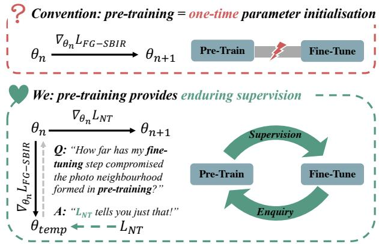
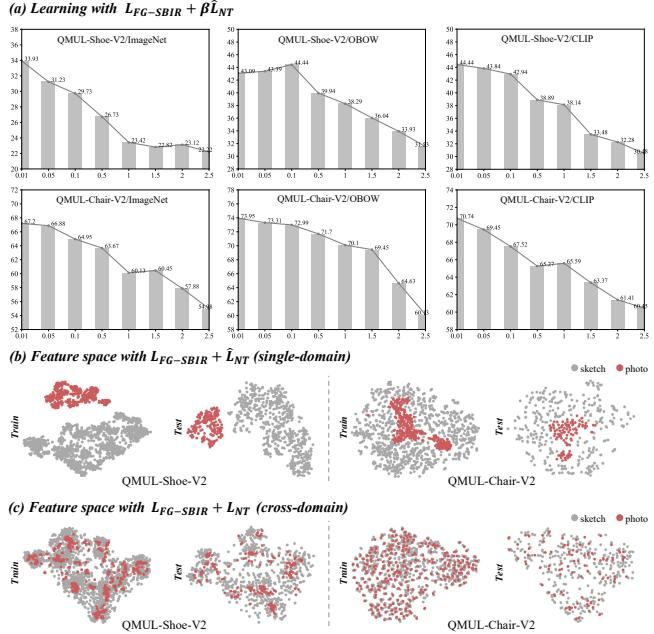
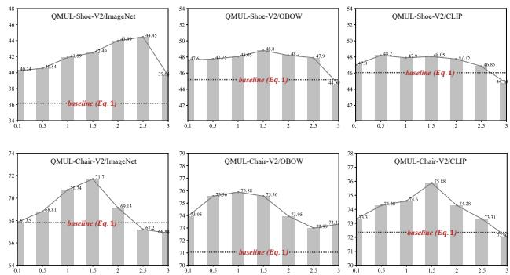
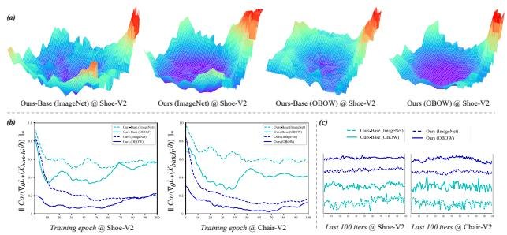
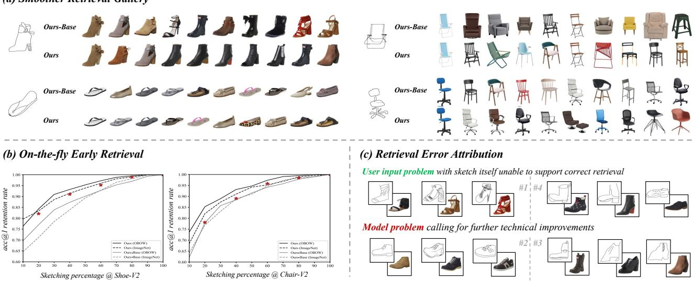

# Photo Pre-Training, But for Sketch

Ke Li1,2 Kaiyue Pang2 Yi-Zhe Song2

1 School of Artificial Intelligence, Beijing University of Posts and Telecommunications, China 2 SketchX, CVSSP, University of Surrey, United Kingdom

## Abstract

The sketch community has faced up to its unique challenges over the years, that of data scarcity however still remains the most significant to date. This lack of sketch data has imposed on the community a few “peculiar” design choices – the most representative of them all is perhaps the coerced utilisation of photo-based pre-training (i.e., no sketch),for many core tasks that otherwise dictates specific sketch understanding. In this paper, we ask just the one question – can we make such photo-based pre-training, to actually benefit sketch?

Our answer lies in cultivating the topology ofphoto data learned at pre-training, and use that as a “free” source of supervision for downstream sketch tasks. In particular, we use fine-grained sketch-based image retrieval (FG-SBIR), one of the most studied and data-hungry sketch tasks, to showcase our new perspective on pre-training. In this context, the topology-informed supervision learned from photos act as a constraint that take effect at every fine-tuning step – neighbouring photos in the pre-trained model remain neighbours under each FG-SBIR updates. We further portray this neighbourhood consistency constraint as a photo ranking problem and formulate it into a neat cross-modal triplet loss. We also show how this target is better leveraged as a meta objective rather than optimised in parallel with the main FG-SBIR objective.

With just this change on pre-training, we beat all previously published results on all five product-level FG-SBIR benchmarks with significant margins (sometimes >10%). And the most beautiful thing, as we note, is such gigantic leap is made possible within just a few extra lines of code! Our implementation is available at https: //github . com/KeLi - SketchX/Photo- Pre-Training-But-for-Sketch

## 1. Introduction

People sketch, from prehistoric times in caves, to nowadays on phones and tablets. The sketch community has consequently witnessed significant progress over the past decade, on fundamental tasks such as classification [19, 40, 74, 80], synthesis [15, 21, 26, 48, 65], to those more application-oriented such as fine-grained sketch-based image retrieval (FG-SBIR) [8,63,64,78]. Despite great strides made, the main barrier ironically lies with the very task itself – people do sketch, but not as much as they take photos!

  
Figure 1. We rejuvenate the role ofpre-training in FG-SBIR. We envisage a scenario where pre-training not only provides parameter initialisation as what the community is accustomed to, but also interacts with each FG-SBIR fine-tuning step as a crucial source of supervision. LFG-SBIR: FG-SBIR task loss. LNT: neighbourhood topology compliance loss sourced from a pre-train model.

As a result, the “largest” sketch datasets [11, 19, 21, 31, 37,38,64,78] are still on a scale of few hundreds/thousands per-category compared with its easily million-level photo counterparts [13, 43, 61, 77, 88].This means instead of performing sketch-specific pre-training, common practice in the community has been coerced to a two-stage process of pre-training on large-scale photo datasets, and later finetuning on sketch (or sketch-photo pairs for sketch to photo retrieval). Indeed, on the most studied problem of FG-SBIR, while we are seeing tremendous research efforts [6–8,48–51,57,62–64,67,78,79], none of them, to our best knowledge, gets away from the gravity of such a coerced pre-training strategy.

Just as how pre-training was shown to be instrumental in helping photo problems [10, 14, 58, 59, 82], in this paper, we task ourselves to achieve the same, but for sketch. Without further complicating things via obvious options such as sketch synthesis [6, 84] to augment pre-training, we set off to achieve this with photo-data only. The result is instead of putting forward a whole new sketch-specific pre-training strategy, we can adapt any pre-trained models (e.g. ImageNet classification [61], Jigsaw Puzzle [47,51], CLIP [58]) to work with sketch – all with just a few extra lines of code (therefore benefiting the community at mass).

We choose FG-SBIR as a testbed and anchor our thoughts on two follow-up questions: i) what knowledge do we seek from a pre-train model (the “what”), and ii) how to pass on that knowledge as a source of supervision for FG-SBIR (“the how”). Specifically, we instantiate the “what” part with neighbourhood-induced topology of photos found in the pre-trained feature space, and enforce the “how” by leveraging the learned photo topology to regularise the finetuning of FG-SBIR at every step. Putting together, a new learning principle for FG-SBIR is proposed. Apart from the traditional process of bringing sketch-photo pairs close in a unified metric space, model learning now dictates backward neighbourhood consistency checking with the pre-trained model, as shown schematically in Figure 1.

Our implementation does indeed take just a few more lines of code. This is achieved by formulating the above into a stochastic triplet ranking problem, and penalise cases where the relative ordering between photos is violated according to the pair-wise feature distance calculated by the pre-trained model. This formulation importantly makes the optimisation well-conditioned when combined with the main FG-SBIR loss, which is also in the form of a triplet loss. We further devise a better solution that treats the former (neighbourhood consistency) as a meta incentive to the latter (FG-SBIR learning). For that, we derive a computationally efficient framework to deal with the second-order nature of meta learning.

Extensive empirical evidence on (all) five existing product-level FG-SBIR datasets [1] demonstrates the superiority of our proposed approach – it consistently achieves new SoTA results, often with a significant margin and even beats human subjects on FG-SBIR according to recent findings reported by Qian et al. [79]. We wrap up the paper by spelling out the intriguing property of our FG-SBIR model in three practical applications, from supporting smoother retrieval photo gallery and early on-the-fly retrieval, to disentangling human factor in model error attribution.

## 1.1. Why our topology proposal works so well?

The performance of FG-SBIR models, we argue, boils down to handling subjective traits in sketch data (e.g. drawing skill, abstraction level). Such subjective differences often result in the trained models becoming heavily biased to the training sketch data distribution (i.e. a few seen styles), rather than developing a general understanding across all styles. One consequence, for example, is while most FG-SBIR systems often optimised to virtually zero training loss, they still perform nowhere close to practical adoption on small benchmarks like QMUL-Shoe-V2 (<50% acc@1 with a size of 200 photo gallery). Efforts to explicitly counter such style variability have only begun to emerge very recently, where the technical routes have been dichotomous: i) the power of data with the hope that model has “seen enough” in order to form a smoother test-time sketchphoto manifold [6, 84]. ii) modelling style explicitly with the aim to remove it altogether from the final sketch representation. [7, 63].

Our take on the other hand, is that there can never be enough sketch data to cover all styles, nor style itself can be perfectly disentangled. We resort to pre-trained photo manifold that is known to offer good generalisation on photo data already, and transfer only the “good” part to guide sketch learning – the neighbourhood topology. This auxiliary supervision importantly expands the model’s coverage beyond the FG-SBIR task itself. In that model learning can not easily overfit to a narrow spectrum of sketch styles anymore, but instead asked to respect the topology constraints inherited from a pre-trained natural photo manifold.

Related Work Beyond the obvious relation to FG-SBIR, our technical approach is also loosely linked to several other established fields, which we briefly explain their connections due to space limit. The first is knowledge distillation [23,29] often designed for model compression/acceleration; in analogy to the literature, we extract relation-based knowledge [52, 55] defined as neighbourhood topology among instances (vs. response [9, 83]/feature-based [53, 81]) and compress that into FG-SBIR task tuning in an offline distillation fashion [41,60] (vs. online [2,46]/self-based [73,85]). However, instead of the common assumption that knowledge source is a powerful teacher itself for the target task, FG-SBIR pre-training is often generally purposed and performs poorly for FG-SBIR [51]. Leveraging neighbourhood topology supervision from a pre-train model can also be seen as a way of generating pseudo labels [17, 24, 72], a longstanding technique adopted by semi-supervised learning [5, 34, 75]. The difference is we do not introduce extra dataset of unlabelled photos and constrain the label generation in one-time manner instead of updating it on the fly [5,25,56]. Lastly, (nearest) neighbourhood analysis is an important tool for many computer vision problems, from visual manipulation [16,28,69] to unsupervised feature learning [18, 27]. Most relevant to ours is the use of nearest neighbour search as a post-hoc query expansion method in photo retrieval [12,35,90] to boost performance. But unlike we treat photo neighbourhood structure as an indispensable property that model has to bear regardless of the new task adaptations, query expansion is a special case of graph reranking [87] to enhance the recall rate of a otherwise instance sensitive retrieval system. The system has not undertaken any representation learning itself.

## 2. Methodology

Overview Given a FG-SBIR benchmark X comprising of N photos $\{ p _ { 1 } , p _ { 2 } , . . . , p _ { N } \}$ and $\sum _ { i = 1 } ^ { N } p _ { i } ^ { m }$ sketches $\{ s _ { 1 } ^ { 1 } , s _ { 1 } ^ { 2 } . . . , s _ { 1 } ^ { p _ { 1 } ^ { m } } , s _ { 2 } ^ { 1 } , s _ { 2 } ^ { 2 } , . . . , s _ { 2 } ^ { p _ { 2 } ^ { m } } , . . . , s _ { N } ^ { 1 } , s _ { N } ^ { 2 } , . . . , s _ { N } ^ { p _ { N } ^ { m } } \}$ with $p _ { i } ^ { m }$ denoting the availability of sketch instances corresponding to one photo $p _ { i } ^ { 1 }$ , we aim to learn a shared sketch-photo embedding space $\Psi ( X ; \theta )$ from the training split of X that generalises to the test case scenarios – given a sketch query $s _ { t e s t }$ , its feature representation $\Psi ( s _ { t e s t } , \theta )$ is able to be closer to that of its corresponding photo than any other photos in the retrieval gallery. To achieve this goal, a simple but effective learning variant of triplet ranking loss has been proposed [64, 78] and is still being adopted today after the past six years of intense FG-SBIR developments. We write down this test of time FG-SBIR loss as follows:

$$
\begin{array} { r l } & { L _ { \mathrm { F G - S B I R } } ( X _ { b a t c h } ; \theta ) = \displaystyle \frac { 1 } { B } \sum _ { i = 1 } ^ { B } \operatorname* { m a x } _ { j \in [ 1 , p _ { i } ^ { m } ] } ( \Delta _ { s p } + } \\ & { d ( \Psi ( s _ { i } ^ { j } , \theta ) , \Psi ( p _ { i } , \theta ) ) - d ( \Psi ( s _ { i } ^ { j } , \theta ) , \Psi ( p _ { k \neq i } , \theta ) ) , 0 ) } \end{array}\tag{1}
$$

where d is often a $l _ { 2 }$ based measure, $\Delta$ is a heuristically set hyper-parameter. $p _ { k \neq i }$ means $p _ { k }$ serves as a negative contrastive target of $p _ { i }$ in the underlying training batch. The idea is then to push the corresponding sketch-photo pairs close and pull the non-matching ones apart, and see the learning process as complete provided that a safe distance margin has been achieved.

## 2.1. Neighbourhood Topology As Supervision

It raises two questions when comes to extracting the neighbourhood information from a pre-train model $\Phi ( \cdot )$ and leveraging it as another supervision source together with Eq. 1 for FG-SBIR task learning: (i) what kind of neighbourhood topology do we aim to model from potentially many available choices (e.g. nearest neighbour, knearest neighbour, graph), and more importantly (ii) how that topology modelling better suits its combination with the triplet-based objective $L _ { \mathrm { F G - S B I R } }$ . Our solution simulates a global modelling of topology-induced supervision and executes it with pairwise ranking trials – “global” examination maximally exploits all levels of neighbourhood information encoded in pre-training while “pairwise” means we can still formulate a contrastive form of supervision and make it well-conditioned in terms of working with $L _ { \mathrm { F G - S B I R } } .$ Specifically, given a training batch $X _ { b a t c h }$ with B sketchphoto pairs, we derive a ranking matrix R of size $B \times B \times B$ from $\Phi ( \cdot )$ where entry $R ( i , j , k )$ represents the ordering of relative feature distance (topology) for a photo triplet:

  
Figure 2. Neighbourhood supervision should be cross-domain. We show how $\hat { L } _ { \mathrm { N T } }$ failing to respect the cross-domain nature deteriorates FG-SBIR learning regardless of its strength (a: x-axis: $\beta ;$ y-axis: acc@1) and leads to feature space dissociating sketch and photo (b). The issue is tackled by our proposed LNT (c).

$$
R ( i , j , k ) = \left\{ \begin{array} { l l } { \begin{array} { c } { 1 , d ( \Phi ( p _ { i } ) , \Phi ( p _ { j } ) ) \leq d ( \Phi ( p _ { i } ) , \Phi ( p _ { k } ) ) } \\ { - 1 , d ( \Phi ( p _ { i } ) , \Phi ( p _ { j } ) ) > d ( \Phi ( p _ { i } ) , \Phi ( p _ { k } ) ) } \\ { \emptyset , \mathrm { i f ~ } i = j \mathrm { ~ o r ~ } i = k \mathrm { ~ o r ~ } j = k } \end{array} } \end{array} \right.\tag{2}
$$

$\mathcal { D }$ is a special token for self-identity serving for notation convenience only, in practice our photo triplet will always be constructed from three different photos. Also note that we do not calculate the batch-wise matrix R during FG-SBIR learning, which can be computational resource and time consuming. Instead, we calculate such a matrix for all training split photos in an offline manner so that R can be formed on-the-fly with some simple row and column selection operations depending on which photos to include.

With these preliminaries, we then ask R to take effect at every FG-SBIR fine-tuning step and punish the scenario where photo neighbourhood topology (NT) R represents is violated. We formulate it as another triplet ranking loss:

$$
\begin{array} { l } { \displaystyle \hat { L } _ { \mathrm { N T } } ( X _ { b a t c h } , \theta ) = \frac { 1 } { Z } \sum _ { i , j , k } m a x ( \Delta _ { \mathrm { N T } } + R ( i , j , k ) \times } \\ { \displaystyle \big [ d ( \Psi ( p _ { i } , \theta ) , \Psi ( p _ { j } , \theta ) ) - d ( \Psi ( p _ { i } , \theta ) , \Psi ( p _ { k } , \theta ) ) \big ] , 0 ) } \end{array}\tag{3}
$$

  
Figure 3. FG-SBIR performance under Eq. 5 and with different pre-training strategies. x-axis: task importance ratio $\beta / \alpha ; \mathbf { y }$ -axis: acc@1. LNT improves upon baseline for a wide range of ratio values on QMUL-Shoe/Chair-V2. ♠ SoTA: 43.7% [7]/69.1% [79].

where $Z$ is normalisation factor depending on how many stochastic triplets we form for each $p _ { i }$ . If we use $K \left( 1 \right) \leq$ $K \leq ( B - 1 ) ( B - 2 ) )$ to denote the number of triplets formed for $p _ { i } , Z = B \times K$ . We will provide ablations on the choice of K in our experiment session.

Caveat from Cross-Domain Ultimately, we are trying to solve a cross-domain problem. There is the risk that while the single-modal loss in Eq. 3 brings the extra regularisation, it restrains a model’s ability and flexibility to unify the sketch and photo domains. The problem is made more likely given $\Phi ( \cdot )$ is usually pre-trained on a benchmark dominated by photos (e.g. ImageNet, MS-COCO) and thus shares closer affinity to photos as in-distribution data and sketches otherwise. Empirically, we find this is exactly the case where introduction of Eq. 3 results in an almost complete separation of the feature space from two domains (Fig. 2 (b)) and always jeopardises FG-SBIR performance regardless of its relative strength in a multi-task setting (Fig. 2 (a)). How do we achieve the goal of maintaining neighbourhood topology and meanwhile respecting the cross-domain nature with minimal modifications on Eq. 3? Eq. 4 encodes our thoughts by simply substituting $p _ { i }$ with a random sketch $s _ { i } ^ { r } ( r \in [ 1 , p _ { i } ^ { m } ] )$ it corresponds to:

$$
\begin{array} { l } { { \displaystyle { \cal L } _ { \mathrm { N T } } ( X _ { b a t c h } , \theta ) = \frac { 1 } { Z } \sum _ { i , j , k } m a x ( \Delta _ { \mathrm { N T } } + R ( i , j , k ) \times } } \\ { { \displaystyle \bigl [ d ( \Psi ( s _ { i } ^ { r } , \theta ) , \Psi ( p _ { j } , \theta ) ) - d ( \Psi ( s _ { i } ^ { r } , \theta ) , \Psi ( p _ { k } , \theta ) ) \bigr ] , 0 ) } } \end{array}\tag{4}
$$

In Fig. 2 (c), we show $L _ { \mathrm { N T } }$ helps to greatly alleviate the problem induced by $\hat { L } _ { \mathrm { N T } }$ and is able to work synergistically with $L _ { \mathrm { F G - S B I R } }$ as shown in the following section.

## 2.2. Learning Together or Learning to Learn?

We explore two ways of combining loss functions $L _ { \mathrm { F G - S B I R } }$ and $L _ { \mathrm { N T } }$ . The first is seeing two objectives as parallel, i.e. a multi-task setting, where the other choice is to see $L _ { \mathrm { N T } }$ as a meta objective that any model updates rendered by $L _ { \mathrm { F G - S B I R } }$ should be compliant to the regularisation from $L _ { \mathrm { N T } } , i . e$ . learning to learn. Conceptually, the former will be inevitably suboptimal as the two objectives are essentially not equally important – we do have a primary task of FG-SBIR. However, from implementation perspective, the paradigm of learning to learn often brings a greater optimisation barrier [3,30,76] than that of multi-task, which leaves its practical performance less predictable. To wit, we first examine multi-task setting and show that such a setting can already improve upon the baseline and bring new SoTA performance for a wide range of combinations of task coefficients. We then derive a framework that efficiently implements the idea of learning-to-learning and helps to fulfil its potential as a better solution. We write down the objective for multi-task setting and report the results in Fig. 3:

$$
L _ { M u l t i } = \alpha \times L _ { \mathrm { F G - S B I R } } ( X _ { b a t c h } ; \theta ) + \beta \times L _ { \mathrm { N T } } ( X _ { b a t c h } ; \theta )\tag{5}
$$

It can be seen that $L _ { \mathrm { N T } }$ consistently brings better FG-SBIR performance as its weighting increases $( \beta / \alpha$ ↑) till a tipping cut point. The superiority is also not constrained to the specific pre-training method and works on different finegrained object categories.

$L _ { \mathrm { { N T } } }$ as Meta Objective Another way to regularise model learning from $L _ { \mathrm { N T } }$ is to respect the fact that FG-SBIR task learning is our primary goal and that all we need is to ensure its progress does not interfere with the neighbourhood topology induced from pre-training. This means $L _ { \mathrm { N T } }$ acts on an updated model, whose gradient descents are now rendered by $L _ { \mathrm { F G - S B I R } }$ . To prevent prohibitive computation cost due to expensive inner loop optimisation, we simulate the said process with one step of gradient step as with some past works [44, 45, 56] and formulate it as:

$$
\begin{array} { r l } & { \theta _ { t e m p } = \theta _ { n } - \eta _ { s } \nabla _ { \theta _ { n } } L _ { \mathrm { F G - S B I R } } ( X _ { b a t c h } ; \theta ) } \\ & { \theta _ { n + 1 } = \theta _ { t e m p } - \eta _ { t } \nabla _ { \theta _ { n } } L _ { \mathrm { N T } } ( X _ { b a t c h } ; \theta _ { t e m p } ) } \end{array}\tag{6}
$$

Applying chain rules expands $\nabla _ { \theta _ { n } } L _ { \mathrm { N T } } ( X _ { b a t c h } ; \theta _ { t e m p } )$ as:

$$
\begin{array} { r l } { \nabla _ { \theta _ { n } } L _ { \mathrm { N T } } ( X _ { b a t c h } ; \theta _ { t e m p } ) = \nabla _ { \theta _ { t e m p } } L _ { \mathrm { N T } } ( X _ { b a t c h } , \theta _ { t e m p } ) + } & { { } } \\ { \eta _ { s } \nabla _ { \theta _ { n } } ^ { 2 } L _ { \mathrm { F G - S B I R } } ( X _ { b a t c h } , \theta _ { n } ) \nabla _ { \theta _ { t e m p } } L _ { \mathrm { N T } } ( X _ { b a t c h } , \theta _ { t e m p } ) } & { { } } \end{array}\tag{7}
$$

The key rests on how we deal with the expensive Hessianvector products for deep models with million-scale parameters. Fortunately, we can substantially reduce the computational complexity using finite difference approximation [54]. Let ϵ be a small positive scalar and $\theta _ { n } ^ { \pm } = \theta _ { n } \pm$ $\epsilon \nabla _ { \theta _ { t e m p } } L _ { \mathrm { N T } } ( X _ { b a t c h } ; \theta _ { t e m p } )$ , we approximate ∇approx = $\nabla _ { \theta _ { n } } ^ { 2 } \tilde { L } _ { \mathrm { F G - S B I R } } ^ { \prime } ( X _ { b a t c h } , \theta _ { n } ) \nabla _ { \theta _ { t e m p } } L _ { \mathrm { N T } } ( X _ { b a t c h } , \theta _ { t e m p } )$ ≈ $\frac { \nabla _ { \theta _ { n } } L _ { \mathrm { F G - S B I R } } ( X _ { b a t c h } ; \theta _ { n } ^ { + } ) - \nabla _ { \theta _ { n } } L _ { \mathrm { F G - S B I R } } ( X _ { b a t c h } ; \theta _ { n } ^ { - } ) } { \gamma _ { c } }$ . Evaluating the finite difference then requires only two forward passes of $\theta _ { n } ^ { \pm }$ and two backward passes of $\theta _ { n } ,$ and the complexity is reduced from $O ( | \theta | ^ { 2 } )$ to $O ( | \theta | )$ . Putting together,

<table><tr><td>Benchmark</td><td>Multi-task (Eq.5)</td><td>Meta-full (Eq. 8)</td><td>Meta-first (Eq. 9)</td></tr><tr><td>QMUL-Shoe-V1</td><td>69.57%</td><td>73.91%</td><td>76.52%</td></tr><tr><td>QMUL-Shoe-V2</td><td>48.05%</td><td>49.75%</td><td>50.75%</td></tr><tr><td>QMUL-Chair-V1</td><td>97.94%</td><td>97.94%</td><td>98.97%</td></tr><tr><td>QMUL-Chair-V2</td><td>75.88%</td><td>76.21%</td><td>75.56%</td></tr><tr><td>QMUL-Handbag</td><td>70.24%</td><td>71.43%</td><td>72.02%</td></tr></table>

Table 1. $L _ { \mathrm { N T } }$ as meta objective is better than that as a parallel task. Our proposed solution serves as a first-order approximation to the full meta solution and achieves comparable or better performance while being significantly training memory efficient.

the update rule becomes:

$$
\begin{array} { r l } & { \theta _ { n + 1 } = \theta _ { n } - \eta _ { s } \nabla _ { \theta _ { n } } L _ { \mathrm { F G - S B I R } } ( X _ { b a t c h } ; \theta _ { n } ) } \\ & { \qquad - \eta _ { t } \nabla _ { \theta _ { t e m p } } L _ { \mathrm { N T } } ( X _ { b a t c h } , \theta _ { t e m p } ) - \eta _ { t } \eta _ { s } \nabla _ { a p p r o x } } \end{array}\tag{8}
$$

First-Order Approximation The term $\nabla _ { a p p r o x }$ in Eq. 8 contains second-order derivatives, which we strip off from our final formulation. We note that computation burden is not the reason we do so. While this second-order term can indeed double the wall-clock training time per epoch, the typical small size of FG-SBIR benchmark makes this extra computation cost reasonably affordable in practice (∼10 min/epoch). It is the less empirical success that leads us to the decision. In Tab. 1, we demonstrate the FG-SBIR performance learned under Eq. 8 with and without ∇approx and observe the introduction of extra second-order term can actually worsen the performance across benchmarks. Our hypothesis is that the coefficient $\eta _ { s } \eta _ { t }$ is already very small during implementations (1e-6∼1e-8) and thus next to a high-order noisy residual term. The harm of subjecting learning to such high variance can easily override the disadvantage of slight bias that cancelling $\nabla _ { a p p r o x }$ could have once caused. Our final learning objective is thus free from second-order terms and produce the results throughout the experimental session if not otherwise mentioned:

$$
\begin{array} { r l } & { \theta _ { n + 1 } = \theta _ { n } - \eta _ { s } \nabla _ { \theta _ { n } } L _ { F G - S B I R } ( X _ { b a t c h } ; \theta _ { n } ) } \\ & { \qquad - \eta _ { t } \nabla _ { \theta _ { t e m p } } L _ { N T } ( X _ { b a t c h } , \theta _ { t e m p } ) } \end{array}\tag{9}
$$

## 3. Results and Analysis

Baseline Comparison2 We compare with 14 existing FG-SBIR baselines and report their published numbers by copying from the papers. We denote our method as Ours (X) where X depends on the specific pre-training strategy, e.g. Ours (ImageNet [61]). We also delegate a default setting Ours for Ours (OBOW [22]), which represents the best performance across benchmark settings. Ours-Base (X) is the typical FG-SBIR learning under a triplet ranking loss LFG−SBIR without guidance of $L _ { \mathrm { N T } }$ and used for baseline control purpose. From Tab. 2, we can make following observations: i) Ours not only numerically represents the new SoTA FG-SBIR performance but also elevates benchmarking upper bound to a new level. For example, on the challenging Shoe-V2, we are able to achieve 50.75% acc@1, an absolute ∼ 7% improvement over the existing best reported number. It is also noteworthy that our method has for the first time beaten humans in a trial study conducted by [79], suggesting the possibility of putting our FG-SBIR system into real-world practical adoption. ii) Besides Shoe-V1, we find ResNet50, a particular CNN architecture rarely employed by FG-SBIR works before, gives to a significantly stronger benchmarking baseline, e.g. on Shoe-V2 (Chair-V2), Ours-Base (ImageNet) achieves 36.04% (67.82%) compared to the 32% ∼ 34% (50% ∼ 54%) reported by other CNN backbones $( e . g .$ InceptionV3). iii) Embarrassingly, Ours-Base (OBOW), a simple triplet ranking baseline but replacing the common ImageNet pre-training already brings the best result ever reported. Such success highlights the importance of choosing the right pre-training strategy for FG-SBIR, which has been long underestimated and requires more in-depth investigation. iv) Among the different representative types of pre-training strategies examined (supervised, contrastive/pretext self-supervision, unsupervised clustering, vision-language alignment), L consistently introduces extra improvements.

Engineering Practice Matters in $L _ { \mathrm { N T } }$ We have briefly described how to formulate $L _ { \mathrm { N T } }$ in Sec. 2.1 that given a query photo, we randomly compose K pairs of photos from the rest of current data batch and hope their relative distance ranking to the query aligns with those defined in R by a safe minimum margin $\Delta _ { \mathbf { N T } }$ Here we conduct ablations on three key (in bold) engineering choices and aim to show the dramatically different impacts they impose on FG-SBIR learning. Notably, different to our global approach (i.e. modelling relative neighbourhood for any triplet of photos), recent works [18, 91] see the top nearest neighbours as the only positives3, which we denote as Nearest in comparison with our Random. Results in Tab. 3 show that the performance is not sensitive to K, where a overly large K can slightly harm the performance. In a stark contrast, the choice of margin $\Delta _ { \mathrm { N T } }$ matters greatly. Since a larger margin value corresponds to a stronger regularisation effect from $L _ { \mathrm { N T } }$ , this implicates the need to carefully tuning that auxiliary strength as we have a primary task of FG-SBIR. The common approach of seeing neural nearest instances as neighbours is also inferior (44.14 % vs. 50.75%). We hypothesise the reason is due to the very fine-grained nature of our task. By assuming a prior that neighbours are always from a fixed set of few nearest photos, model is encouraged to take a biased shortcut by seeing those photos as less discriminating (while they are actually discriminative in the lens of FG-SBIR) instead of leveraging them to maintain the feature neighbourhood topology as expected.

<table><tr><td rowspan="2">Method</td><td colspan="3">Comments</td><td colspan="5">Dataset</td></tr><tr><td>Summary</td><td></td><td>Backbone</td><td>QMUL-Shoe-V1</td><td>QMUL-Shoe-V2</td><td>QMUL-Chair-V1</td><td>QMUL-Chair-V2</td><td>QMUL-Handbag</td></tr><tr><td>Yu et al. (CVPR16 [78])</td><td>Triplet Siamese</td><td></td><td>Sketch-a-Net</td><td>52.17%</td><td></td><td>72.16%</td><td></td><td></td></tr><tr><td>Song et al. (BMVC16 [66])</td><td>Attribute learning</td><td></td><td>Sketch-a-Net</td><td>50.43%</td><td></td><td>78.35%</td><td></td><td></td></tr><tr><td>Song et al. (ICCV17 [67])</td><td>Spatial attention</td><td></td><td>Sketch-a-Net</td><td>61.74%</td><td></td><td>81.44%</td><td></td><td>49.40%</td></tr><tr><td>Li et al. (TIP17 [39])</td><td>Multi-view alignment</td><td></td><td>GoogleNet‡</td><td>51.30%</td><td></td><td>79.38%</td><td></td><td></td></tr><tr><td>Radenovic et al. (ECCV18 [57])</td><td>Unsupervised shape matching</td><td></td><td>VGG-16‡</td><td>54.8%</td><td></td><td>85.6%</td><td></td><td></td></tr><tr><td>Lin et al. (ACMMM19 [42])</td><td>Retrieval by classification</td><td></td><td>DenseNet-169</td><td>63.48%</td><td>40.02%</td><td>95.88%</td><td></td><td></td></tr><tr><td>Bhunia et al. § (CVPR20 [8])</td><td>Early Retrieval with reward</td><td></td><td>InceptionV3</td><td></td><td>30.8%</td><td></td><td>51.2%</td><td></td></tr><tr><td>Pang et al. (CVPR20 [51])</td><td>Jigsaw pre-training</td><td></td><td>GoogleNet</td><td>56.52%</td><td>36.52%</td><td>85.98%</td><td></td><td>62.97%</td></tr><tr><td>Zhang et al. (ECCV20 [84])</td><td>Generative hashing</td><td></td><td>Sketch-a-Net</td><td>35.7%</td><td></td><td>67.1%</td><td></td><td></td></tr><tr><td>Sain et al. (BMVC20 [62])</td><td>Hierachical modelling</td><td></td><td>InceptionV3</td><td></td><td>36.27%</td><td></td><td>62.45%</td><td></td></tr><tr><td>Bhunia et al. (CVPR21 [6])</td><td>Help from unlabelled photos</td><td></td><td>InceptionV3</td><td></td><td>39.1%</td><td></td><td>60.2%</td><td></td></tr><tr><td>Sain et al. (CVPR21 [63])</td><td>Style-agnostic learning</td><td></td><td>InceptionV3</td><td></td><td>36.47%</td><td></td><td>62.86%</td><td></td></tr><tr><td>Yu et al. (IJCV21 [79])</td><td>Mid-level features</td><td></td><td>InceptionV3</td><td>66.1%</td><td>42.3%</td><td>91.8%</td><td>69.1%</td><td>61.9%</td></tr><tr><td>Bhunia et al. (CVPR22 [7]) Human Trials [79]</td><td>Noisy stroke removal</td><td></td><td>InceptionV3</td><td></td><td>43.7%</td><td></td><td>64.8%</td><td></td></tr><tr><td></td><td></td><td></td><td></td><td>66.09%</td><td>49.50%</td><td>94.85%</td><td>63.00%</td><td>50.00%</td></tr><tr><td>Ours-Base (ImageNet)</td><td>LFG-SBIR - Eq. 1</td><td></td><td>ResNet50</td><td>53.04%</td><td>36.04%</td><td>88.66%</td><td>67.82%</td><td>61.31%</td></tr><tr><td>Ours (ImageNet)</td><td> $\left\{ L _ { \mathrm { F G - S B I R } } , L _ { \mathrm { N T } } \right\} - \mathrm { E q . ~ } 9$ </td><td></td><td>ResNet50</td><td>67.83%</td><td>42.04%</td><td>94.85%</td><td>71.70%</td><td>65.48%</td></tr><tr><td>Ours-Base (Jigsaw)</td><td> $L _ { \mathrm { F G - S B I R } } - \mathrm { E q . ~ 1 }$ </td><td></td><td>ResNet50</td><td>56.52%</td><td>37.69%</td><td>90.72%</td><td>69.45%</td><td>62.50%</td></tr><tr><td>Ours (Jigsaw)</td><td> $\left\{ L _ { \mathrm { F G - S B I R } } , L _ { \mathrm { N T } } \right\} - \mathrm { E q . ~ } 9$ </td><td></td><td>ResNet50</td><td>69.57%</td><td>42.19%</td><td>94.85%</td><td>72.34%</td><td>66.67%</td></tr><tr><td>Ours-Base (Barlow Twins)</td><td>LFG-SBIR - Eq. 1</td><td></td><td>ResNet50</td><td>67.83%</td><td>44.29%</td><td>91.75%</td><td>69.13%</td><td>64.29%</td></tr><tr><td>Ours (Barlow Twins)</td><td> $\left\{ L _ { \mathrm { F G - S B I R } } , L _ { \mathrm { N T } } \right\} - \mathrm { E q . ~ } 9$ </td><td></td><td>ResNet50</td><td>72.17%</td><td>47.90% 46.10%</td><td>95.88% 93.81%</td><td>73.95%</td><td>68.45%</td></tr><tr><td>Ours-Base (CLIP)</td><td> $L _ { \mathrm { F G - S B I R } } - \mathrm { E q . ~ 1 }$   $\{ L _ { \mathrm { F G - S B I R } } , L _ { \mathrm { N T } } \} - \mathrm { E q . ~ } 9$ </td><td></td><td>ViT-B/32</td><td>70.43% 77.39%</td><td>49.70%</td><td>96.91%</td><td>72.35%</td><td>65.48%</td></tr><tr><td>Ours (CLIP)</td><td>LFG–SBIR – Eq. 1</td><td></td><td>ViT-B/32 ResNet50</td><td>68.70%</td><td>45.20%</td><td>92.78%</td><td>74.92% 71.06%</td><td>70.24%</td></tr><tr><td>Ours-Base (OBOW)</td><td> $\left\{ L _ { \mathrm { F G - S B I R } } , L _ { \mathrm { N T } } \right\} - \mathrm { E q . ~ } 9$ </td><td></td><td>ResNet50</td><td>76.52%</td><td>50.75%</td><td>98.97%</td><td></td><td>66.67%</td></tr><tr><td>Ours (OBOW)</td><td></td><td></td><td></td><td></td><td></td><td></td><td>75.56%</td><td>72.02%</td></tr></table>

Table 2. Comparison with existing FG-SBIR competitors. ‡ represents those non-parametric learning methods that only take backbone as a fixed feature extractors. Numbers for methods denoted with § are not reported in the original paper; we take it from their follow-up works. Ours (OBOW) is our final implementation throughout paper (hence shaded in light green).

<table><tr><td>NT type</td><td>K</td><td>∆NT</td><td>QMUL-Shoe-V2</td><td>QMUL-Chair-V2</td></tr><tr><td>Random</td><td>1</td><td>0.01</td><td>49.70%</td><td>73.95%</td></tr><tr><td>Random</td><td>50</td><td>0.01</td><td>48.80%</td><td>72.03%</td></tr><tr><td>Random</td><td>100</td><td>0.01</td><td>45.05%</td><td>70.42%</td></tr><tr><td>Random</td><td>10</td><td>0.01</td><td>50.75%</td><td>75.56%</td></tr><tr><td>Random</td><td>10</td><td>0.005</td><td>49.25%</td><td>73.31%</td></tr><tr><td>Random</td><td>10</td><td>0.05</td><td>45.50%</td><td>71.38%</td></tr><tr><td>Random</td><td>10</td><td>0.1</td><td>43.69%</td><td>67.52%</td></tr><tr><td>Nearest</td><td>1</td><td>0.01</td><td>45.05%</td><td>70.74%</td></tr><tr><td>Nearest</td><td>10</td><td>0.01</td><td>44.14%</td><td>70.10%</td></tr><tr><td>Nearest</td><td>10</td><td>0.005</td><td>44.30%</td><td>68.17%</td></tr></table>

Table 3. Ablation studies on the engineering choices in L . The row in grey shade represents the setting we use throughout the paper. More details in text.

R Sourced Beyond FG-SBIR Pre-training So far, we have required our acquisition of neighbourhood supervision R always sources from the same model (Φ) on which a FG-SBIR task is fine-tuned. A natural question is therefore if such binding is necessary for R to boost FG-SBIR performance or the way to obtain R can be done more flexibly. In Tab. 4, we experiment with different combinations where R comes from a third party that is irrelevant to the underlying pre-training strategy employed for FG-SBIR. We give a affirmative answer that there is no causal relation between the two. It seems that $R \ ( L _ { N T } )$ always helps as long as it comes from a general-purpose vision foundation model.

<table><tr><td rowspan="2" colspan="2">Eq.9 QMUL-Shoe-V2</td><td colspan="5">R source</td></tr><tr><td>INet [61]</td><td>JSaw [51]</td><td>BTwins [82]</td><td>CLIP [58]</td><td>OBOW [22]</td></tr><tr><td rowspan="5">Pre--ain</td><td>INet (36.04%)</td><td>42.04%</td><td>41.74%</td><td>42.64%</td><td>42.34%</td><td>43.99%</td></tr><tr><td>JSaw (37.69%)</td><td>42.64%</td><td>42.19%</td><td>42.94%</td><td>42.19%</td><td>44.29%</td></tr><tr><td>BTwin (44.29%)</td><td>46.55%</td><td>45.80%</td><td>47.90%</td><td>47.60%</td><td>48.20%</td></tr><tr><td>CLIP (46.10%)</td><td>48.35%</td><td>47.75%</td><td>50.30%</td><td>49.70%</td><td>51.35%</td></tr><tr><td>OBOW (45.20%)</td><td>48.80%</td><td>47.30%</td><td>50.45%</td><td>49.40%</td><td>50.75%</td></tr></table>

<table><tr><td rowspan="2" colspan="2">Eq.9 QMUL-Chair-V2</td><td colspan="5">R source</td></tr><tr><td>INet [61]</td><td>JSaw [51]</td><td>BTwins [82]</td><td>CLIP [58]</td><td>OBOW [22]</td></tr><tr><td rowspan="5">Pre-t-rain</td><td>INet (67.82%)</td><td>71.70%</td><td>70.74%</td><td>72.03%</td><td>72.35%</td><td>72.67%</td></tr><tr><td>JSaw (69.45%)</td><td>71.38%</td><td>72.34%</td><td>72.67%</td><td>72.03%</td><td>73.30%</td></tr><tr><td>BTwin (69.13%)</td><td>72.99%</td><td>72.03%</td><td>73.95%</td><td>73.31%</td><td>74.92%</td></tr><tr><td>CLIP (72.35%)</td><td>74.60%</td><td>73.31%</td><td>75.24%</td><td>74.92%</td><td>76.53%</td></tr><tr><td>OBOW (71.06%)</td><td>73.95%</td><td>72.99%</td><td>74.92%</td><td>74.90%</td><td>75.56%</td></tr></table>

Table 4. Performance when R is no longer required to be extracted from a FG-SBIR pre-train model. INet: ImageNet classification. JSaw: Jigsaw self-supervision. BTwin: Barlow Twins. Numbers on the diagonal is our main results as reported in Tab. 2.

The only coarse pattern we observe is a better FG-SBIR pretrain model (e.g. OBOW) is often a more effective source for extracting R, i.e. upper triangle performance is generally better than the lower counterpart on both shoe and chair dataset. Interestingly, our best number is with CLIP as pretraining strategy and OBOW as R source. While we believe the exact implication of such synergy is beyond the scope of this paper, it does suggest the potential improvements of our proposed framework when the choice of R and pre-training is given bigger freedom.

Generalisation Analysis In Sec. 1.1, we have provided intuitions on why $L _ { \mathrm { N T } }$ helps better FG-SBIR generalisation.

  
Figure 4. Generalisation Analysis. We visualise the loss landscapes in (a) to highlight the role of LNT in enabling flatter optima. (b) shows the nuclear norm of gradient estimates across different training epochs. High variance means gradient is close to random, while low variance implies a deterministic gradient estimate. Lower is better. With lower gradient variance, result reproducibility is improved as be seen in the stable test performance (mean normalised) among the last 100 training iterations (c).

We aim to understand such advantage with more rigour here via three different facets of empirical analysis: Visualising loss landscape: one way to probe into model generalisation is to qualitatively visualise its loss landscape. The connection between the geometry of the loss landscape – in particular the flatness of minima – and generalisation has been studied extensively in the literature [20, 32, 33]. We adopt the visualisation method by [36] (perturbations on model weights along two directions and conduct filter normalisation to circumvent scale invariance) and verify the loss landscapes for FG-SBIR models learned under Eq. 1 and Eq. 9. Results in Fig. 4(a) confirm that Ours with L renders optimal model parameters lying in neighbourhoods with uniformly low loss compared to the sharp minima in Our-Base by traditional FG-SBIR loss, and is therefore more generalisable. Covariance of gradients: Another way to peek into model’s generalisation capability is to quantitatively evaluate its training dynamics – we choose the variance of gradients to measure the goodness of fit of the underlying update. Specifically, we calculate the nuclear norm σ of covariance matrix of the gradients of samples across different training epochs, where a smaller value correspond to a lower variance and higher signal to noise ratio [71]. We plot σ distribution in Fig. 4(b) and can see that training with LFG−SBIR alone can’t yield a good signal especially at the early phase, a phase often known to learn generalisable and less task-specific features [4, 68, 70]. The analysis also gives an explanation to the reproducibility problem in FG-SBIR learning [51] that checkpoints of peak performance are often taking place in a short period and become elusive thereafter. The model simply can’t converge as σ value remains large near the end of learning. In this regard, our model should improve reproducibility as confirmed empirically (Fig. 4(c)). Robustness to input perturbations: As a last approach, we apply a set of random global (e.g. rotate, scale, translate) and local (e.g. stroke width/clipping) deformations to each stroke and examine how these perturbations affect the retrieval performance. We use svg disturber library from [89] and generate ten versions of deformations for each test sketch. On Shoe-V2, the average performance percentage drop by Ours-Base (ImageNet/OBOW) is 19.16(±3.48)/15.48(±3.11) compared with 13.84(±2.41)/12.27(±1.19) by Ours (ImageNet/OBOW). Similar trend is found on Chair-V2 with 10.08(±5.65)/11.96(±5.45) vs. 7.92(±3.82)/6.42(±2.64). Ours is better at defending robustness attack.

## 4. Application

The advantage of FG-SBIR models learned under our neighbourhood proposal is not limited to the traditional better benchmarking. We showcase three examples below to reveal more benefits from practical application perspective. Smoother Retrieval Gallery One side effect alongside LNT is a FG-SBIR system with top ranked photos representing a smoother transition (because we protect the dominant neighbourhood topology on natural photos against downstream task fine-tuning). The result is a more consistent viewing experience to end users that photos within their receptive field are relevant and subjected to further explorations beyond their original query (Fig. 5(a)). To evaluate quantitatively, we use the difference of features extracted from the second last layer of VGG-16 to measure the appearance similarity between a photo pair [86]. We calculate the mean of all pairwise feature distances within the Top 10 retrieved photos as smoothness score for Ours-Base (ImageNet/OBOW) and Ours (ImageNet/OBOW). Ours achieve a smaller mean (0.0264/0.0251 vs. 0.0296/0.0312 on Shoe-V2 and 0.0509/0.0493 vs. 0.0673/0.0695) on Chair-V2.

Support for Early Retrieval We have shown our proposal is more robust to stroke-level perturbation. Here we explore further to verify if similar conclusion still holds when we extend the robustness test to stroke deletions. A positive answer then contributes to an important application where users in practice are unwillingly to complete the full sketch episode and expect the system to response to its partial input as early as possible, a.k.a. on-the-fly FG-SBIR [7]. We plot the FG-SBIR performance curve with respect to different input sketch percentage in Fig. 5(b) and can see Ours-Base trails Ours by a large margin. Surprisingly, we find our method is comparable to the result of a complex RLbased approach [7] tailored for the problem, where in most cases, we can save ∼30% less strokes for users with almost no performance degradation.

Retrieval Error Attribution The unique trait of our retrieval result also allows for an analytical tool established for FG-SBIR for the first time: when an error is flagged, is the model not good enough or the human sketch input does? We identify four scenarios for such binary error attribution using the retrieval results of both Ours-Base and Ours; we denote the smoothness score (introduced earlier) among the top 5 retrieved photos by both models as $S _ { o u r s }$ and $S _ { b a s e } ,$ and fidelity score $F _ { o u r s }$ as the mean feature euclidean difference between the ground-truth photo and top 5 retrieved photos by Ours. Scenario 1: large $S _ { o u r s } ,$ large $F _ { o u r s } ;$ sketch input is of low quality that completely drifts away from the photo manifold – user’s problem. Scenario 2: small $S _ { o u r s }$ , small $F _ { o u r s } ;$ sketch falls nicely onto the photo manifold with similar photos and ground-truth nearby, but wrong retrieval. Model is not good enough – model’s problem. Scenario 3&4: small $S _ { o u r s }$ , large $F _ { o u r s } ,$ large/small $S _ { b a s e } ;$ Whether it is model’s problem that can’t deal with the test-time sketching styles or user’s problem that the input can’t support the granularity for instancelevel matching, the response by $S _ { o u r s }$ and $F _ { o u r s }$ is similar – sketches would fall onto the manifold but remain distant to the ground truth photo. To discriminate further, we resort to a third metric $S _ { b a s e }$ . The idea is simple, if $S _ { b a s e }$ is large, it is more likely that the input sketch belongs to an OOD rendition style that Ours-Base can’t easily adapt to (because without $L _ { \mathrm { N T } }$ , Ours-Base is sensitive to style variations); small $S _ { b a s e }$ then suggests otherwise that the culprit is due to the over simplistic of a sketch input (user’s problem). We visualise some typical examples from the incorrect retrieval results of Shoe-V2 for each scenario in Fig. 5(c) and conduct human trials to verify the accuracy. Specifically, we recruit 50 participants and ask each to conduct 20 trails. In each trial, a participant is shown with a sketch query and Top 4 matching photos along with the ground-truth photo and asked to choose one that best resembles the query. If users successfully pick the ground-truth, we regard this sketch input as problem-free and deem the wrong retrieval along with it as model’s problem. Among the total 30 trails, we reach consensus with human participants 74.36% of the time, confirming the efficacy of our approach.

  
Figure 5. We spell out the potential of our proposed method for three practical applications. In (a), we exemplify cases with successful top-1 retrieval under both Ours and Ours-Base can present significantly different retrieval gallery. Ours renders a visually smoother photo list and thus better viewing experience. Our framework also supports early retrieval setting (b) as a byproduct and achieves comparable results with purpose-built method (⋆ [8]). We further show not necessarily all retrieval errors come down to model incapability. Ours can help find out sketch inputs that are problematic in themselves. # refers to the four scenarios for error attribution. More details in text.

## 5. Conclusion

We have looked into the role of photo pre-training for sketch representation learning and argued that role is more than initialising parameters predominantly practised by the community today. We attested our hypothesis with FG-SBIR as a case study and suggested photo neighbourhood topology induced by pre-training could provide a crucial source of supervision for better FG-SBIR generalisation. Our key empirical results not only pushed the upper bound of FG-SBIR benchmarking to a new level but also empowered three novel applications all with the goal of improving the practical values of a FG-SBIR system. Another ambition of this paper is to have shed light on a promising future research path: FG-SBIR learning should look beyond a single task loss of itself and is better tackled as part of an ensemble of vision tasks (Sec. 1.1). We have made a small step towards this ambition by confirming the benefits of co-learning FG-SBIR with a task $( L _ { \mathrm { { N T } } } )$ abstracted from a much celebrated vision foundation model.

## References

[1] SketchX!-Shoe/Chair Fine-grained-SBIR dataset. http:// sketchx.ai, 2022. 2, 3

[2] Rohan Anil, Gabriel Pereyra, Alexandre Passos, Robert Ormandi, George E Dahl, and Geoffrey E Hinton. Large scale distributed neural network training through online distillation. In ICLR, 2018. 2

[3] Antreas Antoniou, Harrison Edwards, and Amos Storkey. How to train your MAML. In ICLR, 2019. 4

[4] Robert Baldock, Hartmut Maennel, and Behnam Neyshabur. Deep learning through the lens of example difficulty. NeurIPS, 2021. 7

[5] Mikhail Belkin, Partha Niyogi, and Vikas Sindhwani. Manifold regularization: A geometric framework for learning from labeled and unlabeled examples. Journal of machine learning research, 2006. 2

[6] Ayan Kumar Bhunia, Pinaki Nath Chowdhury, Aneeshan Sain, Yongxin Yang, Tao Xiang, and Yi-Zhe Song. More photos are all you need: Semi-supervised learning for finegrained sketch based image retrieval. In CVPR, 2021. 1, 2, 6

[7] Ayan Kumar Bhunia, Subhadeep Koley, Abdullah Faiz Ur Rahman Khilji, Aneeshan Sain, Pinaki Nath Chowdhury, Tao Xiang, and Yi-Zhe Song. Sketching without worrying: Noise-tolerant sketch-based image retrieval. In CVPR, 2022. 1, 2, 4, 6, 7

[8] Ayan Kumar Bhunia, Yongxin Yang, Timothy M Hospedales, Tao Xiang, and Yi-Zhe Song. Sketch less for more: On-the-fly fine-grained sketch-based image retrieval. In CVPR, 2020. 1, 6, 8

[9] Guobin Chen, Wongun Choi, Xiang Yu, Tony Han, and Manmohan Chandraker. Learning efficient object detection models with knowledge distillation. In NeurIPS, 2017. 2

[10] Liang-Chieh Chen, George Papandreou, Iasonas Kokkinos, Kevin Murphy, and Alan L Yuille. Deeplab: Semantic image segmentation with deep convolutional nets, atrous convolution, and fully connected crfs. IEEE transactions on pattern analysis and machine intelligence, 2017. 2

[11] Pinaki Nath Chowdhury, Aneeshan Sain, Ayan Kumar Bhunia, Tao Xiang, Yulia Gryaditskaya, and Yi-Zhe Song. Fscoco: Towards understanding of freehand sketches of common objects in context. In ECCV, 2022. 1

[12] Ondrej Chum, James Philbin, Josef Sivic, Michael Isard, and Andrew Zisserman. Total recall: Automatic query expansion with a generative feature model for object retrieval. In ICCV, 2007. 2

[13] Marius Cordts, Mohamed Omran, Sebastian Ramos, Timo Rehfeld, Markus Enzweiler, Rodrigo Benenson, Uwe Franke, Stefan Roth, and Bernt Schiele. The cityscapes dataset for semantic urban scene understanding. In CVPR, 2016. 1

[14] Zhigang Dai, Bolun Cai, Yugeng Lin, and Junying Chen. Up-detr: Unsupervised pre-training for object detection with transformers. In CVPR, 2021. 2

[15] Ayan Das, Yongxin Yang, Timothy M Hospedales, Tao Xiang, and Yi-Zhe Song. Cloud2curve: Generation and vectorization of parametric sketches. In CVPR, 2021. 1

[16] Carl Doersch, Saurabh Singh, Abhinav Gupta, Josef Sivic, and Alexei Efros. What makes paris look like paris? ACM Transactions on Graphics, 2012. 2

[17] WeiWang Dong-DongChen and Zhi-HuaZhou WeiGao. Trinet for semi-supervised deep learning. In IJCAI, 2018. 2

[18] Debidatta Dwibedi, Yusuf Aytar, Jonathan Tompson, Pierre Sermanet, and Andrew Zisserman. With a little help from my friends: Nearest-neighbor contrastive learning of visual representations. In ICCV, 2021. 2, 5

[19] Mathias Eitz, James Hays, and Marc Alexa. How do humans sketch objects? ACM Transactions on graphics, 2012. 1

[20] Pierre Foret, Ariel Kleiner, Hossein Mobahi, and Behnam Neyshabur. Sharpness-aware minimization for efficiently improving generalization. In ICLR, 2021. 7

[21] Songwei Ge, Vedanuj Goswami, Larry Zitnick, and Devi Parikh. Creative sketch generation. In International Conference on Learning Representations, 2021. 1

[22] Spyros Gidaris, Andrei Bursuc, Gilles Puy, Nikos Komodakis, Matthieu Cord, and Patrick Perez. Obow: Online bag-of-visual-words generation for self-supervised learning. In CVPR, 2021. 5, 6

[23] Jianping Gou, Baosheng Yu, Stephen J Maybank, and Dacheng Tao. Knowledge distillation: A survey. International Journal ofComputer Vision, 2021. 2

[24] Yves Grandvalet and Yoshua Bengio. Semi-supervised learning by entropy minimization. In NuerIPS, 2004. 2

[25] Jean-Bastien Grill, Florian Strub, Florent Altche, Corentin´ Tallec, Pierre Richemond, Elena Buchatskaya, Carl Doersch, Bernardo Avila Pires, Zhaohan Guo, Mohammad Gheshlaghi Azar, et al. Bootstrap your own latent-a new approach to self-supervised learning. In NeurIPS, 2020. 2

[26] David Ha and Douglas Eck. A neural representation of sketch drawings. In ICLR, 2018. 1

[27] Tengda Han, Weidi Xie, and Andrew Zisserman. Selfsupervised co-training for video representation learning. In NeurIPS, 2020. 2

[28] James Hays and Alexei A Efros. Scene completion using millions of photographs. ACM Transactions on Graphics, 2007. 2

[29] Geoffrey Hinton, Oriol Vinyals, Jeff Dean, et al. Distilling the knowledge in a neural network. arXiv preprint arXiv:1503.02531, 2015. 2

[30] Timothy Hospedales, Antreas Antoniou, Paul Micaelli, and Amos Storkey. Meta-learning in neural networks: A survey. IEEE transactions on pattern analysis and machine intelligence, 2021. 4

[31] Zhe Huang, Hongbo Fu, and Rynson WH Lau. Data-driven segmentation and labeling of freehand sketches. ACM Transactions on graphics, 2014. 1

[32] Yiding Jiang\*, Behnam Neyshabur\*, Hossein Mobahi, Dilip Krishnan, and Samy Bengio. Fantastic generalization measures and where to find them. In ICLR, 2020. 7

[33] Nitish Shirish Keskar, Dheevatsa Mudigere, Jorge Nocedal, Mikhail Smelyanskiy, and Ping Tak Peter Tang. On largebatch training for deep learning: generalization gap and sharp minima. In ICLR, 2017. 7

[34] Durk P Kingma, Shakir Mohamed, Danilo Jimenez Rezende, and Max Welling. Semi-supervised learning with deep generative models. In NeurIPS, 2014. 2

[35] Benjamin Klein and Lior Wolf. Learning query expansion over the nearest neighbor graph. In BMVC, 2021. 2

[36] Hao Li, Zheng Xu, Gavin Taylor, Christoph Studer, and Tom Goldstein. Visualizing the loss landscape of neural nets. In NeurIPS, 2018. 7

[37] Ke Li, Kaiyue Pang, Jifei Song, Yi-Zhe Song, Tao Xiang, Timothy M Hospedales, and Honggang Zhang. Universal sketch perceptual grouping. In ECCV, 2018. 1

[38] Ke Li, Kaiyue Pang, Yi-Zhe Song, Timothy Hospedales, Honggang Zhang, and Yichuan Hu. Fine-grained sketchbased image retrieval: The role of part-aware attributes. In WACV, 2016. 1

[39] Ke Li, Kaiyue Pang, Yi-Zhe Song, Timothy M Hospedales, Tao Xiang, and Honggang Zhang. Synergistic instance-level subspace alignment for fine-grained sketch-based image retrieval. IEEE Transactions on Image Processing, 2017. 6

[40] Lei Li, Changqing Zou, Youyi Zheng, Qingkun Su, Hongbo Fu, and Chiew-Lan Tai. Sketch-R2CNN: An rnnrasterization-cnn architecture for vector sketch recognition. IEEE Transactions on Visualization and Computer Graphics, 2020. 1

[41] Tianhong Li, Jianguo Li, Zhuang Liu, and Changshui Zhang. Few sample knowledge distillation for efficient network compression. In CVPR, 2020. 2

[42] Hangyu Lin, Yanwei Fu, Peng Lu, Shaogang Gong, Xiangyang Xue, and Yu-Gang Jiang. Tc-net for isbir: Triplet classification network for instance-level sketch based image retrieval. In ACM MM, 2019. 6

[43] Tsung-Yi Lin, Michael Maire, Serge Belongie, James Hays, Pietro Perona, Deva Ramanan, Piotr Dollar, and C Lawrence´ Zitnick. Microsoft coco: Common objects in context. In ECCV, 2014. 1

[44] Hanxiao Liu, Karen Simonyan, and Yiming Yang. DARTS: Differentiable architecture search. In ICLR, 2019. 4

[45] Shikun Liu, Andrew Davison, and Edward Johns. Selfsupervised generalisation with meta auxiliary learning. In NeurIPS, 2019. 4

[46] Seyed Iman Mirzadeh, Mehrdad Farajtabar, Ang Li, Nir Levine, Akihiro Matsukawa, and Hassan Ghasemzadeh. Improved knowledge distillation via teacher assistant. In AAAI, 2020. 2

[47] Mehdi Noroozi and Paolo Favaro. Unsupervised learning of visual representations by solving jigsaw puzzles. In ECCV, 2016. 2

[48] Kaiyue Pang, Da Li, Jifei Song, Yi-Zhe Song, Tao Xiang, and Timothy M Hospedales. Deep factorised inversesketching. In ECCV, 2018. 1

[49] Kaiyue Pang, Ke Li, Yongxin Yang, Honggang Zhang, Timothy M Hospedales, Tao Xiang, and Yi-Zhe Song. Generalising fine-grained sketch-based image retrieval. In CVPR, 2019. 1

[50] Kaiyue Pang, Yi-Zhe Song, Tony Xiang, and Timothy M Hospedales. Cross-domain generative learning for finegrained sketch-based image retrieval. In BMVC, 2017. 1

[51] Kaiyue Pang, Yongxin Yang, Timothy M Hospedales, Tao Xiang, and Yi-Zhe Song. Solving mixed-modal jigsaw puzzle for fine-grained sketch-based image retrieval. In CVPR, 2020. 1, 2, 6, 7

[52] Wonpyo Park, Dongju Kim, Yan Lu, and Minsu Cho. Relational knowledge distillation. In CVPR, 2019. 2

[53] Nikolaos Passalis and Anastasios Tefas. Learning deep representations with probabilistic knowledge transfer. In ECCV, 2018. 2

[54] Barak A Pearlmutter. Fast exact multiplication by the hessian. Neural computation, 1994. 4

[55] Baoyun Peng, Xiao Jin, Jiaheng Liu, Dongsheng Li, Yichao Wu, Yu Liu, Shunfeng Zhou, and Zhaoning Zhang. Correlation congruence for knowledge distillation. In ICCV, 2019. 2

[56] Hieu Pham, Zihang Dai, Qizhe Xie, and Quoc V Le. Meta pseudo labels. In CVPR, 2021. 2, 4

[57] Filip Radenovic, Giorgos Tolias, and Ondrej Chum. Deep shape matching. In ECCV, 2018. 1, 6

[58] Alec Radford, Jong Wook Kim, Chris Hallacy, Aditya Ramesh, Gabriel Goh, Sandhini Agarwal, Girish Sastry, Amanda Askell, Pamela Mishkin, Jack Clark, Gretchen Krueger, and Ilya Sutskever. Learning transferable visual models from natural language supervision. In ICML, 2021. 2, 6

[59] Shaoqing Ren, Kaiming He, Ross Girshick, and Jian Sun. Faster r-cnn: Towards real-time object detection with region proposal networks. NeurIPS, 2015. 2

[60] Adriana Romero, Nicolas Ballas, Samira Ebrahimi Kahou, Antoine Chassang, Carlo Gatta, and Yoshua Bengio. Fitnets: Hints for thin deep nets. In ICLR, 2015. 2

[61] Olga Russakovsky, Jia Deng, Hao Su, Jonathan Krause, Sanjeev Satheesh, Sean Ma, Zhiheng Huang, Andrej Karpathy, Aditya Khosla, Michael Bernstein, et al. Imagenet large scale visual recognition challenge. International Journal of Computer Vision, 2015. 1, 2, 5, 6

[62] Aneeshan Sain, Ayan Kumar Bhunia, Yongxin Yang, Tao Xiang, and Yi-Zhe Song. Cross-modal hierarchical modelling for fine-grained sketch based image retrieval. In BMVC, 2020. 1, 6

[63] Aneeshan Sain, Ayan Kumar Bhunia, Yongxin Yang, Tao Xiang, and Yi-Zhe Song. Stylemeup: Towards style-agnostic sketch-based image retrieval. In CVPR, 2021. 1, 2, 6

[64] Patsorn Sangkloy, Nathan Burnell, Cusuh Ham, and James Hays. The sketchy database: learning to retrieve badly drawn bunnies. ACM Transactions on Graphics, 2016. 1, 3

[65] Jifei Song, Kaiyue Pang, Yi-Zhe Song, Tao Xiang, and Timothy M Hospedales. Learning to sketch with shortcut cycle consistency. In CVPR, 2018. 1

[66] Jifei Song, Yi-Zhe Song, Tao Xiang, Timothy M Hospedales, and Xiang Ruan. Deep multi-task attribute-driven ranking for fine-grained sketch-based image retrieval. In BMVC, 2016. 6

[67] Jifei Song, Qian Yu, Yi-Zhe Song, Tao Xiang, and Timothy M Hospedales. Deep spatial-semantic attention for finegrained sketch-based image retrieval. In ICCV, 2017. 1, 6

[68] Petru Soviany, Radu Tudor Ionescu, Paolo Rota, and Nicu Sebe. Curriculum learning: A survey. International Journal ofComputer Vision, 2022. 7

[69] James Thewlis, Samuel Albanie, Hakan Bilen, and Andrea Vedaldi. Unsupervised learning of landmarks by descriptor vector exchange. In ICCV, 2019. 2

[70] Dmitry Ulyanov, Andrea Vedaldi, and Victor Lempitsky. Feldman (2019). In CVPR, 2018. 7

[71] Chao-Yuan Wu, R Manmatha, Alexander J Smola, and Philipp Krahenbuhl. Sampling matters in deep embedding learning. In ICCV, 2017. 7

[72] Qizhe Xie, Minh-Thang Luong, Eduard Hovy, and Quoc V Le. Self-training with noisy student improves imagenet classification. In CVPR, 2020. 2

[73] Chenglin Yang, Lingxi Xie, Chi Su, and Alan L Yuille. Snapshot distillation: Teacher-student optimization in one generation. In CVPR, 2019. 2

[74] Lan Yang, Kaiyue Pang, Honggang Zhang, and Yi-Zhe Song. Sketchaa: Abstract representation for abstract sketches. In ICCV, 2021. 1

[75] Xiangli Yang, Zixing Song, Irwin King, and Zenglin Xu. A survey on deep semi-supervised learning. arXiv preprint arXiv:2103.00550, 2021. 2

[76] Han-Jia Ye and Wei-Lun Chao. How to train your MAML to excel in few-shot classification. In ICLR, 2022. 4

[77] Aron Yu and Kristen Grauman. Fine-grained visual comparisons with local learning. In CVPR, 2014. 1

[78] Qian Yu, Feng Liu, Yi-Zhe Song, Tao Xiang, Timothy M Hospedales, and Chen-Change Loy. Sketch me that shoe. In CVPR, 2016. 1, 3, 6

[79] Qian Yu, Jifei Song, Yi-Zhe Song, Tao Xiang, and Timothy M Hospedales. Fine-grained instance-level sketch-based image retrieval. International Journal of Computer Vision, 2021. 1, 2, 4, 5, 6

[80] Qian Yu, Yongxin Yang, Yi-Zhe Song, Tao Xiang, and Timothy Hospedales. Sketch-a-net that beats humans. In BMVC, 2015. 1

[81] Sergey Zagoruyko and Nikos Komodakis. Paying more attention to attention: Improving the performance of convolutional neural networks via attention transfer. In ICLR, 2017. 2

[82] Jure Zbontar, Li Jing, Ishan Misra, Yann LeCun, and Stephane Deny. Barlow twins: Self-supervised learning via redundancy reduction. In ICML, 2021. 2, 6

[83] Feng Zhang, Xiatian Zhu, and Mao Ye. Fast human pose estimation. In CVPR, 2019. 2

[84] Jingyi Zhang, Fumin Shen, Li Liu, Fan Zhu, Mengyang Yu, Ling Shao, Heng Tao Shen, and Luc Van Gool. Generative domain-migration hashing for sketch-to-image retrieval. In ECCV, 2018. 2, 6

[85] Linfeng Zhang, Jiebo Song, Anni Gao, Jingwei Chen, Chenglong Bao, and Kaisheng Ma. Be your own teacher: Improve the performance of convolutional neural networks via self distillation. In ICCV, 2019. 2

[86] Richard Zhang, Phillip Isola, Alexei A Efros, Eli Shechtman, and Oliver Wang. The unreasonable effectiveness of deep features as a perceptual metric. In CVPR, 2018. 7

[87] Xuanmeng Zhang, Minyue Jiang, Zhedong Zheng, Xiao Tan, Errui Ding, and Yi Yang. Understanding image retrieval reranking: a graph neural network perspective. arXiv preprint arXiv:2012.07620, 2020. 3

[88] Liang Zheng, Zhi Bie, Yifan Sun, Jingdong Wang, Chi Su, Shengjin Wang, and Qi Tian. Mars: A video benchmark for large-scale person re-identification. In ECCV, 2016. 1

[89] Yue Zhong, Yulia Gryaditskaya, Honggang Zhang, and Yi-Zhe Song. Deep sketch-based modeling: Tips and tricks. In 3DV, 2020. 7

[90] Zhun Zhong, Liang Zheng, Donglin Cao, and Shaozi Li. Reranking person re-identification with k-reciprocal encoding. In CVPR, 2017. 2

[91] Pengkai Zhu, Zhaowei Cai, Yuanjun Xiong, Zhuowen Tu, Luis Goncalves, Vijay Mahadevan, and Stefano Soatto. Contrastive neighborhood alignment. arXiv preprint arXiv:2201.01922, 2022. 5