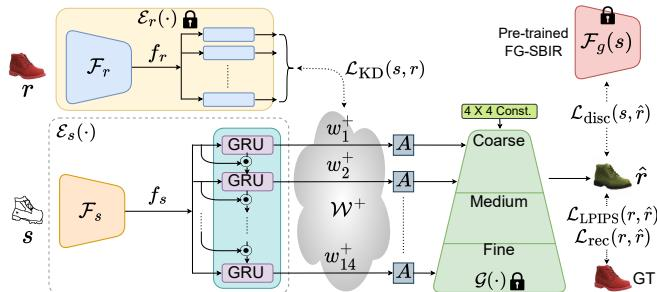
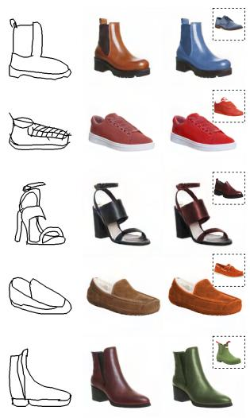
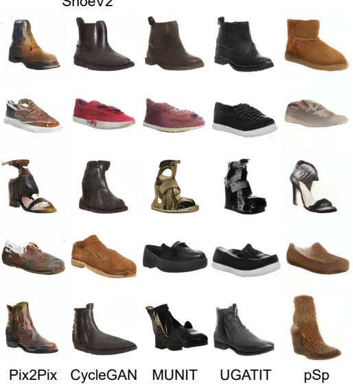
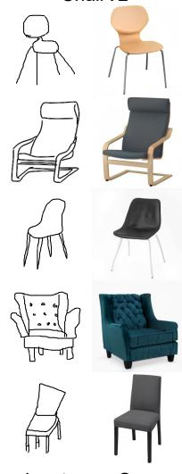
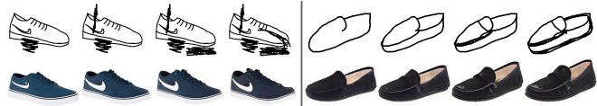
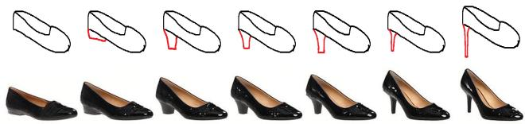
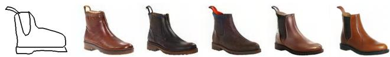

# Picture that Sketch: Photorealistic Image Generation from Abstract Sketches

Subhadeep Koley1,2 Ayan Kumar Bhunia1 Aneeshan Sain1,2 Pinaki Nath Chowdhury1,2 Tao Xiang1,2 Yi-Zhe Song1,2

1SketchX, CVSSP, University of Surrey, United Kingdom. 2iFlyTek-Surrey Joint Research Centre on Artificial Intelligence.

{s.koley, a.bhunia, a.sain, p.chowdhury, t.xiang, y.song}@surrey.ac.uk

  
Figure 1. (a) Set of photos generated by the proposed method. (b) While existing methods can generate faithful photos from perfectly pixel-aligned edgemaps, they fall short drastically in case of highly deformed and sparsefree-hand sketches. In contrast, our autoregressive sketch-to-photo generation model produces highly photorealistic outputs from highly abstract sketches.

## Abstract

Given an abstract, deformed, ordinary sketch from untrained amateurs like you and me, this paper turns it into a photorealistic image – just like those shown in Fig. 1(a), all non-cherry-picked. We differ significantly from prior art in that we do not dictate an edgemap-like sketch to start with, but aim to work with abstract free-hand human sketches. In doing so, we essentially democratise the sketchto-photo pipeline, “picturing” a sketch regardless of how good you sketch. Our contribution at the outset is a decoupled encoder-decoder training paradigm, where the decoder is a StyleGAN trained on photos only. This importantly ensures that generated results are always photorealistic. The rest is then all centred around how best to deal with the abstraction gap between sketch and photo. For that, we propose an autoregressive sketch mapper trained on sketch-photo pairs that maps a sketch to the StyleGAN latent space. Wefurther introduce specific designs to tackle the abstract nature of human sketches, including a finegrained discriminative loss on the back ofa trained sketchphoto retrieval model, and a partial-aware sketch augmentation strategy. Finally, we showcase a few downstream tasks our generation model enables, amongst them is showing how fine-grained sketch-based image retrieval, a wellstudied problem in the sketch community, can be reduced to an image (generated) to image retrieval task, surpassing state-of-the-arts. We put forward generated results in the supplementary for everyone to scrutinise. Project page: https://subhadeepkoley.github.io/PictureThatSketch

## 1. Introduction

People sketch, some better than others. Given a shoe image like ones shown in Fig. 1(a), everyone can scribble a few lines to depict the photo, again mileage may vary – top left sketch arguably lesser than that at bottom left. The opposite, i.e., hallucinating a photo based on even a very abstract sketch, is however something humans are very good at having evolved on the task over millions of years. This seemingly easy task for humans, is exactly one that this paper attempts to tackle, and apparently does fairly well at – given an abstract sketch from untrained amateurs like us, our paper turns it into a photorealistic image (see Fig. 1).

This problem falls into the general image-to-image translation literature [41, 64]. Indeed, some might recall prior arts (e.g., pix2pix [41], CycleGAN [105], MUNIT [38], BicycleGAN [106]), and sketch-specific variants [33, 86] primarily based on pix2pix [41] claiming to have tackled the exact problem. We are strongly inspired by these works, but significantly differ on one key aspect – we aim to generate from abstract human sketches, not accurate photo edgemaps which are already “photorealistic”.

This is apparent in Fig. 1(b), where when edgemaps are used prior works can hallucinate high-quality photorealistic photos, whereas rather “peculiar” looking results are obtained when faced with amateur human sketches. This is because all prior arts assume pixel-alignment during translation – so your drawing skill (or lack of it), got accurately reflected in the generated result. As a result, chance is you and me will not fetch far on existing systems if not art-trained to sketch photorealistic edgemaps – we, in essence, democratise the sketch-to-photo generation technology, “picturing” a sketch regardless of how good you sketch.

Our key innovation comes after a pilot study where we discovered that the pixel-aligned artefact [69] in prior art is a direct result of the typical encoder-decoder [41] architecture being trained end-to-end – this enforces the generated results to strictly follow boundaries defined in the input sketch (edgemap). Our first contribution is therefore a decoupled encoder-decoder training, where the decoder is pre-trained StyleGAN [46] trained on photos only, and is frozen once trained. This importantly ensures generated results are sampled from the StyleGAN [46] manifold therefore of photorealistic quality.

The second, perhaps more important innovation lies with how we bridge the abstraction gap [20, 21, 36] between sketch and photo. For that, we propose to train an encoder that performs a mapping from abstract sketch representation to the latent space of the learned latent space of Style-GAN [46] (i.e., not actual photos as per the norm). To train this encoder, we use ground-truth sketch-photo pairs, and impose a novel fine-grained discriminative loss between the input sketch and the generated photo, together with a conventional reconstruction loss [102] between the input sketch and the ground-truth photo, to ensure the accuracy of this mapping process. To double down on dealing with the abstract nature of sketches, we further propose a partial-aware augmentation strategy where we render partial versions of a full sketch and allocate latent vectors accordingly (the more partial the input, the lesser vectors assigned).

Our autoregressive generative model enjoys a few interesting properties once trained: (i) abstraction level (i.e., how well the fine-grained features in a sketch are reflected in the generated photo) can be easily controlled by altering the number of latent vectors predicted and padding the rest with Gaussian noise, (ii) robustness towards noisy and partial sketches, thanks to our partial-aware sketch augmentation strategy, and (iii) good generalisation on input sketches across different abstraction levels (from edgemaps, to sketches across two datasets). We also briefly showcase two potential downstream tasks our generation model enables: fine-grained sketch-based image retrieval (FG-SBIR), and precise semantic editing. On the former, we show how FG-SBIR, a well-studied task in the sketch community [10,71–73], can be reduced to an image (generated) to image retrieval task, and that a simple nearest-neighbour model based on VGG-16 [78] features can already surpass state-of-the-art. On the latter, we demonstrate how precise local editing can be done that is more fine-grained than those possible with text and attributes.

We evaluate using conventional metrics (FID, LPIPS), plus a new retrieval-informed metric to demonstrate superior performance. But, as there is no better way to convince the jury other than presenting all facts, we offer all generated results in the supplementary for everyone to scrutinise.

## 2. Related Works

Image-to-Image Translation: Images from source domain can be translated to a specific target domain through a learned generative mapping function, to perform tasks like semantic label-map to RGB [65], day-to-night [41], edgemap-to-photo [41] translations. Following the advent of deep neural networks, the seminal work of pix2pix [41] introduced a unified framework that trains a U-Net-based generator [70] with a weighted summation of reconstruction and adversarial GAN losses [41]. It essentially generates a pixel-to-pixel mapped output $I ^ { \prime } ( x , y )$ in the target domain corresponding to input $I ( x , y )$ from source domain [41]. This has consequently laid foundation to various vision tasks, like image colourisation [90], conditional image generation [18,38], style-transfer [105], inpainting [34] and enhancements [51, 67, 105]. Furthermore, pix2pix first illustrated generation of pixel-perfect photos [41] even from sparse line drawings like edgemaps. However, making it work forfree-hand sketch is still an open problem as sketch is highly abstract [58], lacking alignment, unlike edgemaps. Sketch-to-Photo Generation: Photorealistic image (photo) generation from free-hand sketches is still in its infancy, despite significant advances on various sketchbased vision tasks [9, 11, 73, 84, 91]. Pix2pix [41] forms the basis for most of the recent deep learning-based sketchto-photo generation frameworks (Table 1). Particularly they use either GAN-based models [16, 29] with conditional self-attention [53], feature manifold projection [15], domain adaptation [89], two-stage generation [30], or contextual loss [58]. Nonetheless, the majority of these works [15, 53] are restricted to using edgemaps as a pseudo sketch-replacement for model training. However, a free-hand sketch [62] with human-drawn sparse and abstract strokes, is a way of conveying the “semantic intent”, and largely differs [58] from an edgemap. While edgemap perfectly aligns with photo boundaries, a sketch is a human abstraction of any object/concept, usually with strong deformations [58]. To alleviate this, earlier attempts have been made via unsupervised training [57, 97] by excluding paired sketch-photo data, or using specific loss functions [58]. The generated images nevertheless follow the sketch boundaries, yielding deformed photos.

GAN for Vision Tasks: In a typical GAN model, the generator directly produces new samples from random noise vectors while the discriminator aims to differentiate between real and generator-produced fake samples, improving each other via an adversarial game [31]. With significant progress in design [13,44,45], GAN-based methods secured success in a variety of downstream tasks like video generation [26], image inpainting [99], manipulation [42], [104], super-resolution [28], etc. Generating highly photorealistic outputs, StyleGAN [46, 47] introduced a non-linear mapping from input code vector $z \in { \mathcal { Z } }$ to intermediate latent code $w \in \mathcal { W } ,$ , which controlled the generation process. While traditional GAN is unable to generate conditional output, it can be augmented with additional information to conditionally control the data generation process [61]. However, existing conditional generative [55, 79] models are unable to inject fine-grained control, especially when conditioned with abstract free-hand sketches.

Table 1. Recent sketch-to-photo generation literature can be grouped $\mathrm { a s } - ( i )$ Categorical, (ii) Semi Fine-Grained (FG), (iii) Scene-level, and (iv) Facial-Photo. Additionally, we summarise existing state-of-the-arts in terms of training data preparation and salient design choices.
<table><tr><td>Paper</td><td>Category</td><td>Type of Sketch</td><td>Data Preparation + Salient Design Component</td></tr><tr><td>SketchyGAN [16] iSketch&amp;Fill [30]</td><td>Categorical Categorical</td><td>Synth+Real</td><td>• Fully automatic edgemap augmentation + input injection at multiple layers</td></tr><tr><td>CoGS [33]</td><td>Categorical</td><td>Šynthetic Synth+Real</td><td>• Edgemap creation with Îm2Pencil [54] and sketch-simplification [77] + ResNet [35] generator. • Saliency with [40] for synthetic sketches + VQ-GAN [25] with VAE over codebook vectors.</td></tr><tr><td></td><td></td><td></td><td></td></tr><tr><td>ContextGAN [58]</td><td>Semi-FG</td><td>Synthetic</td><td>• Synthetic sketch generation with XDoG [87] and [43] + optimisation-based GAN inversion.</td></tr><tr><td>Two-Stage [57]</td><td>Semi-FG</td><td>Real</td><td>• Synthetic noisy-stroke for augmentation + two-stage sketch-to-edgemap-to-photo generation.</td></tr><tr><td>SYO-GAN [86]</td><td>Semi-FG</td><td>Synthetic</td><td>• Pseudo sketch creation with PhotoSketch [52] + fine-tuning GAN model with a few pose-specific sketches.</td></tr><tr><td>SketchyCOCO [29]</td><td>Scene-level</td><td>Semi-real</td><td>• Synthetic scene sketch + generation of foreground object followed by contextual background.</td></tr><tr><td>Two-Stage [85]</td><td>Scene-level</td><td>Synthetic</td><td>• Edgemaps generated with [66] + edgemap standardisation followed by content-style disentanglement.</td></tr><tr><td></td><td></td><td></td><td></td></tr><tr><td>DeepFaceDraw [15]</td><td>Facial photo</td><td>Synthetic</td><td>• Photocopy filter and [77] for training data + region-wise embedding with 2-stage generation.</td></tr><tr><td>Controlled S2I [96]</td><td>Facial photo</td><td>Synthetic</td><td>• HED [92] for edgemāps + dilation-based sketch refinement network for adapting edge-based models.</td></tr><tr><td>Proposed</td><td>Fine-grained</td><td> $\mathrm { \Delta \stackrel { \circ } { R e a l } }$ </td><td>• Unlabelled photos &amp; sketch-photo pairs + autoregressive latent-mapper &amp; pre-trained StyleGAN [46]</td></tr></table>

GAN Inversion: Exploring GANs has recently led to an interest in inverting a pre-trained GAN [4] for tasks like image manipulation [4]. Typical GAN training aims to learn the weights of generator and discriminator with appropriate loss objectives, to generate random new images $G ( z )$ by sampling random noise vectors $z \in \mathcal { Z } \left[ 3 1 \right]$ . Contrarily, during GAN inversion, given a reference image we try to find a noise vector $z ^ { * }$ in the generator latent space that can accurately reconstruct that image while its weights fixed [104]. While some methods [1,2,22,23] directly optimise the latent vector to minimise the reconstruction loss, a few works [4,32,69,82] train dedicated encoders to find the latent code corresponding to an input image. Among them, optimisation-based methods perform better in terms of reconstruction accuracy, while encoding-based methods work significantly faster. Other methods [5, 103], take a hybrid approach in order to attain “the best of both worlds” [88]. However, images from different domain $( e . g .$ , semantic label map, edgemap) are not invertible into the latent space of a photo pre-trained generator [6]. Consequently, end-to-end trainable methods [3,14,63,69] emerged which aims to map a given image (from a source domain) into the latent space of a pre-trained GAN trained with target domain images. These learned encoders are then used in tasks like, inversion [4], semantic editing [4], super-resolution [60], face frontalisation [69], inpainting [69].

## 3. Pilot Study: Problems and Analysis

Challenges: Sketches being highly abstract in nature, generating a photo from a sketch can have multiple possible outcomes [69]. Generating photorealistic images from sparse sketches incurs three major challenges – (i) Localitybias assumes that any particular output (e.g., photo) pixel position $I ^ { \prime } ( x , y )$ is perfectly aligned with the same pixel location $I ( x , y )$ of the conditional input (e.g., sketch) [69]. However, a free-hand sketch being highly deformed does not necessarily follow the paired photo’s intensity boundary [36]. (ii) Hallucinating the colour/texture in a realistic and contextually-meaningful manner, is difficult from sparse sketch input. (iii) Deciphering the fine-grained userintent is a major bottleneck as the same object can be sketched in diverse ways by different users [75].

Analysis: The popular encoder-decoder architecture [41] for converting an input sketch $s$ to output RGB photo R via image-to-image translation [41] can be formulated as:

$$
P ( \mathcal { R } | \mathcal { S } ) = \underbrace { P ( \mathcal { Z } | \mathcal { S } ) } _ { \mathrm { E n c o d e r } } \underbrace { P ( \mathcal { R } | \mathcal { Z } ) } _ { \mathrm { D e c o d e r } }\tag{1}
$$

where the encoder $P ( { \mathcal { Z } } | S )$ embeds the sketch into a latent feature Z, from which the decoder $P ( \mathcal { R } | \mathcal { Z } )$ generates the output photo. Existing works [18, 38, 105] have evolved through designing task-specific encoder/decoder frameworks. Despite achieving remarkable success in other image translation problems $( e . g .$ , image-restoration [67], colourisation [41]), adapting them off-the-shelf fails for our setup. Importantly, we realise that as the loss backpropagates from the decoder to encoder’s end, while training [41] with sketch-photo pairs (S, R), it implicitly enforces the model to follow sketch as a pseudo edge-boundary [57]. Consequently, the model is hard-conditioned by the sketch to treat its strokes as the intensity boundary of the generated photo, thus resulting in a deformed output.

Instead of end-to-end encoder-decoder training, we adopt a two stage-approach (Fig. 2). In the first stage, we model $P ( \mathcal { R } | \mathcal { Z } )$ as an unsupervised GAN [31], which being trained from a large number of unlabelled photos of a par ticular class, is capable of generating realistic photos $G ( z )$ given a random vector $z \sim \mathcal { N } ( 0 , 1 )$ [31]. As GAN models learn data distribution [68], we can loosely assume that any photo can be generated by sampling a $s p e c i f i c ~ z ^ { * }$ from the GAN latent space [1]. Once the GAN model is trained, in the second stage, keeping the $G ( \cdot )$ fixed, we aim to learn $P ( { \mathcal { Z } } | S )$ as a sketch mapper that would encode the input sketch S into a latent code Z corresponding to the paired photo R in the pre-trained GAN latent space.

Advantages of decoupling the encoder-decoder training are twofold – (i) the GAN model [46, 47] pre-trained on real photos is bound to generate realistic photos devoid of unwanted deformation, (ii) while output quality and diversity of coupled encoder-decoder models were limited by the training sketch-photo pairs [41], our decoupled decoder being independent of such pairs, can model the large variation of a particular dataset using unlabelled photos [46,47] only. Sketch-photo pairs are used to train the sketch mapper only.

  
Figure 2. The sketch mapper aims to predict the corresponding latent code of associated photo in the manifold of pre-trained GAN.

## 4. Background: StyleGAN

In a GAN [31] framework, a generator $G ( \cdot )$ aims to generate an image $G ( z )$ from a noise vector $z \in { \mathcal { Z } }$ of size $\mathbb { R } ^ { d }$ sampled from a Gaussian distribution [31], while a discriminator $D ( \cdot )$ tries to distinguish between a real and a generated fake image [31]. The training progresses through a two-player minimax game, thus gradually improving each other over the value function $V ( D , G )$ as [31]:

$$
\begin{array} { r l } & { \underset { G } { \mathrm { m i n } } \underset { D } { \mathrm { m a x } } V ( D , G ) = \mathbb { E } _ { { x } \sim { p _ { d a t a } } ( { x } ) } [ \log D ( { x } ) ] } \\ & { \quad \quad \quad \quad \quad \quad \quad \quad \quad + \mathbb { E } _ { z \sim { p _ { z } } ( { z } ) } [ \log ( 1 - D ( G ( { z } ) ) ) ] } \end{array}\tag{2}
$$

Instead of passing a random noise vector $z \in { \mathcal { Z } }$ directly as the network input [68], StyleGAN $[ 4 6 , 4 7 ]$ eliminates the idea of input layer and always starts from a learned constant tensor of size $\mathbb { R } ^ { 4 \times 4 \times d }$ . The generator network $\mathcal { G } ( \cdot )$ consists of a number of progressive resolution blocks, each having the sequence conv3×3 AdaIN conv3×3 AdaIN [46, 47]. StyleGAN employs a non-linear mapping network $f : \mathcal { Z } \to \mathcal { W }$ (an 8-layer MLP) to transform $z$ into an intermediate latent vector $w \in \mathcal { W }$ of size $\mathbb { R } ^ { d } \ [ 4 6 , 4 7 ]$ . The same latent vector $w ,$ upon repeatedly passing through a common affine transformation layer A at each level of the generator network, generates the style $y =$ $\left( y _ { s } , y _ { b } \right) = A ( w )$ for that level. Adaptive instance normalisation (AdaIN) [46,47] is then controlled by y via modulating the feature-map xf as $\begin{array} { r } { \mathtt { A d a I N } ( x _ { f } , y ) = y _ { s } \frac { x _ { f } - \mu ( x _ { f } ) } { \sigma ( x _ { f } ) } + y _ { b } } \end{array}$ after each conv3×3 block of $\mathcal { G } ( \cdot )$ [46, 47]. Moreover, stochasticity is injected by adding one-channel uncorrelated Gaussian noise image (per-channel scaled with a learned scaling factor B) to each layer of the network before every AdaIN operation [46, 47].

However, due to the limited representability and disentanglement of a single latent vector w $\in \mathcal W$ [1], we embed the input in the extended $\mathcal { W } ^ { + }$ latent space [1] consisting of different latent vectors $w ^ { + } \in \mathcal { W } ^ { + }$ of size $\mathbb { R } ^ { k \times d }$ , one for each level of the generator network $\mathcal { G } ( \cdot )$ . For an output of resolution $M \times M , k = 2 \log _ { 2 } ( M ) - 2 \ : [ 4 7 ]$ . In this work, we set $M = 2 5 6$ , making $k = 1 4$

## 5. Sketch-to-Photo Generation Model

Overview: We aim to devise a sketch-to-photo generation model utilising the rich latent space of a pre-trained StyleGAN [47] trained on a particular class to achieve finegrained generation. Once the StyleGAN [47] is trained, we fix its weights and train a sketch mapper $\mathcal { E } _ { s }$ that projects an input sketch (s) into a latent code $w _ { s } ^ { + } = \mathcal { E } _ { s } ( s ) \in \mathbb { R } ^ { 1 4 \times }$ ×d lying in the manifold of pre-trained StyleGAN. In other words, given a sketch input we aim to pick the corresponding latent which when passed through the frozen generator $\mathcal { G } ( \cdot )$ would generate an output (rˆ) most similar to the ground-truth paired photo (r). In particular, we have three salient design components: (i) an autoregressive sketch mapper (ii) fine-grained discriminative loss besides usual reconstruction objective, and (iii) a photo-to-photo mapper ${ \mathcal { E } } _ { r }$ working as a teacher [27] to improve the learning of $\mathcal { E } _ { s }$

## 5.1. Model Architecture

Baseline Sketch Mapper: Inspired by GAN inversion literature [88], we design our baseline sketch mapper using a ResNet50 [35] backbone extracting feature map $f _ { s } \ =$ $\mathcal { F } _ { s } ( s ) \in \mathbb { R } ^ { h _ { f } \times w _ { f } \times d }$ . In order to generate the latent code of size $\mathbb { R } ^ { 1 4 \times d }$ , we use 14 individual (not shared) latent embedding networks (successive stride-two conv-layers with LeakyReLU [93]), each of them takes $f _ { s }$ as input to predict a d-dimensional latent vector. Concatenating them results in the $\mathbb { R } ^ { 1 4 \times d }$ latent code [69]. Finally, this latent code upon passing through the pre-trained generator $\mathcal { G } ( \cdot )$ generates the output photo rˆ. Trained with weighted summation of pixel loss $( l _ { 2 } )$ and perceptual [102] loss, baseline sketch mapper eventually learns to map an input sketch to its corresponding photo in the latent space of a pre-trained StyleGAN [47].

However, it has a few limitations: Firstly, this baseline ignores the varying levels of sketch abstraction [95]. Ideally, for highly abstract/partial sketches, the output space should be large with many plausible RGB photos [12], whereas, for a detailed sketch, it should reflect the finegrained details. Secondly, reconstruction loss [69] alone, fails to decipher the fine-grained semantic intent of the user. Autoregressive Latent Mapper: Instead of predicting the latent code $w _ { s } ^ { + } = \{ w _ { 1 } ^ { + } , \cdots , w _ { k } ^ { + } \}$ in one shot, we aim to model it in an autorgressive setting keeping a sequential dependency among them. Given an input sketch (s), the autoregressive sketch mapper $\mathcal { E } _ { s }$ modelling the distribution $P ( w _ { s } ^ { + } | s )$ can be mathematically expressed as:

$$
P ( w _ { s } ^ { + } | s ) = P ( w _ { 1 } ^ { + } , \cdot \cdot \cdot , w _ { k } ^ { + } | s ) = \prod _ { i = 1 } ^ { k } P ( w _ { i } ^ { + } | w _ { < k } ^ { + } , s )\tag{3}
$$

where the value of the $i ^ { t h }$ predicted latent vector $w _ { i } ^ { + }$ depends on all preceding latents. The motivations behind autoregressive modelling are: (i) the disentangled latent space of a StyleGAN depicts semantic feature hierarchy [94], where the latent code $w _ { 1 } ^ { + }$ to $w _ { 1 4 } ^ { + }$ controls coarse to finelevel features. (ii) a highly abstract/partial sketch should ideally influence the first few latent vectors governing the major semantic structure, while the later vectors could be sampled randomly from a Gaussian distribution to account for the uncertainty involving such sparse sketches. Whereas, a highly detailed sketch should influence more latent vectors to faithfully reproduce the user’s intent. (iii) we aim to synergise the disentangled property of StyleGAN’s latent space and the varying levels of sketch abstraction such that the user has the provision to decide how far should the generated output be conditioned on the input sketch and to what extent can it be hallucinated. This is decided by the number of steps of unrolling in the autoregressive process and additionally keeping the later latent codes as random vectors to facilitate multi-modal generation [69].

Given the extracted feature map $f _ { s } = \mathcal { F } _ { s } ( s )$ , the global average pooled holistic visual feature vector $v _ { h }$ is transformed via a fully-connected (FC) layer to initialise the first hidden state of sequential decoder $f _ { s e q } ( \cdot , \cdot )$ as $h _ { 0 } \ =$ tanh $( W _ { h } \otimes v _ { h } + b _ { h } )$ , with $W _ { h } , \ b _ { h }$ being trainable parameters. At every $j ^ { t h }$ time step, we apply a shared FClayer on the hidden state $h _ { j }$ to obtain the $j ^ { t h }$ latent code as $w _ { k } ^ { + } = W _ { o } \otimes h _ { j } + b _ { o }$ . The current hidden state is updated by $h _ { k } \ = \ \bar { f _ { s e q } } ( h _ { k - 1 } ; \eta ( f _ { s } , w _ { k - 1 } ^ { + } ) )$ , where the previous hidden state of sequential decoder $h _ { k - 1 }$ holds the knowledge about previously predicted latent codes, and η models the influence of the formerly predicted latent code on the next prediction along with extracting the relevant information from the feature map $f _ { s }$ . In order to model the interaction between $\boldsymbol { w } _ { k } ^ { + }$ and $f _ { s }$ , we use a simple Hadamard product $\hat { f } _ { s } = f _ { s } \odot w _ { k - 1 } ^ { \mp } \in \mathbb { R } ^ { h _ { f } \times w _ { f } \times d }$ which upon passing through successive two-strided convolutional layers followed by LeakyReLU produces a d-dimensional output of η. $f _ { s e q } ( \cdot , \cdot )$ can be modelled using any sequential network (e.g., LSTM [37], RNN [59], GRU [17]) or self-attention based transformer [83] network. However, here we use GRU [17], as it was empirically found to be easily optimisable and cheaper while producing compelling results. We wrap this entire process inside the sketch mapper $\mathcal { E } _ { s }$

To allow multi-modal generation, we always predict a maximum 10 out of the 14 unique latent vectors and sample the rest 4 from Gaussian distribution to inject output variation [69]. Moreover, to enforce our model in learning to generate from partial sketches, we introduce a smart augmentation strategy, where, we partially render the sketch from 30-100% at an interval of 10%. While feeding the {30%, 40%, · · · , 100%} sketches, we enforce the mapper to predict only the first $m = \{ 3 , 4 , \cdots , 1 0 \}$ corresponding latent vectors. In every case, we pass random vectors sampled from Gaussian distribution in place of the remaining (14-m) unpredicted vectors. This strategy ensures that our model eventually learns to generate plausible photos at varying levels of completion, thus allowing the user to control the extent of abstraction as per his/her choice.

  
Figure 3. $\mathcal { E } _ { s }$ learns to map a sketch to the latent code of its paired photo in a pre-trained StyleGAN manifold, trained with a mix of reconstruction, fine-grained discriminative, and distillation losses.

## 5.2. Training Procedure

Reconstruction Loss: Given an input sketch-photo pair $\{ s , r \}$ and the generated output photo $\hat { r } = \mathcal { G } ( \mathcal { E } _ { s } ( s ) )$ ), we compute pixel level $l _ { 2 }$ reconstruction loss as:

$$
\mathcal { L } _ { \mathrm { r e c } } ( r , \hat { r } ) = | | r - \hat { r } | | _ { 2 }\tag{4}
$$

Besides pixel-wise similarity, we also learn perceptual similarities via LPIPS [102] loss, which has been found [32] to retain photorealism. With $\phi ( \cdot )$ as the pre-trained perceptual feature encoder [102], LPIPS loss becomes:

$$
\mathcal { L } _ { \mathrm { L P I P S } } ( \boldsymbol { r } , \boldsymbol { \hat { r } } ) = | | \phi ( \boldsymbol { r } ) - \phi ( \boldsymbol { \hat { r } } ) | | _ { 2 }\tag{5}
$$

Fine-Grained Discriminative Loss: While reconstruction loss aims to align the pixel values between generated and ground-truth photo, the discriminative sketchphoto (paired) association compared to other photos needs to be modelled further to reflect thefine-grained user intent of input sketch in the output space. Triplet with cosinedistance based pre-trained fine-grained SBIR [19] model $\mathcal { F } _ { g } ( \cdot )$ places a sketch nearer to its paired photo compared to others in a joint-embedding space. Therefore, we compute a discriminative fine-grained loss that measures the cosine similarity between s and rˆ as:

$$
\mathcal { L } _ { \mathrm { d i s c } } ( s , \hat { r } ) = 1 - \frac { \mathcal { F } _ { g } ( s ) \cdot \mathcal { F } _ { g } ( \hat { r } ) } { | | \mathcal { F } _ { g } ( s ) | | \ | | \mathcal { F } _ { g } ( \hat { r } ) | | }\tag{6}
$$

Photo-to-Photo Mapper as Teacher: Photo-to-photo mapping being an easier task than sketch-to-photo underpins our motivation towards introducing a photo-to-photo mapper $\mathcal { E } _ { r } ( \cdot )$ as a teacher [27] to additionally guide the learning of our sketch-mapper $\mathcal { E } _ { s } ( \cdot )$ , thus handling the subjective nature of sketches and its resultant large sketchphoto domain gap. Architecturally, $\mathcal { E } _ { r } ( \cdot )$ is identical to our baseline $\mathcal { E } _ { s } ( \cdot )$ with the aim of reconstructing the input photo (r) at the output (rˆ): $\mathcal { G } ( \mathcal { E } _ { r } ( r ) ) \approx \hat { r }$ . Once trained, latent vectors predicted by ${ \mathcal { E } } _ { r }$ (weights frozen) acts as a groundtruth additionally supervising $\mathcal { E } _ { s }$ via a distillation loss as:

$$
\mathcal { L } _ { \mathrm { K D } } ( s , r ) = | | \mathcal { E } _ { s } ( s ) - \mathcal { E } _ { r } ( r ) | | _ { 2 }\tag{7}
$$

We impose ${ \mathcal { L } } _ { \mathrm { K D } }$ only on the predicted latents (max 10) not on the random ones. Our overall training objective is $\mathcal { L } _ { \mathrm { t o t a l } } = \lambda _ { 1 } \mathcal { L } _ { \mathrm { r e c } } + \lambda _ { 2 } \mathcal { L } _ { \mathrm { L P I P S } } + \lambda _ { 3 } \mathcal { L } _ { \mathrm { d i s c } } + \lambda _ { 4 } \mathcal { L } _ { \mathrm { K D } } ,$

## 6. Experiments

Dataset: UT Zappos50K [98] and pix2pix Handbag [41] datasets are used to pre-train the StyleGAN generator in shoe and handbag classes respectively. While for chair class, we collected over 10, 000 photos from websites like IKEA, ARGOS, etc. We used QMUL-ShoeV2 [12, 80], QMUL-ChairV2 [12, 80], and Handbag [81] datasets containing sketch-photo pairs to train the sketch mapper. Out of 6730/1800/568 sketches and 2000/400/568 photos from ShoeV2/ChairV2/Handbag datasets, 6051/1275/400 sketches and 1800/300/400 photos are used for training respectively, keeping the rest for testing. Notably, StyleGAN pre-training does not involve any sketch-photo pairs.

Implementation Details: Adam [49] optimiser is used to pre-train a category specific StyleGAN [47] with feature embedding size of $d = 5 1 2$ for 8M iterations at learning rate of $1 0 ^ { - 3 }$ and batch size 8. Based on empirical observations, we disable path-length regularisation [47] and reduce R1 regularisation’s weight to 2 for superior quality and diversity. We use a combination of Rectified Adam [56] and Lookahead [101] method as an optimiser to train the sketchto-photo mapper for 5M iterations at a constant learning rate of $1 0 ^ { - 5 }$ and a batch size of 4. $\lambda _ { 1 } , \lambda _ { 2 } , \lambda _ { 3 }$ , and $\lambda _ { 4 }$ are set to $1 , 0 . 8 , 0 . 5 ,$ and 0.6 respectively.

Evaluation: We use four metrics – (i) Frechet Inception´ Distance (FID) [46]: uses pre-trained InceptionV3’s activation distribution statistics to estimate distance between synthetic and real data where a lower value indicates better generation quality. (ii) Learned Perceptual Image Patch Similarity (LPIPS) [102]: is a weighted $l _ { 2 }$ distance between two ImageNet-pretrained AlexNet [50]-extracted deep features of ground-truth and generated images. A higher LPIPS value denotes better diversity. (iii) Mean Opinion Score (MOS): for human study, each of the 30 human workers was asked to draw 50 sketches in our system, and rate every generated photo (both ours and competitor’s) on a scale of 1 to 5 [39] (bad→excellent) based on their opinion of how closely it matched their photorealistic imagination of the associated sketch. For each method, we compute the final MOS value by taking the mean (µ) and variance (σ) of all 1500 of its MOS responses. (iv) Fine-Grained Metric (FGM): to judge the fine-grainedness of sketch mapping, we propose a new metric, which uses features from a pretrained FG-SBIR model [100] to compute cosine similarity between input sketch and generated photo. A higher FGM value denotes better fine-grained association between them.

Competitors: We compare our proposed framework with various state-of-the-art (SOTA) methods and two selfdesigned baselines. Among those, pix2pix [41] uses a conditional generative model for sketch-to-photo translation. MUNIT [38] aims to produce diverse outputs given one input sketch. It tries to decompose an image into a content and a style code followed by learning those codes simultaneously. CycleGAN [105] utilises cycle-consistency loss with a GAN model for bidirectional image-to-image translation. U-GAT-IT [48] uses an attention module for image translation while focusing on the domain-discriminative parts. Moreover, employing a pre-trained StyleGAN [47] we compare with the baseline B-Sketch Mapper which is equivalent to the baseline sketch mapper described in Sec. 5.1. Following optimisation-based GAN inversion [1], we design B-Sketch Optimiser where we iteratively optimise the latent code using input sketch as a ground-truth with perceptual loss [102]. For a fair comparison, we trained all competing methods in a supervised manner with sketch-photo pairs from ShoeV2, ChairV2, and Handbag datasets.

## 6.1. Performance Analysis & Discussion

Result Analysis: The proposed method consistently surpasses (Table 2) other state-of-the-arts in terms of quality (FID), and diversity (LPIPS). Pix2pix [41] with its naive conditional image-to-image translation formulation is outperformed by CycleGAN [105] (by −14.26 FID on ShoeV2), as the latter is reinforced with a cycle consistency loss in an adversarial training paradigm in addition to the bidirectional guidance. U-GAT-IT [48] with its attentionbased formulation, surpasses others proving the efficacy of attention-module in image translation tasks. Although MU-NIT [38] and pSp [69] supports multi-modal generation, our method, excels both in terms of output diversity (0.489 LPIPS on ShoeV2). Naive Baselines of B-Sketch Mapper and B-Sketch Optimiser with their simplistic design fall short of surpassing the proposed framework. Our method achieves the highest (Table 2) degree of fine-grained association (0.88 FGM on ShoeV2), thanks to its novel finegrained discriminative loss. When compared to our framework, there exists a noticeable deformity in the photos generated by its competitors (Fig. 4). Photos generated by pix2pix [41], MUNIT [38] and CycleGAN [105] suffer from deformity and lack of photorealism. Although U-GAT-IT [48] and pSp [69] outputs are somewhat realistic, they are mostly unfaithful to the input sketch. As observed from Fig. 4, the photos generated by SOTA methods almost invariably fail to capture the semantic intent of the user, yielding deformed images. Contrarily, given the visually pleasing (Fig. 4), and richer generation quality, our method vastly outperforms most SOTA and baselines in terms of MOS value (Table 2). Furthermore, our method can replicate the appearance of a given photo onto the generated one (Fig. 4) by predicting coarse and mid-level latent codes from the input sketch and taking the fine-level codes of the reference photo predicted by our photo-to-photo mapper.

In summary, with the help of smooth [6] latent space of StyleGAN [46, 47] along with auto-regressive sketch mapper and the fine-grained discriminative loss, our approach almost always ensures photorealistic translations with ac-

ChairV2

  
Figure 4. Qualitative comparison with various state-of-the-art competitors on ShoeV2 dataset. Ours-ref (column 3) results depict that our method can faithfully replicate the appearance of a given reference photo (shown in the top-right inset).

Table 2. Benchmarks on ChairV2, ShoeV2, and Handbag datasets.
<table><tr><td rowspan="2">Methods</td><td colspan="4">ChairV2</td><td colspan="4">ShoeV2</td><td colspan="4">Handbag</td></tr><tr><td>FID↓</td><td>LPIPS↑</td><td>MOS↑ µ±σ</td><td>FGM↑</td><td>FID↓</td><td>LPIPS↑</td><td>MOS↑ µ±σ</td><td>FGM↑</td><td>FID↓</td><td>LPIPS↑</td><td>MOS↑ µ±σ</td><td>FGM↑</td></tr><tr><td>pix2pix [41]</td><td>177.79</td><td>0.096</td><td>2.32±0.7</td><td>0.51</td><td>65.09</td><td>0.071</td><td>2.11±0.1</td><td>0.58</td><td>184.57</td><td>0.074</td><td>2.94±0.3</td><td>0.41</td></tr><tr><td>MUÑIT[38]</td><td>168.81</td><td>0.264</td><td>2.28±0.3</td><td>0.37</td><td>92.21</td><td>0.248</td><td>2.01±0.5</td><td>0.49</td><td>175.68</td><td>0.163</td><td>2.11±0.2</td><td>0.33</td></tr><tr><td>CycleGAN [105]</td><td>124.96</td><td>0.000</td><td>2.38±0.1</td><td>0.45</td><td>79.35</td><td>0.000</td><td>2.64±0.6</td><td>0.53</td><td>150.11</td><td>0.000</td><td>2.87±0.1</td><td>0.38</td></tr><tr><td>U-GAT-IT [48]</td><td>107.24</td><td>0.000</td><td>2.71±0.8</td><td>0.32</td><td>76.89</td><td>0.000</td><td>2.87±0.7</td><td>0.44</td><td>127.49</td><td>0.000</td><td>2.96±0.5</td><td>0.30</td></tr><tr><td>pSp [69]</td><td>105.54</td><td>0.325</td><td>3.64±0.1</td><td>0.60</td><td>54.48</td><td>0.298</td><td>3.01±0.9</td><td>0.67</td><td>122.54</td><td>0.298</td><td>3.52±0.7</td><td>0.51</td></tr><tr><td>B-Sketch Optimiser</td><td>138.40</td><td>0.135</td><td>2.15±0.6</td><td>0.28</td><td>63.52</td><td>0.127</td><td>2.08±0.1</td><td>0.31</td><td>163.32</td><td>0.104</td><td>2.17±0.2</td><td>0.24</td></tr><tr><td>B-Sketch Mapper</td><td>111.99</td><td>0.228</td><td>3.51±0.3</td><td>0.56</td><td>57.27</td><td>0.218</td><td>3.14±0.2</td><td>0.61</td><td>130.87</td><td>0.138</td><td>3.01±0.3</td><td>0.45</td></tr><tr><td>Proposed</td><td>90.21</td><td>0.507</td><td>4.69±0.1</td><td>0.79</td><td>35.85</td><td>0.489</td><td>4.24±0.5</td><td>0.88</td><td>100.23</td><td>0.408</td><td>4.16±0.1</td><td>0.72</td></tr></table>

curate reproduction of users intent in the target domain.

Generalisation onto Unseen Dataset: Fig. 5 shows a few shoe sketches randomly sampled from Sketchy [76] and TU-Berlin [24] datasets, and a few XDoG [87] edgemaps. While the edgemaps are perfectly pixel-aligned, sketches show significant shape deformation and abstraction. However, our model trained on ShoeV2 generalises well to all unseen sketch styles, yielding compelling results.

  
Figure 5. Generalisation across unseen sketch styles.

Robustness and Sensitivity: The free-flow style of amateur sketching is likely to introduce irrelevant noisy strokes [10]. To prove our model’s robustness to noise, during testing, we gradually add synthetic noisy strokes [57] onto clean input sketches. Meanwhile, to assess sensitivity to partial sketches [12], we render input sketches partially at 25%, 50%, 75%, and 100% completion-levels before generation. We observe (Fig. 6 (right)) that our method is resilient to partial inputs, and the output quality remains steady even when the input sketches are extremely noisy (Fig. 6 (left)). As our method is not hard-conditioned on input sketches, noise-addition or partial-completion has negligible impact on the final output, thus achieving an impressive FID of 49.6 (ShoeV2) even with the addition of 80% noisy strokes.

  
Figure 6. Examples showing the effect of noisy stroke addition (left) and generation from partial sketches (right).

## 6.2. Ablation on Design

[i] Benefit of W+-space embedding: To assess the contribution of W+ latent space embedding, we design two experiments – (a) W latent space, and (b) Naive W+. For W latent space, given s, we employ a generic ResNet50 [35] back-boned encoder producing a single latent vector w ∈ W of size Rd which upon repeatedly passing through every level of StyleGAN, generates an output. Whereas, for Naive W+ encoding, we extend (a) with an additional layer to convert the w ∈ W latent vector to $w ^ { + } \in \mathcal { W } ^ { + }$ latent code of size R14×d. Despite Naive W+ achieving lower FID than W latent embedding, it causes a drastic FID surge (11.02 on ShoeV2) when compared to Ours-full model (Table 3). It shows how the proposed method improves output quality and diversity compared to naive embedding in the W or W+. [ii] Effect of FG-discriminative loss: Fine-grained discriminative loss aims to minimise the sketch-photo domain gap. Eliminating it causes a stark increase in FID of 14.44 on ShoeV2 dataset (Table 3). We hypothesise that this drop is due to the lack of cross-domain regularisation offered by the fine-grained discriminative loss. Furthermore, as evident from the w/o FG-SBIR loss result in Table 3, it apparently provides further guidance for better correlating a sketch-photo pair. [iii] Choice of photo-to-photo mapper as teacher: Training a good teacher [27] network should not only be free of additional label-cost but should also be well-suited to the student network’s objective [7]. We posit that the photo-to-photo task is meaningful in this scenario, as the GAN was pre-trained on photos only, without access to any sketch. As seen in Table 3, omitting the E teacher network results in a noticeable drop in performance (FID of 11.02 on ShoeV2, confirming that E as a teacher-assistant handles the large sketch-photo domain gap efficiently. [iv] Does autoregressive mapping help? To judge the contribution of our autoregressive modelling, we replaced the autoregressive module with the baseline latent mapper explained in Sec. 5.1. In w/o autoregressive, we see a significant dip (21.42 FID drop in ShoeV2) in the output quality. A probable reason might be that the autoregressive module helps in the sequential unrolling of the abstractness of an input sketch, thus aiding in better semantic understanding.

Table 3. Ablation on design.
<table><tr><td rowspan="2">Methods</td><td colspan="2">ChairV2</td><td colspan="2">ShoeV2</td></tr><tr><td>FID↓</td><td>LPIPS↑</td><td>FID↓</td><td>LPIPS↑</td></tr><tr><td>w/o autoregressive</td><td>111.99</td><td>0.228</td><td>57.27</td><td>0.218</td></tr><tr><td>w/o FG-SBIR loss</td><td>104.29</td><td>0.425</td><td>50.29</td><td>0.417</td></tr><tr><td>w/o Er teacher</td><td>99.38</td><td>0.418</td><td>46.87</td><td>0.404</td></tr><tr><td>Naive W+</td><td>99.24</td><td>0.401</td><td>46.87</td><td>0.368</td></tr><tr><td>W latent space</td><td>107.99</td><td>0.359</td><td>52.35</td><td>0.344</td></tr><tr><td>Ours-full</td><td>90.21</td><td>0.507</td><td>35.85</td><td>0.489</td></tr></table>

Table 4. Results for standard FG-SBIR task.
<table><tr><td rowspan="2">Methods</td><td colspan="2">ChairV2</td><td colspan="2">ShoeV2</td></tr><tr><td>Acc.@1</td><td>Acc.@5</td><td>Acc.@1</td><td>Acc.@5</td></tr><tr><td>Triplet-SN [100]</td><td>47.4</td><td>71.4</td><td>28.7</td><td>63.5</td></tr><tr><td>HOLEF-SN [81]</td><td>50.7</td><td>73.6</td><td>31.2</td><td>66.6</td></tr><tr><td>StyleMeUp [75]</td><td>62.8</td><td>79.6</td><td>36.4</td><td>68.1</td></tr><tr><td>CrossHier [74]</td><td>62.8</td><td>79.1</td><td>36.2</td><td>67.8</td></tr><tr><td>Semi-Sup [8]</td><td>60.2</td><td>78.1</td><td>39.1</td><td>69.9</td></tr><tr><td>Proposed</td><td>65.1</td><td>79.2</td><td>44.1</td><td>75.1</td></tr></table>

## 6.3. Downstream Applications

Fine-Grained SBIR: Fine-grained SBIR aims at retrieving a particular image given a query sketch [100]. Here, we perform retrieval by first translating a query sketch into the photo domain, and then finding its nearest neighbourhood feature match in the entire photo gallery using an ImageNet pre-trained VGG-16 [78] feature extractor. Hence, we essentially convert the sketch-based retrieval task into an image-based retrieval task. As seen in Table 4, our method beats SOTA FG-SBIR schemes [8, 74, 75, 81, 100] in terms of Acc.@q, which measures the percentage of sketches having a true-paired photo in the top-q retrieved list.

Precise Semantic Editing: Local semantic image editing is a popular application of GAN inversion [4]. Our method enables realistic semantic editing, where modifying one region of an input sketch, yields seamless local alterations in the generated images. Fig. 7 depicts one such sketch editing episode where the user gradually changes the heel length via sketch, to observe consistent local changes in the output photo domain. To our best knowledge, this is one of the first attempts towards suchfine-grained semantic editing.

  
Figure 7. Sketches of an editing episode (edited strokes in red) and corresponding output photos.

Fine-grained Control: The proposed method also allows multi-modal generation with fine-grained appearance control by replacing [69] medium or fine-level latent codes with random vectors (Fig. 8). Furthermore, Fig. 9 shows results with increasing number of unrolling (Sec. 5.1) steps, where detail gets added progressively with every increasing step.

  
Figure 8. Multi-modal generation showing varied colour (top), appearance features (bottom). Reference photo shown in inset.

  
Figure 9. (Left to right) Generation by using increasing numbers ({2, 4, 6, 8, 10}) of d-dimensional latent vectors.

## 7. Conclusion

We address a key challenge for conditional sketch-tophoto generation – existing models consider input abstract sketches as a hard constraint, resulting in deformed output images. A novel supervised sketch-to-photo generation model is proposed that explicitly handles sketch-photo locality bias, enabling it to generate photorealistic images even from highly abstract sketches. It is based on an autoregressive latent mapper, that maps a sketch to a pre-trained StyleGAN’s latent space to generate an output. Extensive experiments show our method to outperform existing stateof-the-arts.

## References

[1] Rameen Abdal, Yipeng Qin, and Peter Wonka. Image2StyleGAN: How to Embed Images Into the StyleGAN Latent Space? In CVPR, 2019. 3, 4, 6

[2] Rameen Abdal, Yipeng Qin, and Peter Wonka. Image2StyleGAN++: How to Edit the Embedded Images? In CVPR, 2020. 3

[3] Yuval Alaluf, Or Patashnik, and Daniel Cohen-Or. Only a Matter of Style: Age Transformation Using a Style-Based Regression Model. ACM TOG, 2021. 3

[4] Yuval Alaluf, Or Patashnik, and Daniel Cohen-Or. ReStyle: A Residual-Based StyleGAN Encoder via Iterative Refinement. In CVPR, 2021. 3, 8

[5] Yuval Alaluf, Omer Tov, Ron Mokady, Rinon Gal, and Amit Bermano. HyperStyle: StyleGAN Inversion with HyperNetworks for Real Image Editing. In CVPR, 2022. 3

[6] Amit H Bermano, Rinon Gal, Yuval Alaluf, Ron Mokady, Yotam Nitzan, Omer Tov, Oren Patashnik, and Daniel Cohen-Or. State-of-the-Art in the Architecture, Methods and Applications of StyleGAN. In Computer Graphics Forum, 2022. 3, 6

[7] Ayan Kumar Bhunia, Pinaki Nath Chowdhury, Aneeshan Sain, Yongxin Yang, Tao Xiang, and Yi-Zhe Song. More Photos are All You Need: Semi-Supervised Learning for Fine-Grained Sketch Based Image Retrieval. In CVPR, 2021. 8

[8] Ayan Kumar Bhunia, Pinaki Nath Chowdhury, Yongxin Yang, Timothy Hospedales, Tao Xiang, and Yi-Zhe Song. Vectorization and Rasterization: Self-Supervised Learning for Sketch and Handwriting. In CVPR, 2021. 8

[9] Ayan Kumar Bhunia, Viswanatha Reddy Gajjala, Subhadeep Koley, Rohit Kundu, Aneeshan Sain, Tao Xiang, and Yi-Zhe Song. Doodle It Yourself: Class Incremental Learning by Drawing a Few Sketches. In CVPR, 2022. 2

[10] Ayan Kumar Bhunia, Subhadeep Koley, Abdullah Faiz Ur Rahman Khilji, Aneeshan Sain, Pinaki Nath Chowdhury, Tao Xiang, and Yi-Zhe Song. Sketching Without Worrying: Noise-Tolerant Sketch-Based Image Retrieval. In CVPR, 2022. 2, 7

[11] Ayan Kumar Bhunia, Subhadeep Koley, Amandeep Kumar, Aneeshan Sain, Pinaki Nath Chowdhury, Tao Xiang, and Yi-Zhe Song. Sketch2Saliency: Learning to Detect Salient Objects from Human Drawings. In CVPR, 2023. 2

[12] Ayan Kumar Bhunia, Yongxin Yang, Timothy M Hospedales, Tao Xiang, and Yi-Zhe Song. Sketch Less for More: On-the-Fly Fine-Grained Sketch Based Image Retrieval. In CVPR, 2020. 4, 6, 7

[13] Andrew Brock, Jeff Donahue, and Karen Simonyan. Large Scale GAN Training for High Fidelity Natural Image Synthesis. In ICLR, 2019. 2

[14] Lucy Chai, Jonas Wulff, and Phillip Isola. Using latent space regression to analyze and leverage compositionality in GANs. In ICLR, 2021. 3

[15] Shu-Yu Chen, Wanchao Su, Lin Gao, Shihong Xia, and Hongbo Fu. DeepFaceDrawing: Deep Generation of Face Images from Sketches. ACM TOG, 2020. 2, 3

[16] Wengling Chen and James Hays. SketchyGAN: Towards Diverse and Realistic Sketch to Image Synthesis. In CVPR, 2018. 2, 3

[17] Kyunghyun Cho, Bart Van Merrienboer, Dzmitry Bah-¨ danau, and Yoshua Bengio. On the Properties of Neural Machine Translation: Encoder–Decoder Approaches. In SSST, 2014. 5

[18] Yunjey Choi, Youngjung Uh, Jaejun Yoo, and Jung-Woo Ha. StarGAN v2: Diverse Image Synthesis for Multiple Domains. In CVPR, 2020. 2, 3

[19] Pinaki Nath Chowdhury, Ayan Kumar Bhunia, Viswanatha Reddy Gajjala, Aneeshan Sain, Tao Xiang, and Yi-Zhe Song. Partially Does It: Towards Scene-Level FG-SBIR With Partial Input. In CVPR, 2022. 5

[20] Pinaki Nath Chowdhury, Ayan Kumar Bhunia, Aneeshan Sain, Subhadeep Koley, Tao Xiang, and Yi-Zhe Song. SceneTrilogy: On Human Scene-Sketch and its Complementarity with Photo and Text. In CVPR, 2023. 2

[21] Pinaki Nath Chowdhury, Ayan Kumar Bhunia, Aneeshan Sain, Subhadeep Koley, Tao Xiang, and Yi-Zhe Song. What Can Human Sketches Do for Object Detection? In CVPR, 2023. 2

[22] Edo Collins, Raja Bala, Bob Price, and Sabine Susstrunk. Editing in Style: Uncovering the Local Semantics of GANs. In CVPR, 2020. 3

[23] Antonia Creswell and Anil Anthony Bharath. Inverting The Generator Of A Generative Adversarial Network. IEEE TNNLS, 2018. 3

[24] Mathias Eitz, James Hays, and Marc Alexa. How do humans sketch objects? ACM TOG, 2012. 7

[25] Patrick Esser, Robin Rombach, and Bjorn Ommer. Taming Transformers for High-Resolution Image Synthesis. In CVPR, 2021. 3

[26] Gereon Fox, Ayush Tewari, Mohamed Elgharib, and Christian Theobalt. StyleVideoGAN: A Temporal Generative Model using a Pretrained StyleGAN. In BMVC, 2021. 2

[27] Tommaso Furlanello, Zachary Lipton, Michael Tschannen, Laurent Itti, and Anima Anandkumar. Born Again Neural Networks. In ICML, 2018. 4, 5, 8

[28] Aviv Gabbay and Yedid Hoshen. Style Generator Inversion for Image Enhancement and Animation. arXiv preprint arXiv:1906.11880, 2019. 2

[29] Chengying Gao, Qi Liu, Qi Xu, Limin Wang, Jianzhuang Liu, and Changqing Zou. SketchyCOCO: Image Generation from Freehand Scene Sketches. In CVPR, 2020. 2, 3

[30] Arnab Ghosh, Richard Zhang, Puneet K Dokania, Oliver Wang, Alexei A Efros, Philip HS Torr, and Eli Shechtman. Interactive Sketch & Fill: Multiclass Sketch-to-Image Translation. In CVPR, 2019. 2, 3

[31] Ian Goodfellow, Jean Pouget-Abadie, Mehdi Mirza, Bing Xu, David Warde-Farley, Sherjil Ozair, Aaron Courville, and Yoshua Bengio. Generative Adversarial Nets. In NeurIPS, 2014. 2, 3, 4

[32] Shanyan Guan, Ying Tai, Bingbing Ni, Feida Zhu, Feiyue Huang, and Xiaokang Yang. Collaborative Learn-

ing for Faster StyleGAN Embedding. arXiv preprint arXiv:2007.01758, 2020. 3, 5

[33] Cusuh Ham, Gemma Canet Tarres, Tu Bui, James Hays, Zhe Lin, and John Collomosse. Cogs: Controllable generation and search from sketch and style. In ECCV, 2022. 1, 3

[34] Xintong Han, Zuxuan Wu, Weilin Huang, Matthew R Scott, and Larry S Davis. FiNet: Compatible and Diverse Fashion Image Inpainting. In ICCV, 2019. 2

[35] Kaiming He, Xiangyu Zhang, Shaoqing Ren, and Jian Sun. Deep Residual Learning for Image Recognition. In CVPR, 2016. 3, 4, 7

[36] Aaron Hertzmann. Why Do Line Drawings Work? A Realism Hypothesis. Perception, 2020. 2, 3

[37] Sepp Hochreiter and Jurgen Schmidhuber. Long Short-¨ Term Memory. Neural Computation, 1997. 5

[38] Xun Huang, Ming-Yu Liu, Serge Belongie, and Jan Kautz. Multimodal Unsupervised Image-to-Image Translation. In ECCV, 2018. 1, 2, 3, 6, 7

[39] Quan Huynh-Thu, Marie-Neige Garcia, Filippo Speranza, Philip Corriveau, and Alexander Raake. Study of Rating Scales for Subjective Quality Assessment of High-Definition Video. IEEE TBC, 2010. 6

[40] Jaedong Hwang, Seoung Wug Oh, Joon-Young Lee, and Bohyung Han. Exemplar-Based Open-Set Panoptic Segmentation Network. In CVPR, 2021. 3

[41] Phillip Isola, Jun-Yan Zhu, Tinghui Zhou, and Alexei A Efros. Image-to-Image Translation with Conditional Adversarial Networks. In CVPR, 2017. 1, 2, 3, 4, 6, 7

[42] Youngjoo Jo and Jongyoul Park. SC-FEGAN: Face Editing Generative Adversarial Network with User’s Sketch and Color. In CVPR, 2019. 2

[43] Henry Kang, Seungyong Lee, and Charles K. Chui. Coherent Line Drawing. In NPAR, 2007. 3

[44] Tero Karras, Timo Aila, Samuli Laine, and Jaakko Lehtinen. Progressive Growing of GANs for Improved Quality, Stability, and Variation. In ICLR, 2018. 2

[45] Tero Karras, Miika Aittala, Samuli Laine, Erik Hark¨ onen,¨ Janne Hellsten, Jaakko Lehtinen, and Timo Aila. Alias-Free Generative Adversarial Networks. In NeurIPS, 2021. 2

[46] Tero Karras, Samuli Laine, and Timo Aila. A Style-Based Generator Architecture for Generative Adversarial Networks. In CVPR, 2019. 2, 3, 4, 6

[47] Tero Karras, Samuli Laine, Miika Aittala, Janne Hellsten, Jaakko Lehtinen, and Timo Aila. Analyzing and Improving the Image Quality of StyleGAN. In CVPR, 2020. 3, 4, 6

[48] Junho Kim, Minjae Kim, Hyeonwoo Kang, and Kwanghee Lee. U-GAT-IT: Unsupervised Generative Attentional Networks with Adaptive Layer-Instance Normalization for Image-to-Image Translation. In ICLR, 2020. 6, 7

[49] Diederik P Kingma and Jimmy Ba. Adam: A Method for Stochastic Optimization. In ICLR, 2015. 6

[50] Alex Krizhevsky, Ilya Sutskever, and Geoffrey E Hinton. ImageNet Classification with Deep Convolutional Neural Networks. In NeurIPS, 2012. 6

[51] Christian Ledig, Lucas Theis, Ferenc Huszar, Jose Ca-´ ballero, Andrew Cunningham, Alejandro Acosta, Andrew

Aitken, Alykhan Tejani, Johannes Totz, Zehan Wang, et al. Photo-Realistic Single Image Super-Resolution Using a Generative Adversarial Network. In CVPR, 2017. 2

[52] Mengtian Li, Zhe Lin, Radomir Mech, Ersin Yumer, and Deva Ramanan. Photo-Sketching: Inferring Contour Drawings from Images. In WACV, 2019. 3

[53] Yuhang Li, Xuejin Chen, Feng Wu, and Zheng-Jun Zha. LinesToFacePhoto: Face Photo Generation from Lines with Conditional Self-Attention Generative Adversarial Networks. In ACM ICM, 2019. 2

[54] Yijun Li, Chen Fang, Aaron Hertzmann, Eli Shechtman, and Ming-Hsuan Yang. Im2pencil: Controllable pencil illustration from photographs. In CVPR, 2019. 3

[55] Yuheng Li, Krishna Kumar Singh, Utkarsh Ojha, and Yong Jae Lee. MixNMatch: Multifactor Disentanglement and Encoding for Conditional Image Generation. In CVPR, 2020. 3

[56] Liyuan Liu, Haoming Jiang, Pengcheng He, Weizhu Chen, Xiaodong Liu, Jianfeng Gao, and Jiawei Han. On the Variance of the Adaptive Learning Rate and Beyond. In ICLR, 2020. 6

[57] Runtao Liu, Qian Yu, and Stella X Yu. Unsupervised Sketch-to-Photo Synthesis. In ECCV, 2020. 2, 3, 7

[58] Yongyi Lu, Shangzhe Wu, Yu-Wing Tai, and Chi-Keung Tang. Image Generation from Sketch Constraint Using Contextual GAN. In ECCV, 2018. 2, 3

[59] Warren S McCulloch and Walter Pitts. A logical calculus of the ideas immanent in nervous activity. The bulletin of mathematical biophysics, 1943. 5

[60] Sachit Menon, Alexandru Damian, Shijia Hu, Nikhil Ravi, and Cynthia Rudin. PULSE: Self-Supervised Photo Upsampling via Latent Space Exploration of Generative Models. In CVPR, 2020. 3

[61] Mehdi Mirza and Simon Osindero. Conditional Generative Adversarial Nets. arXiv preprint arXiv:1411.1784, 2014. 3

[62] Pinaki Nath Chowdhury, Aneeshan Sain, Yulia Gryaditskaya, Ayan Kumar Bhunia, Tao Xiang, and Yi-Zhe Song. FS-COCO: Towards Understanding of Freehand Sketches of Common Objects in Context. In ECCV, 2022. 2

[63] Yotam Nitzan, Amit Bermano, Yangyan Li, and Daniel Cohen-Or. Disentangling in Latent Space by Harnessing a Pretrained Generator. arXiv preprint arXiv:2005.07728, 2020. 3

[64] Yingxue Pang, Jianxin Lin, Tao Qin, and Zhibo Chen. Image-to-Image Translation: Methods and Applications. IEEE TMM, 2022. 1

[65] Taesung Park, Ming-Yu Liu, Ting-Chun Wang, and Jun-Yan Zhu. Semantic Image Synthesis with Spatially-Adaptive Normalization. In CVPR, 2019. 2

[66] Xavier Soria Poma, Edgar Riba, and Angel Sappa. Dense Extreme Inception Network: Towards a Robust CNN Model for Edge Detection. In WACV, 2020. 3

[67] Yanyun Qu, Yizi Chen, Jingying Huang, and Yuan Xie. Enhanced pix2pix dehazing network. In CVPR, 2019. 2, 3

[68] Alec Radford, Luke Metz, and Soumith Chintala. Unsupervised Representation Learning with Deep Convolutional Generative Adversarial Networks. In ICLR, 2016. 3, 4

[69] Elad Richardson, Yuval Alaluf, Or Patashnik, Yotam Nitzan, Yaniv Azar, Stav Shapiro, and Daniel Cohen-Or. Encoding in Style: a StyleGAN Encoder for Image-to-Image Translation. In CVPR, 2021. 2, 3, 4, 5, 6, 7, 8

[70] Olaf Ronneberger, Philipp Fischer, and Thomas Brox. U-Net: Convolutional Networks for Biomedical Image Segmentation. In MICCAI, 2015. 2

[71] Aneeshan Sain, Ayan Kumar Bhunia, Pinaki Nath Chowdhury, Aneeshan Sain, Subhadeep Koley, Tao Xiang, and Yi-Zhe Song. CLIP for All Things Zero-Shot Sketch-Based Image Retrieval, Fine-Grained or Not. In CVPR, 2023. 2

[72] Aneeshan Sain, Ayan Kumar Bhunia, Subhadeep Koley, Pinaki Nath Chowdhury, Soumitri Chattopadhyay, Tao Xiang, and Yi-Zhe Song. Exploiting Unlabelled Photos for Stronger Fine-Grained SBIR. In CVPR, 2023. 2

[73] Aneeshan Sain, Ayan Kumar Bhunia, Vaishnav Potlapalli, Pinaki Nath Chowdhury, Tao Xiang, and Yi-Zhe Song. Sketch3T: Test-Time Training for Zero-Shot SBIR. In CVPR, 2022. 2

[74] Aneeshan Sain, Ayan Kumar Bhunia, Yongxin Yang, Tao Xiang, and Yi-Zhe Song. Cross-Modal Hierarchical Modelling for Fine-Grained Sketch Based Image Retrieval. In BMVC, 2020. 8

[75] Aneeshan Sain, Ayan Kumar Bhunia, Yongxin Yang, Tao Xiang, and Yi-Zhe Song. StyleMeUp: Towards Style-Agnostic Sketch-Based Image Retrieval. In CVPR, 2021. 3, 8

[76] Patsorn Sangkloy, Nathan Burnell, Cusuh Ham, and James Hays. The sketchy database: learning to retrieve badly drawn bunnies. ACM TOG, 2016. 7

[77] Edgar Simo-Serra, Satoshi Iizuka, Kazuma Sasaki, and Hiroshi Ishikawa. Learning to simplify: fully convolutional networks for rough sketch cleanup. ACM TOG, 2016. 3

[78] Karen Simonyan and Andrew Zisserman. Very Deep Convolutional Networks for Large-Scale Image Recognition. In ICLR, 2015. 2, 8

[79] Krishna Kumar Singh, Utkarsh Ojha, and Yong Jae Lee. FineGAN: Unsupervised Hierarchical Disentanglement for Fine-Grained Object Generation and Discovery. In CVPR, 2019. 3

[80] Jifei Song, Kaiyue Pang, Yi-Zhe Song, Tao Xiang, and Timothy M Hospedales. Learning to Sketch with Shortcut Cycle Consistency. In CVPR, 2018. 6

[81] Jifei Song, Qian Yu, Yi-Zhe Song, Tao Xiang, and Timothy M Hospedales. Deep Spatial-Semantic Attention for Fine-Grained Sketch-Based Image Retrieval. In ICCV, 2017. 6, 8

[82] Omer Tov, Yuval Alaluf, Yotam Nitzan, Or Patashnik, and Daniel Cohen-Or. Designing an Encoder for StyleGAN Image Manipulation. ACM TOG, 2021. 3

[83] Ashish Vaswani, Noam Shazeer, Niki Parmar, Jakob Uszkoreit, Llion Jones, Aidan N Gomez, Łukasz Kaiser, and Illia Polosukhin. Attention is All you Need. In NeurIPS, 2017. 5

[84] Alexander Wang, Mengye Ren, and Richard Zemel. SketchEmbedNet: Learning Novel Concepts by Imitating Drawings. In ICML, 2021. 2

[85] Jiayun Wang, Sangryul Jeon, Stella X Yu, Xi Zhang, Himanshu Arora, and Yu Lou. Unsupervised Scene Sketch to Photo Synthesis. In ECCV, 2022. 3

[86] Sheng-Yu Wang, David Bau, and Jun-Yan Zhu. Sketch Your Own GAN. In ICCV, 2021. 1, 3

[87] Holger Winnemoller, Jan Eric Kyprianidis, and Sven C¨ Olsen. Xdog: An extended difference-of-gaussians compendium including advanced image stylization. Computers & Graphics, 2012. 3, 7

[88] Weihao Xia, Yulun Zhang, Yujiu Yang, Jing-Hao Xue, Bolei Zhou, and Ming-Hsuan Yang. Gan Inversion: A Survey. IEEE TPAMI, 2022. 3, 4

[89] Xiaoyu Xiang, Ding Liu, Xiao Yang, Yiheng Zhu, Xiaohui Shen, and Jan P Allebach. Adversarial Open Domain Adaptation for Sketch-to-Photo Synthesis. In WACV, 2022. 2

[90] Yuxuan Xiao, Aiwen Jiang, Changhong Liu, and Mingwen Wang. Single Image Colorization Via Modified Cyclegan. In ICIP, 2019. 2

[91] Minshan Xie, Menghan Xia, and Tien-Tsin Wong. Exploiting Aliasing for Manga Restoration. In CVPR, 2021. 2

[92] Saining Xie and Zhuowen Tu. Holistically-Nested Edge Detection. In ICCV, 2015. 3

[93] Bing Xu, Naiyan Wang, Tianqi Chen, and Mu Li. Empirical Evaluation of Rectified Activations in Convolutional Network. arXiv preprint arXiv:1505.00853, 2015. 4

[94] Ceyuan Yang, Yujun Shen, and Bolei Zhou. Semantic Hierarchy Emerges in Deep Generative Representations for Scene Synthesis. IJCV, 2021. 5

[95] Lan Yang, Kaiyue Pang, Honggang Zhang, and Yi-Zhe Song. SketchAA: Abstract Representation for Abstract Sketches. In ICCV, 2021. 4

[96] Shuai Yang, Zhangyang Wang, Jiaying Liu, and Zongming Guo. Controllable Sketch-to-Image Translation for Robust Face Synthesis. IEEE TIP, 2021. 3

[97] Zili Yi, Hao Zhang, Ping Tan, and Minglun Gong. DualGAN: Unsupervised Dual Learning for Image-to-Image Translation. In ICCV, 2017. 2

[98] Aron Yu and Kristen Grauman. Fine-Grained Visual Comparisons with Local Learning. In CVPR, 2014. 6

[99] Jiahui Yu, Zhe Lin, Jimei Yang, Xiaohui Shen, Xin Lu, and Thomas S Huang. Generative Image Inpainting with Contextual Attention. In CVPR, 2018. 2

[100] Qian Yu, Feng Liu, Yi-Zhe Song, Tao Xiang, Timothy M Hospedales, and Chen-Change Loy. Sketch Me That Shoe. In CVPR, 2016. 6, 8

[101] Michael Zhang, James Lucas, Jimmy Ba, and Geoffrey E Hinton. Lookahead Optimizer: k steps forward, 1 step back. In NeurIPS, 2019. 6

[102] Richard Zhang, Phillip Isola, Alexei A Efros, Eli Shechtman, and Oliver Wang. The Unreasonable Effectiveness of Deep Features as a Perceptual Metric. In CVPR, 2018. 2, 4, 5, 6

[103] Jiapeng Zhu, Yujun Shen, Deli Zhao, and Bolei Zhou. Indomain GAN Inversion for Real Image Editing. In ECCV, 2020. 3

[104] Jun-Yan Zhu, Philipp Krahenb¨ uhl, Eli Shechtman, and¨ Alexei A Efros. Generative Visual Manipulation on the Natural Image Manifold. In ECCV, 2016. 2, 3

[105] Jun-Yan Zhu, Taesung Park, Phillip Isola, and Alexei A Efros. Unpaired Image-to-Image Translation using Cycle-Consistent Adversarial Networks. In ICCV, 2017. 1, 2, 3, 6, 7

[106] Jun-Yan Zhu, Richard Zhang, Deepak Pathak, Trevor Darrell, Alexei A Efros, Oliver Wang, and Eli Shechtman. Toward Multimodal Image-to-Image Translation. In NeurIPS, 2017. 1