# Plateau-reduced Differentiable Path Tracing

Michael Fischer University College London m.fischer@cs.ucl.ac.uk

## Abstract

Current differentiable renderers provide light transport gradients with respect to arbitrary scene parameters. However, the mere existence ofthese gradients does not guarantee useful update steps in an optimization. Instead, inverse rendering might not converge due to inherent plateaus, i.e., regions of zero gradient, in the objective function. We propose to alleviate this by convolving the high-dimensional rendering function, that maps scene parameters to images, with an additional kernel that blurs the parameter space. We describe two Monte Carlo estimators to compute plateau-reduced gradients efficiently, i.e., with low variance, and show that these translate into net-gains in optimization error and runtime performance. Our approach is a straightforward extension to both black-box and differentiable renderers and enables optimization ofproblems with intricate light transport, such as caustics or global illumination, that existing differentiable renderers do not converge on. Our code is at github.com/mfischerucl/prdpt.

## 1. Introduction

Regressing scene parameters like object position, materials or lighting from 2D observations is a task of significant importance in graphics and vision, but also a hard, ill-posed problem. When all rendering steps are differentiable, we can derive gradients of the final image w.r.t. the scene parameters. However, differentiating through the discontinuous rendering operator is not straightforward due to, e.g., occlusion. The two main approaches to (differentiable) rendering are path tracing and rasterization.

Physically-based path-tracing solves the rendering equation by computing a Monte Carlo (MC) estimate for each pixel. Unfortunately, MC is only compatible with modern Automatic Differentiation (AD) frameworks for the case of continuous integrands, e.g., color, but not for spatial derivatives, i.e., gradients w.r.t. an object’s position. To alleviate this, Li et al. [18] present re-sampling of silhouette edges and Loubet et al. [23] propose re-parametrizing the integrand, enabling the optimization of primitive- or light posi-

Tobias Ritschel University College London t.ritschel@ucl.ac.uk

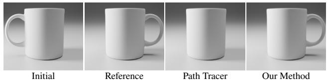  
Figure 1. Optimization results with a differentiable path tracer (we use Mitsuba 3 [28]) and our proposed method. The task is to rotate the coffee cup around its z-axis, so that the handle moves to the right side. Due to a plateau in the objective function (when the handle is occluded by the cup), regular methods do not converge.

tions. For rasterization, differentiability is achieved by replacing discontinuous edge- and z-tests with hand-crafted derivatives [17, 21, 22, 34]. The problem here is that rasterization, by design, does not capture complex light transport effects, e.g., global illumination, scattering or caustics.

Importantly, the mere existence of gradients is no guarantee that descending along them will make an optimization converge [25]. There are surprisingly many cases where they do not lead to a successful optimization, due to a plateau in the objective function. An example is finding the orientation of the mug in Fig. 1: As soon as the handle disappears behind the cup, no infinitesimally small rotation change will result in a reduced loss. We have hence reached a plateau in the objective function, i.e., a region of zero gradients. We propose a method to remove these plateaus while still having complete, complex light transport.

We take inspiration from differentiable rasterization literature [17, 21, 32, 34], where smoothing techniques are used to model the influence of faraway triangles to the pixel at hand. For rasterization, this simple change has two effects: First, it makes the edge- and z-tests continuous and hence differentiable, and second, in passing (and, to our knowledge, much less studied), it also removes plateaus. In this work, we hence aim to find a way to apply the same concept to complex light transport. Therefore, instead of making the somewhat arbitrary choice of a fixed smoothing function for edge- and depth-tests in differentiable rasterizers, we path-trace an alternative, smooth version of the entire Rendering Equation (RE), which we achieve by convolving the original RE with a smoothing kernel. This leads to our proposed method, a lightweight extension to (differentiable) path tracers that extends the infinitely-dimensional path integral to the product space of paths and scene parameters. The resulting double integral can still be MC-solved efficiently, in particular with variance reduction techniques we derive (importance sampling and antithetic sampling).

## 2. Background

## 2.1. Rendering equation

According to the RE [14], the pixel P is defined as

$$
P ( \theta ) = \int _ { \Omega } f ( \mathbf { x } , \theta ) \mathrm { d } \mathbf { x } ,\tag{1}
$$

an integral of the scene function $f ( \mathbf { x } , \theta )$ , that depends on scene parameters $\theta \in \Theta ,$ , over all light paths $\textbf { x } \in { \Omega }$ . In inverse rendering, we want to find the parameters $\theta ^ { * }$ that best explain the pixels $P _ { i }$ in the reference image with

$$
\theta ^ { * } = \underset { \theta } { \arg \operatorname* { m i n } } ~ \sum _ { i } \mathcal { L } \left( P _ { i } ( \theta ) - P _ { i } ( \theta _ { \mathrm { r e f } } ) \right) ,\tag{2}
$$

where L is the objective function and $P _ { i } ( \theta _ { \mathrm { r e f } } )$ are the target pixels created by the (unknown) parameters $\theta _ { \mathrm { r e f } } .$ Consider the example setting displayed in Fig. 2, where we are asked to optimize the 2D position of a circle so that its rendering matches the reference.

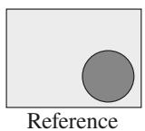

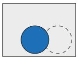  
a)

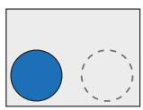  
b)

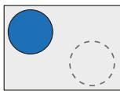  
c)  
Figure 2. An example of a plateau in $\mathcal { L } \mathrm { : }$ starting the optimization of the circle’s position at a) will converge, whereas b) and c) will not. In a)-c), we show the reference dotted for convenience.

Let $\theta _ { 0 }$ be the initial circle’s position. In this simple example, the optimization will converge if, and only if the circle overlaps the reference, i.e., setting a) in Fig. 2. The reason for this is that the gradient then is non-zero (a small change in θ is directly related to a change in $\mathcal { L } )$ and points towards the reference. However, if there is no overlap between the initial circle and the reference, as in Fig. 2 b), a gradientbased optimizer will not be able to recover the true position $\theta _ { \mathrm { r e f } } .$ This is due to the fact that there exists a plateau in the objective function (for a rigorous definition, see Jin et al. [13]). To visualize this, consider a rendering where the circle is placed in the top left corner, as in Fig. 2 c). The scalar produced by the objective function is identical for both b) and c), as $\mathcal { L }$ measures the distance in image space. Therefore, the change in $\mathcal { L }$ is zero almost everywhere, leading to zero gradients and to the circle not moving towards the reference position. As we will see in Sec. 4, this is surprisingly common in real applications.

Table 1. Rendering taxonomoy. See Sec. 2.2 and Sec. 2.3.
<table><tr><td></td><td></td><td>Rasterizer Path Tracer</td><td>Ours</td></tr><tr><td>Differentiable</td><td>√</td><td>√</td><td>√</td></tr><tr><td>Light Transport</td><td>X</td><td>√</td><td>√</td></tr><tr><td>Plateau-reduced</td><td>√</td><td>X</td><td>√</td></tr></table>

## 2.2. Path tracing

As there is no closed-form solution to Eq. 1, path tracing uses MC to estimate the integral by sampling the integrand at random paths xi:

$$
\widehat { P } \approx \frac { 1 } { N } \sum _ { i } f ( \mathbf { x } _ { i } , \boldsymbol { \theta } )\tag{3}
$$

Gradients: We are interested in the partial derivatives of $P$ with respect to the scene parameters θ, i.e.,

$$
{ \frac { \partial P } { \partial \theta } } = { \frac { \partial } { \partial \theta } } \int _ { \Omega } f ( \mathbf { x } , \theta ) \mathrm { d } \mathbf { x } = \int _ { \Omega } { \frac { \partial } { \partial \theta } } f ( \mathbf { x } , \theta ) \mathrm { d } \mathbf { x } .\tag{4}
$$

In order to make Eq. 4 compatible with automatic differentiation, Li et al. [18] propose a re-sampling of silhouette edges and Loubet et al. [23] suggest a re-parametrization of the integrand. Both approaches allow to MC-estimate the gradient as

$$
\widehat { \frac { \partial P } { \partial \theta } } \approx \frac { 1 } { N } \sum _ { i } ^ { N } \frac { \partial } { \partial \theta } f ( \mathbf { x } _ { i } , \theta ) .\tag{5}
$$

This is now standard practice in modern differentiable rendering packages [18, 28, 49, 51, 52], none of which attempt to actively resolve plateaus.

## 2.3. Rasterization

Rasterization solves a simplified version of the RE, where for every pixel, the light path length is limited to one. It is often used in practical applications due to its simplicity and efficiency, but lacks the ability to readily compute complex light transport phenomena. Instead, rasterization projects the primitives to screen space and then resolves occlusion. Both steps introduce jump discontinuities that, for differentiation, require special treatment.

Gradients: In differentiable rasterization, both these operations therefore are replaced with smooth functions. Loper and Black [22] approximate the spatial gradients during the backward pass by finite differences. Early, Rhodin et al. [34], often-used Liu et al. [21] and later Petersen et al. [31] replace the discontinuous functions by soft approximations, e.g., primitive edges are smoothened by the Sigmoid function. This results in a soft halfspace test that continuously changes w.r.t. the distance from the triangle edge and hence leads to a differentiable objective. Chen et al. [4] and Laine et al. [16] propose more efficient versions of this, while Xing et al. [47] use an optimal-transport based loss function to resolve the problem. However, most differentiable rasterizers make simplifying assumptions, $e . g .$ , constant colors, the absence of shadows or reflections, and no illumination interaction between objects. Our formulation does not make such assumptions.

Plateaus: Choosing smoothing functions with infinite support (for instance, the Sigmoid), implicitly resolves the plateau problem as well. Our method (Sec. 3) draws inspiration from this concept of “differentiating through blurring”.

Shortcomings: Consider again Fig. 2 a), where the circle continuously influences the rendered image, resulting in a correct optimization outcome. For rasterizers, it is easy to construct a case where this does not hold, by imagining the circle to be the shadow of a sphere that is not seen in the image itself. The smoothed triangles then do not influence the rendering (most differentiable rasterizers do not even implement a shadow test [18, 32]) and can therefore not be used for gradient computation. Analogue examples can be constructed for other forms of multi-bounce light transport.

## 2.4. Other renderers

Other ways to render that are neither path tracing or rasterization exist, such as differentiable volume rendering [8, 26, 43] or fitting Neural Networks (NNs) to achieve a differentiable renderer [9, 27, 35, 37]. Also very specific forms of light transport, such as shadows, were made differentiable [24]. Finally, some work focuses on differentiable rendering of special primitives, such as points [11, 48], spheres [20], signed distance fields [2, 12, 46] or combinations [5, 10]. While some of these methods also blur the rendering equation and hence reduce plateaus, they remain limited to simple light transport.

## 3. Plateau-reduced Gradients

Intuition: As differentiable rasterization (cf. Sec. 2.3) has established, the blurring of primitive edges is a viable means for differentiation. But what if there is no “primitive edge” in the first place, as we deal with general light paths instead of simple triangles that are rasterized onto an image? The edge of a shadow, for instance, is not optimizable itself, but the result of a combination of light position, reflection, occlusion, etc. Therefore, to achieve an effect similar to that of differentiable rasterizers, we would need a method that blurs the entire light path (instead of just primitive edges) over the parameter space θ. If this method used a blur kernel with infinite support (e.g., a Gaussian distribution), the plateau in the objective would vanish, as a small parameter change in any direction would induce a change in the objective function.

Example: Let us consider Fig. 3, where we again want to optimize the cup’s rotation around its z-axis to have the handle point to the right, a 1D problem. As we have seen previously, using an image-based objective function leads to a plateau when optimizing L in the “hard” setting, i.e., without blur (the blue line in the plot). Blurring the cup’s rotation parameter, on the other hand, leads to θ continuously influencing the value of the objective and therefore resolves the plateau (orange line in the plot). Naturally, it is easy to descend along the gradient of the orange curve, while the gradient is zero on the plateau of the blue curve.

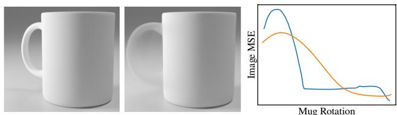

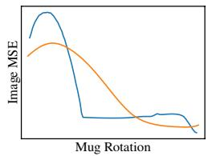  
Figure 3. Optimizing the cup’s rotation in the hard (left, blue) and smooth (right, orange) setting (note the blurred handle). The image-space loss landscape is displayed on the right: blurring resolves the plateau.

## 3.1. The Plateau-reduced Rendering Equation

Formulation: We realize our blurring operation as a convolution of the rendering equation (Eq. 1) with a blur kernel κ over the parameter space Θ:

$$
\begin{array} { r l r } & { } & { Q ( \theta ) = \kappa \star P ( \theta ) = \displaystyle \int _ { \Theta } \quad \kappa ( \tau ) \int _ { \Omega } f ( \mathbf { x } , \theta - \tau ) \mathrm { d } \mathbf { x } \mathrm { d } \tau } \\ & { } & { \qquad = \displaystyle \int _ { \Theta \times \Omega } \kappa ( \tau ) f ( \mathbf { x } , \theta - \tau ) \mathrm { d } \mathbf { x } \mathrm { d } \tau . \quad \quad } \end{array}\tag{6}
$$

The kernel $\kappa ( \tau )$ could be any symmetric monotonous decreasing function. For simplicity, we use a Gaussian here, but other kernels would be possible as well. The kernel acts as a weighting function that weights the contribution of parameters θ that were offset by $\tau \in \Theta$ . This means that, in addition to integrating all light paths x over Ω, we now also integrate over all parameter offsets τ in Θ. We do not convolve across the path space Ω but across the parameter space $\theta , e . g .$ , the cup’s rotation in Fig. 3.

Estimation: To estimate the (even higher-dimensional) integral in Eq. 6, we again make use of an MC estimator

$$
\widehat { Q } \approx \frac { 1 } { N } \sum _ { i } ^ { N } \kappa ( \tau ) f ( \mathbf { x } _ { i } , \theta - \tau _ { i } ) ,\tag{7}
$$

which is a practical approximation of Eq. 6 that can be solved with standard path tracing, independent of the dimensionality of the light transport or the number of optimization dimensions.

Gradient : Analogously to Eq. 5, we can estimate the gradient of Q through the gradient of its estimator

$$
\widehat { \frac { \partial Q } { \partial \theta } } = \frac { \partial } { \partial \theta } \frac { 1 } { N } \sum _ { i = 1 } ^ { N } \kappa ( \tau _ { i } ) f ( \mathbf { x } _ { i } , \theta - \tau _ { i } ) .\tag{8}
$$

Due to the linearity of differentiation and convolution, there are two ways of computing Eq. 8: one for having a differentiable renderer, and one for a renderer that is not differentiable. We discuss both options next.

Plateau-reduced gradients if P is differentiable: With access to a differentiable renderer (i.e., access to $\partial P / \partial \theta )$ we can rewrite Eq. 8 as

$$
{ \widehat { \frac { \partial Q } { \partial \theta } } } = { \frac { 1 } { N } } \sum _ { i = 1 } ^ { N } \kappa ( \tau _ { i } ) \underbrace { { \frac { \partial P } { \partial \theta } } ( \theta - \tau _ { i } ) } _ { \mathrm { D i f f . ~ R e n d e r e r } } .\tag{9}
$$

Therefore, all that that needs to be done is to classically compute the gradients of a randomly perturbed rendering and weight them by the blur kernel.

Plateau-reduced gradients if P is not differentiable: In several situations, we might not have access to a differentiable renderer, or a non-differentiable renderer might have advantages, such as computational efficiency, rendering features or compatibility with other infrastructure. Our derivation also supports this case, as we can rewrite Eq. 8 as

$$
\widehat { \frac { \partial Q } { \partial \theta } } \approx \frac { 1 } { N } \sum _ { i = 1 } ^ { N } \underbrace { \frac { \partial \kappa } { \partial \theta } ( \tau _ { i } ) } _ { \mathrm { D i f f . ~ K e r n e l } } \underbrace { P ( \theta - \tau _ { i } ) } _ { \mathrm { R e n d e r e r } } ,\tag{10}
$$

which equals sampling a non-differentiable renderer and weighting the result by the gradient of the blur kernel. This is possible due to the additional convolution we introduce: prior work [18, 23] must take special care to compute derivatives (Eq. 5), as in their case, optimizing θ might discontinuously change the pixel integral. We circumvent this problem through the convolution with $\kappa ,$ which ensures that, in expectation, θ continuously influences the pixel integral.

## 3.2. Variance Reduction

Drawing uniform samples from $\Theta \times \Omega$ will result in a sample distribution that is not proportional to the integrand and hence lead to high-variance gradient estimates and ultimately slow convergence for inverse rendering. In our case, the integrand is the product of two functions (the kernel κ and the scene function f), which Veach [44] showed how to optimally sample for. As we generally consider the rendering operator a black box, we can only reduce variance by sampling according to the remaining function, the (differentiated) kernel κ (Fig. 4b).

While importance-sampling for a Gaussian $\begin{array} { r } { ( \tau _ { i } \ \sim \ \kappa , } \end{array}$ required to reduce variance of Eq. 9) is easily done, importance-sampling for the gradient of a Gaussian $( \tau _ { i } \sim$ $\partial \kappa / \partial \theta .$ , to be applied to Eq. 10) is more involved. The gradient of our kernel κ is

$$
\frac { \partial \kappa } { \partial \theta } ( \tau ) = \frac { - \tau } { \sigma ^ { 3 } \sqrt { 2 \pi } } \exp \left( \frac { - \tau ^ { 2 } } { 2 \sigma ^ { 2 } } \right) ,\tag{11}
$$

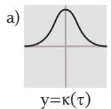

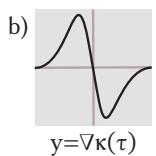

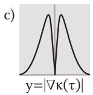  
Figure 4. Our kernel κ (a), its gradient ∇κ (b), the positivized gradient (c) and samples drawn proportional thereto (d).

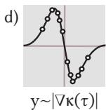

which is negative for $\tau > 0$ . We enable sampling proportional to its Probability Density Function (PDF) by “positivization” [30], and hence sample for $| \frac { \partial \kappa } { \partial \theta } ( \tau ) |$ instead (Fig. 4c). We note that this function is separable at $\tau = 0$ and thus treat each halfspace separately in all dimensions of τ and σ. In order to sample we use the inverse Cumulative Distribution Function (CDF) method. The CDF of Eq. 11 is

$$
F ( \tau ) = 0 . 5 \mathrm { s g n } ( \tau ) \exp \left( - \frac { \tau ^ { 2 } } { 2 \sigma ^ { 2 } } \right) + C ,
$$

where $C = 1$ on the positive halfspace and 0 otherwise (this originates from the fact that the CDF must be continuous, monotonically increasing and defined on (0, 1)). Inverting the CDF leads to

$$
F ^ { - 1 } ( \xi ) = \sqrt { - 2 \sigma ^ { 2 } \log ( \xi ) } ,
$$

into which we feed uniform random numbers $\xi \in ( 0 , 1 )$ that generate samples proportional to $\textstyle { \left| { \frac { \partial \kappa } { \partial \theta } } ( \tau ) \right| ( \mathrm { F i g . 4 d } ) }$

Obtaining a zero-variance estimator for a positivized function requires sampling at at least two points: on the positivized and the regular part of the function [30]. We note that the function we sample for is point-symmetric around 0 in each dimension and hence use antithetic sampling [7], $i . e .$ , for each sample τ, we additionally generate its negated counterpart −τ . Doing so results in a zero-variance estimator, as we can perfectly sample for both parts of the function. In additional experiments, we found stratified sampling to be more brittle than antithetic sampling.

Previous inverse rendering work applies antithetics to BSDF gradients in classic rendering [1, 49] and to improve convergence on specular surfaces [52], while we use them as a means of reducing gradient variance for plateaureduction, which is not present in such approaches.

## 3.3. Adaptive bandwidth

Adjusting σ gives us control over how far from the current parameter θ our samples will be spaced out. A high σ may be useful in the early stages of the optimization, when there still is a considerable difference between θ and $\theta _ { \mathrm { r e f } } ,$ whereas we want a low σ towards the end of the optimization to zero-in on $\theta _ { \mathrm { r e f } } .$ Throughout the optimization, we hence decay the initial $\sigma _ { 0 }$ according to a linear schedule, i.e., $\sigma _ { t + 1 } = \sigma _ { 0 } - t ( \sigma _ { 0 } - \sigma _ { m } )$ , where $\sigma _ { m }$ is a fixed minimum value we choose to avoid numerical instabilities that would otherwise arise from $\sigma  0$ in, e.g., Eq. 11. Fig. 5 shows the blur’s progression throughout the optimization.

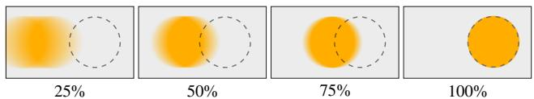  
Figure 5. We visualize the adaptive spread of the smoothing at n% of the optimization. The reference position is shown dotted.

## 3.4. Implementation

We outline our gradient estimator in pseudo-code in Alg. 1. We importance-sample for our kernel with zero variance, use antithetic sampling and adapt the smoothing strength via σ. As Alg. 1 shows, our method is simple to implement and can be incorporated into existing frameworks with only a few lines of code. We implement our method in PyTorch, with Mitsuba as rendering backbone, and use Adam as our optimizer. For the remainder of this work, we use all components unless otherwise specified: importance sampling, adaptive smoothing and antithetic sampling. Moreover, we use Eq. 10 for computational efficiency (cf. Sec. 4.3) if not specified otherwise.

Algorithm 1 Gradient estimation of the scene function f at   
parameters θ with perturbations $\tau \sim \mathcal { N } ( 0 , \sigma )$ at N samples.   
1: # Equation 10   
2: procedure ESTIMATEGRADIENT(P, θ, σ, N)   
3: G := 0   
4: for $i \in ( 1 , N / 2 )$ do   
5: ξ ← UNIFORM(0, 1)   
6: τ ← p−2σ2 log(ξ)   
7: $G \gets \dot { G } + P ( \theta + \tau ) - P ( \theta - \tau )$   
8: end for   
9: return G / N   
10: end procedure

## 4. Experiments

We analyze our method and its variants in qualitative and quantitative comparisons against other methods and further compare their runtime performance. For the hyperparameters we use for our method and the competitors, please cf. the supplemental, Tab. 1.

## 4.1. Methodology

Methods: For our experiments, we compare four methods. The first is a differentiable rasterizer, SoftRas [21]. Recall that soft rasterizers implicitly remove plateaus, which is why they are included here, despite their shortcomings for more complex forms of light transport. For our method, we evaluate its two variants: The first uses a differentiable renderer and weights its gradients $( \mathsf { O u r } _ { \kappa \partial P } , \mathsf { E q . 9 } )$ , while the second one performs differentiation through perturbation $( \mathsf { O u r } _ { \partial \kappa P } , \mathsf { E q . } 1 0 )$ . For both, we use Mitsuba 3 as our backbone, in the first variant using its differentiation capabilities to compute ∂P, in the latter using it as a non-differentiable black-box to compute only P. We run all methods for the same number of iterations and with the same rendering settings (samples per pixel (spp), resolution, path length, etc.). Metrics: We measure the success of an optimization on two metrics, image- and parameter-space Mean Squared Error (MSE). As is common in inverse rendering, imagespace MSE is what the optimization will act on. Parameterspace MSE is what we employ as a quality control metric during our evaluation. This is necessary to interpret whether the optimization is working correctly once we have hit a plateau, as the image-space MSE will not change there. Note that we are not optimizing parameter-space MSE and the optimization never has access to this metric.

Tasks: We evaluate our method and its competitors on six optimization tasks that feature advanced light transport, plateaus and ambiguities. We show a conceptual sketch of each task in Fig. 6 and provide a textual explanation next.

## 4.2. Results

Qualitative: We now discuss our main result, Fig. 6.

CUP: A mug is rotated around its vertical axis and as its handle gets occluded, the optimization has reached a plateau. Our method differentiates through the plateau. The differentiable path tracer gets stuck in the local minimum after slightly reducing the loss by turning the handle towards the left, due to the direction of the incoming light.

SHADOWS: An object outside of the view frustum is casting a shadow onto a plane. Our goal is to optimize the hidden object’s position. Differentiable rasterizers can not solve this task, as they a) do not implement shadows, and b) cannot differentiate what they do not rasterize. The plateau in this task originates from the fact that the shadows do not overlap in the initial condition, which creates a situation akin to Fig. 2 b). Again, our method matches the reference position very well. Mitsuba first moves the sphere away from the plane (in negative z-direction), as this reduces the footprint of the sphere’s shadow on the plane and thus leads to a lower error, and then finally moves the sphere out of the image, where a plateau is hit and the optimization can not recover. The blue line in the image-space plot in Fig. 6 illustrates this problem, as the parameter-error keeps changing very slightly, but the image-space error stays constant.

OCCLUSION: Here, a sphere translates along the viewing axis to match the reference. The challenge is that the sphere initially is occluded by another sphere, i.e., we are on a plateau as long as the occluder is closer to the camera than the sphere we are optimizing. The baseline path tracer initially pushes the red sphere towards the back of the box, as this a) reduces the error in the reflection on the bottom glass plane, and b) lets the shadow of the red sphere (visible underneath the blue sphere in the initial configuration) shrink, which again leads to a lower image-space error. Our method, in contrast, successfully differentiates through both the plateau (the red sphere has a negligible effect on the objective) and the discontinuity that arises when the red sphere first moves closer to the camera than the blue occluder.

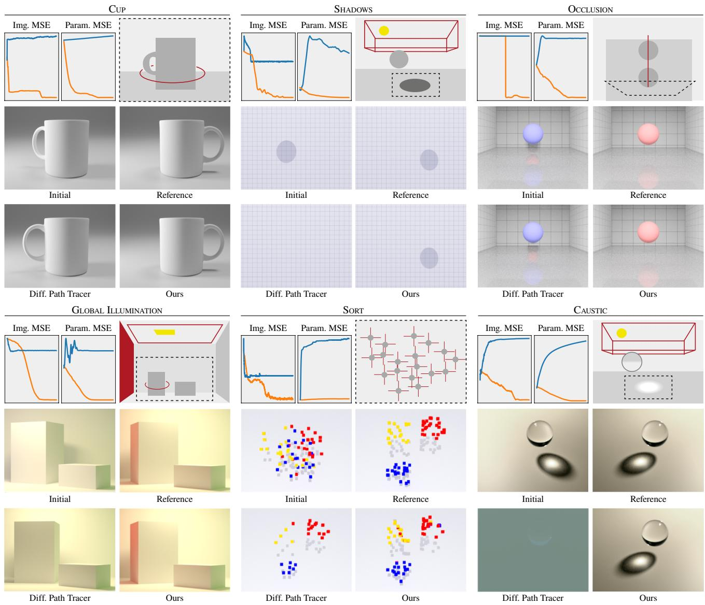  
Figure 6. We show the optimization tasks and results for $\mathsf { O u r } _ { \partial \kappa P } \ : ( ^ { \ast } \mathrm { O u r s } ^ { 3 , }$ , orange) and our baseline Mitsuba (“Diff. Path Tracer”, blue).

Table 2. Image- and parameter-space MSE of different methods (columns) on different tasks (rows).
<table><tr><td rowspan="2"></td><td colspan="2">Rasterizer</td><td colspan="6">Path Tracer</td></tr><tr><td colspan="2">SoftRas</td><td colspan="2">Mitsuba</td><td colspan="2"> $\operatorname { O u r } _ { \partial \kappa P }$ </td><td colspan="2"> ${ \sf O u r } _ { \kappa \partial P }$ </td></tr><tr><td>Img.</td><td></td><td>Para.</td><td>Img.</td><td>Para.</td><td>Img.</td><td>Para.</td><td>Img.</td><td>Para.</td></tr><tr><td>CUP</td><td> $3 . 6 6 \times 1 0 ^ { - 1 }$ </td><td> $2 . 7 2 { \times } 1 0 ^ { - 2 }$ </td><td> $5 . 4 9 { \times } 1 0 ^ { - 3 }$ </td><td> $0 . 7 5 { \times } 1 0 ^ { - 1 }$ </td><td> $\mathbf { 4 . 9 2 } { \times } \mathbf { 1 0 ^ { - 6 } }$ </td><td> $\mathbf { 4 . 1 8 } { \times } \mathbf { 1 0 ^ { - 7 } }$ </td><td> $4 . 7 5 { \times } 1 0 ^ { - 4 }$ </td><td> $2 . 7 7 \times 1 0 ^ { - 1 }$ </td></tr><tr><td>SHADOWS</td><td> $1 . 6 4 \times 1 0 ^ { - 3 }$ </td><td> $1 . 4 2 { \times } 1 0 ^ { - 1 }$ </td><td> $1 . 6 4 \times 1 0 ^ { - 3 }$ </td><td> $5 . 0 6 { \times } 1 0 ^ { - 0 }$ </td><td> $\mathbf { 1 . 7 4 \times 1 0 ^ { - 5 } }$ </td><td> $\mathbf { 1 . 8 1 { \times } 1 0 ^ { - 3 } }$ </td><td> $5 . 1 2 { \times } 1 0 ^ { - 4 }$ </td><td> $1 . 2 8 { \times } 1 0 ^ { - 0 }$ </td></tr><tr><td>OCCL.</td><td> $5 . 3 3 \times 1 0 ^ { - 2 }$ </td><td> $7 . 1 8 { \times } 1 0 ^ { - 3 }$ </td><td> $5 . 8 5 { \times } 1 0 ^ { - 2 }$ </td><td> $5 . 2 3 \times 1 0 ^ { + 1 }$ </td><td> $\mathbf { 2 . 3 4 \times 1 0 ^ { - 4 } }$ </td><td> $\mathbf { 3 . 2 9 } \mathbf { \times 1 0 ^ { - 3 } }$ </td><td> $5 . 3 7 { \times } 1 0 ^ { - 2 }$ </td><td> $1 . 8 7 \times 1 0 ^ { + 1 }$ </td></tr><tr><td>GLOBAL ILL.</td><td></td><td></td><td> $3 . 7 8 { \times } 1 0 ^ { - 2 }$ </td><td> $3 . 8 7 { \times } 1 0 ^ { - 1 }$ </td><td> $\mathbf { 5 . 0 7 } \times \mathbf { 1 0 ^ { - 5 } }$ </td><td> $\mathbf { 8 . 7 1 \times 1 0 ^ { - 4 } }$ </td><td> $5 . 8 8 \times 1 0 ^ { - 2 }$ </td><td> $2 . 5 5 { \times } 1 0 ^ { - 1 }$ </td></tr><tr><td>SORT</td><td> $1 . 8 5 { \times } 1 0 ^ { - 2 }$ </td><td> $1 . 5 7 \times 1 0 ^ { - 0 }$ </td><td> $1 . 1 8 { \times } 1 0 ^ { - 2 }$ </td><td> $6 . 6 4 \times 1 0 ^ { - 0 }$ </td><td> $\mathbf { 3 . 8 1 } \mathbf { \times 1 0 ^ { - 3 } }$ </td><td> $\mathbf { 4 . 1 9 \times 1 0 ^ { - 1 } }$ </td><td> $1 . 0 2 { \times } 1 0 ^ { - 2 }$ </td><td> $2 . 2 4 \times 1 0 ^ { - 0 }$ </td></tr><tr><td>CAUSTIC</td><td></td><td></td><td> $3 . 1 2 { \times } 1 0 ^ { - 1 }$ </td><td> $8 . 5 0 { \times } 1 0 ^ { - 0 }$ </td><td> $\mathbf { 1 . 8 9 { \times } 1 0 ^ { - 5 } }$ </td><td> $\mathbf { 9 . 7 6 { \times } 1 0 ^ { - 5 } }$ </td><td> $2 . 4 2 { \times } 1 0 ^ { - 1 }$ </td><td> $4 . 0 3 { \times } 1 0 ^ { - 0 }$ </td></tr></table>

GLOBAL ILLUMINATION: We here show that our method is compatible with the ambiguities encountered in advanced light transport scenarios. The goal of this optimization task is to simultaneously move the top-light to match the scene’s illumination, change the left wall’s color to create the color bleeding onto the box, and also to rotate the large box to an orientation where the wall’s reflected light is actually visible. The optimization only sees an inset of the scene (as shown in Fig. 6; for a view of the full scene cf. the supplemental) and hence only ever sees the scattered light, but never the wall’s color or light itself. The baseline cannot resolve the ambiguity between the box’s rotation, the light position and the wall’s color, as it is operating in a nonsmoothed space. Our method finds the correct combination of rotation, light position and wall color.

SORT: In this task, we need to sort a randomly perturbed assortment of 75 colored primitives into disjoint sets. We optimize the x- and y-coordinates of each cube, which leads to a 150-dimensional setting, with a plateau in each dimension, as most of the cubes are initially not overlapping their reference. Mitsuba cannot find the correct position of nonoverlapping primitives and moves them around to minimize the image error, which is ultimately achieved by moving them outside of the view frustum. Our method, admittedly not perfect on this task, finds more correct positions, a result more similar to the reference.

CAUSTIC: Lastly, the CAUSTIC task features a light source outside the view frustum illuminating a glass sphere, which casts a caustic onto the ground. The goal is to optimize the light’s position in order to match a reference caustic. As the sphere does not change its appearance with the light’s movement, the optimization has to solely rely on the caustic’s position to find the correct parameters. Similar to the GI task, this is not solvable for rasterizers. Our method reaches the optimum position with high accuracy. For the baseline path tracer, we see a failure mode that is similar to the SHADOW task. In this case, the image space error can be reduced by moving the light source far away, as the bulk of the error comes from the caustic not being cast onto the correct position. Moving the light source far away reduces this error, but also leads into a local minimum where there is no illumination at all, resulting in the gray image in Fig. 6.

Quantitative: Tab. 2 reports image- and parameter-space MSE for all methods across all tasks. The quantitative results confirm what Fig. 6 conveyed visually: regular gradient-based path tracers that operate on non-smooth loss landscapes fail catastrophically on our tasks. SoftRas manages to overcome some plateaus, but struggles with achieving low parameter error, as it blurs in image space but must compare to the non-blurred reference (as all methods), which leads to a notable difference between the final state and the reference parameters. To achieve comparable image-space errors, we render the parameters found by SoftRas with Mitsuba. Our method $\mathsf { O u r } \partial \kappa P$ , in contrast, achieves errors of as low as $1 0 ^ { - 7 }$ , and consistently outperforms its competitors on all tasks by several orders of magnitude. Interestingly, $\mathsf { O u r } _ { \kappa \partial P } \mathsf { \Omega } ( i . e .$ ., using the gradients from the differentiable renderer) works notably worse than ${ \sf O u r } _ { \partial \kappa P }$ (but mostly still outperforms Mitsuba). We attribute this to the fact that we cannot importance-sample for the gradient here, as we do not know its PDF. Instead, we can only draw samples proportional to the first term in the product, $\kappa ( \tau )$ , which places many samples where the kernel is high, i.e., at the current parameter value. As we can see from the rigid optimization by Mitsuba, the gradient at the current parameter position is not very informative, so placing samples there is not very helpful.

## 4.3. Timing

We now compare our approach’s runtime and will see that, while ${ \sf O u r } _ { \kappa \partial P }$ needs more time to complete an optimization, ${ \sf O u r } _ { \partial \kappa P }$ on average is $8 \times$ faster than differentiable rendering with Mitsuba.

Our method requires the additional step of (over-) sampling the parameter space in order to compute our smooth gradients. However, as shown in Eq. 10, our stochastic gradient estimation through the derivative-kernel $( \mathsf { O u r } _ { \partial \kappa P } )$ allows us to skip the gradient computation step of the renderer. While there exist techniques like the adjoint path formulation [29] and path replay backpropagation [45], the gradient computation in inverse rendering still is computationally expensive and requires the creation of a gradient tape or compute graph. Additionally, correct gradients w.r.t. visibility-induced discontinuities require a special integrator (re-parametrization or edge sampling).

Our method $\mathsf { O u r } \partial \kappa P$ , in contrast, does not need to compute $\partial P / \partial \theta$ and only requires a forward model. We can hence conveniently use the regular path integrator instead of its re-parametrized counterparts, and skip the gradient computation altogether. Moreover, our earlier efforts to develop an efficient importance-sampler will now pay off, as our method converges with as few as one extra sample only. This results in notable speedups, and $\mathsf { O u r } \partial \kappa P$ hence significantly outperforms other differentiable path tracers in wallclock time at otherwise equal settings (cf. Tab. 3).

Table 3. Timing comparison for the three path tracing variants on all tasks. We report the average time for a single optimization iteration (with same hyperparameters) in seconds, so less is better.
<table><tr><td></td><td>CUP</td><td>SHAD.</td><td>OCCL.</td><td>GI SORT</td><td></td><td>CAUS.</td></tr><tr><td>Mitsuba</td><td>1.12s</td><td>0.64 s</td><td>0.37s</td><td>0.44s</td><td>2.88 s</td><td>1.02 s</td></tr><tr><td> $\mathsf { O u r } \partial \kappa P$ </td><td>0.10s</td><td>0.04s</td><td>0.09 s</td><td>0.15 s</td><td>2.23 s</td><td>0.08 s</td></tr><tr><td> ${ \sf O u r } _ { \kappa \partial P }$ </td><td>2.22s</td><td>1.43 s</td><td></td><td>0.91 s 1.72 s3</td><td>32.02 s</td><td>4.02s</td></tr></table>

## 4.4. Ablation

We now ablate our method to evaluate the effect its components have on the success of the optimization outcome. We will use $\mathsf { O u r } \partial \kappa P$ from Tab. 2 as the baseline and ablate the following components: importance sampling (noIS), adaptive perturbations (noAP) and antithetic sampling (noAT). We hold all other parameters (spp, resolution, etc.) fixed and run the same number of optimization iterations that was also used in Tab. 2 and Fig. 6.

We report the relative change between the ablations and our baseline in Tab. 4. We report log-space values, as the results lie on very different scales. From the averages in the last row, it becomes apparent that all components drastically contribute to the success of our method, while the most important part is the antithetic sampling. We emphasize that importance- and antithetic-sampling are variance reduction techniques that do not bias the integration, i.e., they do not change the integral’s value in expectation. Therefore, our approach should converge to similar performance without these components, but it would take (much) longer, as the gradient estimates will exhibit more noise.

Table 4. Ablation of different components (columns) for different tasks (rows). We report the log-relative ratio w.r.t. Our∂κP , so higher values mean higher error.
<table><tr><td rowspan="2"></td><td colspan="2">noIS</td><td colspan="2">noAP</td><td colspan="2">noAT</td></tr><tr><td>Img.</td><td>Para.</td><td>Img.</td><td>Para.</td><td>Img.</td><td>Para.</td></tr><tr><td>CUP SHAD. OCCL. GI</td><td>4.75× 5.27× 3.18× 10.38×</td><td>6.30× 5.98× 3.29× 10.84×</td><td>6.96× 3.07× 8.73× 6.40× 1.14×</td><td>11.89× 3.19× 1.27×5.30× 8.62×8.73× 9.15× 5.62×</td><td></td><td>4.27× 6.03× 9.65× 12.06×</td></tr><tr><td>SORT CAUS.</td><td>1.48× 3.76×</td><td>0.70× 8.35× 0.69×</td><td></td><td>2.04×1.59× 1.70×4.24×</td><td>1.09× 9.27×</td></tr><tr><td>Mean</td><td>4.81×</td><td>5.91×4.50×</td><td></td><td>5.78×4.78×</td><td>7.06×</td></tr></table>

## 5. Discussion

Related Approaches Other methods proposed blurring by down-sampling in order to circumvent plateaus [16, 33]. The quality upper bound for this is SoftRas, which we compare against in Tab. 2, as blurring by down-sampling does not account for occlusion, whereas SoftRas uses a smooth z-test. Another method that could be tempting to employ is Finite Differences (FD). Unfortunately, FD does not scale to higher problem dimensions, as it requires 2n function evaluations on an n-dimensional problem (on our SORT task, this would increase the per-iteration runtime by ×375). A more economical variant is Simultaneous perturbation stochastic approximation (SPSA), which perturbs all dimensions at once [38]. However, neither FD nor SPSA actively smoothes the loss landscape, as the gradient is always estimated from exactly two measurements, taken at fixed locations, often from a Bernoulli distribution. Our approach, in contrast, uses N stochastic samples, where N is independent of the problem dimension. In fact, we use N = 2 for most of our experiments (cf. Suppl. Tab. 1). Our method’s advantages thus are twofold: first, we do not require a fixed number or spacing of samples in the parameter space, but instead explore the space by stochastically sampling it. Second, our developed formalism allows to interpret this stochastic sampling as a means to compute a MCestimate of the gradient, and thus allows to simultaneously smooth the space and perform (smooth) differentiation.

Indeed, the formalism developed in Sec. 3.1 can be interpreted as a form of variational optimization [39, 40], where one would descend along the (smooth) variational objective instead of the true underlying function. As such, Eq. 10 can be seen as an instance of a score-based gradient estimator [42], while Eq. 9 can be interpreted as reparametrization gradient [15, 36]. Suh et al. [41] provide intuition on each estimator’s performance and align with our findings of the score-based estimator’s superiority under a discontinuous objective. It is one of the contributions of this work to connect these variational approaches with inverse rendering.

Limitations As our method relies on Monte Carlo estimation, the variance increases favourably, but still increases with higher dimensions. This can usually be mitigated by increasing the number of samples N. We show examples of a high-dimensional texture optimization in the supplemental. Moreover, a good initial guess of σ is helpful for a successful optimization outcome (cf. Suppl. Sec. 2). We recommend setting σ to roughly 50 % of the domain and fine-tune from there, if necessary.

## 6. Conclusion

We have proposed a method for inverse rendering that convolves the rendering equation with a smoothing kernel. This has two important effects: it allows straightforward differentiation and removes plateaus. The idea combines strengths of differentiable rasterization and differentiable path tracing. Extensions could include applying our proposed method to path tracing for volumes or Eikonal transport [3, 50] or other fields that suffer from noisy or non-smooth gradients, such as meta-learning for rendering [6, 19]. Our approach is simple to implement, efficient, has theoretical justification and optimizes tasks that existing differentiable renderers so far have diverged upon.

Acknowledgments This work was supported by Meta Reality Labs, Grant Nr. 5034015. We thank Chen Liu, Valentin Deschaintre and the anonymous reviewers for their insightful feedback.

## References

[1] Sai Praveen Bangaru, Tzu-Mao Li, and Fredo Durand. Un-´ biased warped-area sampling for differentiable rendering. ACM Trans. Graph., 39(6), 2020. 4

[2] Sai Praveen Bangaru, Michael Gharbi, Tzu-Mao Li, Fujun¨ Luan, Kalyan Sunkavalli, Milos Haˇ san, Sai Bi, Zexiang Xu,ˇ Gilbert Bernstein, and Fredo Durand. Differentiable render-´ ing of neural sdfs through reparameterization. arXiv preprint arXiv:2206.05344, 2022. 3

[3] Mojtaba Bemana, Karol Myszkowski, Jeppe Revall Frisvad, Hans-Peter Seidel, and Tobias Ritschel. Eikonal fields for refractive novel-view synthesis. In ACM SIGGRAPH, 2022. 8

[4] Wenzheng Chen, Huan Ling, Jun Gao, Edward Smith, Jaakko Lehtinen, Alec Jacobson, and Sanja Fidler. Learning to predict 3d objects with an interpolation-based differentiable renderer. NeuRIPS, 32, 2019. 2

[5] Forrester Cole, Kyle Genova, Avneesh Sud, Daniel Vlasic, and Zhoutong Zhang. Differentiable surface rendering via non-differentiable sampling. In Proc. ICCV, 2021. 3

[6] Michael Fischer and Tobias Ritschel. Metappearance: Metalearning for visual appearance reproduction. ACM Trans Graph (Proc. SIGGRAPH Asia), 41(4), 2022. 8

[7] John Michael Hammersley and JG Mauldon. General principles of antithetic variates. In Mathematical proceedings of the Cambridge philosophical society, volume 52, 1956. 4

[8] Philipp Henzler, Niloy Mitra, and Tobias Ritschel. Escaping plato’s cave using adversarial training: 3d shape from unstructured 2d image collections. In Proc. ICCV, 2019. 3

[9] Pedro Hermosilla, Sebastian Maisch, Tobias Ritschel, and Timo Ropinski. Deep-learning the latent space of light transport. Comp. Graph. Forum, 38(4), 2019. 3

[10] Yiwei Hu, Paul Guerrero, Milos Hasan, Holly Rushmeier, and Valentin Deschaintre. Node graph optimization using differentiable proxies. In ACM SIGGRAPH, 2022. 3

[11] Eldar Insafutdinov and Alexey Dosovitskiy. Unsupervised learning of shape and pose with differentiable point clouds. NeuRIPS, 31, 2018. 3

[12] Yue Jiang, Dantong Ji, Zhizhong Han, and Matthias Zwicker. Sdfdiff: Differentiable rendering of signed distance fields for 3d shape optimization. In Proc. CVPR, 2020. 3

[13] Chi Jin, Rong Ge, Praneeth Netrapalli, Sham M Kakade, and Michael I Jordan. How to escape saddle points efficiently. In International Conference on Machine Learning, pages 1724–1732. PMLR, 2017. 2

[14] James T Kajiya. The rendering equation. In Proc. SIG-GRAPH, 1986. 2

[15] Durk P Kingma, Tim Salimans, and Max Welling. Variational dropout and the local reparameterization trick. Advances in neural information processing systems, 28, 2015. 8

[16] Samuli Laine, Janne Hellsten, Tero Karras, Yeongho Seol, Jaakko Lehtinen, and Timo Aila. Modular primitives for high-performance differentiable rendering. ACM Trans Graph, 39(6), 2020. 3, 8

[17] Quentin Le Lidec, Ivan Laptev, Cordelia Schmid, and Justin Carpentier. Differentiable rendering with perturbed optimiz-

ers. NeurIPS, 34, 2021. 1

[18] Tzu-Mao Li, Miika Aittala, Fredo Durand, and Jaakko Lehti-´ nen. Differentiable Monte Carlo ray tracing through edge sampling. ACM Trans Graph., 37(6), 2018. 1, 2, 3, 4

[19] Chen Liu, Michael Fischer, and Tobias Ritschel. Learning to learn and sample brdfs. arXiv preprint arXiv:2210.03510, 2022. 8

[20] Shaohui Liu, Yinda Zhang, Songyou Peng, Boxin Shi, Marc Pollefeys, and Zhaopeng Cui. Dist: Rendering deep implicit signed distance function with differentiable sphere tracing. In Proc. CVPR, 2020. 3

[21] Shichen Liu, Tianye Li, Weikai Chen, and Hao Li. Soft rasterizer: A differentiable renderer for image-based 3d reasoning. In Proc. ICCV, 2019. 1, 2, 5

[22] Matthew M Loper and Michael J Black. Opendr: An approximate differentiable renderer. In Proc. ECCV, 2014. 1, 2

[23] Guillaume Loubet, Nicolas Holzschuch, and Wenzel Jakob. Reparameterizing discontinuous integrands for differentiable rendering. ACM Tran Graph., 38(6), 2019. 1, 2, 4

[24] Linjie Lyu, Marc Habermann, Lingjie Liu, Ayush Tewari, Christian Theobalt, et al. Efficient and differentiable shadow computation for inverse problems. In Proc. ICCV, 2021. 3

[25] Luke Metz, C Daniel Freeman, Samuel S Schoenholz, and Tal Kachman. Gradients are not all you need. arXiv preprint arXiv:2111.05803, 2021. 1

[26] Ben Mildenhall, Pratul P Srinivasan, Matthew Tancik, Jonathan T Barron, Ravi Ramamoorthi, and Ren Ng. Nerf: Representing scenes as neural radiance fields for view synthesis. Communications ofthe ACM, 65(1), 2021. 3

[27] Oliver Nalbach, Elena Arabadzhiyska, Dushyant Mehta, H-P Seidel, and Tobias Ritschel. Deep shading: convolutional neural networks for screen space shading. Comp. Graph. Forum, 36(4), 2017. 3

[28] Merlin Nimier-David, Delio Vicini, Tizian Zeltner, and Wenzel Jakob. Mitsuba 2: A retargetable forward and inverse renderer. ACM Trans. Graph., 38(6), 2019. 1, 2

[29] Merlin Nimier-David, Sebastien Speierer, Beno´ ˆıt Ruiz, and Wenzel Jakob. Radiative backpropagation: an adjoint method for lightning-fast differentiable rendering. ACM Trans Graph, 39(4), 2020. 7

[30] Art Owen and Yi Zhou. Safe and effective importance sampling. J of the American Statistical Association, 95(449), 2000. 4

[31] Felix Petersen, Amit H. Bermano, Oliver Deussen, and Daniel Cohen-Or. Pix2vex: Image-to-geometry reconstruction using a smooth differentiable renderer, 2019. 2

[32] Felix Petersen, Bastian Goldluecke, Christian Borgelt, and Oliver Deussen. Gendr: A generalized differentiable renderer. In Proc. CVPR, 2022. 1, 3

[33] Pradyumna Reddy, Michael Gharbi, Michal Lukac, and Niloy J Mitra. Im2vec: Synthesizing vector graphics without vector supervision. In Proc. CVPR, 2021. 8

[34] Helge Rhodin, Nadia Robertini, Christian Richardt, Hans-Peter Seidel, and Christian Theobalt. A versatile scene model with differentiable visibility applied to generative pose estimation. In Proc. ICCV, 2015. 1, 2

[35] Paul Sanzenbacher, Lars Mescheder, and Andreas

Geiger. Learning neural light transport. arXiv preprint arXiv:2006.03427, 2020. 3

[36] John Schulman, Nicolas Heess, Theophane Weber, and Pieter Abbeel. Gradient estimation using stochastic computation graphs. Advances in neural information processing systems, 28, 2015. 8

[37] Vincent Sitzmann, Semon Rezchikov, Bill Freeman, Josh Tenenbaum, and Fredo Durand. Light field networks: Neural scene representations with single-evaluation rendering. NeurIPS, 34, 2021. 3

[38] James C Spall. Multivariate stochastic approximation using a simultaneous perturbation gradient approximation. IEEE transactions on automatic control, 37(3):332–341, 1992. 8

[39] Joe Staines and David Barber. Variational optimization. arXiv preprint arXiv:1212.4507, 2012. 8

[40] Joe Staines and David Barber. Optimization by variational bounding. In ESANN, 2013. 8

[41] Hyung Ju Suh, Max Simchowitz, Kaiqing Zhang, and Russ Tedrake. Do differentiable simulators give better policy gradients? In International Conference on Machine Learning, pages 20668–20696. PMLR, 2022. 8

[42] Richard S Sutton, David McAllester, Satinder Singh, and Yishay Mansour. Policy gradient methods for reinforcement learning with function approximation. Advances in neural information processing systems, 12, 1999. 8

[43] Shubham Tulsiani, Tinghui Zhou, Alexei A Efros, and Jitendra Malik. Multi-view supervision for single-view reconstruction via differentiable ray consistency. In Proc. CVPR, 2017. 3

[44] Eric Veach. Robust Monte Carlo methods for light transport

simulation. Stanford University, 1998. 4

[45] Delio Vicini, Sebastien Speierer, and Wenzel Jakob. Path re-´ play backpropagation: differentiating light paths using constant memory and linear time. ACM Trans Graph, 40(4), 2021. 7

[46] Delio Vicini, Sebastien Speierer, and Wenzel Jakob. Differ-´ entiable signed distance function rendering. ACM Transactions on Graphics (TOG), 41(4):1–18, 2022. 3

[47] Jiankai Xing, Fujun Luan, Ling-Qi Yan, Xuejun Hu, Houde Qian, and Kun Xu. Differentiable rendering using RGBXY derivatives and optimal transport. ACM Trans. Graph., 41 (6):1–13, 2022. 3

[48] Wang Yifan, Felice Serena, Shihao Wu, Cengiz Oztireli, and¨ Olga Sorkine-Hornung. Differentiable surface splatting for point-based geometry processing. ACM Trans Graph, 38(6), 2019. 3

[49] Tizian Zeltner, Sebastien Speierer, Iliyan Georgiev, and´ Wenzel Jakob. Monte carlo estimators for differential light transport. ACM Trans Graph, 40(4), 2021. 2, 4

[50] Cheng Zhang, Lifan Wu, Changxi Zheng, Ioannis Gkioulekas, Ravi Ramamoorthi, and Shuang Zhao. A differential theory of radiative transfer. ACM Trans. Graph., 38 (6), 2019. 8

[51] Cheng Zhang, Bailey Miller, Kan Yan, Ioannis Gkioulekas, and Shuang Zhao. Path-space differentiable rendering. ACM Trans. Graph., 39(4), 2020. 2

[52] Cheng Zhang, Zhao Dong, Michael Doggett, and Shuang Zhao. Antithetic sampling for monte carlo differentiable rendering. ACM Trans. Graph., 40(4), 2021. 2, 4