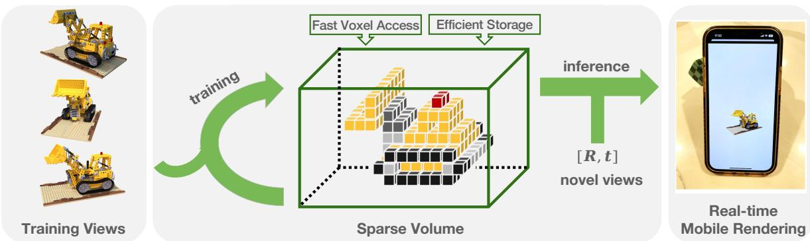
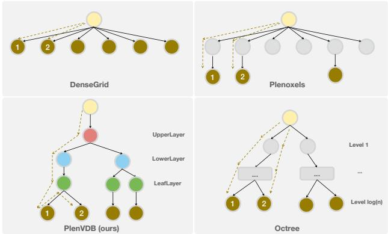
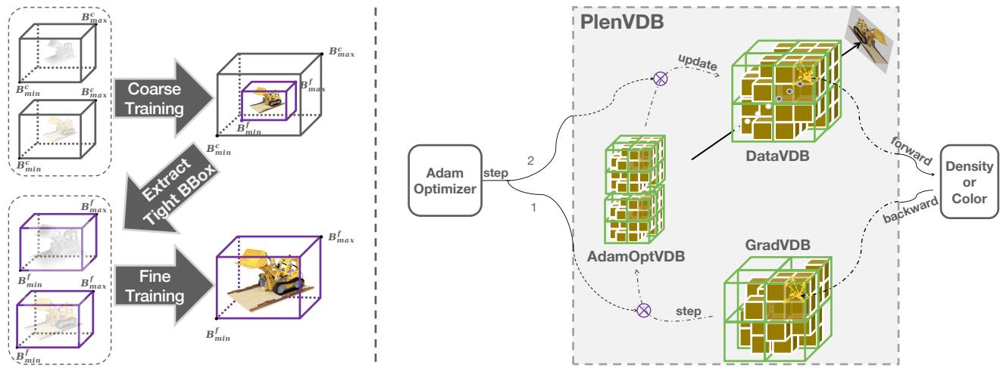
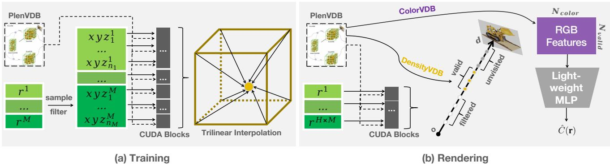
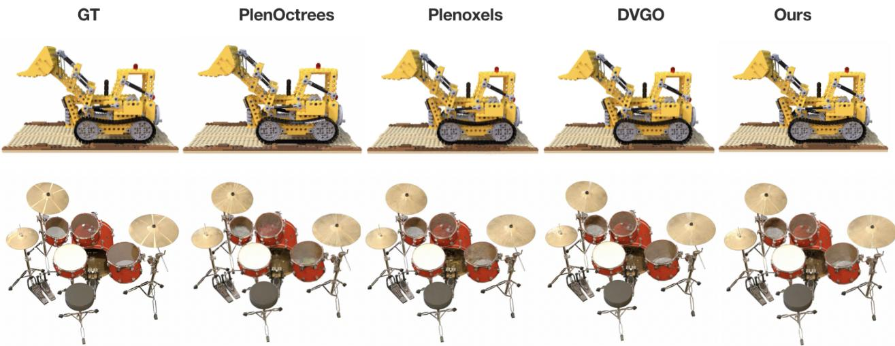
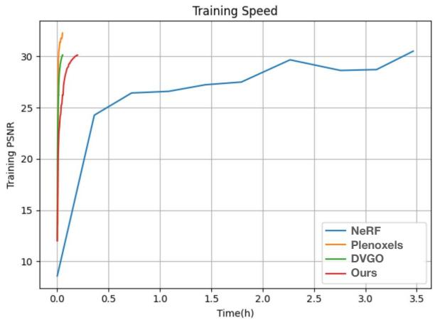
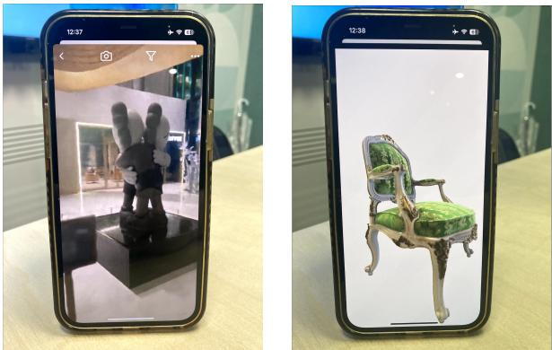

# PlenVDB: Memory Efficient VDB-Based Radiance Fields for Fast Training and Rendering

Han Yan1\* Celong Liu2 Chao Ma1† Xing Mei2† 1 MoE Key Lab of Artificial, AI Institute, Shanghai Jiao Tong University 2 ByteDance Inc.

{wolfball, chaoma}@sjtu.edu.cn, {celong.liu, xing.mei}@bytedance.com

  
Figure 1. We propose PlenVDB, a sparse volume data structure for accelerating NeRF training and rendering. Given a set of training views, our method directly optimizes a VDB model. Then a novel view can be rendered with the model. Two advantages, i.e., fast voxel access for faster speed, and efficient storage for smaller model size, enable efficient NeRF rendering on mobile devices.

## Abstract

In this paper, we present a new representationfor neural radiance fields that accelerates both the training and the inference processes with VDB, a hierarchical data structure for sparse volumes. VDB takes both the advantages of sparse and dense volumes for compact data representation and efficient data access, being a promising data structure for NeRF data interpolation and ray marching. Our method, Plenoptic VDB (PlenVDB), directly learns the VDB data structure from a set of posed images by means of a novel training strategy and then uses it for real-time rendering. Experimental results demonstrate the effectiveness and the efficiency ofour method over previous arts: First, it converges faster in the training process. Second, it delivers a more compact data format for NeRF data presentation. Finally, it renders more efficiently on commodity graphics hardware. Our mobile PlenVDB demo achieves 30+ FPS, 1280×720 resolution on an iPhone12 mobile phone. Check plenvdb.github.iofor details.

## 1. Introduction

With the recent advancement of Neural Radiance Fields (NeRF) [17], high-quality Novel View Synthesis from a sparse set of input images can be achieved. It has many applications in multimedia, AR/VR, gaming, etc. On the other hand, new content creation paradigms have been proposed based on NeRF, such as Dreamfusion [25], which enable the possibility of general text-to-3D synthesis.

Despite the promising results, one shortage of NeRF is the expensive computation of training and rendering, which prohibits real-time applications and effective scene creation. There have been many efforts to accelerate NeRF rendering by pre-computing and storing the results or intermediate results into a 3D grid. Thus, the computation cost for rendering will be reduced by several orders of magnitude. Although the methods that exploit 3D dense grid [7,27,30] can achieve real-time rendering and fast training, they usually introduce more storage overhead, which limits the application on mobile devices. On the other hand, for the methods that utilize 3D sparsity [4, 5, 9, 10, 33], real-time rendering and small storage overhead can be achieved, but the training time is usually getting worse since many of them will first train a Vanilla NeRF or a dense grid, and then convert it to the sparse representation.

In this paper, we propose an efficient sparse neural volume representation, which we call Plenoptic VDB (Plen-VDB). The VDB [19] is an industry-proven efficient hierarchical data structure being used in high-performance animation and simulation for years. We adopt its design principle and use VDB to represent NeRF. VDB takes both advantages of sparse and dense volumes for compact data representation and efficient data access, being a promising data structure for NeRF data interpolation and ray casting. In addition, we propose a novel training approach to directly learn the VDB data without additional conversion steps, so that our model is neat and compact. We show that our model represents high-resolution details of a scene with a lower volume size for fast training and rendering over the state of the arts. Moreover, the trained VDB model can be exported into the NanoVDB [20] format and be used in graphics shaders, such as the GLSL fragment shader, that enables rendering a NeRF model on mobile devices in real-time. In our experiment, the mobile PlenVDB achieves 30+ FPS, 1280×720 resolution on an iPhone12 mobile phone.

In summary, our approach has two main contributions:

• We first use VDB as the sparse volume data structure for NeRF acceleration, and achieve fast rendering even on mobile devices.

• We propose a strategy that learns the VDB directly and achieves fast training and occupies small storage.

## 2. Related Work

Our work builds upon the prior work of NeRF rendering acceleration and sparse volumetric representation for NeRF. NeRF Applications. NeRF [17] made great contributions to Novel View Synthesis, and there are some follow-up works to extend the capability of NeRF. [6, 15, 24, 26] extended NeRF to model dynamic objects and scenes by explicitly introducing a displacement network that predicts geometric deformation or implicitly conditioning on an embedding that represents the time. [1,8,11,12] used additional parameters to make the NeRF controllable. GRAF [28] and GIRAFFE [23] incorporated NeRF with GAN to generate 3D-aware images with various styles. Blcok-NeRF [31] allowed the NeRF to city-scale scenes. However, due to the time-consuming cost of NeRF, their practical application is limited. With the efficient performance and powerful ecology of VDB, our PlenVDB is expected to advance the practical application of NeRF.

Fast Rendering. While fitting the scene into MLPs resolves the problem of resolution and storage, it brings out expensive time overhead during rendering, which limits its practical application. The light field learning approaches [2, 16, 29] usually achieve faster rendering than

NeRF due to the less computation. However, light fields predict the color of a ray, it will have to assume the color is constant along a ray and cannot handle scenes has selfocclusion. DIVeR [32] and SNeRG [9] used the voxelbased representation to accelerate rendering, but still suffered from expensive training. DONeRF [21] utilized a depth oracle network to locate the surface region and reduce the number of samples, but relied on depth ground truth for training. Plenoctrees [33] utilized sphere harmonic coefficients to eliminate perspective dimensions and fit the scene into a sparse octree, which achieves real-time rendering and has a smaller storage overhead. EfficientNeRF [10] proposed NerfTree, a 2-depth tree, and accelerate both training and rendering. However, Plenoctrees and EfficientNeRF do not support trilinear interpolation. Although the above works increased the rendering speed by several orders of magnitude, real-time rendering on mobile devices is still unresolved. MobileNeRF [4] represented the NeRF as a set of texture polygons, making it possible to adapt the traditional polygon rasterization pipeline. But it is slow to train and fails at transparent objects. Our PlenVDB is friendly to graphics shaders and is designed to perform fast trilinear in terpolation as well, thus contributing to real-time rendering with higher quality, even on mobile devices.

Fast Training. Training NeRF usually takes one or two days. To accelerate the training stage, Instant-ngp [18] used the multiresolution hash table to accelerate the NeRF training to minutes, but it required large memory to support the operations. TensoRF [3] introduced a tri-plane to achieve faster convergence speed and smaller model size, but the rendering was still computationally heavy. Plenoxels [5] proposed to use a dense index array with pointers to a separate data array for the geometry model. DVGO [30] optimized NeRF model directly on a dense grid. Despite a dense grid, DVGO introduced the post-activation interpolation and imposed priors that help the model achieve NeRFcomparable quality with a smaller resolution. However, these works need to transfer a NeRF or DenseGrid to other data structures (like Plenoctrees) for fast rendering. Similar to EfficientNeRF, our PlenVDB trains NeRF on a sparse volume data structure and unifies the data structure both in the training and rendering stage, thus being free from the conversion step.

VDB. VDB [19] is an efficient sparse volume data structure that has been validated and polished by the film and television industry for many years. And OpenVDB is an open-source C++ library for the efficient storage and manipulation of VDB. NanoVDB [20] further supported GPU, resulting in faster read access performance. However, it is not as memory efficient for level set applications as DT-Grid [22]. Recently, NeuralVDB [13] leveraged machine learning to reduce the memory footprints of VDB with slight compression errors. VBA [19] combined the VDB scene representation and the volumetric bundle adjustment optimizer to build a system for online photorealistic reconstruction. But they did not focus on real-time rendering and relied on a guiding depth image for initialization. Our PlenVDB first applies VDB to accelerate NeRF, both in the training and rendering stage.

## 3. Preliminaries

In this section, we will recap the Neural Radiance Fields(NeRF) and briefly introduce the structure of VDB.

## 3.1. Introduction to NeRF

NeRF models a scene as a MLP Φ that predicts the color c and density σ of a given position from a given direction ${ \bf p } = ( x , y , z )$

$$
\Phi ( \mathbf { p } , \mathbf { d } ) = ( \sigma \in \mathbb { R } , \mathbf { c } \in \mathbb { R } ^ { 3 } )\tag{1}
$$

Volume Rendering. To render a pixel, NeRF samples $N$ points $\{ \mathbf { p } _ { i } \} _ { i = 1 } ^ { N }$ along the ray r. Then the corresponding density $\{ \sigma _ { i } \} _ { i = 1 } ^ { N }$ and color feature $\{ \mathbf { c } _ { i } \} _ { i = 1 } ^ { N }$ are predicted from NeRF. After that, the color of the pixel $\hat { C } ( \mathbf { r } )$ is calculated by accumulating all samples:

$$
\hat { C } ( \mathbf { r } ) = \sum _ { i = 1 } ^ { N } T _ { i } ( 1 - \exp ( - \delta _ { i } \sigma _ { i } ) ) c _ { i }\tag{2}
$$

$$
T _ { i } = \exp ( - \sum _ { j = 1 } ^ { i - 1 } \sigma _ { j } \delta _ { j } )\tag{3}
$$

where $\delta _ { i }$ is the distance between adjacent sampled points.

Training Objective. In the training, the loss function is defined by the mean squared error between ground truth C(r) and predicted color Cˆ(r):

$$
\mathcal { L } = \frac { 1 } { | R | } \sum _ { { \bf r } \in R } | | ( C ( { \bf r } - \hat { C } ( { \bf r } ) | | _ { 2 } ^ { 2 }\tag{4}
$$

where R is the set of sampled rays in a batch.

## 3.2. Introduction to VDB

VDB [19] is a four-layer B+ tree that consists of LeafNodes, InternalNodes, and RootNodes. The data are stored in voxels and tiles, where a tile is a larger region containing multiple voxels but only has one value. Each voxel or tile has one state and can be active or inactive, indicating whether the corresponding value is interesting or not. In our task, if a voxel is inactive, this coordinate will be regarded as empty space. Since VDB has a fixed depth of 4, random access can be very fast(on average constant time [19]). Additionally, VDB uses an accessor as caching mechanism for high-performance sequential access which enables fast neighboring nodes queries.

  
Figure 2. The comparison of different data structures: DenseGrid [30], Plenoxels [5], our PlenVDB and octree [33]. The brown dashes trace the search path to two adjacent voxels numbered “1” and “2”, successively.

Comparison with Other Data Structure. There are four sketches of different data structures drawn in Figure 2. Spatially: to represent a scene, the Octree is capable of using the smallest memory, as it can prune all empty voxels. Conversely, the DenseGrid costs the largest. And Plenoxels and PlenVDB are compromises between them. Temporally: DenseGrid and Plenoxels can access to leafNodes within O(1). For Octree, the time complexity becomes O(log n). And for PlenVDB, it is on average O(1) [19]. When it comes to frequent access to neighbor nodes (e.g. trilinear interpolation), the accessor further amortizes the overhead of slow lookup from the RootNode.

## 4. Proposed Method

This section details how to exploit VDB as the data structure for NeRF effectively and efficiently. For effectiveness, we design a strategy to train NeRF directly on VDB (Sec. 4.1). For efficiency, we propose a ray-marching-twice algorithm to accelerate rendering and a merging operation for further improvement (Sec. 4.2).

Motivated by DVGO [30] that trains NeRF directly on a dense grid within minutes to reach NeRF-comparable quality, we replace the dense grid with VDB to prove the effectiveness and efficiency of our method. We are driven by two reasons: (1) VDB consumes only as much memory as is required to represent active voxels while maintaining the flexibility and performance characteristics of a typical dense volumetric data structure. (2) VDB executes fast random access and spatially coherent sequential access. The first reason interprets the close relationship between a dense grid and VDB, while VDB saves more space than a dense grid. The second reason implies that VDB is suitable for trilinear interpolation and ray marching.

Therefore VDB can be used for fast NeRF training and rendering, while maintaining the basic configurations and

  
Figure 3. Overview of the training stage of PlenVDB. Left: Similar to DVGO, we use coarse-to-fine training to produce the final model. The only difference is that we use PlenVDB to represent the scene, rather than DenseGrid. Right: Some basic functions are implemented to adapt the Pytorch-based training process. Forward: given a coordinate, PlenVDB outputs a trilinear interpolated value. Backward: back-propagate the gradient to PlenVDB. Step(outside of PlenVDB): utilize gradients to update data. And there are three types of VDBs: DataVDB stores the values that represent the scene, GradVDB stores the gradients, and OptVDB stores the parameters of Adam optimizer.

methods in DVGO.

## 4.1. Training on PlenVDB

We utilize a coarse-to-fine training strategy. Before the coarse stage, two grids are created to store density and color information. Each grid has a large enough bounding box $[ B _ { m i n } ^ { c } , B _ { m a x } ^ { c } ]$ . Where $B _ { m i n } ^ { c } , B _ { m a x } ^ { c }$ are extracted from the training dataset. During the coarse stage, a tighter bounding box $[ \bar { B _ { m i n } ^ { f } } , B _ { m a x } ^ { f } ]$ will be extracted. In the fine stage, we will optimize the model in this extracted bounding box.

In each training stage, during one epoch, we cast rays from the camera and sample points on the ray. Then we use the following training strategy to optimize our VDB data:

Initialization. DensityVDB and ColorVDB are created to store the density $\sigma \in$ R and color feature $\mathbf { c } \in \mathbb { R } ^ { 3 \times n }$ , respectively. In addition, a GradVDB is created with the same size to store the gradient which is used in the back-propagation calculation. To demonstrate the feasibility of directly optimizing the VDBs, we let all VDBs dense initially. Then more and more voxels will become inactivated during the fine training, thus making the volume sparse gradually.

Forward. Given a batch of coordinate $\{ ( x _ { i } , y _ { i } , z _ { i } ) \} _ { i = 1 } ^ { N }$ we will query the value from ColorVDB and DensityVDB to get $\{ \bar { \sigma _ { i } } \} _ { i = 1 } ^ { N }$ and $\{ \mathbf { c } _ { i } \} _ { i = 1 } ^ { N }$ . For each queried coordinate, trilinear interpolation is used. Thanks to the fast neighboring querying, we can efficiently get the eight neighbor values. For coordinates out of the bounding box, the corresponding value will be the background value which is set to zero in this paper. From $\{ \sigma _ { i } \} _ { i = 1 } ^ { N }$ and $\{ \mathbf { c } _ { i } \} _ { i = 1 } ^ { N }$ , the volume rendering is performed to get the renderer colors and by calculating the loss function, we can get the GradVDB.

Backward. After we get the GradVDB, we can pass it to the OptVDB, which is another sparse volume to store the optimizer’s parameters. Then the OptVDB will guide the updating for ColorVDB and DensityVDB.

## 4.2. Rendering on PlenVDB

In the rendering of DVGO, it samples dense points along the ray, which will cost a lot of unnecessary computation. Our method will exploit the scene’s sparsity via the VDB structure. In PlenVDB, we first sample all $N _ { p o s b }$ possible points and query DensityVDB to get density values. After alpha thresholding, there are only $N _ { v a l i d }$ points left, which will be queried by ColorVDB. Normally, this process will drop around 90% points to reduce the run time largely. Table 1 shows some statistics about the scene sparsity.

To make full use of the sparsity of the scenes, we implemented a fast ray-marching algorithm in CUDA. The pipeline is drawn in Figure 4.

For each ray $\mathbf { r } = \mathbf { o } + t \mathbf { d } .$ , we estimate $t _ { m i n }$ and $t _ { m a x }$ according to the bounding box. Then for the first time of ray marching, we sample points from $t _ { m i n }$ along the ray with a step size $\Delta t ,$ and query DensityVDB to get the density values. Meanwhile, we drop sample points that are out of the bounding box or below the density threshold $\tau .$ When t reaches $t _ { m a x }$ or the accumulated weight is larger than the threshold, we terminate the ray marching and record the number of valid samples together with $t _ { f i r s t }$ to skip nonvalid points for the second time. For the second time of ray marching, we create a $N _ { v a l i d } \times 3 n$ buffer and write the color features in ColorVDB to it. At the same time, we record the weight value of each point, i.e. a $N _ { v a l i d } \times 1$ buffer. Then we implement the MLP mapping in CUDA, which maps a 3n vector to an RGB color.

  
Figure 4. Overview of the rendering stage of PlenVDB. During training, we allocate one CUDA block for every sampled point and employ trilinear interpolation. During rendering, we allocate one CUDA block for every ray, and perform the ray-marching algorithm twice. The first ray-marching traverses points $\mathbf { p } = \mathbf { 0 } + t \mathbf { d }$ from $t _ { m i n }$ and queries DensityVDB to get the density values. All possible points are grouped into three: filtered: points that are out of the bounding box or below the density threshold, valid: points that will contribute to the pixel color, unvisited: points that are not reached due to the accumulated weight threshold. Then, the second ray-marching queries ColorVDB to get the color features of those valid points. And we get the final pixel color through a lightweight MLP mapping.

Table 1. Percentage of valid samples. Each scene has 200 test images, and to render each image, we need to sample $N _ { p o s b }$ points while only $N _ { v a l i d }$ points are finally used for color. So we calculate the mean value of $N _ { v a l i d } / N _ { p o s b }$ over 200 images for each scene. The unit M refers to a million.
<table><tr><td>Scenes</td><td>Chair</td><td>Drum</td><td>Ficus</td><td>Hotdog</td><td>Lego</td><td>Materials</td><td>Mic</td><td>Ship</td></tr><tr><td> $N _ { p o s b } ( M )$ </td><td>71</td><td>128</td><td>59</td><td>71</td><td>88</td><td>56</td><td>117</td><td>134</td></tr><tr><td> $N _ { v a l i d } ( M )$ </td><td>1.4</td><td>2.6</td><td>1.8</td><td>4.5</td><td>2.9</td><td>5.7</td><td>0.8</td><td>10.9</td></tr><tr><td> $N _ { v a l i d } / N _ { p o s b } ( \% )$ </td><td>2.02</td><td>2.02</td><td>2.97</td><td>6.29</td><td>3.33</td><td>10.28</td><td>0.69</td><td>8.16</td></tr></table>

Merging Two VDBs. To reduce the impact of topology redundancy, we merge DensityVDB and ColorVDB into one. Specifically, we first count the number of all active voxels, denoted as nVoxels, and create a $( n V o x e l s + 1 ) \times$ $( 1 + 3 n )$ buffer $M _ { v d b }$ , where 3n is the dimension of data in ColorVDB. Then we transfer the values in DensityVDB to the index and copy the value to $M _ { v d b }$ . Before merging, we need to search the DensityVDB and ColorVDB for $1 + n$ times to get the information. After merging, only one VDB is needed. Compared with Plenoxels, it uses a dense grid to store the index while our PlenVDB uses a sparse data structure. Note that because of trilinear interpolation, the value of some inactive voxels may also be useful. But here, we prune those values when merging, which may cause PSNR to slightly drop.

Compression. Similar to Plenoctrees [33], we save the float32 data as float16 and convert it to float32 when reading to further compress the model packages.

## 5. Experimental Results

Dataset. We use NeRF-Synthetic [17] dataset, which consists of 8 inward bounded scenes. Each scene has 100 images for training and 200 images for testing. Every image is at 800 × 800 resolution. We refer the reader to supplementary material for more results on the other datasets.

Implementation Details. All experiments are run on a single Tesla V100 GPU. We use the same hyperparameters as DVGO for training and rendering. Our color feature is 12 dimensions (n=4). The shallow MLP layer consists of two hidden layers with 128 channels. We use a batch size of 8,192 rays for the coarse and fine training for 5k and 20k iterations. The base learning rates are 0.1 for all voxel grids and 1e-3 for the shallow MLP. The density threshold τ is set to $1 0 ^ { - 7 }$ and $1 0 ^ { - 4 }$ in coarse and fine training. The step size $\Delta t$ is set as half of the voxel size to make sure that the nearest neighbor of the next query will change. We use the Adam optimizer [14] with $\beta _ { 1 } { = } 0 . 9 , \beta _ { 2 } { = } 0 . 9 9 , e p s { = } 1 0 ^ { - 8 }$

## 5.1. Training Speed

In Figure 6, we qualitatively compare PlenVDB with the other three methods to evaluate the training speed. We found that our method has comparable training speed with Plenoxels and DVGO, which are dense-grid-based approaches.

Table 2 quantitatively compares our PlenVDB with Plenoxels and DVGO, while they are both works for accelerating NeRF training. Although we do not focus on optimizing the training stage, we can still train a decent model in twenty minutes.

  
Figure 5. Qualitative Results on test views from the NeRF-Synthetic dataset. From left to right: ground truth, PlenOctrees [33], Plenoxels [5], DVGO [30], and our PlenVDB. Our method reconstructs more details than Plenoxels and PlenOctrees, and has comparable quality with DVGO.

Table 2. Experimental Results. In DVGO and PlenVDB the resolution is $1 6 0 ^ { 3 } ,$ and in Plenoxels and PlenOctrees we choose $5 1 2 ^ { 3 }$ to obtain a similar PSNR. Model1:PlenOctrees [33], Model2:Plenoxels [5], Model3:DVGO [30]. The unit of “Model Size” is MB.
<table><tr><td>Metrics</td><td>Methods</td><td>Chair</td><td>Drum</td><td>Ficus</td><td>Hotdog</td><td>Lego</td><td>Materials</td><td>Mic</td><td>Ship</td></tr><tr><td rowspan="3">Training Time↓</td><td>Model2</td><td>10:35</td><td>10:20</td><td>9:37</td><td>12:40</td><td>12:01</td><td>11:07</td><td>9:20</td><td>17:50</td></tr><tr><td>Model3</td><td>4:03</td><td>4:07</td><td>4:03</td><td>4:47</td><td>4:31</td><td>5:05</td><td>3:43</td><td>6:04</td></tr><tr><td>Ours</td><td>11:37</td><td>11:22</td><td>11:29</td><td>14:05</td><td>12:33</td><td>13:19</td><td>9:16</td><td>15:50</td></tr><tr><td rowspan="4">FPS↑</td><td>Model1</td><td colspan="8">~5000</td></tr><tr><td>Model2</td><td colspan="7">~3000</td></tr><tr><td>Model3</td><td>5</td><td>4</td><td>5</td><td>4</td><td>4</td><td>4</td><td>5</td><td>3</td></tr><tr><td>Ours</td><td>30</td><td>20</td><td>25</td><td>14</td><td>18</td><td>11</td><td>42</td><td>6</td></tr><tr><td rowspan="4">Model Size↓</td><td>Model1</td><td>147</td><td>290</td><td>240</td><td>347</td><td>417</td><td>318</td><td>138</td><td>983</td></tr><tr><td>Model2</td><td>703</td><td>677</td><td>622</td><td>813</td><td>814</td><td>712</td><td>595</td><td>1331</td></tr><tr><td>Model3</td><td>206</td><td>206</td><td>206</td><td>206</td><td>206</td><td>207</td><td>205</td><td>205</td></tr><tr><td>Ours</td><td>23</td><td>14</td><td>17</td><td>41</td><td>31</td><td>34</td><td>8</td><td>29</td></tr><tr><td rowspan="4">PSNR↑</td><td>Model1</td><td>32.46</td><td>24.67</td><td>29.91</td><td>31.21</td><td>35.78</td><td>29.06</td><td>32.61</td><td>28.92</td></tr><tr><td>Model2</td><td>33.97</td><td>25.35</td><td>31.83</td><td>36.43</td><td>34.09</td><td>29.14</td><td>33.27</td><td>29.61</td></tr><tr><td>Model3</td><td>34.06</td><td>25.40</td><td>32.59</td><td>36.77</td><td>34.65</td><td>29.58</td><td>33.18</td><td>29.04</td></tr><tr><td>Ours</td><td>34.07</td><td>25.40</td><td>32.56</td><td>36.77</td><td>34.66</td><td>29.58</td><td>33.16</td><td>29.02</td></tr></table>

## 5.2. Rendering Speed

To verify the efficiency of our PlenVDB, we compare it with our baseline DVGO. Table 2 shows that with our welldesigned rendering approach, we outperform the DVGO for 5x on average. For some scenes (e.g. chair, ficus, mic), we can achieve real-time rendering. We also evaluate the

PlenOctrees and Plenoxels which are super faster than our PlenVDB. Here are the reasons: first, they do not use MLPs but SH coefficient to represent the color, which is faster. However, while the ability of the SH coefficient to model high-frequency information is weak, we achieve better image quality with smaller resolution; second, PlenOctrees only support nearest neighbor interpolation which is fast but low-quality; third, Plenoxels is close to a dense grid which performs super-fast voxel access but huge space occupation. In Figure 5, we compare the qualitative results with the other three methods. It shows our method reconstructs more details than the Plenoxels and PlenOctree and has comparable quality with DVGO. To further demonstrate the efficiency of our method, we perform SH projection post-processing to render the result without MLPs, and the speed also achieves around 3000 FPS. We refer the reader to supplementary material for more details.

  
Figure 6. Training Speed. Blue: NeRF [17]. Yellow: Plenoxels [5]. Green: DVGO [30]. Red: Our PlenVDB. The curve reflects the trend of training PSNR with time. The values of the curves are averaged over the 4 scenes of the NeRF-Synthetic dataset. Plenoxels does not use MLPs while the others do.

## 5.3. Model Size

Table 2 shows the model size of different methods with similar rendered image quality. Benefiting from the technologies of DVGO, our PlenVDB and DVGO achieve higher quality with smaller resolution than PlenOctrees and Plenoxels. And compared with DVGO, since our PlenVDB is a sparse volume data structure, we can further compress the model size for about 10x.

## 5.4. Data-Structure Comparison

To prove our potential against PlenOctree and Plenoxels, we select models with four different resolutions R = 128, 320, 512, 800. For the sake of fairness, we first trained the model with Plenoxels and then converted the model to PlenOctrees and PlenVDB, making sure that all three data structures are representing the same scene information. We choose lego as the base scene, and we use ray marching to query 800 points along a ray (diagonal) with trilinear interpolation. The results are listed in Table 3.

For voxel access, Plenoxels utilizes a dense grid to save the pointer to data, so it is the fastest and almost constant with resolution changing. PlenOctrees takes the most time, and with the resolution increasing, it takes longer. The reason is that for an octree, tree depth and scene resolution vary logarithmically in theory. As a four-depth tree, our Plen-VDB balances between them. The reason for growing with the resolution is that for a smaller resolution, the next query has a higher probability to be close to the current voxel, thus making better use of the caching mechanism of VDB.

For storage occupation, Plenoxels costs the most as a dense data structure and Plenoxels occupies the least as a deep tree. Our PlenVDB balances between Plenoxels and PlenOctrees. And when N is the power of 2, our model size is close to PlenOctrees.

## 5.5. Ablation Studies

In this section, we perform ablation studies of our optimizations for rendering. All experiments are recorded in Table 4. Since the compression only affects the model size and the rewritten rendering method only affects the rendering speed, we only discuss experiments that make sense.

For rendering speed(FPS), if we follow the rendering code of DVGO, the rendering is slower. With our welldesigned rendering technology, which makes use of the sparsity of valid sampled points, we achieve a tenfold improvement on average. After merging two VDBs, We can reduce duplicate searches for the same topology, and finally achieve a five-fold boost against DVGO on average.

For efficient storage, if we follow the training stage and store two VDBs, there will be some topology redundancy. We find that the merge of two VDBs can save two-thirds of memory and the compression can further reduce the model size to half.

All three optimizations have almost zero loss on the rendered image quality.

## 5.6. Rendering on Mobile Devices

On mobile systems, the high view-dependent effects are usually less obvious due to the smaller screen. Therefore, we perform the SH9 projection and store the SH coefficients and density in NanoVDB Float16 format. To this end, the computation cost of the rendering becomes affordable for real-time rendering and the transmit cost is also reduced. We exploit the definitions in NanoVDB’s portable header (PNanoVDB.h) to implement fast indexing and fast trilinear interpolation in VDB. The ray marching rendering is implemented by using native GPU shaders and kernels (Metal for iOS, OpenCL for Android). In our current mobile demo, the model file is built into the app. Downloading the model from the cloud is also OK since the model size is small. The FPS will be dropped a bit if the rendering region has a larger portion of the screen, such as rendering face-forward or unbounded scenes. On the iPhone 12, the rendering for such cases can still achieve around 30 FPS. And the object-like rendering has around 50∼60 FPS. In Fig. 7, we show some real-time rendering results from our mobile demo.

Table 3. Comparison between different data structures. On the $R ^ { 3 }$ lego scene, we use ray marching to query 800 points along a ray with trilinear interpolation.
<table><tr><td rowspan="2">R</td><td colspan="3">Time ↓</td><td colspan="3">Model Size ↓</td></tr><tr><td>PlenOctrees [33]</td><td>Plenoxels [5]</td><td>PlenVDB</td><td>PlenOctrees [33]</td><td>Plenoxels [5]</td><td>PlenVDB</td></tr><tr><td>128</td><td>5.26ms</td><td>2.73ms</td><td>3.28ms</td><td>9.2MB</td><td>18MB</td><td>9.7MB</td></tr><tr><td>320</td><td>5.37ms</td><td>2.81ms</td><td>3.46ms</td><td>44MB</td><td>215MB</td><td>85MB</td></tr><tr><td>512</td><td>5.88ms</td><td>2.96ms</td><td>3.67ms</td><td>275MB</td><td>814MB</td><td>284MB</td></tr><tr><td>800</td><td>6.20ms</td><td>2.80ms</td><td>3.92ms</td><td>264MB</td><td>3.0GB</td><td>999MB</td></tr></table>

Table 4. Ablation Studies. For each 1603 scene. The model size excludes the configuration parameters and the MLPs (4MB). Valid refers to the rewritten rendering method regarding the valid percentage of sampled points. Merge refers to the operation of merging DensityVDB and ColorVDB into one VDB. Cps refers to the compression operation. The unit of “Model Size” is MB.
<table><tr><td></td><td>Valid</td><td>Merge</td><td>Cps</td><td>Chair</td><td>Drum</td><td>Ficus</td><td>Hotdog</td><td>Lego</td><td>Materials</td><td>Mic</td><td>Ship</td></tr><tr><td rowspan="3">FPS ↑</td><td></td><td></td><td></td><td>3</td><td>2</td><td>3</td><td>2</td><td>2</td><td>2</td><td>3</td><td>1</td></tr><tr><td>√</td><td></td><td></td><td>22</td><td>14</td><td>16</td><td>11</td><td>13</td><td>9</td><td>35</td><td>6</td></tr><tr><td>V</td><td>√</td><td></td><td>30</td><td>20</td><td>25</td><td>14</td><td>18</td><td>11</td><td>42</td><td>6</td></tr><tr><td rowspan="3">Model Size ↓</td><td>√</td><td></td><td></td><td>108</td><td>96</td><td>111</td><td>133</td><td>125</td><td>171</td><td>55</td><td>104</td></tr><tr><td>√</td><td>√</td><td></td><td>39</td><td>21</td><td>26</td><td>76</td><td>55</td><td>62</td><td>7</td><td>51</td></tr><tr><td>√</td><td>√</td><td>√</td><td>19</td><td>10</td><td>13</td><td>37</td><td>27</td><td>30</td><td>4</td><td>25</td></tr><tr><td rowspan="4">PSNR ↑</td><td></td><td></td><td></td><td>34.06</td><td>25.40</td><td>32.59</td><td>36.77</td><td>34.65</td><td>29.58</td><td>33.18</td><td>29.04</td></tr><tr><td>√</td><td></td><td></td><td>34.07</td><td>25.40</td><td>32.56</td><td>36.77</td><td>34.66</td><td>29.58</td><td>33.16</td><td>29.02</td></tr><tr><td>√</td><td>√</td><td></td><td>34.07</td><td>25.40</td><td>32.56</td><td>36.77</td><td>34.66</td><td>29.58</td><td>33.16</td><td>29.00</td></tr><tr><td>√</td><td>√</td><td>√</td><td>34.07</td><td>25.40</td><td>32.56</td><td>36.77</td><td>34.66</td><td>29.58</td><td>33.16</td><td>29.00</td></tr></table>

  
Figure 7. Our mobile rendering demo.

## 6. Conclusion and Future Work

We propose a representation of NeRF called Plenoptic VDB (PlenVDB), which builds upon VDB, a wellestablished hierarchical data structure for sparse volumes. The advantage of this data structure provides compact data representation, efficient random and spatially coherent data access, making it a promising data structure for NeRF data interpolation and ray casting. In the experimental results, we demonstrate our model achieves a better balance between training seed, rendering speed, and storage overhead. Meanwhile, we propose a training strategy that directly learns the VDB data from input images, which makes the training process fast as well. Finally, the trained VDB model can be exported into the NanoVDB format and be used in the traditional graphics pipeline. In our experiment on the mobile, we found the model can still perform very well without losing much rendering quality. In the future, we would like to explore the possibility of modeling a dynamic scene with our PlenVDB representation.

Acknowledgements. This work is supported by ByteDance Incorporated company, Shanghai Municipal Science and Technology Major Project (2021SHZDZX0102), and the Fundamental Research Funds for the Central Universities.

## References

[1] ShahRukh Athar, Zexiang Xu, Kalyan Sunkavalli, Eli Shechtman, and Zhixin Shu. Rignerf: Fully controllable neural 3d portraits. In CVPR, 2022. 2

[2] Benjamin Attal, Jia-Bin Huang, Michael Zollhofer, Johannes¨ Kopf, and Changil Kim. Learning neural light fields with ray-space embedding networks. In CVPR, 2022. 2

[3] Anpei Chen, Zexiang Xu, Andreas Geiger, Jingyi Yu, and Hao Su. Tensorf: Tensorial radiance fields. In ECCV, 2022. 2

[4] Zhiqin Chen, Thomas Funkhouser, Peter Hedman, and Andrea Tagliasacchi. Mobilenerf: Exploiting the polygon rasterization pipeline for efficient neural field rendering on mobile architectures. arXiv:2208.00277, 2022. 1, 2

[5] Sara Fridovich-Keil, Alex Yu, Matthew Tancik, Qinhong Chen, Benjamin Recht, and Angjoo Kanazawa. Plenoxels: Radiance fields without neural networks. In CVPR, 2022. 1, 2, 3, 6, 7, 8

[6] Chen Gao, Ayush Saraf, Johannes Kopf, and Jia-Bin Huang. Dynamic view synthesis from dynamic monocular video. In ICCV, 2021. 2

[7] Stephan J Garbin, Marek Kowalski, Matthew Johnson, Jamie Shotton, and Julien Valentin. Fastnerf: High-fidelity neural rendering at 200fps. arXiv:2103.10380, 2021. 1

[8] Yudong Guo, Keyu Chen, Sen Liang, Yongjin Liu, Hujun Bao, and Juyong Zhang. Ad-nerf: Audio driven neural radiance fields for talking head synthesis. In ICCV, 2021. 2

[9] Peter Hedman, Pratul P Srinivasan, Ben Mildenhall, Jonathan T Barron, and Paul Debevec. Baking neural radiance fields for real-time view synthesis. In CVPR, 2021. 1, 2

[10] Tao Hu, Shu Liu, Yilun Chen, Tiancheng Shen, and Jiaya Jia. Efficientnerf efficient neural radiance fields. In CVPR, 2022. 1, 2

[11] Wei Jiang, Kwang Moo Yi, Golnoosh Samei, Oncel Tuzel, and Anurag Ranjan. Neuman: Neural human radiance field from a single video. arXiv:2203.12575, 2022. 2

[12] Kacper Kania, Kwang Moo Yi, Marek Kowalski, Tomasz Trzcinski, and Andrea Tagliasacchi. CoNeRF: Controllable´ Neural Radiance Fields. In CVPR, 2022. 2

[13] Doyub Kim, Minjae Lee, and Ken Museth. Neuralvdb: High-resolution sparse volume representation using hierarchical neural networks. arXiv:2208.04448, 2022. 2

[14] Diederik P Kingma and Jimmy Ba. Adam: A method for stochastic optimization. arXiv:1412.6980, 2014. 5

[15] Tianye Li, Mira Slavcheva, Michael Zollhoefer, Simon Green, Christoph Lassner, Changil Kim, Tanner Schmidt, Steven Lovegrove, Michael Goesele, Richard Newcombe, et al. Neural 3d video synthesis from multi-view video. In CVPR, 2022. 2

[16] Celong Liu, Zhong Li, Junsong Yuan, and Yi Xu. Neulf: Efficient novel view synthesis with neural 4d light field. arXiv:2105.07112, 2021. 2

[17] Ben Mildenhall, Pratul P. Srinivasan, Matthew Tancik, Jonathan T. Barron, Ravi Ramamoorthi, and Ren Ng. Nerf: Representing scenes as neural radiance fields for view synthesis. In ECCV, 2020. 1, 2, 5, 7

[18] Thomas Muller, Alex Evans, Christoph Schied, and Alexan-¨ der Keller. Instant neural graphics primitives with a multiresolution hash encoding. ACM Trans. Graph., 2022. 2

[19] Ken Museth. Vdb: High-resolution sparse volumes with dynamic topology. ACM Trans. Graph., 2013. 2, 3

[20] Ken Museth. Nanovdb: A gpu-friendly and portable vdb data structure for real-time rendering and simulation. In ACM SIGGRAPH 2021 Talks, 2021. 2

[21] Thomas Neff, Pascal Stadlbauer, Mathias Parger, Andreas Kurz, Joerg H. Mueller, Chakravarty R. Alla Chaitanya, Anton S. Kaplanyan, and Markus Steinberger. DONeRF: Towards Real-Time Rendering of Compact Neural Radiance Fields using Depth Oracle Networks. CGF, 2021. 2

[22] Michael B Nielsen and Ken Museth. Dynamic tubular grid: An efficient data structure and algorithms for high resolution level sets. In J. Sci. Comput., 2006. 2

[23] Michael Niemeyer and Andreas Geiger. Giraffe: Representing scenes as compositional generative neural feature fields. In CVPR, 2021. 2

[24] Keunhong Park, Utkarsh Sinha, Peter Hedman, Jonathan T. Barron, Sofien Bouaziz, Dan B Goldman, Ricardo Martin-Brualla, and Steven M. Seitz. Hypernerf: A higherdimensional representation for topologically varying neural radiance fields. ACM Trans. Graph., 2021. 2

[25] Ben Poole, Ajay Jain, Jonathan T. Barron, and Ben Mildenhall. Dreamfusion: Text-to-3d using 2d diffusion. arXiv:2209.14988, 2022. 1

[26] Albert Pumarola, Enric Corona, Gerard Pons-Moll, and Francesc Moreno-Noguer. D-nerf: Neural radiance fields for dynamic scenes. In CVPR, 2021. 2

[27] Christian Reiser, Songyou Peng, Yiyi Liao, and Andreas Geiger. Kilonerf: Speeding up neural radiance fields with thousands of tiny mlps. In ICCV, 2021. 1

[28] Katja Schwarz, Yiyi Liao, Michael Niemeyer, and Andreas Geiger. Graf: Generative radiance fields for 3d-aware image synthesis. In NeurIPS, 2020. 2

[29] Vincent Sitzmann, Semon Rezchikov, William T. Freeman, Joshua B. Tenenbaum, and Fredo Durand. Light field networks: Neural scene representations with single-evaluation rendering. In NeurIPS, 2021. 2

[30] Cheng Sun, Min Sun, and Hwann-Tzong Chen. Direct voxel grid optimization: Super-fast convergence for radiance fields reconstruction. In CVPR, 2022. 1, 2, 3, 6, 7

[31] Matthew Tancik, Vincent Casser, Xinchen Yan, Sabeek Pradhan, Ben Mildenhall, Pratul P. Srinivasan, Jonathan T. Barron, and Henrik Kretzschmar. Block-nerf: Scalable large scene neural view synthesis. In CVPR, 2022. 2

[32] Liwen Wu, Jae Yong Lee, Anand Bhattad, Yu-Xiong Wang, and David Forsyth. Diver: Real-time and accurate neural radiance fields with deterministic integration for volume rendering. In CVPR, 2022. 2

[33] Alex Yu, Ruilong Li, Matthew Tancik, Hao Li, Ren Ng, and Angjoo Kanazawa. Plenoctrees for real-time rendering of neural radiance fields. In ICCV, 2021. 1, 2, 3, 5, 6, 8