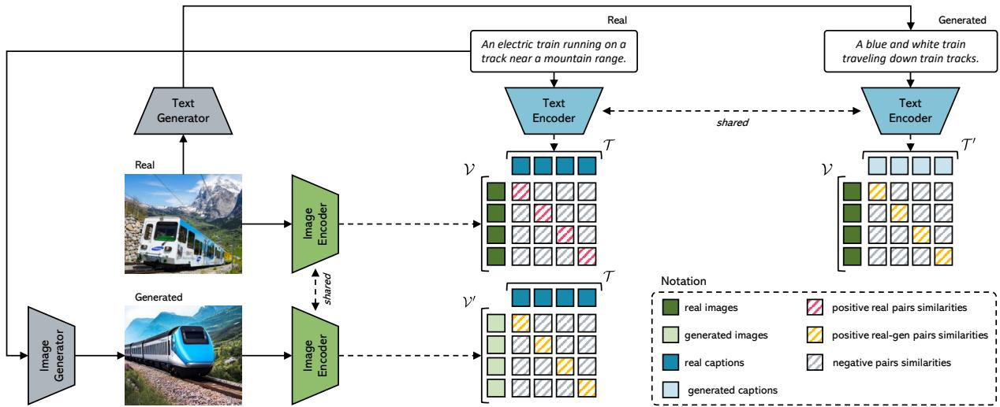
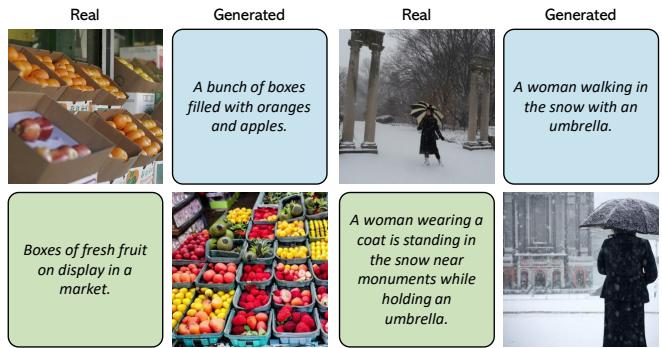
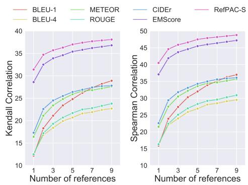

# Positive-Augmented Contrastive Learning for Image and Video Captioning Evaluation

Sara Sarto1 Manuele Barraco1 Marcella Cornia1 Lorenzo Baraldi1 Rita Cucchiara1,2 1University of Modena and Reggio Emilia, Modena, Italy 2IIT-CNR, Pisa, Italy {name.surname}@unimore.it

## Abstract

The CLIP model has been recently proven to be very effective for a variety of cross-modal tasks, including the evaluation ofcaptions generatedfrom vision-and-language architectures. In this paper, we propose a new recipe for a contrastive-based evaluation metric for image captioning, namely Positive-Augmented Contrastive learning Score (PAC-S), that in a novel way unifies the learning of a contrastive visual-semantic space with the addition of generated images and text on curated data. Experiments spanning several datasets demonstrate that our new metric achieves the highest correlation with human judgments on both images and videos, outperforming existing referencebased metrics like CIDEr and SPICE and reference-free metrics like CLIP-Score. Finally, we test the system-level correlation of the proposed metric when considering popular image captioning approaches, and assess the impact of employing different cross-modal features. Our source code and trained models arepublicly available at: https: //github.com/aimagelab/pacscore.

## 1. Introduction

The task of image captioning, which requires an algorithm to describe visual contents with natural language sentences, has been gaining considerable attention from the research community in the past few years [22, 53, 61]. As such, the task has witnessed methodological and architectural innovations, ranging from the usage of self-attentive models [10, 16, 19, 36] to the development of better connections between visual and textual modalities with the addition of objects [3, 62, 66] and tags [29, 63] or the use of more powerful cross-modal features [5, 6, 45].

Together with an increase in generation quality, the automatic evaluation of captions has also witnessed a significant effort. While early evaluation scores were based on translation metrics [4, 30, 37], more effective text-based [2, 52, 67] and multimodal solutions [21,56] have been proposed in the last few years. Among these, the usage of cross-modal models in which both visual and textual data can be matched has proven to be a viable strategy that can lead to highquality metrics [17, 24–26]. Recently, the large-scale CLIP model [38] was tested for image captioning evaluation, resulting in the CLIP-Score [17] which proved to have a significant correlation with human judgment.

<table><tr><td>Image</td><td>Candidate Captions</td><td colspan="3">Evaluation Scores</td></tr><tr><td rowspan="2"></td><td>A black cow by a person.</td><td>METEOR 9.67 14.9</td><td>CIDEr CLIP-S 0.766</td><td>Ours 0.676</td></tr><tr><td>A cow walking through a field.</td><td>METEOR 15.0</td><td>CIDEr CLIP-S 17.2 0.754</td><td>Ours 0.775</td></tr><tr><td rowspan="2">CC TITE</td><td>A silver bicycle is parked in a living room.</td><td>METEOR 23.1</td><td>CIDEr CLIP-S 68.6 0.686</td><td>Ours 0.853</td></tr><tr><td>A silver bicycle leaning up against a kitchen table and chairs.</td><td>METEOR CIDEr 32.4 63.7</td><td>CLIP-S 0.637</td><td>Ours 0.862</td></tr><tr><td rowspan="2"></td><td>A yellow bus passes through an intersection.</td><td>METEOR 42.7 167.0</td><td>CIDEr CLIP-S 0.816</td><td>Ours 0.836</td></tr><tr><td>A yellow bus is traveling down a city street just past an intersection.</td><td>METEOR CIDEr 33.9 94.5</td><td>CLIP-S 0.813</td><td>Ours 0.844</td></tr></table>

Figure 1. Evaluation scores generated by our proposed metric, PAC-S, in comparison with existing metrics for captioning. The caption highlighted in green is the one preferred by humans.

While these advancements demonstrate the appropriateness of using contrastive-based embedding spaces for evaluating image captions, large-scale models pre-trained on web-collected data also have limitations, due to the lack in style of captions collected from alt-tags and of the distribution of web-scale images which is not aligned with those on which captioning systems are evaluated. While cleaned data sources, on the contrary, are limited in size, recent advances in both image [14,39,43,44] and text generation [28,59,66] have made it possible to synthetically generate data in both modalities, with controlled style and quality.

Following this insight, in this paper we propose a learnable metric that fuses together the advantages of both these scenarios, by leveraging the quality of the pre-training on web-collected data and that of cleaned data, and also regularizing the training by considering additional positive samples hailing from visual and textual generators. Specifically, our proposed metric, PAC-S, is trained via a newly conceived positive-augmented contrastive learning approach, in which pairs of generated images and texts act as additional positives in addition to real images and human-annotated captions taken from a cleaned data source. We demonstrate that the combination of these factors, i.e. the usage of a cleaned data source and the pairing with multimodal generated data, when used to finetune a large-scale contrastive model, results in an embedding space with significantly higher alignment with the human judgment (Fig. 1). We apply the resulting metric to evaluate both images and videos, both in reference-based and reference-free settings.

We investigate the quality of the proposed metric by conducting extensive experiments on a variety of image and video datasets, including Flickr8k-Expert and Flickr8k-CF [18], Composite [1], Pascal-50S, and Abstract-50S [52] for the image scenario and the VATEX-EVAL dataset [49] to evaluate video-caption pairs. Further, we verify its sensitivity to object hallucination on the FOIL [47] and ActivityNet-FOIL [49] datasets and compare the performance of state-of-the-art caption generators with respect to the proposed metric. Our proposal outperforms previous reference-based and reference-free metrics and showcases superior performance with respect to CLIP-Score [17] and the corresponding video-based version (i.e. EMScore [49]), which also employ a contrastive-based embedding space. Overall, our metric ranks first in terms of correlation with human judgment with respect to all existing image and video captioning metrics.

To sum up, the main contribution of this paper is a novel metric for image and video captioning, based on a positive-augmented training of a multimodal embedding space, which exploits both curated image-caption pairs and additional synthetically generated positives. Extensive experiments on several datasets demonstrate a higher correlation with human judgment and an increased sensitivity to object hallucination.

## 2. Related Work

Image and video captioning solutions have been traditionally evaluated using a set of standard evaluation metrics, specifically BLEU [37], METEOR [4], ROUGE [30], CIDEr [52], and SPICE [2]. Some of them have been originally introduced to evaluate NLP tasks such as machine translation and summarization, while others have been specifically designed for the captioning task.

Recently, research efforts have been made to introduce additional metrics that can capture different aspects of generated textual sentences, like diversity [48, 50, 54, 55], robustness of object hallucination [42], uniqueness [58], and coverage of ground-truth named entities [8, 9]. A new trend, instead, is to exploit the capabilities of pre-trained models to compare textual-only [64, 67] or visual-textual contents [17, 20, 21, 25, 26, 56]. Among them, the BERT score [67] and its improved version [64] use pre-trained BERT embeddings [12] to represent and compare word tokens in the generated and ground-truth sentences.

In addition to these text-based metrics, other solutions leverage the multimodal nature of vision-and-language models to exploit not only textual information but also the visual content of images and potentially video frames. For example, Jiang et al. [21] introduced the TIGEr metric, which considers the similarities between words and image regions computed according to a cross-modal matching model [27] trained on COCO [31]. Other approaches, instead, exploit the effectiveness of web-scale vision-andlanguage models such as VilBERT [33], UNITER [7], and CLIP [38], pre-trained on millions or even billions of image-text pairs, to obtain more robust metrics [17, 24–26]. Among them, the recent CLIP-Score [17] is based on a modified cosine similarity between image and candidate caption representations coming from the CLIP model. Recently, Kim et al. [24] proposed using CLIP visual-textual features to compute the negative Gaussian cross-mutual information, obtaining a more effective evaluation metric.

While all the aforementioned evaluation metrics have originally been introduced for image captioning, there is only one attempt to evaluate video descriptions through learnable metrics also taking into account the visual content appearing in video frames. In particular, Shi et al. [49] presented the EMScore, in its both reference-free and reference-based versions, that computes fine-grained similarities between video frames and words of the candidate caption using CLIP visual-textual embeddings.

Another related work is that proposed in [69] where dif fusion models are used to evaluate text-only tasks. Differently from our proposal, the introduced metric exploits similarities between machine-generated images obtained by a visual generator [43] starting from reference and candidate textual items during evaluation.

## 3. Positive-Augmented Contrastive Learning

We are interested in devising an image and video captioning metric based on a shared embedding space in which both visual data and text can be projected and compared. To this aim, we start from the dual-encoder architecture popularized by CLIP [38], which comprises an image encoder [13, 15] and a text encoder [51]. In this architecture, the multimodal interaction is performed in a late fusion fashion, by projecting the output of both encoders to a common dimensionality and then on the $\ell _ { 2 }$ hypersphere via normalization. The visual and the textual inputs can then be compared via cosine similarity.

  
Figure 2. Overview of our positive-augmented contrastive learning approach.

Starting from a trained embedding space, an evaluation metric for image captioning can be defined by simply scaling, and eventually thresholding, the similarity computed inside of the embedding itself. For instance, given a visual embedding v and a textual embedding t, Hessel et al. [17] define the evaluation score as

$$
\operatorname { S c o r e } ( t , v ) = w \cdot \operatorname* { m a x } ( \cos ( t , v ) , 0 ) ,\tag{1}
$$

where cos indicates the cosine similarity computed inside of the embedding space and w is a scaling factor to enhance numerical readability.

Large-scale contrastive models like CLIP [38] are trained on web-collected image-caption pairs. These provide a large-scale source of supervision for learning scalable low-level and semantic visual and textual features, as testified by their zero-shot classification performance and by their adaptability to different tasks [5, 23, 34, 39]. Nevertheless, it shall be noted that the textual annotations contained in alt-tags are far from the quality level that a captioning evaluator should look for, and that the distribution of web-scale images might not be properly aligned with those on which image captioning systems are evaluated.

To solve this issue, one might think of learning the metric directly on cleaned data sources. However, recent attempts of learning contrastive-based evaluation metrics on cleaned datasets like COCO [31] perform poorly when compared to traditional metrics, potentially because of the lack of training data [21]. We, therefore, advocate the usage of synthetic generators of both visual and textual data, which showcase sufficiently high quality levels when generating both images and texts, do lack in terms of style, and are controllable in terms of visual distribution.

Specifically, given a positive image-text pair $( v , t )$ , we augment it by generating a synthetic caption $t ^ { \prime }$ from v using an image captioner [28], and a synthetic image $v ^ { \prime }$ from t via a diffusion-based text-to-image model [43], thus building a dataset consisting of tuples of four elements $( v , t , v ^ { \prime } , t ^ { \prime } )$ . As in Eq. 1, we represent $t ^ { \prime }$ and $v ^ { \prime }$ via their respective text and image embedding. We then train our evaluation model by jointly taking into account contrastive relationships between real and generated matching image-caption pairs (Fig. 2). To lower the computational requirements, we start with pretrained CLIP visual and textual encoders and only train the projection toward the embedding space.

Formally, given a batch of N real images $\nu \quad =$ $[ v _ { 1 } , v _ { 2 } , . . . , v _ { N } ]$ and their corresponding captions $\begin{array} { r l } { \mathcal { T } } & { { } = } \end{array}$ $[ t _ { 1 } , t _ { 2 } , . . . , t _ { N } ]$ , generated images $\mathcal { V } ^ { \prime } = [ v _ { 1 } ^ { \prime } , v _ { 2 } ^ { \prime } , . . . , v _ { N } ^ { \prime } ]$ and generated texts $\mathcal { T } ^ { \prime } ~ = ~ [ t _ { 1 } ^ { \prime } , t _ { 2 } ^ { \prime } , . . . , t _ { N } ^ { \prime } ] .$ , we define multiple $N \times N$ matrices containing pairwise cosine similarities between the different inputs. We then adopt a symmetric InfoNCE loss [35] which aims at maximizing the cosine similarity between the N matching pairs and minimize those of the $N ^ { 2 } - N$ non-matching pairs. The loss which compares real images V with respect to real texts $\tau$ can be defined, for instance, as

$$
\begin{array} { c } { { { \displaystyle { \cal L } _ { \mathcal { V } , \mathcal { T } } = - \frac { 1 } { N } \sum _ { i = 1 } ^ { N } \log \frac { \exp ( \cos ( v _ { i } , t _ { i } ) / \tau } { \sum _ { j = 1 } ^ { N } \exp ( \cos ( v _ { i } , t _ { j } ) / \tau } + } } } \\ { { { - \frac { 1 } { N } \sum _ { i = 1 } ^ { N } \log \frac { \exp ( \cos ( v _ { i } , t _ { i } ) / \tau } { \sum _ { j = 1 } ^ { N } \exp ( \cos ( v _ { j } , t _ { i } ) / \tau } , } } } \end{array}\tag{2}
$$

(3)

where $\tau$ is a temperature parameter. In addition to a loss term between real images and real texts, $L _ { \mathcal { V } , \mathcal { T } }$ , we also add symmetrical loss terms between cross-modal generated and real pairs, i.e. between generated images and humanannotated texts, and between original images and generated texts. In this way, generated items act as additional positive samples for the real matching pairs, thus adding a supervisory signal without paying the cost of the noisy data on which contrastive-based features extractors like CLIP are learned. In summary, the final loss is a weighted combination of the three loss terms, i.e.

$$
L = L _ { } \nu _ { , } \tau + \lambda _ { v } L _ { } \nu _ { ^ { \prime } , } \tau + \lambda _ { t } L _ { } \nu _ { , } \tau ^ { \prime } ,\tag{4}
$$

where $L _ { \mathcal { V } ^ { \prime } , \mathcal { T } }$ is the loss between generated images and real texts and $L _ { \mathcal { V } , \mathcal { T } ^ { \prime } }$ its counterpart between generated texts and real images.

## 3.1. Captioning evaluation score for images

After training with positive-augmented contrastive learning, we employ two evaluation scores for evaluating images in both a reference-free and a reference-based setting. Specifically, we employ Eq. 1 with $w = 2 ^ { 1 }$ as our referencefree score. Then, we follow the approach proposed in [17] to include reference ground-truth captions in the evaluation process. Specifically, we compute the representation of each reference caption using the textual encoder. Then, we compute the harmonic mean between the reference-free score (Eq. 1) and the maximum cosine similarity between the candidate caption and all reference captions. Formally, given a set of reference captions $R = \{ r _ { 1 } , r _ { 2 } , . . . , r _ { m } \}$ , the score is computed as

$$
\operatorname { R e f - S c o r e } ( t , v , R ) = \operatorname { H - M e a n } ( \operatorname { S c o r e } ( t , v ) ,\tag{5}
$$

$$
\operatorname* { m a x } ( 0 , \operatorname* { m a x } _ { r \in R } \cos ( c , r ) ) ) ,\tag{6}
$$

where Score(·) indicates the reference-free evaluation score as reported by our positive-augmented embedding space, and H-Mean(·) indicates the harmonic mean.

## 3.2. Captioning evaluation score for videos

To test the proposed positive-augmented strategy for evaluating video captions, we extend the above defined metric following the approach of [49]. In this case, matching scores are computed at two granularity levels, i.e. a coarsegrained level in which the global representation of the candidate caption is compared with the global representation of the video, and a fine-grained level in which the embeddings of single words are compared to those of single frames.

Specifically, we use the positive-augmented CLIP visual encoder to extract the embeddings of single frames and average-pool them to get the representation of the entire video. Similarly, we employ the corresponding textual encoder to get single tokens and whole caption embeddings. The fine-grained score is then computed by taking the F1- score of pairwise word-frame similarities and TF-IDF [41] weighting, and the coarse-grained score is computed as the similarity between the global video and caption representations. Given a source video $V$ and a candidate caption $c ,$ the overall score is defined as

$$
\operatorname { S c o r e } ( c , V ) = { \frac { \operatorname { S c o r e } ( c , V ) _ { c } + \operatorname { S c o r e } ( c , V ) _ { f } } { 2 } } ,\tag{7}
$$

  
Figure 3. Sample real and generated image-text data used for positive-augmented contrastive learning.

where Scorec represents the coarse-grained embedding matching and Scoref stands for the fine-grained similarity. Finally, to include a set of reference captions $R ,$ we follow the reference version of the aforementioned approach:

$$
\operatorname { R e f - S c o r e } ( c , V , r ) = { \frac { \operatorname { S c o r e } ( c , V ) + \operatorname* { m a x } _ { r \in R } \operatorname { S c o r e } ( c , r ) } { 2 } } ,\tag{8}
$$

where $\mathrm { S c o r e } ( c , r )$ is computed as defined in Eq. 7 by using the word-level embeddings of the reference caption.

## 4. Experimental Evaluation

## 4.1. Implementation details

Architecture and training details. In continuity with existing literature [17, 24, 49], we use CLIP ViT-B/32 [38] as backbone to encode images (or video frames) and textual sentences. We finetune the visual and textual final projections of the model using the approach described in Sec. 3 on the COCO dataset [31], which contains more than 120k images annotated with five captions. In particular, we employ the splits introduced by Karpathy et al. [22], where 5,000 images are used for validation, 5,000 images are used for test and the rest for training. During finetuning, we use AdamW [32] as optimizer with a learning rate equal to 0.0001 and a batch size of 256. The $\lambda _ { v }$ and $\lambda _ { t }$ values are selected with a grid search, choosing the combination that provides the best average across datasets. Specifically, we set $\lambda _ { v }$ to 0.05 and $\lambda _ { t }$ to 0.1, and stop the training stage when the validation loss stops decreasing for 1,500 iterations.

Positive image-text generation. To augment the training set with new positive examples, we use Stable Diffusion2 [43] for generating new visual data and the BLIP model [28] for generating new textual descriptions. Specifically, to generate images, we employ the model pretrained on the English image-text pairs of the LAION-5B dataset [46] and finetuned at a resolution equal to 512×512 on the LAION-Aesthetics subset3, which has been filtered with aesthetic requirements. During generation, we employ the safety checker module to reduce the probability of explicit images and disable the invisible watermarking of the outputs to avoid easy identification of the images as machine-generated. To generate text, instead, we use the ViT-L/14 version4 of the BLIP model pre-trained on 129M image-text pairs and finetuned on the COCO dataset. After this generation phase, we get a new version of the COCO dataset in which each image is additionally associated with a machine-generated caption and each humanannotated caption is instead associated with a newly generated image. Sample image-text data employed for finetuning are shown in Fig. 3.

<table><tr><td rowspan="2"></td><td colspan="2">Flickr8k-Expert</td><td colspan="2">Flickr8k-CF</td></tr><tr><td></td><td>Kendall τb Kendall τc</td><td></td><td>Kendall τb Kendall τc</td></tr><tr><td>BLEU-1 [37]</td><td>32.2</td><td>32.3</td><td>17.9</td><td>9.3</td></tr><tr><td>BLEU-4 [37]</td><td>30.6</td><td>30.8</td><td>16.9</td><td>8.7</td></tr><tr><td>ROUGE [30]</td><td>32.1</td><td>32.3</td><td>19.9</td><td>10.3</td></tr><tr><td>METEOR [4]</td><td>41.5</td><td>41.8</td><td>22.2</td><td>11.5</td></tr><tr><td>CIDEr [52]</td><td>43.6</td><td>43.9</td><td>24.6</td><td>12.7</td></tr><tr><td>SPICE [2]</td><td>51.7</td><td>44.9</td><td>24.4</td><td>12.0</td></tr><tr><td>BERT-S [67]</td><td></td><td>39.2</td><td>22.8</td><td></td></tr><tr><td>LEIC [11]</td><td>46.6</td><td></td><td>29.5</td><td></td></tr><tr><td>BERT-S++ [64]</td><td></td><td>46.7</td><td></td><td></td></tr><tr><td>UMIC [25]</td><td></td><td>46.8</td><td></td><td></td></tr><tr><td>TIGEr [21]</td><td></td><td>49.3</td><td></td><td></td></tr><tr><td>ViLBERTScore [26]</td><td></td><td>50.1</td><td></td><td></td></tr><tr><td>MID [24]</td><td></td><td>54.9</td><td>37.3</td><td></td></tr><tr><td>CLIP-S [17]</td><td>51.1</td><td>51.2</td><td>34.4</td><td>17.7</td></tr><tr><td rowspan="2">PAC-S</td><td>53.9</td><td>54.3</td><td>36.0</td><td>18.6</td></tr><tr><td>(+2.8)</td><td>(+3.1)</td><td>(+1.6)</td><td>(+0.9)</td></tr><tr><td>RefCLIP-S [17]</td><td>52.6</td><td>53.0</td><td>36.4</td><td>18.8</td></tr><tr><td>RefPAC-S</td><td>55.5 (+2.9)</td><td>55.9 (+2.9)</td><td>37.6 (+1.2)</td><td>19.5 (+0.7)</td></tr></table>

Table 1. Human judgment correlation scores on Flickr8k-Expert and Flickr8k-CF [18]. The overall best scores are in bold.

## 4.2. Correlation with human judgment

To evaluate the correlation of the proposed metric with human ratings, we conduct experiments on both image and video captioning datasets. Specifically, we employ the Flickr8k-Expert, Flickr8k-CF, and Composite datasets [1, 18] for the image setting and the VATEX-EVAL dataset [49] to evaluate video-caption pairs.

Image captioning results. We first evaluate our solution on the Flickr8k-Expert and Flickr8k-CF datasets [18] which include image-caption pairs with corresponding human ratings. In particular, Flickr8k-Expert contains 17k expert annotations for visual-textual pairs, with a total of 5,664 different images. The pairs are evaluated with a score from 1 to 4, where 1 indicates that the caption does not correlate with the image and 4 indicates that the caption describes the corresponding image without errors. Flickr8k-CF, instead, is composed of 145k binary quality judgments, collected from CrowdFlower, for 48k image-caption pairs (with 1,000 unique images). Each pair is annotated with at least three binary scores, where “yes” indicates that the caption correlates with the image. To measure the correlation with human judgment, we compute the mean proportion of “yes” annotations as the score for each pair.

<table><tr><td rowspan="2"></td><td colspan="2">Composite</td></tr><tr><td>Kendall  $\tau _ { b }$ </td><td>Kendall τ{c</td></tr><tr><td>BLEU-1 [37]</td><td>29.0</td><td>31.3</td></tr><tr><td>BLEU-4 [37]</td><td>28.3</td><td>30.6</td></tr><tr><td>ROUGE [30]</td><td>30.0</td><td>32.4</td></tr><tr><td>METEOR [4]</td><td>36.0</td><td>38.9</td></tr><tr><td>CIDEr [52]</td><td>34.9</td><td>37.7</td></tr><tr><td>SPICE [2]</td><td>38.8</td><td>40.3</td></tr><tr><td>BERT-S [67]</td><td></td><td>30.1</td></tr><tr><td>BERT-S++ [64]</td><td></td><td>44.9</td></tr><tr><td>TIGEr [21]</td><td></td><td>45.4</td></tr><tr><td>ViLBERTScore [26]</td><td></td><td>52.4</td></tr><tr><td>FAIEr [56]</td><td></td><td>51.4</td></tr><tr><td>CLIP-S [17]</td><td>49.8</td><td>53.8</td></tr><tr><td rowspan="2">PAC-S</td><td>51.5</td><td>55.7</td></tr><tr><td>(+1.7)</td><td>(+1.9)</td></tr><tr><td>RefCLIP-S [17]</td><td>51.2</td><td>55.4</td></tr><tr><td rowspan="2">RefPAC-S</td><td>53.0</td><td>57.3</td></tr><tr><td>(+1.8)</td><td>(+1.9)</td></tr></table>

Table 2. Human judgment correlation scores on the Composite dataset [1]. The overall best scores are in bold.

Following previous works [17, 25, 26, 67], we compute Kendall correlation scores in both $\tau _ { b }$ and $\tau _ { c }$ versions. Results are reported in Table 1 comparing the proposed PAC-S metric with respect to both standard captioning evaluation scores (i.e. BLEU [37], ROUGE [30], METEOR [4], CIDEr [52], and SPICE [2]) and more recent solutions that either exploit text-only or cross-modal learned embeddings, such as BERT-S [67], BERT-S++ [64], LEIC [11], TIGEr [21], UMIC [25], VilBERTScore [26], MID [24], and CLIP-S [17]. While CLIP-S is reported in both reference-free and reference-based versions, all other metrics require reference captions. The only exception is the MID score which is positioned between a reference-free and a reference-based metric since it utilizes the mean and covariance of the correct captions.

From the results, it can be seen that the proposed score achieves the best correlation with human judgment on both considered datasets, demonstrating its effectiveness compared to previously proposed metrics. In particular, when comparing our score with CLIP-S and RefCLIP-S, we can notice an improvement in terms of Kendall $\tau _ { b }$ of 2.8 and 2.9 points on Flickr8k-Expert, and 1.6 and 1.2 points on Flickr8k-CF, respectively. Similar improvements can be also observed in terms of Kendall $\tau _ { c }$ correlation score. It is also important to note that the reference-free version of PAC-S overcomes by a large margin the correlation scores achieved by traditional reference-based metrics such as CIDEr and SPICE $( e . g . \ + 1 0 . 3 / 1 0 . 4 $ points with respect to the CIDEr metric on Flickr8k-Expert).

<table><tr><td rowspan="2"></td><td colspan="2">No Ref</td><td colspan="2">1 Ref</td><td colspan="2">9 Refs</td></tr><tr><td>Kendall  $\tau _ { b }$ </td><td>Spearman ρ</td><td>Kendall  $\tau _ { b }$ </td><td>Spearman ρ</td><td></td><td>Kendall τb Spearman ρ</td></tr><tr><td>BLEU-1 [37]</td><td></td><td></td><td>12.2</td><td>15.9</td><td>28.9</td><td>37.0</td></tr><tr><td>BLEU-4 [37]</td><td></td><td></td><td>12.6</td><td>16.4</td><td>22.4</td><td>29.5</td></tr><tr><td>ROUGE [30]</td><td></td><td></td><td>12.5</td><td>16.3</td><td>23.8</td><td>30.9</td></tr><tr><td>METEOR [4]</td><td></td><td></td><td>16.4</td><td>21.5</td><td>27.6</td><td>35.7</td></tr><tr><td>CIDEr [52]</td><td></td><td></td><td>17.3</td><td>22.6</td><td>27.8</td><td>36.1</td></tr><tr><td>BERT-S [67]</td><td>-</td><td>-</td><td>18.2</td><td>23.7</td><td>29.3</td><td>37.8</td></tr><tr><td>BERT-S++ [64]</td><td>-</td><td>一</td><td>15.2</td><td>19.8</td><td>24.4</td><td>31.7</td></tr><tr><td>EMScore [49]</td><td>23.2</td><td>30.3</td><td>28.6</td><td>37.1</td><td>36.8</td><td>47.2</td></tr><tr><td>PAC-S / RefPAC-S</td><td>25.1 (+1.9)</td><td>32.6 (+2.3)</td><td>31.4 (+2.8)</td><td>40.5 (+3.4)</td><td>38.1 (+1.3)</td><td>48.8 (+1.6)</td></tr></table>

  
Table 3. Human judgment correlation scores on the VATEX-EVAL dataset [49]. The overall best scores are in bold. On the right, we show Kendall $\tau _ { b }$ correlation score at varying of the number of reference captions.

We also conduct experiments on the Composite dataset [1] which contains 12k human judgments for imagecaption pairs taken from COCO [31] (2,007 images), Flickr8k [18] (997 images), and Flickr30k [65] (991 images). Each image-caption pair is evaluated with a score, given by humans, between 1 and 5 to estimate the correspondence of the caption with the associated image. Experimental results are shown in Table 2, again in terms of Kendall $\tau _ { b }$ and Kendall $\tau _ { c }$ correlation scores. Also in this case, our metric achieves a better correlation with human ratings than that obtained by both traditional and more recent evaluation scores, confirming its effectiveness even when compared to CLIP-S and RefCLIP-S.

Video captioning results. To evaluate the correlation with humans in the context of video-caption pairs, we consider the VATEX-EVAL dataset [49] which includes 3,000 videos from the VATEX [57] validation set, each of them associated with six captions of mixed quality. Each video-caption pair has been evaluated by three human annotators with a score from 1 (to denote inconsistency between the video and the caption) to $5$ (to denote consistency). Overall, the dataset contains 54k human ratings for 18k video-caption pairs. Following recent literature [49], we compute Kendall $\tau _ { b }$ and Spearman $\rho$ rank correlation coefficients, considering a different number of reference sentences when measuring correlation (i.e. zero, one, or nine). Correlation scores are reported in Table 3 in comparison with standard evaluation metrics, BERT-S, BERT-S++, and the only videospecific captioning metric existing in literature, i.e. EM-Score. On the right, we also report the correlation scores at varying the number of reference captions. It can be seen that PAC-S achieves the best correlation scores in all settings, improving EMScore of 2.3, 3.4, and 1.6 Spearman $\rho$ points respectively with no references, one reference, and nine reference sentences. These results further confirm the appropriateness of our positive-augmented contrastive learning strategy to improve captioning evaluation also when considering videos instead of static images.

<table><tr><td></td><td>HC</td><td>HI</td><td>HM</td><td>MM</td><td>Mean</td></tr><tr><td>length</td><td>51.7</td><td>52.3</td><td>63.6</td><td>49.6</td><td>54.3</td></tr><tr><td>BLEU-1 [37]</td><td>64.6</td><td>95.2</td><td>91.2</td><td>60.7</td><td>77.9</td></tr><tr><td>BLEU-4 [37]</td><td>60.3</td><td>93.1</td><td>85.7</td><td>57.0</td><td>74.0</td></tr><tr><td>ROUGE [30]</td><td>63.9</td><td>95.0</td><td>92.3</td><td>60.9</td><td>78.0</td></tr><tr><td>METEOR [4]</td><td>66.0</td><td>97.7</td><td>94.0</td><td>66.6</td><td>81.1</td></tr><tr><td>CIDEr [52]</td><td>66.5</td><td>97.9</td><td>90.7</td><td>65.2</td><td>80.1</td></tr><tr><td>BERT-S† [67]</td><td>65.4</td><td>96.2</td><td>93.3</td><td>61.4</td><td>79.1</td></tr><tr><td>BERT-S++† [64]</td><td>65.4</td><td>98.1</td><td>96.4</td><td>60.3</td><td>80.1</td></tr><tr><td>TIGEr† [21]</td><td>56.0</td><td>99.8</td><td>92.8</td><td>74.2</td><td>80.7</td></tr><tr><td>ViLBERTScore† [26]</td><td>49.9</td><td>99.6</td><td>93.1</td><td>75.8</td><td>79.6</td></tr><tr><td>FAIEr† [56]</td><td>59.7</td><td>99.9</td><td>92.7</td><td>73.4</td><td>81.4</td></tr><tr><td>MID† [24]</td><td>67.0</td><td>99.7</td><td>97.4</td><td>76.8</td><td>85.2</td></tr><tr><td>CLIP-S [17]</td><td>55.9</td><td>99.3</td><td>96.5</td><td>72.0</td><td>80.9</td></tr><tr><td>PAC-S</td><td>60.6 (+4.7)</td><td>99.3</td><td>96.9</td><td>72.9</td><td>82.4</td></tr><tr><td>RefCLIP-S [17]</td><td>64.9</td><td>(+0.0) 99.5</td><td>(+0.4) 95.5</td><td>(+0.9) 73.3</td><td>(+1.5) 83.3</td></tr><tr><td>RefPAC-S</td><td>67.7 (+2.8)</td><td>99.6 (+0.1)</td><td>96.0 (+0.5)</td><td>75.6 (+2.3)</td><td>84.7 (+1.4)</td></tr></table>

Table 4. Accuracy results on the Pascal-50S dataset [52] obtained by averaging the scores over five random draws of reference captions (except for reference-free metrics). The † marker indicates scores reported in previous works, which may differ in terms of selected reference captions. We refer to the text for the definition of HC, HI, HM, and MM. The overall best scores are in bold.

## 4.3. Caption pairwise ranking

We assess the effectiveness of the proposed metric on the Pascal-50S dataset [52], which reports pairwise preference judgments between two captions. Specifically, the dataset comprises 4k sentence pairs, each of them associated with an image from the UIUC Pascal sentence dataset [40]. For each pair, 48 human judgments have been collected, in which each evaluation expresses which sentence best describes the given image. Sentence pairs are divided into four different categories: two human-written and correct captions (HC), two human-written captions where one is correct and the other is wrong (HI), two correct captions but one written by humans and the other machine-generated (HM), two machine-generated and correct captions (MM).

<table><tr><td></td><td>Mean</td><td></td><td>Mean</td></tr><tr><td>CLIP-S [17]</td><td>68.2</td><td>RefCLIP-S [17]</td><td>75.8</td></tr><tr><td>PAC-S</td><td>69.7 (+1.5)</td><td>RefPAC-S</td><td>76.9 (+1.1)</td></tr></table>

Table 5. Accuracy results on the Abstract-50S dataset [52].

In this setting, instead of computing correlation scores, we compute accuracy by considering for each pair the caption preferred by the majority of human ratings as correct (where ties are broken randomly) and measuring how often the evaluation metric assigns a higher score to the selected caption. For each evaluation, we randomly sample five reference captions (among the 48 provided by the dataset) and average the results over five different draws. Accuracy values are reported in Table 4 in comparison with previously proposed metrics. Similarly to previous works, we also include the results of a length-based baseline in which the longer caption is always considered the better one. From the results, we can observe that PAC-S and RefPAC-S respectively perform better than CLIP-S and RefCLIP-S in almost all categories, with an increase of 1.5 points in terms of averaged accuracy. Also, our results are generally higher than those of the other metrics, with the only exception of the MID score which achieves slightly better accuracy. However, our results are not directly comparable to the ones reported in previous works (as, for example, FAIEr and MID), given the random selection of ground-truth sentences used to compute reference-based metrics.

As a further analysis, we evaluate the results on the Abstract-50S dataset [52] which contains clip-art images from [70] associated with 48 human-annotated reference sentences. Similar to Pascal-50S, each image is associated with a pair of candidate captions and 48 human judgments, collected asking to select which candidate caption is most similar to a given reference sentence. Overall, the dataset is composed of 400 candidate caption pairs, of which 200 describe the corresponding image (i.e. both captions are correct) and 200 instead contain one correct caption and one caption of another image. Again, we compute accuracy scores by considering the most preferred caption as correct, averaging the results over five random draws of reference sentences. Table 5 shows the results of our score in comparison with CLIP-S. In both reference-free and referencebased versions, PAC-S achieves better accuracy scores than CLIP-S, demonstrating its effectiveness also in this challenging setting of non-photographic images.

## 4.4. Sensitivity to object hallucination

Correctly identifying captions with potential object hallucinations (i.e. with objects that are not present in the image or video) is fundamental for the captioning task [42]. Therefore, we extend our analysis to two datasets for detecting hallucinations in textual sentences, namely FOIL [47] and ActivityNet-FOIL [49]. In particular, the FOIL dataset is composed of image-caption pairs from the COCO dataset [31]. In this case, captions are perturbed by creating modified versions that are highly similar to the original ones but contain one single error (i.e. a foil word). For a fair comparison, we take the subset of the validation set that does not overlap with the portion of COCO used to finetune our model thus obtaining 8k images, each associated with a foil-correct textual pair. The ActivityNet-FOIL dataset, instead, contains video-text pairs from the ActivityNet test set [68]. Each video comes with two annotated paragraphs, one used to construct foil-correct pair and the other used as ground-truth for reference-based metrics. To create a foil caption, a noun phrase in the original caption is replaced with a similar but incorrect visual concept. Overall, the dataset is composed of 1,900 foil-correct paragraph pairs.

<table><tr><td rowspan="2"></td><td colspan="2">FOIL</td><td rowspan="2">ActivityNet-FOIL Accuracy</td></tr><tr><td></td><td>Acc. (1 Ref) Acc. (4 Refs)</td></tr><tr><td>BLEU-1 [37]</td><td>65.7</td><td>85.4</td><td>60.1</td></tr><tr><td>BLEU-4 [37]</td><td>66.2</td><td>87.0</td><td>66.1</td></tr><tr><td>ROUGE [30]</td><td>54.6</td><td>70.4</td><td>56.7</td></tr><tr><td>METEOR [4]</td><td>70.1</td><td>82.0</td><td>72.9</td></tr><tr><td>CIDEr [52]</td><td>85.7</td><td>94.1</td><td>77.9</td></tr><tr><td>MID [24]</td><td>90.5</td><td>90.5</td><td></td></tr><tr><td>CLIP-S [17]</td><td>87.2</td><td>87.2</td><td></td></tr><tr><td>EMScore [49]</td><td></td><td></td><td>89.5</td></tr><tr><td rowspan="2">PAC-S</td><td>89.9</td><td>89.9</td><td>90.1</td></tr><tr><td>(+2.7)</td><td>(+2.7)</td><td>(+0.6)</td></tr><tr><td>RefCLIP-S [17]</td><td>91.0</td><td>92.6</td><td></td></tr><tr><td>EMScoreRef [49]</td><td></td><td></td><td>92.4</td></tr><tr><td rowspan="2">RefPAC-S</td><td>93.7</td><td>94.9</td><td>93.5</td></tr><tr><td>(+2.7)</td><td>(+2.3)</td><td>(+1.1)</td></tr></table>

Table 6. Accuracy results on the FOIL [47] and ActivityNet-FOIL [49] hallucination detection datasets. The overall best scores are in bold.
<table><tr><td></td><td>B-4</td><td>M</td><td>C</td><td>CLIP-S</td><td>PAC-S</td><td>RefPAC-S</td></tr><tr><td>Show and Tell [53]</td><td>31.4</td><td>25.0</td><td>97.2</td><td>0.572</td><td>0.772</td><td>0.826</td></tr><tr><td>Show, Attend and Tell [61]</td><td>33.4 26.2</td><td></td><td>104.6</td><td>0.582</td><td>0.785</td><td>0.837</td></tr><tr><td>Up-Down [3]</td><td>36.7</td><td>27.9</td><td>122.7</td><td>0.592</td><td>0.794</td><td>0.847</td></tr><tr><td>SGAE [62]</td><td>39.0</td><td>28.4</td><td>129.1</td><td>0.600</td><td>0.803</td><td>0.854</td></tr><tr><td>AoANet [19]</td><td>38.9</td><td>29.2</td><td>129.8</td><td>0.602</td><td>0.805</td><td>0.856</td></tr><tr><td>M2 Transformer [10]</td><td>39.1</td><td>29.2</td><td>131.2</td><td>0.605</td><td>0.806</td><td>0.854</td></tr><tr><td>X-Transformer [36]</td><td></td><td></td><td>39.7 29.5 132.8</td><td>0.610</td><td>0.812</td><td>0.859</td></tr><tr><td>VinVL [66]</td><td>41.0</td><td>31.1</td><td>140.9</td><td>0.627</td><td>0.821</td><td>0.869</td></tr><tr><td>Humans</td><td></td><td>24.1</td><td>87.6</td><td>0.626</td><td>0.818</td><td>0.857</td></tr></table>

Table 7. Evaluation scores of state-of-the-art captioning models on COCO test set [31].

Since each image or video is associated with a foilcorrect caption pair, we measure the portion of times in which the correct caption obtains a higher score than the foil one. Table 6 shows the accuracy results on the considered datasets. As it can be seen, PAC-S achieves better results than previous solutions, increasing the accuracy score of 2.7 and 0.6 points compared to CLIP-S and EMScore, respectively. Similar improvements can also be observed in the reference-based version, demonstrating the capabilities of our metric to correctly identify hallucinated objects.

<table><tr><td rowspan="2" colspan="2"></td><td colspan="2">Flickr8k-Expert</td><td colspan="2">Flickr8k-CF</td><td colspan="2">VATEX-EVAL</td><td>Pascal-50S</td><td>FOIL</td><td>ActivityNet-FOIL</td></tr><tr><td>Kendall τb</td><td>Kendall τc</td><td>Kendall τb</td><td>Kendall τc</td><td>Kendall τb Spearman ρ</td><td></td><td>Accuracy</td><td>Accuracy</td><td>Accuracy</td></tr><tr><td rowspan="3">CLIP ViT-B/16</td><td>CLIP-S [17]</td><td>51.7</td><td>52.1</td><td>34.9</td><td>18.0</td><td></td><td></td><td>81.1</td><td>90.6</td><td></td></tr><tr><td>EMScore [49]</td><td></td><td></td><td></td><td></td><td>241</td><td>31.4</td><td></td><td></td><td>90.0</td></tr><tr><td>PAC-S</td><td>54.5 (+2.8)</td><td>54.9 (+2.8)</td><td>35.9 (+1.0)</td><td>18.5 (+0.5)</td><td>26.8 (+2.7)</td><td>34.7 (+3.3)</td><td>82.9 (+1.8)</td><td>91.1 (+0.5)</td><td>90.7 (+0.7)</td></tr><tr><td rowspan="4">CLIP ViT-L/14</td><td>CLIP-S [17]</td><td></td><td></td><td></td><td></td><td></td><td></td><td></td><td>90.9</td><td></td></tr><tr><td>EMScore [49]</td><td>52.6</td><td>53.0</td><td>35.2</td><td>18.2</td><td>26.7</td><td>34.7</td><td>81.7</td><td></td><td>89.0</td></tr><tr><td></td><td>55.1</td><td>55.5</td><td>36.8</td><td>19.0</td><td>28.9</td><td>37.4</td><td>82.2</td><td>91.9</td><td>91.2</td></tr><tr><td>PAC-S</td><td>(+2.5)</td><td>(+2.5)</td><td>(+1.6)</td><td>(+0.8)</td><td>(+2.2)</td><td>(+2.7)</td><td>(+0.5)</td><td>(+1.0)</td><td>(+2.2)</td></tr><tr><td rowspan="4">OpenCLIP ViT-B/32</td><td>CLIP-S [17]</td><td>52.3</td><td></td><td>35.4</td><td></td><td></td><td></td><td>81.2</td><td>88.9</td><td></td></tr><tr><td>EMScore [49]</td><td></td><td>52.6</td><td></td><td>18.3</td><td>24.8</td><td>32.2</td><td></td><td></td><td>88.2</td></tr><tr><td></td><td>53.6</td><td>53.9</td><td>36.1</td><td>18.6</td><td>25.4</td><td>33.1</td><td>82.1</td><td>90.1</td><td>89.5</td></tr><tr><td>PAC-S</td><td>(+1.3)</td><td>(+1.3)</td><td>(+0.7)</td><td>(+0.3)</td><td>(+0.6)</td><td>(+0.9)</td><td>(+0.9)</td><td>(+1.2)</td><td>(+1.3)</td></tr><tr><td rowspan="4">OpenCLIP ViT-L/14</td><td>CLIP-S [17]</td><td>54.4</td><td>54.5</td><td>36.6</td><td>18.9</td><td></td><td></td><td>82.5</td><td>92.2</td><td></td></tr><tr><td>EMScore [49]</td><td></td><td></td><td></td><td></td><td>27.0</td><td>35.0</td><td></td><td></td><td>90.7</td></tr><tr><td></td><td>55.3</td><td>55.7</td><td>37.0</td><td>19.1</td><td>27.8</td><td>36.1</td><td>82.8</td><td>93.1</td><td>91.2</td></tr><tr><td>PAC-S</td><td>(+0.9)</td><td>(+1.2)</td><td>(+0.4)</td><td>(+0.2)</td><td>(+0.8)</td><td>(+1.1)</td><td>(+0.3)</td><td>(+0.9)</td><td>(+0.5)</td></tr></table>

Table 8. Human correlation and accuracy scores on both image and video captioning datasets using different cross-modal backbones.

## 4.5. System-level correlation

After demonstrating the benefits of using PAC-S over other evaluation metrics, we also analyze its effectiveness when evaluating existing captioning methods. To this aim, we consider different popular captioning models and compute their predictions on images coming from the COCO test set. Results are reported in Table 7 in terms of BLEU-4, METEOR, CIDEr, CLIP-S, and our PAC-S, in both reference-free and reference-based versions. We also include the results of a human-based baseline, in which for each sample one human-annotated sentence (among the five provided by the COCO dataset) is randomly selected as candidate caption and compared with the remaining references5. As shown in the table, our metric well correlates with previous ones in identifying the best captioning model. Interestingly, PAC-S can also effectively evaluate humanannotated sentences, unlike for example the METEOR and CIDEr scores which rank human captions even below those generated by early captioning approaches [53, 61].

## 4.6. Analyzing other cross-modal features

Finally, we report in Table 8 captioning evaluation results when using different cross-modal features. In particular, we employ ViT-B/16 and ViT-L/14 models of CLIP [38] and the ViT-B/32 and ViT-L/14 versions of the open source implementation (i.e. OpenCLIP [60]6) trained on the English subset of the LAION-5B dataset [46]. For all backbones, we employ the same finetuning procedure and training settings described in Sec 4.1. We conduct the analysis on the majority of the datasets considered in the previous experiments and compare the proposed PAC-S with CLIP-S and EMScore, respectively for image and video captioning datasets. Noticeably, PAC-S achieves the best results across all cross-modal backbones and all datasets, overcoming correlation and accuracy scores of other metrics by a large margin. When comparing the results when using different backbones, both ViT-L/14 models outperform other considered architectures as well as the standard CLIP ViT-B/32 model used in previous experiments, thus demonstrating the usefulness of using more powerful cross-modal models to evaluate captioning predictions.

## 5. Conclusion

In this paper, we have proposed a positive-augmented contrastive learning approach for image and video captioning evaluation. Our proposal, PAC-S, is trained by considering cleaned data sources and leveraging synthetic images and captions as an additional source of supervision. Experimentally, we have demonstrated that PAC-S is superior to all previous metrics in terms of correlation with human judgment and sensitivity to hallucinated objects in both reference-free and reference-based settings.

## Acknowledgments

We thank CINECA for providing computational resources. Work conducted under a research grant co-funded by Leonardo S.p.A. and supported by the projects: PNRR-M4C2 (PE00000013) “FAIR - Future Artificial Intelligence Research” funded by the European Commission, “ELSA - European Lighthouse on Secure and Safe AI” funded by the EU (GA 101070617), and the PRIN “CRE-ATIVE: CRoss-modal understanding and gEnerATIon of Visual and tExtual content” co-funded by the Italian Ministry of University and Research (CUP B87G22000460001).

## References

[1] Somak Aditya, Yezhou Yang, Chitta Baral, Cornelia Fermuller, and Yiannis Aloimonos. From Images to Sentences through Scene Description Graphs using Commonsense Reasoning and Knowledge. arXiv preprint arXiv:1511.03292, 2015. 2, 5, 6

[2] Peter Anderson, Basura Fernando, Mark Johnson, and Stephen Gould. SPICE: Semantic Propositional Image Caption Evaluation. In ECCV, 2016. 1, 2, 5

[3] Peter Anderson, Xiaodong He, Chris Buehler, Damien Teney, Mark Johnson, Stephen Gould, and Lei Zhang. Bottom-up and top-down attention for image captioning and visual question answering. In CVPR, 2018. 1, 7

[4] Satanjeev Banerjee and Alon Lavie. METEOR: An automatic metric for MT evaluation with improved correlation with human judgments. In ACL Workshops, 2005. 1, 2, 5, 6, 7

[5] Manuele Barraco, Marcella Cornia, Silvia Cascianelli, Lorenzo Baraldi, and Rita Cucchiara. The Unreasonable Effectiveness of CLIP Features for Image Captioning: An Experimental Analysi. In CVPR Workshops, 2022. 1, 3

[6] Manuele Barraco, Matteo Stefanini, Marcella Cornia, Silvia Cascianelli, Lorenzo Baraldi, and Rita Cucchiara. CaMEL: Mean Teacher Learning for Image Captioning. In ICPR, 2022. 1

[7] Yen-Chun Chen, Linjie Li, Licheng Yu, Ahmed El Kholy, Faisal Ahmed, Zhe Gan, Yu Cheng, and Jingjing Liu. UNITER: UNiversal Image-TExt Representation Learning. In ECCV, 2020. 2

[8] Marcella Cornia, Lorenzo Baraldi, and Rita Cucchiara. Show, Control and Tell: A Framework for Generating Controllable and Grounded Captions. In CVPR, 2019. 2

[9] Marcella Cornia, Lorenzo Baraldi, and Rita Cucchiara. SMArT: Training Shallow Memory-aware Transformers for Robotic Explainability. In ICRA, 2020. 2

[10] Marcella Cornia, Matteo Stefanini, Lorenzo Baraldi, and Rita Cucchiara. Meshed-Memory Transformer for Image Captioning. In CVPR, 2020. 1, 7

[11] Yin Cui, Guandao Yang, Andreas Veit, Xun Huang, and Serge Belongie. Learning to Evaluate Image Captioning. In CVPR, 2018. 5

[12] Jacob Devlin, Ming-Wei Chang, Kenton Lee, and Kristina Toutanova. BERT: Pre-training of deep bidirectional transformers for language understanding. In NAACL, 2018. 2

[13] Alexey Dosovitskiy, Lucas Beyer, Alexander Kolesnikov, Dirk Weissenborn, Xiaohua Zhai, Thomas Unterthiner, Mostafa Dehghani, Matthias Minderer, Georg Heigold, Sylvain Gelly, Jakob Uszkoreit, and Neil Houlsby. An Image is Worth 16x16 Words: Transformers for Image Recognition at Scale. In ICLR, 2021. 2

[14] Oran Gafni, Adam Polyak, Oron Ashual, Shelly Sheynin, Devi Parikh, and Yaniv Taigman. Make-A-Scene: Scene-Based Text-to-Image Generation with Human Priors. In ECCV, 2022. 1

[15] Kaiming He, Xiangyu Zhang, Shaoqing Ren, and Jian Sun. Deep residual learning for image recognition. In CVPR, 2016. 2

[16] Simao Herdade, Armin Kappeler, Kofi Boakye, and Joao Soares. Image captioning: Transforming objects into words. In NeurIPS, 2019. 1

[17] Jack Hessel, Ari Holtzman, Maxwell Forbes, Ronan Le Bras, and Yejin Choi. CLIPScore: A Reference-free Evaluation Metric for Image Captioning. In EMNLP, 2021. 1, 2, 3, 4, 5, 6, 7, 8

[18] Micah Hodosh, Peter Young, and Julia Hockenmaier. Framing image description as a ranking task: Data, models and evaluation metrics. JAIR, 47:853–899, 2013. 2, 5, 6

[19] Lun Huang, Wenmin Wang, Jie Chen, and Xiao-Yong Wei. Attention on Attention for Image Captioning. In ICCV, 2019. 1, 7

[20] Ming Jiang, Junjie Hu, Qiuyuan Huang, Lei Zhang, Jana Diesner, and Jianfeng Gao. REO-Relevance, Extraness, Omission: A Fine-grained Evaluation for Image Captioning. In EMNLP, 2019. 2

[21] Ming Jiang, Qiuyuan Huang, Lei Zhang, Xin Wang, Pengchuan Zhang, Zhe Gan, Jana Diesner, and Jianfeng Gao. TIGEr: Text-to-Image Grounding for Image Caption Evaluation. In EMNLP, 2019. 1, 2, 3, 5, 6

[22] Andrej Karpathy and Li Fei-Fei. Deep visual-semantic alignments for generating image descriptions. In CVPR, 2015. 1, 4

[23] Apoorv Khandelwal, Luca Weihs, Roozbeh Mottaghi, and Aniruddha Kembhavi. Simple but Effective: CLIP Embeddings for Embodied AI. In CVPR, 2022. 3

[24] Jin-Hwa Kim, Yunji Kim, Jiyoung Lee, Kang Min Yoo, and Sang-Woo Lee. Mutual Information Divergence: A Unified Metric for Multimodal Generative Models. In NeurIPS, 2022. 1, 2, 4, 5, 6, 7

[25] Hwanhee Lee, Seunghyun Yoon, Franck Dernoncourt, Trung Bui, and Kyomin Jung. UMIC: An Unreferenced Metric for Image Captioning via Contrastive Learning. In ACL, 2021. 1, 2, 5

[26] Hwanhee Lee, Seunghyun Yoon, Franck Dernoncourt, Doo Soon Kim, Trung Bui, and Kyomin Jung. ViL-BERTScore: Evaluating Image Caption Using Vision-and-Language BERT. In EMNLP Workshops, 2020. 1, 2, 5, 6

[27] Kuang-Huei Lee, Xi Chen, Gang Hua, Houdong Hu, and Xiaodong He. Stacked Cross Attention for Image-Text Matching. In ECCV, 2018. 2

[28] Junnan Li, Dongxu Li, Caiming Xiong, and Steven Hoi. BLIP: Bootstrapping Language-Image Pre-training for Unified Vision-Language Understanding and Generation. In ICML, 2022. 1, 3, 4

[29] Xiujun Li, Xi Yin, Chunyuan Li, Pengchuan Zhang, Xiaowei Hu, Lei Zhang, Lijuan Wang, Houdong Hu, Li Dong, Furu Wei, et al. Oscar: Object-semantics aligned pre-training for vision-language tasks. In ECCV, 2020. 1

[30] Chin-Yew Lin. Rouge: A package for automatic evaluation of summaries. In ACL Workshops, 2004. 1, 2, 5, 6, 7

[31] Tsung-Yi Lin, Michael Maire, Serge Belongie, James Hays, Pietro Perona, Deva Ramanan, Piotr Dollar, and C Lawrence´ Zitnick. Microsoft COCO: Common Objects in Context. In ECCV, 2014. 2, 3, 4, 6, 7

[32] Ilya Loshchilov and Frank Hutter. Decoupled Weight Decay Regularization. In ICLR, 2019. 4

[33] Jiasen Lu, Dhruv Batra, Devi Parikh, and Stefan Lee. ViL-BERT: Pretraining Task-Agnostic Visiolinguistic Representations for Vision-and-Language Tasks. In NeurIPS, 2019. 2

[34] Joanna Materzynska, Antonio Torralba, and David Bau. Dis-´ entangling Visual and Written Concepts in CLIP. In CVPR, 2022. 3

[35] Aaron van den Oord, Yazhe Li, and Oriol Vinyals. Representation Learning with Contrastive Predictive Coding. arXiv preprint arXiv:1807.03748, 2018. 3

[36] Yingwei Pan, Ting Yao, Yehao Li, and Tao Mei. X-Linear Attention Networks for Image Captioning. In CVPR, 2020. 1, 7

[37] Kishore Papineni, Salim Roukos, Todd Ward, and Wei-Jing Zhu. BLEU: a method for automatic evaluation of machine translation. In ACL, 2002. 1, 2, 5, 6, 7

[38] Alec Radford, Jong Wook Kim, Chris Hallacy, Aditya Ramesh, Gabriel Goh, Sandhini Agarwal, Girish Sastry, Amanda Askell, Pamela Mishkin, Jack Clark, Gretchen Krueger, and Ilya Sutskever. Learning Transferable Visual Models From Natural Language Supervision. In ICML, 2021. 1, 2, 3, 4, 8

[39] Aditya Ramesh, Prafulla Dhariwal, Alex Nichol, Casey Chu, and Mark Chen. Hierarchical Text-Conditional Image Generation with CLIP Latents. arXiv preprint arXiv:2204.06125, 2022. 1, 3

[40] Cyrus Rashtchian, Peter Young, Micah Hodosh, and Julia Hockenmaier. Collecting Image Annotations Using Amazon’s Mechanical Turk. In NAACL Workshops, 2010. 6

[41] Stephen Robertson. Understanding inverse document frequency: on theoretical arguments for IDF. Journal of Documentation, 2004. 4

[42] Anna Rohrbach, Lisa Anne Hendricks, Kaylee Burns, Trevor Darrell, and Kate Saenko. Object Hallucination in Image Captioning. In EMNLP, 2018. 2, 7

[43] Robin Rombach, Andreas Blattmann, Dominik Lorenz, Patrick Esser, and Bjorn Ommer. High-resolution image syn-¨ thesis with latent diffusion models. In CVPR, 2022. 1, 2, 3, 4

[44] Chitwan Saharia, William Chan, Saurabh Saxena, Lala Li, Jay Whang, Emily Denton, Seyed Kamyar Seyed Ghasemipour, Burcu Karagol Ayan, S Sara Mahdavi, Rapha Gontijo Lopes, Tim Salimans, Jonathan Ho, David J Fleet, and Mohammad Norouzi. Photorealistic Text-to-Image Diffusion Models with Deep Language Understanding. arXiv preprint arXiv:2205.11487, 2022. 1

[45] Sara Sarto, Marcella Cornia, Lorenzo Baraldi, and Rita Cucchiara. Retrieval-Augmented Transformer for Image Captioning. In CBMI, 2022. 1

[46] Christoph Schuhmann, Romain Beaumont, Richard Vencu, Cade Gordon, Ross Wightman, Mehdi Cherti, Theo Coombes, Aarush Katta, Clayton Mullis, Mitchell Wortsman, Patrick Schramowski, Srivatsa Kundurthy, Katherine Crowson, Ludwig Schmidt, Robert Kaczmarczyk, and Jenia Jitsev. LAION-5B: An open large-scale dataset for training next generation image-text models. In NeurIPS, 2022. 4, 8

[47] Ravi Shekhar, Sandro Pezzelle, Yauhen Klimovich, Aurelie´ Herbelot, Moin Nabi, Enver Sangineto, and Raffaella

Bernardi. FOIL it! Find One mismatch between Image and Language caption. In ACL, 2017. 2, 7

[48] Rakshith Shetty, Marcus Rohrbach, Lisa Anne Hendricks, Mario Fritz, and Bernt Schiele. Speaking the same language: Matching machine to human captions by adversarial training. In ICCV, 2017. 2

[49] Yaya Shi, Xu Yang, Haiyang Xu, Chunfeng Yuan, Bing Li, Weiming Hu, and Zheng-Jun Zha. EMScore: Evaluating Video Captioning via Coarse-Grained and Fine-Grained Embedding Matching. In CVPR, 2022. 2, 4, 5, 6, 7, 8

[50] Emiel Van Miltenburg, Desmond Elliott, and Piek Vossen. Measuring the diversity of automatic image descriptions. In COLING, 2018. 2

[51] Ashish Vaswani, Noam Shazeer, Niki Parmar, Jakob Uszkoreit, Llion Jones, Aidan N Gomez, Łukasz Kaiser, and Illia Polosukhin. Attention is all you need. In NeurIPS, 2017. 2

[52] Ramakrishna Vedantam, C Lawrence Zitnick, and Devi Parikh. CIDEr: Consensus-based Image Description Evaluation. In CVPR, 2015. 1, 2, 5, 6, 7

[53] Oriol Vinyals, Alexander Toshev, Samy Bengio, and Dumitru Erhan. Show and tell: A neural image caption generator. In CVPR, 2015. 1, 7, 8

[54] Qingzhong Wang and Antoni B Chan. Describing like humans: on diversity in image captioning. In CVPR, 2019. 2

[55] Qingzhong Wang, Jia Wan, and Antoni B Chan. On Diversity in Image Captioning: Metrics and Methods. IEEE Trans. PAMI, 2020. 2

[56] Sijin Wang, Ziwei Yao, Ruiping Wang, Zhongqin Wu, and Xilin Chen. FAIEr: Fidelity and Adequacy Ensured Image Caption Evaluation. In CVPR, 2021. 1, 2, 5, 6

[57] Xin Wang, Jiawei Wu, Junkun Chen, Lei Li, Yuan-Fang Wang, and William Yang Wang. VaTeX: A Large-Scale, High-Quality Multilingual Dataset for Video-and-Language Research. In ICCV, 2019. 6

[58] Zeyu Wang, Berthy Feng, Karthik Narasimhan, and Olga Russakovsky. Towards unique and informative captioning of images. In ECCV, 2020. 2

[59] Zirui Wang, Jiahui Yu, Adams Wei Yu, Zihang Dai, Yulia Tsvetkov, and Yuan Cao. SimVLM: Simple Visual Language Model Pretraining with Weak Supervision. In ICLR, 2022. 1

[60] Mitchell Wortsman, Gabriel Ilharco, Jong Wook Kim, Mike Li, Simon Kornblith, Rebecca Roelofs, Raphael Gontijo Lopes, Hannaneh Hajishirzi, Ali Farhadi, Hongseok Namkoong, and Ludwig Schmidt. Robust fine-tuning of zero-shot models. In CVPR, 2022. 8

[61] Kelvin Xu, Jimmy Ba, Ryan Kiros, Kyunghyun Cho, Aaron Courville, Ruslan Salakhutdinov, Richard S Zemel, and Yoshua Bengio. Show, attend and tell: Neural image caption generation with visual attention. In ICML, 2015. 1, 7, 8

[62] Xu Yang, Kaihua Tang, Hanwang Zhang, and Jianfei Cai. Auto-Encoding Scene Graphs for Image Captioning. In CVPR, 2019. 1, 7

[63] Ting Yao, Yingwei Pan, Yehao Li, Zhaofan Qiu, and Tao Mei. Boosting image captioning with attributes. In ICCV, 2017. 1

[64] Yanzhi Yi, Hangyu Deng, and Jinglu Hu. Improving Image Captioning Evaluation by Considering Inter References Variance. In ACL, 2020. 2, 5, 6

[65] Peter Young, Alice Lai, Micah Hodosh, and Julia Hockenmaier. From image descriptions to visual denotations: New similarity metrics for semantic inference over event descriptions. TACL, 2014. 6

[66] Pengchuan Zhang, Xiujun Li, Xiaowei Hu, Jianwei Yang, Lei Zhang, Lijuan Wang, Yejin Choi, and Jianfeng Gao. VinVL: Revisiting visual representations in vision-language models. In CVPR, 2021. 1, 7

[67] Tianyi Zhang, Varsha Kishore, Felix Wu, Kilian Q Weinberger, and Yoav Artzi. BERTScore: Evaluating Text Generation with BERT. In ICLR, 2020. 1, 2, 5, 6

[68] Luowei Zhou, Yannis Kalantidis, Xinlei Chen, Jason J Corso, and Marcus Rohrbach. Grounded video description. In CVPR, 2019. 7

[69] Wanrong Zhu, Xin Eric Wang, An Yan, Miguel Eckstein, and William Yang Wang. ImaginE: An Imagination-Based Automatic Evaluation Metric for Natural Language Generation. In EACL, 2023. 2

[70] C Lawrence Zitnick and Devi Parikh. Bringing semantics into focus using visual abstraction. In CVPR, 2013. 7