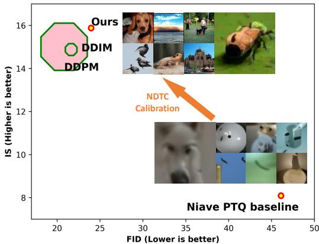
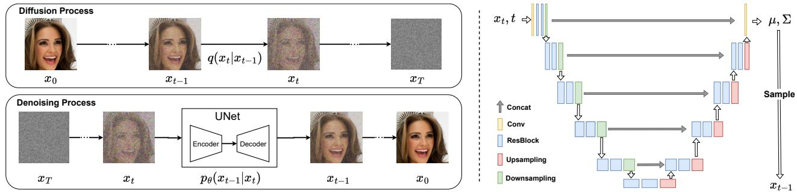
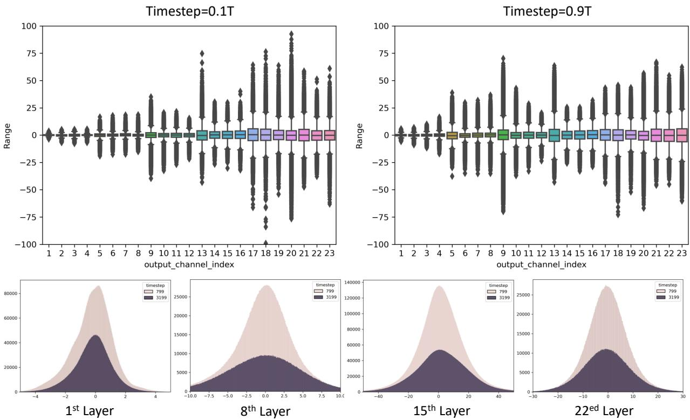
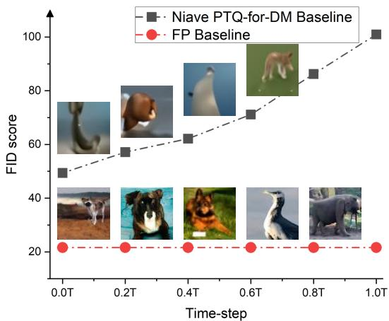
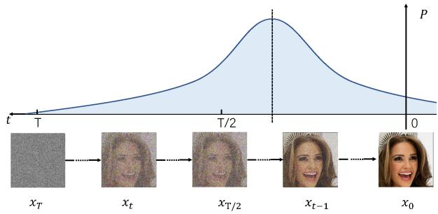
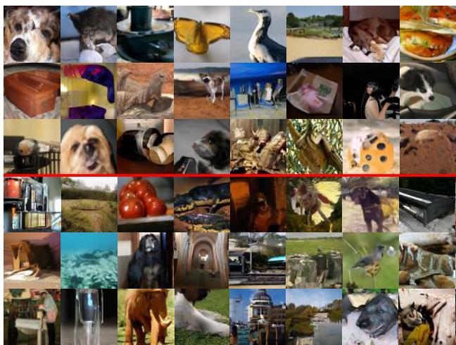

This CVPR paper is the Open Access version, provided by the Computer Vision Foundation. Except for this watermark, it is identical to the accepted version; the final published version of the proceedings is available on IEEE Xplore.

# Post-training Quantization on Diffusion Models

Yuzhang Shang1,4\*, Zhihang Yuan2\*, Bin Xie1, Bingzhe Wu3, Yan Yan1†

1Illinois Institute of Technology, 2Houmo AI, 3Tencent AI Lab, 4Cisco Research

{yshang4, bxie9}@hawk.iit.edu, zhihang.yuan@huomo.ai

yuzshang@cisco.com, bingzhewu@tencent.com, yyan34@iit.edu

## Abstract

Denoising diffusion (score-based) generative models have recently achieved significant accomplishments in generating realistic and diverse data. Unfortunately, the generation process ofcurrent denoising diffusion models is notoriously slow due to the lengthy iterative noise estimations, which rely on cumbersome neural networks. It prevents the diffusion modelsfrom being widely deployed, especially on edge devices. Previous works accelerate the generation process of diffusion model (DM) via finding shorter yet effective sampling trajectories. However, they overlook the cost of noise estimation with a heavy network in every iteration. In this work, we accelerate generation from the perspective of compressing the noise estimation network. Due to the difficulty of retraining DMs, we exclude mainstream training-aware compression paradigms and introduce posttraining quantization (PTQ) into DM acceleration. However, the output distributions of noise estimation networks change with time-step, making previous PTQ methods fail in DMs since they are designed for single-time step scenarios. To devise a DM-specific PTQ method, we explore PTQ on DM in three aspects: quantized operations, calibration dataset, and calibration metric. We summarize and use several observations derived from all-inclusive investigations to formulate our method, which especially targets the unique multi-time-step structure of DMs. Experimentally, our method can directly quantize full-precision DMs into 8-bit models while maintaining or even improving their performance in a training-free manner. Importantly, our method can serve as a plug-and-play module on other fast-sampling methods, e.g., DDIM [24]. The code is available at https://https://github.com/ 42Shawn/PTQ4DM.

## 1. Introduction

Recently, denoising diffusion (also dubbed score-based) generative models [11, 38, 38, 40] have achieved phenomenal success in various generative tasks, such as images [11, 24, 40], audio [21], video [35], and graphs [25]. Besides these fundamental tasks, their flexibility of implementation on downstream tasks is also attractive, e.g., they are effectively introduced for super-resolution [15, 28], inpainting [15, 40], and image-to-image translation [30]. Diffusion models (DMs) have achieved superior performances on most of these tasks and applications, both concerning quality and diversity, compared with historically SoTA Generative Adversarial Networks (GANs) [9].

A diffusion process transforms real data gradually into Gaussian noise, and then the process is reversed to generate real data from Gaussian noise (denoising process) [11, 43]. Particularly, the denoising process requires iterating the noise estimation (also known as a score function [40]) via a cumbersome neural network over thousands of timesteps. While it has a compelling quantity of images, its long iterative process and high inference cost for generating samples make it undesirable. Thus, increasing the speed of this generation process is now an active area of research [2, 4, 18, 24, 29, 40]. To accelerate diffusion models, researchers propose several approaches, which mainly focus on sample trajectory learning for faster sampling strategies. For example, Chen et al. [4] and San-Roman et al. [29] propose faster step size schedules for VP diffusions that still yield relatively good quality/diversity metrics; Song et al. [37] adopt implicit phases in the denoising process; Bao et al. [2] and Lu et al. [18] derive analytical approximations to simplify the generation process.

Our study suggests that two orthogonal factors slow down the denoising process: i) lengthy iterations for sampling images from noise, and ii) a cumbersome network for estimating noise in each iteration. Previously DM acceleration methods only focus on the former [2, 4, 18, 24, 29, 40], but overlook the latter. From the perspective of network compression, many popular network quantization and pruning methods follow a simple pipeline: training the original model and then fine-tuning the quantized/pruned compressed model [17, 31]. Particularly, this training-aware compression pipeline requires a full training dataset and many computation resources to perform end-to-end backpropagation. For DMs, however, 1) training data are not always ready-to-use due to privacy and commercial concerns; 2) the training process is extremely expensive. For example, there is no access to the training data for the industry-developed text-to-image models Dall·E2 [26] and Imagen [27]. Even if one can access their datasets, finetuning them also consumes hundreds of thousands of GPU hours. Those two obstacles make training-aware compression not suitable for DMs.

  
Figure 1. Performance summary on ImageNet64. The X-axis and Y-axis denote the performance w.r.t. FID score and Inception Score, respectively. Note that the center (not the boundary) of the dot corresponds to the model performance. The size of the dots denotes theoretical inference time.

Training-free network compression techniques are what we need for DM acceleration. Therefore, we propose to introduce post-training quantization (PTQ) [3, 17, 22] into DM acceleration. In a training-free manner, PTQ can not only speed up the computation of the denoising process but also reduce the resources to store the diffusion model weight, which is required in DM acceleration. Although PTQ has many attractive benefits, its implementation in DMs remains challenging. The main reason is that the structure of DMs is hugely different from previously PTQ-implemented structures (e.g., CNN and ViT for image recognition). Specifically, the output distributions of noise estimation networks change with time-step, making previous PTQ methods fail in DMs since they are designed for single-time-step scenarios.

This study attempts to answer the following fundamental question: How does the design of the core ingredients of the PTQ for the DMs process (e.g., quantized operation selection, calibration set collection, and calibration metric) affect the final performance of the quantized diffusion models? To this end, we analyze the PTQ and DMs individually and correlatedly. We find that simple generalizations of previous PTQ methods to DMs lead to huge performance drops due to output distribution discrepancies w.r.t. time-step in the denoising process. In other words, noise estimation networks rely on time-step, which makes their output distributions change with time-step. This means that a key module of the previous PTQ calibration, cannot be used in our case. Based on the above observations, we devise a DMspecific calibration method, termed Normally Distributed Time-step Calibration (NDTC), which first samples a set of time-steps from a skew normal distribution, and then generates calibration samples in terms of sampled time-steps by the denoising process. In this way, the time-step discrepancy in the calibration set is enhanced, which improves the performance of PTQ4DM. Finally, we propose a novel DM acceleration method, Post-Training for Diffusion Models (PTQ4DM) via incorporating all the explorations.

Overall, the contributions of this paper are three-fold: (i) To accelerate denoising diffusion models, we introduce PTQ into DM acceleration where noise estimation networks are directly quantized in a post-training manner. To the best of our knowledge, this is the first work to investigate diffusion model acceleration from the perspective of trainingfree network compression. (ii) After all-inclusively investigations of PTQ and DMs, we observe the performance drop induced by PTQ for DMs can be attributed to the discrep ancy of output distributions in various time-steps. Targeting this observation, we explore PTQ from different aspects and propose PTQ4DM. (iii) Experimentally, PTQ4DM can quantize the pre-trained diffusion models to 8-bit without significant performance loss for the first time. Importantly, PTQ4DM can serve as a plug-and-play module for other SoTA DM acceleration methods, as shown in Fig. 1.

## 2. Related Work

## 2.1. Diffusion Model Acceleration

Due to the long iterative process in conjunction with the high cost of denoising via networks, diffusion models cannot be widely implemented. To accelerate the diffusion probabilistic models (DMs), previous works pursue finding shorter sampling trajectories while maintaining the DM performance. Chen et al. [4] introduce grid search and find an effective trajectory with only six time-steps. However, the grid search approach can not be generalized into very long trajectories subject to its exponentially growing time complexity. Watson et al. [41] model the trajectory searching as a dynamic programming problem. Song et al. [39] construct a class of non-Markovian diffusion processes that lead to the same training objective, but whose reverse process can be much faster to sample from. As for DMs with continuous timesteps (i.e., score-based perspective [40]), Song et al. [38, 40] formulate the DM in of form of an ordinary differential equation (ODE), and improve sampling efficiency via utilizing faster ODE solver. Jolicoeur-Martineau et al. [14] introduce an advanced SDE solver to accelerate the reverse process via an adaptively larger sampling rate. Bao et al. [2] estimate the variance and KL divergence using the Monte Carlo method and a pretrained score-based model with derived analytic forms, which are simplified from the score-function. In addition to those training-free methods, Luhman & Luhman [19] compress the reverse denoising process into a single-step model; San-Roman [29] dynamically adjust the trajectory during inference. Nevertheless, implementing those methods requires additional training after obtaining a pretrained DM, which makes them less desirable in most situations. In summary, all those DM acceleration methods can be categorized into finding effective sampling trajectories.

However, we show in this paper that, in addition to finding short sampling trajectories, diffusion models can be further accelerated through network compression for each noise estimation iteration. Note that our method PTQ4DM is an orthogonal path with those above-mentioned fast sampling methods, which means it can be deployed as a plugand-play module for those methods. To the best of our knowledge, our work is the first study on quantizing diffusion models in a post-training manner.

## 2.2. Post-training Quantization

Quantization is one of the most effective ways to compress a neural network. There are two types of quantization methods: Quantization-aware training (QAT) and Posttraining quantization (PTQ). QAT [8, 13, 32, 33] considers the quantization in the network training phase. While PTQ [22] quantizes the network after training. As PTQ consumes much less time and computation resources, it is widely used in network deployment.

Most of the work of PTQ is to set the quantization parameters for weights and activcations in each layer. Take uniform quantization as an example, the quantization parameters include scaling factor s and zero point z. A floating-point value x is quantized to integer value xint according to the parameters:

$$
x _ { i n t } = \mathrm { c l a m p } ( \lfloor \frac { x } { s } \rceil - z , p _ { m i n } , p _ { m a x } ) .\tag{1}
$$

The clamp function clip the rounded value $\lfloor { \frac { x } { s } } \rceil - z { \mathrm { ~ t o ~ } }$ the range of $[ p _ { m i n } , p _ { m a x } ]$ . In order to set quantization parameters for the weight tensor and the activation tensor in a layer, a simple but effective way is to select the quantization parameters that minimize the MSE of the tensors before and after quantization [1, 5, 12, 42]. Other metrics, such as L1 distance, cosine distance, and KL divergence, can also be used to evaluate the distance of the tensors before and after quantization [20, 44].

In order to calculate the activations in the network, a small number of calibration samples should be used as input in PTQ. The selected quantization parameters are dependent with the selection of these calibration samples. [12, 17, 23] demonstrate the effect of the number of the calibration samples. Zero-shot quantization (ZSQ) [3, 10, 45] is a special case of PTQ. ZSQ generates the calibration dataset according to information recorded in the network, such as the mean and var in batch normalization layer. They generate the input sample by gradient descent method to make the distribution of the activations in network similar to the distribution of real samples. The image generation process from noise in diffusion model only uses the network inference, which is quite different from previous ZSQ methods.

## 3. PTQ on Diffusion Models

## 3.1. Preliminaries

Diffusion Models. The diffusion probabilistic model (DPM) is initially introduced by Sohl-Dickstein et al. [36], where the DPM is trained by optimizing the variational bound $L _ { \mathrm { V L B } }$ . Here, we briefly review the diffusion model to illustrate the difference from traditional models. Here, we briefly review the diffusion model, especially its lengthy diffusion and denoising process. We highlight that those properties make it difficult to simply generalize common PTQ methods into diffusion models simply in Sec. 3.2.

Given a real data distribution $x _ { 0 } \sim q ( x _ { 0 } )$ , we define the diffusion process that gradually adds a small amount of isotropic Gaussian noise with a variance schedule $\beta _ { 1 } , . . . , \beta _ { T } ~ \in ~ ( 0 , 1 )$ to produce a sequence of latent $x _ { 1 } , . . . , x _ { T }$ , which is fixed to a Markov chain. When $T$ is sufficiently large $T \sim \infty$ and a well-behaved schedule of $\beta _ { t } , x _ { T }$ is equivalent to an isotropic Gaussian distribution.

$$
q ( \mathbf { x } _ { t } | \mathbf { x } _ { t - 1 } ) = \mathcal { N } ( \mathbf { x } _ { t } ; \sqrt { 1 - \beta _ { t } } \mathbf { x } _ { t - 1 } , \beta _ { t } \mathbf { I } )\tag{2}
$$

$$
q ( \mathbf { x } _ { 1 : T } | \mathbf { x } _ { 0 } ) = \prod _ { t = 1 } ^ { T } q ( \mathbf { x } _ { t } | \mathbf { x } _ { t - 1 } )\tag{3}
$$

A notable [11] property of the diffusion process admits us to sample $x _ { t }$ at an arbitrary timestep t via directly conditioned on the input $x _ { 0 }$ . Let $\alpha _ { t } = 1 - \beta _ { t }$ and $\begin{array} { r } { \bar { \alpha } _ { t } = \prod _ { i = 1 } ^ { T } \alpha _ { i } \colon } \end{array}$

$$
q ( \mathbf { x } _ { t } | \mathbf { x } _ { 0 } ) = \mathcal { N } ( \mathbf { x } _ { t } ; \sqrt { \bar { \alpha } _ { t } } \mathbf { x } _ { 0 } , ( 1 - \bar { \alpha } _ { t } ) \mathbf { I } )\tag{4}
$$

Since $q ( x _ { t - 1 } | x _ { t } )$ depends on the data distribution $q ( x _ { 0 } )$ which is intractable. Therefore, we need to parameterize a neural network to approximate it:

$$
p _ { \theta } ( \mathbf { x } _ { t - 1 } | \mathbf { x } _ { t } ) = \mathcal { N } ( \mathbf { x } _ { t - 1 } ; \mu _ { \theta } ( \mathbf { x } _ { t } , t ) , \Sigma _ { \theta } ( \mathbf { x } _ { t } , t ) )\tag{5}
$$

We utilize the variational lower bound to optimize the negative log-likelihood. $L _ { \mathrm { V L B } } =$

$$
\mathbb { E } _ { q ( \mathbf { x } _ { 0 : T } ) } \Big [ \log \frac { q ( \mathbf { x } _ { 1 : T } | \mathbf { x } _ { 0 } ) } { p _ { \theta } ( \mathbf { x } _ { 0 : T } ) } \Big ] \geq - \mathbb { E } _ { q ( \mathbf { x } _ { 0 } ) } \log p _ { \theta } ( \mathbf { x } _ { 0 } )\tag{6}
$$

The objective function of the variational lower bound can be further rewritten to be a combination of several KL-

  
Figure 2. Brief illustration of Diffusion Model. The inference of diffusion models is extremely slow due to their two fundamental characteristics: (1, Left) the lengthy iterative process for denoising from noise input to synthetic images; and (2, Right) the cumbersome networks for estimating the noise in each denoising iteration.

divergence and entropy terms (more details in [36]).

$$
\begin{array} { r l }  { \displaystyle { \cal L } _ { \mathrm { V L B } } = \mathbb { E } _ { q } \displaystyle { [ \underbrace { D _ { \mathrm { K L } } \big ( q \big ( { \bf x } _ { T } \vert { \bf x } _ { 0 } \big ) \mathrm { ~ \textparallel ~ } p _ { \theta } \big ( { \bf x } _ { T } \big ) \big ) } _ { L _ { T } } \underbrace { - \log p _ { \theta } \big ( { \bf x } _ { 0 } \big \vert { \bf x } _ { 1 } \big ) } _ { L _ { 0 } } } } & { { } } \\  { \displaystyle ~ + \sum _ { t = 2 } ^ { T } \underbrace { D _ { \mathrm { K L } } \big ( q \big ( { \bf x } _ { t - 1 } \vert { \bf x } _ { t } , { \bf x } _ { 0 } \big ) \mathrm { ~ \textparallel ~ } p _ { \theta } \big ( { \bf x } _ { t - 1 } \vert { \bf x } _ { t } \big ) \big ) } _ { L _ { t - 1 } } \qquad ( 7 } & { { } } \end{array}\tag{}
$$

$L _ { 0 }$ uses a separate discrete decoder derived from $\mathcal { N } ( \mathbf { x } _ { 0 } ; \mu _ { \boldsymbol { \theta } } ( \mathbf { x } _ { 1 } , 1 ) , \boldsymbol { \Sigma } _ { \boldsymbol { \theta } } ( \mathbf { x } _ { 1 } , 1 ) )$ . $L _ { T }$ does not depend on $\theta ,$ it is close to zero if $q ( x _ { T } | x _ { 0 } ) \approx \mathcal { N } ( 0 , I )$ . The remain term $L _ { t - 1 }$ is a KL-divergence to directly compare $p _ { \theta } ( x _ { t - 1 } | x _ { t } )$ to diffusion process posterior that is tractable when $x _ { 0 }$ is conditioned,

$$
\tilde { \beta } _ { t } : = \frac { 1 - \bar { \alpha } _ { t - 1 } } { 1 - \bar { \alpha } _ { t } } \cdot \beta _ { t }\tag{8}
$$

$$
\tilde { \pmb { \mu } } _ { t } ( \mathbf { x } _ { t } \mathbf { x } _ { 0 } ) : = \frac { \sqrt { \alpha _ { t } } ( 1 - \bar { \alpha } _ { t - 1 } ) } { 1 - \bar { \alpha } _ { t } } \mathbf { x } _ { t } + \frac { \sqrt { \bar { \alpha } _ { t - 1 } } \beta _ { t } } { 1 - \bar { \alpha } _ { t } } \mathbf { x } _ { 0 }\tag{9}
$$

$$
q ( \mathbf { x } _ { t - 1 } | \mathbf { x } _ { t } , \mathbf { x } _ { 0 } ) : = \mathcal { N } ( \mathbf { x } _ { t - 1 } ; \tilde { \pmb { \mu } } ( \mathbf { x } _ { t } , \mathbf { x } _ { 0 } ) , \tilde { \beta } _ { t } \mathbf { I } ) .\tag{10}
$$

This is the training process of the diffusion model. After obtaining the well-trained noise estimation model $p _ { \theta } ( \mathbf { x } _ { t - 1 } | \mathbf { x } _ { t } )$ in Eq. 5, given a random noise, we can generate samples through the denoising process by iterative sampling $\mathbf { x } _ { t - 1 }$ from $p _ { \theta } ( \mathbf { x } _ { t - 1 } | \mathbf { x } _ { t } )$ until we receive $\mathbf { x } _ { \mathrm { 0 } }$ . Detailed information can be found in the surveys [6, 43]. Since the iterative process for denoising from noise input to synthetic images is extremely long (e.g., pioneer work, DDPM [11] requires 4000 steps for generating a sample from noise), as illustrated in Fig. 2 (left); and the networks for estimating the noise in each denoising iteration is very deep and complicated, as illustrated in Fig. 2 (right). The inference of the diffusion model is expensive.

Post-training Quantization takes a well-trained network and selects the quantization parameters for the weight tensor and activation tensor in each layer. We use the quantization parameters, scaling factor s, and zero point z to transform a tensor to the quantized tensor1. One of the most widely used methods to select the parameters is to minimize the error caused by quantization. The quantization error $L _ { q u a n t }$ is formulated as:

$$
X _ { s i m } = s ( \mathrm { c l a m p } ( \bigl \lfloor \frac { X _ { f p } } { s } \bigr \rceil - z , p _ { m i n } , p _ { m a x } ) + z ) ,\tag{11}
$$

$$
L _ { q u a n t } = \mathbf { M e t r i c } ( X _ { s i m } , X _ { f p } ) ,\tag{12}
$$

where $X _ { s i m }$ is the de-quantized tensor, and Metric is the metric function to evaluate the distance of $X _ { s i m }$ and the full-precision tensor $X _ { f p }$ . MSE, cosine distance, L1 distance, and KL divergence are commonly used metric functions. The quantization process can be formulated as:

$$
\underset { s , z } { \arg \operatorname* { m i n } } L _ { q u a n t } .\tag{13}
$$

We can directly quantize the weight to minimize the quantization error, but we cannot get the activation tensor and quantize it without input. In order to collect the full-precision activation tensor, a number of unlabeled input samples (calibration dataset) are used as input. The size of the calibration dataset $( e . g .$ , 128 randomly selected images) is much smaller than the training dataset.

In general, PTQ quantizes a network in three steps: (i) Select which operations in the network should be quantized and leave the other operations in full-precision. For example, some special functions such as softmax and GeLU often takes full-precision [34].Quantizing these operations will significantly increase the quantization error and they are not very computationally intensive; (ii) Collect the calibration samples. The distribution of the calibration samples should be as close as possible to the distribution of the real data to avoid over-fitting of quantization parameters on calibration samples; (iii) Use the proper method to select quantization parameters for weight tensors and activation tensors.

In the next sections, we will explore how to apply PTQ to the diffusion model step by step.

## 3.2. Exploration on Operation Selection

For the diffusion model, we will analyze the image generation process to determine which operations should be quantized. The diffusion model iteratively generate the $\mathbf { x } _ { t - 1 }$ from $\mathbf { x } _ { t } .$ At each timestep, the inputs of the network are $\mathbf { x } _ { t }$ and $t ,$ and the outputs are the mean $\pmb { \mu }$ and variance Σ. Then $\mathbf { x } _ { t - 1 }$ is sampled from the distribution defined as Eq 5. As shown in Figure 2, the network in the diffusion model often takes UNet-like CNN architecture. The same as most previous PTQ methods, the computation-intensive convolution layers and fully-connected layers in the network should be quantized. The batch normalization can be folded into the convolution layer. The special functions such as SiLU and softmax are kept in full-precision.

  
Figure 3. Studies on the activation distribution w.r.t. time-step. (Upper) Per (output) channel weight ranges of the first depthwise-separable layer in diffusion model on different timestep. In the boxplot, the min and max values, the 2nd and 3rd quartile, and the median are plotted for each channel. We only include the layers in the decoder of UNet for noise estimation, as the ranges of the encoder and decoder are quite different. (Bottom) Histograms of activations on different time-steps by various layers. We can observe that the distribution of activations changes dramatically with time-step, which makes traditional single-time-step PTQ calibration methods inapplicable for diffusion models.

There are two more questions for the diffusion model: 1. whether the network’s outputs, µ and Σ, can be quantized? 2. whether the sampled image $\mathbf { x } _ { t - 1 }$ can be quantized? To answer the two questions, we only quantize the operation generating $\mu , \Sigma , \mathrm { o r } { \bf x } _ { t - 1 }$ . As shown in Table 1, we observe that they are not sensitive to quantization and we indicate that they can be quantized.

## 3.3. Exploration on Calibration Dataset

The second step is to collect the calibration samples for quantizing diffusion models. The calibration samples can be collected from the training dataset for quantizing other networks. However, the training dataset in the diffusion model is $\mathbf { x } _ { \mathrm { 0 } }$ , which is not the network’s input. The real input is the generated samples $\mathbf { x } _ { t }$ . Should we use the generated samples in diffusion process or the generated samples in denoising process? At what time-step t, should the generated samples be collected? This section will explore how to make a good calibration dataset.

Table 1. Exploration on operation selection for 8-bit quantization. The diffusion model is for unconditional ImageNet 64x64 image generation with a cosine noise schedule. DDIM (250 timesteps) is used to generate 10K images. IS is the inception score.
<table><tr><td></td><td>IS</td><td>FID</td><td>sFID</td></tr><tr><td>FP</td><td>14.88</td><td>21.63</td><td>17.66</td></tr><tr><td>quantize  $\mu$ </td><td>15.51</td><td>21.38</td><td>17.41</td></tr><tr><td>quantize Σ</td><td>15.47</td><td>21.96</td><td>17.62</td></tr><tr><td>quantize  $x _ { t - 1 }$ </td><td>15.26</td><td>21.94</td><td>17.67</td></tr><tr><td>quantize  $\mu { + } \Sigma { + } x _ { t { - } 1 }$ </td><td>14.94</td><td>21.99</td><td>17.84</td></tr></table>

By all-inclusively investigating several intuitive PTQ baselines, we obtain four meaningful observations (Sec. 3.3.1), which accordingly guide the design of our method (Sec. 3.3.2). Experimental results demonstrate that our method is efficient and effective. Through devised PTQ4DM calibration, the 8-bit post-training quantized diffusion model can perform at the same performance level as its full-precision counterpart, $e . g .$ ., 8-bit diffusion model reaches 23.9 FID and 15.8 IS, while 32-bit one has 21.6 FID and 14.9 IS.

## 3.3.1 Analysis on PTQ Calibration and DMs

As discussed in Sec. 3.2, we desire the distribution of the collected calibration samples should be as close as possible to the distribution of the real data. In this way, the calibration set can supervise the quantization by minimizing the quantization error. Since previous works are implemented on single-time-step scenarios (e.g., CNN and ViT for image recognition and object detection) [17, 22], they can directly collect samples from the real training dataset for quantizing networks. Due to the small size of the calibration dataset, its collection is extremely sensitive. If the distribution of the collected dataset is not representative of the real dataset, it can easily lead to overfitting for the calibration task.

We encounter more challenges when calibrating PTQ for DM. Since the inputs of the to-be-quantized network are the generated samples ${ \bf x } _ { t } ~ ( t = 0 , 1 , \cdot \cdot \cdot , T )$ , in which $T$ is a large number to maintain the diffusion process converging to isotropic Normal distribution. To quantize the diffusion model, we are required to design a novel and effective calibration dataset collection method in this particular multitime-step scenario. We start by investigating both PTQ calibration and DMs, and then obtain the following instructive observations.

## Observation 0: Distributions of activations changes along with time-step changing.

To understand the output distribution change of diffusion models, we investigate the activation distribution with respect to time-step. We would like to analyze the output distribution at different time-step, for example, given $t _ { 1 } = 0 . 1 T$ and $t _ { 2 } = 0 . 9 T$ , the output activation distributions of $p _ { \theta } ( \mathbf { x } _ { t _ { 1 } - 1 } | \mathbf { x } _ { t _ { 1 } } )$ and $p _ { \theta } ( \mathbf { x } _ { t _ { 2 } - 1 } | \mathbf { x } _ { t _ { 2 } } )$ . Theoretically, if the distribution changes w.r.t. time-step, it would be difficult to implement previous PTQ calibration methods, as they are proposed for temporally-invariant calibration [17, 22]. We first analyze the overall activation distributions of the noise estimation network via boxplot as [22] did, and then we take a closer look at the layer-wise distributions via histogram. The results are shown in Fig. 3. We can observe that at different time-steps, the corresponding activation distributions have large discrepancies, which makes previous PTQ calibration methods [17, 22] inapplicable for multi-time-step models $( i . e .$ , diffusion models).

## Observation 1: Generated samples in the denoising process are more constructive for calibration.

In general, there are two directions to generate samples for PTQ calibration in diffusion: raw images as input for diffusion process, and noise as input for denoising process. Previous PTQ methods use raw images, as raw images can serve as ground truth, representing the training set’s distribution. We conduct a pair of comparison experiments, in which we separately collect two calibration sets with raw images for diffusion process and Gaussian noise for denoising process, and use these two sets to calibrate quantized models. Another similar intuitive baseline is to use the training samples in the diffusion process as calibration data. Specifically, we randomly generate a timestep t for each image $\mathbf { x } _ { 0 } ,$ and use $\operatorname { E q }$ . 4 according to t to generate $\mathbf { x } _ { t } .$ In other word, collect calibration samples in a “Image + Gaussian Noise” manner. We name this scheme as training-mimic baseline. The results are listed in Tab. 2. We find that the input noises for diffusion process are more constructive for calibrating quantized DMs.

  
Figure 4. Analyses of this calibration baseline at different timesteps. FP Baseline denotes the 32-bit model, which does not require to be calibrated.

Table 2. Results of calibration using noise (input of the denoising process), image (input of the diffusion process), and samples generated by Eq. 3 (Mimicking the diffusion model training).
<table><tr><td></td><td>IS ↑</td><td>FID↓</td><td>sFID ↓</td></tr><tr><td>Noise Samples</td><td>13.92</td><td>33.15</td><td>20.38</td></tr><tr><td>Image Samples</td><td>6.90</td><td>128.63</td><td>90.04</td></tr><tr><td>Training-mimic</td><td>12.91</td><td>34.55</td><td>25.18</td></tr></table>

## Observation 2: Sample $\mathbf { x } _ { t }$ close to real image $\mathbf { x } _ { \mathrm { 0 } }$ is more beneficial for calibration.

Based on the aforementioned observations, we establish a baseline of PTQ calibration for DM based on [23], in which the quantized diffusion models are calibrated with samples at time-step t, i.e., a set of $\mathbf { x } _ { t }$ . We refer to this straight-forward approach as a naive PTQ-for-DM baseline. Specifically, given a set of Gaussion noise $\mathbf { x } _ { T } \sim \mathcal { N } ( \mathbf { 0 } , \mathbf { I } )$ we use the diffusion model with the full-precision noise estimation network, $p _ { \theta } ( \mathbf { x } _ { t - 1 } | \mathbf { x } _ { t } )$ in Eq. 5 to generate a set of $\mathbf { x } _ { t }$ as calibration set. Then as described in Sec. 3.1, we use this collected set to calibrate our quantized noise estimation network, $p _ { \theta ^ { \prime } } ( \mathbf { x } _ { t - 1 } | \mathbf { x } _ { t } )$ , in which $\theta ^ { \prime }$ is the quantized parameters. We conduct a series of experiments with this calibration baseline in different time-steps, i.e., $t \ =$

Table 3. Quantitative results of the intuitive baselines for the observations and our proposed NDTC calibration method. With our method, the performance of PTQ for DM has been significantly improved, even exceeding full-precision DM performance w.r.t. IS and sFID.
<table><tr><td></td><td>IS↑</td><td>FID↓</td><td>sFID↓</td></tr><tr><td>Full precision DDIM</td><td>14.88</td><td>21.63</td><td>17.66</td></tr><tr><td>Baseline in Observation 2</td><td>11.92</td><td>49.37</td><td>41.33</td></tr><tr><td>Baseline in Observation 3</td><td>14.99</td><td>26.19</td><td>19.51</td></tr><tr><td>NDTC (ours)</td><td>15.68</td><td>24.26</td><td>17.28</td></tr></table>

$0 . 0 T , 0 . 2 T , \cdots , 1 . 0 T .$ , where $T$ is the total denoising timesteps. The results are presented in Fig. 4. We can see that the 8-bit model calibrated by this naive baseline cannot synthesize satisfying images quantitatively and qualitatively.

Fortunately, there is a windfall from these experiments. The PTQ calibration helps more when the time-step t approaches the real image $\mathbf { x } _ { \mathrm { 0 } }$ . There is an intuitive explanation for this observation. In the denoising process, with t decreasing, the distribution of outputs of network $p _ { \theta } ( \mathbf { x } _ { t - 1 } | \mathbf { x } _ { t } )$ is similar to real images’ distribution, which is a more significant phase in the image generation process.

Observation 3: Instead of a set of samples generated at the same time-step, calibration samples should be generated with varying time-steps.

Since our calibration dataset is collected for a multitime-step scenario, while the common methods are proposed for single-time-step scenarios. We hypothesize that the calibration dataset for diffusion models should contain the samples with various time-steps, $i . e . ,$ the calibration set should reflect the discrepancy of sample w.r.t. time-step. A straightforward way to test this hypothesis is to generate a set of uniformly sampled t over the range of time-steps, i.e.,

$$
t _ { i } \sim U ( 0 , T ) ( i = 1 , 2 , \cdots , N ) ,\tag{14}
$$

where $U ( 0 , T )$ is a uniform distribution between 0 and $T ,$ N is the size of calibration set, and $T$ is the number of timesteps in denoising process. Then given a Gaussion noise $\mathbf { x } _ { T } \sim \mathcal { N } ( \mathbf { 0 } , \mathbf { I } )$ and $t _ { i \cdot }$ , we utilize the diffusion model with the full-precision noise estimation network, $p _ { \theta } ( \mathbf { x } _ { t - 1 } | \mathbf { x } _ { t } )$ in Eq. 5 to generate a $\mathbf { x } _ { t _ { i } }$ . Finally, we get the calibration set, ${ \mathcal C } = \{ \mathbf { x } _ { t _ { i } } \} _ { i = 1 } ^ { N }$ . Calibration samples can thus cover a wide range of time steps. We testify the effectiveness of this collection method, and present the results in Tab. 3. The result validates our hypothesis that calibration samples should reflect the time-step discrepancy.

## 3.3.2 Normally Distributed Time-step Calibration

Based on the above-demonstrated calibration baselines and observations, we desire the calibration samples: (1) generated by the denoising process (from noise $\mathbf { x } _ { T } )$ with the full-precision diffusion model; (2) relatively close to $\mathbf { x } _ { 0 } .$ , far away from $\mathbf { x } _ { T }$ ; (3) covered by various time-steps. Note that (2) and (3) are a pair of trade-off conditions, which can not be satisfied simultaneously.

Figure 5. A general illustration of sampling time-steps following a distribution over the range of the denoising time-step.  
Algorithm 1 Normally Distributed Time-step Calibration   
Collection (DNTC) Algorithm.   
Require: The size of calibration set $N ,$ and a mean of the   
Normal distribution $\mu ,$ and the full-precision noise esti  
mation network $p _ { \theta } ( \mathbf { x } _ { t - 1 } | \mathbf { x } _ { t } )$ in Eq. 5.   
Ensure: Obtain a Calibration Set $\mathcal { C } .$   
1: Collecting Calibration Set:   
2: for $i = 1$ to N do   
3: Sample $t _ { i }$ from distribution $\begin{array} { r } { \mathcal { N } ( \mu , \frac { T } { 2 } ) } \end{array}$ in Eq. 15;   
4: Round down $t _ { i }$ into a integer, $i . e . , \bar { t } _ { i } = \lfloor t _ { i } \rfloor ;$   
5: Clamp $t _ { i }$ between $[ 0 , T ] , i . e . , t _ { i } = { \bf C } \mathrm { l a m p } ( 0 , T , t _ { i } )$   
6: Produce sample on $t _ { i }$ time-step:   
7: for $t = T$ to $t _ { i }$ do   
8: Generate a Gaussian Noise $\mathbf { x } _ { T }$ as initialization;   
9: Sample $\mathbf { x } _ { t - 1 }$ using $p _ { \theta } ( \mathbf { x } _ { t - 1 } | \mathbf { x } _ { t } )$   
10: end for   
11: Output sample $\textstyle x _ { t _ { i } } ;$   
12: end for   
13: Output a calibration set ${ \mathcal { C } } = \{ \mathbf { x } _ { t _ { i } } \} _ { i = 1 } ^ { N } .$

Considering all the conditions, we propose a DMspecific calibration set collection method, termed as Normally Distributed Time-step Calibration (NDTC). In this method, the calibration set $\{ x _ { t _ { i } } \}$ are generated by the denoising process (for condition 1), where time-step $t _ { i }$ are sampled from a skew Normal distribution (for balancing conditions 2 & 3). Specifically, we first generate a set of sampled {t } following skew normal distribution over the time-step range (satisfying condition 3), i.e.,

$$
t _ { i } \sim \mathcal { N } ( \mu , \frac { T } { 2 } ) ( i = 1 , 2 , \cdots , N ) ,\tag{15}
$$

where $\begin{array} { r } { \mathcal { N } ( \mu , \frac { T } { 2 } ) } \end{array}$ is a normal distribution with mean $\begin{array} { r } { \mu \le { \frac { T } { 2 } } } \end{array}$ and standard deviation $\scriptstyle { \sqrt { \frac { T } { 2 } } }$ , N is the size of calibration set, and $T$ is the number of time-steps in denoising process. As $\mu$ is less than or equal to the median of time-step, $\textstyle { \frac { T } { 2 } }$ (satisfying condition $^ { 2 ) }$ . Then given a Gaussian noise $\bar { \mathbf { x } } _ { T } \sim \mathcal { N } ( \mathbf { 0 } , \mathbf { I } )$ and $t _ { i } ,$ we utilize the diffusion model with the full-precision noise estimation network, $p _ { \theta } ( \mathbf { x } _ { t - 1 } | \mathbf { x } _ { t } )$ in Eq. 5 to generate a $\mathbf { 1 } \mathbf { x } _ { t _ { i } }$ (satisfying condition 1). The abovementioned process of sampling time-steps is presented in Fig. 5. Finally, we get the calibration set, ${ \mathcal C } = \{ \mathbf { x } _ { t _ { i } } \} _ { i = 1 } ^ { N } .$ The detailed collection algorithm is presented in Alg. 1.

Table 4. Exploration on calibration metric for 8-bit quantization. We set $\mathsf { p } { = } 2 . 4$ for MSE metrics.
<table><tr><td></td><td>IS ↑</td><td>FID↓</td><td>sFID↓</td></tr><tr><td>L1 distance</td><td>7.38</td><td>100.52</td><td>63.01</td></tr><tr><td>Cosine distance</td><td>12.85</td><td>34.81</td><td>23.75</td></tr><tr><td>KL divergence</td><td>11.74</td><td>47.27</td><td>45.08</td></tr><tr><td>MSE</td><td>13.76</td><td>30.46</td><td>19.42</td></tr></table>

The effectiveness of NDTC is assessed by comparing it to the mentioned PTQ baselines and full-precision DMs. The results are presented in Tab. 3 and Fig. 6.

## 3.4. Exploration on Parameter Calibration

When the calibration samples are collected, the third step is selecting quantization parameters for tensors in the diffusion model. In this section, we explore the metric to calibrate the tensors. As shown in Table 4, the MSE is better than the L1 distance, cosine distance, and KL divergence. Therefore, we take MSE as the metric for quantizing the diffusion model.

## 4. More Experiments

We select the diffusion models that generating CI-FAR10 [16] 32×32 images or ImageNet [7] down-sampled 64×64 images. We experiment on both DDPM (4000 steps) and DDIM (100 and 250 steps) to generate the images.

We use the proposed method in Section 3.3 to generate 1024 calibration samples. And we quantize the network to 8-bit. Then we sample 10,000 images for evaluation. The results are listed in Table 5. There is an exciting result in these experiments. In the setting of using DDPM [11] to generate images with the size of 32 × 32, the 8-bit DDPM quantized by our method outperforms the full-precision DDPM. As discussed in Sec. 1, there are two factors slowing down the denoising process: i) lengthy iterations for sampling images from noise, and ii) a cumbersome network for estimating noise in each iteration. The successes of previous DM acceleration methods [2,4,18,24,29,40] validate the existence of model redundancy from the perspective of iteration length. With this exciting result, we uncover the redundancy from a previously unknown perspective, in which the noise estimation network is also redundant.

## 5. Conclusion

Two orthogonal factors slow down the denoising process: i) lengthy iterations for sampling images from noise, and ii) a cumbersome network for estimating noise in each iteration. Different from mainstream DM acceleration works focusing on the former, our work digs into the latter. In this paper, we propose Post-Training Quantization for Diffusion Models (PTQ4DM), in which a pre-trained diffusion model can be directly quantized into 8 bits without experiencing a significant degradation in performance. Importantly, our method can be added to other fast-sampling methods, such as DDIM [24].

  
Figure 6. Non-cherry-picked generated samples. (Upper) Samples synthesized by full precision DDPM [11]. (Bottom) Samples synthesized by 8-bit model quantized by our method. Note that PTQ4DM can directly output an 8-bit diffusion with the pre-trained 32-bit diffusion model as input in a training-free manner.

Table 5. Experiment on 8-bit quantized diffusion models generating CIFAR10 image or ImageNet image.
<table><tr><td>Task</td><td>Method</td><td>IS↑</td><td>FID↓</td><td>sFID↓</td></tr><tr><td>ImageNet 64x64</td><td>FP</td><td>15.38</td><td>21.70</td><td>17.93</td></tr><tr><td>DDIM 100 steps</td><td>PTQ4DM</td><td>15.52</td><td>24.92</td><td>17.36</td></tr><tr><td>ImageNet 64x64 DDIM 250 steps</td><td>FP PTQ4DM</td><td>14.88 15.88</td><td>21.63 23.96</td><td>17.66 17.67</td></tr><tr><td>ImageNet 64x64</td><td>FP</td><td></td><td></td><td></td></tr><tr><td>DDPM 4000 steps</td><td>PTQ4DM</td><td>15.93 15.28</td><td>20.82 23.64</td><td>17.42 17.29</td></tr><tr><td>CIFAR 32x32</td><td>FP</td><td>9.18</td><td></td><td></td></tr><tr><td>DDIM 100 steps</td><td>PTQ4DM</td><td>9.31</td><td>10.05 14.18</td><td>19.71 22.59</td></tr><tr><td>CIFAR 32x32</td><td>FP</td><td>9.19</td><td></td><td></td></tr><tr><td>DDIM 250 steps</td><td>PTQ4DM</td><td>9.70</td><td>8.91 11.66</td><td>18.43 19.71</td></tr><tr><td>CIFAR 32x32</td><td></td><td></td><td></td><td></td></tr><tr><td></td><td>FP</td><td>9.28</td><td>7.14</td><td>17.09</td></tr><tr><td>DDPM 4000 steps</td><td>PTQ4DM</td><td>9.55</td><td>7.10</td><td>17.02</td></tr></table>

Acknowledgements. This research was supported by the gift donation from Cisco. This article solely reflects the opinions of its authors and not the funding agent.

## References

[1] Ron Banner, Yury Nahshan, and Daniel Soudry. Post training 4-bit quantization of convolutional networks for rapid-deployment. In NeurIPS, 2019.

[2] Fan Bao, Chongxuan Li, Jun Zhu, and Bo Zhang. Analytic-dpm: an analytic estimate of the optimal reverse variance in diffusion probabilistic models. In ICLR, 2022.

[3] Yaohui Cai, Zhewei Yao, Zhen Dong, Amir Gholami, Michael W. Mahoney, and Kurt Keutzer. Zeroq: A novel zero shot quantization framework. In CVPR, 2020.

[4] Nanxin Chen, Yu Zhang, Heiga Zen, Ron J Weiss, Mohammad Norouzi, and William Chan. Wavegrad: Estimating gradients for waveform generation. arXiv preprint arXiv:2009.00713, 2020.

[5] Yoni Choukroun, Eli Kravchik, Fan Yang, and Pavel Kisilev. Low-bit quantization of neural networks for efficient inference. In ICCV Workshops, 2019.

[6] Florinel-Alin Croitoru, Vlad Hondru, Radu Tudor Ionescu, and Mubarak Shah. Diffusion models in vision: A survey. arXiv preprint arXiv:2209.04747, 2022.

[7] Jia Deng, Wei Dong, Richard Socher, Li-Jia Li, Kai Li, and Li Fei-Fei. Imagenet: A large-scale hierarchical image database. In CVPR, 2009.

[8] Steven K. Esser, Jeffrey L. McKinstry, Deepika Bablani, Rathinakumar Appuswamy, and Dharmendra S. Modha. Learned step size quantization. In ICLR, 2020.

[9] Ian Goodfellow, Jean Pouget-Abadie, Mehdi Mirza, Bing Xu, David Warde-Farley, Sherjil Ozair, Aaron Courville, and Yoshua Bengio. Generative adversarial networks. Communications ofthe ACM, 2020.

[10] Xiangyu He, Jiahao Lu, Weixiang Xu, Qinghao Hu, Peisong Wang, and Jian Cheng. Generative zero-shot network quantization. In CVPR, 2021.

[11] Jonathan Ho, Ajay Jain, and Pieter Abbeel. Denoising diffusion probabilistic models. In NeurIPS, 2020.

[12] Itay Hubara, Yury Nahshan, Yair Hanani, Ron Banner, and Daniel Soudry. Improving post training neural quantization: Layer-wise calibration and integer programming. CoRR, 2020.

[13] Benoit Jacob, Skirmantas Kligys, Bo Chen, Menglong Zhu, Matthew Tang, Andrew G. Howard, Hartwig Adam, and Dmitry Kalenichenko. Quantization and training of neural networks for efficient integerarithmetic-only inference. In CVPR, 2018.

[14] Alexia Jolicoeur-Martineau, Ke Li, Remi Pich´ e-´ Taillefer, Tal Kachman, and Ioannis Mitliagkas. Gotta

go fast when generating data with score-based models. arXiv preprint arXiv:2105.14080, 2021.

[15] Zahra Kadkhodaie and Eero P Simoncelli. Solving linear inverse problems using the prior implicit in a denoiser. arXiv preprint arXiv:2007.13640, 2020.

[16] Alex Krizhevsky, Geoffrey Hinton, et al. Learning multiple layers of features from tiny images. Toronto University, 2009.

[17] Yuhang Li, Ruihao Gong, Xu Tan, Yang Yang, Peng Hu, Qi Zhang, Fengwei Yu, Wei Wang, and Shi Gu. Brecq: Pushing the limit of post-training quantization by block reconstruction. In ICLR, 2021.

[18] Cheng Lu, Yuhao Zhou, Fan Bao, Jianfei Chen, Chongxuan Li, and Jun Zhu. Dpm-solver: A fast ode solver for diffusion probabilistic model sampling in around 10 steps. In NeurIPS, 2022.

[19] Eric Luhman and Troy Luhman. Knowledge distillation in iterative generative models for improved sampling speed. arXiv preprint arXiv:2101.02388, 2021.

[20] Szymon Migacz. 8-bit inference with tensorrt. NVIDIA GPU Technology Conference, 2017.

[21] Gautam Mittal, Jesse Engel, Curtis Hawthorne, and Ian Simon. Symbolic music generation with diffusion models. arXiv preprint arXiv:2103.16091, 2021.

[22] Markus Nagel, Marios Fournarakis, Rana Ali Amjad, Yelysei Bondarenko, Mart van Baalen, and Tijmen Blankevoort. A white paper on neural network quantization. CoRR, 2021.

[23] Yury Nahshan, Brian Chmiel, Chaim Baskin, Evgenii Zheltonozhskii, Ron Banner, Alex M. Bronstein, and Avi Mendelson. Loss aware post-training quantization. Machine Learning, 2021.

[24] Alexander Quinn Nichol and Prafulla Dhariwal. Improved denoising diffusion probabilistic models. In ICML, 2021.

[25] Chenhao Niu, Yang Song, Jiaming Song, Shengjia Zhao, Aditya Grover, and Stefano Ermon. Permutation invariant graph generation via score-based generative modeling. In AISTAT, 2020.

[26] Aditya Ramesh, Prafulla Dhariwal, Alex Nichol, Casey Chu, and Mark Chen. Hierarchical textconditional image generation with clip latents. arXiv preprint arXiv:2204.06125, 2022.

[27] Chitwan Saharia, William Chan, Saurabh Saxena, Lala Li, Jay Whang, Emily Denton, Seyed Kamyar Seyed Ghasemipour, Burcu Karagol Ayan, S Sara Mahdavi, Rapha Gontijo Lopes, et al. Photorealistic text-to-image diffusion models with deep language understanding. arXiv preprint arXiv:2205.11487, 2022.

[28] Chitwan Saharia, Jonathan Ho, William Chan, Tim Salimans, David J Fleet, and Mohammad Norouzi. Image super-resolution via iterative refinement. TPAMI, 2022.

[29] Robin San-Roman, Eliya Nachmani, and Lior Wolf. Noise estimation for generative diffusion models. arXiv preprint arXiv:2104.02600, 2021.

[30] Hiroshi Sasaki, Chris G Willcocks, and Toby P Breckon. Unit-ddpm: Unpaired image translation with denoising diffusion probabilistic models. arXiv preprint arXiv:2104.05358, 2021.

[31] Yuzhang Shang, Bin Duan, Ziliang Zong, Liqiang Nie, and Yan Yan. Lipschitz continuity guided knowledge distillation. In ICCV, 2021.

[32] Yuzhang Shang, Dan Xu, Bin Duan, Ziliang Zong, Liqiang Nie, and Yan Yan. Lipschitz continuity retained binary neural network. In ECCV, 2022.

[33] Yuzhang Shang, Dan Xu, Ziliang Zong, Liqiang Nie, and Yan Yan. Network binarization via contrastive learning. In ECCV, 2022.

[34] Sheng Shen, Zhen Dong, Jiayu Ye, Linjian Ma, Zhewei Yao, Amir Gholami, Michael W Mahoney, and Kurt Keutzer. Q-bert: Hessian based ultra low precision quantization of bert. In AAAI, 2020.

[35] Uriel Singer, Adam Polyak, Thomas Hayes, Xi Yin, Jie An, Songyang Zhang, Qiyuan Hu, Harry Yang, Oron Ashual, Oran Gafni, et al. Make-a-video: Textto-video generation without text-video data. arXiv preprint arXiv:2209.14792, 2022.

[36] Jascha Sohl-Dickstein, Eric Weiss, Niru Maheswaranathan, and Surya Ganguli. Deep unsupervised learning using nonequilibrium thermodynamics. In ICML, 2015.

[37] Jiaming Song, Chenlin Meng, and Stefano Ermon. Denoising diffusion implicit models. In ICLR, 2021.

[38] Yang Song and Stefano Ermon. Generative modeling by estimating gradients of the data distribution. In NeurIPS, 2019.

[39] Yang Song and Stefano Ermon. Improved techniques for training score-based generative models. In NeurIPS, 2020.

[40] Yang Song, Jascha Sohl-Dickstein, Diederik P Kingma, Abhishek Kumar, Stefano Ermon, and Ben Poole. Score-based generative modeling through stochastic differential equations. arXiv preprint arXiv:2011.13456, 2020.

[41] Daniel Watson, Jonathan Ho, Mohammad Norouzi, and William Chan. Learning to efficiently sample from diffusion probabilistic models. arXiv preprint arXiv:2106.03802, 2021.

[42] Di Wu, Qi Tang, Yongle Zhao, Ming Zhang, Ying Fu, and Debing Zhang. Easyquant: Post-training quantization via scale optimization. arXiv preprint arXiv:2006.16669, 2020.

[43] Ling Yang, Zhilong Zhang, Yang Song, Shenda Hong, Runsheng Xu, Yue Zhao, Yingxia Shao, Wentao Zhang, Bin Cui, and Ming-Hsuan Yang. Diffusion models: A comprehensive survey of methods and applications. arXiv preprint arXiv:2209.00796, 2022.

[44] Zhihang Yuan, Chenhao Xue, Yiqi Chen, Qiang Wu, and Guangyu Sun. Ptq4vit: Post-training quantization for vision transformers with twin uniform quantization. In ECCV, 2022.

[45] Yunshan Zhong, Mingbao Lin, Gongrui Nan, Jianzhuang Liu, Baochang Zhang, Yonghong Tian, and Rongrong Ji. Intraq: Learning synthetic images with intra-class heterogeneity for zero-shot network quantization. In CVPR, 2022.