# Progressive Transformation Learning for Leveraging Virtual Images in Training

Yi-Ting Shen⋆,1 Hyungtae Lee⋆,2 Heesung Kwon2 Shuvra S. Bhattacharyya1

⋆ equal contribution

1 University of Maryland, College Park 2 DEVCOM Army Research Laboratory Code: https://gitlab.umiacs.umd.edu/dspcad/ptl-release

## Abstract

To effectively interrogate UAV-based images for detecting objects of interest, such as humans, it is essential to acquire large-scale UAV-based datasets that include human instances with various poses captured from widely varying viewing angles. As a viable alternative to laborious and costly data curation, we introduce Progressive Transformation Learning (PTL), which gradually augments a training dataset by adding transformed virtual images with enhanced realism. Generally, a virtual2real transformation generator in the conditional GAN framework suffers from quality degradation when a large domain gap exists between real and virtual images. To deal with the domain gap, PTL takes a novel approach that progressively iterates the following three steps: 1) select a subset from a pool of virtual images according to the domain gap, 2) transform the selected virtual images to enhance realism, and 3) add the transformed virtual images to the training set while removing them from the pool. In PTL, accurately quantifying the domain gap is critical. To do that, we theoretically demonstrate that thefeature representation space ofa given object detector can be modeled as a multivariate Gaussian distribution from which the Mahalanobis distance between a virtual object and the Gaussian distribution of each object category in the representation space can be readily computed. Experiments show that PTL results in a substantial performance increase over the baseline, especially in the small data and the cross-domain regime.

## 1. Introduction

Training an object detector usually requires a large-scale training image set so that the detector can acquire the ability to detect objects’ diverse appearances. This desire for a large-scale training set is bound to be greater for object categories with more diverse appearances, such as the human category whose appearances vary greatly depending on its pose or viewing angles. Moreover, a person’s appearance becomes more varied in images captured by an unmanned aerial vehicle (UAV), leading to a wide variety of camera viewing angles compared to ground-based cameras, making the desire for a large-scale training set even greater. In this paper, we aim to satisfy this desire, especially when the availability of UAV-based images to train a human detector is scarce, where this desire is more pressing.

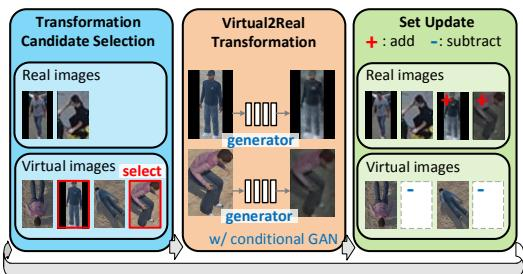  
Figure 1. Overview of Progressive Transformation Learning.

As an intuitive way to expand the training set, one might consider synthesizing virtual images to imitate real-world images by controlling the optical and physical conditions in a virtual environment. Virtual images are particularly useful for UAV-based object detection since abundant object instances can be rendered with varying UAV locations and camera viewing angles along with ground-truth information (e.g., bounding boxes, segmentation masks) that comes free of charge. Therefore, a large-scale virtual image set covering diverse appearances of human subjects that are rarely shown in existing UAV-based object detection benchmarks [1,3,53] can be conveniently acquired by controlling entities and parameters in a virtual environment, such as poses, camera viewing angles, and illumination conditions.

To make virtual images usable for training real-world object detection models, recent works [19, 29, 38, 39] transform virtual images to look realistic. They commonly use the virtual2real generator [36] trained with the conditional GAN framework to transform images in the source domain to have the visual properties of images in the target domain. Here, virtual and real images are treated as the source and target domains, respectively. However, the large discrepancy in visual appearance between the two domains, referred to as the “domain gap”, result in the degraded transformation quality of the generator. In fact, the aforementioned works using virtual images validate their methods where the domain gap is not large (e.g., digit detection [19]) or when additional information is available (e.g., animal pose estimation with additional keypoint information [29, 38, 39]). In our case, real and virtual humans in UAV-based images inevitably have a large domain gap due to the wide variety of human appearances.

To address the large domain gap, one critical question inherent in our task is how to measure accurately the domain gap. Consequently, we estimate the domain gap in the representation space of a human detector trained on the real images. The representation space of the detector is learned such that test samples, which have significantly different properties than training samples from the perspective of the detector, are located away from the training samples. In this paper, we show that the feature distribution of object entities belonging to a certain category, such as the human category, in the representation space can be modeled with a multivariate Gaussian distribution if the following two conditions are met: i) the detector uses the sigmoid function to normalize the final output and ii) the representation space is constructed using the output of the penultimate layer of the detector. This idea is inspired by [28], which shows that softmax-based classifiers can be modeled as multivariate Gaussian distributions. In this paper, we show that the proposition is also applicable to sigmoid-based classifiers, which are widely used by object detectors. Based on this modeling, when the two aforementioned conditions are met, the human category in the representation space can be represented by two parameters (i.e., mean and covariance) of a multivariate Gaussian distribution that can be computed on the training images. With the empirically calculated mean and covariance, the domain gap from a single virtual human image to real human images (i.e., the training set) can be measured using the Mahalanobis distance [35].

To add virtual images to the training set to include more diverse appearances of objects while preventing the transformation quality degradation caused by large domain gaps, we introduce Progressive Transformation Learning (PTL) (Figure 1). PTL progressively expands the training set by adding virtual images through iterating the three steps: 1) transformation candidate selection, 2) virtual2real transformation, and 3) set update. When selecting transformation candidates from a virtual image pool, we use weighted random sampling, which gives higher weights to images with smaller domain gaps. The weight takes an exponential term with one hyperparameter controlling the ratio between images with smaller domain gaps and images with more diverse appearances. Then, the virtual2real transformation generator is trained via the conditional GAN, taking the selected transformation candidates as the “source” and the images in the training set as the “target”. After transforming the transformation candidates by applying the virtual2real transformation generator, the training set is expanded with the transformed candidates while the original candidates are excluded from the pool of virtual images.

The main contribution of this paper is that we have validated the utility of virtual images in augmenting training data via PTL coupled with carefully designed comprehensive experiments. We first use the task of low-shot learning, where adequately expanding datasets has notable effects. Specifically, PTL provides better accuracy on three UAV-view human detection benchmarks than other previous works that leverage virtual images in training, as well as methods that only use real images. Then, we validate PTL on the cross-domain detection task where training and test sets are from distinct domains and virtual images can serve as a bridge between these two sets. The experimental results indicate that a high-performance human detection model can be effectively learned via PTL, even with the significant lack of real-world training data.

## 2. Related Works

Leveraging virtual images in training. In this section, we have listed previous works that demonstrate how virtual images can play a role in a variety of real-world applications when used for training. In fact, virtual images are desirable for model training as large-scale labeled datasets can be built virtually almost free of charge. Unfortunately, when virtual images are used without proper care, it is shown that the performance improvement is limited due to the domain gap between the virtual images and the real test images. Generally, previous works leveraging virtual images during model training can be summarized into three approaches according to how they exploit the advantages of virtual images and address the challenges of using virtual images.

The most intuitive and widely used approach of using virtual images is to pre-train a model on virtual images and fine-tune the pre-trained model on real images acquired in the same domain as the test images [2, 10, 12, 16, 17, 21, 26, 37, 38, 45]. This approach aims to avoid the domain gap by fine-tuning the model on real images acquired under the same conditions and environments of test images. While the first approach seeks to use the representative capability learned from large-scale virtual datasets, the second approach seeks to exploit additional information that can be easily labeled on virtual images. For example, [33] annotates part segmentation maps when acquiring virtual vehicle images, and uses the part segmentation results from the pretrained model on the virtual images during the fine-tuning process. Similarly, [50] uses depth and semantic information labeled when acquiring virtual images.

The third approach directly builds training batches consisting of both virtual images and real images. [41] and [40] adopt the most naive approach to build a batch by randomly selecting a fixed number of images from each of the real and virtual image sets. However, even if the number of virtual images is several orders of magnitude greater than the number of real training images, this approach does not provide remarkably better accuracy and may even provide worse accuracy than its counterparts using only real images for training. In this case, the effect of using virtual images during model training does not appear as expected because the large domain gap between the real (test) images and the virtual images is not adequately addressed. In this paper, we also use virtual images directly for model training while considering appropriately reducing this domain gap.

Progressive learning. Progressive learning is a machine learning strategy that continuously trains a model from easy to hard tasks, primarily for the purpose of training stabilization or fast optimization. One of the most common applications for progressive learning is incrementally increasing the network capacity to improve network capability. The most intuitive approach in this category is to gradually increase the network size (e.g., depth or width) to ease the training difficulty of very deep networks [4,8,11,13,31,43, 49]. Conversely, [51] uses progressive learning in the direction of reducing the network size for fast training. Progressive learning is also used in GAN frameworks to enhance the generator’s ability to transform input images of larger resolution [23]. Curriculum learning [5, 14, 25, 44], which continuously raises the level of training from easy to difficult samples, also falls into this category.

Progressive learning is also used to deal with the scalability of datasets that are incompletely labeled. In a semisupervised learning task, [7,46,48] adopt progressive learning by gradually increasing the number of unlabeled data used for training. Self-learning in [24, 27] uses progressive learning by repeating the two steps, assigning labels depending on the current detector and updating the current detector with these labels.

Our method can be seen as similar to the second approach in that it also intend to expand the training dataset. However, our method uses progressive learning to reliably add realistically transformed virtual images to the training dataset by avoiding quality degradation of the transformation, which has never been attempted before using the progressive learning strategy.

## 3. Method

## 3.1. Measuring the Domain Gap between Real and Virtual Images

Modeling training set with multivariate Gaussian distribution. The purpose of adopting progressive transformation learning, which progressively expands the training set with a subset of the realistically transformed virtual images instead of expanding it with the full set at once, is to avoid the significant domain gap between the real and virtual images when training the transformation generator. Here, the domain gap is measured in the representation space of the detector, which is learned so that two samples with different properties from the perspective of the detector are separated far from each other.

In general, the representation space of the detector refers to the space formed by the output of the penultimate layer of the detector since all layers of the detector except for the last layer can be transferred for different downstream tasks [9, 15, 18]. In [28], it is shown that for the softmaxbased classifier, the distribution of each category in the representation space can be modeled as a multivariate Gaussian distribution. Object detector generally uses the sigmoid function $( \mathrm { i } . \mathrm { e } . , f _ { s i g m o i d } ( \mathbf { x } ) = 1 / ( 1 + \exp ( - \mathbf { w } _ { c } ^ { T } \mathbf { x } - b _ { c } )$ for the category c), which does not consider outputs for other categories, instead of the softmax function $( \mathrm { i . e . , } f _ { s o f t m a x } ( \mathbf { x } ) =$ $\begin{array} { r } { \exp ( \mathbf { w } _ { c } ^ { T } \mathbf { x } + b _ { c } ) / \sum _ { c ^ { \prime } } \exp ( \mathbf { w } _ { c ^ { \prime } } ^ { T } \mathbf { x } + b _ { c ^ { \prime } } ) } \end{array}$ for the category c) that competes for outputs for all categories to normalize the model output to [0 1]. This is because, unlike classification, the detection task must take into account that two or more co-located objects may be active on a single output. In the supplementary material, we show that even for the sigmoid-based detector, the distribution of each category in the representation space can also be modeled as a multivariate Gaussian distribution.

Specifically, let $\mathbf { x } \in \mathcal { X }$ and $y = \{ y _ { c } \} _ { c = 1 , \cdots , C } \in \mathcal { V } , y _ { c } \in$ {0, 1} be an input and its label, respectively. Then, the representation space of the sigmoid-based detector can be expressed as follows:

$$
P ( f ( \mathbf { x } ) | y _ { c } = 1 ) \sim \mathcal { N } ( f ( \mathbf { x } ) | \mu _ { c } , \Sigma _ { c } ) ,\tag{1}
$$

where $f ( \cdot )$ denotes the output of the penultimate layer of the detector. $\mu _ { c }$ and $\Sigma _ { c }$ are the mean and the covariance of the multivariate Gaussian distribution for the category c. $\mu _ { c }$ and $\Sigma _ { c }$ can be calculated over the entire set of training images as follows:

$$
\begin{array} { r c l } { \displaystyle \mu _ { c } } & { = } & { \displaystyle \frac { 1 } { | \mathbf { D } _ { c } | } \sum _ { \mathbf { x } \in \mathbf { D } _ { c } } f ( \mathbf { x } ) , } \\ { \displaystyle \Sigma _ { c } } & { = } & { \displaystyle \frac { 1 } { | \mathbf { D } _ { c } | } \sum _ { \mathbf { x } \in \mathbf { D } _ { c } } \left( f ( \mathbf { x } ) - \mu _ { c } \right) \left( f ( \mathbf { x } ) - \mu _ { c } \right) ^ { \top } , } \end{array}\tag{2}
$$

where $\mathbf { D } _ { c }$ is the set of instances for the category c. Practically, any detection whose IoU with the groundtruth of the category c is greater than 0.5 belongs to $\mathbf { D } _ { c }$

Measuring domain gap. After $\mu _ { c }$ and $\Sigma _ { c }$ are empirically calculated to represent $\mathbf { D } _ { c }$ , the domain gap between a new image ${ \bf x } _ { n e w }$ and $\mathbf { D } _ { c }$ can be measured using the Mahalanobis distance, as follows:

$$
d ( \mathbf { x } _ { n e w } ) = \left( f ( \mathbf { x } _ { n e w } ) - \boldsymbol { \mu } _ { c } \right) ^ { \top } \mathbf { \Sigma } _ { c } ^ { - 1 } \left( f ( \mathbf { x } _ { n e w } ) - \boldsymbol { \mu } _ { c } \right) .\tag{3}
$$

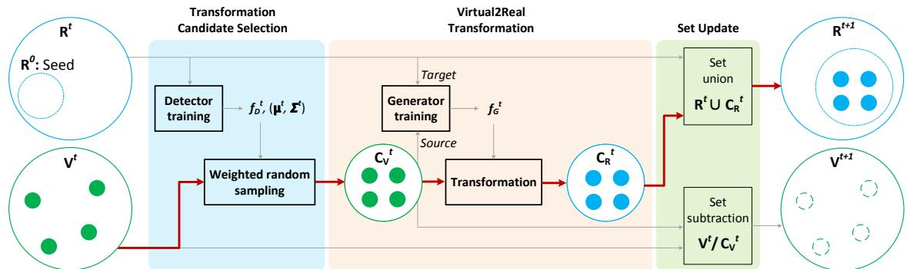  
Figure 2. Progressive Transformation Learning (PTL) pipeline. The red arrow indicates the processing flow of the virtual images selected to be added to the training set.

This measurement of the domain gap is highly dependent on the detector’s ability to detect objects in the image. It is commonly known that the detection capability of a detector is greatly affected by the image size as well as the object appearance in the image. To mitigate the effect of image size on measuring the domain gap, the Mahalanobis distance for ${ \bf x } _ { n e w }$ is calculated at multiple image scales, and the minimum distance is used as the domain gap, as follows:

$$
d ( \mathbf { x } _ { n e w } ) = \operatorname* { m i n } _ { s \in S } ( \{ d ( \mathbf { x } _ { n e w } ^ { s } ) \} ) ,\tag{4}
$$

where $\mathbf { x } _ { n e w } ^ { s }$ is the resized image of ${ \bf x } _ { n e w }$ to be s×s. S is the set of resizing factors. In our experiments, we use $S = \{ 1 2 8 , 2 5 6 , 3 8 4 , 5 1 2 \}$

## 3.2. Progressive Transformation Learning

Our objective is to expand the training set consisting of real images by adding virtual images which are transformed to intimate real images. The virtual2real transformation can be performed by a generator trained by treating virtual images and real images as “source” and “target”, respectively, in the conditional GAN framework. Inevitably, the transformation quality of the trained generator is degraded when the domain gap between the source domain and the target domain is large. To prevent the degraded transformation quality due to the large domain gap, we introduce Progressive Transformation Learning $( P T L )$ , which progressively and iteratively expands the training set with a subset of virtual images carefully selected to avoid the large domain gap. PTL goes through three steps for each iteration (Fig 2): i) sampling a subset of virtual images from a virtual image pool by giving heavier weights to images close to the current training set (Transformation candidate selection), ii) transforming the selected images to be realistic (Virtual2real transformation), and iii) adding the transformed images to the training set while excluding the selected images from the virtual image pool (Set update). The details of each step are described next.

Transformation candidate selection. When selecting transformation candidates, we must consider two conflicting claims simultaneously: i) to suit the purpose of PTL, virtual images with a small domain gap should be selected, but ii) to suit the purpose of expanding the training set, virtual images with appearances that rarely appear in the training set, which usually implies a large domain gap, should also be selected.

To jointly consider these two claims, we use weighted random sampling. The sampling weight takes the exponential term which gives higher weights to virtual images with smaller domain gaps, while introducing one hyperparameter τ to control the amplitude of the weights, as follows:

$$
w ( { \bf x } ) = \exp \left( - \frac { d ( { \bf x } ) } { \tau } \right) ,\tag{5}
$$

where $d ( \mathbf { x } )$ is the Mahalanobis distance, which is used to measure the domain gap of x from the current training set (eq 4). Intuitively, using a small τ allows a more frequent selection of images with smaller domain gaps by giving them larger weights than using a large τ. (We use $\tau { = } 5 . 0$ throughout all experiments.)

In practice, transformation candidates are selected from virtual image pool through the following four steps: i) training the human detector $f _ { D } ^ { t }$ on the current training set of real images $\boldsymbol { \mathrm { R } } ^ { t }$ , ii) calculating $\mu ^ { t }$ and $\Sigma ^ { t }$ on $\boldsymbol { \mathrm { R } } ^ { t }$ as in eq. 2, iii) calculating weights for each image in the current set of virtual images $\mathrm { V } ^ { t }$ as in eq. 5, and iv) applying weighted random sampling to $\mathrm { v } ^ { t }$ to select a pre-defined number n of transformation candidates. (We use n=100 throughout all experiments.)

Virtual2Real transformation. In line with the goal of this paper to obtain a human detector that can identify humans with diverse appearances captured by a UAV, we design the virtual2real transformation to focus on the person region rather than the background of the selected virtual images. To do so, we crop the person region in the virtual image, apply the transformation only to this region, and segment the transformed person back to the original background. For accurate segmentation, the pixel-wise segmentation mask is required. Obtaining such pixel-wise segmentation mask at no cost is another benefit of using virtual images.

The conditional GAN framework [36], in which the generator is trained to transform a given input image from source styles into target styles, is widely used to transform virtual images to look like real images [20, 29]. Among many variants of conditional GANs, we use CycleGAN [52] in which the generator is trained to minimize the reconstruction error between the input image and the reconstructed image transformed back to the original style of the input image after the initial transformation to the target style. It is shown in [36] that the transformation with CycleGAN is likely to maintain the original object pose while changing detailed styles such as patterns (e.g., transforming a white horse into a zebra in the same pose). We intend to borrow this characteristic of CycleGAN to transform virtual images in the direction that makes the detailed styles realistic while maintaining the overall human appearances, which depend on various viewing angles or human poses.

In practice, the virtual2real transformation generator $f _ { G } ^ { t }$ is trained using the CycleGAN framework by treating the selected transformation candidates $\mathrm { C v } ^ { t }$ and the current set of real images $\boldsymbol { \mathrm { R } } ^ { t }$ as “source” and “target”, respectively. Then, $\mathrm { C v } ^ { t }$ are transformed to realistic transformed images ${ \mathrm { C _ { R } } } ^ { t }$ by applying the virtual2real transformation generator.

Set update. After the transformed images ${ \mathrm { C } _ { \mathrm { R } } } ^ { t }$ are acquired from the selected transformation candidates $\mathrm { C v } ^ { t }$ , PTL updates the current real image set $\boldsymbol { \mathrm { R } } ^ { t }$ and the current virtual image set $\mathrm { V } ^ { t }$ as follows:

$$
\mathbf { R } ^ { t + 1 } = \mathbf { R } ^ { t } \cup \mathbf { C } _ { \mathrm { R } } { } ^ { t } \mathbf { \Sigma } \mathbf { \Sigma } \mathbf { \Sigma } \mathbf { V } ^ { t + 1 } = \mathbf { V } ^ { t } / \mathbf { C } _ { \mathrm { V } } { } ^ { t }\tag{6}
$$

When this progressive learning is terminated, the final human detection model can be acquired by training on the final set of real images.

In practice, the first two steps of PTL are applied to the tightly cropped image region of human region, but in the ‘set update’ step, the entire image including the human region and the background is added to the training set for training the human detector. More precisely, when training the virtual2real transformation generator, the tightly cropped image region around each human from the training images are used as the “target”.

## 4. Experiments

Datasets and evaluation metrics. We perform experiments on three real UAV-based datasets, VisDrone [53], Okutama-Action [3], and ICG [1], and one virtual dataset, Archangel-Synthetic [42], all including human instances. Archangel-Synthetic consists of various virtual characters with different poses across a range of altitudes and circle radii with different camera pitch angles (i.e., 17.3K images with eight characters, three poses, ten altitudes, six circle radii, and twelve camera pitch angles). Each image in Archangel-Synthetic accompanies metadata about the above imaging conditions, allowing us to analyze how the feature distributions of virtual characters evolve with respect to these imaging conditions when PTL progresses. We use AP@.5 and AP@[.5:.95] as evaluation metrics for all experiments.

Detector. For the detector, we use RetinaNet [32] that uses the feature pyramid network (FPN) to provide a rich multiscale feature pyramid and processes features at all scale levels with the same subnetwork responsible for the final classification and bounding box regression. It is important to use the same subnetwork across all scale levels since the domain gap for each virtual image should be measured in a shared representation space regardless of the image size. Most other object detectors using FPN (e.g., SSD [34] and v4 or later versions of YOLO [6, 22, 30, 47]) use different subnetworks at each scale level. However, PTL is not structurally limited to RetinaNet as it can be used with any detector with minor modifications, such as adding one shared layer across all scale levels.

## 4.1. Properties of Progressive Learning

Which virtual images are selected for each PTL iteration? The top row of Figure 3 shows the change in the accumulated distribution of virtual images added to the training set via each PTL iteration with respect to camera locations. By examining the distribution, we can identify which camera locations of the virtual images contribute more to the training set at each PTL iteration.

It is observed that after the 1st PTL iteration, most virtual images included in the training set are taken from the camera locations close to the human subjects. As PTL progresses, the camera locations of the virtual images included in the training set gradually spread across the UAV altitudes and rotation circle radii. Consequently, after the 5th PTL iteration, transformed virtual images with diverse appearances from much broader camera locations are included in the final training set. This demonstrates that the proposed transformation candidate selection process is adequately designed to consider the two conflicting claims together.

How close does the domain gap get as PTL progresses? The bottom row of Figure 3 shows the domain gap between the virtual images and the training set at each PTL iteration. We can observe the domain gap distribution of virtual images to the training set gradually becomes narrower and smaller. Additionally, some virtual images which have not been included in the training set also appear in the long tail of the distribution.

Accuracy variation as PTL evolves. Figure 4 shows how the accuracy changes as PTL progresses on the three datasets. Overall, for AP@.5, accuracy increases rapidly until the 3rd iteration and does not change significantly thereafter. On the other hand, for AP@[.5:.95], accuracy continues to increase even after the 3rd iteration on the Okutama-Action and ICG datasets. This can be interpreted such that human bounding boxes are estimated more accurately as PTL progresses on these two datasets.

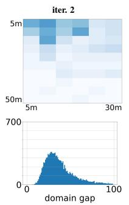

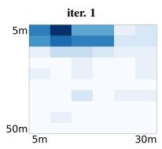

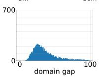

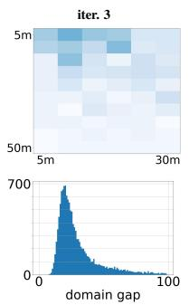

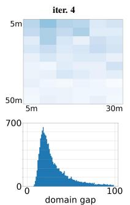

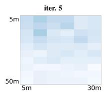

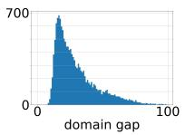  
Figure 3. Analysis of the use of virtual images when PTL progresses. The figures in the top row show the accumulated distribution of transformation candidates with respect to camera locations (i.e., altitude and rotation circle radius from the target human in x and y axes, respectively) for each PTL iteration. Darker bins indicate that more virtual images have been added to the training set. The figures in the bottom row (x axis: domain gap, y axis: the corresponding number of virtual images) show the domain gap distribution of virtual images measured by eq. 4. These figures are collected from the experimental setup of using 50 real images from the VisDrone dataset for training.

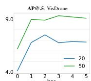

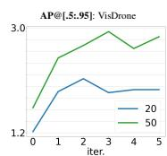

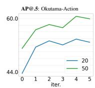

Figure 4. Learning curves of the two metrics (AP@.5 and AP@[.5:.95]) on the three datasets  
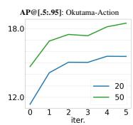

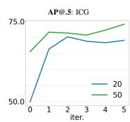

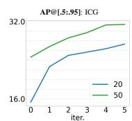

## 4.2. Results on Low-shot Learning

Baselines. We compare PTL with the method utilizing only real images for training (i.e., ‘baseline’) and other three methods also leveraging virtual images in conjunction with real images for training (i.e., ‘pretrain-finetune’, ‘naive merge’, and ‘naive merge w/ transform’) in terms of human detection accuracy. ‘Pretrain-finetune’ is the strategy to train a model by pre-training on virtual images and then fine-tuning on real images, which is the most widely used approach leveraging virtual images in previous works [2, 10, 12, 16, 17, 21, 26, 37, 38, 45]. ‘Naive merge’ is the strategy that uses a training set naively merging from real and virtual images for model training, which has also been used in previous works [40, 41]. ‘Naive merge w/ transform’ naively adds transformed virtual images to the training set, where the transformation generator is trained with the CycleGAN framework by considering all virtual images and all real images as “source” and “target”.

Main Results. In Table 1, we compare PTL to the baselines in terms of human detection accuracy in two low-shot detection regimes (i.e., 20 and 50 real images are used for training) on the three real-world UAV-based datasets. Lowshot detection is a suitable task to validate the proper use of virtual images as notable effects can be expected from adequately expanded datasets.

In all cases, the previous methods leveraging virtual images do not present significantly better, or even worse, accuracy than their counterpart (i.e., ‘baseline’) using real images only for training. ‘Pretrain-finetune’ is the only method, except for PTL, that presents better accuracy than the baseline in some cases. This two-step method is effective in avoiding adverse effects due to the large domain gap while indirectly taking advantage of the large-scale dataset. However, the increase in accuracy is marginal as the taskspecific properties (i.e., human detection) of the large-scale virtual dataset used for pre-training are not fully exploited due to the catastrophic forgetting issue inherent in this indirect method. In addition, ‘naive merge w/ transformation’, which is the only previous method that uses transformed virtual images, presents significantly reduced accuracy, which can be regarded as the adverse effects (e.g., transformation quality degradation) when the large domain gap is not properly addressed. The final model obtained after the 5th PTL iteration or the best model achieved when PTL progresses consistently presents significantly better performance than any compared method. This demonstrates the effectiveness of PTL such that accuracy is substantially improved by expanding the training set using virtual images while the large domain gap is appropriately addressed.

Ablation: The effect of τ. In Table 2, we compare five different τ values to investigate the effect of τ used to control the sampling weights when selecting transformation candidates (eq. 5). It is found that as large τ values (≥ 100) are used, the accuracy on the VisDrone dataset decreases while the accuracy on the ICG dataset increases. The finding indicates that adding more virtual images with a large domain gap to the training set using a large τ has no significant effect or even adverse effect in terms of accuracy when the training set and the test set are in the same domain. However, a large τ shows a remarkable effect in the crossdomain setting, especially when the training set and the test set have very different characteristics, such as the VisDrone train set and the ICG test set. We use τ=5 throughout the experiment for the same-domain setup, but we can also consider using a large τ for the cross-domain setup.

<table><tr><td rowspan="2">method</td><td rowspan="2">train set</td><td colspan="2">VisDrone</td><td colspan="2">Okutama-Action</td><td colspan="2">ICG</td></tr><tr><td>20</td><td>50</td><td>20</td><td>50</td><td>20</td><td>50</td></tr><tr><td>baseline</td><td>R</td><td>3.74/1.09</td><td>6.42/ 1.86</td><td>41.61/  11.23</td><td>49.84/  13.76</td><td>49.35/  14.69</td><td>66.75/  23.91</td></tr><tr><td>pretrain-finetune</td><td>R+V</td><td>4.99/  1.46</td><td>6.25/ 1.99</td><td>44.57/  12.78</td><td>49.06/ 15.08</td><td>66.92/ 26.67</td><td>68.41/ 29.73</td></tr><tr><td>naive merge</td><td>R+V</td><td>3.41/  1.02</td><td>5.18/ 1.65</td><td>34.26/ 9.21</td><td>48.33/ 14.61</td><td>55.95/ 20.76</td><td>65.68/26.73</td></tr><tr><td>w/ transform</td><td>R+V</td><td>1.26/0.49</td><td>4.02/  1.37</td><td>27.371 7.84</td><td>41.36/12.64</td><td>48.02/  17.62</td><td>65.03/  27.21</td></tr><tr><td>PTL (5th itr.)</td><td>R+V</td><td>6.83/ 1.94</td><td>9.09/ 2.85</td><td>52.89/ 15.57</td><td>59.90/18.48</td><td>69.11/ 27.33</td><td>74.14/ 31.41</td></tr><tr><td rowspan="2">PTL (best)</td><td rowspan="2">R+V</td><td>+3.09/+0.85</td><td>+2.67/+0.99</td><td>+11.28/+4.34</td><td>+10.06/+4.72</td><td>+19.76/+12.64</td><td>+7.39/+7.50</td></tr><tr><td>7.52/ 2.13</td><td>9.33/ 2.94</td><td>53.82/15.59</td><td>60.65/ 18.48</td><td>70.23/ 27.33</td><td>74.14/  31.41</td></tr><tr><td rowspan="2"></td><td rowspan="2"></td><td>+3.78/+1.04</td><td>+2.91/+1.08</td><td>+12.21/+4.36</td><td>+10.81/+4.72</td><td>+20.88/+12.64</td><td></td></tr><tr><td></td><td></td><td></td><td></td><td></td><td>+7.39/+7.50</td></tr></table>

Table 1. Low-shot learning accuracy with 20 and 50 real images. AP@.5 and AP@[.5:.95] are reported in each bin. For PTL, the margin from the baseline accuracy is shown below the reported accuracy. The best accuracy for each setting is shown in bold. R and V denote the set of real images and the set of virtual images, respectively.

<table><tr><td rowspan=1 colspan=1>T</td><td rowspan=1 colspan=1>VisDrone</td><td rowspan=1 colspan=1>Okutama-Action</td><td rowspan=1 colspan=1>ICG</td></tr><tr><td rowspan=1 colspan=1>1</td><td rowspan=1 colspan=1>9.48/ 3.01</td><td rowspan=1 colspan=1>39.37/  10.45</td><td rowspan=1 colspan=1>27.871 7.75</td></tr><tr><td rowspan=1 colspan=1>5</td><td rowspan=1 colspan=1>9.09/2.85</td><td rowspan=1 colspan=1>42.39/11.41</td><td rowspan=1 colspan=1>29.26/ 7.27</td></tr><tr><td rowspan=1 colspan=1>10</td><td rowspan=1 colspan=1>9.68/ 2.87</td><td rowspan=1 colspan=1>37.48/9.51</td><td rowspan=1 colspan=1>33.06/ 7.66</td></tr><tr><td rowspan=1 colspan=1>100</td><td rowspan=1 colspan=1>8.97/  2.54</td><td rowspan=1 colspan=1>38.25/  10.18</td><td rowspan=1 colspan=1>33.7819.29</td></tr><tr><td rowspan=1 colspan=1>1000</td><td rowspan=1 colspan=1>8.90/  2.63</td><td rowspan=1 colspan=1>39.15/  10.00</td><td rowspan=1 colspan=1>43.90/11.97</td></tr></table>

Table 2. Varying τ in PTL (after 5th iteration). Models are trained on the VisDrone dataset with 50 shot learning setup.

Ablation: The effect of n. n, which is the number of virtual images added to the training set per PTL iteration, can affect not only the optimality of training but also the scalability of models trained by PTL toward other datasets different from the real dataset used for training. Accordingly, to find the optimal value of n by taking these effects into account, we carry out ablation experiments under the cross-domain setup as shown in Table 3.

We compare three cases when n is 50, 100, and 200. When the training set and the test set comes from the same domain (i.e., training and testing on the VisDrone dataset), the human detection accuracy is not very sensitive to n. The best accuracy is obtained with the fewest virtual images (i.e., n=50). The insensitivity to the hyperparameter n is also observed in the Okutama-Action dataset, having relatively similar properties to the VisDrone dataset under the cross-domain setup. However, for ICG, which is considered to have noticeably different properties from the Vis-Drone dataset under the cross-domain setup, the accuracy is significantly improved as more virtual images (i.e., n=200) are used per PTL iteration. This implies that using more virtual images through more PTL iterations tends to further reduce the cross-domain gap when the discrepancy between the training set and the test set is considerably large, such as VisDrone vs. ICG, resulting in improved PTL scalability. Considering the trade-off between the training optimality and the PTL scalability, we use n=100 throughout all other experiments in this paper.

<table><tr><td rowspan=1 colspan=2># img per itr</td><td rowspan=1 colspan=1>VisDrone</td><td rowspan=1 colspan=2>Okutama-Action</td><td rowspan=1 colspan=1>ICG</td></tr><tr><td rowspan=1 colspan=2>50</td><td rowspan=1 colspan=1>9.59/ 2.90</td><td rowspan=2 colspan=2>41.62/11.1942.39/11.46</td><td rowspan=3 colspan=1>25.94/ 6.0430.01/7.3635.50/10.20</td></tr><tr><td rowspan=2 colspan=2>100200</td><td rowspan=1 colspan=1></td><td rowspan=1 colspan=2>9.33/ 2.94</td><td rowspan=1 colspan=1>42.3</td></tr><tr><td rowspan=1 colspan=1>9.04/  2.91</td><td rowspan=1 colspan=2>41.29/11.18</td></tr></table>

Table 3. Varying # of virtual images added to the training set per PTL iteration. Models are trained on the VisDrone dataset with 50 shot learning setup. The reported accuracies are obtained by using the best PTL models.

Qualitative analysis of transformation. Figures 5 show several samples of transformed virtual images included in the training set using methods with virtual2real transformation (i.e., PTL and ‘naive merge w/ transformation’) in the ‘VisDrone and 50-shot’ setup. First, the quality of the transformed image by ’naive merge w/transformation’ generally deteriorates a lot, and there are samples, in some severe cases, in which it is difficult to recognize the human appearance anymore. On the other hand, in the case of the virtual image transformed by PTL considering the domain gap when training the transformation generator, it can be seen that only the pattern is changed to be similar to the image of the real dataset while the human pose is maintained well. This qualitative analysis supports the validity of our claim that the domain gap between virtual images and real images should be considered when training the virtual2real transformation generator.

## 4.3. Results on Cross-domain Detection

In Table 4, we show the accuracy for the cross-domain setups on the three datasets. The “cross-domain detection”

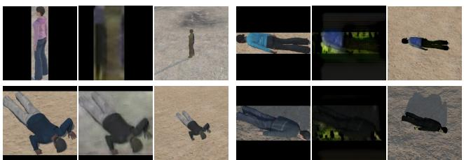  
Naive merge w/ transform

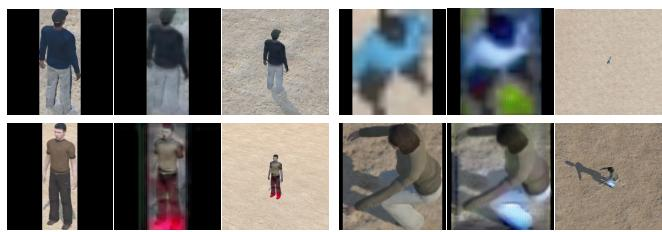

Figure 5. Sample Virtual2Real transformation output (VisDrone, 50-shot). Each set consists of three images: original virtual image (left), transformed image (middle), and transformed image with background (right).
<table><tr><td rowspan="2">method</td><td colspan="3">VisDrone</td><td colspan="3">Okutama-Action</td><td colspan="3">ICG</td></tr><tr><td>20</td><td></td><td>50</td><td>20</td><td></td><td>50</td><td>20</td><td>50</td><td></td></tr><tr><td></td><td>Vis → Vis</td><td></td><td></td><td>Oku → Oku</td><td></td><td></td><td>ICG → ICG</td><td></td><td></td></tr><tr><td>baseline</td><td>3.74/1.09</td><td></td><td>6.42/1.86</td><td>41.61/  11.23</td><td></td><td>49.84/ 13.76</td><td>49.35/  14.69</td><td></td><td>66.75/  23.91</td></tr><tr><td>PTL (5th itr.)</td><td>6.83/ 1.94</td><td></td><td>9.09/ 2.85</td><td>52.89/15.57</td><td></td><td>59.90/ 18.48</td><td>69.11/ 27.33</td><td></td><td>74.14/31.41</td></tr><tr><td>PTL (best)</td><td>7.52/2.13</td><td></td><td>9.33/ 2.94</td><td>53.82/15.59</td><td></td><td>60.65/  18.48</td><td>70.23/27.33</td><td></td><td>74.14/ 31.41</td></tr><tr><td></td><td colspan="3">Oku → Vis</td><td colspan="3">Vis → Oku</td><td colspan="3">Vis → ICG</td></tr><tr><td>baseline</td><td>1.62/ 0.47</td><td></td><td>2.04/0.57</td><td></td><td>17.13/4.53</td><td>36.82/ 9.87</td><td>2.92/0.56</td><td></td><td>7.46/1.83</td></tr><tr><td>PTL (5th itr.)</td><td>2.72/ 0.94</td><td></td><td>3.05/ 1.07</td><td>30.72/ 7.45</td><td></td><td>42.39/11.41</td><td>26.86/ 7.22</td><td>29.26/7.27</td><td></td></tr><tr><td>PTL (best)</td><td>3.00/1.22</td><td></td><td>3.56/ 1.17</td><td>33.25/ 8.59</td><td></td><td>42.39/ 11.46</td><td>29.60/7.69</td><td>30.01/7.36</td><td></td></tr><tr><td></td><td colspan="3">ICG → Vis</td><td colspan="3">ICG → Oku</td><td colspan="3">Oku → ICG</td></tr><tr><td>baseline</td><td>0.54/ 0.13</td><td></td><td>0.99/ 0.26</td><td></td><td>3.56/0.75</td><td>10.27/ 2.49</td><td>5.37/1.25</td><td></td><td>5.23/ 1.20</td></tr><tr><td>PTL (5th itr.)</td><td>1.09/0.33</td><td></td><td>1.61/ 0.50</td><td>11.19/2.58</td><td></td><td>14.20/3.56</td><td>28.98/ 8.14</td><td>25.39/</td><td>6.53</td></tr><tr><td>PTL (best)</td><td>1.58/ 1.02</td><td>1.70/</td><td>0.63</td><td>12.82/</td><td>14.20/</td><td>3.71</td><td>28.98/ 8.14</td><td>26.62/</td><td>6.53</td></tr></table>

Table 4. Cross-domain detection accuracy. The table shows experiments with 3×3 cross-domain setups. For each setup, datasets shown to the left and right of the arrow are the training and test sets, respectively. The accuracies of PTL and the baseline without using virtual images for training are shown. Setups on the top use training and test images from the same domain, which provides a baseline accuracy in the cross-domain setups. All setups in each column are tested on the same dataset and the same low-shot regime.

setups are used to validate the impact of using virtual images for training when training and test images have distinct characteristics, such as when the distributions of human appearances with respect to human poses and viewing angles are different.

First, it is observed that using PTL yields much better accuracies than the baseline when using the same real training dataset. Despite the inherent difficulty of cross-domain learning, it is also observed that leveraging virtual images through PTL produces results not far behind the accuracy of the baseline (shown in the first row of Table 4) which uses the training images from the same domain as the test images. However, the improvement in the cross-domain detection accuracy when using the ICG dataset for training is relatively low compared to other cases. This is because the ICG dataset has very different characteristics from other datasets, and virtual images added to the training set do not reduce this difference. Note that if the real images in the initial training set have very distinct appearances, a very different set of virtual images may be selected in the first PTL iteration. Thus, the disparity may not be overcome even if the PTL progresses further. Nevertheless, in general, we can confirm that human detectors trained using virtual images through PTL can improve substantially detection accuracy, regardless of which real dataset is used during training.

## 5. Discussion

Our method has been proved effective in leveraging virtual images during training as it presents much better accuracy than any other previous methods for low-shot learning task, where scaling up the training dataset can significantly impact. In addition, compared to the baseline which does not use virtual images, our method also presents remarkable accuracy on cross-domain detection, where the real training and test datasets are from two distinct domains with very different characteristics.

Despite the merit of the proposed method, there is still room to improve PTL further. Specifically, the current version of PTL can only leverage a subset of the entire virtual images within a limited number of iterations, beyond which the accuracy may decrease. We hope that more advanced methods can be developed to address this issue so that PTL can progress for more iterations with a continuous accuracy increase until all virtual images are leveraged for training.

Acknowledgements. This research was sponsored by the Defense Threat Reduction Agency (DTRA) Contract Number: A2205097021023559.

## References

[1] Aerial semantic segmentation drone dataset. http:// dronedataset.icg.tugraz.at. 1, 5

[2] Kyungjune Baek and Hyunjung Shim. Commonality in natural images rescues GANs: Pretraining GANs with generic and privacy-free synthetic data. In Proc. CVPR, 2022. 2, 6

[3] Mohammadamin Barekatain, Miquel Mart´ı, Hsueh-Fu Shih, Samuel Murray, Kotaro Nakayama, Yutaka Matsuo, and Helmut Prendinger. Okutama-action: An aerial view video dataset for concurrent human action detection. In Proc. CVPR Workshop, 2017. 1, 5

[4] Yoshua Bengio, Pascal Lamblin, Dan Popovici, and Hugo Larochelle. Greedy layer-wise training of deep networks. In Proc. NeurIPS, 2006. 3

[5] Yoshua Bengio, Jer´ ome Louradour, Ronan Collobert, and Ja-ˇ son Weston. Curriculum learning. In Proc. ICML, 2009. 3

[6] Alexey Bochkovskiy, Chien-Yao Wang, and Hong-Yuan Mark Liao. YOLOv4: Optimal speed and accuracy of object detection. arXiv:2004.10934, 2020. 5

[7] Tianyue Cao, Yongxin Wang, Yifan Xing, Tianjun Xiao, Tong He, Zheng Zhang, Hao Zhou, and Joseph Tighe. PSS: Progressive sample selection for open-world visual representation learning. In Proc. ECCV, 2022. 3

[8] Tianqi Chen, Ian Goodfellow, and Jonathon Shlens. Net2Net: Accelerating learning via knowledge transfer. In Proc. ICLR, 2016. 3

[9] Ting Chen, Simon Kornblith, Mohammad Norouzi, and Geoffrey Hinton. A simple framework for contrastive learning of visual representations. In Proc. ICML, 2020. 3

[10] Matteo Fabbri, Fabio Lanzi, Simone Calderara, Andrea Palazzi, Roberto Vezzani, and Rita Cucchiara. Learning to detect and track visible and occluded body joints in a virtual world. In Proc. ECCV, 2018. 2, 6

[11] Scott E. Fahlman and Christian Lebiere. The cascadecorrelation learning architecture. In Proc. NeurIPS, 1989. 3

[12] Adrien Gaidon, Qiao Wang, Yohann Cabon, and Eleonora Vig. Virtual worlds as proxy for multi-object tracking analysis. In Proc. CVPR, 2016. 2, 6

[13] Linyuan Gong, Di He, Zhuohan Li, Tao Qin, Liwei Wang, and Tie-Yan Liu. Efficient training of BERT by progressively stacking. In Proc. ICML, 2019. 3

[14] Alex Graves, Marc G Bellemare, Jacob Menick, Remi Munos, and Koray Kavukcuoglu. Automated curriculum learning for neural networks. In Proc. ICML, 2017. 3

[15] Jean-Bastien Grill, Florian Strub, Florent Altche, Corentin´ Tallec, Pierre H. Richemond, Elena Buchatskaya, Carl Doersch, Bernardo Avila Pires, Zhaohan Daniel Guo, Mohammad Gheshlaghi Azar, Bilal Piot, Koray Kavukcuoglu, Remi´ Munos, and Michal Valko. Bootstrap your own latent - a new approach to self-supervised learning. In Proc. NeurIPS, 2020. 3

[16] Xi Guo, Wei Wu, Dongliang Wang, Jing Su, Haisheng Su, Weihao Gan, Jian Huang, and Qin Yang. Learning video representations of human motion from synthetic data. In Proc. CVPR, 2022. 2, 6

[17] Ankur Handa, Viorica Patrˇ aucean, Vijay Badrinarayanan, Si-ˇ mon Stent, and Roberto Cipolla. SceneNet: Understanding real world indoor scenes with synthetic data. In Proc. CVPR, 2016. 2, 6

[18] Kaiming He, Haoqi Fan, Yuxin Wu, Saining Xie, and Ross Girshick. Momentum contrast for unsupervised visual representation learning. In Proc. CVPR, 2020. 3

[19] Judy Hoffman, Eric Tzeng, Taesung Park, Jun-Yan Zhu, Phillip Isola, Kate Saenko, Alexei Efros, and Trevor Darrell. CyCADA: Cycle-consistent adversarial domain adaptation. In Proc. ICML, 2018. 1, 2

[20] Phillip Isola, Jun-Yan Zhu, Tinghui Zhou, and Alexei A. Efros. Image-to-image translation with conditional adversarial networks. In Proc. CVPR, 2017. 5

[21] Zhao Jin, Yinjie Lei, Naveed Akhtar, Haifeng Li, and Munawar Hayat. Deformation and correspondence aware unsupervised synthetic-to-real scene flow estimation for point clouds. In Proc. CVPR, 2022. 2, 6

[22] Glenn Jocher. ultralytics/yolov5: v3.1 - Bug Fixes and Performance Improvements. https://github.com/ ultralytics/yolov5, 2020. 5

[23] Tero Karras, Timo Aila, Samuli Laine, and Jaakko Lehtinen. Progressive growing of GANs for improved quality, stability, and variation. In Proc. ICLR, 2018. 3

[24] Prannay Kaul, Weidi Xie, and Andrew Zisserman. Label, verify, correct: A simple few shot object detection method. In Proc. CVPR, 2022. 3

[25] Faisal Khan, Bilge Mutlu, and Jerry Zhu. How do humans teach: On curriculum learning and teaching dimension. In Proc. NeurIPS, 2011. 3

[26] Dahun Kim, Sanghyun Woo, Joon-Young Lee, and In So Kweon. Video panoptic segmentation. In Proc. CVPR, 2016. 2, 6

[27] M. Pawan Kumar, Benjamin Packer, and Daphne Koller. Self-paced learning for latent variable models. In Proc. NeurIPS, 2010. 3

[28] Kimin Lee, Kibok Lee, Honglak Lee, and Jinwoo Shin. A simple unified framework for detecting out-of-distribution samples and adversarial attacks. In Proc. NeurIPS, 2018. 2, 3

[29] Chen Li and Gim Hee Lee. From synthetic to real: Unsupervised domain adaptation for animal pose estimation. In Proc. CVPR, 2021. 1, 2, 5

[30] Chuyi Li, Lulu Li, Hongliang Jiang, Kaiheng Weng, Yifei Geng, Liang Li, Zaidan Ke, Qingyuan Li, Meng Cheng, Weiqiang Nie, Yiduo Li, Bo Zhang, Yufei Liang, Linyuan Zhou, Xiaoming Xu, Xiangxiang Chu, Xiaoming Wei, and Xiaolin Wei. YOLOv6: A single-stage object detection framework for industrial applications. arXiv:2209.02976, 2022. 5

[31] Changlin Li, Bohan Zhuang, Guangrun Wang, Xiaodan Liang, Xiaojun Chang, and Yi Yang. Automated progressive learning for efficient training of vision transformers. In Proc. CVPR, 2022. 3

[32] Tsung-Yi Lin, Priya Goyal, Ross Girshick, Kaiming He, and Piotr Dollar. Focal loss for dense object detection. In ´ Proc. ICCV, 2017. 5

[33] Qing Liu, Adam Kortylewski, Zhishuai Zhang, Zizhang Li, Mengqi Guo, Qihao Liu, Xiaoding Yuan, Jiteng Mu, Weichao Qiu, and Alan Yuille. Learning part segmentation through unsupervised domain adaptation from synthetic vehicles. In Proc. CVPR, 2022. 2

[34] Wei Liu, Dragomir Anguelov, Dumitru Erhan, Christian Szegedy, Scott Reed, Cheng-Yang Fu, and Alexander C. Berg. SSD: Single shot multibox detector. In Proc. ECCV, 2016. 5

[35] Prasanta Chandra Mahalanobis. On the generalised distance in statistics. Proc. National Institute of Sciences of India., 1936. 2

[36] Mehdi Mirza and Simon Osindero. Conditional generative adversarial nets. arXiv:1411.1784, 2014. 1, 5

[37] Samarth Mishra, Rameswar Panda, Cheng Perng Phoo, Chun-Fu (Richard) Chen, Leonid Karlinsky, Kate Saenko, Venkatesh Saligrama, and Rogerio S. Feris. Task2Sim: Towards effective pre-training and transfer from synthetic data. In Proc. CVPR, 2022. 2, 6

[38] Jiteng Mu, Weichao Qiu, Gregory Hager, and Alan Yuille. Learning from synthetic animals. In Proc. CVPR, 2020. 1, 2, 6

[39] Haibo Qiu, Baosheng Yu, Dihong Gong, Zhifeng Li, Wei Liu, and Dacheng Tao. SynFace: Face recognition with synthetic data. In Proc. ICCV, 2021. 1, 2

[40] Stephan R. Richter, Vibhav Vineet, Stefan Roth, and Vladlen Koltun. Playing for data: Ground truth from computer games. In Proc. ECCV, 2016. 3, 6

[41] German Ros, Laura Sellart, Joanna Materzynska, David Vazquez, and Antonio M. Lopez. The SYNTHIA dataset: A large collection of synthetic images for semantic segmentation of urban scenes. In Proc. CVPR, 2016. 3, 6

[42] Yi-Ting Shen, Yaesop Lee, Heesung Kwon, Damon M. Conover, Shuvra S. Bhattacharyya, Nikolas Vale, Joshua D. Gray, G. Jeremy Leong, Kenneth Evensen, and Frank Skirlo. Archangel: A hybrid UAV-based human detection benchmark with position and pose metadata. arXiv:2209.00128, 2022. 5

[43] Leslie N. Smith, Emily M. Hand, and Timothy Doster. Gradual DropIn of layers to train very deep neural networks. In Proc. CVPR, 2016. 3

[44] Valentin I. Spitkovsky, Hiyan Alshawi, and Daniel Jurafsky. Baby steps: How “less is more” in unsupervised dependency parsing. In Proc. NeurIPS Workshop, 2009. 3

[45] Gul Varol, Javier Romero, Xavier Martin, Naureen Mahmood, Michael J. Black, Ivan Laptev, and Cordelia Schmid. Learning from synthetic humans. In Proc. CVPR, 2018. 2, 6

[46] Can Wang, Sheng Jin, Yingda Guan, Wentao Liu, Chen Qian, Ping Luo, and Wanli Ouyang. Pseudo-labeled autocurriculum learning for semi-supervised keypoint localization. In Proc. ICLR, 2022. 3

[47] Chien-Yao Wang, Alexey Bochkovskiy, and Hong-Yuan Mark Liao. YOLOv7: Trainable bag-of-freebies sets new state-of-the-art for real-time object detectors. In Proc. CVPR, 2023. 5

[48] Guangcong Wang, Xiaohua Xie, Jianhuang Lai, and Jiaxuan Zhuo. Deep growing learning. In Proc. ICCV, 2017. 3

[49] Tao Wei, Changhu Wang, Yong Rui YONGRUI, and Chang Wen Chen. Network morphism. In Proc. ICML, 2016. 3

[50] Qi Yan, Jianhao Zheng, Simon Reding, Shanci Li, and Iordan Doytchinov. CrossLoc: Scalable aerial localization assisted by multimodal synthetic data. In Proc. CVPR, 2022. 2

[51] Minjia Zhang and Yuxiong He. Accelerating training of transformer-based language models with progressive layer dropping. In Proc. NeurIPS, 2020. 3

[52] Jun-Yan Zhu, Taesung Park, Phillip Isola, and Alexei A. Efros. Unpaired image-to-image translation using cycleconsistent adversarial networks. In Proc. ICCV, 2017. 5

[53] Pengfei Zhu, Longyin Wen, Dawei Du, Xiao Bian, Heng Fan, Qinghua Hu, and Haibin Ling. Detection and tracking meet drones challenge. IEEE Trans. Pattern Anal. Mach. Intell., 44(11):7380–7399, Nov 2022. 1, 5