# Q-DETR: An Efficient Low-Bit Quantized Detection Transformer

Sheng Xu1†, Yanjing Li1†, Mingbao Lin3, Peng Gao4, Guodong Guo5, Jinhu Lu¨1,2, Baochang Zhang1,2∗ 1 Beihang University 2 Zhongguancun Laboratory 3 Tencent Shanghai AI Laboratory 5 UNIUBI Research, Universal Ubiquitous Co.

## Abstract

The recent detection transformer (DETR) has advanced object detection, but its application on resourceconstrained devices requires massive computation and memory resources. Quantization stands out as a solution by representing the network in low-bit parameters and operations. However, there is a significant performance drop when performing low-bit quantized DETR (Q-DETR) with existing quantization methods. We find that the bottlenecks of Q-DETR come from the query information distortion through our empirical analyses. This paper addresses this problem based on a distribution rectification distillation (DRD). We formulate our DRD as a bi-level optimization problem, which can be derived by generalizing the information bottleneck (IB) principle to the learning of Q-DETR. At the inner level, we conduct a distribution alignment for the queries to maximize the self-information entropy. At the upper level, we introduce a new foreground-aware query matching scheme to effectively transfer the teacher information to distillation-desired features to minimize the conditional information entropy. Extensive experimental results show that our method performs much better than prior arts. For example, the 4-bit Q-DETR can theoretically accelerate DETR with ResNet-50 backbone by 6.6× and achieve 39.4% AP, with only 2.6% performance gaps than its realvalued counterpart on the COCO dataset 1.

## 1. Introduction

Inspired by the success of natural language processing (NLP), object detection with transformers (DETR) has been introduced to train an end-to-end detector via a transformer encoder-decoder [4]. Unlike early works [22, 31] that often employ convolutional neural networks (CNNs) and require post-processing procedures, e.g., non-maximum suppression (NMS), and hand-designed sample selection, DETR treats object detection as a direct set prediction problem.

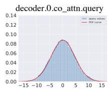

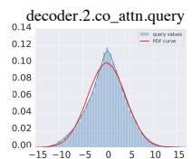  
(a) Real-valued DETR-R50

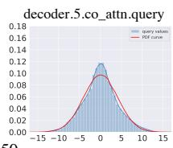

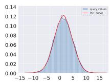

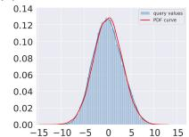  
(b) 4-bit DETR-R50

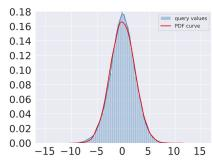  
Figure 1. The histogram of query values q (blue shadow) and corresponding PDF curves (red curve) of Gaussian distribution [17], w.r.t the cross attention of different decoder layers in (a) realvalued DETR-R50, and (b) 4-bit quantized DETR-R50 (baseline). Gaussian distribution is generated from the statistical mean and variance of the query values. The query in quantized DETR-R50 bears information distortion compared with the real-valued one. Experiments are performed on the VOC dataset [9].

Despite this attractiveness, DETR usually has a tremendous number of parameters and float-pointing operations (FLOPs). For instance, there are 39.8M parameters taking up 159MB memory usage and 86G FLOPs in the DETR model with ResNet-50 backbone [12] (DETR-R50). This leads to an unacceptable memory and computation consumption during inference, and challenges deployments on devices with limited supplies of resources.

Therefore, substantial efforts on network compression have been made towards efficient online inference [7, 33, 43, 44]. Quantization is particularly popular for deploying on AI chips by representing a network in low-bit formats. Yet prior post-training quantization (PTQ) for DETR [26] derives quantized parameters from pre-trained real-valued models, which often restricts the model performance in a sub-optimized state due to the lack of fine-tuning on the training data. In particular, the performance drastically drops when quantized to ultra-low bits (4-bits or less). Alternatively, quantization-aware training (QAT) [25, 42] performs quantization and fine-tuning on the training dataset simultaneously, leading to trivial performance degradation even with significantly lower bits. Though QAT methods have been proven to be very effective in compressing CNNs [8, 27] for computer vision tasks, an exploration of low-bit DETR remains untouched.

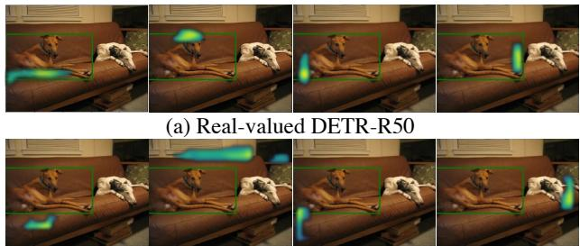  
(b) 4-bit DETR-R50  
Figure 2. Spatial attention weight maps in the last decoder of (a) real-valued DETR-R50, and (b) 4-bit quantized DETR-R50. The green rectangle denotes the ground-truth bounding box. Following [29], the highlighted area denotes the large attention weights in the selected four heads in compliance with bound prediction. Compared to its real-valued counterpart that focuses on the ground-truth bounds, quantized DETR-R50 deviates significantly.

In this paper, we first build a low-bit DETR baseline, a straightforward solution based on common QAT techniques [2]. Through an empirical study of this baseline, we observe significant performance drops on the VOC [9] dataset. For example, a 4-bit quantized DETR-R50 using LSQ [8] only achieves 76.9% $\mathrm { { A P } _ { 5 0 } }$ , leaving a 6.4% performance gaps compared with the real-valued DETR-R50. We find that the incompatibility of existing QAT methods mainly stems from the unique attention mechanism in DETR, where the spatial dependencies are first constructed between the object queries and encoded features. Then the co-attended object queries are fed into box coordinates and class labels by a feed-forward network. A simple application of existing QAT methods on DETR leads to query information distortion, and therefore the performance severely degrades. Fig. 1 exhibits an example of information distortion in query features of 4-bit DETR-R50, where we can see significant distribution variation of the query modules in quantized DETR and real-valued version. The query information distortion causes the inaccurate focus of spatial attention, which can be verified by following [29] to visualize the spatial attention weight maps in 4-bit and realvalued DETR-R50 in Fig. 2. We can see that the quantized DETR-R50 bear’s inaccurate object localization. Therefore, a more generic method for DETR quantization is necessary.

To tackle the issue above, we propose an efficient low-bit quantized DETR (Q-DETR) by rectifying the query information of the quantized DETR as that of the real-valued counterpart. Fig. 3 provides an overview of our Q-DETR, which is mainly accomplished by a distribution rectification knowledge distillation method (DRD). We find ineffective knowledge transferring from the real-valued teacher to the quantized student primarily because of the information gap and distortion. Therefore, we formulate our DRD as a bi-level optimization framework established on the information bottleneck principle (IB). Generally, it includes an inner-level optimization to maximize the self-information entropy of student queries and an upper-level optimization to minimize the conditional information entropy between student and teacher queries. At the inner level, we conduct a distribution alignment for the query guided by its Gaussianalike distribution, as shown in Fig. 1, leading to an explicit state in compliance with its maximum information entropy in the forward propagation. At the upper level, we introduce a new foreground-aware query matching that filters out lowqualified student queries for exact one-to-one query matching between student and teacher, providing valuable knowledge gradients to push minimum conditional information entropy in the backward propagation.

This paper attempts to introduce a generic method for DETR quantization. The significant contributions in this paper are outlined as follows: (1) We develop the first QAT quantization framework for DETR, dubbed Q-DETR. (2) We use a bi-level optimization distillation framework, abbreviated as DRD. (3) We observe a significant performance increase compared to existing quantized baselines.

## 2. Related Work

Quantization. Quantized neural networks often possess low-bit (1∼4-bit) weights and activations to accelerate the model inference and save memory. For example, DoReFa-Net [45] exploits convolution kernels with low bitwidth parameters and gradients to accelerate training and inference. TTQ [46] uses two real-valued scaling coefficients to quantize the weights to ternary values. Zhuang et al. [48] present a 2 ∼ 4-bit quantization scheme using a two-stage approach to alternately quantize the weights and activations, providing an optimal tradeoff among memory, efficiency, and performance. In [14], the quantization intervals are parameterized, and optimal values are obtained by directly minimizing the task loss of the network. ZeroQ [3] supports uniform and mixed-precision quantization by optimizing for a distilled dataset which is engineered to match the statistics of the batch normalization across different network layers. Xie et al. [41] introduced transfer learning into network quantization to obtain an accurate low-precision model by utilizing Kullback-Leibler (KL) divergence. Fang et al. [10] enabled accurate approximation for tensor values that have bell-shaped distributions with long tails and found the entire range by minimizing the quantization error. Li et al. [17] proposed an information rectification module and distribution-guided distillation to push the bit-width in a quantized vision transformer. At the same time, we address the quantization in DETR from the IB principle. The architectural design has also drawn increasing attention using extra shortcut [27], and parallel parameter-free shortcuts [25] for example.

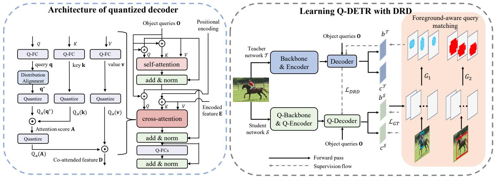  
Figure 3. Overview of the proposed Q-DETR framework. We introduce the distribution rectification distillation method (DRD) to refine the performance of Q-DETR. From left to right, we respectively show the detailed decoder architecture of Q-DETR and the learning framework of Q-DETR. The Q-Backbone, Q-Encoder, and Q-Decoder denote quantized architectures, respectively.

Detection Transformer. Driven by the success of transformers [37], several researchers have also explored transformer frameworks for vision tasks. The first DETR [4] work introduces the Transformer structure based on the attention mechanism for object detection. But the main drawback of DETR lies in the highly inefficient training process. The approachh of another work modifies the multi-head attention mechanism (MHA). Deformable-DETR [47] constructs a sparse and point-to-point MHA mechanism using a static point-wise query sampling method around the reference points. SMCA-DETR [11] introduces a Gaussiandistributed spatial function before formulating a spatially modulated co-attention. DAB-DETR [21] re-defines the query of DETR as dynamic anchor boxes and performs soft ROI pooling layer-by-layer in a cascade manner. DN-DETR [16] introduces query denoising into query generation, reducing the bipartite graph matching difficulty and leading to faster convergence. Another set of arts improves DETR methods using additional learning constraints. For example, UP-DETR [6] proposes a novel self-supervised loss to enhance the convergence speed and the performance of DETR.

However, prior arts mainly focus on the training efficiency of DETR, few of which have discussed the quantization of DETR. To this end, we first build a quantized DETR baseline and then address the query information distortion problem based on the IB principle. Finally, a new KD method based on a foreground-aware query matching scheme is achieved to solve Q-DETR effectively.

## 3. The Challenge of Quantizing DETR

## 3.1. Quantized DETR baseline

We first construct a baseline to study the low-bit DETR since no relevant work has been previously proposed. To this end, we follow LSQ+ [2] to introduce a general framework of asymmetric activation quantization and symmetric weight quantization:

$$
\begin{array} { c }  { { \displaystyle { \pmb x } _ { q } = \lfloor \mathrm { c l i p } \{ \displaystyle { \frac { ( { \pmb x } - { \boldsymbol z } ) } { \alpha _ { x } } } , Q _ { n } ^ { x } , Q _ { p } ^ { x } \} \} , { \bf w } _ { q } = \lfloor \mathrm { c l i p } \{ \displaystyle { \frac { { \bf w } } { \alpha _ { \bf w } } } , Q _ { n } ^ { \bf w } , Q _ { p } ^ { \bf w } \} \} \rceil , } } \\ { { Q _ { a } ( { \boldsymbol x } ) = \alpha _ { x } \circ { \pmb x } _ { q } + \boldsymbol z , ~ Q _ { w } ( { \boldsymbol x } ) = \alpha _ { \bf w } \circ { \bf w } _ { q } , } } \end{array}\tag{1}
$$

where $\mathrm { c l i p } \{ y , r _ { 1 } , r _ { 2 } \}$ clips the input $y$ with value bounds $r _ { 1 }$ and $r _ { 2 } ;$ the $\lfloor y \rceil$ rounds y to its nearest integer; the ◦ denotes the channel-wise multiplication. And $Q _ { n } ^ { x } = - 2 ^ { a - 1 } , Q _ { p } ^ { x } =$ $2 ^ { a - 1 } - 1 , Q _ { n } ^ { \mathbf w } = - 2 ^ { b - 1 } , Q _ { p } ^ { \mathbf w } = 2 ^ { b - 1 } - 1$ are the discrete bounds for a-bit activations and b-bit weights. x generally denotes the activation in this paper, including the input feature map of convolution and fully-connected layers and input of multi-head attention modules. Based on this, we first give the quantized fully-connected layer as:

$$
\mathrm { Q \mathrm { - } F C } ( { \pmb x } ) = Q _ { a } ( { \pmb x } ) \cdot Q _ { w } ( { \mathbf { w } } ) = \alpha _ { x } \alpha _ { \mathbf { w } } \circ ( { \pmb x } _ { q } \odot { \mathbf { w } } _ { q } + z / \alpha _ { x } \circ { \mathbf { w } } _ { q } ) ,\tag{2}
$$

where · denotes the matrix multiplication and $\odot$ denotes the matrix multiplication with efficient bit-wise operations. The straight-through estimator (STE) [1] is used to retain the derivation of the gradient in backward propagation.

In DETR [4], the visual features generated by the backbone are augmented with position embedding and fed into the transformer encoder. Given an encoder output E, DETR performs co-attention between object queries O and the vi-(1) Quantizing backbone (2) Quantizing encoder (3) Quantizing MHA of decoder (4) Quantizing MLPs

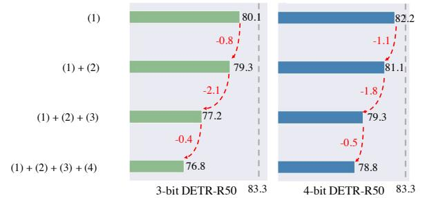  
Figure 4. Performance of 3/4-bit quantized DETR-R50 on VOC with different quantized modules.

sual features E, which are formulated as:

$$
\begin{array} { r l } & { \mathbf { q } = \mathrm { Q - F C } ( \mathbf { O } ) , \ \mathbf { k } , \mathbf { v } = \mathrm { Q - F C } ( \mathbf { E } ) } \\ & { \mathbf { A } _ { i } = \mathrm { s o f t m a x } ( Q _ { a } ( \mathbf { q } ) _ { i } \cdot Q _ { a } ( \mathbf { k } ) _ { i } ^ { \top } / \sqrt { d } ) , } \\ & { \mathbf { D } _ { i } = Q _ { a } ( \mathbf { A } ) _ { i } \cdot Q _ { a } ( \mathbf { v } ) _ { i } , } \end{array}\tag{3}
$$

where D is the multi-head co-attention module, $i . e .$ , the coattended feature for the object query. The d denotes the feature dimension in each head. More FC layers transform the decoder’s output features of each object query for the final output. Given box and class predictions, the Hungarian algorithm [4] is applied between predictions and groundtruth box annotations to identify the learning targets of each object query.

## 3.2. Challenge Analysis

Intuitively, the performance of the quantized DETR baseline largely depends on the information representation capability mainly reflected by the information in the multihead attention module. Unfortunately, such information is severely degraded by the quantized weights and inputs in the forward pass. Also, the rounded and discrete quantization significantly affect the optimization during backpropagation.

We conduct the quantitively ablative experiments by progressively replacing each module of the real-valued DETR baseline with a quantized one and compare the average precision (AP) drop on the VOC dataset [9] as shown in Fig. 4. We find that quantizing the MHA decoder module to low bits, i.e., (1)+(2)+(3), brings the most significant accuracy drops of accuracy among all parts of the DETR methods, up to 2.1% in the 3-bit DETR-R50. At the same time, other parts of DETR show comparative robustness to the quantization function. Consequently, the critical problem of improving the quantized DETR methods is restoring the information in MHA modules after quantization. Other qualitative results in Fig. 1 and Fig. 2 also indicate that the degraded information representation is the main obstacle to a better quantized DETR.

## 4. The Proposed Q-DETR

## 4.1. Information Bottleneck of Q-DETR

To address the information distortion of the quantized DETR, we aim to improve the representation capacity of the quantized networks in a knowledge distillation framework. Generally, we utilize a real-valued DETR as a teacher and a quantized DETR as a student, which are distinguished with superscripts T and S, respectively.

Our Q-DETR pursues the best tradeoff between performance and compression, which is precisely the goal of the information bottleneck (IB) method through quantifying the mutual information that the intermediate layer contains about the input (less is better) and the desired output (more is better) [35, 36]. In our case, the intermediate layer comes from the student, while the desired output includes the ground-truth labels as well as the queries of the teacher for distillation. Thus, the objective target of our Q-DETR is:

$$
\operatorname* { m i n } _ { \theta ^ { S } } I ( X ; \mathbf { E } ^ { S } ) - \beta I ( \mathbf { E } ^ { S } , \mathbf { q } ^ { S } ; \pmb { y } ^ { G T } ) - \gamma I ( \mathbf { q } ^ { S } ; \mathbf { q } ^ { T } ) ,\tag{4}
$$

where $\mathbf { q } ^ { \mathcal { T } }$ and $\mathbf { q } ^ { s }$ represent the queries in the teacher and student DETR methods as predefined in Eq. (3); $\beta$ and $\gamma$ are the Lagrange multipliers [35]; $\theta ^ { S }$ is the parameters of the student; and $I ( \cdot )$ returns the mutual information of two input variables. The first item $I ( X ; \mathbf { E } ^ { S } )$ minimizes information between input and visual features $\mathbf { E } ^ { S }$ to extract task-oriented hints [40]. The second item $I ( \mathbf { E } ^ { S } , \mathbf { q } ^ { S } ; \pmb { y } ^ { G T } )$ maximizes information between extracted visual features and ground-truth labels for better object detection. These two items can be easily accomplished by common network training and detection loss constraints, such as proposal classification and coordinate regression.

The core issue of this paper is to solve the third item $I ( \mathbf { q } ^ { s } ; \mathbf { q } ^ { \tau } )$ , which attempts to address the information distortion in student query via introducing teacher query as a priori knowledge. To accomplish our goal, we first expand the third item and reformulate it as:

$$
I ( \mathbf { q } ^ { S } ; \mathbf { q } ^ { T } ) = H ( \mathbf { q } ^ { S } ) - H ( \mathbf { q } ^ { S } | \mathbf { q } ^ { T } ) ,\tag{5}
$$

where $H ( \mathbf { q } ^ { s } )$ returns the self information entropy expected to be maximized while $H ( \mathbf { q } ^ { S } | \mathbf { q } ^ { T } )$ is the conditional entropy expected to be minimized. It is challenging to optimize the above maximum & minimum items simultaneously. Instead, we make a compromise to reformulate Eq. (5) as a bi-level issue [5, 20] that alternately optimizes the two items, which is explicitly defined as:

$$
\begin{array} { r } { \begin{array} { c } { \operatorname* { m i n } _ { \boldsymbol { \theta } } H ( \mathbf { q } ^ { S ^ { * } } | \mathbf { q } ^ { \mathcal { T } } ) , } \\ { \mathrm { s . t . } \quad \mathbf { q } ^ { S ^ { * } } = \underset { \mathbf { q } ^ { S } } { \arg \operatorname* { m a x } } H ( \mathbf { q } ^ { S } ) . } \end{array} } \end{array}\tag{6}
$$

Such an objective involves two sub-problems, including an inner-level optimization to derive the current optimal query $\mathbf { q } ^ { s ^ { * } }$ and an upper-level optimization to conduct knowledge transfer from the teacher to the student. Below, we show that the two sub-problems can be solved in the forward & backward network propagation’s.

## 4.2. Distribution Rectification Distillation

Inner-level optimization. We first detail the maximization of self-information entropy. According to the definition of self information entropy, $H ( \mathbf { q } ^ { s } )$ can be implicitly expanded as:

$$
H ( \mathbf { q } ^ { S } ) = - \int _ { \mathbf { q } _ { i } ^ { S } \in \mathbf { q } ^ { S } } p ( \mathbf { q } _ { i } ^ { S } ) \mathrm { l o g } p ( \mathbf { q } _ { i } ^ { S } ) .\tag{7}
$$

However, an explicit form of $H ( \mathbf { q } ^ { s } )$ can only be parameterized with a regular distribution $p ( \mathbf { q } _ { i } ^ { S } )$ Luckily, the statistical results in Fig. 1 shows that the query distribution tends to follow a Gaussian distribution, which is also observed in [17]. This enables us to solve the innerlevel optimization in a distribution alignment fashion. To this end, we first calculate the mean $\mu ( \mathbf { q } ^ { s } )$ and variance $\sigma ( \mathbf { q } ^ { S } )$ of query $\mathbf { q } ^ { s }$ whose distribution is then modeled as $\mathbf { q } ^ { \dot { s } } \sim \mathcal { N } ( \bar { \mu } ( \mathbf { q } ^ { \dot { s } } ) , \sigma ( \mathbf { q } ^ { s } ) )$ ). Then, the self-information entropy of the student query can be proceeded as:

$$
\begin{array} { l } { { \displaystyle { \cal H } ( { \bf q } ^ { S } ) = - \mathbb E [ \log \mathcal N ( \mu ( { \bf q } ^ { S } ) , \sigma ( { \bf q } ^ { S } ) ) ] } \ ~ } \\ { { \displaystyle ~ = - \mathbb E [ \log [ \left( 2 \pi \sigma ( { \bf q } ^ { S } ) ^ { 2 } \right) ^ { \frac 1 2 } \exp ( - \frac { \left( { \bf q } _ { i } ^ { S } - \mu ( { \bf q } ^ { S } ) \right) ^ { 2 } } { 2 \sigma ( { \bf q } ^ { S } ) ^ { 2 } } ) ] } \ / } \ ~  \\ { { \displaystyle ~ = \frac 1 2 \log 2 \pi \sigma ( { \bf q } ^ { S } ) ^ { 2 } } . } \end{array}\tag{8}
$$

The above objective reaches its maximum of $H ( \mathbf { q } ^ { S ^ { * } } ) =$ $( 1 / 2 )$ log $2 \pi e [ \sigma { ( \mathbf { q } ^ { s } ) } ^ { 2 } \ + \ \epsilon _ { \mathbf { q } ^ { s } } ]$ when $\begin{array} { r l r } { \mathbf { q } ^ { S ^ { * } } } & { { } = } & { \left[ \mathbf { q } ^ { S } \ - \mathbf { \sigma } \right. } \end{array}$ $\mu ( \mathbf { q } ^ { S } ) ] / [ \sqrt { \sigma ( \mathbf { q } ^ { S } ) ^ { 2 } + \epsilon _ { \mathbf { q } ^ { S } } ] }$ where $\epsilon _ { { \bf q } ^ { s } } = 1 e ^ { - 5 }$ is a small constant added to prevent a zero denominator. In practice, the mean and variance might be inaccurate due to query data bias. To solve this we use the concepts in batch normalization (BN) [13,34] where a learnable shifting parameter $\beta _ { \mathbf { q } ^ { s } }$ is added to move the mean value. A learnable scaling parameter $\gamma _ { \mathbf { q } } s$ is multiplied to move the query to the adaptive position. In this situation, we rectify the information entropy of the query in the student as follows:

$$
\mathbf { q } ^ { S ^ { * } } = \frac { \mathbf { q } ^ { S } - \mu ( \mathbf { q } ^ { S } ) } { \sqrt { \sigma ( \mathbf { q } ^ { S } ) ^ { 2 } + \epsilon _ { \mathbf { q } ^ { S } } } } \gamma _ { \mathbf { q } ^ { S } } + \beta _ { \mathbf { q } ^ { S } } ,\tag{9}
$$

in which case the maximum self-information entropy of student query becomes $H ( { \bf q } ^ { S ^ { * } } ) = ( 1 / 2 ) \log 2 \pi e [ ( \stackrel {  } { \sigma _ { \bf q } ^ { \ : s } } +$ $\epsilon _ { { \bf q } ^ { s } } ) / \gamma _ { { \bf q } ^ { s } } ^ { 2 } ]$ . Therefore, in the forward propagation, we can obtain the current optimal query $\mathbf { q } ^ { s ^ { * } }$ via Eq. (9), after which, the upper-level optimization is further executed as detailed in the following contents.

Upper-level optimization. We continue minimizing the conditional information entropy between the student and the teacher. Following DETR [4], we denote the ground-truth labels by $\pmb { y } ^ { G T } = \bar { \{ c _ { i } ^ { G T } , b _ { i } ^ { G T } \} } _ { i = 1 } ^ { N _ { g t } }$ as a set of ground-truth objects where $N _ { g t }$ is the number of foregrounds, $c _ { i } ^ { G T }$ and $b _ { i } ^ { \bar { G T } }$ respectively represent the class and coordinate (bounding box) for the i-th object. In DETR, each query is associated with an object. Therefore, we can obtain N objects for teacher and student as well, denoted as $\pmb { y } ^ { S } = \{ c _ { j } ^ { S } , b _ { j } ^ { S } \} _ { j = 1 } ^ { N }$ and $\pmb { y } ^ { T } = \{ c _ { j } ^ { T } , b _ { j } ^ { T } \} _ { j = 1 } ^ { N }$

The minimization of the conditional information entropy requires the student and teacher objects to be in a one-to-one matching. However, it is problematic for DETR due primarily to the sparsity of prediction results and the instability of the query’s predictions [16]. We propose a foregroundaware query matching to rectify “well-matched” queries to solve this. Concretely, we match the ground-truth bounding boxes with this student to find the maximum coincidence as:

$$
G _ { i } = \operatorname* { m a x } _ { 1 \leq j \leq N } \mathrm { G I o U } ( b _ { i } ^ { G T } , b _ { j } ^ { S } ) ,\tag{10}
$$

where GIoU(·) is the generalized intersection over union function [32]. Each $G _ { i }$ reflects the “closeness” of student proposals to the i-th ground-truth object. Then, we retain highly qualified student proposals around at least one ground truth to benefit object recognition [38] as:

$$
b _ { j } ^ { S } = \left\{ \begin{array} { l l } { b _ { j } ^ { S } , } & { \mathrm { G I o U } ( b _ { i } ^ { G T } , b _ { j } ^ { S } ) > \tau G _ { i } , ~ \forall ~ i } \\ { \emptyset , } & { \mathrm { o t h e r w i s e } , } \end{array} \right.\tag{11}
$$

where τ is a threshold controlling the proportion of distilled queries. After removing object-empty (∅) queries in $\tilde { \pmb q } ^ { s }$ we form a distillation-desired query set of students denoted as $\tilde { \pmb q } ^ { s }$ associated with its object set $\tilde { y } ^ { S } ~ = ~ \{ \tilde { c } _ { j } ^ { S } , \tilde { b } _ { j } ^ { S } \} _ { j = 1 } ^ { \tilde { N } } .$ Correspondingly, we can obtain a teacher query set $\tilde { y } ^ { T } =$ $\{ \tilde { c } _ { j } ^ { \mathcal { T } } , \tilde { b } _ { j } ^ { \mathcal { T } } \} _ { j = 1 } ^ { \tilde { N } }$ . For the j-th student query, its corresponding teacher query is matched as:

$$
\tilde { c } _ { j } ^ { T } , \tilde { b } _ { j } ^ { T } = \underset { \tilde { c } _ { k } ^ { T } , \tilde { b } _ { k } ^ { T } } { \arg \operatorname* { m a x } } \sum _ { k = 1 } ^ { N } { \mu _ { 1 } } \operatorname { G I o U } ( \tilde { b } _ { j } ^ { S } , b _ { k } ^ { T } ) - \mu _ { 2 } \| \tilde { b } _ { j } ^ { S } - b _ { k } ^ { T } \| _ { 1 } ,\tag{12}
$$

where $\mu _ { 1 } = 2$ and $\mu _ { 2 } = 5$ control the matching function, values of which is to follow [4].

Finally, the upper-level optimization after rectification in Eq. (6) becomes:

$$
\operatorname* { m i n } _ { \boldsymbol { \theta } } H ( \tilde { \mathbf { q } } ^ { S ^ { * } } | \tilde { \mathbf { q } } ^ { T } ) .\tag{13}
$$

Optimizing Eq. (13) is challenging. Alternatively, we minimize the norm distance between $\mathbf { \tilde { q } } ^ { S ^ { * } }$ and $\tilde { \mathbf { q } } ^ { T }$ , optima of which, $i . e . , \tilde { \mathbf { q } } ^ { S ^ { * } } = \tilde { \mathbf { q } } ^ { T }$ , is exactly the same with that in Eq. (13). Thus, the final loss for our distribution rectification distillation loss becomes:

$$
\mathcal { L } _ { D R D } ( \tilde { \mathbf { q } } ^ { S ^ { * } } , \tilde { \mathbf { q } } ^ { T } ) = \mathbb { E } [ \| \tilde { \mathbf { D } } ^ { S ^ { * } } - \tilde { \mathbf { D } } ^ { T } \| _ { 2 } ] ,\tag{14}
$$

where we use the Euclidean distance of co-attented feature D˜ (see Eq. 3) containing the information query q˜ for optimization.

In backward propagation, the gradient updating drives the student queries toward their teacher hints. Therefore we accomplish our distillation. The overall training losses for our Q-DETR model are:

$$
\begin{array} { r } { \mathcal { L } = \mathcal { L } _ { G T } ( \pmb { y } ^ { G T } , \pmb { y } ^ { S } ) + \lambda \mathcal { L } _ { D R D } \big ( \tilde { \mathbf { q } } ^ { S ^ { * } } , \tilde { \mathbf { q } } ^ { T } \big ) , } \end{array}\tag{15}
$$

where $L _ { G T }$ is the common detection loss for missions such as proposal classification and coordinate regression [4], and λ is a tradeoff hyper-parameter.

## 5. Experiments

In this section, we evaluate the performance of the proposed Q-DETR mode using popular DETR [4] and SMCA-DETR [11] models. To the best of our knowledge, there is no publicly available source code on quantization-aware training of DETR methods at this point, so we implement the baseline and LSQ [8] methods ourselves.

## 5.1. Datasets and Implementation Details

Datasets. We first conduct the ablative study and hyper-parameter selection on the PASCAL VOC dataset [9], which contains natural images from 20 different classes. We use the VOC trainval2012, and VOC trainval2007 sets to train our model, which contains approximately 16k images, and the VOC test2007 set to evaluate our Q-DETR, which contains 4952 images. We report COCO-style metrics for the VOC dataset: AP, $\mathsf { A P } _ { 5 0 }$ (default VOC metric), and $\mathsf { A P } _ { 7 5 }$ We further conduct the experiments on the COCO 2017 [18] object detection tracking. Specifically, we train the models on COCO train2017 and evaluate the models on COCO val2017. We list the average precision (AP) for IoUs∈ [0.5 : 0.05 : 0.95], designated as AP, using COCO’s standard evaluation metric. For further analyzing our method, we also list $\mathrm { A P } _ { 5 0 } , \mathrm { A P } _ { 7 5 } , \mathrm { A P } _ { s } , \mathrm { A P } _ { m }$ , and $\mathsf { A P } _ { l }$

Implementation Details. Our Q-DETR is trained with the DETR [4] and SMCA-DETR [11] framework. We select the ResNet-50 [12] and modify it with Pre-Activation structures and RPReLU [25] function following [23]. Py-Torch [30] is used for implementing Q-DETR. We run the experiments on 8 NVIDIA Tesla A100 GPUs with 80 GB memory. We use ImageNet ILSVRC12 [15] to pre-train the backbone of a quantized student. The training protocol is the same as the employed frameworks [4, 11]. Specifically, we use a batch size of 16. AdamW [28] is used to optimize the Q-DETR, with the initial learning rate of $1 e ^ { - 4 }$ We train for 300/500 epochs for the Q-DETR on VOC/COCO dataset, and the learning rate is multiplied by 0.1 at the 200/400-th epoch, respectively. Following the SMCA-DETR, we train the Q-SMCA-DETR for 50 epochs, and the learning rate is multiplied by 0.1 at the 40-th epoch on both the VOC and COCO datasets. We utilize a multidistillation strategy, where we save the encoder and decoder network as real-valued at the first stage. Then we train the fully quantized DETR at the second stage, where we load the weight from the checkpoint of first stage. We select real-valued DETR-R101 (84.5% $\mathrm { { A P } _ { 5 0 } }$ on VOC and 43.5% AP on COCO) and SMCA-DETR-R101 (85.3% $\mathrm { { A P } _ { 5 0 } }$ on VOC and 44.4% AP on COCO) as teacher network.

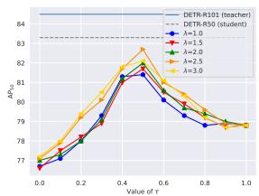  
(a) Effect of τ and λ.

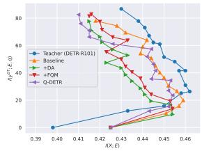  
(b) Mutual information curves.  
Figure 5. (a) We select τ and λ using 4-bit Q-DETR-R50 on VOC. (b) The mutual information curves of I(X; E) and $I ( \pmb { y } ^ { G T } ; \mathbf { E } , \mathbf { q } )$ (Eq. 4) on the information plane. The red curves represent the teacher model (DETR-R101). The orange, green, red, and purple lines represent the 4-bit baseline, 4-bit baseline + DA, 4-bit baseline + FQM, and 4-bit baseline + DA + FQM (4-bit Q-DETR).

## 5.2. Ablation Study

Hyper-parameter selection. As mentioned above, we select hyper-parameters τ and λ in this part using the 4-bit Q-DETR model. We show the model performance $\mathrm { ( A P _ { 5 0 } ) }$ with different setups of hyper-parameters $\{ \tau , \lambda \}$ in Fig. 5 (a), where we conduct ablative experiments on the baseline $+ \mathrm { D A } \left( \mathrm { A P } _ { 5 0 } { = } 7 8 . 8 \% \right)$ . As can be seen, the performances increase first and then decrease with the increase of τ from left to right. Since τ controls the proportion of selected distillation-desired queries, we show that the full-imitation $( \tau = 0 )$ performs worse than the vanilla baseline with no distillation $( \tau = 1 )$ , showing query selection is necessary. The figure also shows that the performances increase first and then decrease with the increase of τ from left to right. The Q-DETR obtains better performances with τ set as 0.5 and 0.6. With the varying value of λ, we find $\{ \lambda , \tau \} =$ {2.5, 0.6} boost the performance of Q-DETR most, achieving 82.7% AP on VOC test2007. Based on the ablative study above, we set hyper-parameters τ and λ as 0.6 and 2.5 for the experiments in this paper.

Table 1. Evaluating the components of Q-DETR-R50 on the VOC dataset. #Bits (W-A-Attention) denotes the bit-width of weights, activations, and attention activations. DA denotes the distribution alignment module. FQM denotes foreground-aware query matching.
<table><tr><td>Method</td><td>#Bits</td><td> $\mathsf { A P } _ { 5 0 }$ </td><td>#Bits</td><td> $\mathrm { { A P } _ { 5 0 } }$ </td><td>#Bits</td><td> $\mathrm { { A P } _ { 5 0 } }$ </td></tr><tr><td>Real-valued</td><td>32-32-32</td><td>83.3</td><td>–</td><td>–</td><td>–</td><td>–</td></tr><tr><td>Baseline</td><td>4-4-8</td><td>78.0</td><td>3-3-8</td><td>76.8</td><td>2-2-8</td><td>69.7</td></tr><tr><td>+DA</td><td>4-4-8</td><td>78.8</td><td>3-3-8</td><td>78.0</td><td>2-2-8</td><td>71.6</td></tr><tr><td>+FQM</td><td>4-4-8</td><td>81.5</td><td>3-3-8</td><td>80.9</td><td>2-2-8</td><td>74.9</td></tr><tr><td>+DA+FQM (Q-DETR)</td><td>4-4-8</td><td>82.7</td><td>3-3-8</td><td>82.1</td><td>2-2-8</td><td>76.4</td></tr></table>

Effectiveness of components. We show quantitative improvements of components in Q-DETR in Tab. 1. As shown in Tab. 1, the quantized DETR baseline suffers a severe performance drop on $\mathrm { { A P } _ { 5 0 } }$ (13.6%, 6.5%, and 5.3% with 2/3/4- bit, respectively). DA and FQM improve the performance when used alone, and the two techniques further boost the performance considerably when combined. For example, the DA improves the 2-bit baseline by 1.9%, and the FQM achieves a 5.2% performance improvement. While combining the DA and FQM, the performance improvement achieves 6.7%.

Information analysis. We further show the information plane following [39] in Fig. 5(b). We adopt the test $\mathrm { { A P } _ { 5 0 } }$ to quantify $I ( \pmb { y } ^ { G T } ; \mathbf { E } , \mathbf { q } )$ . We employ a reconstruction decoder to decode the encoded feature E to reconstruct the input and quantify I(X; E) using the $\ell _ { 1 }$ loss. As shown in Fig. 5(b), the curve of the larger teacher DETR-R101 is usually on the right of the curve of small student models, which indicates a greater ability of information representation. Likewise, the purple line (Q-DETR-R50) is usually on the right of the three left curves, showing the information representation improvements with the proposed methods.

## 5.3. Results on PASCAL VOC

We first compare our method with the 2/3/4-bit baseline and LSQ [8] based on the same frameworks for object detection task with the VOC dataset. We also report the detection performance of the 8-bit post-training quantization networks, such as percentile [19], VT-PTQ [26]. We use the input resolution following [4], i.e. 1333×800. We mainly discuss the $\mathrm { { A P } _ { 5 0 } }$ (default VOC metric) in the following.

We evaluate the proposed Q-DETR on DETR-R50 models in Tab. 2. For the DETR-R50 model, compared with the 8-bit PTQ method, our 4-bit Q-DETR achieves a much larger compression ratio than 8-bit VT-PTQ, but with a bit of performance improvement (82.7% vs. 82.3%). Also, the proposed method boosts the performance of 2/3/4-bit baseline by 6.7%, 5.3%, and 4.7% with the same architecture and bit-width, which significantly validates the effectiveness of our method.

Table 2. We report AP, $\mathrm { A P _ { 5 0 } } .$ , and $\mathsf { A P } _ { 7 5 }$ (%) with state-ofthe-art quantization methods on DETR and SMCA-DETR using VOC $\mathtt { t e s t 2 0 0 7 }$ . #Bits (W-A-Attention) denotes the bit-width of weights, activations, and attention activations.
<table><tr><td>Model</td><td>Method</td><td>#Bits</td><td>AP</td><td> $\mathsf { A P } _ { 5 0 }$ </td><td> $\mathsf { A P } _ { 7 5 }$ </td></tr><tr><td rowspan="8">DETR-R50</td><td></td><td>Real-valued 32-32-32</td><td>59.5</td><td>83.3</td><td>64.7</td></tr><tr><td>Percentile VT-PTQ</td><td>8-8-8</td><td>54.7 57.6</td><td>79.2 82.3</td><td>60.1 63.1</td></tr><tr><td>LSQ Baseline</td><td>4-4-8</td><td>49.7 51.3</td><td>76.9 78.0</td><td>53.0 54.1</td></tr><tr><td>Q-DETR LSQ</td><td>3-3-8</td><td>57.1 47.0</td><td>82.7 75.3</td><td>61.5 49.1</td></tr><tr><td>Baseline Q-DETR</td><td></td><td>49.2</td><td>76.8</td><td>51.8</td></tr><tr><td>LSQ</td><td></td><td>56.8</td><td>82.1</td><td>61.2</td></tr><tr><td>Baseline</td><td>2-2-8</td><td>42.6 44.0</td><td>68.2</td><td>44.8</td></tr><tr><td>Q-DETR</td><td></td><td>50.7</td><td>69.7</td><td>45.8</td></tr><tr><td rowspan="8">SMCA-DETR -R50</td><td>Real-valued</td><td>132-32-32</td><td>56.7</td><td>76.4</td><td>54.1</td></tr><tr><td>Percentile</td><td>8-8-8</td><td>54.7</td><td>83.7 79.2</td><td>62.0 60.1</td></tr><tr><td>VT-PTQ LSQ</td><td></td><td>55.9</td><td>83.0</td><td>61.3</td></tr><tr><td>Baseline</td><td>4-4-8</td><td>49.6 50.7</td><td>78.6 79.5</td><td>53.4 55.4</td></tr><tr><td>Q-DETR LSQ</td><td></td><td>56.2</td><td>83.3</td><td>61.6</td></tr><tr><td>Baseline</td><td>3-3-8</td><td>47.7</td><td>76.5</td><td>51.7</td></tr><tr><td>Q-DETR</td><td></td><td>49.9 54.3</td><td>77.5 82.6</td><td>53.6</td></tr><tr><td>LSQ</td><td></td><td>42.3</td><td>69.7</td><td>59.5</td></tr><tr><td rowspan="4"></td><td></td><td></td><td></td><td></td><td>44.8</td></tr><tr><td>Baseline</td><td>2-2-8</td><td>43.9</td><td>70.4</td><td></td></tr><tr><td></td><td></td><td></td><td></td><td>46.1</td></tr><tr><td>Q-DETR</td><td></td><td>50.2</td><td>76.7</td><td>52.6</td></tr></table>

Besides, our method generates convincing results on SMCA-DETR. As shown in Tab. 2, the performance of the proposed Q-DETR with SMCA-DETR-R50 outperforms the 2/3/4-bit Baseline method by 6.3% , 5.1% and 3.8% on $\mathrm { { A P } _ { 5 0 } }$ , a large margin. Compared with 8-bit post-training quantization methods, our method achieves a significantly higher compression rate and comparable performance.

## 5.4. Results on COCO

We further show comparison on the large-scale COCO [18] dataset. We compare our method with the 2/3/4-bit baseline and LSQ [8] based on the same frameworks. We also report the detection performance of the 8-bit posttraining quantization networks, such as percentile [19] , VT-PTQ [26]. The AP with different IoU thresholds, and AP of objects with varying scales are all reported in Tab. 3.

Tab. 3 lists the comparison of several quantization approaches and detection frameworks in computing complexity, storage cost. Our Q-DETR significantly accelerates computation and reduces storage requirements for various detectors. We follow [40] to calculate memory usage, by adding 32× the number of real-valued weights and a× the number of quantized weights in the a-bit networks. The number of operations (OPs) is calculated in the same way as [40]. Current CPUs can handle both bit-wise XNOR and bit-count operations in parallel. The respective number of FLOPs adds $\textstyle \left\{ { \frac { 1 } { 3 2 } } , { \frac { 1 } { 1 6 } } , { \frac { 1 } { 8 } } \right\}$ of the number of {2,3,4}-bit multiplications equals the OPs following [24].

Table 3. Comparison with state-of-the-art quantization methods using DETR and SMCA-DETR on COCO val2017. #Bits (W-A-Attention) denotes bit-width of weights, activations, and attention activations.
<table><tr><td>Model</td><td>Method</td><td>#Bits</td><td> ${ \mathrm { S i z e } } _ { \mathrm { ( M B ) } }$ </td><td> $\mathrm { O P s } _ { \mathrm { ( G ) } }$ </td><td>AP</td><td> $\mathrm { { A P } _ { 5 0 } }$ </td><td> $\mathsf { A P } _ { 7 5 }$ </td><td>AP_s</td><td> $\mathsf { A P } _ { m }$ </td><td>APl</td></tr><tr><td rowspan="6">DETR-R50</td><td>Real-valued</td><td>32-32-32</td><td>159.32</td><td>85.51</td><td>42.0 38.6</td><td>62.4 1</td><td>44.2 -</td><td>20.5</td><td>45.8</td><td>61.1</td></tr><tr><td>Percentile VT-PTQ</td><td>8-8-8</td><td>39.83</td><td>23.01</td><td>41.2</td><td>-</td><td>-</td><td>一 一</td><td>- -</td><td>- 1</td></tr><tr><td>LSQ Baseline Q-DETR</td><td>4-4-8</td><td>19.92</td><td>13.02</td><td>33.3 34.1 39.4</td><td>53.7 55.3 60.2</td><td>33.9 35.4 41.4</td><td>12.8 14.3 17.7</td><td>37.0 38.0 43.4</td><td>51.6 53.8 59.9</td></tr><tr><td>LSQ Baseline</td><td>3-3-8</td><td>15.03</td><td>7.61</td><td>31.0 32.3</td><td>52.3 52.2</td><td>32.1 32.9</td><td>11.3 12.3</td><td>33.9 35.4</td><td>48.5 50.3</td></tr><tr><td>Q-DETR LSQ</td><td></td><td></td><td></td><td>36.1 24.7</td><td>55.9 44.6</td><td>37.5</td><td>14.6</td><td>39.4</td><td>55.2</td></tr><tr><td>Baseline</td><td>2-2-8</td><td>10.03</td><td>5.32</td><td>26.6</td><td>46.6</td><td>26.5 26.5</td><td>6.3 8.4</td><td>25.3 28.2</td><td>42.7 44.4</td></tr><tr><td rowspan="7">SMCA-DETR-R50</td><td>Q-DETR Real-valued</td><td>32-32-32</td><td>164.75</td><td>86.65</td><td>31.4 41.0</td><td>51.3 62.2</td><td>31.6 43.6</td><td>11.6 21.9</td><td>34.3 44.3</td><td>49.6 59.1</td></tr><tr><td>Percentile VT-PTQ</td><td>8-8-8</td><td>41.19</td><td>23.66</td><td>37.5</td><td>58.5</td><td>40.1</td><td>17.6</td><td>39.1</td><td>55.9</td></tr><tr><td>LSQ</td><td></td><td>20.59</td><td>13.48</td><td>40.2 33.9</td><td>61.0 55.0</td><td>42.6 35.0</td><td>20.3 13.2</td><td>42.9 37.2</td><td>57.7 51.4</td></tr><tr><td>Baseline Q-DETR</td><td>4-4-8</td><td></td><td></td><td>35.0 38.3</td><td>56.4 59.7</td><td>36.4 39.8</td><td>15.6 17.7</td><td>38.3 41.7</td><td>52.5 56.8</td></tr><tr><td>LSQ</td><td>3-3-8</td><td>15.68</td><td>8.05</td><td>30.1</td><td>52.6</td><td>31.4</td><td>11.9</td><td>33.4</td><td>46.6</td></tr><tr><td>Baseline Q-DETR</td><td></td><td></td><td></td><td>31.8 35.0</td><td>53.7 56.3</td><td>32.6 36.9</td><td>12.6 15.0</td><td>35.2 39.0</td><td>49.8</td></tr><tr><td>LSQ Baseline</td><td>2-2-8</td><td>10.84</td><td>4.54</td><td>23.9 25.4</td><td>42.2 44.3</td><td>24.2 25.2</td><td>9.4 8.4</td><td>26.2 27.2</td><td>53.1 37.5 40.3</td></tr></table>

We summarize the experimental results on COCO val2017 of Q-DETR-R50 from lines 2 to 17 in Tab. 3. For the DETR-R50 model, compared with the 8-bit PTQ method, our 4-bit Q-DETR achieves a much larger acceleration than the 8-bit VT-PTQ but with an acceptable performance gap. Also, the proposed method boosts the performance of 2/3/4-bit baseline by 4.8%, 3.8% and 5.1% AP with the same architecture and bit-width, which is significant on the large-scale COCO dataset. Compared with the real-valued counterparts, the proposed 2/3/4-bit Q-DETR achieves computation acceleration and storage savings by 16.07×/11.23×/6.57× and 15.88×/10.60×/7.99×. The above results are of great significance in the real-time inference of object detection. All of the improvements have impacts on object detection.

For the SMCA-DETR-R50 model, we observe similar performance improvements and compression ratios. For example, the 4-bit Q-SMCA-DETR-R50 theoretically accelerates 6.42× with only a 2.7% performance gap compared with the real-valued counterpart, which is significant for real-time DETR methods.

## 6. Conclusion

This paper introduces a novel method for training quantized DETR (Q-DETR) with knowledge distillation to rectify the query distribution. Q-DETR generalizes the information bottleneck (IB) principle and leads a bi-level distribution rectification distillation. We effectively employ a distribution alignment module to solve inner-level and a foreground-aware query matching scheme to solve upper level. As a result, Q-DETR significantly boosts performance of low-bit DETR. Extensive experiments show that Q-DETR surpasses state-of-the-arts in DETR quantization.

## 7. Acknowledgements

This work was supported by National Natural Science Foundation of China under Grant 62141604, 62076016, Beijing Natural Science Foundation L223024.

## References

[1] Yoshua Bengio, Nicholas Leonard, and Aaron Courville.´ Estimating or propagating gradients through stochastic neurons for conditional computation. arXiv preprint arXiv:1308.3432, 2013. 3

[2] Yash Bhalgat, Jinwon Lee, Markus Nagel, Tijmen Blankevoort, and Nojun Kwak. Lsq+: Improving low-bit quantization through learnable offsets and better initialization. In Proc. ofCVPR Workshops, pages 696–697, 2020. 2, 3

[3] Yaohui Cai, Zhewei Yao, Zhen Dong, Amir Gholami, Michael W Mahoney, and Kurt Keutzer. Zeroq: A novel zero shot quantization framework. In Proc. of CVPR, pages 13169–13178, 2020. 2

[4] Nicolas Carion, Francisco Massa, Gabriel Synnaeve, Nicolas Usunier, Alexander Kirillov, and Sergey Zagoruyko. End-toend object detection with transformers. In Proc. of ECCV, pages 213–229, 2020. 1, 3, 4, 5, 6, 7

[5] Benoˆıt Colson, Patrice Marcotte, and Gilles Savard. An overview of bilevel optimization. Annals of operations research, 153(1):235–256, 2007. 4

[6] Zhigang Dai, Bolun Cai, Yugeng Lin, and Junying Chen. Up-detr: Unsupervised pre-training for object detection with transformers. In Proc. of CVPR, pages 1601–1610, 2021. 3

[7] Misha Denil, Babak Shakibi, Laurent Dinh, Marc’Aurelio Ranzato, and Nando De Freitas. Predicting parameters in deep learning. In Proc. ofNeurIPS, pages 2148–2156, 2013. 1

[8] Steven K Esser, Jeffrey L McKinstry, Deepika Bablani, Rathinakumar Appuswamy, and Dharmendra S Modha. Learned step size quantization. arXiv preprint arXiv:1902.08153, 2019. 2, 6, 7

[9] Mark Everingham, Luc Van Gool, Christopher KI Williams, John Winn, and Andrew Zisserman. The pascal visual object classes (voc) challenge. International Journal of Computer Vision, 88(2):303–338, 2010. 1, 2, 4, 6

[10] Jun Fang, Ali Shafiee, Hamzah Abdel-Aziz, David Thorsley, Georgios Georgiadis, and Joseph H Hassoun. Post-training piecewise linear quantization for deep neural networks. In Proc. ofECCV, pages 69–86, 2020. 2

[11] Peng Gao, Minghang Zheng, Xiaogang Wang, Jifeng Dai, and Hongsheng Li. Fast convergence of detr with spatially modulated co-attention. In Proc. ofICCV, pages 3621–3630, 2021. 3, 6

[12] Kaiming He, Xiangyu Zhang, Shaoqing Ren, and Jian Sun. Deep residual learning for image recognition. In Proc. of CVPR, pages 770–778, 2016. 1, 6

[13] Sergey Ioffe and Christian Szegedy. Batch normalization: Accelerating deep network training by reducing internal covariate shift. In Proc. ofICML, pages 448–456, 2015. 5

[14] Sangil Jung, Changyong Son, Seohyung Lee, Jinwoo Son, Jae-Joon Han, Youngjun Kwak, Sung Ju Hwang, and Changkyu Choi. Learning to quantize deep networks by optimizing quantization intervals with task loss. In Proc. of CVPR, pages 4350–4359, 2019. 2

[15] Alex Krizhevsky, Ilya Sutskever, and Geoffrey E Hinton. Imagenet classification with deep convolutional neural networks. In Proc. ofNeurIPS, pages 1097–1105, 2012. 6

[16] Feng Li, Hao Zhang, Shilong Liu, Jian Guo, Lionel M Ni, and Lei Zhang. Dn-detr: Accelerate detr training by introducing query denoising. In Proc. of CVPR, pages 13619– 13627, 2022. 3, 5

[17] Yanjing Li, Sheng Xu, Baochang Zhang, Xianbin Cao, Peng Gao, and Guodong Guo. Q-vit: Accurate and fully quantized low-bit vision transformer. In Proc. of NeurIPS, pages 1–12, 2022. 1, 2, 5

[18] Tsung-Yi Lin, Michael Maire, Serge Belongie, James Hays, Pietro Perona, Deva Ramanan, Piotr Dollar, and C Lawrence´ Zitnick. Microsoft coco: Common objects in context. In Proc. ofECCV, pages 740–755, 2014. 6, 7

[19] Yang Lin, Tianyu Zhang, Peiqin Sun, Zheng Li, and Shuchang Zhou. Fq-vit: Post-training quantization for fully quantized vision transformer. In Proc. of IJCAI, pages 1173– 1179, 2021. 7

[20] Risheng Liu, Jiaxin Gao, Jin Zhang, Deyu Meng, and Zhouchen Lin. Investigating bi-level optimization for learning and vision from a unified perspective: A survey and beyond. IEEE Transactions on Pattern Analysis and Machine Intelligence, 2021. 4

[21] Shilong Liu, Feng Li, Hao Zhang, Xiao Yang, Xianbiao Qi, Hang Su, Jun Zhu, and Lei Zhang. Dab-detr: Dynamic anchor boxes are better queries for detr. pages 1–19, 2022. 3

[22] Wei Liu, Dragomir Anguelov, Dumitru Erhan, Christian Szegedy, Scott Reed, Cheng-Yang Fu, and Alexander C Berg. Ssd: Single shot multibox detector. In Proc. ofECCV, pages 21–37, 2016. 1

[23] Zechun Liu, Kwang-Ting Cheng, Dong Huang, Eric P Xing, and Zhiqiang Shen. Nonuniform-to-uniform quantization: Towards accurate quantization via generalized straightthrough estimation. In Proc. of CVPR, pages 4942–4952, 2022. 6

[24] Zechun Liu, Wenhan Luo, Baoyuan Wu, Xin Yang, Wei Liu, and Kwang-Ting Cheng. Bi-real net: Binarizing deep network towards real-network performance. International Journal of Computer Vision, 128(1):202–219, 2020. 8

[25] Zechun Liu, Zhiqiang Shen, Marios Savvides, and Kwang-Ting Cheng. Reactnet: Towards precise binary neural network with generalized activation functions. In Proc. of ECCV, pages 143–159, 2020. 1, 3, 6

[26] Zhenhua Liu, Yunhe Wang, Kai Han, Wei Zhang, Siwei Ma, and Wen Gao. Post-training quantization for vision transformer. Proc. ofNeurIPS, pages 1–12, 2021. 1, 7

[27] Zechun Liu, Baoyuan Wu, Wenhan Luo, Xin Yang, Wei Liu, and Kwang-Ting Cheng. Bi-real net: Enhancing the performance of 1-bit cnns with improved representational capability and advanced training algorithm. In Proc. of ECCV, pages 722–737, 2018. 2, 3

[28] Ilya Loshchilov and Frank Hutter. Decoupled weight decay regularization. In Proc. ofICLR, pages 1–18, 2017. 6

[29] Depu Meng, Xiaokang Chen, Zejia Fan, Gang Zeng, Houqiang Li, Yuhui Yuan, Lei Sun, and Jingdong Wang. Conditional detr for fast training convergence. In Proc. of ICCV, pages 3651–3660, 2021. 2

[30] Adam Paszke, Sam Gross, Soumith Chintala, Gregory Chanan, Edward Yang, Zachary DeVito, Zeming Lin, Alban Desmaison, Luca Antiga, and Adam Lerer. Automatic differentiation in pytorch. In Proc. of NeurIPS Workshops, pages 1–4, 2017. 6

[31] Shaoqing Ren, Kaiming He, Ross Girshick, and Jian Sun. Faster r-cnn: Towards real-time object detection with region proposal networks. IEEE Transactions on Pattern Analysis and Machine Intelligence, 39(6):1137–1149, 2016. 1

[32] Hamid Rezatofighi, Nathan Tsoi, JunYoung Gwak, Amir Sadeghian, Ian Reid, and Silvio Savarese. Generalized intersection over union: A metric and a loss for bounding box regression. In Proc. ofCVPR, pages 658–666, 2019. 5

[33] Adriana Romero, Nicolas Ballas, Samira Ebrahimi Kahou, Antoine Chassang, Carlo Gatta, and Yoshua Bengio. Fitnets: Hints for thin deep nets. In Proc. of ICLR, pages 1–13, 2015. 1

[34] Shibani Santurkar, Dimitris Tsipras, Andrew Ilyas, and Aleksander Madry. How does batch normalization help optimization? In Proc. ofNeurIPS, pages 1–11, 2018. 5

[35] Ravid Shwartz-Ziv and Naftali Tishby. Opening the black box of deep neural networks via information. arXiv:1703.00810, 2017. 4

[36] Naftali Tishby, Fernando C Pereira, and William Bialek. The information bottleneck method. arXiv preprint physics/0004057, 2000. 4

[37] Ashish Vaswani, Noam Shazeer, Niki Parmar, Jakob Uszkoreit, Llion Jones, Aidan N Gomez, Łukasz Kaiser, and Illia Polosukhin. Attention is all you need. In Proc. ofNeurIPS, pages 1–11, 2017. 3

[38] Tao Wang, Li Yuan, Xiaopeng Zhang, and Jiashi Feng. Distilling object detectors with fine-grained feature imitation. In Proc. ofCVPR, pages 4933–4942, 2019. 5

[39] Yulin Wang, Zanlin Ni, Shiji Song, Le Yang, and Gao Huang. Revisiting locally supervised learning: an alternative to endto-end training. In Proc. ofICLR, pages 1–21, 2021. 7

[40] Ziwei Wang, Ziyi Wu, Jiwen Lu, and Jie Zhou. Bidet: An efficient binarized object detector. In Proc. of CVPR, pages 2049–2058, 2020. 4, 8

[41] Zheng Xie, Zhiquan Wen, Jing Liu, Zhiqiang Liu, Xixian Wu, and Mingkui Tan. Deep transferring quantization. In Proc. of ECCV, pages 625–642, 2020. 2

[42] Sheng Xu, Yanjing Li, Tiancheng Wang, Teli Ma, Baochang Zhang, Peng Gao, Yu Qiao, Jinhu Lu, and Guodong Guo.¨ Recurrent bilinear optimization for binary neural networks. In Proc. of ECCV, pages 19–35, 2022. 1

[43] Sheng Xu, Yanjing Li, Bohan Zeng, Teli Ma, Baochang Zhang, Xianbin Cao, Peng Gao, and Jinhu Lu. Ida-det:¨ An information discrepancy-aware distillation for 1-bit detectors. In Proc. ofECCV, pages 346–361, 2022. 1

[44] Sheng Xu, Junhe Zhao, Jinhu Lu, Baochang Zhang, Shumin Han, and David Doermann. Layer-wise searching for 1-bit detectors. In Proc. ofCVPR, pages 5682–5691, 2021. 1

[45] Shuchang Zhou, Yuxin Wu, Zekun Ni, Xinyu Zhou, He Wen, and Yuheng Zou. Dorefa-net: Training low bitwidth convolutional neural networks with low bitwidth gradients. arXiv preprint arXiv:1606.06160, 2016. 2

[46] Chenzhuo Zhu, Song Han, Huizi Mao, and William J Dally. Trained ternary quantization. In Proc. of ICLR, pages 1–10, 2017. 2

[47] Xizhou Zhu, Weijie Su, Lewei Lu, Bin Li, Xiaogang Wang, and Jifeng Dai. Deformable detr: Deformable transformers for end-to-end object detection. In Proc. of ICLR, pages 1– 16, 2020. 3

[48] Bohan Zhuang, Chunhua Shen, Mingkui Tan, Lingqiao Liu, and Ian Reid. Towards effective low-bitwidth convolutional neural networks. In Proc. of CVPR, pages 7920–7928, 2018. 2