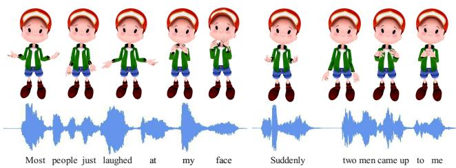
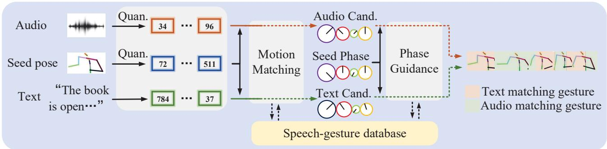
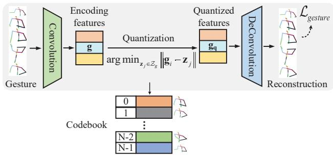
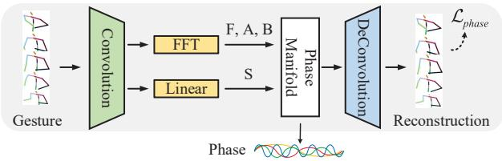
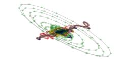
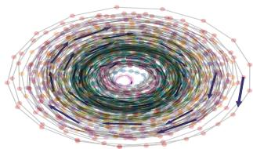
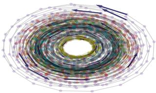
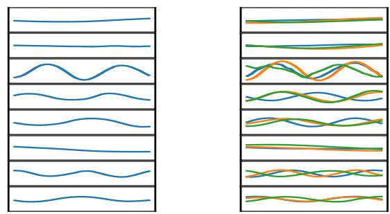
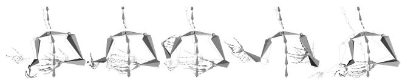
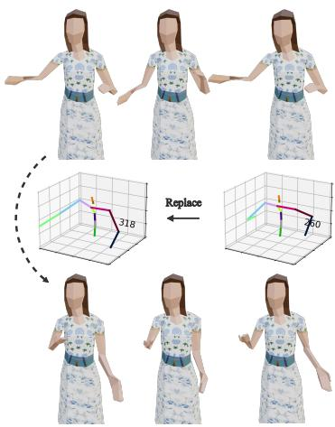

# QPGesture: Quantization-Based and Phase-Guided Motion Matching for Natural Speech-Driven Gesture Generation

Sicheng Yang1 Zhiyong WuB,1,4 Minglei Li2 Zhensong Zhang3 Lei Hao3 Weihong Bao1 Haolin Zhuang1

1 Tsinghua University 2 Huawei Cloud Computing Technologies Co., Ltd 3 Huawei Noah’s Ark Lab 4 The Chinese University of Hong Kong

{yangsc21, bwh21, zhuanghl21}@mails.tsinghua.edu.cn zywu@sz.tsinghua.edu.cn {liminglei29, zhangzhensong, haolei5}@huawei.com

## Abstract

Speech-driven gesture generation is highly challenging due to the random jitters of human motion. In addition, there is an inherent asynchronous relationship between human speech and gestures. To tackle these challenges, we introduce a novel quantization-based and phase-guided motion matching framework. Specifically, we first present a gesture VQ-VAE module to learn a codebook to summarize meaningful gesture units. With each code representing a unique gesture, random jittering problems are alleviated effectively. We then use Levenshtein distance to align diverse gestures with different speech. Levenshtein distance based on audio quantization as a similarity metric of corresponding speech of gestures helps match more appropriate gestures with speech, and solves the alignment problem of speech and gestures well. Moreover, we introduce phase to guide the optimal gesture matching based on the semantics ofcontext or rhythm ofaudio. Phase guides when text-based or speech-based gestures should be performed to make the generated gestures more natural. Extensive experiments show that our method outperforms recent approaches on speech-driven gesture generation. Our code, database, pre-trained models and demos are available at https://github.com/YoungSeng/QPGesture.

## 1. Introduction

Nonverbal behavior plays a key role in conveying messages in human communication [26], including facial expressions, hand gestures and body gestures. Co-speech gesture helps better self-expression [45]. However, producing human-like and speech-appropriate gestures is still very difficult due to two main challenges: 1) Random jittering: People make many small jitters and movements when they speak, which can lead to a decrease in the quality of the generated gestures. 2) Inherent asynchronicity with speech: Unlike speech with face or lips, there is an inherent asynchronous relationship between human speech and gestures.

  
Figure 1. Gesture examples generated by our proposed method on various types of speech. The character is from Mixamo [2].

Most existing gesture generation studies intend to solve the two challenges in a single ingeniously designed neural network that directly maps speech to 3D joint sequence in high-dimensional continuous space [18, 24, 27, 31] using a sliding window with a fixed step size [17, 46, 47]. However, such methods are limited by the representation power of proposed neural networks, like the GENEA gesturegeneration challenge results. No system in GENEA challenge 2020 [26] rated above a bottom line that paired the input speech audio with mismatched excerpts of training data motion. In GENEA challenge 2022 [48], a motion matching based method [50] ranked first in the human-likeness evaluation and upper-body appropriateness evaluation, and outperformed all other neural network-based models. These results indicate that motion matching based models, if designed properly, are more effective than neural network based models.

Inspired by this observation, in this work, we propose a novel quantization-based motion matching framework for audio-driven gesture generation. Our framework includes two main components aiming at solving the two above challenges, respectively. First, to address the random jittering challenge, we compress human gestures into a space that is lower dimensional and discrete, to reduce input redundancy. Instead of manually indicating the gesture units [23], we use a vector quantized variational autoencoder (VQ-VAE) [42] to encode and quantize joint sequences to a codebook in an unsupervised manner, using a quantization bottleneck. Each learned code is shown to represent a unique gesture pose. By reconstructing the discrete gestures, some random jittering problems such as grabbing hands and pushing glasses will be solved. Second, to address the inherent asynchronicity of speech and gestures, Levenshtein distance [28] is used based on audio quantization. Levenshtein distance helps match more appropriate gestures with speech, and solves the alignment problem of speech and gestures well. Moreover, unlike the recent gesture matching models [17, 50], we also consider the semantic information of the context. Third, since the body motion is composed of multiple periodic motions spatially, meanwhile the phase values are able to describe the nonlinear periodicity of the high-dimensional motion curves well [39], we use phase to guide how the gestures should be matched to speech and text.

  
Figure 2. Gesture generation pipeline of our proposed framework. ‘Quan.’ is short for ‘quantization’ and ‘Cand.’ is short for ‘candidate’. Given a piece of audio, text and seed pose, the audio and gesture are quantized. The candidate for the speech is calculated based on the Levenshtein distance, and the candidate for the text is calculated based on the cosine similarity. The optimal gesture is selected based on phase-guidance corresponding to the seed code and the phase corresponding to the two candidates.

The inference procedure of our framework is shown in Figure 2. Given a piece of audio, text and seed pose, the audio and gesture are first quantized. The best candidate for the speech is calculated based on the Levenshtein distance, and the best candidate for the text is calculated based on the cosine similarity. Then the most optimal gesture is selected based on the phase corresponding to the seed code and the phase corresponding to the two candidates. Our code, database, pre-trained models and demos will be publicly available soon.

The main contributions of our work are:

• We present a novel quantization-based motion matching framework for speech-driven gesture generation.

• We propose to align diverse gestures with different speech using Levenshtein distance, based on audio quantization.

• We design a phase guidance strategy to select optimal audio and text candidates for motion matching.

• Extensive experiments show that jittering and asynchronicity issues can be effectively alleviated by our framework.

## 2. Related Work

End-to-end Co-speech Gesture Generation. Gesture generation is a complex problem that requires understanding speech, gestures, and their relationships. Data-driven approaches attempt to learn gesticulation skills from human demonstrations. The present studies mainly consider four modalities: text [6,43,47], audio [15,18,24,29,36], gesture motion, and speaker identity [4, 5, 9, 31, 32, 44, 46]. Habibie et al. [18] propose the first approach to jointly synthesize both the synchronous 3D conversational body and hand gestures, as well as 3D face and head animations. Ginosar et al. [15] propose a cross-modal translation method based on the speech-driven gesture gestures of a single speaker. Liu et al. [32] propose a hierarchical audio learner extracts audio representations across semantic granularities and a hierarchical pose inferior renders the entire human pose. Kucherenko et al. [24] propose Aud2Repr2Pose architecture to evaluate the impact of different gesture and speech representations on gesture generation. Qian et al. [36] use conditional learning to resolve the ambiguity of co-speech gesture synthesis by learning the template vector to improve gesture quality.

As for learning individual styles, Yoon et al. [46] propose the first end-to-end method for generating co-speech gestures using the tri-modality of text, audio and speaker identity. Ahuja et al. [4] train a single model for multiple speakers while learning style embeddings for gestures of each speaker. Alexanderson et al. [5] adapt MoGlow to speech-driven gesture synthesis and added a framework for high-level control the gesturing style. Liang et al. [30] propose a semantic energized generation method for semanticaware gesture generation. Li et al. [29] propose a conditional variational autoencoder that models one-to-many audio-to-motion mapping by splitting the cross-modal latent code into shared code and motion-specific code.

  
Figure 3. Structure of gesture VQ-VAE. After learning the discrete latent representation of human gesture, the gesture VQ-VAE encode and summarize meaningful gesture units, and reconstruct the target gesture sequence from quantized latent features.

Michael et al. [10] propose motion matching, which is a k-Nearest Neighbor (KNN) search method for searching a large database of animations. Zhou et al. [51] utilize a graph-based framework to synthesize body motions for conversations. Ferstl et al. [14] predict expressive gestures based on database matching. Habibie et al. [17] predicted motion using a KNN algorithm and use a conditional generative adversarial network to refine the result. Zhou et al. [50] calculate rhythm signature and style signature using StyleGestures [5], and synthesized graph-based matching gesture. Recently, a large-scale 3D gestures dataset BEAT [31] is built from multi-camera videos based on six modalities of data, which we used in this task.

Quantization-based Pose representation. Kipp has represented gestures as predefined unit gestures [23]. Van et al. [42] propose Vector VQ-VAE to generate discrete representations. Guo et al. [16] use motion tokens to generate human full-body motions from texts, and their reciprocal task. Lucas et al. [34] propose to train a GPT-like model for next-index prediction in that space. Hong et al. [21] use a pose codebook created by clustering to generate diverse poses. Li et al. [38] propose to pose VQ-VAE to encode and summarize dancing units. Existing studies have shown that quantification helps to reduce motion freezing during motion generation and retains the details of motion well [7].

In our work, we encode and quantize meaningful gesture constituents and generate human-like gestures by speech based motion matching with phase guidance.

## 3. Our Approach

Our approach takes a piece of audio, corresponding text, seed pose and optionally a sequence of control signals as inputs, and outputs a sequence of gesture motion. We first prepossess these inputs as well as the motion database into their quantized discrete forms automatically. We then find the best candidate for the speech and the best candidate for the text, respectively. Finally, we select the optimal gestures based on the phase corresponding to the seed code and the phase corresponding to the two candidates. The rest of this section describes the details of each step.

## 3.1. Learning a discrete latent space representation

Gesture Quantization. We design a pose VQ-VAE as shown in Figure 3. Given the gesture sequence ${ \textbf { G } } \in$ $\mathbb { R } ^ { T \times D _ { g } }$ , where T denotes the number of gestures and $D _ { g }$ pose dimension. We first adopt a 1D temporal convolution network $E _ { g }$ to encode the joint sequence G to contextaware features $\mathbf { \bar { g } } \in \mathbb { R } ^ { T ^ { \prime } \times C }$ , where $T ^ { \prime } = T / d ,$ d is the temporal down-sampling rate, and C is the channel dimension of features. This process could be written as $\mathbf { g } = E _ { g } ( \mathbf { G } )$ Codebook could index an embedding table with samples drawn from the distributions [42]. To learn the corresponding codebook ${ \mathcal { Z } } _ { g }$ elements $\mathbf { g _ { q } } \in \mathbb { R } ^ { T ^ { ' } \times C }$ , where ${ \bf g } _ { q } \in \mathcal { Z } _ { g } ^ { T }$ $\mathcal { Z } _ { g }$ is a set of $C _ { b }$ codes of dimension $n _ { z } .$ , we quantize g by mapping each temporal feature $\mathbf { g } _ { i }$ to its closest codebook element $z _ { j }$ as $\mathbf { q } ( . )$

$$
\mathbf { g _ { q , } } _ { i } = \mathbf { q } ( \mathbf { g } ) = \arg \operatorname* { m i n } _ { \mathbf { z } _ { j } \in \mathcal { Z } _ { g } } \| \mathbf { g } _ { i } - \mathbf { z } _ { j } \|\tag{1}
$$

A following de-convolutional decoder $D _ { g }$ projects $\mathbf { g _ { q } }$ back to the motion space as a pose sequence $\hat { \mathbf { G } } _ { 1 }$ , which can be formulated as

$$
\hat { \mathbf { G } } _ { 1 } = D _ { g } \left( \mathbf { g } _ { q } \right) = D _ { g } ( \mathbf { q } ( E _ { g } ( \mathbf { G } ) ) )\tag{2}
$$

Thus the encoder, decoder and codebook can be trained by optimizing:

$$
\begin{array} { r } { \mathcal { L } _ { g e s t u r e ( E _ { g } , D _ { g } , \mathcal { Z } _ { g } ) } = \mathcal { L } _ { r e c } ( \hat { \mathbf { G } } _ { 1 } , \mathbf { G } ) + \| \mathrm { s g } [ \mathbf { g } ] - \mathbf { g _ { q } } \| } \\ { + \beta \left\| \mathbf { g } - \mathrm { s g } \left[ \mathbf { g _ { q } } \right] \right\| } \end{array}\tag{3}
$$

where $\mathcal { L } _ { r e c }$ is the reconstruction loss that constrains the predicted joint sequence to ground truth, $\mathrm { s g } [ \cdot ]$ denotes the stopgradient operation, and the term $\| \mathbf { g } - \mathrm { s g } \left[ \mathbf { g _ { q } } \right] \|$ is the “commitment loss” with weighting factor β [42].

Inspired by Bailando [38], a music-driven dance model, we add velocity loss and acceleration loss to the reconstruction loss to prevent jitters in generated gesture:

$$
\begin{array} { r } { \mathcal { L } _ { r e c } ( \hat { \mathbf { G } _ { 1 } } , \mathbf { G } _ { 1 } ) = \| \hat { \mathbf { G } _ { 1 } } - \mathbf { G } _ { 1 } \| _ { 1 } + \alpha _ { 1 } \left\| \hat { \mathbf { G } _ { 1 } } ^ { \prime } - \mathbf { G } _ { 1 } ^ { \prime } \right\| _ { 1 } } \\ { + \alpha _ { 2 } \left\| \hat { \mathbf { G } _ { 1 } } ^ { \prime \prime } - \mathbf { G } _ { 1 } ^ { \prime \prime } \right\| _ { 1 } } \end{array}\tag{4}
$$

And to avoid encoding confusion caused by the global shift of joints, we normalize the absolute locations of input G i.e., set the root joints (hips) to 0, and make objects face the same direction. Standard normalization (zero mean and unit variant) is applied to all joints.

Audio Quantization. We use vq-wav2vec Gumbel-Softmax model [8] pre-trained on a clean 100h subset of Librispeech [35] which is discretized to 102.4K tokens. We multiply the values of the two groups together as the token of the segment of audio. The convolutional encoder produces a representation z, for each time step i, the quantization module replaces the original representation z by $\hat { \textbf { z } } = \mathbf { a } _ { \mathbf { q } , i }$ from $\mathcal { Z } _ { a } .$ , which contains a set of $C _ { b } ^ { ' }$ codes of dimension $n _ { z } ^ { ' }$

## 3.2. Motion Matching based on Audio and Text

Our motion matching algorithm takes a discrete text sequence $\mathbf { t } = [ \mathbf { t } _ { 0 } , \mathbf { t } _ { 1 } , \dots , \mathbf { t } _ { T ^ { \prime } - 1 } ]$ , a discrete audio sequence $\mathbf { a _ { q } } ~ = ~ [ \mathbf { a _ { q , 0 } } , \mathbf { a _ { q , 1 } } , \dots , \mathbf { a _ { q , T ^ { \prime } - 1 } } ]$ , and one initial previous pose code $\mathbf { g } _ { - 1 }$ , and optionally a sequence of control masks $\mathbf { M } = [ \mathbf { m } _ { 0 } , \mathbf { m } _ { 1 } , \dots , \mathbf { m } _ { T ^ { \prime } - 1 } ]$ . The outputs are audio-based candidate $\mathbf { C } _ { a } ~ = ~ [ \mathbf { c } _ { 0 , a } , \mathbf { c } _ { 1 , a } , \ldots , \mathbf { c } _ { T ^ { \prime } - 1 , a } ]$ and text-based candidate $\mathbf { C } _ { t } ~ = ~ [ \mathbf { c } _ { 0 , t } , \mathbf { c } _ { 1 , t } , \ldots , \mathbf { c } _ { T ^ { \prime } - 1 , t } ] .$ $T ^ { \prime }$ denotes the number of speech segments during inference.

Considering too long gesture clips time decreases the diversity of gestures and too short gesture clips time results in poor human likeness [50], we split each gesture motion in the dataset into clip-level gesture clips automatically by time interval of words larger than 0.5 seconds in text transcriptions. These clip-level data form the speech-gesture database in Figure 1.

To find the appropriate output gesture sequence ${ \bf C } _ { a }$ and $\mathbf { C } _ { t }$ from the database, we consider both the similarity with respect to the current test speech as well as the previously searched pose code $\mathbf { g } _ { - 1 }$ for every T frame interval for better continuity between consecutive syntheses, as in [46]. During each iteration, we first compare the Euclidean distance between the joints corresponding to initial code $\mathbf { g } _ { - 1 }$ and the joints corresponding to each code $\mathbf { g _ { q } }$ in the codebook to get the pose-based pre-candidate $\hat { \mathbf { C } } _ { g } = \left\{ \hat { \mathbf { C } } _ { g } ^ { 0 } , \hat { \mathbf { C } } _ { g } ^ { 1 } , \hat { \mathbf { \Xi } } _ { g } . . . , \hat { \mathbf { C } } _ { g } ^ { C _ { b } } \right\}$ In the first iteration, the previous pose code $\mathbf { g } _ { - 1 }$ is initialized by either randomly sampling a code from codebook ${ \mathcal { Z } } _ { g }$ or set to be the code with the most frequent occurrences in the codebook (the code of mean pose).

Audio-based Search. To encode information about the relevant past and future codes, we use a searchcentered window (0.5 seconds long) as a feature for the current time, then we get audio features sequence $\mathrm { ~ \bf ~ F ~ } _ { a } = $ $[ \mathbf { F } _ { a , 0 } , \mathbf { F } _ { a , 1 } , \dots , F _ { a , T ^ { \prime } - 1 } ]$ . To address the inherent asynchronicity of speech and gestures, Levenshtein distance [28] is used to measure the similarity of the test audio by comparing the current test audio feature with the audio feature of clips from the database. For every clip in the database, we calculate the audio feature similarity of the corresponding code per d frame and take the minimum value as the audio candidate distance for each code. Then we get audiobased pre-candidate $\hat { \bf C } _ { a } ~ = ~ \left\{ \hat { \bf C } _ { a } ^ { 0 } , \hat { \bf C } _ { a } ^ { 1 } , \ldots , \hat { \bf C } _ { a } ^ { C _ { b } } \right\}$ Levenshtein distance as a similarity metric of corresponding speech of gestures helps match more appropriate gestures with speech, and solves the alignment problem of speech and gestures well (see Section 4.2).

  
Figure 4. Architecture of the Periodic Autoencoder Network. The convolutional network encoder learns a lower dimensional embedding of the gesture. Then differentiable real Fast Fourier Transform (FFT) and fully connected network is applied to get periodic parameters: amplitude $( \mathbf { A } ) .$ , frequency (F), offset (B) and phase shift (S). The deconvolutional network decoder map all periodic parameters back to the original motion curves to force the periodic parameters to reconstruct the original latent embedding.

Text-based Search. Similarly, we use the text before and after 0.5 seconds as the sentence of the current code. To obtain the semantic information of the context, we use Sentence-BERT [37] to compute sentence embeddings, as text features sequence $\mathbf { F } _ { t }$ . For every clip in the database, we calculate the text features cosine similarity of the corresponding code per d frame and take the minimum value as the text candidate distance for each code. Then text-based pre-candidate is $\hat { \mathbf { C } } _ { t } = \left\{ \hat { \mathbf { C } } _ { t } ^ { 0 } , \hat { \mathbf { C } } _ { t } ^ { 1 } , \hdots , \hat { \mathbf { C } } _ { t } ^ { C _ { b } } \right\}$

Instead of weighting the similarity score of audio/text and pose terms, we add pose similarity ranks and audio/text similarity ranks for every pre-candidate to select the lowest rank [17] result as the audio/text candidate. The generated gesture will be discontinuous if only speech (audio and text) matching is considered, so as shown in the figure 2, we first compute the pre-candidates of pose, audio, and text, then compute audio candidate $\mathbf { C } _ { a }$ based on $\hat { \mathbf { C } } _ { g }$ and $\hat { \mathbf { C } } _ { a }$ , and text candidate $\mathbf { C } _ { t }$ based on $\hat { \mathbf { C } } _ { g }$ and $\hat { \mathbf { C } } _ { t }$ . Then we select the final gesture from ${ \bf C } _ { a }$ and $\mathbf { C } _ { t }$ according to the phase guide.

## 3.3. Phase-Guided Gesture Generation

To transform the motion space into a learned phase manifold, we utilize a temporal periodic autoencoder architecture structure similar to DeepPhase [39]. The architecture is shown in figure 4. First, we adopt a 1D temporal convolution network $E _ { p }$ to a latent space of the motion G, which can be formulated as

$$
\mathbf { L } = E _ { p } ( \mathbf { G } )\tag{5}
$$

where $\mathbf { L } \in \mathbb { R } ^ { T \times M }$ , M is the number of latent channels, that is, the number of desired phase channels to be extracted from the motion. For each channel, our goal is to extract a good phase offset to capture its current point as part of a larger cycle.

It is complicated to calculate the phase of a cluttered curve directly, so we calculate periodic parameters amplitude (A), frequency (F), offset (B) and phase shift (S) first. We apply differentiable real Fast Fourier Transform (FFT) to each channel of L and create the zero-indexed matrix of Fourier coefficients $\begin{array} { r } { \mathbf { c } \in \mathbb { C } ^ { M \times K + 1 } , K = \left\lfloor \frac { T } { 2 } \right\rfloor } \end{array}$ , written as ${ \bf c } = F F T ( { \bf L } )$ . Power spectrum $\mathbf { p } \in \mathbb { R } ^ { M \times \mathbf { \bar { K } } + 1 }$ for each channel is $\begin{array} { r } { { \bf p } _ { i , j } = \frac { 2 } { T } \left| { \bf c } _ { i , j } \right| ^ { 2 } } \end{array}$ , where i is the channel index and $j$ is the index for the frequency bands. Assumed that there are $T$ points in a time window of N seconds. The periodic parameters are computed by:

$$
\mathbf { A } _ { i } = \sqrt { \frac { 2 } { T } \sum _ { j = 1 } ^ { K } \mathbf { p } _ { i , j } } , \quad \mathbf { F } _ { i } = \frac { \sum _ { j = 1 } ^ { K } \left( \mathbf { f } _ { j } \cdot \mathbf { p } _ { i , j } \right) } { \sum _ { j = 1 } ^ { K } \mathbf { p } _ { i , j } } , \quad \mathbf { B } _ { i } = \frac { \mathbf { c } _ { i , 0 } } { T } ,\tag{6}
$$

where $\mathbf { f } = ( 0 , 1 / N , 2 / N , \dots , K / N )$ is frequencies vector.

Phase shift $\mathbf { S } \in \mathbb { R } ^ { M }$ for each latent curve $\mathbf { S } _ { i }$ can be predicted by a fully connected layer $F C$ , which can be formulated as:

$$
\left( s _ { x } , s _ { y } \right) = F C \left( \mathbf { L } _ { i } \right) , \quad \mathbf { S } _ { i } = \mathrm { a t a n 2 } \left( s _ { y } , s _ { x } \right)\tag{7}
$$

For each temporal motion G, within a centered time window $\begin{array} { r l r } { \mathcal { T } } & { { } = } & { \left\lceil - \frac { t _ { 1 } - t _ { 0 } } { 2 } , - \frac { t _ { 1 } - t _ { 0 } } { 2 } + \frac { t _ { 1 } - t _ { 0 } } { N - 1 } , \dots , \frac { t _ { 1 } - t _ { 0 } } { 2 } \right\rceil } \end{array}$ , where $t _ { 0 } \leq t \leq t _ { 1 }$ , the decoder $D _ { p }$ takes all periodic parameters as its input, and maps back to the original motion curves:

$$
{ \hat { \mathbf { L } } } = f ( T ; \mathbf { A } , \mathbf { F } , \mathbf { B } , \mathbf { S } ) = \mathbf { A } \cdot \sin ( 2 \pi \cdot ( \mathbf { F } \cdot { T } - \mathbf { S } ) ) + \mathbf { B }\tag{8}
$$

$$
\hat { \mathbf { G } } _ { 2 } = h ( \hat { \mathbf { L } } )\tag{9}
$$

The network is learned with the periodic parameters via the following loss function, which forces the periodic parameters to reconstruct the original latent embedding L.

$$
\mathcal { L } _ { p h a s e } = \mathcal { L } _ { p h a s e - r e c o n } ( \mathbf { G } , \hat { \mathbf { G } } _ { 2 } )\tag{10}
$$

After training, phase manifold $\mathcal { P }$ of a sample motion which captures a lot of “information” about the current state of the original time series data is

$$
\mathcal { P } _ { 2 i - 1 } ^ { ( t ) } = \mathrm { A } _ { i } ^ { ( t ) } { \cdot } \mathrm { s i n } \left( 2 \pi \cdot \mathrm { S } _ { i } ^ { ( t ) } \right) , \quad \mathcal { P } _ { 2 i } ^ { ( t ) } = \mathrm { A } _ { i } ^ { ( t ) } { \cdot } \mathrm { c o s } \left( 2 \pi \cdot \mathrm { S } _ { i } ^ { ( t ) } \right)
$$

where $\mathcal { P } \in \mathbb { R } ^ { 2 M }$

(11)

We visualize the phase features and the velocity features in Figure 5. The Principle Components (PCs) of the original joint rotational velocities, replacing the phase layers with fully connected layers and phase features are projected onto a 2D plane. It can be observed that the phase manifold has a consistent structure similar to polar coordinates. The cycles represent the primary period of the individual motions, where the timing is represented by the angle around the center, and the amplitude is the velocity of the motion. Samples smoothly transition between cycles of different amplitude or frequency, which indicate the transition between movements.

  
(a) Rotational velocity space.

(b) Latent space learned by convolutional and fully connected.  
  
(c) Phase space.  
Figure 5. 2D PCA embedding of feature distributions for different motion domains. Each color represents gestures from a single motion clip that are temporally connected, which means that neighboring frames in the motion data should be closely connected in the embedding

The phase manifold of the motion curve is shown in Figure 6. Instead of using phase to set network weights as in [20, 40, 49] to generate motion, we use phase guidance to select motion. To find the appropriate motion alignments, we calculate the cosine similarity of the latter frames $N _ { s t r i d }$ of the manifold phase $\mathcal { P } _ { - 1 }$ corresponding to the frame of the initial code and the first frames of the manifold phase $\mathcal { P } _ { a / t }$ corresponding to the audio/text candidate ${ \bf C } _ { a }$ and $\mathbf { C } _ { t }$ within $N _ { p h a s e }$ frames, which can be written as conca $\cdot [ \mathcal { P } _ { - 1 } ^ { [ ( N _ { s t r i d } - N _ { p h a s e } ) : ] } , \mathcal { P } _ { a / t } ^ { [ N _ { s t r i d } : ] } ]$ and conca $\cdot [ \mathcal { P } _ { - 1 } ^ { [ - N _ { s t r i d } : ] } , \mathcal { P } _ { a / t } ^ { [ ( N _ { p h a s e } - N _ { s t r i d } ) : ] } ] .$ Candidates with more similar phase manifolds will also have more natural motion as the final matching gestures. Please refer to the supplements for the pseudo-code of our algorithm.

## 4. Experiments

Dataset. We perform the training and evaluation on the BEAT dataset proposed in [31], which to our best knowledge is the largest publicly available motion capture dataset for human gesture generation. We divided the data into 8:1:1 by training, validation, and testing, and trained codebooks and baselines using data from all speakers. Because motion matching is more time-consuming, we selected 4 hours of data from two speakers “wayne” (male speaker) and “kieks” (female speaker), and constructed separate databases for our experiments.

  
(a) The phase manifold of the seed (b) The phase manifold of the candi code to be matched. date to be matched.  
Figure 6. Sinusoidal diagram of learned phase manifold within a sliding window. The blue lines in (a) and (b) indicate the ground truth results, and the orange and green lines indicate the candidates to be matched, i.e., audio candidate $\mathbf { C } _ { a }$ and text candidate $\mathbf { C } _ { t }$

Implementation Details. In this work, we use 15 joints corresponding to the upper body without hands or fingers. $3 \times 3$ rotation matrix features are computed as gesture sequences, with pose dimension $D _ { g }$ is 9. Down-sampling rate d is 8. The size $C _ { b }$ of codebook ${ \mathcal { Z } } _ { g }$ is set to 512 with dimension $n _ { z }$ is 512. While training the gesture VQ-VAE, gesture data are cropped to a length of $T = 2 4 0$ (4 seconds), using the ADAM [22] optimizer (learning rate is e-4, $\beta _ { 1 } = 0 . 5$ $\beta _ { 2 } = 0 . 9 8 )$ with a batch size of 128 for 200 epochs. We set $\beta = 0 . 1$ for Equation (3) and $\alpha _ { 1 } = 1 , \alpha _ { 2 } = 1$ for Equation (4). In terms of motion matching, the window lengths for audio and text are 4 pose codes corresponding to each of the past and future speech information, with d=32. As for phase guidance, we use the rotational velocity as input to the network. We train the network using the AdamW [33] optimizer for 100 epochs, using a learning rate and weight decay both of $1 0 ^ { - 4 }$ and a batch size of 128. The number of phase channels M is set to 8. To calculate the phase similarity, the number of frames is set to $N _ { p h a s e } = 8$ and $N _ { s t r i d e } = 3$ . The whole framework is learned in less than one day on one NVIDIA A100 GPU. The initial pose code is generated by randomly sampling a code from the codebook ${ \mathcal { Z } } _ { g }$

Evaluation Metrics. The distance between speed histograms is used to evaluate gesture quality. We calculate speed-distribution histograms and compare to the speed distribution of natural motion by computing the Hellinger distance [25], $\begin{array} { r } { H \left( \pmb { h } ^ { ( 1 ) } , \pmb { h } ^ { ( 2 ) } \right) = \sqrt { 1 - \sum _ { i } \sqrt { h _ { i } ^ { ( 1 ) } \cdot h _ { i } ^ { ( 2 ) } } } } \end{array}$ between the histograms $\mathbf { \delta } _ { h } ( 1 )$ and $\boldsymbol { h } ^ { ( 2 ) }$ . The Frechet gesture´ distance (FGD) [46] on feature space is proposed as a metric to quantify the quality of the generated gestures. This metric is based on the FID [19] metric used in image generation studies. Similarly, we calculate FGD on raw data space used in [3]. To compute the FGD, we trained an autoencoder using the Trinity dataset [13]. Lower Hellinger distance and FGD are better. We also report average jerk, average acceleration, Canonical correlation analysis (CCA), Diversity, and Beat Align Score in the supplements.

## 4.1. Comparison to Existing Methods

We compare our proposed framework with End2End [47] (Text-based), Trimodal [46] (Text, audio and identity, flow-based), StyleGestures [5] (Audio-based), KNN [17] (Audio, motion matching-based) and CaMN [31] (Multimodal-based). The quantitative results are shown in Table 1. According to the comparison, our proposed model consistently performs favorably against all the other existing methods on all evaluations. Specifically, on the metric of Hellinger distance average, we achieve the same good results as StyleGestures. Since well-trained models should produce motion with similar properties to a specific speaker, our method has a similar motion-speed profile for any given joint. And our method improves 15.921 (44%) and 3837.068 (39%) than the best compared baseline model StyleGestures on FGD on feature space and FGD on raw data space.

User Study. To further understand the real visual performance of our method, we conduct a user study among the gesture sequences generated by each compared method and the ground truth data. Following the evaluation in GE-NEA [5], for each method, from the 30-minute test set we selected 38 short segments of test speech and corresponding test motion to be used in the evaluations. Segments are around 8 to 15 seconds long, and ideally not shorter than 6 seconds. The experiment is conducted with 23 participants separately. The generated gesture data is visualized on an avatar via Blender [1] rendering. For human-likeness evaluation, each evaluation page asked participants “How human-like does the gesture motion appear?” In terms of appropriateness evaluation, each evaluation page asked participants “How appropriate are the gestures for the speech?” Each page presented six videos to be rated on a scale from 5 to 1 with 1-point intervals with labels (from best to worst) “Excellent”, “Good”, “Fair”, “Poor”, and “Bad”. The mean opinion scores (MOS) on human-likeness and appropriateness are reported in the last two columns in Table 1.

Our method significantly surpasses the compared stateof-the-art methods with both human-likeness and appropriateness, and even above the ground truth (GT) in human-

Table 1. Quantitative results on test set. Bold indicates the best metric. Among compared methods, End2End [47], Trimodal [46], StyleGestures [5], KNN [17] and CaMN [31] are reproduced using officially released code with some optimized settings. For more details please refer to the supplementary material. Objective evaluation is recomputed using the officially updated evaluation code [41]. Humanlikeness and appropriateness are results of MOS with 95% confidence intervals.
<table><tr><td rowspan="2">Name</td><td colspan="3">Objective evaluation</td><td colspan="2">Subjective evaluation</td></tr><tr><td>Hellinger → distance average</td><td>FGD on feature space</td><td>FGD on raw → data space</td><td>Human-likeness</td><td>Appropriateness</td></tr><tr><td>Ground Truth (GT)</td><td>0.0</td><td>0.0</td><td>0.0</td><td> ${ \overline { { 3 . 7 9 \pm 0 . 1 9 } } }$ </td><td> $\overline { { 3 . 6 2 \pm 0 . 2 1 } }$ </td></tr><tr><td>End2End [47]</td><td>0.146</td><td>64.990</td><td>16739.978</td><td> $3 . 6 4 \pm 0 . 1 1$ </td><td> $3 . 2 3 \pm 0 . 1 4$ </td></tr><tr><td>Trimodal [46]</td><td>0.155</td><td>48.322</td><td>12869.98</td><td> $3 . 3 1 \pm 0 . 1 7$ </td><td> $3 . 2 0 \pm 0 . 1 9$ </td></tr><tr><td>StyleGestures [5]</td><td>0.136</td><td>35.842</td><td>9846.927</td><td> $3 . 6 6 \pm 0 . 0 8$ </td><td> $3 . 3 0 \pm 0 . 1 1$ </td></tr><tr><td>KNN [17]</td><td>0.364</td><td>43.030</td><td>12470.061</td><td> $2 . 3 8 \pm 0 . 1 0$ </td><td> $2 . 3 5 \pm 0 . 1 3$ </td></tr><tr><td>CaMN [31]</td><td>0.149</td><td>52.496</td><td>10549.455</td><td> $3 . 6 5 \pm 0 . 1 6$ </td><td> $3 . 2 9 \pm 0 . 1 5$ </td></tr><tr><td>Ours</td><td>0.136</td><td>19.921</td><td>5742.281</td><td> ${ \bf 4 . 0 0 \pm 0 . 1 4 }$ </td><td> ${ \bf 3 . 6 6 \pm 0 . 2 3 }$ </td></tr></table>

Table 2. Ablation studies results. ‘w/o’ is short for ‘without’. Bold indicates the best metric.
<table><tr><td rowspan="2">Name</td><td colspan="3">Objective evaluation</td><td colspan="2">Subjective evaluation</td></tr><tr><td>Hellinger distance average</td><td>FGD on ↓ feature space</td><td>FGD on raw Y data space</td><td>Human-likeness</td><td>Appropriateness</td></tr><tr><td>w/o wavvq + WavLM</td><td>0.151</td><td>19.943</td><td>6009.859</td><td> $\overline { { 3 . 8 7 \pm 0 . 2 1 } }$ </td><td> $\overline { { 3 . 6 4 \pm 0 . 2 1 } }$ </td></tr><tr><td>w/o audio</td><td>0.134</td><td>20.401</td><td>5871.044</td><td> $3 . 8 7 \pm 0 . 2 1$ </td><td> $3 . 6 3 \pm 0 . 2 0$ </td></tr><tr><td>w/o text</td><td>0.118</td><td>23.929</td><td>6389.866</td><td> $3 . 5 7 \pm 0 . 2 9$ </td><td> $3 . 4 1 \pm 0 . 2 3$ </td></tr><tr><td>w/o phase</td><td>0.138</td><td>19.195</td><td>5759.167</td><td> $3 . 9 0 \pm 0 . 1 1$ </td><td> $3 . 6 5 \pm 0 . 1 7$ </td></tr><tr><td>w/o motion matching (GRU + codebook)</td><td>0.140</td><td>30.404</td><td>11642.641</td><td> $3 . 7 8 \pm 0 . 1 4$ </td><td> $3 . 4 3 \pm 0 . 1 6$ </td></tr><tr><td>Ours</td><td>0.136</td><td>19.921</td><td>5742.281</td><td> ${ \bf 4 . 0 7 \pm 0 . 1 5 }$ </td><td> ${ \bf 3 . 7 7 \pm 0 . 2 1 }$ </td></tr></table>

Supported by the results in Table 2, when we do not use vq-wav2vec or Levenshtein distance to measure the similarity of corresponding speech of gestures, but use WavLM [11] pre-trained on Librispeech and cosine similarity instead, the performances of all metrics have deteriorated. The change of FGD on feature space was not significant.

We explore the effectiveness of the following components: (1) Levenshtein distance, (2) audio modality, (3) text modality, (4) phase guidance, (5) motion matching. We performed the experiments on each of the five components, respectively.

likeness and appropriateness. However, there is no significant difference compared to the appropriateness of GT. According to the feedback from participants, our generated gesture is more “related to the semantics” with “more natural”, while our method “lacking power and exaggerated gestures” compared to GT. More details regarding the user study are shown in the supplementary material.

Moreover, we conduct ablation studies to address the performance effects of different components in the framework. The results of our ablations studies are summarized in Table 2. The visual comparisons of this study can be also referred to the supplementary video.

## 4.2. Ablation Studies

  
Figure 7. Comparison of gestures blended with and without phase guidance. Black shading indicates no phase guidance.

The Hellinger distance average and FGD on raw data space deteriorated by 0.015 (11%), and 267.578 (4.7%), respectively. When the model is trained without audio, we select two candidates for text-based motion matching instead of one, and then synthesize the gesture based on phase guidance. The FGD on feature space and FGD on raw data space deteriorated by 0.48 (2%) and 128.763 (2%), respectively. When the model is trained without text, similarly, two candidates for audio-based motion matching are selected instead of one. The FGD on feature space and FGD on raw data space deteriorated by 4.008 (20%) and 647.585 (11%), respectively. Notice that when one of the modalities of both text and speech is not used, the FGD metric increases while the Hellinger distance average metric decreases, which indicates that the quality of the gestures generated when only one modality is used decreases, but the distribution of the velocity becomes better. When the phase guidance is removed, we select one candidate every time between two candidates using the distance in the rotational velocity space (Not randomly select one candidate). The results showed a slight increase in Hellinger distance average and FGD on raw data space and a slight decrease in FGD on feature space, but none of the changes were significant. One possible explanation is that the phase space loses information from the original feature space to generate more natural actions, as shown in Figure 7. When the model is trained using deep gated recurrent unit (GRU) [12] to learn pose code instead of motion matching, The FGD on feature space and FGD on raw data space deteriorated by 10.483 (53%) and 6460.202 (107%), respectively. This demonstrates the advantage of the matching model over the generative model. Further, this model has a comparable performance with baselines, which also proves the efficiency of the codebook encoded gesture space.

User Study. Similarly, we conduct a user study of ablation studies. We use the same approach as in Section 4.1, with the difference that we use another avatar character to test the robustness of the results. The MOS on human-likeness and appropriateness are shown in the last two columns in Table 2. The score of our proposed framework is similar to the previous one, which will be a bit higher, indicating that even if the generated results are the same, the rating may be related to the visual perception of different character. However, there was no significant change. The results demonstrate that the final performance of the model decrease without any module. Notice that the score without text decreases more than the score without audio, indicating that the matched gestures are mostly semantically related. Not using phase space has the least effect on the results, which is consistent with expectations, since phase only provides guidance. Another significant result is that the results without audio and using audio without Levenshtein distance or audio quantization are close, which effectively indicates the effectiveness of Levenshtein distance. Furthermore, the results without model matching has a comparable performance in terms of naturalness with GT, the effectiveness of the codebook encoded gesture unit was also confirmed.

## 4.3. Controllability

Since we use motion matching to generate gestures, it is easy to control the gesture or take out the code for interpretation. For example, to generate a sequence of body gestures where the left wrist is always above a specified threshold r, the search can be restricted to consider only codes corresponding to wrists above r. Here is an example. The most frequent gesture in the database of “wayne” that we found, besides the average pose, is the gesture corresponding to the code ‘318’, as shown in Figure 8. This can be explained by that “wayne” is a habitual right-handed speaker. We choose a preferred left-handed code ‘260’ to replace it, and the result is shown in the figure. In practice, to produce natural gestures, it is sufficient to add the code frequency score and adjust the weights appropriately when matching. Please refer to the supplementary video for more comparisons.

  
Figure 8. Visualization of how a gesture changes when codes are changed. We replace twelve code ‘318’ in a motion sequence (240 frames, 30 codes) with code ‘260’ on a habitual right-handed speaker.

## 5. Discussion and Conclusion

In this paper, we present a quantization-based and phaseguided motion matching framework for speech-driven gesture generation. Specifically, we address the random jittering issue by using discrete representation that encodes human gestures. Besides, we tackle the inherent asynchronicity of speech and gestures and flexibility of the current motion matching models by Levenshtein distance based on audio quantization. Then, phase-guided audio-based or textbased candidates are used as the final result. Experiments on the standard benchmark (i.e., BEAT dataset) along with user studies show that proposed framework achieves stateof-the-art performance both qualitatively and quantitatively. There is room for improvement in this research, besides text and audio, more modalities (e.g. emotions, facial expressions) could be taken into consideration to generate more appropriate gestures.

## Acknowledgments

This work is supported by National Natural Science Foundation of China (NSFC) (62076144), Shenzhen Key Laboratory of next generation interactive media innovative technology (ZDSYS20210623092001004) and Shenzhen Science and Technology Program (WDZC20220816140515001, JCYJ20220818101014030).

## References

[1] Blender. https://www.blender.org/. 6

[2] Mixamo. https://www.mixamo.com/. 1

[3] Chaitanya Ahuja, Dong Won Lee, Ryo Ishii, and Louis-Philippe Morency. No gestures left behind: Learning relationships between spoken language and freeform gestures. In Findings of the Association for Computational Linguistics: EMNLP, volume EMNLP 2020 of Findings of ACL, pages 1884–1895, 2020. 6

[4] Chaitanya Ahuja, Dong Won Lee, Yukiko I. Nakano, and Louis-Philippe Morency. Style transfer for co-speech gesture animation: A multi-speaker conditional-mixture approach. In Computer Vision - ECCV, volume 12363 of Lecture Notes in Computer Science, pages 248–265, 2020. 2, 3

[5] Simon Alexanderson, Gustav Eje Henter, Taras Kucherenko, and Jonas Beskow. Style-controllable speech-driven gesture synthesis using normalising flows. Comput. Graph. Forum, 39(2):487–496, 2020. 2, 3, 6, 7

[6] Simon Alexanderson, Eva Sz´ ekely, Gustav Eje Henter,´ Taras Kucherenko, and Jonas Beskow. Generating coherent spontaneous speech and gesture from text. CoRR, abs/2101.05684, 2021. 2

[7] Tenglong Ao, Qingzhe Gao, Yuke Lou, Baoquan Chen, and Libin Liu. Rhythmic gesticulator: Rhythm-aware cospeech gesture synthesis with hierarchical neural embeddings. CoRR, abs/2210.01448, 2022. 3

[8] Alexei Baevski, Steffen Schneider, and Michael Auli. vqwav2vec: Self-supervised learning of discrete speech representations. In International Conference on Learning Representations, ICLR, 2020. 4

[9] Uttaran Bhattacharya, Elizabeth Childs, Nicholas Rewkowski, and Dinesh Manocha. Speech2affectivegestures: Synthesizing co-speech gestures with generative adversarial affective expression learning. In MM ’21: ACM Multimedia Conference, pages 2027–2036, 2021. 2

[10] Michael Buttner and Simon Clavet. Motion matching-the¨ road to next gen animation. Proc. of Nucl. ai, 2015(1):2, 2015. 3

[11] Sanyuan Chen, Chengyi Wang, Zhengyang Chen, Yu Wu, Shujie Liu, Zhuo Chen, Jinyu Li, Naoyuki Kanda, Takuya Yoshioka, Xiong Xiao, Jian Wu, Long Zhou, Shuo Ren, Yanmin Qian, Yao Qian, Jian Wu, Michael Zeng, Xiangzhan Yu, and Furu Wei. Wavlm: Large-scale self-supervised pretraining for full stack speech processing. IEEE J. Sel. Top. Signal Process., 16(6):1505–1518, 2022. 7

[12] Kyunghyun Cho, Bart van Merrienboer, C¸ aglar Gulc¸ehre,¨ Dzmitry Bahdanau, Fethi Bougares, Holger Schwenk, and Yoshua Bengio. Learning phrase representations using RNN encoder-decoder for statistical machine translation. In Conference on Empirical Methods in Natural Language Processing, EMNLP, A meeting of SIGDAT, a Special Interest Group of the ACL, pages 1724–1734, 2014. 8

[13] Ylva Ferstl and Rachel McDonnell. Iva: Investigating the use of recurrent motion modelling for speech gesture generation. In IVA ’18 Proceedings of the 18th International Conference on Intelligent Virtual Agents, Nov 2018. 6

[14] Ylva Ferstl, Michael Neff, and Rachel McDonnell. Expressgesture: Expressive gesture generation from speech through database matching. Comput. Animat. Virtual Worlds, 32(3- 4), 2021. 3

[15] Shiry Ginosar, Amir Bar, Gefen Kohavi, Caroline Chan, Andrew Owens, and Jitendra Malik. Learning individual styles of conversational gesture. In IEEE Conference on Computer Vision and Pattern Recognition, CVPR, pages 3497–3506, 2019. 2

[16] Chuan Guo, Xinxin Xuo, Sen Wang, and Li Cheng. TM2T: stochastic and tokenized modeling for the reciprocal generation of 3d human motions and texts. CoRR, abs/2207.01696, 2022. 3

[17] Ikhsanul Habibie, Mohamed Elgharib, Kripasindhu Sarkar, Ahsan Abdullah, Simbarashe Nyatsanga, Michael Neff, and Christian Theobalt. A motion matching-based framework for controllable gesture synthesis from speech. In SIGGRAPH ’22: Special Interest Group on Computer Graphics and Interactive Techniques Conference, pages 46:1–46:9, 2022. 1, 2, 3, 4, 6, 7

[18] Ikhsanul Habibie, Weipeng Xu, Dushyant Mehta, Lingjie Liu, Hans-Peter Seidel, Gerard Pons-Moll, Mohamed Elgharib, and Christian Theobalt. Learning speech-driven 3d conversational gestures from video. In IVA ’21: ACM International Conference on Intelligent Virtual Agents, pages 101–108, 2021. 1, 2

[19] Martin Heusel, Hubert Ramsauer, Thomas Unterthiner, Bernhard Nessler, and Sepp Hochreiter. Gans trained by a two time-scale update rule converge to a local nash equilibrium. In Advances in Neural Information Processing Systems 30: Annual Conference on Neural Information Processing Systems, pages 6626–6637, 2017. 6

[20] Daniel Holden, Taku Komura, and Jun Saito. Phasefunctioned neural networks for character control. ACM Trans. Graph., 36(4):42:1–42:13, 2017. 5

[21] Fangzhou Hong, Mingyuan Zhang, Liang Pan, Zhongang Cai, Lei Yang, and Ziwei Liu. Avatarclip: zero-shot textdriven generation and animation of 3d avatars. ACM Trans. Graph., 41(4):161:1–161:19, 2022. 3

[22] Diederik P. Kingma and Jimmy Ba. Adam: A method for stochastic optimization. In 3rd International Conference on Learning Representations, ICLR, 2015. 6

[23] Michael Kipp. Gesture generation by imitation: from human behavior to computer character animation. PhD thesis, Saarland University, Saarbrucken, Germany, 2003. ¨ 2, 3

[24] Taras Kucherenko, Dai Hasegawa, Naoshi Kaneko, Gustav Eje Henter, and Hedvig Kjellstrom. Moving fast and¨ slow: Analysis of representations and post-processing in speech-driven automatic gesture generation. Int. J. Hum. Comput. Interact., 37(14):1300–1316, 2021. 1, 2

[25] Taras Kucherenko, Patrik Jonell, Sanne van Waveren, Gustav Eje Henter, Simon Alexandersson, Iolanda Leite, and Hedvig Kjellstrom. Gesticulator: A framework for¨ semantically-aware speech-driven gesture generation. In ICMI: International Conference on Multimodal Interaction, pages 242–250, 2020. 6

[26] Taras Kucherenko, Patrik Jonell, Youngwoo Yoon, Pieter Wolfert, and Gustav Eje Henter. A large, crowdsourced eval-

uation of gesture generation systems on common data: The GENEA challenge 2020. In 26th International Conference on Intelligent User Interfaces, pages 11–21, 2021. 1

[27] Taras Kucherenko, Rajmund Nagy, Michael Neff, Hedvig Kjellstrom, and Gustav Eje Henter. Multimodal analysis of¨ the predictability of hand-gesture properties. In 21st International Conference on Autonomous Agents and Multiagent Systems, AAMAS 2022, pages 770–779, 2022. 1

[28] Vladimir I Levenshtein et al. Binary codes capable of correcting deletions, insertions, and reversals. In Soviet physics doklady, volume 10, pages 707–710. Soviet Union, 1966. 2, 4

[29] Jing Li, Di Kang, Wenjie Pei, Xuefei Zhe, Ying Zhang, Zhenyu He, and Linchao Bao. Audio2gestures: Generating diverse gestures from speech audio with conditional variational autoencoders. In 2021 IEEE/CVF International Conference on Computer Vision, ICCV, pages 11273–11282, 2021. 2, 3

[30] Yuanzhi Liang, Qianyu Feng, Linchao Zhu, Li Hu, Pan Pan, and Yi Yang. SEEG: semantic energized co-speech gesture generation. In IEEE/CVF Conference on Computer Vision and Pattern Recognition, CVPR, pages 10463–10472, 2022. 3

[31] Haiyang Liu, Zihao Zhu, Naoya Iwamoto, Yichen Peng, Zhengqing Li, You Zhou, Elif Bozkurt, and Bo Zheng. BEAT: A large-scale semantic and emotional multi-modal dataset for conversational gestures synthesis. CoRR, abs/2203.05297, 2022. 1, 2, 3, 5, 6, 7

[32] Xian Liu, Qianyi Wu, Hang Zhou, Yinghao Xu, Rui Qian, Xinyi Lin, Xiaowei Zhou, Wayne Wu, Bo Dai, and Bolei Zhou. Learning hierarchical cross-modal association for co-speech gesture generation. In IEEE/CVF Conference on Computer Vision and Pattern Recognition, CVPR, pages 10452–10462, 2022. 2

[33] Ilya Loshchilov and Frank Hutter. Decoupled weight decay regularization. In 7th International Conference on Learning Representations, ICLR, 2019. 6

[34] Thomas Lucas, Fabien Baradel, Philippe Weinzaepfel, and Gregory Rogez. Posegpt: Quantization-based 3d hu-´ man motion generation and forecasting. arXiv preprint arXiv:2210.10542, 2022. 3

[35] Vassil Panayotov, Guoguo Chen, Daniel Povey, and Sanjeev Khudanpur. Librispeech: An ASR corpus based on public domain audio books. In 2015 IEEE International Conference on Acoustics, Speech and Signal Processing, ICASSP, pages 5206–5210, 2015. 4

[36] Shenhan Qian, Zhi Tu, Yihao Zhi, Wen Liu, and Shenghua Gao. Speech drives templates: Co-speech gesture synthesis with learned templates. In 2021 IEEE/CVF International Conference on Computer Vision, ICCV, pages 11057–11066, 2021. 2

[37] Nils Reimers and Iryna Gurevych. Sentence-bert: Sentence embeddings using siamese bert-networks. In Conference on Empirical Methods in Natural Language Processing and the 9th International Joint Conference on Natural Language Processing, EMNLP-IJCNLP, pages 3980–3990, 2019. 4

[38] Li Siyao, Weijiang Yu, Tianpei Gu, Chunze Lin, Quan Wang, Chen Qian, Chen Change Loy, and Ziwei Liu. Bailando:

3d dance generation by actor-critic gpt with choreographic memory. In Proceedings of the IEEE/CVF Conference on Computer Vision and Pattern Recognition, pages 11050– 11059, 2022. 3

[39] Sebastian Starke, Ian Mason, and Taku Komura. Deepphase: Periodic autoencoders for learning motion phase manifolds. ACM Trans. Graph., 41(4), jul 2022. 2, 4

[40] Sebastian Starke, Yiwei Zhao, Taku Komura, and Kazi A. Zaman. Local motion phases for learning multi-contact character movements. ACM Trans. Graph., 39(4):54, 2020. 5

[41] Taras Kucherenko, Youngwoo Yoon. Genea numerical evaluations, 2020. https://github.com/Svitozar/genea numerical evaluations. 7

[42] Aaron Van Den Oord, Oriol Vinyals, et al. Neural discrete representation learning. Advances in neural information processing systems, 30, 2017. 2, 3

[43] Siyang Wang, Simon Alexanderson, Joakim Gustafson, Jonas Beskow, Gustav Eje Henter, and Eva Sz´ ekely. In-´ tegrated speech and gesture synthesis. In ICMI: International Conference on Multimodal Interaction, pages 177– 185, 2021. 2

[44] Jing Xu, Wei Zhang, Yalong Bai, Qibin Sun, and Tao Mei. Freeform body motion generation from speech. CoRR, abs/2203.02291, 2022. 2

[45] Sicheng Yang, Zhiyong Wu, Minglei Li, Mengchen Zhao, Jiuxin Lin, Liyang Chen, and Weihong Bao. The reprgesture entry to the GENEA challenge 2022. In International Conference on Multimodal Interaction, ICMI, pages 758–763, 2022. 1

[46] Youngwoo Yoon, Bok Cha, Joo-Haeng Lee, Minsu Jang, Jaeyeon Lee, Jaehong Kim, and Geehyuk Lee. Speech gesture generation from the trimodal context of text, audio, and speaker identity. ACM Transactions on Graphics, 39(6), 2020. 1, 2, 4, 6, 7

[47] Youngwoo Yoon, Woo-Ri Ko, Minsu Jang, Jaeyeon Lee, Jaehong Kim, and Geehyuk Lee. Robots learn social skills: End-to-end learning of co-speech gesture generation for humanoid robots. In International Conference on Robotics and Automation, ICRA, pages 4303–4309, 2019. 1, 2, 6, 7

[48] Youngwoo Yoon, Pieter Wolfert, Taras Kucherenko, Carla Viegas, Teodor Nikolov, Mihail Tsakov, and Gustav Eje Henter. The GENEA challenge 2022: A large evaluation of datadriven co-speech gesture generation. In International Conference on Multimodal Interaction, ICMI, pages 736–747, 2022. 1

[49] He Zhang, Sebastian Starke, Taku Komura, and Jun Saito. Mode-adaptive neural networks for quadruped motion control. ACM Trans. Graph., 37(4):145, 2018. 5

[50] Chi Zhou, Tengyue Bian, and Kang Chen. Gesturemaster: Graph-based speech-driven gesture generation. In International Conference on Multimodal Interaction, ICMI, pages 764–770, 2022. 1, 2, 3, 4

[51] Yang Zhou, Jimei Yang, Dingzeyu Li, Jun Saito, Deepali Aneja, and Evangelos Kalogerakis. Audio-driven neural gesture reenactment with video motion graphs. In IEEE/CVF Conference on Computer Vision and Pattern Recognition, CVPR, pages 3408–3418, 2022. 3