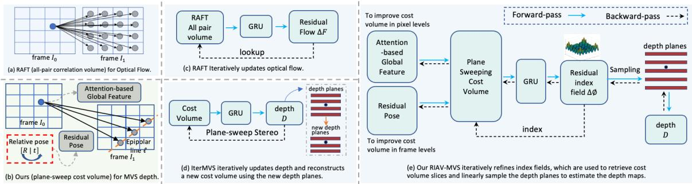
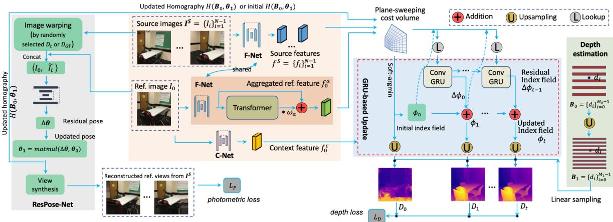
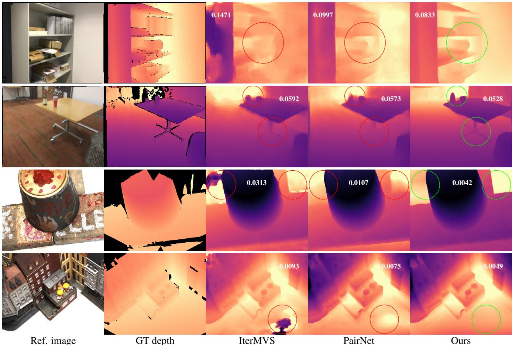

# RIAV-MVS: Recurrent-Indexing an Asymmetric Volume for Multi-View Stereo

Changjiang Cai, Pan Ji, Qingan Yan, Yi Xu OPPO US Research Center, InnoPeak Technology, Inc.

## Abstract

This paper presents a learning-based method for multiview depth estimation from posed images. Our core idea is a “learning-to-optimize” paradigm that iteratively indexes a plane-sweeping cost volume and regresses the depth map via a convolutional Gated Recurrent Unit (GRU). Since the cost volume plays a paramount role in encoding the multiview geometry, we aim to improve its construction both at pixel- and frame- levels. At the pixel level, we propose to break the symmetry of the Siamese network (which is typically used in MVS to extract imagefeatures) by introducing a transformer block to the reference image (but not to the source images). Such an asymmetric volume allows the network to extract global features from the reference image to predict its depth map. Given potential inaccuracies in the poses between reference and source images, we propose to incorporate a residual pose network to correct the relative poses. This essentially rectifies the cost volume at theframe level. We conduct extensive experiments on real-world MVS datasets and show that our method achieves state-of-the-art performance in terms ofboth within-dataset evaluation and cross-dataset generalization.

## 1. Introduction

Multi-view stereo (MVS) aims to recover dense 3D geometry from multiple images captured from different viewpoints with calibrated cameras [28]. It is a fundamental problem in computer vision and has wide applications ranging from autonomous driving [12, 55], remote sensing [3], augmented reality [50], to robotics [22]. Following the seminal MVSNet [59], many learning-based methods [17, 39, 40, 52, 53, 58, 60] have been proposed, achieving great improvements against their traditional counterparts [5, 14, 19, 44], in terms of accuracy or efficiency.

Most of the learning-based MVS methods [17,39,40,52, 58,60] rely on traditional plane-sweeping [14,19] approach to generate a cost volume by comparing the CNN features of reference image and source images at several depth hypotheses, and then apply 2D or 3D convolutional encoderdecoders to aggregate and regularize the cost volume. The

2D CNN methods [17] use multi-level features as skip connections to help decode the cost volume for depth regression. Even though the skip connections improve the depth maps, they weaken the role of cost volume and the geometry knowledge embedded therein to some extent. Hence, 2D CNN methods suffer from degraded generalization when testing on unseen domains. The 3D CNN methods [31] use soft-argmin to regress the depth map as the expectation from the cost volume distribution, and hence cannot predict the best candidate but instead an averaged one when dealing with a flat or multi-modal distribution caused by textureless, repeated, or occluded regions, etc. To mitigate these problems, we propose RIAV-MVS, a new paradigm to predict the depth via learning to recurrently index an asymmetric cost volume, obtaining improved accuracy and generalization. As depicted in Fig. 1, our RIAV-MVS features several nontrivial novel designs.

First, we learn to index the cost volume by approaching the correct depth planes per pixel via an index field (a grid of indices to identify the depth hypotheses), as shown in Fig. 1-(e). The proposed recurrent estimate of the index field enables the learning to be anchored at the cost volume domain. Specifically, it recurrently predicts the residual index field in a descent direction of matching cost to retrieve cost values for the next iteration. The newly updated index field is used to directly index (i.e., sampling via linear interpolation) depth hypotheses to render a depth map, which is iteratively optimized to approach the ground truth depth, making the system end-to-end trainable.

Second, to facilitate the optimization, we propose to improve the cost volume at pixel- and frame- levels, respectively. At the pixel level, a transformer block is asymmetrically applied to the reference view (but not to the source views). By capturing long-range global context via a transformer and pixel-wise local features via CNNs, we build an asymmetric cost volume to store more accurate matching similarity cues. At the frame level, we propose a residual pose net to rectify the camera poses that are usually obtained via Visual SLAM [9, 16, 30] and inevitably contain noise. The rectified poses are used to more accurately backward warp the reference features to match the counterparts in source views.

  
Figure 1. Our pipeline versus RAFT [49] and IterMVS [52]. Our recurrent processing of a plane-sweep cost volume by the iteratively refined index field serves as a new design for multi-view depth estimation.

Our RIAV-MVS is depicted versus two related works RAFT [49] and IterMVS [52] as in Fig. 1. First, our method is developed using RAFT’s GRU-based iterative optimization. However, RAFT operates an all-pair correlation volume (no multi-view geometry constraints) for optical flow (Fig. 1-(a) and (c)), our method is proposed for multi-view depth estimation by constructing a plane-sweep cost volume (Fig. 1-(b)). Second, IterMVS [52] iteratively predicts the depth and reconstructs a new plane-sweep cost volume using updated depth planes centered at the predicted depth (Fig. 1-(d)). Instead, as shown in Fig. 1-(e), our proposed index field serves as a new design that bridges the cost volume optimization (i.e., by learning better image features via back-propagation) and the depth map estimation (i.e., by sampling sweeping planes). It makes forward and backward learning differentiable. We conduct extensive experiments on indoor-scene datasets, including ScanNet [15], DTU [27], 7-Scenes [20], and RGB-D Scenes V2 [32]. We also performed well-designed ablation studies to verify the effectiveness and the generalization of our approach.

## 2. Related Work

Depth can be accurately predicted from stereo matching, which can be broadly divided into binocular stereo and multi-view stereo (MVS). The former requires calibrated setups of rectified stereo pairs, and many traditional [4, 24, 25, 43] and deep learning-based methods [7, 8, 10, 31, 33, 34, 41, 61, 62] have been proposed. Compared with binocular stereo, MVS methods estimate depth from a set of images or a video, where the camera moves and the scene is assumed static. In this section, we briefly review deep learning-based MVS methods.

3D-CNN MVS Depth Estimation: Learning-based MVS methods [17,39,40,52,53,58–60] rely on traditional planesweeping [14, 19] to generate a cost volume by associating reference frame and source frames for similarity matching, followed by encoder-decoder architectures for cost volume aggregation and depth map prediction. Among them, MVSNet [59], R-MVSNet [60], and DPSNet [26] leverage

3D convolutions to regularize 4D cost volumes and regress depth maps via soft-argmin [31]. Different strategies have been introduced for cost volume construction. MVSNet [59] proposes a variance-based cost volume for multi-view similarity measurement. Cas-MVSNet [21] builds cascade cost volumes based on multi-scale feature pyramid and regresses the depth map in a multi-stage coarse-to-fine manner. Similarly, Cheng et al. propose UCS-Net [13] to build cascade adaptive thin volumes by leveraging variance-based uncertainty. CVP-MVSNet [58] builds a cost volume pyramid via multi-scale images to reduce to memory footprint. This cost volume mechanism is also adopted to other related tasks, e.g., 3D plane reconstruction in PlaneMVS [38], which leverages slanted plane sweeping to help plane reconstruction and accurate depth predictions.

2D-CNN MVS Depth Estimation: Even though 3D convolutional methods usually deliver high accuracy, they demand a large memory footprint and computational cost. Instead, some methods, e.g., MVDepthNet [54] and Deep-VideoMVS [17], generate 3D volumes by computing correlation or dot production between the extracted features of multi-view input images. The 3D cost volumes are further regularized by 2D convolutions. DeepVideoMVS [17] extracts multi-scale features. It uses the feature at half scale to construct the cost volume, and other features as the skip connections to a series of decoders for depth regression. PatchmatchNet [53] proposes an adaptive procedure mimicking PatchMatch [5] to achieve superior efficiency. 2D convolutions are much faster and more memory efficient than the 3D counterparts, making them better suitable for lightweight networks in real-time applications.

Iterative Depth Estimation: Several methods adopte an iterative depth estimation paradigm. R-MVSNet [60] iteratively regularizes each slice of the cost volume with GRU along the depth dimension. Unlike the above mentioned cost volume-based approaches, Point-MVSNet [11] directly processes the target scene as point clouds. It first generates a coarse depth map, converts it into a point cloud and refines the point cloud iteratively to reduce the residual between the estimated depth and the ground truth depth. IterMVS [52] encodes a pixel-wise probability distribution of depth in the hidden state of a GRU-based estimator. During each iteration, the multi-scale matching information is injected into the GRU to predict the depth and confidence maps to facilitate the following 3D reconstruction. The depth maps are predicted via a combined classification and regression through the probability distribution. It uses arg-min to finish “classification”, which is not differentiable and must be detached first before the following regression operation. Unlike IterMVS, our method learns to recurrently index the cost volume to directly find the best depth candidates in an end-to-end differentiable fashion.

## 3. Method

Our learning-based end-to-end multi-view stereo system, RIAV-MVS, aims to predict depth maps from a set of images, which are different views of the same scene with known camera poses, denoted by $\mathcal { I } ~ = ~ \{ I _ { i } \} _ { i = 0 } ^ { N - 1 }$ . More specifically, RIAV-MVS uses one as the reference image and others as source images to infer the depth map of the reference image. Without loss of generality, we refer to the first image $I _ { 0 }$ as the reference image and others as source views $\mathcal { T } ^ { s }$ , where $S ~ = ~ 1 , 2 , . . . , N - 1$ An overview of our approach is illustrated in Fig. 2. It consists of feature extraction (Sec. 3.1), cost volume construction via planesweeping stereo [14, 19] (Sec. 3.2), and cost volume optimization and depth prediction (Sec. 3.3). Details will be discussed below.

## 3.1. Feature Extraction

Given a reference image $I _ { 0 }$ and source images $\mathcal { T } ^ { s }$ , we extract matching features of $I _ { 0 }$ and each of the $\mathcal { T } ^ { s }$ by F-Net (see below), and a context feature for $I _ { 0 }$ by C-Net (see the supplementary material for C-Net), as shown in Fig. 2.

Local Matching Feature Extraction: Our feature extractor F-Net is based on PairNet [17]. It is a lightweight Feature Pyramid Network (FPN) [35] on top of the first fourteen layers of MnasNet [47]. Specifically, the reference input image $I _ { 0 } \in \mathbb { R } ^ { H \times W }$ is spatially scaled down until 1/32 scale, and recovered up to 1/2 scale, resulting in multi-scale features $\{ f _ { 0 , s } ~ \in ~ \mathbb { R } ^ { \frac { H } { s } \times \frac { W } { s } \times F _ { 0 } } \}$ $\scriptstyle ( s = 2 , 4 , 8 , 1 6$ and $F _ { 0 } { = } 3 2$ for feature channels). In PairNet, $f _ { 0 , 2 }$ is used to construct the cost volume, and other features are used in the skip connections to a series of decoders for depth regression. Unlike this, we add an extra fusion layer $\mathcal { G }$ to aggregate them into a matching feature $f _ { 0 }$ at 1/4 scale, as

$$
f _ { 0 } = \mathcal { G } ( \langle f _ { 0 , 2 } \downarrow _ { 2 } , f _ { 0 , 4 } , f _ { 0 , 8 } \uparrow _ { 2 } , f _ { 0 , 1 6 } \uparrow _ { 4 } \rangle )\tag{1}
$$

where the fusion layer $\mathcal { G }$ is a sequence of operations of $\mathbf { C o n v _ { 3 \times 3 } } ,$ , batch normalization, ReLU, and $\mathrm { C o n v } _ { 1 \times 1 } , ~ \downarrow _ { x }$ and $\uparrow _ { x }$ are downsampling and upsampling by scale $x ,$ $\langle \cdot \rangle$ is concatenation along channel dimension, and $f _ { 0 } \in$ $\mathbb { R } ^ { H / 4 \times W / 4 \times F _ { 1 } }$ with $F _ { 1 } { = } 1 2 8$ . Similarly, F-Net (with shared weights as that for $I _ { 0 } )$ is also applied to source images $\mathcal { T } ^ { s }$ to extract a set of matching features $f ^ { S } = \{ f _ { i } \mid i \in \bar { S } \}$

Global Matching Feature of Reference View: Besides the local pixel-wise features extracted from CNNs, we also leverage global long-range information to better guide the feature matching. Towards that, a transformer layer (fourhead self-attention with positional encoding) [51] is applied to the local feature $f _ { 0 }$ of the reference image, to construct an aggregated feature $f _ { 0 } ^ { a } \in \mathbb { R } ^ { H / 4 \times W / 4 \times F _ { 1 } }$ as

$$
f _ { 0 } ^ { a } = f _ { 0 } + \omega _ { \alpha } \sigma \left( \frac { ( f _ { 0 } W ^ { Q } ) ( f _ { 0 } W ^ { K } ) ^ { T } } { \sqrt { F _ { 1 } } } ( f _ { 0 } W ^ { V } ) \right)\tag{2}
$$

where $\sigma ( \cdot )$ is the softmax operator, $\omega _ { \alpha }$ is a learned scalar weight that is initialized to zero, and $\bar { W ^ { Q } } , W ^ { K } \in \mathbb { R } ^ { F _ { 1 } \times h F _ { 1 } }$ and $\mathbf { \bar { \boldsymbol { W } } } ^ { V } \in \mathbb { R } ^ { F _ { 1 } \times F _ { 1 } }$ are the projections matrices for query, key and value features, with h=4 for multi-head attention. The final output $f _ { 0 } ^ { a }$ contains both local and global information, which are balanced by the parameter $\omega _ { \alpha }$ , to enhance the following cost volume construction.

It is worth noting that this transformer self-attention is only applied to the reference image, while the source features still possess the local representations from CNNs. Our asymmetric employment of this transformer layer provides the capability to better balance the high-frequency features (by high-pass CNNs) and the low-frequency features by self-attention [42,46]. The high-frequency features are beneficial to image matching at local and structural regions, while the low-frequency ones, with noisy information suppressed by the transformer’s spatial smoothing (serving as a low-pass filter), provide more global context cues for robust matching, especially for the areas full of low-texture, repeated patterns, and occlusion, etc. This way, our network can learn where to rely on global features over local features, and vice versa.

## 3.2. Cost Volume Construction

We use the global matching feature map $f _ { 0 } ^ { a }$ of $I _ { 0 }$ and local matching features $f ^ { S } \operatorname { o f } \bar { \mathcal { L } ^ { S } }$ to build a cost volume. The cost (or matching) volume is defined on a 3D view frustum attached to the camera in perspective projection. It is generated by running the traditional plane-sweep stereo [14, 19] which uniformly samples $\scriptstyle { M _ { 0 } = 6 4 }$ plane hypotheses in the inverse depth space, s.t. $1 / d \sim U ( d _ { \operatorname* { m i n } } , d _ { \operatorname* { m a x } } )$ . Here $d _ { \mathrm { m i n } }$ and $d _ { \mathrm { m a x } }$ are the near and far planes of the 3D frustum, respectively. Following [17], we set $d _ { m i n } = 0 . 2 5$ and $d _ { m a x } { = } 2 0$ meters for indoor scenes (e.g., ScanNet [15]).

For a given depth hypothesis d and known camera intrinsic matrices $\mathcal { K } = \{ K _ { i } \} _ { i = 0 } ^ { N }$ and relative transformations $\Theta = \{ R _ { 0 , i } \ | \ t _ { 0 , i } \} _ { i = 1 } ^ { N }$ from reference image $I _ { 0 }$ , to source image $I _ { i } ,$ a cost map is computed by i) warping source image feature $f _ { i }$ into the reference image and ii) calculating the similarity between the reference global feature $f _ { 0 } ^ { a }$ and the warped feature $\tilde { f } _ { i }$ . To generate $\tilde { f } _ { i }$ , we implement the homography H as a backward 2D grid sampling. Specifically, a pixel $\mathbf { p } = ( u , v , 1 ) ^ { T }$ in the reference image will be warped to its counterpart $\tilde { \mathbf { p } } _ { i }$ in source image i as follows:

  
Figure 2. Architecture of our proposed network. It consists of a feature extraction (i.e., F-Net, a Transformer, and C-Net) block, a cost volume construction and index field GRU-based optimization block, and a residual pose block.

$$
\tilde { \mathbf { p } } _ { i } = H ( \mathbf { p } \mid d , K , \Theta ) = K _ { i } \left( R _ { 0 , i } \left( K _ { 0 } ^ { - 1 } \mathbf { p } d \right) + t _ { 0 , i } \right)\tag{3}
$$

Then $\tilde { f } _ { i }$ is bilinearly sampled from $f _ { i }$ as $\begin{array} { r l } { \tilde { f } _ { i } ( \mathbf { p } ) } & { { } = } \end{array}$ $f _ { i } ( \tilde { \mathbf { p } } _ { i } )$ . Given the warped source feature $f _ { i }$ and the reference feature $f _ { 0 } ^ { a }$ , the cost volume is formulated as $C _ { 0 } ( d ) =$ $\begin{array} { r } { \frac { 1 } { N - 1 } \sum _ { i \in \mathcal { S } } \frac { f _ { 0 } ^ { a } \cdot \tilde { f } _ { i } ^ { T } } { \sqrt { F _ { 1 } } } } \end{array}$ . This way, we can construct a cost volume for all depth candidates $\scriptstyle B _ { 0 } = \{ d _ { i } \} _ { i = 0 } ^ { M _ { 0 } - 1 }$ , resulting in a 3D tensor, denoted as $C _ { 0 } \in \mathbb { R } ^ { H / 4 \times \mathbf { \tilde { W } } / 4 \times M _ { 0 } }$

## 3.3. GRU-based Iterative Optimization

We solve the depth prediction as learning to optimize the dense stereo matching problem [5, 24, 48, 57]. Given the generated cost volume $C _ { 0 }$ as in Sec. 3.2, the depth estimation of the reference image is formulated as finding the best solution $D ^ { * } =$ argminD $E ( D , C _ { 0 } )$ , which minimizes an energy function $E ( D , C _ { 0 } )$ (including a data term and a smoothness term). Unfortunately, such a global minimization is NP-complete due to many discontinuity preserving energies [6]. Approximate solutions are proposed by loosening the energy function, $e . g .$ , the binocular stereo matching solved by Semi-Global Matching (SGM) [24]. In SGM, the matching cost $C _ { 0 }$ is iteratively aggregated by summing the costs (of all 1D minimum cost paths that end in pixel p at disparity $d ^ { 1 } )$ when traversing from pixel p−r to pixel p in a direction r (out of sixteen directions) and the best disparity at each pixel p is given by $d ^ { * } ( \mathbf { p } ) = \mathrm { a r g m i n } _ { d } ( C ^ { \prime } ( \mathbf { p } , d ) )$ with $C ^ { \prime }$ being the aggregated cost volume. Similar to SGM, we do not directly optimize the energy function E, but learn to process the cost volume $C _ { 0 }$

However, several major problems still need to be solved. SGM is not differentiable due to its winner-take-all (WTA) by argmin, making it unable to train the system in an endto-end manner. Its differentiable counterpart, SGA [62], was proposed by changing the min to sum when aggregating the cost volume, and replacing the argmin with softargmin when predicting the disparity from the optimized cost volume, but still i) the update direction r when traversing from pixel p-r to p needs to be predefined, and ii) the softargmin focuses on measuring the distance of the expectation of disparity map to the ground truth disparity, and hence cannot handle multi-modal distributions in $C _ { 0 }$ well [52].

Therefore, towards an end-to-end, differentiable solution, we propose to use a GRU-based module to implicitly optimize the matching volume. It estimates a sequence of index fields $\{ \phi _ { t } \} _ { t = 1 } ^ { T }$ by unrolling the optimization problem to $T$ iterative updates (in a descent direction), mimicking the updates of a first-order optimizer according to $[ 1 , 2 , 3 6 , 4 9 ]$ . At each iteration $t ,$ the index field $\phi _ { t } \in \mathbb { R } ^ { H \times W }$ is estimated as a grid of indices to iteratively better approach $( i . e .$ , closer to the ground truth) depth hypotheses having a lower matching cost. Specifically, a residual index field $\delta \phi _ { t }$ is predicted as an update direction for next iteration, $i . e . ,$ $\phi _ { t + 1 } = \phi _ { t } + \delta \phi _ { t }$ , (analogous to the direction r in SGM), which is explicitly driven by training the system (e.g., feature encoders, the transformer layer, and the residual pose net, etc.) to minimize the loss between the predicted depth maps and the ground truth. The recurrent estimate of the index field enables the learning to be directly anchored at the cost volume domain. This indexing paradigm differentiates our approach from other depth estimation methods, such as the depth regression which fuses cost volume and the skipped multi-level features by 2D CNNs [17, 52, 53], and soft-argmin [31] after cost volume aggregation and regularization by 3D CNNs [21, 39, 59, 60].

Index Field Iterative Updates: We use a 3 chained GRUs [36] to estimate a sequence of index fields, $\{ \phi _ { t } \ \in$ $\mathbb { R } ^ { H / 4 \times \bar { W } / 4 } \} _ { t = 1 } ^ { T }$ from an initial starting point $\phi _ { 0 }$ . We use a softargmin-start from the cost volume $C _ { 0 } , i . e . , \phi _ { 0 } =$ $\textstyle \sum _ { i = 0 } ^ { M _ { 1 } - 1 } i \sigma ( C _ { 0 } )$ , where $\sigma ( \cdot )$ is the softmax operator along the last dimension of cost volume $C _ { 0 }$ , to convert it to a probability of each index i. This setup facilitates the convergence of our predictions. A four-layer matching pyramid $\{ C _ { 0 } ^ { i } \in \mathbb { R } ^ { H / 4 \times W / 4 \times M _ { 0 } / 2 ^ { i } } \} _ { i = 1 } ^ { 4 }$ is built by repeated pooling the cost volume $C _ { 0 }$ along the depth dimension with kernel size 2 as in [49]. To index the matching pyramid, we define a lookup operator analogous to the one in [36]. Given a current estimate of index field $\phi _ { t }$ , a 1D grid is constructed with integer offsets up to $r = \pm 4$ around the $\phi _ { t }$ . The grid is used to index from each level of the matching pyramid via linear interpolation due to $\phi _ { t }$ being real numbers. The retrieved cost values are then concatenated into a single feature map $C _ { 0 } ^ { \phi _ { t } } \in \mathbb { R } ^ { H / 4 \times W / 4 \times F _ { 2 } }$ . Then the index field $\phi _ { t }$ , the retrieved cost features $C _ { 0 } ^ { \phi _ { t } }$ , and context features $f _ { 0 } ^ { c }$ are concatenated, and fed into the GRU layer, together with a latent hidden state $h _ { t }$ . The GRU outputs a residual index field $\delta \phi _ { t }$ , and a new hidden state $h _ { t + 1 } { : }$

$$
\delta \phi _ { t } , h _ { t + 1 } \Leftarrow \mathrm { G R U } ( \langle \phi _ { t } , C _ { 0 } ^ { \phi _ { t } } , f _ { 0 } ^ { c } \rangle , h _ { t } ) ; \phi _ { t + 1 } \Leftarrow \phi _ { t } + \delta \phi _ { t }
$$

Upsampling and Depth Estimation: The depth map at iteration t is estimated by sampling the depth hypotheses via linear interpolation given the index field $\phi _ { t }$ . Since $\phi _ { t }$ is at 1/4 resolution, we upsample it to full resolution using a convex combination of a $3 \times 3$ neighbors as in [49]. Specifically, a weight mask $W _ { 0 } \in \mathbb { R } ^ { H / 4 \times W / 4 \times ( 4 \times 4 \times 9 ) }$ is predicted from the hidden state $h _ { t }$ using two convolutional layers and softmax is performed over the weights of those 9 neighbors. The final high resolution index field $\phi _ { t } ^ { u }$ is obtained by taking a weighted combination over the 9 neighbors, and reshaping to the resolution H×W. Convex combination can be implemented using the einsum function in $\mathrm { P y }$ Torch.

When constructing the cost volume, we use $M _ { 0 } = 6 4$ depth hypotheses, $\bar { B _ { 0 } } ~ = ~ \{ d _ { i } \} _ { i = 0 } ^ { M _ { 0 } - 1 }$ A small $M _ { 0 }$ helps reduce the computation and space. If we use the upsampled index field $\phi _ { t } ^ { u }$ to directly sample the planes $B _ { 0 }$ , we see discontinuities in the inferred depth map, even though the quantitative evaluation is not hindered. To mitigate this, we propose a coarse-to-fine pattern, and to use $M _ { 1 } = 2 5 6$ depth hypotheses ${ \cal B } _ { 1 } = \{ d _ { i } \} _ { i = 0 } ^ { M _ { 1 } - 1 }$ . Analogous to upsampling in optical flow or disparity in binocular stereo, the flow or disparity values themselves have to be scaled when implementing the spatial upsampling. Our depth index fields are adjusted by a scale $s _ { D } { = } \frac { M _ { 1 } } { M _ { 0 } } { = } 4$ . To mimic the convex combination before mentioned, we apply a similar weighted summation along the depth dimension when sampling depth from $\boldsymbol { B } _ { 1 }$ . Specifically, another mask $W _ { 1 } ~ \in ~ \mathbb { R } ^ { H \times W \times s _ { D } \times M _ { 0 } }$ is predicted from the hidden state using three convolutional layers, and further reshaped to $H \times W \times M _ { 1 }$ . Given a pixel $\mathbf { p } ,$ and the upsampled index field $\phi _ { t } ^ { u }$ , the final depth $D _ { t }$ is estimated as

$$
D _ { t } ( p ) = \frac { \sum _ { i \in \Omega ( \mathbf { p } ) } B _ { 1 } \left[ i \right] W _ { 1 } ( \mathbf { p } , \lfloor i \rfloor ) } { \sum _ { i \in \Omega ( \mathbf { p } ) } W _ { 1 } ( \mathbf { p } , \lfloor i \rfloor ) }\tag{4}
$$

where, we aggregate the neighbors within a radius $r = 4$ centered at the index $\phi _ { t } ^ { u } ( \mathbf { p } )$ for a given pixel $\mathbf { p } ,$ and ⌊i⌋ gives a greatest integer less than or equal to i, and [i] means to index the depth planes $\boldsymbol { B } _ { 1 }$ via linear interpolation, due to index i being a real number.

It is worth mentioning that our method embeds both regression (similar to softargmin in existing methods [39, 59, 60]) and classification (similar to argmin), which make it robust to multi-modal distributions, and achieving sub-pixel precision thanks to linear interpolation. Combining both classification and regression has been seen in [52], but ours does not use the argmax operator when achieving the “classification” purpose, thanks to our proposal of index fields estimation, which differentiably bridges the cost volume indexing and depth hypotheses sampling directly in a subpixel precision.

Residual Pose Net: An accurate cost volume benefits the GRU-based iterative optimization. The quality of the generated cost volume $C _ { 0 }$ is not only determined by the matching features $( f _ { 0 } ^ { a }$ and $f ^ { S } )$ (for which we have proposed asymmetric employment of the transformer layer), but also by the homography warping as in Eq. 3. However, the camera poses are, in practice, usually obtained by Visual SLAM algorithms [9, 16, 30], and inevitably contain noise. Therefore, we propose a residual pose net to rectify the camera poses for accurately backward warping the reference features to match the corresponding features in source images. We use an image-net pretrained ResNet18 [23] backbone as in [29, 56] to encode the reference image and the warped source images. Specifically, given the current estimated depth map $D _ { t }$ at iteration $t ,$ and the ground truth depth $D _ { g t }$ we warp a source image $I _ { i }$ into the reference image through the homography defined in Eq. 3 with (noisy) ground truth camera poses $\Theta$ and the $D _ { t }$ or $D _ { g t }$ We randomly select $D _ { t }$ or $D _ { g t }$ with a probability prob( $D _ { t } ) { = } 0 . 6$ during network training, but always use the predicted depth $D _ { t }$ during network inference. The input to the pose net is the concatenated $I _ { 0 }$ and the warped ${ \tilde { I } } _ { i } ,$ and the output is an axis-angle representation, which is further converted to a residual rotation matrix $\Delta \theta _ { i }$ , for an updated one $\theta _ { i } ^ { \prime } { = } \Delta \theta _ { i } \cdot \theta _ { i }$ . This way, we predict the residual poses $\Delta \Theta = \{ \Delta \theta _ { i } \} _ { i = 1 } ^ { N - 1 }$ for each of the source and reference pair, and perform the rectification as $\Theta ^ { \prime } = \Delta \Theta \cdot \Theta$ We leverage the updated poses $\Theta ^ { \prime }$ to calculate a more accurate cost volume $C _ { 1 }$ using Eq. 3, followed by the remaining iterations of GRU.

## 3.4. Loss Function

Our network is supervised on the inverse $L _ { 1 }$ loss between the predicted depths $\{ D _ { t } \} _ { i = 1 } ^ { T }$ and the ground truth $D _ { g t }$ . It is evaluated over valid pixels $( i . e .$ , with non-zero ground truth depths). Following the exponentially increasing weights as in [36, 49], this depth loss is defined as

$$
\mathcal { L } _ { D } = \sum _ { t = 1 } ^ { T } \gamma ^ { T - t } \frac { 1 } { N _ { v } } \sum _ { i = 0 } ^ { N _ { v } - 1 } \Vert \frac { 1 } { D _ { t } ( i ) } - \frac { 1 } { D _ { g t } ( i ) } \Vert _ { 1 }\tag{5}
$$

where, $\| \cdot \| _ { 1 }$ measures the $l _ { 1 }$ distance, $N _ { v }$ is the number of valid pixels, and $\gamma = 0 . 9$ . We also apply the photometric loss $\mathcal { L } _ { P } ( \mathrm { a s }$ defined in [56]) to supervise the residual pose network. The total loss is then defined as $\mathcal { L } = \mathcal { L } _ { D } + \mathcal { L } _ { P }$

## 4. Experiments

## 4.1. Datasets

Our experiments use four indoor-scene datasets, which have RGB-D video frames with ground truth depths and known camera poses. ScanNet [15] and DTU [27] are used in training and testing, and 7scenes [20] and RGB-D Scenes V2 [32] are evaluated for zero-shot generalization. (1) ScanNet. Our network is trained from scratch on ScanNet [15] using the official training split. We use 279k training samples and 20k validation ones. (2) DTU. Following [53,59,60], the depth range for sampling depth hypotheses is set to $d _ { m i n } = 0 . 4 2 5$ and $d _ { m a x } = 0 . 9 3 5$ meters. We use 27k training samples, 6k validation ones, and 1k ones for evaluation. Each sample has 5 frames. (3) 7-Scenes. We select 13 sequences from 7-Scenes for zero-shot generalization. (4) RGB-D Scenes V2. We select 8 sequences for testing. Details about train/val/test splits, training, and implementation are shown in the supplementary material.

## 4.2. Comparison with Existing Methods

In this section, our method is evaluated and compared with several state-of-the-art MVS methods. Our network is strictly compared with two baselines PairNet [17] and IterMVS [52], following the same training schedule and training set. We also compare ours with other MVS methods either by running the provided models or referring to the available evaluation metrics when testing on the same datasets, including ESTDepth [39], Neural RGBD [37], MVDepthNet [54], DPSNet [26], and DELTAS [45].

Quantitative Evaluation. We evaluate the depth maps using the standard metrics in [18], including mean absolute relative error (abs-rel), mean absolute error (abs), squared relative error (sq-rel), root mean square error in linear scale (rmse) and log scale (rmse-log), and inlier ratios under thresholds of $\sigma \ : < 1 . 2 5 / 1 . 2 5 ^ { 2 } / 1 . 2 5 ^ { 3 }$ . Tab. 1 shows the results on the ScanNet benchmark of our methods and several state-of-the-art MVS methods. We compare two variants of our models: i) base: a base version with our recurrent indexing cost volume, and ii) +pose,atten: a full version with residual pose and the asymmetric employment of transformer self-attention. Our full model achieves the best performance in most metrics except the inlier ratio under $\sigma < 1 . 2 5 ^ { 2 }$ , outperformed by DELTAS [45] and ESTD [39]. But the inlier ratio is not as essential as abs-rel and abs. Zero-shot Generalization. We evaluate the generalization performance of our method RIAV-MVS from ScanNet to other indoor datasets without any fine-tuning. Tab. 2 shows the results of the methods trained on ScanNet [15] and directly tested on 7-scenes [20] and RGB-D Scenes V2 [32]. Our models outperform the baselines, and our two variants all have strong generalization performance. Qualitative Results. Fig. 3 demonstrates the qualitative results of our method vs. baselines IterMVS [52] and PairNet [17] on the test set of ScanNet [15] and DTU [27]. Our method can make more accurate and sharp depth predictions, especially for regions near boundaries and edges. For both near and far objects, our method outperforms the baselines.

## 4.3. Ablation Study

Efficacy of Proposed Modules: Our design is verified by ablating the modules to three variants, as shown in Tab. 3- (a). The base version itself can achieve competitive performance on ScanNet and better generalization, verifying the efficacy of our novel design - cost volume recurrent indexing via index field. Further, the performance can be consistently boosted when the residual pose net $( \mathrm { i . e . , }$ variant +pose) and transformer self-attention are added (i.e., variant +pose,atten). Therefore, each of the proposed modules can consistently help with accurate depth estimation. Tab. 3-(b) shows the benefit of using asymmetric attention over symmetric attention. We also see improvements when applying our asymmetric attention to the MVSNet [59] backbone on ScanNet and DTU test sets (see the results in parentheses). Number of GRU Iterations and Convergence: Tab. 4-(a) shows the ablation study on different number of GRU iterations T. The results are obtained by running our model (the full version) on the ScanNet test set, with $T = 1 6 , 2 4 , 4 8 , 6 4 , 9 6 .$ , and 128. Running more iterations boosts our depth prediction, but after $T \geq 9 6 ,$ , the gain is marginal. View Number: We compare 3-view (i.e., 1 reference + 2 source images) and 5-view (i.e., 1 reference + 4 source images). Tab. 4-(b) shows that the more frames are used for matching, the better the depth will be. The results are obtained for the zero-shot generalization from ScanNet to 7-Scenes. Note that our full model (+pose,atten) with 3- view input outperforms the other two variants with 5-view input, showing the asymmetrical employment of the transformer self-attention can boost the prediction due to the mining of more global information. 3-view vs 5-view on

<table><tr><td rowspan="2">Method</td><td colspan="7">ScanNet Test-Set (m)</td><td colspan="3">DTU Test-Set (mm)</td></tr><tr><td>abs-rel</td><td>abs</td><td>sq-rel</td><td>rmse</td><td>rmse-log</td><td> $\overline { { \delta < 1 . 2 5 } }$ </td><td> $\overline { { \delta < 1 . 2 5 ^ { 2 } } }$ </td><td>abs-rel</td><td>abs</td><td>rmse</td></tr><tr><td>MVDepth [54]</td><td>0.1167</td><td>0.2301</td><td>0.0596</td><td>0.3236</td><td>0.1610</td><td>0.8453</td><td>0.9639</td><td></td><td></td><td></td></tr><tr><td>MVDepth-FT</td><td>0.1116</td><td>0.2087</td><td>0.0763</td><td>0.3143</td><td>0.1500</td><td>0.8804</td><td>0.9734</td><td></td><td></td><td></td></tr><tr><td>DPSNet [26]</td><td>0.1200</td><td>0.2104</td><td>0.0688</td><td>0.3139</td><td>0.1604</td><td>0.8640</td><td>0.9612</td><td></td><td></td><td></td></tr><tr><td>DPSNet-FT</td><td>0.0986</td><td>0.1998</td><td>0.0459</td><td>0.2840</td><td>0.1348</td><td>0.8880</td><td>0.9785</td><td></td><td></td><td></td></tr><tr><td>DELTAS [45]</td><td>0.0915</td><td>0.1710</td><td>0.0327</td><td>0.2390</td><td>0.1226</td><td>0.9147</td><td>0.9872</td><td></td><td></td><td></td></tr><tr><td>NRGBD [37]</td><td>0.1013</td><td>0.1657</td><td>0.0502</td><td>0.2500</td><td>0.1315</td><td>0.9160</td><td>0.9790</td><td></td><td></td><td></td></tr><tr><td>ESTD [39]</td><td>0.0812</td><td>0.1505</td><td>0.0298</td><td>0.2199</td><td>0.1104</td><td>0.9313</td><td>0.9871</td><td></td><td></td><td></td></tr><tr><td>MVSNet [59]</td><td>0.1032</td><td>0.18645</td><td>0.0465</td><td>0.2743</td><td>0.1385</td><td>0.8935</td><td>0.9775</td><td>0.0143</td><td>10.7235</td><td>25.3989</td></tr><tr><td>PairNet [17]</td><td>0.0895</td><td>0.1709</td><td>0.0615</td><td>0.2734</td><td>0.1208</td><td>0.9172</td><td>0.9804</td><td>0.0129</td><td>9.4428</td><td>21.4650</td></tr><tr><td>IterMVS [52]</td><td>0.0991</td><td>0.1818</td><td>0.0518</td><td>0.2733</td><td>0.1368</td><td>0.8995</td><td>0.9741</td><td>0.0146</td><td>10.6225</td><td>28.7009</td></tr><tr><td>Ours(base)</td><td>0.0885</td><td>0.1605</td><td>0.0380</td><td>0.2347</td><td>0.1183</td><td>0.9211</td><td>0.9810</td><td>0.0116</td><td>8.2887</td><td>21.5806</td></tr><tr><td>Ours(+pose,atten)</td><td>0.0734</td><td>0.1381</td><td>0.0281</td><td>0.2080</td><td>0.1030</td><td>0.9395</td><td>0.9862</td><td>0.0092</td><td>6.7771</td><td>18.5953</td></tr></table>

Table 1. Quantitative evaluation results on the test set of ScanNet [15] and the test set of DTU [27]. Error metrics (lower is better) are abs-rel, abs, sq-rel, rmse, rmse-log, while accuracy (higher is better) metrics are $\delta < 1 . 2 5 / 1 . 2 5 ^ { 2 } / 1 . 2 5 ^ { 3 }$ . Here -FT denotes finetuned on ScanNet. Bold is the best score, and underline indicates the second best one.
<table><tr><td rowspan="2">ScanNet ⇒ Others</td><td colspan="5">7-Scenes</td><td colspan="5">RGB-D Scenes V2</td></tr><tr><td>abs-rel</td><td>abs</td><td>sq-rel</td><td>rmse</td><td> $\overline { { \delta < 1 . 2 5 } }$ </td><td>abs-rel</td><td>abs</td><td>sq-rel</td><td>rmse</td><td> $\overline { { \delta < 1 . 2 5 } }$ </td></tr><tr><td>NRGBD [37]</td><td>0.2334</td><td>0.4060</td><td>0.2163</td><td>0.5358</td><td>0.6803</td><td></td><td></td><td></td><td></td><td></td></tr><tr><td>ESTD [39]</td><td>0.1465</td><td>0.2528</td><td>0.0729</td><td>0.3382</td><td>0.8036</td><td></td><td>1</td><td></td><td></td><td></td></tr><tr><td>PairNet [17]</td><td>0.1157</td><td>0.2086</td><td>0.0677</td><td>0.2926</td><td>0.8768</td><td>0.0995</td><td>0.1382</td><td>0.0279</td><td>0.1971</td><td>0.9393</td></tr><tr><td>IterMVS [52]</td><td>0.1336</td><td>0.2363</td><td>0.1033</td><td>0.3425</td><td>0.8518</td><td>0.0811</td><td>0.1245</td><td>0.0340</td><td>0.2133</td><td>0.9496</td></tr><tr><td>Ours(base)</td><td>0.1148</td><td>0.1999</td><td>0.0552</td><td>0.2857</td><td>0.8726</td><td>0.0967</td><td>0.1336</td><td>0.0246</td><td>0.1836</td><td>0.9427</td></tr><tr><td>Ours(+pose,atten)</td><td>0.1000</td><td>0.1781</td><td>0.0473</td><td>0.2664</td><td>0.8967</td><td>0.0803</td><td>0.1168</td><td>0.0200</td><td>0.1703</td><td>0.9632</td></tr></table>

Table 2. Zero-shot generalization from ScanNet [15] to 7-scenes [20] and RGB-D Scenes V2 [32]. Our methods achieve better generaliza tion. We sample the sequences every 10 frames, and each sample has 5 frames for multi-view stereo depth prediction.

<table><tr><td rowspan="2">Variants</td><td colspan="4">ScanNet Test-Set (m)</td></tr><tr><td>abs-rel</td><td>abs</td><td>rmse</td><td> $\overline { { \delta < 1 . 2 5 } }$ </td></tr><tr><td>Ours(base)</td><td>0.0885</td><td>0.1605</td><td>0.2347</td><td>0.9211</td></tr><tr><td>Ours(+pose)</td><td>0.0827</td><td>0.1523</td><td>0.2253</td><td>0.9277</td></tr><tr><td>Ours(+pose,atten)</td><td>0.0734</td><td>0.1381</td><td>0.2080</td><td>0.9395</td></tr></table>

<table><tr><td rowspan="2">Attention</td><td colspan="4">ScanNet/DTU Test-Set (m)</td></tr><tr><td>abs-rel</td><td>abs</td><td>rmse</td><td> $\overline { { \delta < 1 . 2 5 } }$ </td></tr><tr><td>Asym atten (ours)</td><td>0.0734</td><td>0.1381</td><td>0.2080</td><td>0.9395</td></tr><tr><td rowspan="2">Sym. atten</td><td>0.0761</td><td>0.1496</td><td>0.2253</td><td>0.9333</td></tr><tr><td>0.1032</td><td>0.1865</td><td>0.2743</td><td>0.8935</td></tr><tr><td rowspan="2">MVSNet [59] MVSNet(+atten)</td><td>(0.0143)</td><td>(10.7235)</td><td>(25.3989)</td><td>(0.8936)</td></tr><tr><td>0.1018 (0.0123)</td><td>0.1853 (9.1150)</td><td>0.2734 (22.3525)</td><td>0.8957 (0.9909)</td></tr></table>

(a) We compare three variants of our models.  
(b) Asymmetric attention and MVSNet backbone. DTU results are in parentheses.

Table 3. Ablation study for our proposed modules and a different backbone architecture MVSNet [59].
<table><tr><td>Itr. T</td><td>abs-rel</td><td>abs</td><td> $\overline { { \delta < 1 . 2 5 } }$ </td></tr><tr><td>16</td><td>0.1413</td><td>0.0760</td><td>0.9364</td></tr><tr><td>24</td><td>0.1400</td><td>0.0752</td><td>0.9375</td></tr><tr><td>48</td><td>0.1392</td><td>0.0747</td><td>0.9382</td></tr><tr><td>64</td><td>0.1392</td><td>0.0746</td><td>0.9384</td></tr><tr><td>96</td><td>0.1392</td><td>0.0745</td><td>0.9385</td></tr><tr><td>128</td><td>0.1394</td><td>0.0745</td><td>0.9385</td></tr></table>

(a) GRU iterations

<table><tr><td>View No.</td><td>abs-rel</td><td>abs</td><td> $\overline { { \delta < 1 . 2 5 } }$ </td></tr><tr><td>3 (base) 5 (base)</td><td>0.1204 0.1148</td><td>0.2121 0.1999</td><td>0.8603 0.8726</td></tr><tr><td>3 (+pose)</td><td>0.1162</td><td>0.2061</td><td>0.8711</td></tr><tr><td>5 (+pose)</td><td>0.1096</td><td>0.1930</td><td>0.8840</td></tr><tr><td>3 (+pose,atten)</td><td>0.1084</td><td>0.1923</td><td>0.8833</td></tr><tr><td>5 (+pose,atten)</td><td>0.1000</td><td>0.1781</td><td>0.8967</td></tr></table>

(b) View numbers

<table><tr><td>Sampling</td><td>abs-rel</td><td>abs</td><td> $\overline { { \delta < 1 . 2 5 } }$ </td></tr><tr><td>s10 (base)</td><td>0.0885</td><td>0.1605</td><td>0.9211</td></tr><tr><td>key (base)</td><td>0.0838</td><td>0.1598</td><td>0.9277</td></tr><tr><td>s10 (+pose)</td><td>0.0827</td><td>0.1523</td><td>0.9277</td></tr><tr><td>key (+pose)</td><td>0.0789</td><td>0.1531</td><td>0.9339</td></tr><tr><td>s10 (+pose,atten)</td><td>0.0747</td><td>0.1392</td><td>0.9382</td></tr><tr><td>key (+pose,atten)</td><td>0.0697</td><td>0.1348</td><td>0.9472</td></tr></table>

(c) Frame sampling  
Table 4. Ablation study of design choices. Bold is the best, and underline indicates the second best.

DTU: Tab. 5 shows that our model, i.e., Ours(+pose,atten) is trained/tested on DTU dataset with 3-view and 5-view input collections, respectively. We use the same training scheduling for a fair comparison. The 5-view result is worse than the last row in Tab. 1 due to the lack of pretraining on ScanNet. Frame Sampling: We compare the simple view selection strategy (i.e., sampling by every 10 frames) with the heuristics [17]. Tab. 4-(c) shows that ours can be improved when the selected views have more overlapping and the baselines are suitable. Our(+pose,atten) even with simple strategy outperforms other variants with heuristic sampling, and so are our(+pose) vs our(base). Runtime Overhead: Tab. 6 shows the run-time and memory consumption when processing 320 × 256 frames from the ScanNet test set. Ours (T=8/12/24) means 8, 12, and 24 GRU iterations.

  
Figure 3. Qualitative results on ScanNet [15] (top two rows) and DTU [27] test set. Left two columns show reference image and ground truth depth, and other columns are the estimated depth by baseline IterMVS [52], PairNet [17] and ours (the full version), respectively. Our method outperform the baselines on thin structures, small objects and boundaries, as highlighted in green for ours and in red for the baselines. The abs-err errors (in meters) are imposed on the depth maps for comparison.

<table><tr><td>View No. on DTU</td><td>abs-rel (↓)</td><td>abs (mm) (↓)</td><td>rmse (↓)</td></tr><tr><td>3 (1 ref + 2 source)</td><td>0.0149</td><td>11.0689</td><td>24.8831</td></tr><tr><td>5 (1 ref + 4 source)</td><td>0.0119</td><td>8.8419</td><td>21.4327</td></tr></table>

Table 5. 3-view vs. 5-view training and testing on DTU [27].

<table><tr><td>Methods</td><td>Time(fps)</td><td>Mem.(MB)</td><td>Param.(M)</td><td>abs-rel (↓)</td></tr><tr><td>Ours(T=8)</td><td>6.98</td><td>4297</td><td>27.6</td><td>0.0760</td></tr><tr><td>Ours(T=12)</td><td>5.91</td><td>4297</td><td>27.6</td><td>0.0752</td></tr><tr><td>Ours(T=24)</td><td>3.77</td><td>4297</td><td>27.6</td><td>0.0734</td></tr><tr><td>IterMVS [52]</td><td>22.61</td><td>2171</td><td>0.34</td><td>0.0991</td></tr><tr><td>ESTD [39]</td><td>14.08</td><td>1799</td><td>36.2</td><td>0.0812</td></tr></table>

Table 6. Comparison of run time, memory consumption, and accuracy on ScanNet [15] test set with frame dimension 320 × 256.

## 5. Conclusions

We have proposed RIAV-MVS, a novel learning-based MVS method. Our approach utilizes a convolutional GRU to iteratively optimize the index fields, which are used to access the cost volume and regress the depth. The cost volume is further improved through the application of a transformer block to the reference image and a residual pose network to correct the relative poses. Extensive experiments on ScanNet [15], DTU [27], 7-Scenes [20], and RGB-D Scenes V2 [32] have demonstrated the superior accuracy and cross-dataset generalizability of our method. Due to the plane-sweeping 3D cost volume and transformer selfattention, our method requires large memory consumption for high-resolution images. Moreover, the inference time is not as fast as other lightweight convolutional counterparts, due to the iterative update paradigm in our approach. In future work, we plan to leverage temporal information to further enhance depth estimation from posed-video streams.

## References

[1] Jonas Adler and Ozan Oktem. Solving ill-posed inverse¨ problems using iterative deep neural networks. Inverse Problems, 33(12):124007, 2017. 4

[2] Jonas Adler and Ozan Oktem. Learned primal-dual re-¨ construction. IEEE transactions on medical imaging, 37(6):1322–1332, 2018. 4

[3] Sameer Agarwal, Yasutaka Furukawa, Noah Snavely, Ian Simon, Brian Curless, Steven M Seitz, and Richard Szeliski. Building rome in a day. Communications of the ACM, 54(10):105–112, 2011. 1

[4] Konstantinos Batsos, Changjiang Cai, and Philippos Mordohai. CBMV: A coalesced bidirectional matching volume for disparity estimation. In CVPR, pages 2060–2069, 2018. 2

[5] Michael Bleyer, Christoph Rhemann, and Carsten Rother. PatchMatch Stereo - stereo matching with slanted support windows. In BMVC, volume 11, pages 1–11, 2011. 1, 2, 4

[6] Yuri Boykov, Olga Veksler, and Ramin Zabih. Fast approximate energy minimization via graph cuts. PAMI, 23(11):1222–1239, 2001. 4

[7] Changjiang Cai and Philippos Mordohai. Do end-to-end stereo algorithms under-utilize information? In 3DV, pages 374–383, 2020. 2

[8] Changjiang Cai, Matteo Poggi, Stefano Mattoccia, and Philippos Mordohai. Matching-space stereo networks for cross-domain generalization. In 3DV, pages 364–373, 2020. 2

[9] Carlos Campos, Richard Elvira, Juan J Gomez Rodr´ ´ıguez, Jose MM Montiel, and Juan D Tard´ os. Orb-slam3: An accu-´ rate open-source library for visual, visual–inertial, and multimap slam. IEEE Transactions on Robotics, 37(6):1874– 1890, 2021. 1, 5

[10] Jia-Ren Chang and Yong-Sheng Chen. Pyramid stereo matching network. In CVPR, pages 5410–5418, 2018. 2

[11] Rui Chen, Songfang Han, Jing Xu, and Hao Su. Pointbased multi-view stereo network. In ICCV, pages 1538– 1547, 2019. 2

[12] Xiaozhi Chen, Huimin Ma, Ji Wan, Bo Li, and Tian Xia. Multi-view 3d object detection network for autonomous driving. In CVPR, July 2017. 1

[13] Shuo Cheng, Zexiang Xu, Shilin Zhu, Zhuwen Li, Li Erran Li, Ravi Ramamoorthi, and Hao Su. Deep stereo using adaptive thin volume representation with uncertainty awareness. In CVPR, 2020. 2

[14] R. T. Collins. A space-sweep approach to true multi-image matching. In CVPR, 1996. 1, 2, 3

[15] Angela Dai, Angel X. Chang, Manolis Savva, Maciej Halber, Thomas Funkhouser, and Matthias Nießner. Scannet: Richly-annotated 3d reconstructions of indoor scenes. In CVPR, 2017. 2, 3, 6, 7, 8

[16] Angela Dai, Matthias Nießner, Michael Zollhofer, Shahram¨ Izadi, and Christian Theobalt. Bundlefusion: Real-time globally consistent 3d reconstruction using on-the-fly surface reintegration. ToG, 36(4):1, 2017. 1, 5

[17] Arda Duzc¸eker, Silvano Galliani, Christoph Vogel, Pablo¨ Speciale, Mihai Dusmanu, and Marc Pollefeys. Deep-VideoMVS: Multi-view stereo on video with recurrent

spatio-temporal fusion. In CVPR, 2021. 1, 2, 3, 5, 6, 7, 8

[18] David Eigen, Christian Puhrsch, and Rob Fergus. Depth map prediction from a single image using a multi-scale deep network. In NeurIPS, volume 27, 2014. 6

[19] David Gallup, Jan-Michael Frahm, Philippos Mordohai, Qingxiong Yang, and Marc Pollefeys. Real-time planesweeping stereo with multiple sweeping directions. In CVPR, pages 1–8, 2007. 1, 2, 3

[20] Ben Glocker, Shahram Izadi, Jamie Shotton, and Antonio Criminisi. Real-time rgb-d camera relocalization. In International Symposium on Mixed and Augmented Reality (IS-MAR). IEEE, October 2013. 2, 6, 7, 8

[21] Xiaodong Gu, Zhiwen Fan, Siyu Zhu, Zuozhuo Dai, Feitong Tan, and Ping Tan. Cascade cost volume for high-resolution multi-view stereo and stereo matching. In CVPR, 2020. 2, 5

[22] Christian Hane, Christopher Zach, Jongwoo Lim, Ananth¨ Ranganathan, and Marc Pollefeys. Stereo depth map fusion for robot navigation. In IROS, pages 1618–1625. IEEE, 2011. 1

[23] Kaiming He, Xiangyu Zhang, Shaoqing Ren, and Jian Sun. Deep residual learning for image recognition. In CVPR, pages 770–778, 2016. 5

[24] Heiko Hirschmuller. Stereo processing by semiglobal match-¨ ing and mutual information. PAMI, 30(2):328–341, 2008. 2, 4

[25] Xiaoyan Hu and Philippos Mordohai. A quantitative evaluation of confidence measures for stereo vision. PAMI, 34(11):2121–2133, 2012. 2

[26] Sunghoon Im, Hae-Gon Jeon, Stephen Lin, and In So Kweon. Dpsnet: end-to-end deep plane sweep stereo. In ICLR, 2019. 2, 6, 7

[27] Rasmus Jensen, Anders Dahl, George Vogiatzis, Engin Tola, and Henrik Aanæs. Large scale multi-view stereopsis evaluation. In CVPR, pages 406–413, 2014. 2, 6, 7, 8

[28] Mengqi Ji, Juergen Gall, Haitian Zheng, Yebin Liu, and Lu Fang. SurfaceNet: An end-to-end 3d neural network for multiview stereopsis. In ICCV, pages 2307–2315, 2017. 1

[29] Pan Ji, Runze Li, Bir Bhanu, and Yi Xu. Monoindoor: Towards good practice of self-supervised monocular depth estimation for indoor environments. In ICCV, pages 12787– 12796, 2021. 5

[30] Pan Ji, Qingan Yan, Yuxin Ma, and Yi Xu. Georefine: Selfsupervised online depth refinement for accurate dense mapping. In ECCV, 2022. 1, 5

[31] Alex Kendall, Hayk Martirosyan, Saumitro Dasgupta, Peter Henry, Ryan Kennedy, Abraham Bachrach, and Adam Bry. End-to-end learning of geometry and context for deep stereo regression. In ICCV, pages 66–75, 2017. 1, 2, 5

[32] Kevin Lai, Liefeng Bo, and Dieter Fox. Unsupervised feature learning for 3d scene labeling. In ICRA, pages 3050–3057. IEEE, 2014. 2, 6, 7, 8

[33] Jiankun Li, Peisen Wang, Pengfei Xiong, Tao Cai, Ziwei Yan, Lei Yang, Jiangyu Liu, Haoqiang Fan, and Shuaicheng Liu. Practical stereo matching via cascaded recurrent network with adaptive correlation. In CVPR, 2022. 2

[34] Zhengfa Liang, Yiliu Feng, Yulan Guo, Hengzhu Liu, Wei Chen, Linbo Qiao, Li Zhou, and Jianfeng Zhang. Learning for disparity estimation through feature constancy. In CVPR, pages 2811–2820, 2018. 2

[35] T. Lin, P. Dollar, R. Girshick, K. He, B. Hariharan, and S. Belongie. Feature pyramid networks for object detection. In CVPR, pages 936–944, jul 2017. 3

[36] Lahav Lipson, Zachary Teed, and Jia Deng. Raft-Stereo: Multilevel recurrent field transforms for stereo matching. In 3DV, pages 218–227. IEEE, 2021. 4, 5, 6

[37] Chao Liu, Jinwei Gu, Kihwan Kim, Srinivasa G Narasimhan, and Jan Kautz. Neural RGB->D Sensing: Depth and uncertainty from a video camera. In CVPR, pages 10986–10995, 2019. 6, 7

[38] Jiachen Liu, Pan Ji, Nitin Bansal, Changjiang Cai, Qingan Yan, Xiaolei Huang, and Yi Xu. PlaneMVS: 3d plane reconstruction from multi-view stereo. In CVPR, 2022. 2

[39] Xiaoxiao Long, Lingjie Liu, Wei Li, Christian Theobalt, and Wenping Wang. Multi-view depth estimation using epipolar spatio-temporal networks. In CVPR, pages 8258–8267, June 2021. 1, 2, 5, 6, 7, 8

[40] Keyang Luo, Tao Guan, Lili Ju, Haipeng Huang, and Yawei Luo. P-mvsnet: Learning patch-wise matching confidence aggregation for multi-view stereo. In ICCV, pages 10452– 10461, 2019. 1, 2

[41] Nikolaus Mayer, Eddy Ilg, Philip Hausser, Philipp Fischer, Daniel Cremers, Alexey Dosovitskiy, and Thomas Brox. A large dataset to train convolutional networks for disparity, optical flow, and scene flow estimation. In CVPR, pages 4040–4048, 2016. 2

[42] Namuk Park and Songkuk Kim. How do vision transformers work? In ICLR, 2022. 3

[43] Daniel Scharstein and Richard Szeliski. A taxonomy and evaluation of dense two-frame stereo correspondence algorithms. IJCV, 47(1-3):7–42, 2002. 2

[44] Johannes Lutz Schonberger and Jan-Michael Frahm.¨ Structure-from-Motion Revisited. In CVPR, 2016. 1

[45] Ayan Sinha, Zak Murez, James Bartolozzi, Vijay Badrinarayanan, and Andrew Rabinovich. DELTAS: Depth estimation by learning triangulation and densification of sparse points. In ECCV, pages 104–121, 2020. 6, 7

[46] Xiuchao Sui, Shaohua Li, Xue Geng, Yan Wu, Xinxing Xu, Yong Liu, Rick Siow Mong Goh, and Hongyuan Zhu. Craft: Cross-attentional flow transformers for robust optical flow. In CVPR, 2022. 3

[47] Mingxing Tan, Bo Chen, Ruoming Pang, Vijay Vasudevan, Mark Sandler, Andrew Howard, and Quoc V Le. Mnas-Net: Platform-aware neural architecture search for mobile. In CVPR, pages 2820–2828, 2019. 3

[48] Tatsunori Taniai, Yasuyuki Matsushita, Yoichi Sato, and Takeshi Naemura. Continuous 3D label stereo matching using local expansion moves. PAMI, 40(11):2725–2739, 2018. 4

[49] Zachary Teed and Jia Deng. RAFT: Recurrent all-pairs field transforms for optical flow. In ECCV, pages 402–419. Springer, 2020. 2, 4, 5, 6

[50] Julien Valentin, Adarsh Kowdle, Jonathan T. Barron, Neal Wadhwa, Max Dzitsiuk, Michael John Schoenberg, Vivek Verma, Ambrus Csaszar, Eric Lee Turner, Ivan Dryanovski, Joao Afonso, Jose Pascoal, Konstantine Nicholas John Tsotsos, Mira Angela Leung, Mirko Schmidt, Onur Gonen Guleryuz, Sameh Khamis, Vladimir Tankovich, Sean Fanello, Shahram Izadi, and Christoph Rhemann. Depth from motion for smartphone ar. ACM Transactions on Graphics, 2018. 1

[51] Ashish Vaswani, Noam Shazeer, Niki Parmar, Jakob Uszkoreit, Llion Jones, Aidan N Gomez, Ł ukasz Kaiser, and Illia Polosukhin. Attention is all you need. In NeurIPS, volume 30, 2017. 3

[52] Fangjinhua Wang, Silvano Galliani, Christoph Vogel, and Marc Pollefeys. IterMVS: Iterative probability estimation for efficient multi-view stereo. In CVPR, 2022. 1, 2, 3, 4, 5, 6, 7, 8

[53] Fangjinhua Wang, Silvano Galliani, Christoph Vogel, Pablo Speciale, and Marc Pollefeys. PatchmatchNet: Learned multi-view patchmatch stereo. In CVPR, 2021. 1, 2, 5, 6

[54] K. Wang and S. Shen. MVDepthNet: Real-time multiview depth estimation neural network. In 3DV, pages 248–257, 2018. 2, 6, 7

[55] Yan Wang, Wei-Lun Chao, Divyansh Garg, Bharath Hariharan, Mark Campbell, and Kilian Q. Weinberger. Pseudo-lidar from visual depth estimation: Bridging the gap in 3d object detection for autonomous driving. In CVPR, June 2019. 1

[56] Jamie Watson, Oisin Mac Aodha, Victor Prisacariu, Gabriel Brostow, and Michael Firman. The Temporal Opportunist: Self-Supervised Multi-Frame Monocular Depth. In CVPR, 2021. 5, 6

[57] Zhenyu Xu, Yiguang Liu, Xuelei Shi, Ying Wang, and Yunan Zheng. MARMVS: Matching ambiguity reduced multiple view stereo for efficient large scale scene reconstruction. In CVPR, pages 5981–5990, 2020. 4

[58] Jiayu Yang, Wei Mao, Jose M. Alvarez, and Miaomiao Liu. Cost volume pyramid based depth inference for multi-view stereo. In CVPR, 2020. 1, 2

[59] Yao Yao, Zixin Luo, Shiwei Li, Tian Fang, and Long Quan. MVSNet: Depth inference for unstructured multiview stereo. ECCV, 2018. 1, 2, 5, 6, 7

[60] Yao Yao, Zixin Luo, Shiwei Li, Tianwei Shen, Tian Fang, and Long Quan. Recurrent MVSNet for high-resolution multi-view stereo depth inference. CVPR, 2019. 1, 2, 5, 6

[61] Jure Zbontar and Yann LeCun. Stereo matching by trainingˇ a convolutional neural network to compare image patches. Journal ofMachine Learning Research, 17(1-32):2, 2016. 2

[62] Feihu Zhang, Victor Prisacariu, Ruigang Yang, and Philip HS Torr. GA-Net: Guided aggregation net for endto-end stereo matching. In CVPR, 2019. 2, 4