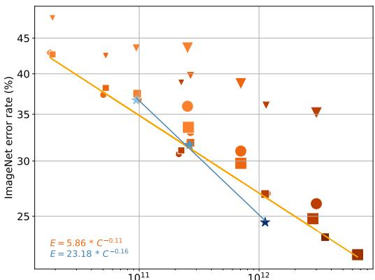
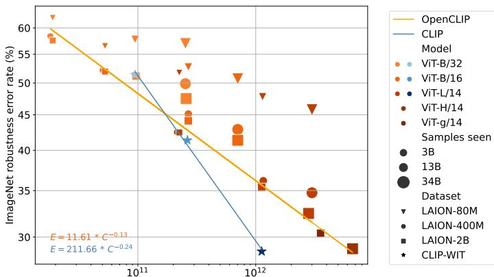
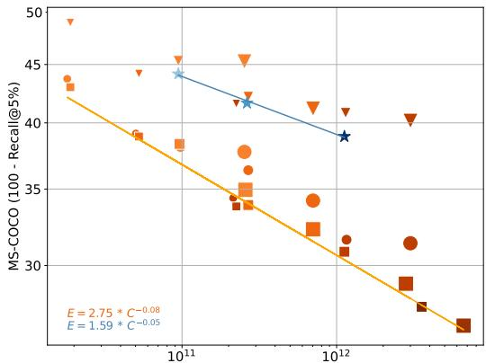
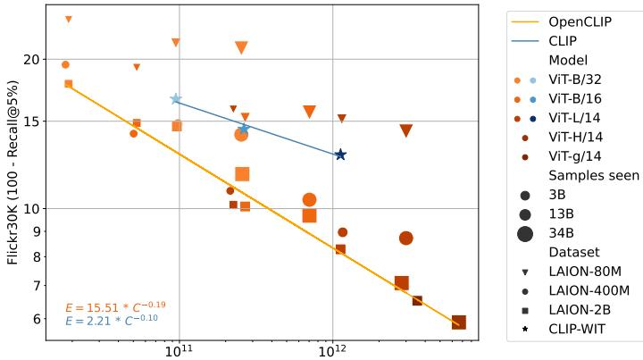
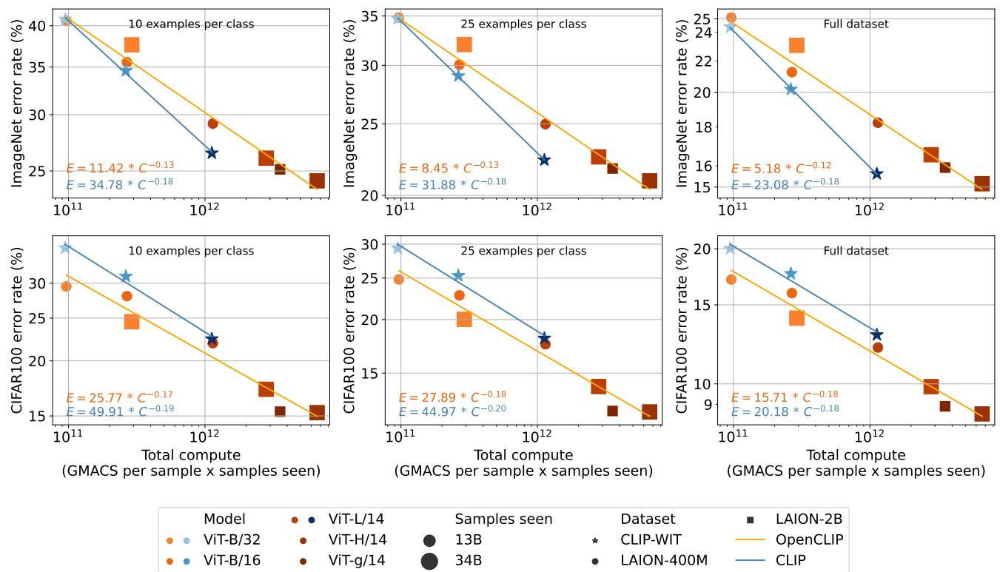
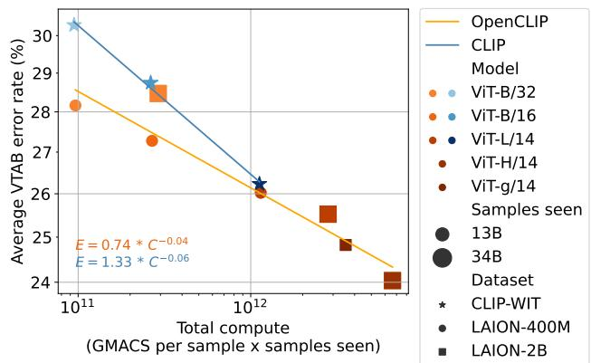
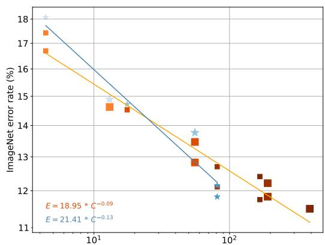
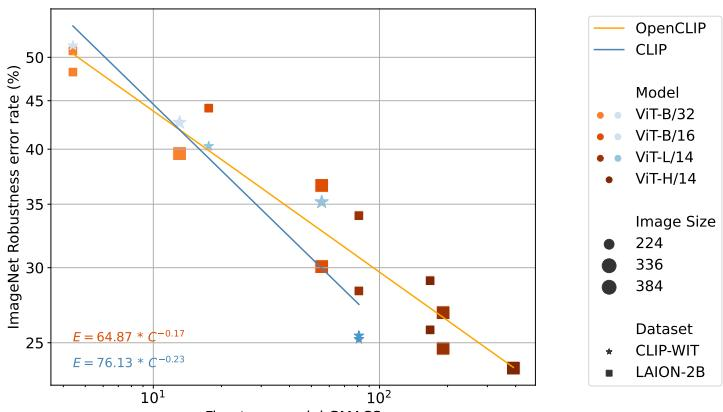
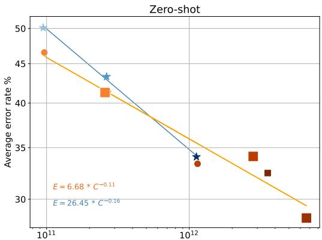
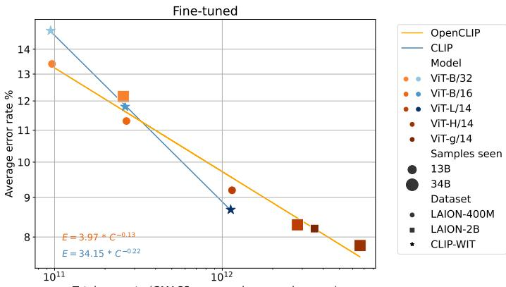

# Reproducible scaling laws for contrastive language-image learning

Mehdi Cherti1,5§§ Romain Beaumont1 §§ Ross Wightman1,3 §§ Mitchell Wortsman⁴ §§ Gabriel Ilharco4 §§ Cade Gordon2 Christoph Schuhmann1 Ludwig Schmidt1,4  Jenia Jitsev1,5 §§°° LAION¹ UC Berkeley2 HuggingFace3 University of Washington⁴ Juelich Supercomputing Center (JSC), Research Center Juelich (FZJ)⁵ contact@laion.ai, {m.cherti,j.jitsev}@fz-juelich.de SS Equal first contributions, 。。 Equal senior contributions

## Abstract

Scaling up neural networks has led to remarkable performance across a wide range of tasks. Moreover, performance often follows reliable scaling laws as a function of training set size, model size, and compute, which offers valuable guidance as large-scale experiments are becoming increasingly expensive. However, previous work on scaling laws has primarily used private data & models or focused on uni-modal language or vision learning. To address these limitations, we investigate scaling laws for contrastive language-image pretraining (CLIP) with the public LAION dataset and the opensource OpenCLIP repository. Our large-scale experiments involve models trained on up to two billion image-text pairs and identify power law scaling for multiple downstream tasks including zero-shot classification, retrieval, linear probing and end-to-end fine-tuning. We find that the training distribution plays a key role in scaling laws as the OpenAI and OpenCLIP models exhibit different scaling behavior despite identical model architectures and similar training recipes. We open-source our evaluation workflow and all models, including the largest public CLIP models, to ensure reproducibility and make scaling laws research more accessible. Source code and instructions to reproduce this study is available at https://github. com/LAION-AI/scaling-laws-openclip.

## 1. Introduction

Large pre-trained models now achieve state-of-the-art performance on a wide range of tasks. In particular, large models have led to substantial advances in speech [56], language [8, 17, 28, 57], vision [38, 84], and multi-modal language-vision settings [33,54,55,59,62]. A key ingredient in these breakthroughs has been self- or weakly-supervised learning, which enabled the use of Internet-harvested training sets and reduced the need for human annotated data. In addition, recent pre-trained models relied on increasing the compute, model, and data scale by orders of magnitude.

<table><tr><td></td><td>Data</td><td>Arch. ImageNet VTAB+ COCO</td><td></td><td></td><td></td></tr><tr><td></td><td>CLIP [55] WIT-400M L/14</td><td></td><td>75.5</td><td>55.8</td><td>61.1</td></tr><tr><td>Ours</td><td>LAION-2B</td><td>3L/14</td><td>75.2</td><td>54.6</td><td>71.1</td></tr><tr><td>Ours</td><td>LAION-2B</td><td>3H/14</td><td>78.0</td><td>56.4</td><td>73.4</td></tr></table>

Table 1. We study the scaling behavior of large CLIP models using fully open-source training code and data. All models in our investigation are available, including the largest public CLIP models. This table shows zero-shot performance at 224 pixel resolution, displaying accuracy on ImageNet [15], average accuracy on 35 VTAB+ datasets [65,85], and image retrieval recall at 5 on MS-COCO image retrieval [46].

When varying model size, compute amount, and data quantity, several papers have empirically observed that both pre-training loss and downstream task performance reliably improve with scale. Specifically, researchers have postulated scaling laws in the form of power law relationships between model performance and model compute, or data scale [35, 61, 73,84]. Such scaling laws allow practitioners to predict model performance for a given model and compute scale, extrapolate to larger scales, and can be used to determine pre-training regimes that obtain optimal model performance for a fixed amount of compute [28, 35].

So far, the literature on empirical scaling laws has focused on language-only [28, 35, 73] or vision-only models [25,61,83]. In the multimodal domain of language and vision, contrastive language-image models such as CLIP [55] have recently achieved large performance gains in zeroimage classification, for instance improving zero-shot ImageNet accuracy from the prior state-of-the-art of 12% to 76%. Moreover, these models demonstrate unprecedented robustness to distribution shifts compared to prior supervised models [55,71, 78]. However, there is currently no systematic investigation for scaling trends in contrastive languageimage learning. One substantial challenge in this direction is that until recently, there were no datasets of sufficiently large scale openly available for the research community to undertake such experiments.

  
Total compute (GMAC per sample x samples seen)

  
Total compute (GMAC per sample x samples seen)

(a) Relationship between total training compute and zero-shot classification performance on downstream tasks. Left: ImageNet performance. Right: average performance on five ImageNet robustness datasets (ImageNet-V2 [60], ImageNet-R [22], ImageNet-Sketch [75], ObjectNet [5], and ImageNet-A [24]). Scaling model size, data size, and samples seen leads to better performance on zero-shot classification. Models trained on OpenAI's WebImageText (WIT) show a stronger scaling than models trained on LAION.  
  
Total compute (GMAC per sample x samples seen)

  
Total compute (GMAC per sample x samples seen)  
(b) Relationship between total training compute and zero-shot image retrieval performance on MS-COCO (Left) and Flickr30K (Right). Scaling model size, data size, and samples seen leads to better performance on zero-shot image retrieval. Interestingly, in contrast to zero-shot classification (Figure 1a), models trained on LAION show a stronger scaling trend than OpenAI CLIP models trained on OpenAI's WebImageText (WIT) dataset.  
Figure 1. Relationship between total training compute and performance in zero-shot classification (1a) and retrieval (1b). We fit a power-law on the Pareto frontier of the available models. Since total compute budgets (measured in GMAC) of different trained models are not exactly aligned, we divide the total compute scale into bins and select the best model performance from each bin.

In this work, we conduct a scaling laws study for contrastive language-vision learning by utilizing the recently released LAION-5B [65] dataset of 5 billion image-text pairs. To ensure that our experiments are fully reproducible, we use the open source OpenCLIP [32] code to train CLIP models while varying model, data, and samples seen. We evaluate our CLIP models on several downstream tasks, including zero-shot classification, image retrieval, and fine-tuning via linear probing and end-to-end optimization. We observe a consistent increase in performance when scaling model, data, and compute, and derive scaling laws of power law form across different downstream tasks (Figure 1a, 1b). Interestingly, when comparing our OpenCLIP and OpenAI's original CLIP models, we find larger scaling coefficients for OpenCLIP models on zero-shot retrieval, while OpenAI CLIP models show stronger scaling for zero-shot classification. Table 1 shows two of our models and their results on image classification and retrieval benchmarks.

We hypothesize that the training dataset is responsible for the task-dependent differences in scaling behavior between the OpenCLIP and OpenAI models. Our experiments have used the same ViT architectures as the OpenAI models, and the training recipes are largely matched. The main difference in training recipes is the batch size due to different compute environments, and our experiments with varying batch sizes suggest that the batch size changes do not explain the change in scaling trends.

Overall our findings highlight the design of pre-training datasets as an important direction to further improve imagetext models. Dataset designers should measure scaling behavior so that the generalization capabilities of image-text models can continue to improve as we increase model size and the amount of compute. Moreover, pre-training datasets should be evaluated on a broad range of downstream tasks because model scaling can differ substantially by task with different pre-training sources leading to different scaling behavior by task. We hope that our open-source and reproducible scaling trends offer concrete starting points for improving current image-text datasets and models.

## 2. Background and related work

Scaling laws for generalization and transfer. Strong empirical evidence that increasing model or data scale is beneficial was initially studied in the context of deep learning and computer vision [26, 70]. For instance, in [26], the power law relation between scale and model performance was highlighted. Empirical work stimulated theoretical studies that provided justification for the observed generalization boost with scale, investigating generalization error in overparameterized networks in the interpolation regime [6, 9].

Early empirical studies focused on the effect of training scale on upstream performance, measuring the test loss from the same distribution used for training. Subsequent studies of large language models such as GPT-3 [8] demonstrated broad generalization capabilities in models with substantially larger scale. Moreover, neural scaling laws of the power law form were derived for language models, connecting model, data, and training compute scale to performance [28, 35, 73]. This also allowed accurate prediction of model performance at larger scales, and researchers were able to determine the scale parameters for achieving optimal performance given a fixed amount of compute [28, 39]. Scaling law studies were then also studied in the vision domain [61, 84], also observing a power law dependency of performance on scale.

Scaling law studies were also conducted for transfer and out-of-distribution performance [35, 73,84]. In these studies, researchers observed that performance on downstream tasks benefits from increasing model, data, and training compute scale [8, 35, 38, 84]. Interestingly, upstream performance does not always correlate with downstream performance [72, 73]. Since downstream performance most accurately reflects a practical use cases, examining scaling behavior on downstream tasks is increasingly important. Recent work has also studied the effect of scale on other model characteristics, such as performance after pruning and compression [11, 64] and on susceptibility to catastrophic forgetting [58].

Scaling up language-vision learning. Learning from very large amounts of weakly aligned image-text pairs has led to the development of models with broad generalization capabilities. Notably, work on contrastive language-image pre-training (CLIP [55]) showed dramatic improvement compared to the previous state-of-the-art in zero-shot transfer and unprecendented robustness to distribution shift [18, 48,51, 71]. The success of the initial CLIP study, which used a private WIT-400M image-text pairs dataset and ViT-L/14 as the largest scale vision encoder, motivated further developments and numerous extensions that increased model and data scale. ALIGN [33] used a private dataset of 1.8B text-image pairs and a large EfficientNet-L2 as an image encoder. BASIC [54] employed a large CoAttNet-7 model with 2.4B parameters for the image encoder, also further increasing dataset size up to 6.6B image-text pairs, using supervised visual encoder pre-training and private datasets (ALIGN and JFT-5B). LiT [86] used a private dataset of 4B image-text samples for contrastive learning on a total of 18B samples, scaling the visual encoder up to ViT-g/14, which was pre-trained in a supervised manner using another private dataset (JFT-3B). CoCa [81] used ViT-g/14 as a visual encoder and both the ALIGN and JFT private datasets, and an additional text captioning loss based on autoregressive language modeling during pre-training. LiMoE [49] trained a sparse mixture-of-experts (MoE) single tower architecture that share a common backbone for both vision and text using both private 3.6B image-text data from LiT and JFT-4B [84], obtaining a ViT H/14 model at the largest scale. Flamingo [3] uses a large private interleaved image-text dataset, using NFNet-F6 as a visual encoder while scaling up the text encoder from 1.4B to 70B parameters. PaLI [12] trained a multi-language multi-task text-image model using ViT-e (4B parameters) as a visual encoder and mT5-XXL (13B parameters) as a text encoder, trained on a private dataset (WebLI) with 29B image-text pairs. While these studies already show clear merits of scaling up, they do not conduct a thorough scaling investigation by systematically scaling model, data and, training compute. Moreover, most studies involve a customized multi-stage training procedure, where encoders may be pre-trained separately with uni-modal losses, and then tuned further with a contrastive image-text loss, while also potentially freezing one of the encoders [54,86]. This makes it difficult to derive conclusions about the effect of scale as pre-training procedures are heterogeneous. In addition, the private nature of the employed datasets impairs reproduction and validation of the results, especially in cases where pre-trained models are also not publicly available.

Open large-scale language-vision datasets. Conducting scaling law studies requires sufficiently large pre-training datasets. Earlier efforts to provide open image-text datasets like MS-COCO [46], Visual Genome [42], YFCC-100M [74], Conceptual Captions CC3M and CC12M [30,67] do not match the current scale of private data used to train largescale language vision models. More recently, larger imagetext datasets have been collected from Common Crawl [1]. The resulting datasets, LAION-400M [66] and LAION-5B [65] are publicly available, enabling training language-vision models at larger scale [27, 49, 63]. Using the LAION toolset [65], it also became possible to construct additional open datasets, such as COYO-700M [10].

## 3. Datasets and Methods

## 3.1. Open large-scale datasets LAION-400M/2B

We use the LAION-400M [66] and LAION-5B [65] datasets which are open, public image-text datasets validated by the pre-training of state-of-the art multi-modal models such as CLIP [55] and Stable Diffusion [63]. LAION-5B contains an English image-text subset of 2.32 billion samples, which we refer to as LAION-2B in this work. Due to its scale, transparency and open-source nature, LAION has already been adopted by various works on language-vision modelling, validating its suitability for systematic scaling law studies.

## 3.2. Pre-training OpenCLIP across various scales

To systematically vary model scale, data scale and the number of samples seen during pre-training, we selected a scale range for each dimension. For model scale, we choose CLIP architectures with ViT-B/32, ViT-B/16, ViT-L/14, ViT-H/14 and ViT g/14 as visual encoders, scaling the text encoder in accord (see Appendix Table 25). For data scale, we use LAION-80M (an 80M subset of LAION-400M), LAION-400M, and LAION-2B. For training duration, we choose 3B, 13B and 34B samples seen scales. Due to compute constraints, for the larger H/14 and g/14 model scales, we conduct only restricted measurements (done for LAION-2B, with 34B samples seen for H/14, and with 13B samples seen for g/14). This selection provides coverage at the scale where we cannot afford to sample with the same density as at the intermediate and lower model scales. To verify that LAION-80M and LAION-400M are valid subsets of LAION-2B, we conduct a control experiment by extracting a random 400M subset of LAION-2B and comparing our reference OpenCLIP ViT-B/32 models pre-trained on both datasets. When doing so, we found no significant difference (see Appendix Sec. B.2.3).

Compared to the original CLIP training procedure [55], we work with larger batch sizes and adapt the learning rate accordingly. We opt for larger batch sizes to allow for more efficient distributed training; maximizing the local batch size per GPU and using close to one thousand GPUs lead us to global batch sizes in the range of 86-88K samples. In order to assess the validity of re-using measurements obtained with different batch sizes, we perform a number of control experiments varying batch size from 32K to 86-88K, and observe a difference of 0.2 — 0.5% across different settings (see Appendix Sec. B.2.3), which is small enough not to confound observations on the effect of scale.

For each number of samples seen scale, we execute a separate training experiment with a cosine annealing learning schedule adapted to the number of samples. This allows us to assess performance of models pre-trained with different training durations and avoid suboptimal training when using the same schedule for runs of different length [28]. We tune a small number of hyper-parameters (see Appendix Table 18), each scale point to optimize validation loss and prevent training instabilities, and otherwise closely follow the original CLIP training procedure [55], using the InfoNCE loss, Adam with decoupled weight regularization [47] (i.e., AdamW) as an optimizer, with $\beta _ { 1 } = 0 . 9 , \beta _ { 2 } = 0 . 9 8$ and weight decay of 0.2. We train the models using mixed precision. For larger model scales (ViT-L/14, H/14, g/14), we observed loss spikes during training which had an adverse effect on performance. We fixed the issue by switching from mixed precision with float16 to mixed precision with bfloat16.1 We hypothesize that bfloat16 fixed the issue due to larger models typically showing larger activation values as observed by [16], making bfloat16 more suitable with its wider dynamic range (8 exponent bits).

CLIP pre-training experiments on larger scales require distributed training, as otherwise experiment execution times are intractable. We use OpenCLIP [32], an open source software that was adapted for distributed training on supercomputers. Using data parallel training via PyTorch DDP [45, 53], we conduct experiments with up to 1520 NVIDIA A100 GPUs. Distributed training was executed on JUWELS Booster [34], the supercomputer at Juelich Supercomputing Center (JSC, Germany), and partly also at Stability AI AWS supercomputer [2]. For more details on distributed training procedure and on experiment compute budgets and runtimes, see Appendix Sec.A and Sec. B.2.4.

## 4. Scaling laws for different downstream tasks

## 4.1. Zero-shot transfer and robustness

One of the biggest advantages of open-vocabulary models like CLIP is that they can be used on downstream classification tasks by carefully designing text prompts corresponding to class descriptions, without requiring any labeled training example. Moreover, pre-trained CLIP models are observed to excel on out-of-distribution robustness benchmarks [48,55]. In this section, we study the effect of scale on zero-shot classification, including an investigation on robustness benchmarks. We evaluate the models on ImageNet [15] ImageNet distribution shift datasets [5,22–24, 75], and the visual task adaptation benchmark (VTAB) [85]. We conduct a simple duplication check for downstream datasets based on the perceptual image hash library pHash [82], revealing no or very little overlap with pre-training datasets (see Appendix Sec. B.1).

Evaluation setup. We follow the setup of Radford et al. [55]. For each downstream dataset, we use a set of predefined prompts for each class, which we collected from prior works [55, 86]. We compute the embedding of each class by averaging over the embeddings of the prompts obtained using the text tower, then we L2-normalize them. Given a dataset $\{ ( x _ { i } , y _ { i } ) \} _ { i = 1 } ^ { n } ,$ we classify each image as the class that has the largest cosine similarity with the (L2- normalized) image embedding, $\hat { y } _ { i } = \mathrm { a r g m a x } _ { j } ( \phi ( x _ { i } ) ^ { T } c _ { j } )$ We evaluate the models using top-1 accuracy. For comparison to OpenAI CLIP, we take ViT-B/32, B/16, and L/14 models pre-trained on the private WIT-400M dataset.

Effect of scale. Accuracy consistently improves when increasing model, data and samples seen scale hand-in-hand. Accuracy follows power laws, such that larger models benefit from larger data and samples seen scale (Figure 1a). The strongest ImageNet accuracy (78%) is obtained with the largest total pre-training compute, using ViT-H/14 pretrained on LAION-2B data scale and 34B samples seen. For additional results, see Appendix Sec. B.2.4.

Fitting power-law $( E ~ = ~ \beta C ^ { \alpha } )$ on the Pareto frontier of the available models, we measure scaling coefficients $\alpha _ { \mathrm { o p e n C L I P } } = - 0 . 1 1$ and $\alpha _ { \mathrm { C L I P } } = - 0 . 1 6$ for zero-shot top-1 ImageNet and $\alpha _ { \mathrm { o p e n C L I P } } = \mathrm { - 0 . 1 3 }$ and $\alpha _ { \mathrm { C L I P } } ~ = ~ - 0 . 2 4$ for ImageNet robustness datasets performance $[ 2 2 - 2 4 , 7 5 ]$ For those tasks, we observe a scaling advantage for CLIP pre-trained on WIT-400M over OpenCLIP pre-trained on LAION-400M/2B. $\alpha _ { \mathrm { o p e n C L I P } }$ is similar for ImageNet and robustness datasets, suggesting that improving accuracy with scale leads to corresponding improvement on robustness benchmarks for OpenCLIP pre-trained on LAION.

We also find bottleneck effects when scaling. For instance, OpenCLIP ViT-B/32 and ViT-B/16 models show no change or deterioration of performance when increasing data scale from 400M to 2B when using a smaller samples seen scale (3B or 13B). Moving to the largest samples seen scale (34B) then shows clear improvement for the larger 2B data scale, indicating that the number samples seen is a bottleneck (see also Appendix Table 19).

Using the obtained power law, we can make a prediction for the performance of a well-tuned ViT-g/14 model when using the largest data scale of 2B and samples seen scale of 34B, giving us error estimate of 20.9% (79.1% top-1 accuracy) on ImageNet. We predict even stronger performance at larger scales. For instance, assuming 68B samples seen we estimate top-1 accuracies of 79.7%, 80.7%, and 81.9% for ViT-H/14, ViT-g/14 and ViT-G/14, respectively (see also Appendix Sec. B.2.1).

## 4.2. Retrieval

Retrieval is another common way to evaluate zero-shot capabilities of the models. In this section, we study the effect of scale on both text and image zero-shot retrieval.

Evaluation setup. We compute text-image scores using the cosine similarity between image and text embeddings and rank the top-K images (resp. text captions) for each text caption (resp. images) when evaluating on image (resp. text) retrieval. We evaluate on MS-COCO [46] and Flickr30K [80], following the evaluation setup and test splits from [36]. We use Recall@K as an evaluation metric where $K = 5$

Effect of scale. Again we observe performance consistently improves when increasing scale following power law trends (Figure 1b). We measure scaling coefficients $\alpha _ { \mathrm { o p e n C L I P } } =$ -0.08 and $\alpha _ { \mathrm { C L I P } } = - 0 . 0 5$ for zero-shot retrieval on MS-COCO and $\alpha _ { \mathrm { o p e n C L I P } } ~ = ~ - 0 . 1 9$ and $\alpha _ { \mathrm { C L I P } } ~ = ~ - 0 . 1 0$ for Flickr30K. In contrast to zero-shot accuracy, retrieval performance shows a scaling advantage for OpenCLIP pre-trained on LAION-400M/2B over CLIP pre-trained on WIT-400M. We also observe scale bottleneck effects. For instance, Open-CLIP ViT-L/14 model shows almost no improvement on LAION-400M when increasing the number of samples seen scale from 13B to 34B, indicating a data scale bottleneck. When increasing data scale to 2B, we then observe clear improvements when going from 13B to 34B samples (see also Appendix Table 21 and 22).

## 4.3. Full and few-shot linear probing

Another common way to measure the quality of learned representations is by training a linear classifier. While this technique underperforms end-to-end fine-tuning, it is often preferred because it requires far less compute [40,55]. In this section we train linear classifiers, also referred to as linear probes, on the frozen representations of various CLIP models and examine the effect of data and model scale.

Evaluation setup. Given a CLIP model with an image tower $\phi ,$ our goal is to learn W such that $W ^ { \top } \phi ( x )$ classifies x as its label $y .$ Given a dataset $\{ ( x _ { i } , y _ { i } ) \} _ { i = 1 } ^ { n }$ , we begin by saving the image features and labels for the dataset. That is, for all image label pairs $( x , y )$ in the dataset we cache $( \phi ( x ) , y )$ . We then train a linear classifier W to minimize the cross entropy loss between softmax $\left( W ^ { \top } \phi ( x ) \right)$ and $y .$ In preliminary experiments we found that this softmax regression achieved higher accuracy than linear regression. We use mini-batch stochastic optimization with the Adam optimizer [37]. We use batch size 256 and select the best result in a hyper-parameter sweep over learning rate $\{ 0 . 1 , 0 . 0 1 , 0 . 0 0 1 \}$ and epochs {10, 20, 40} individually for each model and dataset. For the ImageNet [15] and CI-FAR100 datasets [43] we consider 10-shot, 25-shot, and full-dataset linear classifers (Figure 2). Additionally, we train linear classifiers on the visual task adaptation benchmark (VTAB) [85] (Figure 3).

  
Figure 2. Scaling model and data size leads to lower error linear classifers on ImageNet [15] and CIFAR-100 [43] in both the few-shot and full dataset regime. We train linear probes for models with at least 13B samples seen (also see corresponding Table 5).

  
Figure 3. Scaling model and data size leads to lower error linear classifers on the visual task adaptation benchmark (VTAB) [85]. We train linear probes for models with at least 13B samples seen (also see corresponding Table 5).

Effect of scale. For ImageNet, CIFAR100, and VTAB, scaling up consistently improves the accuracy of a linear classifier (Figure 2, 3). For ImageNet and CIFAR100, this is true in both the few-shot and full regimes. Moreover, among models trained on the same data distribution, scaling up follows a linear trend on a log-log plot. These results are perhaps not too surprising given similar observations for power laws on zero-shot downstream tasks in Section 4.1 as well as the correlation between zero-shot and linear probe performance observed by Radford et al. [55]. Nonetheless, this result re-affirms that scaling up model and data size leads to contunied accuracy improvements.

## 4.4. Fine-tuning

Next, we evaluate the effect of scale on fine-tuning performance. Since fine-tuning is much more compute-intensive than zero-shot and linear probing, we only evaluate a subset of the pre-trained models.

Evaluation setup. We fine-tune and evaluate on ImageNet with the timm [77] library, using the image encoder from CLIP models trained on 2B data, 34B samples seen scale. To get the best results, we consider two different schemes, (A) fine-tune directly on ImageNet (B) first fine-tune on a subset of the full ImageNet-22k we call ImageNet-12k² then continue fine-tuning on ImageNet, similar to [4]. We compare the results with OpenAI CLIP models fine-tuned with the same settings, evaluating the models using top-1 accuracy on ImageNet and the ImageNet distribution shift datasets [5,22–24, 75]. The OpenCLIP models range from 82.6 to 88.5% top-1 on ImageNet, comparable to the best released ImageNet models pretrained on public datasets [4]. For additional details, including strong supervised baselines, see Appendix sec. B.2.2.

  
Fine-tune model GMACS

  
Fine-tune model GMACS  
Figure 4. ImageNet and ImageNet robustness datasets classification performance for fine-tuned models.

  
Total compute (GMACS per sample x samples seen)

  
Total compute (GMACS per sample x samples seen)  
Figure 5. Scaling model and data size leads to lower error after jointly fine-tuning on eight downstream image classification tasks. In this experiment, we fine-tune a single model jointly on all eight tasks, alternating batches from each task. We fine-tune only the parameters of the vision encoder, using a fixed classification head for each task initialized with the weights from the zero-shot model.

In addition, we fine-tune and evaluate on eight diverse datasets where zero-shot models perform poorly [31, 55]: Cars [41], DTD [14], EuroSAT [21], GTSRB [69], MNIST [44], RESISC45 [13], SUN397 [79], and SVHN [50]. We fine-tune a single model jointly on the eight downstream tasks following Ilharco et al. [31], fine-tuning only the parameters of the vision encoder. The classification heads for each task are obtained using the zero-shot text encoder, and are kept frozen during fine-tuning. We fine-tune for 2000 iterations with a batch size of 128, learning rate 1e-5 and a cosine annealing learning rate schedule with 200 warm-up steps and the AdamW optimizer [47], with weight decay 0.1. We further explore the effect of fine-tuning on zero-shot ImageNet accuracy in the Appendix Sec. B.2.2.

Effect of scale. For ImageNet fine-tuning, only the models with the largest data and samples seen were fine-tuned. Despite the narrower scale range, a similar relationship in the slope of the OpenAI CLIP vs OpenCLIP fit lines is observed across the model scales (Figure 4). Moreover, scale consistently improves accuracy when fine-tuning on other downstream tasks (Figure 5). While trends vary with the task, we find that the slope of the linear trend relating accuracy and total compute used for pre-training depends on the pre-training dataset, typically favors CLIP WIT-400M, as we observe in zero-shot experiments.

## 5. Discussion

Larger scale improves performance across different downstream tasks. In line with previous studies [35, 61, 73, 84], our work observes scaling laws of power law form across various downstream tasks. We empirically find that scaling model, data and training samples seen results in consistent improvements on downstream zero-shot classification retrieval, linear probing, and fine-tuning performance.

We also observe bottleneck behaviors [35,84] that occur when fixing one scaling dimension while increasing others. For instance, OpenCLIP ViT-B/32 and ViT-B/16 are bottlenecked by the number of samples seen at the 13B scale. Increasing the number of samples seen to 34B reveals that

LAION-2B brings clear improvement over LAION-400M, which would remain hidden when fixing the number of samples seen scale to a lower value. Similar observations may occur along other scaling dimensions. OpenCLIP ViT L/14 shows an example of data scale bottleneck on LAION-400M scale, as increasing the number of samples seen from 13B to 34B does not lead to improvements. The benefit of using a larger number of samples seen is then revealed when going to the larger LAION-2B dataset.

Having derived scaling laws from our experimental observations, we are able to make predictions for both smaller and larger scales. Extrapolation has its limits, as saturation effects at both lower and higher scale ranges have been previously observed. We can however extrapolate to scales close to the ones we have already measured. A prediction for larger ViT-g/14 trained on LAION-2B with 34B samples delivers an estimate of 79.1% ImageNet top-1 accuracy. This may appear at first sight modest compared to results reported by BASIC (85.7% [54]), LiT (85.2% [86]) or CoCA (86.1% [81]). However, these works leverage an internal JFT dataset with labels which can be used for supervised pre-training. Moreover, for 973/1000 ImageNet classes, researchers were able to manually identify a correspondance from a JFT class [78]. These works also use larger encoders, larger private data, and pre-train the encoders in multiple stages. Nonetheless, we estimate based on our empirical findings that further increasing model and data scale could result in competitive models even without using labeled data, additional supervised pre-training stages or additional losses. Finally, we observe that the improvement of zero-shot ImageNet accuracy due to scaling up is accompanied by closely aligned improvements on robustness benchmarks.

Scaling behavior depends on task type and pre-training dataset. When measuring scaling coefficients for the observed power laws, we see that OpenAI CLIP and Open-CLIP have distinct scaling advantages over each other depending on the downstream task. OpenCLIP pre-trained on LAION-400M/2B data has stronger scaling trends for zero-shot retrieval, while OpenAI CLIP pre-trained on private WIT-400M data shows stronger scaling for zero-shot ImageNet classification. We hypothesize that the observed differences are due to differences in the pre-training data, as we closely follow the architectures and pre-training recipes used for the OpenAI CLIP models. WIT-400M may have a stronger affinity to ImageNet as a result of the curation procedure, while LAION-400M/2B was filtered by a pre-trained OpenAI ViT-B/32 model relying on its similarity measurements for image-text pairs, which may have rendered the dataset more suitable for retrieval based tasks. This hypothesis can be tested by systematically varying dataset composition procedure (for example by using a stronger L/14 model for filtering crawled data) and observing the effect on scaling behavior across various task types.

Limitations of the current study. Observed scaling laws are based on points we were able to obtain with available compute resources. Therefore, the density of sampling the scales space is low. We scan for hyperparameters on smaller scales only, to avoid expensive tuning on larger scales, and use the outcomes together with tuning already performed by previous work to ensure pre-trained models on all scales are not far from optimal. It was also not possible to obtain more points for OpenAI ViT CLIP due to the private nature of the WIT-400M dataset (see also Appendix Fig. 12 for additional ResNet points confirming the observed trends). Moreover, we conduct only a simple duplication check for downstream data, which may leave few duplicates undetected. Previous studies [55, 86] also reported that duplication in test sets do not significantly alter most results, potentially due to the very large scale and diversity of pre-training data.

## 6. Conclusion

We present a systematic study of scaling laws for contrastive language-image learning, investigating how scale affects performance on several downstream tasks and across adaptation methods. We find—in accord with previous works on uni-modal learning [35, 84]—a power law relation between scale (model, data and the number of samples seen) and downstream performance in a broad range of settings, including zero-shot classification, retrieval, few- and full-shot linear probing and fine-tuning. Interestingly, the scaling behavior for OpenCLIP-LAION pre-trained models and for OpenAI-WIT-400M pre-trained models differ, showing distinct benefits of one over another on different downstream tasks. We hypothesize that such task-specific scaling differences originate from the different pre-training datasets. Predictions for model performance on larger scales made on the basis of the scaling laws estimate 81.9% zeroshot top-1 accuracy on ImageNet for a ViT-G/14 CLIP model trained on 68B image-text samples from scratch.

Our study opens many directions for further investigations. Obtaining more data points for smaller and intermediate scales can provide enough sampling density to better understand the optimal configuration of model size, dataset size and number of samples seen given a fixed compute, similar to works such as [28, 39]. Scaling laws for robustness benchmarks [71] can be derived when controlling for larger accuracies observed at larger scales. Further, treating vision and text encoder scales separately may lead to modality specific scaling laws. A promising direction is to study the effect of the pre-training dataset on scaling behavior. Our observations so far hint that the data source may strongly influence task-specific scaling. This paves the road for studies on foundation datasets [68]. Having open datasets [65, 66] and open source tools [32] at hand, such experiments can be conducted and reproduced in a common effort by the broader research community.

## References

[1] Common Crawl. https://commoncrawl.org.3, 13 [2]Stability AI HPC facility, https://hpc.stability.ai. 4

[3] Jean-Baptiste Alayrac, Jeff Donahue, Pauline Luc, Antoine Miech, Iain Barr, Yana Hasson, Karel Lenc, Arthur Mensch, Katie Millican, Malcolm Reynolds, et al. Flamingo: a visual language model for few-shot learning. arXiv preprint arXiv:2204.14198, 2022. 3

[4] Hangbo Bao, Li Dong, and Furu Wei. Beit: Bert pre-training of image transformers. arXiv preprint arXiv:2106.08254, 2021.6,7, 15

[5] Andrei Barbu, David Mayo, Julian Alverio, William Luo, Christopher Wang, Dan Gutfreund, Josh Tenenbaum, and Boris Katz. Objectnet: A large-scale bias-controlled dataset for pushing the limits of object recognition models. In Advances in Neural Information Processing Systems (NeurIPS), 2019. 2, 4, 6

[6] Mikhail Belkin, Daniel Hsu, Siyuan Ma, and Soumik Mandal. Reconciling modern machine-learning practice and the classical bias-variance trade-off. Proceedings of the National Academy of Sciences of the United States of America, 116:15849–15854, Aug. 2019. 3

[7] Lucas Beyer, Olivier J Hénaff, Alexander Kolesnikov, Xiaohua Zhai, and Aäron van den Oord. Are we done with imagenet?arXiv preprint arXiv:2006.07159, 2020.20

[8] Tom Brown, Benjamin Mann, Nick Ryder, Melanie Subbiah, Jared D Kaplan, Prafulla Dhariwal, Arvind Neelakantan, Pranav Shyam, Girish Sastry, Amanda Askell, Sandhini Agarwal, Ariel Herbert-Voss, Gretchen Krueger, Tom Henighan, Rewon Child, Aditya Ramesh, Daniel Ziegler, Jeffrey Wu, Clemens Winter, Chris Hesse, Mark Chen, Eric Sigler, Mateusz Litwin, Scott Gray, Benjamin Chess, Jack Clark, Christopher Berner, Sam McCandlish, Alec Radford, Ilya Sutskever, and Dario Amodei. Language models are fewshot learners. In H. Larochelle, M. Ranzato, R. Hadsell, M. F. Balcan, and H. Lin, editors, Advances in Neural Information Processing Systems, volume 33, pages 1877–1901. Curran Associates, Inc., 2020. 1, 3

[9] Sebastien Bubeck and Mark Sellke. A universal law of robustness via isoperimetry. In M. Ranzato, A. Beygelzimer, Y. Dauphin, P.S. Liang, and J. Wortman Vaughan, editors, Advances in Neural Information Processing Systems, volume 34, pages 28811–28822. Curran Associates, Inc., 2021. 3

[10] Minwoo Byeon, Beomhee Park, Haecheon Kim, Sungjun Lee, Woonhyuk Baek, and Saehoon Kim. Coyo-700m: Image-text pair dataset. https://github.com/kakaobrain/ coyo-dataset, 2022. 4

[11] Tianlong Chen, Jonathan Frankle, Shiyu Chang, Sijia Liu, Yang Zhang, Michael Carbin, and Zhangyang Wang. The lottery tickets hypothesis for supervised and self-supervised pre-training in computer vision models. In Proceedings of the IEEE/CVF Conference on Computer Vision and Pattern Recognition, pages 16306–16316, 2021. 3

[12] Xi Chen, Xiao Wang, Soravit Changpinyo, AJ Piergiovanni, Piotr Padlewski, Daniel Salz, Sebastian Goodman, Adam Grycner, Basil Mustafa, Lucas Beyer, et al. Pali: A jointly-

scaled multilingual language-image model. arXiv preprint arXiv:2209.06794, 2022. 3

[13] Gong Cheng, Junwei Han, and Xiaoqiang Lu. Remote sensing image scene classification: Benchmark and state of the art. Proceedings of the Institute of Electrical and Electronics Engineers (IEEE), 2017. https: //ieeexplore.ieee. org/abstract/document/7891544.7

[14] Mircea Cimpoi, Subhransu Maji, Iasonas Kokkinos, Sammy Mohamed, and Andrea Vedaldi. Describing textures in the wild. In Conference on Computer Vision and Pattern Recognition (CVPR), 2014. https : // openaccess.thecvf.com/content\_cvpr\_2014/ html/Cimpoi\_Describing\_Textures\_in\_2014\_ CVPR\_paper.html.7

[15] J. Deng, W. Dong, R. Socher, L. Li, Kai Li, and Li Fei-Fei. Imagenet: A large-scale hierarchical image database. In Proc. IEEE Conf. Computer Vision and Pattern Recognition, pages 248–255, June 2009. 1, 4, 5, 6, 17

[16] Tim Dettmers, Mike Lewis, Younes Belkada, and Luke Zettlemoyer. Llm. int8 (): 8-bit matrix multiplication for transformers at scale. arXiv preprint arXiv:2208.07339, 2022. 4

[17] Jacob Devlin, Ming-Wei Chang, Kenton Lee, and Kristina Toutanova. BERT: Pre-training of deep bidirectional transformers for language understanding. In Proceedings of the 2019 Conference of the North American Chapter of the Association for Computational Linguistics: Human Language Technologies, Volume 1 (Long and Short Papers), pages 4171– 4186, Minneapolis, Minnesota, June 2019. Association for Computational Linguistics. 1

[18] Alex Fang, Gabriel Ilharco, Mitchell Wortsman, Yuhao Wan, Vaishaal Shankar, Achal Dave, and Ludwig Schmidt. Data determines distributional robustness in contrastive language image pre-training (clip). arXiv preprint arXiv:2205.01397, 2022.3

[19] Yuxin Fang, Wen Wang, Binhui Xie, Quan Sun, Ledell Wu, Xinggang Wang, Tiejun Huang, Xinlong Wang, and Yue Cao. Eva: Exploring the limits of masked visual representation learning at scale. arXiv preprint arXiv:2211.07636, 2022. 14

[20] Stephan Graf and Olaf Mextorf. Just: Large-scale multi-tier storage infrastructure at the jülich supercomputing centre. Journal of large-scale research facilities JLSRF, 7:180, 2021. 27

[21] Patrick Helber, Benjamin Bischke, Andreas Dengel, and Damian Borth. Eurosat: A novel dataset and deep learning benchmark for land use and land cover classification. Journal of Selected Topics in Applied Earth Observations and RemoteSensing, 2019. https://arxiv.org/abs/1709. 00029.7

[22] Dan Hendrycks, Steven Basart, Norman Mu, Saurav Kadavath, Frank Wang, Evan Dorundo, Rahul Desai, Tyler Zhu, Samyak Parajuli, Mike Guo, Dawn Song, Jacob Steinhardt, and Justin Gilmer. The many faces of robustness: A critical analysis of out-of-distribution generalization. International Conference on Computer Vision (ICCV), 2021. https://arxiv.org/abs/2006.16241. 2,4,5,6, 20

[23] Dan Hendrycks and Thomas Dietterich. Benchmarking neural network robustness to common corruptions and perturbations. International Conference on Learning Representations (ICLR), 2019. https://arxiv.org/abs/1903. 12261.4,5,6

[24] Dan Hendrycks, Kevin Zhao, Steven Basart, Jacob Steinhardt, and Dawn Song. Natural adversarial examples. Conference on Computer Vision and Pattern Recognition (CVPR), 2021. https://arxiv.org/abs/1907.07174. 2,4,5,6, 20

[25] Tom Henighan, Jared Kaplan, Mor Katz, Mark Chen, Christopher Hesse, Jacob Jackson, Heewoo Jun, Tom B Brown, Prafulla Dhariwal, Scott Gray, Chris Hallacy, Benjamin Mann, Alec Radford, Aditya Ramesh, Nick Ryder, Daniel M. Ziegler, John Schulman, Dario Amodei, and Sam McCandlish. Scaling laws for autoregressive generative modeling. arXiv preprint arXiv:2010.14701, 2020. 1

[26] Joel Hestness, Sharan Narang, Newsha Ardalani, Gregory Diamos, Heewoo Jun, Hassan Kianinejad, Md Patwary, Mostofa Ali, Yang Yang, and Yanqi Zhou. Deep learning scaling is predictable, empirically. arXiv preprint arXiv:1712.00409, 2017.3

[27] Jonathan Ho, William Chan, Chitwan Saharia, Jay Whang Ruiqi Gao, Alexey Gritsenko, Diederik P Kingma, Ben Poole, Mohammad Norouzi, David J Fleet, et al. Imagen video: High definition video generation with diffusion models. arXiv preprint arXiv:2210.02303, 2022. 4, 14

[28] Jordan Hoffmann, Sebastian Borgeaud, Arthur Mensch, Elena Buchatskaya, Trevor Cai, Eliza Rutherford, Diego de Las Casas, Lisa Anne Hendricks, Johannes Welbl, Aidan Clark, et al. Training compute-optimal large language models. arXiv preprint arXiv:2203.15556, 2022. 1, 3, 4, 8

[29] Jeremy Howard and Sebastian Ruder. Universal language model fine-tuning for text classification. In Proceedings of the 56th Annual Meeting of the Association for Computational Linguistics (Volume 1: Long Papers), pages 328–339, Melbourne, Australia, July 2018. Association for Computational Linguistics. 15

[30] Xiaowei Hu, Zhe Gan, Jianfeng Wang, Zhengyuan Yang, Zicheng Liu, Yumao Lu, and Lijuan Wang. Scaling up visionlanguage pre-training for image captioning. In Proceedings of the IEEE/CVF Conference on Computer Vision and Pattern Recognition (CVPR), pages 17980–17989, June 2022. 3

[31] Gabriel Ilharco, Mitchell Wortsman, Samir Yitzhak Gadre, Shuran Song, Hannaneh Hajishirzi, Simon Kornblith, Ali Farhadi, and Ludwig Schmidt. Patching openvocabulary models by interpolating weights. arXiv preprint arXiv:2208.05592, 2022. 7, 15, 19, 20

[32] Gabriel Ilharco, Mitchell Wortsman, Ross Wightman, Cade Gordon, Nicholas Carlini, Rohan Taori, Achal Dave, Vaishaal Shankar, Hongseok Namkoong, John Miller, Hannaneh Hajishirzi, Ali Farhadi, and Ludwig Schmidt. Openclip, July 2021.2, 4, 8, 13

[33] Chao Jia, Yinfei Yang, Ye Xia, Yi-Ting Chen, Zarana Parekh, Hieu Pham, Quoc Le, Yun-Hsuan Sung, Zhen Li, and Tom Duerig. Scaling up visual and vision-language representation learning with noisy text supervision. In International Confer-

ence on Machine Learning, pages 4904–4916. PMLR, 2021. 1,3

[34] Juelich Supercomputing Center. JUWELS Booster Supercomputer, 2020. https://apps.fz-juelich. de/ jsc/hps / juwels /configuration .html # hardware - configuration - of - the - system - name-booster-module.4, 13,27

[35] Jared Kaplan, Sam McCandlish, Tom Henighan, Tom B Brown, Benjamin Chess, Rewon Child, Scott Gray, Alec Radford, Jeffrey Wu, and Dario Amodei. Scaling laws for neural language models. arXiv preprint arXiv:2001.08361, 2020.1, 3, 7, 8

[36] Andrej Karpathy and Li Fei-Fei. Deep visual-semantic alignments for generating image descriptions. In Proceedings of the IEEE conference on computer vision and pattern recognition, pages 3128–3137, 2015. 5

[37] Diederik P Kingma and Jimmy Ba. Adam: A method for stochastic optimization. arXiv preprint arXiv:1412.6980, 2014.5

[38] Alexander Kolesnikov, Lucas Beyer, Xiaohua Zhai, Joan Puigcerver, Jessica Yung, Sylvain Gelly, and Neil Houlsby Big transfer (bit): General visual representation learning. In Andrea Vedaldi, Horst Bischof, Thomas Brox, and Jan-Michael Frahm, editors, Computer Vision – ECCV 2020, pages 491–507, Cham, 2020. Springer International Publishing. 1, 3

[39] Skanda Koppula, Yazhe Li, Evan Shelhamer, Andrew Jaegle, Nikhil Parthasarathy, Relja Arandjelovic, João Carreira, and Olivier Hénaff. Where should i spend my flops? efficiency evaluations of visual pre-training methods. arXiv preprint arXiv:2209.15589, 2022. 3, 8

[40] Simon Kornblith, Jonathon Shlens, and Quoc V Le. Do better imagenet models transfer better? In Conference on Computer Vision and Pattern Recognition (CVPR), 2019. ht tps : // arxiv.org/abs/1805.08974.5

[41] Jonathan Krause, Michael Stark, Jia Deng, and Li Fei-Fei. 3d object representations for fine-grained categorization. In International Conference on Computer Vision Workshops (ICML), 2013. https : / / www . cv - foundation . org/ openaccess / content\_ iccv\_workshops\_2013/W19/html/Krause\_3D\_ Object\_Representations\_2013\_ICCV\_paper. html.7

[42] Ranjay Krishna, Yuke Zhu, Oliver Groth, Justin Johnson, Kenji Hata, Joshua Kravitz, Stephanie Chen, Yannis Kalantidis, Li-Jia Li, David A Shamma, et al. Visual genome: Connecting language and vision using crowdsourced dense image annotations. International journal of computer vision, 123(1):32–73, 2017.3

[43] Alex Krizhevsky. Learning multiple layers of features from tiny images. Technical report, 2009. 5, 6, 17

[44] Yann LeCun. The mnist database of handwritten digits, 1998. http://yann.lecun.com/exdb/mnist/.7

[45] Shen Li, Yanli Zhao, Rohan Varma, Omkar Salpekar, Pieter Noordhuis, Teng Li, Adam Paszke, Jeff Smith, Brian Vaughan, Pritam Damania, et al. Pytorch distributed: Experiences on accelerating data parallel training. arXiv preprint arXiv:2006.15704, 2020. 4

[46] Tsung-Yi Lin, Michael Maire, Serge Belongie, James Hays, Pietro Perona, Deva Ramanan, Piotr Dollár, and C Lawrence Zitnick. Microsoft coco: Common objects in context. In European conference on computer vision, pages 740–755. Springer, 2014. 1, 3, 5

[47] Ilya Loshchilov and Frank Hutter. Decoupled weight decay regularization. In International Conference on Learning Representations, 2019. 4, 7

[48] John P Miller, Rohan Taori, Aditi Raghunathan, Shiori Sagawa, Pang Wei Koh, Vaishaal Shankar, Percy Liang, Yair Carmon, and Ludwig Schmidt. Accuracy on the line: on the strong correlation between out-of-distribution and indistribution generalization. In International Conference on Machine Learning, pages 7721–7735. PMLR, 2021. 3, 4

[49] Basil Mustafa, Carlos Riquelme, Joan Puigcerver, Rodolphe Jenatton, and Neil Houlsby. Multimodal contrastive learning with limoe: the language-image mixture of experts. arXiv preprint arXiv:2206.02770, 2022.3, 4, 14

[50] Yuval Netzer, Tao Wang, Adam Coates, Alessandro Bissacco, Bo Wu, and Andrew Y Ng. Reading digits in natural images with unsupervised feature learning. In Advances in Neural Information Processing Systems (NeurIPS) Workshops, 2011. https://storage.googleapis.com/pubtools-public-publication-data/pdf/37648. pdf.7

[51] Thao Nguyen, Gabriel Ilharco, Mitchell Wortsman, Sewoong Oh, and Ludwig Schmidt. Quality not quantity: On the interaction between dataset design and robustness of clip. arXiv preprint arXiv:2208.05516, 2022. 3

[52] Aaron van den Oord, Yazhe Li, and Oriol Vinyals. Representation learning with contrastive predictive coding. arXiv preprint arXiv:1807.03748, 2018. 13

[53] Adam Paszke, Sam Gross, Francisco Massa, Adam Lerer, James Bradbury, Gregory Chanan, Trevor Killeen, Zeming Lin, Natalia Gimelshein, Luca Antiga, et al. Pytorch: An imperative style, high-performance deep learning library. Advances in neural information processing systems, 32, 2019. 4

[54] Hieu Pham, Zihang Dai, Golnaz Ghiasi, Hanxiao Liu, Adams Wei Yu, Minh-Thang Luong, Mingxing Tan, and Quoc V Le. Combined scaling for zero-shot transfer learning. arXiv preprint arXiv:2111.10050, 2021. 1, 3, 8

[55] Alec Radford, Jong Wook Kim, Chris Hallacy, Aditya Ramesh, Gabriel Goh, Sandhini Agarwal, Girish Sastry, Amanda Askell, Pamela Mishkin, Jack Clark, et al. Learning transferable visual models from natural language supervision. In International Conference on Machine Learning, pages 8748–8763. PMLR, 2021. 1, 3, 4, 5, 6, 7, 8, 13, 14

[56] Alec Radford, Jong Wook Kim, Tao Xu, Greg Brockman, Christine McLeavey, and Ilya Sutskever. Robust speech recognition via large-scale weak supervision. Technical report, Tech. Rep., Technical report, OpenAI, 2022. 1

[57] Colin Raffel, Noam Shazeer, Adam Roberts, Katherine Lee, Sharan Narang, Michael Matena, Yanqi Zhou, Wei Li, and Peter J. Liu. Exploring the limits of transfer learning with a unified text-to-text transformer. Journal of Machine Learning Research, 21(140):1–67, 2020. 1

[58] Vinay Venkatesh Ramasesh, Aitor Lewkowycz, and Ethan Dyer. Effect of scale on catastrophic forgetting in neural networks. In International Conference on Learning Representations, 2021. 3

[59] Aditya Ramesh, Prafulla Dhariwal, Alex Nichol, Casey Chu, and Mark Chen. Hierarchical text-conditional image generation with clip latents. arXiv preprint arXiv:2204.06125, 2022. 1

[60] Benjamin Recht, Rebecca Roelofs, Ludwig Schmidt, and Vaishaal Shankar. Do ImageNet classifiers generalize to ImageNet? In International Conference on Machine Learning (ICML), 2019. https://arxiv.org/abs/1902. 10811.2,20

[61] Carlos Riquelme, Joan Puigcerver, Basil Mustafa, Maxim Neumann, Rodolphe Jenatton, André Susano Pinto, Daniel Keysers, and Neil Houlsby. Scaling vision with sparse mixture of experts. Advances in Neural Information Processing Systems, 34, 2021. 1, 3, 7

[62] Robin Rombach, Andreas Blattmann, Dominik Lorenz, Patrick Esser, and Björn Ommer. High-resolution image synthesis with latent diffusion models. In Proceedings of the IEEE/CVF Conference on Computer Vision and Pattern Recognition, pages 10684–10695, 2022. 1

[63] Robin Rombach, Andreas Blattmann, Dominik Lorenz, Patrick Esser, and Björn Ommer. High-resolution image synthesis with latent diffusion models. In Proceedings of the IEEE/CVF Conference on Computer Vision and Pattern Recognition, pages 10684–10695, 2022. 4, 14

[64] Jonathan S Rosenfeld, Jonathan Frankle, Michael Carbin, and Nir Shavit. On the predictability of pruning across scales. In Marina Meila and Tong Zhang, editors, Proceedings of the 38th International Conference on Machine Learning, volume 139 of Proceedings of Machine Learning Research, pages 9075–9083. PMLR, 18–24 Jul 2021. 3

[65] Christoph Schuhmann, Romain Beaumont, Richard Vencu, Cade W Gordon, Ross Wightman, Mehdi Cherti, Theo Coombes, Aarush Katta, Clayton Mullis, Mitchell Wortsman, Patrick Schramowski, Srivatsa R Kundurthy, Katherine Crowson, Ludwig Schmidt, Robert Kaczmarczyk, and Jenia Jitsev. LAION-5B: An open large-scale dataset for training next generation image-text models. In Thirty-sixth Conference on Neural Information Processing Systems (NeurIPS), Datasets and Benchmarks Track, 2022. 1, 2, 4, 8, 13, 14, 22, 26

[66] Christoph Schuhmann, Richard Vencu, Romain Beaumont, Robert Kaczmarczyk, Clayton Mullis, Aarush Katta, Theo Coombes, Jenia Jitsev, and Aran Komatsuzaki. LAION-400M: Open dataset of CLIP-filtered 400 million image-text pairs. arXiv preprint arXiv:2111.02114, 2021. 3, 4, 8, 13

[67] Piyush Sharma, Nan Ding, Sebastian Goodman, and Radu Soricut. Conceptual captions: A cleaned, hypernymed, image alt-text dataset for automatic image captioning. In Proceedings of the 56th Annual Meeting of the Association for Computational Linguistics (Volume 1: Long Papers), pages 2556–2565, Melbourne, Australia, July 2018. Association for Computational Linguistics. 3

[68] Ben Sorscher, Robert Geirhos, Shashank Shekhar, Surya Ganguli, and Ari S Morcos. Beyond neural scaling laws:

beating power law scaling via data pruning. arXiv preprint arXiv:2206.14486, 2022. 8

[69] Johannes Stallkamp, Marc Schlipsing, Jan Salmen, and Christian Igel. The german traffic sign recognition benchmark: a multi-class classification competition. In International Joint Conference on Neural Networks (IJCNN), 2011. https : //ieeexplore.ieee.org/document/6033395.7

[70] Chen Sun, Abhinav Shrivastava, Saurabh Singh, and Abhinav Gupta. Revisiting unreasonable effectiveness of data in deep learning era. In Proceedings of the IEEE international conference on computer vision, pages 843–852, 2017.3

[71] Rohan Taori, Achal Dave, Vaishaal Shankar, Nicholas Carlini, Benjamin Recht, and Ludwig Schmidt. Measuring robustness to natural distribution shifts in image classification. Advances in Neural Information Processing Systems, 33:18583–18599, 2020.1,3, 8

[72] Yi Tay, Mostafa Dehghani, Samira Abnar, Hyung Won Chung, William Fedus, Jinfeng Rao, Sharan Narang, Vinh Q Tran, Dani Yogatama, and Donald Metzler. Scaling laws vs model architectures: How does inductive bias influence scaling? arXiv preprint arXiv:2207.10551, 2022. 3

[73] Yi Tay, Mostafa Dehghani, Jinfeng Rao, William Fedus, Samira Abnar, Hyung Won Chung, Sharan Narang, Dani Yogatama, Ashish Vaswani, and Donald Metzler. Scale efficiently: Insights from pretraining and finetuning transformers. In International Conference on Learning Representations, 2021.1,3,7

[74] Bart Thomee, David A Shamma, Gerald Friedland, Benjamin Elizalde, Karl Ni, Douglas Poland, Damian Borth, and Li-Jia Li. Yfcc100m: The new data in multimedia research. Communications of the ACM, 59(2):64–73, 2016. 3

[75] Haohan Wang, Songwei Ge, Zachary Lipton, and Eric P Xing. Learning robust global representations by penalizing local predictive power. In Advances in Neural Information Processing Systems (NeurIPS), 2019. https : // arxiv . org/abs/1905.13549.2,4,5,6,20

[76] Wenhai Wang, Jifeng Dai, Zhe Chen, Zhenhang Huang, Zhiqi Li, Xizhou Zhu, Xiaowei Hu, Tong Lu, Lewei Lu, Hongsheng Li, et al. Internimage: Exploring large-scale vision foundation models with deformable convolutions. arXiv preprint arXiv:2211.05778, 2022. 14

[77] Ross Wightman. Pytorch image models. https : // github .com/ rwightman /pytorch- imagemodels,2019.6

[78] Mitchell Wortsman, Gabriel Ilharco, Jong Wook Kim, Mike Li, Simon Kornblith, Rebecca Roelofs, Raphael Gontijo Lopes, Hannaneh Hajishirzi, Ali Farhadi, Hongseok Namkoong, et al. Robust fine-tuning of zero-shot models. In Proceedings of the IEEE/CVF Conference on Computer Vision and Pattern Recognition, pages 7959–7971, 2022. 1, 8

[79] Jianxiong Xiao, Krista A Ehinger, James Hays, Antonio Torralba, and Aude Oliva. Sun database: Exploring a large collection of scene categories. International Journal of Computer Vision (IJCV), 2016. https: //1ink. springer. com/article/10.1007/s11263-014-0748-y.7

[80] Peter Young, Alice Lai, Micah Hodosh, and Julia Hockenmaier. From image descriptions to visual denotations: New

similarity metrics for semantic inference over event descriptions. Transactions of the Association for Computational Linguistics, 2:67–78, 2014. 5

[81] Jiahui Yu, Zirui Wang, Vijay Vasudevan, Legg Yeung, Mojtaba Seyedhosseini, and Yonghui Wu. CoCa: Contrastive captioners are image-text foundation models. Transactions on Machine Learning Research, 2022. 3, 8

[82] Christoph Zauner. Implementation and benchmarking of perceptual image hash functions. 2010. 4, 14, 15, 16

[83] Xiaohua Zhai, Alexander Kolesnikov, Neil Houlsby, and Lucas Beyer. Scaling vision transformers. arXiv preprint arXiv:2106.04560, 2021. 1

[84] Xiaohua Zhai, Alexander Kolesnikov, Neil Houlsby, and Lucas Beyer. Scaling vision transformers. In Proceedings of the IEEE/CVF Conference on Computer Vision and Pattern Recognition, pages 12104–12113, 2022. 1, 3, 7, 8

[85] Xiaohua Zhai, Joan Puigcerver, Alexander Kolesnikov, Pierre Ruyssen, Carlos Riquelme, Mario Lucic, Josip Djolonga, Andre Susano Pinto, Maxim Neumann, Alexey Dosovitskiy, et al. A large-scale study of representation learning with the visual task adaptation benchmark. arXiv preprint arXiv:1910.04867, 2019. 1, 4, 6, 17

[86] Xiaohua Zhai, Xiao Wang, Basil Mustafa, Andreas Steiner, Daniel Keysers, Alexander Kolesnikov, and Lucas Beyer. LiT: Zero-shot transfer with locked-image text tuning. In Proceedings of the IEEE/CVF Conference on Computer Vision and Pattern Recognition, pages 18123–18133, 2022.3, 5, 8, 14