# Revisiting Residual Networks for Adversarial Robustness

Shihua Huang1 Zhichao Lu2\* Kalyanmoy Deb1 Vishnu Naresh Boddeti¹

1 Michigan State University 2 Sun Yat-sen University

{shihuahuang95, luzhichaocn}@gmail.com{kdeb, vishnu}@msu.edu

## Abstract

Efforts to improve the adversarial robustness of convolutional neural networks have primarily focused on developing more effective adversarial training methods. In contrast, little attention was devoted to analyzing the role of architectural elements (e.g., topology, depth, and width) on adversarial robustness. This paper seeks to bridge this gap and present a holistic study on the impact of architectural design on adversarial robustness. We focus on residual networks and consider architecture design at the block level as well as at the network scaling level. In both cases, we irst derive insights through systematic experiments. Then we design a robust residual block, dubbed RobustResBlock, and a compound scaling rule, dubbed RobustScaling, to distribute depth and width at the desired FLOP count. Finally, we combine RobustResBlock and RobustScaling and present a portfolio of adversarially robust residual networks, RobustResNets, spanning a broad spectrum of model capacities. Experimental validation across multiple datasets and adversarial attacks demonstrate that RobustResNets consistently outperform both the standard WRNs and other existing robust architectures, achieving state-ofthe-art AutoAttack robust accuracy 63.7% with 500K external data while being 2× more compact in terms of parameters. Code is available at this URL.

## 1. Introduction

Robustness to adversarial attacks is critical for practical deployments of deep neural networks. Current research on defenses against such attacks has primarily focused on developing better adversarial training (AT) methods [19, 27,32, 35, 39]. These techniques and the insights derived from them have primarily been developed by fixing the architecture of the network, typically variants of wide residual networks (WRNs) [38]. While a significant body of knowledge exists on designing effective neural networks for vision tasks under standard empirical risk minimization (ERM) training, i.e., traditional learning without inner optimization needed in AT, limited attention has been devoted to studying the role of architectural components on adversarial robustness. However, as we preview in Figure 1, architectural components can impact adversarial robustness as much as, if not more than, different AT methods. As such, there is a large void in practitioners' toolboxes for designing architectures with better adversarial robustness properties.

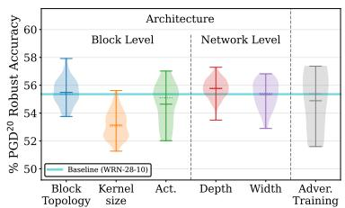

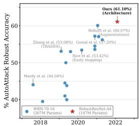  
Figure 1. (L) Impact of architectural components on adversarial robustness on CIFAR-10, relative to that of adversarial training methods. The variations of each component are elaborated in §4. (R) Progress of SotA robust accuracy against AutoAttack without additional data on CIFAR-10 with $\ell _ { \infty }$ perturbations of € = 8/255 chronologically. We show that innovation in architecture (this paper) can improve SotA robust accuracy while simultaneously being almost 2× more compact. Zoom in for details.

The primary goal of this paper is to bridge this knowledge gap by (i) systematically studying the contribution of architectural components to adversarial robustness, (ii) identify critical design choices that aid adversarial robustness, and (iii) finally construct a new adversarially robust network that can serve as a baseline and test bed for studying adversarial robustness. We adopt an empirical approach and conduct an extensive amount of carefully designed experiments to realize this goal.

We start from the well-founded observation that networks with residual connections exhibit more robustness to adversarial attacks [3], and thus, consider the family of residual networks. Then we systematically assess the two main aspects of architecture design, block structure and network scaling, and adversarially train and evaluate more than 1200 networks. For block structure, we consider the choice of layers, connections among layers, types of residual connections, activation, etc. For network scaling, we consider the width, depth, and interplay between them. To ensure the generality of the experimental observations, we evaluate them on three different datasets and against four adversarial attacks. To ensure the reliability of the empirical observations, we repeat each experiment multiple times with different seeds. Based on our empirical observations, we identify architectural design principles that significantly improve the adversarial robustness of residual networks. Specifically, we make the following new observations:

Placing activation functions before convolutional layers (i.e., pre-activation) is, in general, more beneficial with adversarial training, as opposed to post-activation used in standard ERM training. And sometimes, it can critically affect block structures such as the basic block used in WRNs. (§4.1.1, Figure 3a - 3c)

Bottleneck block improves adversarial robustness over the de-facto basic block used in WRNs. In addition, both aggregated and hierarchical convolutions derived under standard ERM training lead to improvements under adversarial training. (§4.1.1, Figure 3d and 4).

A straightforward application of SE [16] degrades adversarial robustness. Note that this is unlike in standard ERM training, where SE consistently improves performance across most vision tasks when incorporated into residual networks (§4.1.1, Figure 5).

⑤ The performance of smooth activation functions is critically dependent on adversarial training (AT) settings and datasets. In particular, removing BN affine parameters from weight decay is crucial for the effectiveness of smooth activation functions under AT. (§4.1.2)

Under the same FLOPs, deep and narrow residual networks are adversarially more robust than wide and shallow networks. Specifically, the optimal ratio between depth and width is 7 : 3. (§4.2.2)

© In summary, architectural design contributes significantly to adversarial robustness, particularly the block topology and network scaling factors.

With these insights, we make the following contributions:

• We propose a simple yet effective SE variant, dubbed residual SE, for adversarial training. Empirically, we demonstrate that it leads to consistent improvements in the adversarial robustness of residual networks across multiple datasets, attacks, and model capacities.

• We propose RobustResBlock, a novel residual block topology for adversarial robustness. It consistently outperforms the de-facto basic block in WRNs by\~ 3% robust accuracy across multiple datasets, attacks, and model capacities.

• We present RobustScaling, the first compound scaling rule to efficiently scale both network depth and width for adversarial robustness. Technically, RobustScaling can scale any architecture (e.g., ResNets, VGGs,

DenseNets, etc.). Experimentally, we demonstrate that RobustScaling is highly effective in scaling WRNs, where the scaled models yield consistent \~ 2% improvements on robust accuracy while being \~ 2× more compact in terms of learnable parameters over standard WRNs (e.g., WRN-28-10, WRNs-70-16).

• We present a new family of residual networks, dubbed RobustResNets, achieving state-of-the-art AutoAttack [5] robust accuracy of 61.1% without generated or external data and 63.7% with 500K external data while being 2× more compact in terms of parameters.

## 2. Background and Related Work

This section provides a brief overview of related work. Readers are referred to Appendix for more details.

Adversarial Training as a Defense. Adversarial training (AT) has emerged as one of the most effective ways to guard against adversarial attacks. The basic idea of AT is to leverage AEs during the training process of a DNN model. Early work on AT [19] used inputs perturbed by PGD for training. Since then, AT techniques have been extended in multiple directions – customized loss functions to balance the trade-off between natural and robust accuracy [39] or making use of misclassified natural examples [33]; advanced AT procedures such as early stopping to prevent robust overfitting [24] and weight ensembling [4, 18, 30]; more diverse data for training by generative modeling [11, 26] or data augmentation [23].

Robust Architecture. A few attempts have been made to explore the impact of architectural components on adversarial robustness. From a block structure point of view, (1) Cazenavette et al. showed that residual connections significantly aid adversarial robustness [3]; (2) Xie et al. showed that smooth activation functions lead to better adversarial robustness on ImageNet [36], with a similar observation by Pang et al. on CIFAR-10 with ResNet-18 [21]; (3) Dai et al. identified that parameterized activation functions have better robustness properties [6]. However, neither of these studies verified their corresponding observations across different model capacities and datasets.

From a network's scaling factors point of view, the prevailing convention favors wide networks, i.e., using WRNs instead of ResNets (RNs) [31, 39]. However, we argue that there is no clear consensus on the impact and optimal configurations of scaling factors for adversarial robustness. More specifically, (1) Xie et al. hinted that compound scaling with a simple strategy would produce a more robust model than scaling up a single dimension [36]; (2) Gowal et al. found that deeper models perform better [10]; (3) Huang et al. studied the impact of network scaling factors and showed that reducing the capacity of the last stage leads to better adversarial robustness [17]; (4) Mok et al.

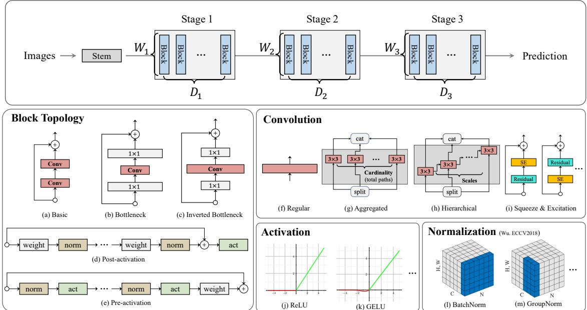  
Figure 2. Overview of the architecture components we considered for adversarial robustness: at the network scaling level (Top), the network has three stages, each with multiple blocks controlled by scaling parameters, i.e., depth and width; at the block level (Bottom), we explore variants of residual blocks and their components including convolution, activation, kernel size, normalization, etc.

claimed that there is no clear relationship between the width and the depth of architecture and its robustness [20]; (5) Zhu et al. showed that width helps robustness in the overparameterized regime, but depth can help only under certain initialization [40]. However, none of these studies provided a way to simultaneously scale depth and width.

## 3. Preliminaries

This section describes the experimental setup in terms of the adopted architectural skeleton and the details on training and evaluating the networks against adversarial attacks.

Architecture Skeleton: Figure 2shows the skeleton of the network that we consider. It comprises a stem (i.e., a single $3 \times 3$ convolution) and three processing stages. Each stage is made up of a varying number of convolutional blocks. We denote the depth (i.e., number of blocks) and width (in terms of widening factors) of i-th stage by $D _ { i }$ and $W _ { i } .$ respectively. We study the effect of the block structure (variants of residual blocks) and the network scaling (configurations of $[ D _ { 1 } , D _ { 2 } , D _ { 3 } ]$ and $[ W _ { 1 } , W _ { 2 } , W _ { 3 } ] )$ on the network's adversarial robustness, within this architectural skeleton. Unless otherwise specified, we use 3 × 3 conv, ReLU, and BatchNorm as the default choices.

Datasets: We evaluate adversarial robustness on three datasets, CIFAR-10, CIFAR-100 and Tiny-ImageNet.

Training: We employ two training strategies in this paper, i.e., baseline and advanced adversarial training (BAT and AAT). Full details are provided in Appendix.

Evaluation: We consider FGSM [9], 20-step PGD (PGD20) [19], 40-step CW $\mathrm { ( C W ^ { 4 0 } ) }$ [2], and AutoAttack (AA) [5] with perturbation constraint $\epsilon = 8 / 2 5 5$ . We repeat each experiment multiple times and compute the mean performance to account for noise in evaluating adversarial robustness. In all results, we show the mean and standard deviation using markers and shaded regions, respectively.

## 4. Design of Adversarially Robust ResNets

We decompose the architectural design of adversarially robust residual networks at the block (i.e., block topology and components) and network (i.e., depth and width) levels.

## 4.1. Impact of Block-level Design

Designing a block involves choosing its topology, type of convolution, activation and normalization, and kernel size. We examine these elements independently through controlled experiments and, based on our observations, propose a novel residual block, dubbed RobustResBlock.

## 4.1.1 Block Topology

Residual Topology: Fig 2 (a, b, c) shows the primary variants of residual blocks in the literature, namely, basic [13], bottleneck [13], and inverted bottleneck [25]. Among them, the basic block is the de-facto choice for studying adversarial robustness [11, 23, 33, 39]. Surprisingly, the bottleneck and inverted bottleneck blocks have rarely been employed for adversarial robustness, despite their well-established effectiveness under standard ERM training for image classification, object detection, etc. [29, 34]. Therefore, we revisit these residual blocks in the context of adversarial robustness. And for each block, we consider two variants (post-[13] and pre-activation [14]) corresponding to the place-

## Summary of our Robust Residual Block

Building upon the empirical evidence from §4.1.1 - §4.1.2, we propose a new residual block design, dubbed RobustResBlock, to substitute the basic block in architectures designed for adversarial robustness. – Block Topology: Bottleneck block with pre-activation, hierarchically aggregated convolution, and our residual SE (§4.1.1). – Activation: ReLU (§4.1.2).

– Normalization: BatchNorm (Appendix).

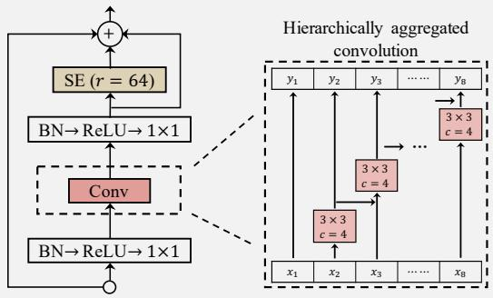

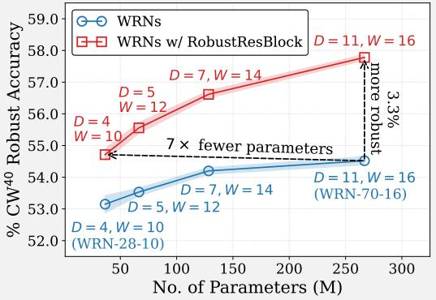  
ment of activation functions before and after a convolution (see Fig 2 (d, e) for an illustration). Moreover, we consider models of different capacities by varying the stagewise depth $D _ { i \in \{ 1 , 2 , 3 \} }$ and width $W _ { i \in \{ 1 , 2 , 3 \} }$ among {4, 5, 7, 11 } and {10, 12, 14, 16}, respectively.

Fig 3 compares the adversarial robustness of the above variants of residual blocks under baseline AT. We observe that (i) the basic block is susceptible to the location of the activation function, with pre-activation leading to a substantial improvement in adversarial robustness (Fig. 3a); (ii) performance of the bottleneck and inverted bottleneck blocks are relatively stable w.r.t the position of the activation function, although pre-activation provides a slight but noticeable benefit on large-capacity models with bottleneck blocks and small-capacity models with inverted bottleneck blocks (Figs. 3b and 3c). Thus, we argue that preactivation is preferred over post-activation for adversarial robustness. Fig3d compares the three residual blocks with pre-activation under baseline AT. We observe that the basic block is more effective in low model-capacity regions, while the bottleneck block is more effective in high modelcapacity regions. Finally, since the inverted bottleneck does not outperform the other two blocks under any model capacity, we do not consider it any further. Additional results are available in Appendix.

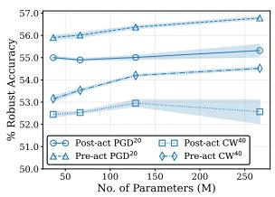  
(a) Basic

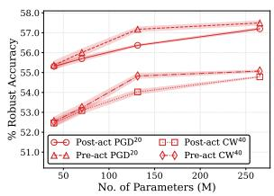  
(b) Bottleneck

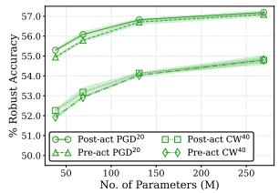

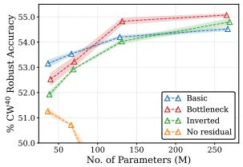  
(c) Inverted Bottleneck  
(d) Comparison among (a) − (c)

Figure 3. Robust accuracy of networks on C-10 with (a) basic, (b) bottleneck, and (c) inverted bottleneck blocks, with post and pre-activation. (d) Comparison among blocks with pre-activation. “No residual" removes the residual connection in the basic block.  
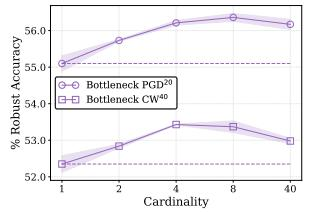  
(a)

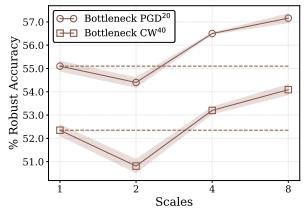

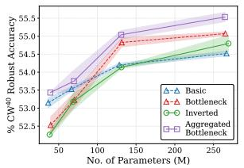  
(c)

(b)  
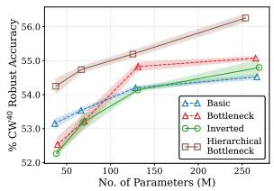  
(d)  
Figure 4. (a, b) show effects of cardinality and scales for a lowcapacity model $( D _ { i } = 4 , W _ { i } = 1 0 )$ . (c, d) Comparing aggregated (cardinality = 4) and hierarchical (scales = 8) bottleneck to other blocks. All results are on CIFAR-10.

Aggregated and Hierarchical Convolutions: Next, we consider two enhanced arrangements of convolution, aggregated [37], and hierarchical [8], which have proven to be effective for residual blocks under standard EMR training on standard tasks. Aggregated and hierarchical convolutions split a regular convolution into multiple parallel convolutions and hierarchical convolutions; see Fig 2 (g, h) for visualizations. We incorporate both of them within the bottleneck block. For each enhancement, experiments with parameter sweeps were carried out to determine appropriate values for their hyperparameters, i.e., cardinality for aggregated (Fig 4a) and scales for hierarchical convolutions (Fig 4b). Figs 4 (c, d) compare the bottleneck block with aggregated and hierarchical convolutions under baseline AT, respectively. We observe that the bottleneck block consistently benefits from both enhancements and outperforms the basic block across a wide spectrum of model-capacity regions. More detailed results can be found in Appendix.

Table 1. Break-down of the contribution of each identified topological enhancement. Both basic and bottleneck blocks use pre-activation. The cardinality for aggregated conv is 4, and the scale for hierarchical conv is 8. All results are for a large model with $D _ { i } = 1 1 , W _ { i } = 1 6$
<table><tr><td colspan="4">Topology</td><td colspan="2">Complexity</td><td colspan="4">CIFAR-10</td><td colspan="3">CIFAR-100</td></tr><tr><td></td><td>Basic Bottle | Aggr.</td><td></td><td>Hier. | SE</td><td></td><td>#p</td><td>#F</td><td>Clean</td><td> $\mathrm { P G D ^ { 2 0 } }$ </td><td> $\mathrm { C W ^ { 4 0 } }$ </td><td>Clean</td><td> $\mathrm { P G D ^ { 2 0 } }$ </td><td> $\mathrm { C W ^ { 4 0 } }$ </td></tr><tr><td>√</td><td></td><td></td><td></td><td></td><td>267M</td><td>38.8G</td><td> $8 5 . 5 1 { \scriptstyle \pm 0 . 1 9 }$ </td><td> $5 6 . 7 8 { \scriptstyle \pm 0 . 1 3 }$ </td><td> $5 4 . 5 2 _ { \pm 0 . 1 3 }$ </td><td> $5 6 . 9 3 _ { \pm 0 . 4 9 }$ </td><td> $2 9 . 7 6 _ { \pm 0 . 1 4 }$ </td><td> $2 7 . 2 4 { \scriptstyle \pm 0 . 1 5 }$ </td></tr><tr><td></td><td>√</td><td></td><td></td><td></td><td>265M</td><td>39.0G</td><td> $8 5 . 4 7 _ { \pm 0 . 2 1 }$ </td><td> $5 7 . 4 9 _ { \pm 0 . 2 1 }$ </td><td> $5 5 . 0 7 { \scriptstyle \pm 0 . 1 0 }$ </td><td> $5 9 . 2 4 { \scriptstyle \pm 0 . 3 6 }$ </td><td> $3 2 . 0 8 _ { \pm 0 . 2 6 }$ </td><td> $2 8 . 6 1 _ { \pm 0 . 1 7 }$ </td></tr><tr><td></td><td>√</td><td>√</td><td></td><td></td><td>265M</td><td>39.4G</td><td> $8 5 . 4 7 { \scriptstyle \pm 0 . 1 0 }$ </td><td> $5 7 . 5 0 { \scriptstyle \pm 0 . 2 8 }$ </td><td> $5 5 . 5 3 { \scriptstyle \pm 0 . 2 6 }$ </td><td> $5 9 . 2 7 _ { \pm 0 . 3 4 }$ </td><td> $3 1 . 6 3 { \scriptstyle \pm 0 . 3 6 }$ </td><td> $2 8 . 8 0 { \scriptstyle \pm 0 . 1 8 }$ </td></tr><tr><td></td><td>√</td><td>√</td><td>√</td><td></td><td>262M</td><td>39.3G</td><td> $8 6 . 2 9 _ { \pm 0 . 0 7 }$ </td><td> $5 9 . 4 8 _ { \pm 0 . 1 2 }$ </td><td> $5 6 . 9 4 { \scriptstyle \pm 0 . 2 7 }$ </td><td> $5 9 . 3 2 _ { \pm 0 . 1 3 }$ </td><td> $3 3 . 4 6 _ { \pm 0 . 2 2 }$ </td><td> $2 9 . 6 5 { \scriptstyle \pm 0 . 1 4 }$ </td></tr><tr><td></td><td>√</td><td>√</td><td>√</td><td>√</td><td>270M</td><td>39.3G</td><td> $\mathbf { 8 6 . 5 5 { \scriptstyle \pm 0 . 1 0 } }$ </td><td> $\mathbf { 6 0 . 4 8 _ { \pm 0 . 0 0 } }$ </td><td> ${ \bf 5 7 . 7 8 _ { \pm 0 . 0 9 } }$ </td><td> ${ \bf 6 0 . 2 2 { \scriptstyle \pm 0 . 5 7 } }$ </td><td> $\mathbf { 3 3 . 8 8 _ { \pm 0 . 0 3 } }$ </td><td> $\mathbf { 2 9 . 9 1 _ { \pm 0 . 1 5 } }$ </td></tr></table>

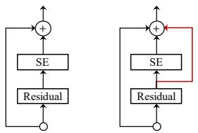

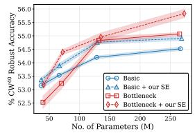  
(c)

(a) SE  
(b) Our SE
<table><tr><td>Designs (reduction ratio)</td><td>#P (M)</td><td>#F (G)</td><td>Clean</td><td>Robust (CW40)</td></tr><tr><td>w/o SE</td><td>265</td><td>39.0</td><td>85.47</td><td>55.07</td></tr><tr><td>Standard SE  $( r = 1 6 )$ </td><td>296</td><td>39.1</td><td> $8 4 . 5 6 ( - 0 . 9 1 )$ </td><td> $5 4 . 5 2 ( - 0 . 5 5 )$ </td></tr><tr><td>Conv3×3-SE (r = 16)</td><td>273</td><td>39.1</td><td> $8 5 . 2 6 ( - 0 . 2 1 )$ </td><td>54.77 (-0.40)</td></tr><tr><td>Identity-SE  $i ( r = 1 6 )$ </td><td>293</td><td>39.1</td><td>85.20 (-0.27)</td><td>54.94 (-0.13)</td></tr><tr><td>Our residual SE  $( r = 1 6 )$ </td><td>296</td><td>39.1</td><td>85.75 (+0.28)</td><td> $5 5 . 9 5 \ : ( + 0 . 8 8 )$ </td></tr><tr><td>Our residual SE  $( r = 6 4 )$ </td><td>273</td><td>39.1</td><td> $8 5 . 6 1 \ ( + 0 . 1 4 )$ </td><td> ${ \pmb 5 6 . 0 5 ( + 0 . 9 8 ) }$ </td></tr></table>

(d) Ablation study on SE integration designs.  
Figure 5. (a) Standard SE block. (b) Our residual SE adds an extra skip connection around the SE module. (c) Comparison of residual blocks w/ and w/o our residual SE. (d) Ablation results with relative improvement/degradation shown in parentheses.

Summary: We break down the contribution of each identified topological enhancement, namely, pre-activation, aggregated and hierarchical convolutions, and residual SE in

S&E: Next, we consider squeeze-and-excitation (SE) [16], which emerged as a standard component of modern CNN architectures [15, 29]. However, we observe (see Table 5d) that a straightforward application of SE, and all its variants explored by Hu et al. [16], degrade adversarial robustness. This is unlike the case in standard ERM training, where SE consistently improves performance across most vision tasks when added to residual networks. We hypothesize that this may be due to the SE layer excessively suppressing or amplifying channels. Therefore, we present an alternative variant of SE, dubbed residual SE, for adversarial robustness. Fig 5c compares the basic and bottleneck blocks with and without residual SE under BAT. Results indicate that our residual SE consistently improves the adversarial robustness of both blocks across different model-capacity regions. Additional results are available in Appendix.

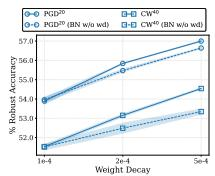  
(a) ReLU

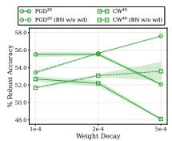  
(b) SiLU/Swish

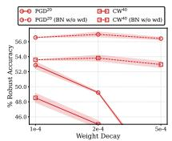  
(c) Softplus

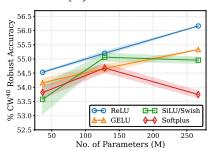  
(d) CIFAR-10

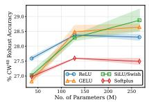  
(e) CIFAR-100

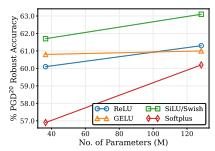  
(g) PGD20

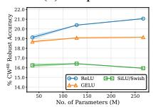  
(f) Tiny-ImageNet

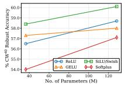  
(h) $\mathrm { C W } ^ { 4 0 }$

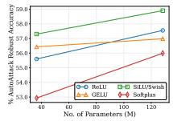  
(i) AutoAttack  
Figure 6. (a) - (c) Effect of weight decay on robust accuracy of models with different activation functions on CIFAR-10. (d) - (f) Robust accuracy of models with different activation functions across a range of model capacities. (g) - (i) Robust accuracy under advanced AT for different activation functions on CIFAR-10.

Table 1. We demonstrate that all these enhancements can be naturally integrated within the bottleneck topology. Empirically, our final topology yields $a \sim 3 \%$ improvement under baseline AT over the basic block used in WRNs.

## 4.1.2 Activation and Normalization

Activation: Since the first demonstration by Xie et al. [36], several researchers [10,21, 28] reaffirmed that smooth activation functions improve adversarial training, which in turn improves adversarial robustness. However, these observations are primarily based on CIFAR-10 with low-capacity models (e.g., ResNet-18 or WRN-34-10) and for a fixed set of training hyperparameters. We hypothesize that, smooth or not, different activation functions may perform differently depending on training hyperparameters, especially weight decay, as observed by Pang et al. [21]. Therefore, we revisit the adversarial robustness of smooth and nonsmooth activation functions under appropriate weight decay settings. We consider ReLU and three smooth activation functions, SiLU/Swish [11, 23, 36], Softplus [21, 22], and GELU [1], given their prevalence in the literature.

<table><tr><td>Desired #FLOPs</td><td>Referred as</td><td>Stage 1 D1</td><td>W1</td><td>Stage 2 D2 W2</td><td></td><td>Stage 3  ${ D _ { 3 } } ^ { \mathrm { ~ \tiny ~ \sim ~ } } W _ { 3 }$ </td></tr><tr><td>Robdling 5G</td><td>A1</td><td>14</td><td>5</td><td>14</td><td>7</td><td>7 3</td></tr><tr><td>10G</td><td>A2</td><td>17</td><td>7</td><td>17</td><td>9 8</td><td>4</td></tr><tr><td>20G</td><td>A3</td><td>22</td><td>8</td><td>22</td><td>11 11</td><td>5</td></tr><tr><td>40G</td><td>A4</td><td>27</td><td>10</td><td>28</td><td>14 13</td><td>6</td></tr></table>

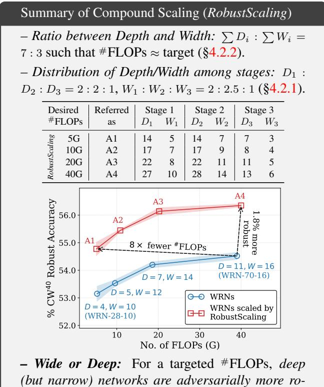  
- Wide or Deep: For a targeted #FLOPs, deep (but narrow) networks are adversarially more robust than wide (but shallow) networks.

As shown in Fig 6 (a, b, c), we first identify a suitable weight decay value for each activation function from $\{ 1 , 2 , 5 \} \times 1 0 ^ { - 4 }$ Then we compare performance under their respective optimal weight decay settings across a wide range of model capacities on three datasets. The results in Fig 6 (d, e, f) suggest that, under BAT, smooth activation functions do not improve performance over ReLU in most cases, which contrasts with the prevailing consensus. To verify the generality of our observations, we consider AAT as described in §3 and repeat the experiment on CIFAR-10. Now we observe from Fig 6 (g, h, i) that smooth activation functions, particularly SiLU, start to provide meaningful improvements over ReLU under advanced AT. To summarize, our empirical findings provide further context to understand the AT conditions under which models with smooth activation functions outperform ReLU and vice-versa.

## 4.2. Impact of Network-level Design

Architectural design at the network level involves controlling the width and depth. We approach network-level scaling from a two-objective perspective of maximizing adversarial robustness and network efficiency. As an illustration, we consider minimizing FLOPs to improve network efficiency. A preview of RobustScaling is provided below.

## 4.2.1 Independent Scaling by Depth or Width

We independently study the relationship between adversarial robustness and network depth (i.e., number of blocks) or width in terms of widening factors (i.e., number of channels). We allow the depth of each stage $( D _ { i \in \{ 1 , 2 , 3 \} } )$ to vary among {2, 3, 4, 5, 7, 9, 11}, and the width widening factor $( W _ { i \in \{ 1 , 2 , 3 \} } )$ to vary among {4, 6, 8, 10, 12, 14, 16, 20}, while fixing the other architecture components to the baseline settings described in §3. We adversarially train all possible networks (i.e., $7 ^ { 3 } ~ = ~ 3 4 3$ for depth and $8 ^ { 3 } \ =$ 512 for width) using the BAT and present the results in Figs. 7a and 7e, respectively. Empirically, we observe that (i) there are no substantial correlations between network depth/width and adversarial robustness, implying that adding more blocks or channels does not automatically lead to better adversarial robustness; and (ii) at any given computational budget, there is a significant variation in adversarial robustness, suggesting that the distribution of depth/width between the different stages needs to be carefully selected for improving adversarial robustness.

Next, we perform a more detailed analysis of the depth/width distribution and robust accuracy of networks. At each level of total network depth/width, we rank the networks by their adversarial robustness and visualize the distribution of the number of blocks/widening factors among the three stages. We present the results in Fig. 7 and make the following observations, (i) networks that distribute more blocks evenly between the first two stages and decrease the number of blocks in the third stage are ranked at the top (Fig. 7b), (ii) networks that distribute more blocks in the third stage and reduce the number of blocks in the first two stages are ranked last (Fig. 7c), (iii) top-ranked networks tend to use small widening factors in stage 3 and allocate larger widening factors to the first two stages, particularly the second stage (Fig. 7f), and (iv) last-ranked networks use larger widening factors in the last stage by reducing the widening factors of the second stage (Fig. 7g).

By averaging the number of blocks/widening factor distribution in the top-ranked models across all levels of depth/width, we identify that distributing the depth, i.e., the number of layers, as $D _ { 1 } : D _ { 2 } : D _ { 3 } = 2 : 2 : 1$ and width, in terms of widening factors, as $W _ { 1 } : W _ { 2 } : W _ { 3 } = 2 : 2 . 5 : 1$ across the stages leads to robust and efficient models.

## 4.2.2 Compound Scaling by Depth and Width

Building upon the independent depth/width scaling rules specified in §4.2.1, for a fixed computational complexity, compound scaling can be realized as a competition between network depth and width for resources. We formulate our goal as searching for an appropriate ratio between total network depth and total network width, i.e., $\left[ \sum D _ { i } \ : \ \sum W _ { i } \right]$ to efficiently allocate computational resources while improving adversarial robustness. Given a target FLOPs, we systematically tune the contribution ratio of depth (i.e., $r _ { D } = \sum { D _ { i } } / ( \sum { D _ { i } } + \sum { W _ { i } } ) )$ between [0.3, 0.95) and compare the relative changes in robustness under BAT. From the results shown in Fig 8, we observe that adversarial robustness improves monotonically as $r _ { D }$ increases and peaks at approximately $r _ { D } = 0 . 7$ . However, as the $r _ { D }$ continues to increase beyond 0.7, adversarial robustness starts to deteriorate rapidly. Accordingly, our compound scaling rule, dubbed RobustScaling, is obtained by solving:

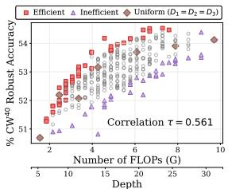  
(a) Depth vs. Robustness

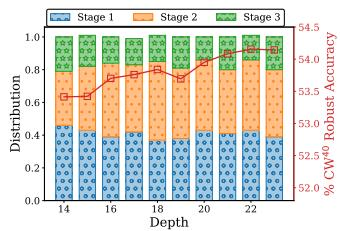  
(b) Top-Ranked Networks

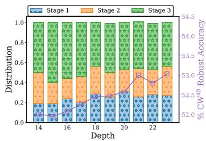

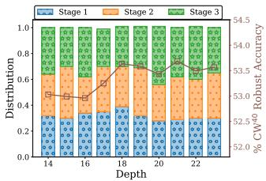

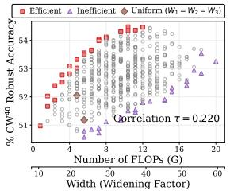  
(e) Width vs. Robustness

(c) Last-Ranked Networks  
(d) Standard Uniform Scaling  
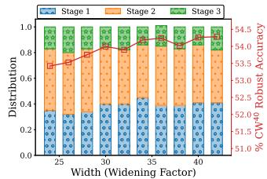  
(f) Top-Ranked Networks

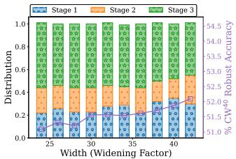  
(g) Last-Ranked Networks

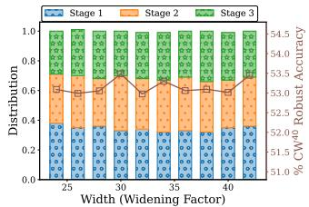  
(h) Standard Uniform Scaling  
Figure 7. Adversarial robustness of networks with (a) 343 depth and (e) 512 width settings on CIFAR-10. Pareto-efficient models (robust and compact) are in red squares, inefficient models (sensitive and complex) are in violet triangles, and networks with standard uniform scaling $( D _ { 1 } = D _ { 2 } = D _ { 3 }$ and $W _ { 1 } = W _ { 2 } = W _ { 3 } )$ are in brown diamonds. Rank correlation (Kendall τ) between depth/width and robust accuracy is annotated. Distribution among the three stages for models with the efficient (b, f), standard uniform (c, g), and inefficient (d, h) distribution of depth and width are visualized, where the secondary y-axis with color corresponds to robust accuracy.

$$
{ \begin{array} { r l } & { r _ { D } = { \frac { D _ { 1 } + D _ { 2 } + D _ { 3 } } { D _ { 1 } + D _ { 2 } + D _ { 3 } + W _ { 1 } + W _ { 2 } + W _ { 3 } } } } \\ & { \quad = { \frac { 2 D _ { 3 } + 2 D _ { 3 } + D _ { 3 } } { 2 D _ { 3 } + 2 D _ { 3 } + D _ { 3 } + 2 W _ { 3 } + 2 . 5 W _ { 3 } + W _ { 3 } } } = 0 . 7 } \end{array} }
$$

such that the $\begin{array} { r } { F L O P s ( \sum D _ { i } , \sum W _ { i } ) \approx } \end{array}$ the target. A pictorial illustration of the compound settings under different FLOP budgets is provided in Fig 9a, along with the standard settings (i.e., WRN-28-10, WRN-70-16, etc.) in Fig 9b, the settings obtained by independently scaling depth and width in Figs 9c and 9d, respectively. We observe that deep but narrow networks are preferred over wide but shallow networks for adversarial robustness at a given FLOPs budget.

Empirically, we compare our compound scaling to independent scaling by depth/width, the standard scaling, and the existing robust scaling from Huang et al. [17] under BAT in Fig 10. Note that Huang et al. [17] only report one network, WRN-34-R. But we apply their (width) scaling rule to other WRN networks at different depths and obtain a set of WRN-R networks. We observe that RobustScaling achieves the best trade-off between robustness and network complexity, yielding networks that offer substantial improvements in robust accuracy over existing scaling methods while being an order of magnitude more efficient. In particular, WRN-A1 is 3.8× more compact and efficient than WRN-34-R [17] while being similar in adversarial robustness. Our findings suggest that effective compound policies do exist for scaling networks under adversarial training, and our RobustScaling is one such realization.

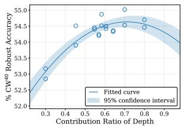  
(a) 5G FLOPs

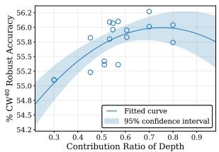  
(b) 20G FLOPs  
Figure 8. (a, b) Adversarial robustness vs. contribution ratio of depth (rp) at different FLOP levels, where $\begin{array} { r } { r _ { D } = \sum D _ { i } / ( \sum D _ { i } + } \end{array}$ $\textstyle \sum W _ { i } )$ . A larger $r _ { D }$ indicates a deeper (more blocks) but narrower (fewer channels) network.

## 5. Adversarially Robust Residual Networks

We use RobustScaling to scale our RobustResBlock to present a portfolio of adversarially robust residual networks, dubbed RobustResNets, spanning a broad spectrum of model FLOP budgets (i.e., 5G - 40G FLOPs). For reference, we name them as RobustResNet-A1 to -A4, where the FLOPs budget is doubled for every subsequent network. We then compare RobustResNets to a set of representative robust architectures proposed in the literature. These include, RobNet [12], RACL [7], AdvRush [20], and WRN-34-R [17]. Specifically, we align the network complexity of AdvRush and RACL models by adjusting the number of

(c) Scaling by depth  
Table 2. Comparison of white-box adversarial robustness under baseline AT with TRADES [39]. The best results are in bold, and relative improvements over $2 ^ { \mathrm { n d } }$ best result in each section are in red. Results are averaged over three runs with different seeds.
<table><tr><td rowspan="2">Model</td><td rowspan="2">#p (M)</td><td rowspan="2">#F (G)</td><td colspan="4">CIFAR-10</td><td colspan="4">CIFAR-100</td></tr><tr><td>Clean</td><td> $\mathrm { P G D ^ { 2 0 } }$ </td><td> $\mathrm { C W ^ { 4 0 } }$ </td><td>AutoAttack</td><td>Clean</td><td> $\mathrm { P G D ^ { 2 0 } }$ </td><td> $\mathrm { C W ^ { 4 0 } }$ </td><td>AutoAttack</td></tr><tr><td>WRN-28-10</td><td>36.5</td><td>5.20</td><td> $8 4 . 6 2 _ { \pm 0 . 0 6 }$ </td><td> $5 5 . 9 0 { \scriptstyle \pm 0 . 2 1 }$ </td><td> $5 3 . 1 5 { \scriptstyle \pm 0 . 3 3 }$ </td><td> $5 1 . 6 6 _ { \pm 0 . 2 9 }$ </td><td> $5 6 . 3 0 { \scriptstyle \pm 0 . 2 8 }$ </td><td> $2 9 . 9 1 _ { \pm 0 . 4 0 }$ </td><td> $2 6 . 2 2 _ { \pm 0 . 2 3 }$ </td><td> $2 5 . 2 6 _ { \pm 0 . 0 6 }$ </td></tr><tr><td>RobNet-large-v2</td><td>33.3</td><td>5.10</td><td> $8 4 . 5 7 { \scriptstyle \pm 0 . 1 6 }$ </td><td> $5 2 . 7 9 _ { \pm 0 . 0 8 }$ </td><td> $4 8 . 9 4 _ { \pm 0 . 1 3 }$ </td><td> $4 7 . 4 8 _ { \pm 0 . 0 4 }$ </td><td> $5 5 . 2 7 { \scriptstyle \pm 0 . 0 2 }$ </td><td> $2 9 . 2 3 _ { \pm 0 . 1 5 }$ </td><td> $2 4 . 6 3 _ { \pm 0 . 1 1 }$ </td><td> $2 3 . 6 9 _ { \pm 0 . 1 9 }$ </td></tr><tr><td>AdvRush (7@96)</td><td>32.6</td><td>4.97</td><td> $8 4 . 9 5 { \scriptstyle \pm 0 . 1 2 }$ </td><td> $5 6 . 9 9 { \scriptstyle \pm 0 . 0 8 }$ </td><td> $5 3 . 2 7 _ { \pm 0 . 0 3 }$ </td><td> $5 2 . 9 0 { \scriptstyle \pm 0 . 1 1 }$ </td><td> $5 6 . 4 0 { \scriptstyle \pm 0 . 0 9 }$ </td><td> $3 0 . 4 0 { \scriptstyle \pm 0 . 2 1 }$ </td><td> $2 6 . 1 6 _ { \pm 0 . 0 3 }$ </td><td> $2 5 . 2 7 _ { \pm 0 . 0 2 }$ </td></tr><tr><td>RACL (7@104)</td><td>32.5</td><td>4.93</td><td> $8 3 . 9 1 _ { \pm 0 . 3 2 }$ </td><td> $5 5 . 9 8 _ { \pm 0 . 1 5 }$ </td><td> $5 3 . 2 2 _ { \pm 0 . 0 8 }$ </td><td> $5 1 . 3 7 { \scriptstyle \pm 0 . 1 1 }$ </td><td> $5 6 . 0 9 { \scriptstyle \pm 0 . 0 8 }$ </td><td> $3 0 . 3 8 { \scriptstyle \pm 0 . 0 3 }$ </td><td> $2 6 . 6 5 { \scriptstyle \pm 0 . 0 2 }$ </td><td> $2 5 . 6 5 { \scriptstyle \pm 0 . 1 0 }$ </td></tr><tr><td>RobustResNet-A1 (ours)</td><td>19.2</td><td>5.11</td><td> $\mathbf { 8 5 . 4 6 \ ( \uparrow 0 . 5 ) }$ </td><td> ${ \bf 5 8 . 7 4 } \left( { \uparrow 1 . 8 } \right)$ </td><td> ${ \bf 5 5 . 7 2 \left( \uparrow 2 . 6 \right) }$ </td><td> $\mathbf { 5 4 . 4 2 \ ( \uparrow 1 . 5 ) }$ </td><td> ${ \bf 5 9 . 3 4 } \left( \uparrow { \bf 2 . 9 } \right)$ </td><td> $\mathbf { 3 2 . 7 0 ( \uparrow 2 . 3 ) }$ </td><td> $\mathbf { 2 7 . 7 6 ( \uparrow 1 . 1 ) }$ </td><td> $\mathbf { 2 6 . 7 5 \ : ( \uparrow 1 . 1 ) }$ </td></tr><tr><td> $\mathrm { W R N }  – 3 4 – 1 2$ </td><td>66.5</td><td>9.60</td><td> $8 4 . 9 3 _ { \pm 0 . 2 4 }$ </td><td> $5 6 . 0 1 _ { \pm 0 . 2 8 }$ </td><td> $5 3 . 5 3 { \scriptstyle \pm 0 . 1 5 }$ </td><td> $5 1 . 9 7 _ { \pm 0 . 0 9 }$ </td><td> $5 6 . 0 8 { \scriptstyle \pm 0 . 4 1 }$ </td><td> $2 9 . 8 7 _ { \pm 0 . 2 3 }$ </td><td> $2 6 . 5 1 _ { \pm 0 . 1 1 }$ </td><td> $2 5 . 4 7 _ { \pm 0 . 1 0 }$ </td></tr><tr><td> $\mathrm { W R N }  – 3 4 – \mathrm { R }$ </td><td>68.1</td><td>19.1</td><td> $8 5 . 8 0 { \scriptstyle \pm 0 . 0 8 }$ </td><td> $5 7 . 3 5 { \scriptstyle \pm 0 . 0 9 }$ </td><td> $5 4 . 7 7 { \scriptstyle \pm 0 . 1 0 }$ </td><td> $5 3 . 2 3 { \scriptstyle \pm 0 . 0 7 }$ </td><td> $5 8 . 7 8 \substack { \pm 0 . 1 1 }$ </td><td> $3 1 . 1 7 _ { \pm 0 . 0 8 }$ </td><td> $2 7 . 3 3 { \scriptstyle \pm 0 . 1 1 }$ </td><td> $2 6 . 3 1 _ { \pm 0 . 0 3 }$ </td></tr><tr><td>RobustResNet-A2 (ours)</td><td>39.0</td><td>10.8</td><td> $\mathbf { 8 5 . 8 0 ( \uparrow 0 . 0 ) }$ </td><td> ${ \bf 5 9 . 7 2 \ ( \uparrow 2 . 4 ) }$ </td><td> $\mathbf { 5 6 . 7 4 \ ( \uparrow 2 . 0 ) }$ </td><td> ${ \bf 5 5 . 4 9 _ { \left( \uparrow 2 . 3 \right) } }$ </td><td> $\mathbf { 5 9 . 3 8 } \left( \uparrow 0 . 6 \right)$ </td><td> $\mathbf { 3 3 . 0 } \left( \uparrow 1 . 8 \right)$ </td><td> $\mathbf { 2 8 . 7 1 \ ( \uparrow 1 . 4 ) }$ </td><td> $\mathbf { 2 7 . 6 8 \ ( \uparrow 1 . 4 ) }$ </td></tr><tr><td>WRN-46-14</td><td>128</td><td>18.6</td><td> $8 5 . 2 2 _ { \pm 0 . 1 5 }$ </td><td> $5 6 . 3 7 { \scriptstyle \pm 0 . 1 8 }$ </td><td> $5 4 . 1 9 _ { \pm 0 . 1 1 }$ </td><td> $5 2 . 6 3 { \scriptstyle \pm 0 . 1 8 }$ </td><td> $5 6 . 7 8 \substack { \pm 0 . 4 7 }$ </td><td> $3 0 . 0 3 { \scriptstyle \pm 0 . 0 7 }$ </td><td> $2 7 . 2 7 _ { \pm 0 . 0 5 }$ </td><td> $2 6 . 2 8 { \scriptstyle \pm 0 . 0 3 }$ </td></tr><tr><td> $\mathbf { R o b u s t R e s N e t - A 3 ( o u r s ) }$ </td><td>75.9</td><td>19.9</td><td> $\mathbf { 8 6 . 7 9 \ ( \uparrow 1 . 6 ) }$ </td><td> $\mathbf { 6 0 . 1 0 \ ( \uparrow 3 . 7 ) }$ </td><td> ${ \bf 5 7 . 2 9 _ { \textrm { ( \uparrow 3 . 1 ) } } }$ </td><td> ${ \bf 5 5 . 8 4 } _ { \bf ( \uparrow 3 . 2 ) }$ </td><td> ${ \bf 6 0 . 1 6 \left( \uparrow 3 . 4 \right) }$ </td><td> $\mathbf { 3 3 . 5 9 ( \uparrow 3 . 6 ) }$ </td><td> $\mathbf { 2 9 . 5 8 ( \uparrow 2 . 3 ) }$ </td><td> $\mathbf { 2 8 . 4 8 ( \uparrow 2 . 2 ) }$ </td></tr><tr><td> $\mathrm { W R N }  – 7 0 – 1 6$ </td><td>267</td><td>38.8</td><td> $8 5 . 5 1 { \scriptstyle \pm 0 . 2 4 }$ </td><td> $5 6 . 7 8 \substack { \pm 0 . 1 6 }$ </td><td> $5 4 . 5 2 _ { \pm 0 . 1 6 }$ </td><td> $5 2 . 8 0 { \scriptstyle \pm 0 . 1 4 }$ </td><td> $5 6 . 9 3 { \scriptstyle \pm 0 . 6 1 }$ </td><td> $2 9 . 7 6 _ { \pm 0 . 1 7 }$ </td><td> $2 7 . 2 0 { \scriptstyle \pm 0 . 1 6 }$ </td><td> $2 6 . 1 2 _ { \pm 0 . 2 4 }$ </td></tr><tr><td>RobustResNet-A4 (ours)</td><td>147</td><td>39.4</td><td> $\mathbf { 8 7 . 1 0 ( \uparrow 1 . 6 ) }$ </td><td> ${ \bf 6 0 . 2 6 \ ( \uparrow 3 . 5 ) }$ </td><td> ${ \bf 5 7 . 9 ( \uparrow 3 . 4 ) }$ </td><td> $\mathbf { 5 6 . 2 9 \ ( \uparrow 3 . 5 ) }$ </td><td> $\mathbf { 6 1 . 6 6 } \left( \uparrow 4 . 7 \right)$ </td><td> $\mathbf { 3 4 . 2 5 \ ( \uparrow 4 . 5 ) }$ </td><td> $\mathbf { 3 0 . 0 4 } \left( \uparrow 2 . 8 \right)$ </td><td> $\mathbf { 2 9 . 0 0 } \left( \uparrow 2 . 9 \right)$ </td></tr></table>

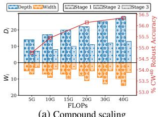  
(∑ Di : ∑ Wi = 7 : 3)

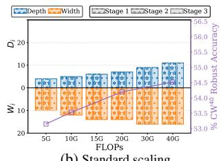  
(i.e., WRN-28-10, WRN-70-16)

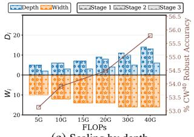

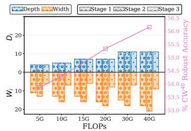  
(D1 : D2 : D3 = 2: 2 : 1)  
(d) Scaling by width  
(W1 : W2 : W3 = 2 : 2.5 : 1)

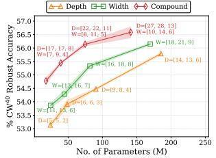

(a) $\mathrm { C W ^ { 4 0 } \ v s . \ } ^ { \# }$ Params  
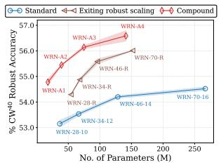  
(c) CW40 vs. #Params

(b) $\mathrm { C W ^ { 4 0 } \ v s . }$ #FLOPs  
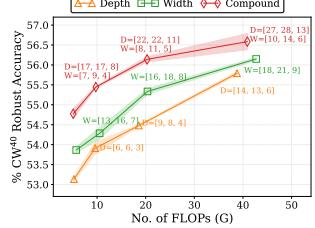

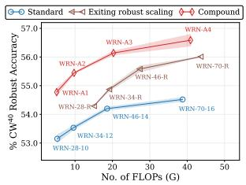  
Figure 9. Visualization of depth and width distribution among the three stages for (a) our compound scaling, (b) standard scaling, and (c, d) our independent scaling by depth/width. The secondary y-axis shows robust accuracy under baseline adversarial training. repetitions of the normal cell N and the input #channels of the first normal cell C, denoted as (N@C).  
(d) CW40 vs. #FLOPs  
Figure 10. (a, b) Comparison among standard scaling (blue curve), existing robust scaling [17] (brown curve), the identified independent depth/width scaling (orange/green curve) from §4.2.1, and the identified RobustScaling (red curve) on C-10. $[ D _ { 1 } , D _ { 2 } , D _ { 3 } ]$ and [W1, W2, W3] denote stage-wise depth and width settings, respectively. For independent depth scaling, we use the width settings from the standard scaling and vice-versa for independent width scaling. All scaling strategies are applied to WRNs.

Table 2 presents the results under baseline AT with TRADES [39]. In general, RobustResNets consistently outperform existing robust networks across multiple datasets, attacks, and model-capacity regions. In particular, RobustResNet-A1 achieves 1.5% higher AutoAttack robust accuracy with 1.7× fewer parameters than AdvRush [20], a robust block designed by differentiable neural architecture search; RobustResNet-A2 achieves 2.3% higher AutoAttack robust accuracy with 1.8× fewer parameters and $F L O P s$ than WRN-34-R [17]. Additional comparisons are provided in Appendix.

## 6. Conclusion

Novel architectural designs played a critical role in the overwhelming success of CNNs. Despite this knowledge, studies on adversarial robustness have primarily been limited to a handful of basic residual networks, thus overlooking the impact of architecture on adversarial robustness. However, as we demonstrate in this paper, architectural design significantly affects adversarial robustness. We observed through systematically designed experiments that many advancements of residual blocks for standard ERM training translate well to improve adversarial robustness under adversarial training, albeit with minor modifications in some cases. Based on our observations, we designed RobustResNets as an alternative baseline as opposed to WRNs, the de facto architecture of choice for designing adversarially robust networks. RobustResNets afford significant improvements in adversarial robustness while being more compact than state-of-the-art solutions.

## References

[1] Yutong Bai, Jieru Mei, Alan Yuille, and Cihang Xie. Are transformers more robust than CNNs? In A. Beygelzimer, Y. Dauphin, P. Liang, and J. Wortman Vaughan, editors, Adv. Neural Inform. Process. Syst., 2021. 5

[2] Nicholas Carlini and David Wagner. Towards evaluating the robustness of neural networks. In IEEE symposium on security and privacy (sp), 2017. 3

[3] George Cazenavette, Calvin Murdock, and Simon Lucey. Architectural adversarial robustness: The case for deep pursuit. In IEEE Conf. Comput. Vis. Pattern Recog., 2021. 1, 2

[4] Tianlong Chen, Zhenyu Zhang, Sijia Liu, Shiyu Chang, and Zhangyang Wang. Robust overfitting may be mitigated by properly learned smoothening. In Int. Conf. Learn. Represent., 2021. 2

[5] Francesco Croce and Matthias Hein. Reliable evaluation of adversarial robustness with an ensemble of diverse parameter-free attacks. In Int. Conf. Mach. Learn., 2020. 2, 3

[6] Sihui Dai, Saeed Mahloujifar, and Prateek Mittal. Parameterizing activation functions for adversarial robustness. In IEEE Security and Privacy Workshops, 2022. 2

[7] Minjing Dong, Yanxi Li, Yunhe Wang, and Chang Xu. Adversarially robust neural architectures. arXiv preprint arXiv:2009.00902, 2020. 7

[8] Shang-Hua Gao, Ming-Ming Cheng, Kai Zhao, Xin-Yu Zhang, Ming-Hsuan Yang, and Philip Torr. Res2net: A new multi-scale backbone architecture. IEEE Trans. Pattern Anal. Mach. Intell., 43(2):652–662, 2021. 4

[9] Ian Goodfellow, Jonathon Shlens, and Christian Szegedy. Explaining and harnessing adversarial examples. In Int. Conf. Learn. Represent., 2015. 3

[10] Sven Gowal, Chongli Qin, Jonathan Uesato, Timothy Mann, and Pushmeet Kohli. Uncovering the limits of adversarial training against norm-bounded adversarial examples. arXiv preprint arXiv:2010.03593, 2020.2, 5

[11] Sven Gowal, Sylvestre-Alvise Rebuffi, Olivia Wiles, Florian Stimberg, Dan Andrei Calian, and Timothy Mann. Improving robustness using generated data. In Adv. Neural Inform. Process. Syst., 2021. 2, 3, 5

[12] Minghao Guo, Yuzhe Yang, Rui Xu, Ziwei Liu, and Dahua Lin. When nas meets robustness: In search of robust architectures against adversarial attacks. In IEEE Conf. Comput. Vis. Pattern Recog., 2020. 7

[13] Kaiming He, Xiangyu Zhang, Shaoqing Ren, and Jian Sun. Deep residual learning for image recognition. In IEEE Conf. Comput. Vis. Pattern Recog., 2016. 3

[14] Kaiming He, Xiangyu Zhang, Shaoqing Ren, and Jian Sun. Identity mappings in deep residual networks. In Eur. Conf. Comput. Vis., 2016. 3

[15] Andrew Howard, Mark Sandler, Grace Chu, Liang-Chieh Chen, Bo Chen, Mingxing Tan, Weijun Wang, Yukun Zhu, Ruoming Pang, Vijay Vasudevan, et al. Searching for mobilenetv3. In Int. Conf. Comput. Vis., 2019. 5

[16] Jie Hu, Li Shen, Samuel Albanie, Gang Sun, and Enhua Wu. Squeeze-and-excitation networks. IEEE Trans. Pattern Anal. Mach. Intell., 42(8):2011–2023, 2020. 2, 5

[17] Hanxun Huang, Yisen Wang, Sarah Erfani, Quanquan Gu, James Bailey, and Xingjun Ma. Exploring architectural ingredients of adversarially robust deep neural networks. Adv. Neural Inform. Process. Syst., 2021. 2, 7, 8

[18] Pavel Izmailov, Dmitrii Podoprikhin, Timur Garipov, Dmitry Vetrov, and Andrew Gordon Wilson. Averaging weights leads to wider optima and better generalization. arXiv preprint arXiv:1803.05407, 2018. 2

[19] Aleksander Madry, Aleksandar Makelov, Ludwig Schmidt, Dimitris Tsipras, and Adrian Vladu. Towards deep learning models resistant to adversarial attacks. In Int. Conf. Learn. Represent., 2018. 1, 2, 3

[20] Jisoo Mok, Byunggook Na, Hyeokjun Choe, and Sungroh Yoon. Advrush: Searching for adversarially robust neural architectures. In Int. Conf. Comput. Vis., 2021. 3, 7, 8

[21] Tianyu Pang, Xiao Yang, Yinpeng Dong, Hang Su, and Jun Zhu. Bag of tricks for adversarial training. In Int. Conf. Learn. Represent., 2021. 2, 5

[22] Chongli Qin, James Martens, Sven Gowal, Dilip Krishnan, Krishnamurthy Dvijotham, Alhussein Fawzi, Soham De, Robert Stanforth, and Pushmeet Kohli. Adversarial robustness through local linearization. Adv. Neural Inform. Process. Syst., 2019. 5

[23] Sylvestre-Alvise Rebuffi, Sven Gowal, Dan Andrei Calian, Florian Stimberg, Olivia Wiles, and Timothy Mann. Data augmentation can improve robustness. In Adv. Neural Inform. Process. Syst., 2021. 2, 3, 5

[24] Leslie Rice, Eric Wong, and Zico Kolter. Overfitting in adversarially robust deep learning. In Int. Conf. Mach. Learn., 2020.2

[25] Mark Sandler, Andrew Howard, Menglong Zhu, Andrey Zhmoginov, and Liang-Chieh Chen. Mobilenetv2: Inverted residuals and linear bottlenecks. In IEEE Conf. Comput. Vis. Pattern Recog., 2018. 3

[26] Vikash Sehwag, Saeed Mahloujifar, Tinashe Handina, Sihui Dai, Chong Xiang, Mung Chiang, and Prateek Mittal. Robust learning meets generative models: Can proxy distributions improve adversarial robustness? In Int. Conf. Learn. Represent., 2022. 2

[27] Ali Shafahi, Mahyar Najibi, Mohammad Amin Ghiasi, Zheng Xu, John Dickerson, Christoph Studer, Larry S Davis, Gavin Taylor, and Tom Goldstein. Adversarial training for free! Adv. Neural Inform. Process. Syst., 32, 2019. 1

[28] Vasu Singla, Sahil Singla, Soheil Feizi, and David Jacobs. Low curvature activations reduce overfitting in adversarial training. In Int. Conf. Comput. Vis., 2021. 5

[29] Mingxing Tan and Quoc Le. Efficientnet: Rethinking model scaling for convolutional neural networks. In Int. Conf. Mach. Learn., 2019. 3, 5

[30] Hongjun Wang and Yisen Wang. Self-ensemble adversarial training for improved robustness. In Int. Conf. Learn. Represent., 2022. 2

[31] Yisen Wang, Xingjun Ma, James Bailey, Jinfeng Yi, Bowen Zhou, and Quanquan Gu. On the convergence and robustness of adversarial training. arXiv preprint arXiv:2112.08304, 2021.2

[32] Yisen Wang, Difan Zou, Jinfeng Yi, James Bailey, Xingjun Ma, and Quanquan Gu. Improving adversarial robustness requires revisiting misclassified examples. In Int. Conf. Learn. Represent., 2019. 1

[33] Yisen Wang, Difan Zou, Jinfeng Yi, James Bailey, Xingjun Ma, and Quanquan Gu. Improving adversarial robustness requires revisiting misclassified examples. In Int. Conf. Learn. Represent., 2020. 2, 3

[34] Ross Wightman, Hugo Touvron, and Hervé Jégou. Resnet strikes back: An improved training procedure in timm. arXiv preprint arXiv:2110.00476, 2021. 3

[35] Eric Wong, Leslie Rice, and J Zico Kolter. Fast is better than free: Revisiting adversarial training. arXiv preprint arXiv:2001.03994, 2020. 1

[36] Cihang Xie, Mingxing Tan, Boqing Gong, Alan Yuille, and Quoc V Le. Smooth adversarial training. arXiv preprint arXiv:2006.14536, 2020.2, 5

[37] Saining Xie, Ross Girshick, Piotr Dollár, Zhuowen Tu, and Kaiming He. Aggregated residual transformations for deep neural networks. In IEEE Conf. Comput. Vis. Pattern Recog., 2017.4

[38] Sergey Zagoruyko and Nikos Komodakis. Wide residual networks. arXiv preprint arXiv:1605.07146, 2016. 1

[39] Hongyang Zhang, Yaodong Yu, Jiantao Jiao, Eric Xing, Laurent El Ghaoui, and Michael Jordan. Theoretically principled trade-off between robustness and accuracy. In Int. Conf. Mach. Learn., 2019. 1, 2, 3, 8

[40] Zhenyu Zhu, Fanghui Liu, Grigorios G Chrysos, and Volkan Cevher. Robustness in deep learning: The good (width), the bad (depth), and the ugly (initialization). arXiv preprint arXiv:2209.07263, 2022. 3