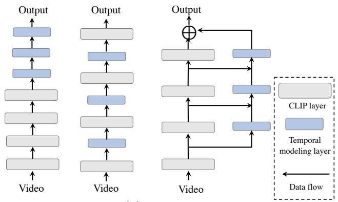
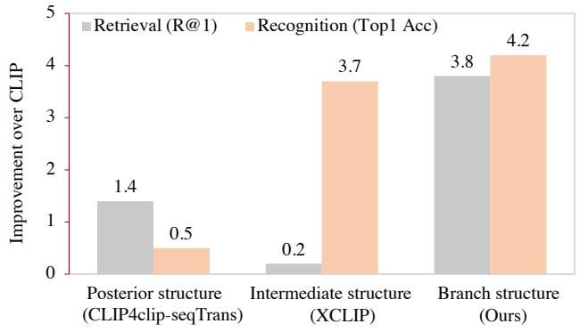
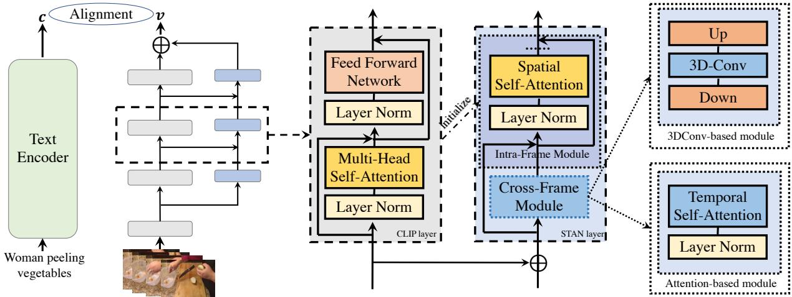
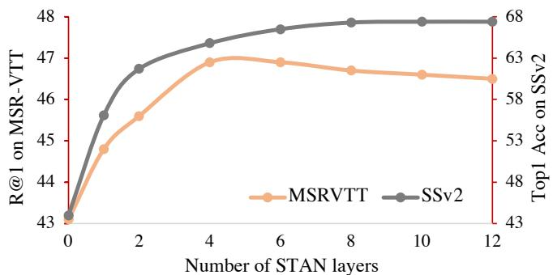

# Revisiting Temporal Modeling for CLIP-based Image-to-Video Knowledge Transferring

Ruyang Liu\*1,3♢ Jingjia Huang\*2 Ge Li1 Jiashi Feng2 Xinglong Wu2 Thomas H. Li B1

1School of Electronic and Computer Engineering, Peking University 2ByteDance Inc 3Peng Cheng Laboratory

{ruyang@stu,geli@ece,thomas@}.pku.edu.cn {huangjingjia,jshfeng,wuxinglong}@bytedance.com

## Abstract

Image-text pretrained models, e.g., CLIP, have shown impressive general multi-modal knowledge learned from large-scale image-text data pairs, thus attracting increasing attention for their potential to improve visual representation learning in the video domain. In this paper, based on the CLIP model, we revisit temporal modeling in the context of image-to-video knowledge transferring, which is the key pointfor extending image-text pretrained models to the video domain. We find that current temporal modeling mechanisms are tailored to either high-level semanticdominant tasks (e.g., retrieval) or low-level visual patterndominant tasks (e.g., recognition), and fail to work on the two cases simultaneously. The key difficulty lies in modeling temporal dependency while taking advantage of both highlevel and low-level knowledge in CLIP model. To tackle this problem, we present Spatial-Temporal Auxiliary Network (STAN) – a simple and effective temporal modeling mechanism extending CLIP model to diverse video tasks. Specifically, to realize both low-level and high-level knowledge transferring, STAN adopts a branch structure with decomposed spatial-temporal modules that enable multilevel CLIP features to be spatial-temporally contextualized. We evaluate our method on two representative video tasks: Video-Text Retrieval and Video Recognition. Extensive experiments demonstrate the superiority of our model over the state-of-the-art methods on various datasets, including MSR-VTT, DiDeMo, LSMDC, MSVD, Kinetics-400, and Something-Something-V2. Codes will be available at https://github.com/farewellthree/STAN

## 1. Introduction

Recent years have witnessed the great success of imagetext pretrained models such as CLIP [31]. Pretrained on over 400M image-text data pairs, these models learned transferable rich knowledge for various image understanding tasks. Similarly, video domains also call for a CLIP-like model to solve downstream video tasks. However, it is hard to get a pretrained model as powerful as CLIP in the video domain due to the unaffordable demands on computation resources and the difficulty of collecting video-text data pairs as large and diverse as image-text data. Instead of directly pursuing video-text pretrained models [16, 26], a potential alternative solution that benefits video downstream tasks is to transfer the knowledge in image-text pretrained models to the video domain, which has attracted increasing attention in recent years [11, 12, 25, 28, 29, 40].

Extending pretrained 2D image models to the video domain is a widely-studied topic in deep learning [4, 7], and the key point lies in empowering 2D models with the capability of modeling temporal dependency between video frames while taking advantages of knowledge in the pretrained models. In this paper, based on CLIP [31], we revisit temporal modeling in the context of image-to-video knowledge transferring, and present Spatial-Temporal Auxiliary Network (STAN) – a new temporal modeling method that is easy and effective for extending image-text pretrained model to diverse downstream video tasks.

We find that current efforts on empowering CLIP with temporal modeling capability can be roughly divided into posterior structure based methods and intermediate structure based methods as shown in Fig. 1(a). Posterior structure based methods [11,12,25] employ a late modeling strategy, which take CLIP as a feature extractor and conduct temporal modeling upon the embeddings of video frames extracted independently from CLIP. Upon the highly semantic embeddings, though the structure is beneficial for transferring the well-aligned visual-language representation (i.e., high-level knowledge) to downstream tasks, it hardly captures the spatial-temporal visual patterns (i.e., low-level knowledge) among different frames, which is important for video understanding. As shown in Fig. 1(b), compared to the CLIP baseline that employs a naive mean pooling to aggregate the features of all frames to obtain a video representation, the performance improvement brought by the typical posterior structure, i.e. CLIP4clip-seqTrans [25] is trivial, especially on the video action recognition task where

  
(a)

  
(b)  
Figure 1. (a) Illustration of temporal modeling with posterior structure (left), intermediate structure (middle) and our branch structure(right). (b) Performance comparison among the posterior structure based CLIP4clip-seqTrans [25] , intermediate structure based XCLIP [28] and our branch structure based STAN. We take the CLIP model with a naive mean pooling to aggregate the features of all frames into video representations as the baseline. We present the improvement brought by different methods over this baseline w.r.t. Recall@1 on MSRVTT for video-text retrieval and Top-1 accuracy on Kinetics-400 for video recognition.

## spatial-temporal visual patterns are crucial.

In contrast to posterior structure based methods, intermediate structure based methods [4, 28, 29] strengthen the spatial-temporal modeling capability of CLIP via plugging temporal modeling modules directly between CLIP layers, and achieve 3.7% improvement over the baseline on the video action recognition task. However, we find that inserting additional modules into CLIP would impact the pretrained high-level semantic knowledge in the model, which only outperforms the baseline by 0.2% on the video-text retrieval tasks. Therefore, modeling temporal dependency while taking advantage of knowledge in different levels of representation is important for extending the CLIP model to the video domain.

Unlike the above methods, inspired by FPN [22] that introduces a branch network to strengthen multi-level representation learning for CNNs, our proposed STAN employs a new branch structure outside of the visual backbone, as shown in Fig. 1(a). Thanks to the branch structure, STAN augments the features of video frames with spatialtemporal contexts at different CLIP output levels without affecting the forward-propagating of CLIP itself. Thus, it is able to take advantage of both high-level and low-level knowledge in the pretrained model simultaneously, and effectively extends CLIP to diverse downstream video tasks. STAN consists of multiple layers with a spatial-temporal separated design. Specifically, the layer operates spatialtemporal modeling via alternatively stacking two separate modules – an intra-frame module and a cross-frame module, which enables the layer to boost the performance of model via reusing the pretrained parameter of CLIP layers to initialize the intra-frame spatial modules. We further investigate two instantiations of cross-frame modules, i.e., the selfattention-based module and 3D convolution based module, to facilitate the comprehensive understanding of STAN in

different implementations.

We evaluate our STAN on both the high-level semanticdominant task (i.e., video-text retrieval) and low-level visual pattern-dominant task (i.e.,, video recognition), trialing our methods from the two different perspectives. Extensive experiments demonstrate our expanded models are generally effective on the two different tasks. For videotext retrieval, we surpass the CLIP4clip by +3.7%, +3.1%, and +2.1% R@1 on MSRVTT, DiDemo, and LSMDC. For video recognition, we achieve competitive performance on Kinetics-400, with 88× fewer FLOPs than Swin3D-L [24] and improve CLIP baseline by 20%+ on Something-Something-V2.

Our main contributions are summarized as: (1) we revisit temporal modeling in the context of image-to-video knowledge transferring and figure out that the key challenge lies in modeling temporal dependency while taking advantage of both high-level and low-level knowledge; (2) we propose Spatial-Temporal Auxiliary Network (STAN) – a new branch structure for temporal modeling, which facilitates representation learning of video frames with including spatial-temporal contexts at different levels and better transfer the pretrained knowledge in CLIP to diverse video tasks; (3) our method achieves competitive results on both video-text retrieval and video recognition tasks compared to SOTA methods.

## 2. Related Work

Visual-Language Pre-Training. Visual-Language pretraining has drawn growing attention in past years [26, 35, 36]. Recently, the contrastive language-image pretraining on web-scale data [17, 31, 45] achieves great success for its remarkable performance when transferring to various downstream tasks. One of the most famous works is the CLIP [31], which has revealed surprising capacities of zeroshot recognition and domain generalization [25, 30, 48]. However, language-video datasets suffer from either finite scale [3] or noisy subtitle annotations [26, 44] as well as expensive computation consumes, hence the limited improvement from the pretraining. Thereby, efforts are made [11, 12, 23, 25, 27–29, 41] to adapt the language-image pretraining models to video tasks, which even get better results than methods pretrained on video datasets.

CLIP for Video-Text Retrieval. CLIP contains rich visiontext aligned knowledge, which is favoured by the videotext retrieval task. Early works [11, 12, 14, 25, 47] try to add temporal modeling modules as a posterior structure to CLIP, e.g., the sequential transformer in [25] and the temporal difference transformer in [11]. Despite the progress they have made, the temporal modeling is limited in highlevel embeddings and not effective enough as shown in Fig. 1(b). There are also some works that modify CLIP from the perspective of disentangling and multi-level representation interaction [14, 27, 41], and achieve general advancement on various video-text retrieval datasets. However, these methods can only be applied to tasks with sentence input (i.e., multimodal tasks), and are not suitable for recognition tasks. In contrast, our method advances the retrieval as well as other video tasks through effective temporal modeling.

CLIP for Video Recognition. Compared to the retrieval task, the recognition task requires a model to better modeling the dynamic visual patterns in videos, where the visual patterns in CLIP learnt from large-scale image-text pretraining data are valuable. Therefore, there are numbers of works migrating the CLIP to video recognition [3, 18, 28, 29, 40]. Some of them focus on the prompting or sampling modeling [3, 18, 28], and others [4, 28, 29, 40] design temporal modules as a intermediate structure illustrated in Fig 1(a). Ni et al [28] insert the message token to input frame tokens to capture sequence information. Pan et al [29] develop 3D convolution modules as adapters plugged between the CLIP layers. Unlike the aforementioned methods, we propose a branch structure based method for better transferring image-text model to the video domain.

## 3. Methodology

## 3.1. Motivation and Overview

CLIP is a large-scale image-text pretrained model which learns general multi-modal knowledge from 400 million image-text pairs. It consists of two encoders for the extraction of image and text representation respectively, where the visual encoder is composed of a stack of transformerbased [38] encoder layers. From the bottom to the top of layers, the visual encoder gradually learns the visual patterns at different levels of abstraction [46], and at last outputs high-level visual embedding semantically aligned with the corresponding embedding in the text modality.

CLIP-based image-to-video transferring aims to improve the learning of video representation with the pretrained knowledge in CLIP, where the key point lies in empowering the image encoder in CLIP with the capability of modeling temporal dependency between video frames. Current works typically introduce extra modules as a posterior or intermediate structure of CLIP visual encoder for explicitly temporal modeling towards different downstream video tasks. For high-level semantic knowledge dominant tasks, e.g., video-text retrieval, the posterior structure takes advantage of the pretrained visual-language alignment knowledge via operating temporal modeling upon the outputs of CLIP. As for visual pattern dominant tasks, e.g., video action recognition, the intermediate structure benefits from the pretrained visual patterns knowledge in CLIP, named as low-level knowledge, and empowers the encoder with the capability of learning spatial-temporal patterns from the video. Nevertheless, the posterior structure and the intermediate structure based temporal modeling methods fail to transfer the high-level and low-level knowledge to the video domain simultaneously.

Therefore, we propose Spatial-Temporal Auxiliary Network (STAN), a new temporal modeling mechanism for CLIP-based image-to-video knowledge transferring. As shown in Fig. 2, STAN consists of a stack of K spatialtemporal layers and acts as a branch structure beside the CLIP visual encoder. Given a video with T frames, the frames are fed into the CLIP visual backbone to obtain intermediate outputs at last K + 1 level of CLIP layers. We denote the outputs of the kth selected CLIP layer as:

$$
V ^ { k } = \{ f _ { i , j } ^ { k } \in \mathcal { R } ^ { D } | i \in [ 1 , T ] , j \in [ 0 , L ] \} ,\tag{1}
$$

which is a visual embedding sequence of the video where $T ,$ L and D are the frame number, per-frame patch number and embedding dimension, respectively. In $\bar { V } ^ { k } , \ f _ { i , 0 } ^ { k }$ indicates the embedding of [CLS] token in the ith frame of the video while $f _ { i , j > 0 } ^ { k }$ represents the visual embedding of jth patch in the frame. Then, we feed each intermediate output $V ^ { k }$ into the corresponding level of layer in STAN for the modeling of spatial-temporal correspondence between video frames. At last, we fuse the output of the last CLIP layer with the output of STAN to get the final representation of the video.

Compared to the posterior structure based methods, STAN operates spatial-temporal modeling on multi-level CLIP representations and thereby is able to better capture the visual dynamics information in the video. Meanwhile, unlike previous intermediate structure based methods, which insert additional modules into CLIP visual encoder, the branch structure of STAN avoids destroying the inherent structure of the visual encoder and thereby protect the pretrained knowledge, especially the high-level visualtext alignment knowledge in CLIP.

  
Figure 2. The overview of our proposed STAN architecture, including the global overview of our backbone (left), details of the internal structure of our spatial-temporal module (middle), and implementations of the cross-frame module (right).

## 3.2. Spatial-Temporal Auxiliary Network

STAN consists of a stack of K spatial-temporal layers, where the input for each layer is constructed based on the output of a CLIP visual layer. For the kth layer in STAN, its input is an embedding sequence of the video denoted as:

$$
V ^ { \prime k } = \{ f _ { 0 , 0 } ^ { \prime k } , f _ { 1 , 1 } ^ { \prime k } , . . , f _ { 1 , L } ^ { \prime k } , . . , f _ { T , 1 } ^ { \prime k } , . . , f _ { T , L } ^ { \prime k } \} ,\tag{2}
$$

where $f _ { 0 , 0 } ^ { \prime k }$ is the embedding of [CLS] token for the whole video while others are embedding of image patches in different frames. The output of the STAN layer is also an embedding sequence with the same size as its input, which is denoted as:

$$
\widetilde { V } ^ { k } = \{ \widetilde { f } _ { 0 , 0 } ^ { k } , \widetilde { f } _ { 1 , 1 } ^ { k } , . . , \widetilde { f } _ { 1 , L } ^ { k } , . . , \widetilde { f } _ { T , 1 } ^ { k } , . . , \widetilde { f } _ { T , L } ^ { k } \} ,\tag{3}
$$

At the first STAN layer, to construct its input from $V ^ { 1 }$ we first average the embedding of [CLS] tokens in each frame as a new embedding $\begin{array} { r } { \left. f _ { 0 , 0 } ^ { \prime 1 } \right. = \frac { 1 } { T } \sum _ { i \in T } f _ { i , 0 } ^ { 1 } . } \end{array}$ , and then update patch embeddings in $V ^ { 1 }$ with spatial and temporal position embeddings as:

$$
f _ { i , j } ^ { \prime 1 } = \operatorname { D r o p o u t } ( f _ { i , j } ^ { 1 } + \operatorname { P o s } _ { \mathrm { t } } ( t ) + \operatorname { P o s } _ { \mathrm { s } } ( j ) ) ,\tag{4}
$$

where $j > 0$ while $\mathrm { P o s _ { t } }$ and Pos are the learnable embeddings for the temporal and spatial position of each patch. For the other layers in STAN, the input $V ^ { \prime k }$ is constructed based on the output from the previous STAN layer $\widetilde { V } ^ { k - 1 }$ and CLIP output $V ^ { k }$ as follows:

$$
f _ { 0 , 0 } ^ { \prime k } = \widetilde { f } _ { 0 , 0 } ^ { k - 1 } + \mathrm { W } _ { p r o j } ^ { k } \frac { 1 } { T } \sum _ { i \in T } f _ { i , 0 } ^ { k } ,\tag{5}
$$

$$
f _ { i , j } ^ { \prime k } = \widetilde { f } _ { i , j } ^ { k - 1 } + \mathrm { W } _ { p r o j } ^ { k } f _ { i , j } ^ { k } ,\tag{6}
$$

where $i \in [ 1 , T ] , j \in [ 1 , L ]$ , and ${ \bf W } _ { p r o j } ^ { k } \in \ : { \bf R } ^ { D \times D }$ is a projection layer.

Given the input embedding sequence of the video, STAN layer learns the spatial-temporal information among the video frames. As shown in Fig. 2, it operates temporal modeling via alternatively stacking two separated modules – an intra-frame module and a cross-frame module. Thanks to the separated design, we are able to reuse the structure in CLIP visual encoder layer as our intra-frame spatial module and initialize it with the pretrained model, which effectively improves the performance on downstream tasks. Same as CLIP, the intra-frame module is also a self-attention block responsible for spatial modeling. For simplicity, we omit the superscript of embedding and denote the embeddings in frame i as $X _ { i } ^ { \setminus } \in \mathbf { R } ^ { ( L + 1 ) \times D }$ , where the embedding of [CLS] token in the video is duplicated and concatenated with patch embeddings. In each frame, the spatial module updates embeddings via self-attention:

$$
\hat { X } _ { i } = \operatorname { s o f t m a x } ( X _ { i } \mathbf { W } _ { \mathrm { Q } } ( X _ { i } \mathbf { W } _ { \mathrm { K } } ) ^ { \mathrm { T } } / \sqrt { D } ) ( X _ { i } \mathbf { W } _ { \mathrm { V } } ) + X _ { i } ,\tag{7}
$$

where $\mathrm { W _ { Q } / W _ { K } / W _ { V } }$ indicate the linear projections for the query, key and value in self-attention layer of the spatial module. After that, the duplicated [CLS] embeddings in each frame are averaged as the video [CLS] embeddings.

The cross-frame module is responsible for temporal modeling. For simplicity, we omit the superscript of embedding and denote the collection of jth patch embeddings in different frames as $Y _ { j } \ \in \ \mathbf { R } ^ { T \times D }$ . At each spatial position, the patch embeddings are updated as ${ \hat { Y } } _ { j } =$ $T e m p ( Y _ { j } )$ , where T emp() indicates the message passing strategy across temporal dimension which can be instantiated in different ways. In the next section, we present a selfattention-based cross-frame module and a 3D convolutionbased cross-frame module, and study the performance of the two instantiations.

## 3.3. Temporal Modeling in STAN

In deep learning, there are various ways to achieve temporal modeling, for example, 3D convolution [7,37], temporal self-attention [2, 4] and proxy tokens [10, 28]. In this paper, we investigate two most popular instantiations of temporal modeling in the proposed framework, $i . e . ,$ , the selfattention based module and convolution based module, to facilitate the comprehensive understanding of STAN in different implementations.

Self-attention based module. Self-attention has a natural advantage in sequence modeling due to its global modeling capability. At each spatial position, the patch embeddings from different frames are updated as:

$$
\hat { Y _ { i } } = \operatorname { s o f t m a x } ( Y _ { i } \mathrm { W _ { Q } } ( Y _ { i } \mathrm { W _ { K } } ) ^ { \mathrm { { T } } } / \sqrt { D } ) ( Y _ { i } \mathrm { W _ { V } } ) + Y _ { i } ,\tag{8}
$$

where $\mathrm { W _ { Q } / W _ { K } / W _ { V } }$ indicate the linear projections for the query, key, and value in self-attention layer of the crossframe module. Through temporal attention, each patch is contextualized with temporal information at the same locations.

Convolution based module. Convolution operator has been widely adapted for effective temporal modeling in CNNs [7, 37, 42], e.g., C3D [37], S3D [42]. Though selfattention gains increasing attention, convolution still owns the advantage of better local modeling and easier easier to converge. Therefore, we also implement the cross-frame module of STAN based on the convolution operator. Specifically, we stack the patch embeddings of the video to form a 3D feature cube $\dot { Y } \in \mathbf { R } ^ { T \times W \times H \times D }$ and then update the features as follows:

$$
Y = U p ( { \mathrm { G e l u } } ( 3 \mathrm { D C o n v } ( { \cal D o w n } ( Y ) ) ) ) + Y ,\tag{9}
$$

where the Down() and $U p ( )$ are the point-wise convolution operators with channel size of $\frac { D } { 8 }$ and $D ,$ which reduce and restore the dimension of patch embeddings. As for the kernel size of 3D convolution, the dimensions for T, H, and W are set to 3, 1, and 1 respectively.

## 4. Experiments

## 4.1. Experiment Settings

Datasets. We evaluate our method on both the highlevel semantic-dominant task $i . e . ,$ , video-text retrieval, and low-level visual pattern-dominant task $i . e . , .$ , video recognition, trialing our methods from the two different perspectives. For video-text retrieval, we employ MSR-VTT [43], DiDemo [1] and LSMDC [32]; for video recognition, we adopt Kinetics-400 [19] and Something-Something-v2 [15].

MSR-VTT is the most popular benchmark consisting of 10,000 YouTube videos with 20 captions for each video. DiDemo contains 10,000 videos and 40,000 sentences with longer video duration than other retrieval datasets. LSMDC is a large-scale video-text retrieval benchmark with 118,081 videos from 202 movies, which is more diverse in concept and duration than other datasets.

Kinetics-400 (K-400) is a popular video action recognition dataset that has 260,000 videos with average 300 frames and 400 action classes. Something-Something-v2 (SSv2) is a video action recognition benchmark especially for temporal modeling, which contains 220,485 videos and 174 action classes. In K-400, most of the action categories are biased to static scene context [34]. In SSv2, the classes of action are less relevant to the static scene context but closely related to the dynamic information in videos.

Implementation Details. We set the number of STAN lay ers to 4 for all datasets except on SSv2 when it is set to 6. We employ the simple cross-entropy loss and NCE loss for fine-tuning on video recognition and video-text retrieval, respectively. Following previous work [25], we fine-tune the model with a frame number of 12 and a token length 32 for MSRVTT, LSMDC, K400, and SSv2. On Didemo where videos have a longer duration, the frame number and token number are set to 64 and 64. The batch size is set to 128 for all datasets. We adopt Adam as our optimizer with weight decay of 0.02. The learning rates are initialized to 2e-6 and 2e-5 for parameters in $C L I P$ and parameters in STAN respectively, and then decay following a cosine annealing decay schedule. For more details and code, please refer to supplementary materials.

## 4.2. Comparisons with State-of-the-art

Video-Text Retrieval. We compare our STAN with current SOTAs including both video-text pretrained and CLIPpretrained methods across different benchmarks. Comparisons on MSR-VTT, DiDemo abd LSMDC are reported in Table 1, 2, and 3, respectively. For CLIP-pretrained methods, unless denoted with B/16, all the methods are based on CLIP-B/32. For our method, we report the results achieved by both CLIP-B/32 and CLIP-B/16, and denote STAN with self-attention and 3D convolution based inter-frame module as STAN-self and STAN-conv, respectively.

As shown in Table 1, 2 and 3, CLIP-based methods generally achieve superior performance than the video-text pretrained methods, which demonstrates the great potential of transferring image-text pretrained models to the video domain. Among the CLIP-based methods, our STAN achieves SOTA performance across all three benchmarks at both CLIP-B/32 and CLIP-B/16 model scales. Specifically, with comparable model size, STAN outperforms the posterior structure based method, i.e., CLIP4clip [25] by 2.9% at R@1 averaged on the three datasets, which shows obvious advantage of the branch structure. Compared to the other SOTAs, e.g., DRL [41], which advances video-text retrieval via improving the cross-modality interaction upon visuallanguage outputs of CLIP, STAN shows a different way to achieve competitive performance, which improves the temporal modeling capability of CLIP itself. Therefore, empowering CLIP model with stronger video representation learning capability, STAN is potentially compatible with the other SOTAs which present advanced techniques operated upon CLIP outputs, e.g., hierarchical video-text interaction [27, 41] and hard sample modeling [11]. We leave them for future work. Additionally, we also notice that both the self-attention and 3D convolution instantiated model, i.e., STAN-self and STAN-conv, achieve competitive performance with a slight difference. Specifically, STAN-conv is comparable with STAN-self when transferring to smaller datasets, e.g., MSRVTT (-0.3 at R@1) and DiDeMo (+0.3 at R@1) while STAN-self is better on larger scale dataset, e,g., LSMDC (+0.6 at R@1). The results further suggest that self-attention instantiated STAN would be the better choice when transferring CLIP to large-scale downstream datasets, while 3D convolution instantiated STAN would be better for the small ones. In Appendix, we present more results with visualization.

Table 1. Comparisons on MSR-VTT [43]. We train on Training-9K and test on Test-1k-A. \* means extra tricks (e.g., DSL [8] and QB-Norm [5]) are utilized during inference.
<table><tr><td>Methods</td><td>R@1↑</td><td>R@5↑</td><td>R@10↑</td><td>MdR↓</td></tr><tr><td colspan="5">Pretrained on large-scale video-text dataset</td></tr><tr><td>ClipBERT [20]</td><td>22.0</td><td>46.8</td><td>59.9</td><td>6.0</td></tr><tr><td>Frozen [3]</td><td>31.0</td><td>59.5</td><td>70.5</td><td>3.0</td></tr><tr><td>HD-VILA [44]</td><td>35.6</td><td>65.3</td><td>78.0</td><td>3.0</td></tr><tr><td>All-in-one [39]</td><td>37.9</td><td>68.1</td><td>77.1</td><td></td></tr><tr><td>BridgeFormer [13]</td><td>37.6</td><td>64.8</td><td>75.1</td><td>3.0</td></tr><tr><td>Clover [16]</td><td>38.6</td><td>67.4</td><td>76.4</td><td>2.0</td></tr><tr><td>CLIP pretrained</td><td></td><td></td><td></td><td></td></tr><tr><td>Clip4clip [25]</td><td>44.5</td><td>71.4</td><td>81.6</td><td>2.0</td></tr><tr><td>CenterCLIP [47]</td><td>44.2</td><td>71.6</td><td>82.1</td><td>2.0</td></tr><tr><td>CLIP2Video* [11]</td><td>47.2</td><td>73.0</td><td>83.0</td><td></td></tr><tr><td>CAMoE*[8]</td><td>47.3</td><td>74.2</td><td>84.5</td><td>3.0</td></tr><tr><td>CLIP2TV-B/16 [12]</td><td>49.3</td><td>74.7</td><td>83.6</td><td>2.0</td></tr><tr><td>DRL-B/16* [41]</td><td>53.3</td><td>80.3</td><td>87.6</td><td>1.0</td></tr><tr><td colspan="5">Our method</td></tr><tr><td>STAN-self-B/32</td><td>46.9</td><td>72.8</td><td>82.8</td><td></td></tr><tr><td></td><td>46.6</td><td>72.8</td><td></td><td>2.0</td></tr><tr><td>STAN-conv-B/32</td><td>49.0</td><td></td><td>82.2</td><td>2.0</td></tr><tr><td>STAN-self-B/32*</td><td>50.0</td><td>74.8 75.2</td><td>83.5 84.1</td><td>2.0</td></tr><tr><td>STAN-self-B/16 STAN-self-B/16*</td><td>54.1</td><td>79.5</td><td>87.8</td><td>1.5 1.0</td></tr></table>

Table 2. Comparisons on DiDemo [1]. We concatenate all captions of a video into a single query. \* means extra tricks (e.g., DSL [8] and QB-Norm [5]) are utilized during inference.
<table><tr><td>Methods</td><td>R@1↑</td><td>R@5↑</td><td>R@10↑</td><td>MdR↓</td></tr><tr><td colspan="5">Pretrained on large-scale video-text dataset</td></tr><tr><td>ClipBERT [20]</td><td>20.4</td><td>48.0</td><td>60.8</td><td>6.0</td></tr><tr><td>Frozen [3]</td><td>31.0</td><td>59.8</td><td>72.4</td><td>3.0</td></tr><tr><td>HD-VILA [44]</td><td>28.8</td><td>57.4</td><td>69.1</td><td>4.0</td></tr><tr><td>All-in-one [39]</td><td>32.7</td><td>61.4</td><td>73.5</td><td>3.0</td></tr><tr><td>BridgeFormer [13]</td><td>37.0</td><td>62.2</td><td>73.9</td><td>3.0</td></tr><tr><td>Clover [16]</td><td>48.6</td><td>74.3</td><td>82.2</td><td>2.0</td></tr><tr><td colspan="5">CLIP pretrained</td></tr><tr><td>Clip4clip [25]</td><td>43.4</td><td>70.2</td><td>80.6</td><td>2.0</td></tr><tr><td>CAMoE* [8]</td><td>43.8</td><td>71.4</td><td></td><td></td></tr><tr><td>CLIP2TV [12]</td><td>45.5</td><td>69.7</td><td>80.6</td><td>2.0</td></tr><tr><td>DRL-B/16 [41]</td><td>49.0</td><td>76.5</td><td>84.5</td><td>2.0</td></tr><tr><td colspan="5">Our method</td></tr><tr><td>STAN-self-B/32</td><td>46.2</td><td>70.4</td><td>80.0</td><td>2.0</td></tr><tr><td>STAN-conv-B/32</td><td>46.5</td><td>71.5</td><td>80.9</td><td>2.0</td></tr><tr><td>STAN-conv-B/32*</td><td>51.3</td><td>75.1</td><td>83.4</td><td>1.0</td></tr><tr><td>STAN-conv-B/16</td><td>49.4</td><td>74.9</td><td>84.5</td><td>1.0</td></tr><tr><td>STAN-conv-B/16*</td><td>54.6</td><td>78.4</td><td>85.1</td><td>1.0</td></tr></table>

Table 3. Comparison on LSMDC [32]. \* means extra tricks (e.g., DSL [8] and QB-Norm [5]) are utilized during inference.
<table><tr><td>Methods</td><td>R@1↑</td><td>R@5↑</td><td>R@10↑</td><td>MdR↓</td></tr><tr><td colspan="5">Pretrained on large-scale video-text dataset</td></tr><tr><td>Frozen [3]</td><td>15.0</td><td>30.8</td><td>40.3</td><td>20.0</td></tr><tr><td>HD-VILA [44]</td><td>17.4</td><td>34.1</td><td>44.1</td><td>15.0</td></tr><tr><td>BridgeFormer [13]</td><td>17.9</td><td>35.4</td><td>44.5</td><td>15.0</td></tr><tr><td>Clover [16]</td><td>22.7</td><td>42.0</td><td>52.6</td><td>9.0</td></tr><tr><td colspan="5">CLIP pretrained</td></tr><tr><td>Clip4Clip [25]</td><td>21.6</td><td>41.8</td><td>49.8</td><td>8.0</td></tr><tr><td>CAMoE*[8]</td><td>25.9</td><td>46.1</td><td>53.7</td><td></td></tr><tr><td>CCLIP-B/16 [47]</td><td>24.2</td><td>46.2</td><td>55.9</td><td>8.0</td></tr><tr><td>DRL-B/16 [41]</td><td>26.5</td><td>47.6</td><td>56.8</td><td>7.0</td></tr><tr><td colspan="5">Our method</td></tr><tr><td>STAN-self-B/32</td><td>23.7</td><td>42.7</td><td>51.8</td><td>9.0</td></tr><tr><td>STAN-conv-B/32</td><td>23.1</td><td>42.2</td><td>51.0</td><td>9.0</td></tr><tr><td>STAN-self-B/32*</td><td>26.2</td><td>46.0</td><td>53.9</td><td>9.0</td></tr><tr><td>STAN-self-B/16</td><td>27.1</td><td>49.3</td><td>58.7</td><td>6.0</td></tr><tr><td>STAN-self-B/16*</td><td>29.2</td><td>49.5</td><td>58.8</td><td>6.0</td></tr></table>

Video Recognition. To evaluate the spatial-temporal modeling capability of STAN, we compare it to other SOTAs on video recognition benchmarks, i.e., Kinetics-400 (K400) and Something-Something-v2 (SSv2). The results are reported in Table 4 and Table 5 respectively. On K400 benchmark, CLIP-based methods achieve competitive results with much smaller model size compared to the imagepretrained methods, which shows the superiority of imagetext pretraining. For example, our VIT-B/16 based STAN outperforms VIT-Huge based ViViT [2] and Swin3D-L based Video-swin [24], which have more than 15× and 88× GFLOPs compared to our method. Meanwhile, our method achieves SOTA performance among CLIP-based methods, which demonstrates the effective of our method on transferring CLIP to the video domain. As for SSv2 benchmark, we find that, without temporal modeling, bare CLIP model [9] achieves only 44.0% top-1 accuracy which dramatically under-performs ImageNet-21K pretrained Timesformer [6], though it owns pretrained knowledge obtained from a much larger image-text dataset. The result suggest that the domain gap is significant between SSv2 and CLIP model, and temporal modeling capability is desired for the action recognition task on SSv2. STAN brings about more than 20% performance improvement over the CLIP baseline and achieves competitive compared to other CLIP-based methods, which demonstrates that STAN empowers CLIP with strong temporal modeling capability.

## 4.3. Ablation Study

To verify the contribution of different components in our method, we conduct ablation experiments on both videotext retrieval tasks (i.e., MSR-VTT and DiDemo) and video action recognition tasks (i.e., K400 and SSv2). First of all, according to the results reported in Table 6, we can conclude that components in STAN are compatible with each other while each of them contributes to the transferring of CLIP. Specifically, when we remove the branch structure and multi-level feature learning, and append STAN as a posterior structure upon the CLIP, the performance of STAN decreased a lot on all four benchmarks, which demonstrates the superiority of our model structure compared to the posterior structure. Besides, we find that without the Cross-Frame module, STAN still brings about performance improvement over baseline, which suggests that our method is beneficial to image-to-video knowledge transferring for CLIP model. With the help of Cross-Frame module, the complete STAN further outperforms the baseline by a larger margin and achieves SOTA performance on both videotext retrieval and video recognition tasks, which reveals our method is able to model temporal dependency while taking advantage of knowledge in different level of representation.

Table 4. Comparison between our method and the state-of-the-arts on Kinetics-400 validation set [19]. We report the FLOPs of all views.
<table><tr><td>Methods</td><td>Pretrain</td><td>Frames</td><td>Testing Views</td><td>GFLOPs</td><td>Top-1 Accuracy</td><td>Top-5 Accuracy</td></tr><tr><td>Large-scale image pretraining</td><td></td><td></td><td></td><td></td><td></td><td></td></tr><tr><td>TimeSformer-L [4]</td><td>ImageNet-21 K</td><td>96</td><td> $1 \times 3$ </td><td>7140</td><td>80.7</td><td>94.7</td></tr><tr><td>Video-Swin-L (384 ↑) [24]</td><td>ImageNet-21 K</td><td>32</td><td> $1 0 \times 5$ </td><td>105350</td><td>84.9</td><td>96.7</td></tr><tr><td>MViTv2-L (312 ↑) [21]</td><td>ImageNet-21 K</td><td>40</td><td> $5 \times 3$ </td><td>42420</td><td>86.1</td><td>97.0</td></tr><tr><td>ViViT-H [2]</td><td>JFT-300M</td><td>32</td><td> $4 \times 3$ </td><td>17352</td><td>84.8</td><td>95.8</td></tr><tr><td>TokenLearner-L/10 [33]</td><td>JFT-300M</td><td>-</td><td> $4 \times 3$ </td><td>48912</td><td>85.4</td><td>96.3</td></tr><tr><td colspan="3">Large-scale image-text pretraining</td><td></td><td></td><td></td><td></td></tr><tr><td>CLIP-B/16 [9]</td><td>CLIP-400M</td><td>8</td><td> $4 \times 3$ </td><td></td><td>81.1</td><td>94.8</td></tr><tr><td>Action-CLIP-B/16 [40]</td><td>CLIP-400M</td><td>32</td><td> $1 0 \times 3$ </td><td>16890</td><td>83.8</td><td>96.2</td></tr><tr><td>A6 [18]</td><td>CLIP-400M</td><td>16</td><td></td><td></td><td>76.9</td><td>93.5</td></tr><tr><td>STadapter-CLIP-B/16 [29]</td><td>CLIP-400M</td><td>8</td><td> $1 \times 3$ </td><td>455</td><td>82.0</td><td>95.7</td></tr><tr><td>STadapter-CLIP-B/16 [29]</td><td>CLIP-400M</td><td>32</td><td> $1 \times 3$ </td><td>1821</td><td>82.7</td><td>96.2</td></tr><tr><td>X-CLIP-B/16 [28]</td><td>CLIP-400M</td><td>8</td><td> $4 \times 3$ </td><td>1740</td><td>83.8</td><td>96.7</td></tr><tr><td>X-CLIP-B/16 [28]</td><td>CLIP-400M</td><td>16</td><td> $4 \times 3$ </td><td>3444</td><td>84.7</td><td>96.8</td></tr><tr><td>Our method</td><td></td><td></td><td></td><td></td><td></td><td></td></tr><tr><td>STAN-conv-B/16</td><td>CLIP-400M</td><td>8</td><td> $1 \times 3$ </td><td>714</td><td>83.1</td><td>96.0</td></tr><tr><td>STAN-self-B/16</td><td>CLIP-400M</td><td>8</td><td> $1 \times 3$ </td><td>593</td><td>84.2</td><td>96.5</td></tr><tr><td>STAN-self-B/16</td><td>CLIP-400M</td><td>16</td><td> $1 \times 3$ </td><td>1187</td><td>84.9</td><td>96.8</td></tr></table>

Table 5. Comparison on Something-Something-v2 validation set [15]. We report the FLOPs of all views. \* means our implementation.
<table><tr><td>Methods</td><td>Pretrain</td><td>Frames</td><td>Testing Views</td><td>GFLOPs</td><td>Top-1 Accuracy</td><td>Top-5 Accuracy</td></tr><tr><td>TimeSformer-HR [4]</td><td>ImageNet-21 K</td><td>16</td><td> $\overline { { 1 \times 3 } }$ </td><td>5109</td><td>62.5</td><td></td></tr><tr><td>ViViT-L [2]</td><td>K400</td><td>16</td><td> $4 \times 3$ </td><td>11892</td><td>65.4</td><td>89.8</td></tr><tr><td>MViT-B-24 [21]</td><td>K600</td><td>32</td><td> $1 \times 3$ </td><td>708</td><td>68.7</td><td>91.5</td></tr><tr><td>Video-Swin-B [24]</td><td>K400</td><td>32</td><td> $1 \times 3$ </td><td>963</td><td>69.6</td><td>92.7</td></tr><tr><td>CLIP-B/16 [9]</td><td>CLIP-400M</td><td>8</td><td> $1 \times 3$ </td><td></td><td>44.0</td><td>76.2</td></tr><tr><td>X-CLIP-B/16* [40]</td><td>CLIP-400M</td><td>8</td><td> $1 \times 3$ </td><td>435</td><td>63.1</td><td>89.0</td></tr><tr><td>STadapter-CLIP-B/16 [40]</td><td>CLIP-400M</td><td>8</td><td> $1 \times 3$ </td><td>489</td><td>67.1</td><td>91.2</td></tr><tr><td>STadapter-CLIP-B/16 [40]</td><td>CLIP-400M</td><td>32</td><td> $1 \times 3$ </td><td>1955</td><td>69.5</td><td>92.6</td></tr><tr><td>Our method</td><td></td><td></td><td></td><td></td><td></td><td></td></tr><tr><td>STAN-conv-B/16</td><td>CLIP-400M</td><td>8</td><td> $1 \times 3$ </td><td>845</td><td>65.2</td><td>90.5</td></tr><tr><td>STAN-self-B/16</td><td>CLIP-400M</td><td>8</td><td> $1 \times 3$ </td><td>688</td><td>67.6</td><td>91.4</td></tr><tr><td>STAN-self-B/16</td><td>CLIP-400M</td><td>16</td><td> $1 \times 3$ </td><td>1376</td><td>69.5</td><td>92.7</td></tr></table>

## 4.4. Further discussion on STAN

The effect of different temporal modeling structures. As aforementioned, posterior structure based temporal modeling for $C L I P$ transferring is popular for high-level knowledge dominant tasks, $e . g .$ , video-text retrieval, while intermediate structures are employed for low-level knowledge dominant tasks, e.g., video recognition. In section 4.2, we demonstrate the superiority of our branch structured based method compared to other structures on different tasks, respectively. Here, we further adopt posterior structures for video recognition and intermediate structure for video-text retrieval to better understand the effect of different temporal modeling structures. For posterior structures, we employ the Sequential Transformer (Seq Trans) in CLIP4clip [25] and Temporal Differential Block (TDB) in CLIP2video [11]. For intermediate structures, we choose the Message Token (Msg Token) in XCLIP [28] and STadapter [29]. Note that, for a fair comparison, we only report the performance achieved by the temporal modeling structures without other extra techniques (e.g., prompting modeling in [11] and [28] ). As shown in Table 7, posterior structures are more effective than intermediate structures in transferring CLIP to video-text retrieval tasks, but brings trivial improvement on the video recognition task. In contrast, intermediate structures perform well on video recognition, but bring little improvement over baseline on videotext retrieval. As for our branch structure based STAN, it not only successfully extends CLIP to both tasks but also outperforms both the other two structure based methods, which demonstrates that our structure is a better temporal modeling method in the context of CLIP-based image-tovideo knowledge transferring.

Table 6. Ablation studies on different datasets. For MSRVTT and DiDemo, we use CLIP-B/32 as backbone and report Recall@1; for K400 and SSv2, we use CLIP-B/16 as backbone and report Top1 Accuracy. We adopt temporal self-attention here in our Cross-Frame module.
<table><tr><td colspan="4">Components</td><td colspan="4">Results</td></tr><tr><td>Cross-Frame</td><td>Intra-Frame</td><td>Branch structure</td><td>Multi-level</td><td>MSR-VTT</td><td>DiDemo</td><td>K400</td><td>SSv2</td></tr><tr><td></td><td></td><td></td><td></td><td>43.1</td><td>43.4</td><td>79.9</td><td>44</td></tr><tr><td>V</td><td>V</td><td></td><td></td><td>44.9</td><td>43.5</td><td>80.5</td><td>55.9</td></tr><tr><td>√</td><td>√</td><td>√</td><td></td><td>44.2</td><td>43.6</td><td>80.8</td><td>58.6</td></tr><tr><td></td><td>√</td><td>√</td><td>V</td><td>44.3</td><td>44.5</td><td>81.0</td><td>48.1</td></tr><tr><td>V</td><td></td><td>√</td><td>√</td><td>43.1</td><td>43.7</td><td>80.0</td><td>55.7</td></tr><tr><td>√</td><td>V</td><td>√</td><td>√</td><td>46.9</td><td>46.2</td><td>82.6</td><td>65.9</td></tr><tr><td>+ Testing Techniques (DSL [8] or 1 × 3-views)</td><td></td><td></td><td></td><td>49.7</td><td>51.4</td><td>84.2</td><td>67.6</td></tr></table>

Table 7. Analysis of different structures on both video recognition and retrieval tasks. \* means our own implementation.
<table><tr><td>Method</td><td>Style</td><td>MSR-VTT</td><td>K400</td></tr><tr><td>baseline</td><td>=</td><td>43.1</td><td>79.9</td></tr><tr><td>Msg Token [28]</td><td>Intermediate</td><td>43.2*</td><td>82.7</td></tr><tr><td>ST-adapter [29]</td><td>Intermediate</td><td>42.5*</td><td>82.0</td></tr><tr><td>Seq Trans [25]</td><td>Posterior</td><td>44.5</td><td>80.5*</td></tr><tr><td>TDB [11]</td><td>Posterior</td><td>45.1</td><td>81.1*</td></tr><tr><td>STAN-selfN</td><td>Branch</td><td>46.9</td><td>84.2</td></tr></table>

Table 8. The impact of different levels of inputs from CLIP layers on STAN.
<table><tr><td>Methods</td><td>Recall@1 on MSR-VTT</td><td>Top1 Acc on SSv2</td></tr><tr><td>Baseline</td><td>43.1</td><td>44.0</td></tr><tr><td>3</td><td>43.5</td><td>54.4</td></tr><tr><td>Intrval 2</td><td>44.2</td><td>61.1</td></tr><tr><td>1 1-4</td><td>46.9</td><td>65.2</td></tr><tr><td rowspan="3">Range</td><td>43.4</td><td>62.2</td></tr><tr><td>5-8 43.9</td><td>62.3</td></tr><tr><td>9-12 46.9</td><td>65.2</td></tr></table>

The impact of multi-level inputs from CLIP layers. STAN acts as a new branch beside the CLIP backbone, which takes the video frame representation at different levels of CLIP layers as inputs. To study the impact of the choice of different CLIP representations, we fixed the number of STAN layers to 4 and vary the level range and interval of selected CLIP layers. For the interval, we align the last layer of CLIP and STAN, and vary the interval between the selected CLIP layers. For example, interval=2 means STAN receives outputs of every 2 CLIP layers as inputs, i.e., the 6th, 8th, 10th, and 12th layers. As shown in Table 8, interval=1 is the best choice for both datasets. Then, we fix the interval to 1, and vary the level range of selected CLIP layers. The result suggests that the mid-high level of pretrained CLIP representation is more valuable for downstream tasks.

The impact of STAN layer number. Intuitively, increasing layers in STAN would access more CLIP representation levels bringing about stronger temporal modeling capability. Nevertheless, it also increases the risk of over-fitting to downstream tasks. Thereby, we study the effect of layer number to find a better trade-off. As shown in Fig. 3, for MSR-VTT retrieval, the performance improvement of STAN reaches the peak at 4 layers, and the performance drops with further increasing of layers. On SSv2, the performance improvement of STAN tend to converge after 6 layers. Generally, STAN with 4 to 6 layers is a good choice for different tasks.

  
Figure 3. Analysis of the number of layers in STAN. We report the Recall@1 on MSR-VTT and Top1 Accuracy on SSv2 respectively.

## 5. Conclusion

In this paper, we study the temporal modeling in CLIP-based image-to-video knowledge transferring. We first uncover that current methods fail to work on highlevel semantic-dominant tasks and low-level visual patterndominant tasks simultaneously. Then, to address this problem, we propose a simple and effective framework named Spatial-Temporal Auxiliary Network (STAN) to expand CLIP to diverse video tasks. Extensive experiments on Video-Text Retrieval and Video Recognition tasks demonstrate the superiority of our method.

Acknowledgements. This work was supported by the National Key R&D Program of China (No. 2020AAA0103501), Shenzhen Fundamental Research Program (GXWD20201231165807007 - 20200806163656003) and National Natural Science Foundation of China (No. 62172021).

\*: equal contribution

♢: Work done when interning at ByteDance Inc

## References

[1] Lisa Anne Hendricks, Oliver Wang, Eli Shechtman, Josef Sivic, Trevor Darrell, and Bryan Russell. Localizing moments in video with natural language. In Proceedings of the IEEE international conference on computer vision, pages 5803–5812, 2017. 5, 6

[2] Anurag Arnab, Mostafa Dehghani, Georg Heigold, Chen Sun, Mario Luciˇ c, and Cordelia Schmid. Vivit: A video´ vision transformer. In Proceedings of the IEEE/CVF International Conference on Computer Vision, pages 6836–6846, 2021. 5, 6, 7

[3] Max Bain, Arsha Nagrani, Gul Varol, and Andrew Zisser-¨ man. Frozen in time: A joint video and image encoder for end-to-end retrieval. In Proceedings ofthe IEEE/CVF International Conference on Computer Vision, pages 1728–1738, 2021. 3, 6

[4] Gedas Bertasius, Heng Wang, and Lorenzo Torresani. Is space-time attention all you need for video understanding? In ICML, volume 2, page 4, 2021. 1, 2, 3, 5, 7

[5] Simion-Vlad Bogolin, Ioana Croitoru, Hailin Jin, Yang Liu, and Samuel Albanie. Cross modal retrieval with querybank normalisation. In Proceedings ofthe IEEE/CVF Conference on Computer Vision and Pattern Recognition, pages 5194– 5205, 2022. 6

[6] Adrian Bulat, Juan Manuel Perez Rua, Swathikiran Sudhakaran, Brais Martinez, and Georgios Tzimiropoulos. Space-time mixing attention for video transformer. Advances in Neural Information Processing Systems, 34:19594–19607, 2021. 6

[7] Joao Carreira and Andrew Zisserman. Quo vadis, action recognition? a new model and the kinetics dataset. In proceedings of the IEEE Conference on Computer Vision and Pattern Recognition, pages 6299–6308, 2017. 1, 5

[8] Xing Cheng, Hezheng Lin, Xiangyu Wu, Fan Yang, and Dong Shen. Improving video-text retrieval by multi-stream corpus alignment and dual softmax loss. arXiv preprint arXiv:2109.04290, 2021. 6, 8

[9] Alexey Dosovitskiy, Lucas Beyer, Alexander Kolesnikov, Dirk Weissenborn, Xiaohua Zhai, Thomas Unterthiner, Mostafa Dehghani, Matthias Minderer, Georg Heigold, Sylvain Gelly, et al. An image is worth 16x16 words: Transformers for image recognition at scale. arXiv preprint arXiv:2010.11929, 2020. 6, 7

[10] Quanfu Fan, Chun-Fu Chen, and Rameswar Panda. Can an image classifier suffice for action recognition? In International Conference on Learning Representations, 2021. 5

[11] Han Fang, Pengfei Xiong, Luhui Xu, and Yu Chen. Clip2video: Mastering video-text retrieval via image clip. arXiv preprint arXiv:2106.11097, 2021. 1, 3, 6, 7, 8

[12] Zijian Gao, Jingyu Liu, Sheng Chen, Dedan Chang, Hao Zhang, and Jinwei Yuan. Clip2tv: An empirical study on transformer-based methods for video-text retrieval. arXiv preprint arXiv:2111.05610, 2021. 1, 3, 6

[13] Yuying Ge, Yixiao Ge, Xihui Liu, Dian Li, Ying Shan, Xiaohu Qie, and Ping Luo. Bridging video-text retrieval with multiple choice questions. In Proceedings of the IEEE/CVF

Conference on Computer Vision and Pattern Recognition, pages 16167–16176, 2022. 6

[14] Satya Krishna Gorti, Noel Vouitsis, Junwei Ma, Keyvan¨ Golestan, Maksims Volkovs, Animesh Garg, and Guangwei Yu. X-pool: Cross-modal language-video attention for textvideo retrieval. In Proceedings of the IEEE/CVF Conference on Computer Vision and Pattern Recognition, pages 5006– 5015, 2022. 3

[15] Raghav Goyal, Samira Ebrahimi Kahou, Vincent Michalski, Joanna Materzynska, Susanne Westphal, Heuna Kim, Valentin Haenel, Ingo Fruend, Peter Yianilos, Moritz Mueller-Freitag, et al. The” something something” video database for learning and evaluating visual common sense. In Proceedings ofthe IEEE international conference on computer vision, pages 5842–5850, 2017. 5, 7

[16] Jingjia Huang, Yinan Li, Jiashi Feng, Xiaoshuai Sun, and Rongrong Ji. Clover: Towards a unified videolanguage alignment and fusion model. arXiv preprint arXiv:2207.07885, 2022. 1, 6

[17] Chao Jia, Yinfei Yang, Ye Xia, Yi-Ting Chen, Zarana Parekh, Hieu Pham, Quoc Le, Yun-Hsuan Sung, Zhen Li, and Tom Duerig. Scaling up visual and vision-language representation learning with noisy text supervision. In International Conference on Machine Learning, pages 4904–4916. PMLR, 2021. 2

[18] Chen Ju, Tengda Han, Kunhao Zheng, Ya Zhang, and Weidi Xie. Prompting visual-language models for efficient video understanding. arXiv preprint arXiv:2112.04478, 2021. 3, 7

[19] Will Kay, Joao Carreira, Karen Simonyan, Brian Zhang, Chloe Hillier, Sudheendra Vijayanarasimhan, Fabio Viola, Tim Green, Trevor Back, Paul Natsev, et al. The kinetics human action video dataset. arXiv preprint arXiv:1705.06950, 2017. 5, 7

[20] Jie Lei, Linjie Li, Luowei Zhou, Zhe Gan, Tamara L Berg, Mohit Bansal, and Jingjing Liu. Less is more: Clipbert for video-and-language learning via sparse sampling. In Proceedings of the IEEE/CVF Conference on Computer Vision and Pattern Recognition, pages 7331–7341, 2021. 6

[21] Yanghao Li, Chao-Yuan Wu, Haoqi Fan, Karttikeya Mangalam, Bo Xiong, Jitendra Malik, and Christoph Feichtenhofer. Mvitv2: Improved multiscale vision transformers for classification and detection. In Proceedings ofthe IEEE/CVF Conference on Computer Vision and Pattern Recognition, pages 4804–4814, 2022. 7

[22] Tsung-Yi Lin, Piotr Dollar, Ross Girshick, Kaiming He, Bharath Hariharan, and Serge Belongie. Feature pyramid networks for object detection. In Proceedings of the IEEE Conference on Computer Vision and Pattern Recognition (CVPR), July 2017. 2

[23] Ruyang Liu, Hao Liu, Ge Li, Haodi Hou, TingHao Yu, and Tao Yang. Contextual debiasing for visual recognition with causal mechanisms. In Proceedings of the IEEE/CVF Conference on Computer Vision and Pattern Recognition, pages 12755–12765, 2022. 3

[24] Ze Liu, Jia Ning, Yue Cao, Yixuan Wei, Zheng Zhang, Stephen Lin, and Han Hu. Video swin transformer. arXiv preprint arXiv:2106.13230, 2021. 2, 6, 7

[25] Huaishao Luo, Lei Ji, Ming Zhong, Yang Chen, Wen Lei, Nan Duan, and Tianrui Li. Clip4clip: An empirical study of clip for end to end video clip retrieval. arXiv preprint arXiv:2104.08860, 2021. 1, 2, 3, 5, 6, 7, 8

[26] Antoine Miech, Dimitri Zhukov, Jean-Baptiste Alayrac, Makarand Tapaswi, Ivan Laptev, and Josef Sivic. Howto100m: Learning a text-video embedding by watching hundred million narrated video clips. In Proceedings of the IEEE/CVF International Conference on Computer Vision, pages 2630–2640, 2019. 1, 2, 3

[27] Shaobo Min, Weijie Kong, Rong-Cheng Tu, Dihong Gong, Chengfei Cai, Wenzhe Zhao, Chenyang Liu, Sixiao Zheng, Hongfa Wang, Zhifeng Li, et al. Hunyuan tvr for text-video retrivial. arXiv preprint arXiv:2204.03382, 2022. 3, 6

[28] Bolin Ni, Houwen Peng, Minghao Chen, Songyang Zhang, Gaofeng Meng, Jianlong Fu, Shiming Xiang, and Haibin Ling. Expanding language-image pretrained models for general video recognition. arXiv preprint arXiv:2208.02816, 2022. 1, 2, 3, 5, 7, 8

[29] Junting Pan, Ziyi Lin, Xiatian Zhu, Jing Shao, and Hongsheng Li. St-adapter: Parameter-efficient image-to-video transfer learning for action recognition. arXiv preprint arXiv:2206.13559, 2022. 1, 2, 3, 7, 8

[30] Or Patashnik, Zongze Wu, Eli Shechtman, Daniel Cohen-Or, and Dani Lischinski. Styleclip: Text-driven manipulation of stylegan imagery. In Proceedings of the IEEE/CVF International Conference on Computer Vision, pages 2085–2094, 2021. 3

[31] Alec Radford, Jong Wook Kim, Chris Hallacy, Aditya Ramesh, Gabriel Goh, Sandhini Agarwal, Girish Sastry, Amanda Askell, Pamela Mishkin, Jack Clark, et al. Learning transferable visual models from natural language supervision. In International Conference on Machine Learning, pages 8748–8763. PMLR, 2021. 1, 2

[32] Anna Rohrbach, Atousa Torabi, Marcus Rohrbach, Niket Tandon, Christopher Pal, Hugo Larochelle, Aaron Courville, and Bernt Schiele. Movie description. International Journal ofComputer Vision, 123(1):94–120, 2017. 5, 6

[33] Michael Ryoo, AJ Piergiovanni, Anurag Arnab, Mostafa Dehghani, and Anelia Angelova. Tokenlearner: Adaptive space-time tokenization for videos. Advances in Neural Information Processing Systems, 34:12786–12797, 2021. 7

[34] Laura Sevilla-Lara, Shengxin Zha, Zhicheng Yan, Vedanuj Goswami, Matt Feiszli, and Lorenzo Torresani. Only time can tell: Discovering temporal data for temporal modeling. In Proceedings of the IEEE/CVF Winter Conference on Applications of Computer Vision (WACV), pages 535–544, January 2021. 5

[35] Chen Sun, Fabien Baradel, Kevin Murphy, and Cordelia Schmid. Learning video representations using contrastive bidirectional transformer. arXiv preprint arXiv:1906.05743, 2019. 2

[36] Chen Sun, Austin Myers, Carl Vondrick, Kevin Murphy, and Cordelia Schmid. Videobert: A joint model for video and language representation learning. In Proceedings of the IEEE/CVF International Conference on Computer Vision, pages 7464–7473, 2019. 2

[37] Du Tran, Lubomir Bourdev, Rob Fergus, Lorenzo Torresani, and Manohar Paluri. Learning spatiotemporal features with 3d convolutional networks. In Proceedings ofthe IEEE international conference on computer vision, pages 4489–4497, 2015. 5

[38] Ashish Vaswani, Noam Shazeer, Niki Parmar, Jakob Uszkoreit, Llion Jones, Aidan N Gomez, Łukasz Kaiser, and Illia Polosukhin. Attention is all you need. Advances in neural information processing systems, 30, 2017. 3

[39] Alex Jinpeng Wang, Yixiao Ge, Rui Yan, Yuying Ge, Xudong Lin, Guanyu Cai, Jianping Wu, Ying Shan, Xiaohu Qie, and Mike Zheng Shou. All in one: Exploring unified video-language pre-training. arXiv preprint arXiv:2203.07303, 2022. 6

[40] Mengmeng Wang, Jiazheng Xing, and Yong Liu. Actionclip: A new paradigm for video action recognition. arXiv preprint arXiv:2109.08472, 2021. 1, 3, 7

[41] Qiang Wang, Yanhao Zhang, Yun Zheng, Pan Pan, and Xian-Sheng Hua. Disentangled representation learning for textvideo retrieval. arXiv preprint arXiv:2203.07111, 2022. 3, 5, 6

[42] Saining Xie, Chen Sun, Jonathan Huang, Zhuowen Tu, and Kevin Murphy. Rethinking spatiotemporal feature learning: Speed-accuracy trade-offs in video classification. In Proceedings of the European conference on computer vision (ECCV), pages 305–321, 2018. 5

[43] Jun Xu, Tao Mei, Ting Yao, and Yong Rui. Msr-vtt: A large video description dataset for bridging video and language. In Proceedings ofthe IEEE conference on computer vision and pattern recognition, pages 5288–5296, 2016. 5, 6

[44] Hongwei Xue, Tiankai Hang, Yanhong Zeng, Yuchong Sun, Bei Liu, Huan Yang, Jianlong Fu, and Baining Guo. Advancing high-resolution video-language representation with large-scale video transcriptions. In Proceedings of the IEEE/CVF Conference on Computer Vision and Pattern Recognition, pages 5036–5045, 2022. 3, 6

[45] Lu Yuan, Dongdong Chen, Yi-Ling Chen, Noel Codella, Xiyang Dai, Jianfeng Gao, Houdong Hu, Xuedong Huang, Boxin Li, Chunyuan Li, et al. Florence: A new foundation model for computer vision. arXiv preprint arXiv:2111.11432, 2021. 2

[46] Li Yuan, Yunpeng Chen, Tao Wang, Weihao Yu, Yujun Shi, Zi-Hang Jiang, Francis EH Tay, Jiashi Feng, and Shuicheng Yan. Tokens-to-token vit: Training vision transformers from scratch on imagenet. In Proceedings of the IEEE/CVF International Conference on Computer Vision, pages 558–567, 2021. 3

[47] Shuai Zhao, Linchao Zhu, Xiaohan Wang, and Yi Yang. Centerclip: Token clustering for efficient text-video retrieval. arXiv preprint arXiv:2205.00823, 2022. 3, 6

[48] Kaiyang Zhou, Jingkang Yang, Chen Change Loy, and Ziwei Liu. Learning to prompt for vision-language models. International Journal of Computer Vision, 130(9):2337–2348, 2022. 3