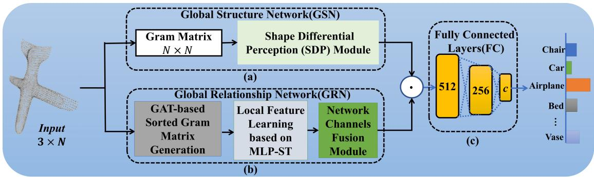
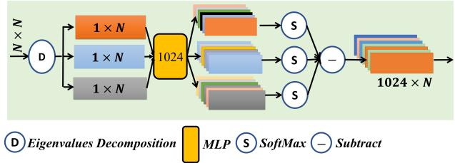
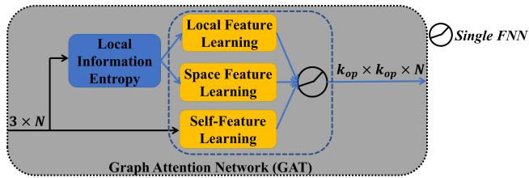
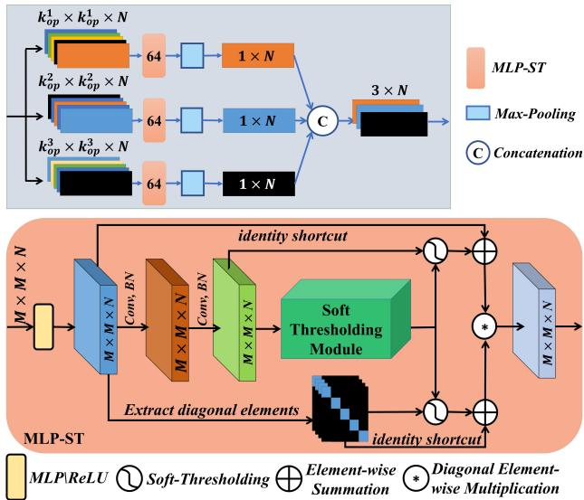
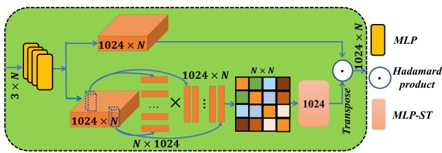
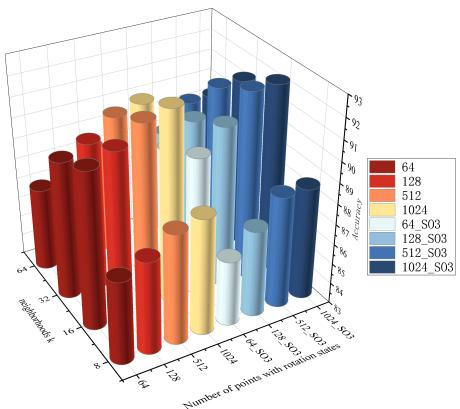
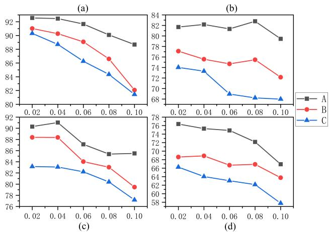
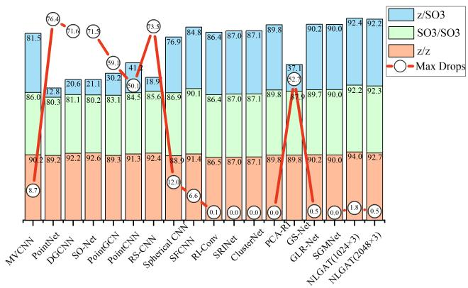
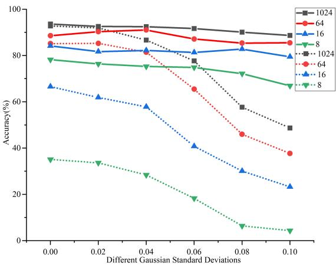

# Robust 3D Shape Classification via Non-local Graph Attention Network

Shengwei Qin1

Zhong Li2,3∗

Ligang Liu4

1School of Mechanical Engineering, Zhejiang Sci-Tech University

2School of Information Engineering, Huzhou University

3School of Science, Zhejiang Sci-Tech University

4School of Mathematical Sciences, University of Science and Technology of China

qsw.sise@gmail.com, lizhong@zjhu.edu.cn, lgliu@ustc.edu.cn

## Abstract

We introduce a non-local graph attention network (NL-GAT), which generates a novel global descriptor through two sub-networks for robust 3D shape classification. In the first sub-network, we capture the global relationships between points (i.e., point-point features) by designing a global relationship network (GRN). In the second subnetwork, we enhance the local features with a geometric shape attention map obtained from a global structure network (GSN). To keep rotation invariant and extract more information from sparse point clouds, all sub-networks use the Gram matrices with different dimensions as input for working with robust classification. Additionally, GRN effectively preserves the low-frequencyfeatures and improves the classification results. Experimental results on various datasets exhibit that the classification effect of the NLGAT model is better than other state-of-the-art models. Especially, in the case of sparse point clouds (64 points) with noise under arbitrary SO(3) rotation, the classification result (85.4%) of NLGAT is improved by 39.4% compared with the best development ofother methods.

## 1. Introduction

3D shape classification is one of the most critical tasks in 3D computer vision and computer graphics [7,10,18,37]. As 3D point cloud models are more accessible due to the rapid development of 3D scanning technology, their classifications have attracted considerable attention in the last two decades [9, 14, 39].

The essential task for shape classification is to find a global descriptor for the input point cloud. Mainstream neural networks have achieved excellent performance in point cloud classification on manually processed and aligned data [15, 20, 25, 27, 35]. However, their performance tends to drop dramatically for complex real-world point clouds, which can be rotated (arbitrary orientation), sparse (with many missing parts), and noisy. Although there are methods for one or several states of complex point clouds classification through hand-crafted features, their global descriptors depend on the designed features [12, 29, 30, 38].

The reasons why current methods do not work well for complex point clouds are two folds. First, these methods tend to adopt aggregation operations of local features, by stacking hundreds of network layers as those in images [24], to obtain the global feature. Actually, it is difficult due to the point cloud network models using the point coordinates as input, and it will lead to feature homogenization, especially for the complex point clouds. Second, most of the methods are not end-to-end and partially rely on the designed hand-crafted features, which can hardly capture the global information of the complex point clouds [2,5,31,32,36,41].

To this end, we propose an end-to-end deep learning network model built on complex point clouds, which consist of two global feature learning sub-networks for robust classification. In our model, we construct Gram matrices with different dimensions based on the input point coordinates for keeping rotation invariant, capturing crucial fea tures (including local and non-local information with similar structures) from noisy and sparse point clouds. The first sub-network based on multi-scale local Gram matrices is to extract the global relationships of point-point features in a shallow network layer through the network channel fusion operation (i.e., channel attention mechanism). The second sub-network generates an attention map for enhancing the global relationships, from the global structure of a Gram matrix constructed by a whole point cloud. Finally, three fully connected (FC) layers receive the results learned on two sub-networks to generate a global descriptor for robust classification tasks.

Contributions. Our contributions are summarized as fol-

lows.

• The global descriptor obtained by our method can well capture both the global relationship and global structure, which outperforms existing methods in the task of classification for complex point clouds.

• We design an end-to-end deep learning network model, consisting of specific function modules in two global feature learning sub-networks. Our proposed modules, based on multi-scale Gram matrices constructed by the point coordinates, can gather lots of information for sparse point clouds, preserve valuable low-frequency features for noisy point clouds, and guarantee invariance to any rotational transformations.

## 2. Related Works

Point Cloud Classification Network. Since point clouds are unordered without regular structures, it is impossible to directly transfer networks from the 2D image to the 3D point cloud [11]. Qi et al. [14] solve the problem of unordered point clouds by designing a T-Net network by directly inputting the point cloud. Velickovic et al. [20] propose a graph attention network (GAT) that computes the weighting coefficients of points and selectively focuses on the most relevant neighborhood features of point clouds. Wang et al. [25] design a EdgeConv module based on the topology of the graph to get the edge features of neighborhoods points, and these features maintain the alignment invariance. Wu et al. [26] encode the point cloud into a series of parallel sequences, and extract these features based on a shared recurrent neural network. Zhang et al. [35] develop a new convolutional method (EAGConv) by combining the advantages of feature alignment invariance in DGCNN and computational efficiency in PointNet. The above-designed networks obtain compelling features to solve the unordered problem of point clouds. However, it is difficult to obtain satisfactory classification results for point clouds with arbitrary rotation transformation and other complex states.

Rotation-Invariant Network. Aiming to address the rotation invariance challenge, some representative methods [14,25] train a spatial transformation network (STN) as well as the data augmentation for normalization, which results in the computational cost and the degradation of classification accuracy. Rao et al. [16] propose a spherical fractal convolutional neural network (SFCNN), where point clouds are projected into an icosahedral lattice. On this basis, SFCNN can learn a rotation-invariant robust feature. Gu et al. [5] encode 12 features commonly used in artificial features as rotation-invariant features of point clouds (named ERI-Net). The principal component analysis is introduced to refine the coordinates of points (PCA-RI by Xiao et al. [30]). LGR-Net is proposed by Zhao et al. [39], with the local rotationinvariant features constructed by the point-to-point coordinate difference and angle. All of the above methods have a common problem: either relying on additional information or manual design, such as normal estimation, angle differential, etc., weakens the purpose of point cloud input directly into the neural network.

Sparse-Noisy Point Cloud Learning Network. To overcome the sparse problem in point cloud classification, many methods are proposed by solving the point cloud completion (Yuan et al. [34]) or employing the non-sparse region features (Uy et al. [19]). Mao et al. [12] consider that the normal convolution template appears with no corresponding points in the point cloud convolution, and propose the strategy of interpolating the point features into the neighboring kernel weight coordinates for convolution. Chen et al. [3] propose an interpolation operation on point clouds based on the shortest path between points to achieve data enhancement. However, evaluation results show that their models are unsuitable when the points are too sparse due to low correlations between neighboring regions. In addition, none of the above works consider noisy point clouds, so there is a potential impact on performance when the point cloud is not a clean model. Xiao et al. [29] construct a hypergraph convolution with the information of distance and angle between points, which applies to both dense and sparse point clouds with noise. While this method requires incorporating more artificially designed features, such as the distance of neighboring points and local patch computation.

## 3. Our Methodology

## 3.1. Overview

Our goal is to design a robust global descriptor for the classification task of complex real-world point clouds. The designed descriptor can capture the global features from the shape (i.e., global structure) and fetch the relationship of point-point from a larger global field (i.e., global relationship). Fig. 1 shows the overall network architecture of our proposed NLGAT for the point cloud classification task. It is a non-local graph attention network on point clouds composed of two main networks: a global structure network (GSN) and a global relationship network (GRN).

In GSN, a shape differential perception (SDP) module is constructed to capture the geometry shape difference from a Gram matrix of the point cloud, which can get an attention coefficient map for consequently enhancing the global relationship feature. In GRN, due to the limited number of network layers, we design a network channel fusion module to extract the point-point relationships by mixing local features (learned from the sorted Gram matrix), i.e., global relationship feature.

  
Figure 1. Overall network architecture of NLGAT.

## 3.2. Global Structure Network (GSN)

The global structure feature can be essential indicator to reflect objects’ shape differences. Here, it is computed from the Gram matrix of a whole input point cloud in the shape differential perception (SDP) module, as shown in Fig. 1(a). Gram Matrix. Assuming that a point cloud $\boldsymbol { X } \in \mathbb { R } ^ { 3 \times N }$ (3 is the feature dimension of each point, N is the number of points) is inputted to the GSN, we construct a Gram matrix $\mathbf { \dot { \boldsymbol { G } } } ( \boldsymbol { X } ) = \boldsymbol { X } ^ { \hat { T } } \boldsymbol { X } ( \boldsymbol { G } ( \boldsymbol { X } ) \in \mathbb { R } ^ { N \times N } )$

SDP Module. As illustrated in Fig. 2, we first get a eigenvalues matrix Λ $( A \in \mathbb { R } ^ { N \times N } )$ and eigenvectors matrix Q $( Q \ \in \ \mathbb { R } ^ { N \times N } )$ through the eigenvalue decomposition of Gram matrix $G ( X )$ . In order to save time compared with the whole feature learning, and learn the category differences from the geometry structure, we then select three eigenvectors $Q _ { i } ~ ( Q _ { i } \in \mathbb { R } ^ { 1 \times N } , i = 1 , 2 , 3 )$ corresponding to the most significant three eigenvalues in matrix Λ.

Next, the high-dimensional features are generated after the eigenvectors $Q _ { i }$ are inputted into the multi-layer perception (MLP) and Softmax layer.

$$
\widehat { Q } _ { d p ^ { i } } = S o f t m a x ( f _ { \theta } ( Q _ { i } ) )\tag{1}
$$

where $\widehat { Q } _ { d p ^ { i } } \ \in \ \mathbb { R } ^ { 1 0 2 4 \times N } , i \ = \ 1 , 2 , 3 . \ f _ { \theta } \left( \cdot \right)$ refers to the feature extraction by the MLP.

Finally, in order to compute the difference between three feature vectors, which is used to generate the coefficients of category differences for subsequent weighting operations, a shape differential coefficient map $A _ { d p }$ is computed by the following equation.

$$
A _ { d p } = f _ { \theta } ( | \widehat { Q } _ { d p ^ { 1 } } - \widehat { Q } _ { d p ^ { 2 } } | \ominus | \widehat { Q } _ { d p ^ { 2 } } - \widehat { Q } _ { d p ^ { 3 } } | \ominus | \widehat { Q } _ { d p ^ { 3 } } - \widehat { Q } _ { d p ^ { 1 } } | )\tag{2}
$$

where $A _ { d p } \in \mathbb { R } ^ { 1 0 2 4 \times N }$ (1024 is the number of channels), $f _ { \theta } \left( \cdot \right)$ represents the MLP, and 	 denotes the subtraction operation.

## 3.3. Global Relationship Network (GRN)

We propose a GRN for extracting point-point global relationships from the local features, as shown in Fig. 1(b).

  
Figure 2. Shape Differential Perception (SDP) Module (Fig. 1(a), right).

Here the relationship means the point-wise relation (i.e., local features), and the global relationship is an attention mechanism that can fuse the local features on different channels in a shallow network layer.

## 3.3.1 GAT-based Sorted Gram Matrix Generation

The local feature learning of a point cloud is realized by constructing multi-scale sorted Gram matrices consisting of neighbor points and similar points. To remain rotationinvariant for arbitrarily rotated point clouds, our constructed Gram matrix [13] is convenient without requiring the computation of the covariance matrix and redefinition of the point coordinates in the PCA-RI method [30]. Moreover, compared with the SGMNet proposed by Xu et al. [31], our Gram matrix has more dimensions since it is based on coordinates of neighboring and similar points, allowing us to retain more point relationships, especially for sparse point clouds. Meanwhile, for noisy point clouds, the construction of the Gram matrix will bring noise propagation, and we address the problem in the following section.

We assume a point cloud model with N points labeled as $X = \{ x _ { 1 } , x _ { 2 } , \ldots , x _ { N } \} \in \mathbb { R } ^ { 3 \times N }$ . The local information entropy [22] are used to construct the multi-scale sorted Gram matrices for giving a sufficient dimensional size of Gram matrices, and the graph attention network (GAT [20]) for guaranteeing the arrangement of points is ordered, as shown

  
Figure 3. A diagram of GAT-based Sorted Gram Matrix Generation (Fig. 1(b), left).

Local Gram Matrix. We find k points $x _ { i j } \ ( 1 \leq j \leq k )$ within the first-order neighborhood $N _ { i }$ of the point $x _ { i }$ based on the KNN algorithm, and then construct a Gram matrix $G ( X _ { i s } ) ~ = ~ \bar { X } _ { i s } ^ { T } X _ { i s }$ based on point cloud coordinates as the network input, where $G ( X _ { i s } ) \in \mathbb { R } ^ { k \times k } , \ X _ { i s } \ =$ $\{ x _ { i } , x _ { i 1 } , \cdot \cdot \cdot , x _ { i k - 1 } \} \in \mathbb { R } ^ { 3 \times k }$

For a given point in the point cloud model, we can find similar points according to the local Gram matrix and following Theorem 1.

Theorem 1. For any two points $x _ { i }$ and $x _ { j }$ on the point cloud model, their neighborhood matrices are $X _ { i s } , X _ { j s } ,$ and their Gram matrices are $G ( X _ { i s } ) , G ( X _ { j s } )$ , respectively. $H G ( X _ { i s } )$ and $G ( X _ { j s } )$ is close, which ensures that the difference of their F-norms is equal to or less than a fixed value, i.e.,

$$
\Vert G \left( X _ { i s } \right) - G \left( X _ { j s } \right) \Vert _ { \mathrm { F } } \leq \frac { \sigma _ { C } ^ { 2 } ( X _ { i s } ) } { 2 }\tag{3}
$$

then there exists a rotation matrix R such that the below inequality also holds.

$$
\operatorname* { m i n } _ { R } \| X _ { i s } - R X _ { j s } \| _ { \mathrm { F } } \leq \frac { \sqrt { 2 } \sigma _ { C } ( X _ { i s } ) } { 2 }\tag{4}
$$

Namely, the minimal F-norm difference between $X _ { i s }$ and rotated $X _ { j s }$ is also equal to or less than a value related to $\sigma _ { C }$ . Here, $\sigma _ { C }$ is the minimum singular value of the matrix $X _ { i s } , \| X \| _ { \mathrm { F } } = \sqrt { \mathrm { T r } \left( X ^ { T } X \right) }$

Please refer to Appendix 1 of Supplementary Materials for the detailed proof, and its geometric interpretation of Theorem 1 is explained in Appendix 2 of Supplementary Materials.

For the points whose Gram matrices satisfy Theorem 1, we collect them and obtain $k - 1$ points $x _ { i t } \left( 1 \leq t \leq k - 1 \right)$ with similar structures to the point xi. Accordingly, we obtain a new Gram matrix $G ( X _ { i l } ) ( X _ { i l } \in \mathbb { R } ^ { 3 \times ( 2 k ) } )$ consisting of point $x _ { i } .$ , its first-order neighborhood points $x _ { i j }$ and its similar geometric structures points $x _ { i t }$ of point $x _ { i }$

Multi-Scale Gram Matrices. We find the above constructed Gram matrix depends on a parameter k, and its dimension will affect the classification performance of the sparse point cloud. Therefore, we compute the minimum neighborhood range of curved surfaces based on the local information entropy [22] to construct three multi-scale Gram matrices. The detailed steps of multi-scale Gram matrices construction are described as algorithm 1 in Appendix 3 of Supplementary Materials.

  
Figure 4. Local Feature Learning based on MLP-ST (Fig. 1(b), middle).

Multi-Scale Sorted Gram Matrices. Because the unordered point cloud arrangement keeps difficulties in local feature learning. Here, the sorted Gram matrix (SG) is constructed based on a sorting function $f _ { s o r t } ( G ( X _ { i l } ) )$ where $f _ { s o r t } ( \cdot )$ is a row sorting function $( i . e . ,$ , the points are sorted according to the attention coefficients learned by GAT (please refer to the operation in Appendix 4 of Supplementary Materials). The sorted Gram matrix $S G ( X _ { i l } )$ still satisfies with the properties of rotation invariance and permutation invariance [13, 31].

## 3.3.2 Local Feature Learning based on MLP-ST

During the local feature learning of point clouds, we consider that feature activation via the ReLU function would filter some compelling features at low frequencies and cause the problem of feature homogenization [23]. But the soft thresholding [8] can retain negative, useful low-frequency features, instead of setting the negative features to zero as ReLU does. Here, we propose a shared multi-layer perception module based on the soft thresholding learning (MLP-ST) for local feature extraction of the sorted Gram matrix $S G _ { i } ( X _ { i l } )$ , as shown in Fig. 4.

We suppose that there are N sorted Gram matrices $S G _ { i } ( \bar { X _ { i l } } ) ~ ( S G _ { i } ( X _ { i l } ) ~ \in ~ \mathbb { R } ^ { M \times M } , ~ M ~ = ~ 2 k , ~ k ~ \in ~ \mathbb { { K } } ^ { }$ $\{ k _ { o p } ^ { 1 } , k _ { o p } ^ { 2 } , k _ { o p } ^ { 3 } \}$ computed in algorithm 1, $i = 1 , 2 , . . . N )$

N sorted Gram matrices $S G _ { i } ( X _ { i l } )$ are fed into an MLP module without the ReLU function (MLP\ReLU) for extracting a local feature $\widetilde { X } ( \widetilde { X } \in \mathbb { R } ^ { M \times M \times N } )$ . Subsequently, a feature map $\smash { \widetilde { X } ^ { * } ( \widetilde { X } ^ { * } \in \mathbf { \mathbb { R } } ^ { M \times M \times N } ) }$ is obtained through the local feature $\widetilde { X }$ after two convolutions and batch normalization (BN) layers. The feature $\widetilde { X } ^ { * }$ is used to generate a series of threshold values by the soft thresholding module [40].

Soft Thresholding Module. The feature map $\widetilde { X } ^ { * }$ is compressed into a one-dimensional vector $\widetilde { X } _ { g a p } ^ { \ast } ~ ( \widetilde { X } _ { g a p } ^ { \ast } ~ \in$ $\mathbb { R } ^ { 1 \times 1 \times N } )$ by the absolute value operation and global average pooling. And the threshold value is computed as follows.

$$
\tau _ { k } = \alpha _ { k } \cdot a v e r a g e \left| \widetilde { x } _ { i , j , k } ^ { * } \right|\tag{5}
$$

where $\tau _ { k }$ is the threshold of the kth channel of the feature map, $\alpha _ { k }$ denotes the kth scaling factor learned after by $\widetilde { X } _ { g a p } ^ { * }$ input into two FC layers, and $\widetilde { x } _ { i , j , k } ^ { * } \in \widetilde { X } _ { \mathrm { g a p } } ^ { * }$ , where $i , j ,$ k are the width, height, and channel indexes of the feature map ${ \widetilde { X } } ^ { * }$

Local Feature Activation. The local features $\widetilde { X }$ are activated by the thresholds and an identity shortcut.

$$
\widetilde { X } ^ { ' } = s i g n ( \widetilde { x } _ { l } ^ { * } ) \left( | \widetilde { x } _ { l } ^ { * } | - \tau _ { k } \right) _ { + } \oplus \widetilde { X }\tag{6}
$$

where $\widetilde { x } _ { l } ^ { * } \ \in \ \widetilde { X } ^ { * }$ and $s i g n ( \cdot )$ is a sign function. When $( | \widetilde { x } | - \tau _ { k } ) > 0 , ( | \widetilde { x } | - \tau _ { k } ) _ { + }$ reduces to $| \widetilde { x } | - \tau _ { k }$ , otherwise, it equals to 0. ⊕ represents the element-wise summation. Local Feature Enhancement. The noise may propagate to other non-noise points during the Gram matrix construction. We first extract the original data $( i . e .$ , diagonal data) $\widetilde { X } _ { d i a g }$ $( \widetilde { X } _ { d i a g } \in \mathbb { R } ^ { M \times M \times N } )$ from the local feature $\widetilde { X }$ . Then, the diagonal data $\widetilde { X } _ { d i a g }$ is updated by the thresholds computed by Eq. (5) and an identity shortcut.

$$
\widetilde { X } _ { d i a g } ^ { ' } = s i g n \left( \widetilde { x } _ { d } \right) \left( \left| \widetilde { x } _ { d } \right| - \tau _ { k } \right) _ { + } \oplus \widetilde { X } _ { d i a g }\tag{7}
$$

where $\widetilde { x } _ { d } \in \widetilde { X } _ { d i a g }$ and the definitions of other symbols are represented in Eq. (6).

Finally, the local feature representation is enhanced based on the following Equation.

$$
\widehat { X } = \widetilde { X } _ { d i a g } ^ { ' } \circledast \widetilde { X } ^ { ' }\tag{8}
$$

where $\widehat { X } \ \in \ \mathbb { R } ^ { M \times M \times N }$ , and \~ represents the diagonal element-wise multiplication.

Max Pooling and Concatenation. The three local features $\widehat { X } _ { j } \ ( \widehat { X } _ { j } \in \mathbb { R } ^ { 6 4 \times N } , j \ = \ 1 , 2 , 3 )$ are learned by the sorted Gram matrices $S G _ { i } ( X _ { i l } )$ . And a $3 \times N$ matrix $\widehat { X } _ { l o c a l }$ is concatenated by three local features $\widehat { X } _ { j }$ after a max pooling operation.

  
Figure 5. Network Channels Fusion Module (Fig. 1(b), right).

## 3.3.3 Network Channel Fusion Module

Considering the limitation of shallow network layers when capturing the global relationships between points, we propose a network channel fusion module in the local features learning, as shown in Fig. 5.

First, a feature representation in the last network layer is denoted as $\widehat { X } ^ { \prime } ( \widehat { X } ^ { \prime } \ \in \ \mathbb { R } ^ { 1 0 2 4 \times N } )$ . It is obtained from local feature $\widehat { X } _ { l o c a l }$ after a series of MLPs.

Next, we generate an attention coefficient map $A _ { c f }$ $( A _ { c f } { \in } \mathbb { R } ^ { 1 0 2 4 \times \mathbf { \breve { N } } } )$ based on a Gram matrix between points from any positions on different channels.

$$
A _ { c f } = f _ { \theta } \left( G ( \widehat { X } ^ { ' } ) \right)\tag{9}
$$

where $f _ { \theta }$ is a multilayer perceptron, θ is a shared parameter and $\bar { G } ( \bar { \widehat { X } } ^ { \prime } ) = \widehat { X } ^ { ' \mathbf { T } } \bar { \widehat { X } } ^ { \prime } ( \bar { G } ( \widehat { X } ^ { ' } ) ^ { \widehat { \mathbf { \xi } } } \in \mathbb { R } ^ { N \times N } )$

Last, the channel attention features $\widehat { X } _ { g } ^ { ' }$ are obtained by an element-wise product operation of the attention coefficient map and the input feature.

$$
\widehat { X } _ { g } ^ { ' } = A _ { c f } \cdot \widehat { X } ^ { ' } \Leftrightarrow \widehat { x } _ { g _ { k i } } ^ { ' } = a _ { k i } \cdot x _ { k i } ^ { ' } , k \in K , i \in N .\tag{10}
$$

where $a _ { k i } \in A _ { c f }$ denotes the degree to which $x _ { k i } ^ { ' } \in \widehat { X } ^ { ' }$ is activated, $K$ is the number of channels, and N is the number of point clouds.

## 3.4. Global descriptor

Through GRN, we capture global relationships among points. However, due to the shallow layers of the network, the drawback of without considering the global perception field $( e . g .$ , whole point cloud) still exists. Here, we further weigh them $\sum _ { g } ^ { }$ by the shape differential coefficient map $A _ { d p }$ computed in the GSN (Eq. (2)) to generate a global descriptor $X _ { g } ( X _ { g } \in \mathbb { R } ^ { 1 \times c }$ , where c is the number of categories).

$$
X _ { g } = F C ( A _ { d p } \circ \widehat { X } _ { g } ^ { ' } )\tag{11}
$$

where FC represents three MLPs and a max pooling operation, the symbol $\because _ { \mathsf { O } } \mathsf { , , }$ is the Hadamard product, which is an element-wise multiplication.

In short, when the current network layers cannot be stacked up to tens or hundreds, the above two sub-networks

  
Figure 6. Classification results (cylinders) for different points with no-rotation or rotation cases under various neighborhoods k. Where the prefix is the number of points, and the suffix SO(3) denotes the point clouds with SO(3) rotation.

on point clouds guarantee that they capture the global relationships by fusing local features and enhance the geometric representation from the global perceptual field.

## 4. Experimental Results and Analysis

## 4.1. Datasets and Experimental settings

The experiments are implemented using the CAD dataset ModelNet40 [28] and the real scene dataset ScanObjectNN [19] (objects may exist inconsistencies with rotation transformations, noise, and sparsity). Note that there is a one-tomany mapping relationship between the ModelNet40 and ScanObjectNN datasets, e.g., the chair subset of ScanObjectNN corresponds to the bench, chair and stool subsets of ModelNet40. And the main experimental settings and convolution kernels in NLGAT are set as shown in Appendix 5 of Supplementary Materials.

## 4.2. Ablation Studies

The following ablation experiments are validated on the ModelNet40 dataset and its variants.

Analysis of the Size of the Neighboring Range. Fig. 6 shows that the parameter k affects the classification performance. Regardless of the number of points, the classification keeps satisfactory results when k is set as 16, and the second-best parameter is set as 32. With these two parameters, only models with 64 points have the 1% drop in the classification results when SO(3) rotation occurs, and the drops of the classification results in other cases are negligible. We conclude that, in general, reliable classification results can be maintained when the number of local neighborhood points is between 16 and 32.

Analysis of Point Clouds with Arbitrary Orientations. The experimental results are shown in Tab. 1, where method A is the result of NLGAT, method B is the result of removing the GRN from NLGAT (input the point cloud into the MLPs), and method C is the result of removing the GRN and GSN. When the point cloud is not encoded by the multiscale Gram matrices, the classification accuracy decreases in varying degrees according to the rotation (with a maximum drop of 3.2%). In the last row of Tab. 1, the classification results are worse when the GSN is additionally removed (with a maximum drop of 4.9%). In conclusion, the GRN effectively classifies point clouds with arbitrary orientations. The GSN improves the overall classification results more significantly.

<table><tr><td>Modules</td><td>z/z</td><td>SO3/SO3</td><td>z/SO3</td></tr><tr><td>A B</td><td>94.0</td><td>92.2</td><td>92.4</td></tr><tr><td>C</td><td>91.3 89.8</td><td>89.7 88.6</td><td>89.2 87.5</td></tr><tr><td>Accuracy drops(A-B)</td><td>2.7</td><td>2.5</td><td>3.2</td></tr><tr><td></td><td>4.2</td><td></td><td></td></tr><tr><td>Accuracy drops(A-C)</td><td></td><td>3.6</td><td>4.9</td></tr></table>

Table 1. Point cloud classification results (accuracy (%)) based on arbitrary orientations with different modules (There are three cases: (1) training and test datasets are rotated by the z-axis (z/z); (2) training and test datasets are arbitrarily rotated according to a SO(3) matrix (SO3/SO3); (3) it combines with the above two cases (z/SO3) [2]).

  
Figure 7. Classification results of different modules under point clouds with noise. (a) The dense model with 1024 points. (b − c) The sparse model with 64, 16, and 8 points. Where the x-axis of each figure represents the standard deviations of Gauss noise varied with a growth step of 0.02 and the y-axis of each figure indicates the classification accuracy.

Analysis of Sparse and Noisy Point Clouds. We perform the noise injection experiment under the ModelNet40 dataset, where the training set is not added with any noise, and the point clouds of the test set are injected with Gaussian noise (details are shown in Appendix 6 of Supplementary Materials). Fig. 7 gives the experiment results, where notations A, B, and C are the same as in Tab. 1. Compared with method B, the classification results of method A are improved by 6.49% on 16 points and 3.28% on 1024 points, indicating that the module MLP-ST in GRN is adequate for classifying noisy point clouds. Compared with method C, the results of method A are improved by 10.48% on 8 points and 6.67% on 64 points. The effects of method B are also enhanced by 4.50% relative to method C at 16 points, indicating that the GSN is significantly helpful for the classification of sparse point clouds with noise.

  
Figure 8. Comparison of classification performance (accuracy (%)) on ModelNet40 under different rotation transformations. The black points in the line figure are the results of max drops, indicating the difference between the highest and lowest classification results in the same method.

Analysis of Model and Time Complexity. We compare the parameter size and inference times of various network models, with a list of network design considerations. Considering the generalization ability of complex point clouds, our NLGAT is designed with many matrix calculation and feature extraction modules, resulting in more network parameters and a longer reasoning time. Please refer to Table 2 in Appendix 7 of Supplementary Materials for the detailed results.

## 4.3. Classification on CAD Data - ModelNet40

Classification Results under Rotation Transformation. Fig. 8 gives the performance of NLGAT and other state-ofart methods [2, 4, 9–11, 14, 16–18, 25, 30–32, 36, 38, 39] on the classification results with arbitrary orientations of point clouds. It can be seen that NLGAT outperforms the GLR-Net method (90.2% [39]) with a 2% improvement in terms of classification accuracy in the third case (z/SO3). Furthermore, the proposed NLGAT is more stable (smaller max drops) than other methods in the classification task under different rotation variations.

Classification Results for Sparse Point Clouds. Tab. 2 presents the results of sparse point clouds and dense point cloud performance in classification. We find NLGAT still has more than 90% accuracy at 128 points. The classification accuracy is only 1.3% of drops when the number of points changes. In the case of sparse point clouds, the accuracy is close to 90% at 64 points. Overall, the variation of classification accuracy is only 15%, which is much lower than other methods, showing a more stable classification performance. As a result, the method in this study is relatively robust for sparse point clouds.

  
Figure 9. Classification results under point clouds with Gaussian noise on different standard deviations (x-axis), where the solid lines are the results of the proposed NLGAT, and the dotted lines are the results of the Triangle-Net.

Classification Results for Point Clouds with Noise. The classification results of most methods [6, 21, 33] are below 80% (please refer to Appendix 8 (Fig. 4) of Supplementary Materials for the detailed results), while Triangle-Net [29] and our NLGAT achieve a classification performance above 90%. Accordingly, Fig. 9 gives a comparison of robustness of the two networks under different Gaussian noise parameters and different numbers of points. The classification accuracy of NLGAT is improved by 39.99% relative to Triangle-Net for a dense point cloud with the parameter σ (0.1). Particularly, NLGAT improves the classification accuracy by 62.58% relative to Triangle-Net for a sparse point cloud (8 points) with the parameter σ (0.1). As the parameters change, the NLGAT is more stable, e.g., the classification accuracy of 64 points in NLGAT fluctuates between 85% and 92%, while the results of the Triangle-Net fluctuate between 37% to 86%. In summary, NLGAT is stable in the task of classifying noisy point clouds and has a significant improvement compared with existing methods.

## 4.4. Classification on ScanObjectNN Dataset

Generalization between ScanObjectNN and Model-Net40. We give two comparisons of generalization ability of the network based on the classification accuracy: training on CAD and testing on ScanObjectNN (i.e., mode 1), training on ScanObjectNN and testing on CAD (i.e., mode 2). Details of the experiments on the two modes are shown in

<table><tr><td rowspan="2">Methods</td><td colspan="5">Dense</td><td colspan="5">Sparse</td><td rowspan="2">Max Drops in All</td></tr><tr><td>1024</td><td>512</td><td>256</td><td>128</td><td>Max Drops</td><td>64</td><td>32</td><td>16</td><td>8</td><td>Max Drops</td></tr><tr><td>PointNet[14]</td><td>73.09</td><td>72.67</td><td>64.48</td><td>39.93</td><td>33.16</td><td>21.08</td><td>9.79</td><td>2.65</td><td>2.07</td><td>19.01</td><td>71.02</td></tr><tr><td>PointNet2[14]</td><td>79.08</td><td>75.14</td><td>72.01</td><td>72.64</td><td>7.07</td><td>56.79</td><td>48.34</td><td>35.28</td><td>23.91</td><td>32.88</td><td>55.17</td></tr><tr><td>PointNet++ [15]</td><td>84.76</td><td>83.87</td><td>83.31</td><td>78.60</td><td>6.16</td><td>1</td><td>1</td><td>1</td><td>1</td><td>1</td><td>1</td></tr><tr><td>3DmFV [1]</td><td>86.63</td><td>85.69</td><td>84.70</td><td>82.32</td><td>4.31</td><td>76.56</td><td>63.45</td><td>42.36</td><td>23.68</td><td>52.88</td><td>62.95</td></tr><tr><td>RI-Conv [38]</td><td>86.50</td><td>84.40</td><td>80.80</td><td>76.00</td><td>10.50</td><td>1</td><td>1</td><td>1</td><td>1</td><td>1</td><td>1</td></tr><tr><td rowspan="2">Triangle-Net [29] NLGAT</td><td>86.66</td><td>85.73</td><td>85.32</td><td>83.41</td><td>3.25</td><td>81.53</td><td>79.28</td><td>70.35</td><td>48.19</td><td>33.34</td><td>38.47</td></tr><tr><td>92.20 (5.54 ↑)</td><td>92.20 (6.47 ↑)</td><td>91.58 (6.26 ↑)</td><td>90.90 (7.49 ↑)</td><td>1.30</td><td>89.78 (8.25 ↑)</td><td>87.70 (8.42 ↑)</td><td>84.10 (13.75 ↑)</td><td>77.20 (20.01 ↑)</td><td>12.58</td><td>15.00</td></tr></table>

PointNet1 is trained with random input dropout. PointNet2 is trained and tested using the same number of points.

Table 2. Classification accuracy of dense and sparse point clouds under arbitrary SO(3) rotation (unit: %).
<table><tr><td rowspan="2">Num of Points</td><td colspan="3">w/o SO(3)</td><td colspan="2">SO(3)</td></tr><tr><td>32</td><td>256</td><td>2048</td><td>32 256</td><td>2048</td></tr><tr><td>PointNet [14]</td><td>69.91</td><td>73.73</td><td>74.40</td><td>54.85 64.92</td><td>67.38</td></tr><tr><td>DGCNN [25]</td><td>70.70</td><td>78.70</td><td>81.50</td><td>55.40 69.60</td><td>71.58</td></tr><tr><td>Triangle-Net [29]</td><td>70.16</td><td>71.82</td><td>73.77</td><td>70.16 71.82</td><td>73.77</td></tr><tr><td>NLGAT</td><td>77.56 (6.86 ↑)</td><td>83.21 (4.51 ↑)</td><td>83.62 (2.12 ↑)</td><td>76.84 81.25 (6.68 ↑) (9.43 ↑)</td><td>83.30 (9.53 ↑)</td></tr></table>

Table 3. Classification accuracy comparison (unit: %) of point clouds with different densities in dataset PB T50 RS.

Appendix 9 of Supplementary Materials. We find the data mapping relationship between the training dataset and the test dataset significantly impacts the network training and the classification performance will be enhanced when there is a more relevant mapping relationship between the data in the training and test datasets, e.g., compared with the results (47.0%) of mode 1, the classification results (73.9%) of NLGAT are improved by 26.9% in mode 2. Therefore, we train and test the real-world dataset ScanObjectNN to validate the network classification ability of NLGAT.

Comparison on a Severe Condition. Tab. 3 shows the classification ability of the network models under more severe conditions by applying rotational and sparse operations to the point clouds in the complex (unorderedness, rotation, scale, translation, sparsity (including partial missing), noise) dataset PB T50 RS. It can be seen that our NL-GAT shows advantages in all point densities. Especially, when SO(3) rotation is applied to point clouds, NLGAT improves by 9.53% compared with the second-best classification result (Triangle-Net, 71.92%) at 2048 points, improves by 6.69% compared with the result of Triangle-Net at 32 points, and improves by 21.99% compared with the result of PointNet at 32 points. When SO(3) rotation is not applied to the dataset PB T50 RS (w/o SO(3)), NLGAT has a 6.86% improvement compared with the second-best result (DGCNN) on the sparse point clouds (32 points). It also has a better performance on the dense point clouds (256 points), which has an improvement of 4.51% compared to DGCNN. The other comparisons of subsets of ScanObjectNN are described in Appendix 10 of Supplementary Materials.

## 5. Conclusion

This paper proposes a non-local graph attention network (NLGAT) for robust 3D shape classification. NLGAT takes multi-scale Gram matrices as input and captures their global relationship by a network channel fusion module. Furthermore, the global relationship features are enhanced by a shape differential coefficient map computed by a global structure network. The above operation generates a robust global descriptor for classification. Our experiments verify that it maintains a good generalization ability for the complex real-world point clouds, and can obtain better classification results than other state-of-art methods.

Limitation and future work. We require encoding multiscale Gram matrices, which leads to many computations. In addition, several feature extraction modules are combined for the network design due to considering different point cloud states, resulting in many network parameters. To address these challenges, we will attempt to prune the training network parameters to speed up the training and testing process. Moreover, it can be seen from the experiment of the model generalization ability that NLGAT is also sensitive to the data mapping relationship between training and test datasets. To solve the problem, we can perform targeted data augmentation based on real-world datasets, or give more training weights to loss function for complex classification categories, which will be our future work.

Acknowledgements. This work was funded by the National Nature Science Foundation of China (No.12171434, 62025207).

## References

[1] Yizhak Ben-Shabat, Michael Lindenbaum, and Anath Fischer. 3dmfv: Three-dimensional point cloud classification in real-time using convolutional neural networks. IEEE Robotics and Automation Letters, 3(4):3145–3152, 2018. 8

[2] Chao Chen, Guanbin Li, Ruijia Xu, Tianshui Chen, Meng Wang, and Liang Lin. Clusternet: Deep hierarchical cluster network with rigorously rotation-invariant representation for point cloud analysis. In Proceedings ofthe IEEE/CVF Conference on Computer Vision and Pattern Recognition, pages 4994–5002, 2019. 1, 6, 7

[3] Yunlu Chen, Vincent Tao Hu, Efstratios Gavves, Thomas Mensink, Pascal Mettes, Pengwan Yang, and Cees GM Snoek. Pointmixup: Augmentation for point clouds. In Proceedings of the European Conference on Computer Vision, pages 330–345, 2020. 2

[4] Carlos Esteves, Christine Allen-Blanchette, Ameesh Makadia, and Kostas Daniilidis. Learning so (3) equivariant representations with spherical cnns. In Proceedings of the European Conference on Computer Vision, pages 52–68, 2018. 7

[5] Ruibin Gu, Qiuxia Wu, Wing WY Ng, Hongbin Xu, and Zhiyong Wang. Erinet: Enhanced rotation-invariant network for point cloud classification. Pattern Recognition Letters, 151:180–186, 2021. 1, 2

[6] Meng-Hao Guo, Jun-Xiong Cai, Zheng-Ning Liu, Tai-Jiang Mu, Ralph R Martin, and Shi-Min Hu. Pct: Point cloud transformer. Computational Visual Media, 7(2):187–199, 2021. 7

[7] Yulan Guo, Hanyun Wang, Qingyong Hu, Hao Liu, Li Liu, and Mohammed Bennamoun. Deep learning for 3d point clouds: A survey. IEEE Transactions on Pattern Analysis and Machine Intelligence, 43(12):4338–4364, 2020. 1

[8] Kenzo Isogawa, Takashi Ida, Taichiro Shiodera, and Tomoyuki Takeguchi. Deep shrinkage convolutional neural network for adaptive noise reduction. IEEE Signal Processing Letters, 25(2):224–228, 2017. 4

[9] Jiaxin Li, Ben M Chen, and Gim Hee Lee. So-net: Selforganizing network for point cloud analysis. In Proceedings of the IEEE/CVF Conference on Computer Vision and Pattern Recognition, pages 9397–9406, 2018. 1, 7

[10] Yangyan Li, Rui Bu, Mingchao Sun, Wei Wu, Xinhan Di, and Baoquan Chen. Pointcnn: Convolution on x-transformed points. In Advances in Neural Information Processing Systems, pages 1–11, 2018. 1, 7

[11] Yongcheng Liu, Bin Fan, Shiming Xiang, and Chunhong Pan. Relation-shape convolutional neural network for point cloud analysis. In Proceedings of the IEEE/CVF Conference on Computer Vision and Pattern Recognition, pages 8895– 8904, 2019. 2, 7

[12] Jiageng Mao, Xiaogang Wang, and Hongsheng Li. Interpolated convolutional networks for 3d point cloud understanding. In Proceedings of the IEEE/CVF International Conference on Computer Vision, pages 1578–1587, 2019. 1, 2

[13] Thomas Pumir, Amit Singer, and Nicolas Boumal. The generalized orthogonal procrustes problem in the high noise

regime. Information and Inference: A Journal of the IMA, 10(3):921–954, 2021. 3, 4

[14] Charles R Qi, Hao Su, Kaichun Mo, and Leonidas J Guibas. Pointnet: Deep learning on point sets for 3d classification and segmentation. In Proceedings of the IEEE/CVF Conference on Computer Vision and Pattern Recognition, pages 652–660, 2017. 1, 2, 7, 8

[15] Charles Ruizhongtai Qi, Li Yi, Hao Su, and Leonidas J Guibas. Pointnet++: Deep hierarchical feature learning on point sets in a metric space. 30:5099–5108, 2017. 1, 8

[16] Yongming Rao, Jiwen Lu, and Jie Zhou. Spherical fractal convolutional neural networks for point cloud recognition. In Proceedings of the IEEE/CVF Conference on Computer Vision and Pattern Recognition, pages 452–460, 2019. 2, 7

[17] Hang Su, Subhransu Maji, Evangelos Kalogerakis, and Erik Learned-Miller. Multi-view convolutional neural networks for 3d shape recognition. pages 945–953, 2015. 7

[18] Xiao Sun, Zhouhui Lian, and Jianguo Xiao. Srinet: Learning strictly rotation-invariant representations for point cloud classification and segmentation. In Proceedings of the 27th ACM International Conference on Multimedia, pages 980– 988, 2019. 1, 7

[19] Mikaela Angelina Uy, Quang-Hieu Pham, Binh-Son Hua, Thanh Nguyen, and Sai-Kit Yeung. Revisiting point cloud classification: A new benchmark dataset and classification model on real-world data. In Proceedings of the IEEE/CVF International Conference on Computer Vision, pages 1588– 1597, 2019. 2, 6

[20] Petar Velickoviˇ c, Guillem Cucurull, Arantxa Casanova,´ Adriana Romero, Pietro Lio, and Yoshua Bengio. Graph at-\` tention networks. In International Conference on Learning Representations, pages 1–12, 2018. 1, 2, 3

[21] Hanchen Wang, Qi Liu, Xiangyu Yue, Joan Lasenby, and Matt J Kusner. Unsupervised point cloud pre-training via occlusion completion. In Proceedings of the IEEE/CVF International Conference on Computer Vision, pages 9782–9792, 2021. 7

[22] Shuaiqing Wang, Qijun Hu, Dongsheng Xiao, Leping He, Rengang Liu, Bo Xiang, and Qinghui Kong. A new point cloud simplification method with feature and integrity preservation by partition strategy. Measurement, pages 1–17, 2022. 3, 4

[23] Weiming Wang, Yang You, Wenhai Liu, and Cewu Lu. Point cloud classification with deep normalized reeb graph convolution. Image and Vision Computing, 106:1–10, 2021. 4

[24] Xiaolong Wang, Ross Girshick, Abhinav Gupta, and Kaiming He. Non-local neural networks. In Proceedings of the IEEE/CVF Conference on Computer Vision and Pattern Recognition, pages 7794–7803, 2018. 1

[25] Yue Wang, Yongbin Sun, Ziwei Liu, Sanjay E Sarma, Michael M Bronstein, and Justin M Solomon. Dynamic graph cnn for learning on point clouds. ACM Transactions On Graphics(TOG), 38(5):1–12, 2019. 1, 2, 7, 8

[26] Pengxiang Wu, Chao Chen, Jingru Yi, and Dimitris Metaxas. Point cloud processing via recurrent set encoding. In Proceedings of the AAAI Conference on Artificial Intelligence, volume 33, pages 5441–5449, 2019. 2

[27] Zonghan Wu, Shirui Pan, Fengwen Chen, Guodong Long, Chengqi Zhang, and S Yu Philip. A comprehensive survey on graph neural networks. IEEE Transactions on Neural Networks and Learning Systems, 32(1):4–24, 2020. 1

[28] Zhirong Wu, Shuran Song, Aditya Khosla, Fisher Yu, Linguang Zhang, Xiaoou Tang, and Jianxiong Xiao. 3d shapenets: A deep representation for volumetric shapes. In Proceedings ofthe IEEE conference on computer vision and pattern recognition, pages 1912–1920, 2015. 6

[29] Chenxi Xiao and Juan Wachs. Triangle-net: Towards robustness in point cloud learning. In Proceedings of the IEEE/CVF Winter Conference on Applications of Computer Vision, pages 826–835, 2021. 1, 2, 7, 8

[30] Zelin Xiao, Hongxin Lin, Renjie Li, Lishuai Geng, Hongyang Chao, and Shengyong Ding. Endowing deep 3d models with rotation invariance based on principal component analysis. In IEEE International Conference on Multimedia and Expo, pages 1–6, 2020. 1, 2, 3, 7

[31] Jianyun Xu, Xin Tang, Yushi Zhu, Jie Sun, and Shiliang Pu. Sgmnet: Learning rotation-invariant point cloud representations via sorted gram matrix. In Proceedings of the IEEE/CVF International Conference on Computer Vision, pages 10468–10477, 2021. 1, 3, 4, 7

[32] Mingye Xu, Zhipeng Zhou, and Yu Qiao. Geometry sharing network for 3d point cloud classification and segmentation. In Proceedings of the AAAI Conference on Artificial Intelligence, volume 34, pages 12500–12507, 2020. 1, 7

[33] Xumin Yu, Lulu Tang, Yongming Rao, Tiejun Huang, Jie Zhou, and Jiwen Lu. Point-bert: Pre-training 3d point cloud transformers with masked point modeling. In Proceedings of the IEEE/CVF Conference on Computer Vision and Pattern Recognition, pages 19313–19322, 2022. 7

[34] Wentao Yuan, Tejas Khot, David Held, Christoph Mertz, and Martial Hebert. Pcn: Point completion network. In 2018 International Conference on 3D Vision (3DV), pages 728– 737. IEEE, 2018. 2

[35] Cheng Zhang, Hao Chen, Haocheng Wan, Ping Yang, and Zizhao Wu. Graph-pbn: Graph-based parallel branch network for efficient point cloud learning. Graphical Models, 119:1–9, 2022. 1, 2

[36] Yingxue Zhang and Michael Rabbat. A graph-cnn for 3d point cloud classification. In IEEE International Conference on Acoustics, Speech and Signal Processing, pages 6279– 6283, 2018. 1, 7

[37] Ziwei Zhang, Peng Cui, and Wenwu Zhu. Deep learning on graphs: a survey. IEEE Transactions on Knowledge and Data Engineering, 34(1):249–270, 2022. 1

[38] Zhiyuan Zhang, Binh-Son Hua, David W Rosen, and Sai-Kit Yeung. Rotation invariant convolutions for 3d point clouds deep learning. In International Conference on 3D Vision, pages 204–213, 2019. 1, 7, 8

[39] Chen Zhao, Jiaqi Yang, Xin Xiong, Angfan Zhu, Zhiguo Cao, and Xin Li. Rotation invariant point cloud analysis: where local geometry meets global topology. Pattern Recognition, 127:1–11, 2022. 1, 2, 7

[40] Minghang Zhao, Shisheng Zhong, Xuyun Fu, Baoping Tang, and Michael Pecht. Deep residual shrinkage networks for

fault diagnosis. IEEE Transactions on Industrial Informatics, 16(7):4681–4690, 2019. 5

[41] Yongheng Zhao, Tolga Birdal, Haowen Deng, and Federico Tombari. 3d point capsule networks. In Proceedings of the IEEE/CVF Conference on Computer Vision and Pattern Recognition, pages 1009–1018, 2019. 1