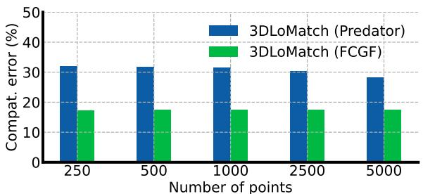
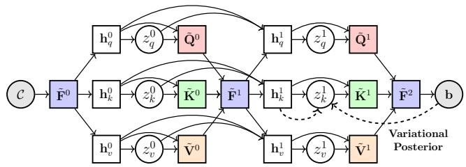
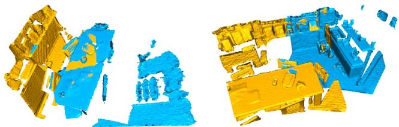
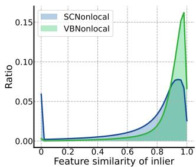
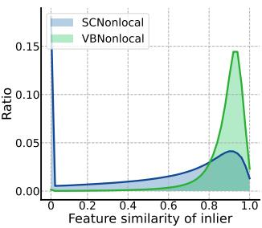
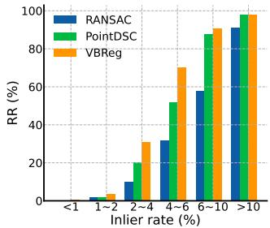
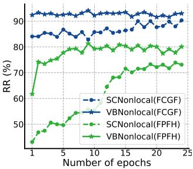

This CVPR paper is the Open Access version, provided by the Computer Vision Foundation. Except for this watermark, it is identical to the accepted version; the final published version of the proceedings is available on IEEE Xplore.

# Robust Outlier Rejection for 3D Registration with Variational Bayes

Haobo Jiang1, Zheng Dang2, Zhen Wei2, Jin Xie∗1, Jian Yang∗1, and Mathieu Salzmann∗2

1PCA Lab, Nanjing University of Science and Technology, China 2CVLab, EPFL, Switzerland

{jiang.hao.bo, csjxie, csjyang}@njust.edu.cn {zheng.dang, zhen.wei, mathieu.salzmann}@epfl.ch

## Abstract

Learning-based outlier (mismatched correspondence) rejection for robust 3D registration generally formulates the outlier removal as an inlier/outlier classification problem. The core for this to be successful is to learn the discriminative inlier/outlier feature representations. In this paper, we develop a novel variational non-local networkbased outlier rejection frameworkfor robust alignment. By reformulating the non-local feature learning with variational Bayesian inference, the Bayesian-driven long-range dependencies can be modeled to aggregate discriminative geometric context information for inlier/outlier distinction. Specifically, to achieve such Bayesian-driven contextual dependencies, each query/key/value component in our nonlocal network predicts a prior feature distribution and a posterior one. Embedded with the inlier/outlier label, the posterior feature distribution is label-dependent and discriminative. Thus, pushing the prior to be close to the discriminative posterior in the training step enables the features sampled from this prior at test time to model highquality long-range dependencies. Notably, to achieve effective posterior feature guidance, a specific probabilistic graphical model is designed over our non-local model, which lets us derive a variational low bound as our optimization objective for model training. Finally, we propose a voting-based inlier searching strategy to cluster the high-quality hypothetical inliersfor transformation estimation. Extensive experiments on 3DMatch, 3DLoMatch, and KITTI datasets verify the effectiveness ofour method. Code is available at https://github.com/Jiang-HB/VBReg.

## 1. Introduction

Point cloud registration is a fundamental but challenging 3D computer vision task, with many potential applications such as 3D scene reconstruction [1,39], object pose estimation [13, 44], and Lidar SLAM [15, 51]. It aims to align two partially overlapping point clouds by estimating their relative rigid transformation, i.e., 3D rotation and 3D translation. A popular approach to address the large-scale scene registration problem consists of extracting point descriptors [11,14,17,37,38,50] and establishing correspondences between the two point clouds, from which the transformation can be obtained geometrically. In this context, much effort has been dedicated to designing traditional and deep learning-based descriptors [3, 11, 21, 41, 50]. However, the resulting correspondences inevitably still suffer from outliers (wrong matchings), particularly in challenging cases, such as low-overlap, repetitive structures, or noisy point sets, leading to registration failure.

To address this, many outlier filtering strategies have been developed to robustify the registration process. These include traditional rejection methods using random sample consensus [16], point-wise descriptor similarity [7, 32] or group-wise spatial consistency [46]. Deep learning methods have also been proposed, focusing on learning correspondence features used to estimate inlier confidence values [2, 10, 33]. In particular, the current state-of-the-art method, PointDSC [2], relies on a spatial consistencydriven non-local network to capture long-range context in its learned correspondence features. While effective, PointDSC still yields limited registration robustness, particularly for scenes with a high outlier ratio, where the spatial consistency constraints may become ambiguous [36], thereby degrading the correspondence features’ quality.

In this paper, we propose to explicitly account for the ambiguities arising from high outlier ratios by developing a probabilistic feature learning framework. To this end, we introduce a variational non-local network based on an attention mechanism to learn discriminative inlier/outlier feature representations for robust outlier rejection. Specifically, to capture the ambiguous nature of long-range contextual dependencies, we inject a random feature in each query, key, and value component in our non-local network. The prior/posterior distributions of such random features are predicted by prior/posterior encoders. To encourage the resulting features to be discriminative, we make the posterior feature distribution label-dependent. During training, we then push the prior distribution close to the labeldependent posterior, thus allowing the prior encoder to also learn discriminative query, key, and value features. This enables the features sampled from this prior at test time to model high-quality long-range dependencies.

To achieve effective variational inference, we customize a probabilistic graphical model over our variational nonlocal network to characterize the conditional dependencies of the random features. This lets us derive a variational lower bound as the optimization objective for network training. Finally, we propose a voting-based deterministic inlier searching mechanism for transformation estimation, where the correspondence features learned from all non-local iterations jointly vote for high-confidence hypothetical inliers for SVD-based transformation estimation. We theoretically analyze the robustness of our deterministic inlier searching strategy compared to RANSAC, which also motivates us to design a conservative seed selection mechanism to improve robustness in sparse point clouds.

To summarize, our contributions are as follows:

• We propose a novel variational non-local network for outlier rejection, learning discriminative correspondence features with Bayesian-driven long-range contextual dependencies.

• We customize the probabilistic graphical model over our variational non-local network and derive the variational low bound for effective model optimization.

• We introduce a Wilson score-based voting mechanism to search high-quality hypothetical inliers, and theoretically demonstrate its superiority over RANSAC.

Our experimental results on extensive benchmark datasets demonstrate that our framework outperforms the state-ofthe-art registration methods.

## 2. Related Work

End-to-end Registration Methods. With the advances of deep learning in the 3D vision field [34], the learning-based end-to-end registration model has achieved increasing research attention. DCP [42] uses the feature similarity to establish pseudo correspondences for SVD-based transformation estimation. RPM-Net [47] exploits the Sinkhorn layer and annealing for discriminative matching map generation. [22, 23] integrate the cross-entropy method into the deep model for robust registration. RIENet [40] uses the structure difference between the source neighborhood and the pseudo-target one for inlier confidence evaluation. With the powerful feature representation of Transformer, RegTR [48] effectively aligns large-scale indoor scenes in an end-to-end manner. [13] propose a match-normalization layer for robust registration in the real-world 6D object pose estimation task. More end-to-end models such as [10, 18, 28–30, 33, 53] also present impressive precisions.

Learning-based Feature Descriptors. To align the complex scenes, a popular pipeline is to exploit feature descriptors for 3D matching. Compared to hand-crafted descriptors such as [17, 37, 38], the deep feature descriptor presents superior registration precision and has achieved much more attention in recent years. The pioneering 3DMatch [50] exploits the Siamese 3D CNN to learn the local geometric feature via contrastive loss. FCGF [11] exploits a fully convolutional network for dense feature extraction in a one-shot fashion. Furthermore, D3feat [3] jointly learns the dense feature descriptor and the detection score for each point. By integrating the overlap-attention module into D3feat, Predator [21] largely improves the registration reliability in lowoverlapping point clouds. YOHO [41] utilizes the group equivariant feature learning to achieve the rotation invariance and shows great robustness to the point density and the noise interference. [35] develops a geometric transformer to learn the geometric context for robust super-point matching. Lepard [31] embeds the relative 3D positional encoding into the transformer for discriminative descriptor learning.

Outlier Rejection Methods. Despite significant progress in learning-based feature descriptor, generating mismatched correspondences (outliers) in some challenging scenes remains unavoidable. Traditional outlier filtering methods, such as RANSAC [16] and its variants [4, 24, 27], use repeated sampling and verification for outlier rejection. However, these methods tend to have a high time cost, particularly in scenes with a high outlier ratio. Instead, FGR [52] and TEASER [45] integrate the robust loss function into the optimization objective to weaken the interference from outliers. Recently, Chen et al. [9] developed second-order spatial compatibility for robust consensus sampling. With the rise of deep 3D vision, most learnable outlier rejection models [10,33] formulate outlier rejection as a binary classification task and reject correspondences with low confidence. Yi et al. [49] proposed a context normalization-embedded deep network for inlier evaluation, while Brachmann et al. [6] enhanced classical RANSAC with neural-guided prior confidence. As our baseline, PointDSC [2] proposes exploiting a spatial consistency-guided non-local inlier classifier for inlier evaluation, followed by neural spectral matching for robust registration. However, under high outlier ratios, spatial consistency can be ambiguous (as shown in Fig. 1), misleading non-local feature aggregation. Instead, we propose exploiting Bayesian-driven long-range dependencies for discriminative non-local feature learning.

## 3. Approach

## 3.1. Background

Problem Setting. In the pairwise 3D registration task, given a source point cloud $\mathbf { X } = \{ \mathbf { x } _ { i } \in \mathbb { R } ^ { 3 } \mid i = 1 , . . . , | \mathbf { X } | \}$ and a target point cloud $\mathbf { Y } = \{ \bar { \mathbf { y } _ { j } } \in \mathbb { R } ^ { 3 } \mid j = 1 , . . . , | \mathbf { Y } | \}$ we aim to find their optimal rigid transformation consisting of a rotation matrix $\mathbf { R } ^ { * } \in S O ( 3 )$ and a translation vector $\mathbf { t } ^ { * } \in \mathbb { R } ^ { 3 }$ to align their overlapping region precisely. In this work, we focus on the descriptor-based pipeline for largescale scene registration. Based on the feature-level nearest neighbor, we construct a set of putative correspondences $\mathcal { C } = \left\{ \mathbf { c } _ { i } = ( \mathbf { x } _ { i } , \mathbf { y } _ { i } ) \in \mathbb { R } ^ { 6 } \ | \ i = 1 , . . . , | \mathcal { C } | \right\}$ . The inlier (correctly matched correspondence) is defined as the correspondence satisfying $\| \mathbf { R } ^ { * } \mathbf { x } _ { i } + \mathbf { t } ^ { * } - \mathbf { y } _ { i } \| < \varepsilon$ , where ε indicates the inlier threshold.

Vanilla Non-local Feature Embedding. Given the putative correspondence set , [2] leverages the spatial consistencyguided non-local network (SCNonlocal) for their feature embedding. The injected geometric compatibility matrix can effectively regularize the long-range dependencies for discriminative inlier/outlier feature learning. In detail, it contains L iterations and the feature aggregation in l-th iteration can be formulated as:

$$
\mathbf { F } _ { i } ^ { l + 1 } = \mathbf { F } _ { i } ^ { l } + \mathrm { M L P } \Big ( \sum _ { j = 1 } ^ { | \mathcal { C } | } \mathrm { s o f t m a x } _ { j } ( \alpha ^ { l } \beta ) \mathbf { V } _ { j } ^ { l } \Big ) ,\tag{1}
$$

where $\mathbf { F } _ { i } ^ { l } \in \mathbb { R } ^ { d }$ indicates the feature embedding of correspondence $\mathbf { c } _ { i }$ in l-th iteration (the initial feature $\mathbf { F } _ { i } ^ { 0 }$ is obtained via linear projection on $\mathbf { c } _ { i } )$ and $\mathbf { V } _ { i } ^ { l } = f _ { v } ^ { l } ( \mathbf { F } _ { i } ^ { l } ) \in \mathbb { R } ^ { d }$ is the projected value feature. $\pmb { \alpha } ^ { l } \in \mathbb { R } ^ { | \mathcal { C } | \times | \mathcal { C } | }$ is the non-local attention map whose entry $\alpha _ { i , j } ^ { l }$ reflects the feature similarity between the projected query feature $\mathbf { Q } _ { i } ^ { l } = f _ { { q } } ^ { l } ( \mathbf { F } _ { i } ^ { l } ) \in \mathbb { R } ^ { d }$ and the key feature $\mathbf { K } _ { i } ^ { l } = f _ { k } ^ { l } ( \mathbf { F } _ { j } ^ { l } ) \in \mathbb { R } ^ { d }$ $\beta ^ { \mathrm { ~ } } \in \mathbb { R } ^ { | \mathcal { C } | \times | \mathcal { C } | }$ represents the geometric compatibility matrix of correspondences, where the compatibility between $\mathbf { c } _ { i }$ and $\mathbf { c } _ { j }$ is:

$$
\beta _ { i , j } = \operatorname* { m a x } \Big ( 0 , 1 - \frac { d _ { i j } ^ { 2 } } { \varepsilon ^ { 2 } } \Big ) , d _ { i j } = | | | \mathbf { x } _ { i } - \mathbf { x } _ { j } | | - | | \mathbf { y } _ { i } - \mathbf { y } _ { j } | | | .\tag{2}
$$

Based on the fact that the geometric distance $d _ { i , j }$ of inliers $\mathbf { c } _ { i }$ and $\mathbf { c } _ { j }$ tend to be minor, Eq. 2 will assign a high compatibility value on the inlier pair, thereby promoting the nonlocal network to effectively cluster the inlier features for discriminative inlier/outlier feature learning.

## 3.2. Variational Non-local Feature Embedding

While effective, SCNonlocal still suffers from ambiguous long-range dependencies, especially in some challenging scenes (e.g., the low-overlapping case). Two essential reasons are: (i) Wrong geometric compatibility. As shown in Fig. 1, for 3DLoMatch dataset with Predator and FCGF descriptors, almost 30% and 17% of inlier-outlier pairs own the positive compatibility values, respectively, which potentially misleads the attention weight for wrong feature clustering. (ii) Lack of uncertainty modeling. In symmetric or repetitive scenes, the inlier/outlier prediction contains significant uncertainty. Therefore, it’s necessary to design a robust feature representation to capture such uncertainty.

  
Figure 1. The ratio of inlier-outlier pairs with positive compatibilities in 3DLoMatch [21] using FCGF and Predator descriptors.

To overcome them, we develop a variational non-local network, a probabilistic feature learning framework, for discriminative correspondence embedding. Our core idea is to inject random features into our model to capture the ambiguous nature of long-range dependencies, and then leverage the variational Bayesian inference to model the Bayesian-driven long-range dependencies for discriminative feature aggregation. Specifically, we first introduce the random feature variables $\dot { z } _ { k , i } ^ { l } , z _ { q , i } ^ { l }$ and $z _ { v , i } ^ { l }$ into the key ${ \bf K } _ { i } ^ { l } .$ , query $\mathbf { Q } _ { i } ^ { l }$ and value $\mathbf { V } _ { i } ^ { l }$ components in our non-local module to capture their potential uncertainty in the longrange dependency modeling. Then, the prior/posterior encoders are constructed to predict their prior feature distribution and the posterior one, respectively. Embedded with the inlier/outlier label, the posterior feature distribution is labeldependent and discriminative. Thus, by pushing the prior close to the discriminative posterior in the training phase, this prior at test time also tends to sample discriminative query, key, and value features for high-quality long-range dependency modeling.

Probabilistic Graphical Model over Variational Nonlocal Network. To achieve effective variational Bayesian inference, we need to first characterize the conditional dependencies of the injected random features so that the variational lower bound can be derived as the optimization objective for model training. As shown in Fig. 2, we customize the probabilistic graphical model over our non-local network to clarify the dependencies of random features (the circles). The solid line denotes the label prediction process, while the dashed line represents our label-dependent posterior encoder $( i . e .$ , inference model). Notably, the deterministic hidden query/key/value features $\mathbf { h } _ { k , i } ^ { l } \ \in \ \mathbb { R } ^ { d ^ { \prime } }$ $\mathbf { h } _ { q , i } ^ { l } \in \mathbb { R } ^ { d ^ { \prime } }$ , and $\mathbf { h } _ { v , i } ^ { l } \in \mathbb { R } ^ { d ^ { \prime } }$ are also introduced to summarize the historical information for better feature updating in each iteration.

Inlier/outlier Prediction Process. Based on the defined conditional dependencies in Fig. 2, the prediction process of correspondence labels $\textbf { b } = \ \left\{ b _ { 1 } , b _ { 2 } , . . . , b _ { | \mathcal { C } | } \ | \ b _ { i } \in \{ 0 , 1 \} \right\}$ (1 indicates inlier and 0 outlier) is formulated as follows. Beginning with the initial linear projection $\tilde { \mathbf { F } } ^ { 0 } ~ \in ~ \mathbb { R } ^ { | \mathcal { C } | \times d }$ of correspondences ${ \mathcal { C } } = \{ \mathbf { c } _ { i } \}$ , we iteratively perform the probabilistic non-local aggregation for feature updating. In the l-th iteration, we first employ a Gated Recurrent Unit (GRU) [12] to predict the hidden query/key/value features which summarize the historical query/key/value features (sampled from the prior distributions) and the correspondence features in previous iterations:

$$
\begin{array} { r } { \mathbf { h } _ { q , i } ^ { l } = \mathrm { G R U } _ { q } ( \mathbf { h } _ { q , i } ^ { l - 1 } , [ \mathbf { z } _ { q , i } ^ { l - 1 } , \tilde { \mathbf { F } } _ { i } ^ { l - 1 } ] ) , } \\ { \mathbf { h } _ { k , i } ^ { l } = \mathrm { G R U } _ { k } ( \mathbf { h } _ { k , i } ^ { l - 1 } , [ \mathbf { z } _ { k , i } ^ { l - 1 } , \tilde { \mathbf { F } } _ { i } ^ { l - 1 } ] ) , } \\ { \mathbf { h } _ { v , i } ^ { l } = \mathrm { G R U } _ { v } ( \mathbf { h } _ { v , i } ^ { l - 1 } , [ \mathbf { z } _ { v , i } ^ { l - 1 } , \tilde { \mathbf { F } } _ { i } ^ { l - 1 } ] ) , } \end{array}\tag{3}
$$

where $[ \cdot , \cdot ]$ denotes the feature concatenation and $\tilde { \mathbf { F } } _ { i } ^ { l - 1 }$ is the learned correspondence features of $\mathbf { c } _ { i }$ in iteration $l - 1$ Then, with as input the predicted hidden features, the prior encoder $p _ { \theta } ( \cdot )$ is utilized to predict the prior feature distribution for query/key/value, respectively. Furthermore, we sample features $\mathbf { z } _ { q , i } ^ { l } \in \mathbb { R } ^ { \tilde { d } } , \ \mathbf { z } _ { k , i } ^ { l } \ \in \ \mathbb { R } ^ { \tilde { d } }$ and $\mathbf { z } _ { v , i } ^ { l } \in \mathbb { R } ^ { \tilde { d } }$ from the predicted prior query/key/value distribution and combine them with the hidden features to predict the corresponding query $\tilde { \mathbf { Q } } _ { i } ^ { l } \in \mathbb { R } ^ { d }$ , key $\tilde { \mathbf { K } } _ { i } ^ { l } \in \mathbb { R } ^ { d }$ and value $\tilde { \mathbf { V } } _ { i } ^ { l } \in \mathbb { R } ^ { d }$ through a neural network $f _ { \theta } ^ { q , k , v } : \mathbb { R } ^ { d ^ { \prime } + \tilde { d } }  \mathbb { R } ^ { d }$

$$
\begin{array} { r l } & { \mathbf { z } _ { q , i } ^ { l } \sim p _ { \theta } ( z _ { q , i } ^ { l } \mid \mathbf { h } _ { q , i } ^ { l } ) , \tilde { \mathbf { Q } } _ { i } ^ { l } = f _ { \theta } ^ { q } ( \big [ \mathbf { z } _ { q , i } ^ { l } , \mathbf { h } _ { q , i } ^ { l } \big ] ) , } \\ & { \mathbf { z } _ { k , i } ^ { l } \sim p _ { \theta } ( z _ { k , i } ^ { l } \mid \mathbf { h } _ { k , i } ^ { l } ) , \tilde { \mathbf { K } } _ { i } ^ { l } = f _ { \theta } ^ { k } ( \big [ \mathbf { z } _ { k , i } ^ { l } , \mathbf { h } _ { k , i } ^ { l } \big ] ) , } \\ & { \mathbf { z } _ { v , i } ^ { l } \sim p _ { \theta } ( z _ { v , i } ^ { l } \mid \mathbf { h } _ { v , i } ^ { l } ) , \tilde { \mathbf { V } } _ { i } ^ { l } = f _ { \theta } ^ { v } ( \big [ \mathbf { z } _ { v , i } ^ { l } , \mathbf { h } _ { v , i } ^ { l } \big ] ) , } \end{array}\tag{4}
$$

where the prior feature distribution is the Gaussian distribution with the mean and the standard deviation parameterized by a neural network. Finally, with the learned $\tilde { \mathbf { Q } } _ { i } ^ { l } , \tilde { \mathbf { K } } _ { i } ^ { l }$ and $\tilde { \mathbf { V } } _ { i } ^ { l }$ , the correspondence feature $\tilde { \mathbf { F } } _ { i } ^ { l }$ in l-th iteration can be aggregated with the same non-local operation in Eq. 1. After L feature iterations, we feed the correspondence feature $\tilde { \mathbf { F } } _ { i } ^ { L }$ in the last iteration into a label prediction model yθ to predict the inlier/outlier labels $b _ { i } \ \stackrel { - } { \sim } \ y _ { \theta } ( b _ { i } \ | \ \tilde { \mathbf { F } } _ { i } ^ { L } )$ , where the label prediction model outputs a scalar Gaussian distribution with the mean parameterized by the neural network and the unit variance.

Variational Posterior Encoder. Due to the nonlinearity of our variational non-local model, we cannot directly derive the precise posterior distribution for random query/key/value features using the standard Bayes’ theorem. Taking inspiration from the Variational Bayesian inference, we construct a label-dependent posterior encoder $q _ { \phi } ( \cdot )$ to to approximate the feature posterior:

  
Figure 2. Probabilistic graphical model for our variational nonlocal network. For simplicity, we just demonstrate two iterations. The white circles indicate the random features and the white squares denote the deterministic hidden features. The solid line represents the inlier/outlier prediction process and the dashed line denotes the label-dependent variational posterior encoder. We just

$$
\begin{array} { r l } & { \mathbf { z } _ { q , i } ^ { l } \sim q _ { \phi } ( z _ { q , i } ^ { l } \mid [ \mathbf { h } _ { q , i } ^ { l } , [ b _ { i } ] _ { \times k } ] ) } \\ & { \mathbf { z } _ { k , i } ^ { l } \sim q _ { \phi } ( z _ { k , i } ^ { l } \mid [ \mathbf { h } _ { k , i } ^ { l } , [ b _ { i } ] _ { \times k } ] ) } \\ & { \mathbf { z } _ { v , i } ^ { l } \sim q _ { \phi } ( z _ { v , i } ^ { l } \mid [ \mathbf { h } _ { v , i } ^ { l } , [ b _ { i } ] _ { \times k } ] ) , } \end{array}\tag{5}
$$

where $[ b _ { i } ] _ { \times k }$ indicates a label vector generated by tiling the scalar label k times. The output of each posterior encoder is a diagonal Gaussian distribution with parameterized mean and standard deviation.

Variational Lower Bound. Finally, we derive the optimization objective ELBO(θ, ϕ), the variational (evidence) lower bound of log-likelihood correspondence labels ln $y _ { \boldsymbol \theta } ( \mathbf { b } \mid \boldsymbol { \mathcal { C } } )$ , to train our variational non-local network (Please refer to Appendix A for the detailed derivation):

$$
\begin{array} { r l } & { \mathrm { E L B O } ( \theta , \phi ) = \mathbb { E } _ { \prod _ { l = 0 } ^ { L - 1 } q _ { \phi } ( z _ { q , k , v } ^ { l } \mid { \bf h } _ { q , k , v } ^ { l } , { \bf b } ) } \left[ \ln y _ { \theta } ( { \bf b } \mid \tilde { \bf F } ^ { L } ) \right] - } \\ & { \displaystyle \sum _ { l = 0 } ^ { L - 1 } \mathbb { E } _ { q _ { \phi } } \left[ \mathrm { D } _ { \mathrm { K L } } \left( q _ { \phi } ( z _ { q , k , v } ^ { l } \mid { \bf h } _ { q , k , v } ^ { l } , { \bf b } ) \vert \vert p _ { \theta } ( z _ { q , k , v } ^ { l } \mid { \bf h } _ { q , k , v } ^ { l } ) \right) \right] } \end{array}\tag{6}
$$

where for clarity, we utilize the subscript $ { \boldsymbol { q } } ,  { \boldsymbol { k } } ,  { \boldsymbol { v } }$ to denote the same operator performed on query/key/value. DKL( ) denotes the Kullback–Leibler (KL) divergence between two distributions. By maximizing the variational lower bound above, we can optimize the network parameters to indirectly maximize the log-likelihood value of correspondence labels. Eq. 6 indicates that the discriminative, labeldependent feature posterior explicitly constrains the prior by reducing their KL divergence in the training phase, which promotes the query, key, and value features sampled from the prior to model the high-quality long-term dependencies at test time.

## 3.3. Voting-based Inlier Searching

With the learned correspondence features above, we then propose a voting-based sampling strategy to search the desired inlier subset from the entire putative correspondences for optimal transformation estimation. Our sampling mechanism is deterministic and efficient. We first select a set of high-confidence seeds $\mathcal { C } _ { s e e d }$ from based on their inlier confidence (predicted in § 3.2) and the Non-Maximum Suppression (as performed in [2]), where the number of seeds $| \mathcal { C } _ { s e e d } | = \lfloor | C | * v \rfloor$ (v is a fixed seed ratio). Then, for each seed, we cluster its most compatible correspondences into it to form the hypothetical inliers. Ideally, if the seed is an inlier and the compatible value is correct (without ambiguity problem as in Fig. 2), its most compatible correspondences are also inliers, thus we can cluster the desired inlier subset successfully. To cluster high-confidence hypothetical inliers, we perform a coarse-to-fine clustering strategy, including the voting-based coarse clustering and the Wilson score-based fine clustering.

Voting-based Coarse Clustering. We view the correspondence features $\big \{ \tilde { \mathbf { F } } ^ { 1 } , . . . , \tilde { \mathbf { F } } ^ { L } \big \}$ learned from all non-local iterations as L voters. For l-th voter, it deterministically clusters $\kappa - 1$ most compatible correspondences $^ { ( \kappa - 1 ) } \mathcal { A } _ { \mathbf { c } _ { i } } ^ { l ^ { \dagger } }$ for each seed $\mathbf { c } _ { i } \in \mathcal { C } _ { s e e d }$ to from the hypothetical inliers ${ { \bf \Pi } ^ { ( \kappa ) } } \mathcal { M } _ { { \bf c } _ { i } } ^ { l } = \{ { \bf c } _ { i } \} \cup { { \bf \Pi } ^ { ( \kappa - 1 ) } } \mathcal { A } _ { { \bf c } _ { i } } ^ { l }$ . To this end, we first compute the compatibility matrix $\mathbf { S } ^ { l } \in \mathbb { R } ^ { | \mathcal { C } | \times | \mathcal { C } | }$ for l-th voter, where each entry $\begin{array} { r } { \mathbf { S } _ { i , j } ^ { l } = \mathrm { c l i p } ( 1 - ( 1 - c o s ( \tilde { \mathbf { F } } _ { i } ^ { l } , \tilde { \mathbf { F } } _ { j } ^ { l } ) / \sigma ^ { 2 } ) , 0 , 1 ) { \boldsymbol { \cdot } } \beta _ { i , j } , } \end{array}$ where the parameter σ is to control the feature compatibility and geometric compatibility $\beta _ { i , j }$ is defined in Eq. 2. Thus, $^ { ( \kappa - 1 ) } A _ { \mathbf { c } } ^ { l }$ can be determined as $\{ \mathbf { c } _ { j } \mid \mathbf { S } _ { i , j } ^ { l } \geq \gamma _ { \kappa - 1 } \}$ , where threshold $\gamma _ { \kappa - 1 }$ is the $\left( \kappa - 1 \right)$ )-th largest compatibility. Benefitting from our discriminative feature representations, $\mathbf { S } ^ { l }$ can effectively handle the ambiguity problem in Fig. 2 and promote robust inlier clustering. After the voting process above, each seed $\mathbf { c } _ { i }$ can achieve L candidate hypothetical inliers $\left\{ { \bf \Lambda } ^ { ( \kappa ) } \mathcal { M } _ { { \bf c } _ { i } } ^ { 1 } , . . . , { \bf \tilde { \Lambda } } ^ { ( \kappa ) } \mathcal { M } _ { { \bf c } _ { i } } ^ { L } \right\}$

Wilson score-based Fine Clustering. Based on the voted hypothetical inliers above, we then fuse these voted results with Wilson score [43] to form the high-quality hypothetical inliers $^ { ( \kappa ) } \tilde { \mathcal { M } } _ { \mathbf { c } _ { i } }$ . In detail. we denote $\mathcal { T } _ { i , j } ^ { l } \ = \ \mathbb { I } \{ \mathbf { c } _ { j } \ \in$ $^ { ( \kappa ) } \mathcal { M } _ { \mathbf { c } _ { i } } ^ { l } \}$ to indicate whether $^ { ( \kappa ) } \mathcal { M } _ { \mathbf { c } _ { i } } ^ { l }$ contains $\mathbf { c } _ { j }$ . The Wilson score $\mathbf { W } _ { i , j } ^ { n }$ of accepting $\mathbf { c } _ { j }$ into $( \kappa ) \tilde { \mathcal { M } } _ { \mathbf { c } _ { i } }$ can be computed as:

$$
\mathbf { W } _ { i , j } ^ { n } = \frac { 1 } { 1 + \frac { z ^ { 2 } } { n } } \Bigg [ \hat { p } _ { i , j } ^ { ( n ) } + \frac { z ^ { 2 } } { 2 n } - z \sqrt { \frac { \hat { p } _ { i , j } ^ { ( n ) } ( 1 - \hat { p } _ { i , j } ^ { ( n ) } ) } { n } + \frac { z ^ { 2 } } { 4 n ^ { 2 } } } \Bigg ] ,\tag{7}
$$

where $\begin{array} { r } { \hat { p } _ { i , j } ^ { ( n ) } = \frac { 1 } { n } \sum _ { \tau = 1 } ^ { n } \mathcal { T } _ { i , j } ^ { \tau } } \end{array}$ is the average acceptation ratio of top n voters and $z ~ = ~ 1 . 9 6 ~ ( i . e .$ , z-score at 95% confidence level). Eq. 7 indicates that the Wilson score not only considers the sample mean but also the confidence (positively related to sample number n). Finally, among the set of Wilson scores under different sample numbers $\{ \mathbf { W } _ { i , j } ^ { 1 } , . . . , \mathbf { W } _ { i , j } ^ { L } \}$ , we choose the largest one as the final Wilson score $\begin{array} { r } { \dot { \mathbf { W } } _ { i , j } ~ = ~ \underset { n \in \{ 1 , . . . , L \} } { \operatorname* { m a x } } \mathbf { W } _ { i , j } ^ { n } } \end{array}$ for $\mathbf { c } _ { j }$ . Thus, the final hypothetical inliers set of $\mathbf { c } _ { i }$ can be determined as ${ \bf \Pi } ^ { ( \kappa ) } \tilde { \mathcal { M } } _ { { \bf c } _ { i } } = \{ { \bf c } _ { i } \} \cup \{ { \bf c } _ { j } | \tilde { \bf W } _ { i , j } \geq \gamma _ { \kappa - 1 } ^ { \prime } \}$ , where $\gamma _ { \kappa - 1 } ^ { \prime }$ is the $( \kappa - 1 ) – \mathrm { t h }$ largest Wilson score.

Theoretical Analysis and Conservative Seed Selection. Finally, we try to theoretically analyze our deterministic inlier searching mechanism compared to RANSAC [16] and further propose a simple but effective conservative seed selection strategy for more robust 3D registration in sparse point clouds. We let $\{ { ^ { ( \kappa ) } \mathcal { M } _ { i } ^ { s a c } } \} _ { i = 1 } ^ { J }$ be the randomly sampled hypothetical inlier subset in RANSAC, and let ${ \mathcal { C } } _ { i n } .$ $\mathcal { C } _ { o u t }$ and $p _ { i n }$ be the inlier subset, outlier subset and the inlier ratio, respectively, $\mathcal { C } = \mathcal { C } _ { i n } \cup \mathcal { C } _ { o u t } , p _ { i n } = | \mathcal { C } _ { i n } | / | \mathcal { C } |$ . We also denote the inliers in seeds as $\mathcal { C } _ { i n } = \mathcal { C } _ { i n } \cap \mathcal { C } _ { s e e d }$ . Then, we can derive the following theorem (Please refer to Appendix B for the derivation process).

Theorem 1 Assume the number of outliers in $^ { ( \kappa ) } \tilde { \mathcal { M } } _ { \mathbf { c } _ { i } } ( \mathbf { c } _ { i } \in$ $\tilde { \mathcal { C } } _ { i n } )$ follows a Poisson distribution Pois $( \alpha \cdot \kappa )$ . Then, $i f$ $\begin{array} { r } { \alpha < - \frac { 1 } { \kappa } \cdot \log \left\lceil 1 - ( 1 - p _ { i n } ^ { \kappa } ) ^ { J / | \tilde { C } _ { i n } | } \right\rceil \triangleq \mathcal { U } , } \end{array}$ the probability of our method achieving the inlier subset is greater than or equal to that ofRANSAC.

$$
\begin{array} { r l } & { P \Big ( \underset { \mathbf { c } _ { i } \in \mathcal { C } _ { s e e d } } { \operatorname* { m a x } } | ^ { ( \kappa ) } \tilde { \mathcal { M } } _ { \mathbf { c } _ { i } } \cap \mathcal { C } _ { i n } | = \kappa \Big ) \geq } \\ & { P \Big ( \underset { 1 \leq i \leq J } { \operatorname* { m a x } } | ^ { ( \kappa ) } \mathcal { M } _ { i } ^ { s a c } \cap \mathcal { C } _ { i n } | = \kappa \Big ) . } \end{array}\tag{8}
$$

Theorem 1 shows that as the inlier ratio $p _ { i n }$ degrades, the upper bound will increase, indicating our method tends to be more likely to achieve the inlier subset than RANSAC in high outlier cases. Therefore, our method tends to be more robust to outliers than RANSAC. In addition, Theorem 1 also shows that the more inliers $| \tilde { \mathcal { C } } _ { i n } | \mathrm { i n } \mathcal { C } _ { s e e d }$ , the better for our method. It means selecting all correspondences in $\mathcal { C }$ as seeds theoretically seems the best choice since it can avoid missing any inlier. However, in real implementation, we have to perform inlier selection to accelerate the registration speed. Nevertheless, in sparse point clouds, the number of correspondences is small. If we still perform the original inlier selection, fewer seeds even may not contain any inlier, leading to registration failure. To overcome it, we develop a conservative seed selection strategy, which changes the seed number to max $\{ \lfloor v \cdot | { \mathcal { C } } | \rfloor , n \} ( n < | { \mathcal { C } } | )$ , where the lower bar n of the seed number can effectively avoid selecting too fewer inliers in sparse cases and in dense cases, it would degrade to the original selection strategy.

## 3.4. Rigid Transformation Estimation

With the voted hypothetical inliers $\{ ( \kappa ) \tilde { \mathcal { M } } _ { { \bf c } _ { i } } | \ { \bf c } _ { i } \in \}$ $\mathcal { C } _ { s e e d } \}$ above, we estimate the optimal transformation parameter based on the Procrustes method [20] to minimize the least-squares errors for each hypothetical inlier group:

$$
\hat { \mathbf { R } } _ { i } , \hat { \mathbf { t } } _ { i } = \underset { \mathbf { R } , \mathbf { t } } { \arg \operatorname* { m i n } } \ \sum _ { \mathbf { c } _ { j } \in \{ \kappa \} } \ \omega _ { j } \cdot \| \mathbf { R } ^ { \top } \mathbf { x } _ { j } + \mathbf { t } - \mathbf { y } _ { j } \| _ { 2 } ,\tag{9}
$$

where $\omega _ { j }$ is the error weight computed by the neural spectral matching as in [2]. Then, we select the transformation

parameter that maximizes the number of overlapped correspondences as the final optimal transformation estimation:

$$
\hat { \mathbf { R } } ^ { * } , \hat { \mathbf { t } } ^ { * } = \operatorname * { a r g m a x } _ { \{ \hat { \mathbf { R } } _ { i } , \hat { \mathbf { t } } _ { i } \} _ { i = 1 } ^ { | \mathcal { C } | } } \sum _ { \mathbf { c } _ { j } \in \mathcal { C } } v _ { i } \cdot \mathbb { I } \left\{ \| \hat { \mathbf { R } } _ { i } ^ { \top } \mathbf { x } _ { j } + \hat { \mathbf { t } } _ { i } - \mathbf { y } _ { j } \| _ { 2 } < \varepsilon \right\}\tag{10}
$$

where $v _ { i } = 1 - \| \hat { \mathbf { R } } _ { i } ^ { \top } \mathbf x _ { j } + \hat { \mathbf { t } } _ { i } - \mathbf y _ { j } \| _ { 2 } ^ { 2 } / \varepsilon ^ { 2 }$ is used to re-weight the inlier count as performed in [23]. Finally, we refine it using all recovered inliers in a least-squares optimization as a common practice in [2, 4].

## 4. Experiments

## 4.1. Experimental Settings

Implementation Details. For our variational non-local module, the number of iterations L is 12, and the dimensions of the correspondence feature, random feature, and hidden feature are set to 128, 128, and 256, respectively. For our voting-based inlier sampling module, the size of hypothetical inliers κ is 40. For seed selection, seed ratio v is 0.1 and the lower bar of seed number n is 1000. Our model is trained with 50 epochs using Adam optimizer with learning rate $1 0 ^ { - 4 }$ and weight decay $1 0 ^ { - 6 }$ . We utilize PyTorch to implement our project and perform all experiments on the server equipped with an Intel i5 2.2 GHz CPU and one Tesla V100 GPU. For simplicity, we name our Variational Bayesian-based Registration framework as VBReg.

Evaluation Metric. We use three metrics to evaluate our method, including (1) Registration Recall (RR), the percent of the successful registration satisfying the error thresholds of rotation and translation at the same time, (2) average Rotation Error (RE) and (3) average Translation Error (TE):

$$
\operatorname { R E } ( { \hat { \mathbf { R } } } ) = \operatorname { a r c c o s } { \frac { \operatorname { T r } \left( { \hat { \mathbf { R } } } ^ { \top } \mathbf { R } ^ { * } \right) - 1 } { 2 } } , \operatorname { T E } ( { \hat { \mathbf { t } } } ) = \left\| { \hat { \mathbf { t } } } - \mathbf { t } ^ { * } \right\| _ { 2 } ^ { 2 } ,\tag{11}
$$

where $\hat { \mathbf { R } }$ and $\hat { \mathbf { t } }$ are the predicted rotation matrix and rotation vector, respectively, while $\mathbf { R } ^ { * }$ and $\mathbf { t } ^ { * }$ are the corresponding ground truth. The average RE and TE are computed only on successful aligned point cloud pairs.

## 4.2. Comparison with Existing Methods

Evaluation on 3DMatch. We first evaluate our method on 3DMatch benchmark [50], which contains 46 training scenes, 8 validation scenes, and 8 test scenes. We first voxelize and down-sample the point cloud with 5cm voxel size and then leverage FCGF [11] and FPFH [37] descriptors to construct the putative correspondences based on the feature nearest neighbor. We compare our method with eight stateof-the-art (SOTA) correspondence-based methods, where FGR [52], SM [26], RANSAC (50k) [16], TEASER++ [45], and SC2 PCR [9] are representative traditional methods, while DGR [10], DHVR [25], and PointDSC [2] are advanced deep learning-based methods. As shown in Table 1, in the FCGF setting, our method achieves the best performance in RR and RE criteria while the same TE with PointDSC. We need to highlight that RR is a more important criterion than RE and TE since the rotation and translation errors are just calculated in a successful registration. It means that the higher RR may include more challenging but successful registration cases, potentially increasing their errors. In the FPFH setting, it can be observed that our method can still achieve the best RR score among all deep methods, but perform slightly worse than SC2 PCR. Notably, compared to PointDSC (our baseline), the precision gain on RR is impressive (5.24% ), which benefits from the effectiveness of our variational non-local feature learning and the voting-based inlier searching.

  
Figure 3. Registration visualization on 3DLoMatch [19].

Evaluation on 3DLoMatch. We further test our method on 3DLoMatch benchmark [21]. Compared to 3DMatch sharing more than 30% overlap, the overlaps of point cloud pairs in 3DLoMatch just lie in 10% 30%, thus presenting much more challenges. We leverage FCGF [11] and recently popular Predator [21] as the feature descriptors for putative correspondence generation. We choose six traditional methods: FGR [52], SM [26], RANSAC (50k) [16], TEASER++ [45], SC2 PCR [9], and TR DE [8], and two deep methods: DHVR [25], and PointDSC [2] for comparison. The registration recalls (RR) under different numbers of correspondences are listed in Table 2. It can be observed that regardless of FCGF or Predator descriptor, our method almost achieves the best performance on all settings, except for FCGF setting with 250 points. Notably, in more challenging cases, the performance advantage over PointDSC is further expanded (+9.5% and +7.8% in the cases of FCGF with 500 and 250 points). These experimental results further demonstrate the outstanding robustness of our method when encountering those extremely low-overlapping cases (high outlier ratios). Some visualization results are listed in Fig. 3 and the RR changes under different inlier ratios are presented in Fig. 4 (c), which suggests that our performance gains are mainly brought by model robustness in extremely high outlier situations.

Evaluation on KITTI. Finally, we evaluate our method on the outdoor LIDAR-scanned driving scenarios from KITTI dataset [19]. In line with [11], we utilize sequences 0-5, 6- 7, and 8-10 as the training set, validation set, and test set, respectively. Also, as the setting in [3, 11], we further refine the ground-truth rigid transformations using ICP [5] and only collect the point cloud pairs far away from each other at most 10m as the test dataset. We downsample the point cloud with a voxel size of 30cm and exploit FCGF [11] and FPFH [37] descriptors for correspondence construction, respectively. The compared methods are consistent with those in 3DMatch. The comparison results are listed in Table 1. For the FCGF setting, our method can achieve the best scores on the most important RR criterion while for the FPFH setting, our method can consistently achieve the best scores on all criteria.

<table><tr><td rowspan="2">Models</td><td colspan="3">3DMatch (FCGF)</td><td colspan="3">3DMatch (FPFH)</td><td colspan="3">KITTI (FCGF)</td><td colspan="3">KITTI (FPFH)</td><td rowspan="2">Sec.</td></tr><tr><td>RR(↑)</td><td>RE(↓)</td><td>TE(↓)</td><td>RR(↑)</td><td>RE(↓)</td><td>TE(↓)</td><td>RR(↑)</td><td>RE(↓)</td><td>TE(↓)</td><td>RR(↑)</td><td>RE(↓)</td><td>TE(↓)</td></tr><tr><td>FGR [52]</td><td>79.17</td><td>2.93</td><td>8.56</td><td>41.10</td><td>4.05</td><td>10.09</td><td>96.58</td><td>0.38</td><td>22.30</td><td>1.26</td><td>1.69</td><td>47.18</td><td>1.39</td></tr><tr><td>SM [26]</td><td>86.57</td><td>2.29</td><td>7.07</td><td>55.82</td><td>2.94</td><td>8.13</td><td>96.58</td><td>0.50</td><td>19.88</td><td>75.50</td><td>0.66</td><td>15.01</td><td>0.02</td></tr><tr><td>RANSAC [16]</td><td>91.50</td><td>2.49</td><td>7.54</td><td>73.57</td><td>3.55</td><td>10.04</td><td>97.66</td><td>0.28</td><td>22.61</td><td>89.37</td><td>1.22</td><td>25.88</td><td>6.43</td></tr><tr><td>TEASER++ [45]</td><td>85.77</td><td>2.73</td><td>8.66</td><td>75.48</td><td>2.48</td><td>7.31</td><td>83.24</td><td>0.84</td><td>12.48</td><td>64.14</td><td>1.04</td><td>14.85</td><td>0.07</td></tr><tr><td>DGR [10]</td><td>91.30</td><td>2.40</td><td>7.48</td><td>69.13</td><td>3.78</td><td>10.80</td><td>95.14</td><td>0.43</td><td>23.28</td><td>73.69</td><td>1.67</td><td>34.74</td><td>1.36</td></tr><tr><td>DHVR [25]</td><td>89.40</td><td>2.19</td><td>6.95</td><td>67.10</td><td>2.56</td><td>7.67</td><td></td><td></td><td></td><td></td><td></td><td></td><td>0.40</td></tr><tr><td>SC2_PCR [9]</td><td>93.10</td><td>2.04</td><td>6.53</td><td>83.92</td><td>2.09</td><td>6.66</td><td>97.48</td><td>0.33</td><td>20.66</td><td>97.84</td><td>0.39</td><td>9.09</td><td>0.09</td></tr><tr><td>PointDSC [2]</td><td>92.42</td><td>2.05</td><td>6.49</td><td>77.51</td><td>2.08</td><td>6.51</td><td>97.66</td><td>0.47</td><td>20.88</td><td>98.20</td><td>0.58</td><td>7.27</td><td>0.11</td></tr><tr><td>VBReg</td><td>93.53</td><td>2.04</td><td>6.49</td><td>82.75</td><td>2.14</td><td>6.77</td><td>98.02</td><td>0.32</td><td>20.91</td><td>98.92</td><td>0.32</td><td>7.17</td><td>0.22</td></tr></table>

Table 1. Quantitative comparison on 3DMatch [50] and KITTI [19] benchmark datasets with descriptors FCGF and FPFH. The registration speed is achieved by computing the averaged time cost on 3DMatch with FCGF descriptor.

<table><tr><td>Feature</td><td>Model</td><td>5000</td><td>2500</td><td>1000</td><td>500</td><td>250</td></tr><tr><td rowspan="6">FCGF</td><td>FGR [52]</td><td>18.6</td><td>19.4</td><td>16.9</td><td>16.0</td><td>12.4</td></tr><tr><td>SM [26]</td><td>32.4</td><td>31.3</td><td>31.4</td><td>28.0</td><td>23.5</td></tr><tr><td>RANSAC [16]</td><td>37.6</td><td>37.2</td><td>35.9</td><td>32.1</td><td>25.9</td></tr><tr><td>TEASER++ [45] DHVR [25]</td><td>42.8</td><td>42.4</td><td>39.5</td><td>34.5</td><td>25.7</td></tr><tr><td>SC2_PCR [9]</td><td>50.4 57.4</td><td>49.6 56.5</td><td>46.4</td><td>41.0</td><td>34.6</td></tr><tr><td>TR_DE [8] 49.5</td><td>50.4</td><td></td><td>51.8 48.4</td><td>46.4 43.4</td><td>36.2 34.3</td></tr><tr><td>VBReg</td><td>PointDSC [2]</td><td>55.8 58.3</td><td>52.6</td><td>46.8</td><td>37.7</td><td>26.7</td></tr><tr><td rowspan="6">Predator</td><td>FGR [52] SM [26] RANSAC [16]</td><td>36.4</td><td>56.8 38.2</td><td>52.9 39.7</td><td>47.2 39.6</td><td>34.5 38.0</td></tr><tr><td></td><td>53.8</td><td>55.1</td><td>55.4</td><td>54.5</td><td>50.2</td></tr><tr><td>62.3</td><td></td><td>62.8</td><td>62.4</td><td>61.5</td><td>58.2</td></tr><tr><td>TEASER++ [45]</td><td>62.9</td><td>62.6</td><td>61.9</td><td>59.0</td><td>56.7</td></tr><tr><td>67.2</td><td></td><td>67.3</td><td>66.1</td><td>64.6</td><td>60.5</td></tr><tr><td>DHVR [25] SC2_PCR [9] TR_DE [8]</td><td>69.5</td><td>69.5</td><td>68.6</td><td>65.2</td><td>62.0</td></tr><tr><td>PointDSC [2]</td><td>64.0</td><td>64.8</td><td>61.7</td><td>58.8</td><td></td><td>56.5</td></tr><tr><td></td><td>68.1</td><td>67.3</td><td>66.5</td><td>63.4</td><td></td><td>60.5</td></tr><tr><td>VBReg</td><td>69.9</td><td>69.8</td><td>68.7</td><td></td><td>66.4</td><td>63.0</td></tr></table>

Table 2. Registration recall (RR) with different numbers of points on 3DLoMatch benchmark dataset [21].

## 4.3. Ablation Studies and Analysis

Variational Non-local Network. We first take PointDSC as our baseline and compare our proposed variational Bayesian non-local network (VBNonlocal) to the spatial consistency-based non-local network (SCNonlocal) to highlight the effectiveness of our proposed method. (1): We first compare their performance difference under two types of network input: VBNonlocalxyz and SCNonlocalxyz indicate using concatenated correspondence coordinate as input while VBNonlocalf eat and SCNonlocalf eat represent using concatenated coordinate and descriptor of correspondence as input. As shown in the top block in Table 3, with each data type as input, our VBNonlocal can consistently achieve significant performance gains. Especially, on 3DMatch with FPFH descriptor, VBNonlocalf eat brings 2.77% RR improvement and on 3DLoMatch with 500, 1000 and 2500 points, the RR improvements even can reach 5.4%, 6% and 5.9%, respectively. These impressive results support our view that our Bayesian-driven long-range dependency modeling can effectively learn the discriminative inlier/outlier features for reliable inlier search. (2): Then, to further highlight the superiority of our variational inference-guided feature learning, we also try to add classification loss on the features produced by each iteration in SCNonlocal to guide their learning (denoted as SCNonlocalcls). As shown in the fifth row in Table 3, such loss-based label-propagation way just can achieve very limited performance gain and even sometimes degrades score. It demonstrates the superiority of our label-dependent posterior guidance for (prior) feature learning. Also, owing to such posterior guidance, the training curves in Fig. 4 (d) show that our method can achieve significantly faster convergence speed than SCNonlocal.

  
100 RANSAC(a) The distribution of inlier feature0.000.00 PointDSCsimilarity on 3DMatch [50].0 0.2 0.4 0.6   Feature similarity of in

  
(b) The distribution of inlier feature0.000.00 similarity on 3DLoMatch [21].0 0.2 0.4 0.6 0.8    Feature similarity of inlie

  
(c) RR under different inlier ratios.

  
(d) Training curves.  
Figure 4. (a) and (b): The distribution of the learned feature similarity of inliers; (c): RR under different inlier ratios; (d): RR on the validation sets of 3DMatch [50] (FCGF) and 3DMatch (FPFH) under different training epochs.

<table><tr><td></td><td colspan="2">3DMatch</td><td colspan="4">3DLoMatch (FCGF)</td><td colspan="6">3DLoMatch (Predator)</td><td rowspan="2">Sec.</td></tr><tr><td>Model</td><td>FCGF</td><td>FPFH</td><td>5000</td><td>2500</td><td>1000</td><td>500</td><td>250</td><td>5000</td><td>2500</td><td>1000</td><td>500</td><td>250</td></tr><tr><td>PointDSC w/ SCNonlocalxyz</td><td>92.42</td><td>77.51</td><td>55.8</td><td>52.6</td><td>46.8</td><td>37.7</td><td>26.7</td><td>68.1</td><td>67.3</td><td>66.5</td><td>63.4</td><td>60.5</td><td>0.11</td></tr><tr><td>PointDSC w/ VBNonlocalxyz</td><td>93.04</td><td>80.16</td><td>57.7</td><td>55.6</td><td>50.2</td><td>39.9</td><td>26.1</td><td>69.7</td><td>69.6</td><td>67.9</td><td>64.9</td><td>61.9</td><td>0.17</td></tr><tr><td>PointDSC w/ SCNonlocalfeat</td><td>92.36</td><td>77.76</td><td>54.6</td><td>50.6</td><td>44.9</td><td>36.8</td><td>25.4</td><td>69.2</td><td>68.6</td><td>67.9</td><td>63.5</td><td>59.9</td><td>0.13</td></tr><tr><td> $\mathrm { P o i n t D S C } \ w / \ \mathrm { V B N o n l o c a l } ^ { f e a t }$ </td><td>93.04</td><td>80.53</td><td>56.9</td><td>56.5</td><td>50.9</td><td>42.2</td><td>28.9</td><td>69.2</td><td>68.7</td><td>68.0</td><td>64.6</td><td>60.6</td><td>0.18</td></tr><tr><td>PointDSC  $w / \ddot { \mathrm { S C N o n l o c a l } } ^ { c l s }$ </td><td>92.98</td><td>78.99</td><td>54.1</td><td>52.2</td><td>46.0</td><td>38.7</td><td>27.7</td><td>67.6</td><td>66.9</td><td>67.2</td><td>63.7</td><td>60.2</td><td>0.11</td></tr><tr><td>PointDSC  $w / \mathrm { V B N o n l o c a l } ^ { f e a t } + \mathrm { V o t e }$ </td><td>93.41</td><td>81.21</td><td>58.3</td><td>56.5</td><td>51.9</td><td>44.7</td><td>31.1</td><td>69.3</td><td>69.5</td><td>68.2</td><td>65.3</td><td>61.2</td><td>0.20</td></tr><tr><td>PointDSC w/ VBNonlocalfeat+Vote+CS</td><td>93.53</td><td>82.75</td><td>58.3</td><td>56.8</td><td>52.9</td><td>47.2</td><td>34.5</td><td>69.9</td><td>69.8</td><td>68.7</td><td>66.4</td><td>63.0</td><td>0.22</td></tr><tr><td>Iteration times L = 6</td><td>93.41</td><td>82.32</td><td>58.1</td><td>57.1</td><td>52.9</td><td>48.3</td><td>34.8</td><td>69.7</td><td>69.7</td><td>68.7</td><td>66.3</td><td>63.8</td><td>0.19</td></tr><tr><td>Iteration times L = 9</td><td>93.41</td><td>81.58</td><td>58.2</td><td>57.0</td><td>53.2</td><td>47.6</td><td>32.5</td><td>70.0</td><td>69.4</td><td>68.5</td><td>66.9</td><td>63.2</td><td>0.20</td></tr><tr><td>Iteration times  $L = 1 2 ^ { * }$ </td><td>93.53</td><td>82.75</td><td>58.3</td><td>56.8</td><td>52.9</td><td>47.2</td><td>34.5</td><td>69.9</td><td>69.8</td><td>68.7</td><td>66.4</td><td>63.0</td><td>0.22</td></tr><tr><td>Random feat. dim. α = 32</td><td>93.41</td><td>82.38</td><td>58.0</td><td>57.5</td><td>53.5</td><td>48.1</td><td>34.8</td><td>69.7</td><td>70.0</td><td>68.6</td><td>66.3</td><td>63.3</td><td>0.20</td></tr><tr><td>Random feat. dim.  $\tilde { d } = 6 4$ </td><td>93.41</td><td>81.45</td><td>57.9</td><td>56.9</td><td>52.8</td><td>48.6</td><td>35.0</td><td>69.6</td><td>69.7</td><td>68.4</td><td>66.5</td><td>62.3</td><td>0.21</td></tr><tr><td>Random feat. dim.  $\tilde { d } = 1 2 8 ^ { * }$ </td><td>93.53</td><td>82.75</td><td>58.3</td><td>56.8</td><td>52.9</td><td>47.2</td><td>34.5</td><td>69.9</td><td>69.8</td><td>69.3</td><td>66.4</td><td>63.3</td><td>0.22</td></tr></table>

Table 3. Ablation studies on 3DMatch [50] and 3DLoMatch [21] datasets. SCNonlocal: Spatial consistency-guided non-local network; VBNonlocal: Variational Bayesian-based non-local network; Vote: Voting-based inlier searching; CS: Conservative seed selection.

Discriminative Feature Learning? In order to verify whether VBNonlocal can learn more discriminative features than SCNonlocal, we visualize the distribution of the feature similarity of inliers on 3DMatch (Fig. 4 (a)) and 3DLo-Match (Fig. 4 (b)). As we can see, our learned inlier features own much higher similarities (approximate to 1) than SC-Nonlocal on both datasets, which demonstrates that our proposed Bayesian-inspired non-local network truly can promote more discriminative correspondence-feature learning. Variational Non-local Setting. We further test the performance changes under different VBNonlocal settings. (1) We first test the model robustness under different numbers of non-local iterations. The second block in Table 3 verifies that our method is robust to the iteration time and tends to consistently achieve outstanding RR score. (2) Then, the bottom block in Table 3 further shows our model stability to different dimensions of random features.

Voting-based Inlier Searching. Furthermore, we evaluate the performance contribution of the proposed voting-based inlier searching strategy (Vote). As we can see in the sixth row of Table 3, voting strategy can consistently achieve performance improvement regardless in 3DMatch or in more challenging 3DLoMatch. It mainly benefits from the highquality hypothetical inliers sampled by our voting policy.

Conservative Seed Selection. Finally, we test the effectiveness of the proposed conservative seed selection strategy (CS) motivated by Theorem 1. As we can see in the seventh row of Table 3, CS can achieve consistent performance gain in each setting. Especially, in the cases of fewer points (e.g., FCGF setting with 250 and 500 points), the improvement is much more significant (+3.4%, +2.5%). As the analysis before, in sparse point clouds, the original inlier selection strategy like in [2] is aggressive and prone to miss too many inlier seeds. Instead, our conservative selection strategy can effectively mitigate it as well as keep registration efficiency.

## 5. Conclusion

In this paper, we adapted the variational Bayesian inference into the non-local network and developed the effective Bayesian-guided long-term dependencies for discriminative correspondence-feature learning. To achieve effective variational inference, a probabilistic graphical model was customized over our non-local network, and the variational low bound was derived as the optimization objective for model training. In addition, we proposed a Wilson score-based voting mechanism for high-quality inlier sampling and theoretically verified its superiority over RANSAC. Extensive experiments on indoor/outdoor datasets demonstrated its promising performance.

## 6. Acknowledgments

This work was supported by the National Science Fund of China (Grant Nos. U1713208, U62276144).

## References

[1] Sameer Agarwal, Yasutaka Furukawa, Noah Snavely, Ian Simon, Brian Curless, Steven M Seitz, and Richard Szeliski. Building rome in a day. Communications ofthe ACM (2011), 54(10):105–112. 1

[2] Xuyang Bai, Zixin Luo, Lei Zhou, Hongkai Chen, Lei Li, Zeyu Hu, Hongbo Fu, and Chiew-Lan Tai. Pointdsc: Robust point cloud registration using deep spatial consistency. In Proceedings of the IEEE/CVF Conference on Computer Vision and Pattern Recognition, pages 15859–15869, 2021. 1, 2, 3, 5, 6, 7, 8

[3] Xuyang Bai, Zixin Luo, Lei Zhou, Hongbo Fu, Long Quan, and Chiew-Lan Tai. D3feat: Joint learning of dense detection and description of 3d local features. In Proceedings of the IEEE/CVF Conference on Computer Vision and Pattern Recognition, pages 6359–6367, 2020. 1, 2, 6

[4] Daniel Barath and Jiˇr´ı Matas. Graph-cut ransac. In Proceedings of the IEEE conference on computer vision and pattern recognition, pages 6733–6741, 2018. 2, 6

[5] Paul J Besl and Neil D McKay. Method for registration of 3-D shapes. In Sensor fusion IV: control paradigms and data structures (1992), volume 1611, pages 586–606. 6

[6] Eric Brachmann and Carsten Rother. Neural-guided ransac: Learning where to sample model hypotheses. In ICCV, 2019. 2

[7] Gary Bradski. The opencv library. Dr. Dobb’s Journal: Software Tools for the Professional Programmer, 25(11):120– 123, 2000. 1

[8] Wen Chen, Haoang Li, Qiang Nie, and Yun-Hui Liu. Deterministic point cloud registration via novel transformation decomposition. In CVPR, 2022. 6, 7

[9] Zhi Chen, Kun Sun, Fan Yang, and Wenbing Tao. Sc2-pcr: A second order spatial compatibility for efficient and robust point cloud registration. In CVPR, 2022. 2, 6, 7

[10] Christopher Choy, Wei Dong, and Vladlen Koltun. Deep global registration. In CVPR (2020), pages 2514–2523. 1, 2, 6, 7

[11] Christopher Choy, Jaesik Park, and Vladlen Koltun. Fully convolutional geometric features. In Proceedings of the IEEE/CVF International Conference on Computer Vision, pages 8958–8966, 2019. 1, 2, 6, 7

[12] Junyoung Chung, Caglar Gulcehre, KyungHyun Cho, and Yoshua Bengio. Empirical evaluation of gated recurrent neural networks on sequence modeling. arXiv preprint arXiv:1412.3555, 2014. 4

[13] Zheng Dang, Lizhou Wang, Yu Guo, and Mathieu Salzmann. Learning-based point cloud registration for 6d object pose estimation in the real world. In ECCV, 2022. 1, 2

[14] Haowen Deng, Tolga Birdal, and Slobodan Ilic. Ppf-foldnet: Unsupervised learning of rotation invariant 3d local descriptors. In Proceedings of the European Conference on Computer Vision (ECCV), pages 602–618, 2018. 1

[15] Jean-Emmanuel Deschaud. IMLS-SLAM: Scan-to-model matching based on 3D data. In ICRA (2018). 1

[16] Martin A Fischler and Robert C Bolles. Random sample consensus: a paradigm for model fitting with applications to

image analysis and automated cartography. Communications ofthe ACM (1981), 24(6):381–395. 1, 2, 5, 6, 7

[17] Andrea Frome, Daniel Huber, Ravi Kolluri, Thomas Bulow,¨ and Jitendra Malik. Recognizing objects in range data using regional point descriptors. In European conference on computer vision, pages 224–237. Springer, 2004. 1, 2

[18] Kexue Fu, Shaolei Liu, Xiaoyuan Luo, and Manning Wang. Robust point cloud registration framework based on deep graph matching. In Proceedings of the IEEE/CVF Conference on Computer Vision and Pattern Recognition, pages 8893–8902, 2021. 2

[19] Andreas Geiger, Philip Lenz, and Raquel Urtasun. Are we ready for autonomous driving? the kitti vision benchmark suite. In 2012 IEEE conference on computer vision and pattern recognition, pages 3354–3361. IEEE, 2012. 6, 7

[20] John C Gower. Generalized procrustes analysis. Psychometrika, 40(1):33–51, 1975. 5

[21] Shengyu Huang, Zan Gojcic, Mikhail Usvyatsov, Andreas Wieser, and Konrad Schindler. Predator: Registration of 3d point clouds with low overlap. In Proceedings of the IEEE/CVF Conference on Computer Vision and Pattern Recognition, pages 4267–4276, 2021. 1, 2, 3, 6, 7, 8

[22] Haobo Jiang, Jianjun Qian, Jin Xie, and Jian Yang. Planning with learned dynamic model for unsupervised point cloud registration. IJCAI (2021). 2

[23] Haobo Jiang, Yaqi Shen, Jin Xie, Jun Li, Jianjun Qian, and Jian Yang. Sampling network guided cross-entropy method for unsupervised point cloud registration, 2021. 2, 6

[24] Huu M Le, Thanh-Toan Do, Tuan Hoang, and Ngai-Man Cheung. SDRSAC: Semidefinite-based randomized approach for robust point cloud registration without correspondences. In CVPR (2019). 2

[25] Junha Lee, Seungwook Kim, Minsu Cho, and Jaesik Park. Deep hough voting for robust global registration. In Proceedings of the IEEE/CVF International Conference on Computer Vision, pages 15994–16003, 2021. 6, 7

[26] Marius Leordeanu and Martial Hebert. A spectral technique for correspondence problems using pairwise constraints. 2005. 6, 7

[27] Jiayuan Li, Qingwu Hu, and Mingyao Ai. Gesac: Robust graph enhanced sample consensus for point cloud registration. ISPRS Journal of Photogrammetry and Remote Sensing, 167:363–374, 2020. 2

[28] Jiahao Li, Changhao Zhang, Ziyao Xu, Hangning Zhou, and Chi Zhang. Iterative distance-aware similarity matrix convolution with mutual-supervised point elimination for efficient point cloud registration. In ECCV (2020). 2

[29] Xiang Li, Lingjing Wang, and Yi Fang. PC-Net: Unsupervised point correspondence learning with neural networks. In 3DV (2019). 2

[30] Xiang Li, Lingjing Wang, and Yi Fang. Unsupervised partial point set registration via joint shape completion and registration. arXiv preprint arXiv:2009.05290 (2020). 2

[31] Yang Li and Tatsuya Harada. Lepard: Learning partial point cloud matching in rigid and deformable scenes. In CVPR, 2022. 2

[32] David G Lowe. Distinctive image features from scaleinvariant keypoints. International journal of computer vision, 60(2):91–110, 2004. 1

[33] G Dias Pais, Srikumar Ramalingam, Venu Madhav Govindu, Jacinto C Nascimento, Rama Chellappa, and Pedro Miraldo. 3DRegNet: A deep neural network for 3D point registration. In CVPR (2020). 1, 2

[34] Charles R Qi, Hao Su, Kaichun Mo, and Leonidas J Guibas. PointNet: Deep learning on point sets for 3D classification and segmentation. In CVPR (2017), pages 652–660. 2

[35] Zheng Qin, Hao Yu, Changjian Wang, Yulan Guo, Yuxing Peng, and Kai Xu. Geometric transformer for fast and robust point cloud registration. In CVPR, 2022. 2

[36] Siwen Quan and Jiaqi Yang. Compatibility-guided sampling consensus for 3-d point cloud registration. IEEE Transactions on Geoscience and Remote Sensing, 2020. 1

[37] Radu Bogdan Rusu, Nico Blodow, and Michael Beetz. Fast point feature histograms (fpfh) for 3d registration. In 2009 IEEE international conference on robotics and automation, 2009. 1, 2, 6, 7

[38] Samuele Salti, Federico Tombari, and Luigi Di Stefano. Shot: Unique signatures of histograms for surface and texture description. Computer Vision and Image Understanding, 125:251–264, 2014. 1, 2

[39] Johannes L Schonberger and Jan-Michael Frahm. Structurefrom-motion revisited. In CVPR (2016). 1

[40] Yaqi Shen, Le Hui, Haobo Jiang, Jin Xie, and Jian Yang. Reliable inlier evaluation for unsupervised point cloud registration. arXiv preprint arXiv:2202.11292, 2022. 2

[41] Haiping Wang, Yuan Liu, Zhen Dong, Wenping Wang, and Bisheng Yang. You only hypothesize once: Point cloud registration with rotation-equivariant descriptors. arXiv preprint arXiv:2109.00182, 2021. 1, 2

[42] Yue Wang and Justin M Solomon. Deep closest point: Learning representations for point cloud registration. In ICCV (2019). 2

[43] Edwin B Wilson. Probable inference, the law of succession, and statistical inference. Journal of the American Statistical Association, 1927. 5

[44] Jay M Wong, Vincent Kee, Tiffany Le, Syler Wagner, Gian-Luca Mariottini, Abraham Schneider, Lei Hamilton, Rahul Chipalkatty, Mitchell Hebert, David MS Johnson, et al. Segicp: Integrated deep semantic segmentation and pose estimation. In 2017 IEEE/RSJ International Conference on Intelligent Robots and Systems (IROS), 2017. 1

[45] Heng Yang, Jingnan Shi, and Luca Carlone. Teaser: Fast and certifiable point cloud registration. IEEE Transactions on Robotics, 2020. 2, 6, 7

[46] Jiaqi Yang, Ke Xian, Peng Wang, and Yanning Zhang. A performance evaluation of correspondence grouping methods for 3d rigid data matching. IEEE transactions on pattern analysis and machine intelligence, 2019. 1

[47] Zi Jian Yew and Gim Hee Lee. RPM-Net: Robust point matching using learned features. In CVPR (2020). 2

[48] Zi Jian Yew and Gim Hee Lee. Regtr: End-to-end point cloud correspondences with transformers. In CVPR, 2022. 2

[49] Kwang Moo Yi, Eduard Trulls, Yuki Ono, Vincent Lepetit, Mathieu Salzmann, and Pascal Fua. Learning to find good correspondences. In CVPR, 2018. 2

[50] Andy Zeng, Shuran Song, Matthias Nießner, Matthew Fisher, Jianxiong Xiao, and Thomas Funkhouser. 3dmatch: Learning local geometric descriptors from rgb-d reconstructions. In Proceedings of the IEEE conference on computer vision and pattern recognition, pages 1802–1811, 2017. 1, 2, 6, 7, 8

[51] Ji Zhang and Sanjiv Singh. Loam: Lidar odometry and mapping in real-time. In Robotics: Science and Systems, 2014. 1

[52] Qian-Yi Zhou, Jaesik Park, and Vladlen Koltun. Fast global registration. In ECCV, 2016. 2, 6, 7

[53] Jing Zhu and Yi Fang. Reference grid-assisted network for 3D point signature learning from point clouds. In WACV (2020). 2