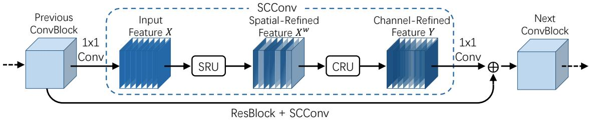
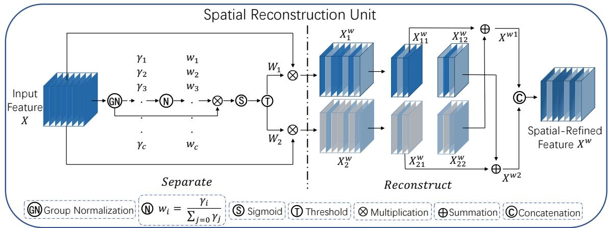
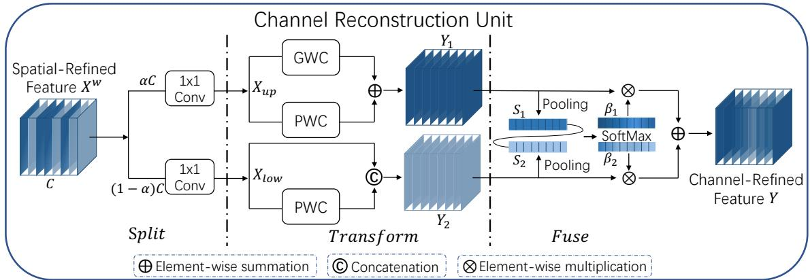
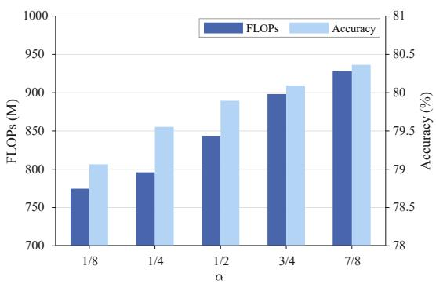
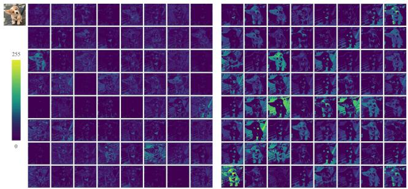
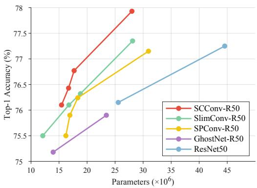

# SCConv: Spatial and Channel Reconstruction Convolution for Feature Redundancy

Jiafeng Li1, Ying Wen1\*, Lianghua He2

1School of Communication and Electronic Engineering, East China Normal University, Shanghai, China. 2Department of Computer Science and Technology, Tongji University, Shanghai, China.

51205904113@stu.ecnu.edu.cn;ywen@cs.ecnu.edu.cn;helianghua@tongji.edu.cn

## Abstract

Convolutional Neural Networks (CNNs) have achieved remarkable performance in various computer vision tasks but this comes at the cost of tremendous computational resources, partly due to convolutional layers extracting redundant features. Recent works either compress well-trained large-scale models or explore well-designed lightweight models. In this paper, we make an attempt to exploit spatial and channel redundancy among features for CNN compression and propose an efficient convolution module, called SCConv (Spatial and Channel reconstruction Convolution), to decrease redundant computing and facilitate representative feature learning. The proposed SCConv consists of two units: spatial reconstruction unit (SRU) and channel reconstruction unit (CRU). SRU utilizes a separate-and-reconstruct method to suppress the spatial redundancy while CRU uses a split-transform-andfuse strategy to diminish the channel redundancy. In addition, SCConv is a plug-and-play architectural unit that can be used to replace standard convolution in various convolutional neural networks directly. Experimental results show that SCConv-embedded models are able to achieve better performance by reducing redundant features with significantly lower complexity and computational costs.

## 1. Introduction

In recent years, convolutional neural networks (CNNs) have obtained widespread applications in computer vision tasks [24] due to its ability in obtaining representative features. However, such success relies heavily on intensive resources of computation and storage, which poses severe challenges to their efficient deployment on resourceconstrained environments. Therefore, to address these challenges, various types of model compression strategies and network designs have been explored to improve network efficiency [1, 2, 26]. The former includes network pruning, weight quantization, low-rank factorization, and knowledge distillation. To be specific, network pruning [17, 22, 30] is a straightforward way to prune the uncritical neuron connections from an existing learned big model to make it thinner. Weight quantization [9] mainly focuses on converting network weights from floating-point types to integer ones to save computation resources. Low-rank factorization [5] applies the matrix decomposition techniques to estimate the informative parameters. Knowledge distillation [11, 34] generates small student networks with the guidance of a well-trained big teacher network. The common part of these compression techniques is that they have been regarded as post-processing steps, thus their performance is usually upper bounded by the given initial model. Meanwhile, the accuracy of these methods drastically drops while achieving a high compression rate.

Network design is another alternative way, which aims at reducing the inherent redundancy in dense model parameters and further developing a lightweight network model. For example, ResNet [10] and DenseNet [14] utilize an efficient shortcut connection to improve the network topology, which connects all preceding feature maps to diminish the redundant parameters. ResNeXt [31] replaces traditional convolutions with sparsely connected group convolutions to reduce inter-channel connectivity. Networks like Xception [4], MobileNet [12] and MobileNeXt [35] disentangle standard convolution into depth-wise convolution and point-wise convolution to further decrease the connection density between channels. MicroNet [19] adopts microfactorized convolution to handle extremely low FLOPs by integrating sparse connectivity into convolution. In addition, EfficientNet [27] learns to automatically search optimal network architectures to lower the redundancy in dense model parameters.

Moreover, in CNN architecture design, bottleneck structure has been well adopted, in which 3 × 3 convolutional layers account for a majority of the model parameters and FLOPs. Therefore various efficient convolutional operations, such as group-wise convolution (GWC), depth-wise convolution (DWC) and point-wise convolution (PWC), a variant of the standard convolution, are proposed to replace the existing expensive convolutional operation. GWC, which was first introduced in AlexNet [16], can be regarded as a sparse convolution connection method that each output channel is connected to only a certain group of input channels. DWC [13] proposes to bring more efficiency by keeping each channel separately convolved with filters and without interaction between channels. PWC is used to keep the information flowing across channels and enable dimensionality reduction by reducing the number of filters. These operations are similar in sparse connectivity and have benefits in the number of parameters and FLOPs, which illustrates that redundancy in channel dimension can be reduced reasonably. Hence, a variety of convolution operations are proposed to explore redundancy reduction. For example, MobileNet [12] introduces inverted residual blocks using DWC and PWC to filter the features, which decreases the number of parameters while accelerating the training. ShuffleNet [33] resorts to point-wise group convolution and channel shuffle operation to improve the information flow between different channel groups. HetConv [25] designs heterogeneous convolutional filters where a 3 × 3 convolution kernels and a 1 × 1 convolution kernels are included in one single filter to extract features. TiedBlockConv [28] shares the same convolutional filter over equal blocks of channels to produce multiple responses within a single filter. SPConv [32] divides the input channels into two groups for different processing but needs a relatively large amount of calculation while extracting internal information. Ghost-Net [8] considers the redundancy between feature maps and uses cheap operations like DWC to learn redundant features. SilmConv [23] adopts the operation of reducing the channels of features and flipping the weights to reduce feature redundancy. In addition, orthogonal to channel redundancy, OctConv [3] proposes octave convolution to separate convolutional filters into high-frequency and low-frequency components, processing the latter in low resolution to alleviate the spatial redundancy, which reduces calculations while keeping the same number of parameters.

Spatial and Channel reconstruction Convolution  
  
Figure 1. The architecture of SCConv integrated with Spatial Reconstruction Unit (SRU) and Channel Reconstruction Unit (CRU). This figure shows the exact position of our SCConv module within a ResBlock.

All these prior studies have proven that there indeed exists considerable redundancy in the deep neural networks, not only in dense model parameters but also in the spatial and channel dimension of feature maps. However, all the above methods either focus on reducing the redundancy in channel dimension or in spatial dimension, making the network still suffer from the problems of feature redundancy.

In this paper, different from prior work, we design a two-step procedure to exploit the redundancy of intermediate feature maps, with the goal of reducing the number of parameters and computation without performance loss. To this end, we propose a novel CNN compression approach to jointly reduce spatial and channel redundancy in the convolutional layers, termed as SCConv (Spatial and Channel reconstruction Convolution), which consists of two units, spatial reconstruction unit (SRU) and channel reconstruction unit (CRU). The proposed SCConv module, which can be embedded into various architectures without additional modifications, is designed to efficiently restrict feature redundancy. This module not only cuts down on the number of model parameters and FLOPs but enhances the capability of feature representation. We summarize our contributions as follows:

• We propose a spatial reconstruction unit, termed as SRU, which separates redundant features based on weights and reconstructs them to suppress the redundancy in spatial dimension and strengthen the representation of features.

• We propose a channel reconstruction unit, termed as CRU, which utilizes a split-transform-and-fuse strategy to diminish the redundancy in channel dimension as well as the computational costs and storage.

• We design a plug-and-play operation named SCConv combining SRU and CRU in a sequential manner to replace standard convolution for operating on a variety of backbone CNNs. It turns out that SCConv can substantially save the computing load yet enhance the model performance on challenging tasks.

  
Figure 2. The architecture of Spatial Reconstruction Unit.

## 2. Methodology

In this section, we introduce the proposed SCConv as illustrated in Figure 1, which consists of two units, Spatial Reconstruction Unit (SRU) and Channel Reconstruction Unit (CRU), placed in a sequential manner. Concretely, for the intermediate input features X in the bottleneck residual block, we first obtain the spatial-refined features $X ^ { w }$ through SRU operation and subsequently we utilize CRU operation to gain the channel-refined features Y . We exploit both spatial and channel redundancy among features in our SCConv module, which can be seamlessly integrated into any CNN architecture to decrease redundancy among intermediate feature maps and boost the feature representation of CNNs.

## 2.1. SRU for Spatial Redundancy

To exploit the spatial redundancy of features, we introduce Spatial Reconstruction Unit (SRU) as shown in Figure 2, which utilizes a Separate-and-Reconstruct operation. Separate operation aims to separate those informative feature maps from less informative ones corresponding to the spatial content. We leverage the scaling factors in Group Normalization (GN) [29] layers to assess the informative content of different feature maps. To be concrete, given an intermediate feature map $\boldsymbol { X } \in \dot { \mathbb { R } ^ { N \times C \times H \times W } }$ , where N is the batch axis, $C$ is the channel axis, H and W are the spatial height and width axes. We first standardize the input feature X by subtracting mean $\mu$ and dividing by standard deviation σ as follows:

$$
X _ { o u t } = G N ( X ) = \gamma \frac { X - \mu } { \sqrt { \sigma ^ { 2 } + \varepsilon } } + \beta\tag{1}
$$

where $\mu$ and $\sigma$ are the mean and standard deviation in $X ,$ $\varepsilon$ is a small positive constant added for the sake of division stability, γ and $\beta$ are trainable affine transformation.

Noted that we leverage the trainable parameters $\gamma \in R ^ { C }$ in GN layers as a way to measure the variance of spatial pixels for each batch and channel. The richer spatial information reflects more variation in spatial pixels contributing to a larger γ. The normalized correlation weights $W _ { \gamma } \in R ^ { C }$ are obtained by equation 2, which indicates the importance of different feature maps.

$$
W _ { \gamma } = \left\{ w _ { i } \right\} = \frac { \gamma _ { i } } { \sum _ { j = 1 } ^ { C } \gamma _ { j } } , i , j = 1 , 2 , \cdots , C\tag{2}
$$

Then the weight values of feature maps reweighted by $W _ { \gamma }$ are mapped to the range (0, 1) by the sigmoid function and gated by a threshold. We set those weights above the threshold to 1 to obtain the informative weights $W _ { 1 }$ while setting them to 0 to gain the non-informative weights $W _ { 2 }$ (the threshold is set to 0.5 in the experiments). The whole process of acquiring $W$ can be expressed as equation 3:

$$
W = G a t e ( S i g m o i d ( W _ { \gamma } ( G N ( X ) ) ) )\tag{3}
$$

Finally, we multiply input features X by $W _ { 1 }$ and $W _ { 2 }$ respectively, yielding two weighted features: the informative ones $X _ { 1 } ^ { w }$ and less informative ones $X _ { 2 } ^ { w }$ . Thus we successfully separate the input features into two parts: $X _ { 1 } ^ { w }$ has informative and expressive spatial contents while $X _ { 2 } ^ { w }$ has little or no information, which is regarded as redundant.

In order to reduce the spatial redundancy, we further propose a Reconstruct operation that features with rich information sum up with less informative ones to generate features with richer information and save spatial space. Instead of adding these two parts directly, we adopt a cross reconstruct operation to sufficiently combine the weighted two different informative features and strengthen the information flow between them. Afterwards we concatenate the cross-reconstructed features $X ^ { w 1 }$ and $X ^ { w 2 }$ to obtain the spatial-refined feature maps $X ^ { w }$ . The whole process of $R e \mathrm { - }$ construct operation can be expressed as :

  
Figure 3. The architecture of Channel Reconstruction Unit.

$$
\left\{ \begin{array} { r } { X _ { 1 } ^ { w } = W _ { 1 } \otimes X , } \\ { X _ { 2 } ^ { w } = W _ { 2 } \otimes X , } \\ { X _ { 1 1 } ^ { w } \oplus X _ { 2 2 } ^ { w } = X ^ { w 1 } , } \\ { X _ { 2 1 } ^ { w } \oplus X _ { 1 2 } ^ { w } = X ^ { w 2 } , } \\ { X ^ { w 1 } \cup X ^ { w 2 } = X ^ { w } . } \end{array} \right.\tag{4}
$$

where $\otimes$ is element-wise multiplication, ⊕ is element-wise summation, ∪ is concatenation. After the SRU is applied to the intermediate input features X, not only do we separate the informative features from less informative ones, but also we reconstruct them to enhance the representative features and suppress the redundant features in spatial dimension. Nevertheless, the spatial-refined feature maps $X ^ { w }$ still remain redundant in channel dimension.

## 2.2. CRU for Channel Redundancy

To exploit the channel redundancy of features, we introduce Channel Reconstruction Unit (CRU) as shown in Figure 3, which utilizes a Split-Transform-and-Fuse strategy. Normally, we use repetitive standard $k \times k$ convolutions to extract features, resulting in some relatively redundant feature maps along the channel dimension. Let $M ^ { k } \in \mathbb { R } ^ { c \times k \times k }$ denotes a $k \times k$ convolution kernel and $X , Y \in \mathbb { R } ^ { c \times h \times }$ w denotes the input and convolved output features respectively. A standard convolution 1 can be defined as $Y = M ^ { k } X$ . To be specific, we replace the standard convolution with CRU, which is implemented via three operators – Split, Transform and Fuse.

Split : For given spatial-refined features $X ^ { w } \in \mathbb { R } ^ { c \times h \times w }$ we first split the channels of $X ^ { w }$ into two parts with $\alpha C$ channels and $( 1 - \alpha ) C$ channels respectively, as shown in the split part of Figure 3, where $0 \leq \alpha \leq 1$ is a split ratio. Subsequently, we further utilize $1 \times 1$ convolutions to squeeze the channels of feature maps for its computing efficiency. Here we introduce a squeeze ratio r to control the feature channels to balance the computational cost of the CRU $( r = 2$ is a typical setting in the experiments). After the split and squeeze operations, we divide the spatialrefined features $X ^ { w }$ into the upper part $X _ { u p }$ and the lower part $X _ { l o w }$

Transform : $X _ { u p }$ is fed into the upper transformation stage, serving as a “Rich Feature Extractor”. We adopt efficient convolutional operations (i.e. GWC and PWC) to replace the expensive standard $k \times k$ convolutions to extract high-level representative information as well as reduce the computational cost. Owing to sparse convolution connections, GWC reduces the amount of parameters and calculations but cuts off the information flow between channel groups. While PWC compensates for the information loss and helps the information flow across feature channels. Thus we perform k×k GWC (we set group size $g = 2$ in the experiments) and 1 × 1 PWC operations on the same $X _ { u p } .$ Afterward, we sum up the output to form a merged representative feature maps $Y _ { 1 }$ as shown in the Transform part of Figure 3. The upper transformation stage can be formulated as :

$$
Y _ { 1 } = M ^ { G } X _ { u p } + M ^ { P _ { 1 } } X _ { u p }\tag{5}
$$

where $M ^ { G } ~ \in ~ \mathbb { R } ^ { \frac { \alpha c } { g r } \times k \times k \times c }$ $\begin{array} { r l r } { M ^ { P _ { 1 } } } & { { } \in } & { \mathbb { R } ^ { \frac { \alpha c } { r } \times } } \end{array}$ 1× 1×c is a learnable weight matrix of GWC and PWC, $X _ { u p } \in$ $\mathbb { R } ^ { \frac { \alpha c } { r } \times h \times w }$ and $Y _ { 1 } ~ \in ~ \mathbb { R } ^ { c \times ~ h \times }$ w are the upper input and output feature maps respectively. In short, the upper transformation stage leverages a combination of GWC and PWC on the same feature maps $X _ { u p }$ to extract rich representative features $Y _ { 1 }$ with less computational cost.

$X _ { l o w }$ is fed into the lower transformation stage, where we apply cheap $1 \times 1 ~ \mathrm { P W C }$ operations to generate feature maps with shallow hidden details as a supplementary to the Rich Feature Extractor. In addition, we reuse features $X _ { l o w }$ to obtain more feature maps without extra cost. Lastly, we concatenate the generated and reused features to form the output of the lower stage $Y _ { 2 }$ as follows:

$$
Y _ { 2 } = M ^ { P _ { 2 } } \ X _ { l o w } \cup X _ { l o w }\tag{6}
$$

where $\begin{array} { r c l } { M ^ { P _ { 2 } } } & { \in } & { \mathbb { R } ^ { \frac { ( 1 - \alpha ) c } { r } \times 1 \times 1 \times ( 1 - \frac { 1 - \alpha } { r } ) c } } \end{array}$ is a learnable weight matrix of PWC, ∪ is concatenation operation, $\bar { X _ { l o w } } ~ \in ~ \mathbb { R } ^ { \frac { ( 1 - \alpha ) c } { r } }$ ×h×w and $Y _ { 2 } ~ \in ~ \mathbb { R } ^ { c \times h \times w }$ are the lower input and output feature maps respectively. In a word, the lower transformation stage reuses preceding features $X _ { l o w }$ and utilizes cheap 1 × 1 PWC to obtain features $Y _ { 2 }$ with supplementary detailed information.

Fuse : After the transformation is performed, instead of direct concatenating or adding two types of features, we utilize the simplified SKNet method [18] to adaptively merge the output features $Y _ { 1 }$ and $Y _ { 2 }$ from upper and lower transformation stage as shown in the Fuse part of Figure 3. We first apply a global average pooling (Pooling) to collect global spatial information with channel-wise statistics $S _ { m } \in \mathbb { R } ^ { c \times 1 \times 1 }$ , which is calculated as:

$$
S _ { m } = P o o l i n g ( Y _ { m } ) = \frac { 1 } { H \times W } \sum _ { i = 1 } ^ { H } \sum _ { j = 1 } ^ { W } Y _ { c } ( i , j ) , m = 1 , 2\tag{7}
$$

Next, we stack the upper and lower global channelwise descriptor $S _ { 1 } , S _ { 2 }$ together and use channel-wise soft attention operation to generate feature importance vector $\beta _ { 1 } , \beta _ { 2 } \in \mathbb { R } ^ { c }$ as follows:

$$
\beta _ { 1 } = \ \frac { e ^ { s _ { 1 } } } { e ^ { s _ { 1 } } + e ^ { s _ { 2 } } } , \beta _ { 2 } = \ \frac { e ^ { s _ { 2 } } } { e ^ { s _ { 1 } } + e ^ { s _ { 2 } } } , \beta _ { 1 } + \beta _ { 2 } = 1\tag{8}
$$

Finally, under the guidance of feature importance vector $\beta _ { 1 } , \beta _ { 2 }$ , the channel-refined features $Y$ can be obtained by merging the upper features $Y _ { 1 }$ and the lower features $Y _ { 2 }$ in a channel-wise manner as follows:

$$
Y = ~ \beta _ { 1 } Y _ { 1 } + \beta _ { 2 } Y _ { 2 }\tag{9}
$$

In brief, we adopt CRU, using Split-Transform-and-Fuse strategy, to further diminish the redundancy of spatialrefined feature maps $X ^ { w }$ along the channel dimension. Furthermore, CRU extracts rich representative features through lightweight convolutional operations while proceeds redundant features with cheap operation and feature reuse schemes. Overall, CRU can be used individually or in conjunction with SRU operation. By arranging the SRU and CRU in a sequential manner, the proposed SCConv is established, which is highly efficient and capable of replacing standard convolution operations.

## 2.3. Analysis on Complexities

Our SCConv is designed as a plug-and-play module that can be easily embedded into various existing welldesigned neural architectures to reduce computation and storage costs. In the SCConv module, all of the parameters are concentrated on the transformation stage. Hence we analyze the reduction of theoretical memory usage. The parameters of standard convolution $Y = M ^ { k } { \dot { X } }$ can be calculated as:

$$
P _ { s } = k \ \times \ k \times \ C _ { 1 } \times \ C _ { 2 } = k ^ { 2 } C _ { 1 } C _ { 2 }\tag{10}
$$

where k is kernel size of the convolution, $C _ { 1 }$ and $C _ { 2 }$ are the number of input and output feature channels.

The parameters of the proposed SCConv module consist of :

$$
\begin{array} { l } { { \displaystyle P _ { s c } = 1 \times 1 \times \alpha C _ { 1 } \times \frac { \alpha C _ { 1 } } { r } + k \times k \times \frac { \alpha C _ { 1 } } { g r } \times \frac { C _ { 2 } } { g } \times g } } \\ { { \displaystyle ~ + 1 \times 1 \times \frac { \alpha C _ { 1 } } { r } \times C _ { 2 } + ( 1 - \alpha ) C _ { 1 } \times \frac { ( 1 - \alpha ) C _ { 1 } } { r } } } \\ { { \displaystyle ~ + 1 \times 1 \times \frac { ( 1 - \alpha ) C _ { 1 } } { r } \times \left( C _ { 2 } - \frac { 1 - \alpha } { r } C _ { 1 } \right) } } \end{array}\tag{11}
$$

where α denotes the split ratio, r refers to the squeeze ratio, g is the group size of GWC operation, $C _ { 1 }$ and $C _ { 2 }$ are input and output feature channels respectively. Here, we give a comparison to show the performance of the proposed SCConv. In the experiment, the general parameter set is $\alpha = { \textstyle { \frac { 1 } { 2 } } } , r = 2 , g = 2 , k = 3 , C _ { 1 } = C _ { 2 } = C$ , the amount of parameters can be reduced by 5 times where $P _ { s } / P _ { s c } \approx 5$ while the model achieves better performance than standard convolution.

## 3. Experiments

To evaluate the effectiveness of the proposed SCConv, in this section, we perform a series of experiments on image classification and object detection with only the widely used $3 \times 3$ kernels being replaced by SCConv module. Image classification benchmarks includes CIFAR-10 [15], CIFAR-100 [15] and ImageNet-1K [16]. Object detection benchmarks include PASCAL VOC [6] and MS COCO [21]. Top-1 accuracy is reported as the evaluation metric for image classification and the mean average precision (mAP) is used to measure accuracy of object detection. For fair comparisons, all models in each experiment, including reimplemented baselines and SCConv-equipped models, are trained from scratch on 2 NVIDIA Tesla V100 GPUs with the default data augmentation and training strategy and no other tricks are used. In each experiment, we train several times with the same configuration to prevent the impact of fluctuations and report the median of results.

## 3.1. Experimental Settings

Dataset. CIFAR dataset, including CIFAR-10 and CIFAR-100, consists of 50k training images and 10k validation images, which are divided into 10 and 100 classes respectively. ImageNet-1K dataset is a large-scale image classification dataset, containing 1.28 million training images and 50k validation images from 1k classes. PASCAL VOC dataset, which has 20 classes, contains more than 22k images for training and 5k images for validation. MS COCO dataset, which is divided into 80 classes, has more than 118k images for training and 5k images for validation.

Training and Inference. 1) For CIFAR-10 and CIFAR-100, we follow a similar training scheme in [10]. Networks are trained for 200 epochs with SGD optimizer with a weight decay of $5 \times e ^ { - 4 }$ and a momentum of 0.9. The learning rate is initialized to 0.05 and is decayed by 0.1 at 100 and 150 of the epochs. It trains with a mini-batch size of 128 on one GPU. Besides, according to different architectures of networks, we set $( h , w )$ to (8, 8) for ResNet, WideResNet, ResNeXt and set it to (4, 4) for DenseNet. 2) For ImageNet-1K dataset, we follow standard practices and perform data augmentation with random cropping to size 224 × 224 pixels. We apply SGD with a momentum of 0.9 and a weight decay of $1 \times e ^ { - 4 }$ . The initial learning rate is set to 0.1 and divided by every 30 epochs for a total of 100 epochs. 3) For PASCAL VOC dataset, we use SGD optimizer and set the batch size to 32. The initial learning rate is set to 0.1 with a 500 iterations warmup. We train 20k iterations totally and reduce the learning rate by a factor of 10 at 10k and 18k iterations. 4) For MS COCO dataset, we use SGD optimizer and set the initial learning rate to 0.1 and batch size to 16. The total iterations are set to 180k and the learning rate is divided by 10 at 120k and 160k iterations.

## 3.2. Ablation Studies

In this section, we conduct ablation studies to inspect the relative effectiveness of different components in the proposed SCConv module. We choose ResNet50 as the baseline network by replacing standard 3×3 convolution to conduct the following ablation experiments on CIFAR100.

SRU and CRU Our SCConv module includes a spatial reconstruction unit (SRU) and a channel reconstruction unit (CRU). Firstly we only apply SRU or CRU on ResNet50 to examine the efficiency of a single unit. As shown in Table 1, only embedding with SRU (ResNet50+S) achieves nearly 1% improvement without extra increment in FLOPs, while solely embedding with CRU (ResNet50+C) can save 38% parameters and $\mathrm { F L O P s }$ with 0.8% increase of Top-1 accuracy. The results imply that the single-unit-embedded model boosts the accuracy significantly. In addition, we compare three different ways of arranging the SRU and CRU: sequential spatial-channel (S+C), sequential channelspatial (C+S), and parallel use of both units (C&S). We find that the spatial-first order (S+C) achieves the best accuracy than other combination methods. Thus we adopt a sequential spatial-first combination (S+C) strategy to formulate our SCConv and further improve the model performance.

Table 1. Experimental results with different combination methods of SRU and CRU on CIFAR-100 dataset. (S and C is short for SRU and CRU respectively)
<table><tr><td>Description</td><td>Params</td><td>FLOPs</td><td>Top-1ACC(%)</td></tr><tr><td>ResNet50</td><td>23.71M</td><td>1.30G</td><td>78.60</td></tr><tr><td>ResNet50 + S</td><td>23.53M</td><td>1.30G</td><td>79.59</td></tr><tr><td>ResNet50 + C</td><td>14.74M</td><td>843.81M</td><td>79.21</td></tr><tr><td> $\mathrm { R e s N e t } 5 0 + \mathrm { C } \ \& \ \mathrm { S }$ </td><td>14.74M</td><td>843.81M</td><td>79.26</td></tr><tr><td> $\mathrm { R e s N e t } 5 0 + \mathrm { C } + \mathrm { S }$ </td><td>14.74M</td><td>843.81M</td><td>79.54</td></tr><tr><td> $\mathrm { R e s N e t } 5 0 + \mathrm { S } + \mathrm { C }$ </td><td>14.74M</td><td>843.81M</td><td>79.89</td></tr></table>

  
Figure 4. The trade-off between FLOPs and Accuracy on CIFAR-100 with different split ratios α in SCConv-embedded ResNet50.

Analysis on split ratio α To explore the effect of different split ratios α in CRU module, we vary the split ratio from 1/8 to 7/8 gradually to compare the accuracy versus FLOPs on CIFAR-100. As shown in Figure 4, the accuracy of SCConv-embedded ResNet50 rises with the increase of the split ratio α. The higher α represents the model can obtain richer feature information in the transformation stage of CRU, thereby improving the model’s overall performance. When $\alpha = 1 / 2$ , the whole network achieves the best flopsaccuracy trade-off. Thus we adopt the optimal split ratio $\alpha = 1 / 2$ for SCConv in the following experiments for a better trade-off between performance and efficiency.

Visualization To explore the feature representation of the proposed SRU method, we visualize the feature maps of the first stage of the original ResNet50 and SRU-embedded ResNet50 in Figure 5. It can be observed that the pattern in features of SRU-embedded ResNet50 is enriched in comparison with original ResNet50. Not only the redundant features is diminished but the representative features are strengthened and diversified. The visualization demonstrates the SRU is capable of generating representative and expressive features.

  
Figure 5. Left: Features from the first-stage of original ResNet50, Right: Features from the first-stage of SRU-embedded ResNet50.

## 3.3. Image Classification on CIFAR

After studying the structure of the proposed SCConv module for efficient feature learning, we continue to evaluate the SCConv-embedded architecture on various baseline models and further make a comparison with the SOTA methods over classification accuracy, the number of parameters and FLOPs on CIFAR-10 and CIFAR-100 dataset. The related SOTA approaches include OctConv [3], Ghost-Net [8], SPConv [32], SlimConv [23], TiedConv [28]. All experiments are conducted by replacing the original convolutional layers with the corresponding convolution methods.

As can be seen in Table 2, in all cases, our SCConvembedded models outperform all prior networks for accuracy. For ResNet-56 model, the SCConv-R56 requires only 62.7% parameters and FLOPs of the counterpart ResNet56 while bringing over a 1% accuracy increase on both datasets. For ResNet-50 model, the SCConv-R50 achieves better accuracy (nearly 1% and 1.3%) but around 37% parameters and 34% FLOPs reduction than the counterpart ResNet50 on CIFAR-10 and CIFAR-100. Besides, the SCConv-R50 requires the same computational costs as SlimConv-R50 while bringing higher (over 1%) promotion of accuracy. To show the generality of the proposed method, we apply SCConv and other SOTA methods to ResNeXt-29, WideResNet-28, and DenseNet-121. It can be observed that the SCConv-embedded models still achieve superior performance than other works with comparable model computations. For instance, the SCConv-RX29 achieves over 2.3% improvement of accuracy while the computation is on par with the GhostNet-RX29. The SCConv-WRN28 achieves better accuracy (nearly 1.3%) than the SlimConv-WRN28 while saving parameters and FLOPs by 11.7% and 15.5%.

## 3.4. Image Classification on ImageNet

We conduct experiments for ResNet50 on the ImageNet-1K dataset, comparing the performance of our approach with the recent SOTA methods including OctConv [3], SP-Conv [32], GhostNet [8], SlimConv [23], PfLayer [7], Tied-Conv [28]etc. Noted that we only replace the bottleneck 3 × 3 convolutions with the corresponding convolution methods. As shown in Table 3, our SCConv-R50 α=1/2 can achieve 34.4% computation reductions with 0.26% accuracy increase over the ResNet50 model. When we further increase the split ratio α to 3/4, our approach gains superior performance to all other state-of-the-art methods in the growth of accuracy.

Table 2. Comparison of SOTA methods for common CNN architectures over Top-1 accuracy, the number of parameters and FLOPs on CIFAR-10 and CIFAR-100 dataset.
<table><tr><td>Network Architecture</td><td>FLOPs</td><td>Params</td><td>CIFAR-10 ACC(%)</td><td>CIFAR-100 ACC(%)</td></tr><tr><td>ResNet56 (R56)</td><td>126.84M</td><td>0.86M</td><td>93.27</td><td>71.50</td></tr><tr><td>OctConv-R56 (α=1/2)</td><td>126.84M</td><td>0.62M</td><td>93.11</td><td>70.93</td></tr><tr><td>SPConv-R56 (α=1/2)</td><td>87.95M</td><td>0.58M</td><td>93.49</td><td>71.51</td></tr><tr><td>GhostNet-R56 (s=2)</td><td>68.35M</td><td>0.45M</td><td>92.35</td><td>70.42</td></tr><tr><td>SlimConv-R56 (k=1)</td><td>88.82M</td><td>0.60M</td><td>93.51</td><td>71.71</td></tr><tr><td>TiedConv-R56 (b=2)</td><td>94.99M</td><td>0.54M</td><td>92.87</td><td>71.10</td></tr><tr><td>SCConv-R56 (Ours)</td><td>79.55M</td><td>0.52M</td><td>94.12</td><td>72.56</td></tr><tr><td>ResNet50 (R50)</td><td>1.30G</td><td>23.52M</td><td>95.09</td><td>78.60</td></tr><tr><td>OctConv-R50 (α=1/2)</td><td>727.26M</td><td>23.52M</td><td>95.25</td><td>78.91</td></tr><tr><td>GhostNet-R50 (s=2)</td><td>632.45M</td><td>14.56M</td><td>94.30</td><td>77.54</td></tr><tr><td>SlimConv-R50 (k=4/3)</td><td>853.50M</td><td>14.83M</td><td>95.05</td><td>78.85</td></tr><tr><td>SPConv-R50 (α=1/2)</td><td>972.31M</td><td>16.14M</td><td>95.32</td><td>79.23</td></tr><tr><td>SlimConv-R50 (k=1)</td><td>942.38M</td><td>16.78M</td><td>95.35</td><td>79.26</td></tr><tr><td>TiedConv-R50 (b=2)</td><td>998.78M</td><td>15.03M</td><td>95.44</td><td>79.52</td></tr><tr><td>SCConv-R50 (Ours)</td><td>831.18M</td><td>14.69M</td><td>95.92</td><td>79.89</td></tr><tr><td>ResNeXt-29 (RX29)</td><td>4.55G</td><td>28.27M</td><td>95.68</td><td>81.54</td></tr><tr><td>GhostNet-RX29 (s=2)</td><td>3.60G</td><td>22.22M</td><td>95.14</td><td>80.23</td></tr><tr><td>SPConv-RX29 (α=1/2)</td><td>4.79G</td><td>31.17M</td><td>96.03</td><td>81.76</td></tr><tr><td>SlimConv-RX29 (k=4/3)</td><td>4.38G</td><td>28.24M</td><td>95.85</td><td>81.93</td></tr><tr><td>TiedConv-RX29 (b=2)</td><td>5.96G</td><td>24.67M</td><td>95.66</td><td>81.32</td></tr><tr><td>SCConv-RX29 (Ours)</td><td>3.57G</td><td>22.31M</td><td>96.20</td><td>82.56</td></tr><tr><td>WideResNet-28 (WRN28)</td><td>5.96G</td><td>36.55M</td><td>95.21</td><td>79.40</td></tr><tr><td>GhostNet-WRN28 (s=2)</td><td>3.98G</td><td>22.12M</td><td>95.25</td><td>79.27</td></tr><tr><td>SPConv-WRN28 (α=1/2)</td><td>4.16G</td><td>24.20M</td><td>95.37</td><td>80.25</td></tr><tr><td>SlimConv-WRN28 (k=1)</td><td>4.25G</td><td>25.00M</td><td>95.43</td><td>79.52</td></tr><tr><td>TiedConv-WRN28 (b=2)</td><td>4.54G</td><td>22.03M</td><td>95.48</td><td>78.61</td></tr><tr><td>SCConv-WRN28 (Ours)</td><td>3.75G</td><td>21.12M</td><td>95.64</td><td>80.83</td></tr><tr><td>DenseNet-121 (D121)</td><td>898.23M</td><td>7.05M</td><td>95.09</td><td>79.43</td></tr><tr><td>GhostNet-D121 (s=2)</td><td>517.36M</td><td>5.04M</td><td>93.96</td><td>78.51</td></tr><tr><td>SPConv-D121 (α=1/2)</td><td>641.54M</td><td>5.69M</td><td>95.15</td><td>79.64</td></tr><tr><td>SlimConv-D121 (k=1)</td><td>670.21M</td><td>5.97M</td><td>94.63</td><td>78.90</td></tr><tr><td>TiedConv-D121 (b=2)</td><td>695.68M</td><td>5.45M</td><td>95.23</td><td>79.73</td></tr><tr><td>SCConv-D121 (Ours)</td><td>594.34M</td><td>5.45M</td><td>95.37</td><td>80.24</td></tr></table>

For instance, the SCConv-R50 α=3/4 achieves over 0.6% improvement of accuracy while the computation is on a par with the PfLayer-R50 max. In addition, the SCConv-R50 α=1/2 gains better performance than SlimConv-R50 k=4/3 with comparable calculations. To further prove the effectiveness of SCConv, we embed it with the deep model ResNet101. With nearly 62% of computation costs, our SCConv-R101 brings a 0.68% accuracy increase over the baseline model.

Besides, for better comparison, we select several stateof-the-art methods to draw the FLOPs v.s. Top-1 accuracy curve. From an overall view of Figure 6, the curve of our proposed model is above all other methods including ResNet, GhostNet, SP-ResNet, and SlimConv. It shows that our proposed model gains higher accuracy with lower computation costs. As for the same performance, the model with our SCConv performs more compactly than others.

Table 3. Image classification results on ImageNet-1K dataset.
<table><tr><td>Network Architecture</td><td>FLOPs(G)</td><td>Params(M)</td><td>Top-1 (%)</td></tr><tr><td>ResNet50 (R50) (Baseline)</td><td>4.09</td><td>25.56</td><td>76.15</td></tr><tr><td>Versatile-R50 (NIPS2018) GhostNet-R50_s=2 (CVPR2020) SlimConv-R50_k=8/3 (TIP2021)</td><td>1.80 2.15 1.88 2.97 2.40</td><td>18.7 13.95 12.10</td><td>75.50 75.18 75.32</td></tr><tr><td>SPConv-R50_α=1/2 (IJCAI2020) OctConv-R50_α=1/2 (CVPR2020)</td><td></td><td>18.34 25.56</td><td>76.26 76.34</td></tr><tr><td>SlimConv-R50_k=4/3 (TIP2021)</td><td>2.65</td><td>16.76</td><td>76.12</td></tr><tr><td>PfLayer-R50_max (ICLR2022)</td><td>2.90</td><td>18.00</td><td>76.15</td></tr><tr><td>SlimConv-R50_k=1 (TIP2021)</td><td>3.00</td><td>18.81</td><td>76.32</td></tr><tr><td>TiedConv-R50_b=2 (AAAI2021)</td><td>3.19</td><td>17.07</td><td>76.04</td></tr><tr><td>SCConv-R50_α=1/2</td><td>2.70</td><td>16.78</td><td>76.41</td></tr><tr><td>SCConv-R50_α=3/4</td><td>2.87</td><td>17.69</td><td></td></tr><tr><td></td><td></td><td></td><td>76.79</td></tr><tr><td>ResNet_101(R101)(Baseline) SCConv-R101</td><td>7.83 4.90</td><td>44.55 28.00</td><td>77.25 77.93</td></tr></table>

  
Figure 6. Top1-Accuracy v.s. FLOPs for ResNet50 on ImageNet.

## 3.5. Object Detection

In order to further evaluate the generalization ability of SCConv, we conduct experiments on two datasets for object detection tasks. The one-stage RetinaNet [20] is used as a detection framework. We adopt the backbone network of ResNet-50, ResNet-101, and SCConv-embedded model acts as a drop-in replacement for the backbone feature extractor.

Table 4. Object detection experiments on the PASCAL VOC 2007 and 2012 dataset.
<table><tr><td>Backbone</td><td>Params(M)/FLOPs(G)</td><td>AP@.5</td><td>AP@.75</td><td>mAP@[.5,.95]</td></tr><tr><td>ResNet50(R50)</td><td>25.56/63.09</td><td>77.89</td><td>55.31</td><td>52.26</td></tr><tr><td>SPConv-R50</td><td>19.76/49.23</td><td>78.05</td><td>55.47</td><td>52.48</td></tr><tr><td>SlimConv-R50</td><td>18.81/47.12</td><td>77.96</td><td>55.38</td><td>52.42</td></tr><tr><td>SCConv-R50</td><td>16.78/41.36</td><td>78.68</td><td>56.26</td><td>53.16</td></tr><tr><td>ResNet101(R101)</td><td>44.55/121.3</td><td>79.23</td><td>56.31</td><td>53.32</td></tr><tr><td>SCConv-R101</td><td>27.90/75.26</td><td>80.36</td><td>57.05</td><td>54.12</td></tr></table>

Table 5. Object detection results on MS COCO val2017.
<table><tr><td>Backbone</td><td>Params(M)/FLOPs(G)</td><td>AP@.5</td><td>AP@.75</td><td>mAP@[.5, .95]</td></tr><tr><td>ResNet50(R50)</td><td>25.56/63.09</td><td>54.2</td><td>37.4</td><td>35.2</td></tr><tr><td>SPConv-R50</td><td>19.76/49.23</td><td>54.5</td><td>37.6</td><td>35.3</td></tr><tr><td>SlimConv-R50</td><td>18.81/47.12</td><td>54.0</td><td>37.1</td><td>35.0</td></tr><tr><td>SCConv-R50</td><td>16.78/41.36</td><td>55.1</td><td>38.2</td><td>35.6</td></tr></table>

For the PASCAL VOC dataset, as shown in Table 4, the AP@[.5] of RetinaNet with the SCConv-R50 and SCConv-R101 are 78.68% and 80.36%, exceeding original ResNet50 and ResNet101 by 0.8% and 1.1% while reducing parameters and FLOPs by 34.1% and 37%. For the MS COCO dataset, as shown in Table 5, the AP@[.5] of RetinaNet with SCConv-R50 is 55.1%, outperforming original ResNet-50 by 0.9% with over 22G FLOPs decreased.

In addition, our approach consistently surpasses current state-of-the-art methods on both datasets. For instance, the mAP@[.5,.95] of SCConv-R50 exceeds the SlimConv-R50 by nearly 0.8% and 0.6% on PASCAL VOC and MS COCO datasets. In short, these results prove that the SCConv module not only brings performance improvement but helps the network learn better representative features with a smaller amount of parameters, making it possible for object detection to be deployed on resource-limited devices.

## 4. Conclusion

In this paper, we have presented a novel spatial and channel reconstruction module (SCConv), an efficient architectural unit to decrease computational cost and model storage while improving the performance of CNN models by reducing spatial and channel redundancies that widely exist in standard convolution. We diminish the redundancy in feature maps with two distinctive modules, SRU and CRU, which achieve considerable performance improvement while cutting a substantial amount of computation loads. Besides, SCConv is a plug-and-play module and generic to replace the standard convolution without any model architecture adjustment. In addition, the extensive experiments with various SOTA methods on image classification and object detection have indicated the superiority of SCConv-embedded models for striking a much better tradeoff between performance and model efficiency. Finally, we hope the proposed method can inspire research for more efficient architectural design.

Acknowledgments This work was supported in part by the 2030 National Key Research and Development Program of China (2018AAA0100500), National Nature Science Foundation of China (62273150, 62171323), Shanghai Natural Science Foundation (22ZR1421000), Shanghai Outstanding Academic Leaders Plan (21XD1430600), Science and Technology Commission of Shanghai Municipality (22DZ2229004).

## References

[1] Jierun Chen, Tianlang He, Weipeng Zhuo, Li Ma, Sangtae Ha, and S-H Gary Chan. Tvconv: Efficient translation variant convolution for layout-aware visual processing. In Proceedings of the IEEE/CVF Conference on Computer Vision and Pattern Recognition, pages 12548–12558, 2022. 1

[2] Yinpeng Chen, Xiyang Dai, Dongdong Chen, Mengchen Liu, Xiaoyi Dong, Lu Yuan, and Zicheng Liu. Mobileformer: Bridging mobilenet and transformer. In Proceedings of the IEEE/CVF Conference on Computer Vision and Pattern Recognition, pages 5270–5279, 2022. 1

[3] Yunpeng Chen, Haoqi Fan, Bing Xu, Zhicheng Yan, Yannis Kalantidis, Marcus Rohrbach, Shuicheng Yan, and Jiashi Feng. Drop an octave: Reducing spatial redundancy in convolutional neural networks with octave convolution. In Proceedings of the IEEE/CVF International Conference on Computer Vision, pages 3435–3444, 2019. 2, 7

[4] Franc¸ois Chollet. Xception: Deep learning with depthwise separable convolutions. In Proceedings of the IEEE conference on computer vision and pattern recognition, pages 1251–1258, 2017. 1

[5] Emily L Denton, Wojciech Zaremba, Joan Bruna, Yann Le-Cun, and Rob Fergus. Exploiting linear structure within convolutional networks for efficient evaluation. Advances in neural information processing systems, 27, 2014. 1

[6] Mark Everingham, Luc van Gool, C.K.I. Williams, John Winn, and A. Zisserman. The PASCAL visual object classes challenge 2007 (VOC2007) results, 2007. 5

[7] Dongyoon Han, YoungJoon Yoo, Beomyoung Kim, and Byeongho Heo. Learning features with parameter-free layers. arXiv preprint arXiv:2202.02777, 2022. 7

[8] Kai Han, Yunhe Wang, Qi Tian, Jianyuan Guo, Chunjing Xu, and Chang Xu. Ghostnet: More features from cheap operations. In Proceedings of the IEEE/CVF conference on computer vision and pattern recognition, pages 1580–1589, 2020. 2, 7

[9] Song Han, Huizi Mao, and William J Dally. Deep compression: Compressing deep neural networks with pruning, trained quantization and huffman coding. arXiv preprint arXiv:1510.00149, 2015. 1

[10] Kaiming He, Xiangyu Zhang, Shaoqing Ren, and Jian Sun. Deep residual learning for image recognition. In Proceedings of the IEEE conference on computer vision and pattern recognition, pages 770–778, 2016. 1, 6

[11] Geoffrey Hinton, Oriol Vinyals, Jeff Dean, et al. Distilling the knowledge in a neural network. arXiv preprint arXiv:1503.02531, 2(7), 2015. 1

[12] Andrew G Howard, Menglong Zhu, Bo Chen, Dmitry Kalenichenko, Weijun Wang, Tobias Weyand, Marco Andreetto, and Hartwig Adam. Mobilenets: Efficient convolutional neural networks for mobile vision applications. arXiv preprint arXiv:1704.04861, 2017. 1, 2

[13] Andrew G Howard, Menglong Zhu, Bo Chen, Dmitry Kalenichenko, Weijun Wang, Tobias Weyand, Marco Andreetto, and Hartwig Adam. MobileNets: Efficient Convolutional Neural Networks for Mobile Vision Applications. In Computer Vision and Pattern Recognition, 2017. 2

[14] Gao Huang, Zhuang Liu, Laurens Van Der Maaten, and Kilian Q Weinberger. Densely connected convolutional networks. In Proceedings of the IEEE conference on computer vision and pattern recognition, pages 4700–4708, 2017. 1

[15] Alex Krizhevsky. Learning Multiple Layers of Features from Tiny Images. Technical report, University of Toronto, 2009. 5

[16] Alex Krizhevsky, Ilya Sutskever, and Geoffrey E. Hinton. ImageNet classification with deep convolutional neural networks. In Neural Information Processing Systems, pages 1097–1105, 2012. 2, 5

[17] Hao Li, Asim Kadav, Igor Durdanovic, Hanan Samet, and Hans Peter Graf. Pruning filters for efficient convnets. arXiv preprint arXiv:1608.08710, 2016. 1

[18] Xiang Li, Wenhai Wang, Xiaolin Hu, and Jian Yang. Selective kernel networks. In Proceedings ofthe IEEE/CVF Conference on Computer Vision and Pattern Recognition, pages 510–519, 2019. 5

[19] Yunsheng Li, Yinpeng Chen, Xiyang Dai, Dongdong Chen, Mengchen Liu, Lu Yuan, Zicheng Liu, Lei Zhang, and Nuno Vasconcelos. Micronet: Improving image recognition with extremely low flops. In Proceedings of the IEEE/CVF International Conference on Computer Vision, pages 468–477, 2021. 1

[20] Tsung-Yi Lin, Priya Goyal, Ross Girshick, Kaiming He, and Piotr Dollar. Focal loss for dense object detection. In ´ Proceedings of the IEEE international conference on computer vision, pages 2980–2988, 2017. 8

[21] Tsung Yi Lin, Michael Maire, Serge Belongie, James Hays, Pietro Perona, Deva Ramanan, Piotr Dollar, and C Lawrence´ Zitnick. Microsoft COCO: Common objects in context. In European Conference on Computer Vision, pages 740–755, 2014. 5

[22] Zhuang Liu, Jianguo Li, Zhiqiang Shen, Gao Huang, Shoumeng Yan, and Changshui Zhang. Learning efficient convolutional networks through network slimming. In Proceedings of the IEEE international conference on computer vision, pages 2736–2744, 2017. 1

[23] Jiaxiong Qiu, Cai Chen, Shuaicheng Liu, Heng-Yu Zhang, and Bing Zeng. Slimconv: Reducing channel redundancy in convolutional neural networks by features recombining. IEEE Transactions on Image Processing, 30:6434–6445, 2021. 2, 7

[24] Olga Russakovsky, Jia Deng, Hao Su, Jonathan Krause, Sanjeev Satheesh, Sean Ma, Zhiheng Huang, Andrej Karpathy, Aditya Khosla, Michael Bernstein, et al. Imagenet large scale visual recognition challenge. International journal of computer vision, 115(3):211–252, 2015. 1

[25] Pravendra Singh, Vinay Kumar Verma, Piyush Rai, and Vinay P Namboodiri. Hetconv: Heterogeneous kernel-based convolutions for deep cnns. In Proceedings ofthe IEEE/CVF Conference on Computer Vision and Pattern Recognition, pages 4835–4844, 2019. 2

[26] Xinglong Sun, Ali Hassani, Zhangyang Wang, Gao Huang, and Humphrey Shi. Disparse: Disentangled sparsification for multitask model compression. In Proceedings of the IEEE/CVF Conference on Computer Vision and Pattern Recognition, pages 12382–12392, 2022. 1

[27] Mingxing Tan and Quoc Le. Efficientnet: Rethinking model scaling for convolutional neural networks. In International conference on machine learning, pages 6105–6114. PMLR, 2019. 1

[28] Xudong Wang and X Yu Stella. Tied block convolution: leaner and better cnns with shared thinner filters. In Proceedings of the AAAI Conference on Artificial Intelligence, volume 35, pages 10227–10235, 2021. 2, 7

[29] Yuxin Wu and Kaiming He. Group normalization. In Proceedings of the European conference on computer vision (ECCV), pages 3–19, 2018. 3

[30] Mengzhou Xia, Zexuan Zhong, and Danqi Chen. Structured pruning learns compact and accurate models. arXiv preprint arXiv:2204.00408, 2022. 1

[31] Saining Xie, Ross Girshick, Piotr Dollar, Zhuowen Tu, and´ Kaiming He. Aggregated residual transformations for deep neural networks. In Proceedings of the IEEE conference on computer vision and pattern recognition, pages 1492–1500, 2017. 1

[32] Qiulin Zhang, Zhuqing Jiang, Qishuo Lu, Jia’nan Han, Zhengxin Zeng, Shang-Hua Gao, and Aidong Men. Split to be slim: An overlooked redundancy in vanilla convolution. arXiv preprint arXiv:2006.12085, 2020. 2, 7

[33] Xiangyu Zhang, Xinyu Zhou, Mengxiao Lin, and Jian Sun. Shufflenet: An extremely efficient convolutional neural network for mobile devices. In Proceedings of the IEEE conference on computer vision and pattern recognition, pages 6848–6856, 2018. 2

[34] Borui Zhao, Quan Cui, Renjie Song, Yiyu Qiu, and Jiajun Liang. Decoupled knowledge distillation. In Proceedings of the IEEE/CVF Conference on computer vision and pattern recognition, pages 11953–11962, 2022. 1

[35] Daquan Zhou, Qibin Hou, Yunpeng Chen, Jiashi Feng, and Shuicheng Yan. Rethinking bottleneck structure for efficient mobile network design. In European Conference on Computer Vision, pages 680–697. Springer, 2020. 1