# SDFusion: Multimodal 3D Shape Completion, Reconstruction, and Generation

Yen-Chi Cheng1 Hsin-Ying Lee2 Sergey Tulyakov2 Alexander Schwing1∗ Liangyan Gui1∗ 1University of Illinois Urbana-Champaign 2Snap Research {yenchic3,aschwing,lgui}@illinois.edu {hlee5,stulyakov}@snap.com https://yccyenchicheng.github.io/SDFusion/

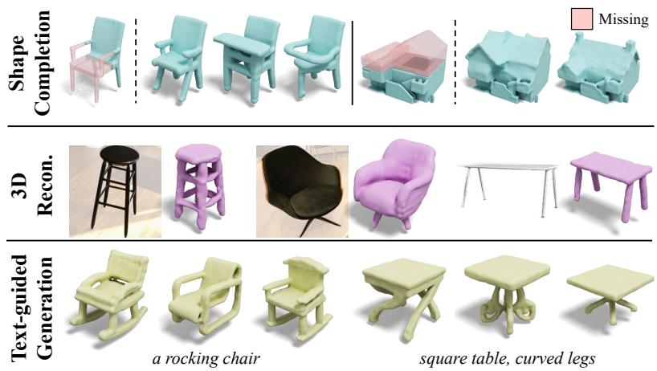

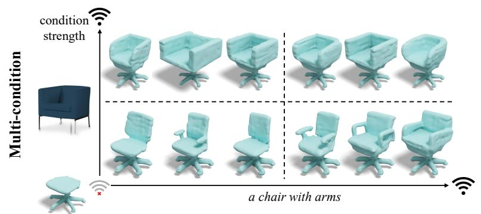

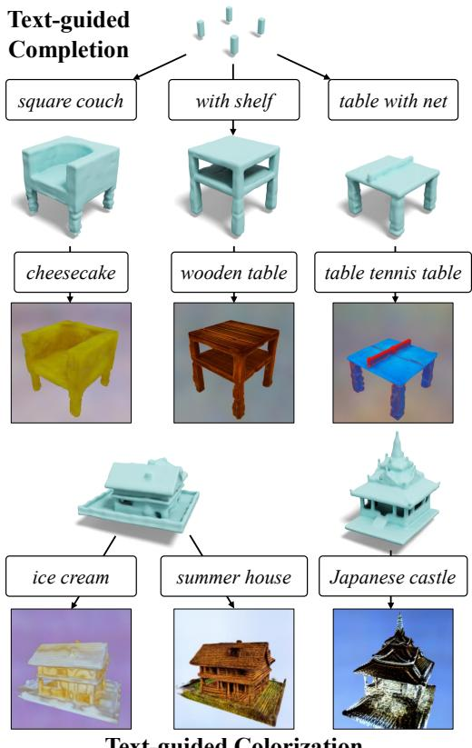  
Figure 1. Applications of SDFusion. The proposed diffusion-based model enables various applications. (left) SDFusion can generate shapes conditioned on different input modalities, including partial shapes, images, and text. SDFusion can even jointly handle multiple conditioning modalities while controlling the strength for each of them. (right) We leverage pretrained 2D models to texture 3D shapes generated by SDFusion.

## Abstract

In this work, we present a novel framework built to simplify 3D asset generation for amateur users. To enable interactive generation, our method supports a variety of input modalities that can be easily provided by a human, including images, text, partially observed shapes and combinations of these, further allowing to adjust the strength of each input. At the core of our approach is an encoderdecoder, compressing 3D shapes into a compact latent representation, upon which a diffusion model is learned. To enable a variety of multi-modal inputs, we employ taskspecific encoders with dropoutfollowed by a cross-attention

mechanism. Due to its flexibility, our model naturally supports a variety of tasks, outperforming prior works on shape completion, image-based 3D reconstruction, and text-to-3D. Most interestingly, our model can combine all these tasks into one swiss-army-knife tool, enabling the user to perform shape generation using incomplete shapes, images, and textual descriptions at the same time, providing the rel ative weights for each input and facilitating interactivity. Despite our approach being shape-only, we further show an efficient method to texture the generated shape using largescale text-to-image models.

## 1. Introduction

Generating 3D assets is a cornerstone of immersive augmented/virtual reality experiences. Without realistic and diverse objects, virtual worlds will look void and engagement will remain low. Despite this need, manually creating and editing 3D assets is a notoriously difficult task, requiring creativity, 3D design skills, and access to sophisticated software with a very steep learning curve. This makes 3D asset creation inaccessible for inexperienced users. Yet, in many cases, such as interior design, users more often than not have a reasonably good understanding of what they want to create. In those cases, an image or a rough sketch is sometimes accompanied by text indicating details of the asset, which are hard to express graphically for an amateur.

Due to this need, it is not surprising that democratizing the 3D content creation process has become an active research area. Conventional 3D generative models require direct 3D supervision in the form of point clouds [2, 21], signed distance functions (SDFs) [9, 25], voxels [42, 47], etc. Recently, first efforts have been made to explore the learning of 3D geometry from multi-view supervision with known camera poses by incorporating inductive biases via neural rendering techniques [5, 6, 14, 37, 52]. While compelling results have been demonstrated, training is often very time-consuming and ignores available 3D data that can be used to obtain good shape priors. We foresee an ideal collaborative paradigm for generative methods where models trained on 3D data provide detailed and accurate geometry, while models trained on 2D data provide diverse appearances. A first proof of concept is shown in Figure 1.

In our pursuit of flexible and high-quality 3D shape generation, we introduce SDFusion, a diffusion-based generative model with a signed distance function (SDF) under the hood, acting as our 3D representation. Compared to other 3D representations, SDFs are known to represent well highresolution shapes with arbitrary topology [9, 18, 23, 30]. However, 3D representations are infamous for demanding high computational resources, limiting most existing 3D generative models to voxel grids of 323 resolution and point clouds of 2K points. To side-step this issue, we first utilize an auto-encoder to compress 3D shapes into a more compact low-dimensional representation. Because of this, SDFusion can easily scale up to a $1 2 8 ^ { 3 }$ resolution. To learn the probability distribution over the introduced latent space, we leverage diffusion models, which have recently been used with great success in various 2D generation tasks [4,19,22,26,35,40]. Furthermore, we adopt taskspecific encoders and a cross-attention [34] mechanism to support multiple conditioning inputs, and apply classifierfree guidance [17] to enable flexible conditioning usage. Because of these strategies, SDFusion can not only use a variety of conditions from multiple modalities, but also adjust their importance weight, as shown in Figure 1. Compared to a recently proposed autoregressive model [25] that also adopts an encoded latent space, SDFusion achieves superior sample quality, while offering more flexibility to handle multiple conditions and, at the same time, features reduced memory usage. With SDFusion, we study the interplay between models trained on 2D and 3D data. Given 3D shapes generated by SDFusion, we take advantage of an off-theshelf 2D diffusion model [34], neural rendering [24], and score distillation sampling [31] to texture the shapes given text descriptions as conditional variables.

We conduct extensive experiments on the ShapeNet [7], BuildingNet [38], and Pix3D [43] datasets. We show that SDFusion quantitatively and qualitatively outperforms prior work in shape completion, 3D reconstruction from images, and text-to-shape tasks. We further demonstrate the capability of jointly controlling the generative model via multiple conditioning modalities, the flexibility of adjusting relative weight among modalities, and the ability to texture 3D shapes given textual descriptions, as shown in Figure 1.

We summarize the main contributions as follows:

• We propose SDFusion, a diffusion-based 3D generative model which uses a signed distance function as its 3D representation and a latent space for diffusion.

• SDFusion enables conditional generation with multiple modalities, and provides flexible usage by adjusting the weight among modalities.

• We demonstrate a pipeline to synthesize textured 3D objects benefiting from an interplay between 2D and 3D generative models.

## 2. Related Work

3D Generative Models. Different from 2D images, it is less clear how to effectively represent 3D data. Indeed, various representations with different pros and cons have been explored, particularly when considering 3D generative models. For instance, 3D generative models have been explored for point clouds [2, 21], voxel grids [20, 42, 47], meshes [51], signed distance functions (SDFs) [9, 11, 25], etc. In this work, we aim to generate an SDF. Compared to other representations, SDFs exhibit a reasonable tradeoff regarding expressivity, memory efficiency, and direct applicability to downstream tasks. Moreover, conditioning 3D generation of SDFs on different modalities further enables many applications, including shape completion, 3D reconstruction from images, 3D generation from text, etc. The proposed framework can handle these tasks in a single model which makes it different from prior work.

Recently, thanks to the advancement of neural rendering [24], a new stream of research has emerged to learn 3D generation and manipulation from only 2D supervision [1, 5, 6, 28, 37, 39, 41, 49]. We believe the interplay between two streams of work is promising in the foreseeable future.

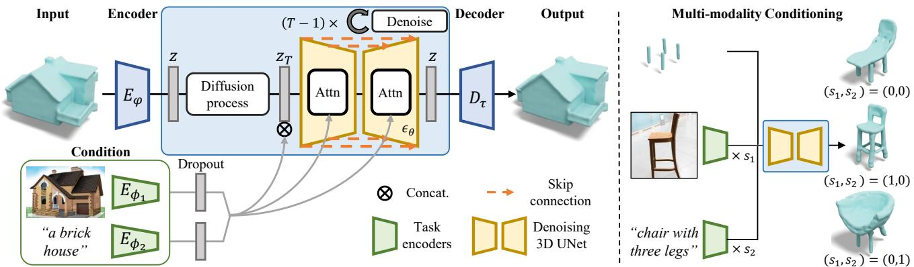  
Figure 2. SDFusion Overview. (left) To enable high-resolution generation, we first encode 3D shapes into a latent space, where a diffusion model is trained. Furthermore, to enable flexible conditional generation, we adopt class-specific encoders along with classifier-fre guidance to enable multi-modality conditioning. (right) At inference time, we can control the importance of each conditioning modality.

Diffusion Models. Diffusion models have recently emerged as a popular family of generative models with competitive sample quality. In particular, diffusion models have shown impressive quality, diversity, and expressiveness in various tasks such as image synthesis [13,15,16,27], super-resolution [36], image editing [10, 22, 40], text-toimage synthesis [4, 19, 26, 33, 35], etc. In contrast to the flourishing research on diffusion models for 2D data, diffusion models have not yet been fully explored for 3D data. Notable exceptions include attempts to apply diffusion models to point clouds [21, 53].

Differently, in this work, we apply diffusion models on SDF representations. As reasonable resolutions of SDFs are demanding to model, we study the use of a latent diffusion technique [34] and the classifier-free conditional generation mechanism [17], both of which have been shown to yield promising results when being used in 2D diffusion models.

## 3. Approach

We aim at synthesizing 3D shapes using diffusion models. Towards this goal, we model the distribution over 3D shapes X, a volumetric Truncated Signed Distance Field (T-SDF). However, applying diffusion models directly on reasonably high-resolution 3D shapes is computationally very demanding. Therefore, we first compress the 3D shape into a discretized and compact latent space (Section 3.1). This allows us to apply diffusion models in a lower-dimensional space (Section 3.2). The proposed framework can further incorporate various user conditions such as partial shapes, images, and text (Section 3.3). Finally, we showcase an interplay between the proposed framework and diffusion models trained on 2D data to texture 3D shapes (Section 3.4).

## 3.1. 3D Shape Compression of SDF

A 3D shape representation is high-dimensional and thus difficult to model. To make learning of high-resolution 3D shape distributions via diffusion models feasible, we compress the 3D shape X into a lower-dimensional yet compact latent space. For this, we leverage a 3D-variant of the Vector Quantised-Variational AutoEncoder (VQ-VAE) [29]. Specifically, the employed 3D VQ-VAE contains an encoder $E _ { \varphi }$ to encode the 3D shape into the latent space, and a decoder $D _ { \tau }$ to decode the latent vectors back to 3D space. Given an input shape represented via the T-SDF $\bar { \mathbf { X } } \in \mathbb { R } ^ { D \times D \times D }$ , we have

$$
\mathbf { z } = E _ { \varphi } ( \mathbf { X } ) , \quad \mathrm { a n d } \quad \mathbf { X } ^ { \prime } = D _ { \tau } ( \mathbf { V } \mathbf { Q } ( \mathbf { z } ) ) ,\tag{1}
$$

where $\mathbf { z } \in \mathbb { R } ^ { d \times d \times d }$ is the latent vector, latent dimension d is smaller than 3D shape dimension $D ,$ , and VQ is the quantization step which maps the latent variable z to the nearest element in the codebook $\mathcal { Z } .$ . The encoder $E _ { \varphi } ,$ , decoder $D _ { \tau }$ , and codebook $\mathcal { Z }$ are jointly optimized. We pre-train the VQ-VAE with reconstruction loss, commitment loss, and VQ objective, similar to [29] using ShapeNet or BuildingNet data. For more details please see the supplementary material.

## 3.2. Latent Diffusion Model for SDF

Using the trained encoder $E _ { \varphi }$ , we can now encode any given SDF into a compact and low-dimensional latent vari able $\mathbf { z } ~ = ~ E _ { \varphi } ( \mathbf { X } )$ We can then train a diffusion model on this latent representation. Fundamentally, a diffusion model learns to sample from a target distribution by reversing a progressive noise diffusion process. Given a sample ${ \mathbf { z } } ,$ we obtain $\mathbf { z } _ { t } , t \in \{ 1 , \ldots , T \}$ by gradually adding Gaussian noise with a variance schedule. Then we use a timeconditional 3D UNet $\epsilon _ { \theta }$ as our denoising model. To train the denoising 3D UNet, we adopt the simplified objective proposed by Ho et al. [15]:

$$
L _ { \mathrm { s i m p l e } } ( \theta ) : = \mathbb { E } _ { \mathbf { z } , \epsilon \sim N ( 0 , 1 ) , t } \left[ \left\| \epsilon - \epsilon _ { \theta } ( \mathbf { z } _ { t } , t ) \right\| ^ { 2 } \right] .\tag{2}
$$

At inference time, we sample $\widehat { \mathbf { z } }$ by gradually denoising a noise variable sampled from the standard normal distribu-

tion $N ( 0 , 1 )$ , and leverage the trained decoder $D _ { \tau }$ to map the denoised code bz back to a 3D T-SDF shape representation $\widehat { \mathbf { X } } = D _ { \tau } ( \widehat { \mathbf { z } } )$ , as shown in Figure 2.

## 3.3. Learning the Conditional Distribution

Being able to randomly sample shapes provides limited ability for interaction. Therefore, learning of a conditional distribution is essential for user applications. Importantly, multiple forms of conditional inputs are desirable such that the model can account for various kinds of scenarios. Thanks to the flexible conditional mechanism provided by a latent diffusion model [34], we can incorporate multiple conditional input modalities at once with task-specific encoders $E _ { \phi }$ and a cross-attention module. To further allow for more flexibility in controlling the distribution, we adopt classifier-free guidance for conditional generation. The objective function reads as follows:

$$
L ( \theta , \{ \phi _ { i } \} ) : = \underset { \mathbf { z } , \mathbf { c } , \epsilon , t } { \mathbb { E } } \left[ \lVert \epsilon - \epsilon _ { \theta } ( \mathbf { z } _ { t } , t , F \{ D \circ E _ { \phi _ { i } } ( \mathbf { c } _ { i } ) \} ) \rVert ^ { 2 } \right] ,\tag{3}
$$

where $E _ { \phi _ { i } } ( \mathbf { c } _ { i } )$ is the task-specific encoder for the $i ^ { \mathrm { t h } }$ modality, D is a dropout operation enabling classifier-free guidance, and $F$ is a feature aggregation function. In this work, $F$ refers to a simple concatenation.

At inference time, given conditions from multiple modalities, we perform classifier-free guidance as follows

$$
\begin{array} { l } { { \epsilon _ { \theta } ( { \bf z } _ { t } , t , F \{ E _ { \phi _ { i } } \ \forall i \} ) = \epsilon _ { \theta } ( { \bf z } _ { t } , t , \emptyset ) + } } \\ { { \displaystyle \sum _ { i } s _ { i } \left( \epsilon _ { \theta } ( { \bf z } _ { t } , t , F \{ E _ { \phi _ { i } } ( { \bf c } _ { i } ) , E _ { \phi _ { j } } ( { \bf c } _ { j } ) : { \bf c } _ { j } = \emptyset \forall j \neq i \} \right) } } \\ { { - \epsilon _ { \theta } ( { \bf z } _ { t } , t , \emptyset ) ) , } } \end{array}\tag{4}
$$

where $s _ { i }$ denotes the weight of conditions from the $i ^ { \mathrm { { t h } } }$ modality and ∅ denotes a condition filled with zeros. Intuitively, modalities with larger weights play more important roles in guiding the conditional generation.

In this work, we study SDFusion combined with three conditional modalities applied separately or jointly. For shape completion, given a partial observation of a shape, we perform blended diffusion similar to [4]. For single-view 3D reconstruction, we adopt CLIP [32] as the image encoder. For text-guided 3D generation, we adopt BERT [12] as the text encoder. The encoded features are then used to modulate the diffusion process with cross-attention. Please refer to the supplementary material for more details.

## 3.4. 3D Shape Texturing with a 2D Model

While sampled 3D data often exhibits compellingly detailed geometry, textures of 3D data are generally more difficult to collect and even more often of limited quality. Here, we explore how to make the best use of 2D data and models, so as to aid 3D asset generation. Thanks to the recent success of neural rendering [24] and 2D text-to-image models trained on extremely large-scale data [34], using a 2D model to perform 3D synthesis is made possible with a score distillation sampling technique [31].

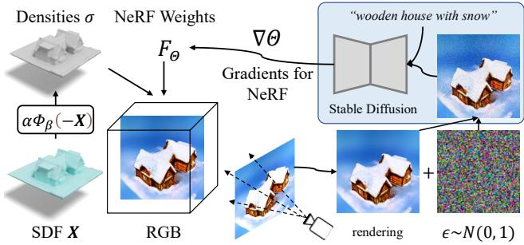  
Figure 3. 3D Shape Texturing. We demonstrate an application where models trained on 2D and 3D data are combined. The shapes generated by SDFusion are converted to a density tensor, then the color information is learned via neural rendering. The gradients are provided by an off-the-shelf 2D diffusion model [34].

Here, we illustrate the procedure of texturing a 3D shape given a guiding input sentence S. Starting from a generated T-SDF X, we first convert it to a density tensor σ by using VolSDF [50]. Our goal is to learn a 5D radiance field to obtain color $F _ { \theta } : ( \mathbf { x } , \mathbf { d } ) \ \to \ \mathbf { c }$ , similar to the conventional NeRF [24] setting. However, different from the conventional NeRF setting, the density tensor is fixed. With a sampled camera pose, we can render an image I by alphacompositing the densities and colors along the rays for each pixel. Then, we distill the knowledge from a pre-trained stable diffusion model [34], denoted as a 2D UNet $\tilde { \epsilon } _ { \phi } ( \mathbf { z } _ { t } , t , S )$ that predicts the noise at timestep t. The most straightforward way to update $F _ { \theta }$ is to obtain and backpropagate gradients all the way from the noise prediction loss term of the stable diffusion loss function to the input. However, the UNet Jacobian term is in practice expensive to compute. Therefore, it was proposed in [31] to bypass the UNet and treat $\tilde { \epsilon } _ { \phi }$ as a frozen critic providing scores by computing

$$
\mathbb { E } _ { t , \epsilon } \left[ \frac { \partial I ( F _ { \theta } ( \cdot ) ) } { \partial \theta } w ( t ) ( \tilde { \epsilon } _ { \phi } ( \mathbf { z } _ { t } , t , S ) - \epsilon ) \right] ,\tag{5}
$$

where w is a time-dependent weight function defined in the stable diffusion model. The mechanism is called Score Distillation Sampling. Please refer to [31] for details. The score then provides an update direction to $F _ { \theta }$ . We illustrate the process in Figure 3.

## 4. Experiments

In this section, we conduct extensive qualitative and quantitative experiments to demonstrate the efficacy and generalizability of SDFusion. We evaluate methods on three tasks: shape completion, single-view 3D reconstruction, and text-guided generation. We then demonstrate two additional use cases: multi-conditional generation and 3D shape texturing.

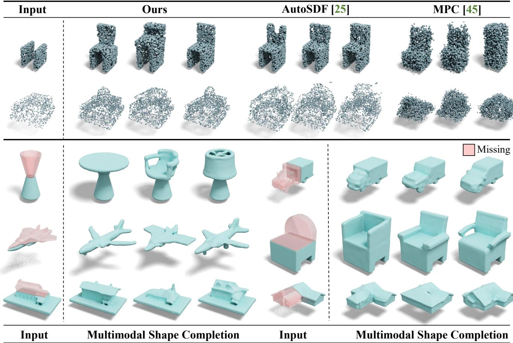  
Figure 4. Shape Completion. (Top) We compare SDFusion with AutoSDF [25] and MPC [45] on ShapeNet and BuildingNet data. SDFu sion generates shapes of better quality and diversity, while being consistent with the input partial shapes. We convert the generated SDFs from SDFusion and AutoSDF to point clouds to compare with MPC. Please refer to the supplementary materials for SDF comparisons on BuildingNet for better visualization. (Bottom) We present more results on diverse shape completion using various object categories.

Table 1. Quantitative comparison of Shape Completion. We evaluate methods on fidelity (UHD) and diversity (TMD) using the ShapeNet and BuildingNet data. SDFusion outperforms other methods in both metrics, especially diversity.
<table><tr><td></td><td>ShapeNet</td><td>BuildingNet</td></tr><tr><td>Method</td><td>UHD ↓ TMD ↑</td><td>UHD ↓ TMD ↑</td></tr><tr><td>MPC [45]</td><td>0.0627 0.0303</td><td>30.13500.0467</td></tr><tr><td></td><td>AutoSDF [25] 0.0567 0.0341 0.1208 0.0649</td><td></td></tr><tr><td>Ours</td><td>0.0557 0.08850.11160.0745</td><td></td></tr></table>

## 4.1. Shape Completion

We evaluate the shape completion task on the ShapeNet [7] and the BuildingNet [38] datasets. ShapeNet is a large-scale 3D CAD model dataset with 16 common object classes. We use the train/test splits provided by Xu et al. [48]. BuildingNet is a new large-scale 3D building model dataset. Compared to objects in ShapeNet, build ing models provide more geometric details and thus require higher resolution for representing the data. Hence, we use an SDF of $6 4 ^ { 3 }$ resolution for ShapeNet, and a $1 2 8 ^ { 3 }$ resolution for BuildingNet. For both datasets, we compare the completion quantitatively by providing the bottom half of the ground truth shape as input, and evaluating the completed shapes generated by different methods.

Table 2. Quantitative evaluation of single-view reconstruction. We evaulate methods on the Pix3D dataset using Chamfer Distance and F-Score. We outperform other methods in both metrics.
<table><tr><td>Method</td><td>CD ↓ F-Score ↑</td></tr><tr><td>Pix2Vox [46] 3.001</td><td>0.385</td></tr><tr><td>ResNet2TSDF 4.582</td><td>0.351</td></tr><tr><td>ResNet2Voxel 4.670</td><td>0.357</td></tr><tr><td>AutoSDF [25] 2.267</td><td>0.415</td></tr><tr><td>Ours 1.852</td><td>0.432</td></tr></table>

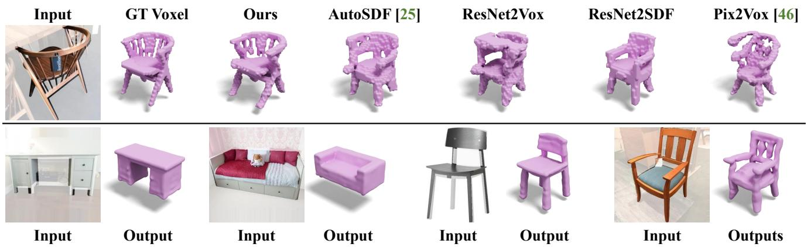  
Figure 5. Single-view 3D Reconstruction. (Top) We qualitatively compare all methods on the Pix3D dataset. SDFusion generates shapes with the best visual quality. (Bottom) Here we present more reconstruction results from SDFusion.

Table 3. Quantitative evaluation of text-guided generation. We compare the proposed SDFusion method, AutoSDF, and real data using a pretrained neural evaluator on the ShapeGlot dataset. P denotes the neural evaluator preference rate for the target P(Tr) or the distractor P(Dis). If the preference is too close (≤ 0.2), we count the comparison as confused (conf.). Rows sum to 100%.
<table><tr><td>Target (Tr)</td><td colspan="4">Distractor (Dis) P(Tr) P(Dis) P(conf.)</td></tr><tr><td>Ours</td><td>AutoSDF [25]</td><td>49%</td><td>36%</td><td>15%</td></tr><tr><td>Ours</td><td>GT</td><td>33%</td><td>45%</td><td>22%</td></tr><tr><td>AutoSDF [25]</td><td>GT</td><td>30%</td><td>49%</td><td>21%</td></tr></table>

We compare SDFusion to the state-of-the-art point cloud completion method MPC [45] and the autoregressive SDF generation method AutoSDF [25]. We adopt metrics from MPC [45]. For each partial shape, we generate k complete shapes. To evaluate completion fidelity, we measure the Unidirectional Hausdorff Distance (UHD) between partial shapes and generated shapes. To evaluate completion diversity, we measure the Total Mutual Difference (TMD) by computing the average Chamfer distance among k generated shapes. We use k = 10 in the experiments.

As shown in Table 1, the proposed SDFusion performs favorably compared to all methods in the completion fidelity metric, and outperforms the baselines substantially in completion diversity. The advantages of fidelity and diversity are also apparent in Figure 4. Especially on the BuildingNet dataset, SDFusion shows its advantages in modeling high-resolution and diverse data. AutoSDF and MPC struggle to model the distribution correctly.

## 4.2. Single-view 3D Reconstruction

Next, we assess 3D shape reconstruction from a single image on the real-world benchmark Pix3D [43] dataset. We use the provided train/test splits on the chair category. In the absence of official splits for other categories, we randomly split the dataset into disjoint train/test splits.

We compare with the ResNet2TSDF and ResNet2Voxel baselines. Both encode images and directly output 3D shapes in the form of a T-SDF and a voxel grid. We also compare to two state-of-the-art methods for 3D reconstruction, i.e., Pix2Vox [46] and AutoSDF [25] . We evaluate all methods after aligning resolutions to 323 voxels. We use Chamfer Distance (CD), and F-score@1% [44] as evaluation metrics.

Quantitatively, as shown in Table 2, SDFusion outperforms other methods on both metrics. Qualitatively, SDFusion generates 3D shapes that are of higher visual quality and are more visually consistent with the objects shown in the images, regardless of camera poses, as shown in Figure 5.

## 4.3. Text-guided Generation

Next, we evaluate 3D shape generation conditioned on text input. For a qualitative comparison, we use the Text2shape dataset [8] that provides descriptions for the ‘chair’ and ‘table’ categories in ShapeNet. For a quantitative evaluation, we adopt the ShapeGlot [3] dataset which provides text utterances describing the difference between a target shape and two distractors based on the ShapeNet dataset. We compare SDFusion with AutoSDF, which recently demonstrated state-of-the-art results on the textguided 3D shape generation task.

We follow the evaluation pipeline proposed by Shape-Glot [3]. We train a neural evaluator to distinguish the target shape from a distractor given the description. Given two shapes from different methods, the neural evaluator provides a confidence score for each of them based on the binary classification logits. For the absolute difference between two confidence scores ≤ 0.2, we count the comparison as confused (conf.).

As shown in Table 3, SDFusion quantitatively outperforms AutoSDF by a large margin with a low confusion rate. SDFusion also performs better than AutoSDF when compared with ground truth data. Qualitatively, we show

Input

“chair with five legs”

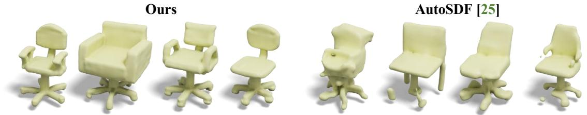

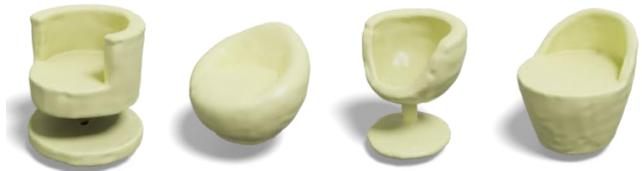  
“a somewhat circular chair”

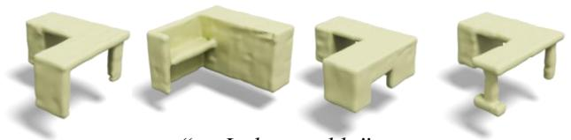  
“an L shape table”

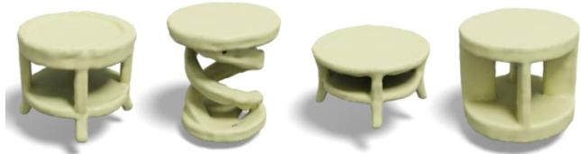  
“a round table with two surfaces”

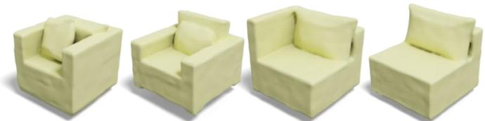  
“a chair with pillow for back support”

Figure 6. Text-guided 3D shape generation. (Top) We compare SDFusion with AutoSDF on the Text2Shape dataset. SDFusion generates shapes with higher quality while conforming to the description. (Bottom) We present more diverse and interesting text-guided generation results from SDFusion.  
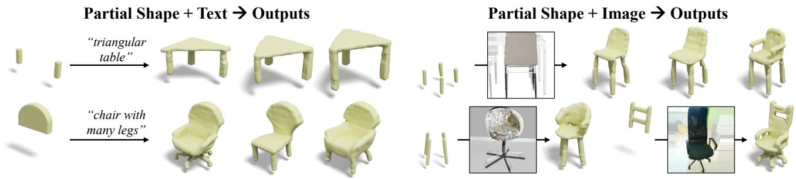  
Figure 7. Conditional generation from multiple modalities. Here, we present generated samples from joint conditions of (left) partial shape and text and (right) partial shapes and images. The generated results are diverse and consistent with the provided conditions.

in Figure 5 that SDFusion not only generates shapes with better quality, but that the generated shapes are also more diverse. Notably, SDFusion reacts to very specific descriptions like “L-shaped table” and “table with two surfaces.” It generates objects of high diversity while remaining faithful to the provided description.

## 4.4. Multi-conditional Generation

In addition to the conditional generation tasks which take a single conditioning variable as input, we further demonstrate the efficacy of SDFusion in handling multiple modalities. First, SDFusion can jointly consider multiple conditioning modalities. On the left of Figure 7, we present the diverse generation conditional on both partial shapes and text. On the right of Figure 7, we show that given partial shapes and images, SDFusion can complete the different parts based on images. When there is ambiguity in images (e.g., rear-view of chairs), SDFusion can produce diverse predictions. Second, as shown in Figure 8, SDFusion can not only be jointly conditioned on multiple inputs, but a weight can be used to control the importance of the conditioning modalities, enabling more flexible user control. For example, for the left sample in Figure 8, the larger the weight for the input image, the more similar the results are to the shapes in the image. Similarly, the larger the weight for input text, the more “egg-shaped” the results. We envision such a fine-grained form of control to be particularly useful for interactive user applications.

## 4.5. 3D Shape Texturing

Finally, we showcase an application that uses SDFusion to generate 3D shapes of detailed geometry, and uses a pretrained text-to-image 2D diffusion model [34] to provide textures. As shown in Figure 9, the diffusion model pre-trained on large-scale 2D data can provide semantically meaningful and diverse guidance to texture the 3D shapes. The model shows superior expressiveness to interpret abstract concepts (e.g., Chinese- and Halloween-style) and materials (e.g., gingerbread, cream cheese). Given a single description, the texturing pipeline can also generate diverse results, as shown in the rightmost part of Figure 9.

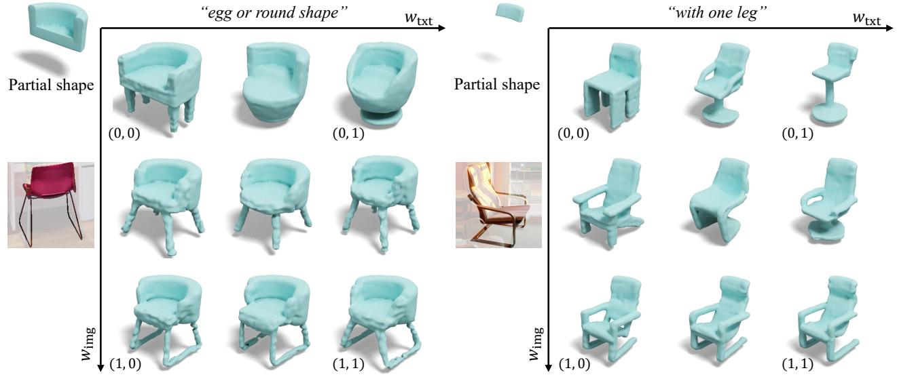

Figure 8. Multiple conditioning variables with weight control. Given a partial shape, an image, and a sentence as conditional input, we show that the model is sensitive to weights that control the importance of different modalities.  
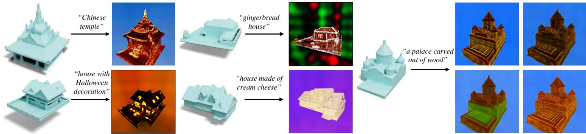  
Figure 9. 3D Shape Texturing. We texture the generated 3D shapes with a 2D diffusion model trained on large-scale data. This permits to generate textures from diverse textual inputs, including style and material descriptions. The pipeline can also generate diverse results given the same input description.

## 5. Conclusion

In this work, we present SDFusion, an attempt to adopt diffusion models to signed distance functions for 3D shape generation. To alleviate the computationally demanding nature of 3D representations, we first encode 3D shapes into an expressive low-dimensional latent space, which we use to train the diffusion model. To enable flexible conditional usage, we adopt class-specific encoders along with a crossattention mechanism for handling conditions from multiple modalities, and leverage classifier-free guidance to facilitate weight control among modalities. Foreseeing the potential of a collaborative symbiosis between models trained on 2D and 3D data, we further demonstrate an application that takes advantage of a pretrained 2D text-to-image model to texture a generated 3D shape.

Although the results look promising and exciting, there are quite a few future directions for improvement. First, SDFusion is trained on high-quality signed distance function representations. To make the model more general and to enable the use of more diverse data, a model that operates on various 3D representations simultaneously is desirable. Another future direction is related to the diversity of the data: we currently apply SDFusion on object-centric data. It is interesting to apply the model to more challenging scenarios (e.g., entire 3D scenes). Finally, we believe there is room to further explore how to combine models trained on 2D and 3D data.

Acknowledgements: Work supported in part by NSF under Grants 2008387, 2045586, 2106825, MRI 1725729, and NIFA award 2020-67021-32799. Thanks to NVIDIA for providing a GPU for debugging.

## References

[1] Rameen Abdal, Hsin-Ying Lee, Peihao Zhu, Menglei Chai, Aliaksandr Siarohin, Peter Wonka, and Sergey Tulyakov. 3davatargan: Bridging domains for personalized editable avatars. In CVPR, 2023. 2

[2] Panos Achlioptas, Olga Diamanti, Ioannis Mitliagkas, and Leonidas Guibas. Learning representations and generative models for 3d point clouds. In ICML, 2018. 2

[3] Panos Achlioptas, Judy Fan, Robert Hawkins, Noah Goodman, and Leonidas J Guibas. Shapeglot: Learning language for shape differentiation. In CVPR, 2019. 6

[4] Omri Avrahami, Dani Lischinski, and Ohad Fried. Blended diffusion for text-driven editing of natural images. In CVPR, 2022. 2, 3, 4

[5] Eric R Chan, Connor Z Lin, Matthew A Chan, Koki Nagano, Boxiao Pan, Shalini De Mello, Orazio Gallo, Leonidas J Guibas, Jonathan Tremblay, Sameh Khamis, et al. Efficient geometry-aware 3d generative adversarial networks. In CVPR, 2022. 2

[6] Eric R Chan, Marco Monteiro, Petr Kellnhofer, Jiajun Wu, and Gordon Wetzstein. pi-gan: Periodic implicit generative adversarial networks for 3d-aware image synthesis. In CVPR, 2021. 2

[7] Angel X. Chang, Thomas Funkhouser, Leonidas Guibas, Pat Hanrahan, Qixing Huang, Zimo Li, Silvio Savarese, Manolis Savva, Shuran Song, Hao Su, Jianxiong Xiao, Li Yi, and Fisher Yu. ShapeNet: An Information-Rich 3D Model Repository. Technical Report arXiv:1512.03012 [cs.GR], Stanford University — Princeton University — Toyota Technological Institute at Chicago, 2015. 2, 5

[8] Kevin Chen, Christopher B Choy, Manolis Savva, Angel X Chang, Thomas Funkhouser, and Silvio Savarese. Text2shape: Generating shapes from natural language by learning joint embeddings. In ACCV, 2018. 6

[9] Zhiqin Chen and Hao Zhang. Learning implicit fields for generative shape modeling. In CVPR, 2019. 2

[10] Shin-I Cheng, Yu-Jie Chen, Wei-Chen Chiu, Hsin-Ying Lee, and Hung-Yu Tseng. Adaptively-realistic image generation from stroke and sketch with diffusion model. In ACCV, 2022. 3

[11] Zezhou Cheng, Menglei Chai, Jian Ren, Hsin-Ying Lee, Kyle Olszewski, Zeng Huang, Subhransu Maji, and Sergey Tulyakov. Cross-modal 3d shape generation and manipulation. In ECCV, 2022. 2

[12] Jacob Devlin, Ming-Wei Chang, Kenton Lee, and Kristina Toutanova. Bert: Pre-training of deep bidirectional transformers for language understanding. In NAACL, 2019. 4

[13] Prafulla Dhariwal and Alexander Nichol. Diffusion models beat gans on image synthesis. NeurIPS, 2021. 3

[14] Jiatao Gu, Lingjie Liu, Peng Wang, and Christian Theobalt. Stylenerf: A style-based 3d-aware generator for highresolution image synthesis. In ICLR, 2022. 2

[15] Jonathan Ho, Ajay Jain, and Pieter Abbeel. Denoising diffusion probabilistic models. NeurIPS, 2020. 3

[16] Jonathan Ho, Chitwan Saharia, William Chan, David J Fleet, Mohammad Norouzi, and Tim Salimans. Cascaded diffusion

models for high fidelity image generation. arXiv preprint arXiv:2106.15282, 2021. 3

[17] Jonathan Ho and Tim Salimans. Classifier-free diffusion guidance. arXiv preprint arXiv:2207.12598, 2022. 2, 3

[18] Yue Jiang, Dantong Ji, Zhizhong Han, and Matthias Zwicker. Sdfdiff: Differentiable rendering of signed distance fields for 3d shape optimization. In CVPR, 2020. 2

[19] Bahjat Kawar, Shiran Zada, Oran Lang, Omer Tov, Huiwen Chang, Tali Dekel, Inbar Mosseri, and Michal Irani. Imagic: Text-based real image editing with diffusion models. arXiv preprint arXiv:2210.09276, 2022. 2, 3

[20] Chieh Hubert Lin, Hsin-Ying Lee, Willi Menapace, Menglei Chai, Aliaksandr Siarohin, Ming-Hsuan Yang, and Sergey Tulyakov. Infinicity: Infinite-scale city synthesis. arXiv preprint arXiv:2301.09637, 2023. 2

[21] Shitong Luo and Wei Hu. Diffusion probabilistic models for 3d point cloud generation. In CVPR, 2021. 2, 3

[22] Chenlin Meng, Yang Song, Jiaming Song, Jiajun Wu, Jun-Yan Zhu, and Stefano Ermon. Sdedit: Image synthesis and editing with stochastic differential equations. In ICLR, 2022. 2, 3

[23] Lars Mescheder, Michael Oechsle, Michael Niemeyer, Sebastian Nowozin, and Andreas Geiger. Occupancy networks: Learning 3d reconstruction in function space. In CVPR, 2019. 2

[24] Ben Mildenhall, Pratul P. Srinivasan, Matthew Tancik, Jonathan T. Barron, Ravi Ramamoorthi, and Ren Ng. Nerf: Representing scenes as neural radiance fields for view synthesis. In ECCV, 2020. 2, 4

[25] Paritosh Mittal, Yen-Chi Cheng, Maneesh Singh, and Shubham Tulsiani. AutoSDF: Shape priors for 3d completion, reconstruction and generation. In CVPR, 2022. 2, 5, 6

[26] Alex Nichol, Prafulla Dhariwal, Aditya Ramesh, Pranav Shyam, Pamela Mishkin, Bob McGrew, Ilya Sutskever, and Mark Chen. Glide: Towards photorealistic image generation and editing with text-guided diffusion models. arXiv preprint arXiv:2112.10741, 2021. 2, 3

[27] Alexander Quinn Nichol and Prafulla Dhariwal. Improved denoising diffusion probabilistic models. In ICML, 2021. 3

[28] Michael Niemeyer and Andreas Geiger. Giraffe: Representing scenes as compositional generative neural feature fields. In CVPR, 2021. 2

[29] Aaron van den Oord, Oriol Vinyals, and Koray Kavukcuoglu. Neural discrete representation learning. In NeurIPS, 2017. 3

[30] Jeong Joon Park, Peter Florence, Julian Straub, Richard Newcombe, and Steven Lovegrove. Deepsdf: Learning continuous signed distance functions for shape representation. In CVPR, 2019. 2

[31] Ben Poole, Ajay Jain, Jonathan T Barron, and Ben Mildenhall. Dreamfusion: Text-to-3d using 2d diffusion. arXiv preprint arXiv:2209.14988, 2022. 2, 4

[32] Alec Radford, Jong Wook Kim, Chris Hallacy, Aditya Ramesh, Gabriel Goh, Sandhini Agarwal, Girish Sastry, Amanda Askell, Pamela Mishkin, Jack Clark, et al. Learning transferable visual models from natural language supervision. In ICML, 2021. 4

[33] Tanzila Rahman, Hsin-Ying Lee, Jian Ren, Sergey Tulyakov, Shweta Mahajan, and Leonid Sigal. Make-a-story: Visual memory conditioned consistent story generation. In CVPR, 2022. 3

[34] Robin Rombach, Andreas Blattmann, Dominik Lorenz, Patrick Esser, and Bjorn Ommer. High-resolution image syn-¨ thesis with latent diffusion models. In CVPR, 2022. 2, 3, 4, 7

[35] Chitwan Saharia, William Chan, Saurabh Saxena, Lala Li, Jay Whang, Emily Denton, Seyed Kamyar Seyed Ghasemipour, Burcu Karagol Ayan, S Sara Mahdavi, Rapha Gontijo Lopes, et al. Photorealistic text-to-image diffusion models with deep language understanding. arXiv preprint arXiv:2205.11487, 2022. 2, 3

[36] Chitwan Saharia, Jonathan Ho, William Chan, Tim Salimans, David J Fleet, and Mohammad Norouzi. Image superresolution via iterative refinement. IEEE TPAMI, 2022. 3

[37] Katja Schwarz, Yiyi Liao, Michael Niemeyer, and Andreas Geiger. Graf: Generative radiance fields for 3d-aware image synthesis. In NeurIPS, 2020. 2

[38] Pratheba Selvaraju, Mohamed Nabail, Marios Loizou, Maria Maslioukova, Melinos Averkiou, Andreas Andreou, Siddhartha Chaudhuri, and Evangelos Kalogerakis. Buildingnet: Learning to label 3d buildings. In ICCV, 2021. 2, 5

[39] Aliaksandr Siarohin, Willi Menapace, Ivan Skorokhodov, Kyle Olszewski, Jian Ren, Hsin-Ying Lee, Menglei Chai, and Sergey Tulyakov. Unsupervised volumetric animation. In CVPR, 2023. 2

[40] Abhishek Sinha, Jiaming Song, Chenlin Meng, and Stefano Ermon. D2c: Diffusion-decoding models for few-shot conditional generation. NeurIPS, 2021. 2, 3

[41] Ivan Skorokhodov, Aliaksandr Siarohin, Yinghao Xu, Jian Ren, Hsin-Ying Lee, Peter Wonka, and Sergey Tulyakov. 3d generation on imagenet. In ICLR, 2023. 2

[42] Edward J Smith and David Meger. Improved adversarial systems for 3d object generation and reconstruction. In CoRL, 2017. 2

[43] Xingyuan Sun, Jiajun Wu, Xiuming Zhang, Zhoutong Zhang, Chengkai Zhang, Tianfan Xue, Joshua B Tenenbaum, and William T Freeman. Pix3d: Dataset and methods for single-image 3d shape modeling. In CVPR, 2018. 2, 6

[44] Maxim Tatarchenko\*, Stephan R. Richter\*, Rene Ranftl,´ Zhuwen Li, Vladlen Koltun, and Thomas Brox. What do single-view 3d reconstruction networks learn? In CVPR, 2019. 6

[45] Rundi Wu, Xuelin Chen, Yixin Zhuang, and Baoquan Chen. Multimodal shape completion via conditional generative adversarial networks. In ECCV, 2020. 5, 6

[46] Haozhe Xie, Hongxun Yao, Xiaoshuai Sun, Shangchen Zhou, and Shengping Zhang. Pix2vox: Context-aware 3d reconstruction from single and multi-view images. In CVPR, pages 2690–2698, 2019. 5, 6

[47] Jianwen Xie, Zilong Zheng, Ruiqi Gao, Wenguan Wang, Song-Chun Zhu, and Ying Nian Wu. Learning descriptor networks for 3d shape synthesis and analysis. In CVPR, 2018. 2

[48] Qiangeng Xu, Weiyue Wang, Duygu Ceylan, Radomir Mech, and Ulrich Neumann. Disn: Deep implicit surface network for high-quality single-view 3d reconstruction. In NeurIPS, 2019. 5

[49] Yinghao Xu, Menglei Chai, Zifan Shi, Sida Peng, Ivan Skorokhodov, Aliaksandr Siarohin, Ceyuan Yang, Yujun Shen, Hsin-Ying Lee, Bolei Zhou, et al. Discoscene: Spatially disentangled generative radiance fields for controllable 3daware scene synthesis. In CVPR, 2023. 2

[50] Lior Yariv, Jiatao Gu, Yoni Kasten, and Yaron Lipman. Volume rendering of neural implicit surfaces. NeurIPS, 2021. 4

[51] Song-Hai Zhang, Yuan-Chen Guo, and Qing-Wen Gu. Sketch2model: View-aware 3d modeling from single freehand sketches. In CVPR, 2021. 2

[52] X. Zhao, F. Ma, D. Guera, Z. Ren, A. G. Schwing, and A.¨ Colburn. Generative Multiplane Images: Making a 2D GAN 3D-Aware. In ECCV, 2022. 2

[53] Linqi Zhou, Yilun Du, and Jiajun Wu. 3d shape generation and completion through point-voxel diffusion. In ICCV, 2021. 3