# SIEDOB: Semantic Image Editing by Disentangling Object and Background

Wuyang Luo1 Su Yang1B Xinjian Zhang1 Weishan Zhang2

1Shanghai Key Laboratory of Intelligent Information Processing, School of Computer Science, Fudan University

{wyluo18, suyang}@fudan.edu.cn

2School of Computer Science and Technology, China University of Petroleum

## Abstract

Semantic image editing provides users with a flexible tool to modify a given image guided by a corresponding segmentation map. In this task, the features of the foreground objects and the backgrounds are quite different. However, all previous methods handle backgrounds and objects as a whole using a monolithic model. Consequently, they remain limited in processing content-rich images and suffer from generating unrealistic objects and texture-inconsistent backgrounds. To address this issue, we propose a novel paradigm, Semantic Image Editing by Disentangling Object and Background (SIEDOB), the core idea of which is to explicitly leverages several heterogeneous subnetworks for objects and backgrounds. First, SIEDOB disassembles the edited input into background regions and instance-level objects. Then, we feed them into the dedicated generators. Finally, all synthesized parts are embedded in their original locations and utilize a fusion network to obtain a harmonized result. Moreover, to produce high-quality edited images, we propose some innovative designs, including Semantic-Aware Self-Propagation Module, Boundary-Anchored Patch Discriminator, and Style-Diversity Object Generator, and integrate them into SIEDOB. We conduct extensive experiments on Cityscapes and ADE20K-Room datasets and exhibit that our method remarkably outperforms the baselines, especially in synthesizing realistic and diverse objects and texture-consistent backgrounds. Code is available at https://github.com/WuyangLuo/SIEDOB.

## 1. Introduction

Semantic image editing has recently gained significant traction due to its diverse applications, including adding, altering, or removing objects and controllably inpainting, outpainting, or repainting images. Existing methods have made impressive progress benefiting from Generative Adversarial Networks (GAN) [5, 14] and have demonstrated promising results in relatively content-simple scenes, such as landscapes. However, they still suffer from inferior results for content-rich images with multiple discrepant objects, such as cityscapes or indoor rooms. This paper aims to improve editing performance in complex real-world scenes.

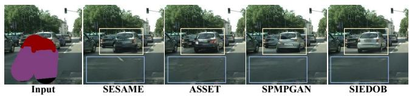  
Figure 1. Existing methods struggle to deal with the compound of backgrounds and several overlapping objects in a complex scene. They generate distorted objects and texturally inconsistent backgrounds. The proposed method can cope well with this input.

When image editing experts deal with a complex task, they decompose the input image into multiple independent and disparate elements and handle them with different skills. For example, when editing a photo with a congested road, they process the cars and pedestrians individually and then fill in the background. Inspired by this spirit, we propose a heterogeneous editing model, which mimics the experience of human experts and explicitly splits the compound content into two distinct components: Backgrounds and objects. The background has no regular shape and may span a large area. More importantly, the re-generated background’s texture and the existing area must be consistent. Foregrounds objects are class-specific and appear anywhere with various scales. Due to the significant differences between the two components, it is necessary to disentangle them from the input and process them with different networks.

Several recent works [23, 28, 32] have been dedicated to this task. SESAME [32] proposes a new pair of generator and discriminator based on the cGAN framework [31], which generates edited content through a single-shot inference. ASSET [23] builds a transformer-based architecture with a sparse attention mechanism and synthesizes edited regions relying on a codebook generated by VQ-GAN [4]. SPMPGAN [28] proposes a coarse-to-fine generator equipped with style-preserved modulation layers to retain style consistency between edited regions and context. These methods effectively enhance the ability of a monolithic model to handle the entire input. However, they deal with backgrounds and objects equally using the same generator, which causes them to produce inferior results. Figure 1 demonstrates an example. To tackle this limitation, we present a novel framework, Semantic Image Editing by Disentangling Object and Background (SIEDOB), to generate backgrounds and foreground objects separately, which can achieve two goals: Synthesizing texture-consistent backgrounds and generating photorealistic and diverse objects.

SIEDOB first disassembles the edited image into background regions and instance-level objects, then employs different generators to synthesize the corresponding content, and finally aggregates generated objects with backgrounds via a fusion network. In this way, we decouple our task into several more feasible subtasks and handle different components using dedicated sub-models.

Generating texture-consistent backgrounds with known context is not trivial since backgrounds may cross a sizeable spatial area in an image and have no regular shape. We propose a pair of boosted generator and discriminator to address this problem. Specifically, we propose Semantic-Aware Self-Propagation Module (SASPM) to help the generator efficiently transfer the semantic-wise features of known regions to generated regions. Moreover, to further enhance texture consistency, we design a Boundary-Anchored Patch Discriminator to force the generator to pay more attention to local textures of editing fringe.

In our task, depending on the scenario, the edited object may be requested to be inpainted or generated. If an object is partially visible, it undergoes a lightweight inpainting network. Otherwise, we employ a Style-Diversity Object Generator to obtain multi-modal results based on a style bank. After generating the backgrounds and all objects, we re-integrate them into a whole. However, the separate generation may lead to sudden boundaries and dissonance between objects and surroundings. To tackle this problem, we utilize a simple fusion network that predicts the residual value for each pixel to harmonize outputs.

Our main contributions can be summarized as follows:

• We propose a new solution for semantic image editing, named SIEDOB, which can handle complex scenes by decoupling the generation of backgrounds and objects.

• We propose a Style-Diversity Object Generator that can generate diverse and realistic object images from masks.

• Extensive experiments on two benchmarks indicate that our method can generate texture-consistent results and deal with crowded objects well.

## 2. Related Works

## 2.1. Semantic Image Editing

Semantic image editing refers to modifying a given image by manipulating a corresponding segmentation map and keeping the context coherent. This approach provides powerful editing capabilities, such as adding and removing objects, modifying shapes, and re-painting backgrounds. Compared to several related tasks, including semantic image synthesis [14, 33, 40, 42, 51] and image inpainting [13, 30, 45, 46, 48], semantic image editing has not been fully exploited due to its difficulty in generating realistic objects and texture-consistent backgrounds simultaneously. A few recent works are devoted to semantic image editing [10,23,28,32]. HIM [10] is an early exploration that only operates on a single object using a two-stage network. SESAME [32] introduces a new pair of generators and discriminators to improve the quality of the generated results. Moreover, SESAME adopts a more flexible workflow that can respond to various image editing requirements of users. ASSET [23] proposes a novel transformer-based approach modeling long-range dependencies, enabling highresolution image editing. SPMPGAN [28] presents a stylepreserved modulation technique and builds a progressive architecture that solves the style inconsistency problem in semantic image editing. These methods all consider semantic image editing as a global generation problem. Thus, they use a single model to process all elements of the edited image equally. In this work, we propose a decoupled framework to handle objects and backgrounds separately using heterogeneous generators, demonstrating more promising results.

## 2.2. Image Synthesis via Heterogeneous Generators

For a wide variety of image generation tasks, most approaches impose monolithic generators on the entire image, including unsupervised image generation [17, 18, 35], image-to-image translation [29, 33, 42, 51], image inpainting [24, 45, 46], and image editing [15, 26]. They share the same network structure and weights to generate all the content without specialized submodels for different semantic regions or classes. Other methods use different architectures or weights to generate different image elements to improve generation quality for different components. For example, they employ multiple local branches specialized • We propose Semantic-Aware Self-Propagation Module and Boundary-Anchored Patch Discriminator to facilitate texture-consistent background generation.

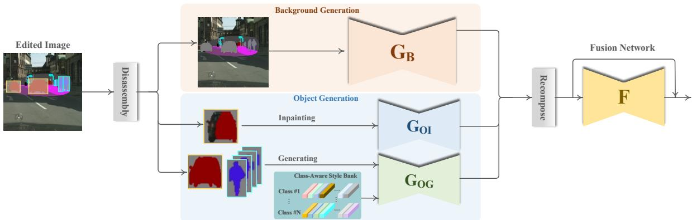  
Figure 2. Overview of the proposed method. To reduce the complexity of modeling the entire edited region, we use a heterogeneous model to synthesize foreground objects and backgrounds separately, which contains three components: (1) Background generation, (2) object generation, (3) fusion network.

for different parts [6, 9, 11, 21], decoupling content and style [12, 20, 27], generating foreground and a single foreground object separately [39, 43], enhancing local generation [1,37], or having separate modules for different semantic categories [22, 40]. However, these methods are developed for pure image generation or translation tasks where their input is noises, categories, segmentation maps, or full images. Therefore, they only need to synthesize simple but visually plausible results to fool the discriminator. Semantic image editing is a more challenging task, and its difficulty lies in keeping coherence between edited and known regions. In this paper, we propose a heterogeneous framework that utilizes different sub-models for foreground objects and backgrounds to improve their generation quality concurrently.

## 3. Proposed Method

Our goal is to edit a given image $I \in \mathbb { R } ^ { H \times W \times 3 }$ guided by a user-provided segmentation map $S \in \mathbb { L } ^ { H \times W \times L }$ within an edited region defined by a mask map $M \in \mathbb { B } ^ { H \times W \times 1 }$ whose value is 0 in the non-edited region and 1 in the edited region. Here H, W, and L denote the height, width, and number of semantic categories, respectively. The edited region of I is erased as input $I _ { e } = I \times ( 1 - M )$ . We create a background mask $M _ { B }$ and all instance-level object masks $\{ M _ { c } ^ { q } \}$ in the edited region based on the segmentation map. Here, $c \in { \mathcal { C } } , { \mathcal { C } }$ is a pre-defined set of considered foreground categories, and 1M9 $M _ { c } ^ { q }$ is the q-th instance that falls into the category c. The background mask $M _ { B }$ is composed of the remaining pixels. Thus, we can disassemble the input image $I _ { e }$ to the background and objects according to $M _ { B }$ and $\{ M _ { c } ^ { q } \}$ . Then we generate the background and objects separately using the respective generators. Finally, we integrate all generated content via a fusion network. The workflow is depicted in Figure 2.

## 3.1. Background Generation

For image editing, the background usually needs to be partially generated to fill the space, such as sky or ground. Therefore, generating style-consistent texture patterns in edited regions is critical and challenging since the generated background and the known region coexist. In addition, an image’s background may be across a distant spatial distance and have no regular shape. Efficiently and accurately transferring feature styles from known to edited regions is vital for generating texture-consistent results. To this end, we propose a Semantic-Aware Self-Propagation Module (SASPM), which explicitly extracts semantic-wise feature codes from feature maps and propagates them to the corresponding regions at the same layer. Furthermore, we employ a Boundary-Anchored Patch Discriminator to enforce the generator to focus on local textures at the editing boundary.

The proposed background generator $G _ { B }$ is shown in 3(c). We feed the disassembled background region into $G _ { B }$ as the input: ${ \cal I } _ { B } \ = \ { \cal I } _ { e } \times \ M _ { B } . G _ { B }$ follows an encoderdecoder structure. The encoder is composed of several successive GatedConv layers [46] with stride two, and the decoder contains corresponding GatedConv layers with upsampling and several SASPM.

## Semantic-Aware Self-Propagation Modules (SASPM)

SASPM aims at propagating features of known regions to edited regions in a semantic-aware manner. Taking the sky area as an example shown in Figure 3(a)(b), a SASPM is divided into two steps. First, we extract the semanticaware feature code by computing the average of the known sky area. Then, the feature code is broadcast into the entire sky area according to the corresponding semantic mask. SASPM can transfer the feature codes of each semantic label at the same feature level without the constraint of the receptive field. Formally, let $F \in \mathbb { R } ^ { H \times W \times C }$ denote a feature map in front of a SASPM. H, W are the spatial dimension and $C$ is the number of channels. Let $\bar { U _ { \mathbf { \lambda } } } \in \mathbb { R } ^ { L \times C }$ represent L feature codes extracted from the known region, and the feature codes of non-background classes are set to zero. We generate a code map $P$ based on the segmentation map $S \in \overline { { \mathbb { L } ^ { H \times W \times L } } }$ through a matrix multiplication to spatially broadcast the feature codes into the corresponding semantic region:

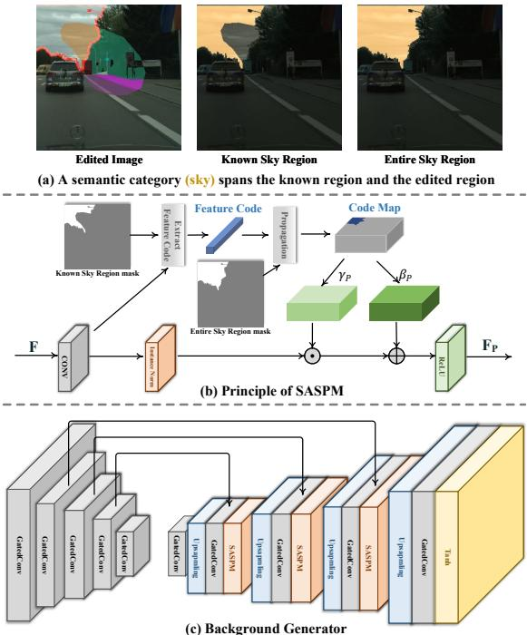  
Figure 3. (a) A background category, such as sky, may span known and edited regions. We want to transfer the features from the known region to the generated region in a semantic-aware fashion. (b) The principle of SASPM. We extract the feature code for each background category from the known region and then propagate it to the entire region. (c) The architecture of our background generator.

$$
P = S \otimes U\tag{1}
$$

Thus, $P \in \mathbb { R } ^ { H \times W \times C }$ is restored to the spatial dimension filled with the category-specific feature codes. Finally, we propagate P into the original F using a modulation operation following SPADE [33]. Specifically, we learn two parameters $\gamma _ { P } \in \mathbb { R } ^ { H \times W \times C }$ and $\mathbf { \bar { \rho } } _ { \beta _ { P } } \in \mathbb { R } ^ { \mathbf { \bar { H } } \times W \times C }$ from $P$ to modulate $F \colon$

$$
F _ { P } = R e L U \left( \gamma _ { P } \odot I N ( C o n v ( F ) ) \oplus \beta _ { P } \right)\tag{2}
$$

Where Conv(·), $I N ( \cdot )$ , and $R e L U ( \cdot )$ denote Convolutional Layer, Instance Normalization, and ReLU activation function, respectively. ⊙ and ⊕ are element-wise multiplication and addition.

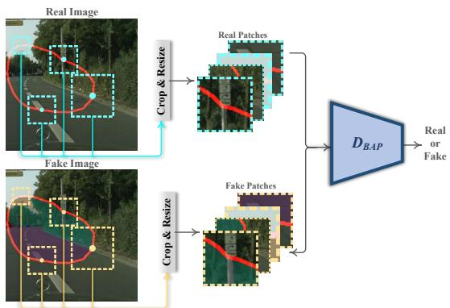  
Figure 4. Boundary-Anchored Patch Discriminator $D _ { B A P }$ takes in four real image patches or fake image patches of random size. All patches are centered on the boundary of the edited region enclosed by the red line.

## Boundary-Anchored Patch Discriminator

We employ two discriminators for our background generator: (1) A global discriminator used by previous works [28]; (2) a novel Boundary-Anchored Patch Discriminator $D _ { B A P }$ . We introduce $D _ { B A P }$ to enforce the generator to pay attention to local texture across the fringe of the edited area. We expect $D _ { B A P }$ can capture known and generated textures simultaneously to facilitate texture-consistent results. To this end, we randomly select several central points anchored on the boundary of the edited region to crop patches from real or generated images, as shown in Figure 4. Thus, the fake patches contain both real and fake textures, so $D _ { B A P }$ can distinguish between true and false through texture consistency.

The training objective of $G _ { B }$ is comprised of L1 Distance Loss $\mathcal { L } _ { 1 }$ , Perceptual Loss LP [16], Global Adversarial Loss $\mathcal { L } _ { G A N } ^ { G }$ , and Local Patch Adversarial Loss $\mathcal { L } _ { G A N } ^ { L } \mathrm { . }$

$$
\mathcal { L } _ { B } = \mathcal { L } _ { 1 } + \lambda _ { P B } \mathcal { L } _ { \mathrm { P } } + \mathcal { L } _ { G A N } ^ { G } + \lambda _ { G A N } ^ { L } \mathcal { L } _ { G A N } ^ { L }\tag{3}
$$

Where $\mathcal { L } _ { 1 }$ and ${ \mathcal { L } } _ { \mathrm { P } }$ force the generated results to be closer to the ground truth in RGB space and VGG space [38]. $\mathcal { L } _ { G A N } ^ { G }$ and $\mathcal { L } _ { G A N } ^ { L }$ are applied to global images and local patches, respectively. All adversarial losses in this work are associated with a SNPatchGAN Discriminator [46] using the hinge version [2].

## 3.2. Object Generation

Our task involves dealing with two scenarios: Inpainting or generating an objectÐthe former aims at completing an object based on its visible part. The latter synthesizes an inexistent object from its mask with an arbitrary appearance. Unlike handling all objects at once, cropping each edited object and independently generating them allows us to use aligned input images with the same size, which is beneficial for generating high-quality results. Specifically, we crop all objects $\{ C r o p ( I _ { e } ) _ { c } ^ { q } \}$ from the edited region based on object masks $\{ M _ { c } ^ { q } \}$ . We leverage a twoway model to handle the different scenarios. One way is a lightweight inpainting network $G _ { O I }$ to complete objects. $G _ { O I }$ is a UNet-like [36] network and its training objective is: ${ \mathcal { L } } _ { G I } = { \mathcal { L } } _ { 1 } + \lambda _ { P I } { \mathcal { L } } _ { \mathrm { P } } + { \mathcal { L } } _ { G A N } . ~ { \mathcal { L } } _ { 1 } , { \mathcal { L } } _ { \mathrm { P } } $ , and $\mathcal { L } _ { G A N }$ are the same as the terms in Equation 6. The other way is the proposed Style-Diversity Object Generator $G _ { O G }$ for the multi-modal generation. Note that all categories of objects share $G _ { O I }$ and $G _ { O G }$

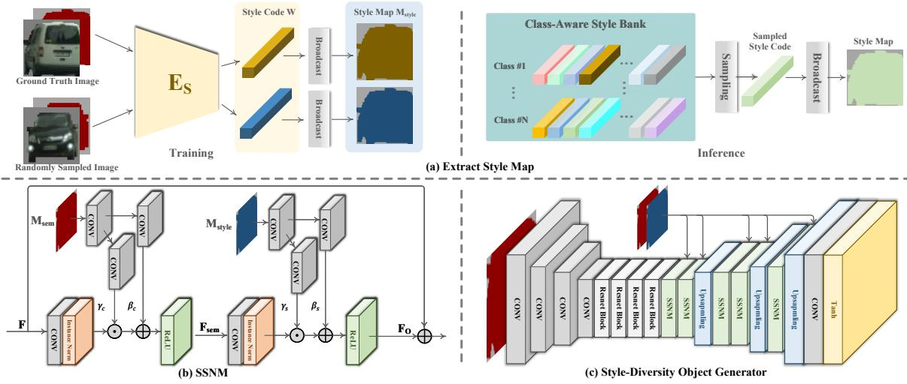  
Figure 5. (a) How to extract style maps? During training, we extract their style codes from ground truth images or randomly sampled images and then generate style maps by broadcasting. During inference, we sample a class-specific style code directly from the style bank. (b) The structure of Semantic-Style Normalization Module (SSNM). (c) We build a Style-Diversity Object Generator equipped with SSNM.

## Style-Diversity Object Generator

GOG generates a class-specific image from a one-hot segmentation map $M _ { s e m } \in \mathbf { \bar { L } } ^ { H \times W \times K }$ created by the corresponding object mask $M _ { c } ^ { q }$ . K is the number of the predefined foreground class set. Motivated by disentanglement learning [12, 20, 27], we utilize style information to control the appearance of results for muti-modal generation. Specifically, we sample an image from the training set with the same class label and extract its style code $\bar { W } \in \mathbb { R } ^ { 1 2 8 }$ by a style encoder $E _ { s }$ Then we generate a style map $\dot { M } _ { s t y l e } \in \mathbb { R } ^ { H \times W \times 1 2 8 }$ via broadcasting the style code according to $M _ { c } ^ { q }$ , as illustrated in Figure 5(a). At this point, we have acquired a semantic map $M _ { s e m }$ and a style map $M _ { s t y l e }$ The next is how to decode them back to a stylecontrolled object image. To this end, we design a Semantic-Style Normalization Module (SSNM) to integrate the style and semantic information, as shown in Figure 5(b). We first inject the semantic information into the input feature maps $\dot { F } \in \mathbb { R } ^ { H \times W \times C }$

$$
F _ { s e m } = R e L U \left( \gamma _ { c } \odot I N ( C o n v ( F ) ) \oplus \beta _ { c } \right)\tag{4}
$$

Where two normalization parameters, $\gamma _ { c } \in \mathbb { R } ^ { H \times W \times C }$ and $\beta _ { c } ~ \in ~ \mathbb { R } ^ { H \times W \times C }$ are learned from $M _ { s e m }$ . Similarly, the style information is injected by:

$$
F _ { O } = R e L U \left( \gamma _ { s } \odot I N ( C o n v ( F _ { s e m } ) ) \oplus \beta _ { s } \right)\tag{5}
$$

Where two normalization parameters $\gamma _ { s } \in \mathbb { R } ^ { H \times W \times C }$ and $\beta _ { s } \in \mathbb { R } ^ { H \times W \times C }$ are learned from $M _ { s t y l e }$

During training, for each sample, we take the ground truth image $I ^ { g t }$ and a randomly sampled image $I ^ { s }$ as the style images to generate two results $R ^ { g t }$ and $R ^ { s }$ . We employ the following objective function to optimize $G _ { O G } \mathrm { : }$

$$
\mathcal { L } _ { G O } = \mathcal { L } _ { 1 } + \lambda _ { P O } \mathcal { L } _ { \mathrm { P } } + \mathcal { L } _ { G A N } + \mathcal { L } _ { \mathrm { S C C } }\tag{6}
$$

Here, $\mathcal { L } _ { 1 }$ is only applied to $R ^ { g t }$ $\mathcal { L } _ { \mathrm { P } } , \mathcal { L } _ { G A N } .$ , and $\mathcal { L } _ { \mathrm { S C C } }$ are imposed on all results. We introduce Style Cycle-Consistency Loss $\mathcal { L } _ { \mathrm { S C C } }$ to force the generator to produce style-consistent results with style images.

$$
\mathcal { L } _ { S C C } = 1 - \cos \left( \frac { E _ { S } ^ { \prime } ( R ) } { \left\| E _ { S } ^ { \prime } ( R ) \right\| _ { 2 } } , \frac { E _ { s } ^ { \prime } \left( I ^ { s t y l e } \right) } { \left\| E _ { S } ^ { \prime } \left( I ^ { s t y l e } \right) \right\| _ { 2 } } \right)\tag{7}
$$

Where $I ^ { s t y l e }$ is the style image and R is the generated result. $E _ { s } ^ { \prime } ( \cdot )$ is a style encoder with the same structure as $E _ { s } .$ $\cos ( \cdot , \cdot )$ represents the cosine similarity of two vectors.

Previous image translation methods [12, 20] achieve multi-modal generation by adding Gaussian noise during inference. We find that noise leads to low-quality results and limited diversity. To solve this problem, we replace the noise with a style bank. Precisely, once training is done, we extract all style codes from the training set by the trained $E _ { s }$ and save them for building a class-aware style bank. During inference, we randomly sample different style codes from the style bank to generate different results. It is worth mentioning that our approach does not increase any additional computational overhead compared to adding noise.

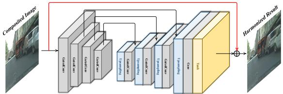  
Figure 6. Structure of Fusion Network. The red line indicates the skip connection.

## 3.3. Fusion Network

After generating all backgrounds and objects, we embed them into their original positions to obtain a composited image. However, this preliminary result may be discordant since each object is generated independently without accounting for context. We employ a fusion network F to harmonize the objects with the surroundings, as shown in Figure 6. F learns an offset value for each pixel via a skip connection [7, 36] to produce the final results. We use Perceptual Loss and Adversarial Loss to optimize F:

$$
\mathcal { L } _ { F } = \lambda _ { P F } \mathcal { L } _ { \mathrm { P } } + \mathcal { L } _ { G A N }\tag{8}
$$

## 4. Experiments

Datasets. We conduct experiments on two datasets, Cityscapes and ADE20K-Room, used in [28, 32]. Cityscapes [3] contains complex street scene images in German cities. ADE20K-Room is a subset of ADE20K [50] consisting of indoor scene images. We train and test our model at $2 5 6 \times 2 5 6$ resolution.

Implementation Details. We use free-form, extension, and outpainting masks following [28]. Similar to the previous work [22], we choose those frequently-appearing categories as the foreground class set, (car, person) for Cityscapes and (bed, chest, lamp, chair, table) for ADE20K-Room. All sub-networks are independently trained using ADAM optimizers [19] for both the generator and the discriminators with momentum $\beta _ { 1 } = 0 . 5$ and $\beta _ { 2 } = 0 . 9 9 9$ , and the learning rates for the generator and the discriminators are set to 0.0001 and 0.0004, respectively. For training $D _ { B A P }$ we randomly crop 4 square patches with the size ranging from $9 6 \times 9 6$ to $1 6 0 \times 1 6 0$ . We set balance coefficients:

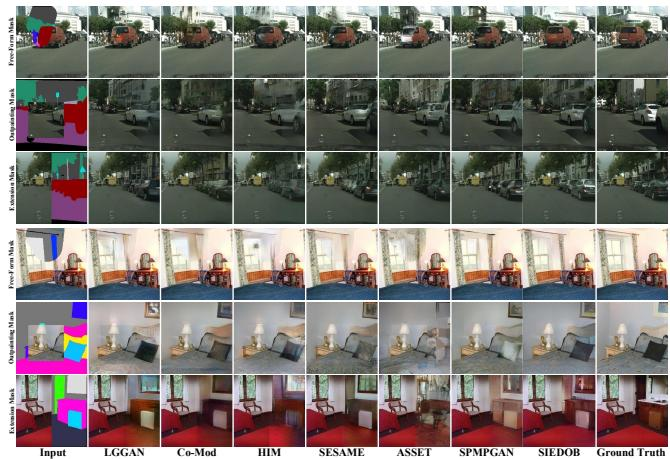  
Figure 7. Visual comparisons with state-of-the-art methods. Our method is effective in generating texture-consistent backgrounds and photo-realistic objects.

$\lambda _ { P B } = \lambda _ { P I } = \lambda _ { P O } = \lambda _ { P F } = 1 0$ and $\lambda _ { G A N } ^ { L } = 0 . 2$ . The proposed method is implemented with Pytorch 1.10 [34], and all experiments are performed on a single NVIDIA RTX 3090 GPU.

Baselines. We compare the proposed methods with the state-of-the-art semantic image editing methods, including HIM [10], SESAME [32], ASSET [23], SPMPGAN [28]. We also introduce two additional methods [40, 48] as baselines to investigate related work more widely. LGGAN [40] learns a map from segmentation maps to photo-realistic images using global image-level and class-specific generators. Co-Mod [48] demonstrates impressive results in semantic image generation and image inpainting. We change their input to be the same as our task.

## 4.1. Qualitative evaluation

We demonstrate a visual comparison of the competing methods, as shown in Figure 7. We observe that the results produced by the proposed SIEDOB are visually better than existing methods in two aspects: (1) Our method can well handle dense objects overlapping each other, e.g., in the second and third rows. However, other methods produce distorted and inseparable results. (2) Our method generate texture-consistent content between edited regions and known regions both on background and objects, e.g., the red cars in the first row and the curtain in the fourth row. The performance improvement benefits from our disentangling generation strategy and carefully designed sub-networks.

## 4.2. Quantitative evaluation

Table 1 lists the quantitative results with three different mask types. Following previous works, we use three metrics: FID [8], LPIPS [47], and mean Intersection-over-Union (mIoU). FID is introduced to assess the fidelity of the results by computing the Wasserstein-2 distance between the distributions of the synthesized and real images. LPIPS evaluates the similarity between the generated image and the ground truth in a pairwise manner. mIoU measures the alignment of semantic labels between the generated results and input segmentation maps. We use solid models to obtain segmentation maps: HRNet [41] for ADE20K-Room, and DRN-D-105 [44] for Cityscapes. Our method outperforms the other methods under different metrics and mask settings.

<table><tr><td rowspan="2"></td><td rowspan="2">M. Method</td><td colspan="3">Cityscapes</td><td colspan="3">ADE20K-Room</td></tr><tr><td>FID↓</td><td>LPIPS↓</td><td>mIoU↑</td><td>FID↓</td><td>LPIPS↓</td><td>mIoU↑</td></tr><tr><td rowspan="8">F.</td><td>LGGAN</td><td>15.29</td><td>0.094</td><td>58.62</td><td>24.74</td><td>0.097</td><td>27.68</td></tr><tr><td>Co-Mod</td><td>15.88</td><td>0.097</td><td>56.50</td><td>27.37</td><td>0.111</td><td>27.52</td></tr><tr><td>HIM</td><td>15.58</td><td>0.093</td><td>58.99</td><td>28.64</td><td>0.133</td><td>28.04</td></tr><tr><td>SESAME</td><td>12.89</td><td>0.082</td><td>58.88</td><td>21.73</td><td>0.101</td><td>27.50</td></tr><tr><td>ASSET</td><td>13.67</td><td>0.098</td><td>58.12</td><td>30.63</td><td>0.126</td><td>26.02</td></tr><tr><td>SPMPGAN</td><td>11.90</td><td>0.084</td><td>58.80</td><td>18.83</td><td>0.090</td><td>28.22</td></tr><tr><td>SIEDOB</td><td>11.07</td><td>0.077</td><td>59.41</td><td>17.61</td><td>0.089</td><td>29.72</td></tr><tr><td>LGGAN</td><td>26.01</td><td>0.175</td><td>58.37</td><td>37.09</td><td>0.213</td><td>27.91</td></tr><tr><td rowspan="7">E.</td><td>Co-Mod</td><td>29.27</td><td>0.188</td><td>56.44</td><td>38.61</td><td>0.231</td><td>27.13</td></tr><tr><td>HIM</td><td>25.20</td><td>0.180</td><td>58.91</td><td>40.69</td><td>0.239</td><td>27.61</td></tr><tr><td>SESAME</td><td>20.30</td><td>0.168</td><td>59.08</td><td>36.43</td><td>0.211</td><td>27.62</td></tr><tr><td>ASSET</td><td>21.99</td><td>0.186</td><td>58.01</td><td>38.17</td><td>0.261</td><td>27.03</td></tr><tr><td>SPMPGAN</td><td>19.46</td><td>0.167</td><td>59.10</td><td>32.92</td><td>0.199</td><td></td></tr><tr><td>SIEDOB</td><td>19.20</td><td>0.159</td><td>59.63</td><td>31.66</td><td>0.191</td><td>27.73 29.52</td></tr><tr><td></td><td></td><td></td><td></td><td></td><td></td><td></td></tr><tr><td rowspan="8">0.</td><td>LGGAN</td><td>39.12</td><td>0.254</td><td>58.77</td><td>49.07</td><td>0.334</td><td>27.69</td></tr><tr><td>Co-Mod</td><td>50.29</td><td>0.264</td><td>55.39</td><td>51.45</td><td>0.325</td><td>26.54</td></tr><tr><td>HIM</td><td>36.27</td><td>0.252</td><td>58.99</td><td>54.51</td><td>0.337</td><td>28.19</td></tr><tr><td>SESAME</td><td>28.27</td><td>0.237</td><td>58.75</td><td>47.72</td><td>0.305</td><td>27.40</td></tr><tr><td>ASSET</td><td>30.60</td><td>0.240</td><td>58.91</td><td>57.28</td><td>0.331</td><td>27.18</td></tr><tr><td>SPMPGAN</td><td>27.63</td><td>0.233</td><td>58.53</td><td>41.52</td><td>0.288</td><td>27.85</td></tr><tr><td>SIEDOB</td><td>27.90</td><td>0.221</td><td>59.37</td><td>41.07</td><td>0.275</td><td>28.94</td></tr></table>

Table 1. Quantitative comparison with other methods. M., F., E., and O. represent Mask Type, Free-Form Mask, Extension Mask, and Outpainting Mask, respectively. (↑: Higher is better; ↓: Lower is better)  
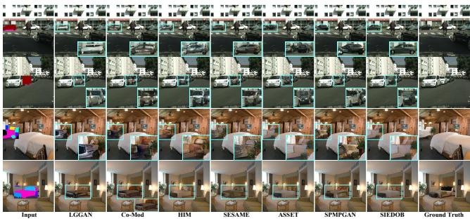  
Figure 8. Visual results of addition objects.

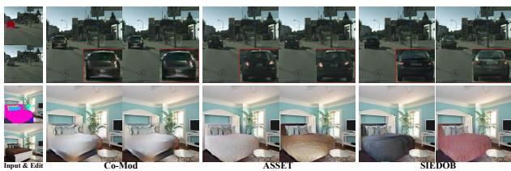  
Figure 9. Multi-modal generation results.

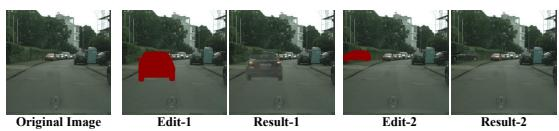  
Figure 10. Out-of-distribution editing. Our method can add cars in the middle of the road or on the sidewalk, which do not exist in the training dataset.

<table><tr><td rowspan="2"></td><td colspan="4">Cityscapes</td><td colspan="4">ADE20K-Room</td></tr><tr><td>FID↓</td><td>LPIPS↓</td><td>mIoU↑</td><td>Div↑</td><td>FID↓</td><td>LPIPS↓</td><td>mIoU↑</td><td>Div↑</td></tr><tr><td>LGGAN</td><td>7.69</td><td>0.027</td><td>57.01</td><td></td><td>24.49</td><td>0.171</td><td>30.05</td><td></td></tr><tr><td>Co-Mod</td><td>7.79</td><td>0.029</td><td>56.29</td><td>0.0030</td><td>21.09</td><td>0.118</td><td>30.63</td><td>0.0145</td></tr><tr><td>HIM</td><td>6.92</td><td>0.028</td><td>58.71</td><td>-</td><td>29.10</td><td>0.232</td><td>30.58</td><td>-</td></tr><tr><td>SESAME</td><td>6.67</td><td>0.024</td><td>58.79</td><td>-</td><td>18.01</td><td>0.117</td><td>30.89</td><td>-</td></tr><tr><td>ASSET</td><td>6.74</td><td>0.025</td><td>56.02</td><td>0.0052</td><td>27.68</td><td>0.209</td><td>29.79</td><td>0.0337</td></tr><tr><td>SPMPGAN</td><td>6.59</td><td>0.021</td><td>58.60</td><td></td><td>17.21</td><td>0.115</td><td>30.58</td><td></td></tr><tr><td>SIEDOB</td><td>6.29</td><td>0.020</td><td>58.88</td><td>0.0055</td><td>16.32</td><td>0.110</td><td>31.04</td><td>0.0362</td></tr></table>

Table 2. Quantitative results of object addition.
<table><tr><td></td><td colspan="3">Cityscapes</td><td colspan="3">ADE20K-Room</td></tr><tr><td></td><td>FID↓</td><td>LPIPS↓</td><td>mIoU↑</td><td>FID↓</td><td>LPIPS↓</td><td>mIoU↑</td></tr><tr><td>w/o SASPM</td><td>14.11</td><td>0.085</td><td>59.43</td><td>20.03</td><td>0.091</td><td>29.02</td></tr><tr><td>w/o DBAP</td><td>12.68</td><td>0.081</td><td>59.49</td><td>19.14</td><td>0.083</td><td>29.21</td></tr><tr><td>Full model</td><td>12.15</td><td>0.079</td><td>59.51</td><td>18.72</td><td>0.081</td><td>29.30</td></tr></table>

Table 3. Quantitative study on SASPM and $D _ { B A P } .$

## 4.3. Addition Object

Adding a new object to the given image is an essential ability of semantic image editing. The visual results are shown in Figure 8. In this experiment, we randomly select an instance of each test image and create a rectangular mask encircling the object. The proposed method can generate realistic objects with crisp edges. Adding an object to the edited area that does not exist originally should have diverse results. Some previous methods [23,48] have multimodal generation capabilities. We sample two results from all methods, as shown in Figure 9. Our method achieves a higher diversity than other models because the previous methods only exert a global influence on the generation process; in contrast, our model independently generates each object using different class-aware style codes. The quantitative results listed in Table 2 also indicate the superiority of our method. Here, the Diversity score (Div) is calculated as the average LPIPS distance between pairs of randomly sampled results for all test images, as also done in [25, 49]. Moreover, our model can hallucinate images that do not exist in the dataset’s distribution, as shown in Figure 10.

## 4.4. Ablation Study

Effectiveness of SASPM and Boundary-Anchored Patch Discriminator. We investigate the contributions of the proposed SASPM and $D _ { B A P }$ to the generation of textureconsistent background. To exclude the interference of the foreground, we create mask maps that only include background regions in this study. We remove all SASPM (ºw/o SASPMº) or $D _ { B A P }$ (ºw/o $D _ { B A P } \ " )$ from our model as two baselines. The visual results are shown in Figure 11 and prove that SASPM and $D _ { B A P }$ can help the background generator effectively alleviate texture inconsistencies. Vanilla convolutional layers have limited receptive fields and no ability to locate where edited or known regions are. SASPM explicitly transfers features from known regions to edited regions with the same semantic labels across distant spatial distances. $D _ { B A P }$ forces the generator to pay more attention to local textures on editing boundaries rather than just global images. Quantitative results are listed in Table 3.

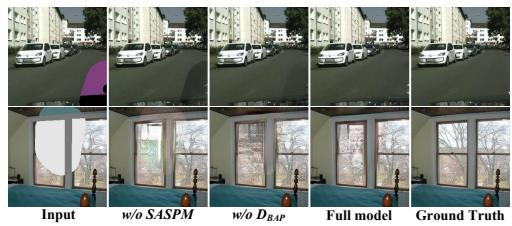  
Figure 11. Ablation analysis on SASPM and $D _ { B A P }$ for synthesizing texture-consistent backgrounds.

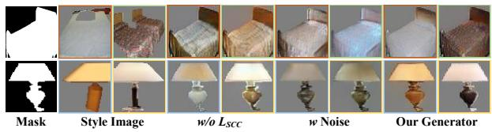  
Figure 12. Ablation study of object generation.

Effectiveness of Style-Diversity Object Generator. To verify the benefit of $\mathcal { L } _ { \mathrm { S C C } }$ and the style bank, we set up two baselines: (1) Dropping out $\mathcal { L } _ { \mathrm { S C C } }$ (ºw/o $\mathcal { L } _ { \mathrm { S C C } } " )$ . (2) Replacing the style codes with noise vectors (ºw Noiseº). Figure 12 shows some visual results. If we drop out LSCC, the generated image’s style may not be consistent with the style image. If we produce multi-modal results by injecting noise, it leads to a loss of fidelity and diversity. This is because Gaussian noise is semantics-free, while style code is category-specific and provides controllability. The quantitative results are listed in Table 4.

Effectiveness of Separate Generation. We remove the object generator and the fusion network but keep other components unchanged to obtain a baseline (w/o Separation) and increase its channel number for a fair comparison. Qualitative and quantitative comparisons can be found in Figure 13 and Table 5, respectively. In this experiment, we employ the masks used in object addition. The visual comparison shows that the separate generation paradigm significantly improves performance for objects with complicated surroundings.

Effectiveness of Fusion Network. Fusion network can eliminate abrupt boundaries between generated objects and backgrounds. Removing the fusion network (w/o Fusion) or not using the skip connection (w/o Skip) will degrade the performance, which are qualitatively and quantitatively demonstrated in Figure 13 and Table 5.

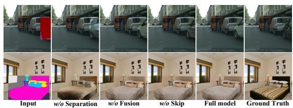  
Figure 13. Visual analysis on disentangled generation and fusion network.

<table><tr><td rowspan="2">class</td><td colspan="2">w/o Lscc</td><td colspan="2">w Noise</td><td colspan="2">GOG</td></tr><tr><td>FID↓</td><td>Div↑</td><td>FID↓</td><td>Div↑</td><td>FID↓</td><td>Div↑</td></tr><tr><td>car</td><td>123.82</td><td>0.103</td><td>173.57</td><td>0.090</td><td>118.32</td><td>0.115</td></tr><tr><td>person</td><td>238.10</td><td>0.079</td><td>307.11</td><td>0.052</td><td>219.20</td><td>0.098</td></tr><tr><td>bed</td><td>227.18</td><td>0.303</td><td>395.33</td><td>0.210</td><td>239.78</td><td>0.372</td></tr><tr><td>chest</td><td>192.12</td><td>0.217</td><td>273.10</td><td>0.113</td><td>149.29</td><td>0.229</td></tr><tr><td>lamp</td><td>121.01</td><td>0.195</td><td>153.94</td><td>0.129</td><td>112.50</td><td>0.218</td></tr><tr><td>chair</td><td>168.01</td><td>0.274</td><td>207.35</td><td>0.177</td><td>163.14</td><td>0.289</td></tr><tr><td>table</td><td>211.39</td><td>0.141</td><td>289.55</td><td>0.091</td><td>201.32</td><td>0.143</td></tr></table>

Table 4. Quantitative results of different objects.
<table><tr><td rowspan="2"></td><td colspan="3">Cityscapes</td><td colspan="3">ADE20K-Room</td></tr><tr><td>FID↓</td><td>LPIPS↓</td><td>mIoU↑</td><td>FID↓</td><td>LPIPS↓</td><td>mIoU↑</td></tr><tr><td>w/o Separation</td><td>6.78</td><td>0.029</td><td>56.43</td><td>21.97</td><td>0.180</td><td>30.32</td></tr><tr><td>w/o Fusion</td><td>6.73</td><td>0.027</td><td>58.68</td><td>19.19</td><td>0.131</td><td>30.80</td></tr><tr><td>w/o Skip</td><td>6.41</td><td>0.022</td><td>58.76</td><td>17.89</td><td>0.118</td><td>30.96</td></tr><tr><td>Full model</td><td>6.29</td><td>0.020</td><td>58.88</td><td>16.32</td><td>0.110</td><td>31.04</td></tr></table>

Table 5. Quantitative studies of separate generation paradigm and fusion network.

## 5. Conclusion and Limitations

This paper proposes a novel paradigm for semantic image editing, named SIEDOB. Its core idea is that since the characteristics of foreground objects and backgrounds are dramatically different, we design a heterogeneous model to handle them separately. To this end, we present SASPM and Boundary-Anchored Patch Discriminator to facilitate the generation of texture-consistent backgrounds and employ a Style-Diversity Object Generator to produce highquality and diverse objects. Extensive experimental results demonstrate the superiority of our method. However, our method has some limitations. Some foreground categories are very rare in the dataset, so we cannot obtain enough data for training. In addition, object generation is hard to produce satisfactory results when an object is with an extreme pose or large-scale occlusion.

Acknowledgement This work is supported by State Grid Corporation of China (Grant No. 5500-202011091A-0-0- 00).

## References

[1] Deblina Bhattacharjee, Seungryong Kim, Guillaume Vizier, and Mathieu Salzmann. Dunit: Detection-based unsupervised image-to-image translation. In Proceedings of the IEEE/CVF Conference on Computer Vision and Pattern Recognition, pages 4787±4796, 2020. 3

[2] Andrew Brock, Jeff Donahue, and Karen Simonyan. Large scale gan training for high fidelity natural image synthesis. arXiv preprint arXiv:1809.11096, 2018. 4

[3] Marius Cordts, Mohamed Omran, Sebastian Ramos, Timo Rehfeld, Markus Enzweiler, Rodrigo Benenson, Uwe Franke, Stefan Roth, and Bernt Schiele. The cityscapes dataset for semantic urban scene understanding. In Proceedings ofthe IEEE conference on computer vision and pattern recognition, pages 3213±3223, 2016. 6

[4] Patrick Esser, Robin Rombach, and Bjorn Ommer. Taming transformers for high-resolution image synthesis. In Proceedings of the IEEE/CVF conference on computer vision and pattern recognition, pages 12873±12883, 2021. 2

[5] Ian Goodfellow, Jean Pouget-Abadie, Mehdi Mirza, Bing Xu, David Warde-Farley, Sherjil Ozair, Aaron Courville, and Yoshua Bengio. Generative adversarial nets. Advances in neural information processing systems, 27, 2014. 1

[6] Shuyang Gu, Jianmin Bao, Hao Yang, Dong Chen, Fang Wen, and Lu Yuan. Mask-guided portrait editing with conditional gans. In Proceedings of the IEEE/CVF conference on computer vision and pattern recognition, pages 3436±3445, 2019. 3

[7] Kaiming He, Xiangyu Zhang, Shaoqing Ren, and Jian Sun. Deep residual learning for image recognition. In Proceedings ofthe IEEE conference on computer vision and pattern recognition, pages 770±778, 2016. 6

[8] Martin Heusel, Hubert Ramsauer, Thomas Unterthiner, Bernhard Nessler, and Sepp Hochreiter. Gans trained by a two time-scale update rule converge to a local nash equilibrium. In Advances in Neural Information Processing Systems, pages 6626±6637, 2017. 6

[9] Tobias Hinz, Stefan Heinrich, and Stefan Wermter. Generating multiple objects at spatially distinct locations. arXiv preprint arXiv:1901.00686, 2019. 3

[10] Seunghoon Hong, Xinchen Yan, Thomas Huang, and Honglak Lee. Learning hierarchical semantic image manipulation through structured representations. arXiv preprint arXiv:1808.07535, 2018. 2, 6

[11] Rui Huang, Shu Zhang, Tianyu Li, and Ran He. Beyond face rotation: Global and local perception gan for photorealistic and identity preserving frontal view synthesis. In Proceedings of the IEEE international conference on computer vision, pages 2439±2448, 2017. 3

[12] Xun Huang, Ming-Yu Liu, Serge Belongie, and Jan Kautz. Multimodal unsupervised image-to-image translation. In Proceedings of the European conference on computer vision (ECCV), pages 172±189, 2018. 3, 5

[13] Satoshi Iizuka, Edgar Simo-Serra, and Hiroshi Ishikawa. Globally and locally consistent image completion. ACM Transactions on Graphics (ToG), 36(4):1±14, 2017. 2

[14] Phillip Isola, Jun-Yan Zhu, Tinghui Zhou, and Alexei A Efros. Image-to-image translation with conditional adversarial networks. In Proceedings of the IEEE conference on computer vision and pattern recognition, pages 1125±1134, 2017. 1, 2

[15] Youngjoo Jo and Jongyoul Park. Sc-fegan: Face editing generative adversarial network with user’s sketch and color. In Proceedings of the IEEE/CVF international conference on computer vision, pages 1745±1753, 2019. 2

[16] Justin Johnson, Alexandre Alahi, and Li Fei-Fei. Perceptual losses for real-time style transfer and super-resolution. In European conference on computer vision, pages 694±711. Springer, 2016. 4

[17] Tero Karras, Samuli Laine, and Timo Aila. A style-based generator architecture for generative adversarial networks. In Proceedings of the IEEE/CVF conference on computer vision and pattern recognition, pages 4401±4410, 2019. 2

[18] Tero Karras, Samuli Laine, Miika Aittala, Janne Hellsten, Jaakko Lehtinen, and Timo Aila. Analyzing and improving the image quality of stylegan. In Proceedings of the IEEE/CVF conference on computer vision and pattern recognition, pages 8110±8119, 2020. 2

[19] Diederik P Kingma and Jimmy Ba. Adam: A method for stochastic optimization. arXiv preprint arXiv:1412.6980, 2014. 6

[20] Hsin-Ying Lee, Hung-Yu Tseng, Jia-Bin Huang, Maneesh Singh, and Ming-Hsuan Yang. Diverse image-to-image translation via disentangled representations. In Proceedings ofthe European conference on computer vision (ECCV), pages 35±51, 2018. 3, 5

[21] Peipei Li, Yibo Hu, Qi Li, Ran He, and Zhenan Sun. Global and local consistent age generative adversarial networks. In 2018 24th International Conference on Pattern Recognition (ICPR), pages 1073±1078. IEEE, 2018. 3

[22] Yuheng Li, Yijun Li, Jingwan Lu, Eli Shechtman, Yong Jae Lee, and Krishna Kumar Singh. Collaging class-specific gans for semantic image synthesis. In Proceedings of the IEEE/CVF International Conference on Computer Vision, pages 14418±14427, 2021. 3, 6

[23] Difan Liu, Sandesh Shetty, Tobias Hinz, Matthew Fisher, Richard Zhang, Taesung Park, and Evangelos Kalogerakis. Asset: autoregressive semantic scene editing with transformers at high resolutions. ACM Transactions on Graphics (TOG), 41(4):1±12, 2022. 1, 2, 6, 7

[24] Guilin Liu, Fitsum A Reda, Kevin J Shih, Ting-Chun Wang, Andrew Tao, and Bryan Catanzaro. Image inpainting for irregular holes using partial convolutions. In Proceedings of the European conference on computer vision (ECCV), pages 85±100, 2018. 2

[25] Hongyu Liu, Ziyu Wan, Wei Huang, Yibing Song, Xintong Han, and Jing Liao. Pd-gan: Probabilistic diverse gan for image inpainting. In Proceedings ofthe IEEE/CVF Conference on Computer Vision and Pattern Recognition, pages 9371± 9381, 2021. 7

[26] Hongyu Liu, Ziyu Wan, Wei Huang, Yibing Song, Xintong Han, Jing Liao, Bin Jiang, and Wei Liu. Deflocnet: Deep image editing via flexible low-level controls. In Proceedings of

the IEEE/CVF Conference on Computer Vision and Pattern Recognition, pages 10765±10774, 2021. 2

[27] Ming-Yu Liu, Xun Huang, Arun Mallya, Tero Karras, Timo Aila, Jaakko Lehtinen, and Jan Kautz. Few-shot unsupervised image-to-image translation. In Proceedings of the IEEE/CVF international conference on computer vision, pages 10551±10560, 2019. 3, 5

[28] Wuyang Luo, Su Yang, Hong Wang, Bo Long, and Weishan Zhang. Context-consistent semantic image editing with style-preserved modulation. In European Conference on Computer Vision, pages 561±578. Springer, 2022. 1, 2, 4, 6

[29] Wuyang Luo, Su Yang, and Weishan Zhang. Photo-realistic image synthesis from lines and appearance with modular modulation. Neurocomputing, 503:81±91, 2022. 2

[30] Wuyang Luo, Su Yang, and Weishan Zhang. Referenceguided large-scale face inpainting with identity and texture control. IEEE Transactions on Circuits and Systems for Video Technology, 2023. 2

[31] Mehdi Mirza and Simon Osindero. Conditional generative adversarial nets. arXiv preprint arXiv:1411.1784, 2014. 1

[32] Evangelos Ntavelis, Andres Romero, Iason Kastanis, Luc Van Gool, and Radu Timofte. Sesame: Semantic editing of scenes by adding, manipulating or erasing objects. In European Conference on Computer Vision, pages 394±411. Springer, 2020. 1, 2, 6

[33] Taesung Park, Ming-Yu Liu, Ting-Chun Wang, and Jun-Yan Zhu. Semantic image synthesis with spatially-adaptive normalization. In Proceedings of the IEEE/CVF conference on computer vision and pattern recognition, pages 2337±2346, 2019. 2, 4

[34] Adam Paszke, Sam Gross, Francisco Massa, Adam Lerer, James Bradbury, Gregory Chanan, Trevor Killeen, Zeming Lin, Natalia Gimelshein, Luca Antiga, et al. Pytorch: An imperative style, high-performance deep learning library. Advances in neural information processing systems, 32, 2019. 6

[35] Alec Radford, Luke Metz, and Soumith Chintala. Unsupervised representation learning with deep convolutional generative adversarial networks. arXiv preprint arXiv:1511.06434, 2015. 2

[36] Olaf Ronneberger, Philipp Fischer, and Thomas Brox. Unet: Convolutional networks for biomedical image segmentation. In International Conference on Medical image computing and computer-assisted intervention, pages 234±241. Springer, 2015. 5, 6

[37] Zhiqiang Shen, Mingyang Huang, Jianping Shi, Xiangyang Xue, and Thomas S Huang. Towards instance-level imageto-image translation. In Proceedings of the IEEE/CVF conference on computer vision and pattern recognition, pages 3683±3692, 2019. 3

[38] Karen Simonyan and Andrew Zisserman. Very deep convolutional networks for large-scale image recognition. arXiv preprint arXiv:1409.1556, 2014. 4

[39] Krishna Kumar Singh, Utkarsh Ojha, and Yong Jae Lee. Finegan: Unsupervised hierarchical disentanglement for fine-grained object generation and discovery. In Proceedings

of the IEEE/CVF conference on computer vision and pattern recognition, pages 6490±6499, 2019. 3

[40] Hao Tang, Dan Xu, Yan Yan, Philip HS Torr, and Nicu Sebe. Local class-specific and global image-level generative adversarial networks for semantic-guided scene generation. In Proceedings of the IEEE/CVF conference on computer vision and pattern recognition, pages 7870±7879, 2020. 2, 3, 6

[41] Jingdong Wang, Ke Sun, Tianheng Cheng, Borui Jiang, Chaorui Deng, Yang Zhao, Dong Liu, Yadong Mu, Mingkui Tan, Xinggang Wang, et al. Deep high-resolution representation learning for visual recognition. IEEE transactions on pattern analysis and machine intelligence, 43(10):3349± 3364, 2020. 7

[42] Ting-Chun Wang, Ming-Yu Liu, Jun-Yan Zhu, Andrew Tao, Jan Kautz, and Bryan Catanzaro. High-resolution image synthesis and semantic manipulation with conditional gans. In Proceedings of the IEEE conference on computer vision and pattern recognition, pages 8798±8807, 2018. 2

[43] Jianwei Yang, Anitha Kannan, Dhruv Batra, and Devi Parikh. Lr-gan: Layered recursive generative adversarial networks for image generation. arXiv preprint arXiv:1703.01560, 2017. 3

[44] Fisher Yu, Vladlen Koltun, and Thomas Funkhouser. Dilated residual networks. In Proceedings of the IEEE conference on computer vision and pattern recognition, pages 472±480, 2017. 7

[45] Jiahui Yu, Zhe Lin, Jimei Yang, Xiaohui Shen, Xin Lu, and Thomas S Huang. Generative image inpainting with contextual attention. In Proceedings of the IEEE conference on computer vision and pattern recognition, pages 5505±5514, 2018. 2

[46] Jiahui Yu, Zhe Lin, Jimei Yang, Xiaohui Shen, Xin Lu, and Thomas S Huang. Free-form image inpainting with gated convolution. In Proceedings of the IEEE/CVF international conference on computer vision, pages 4471±4480, 2019. 2, 3, 4

[47] Richard Zhang, Phillip Isola, Alexei A Efros, Eli Shechtman, and Oliver Wang. The unreasonable effectiveness of deep features as a perceptual metric. In Proceedings of the IEEE conference on computer vision and pattern recognition, pages 586±595, 2018. 6

[48] Shengyu Zhao, Jonathan Cui, Yilun Sheng, Yue Dong, Xiao Liang, I Eric, Chao Chang, and Yan Xu. Large scale image completion via co-modulated generative adversarial networks. In International Conference on Learning Representations, 2020. 2, 6, 7

[49] Chuanxia Zheng, Tat-Jen Cham, and Jianfei Cai. Pluralistic image completion. In Proceedings of the IEEE/CVF Conference on Computer Vision and Pattern Recognition, pages 1438±1447, 2019. 7

[50] Bolei Zhou, Hang Zhao, Xavier Puig, Sanja Fidler, Adela Barriuso, and Antonio Torralba. Scene parsing through ade20k dataset. In Proceedings of the IEEE conference on computer vision and pattern recognition, pages 633±641, 2017. 6

[51] Peihao Zhu, Rameen Abdal, Yipeng Qin, and Peter Wonka. Sean: Image synthesis with semantic region-adaptive nor-

malization. In Proceedings of the IEEE/CVF Conference on Computer Vision and Pattern Recognition, pages 5104± 5113, 2020. 2