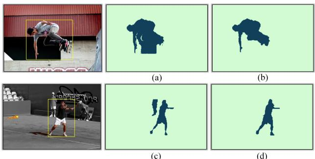
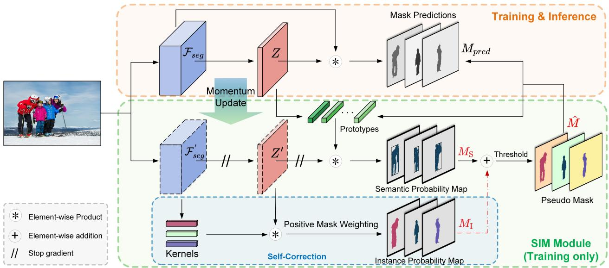
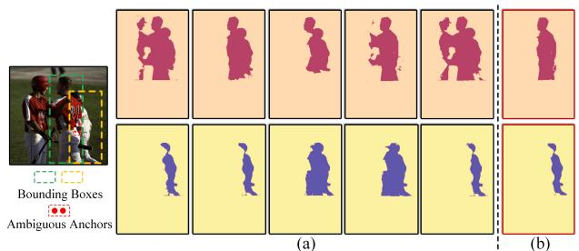
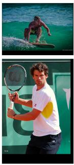
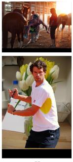
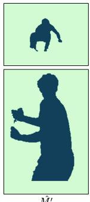
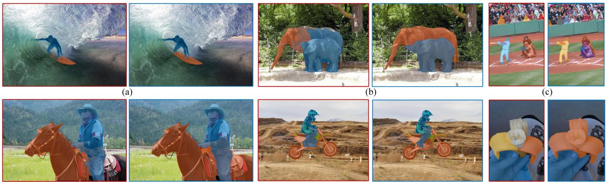
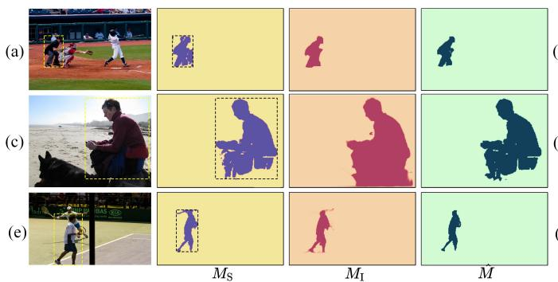
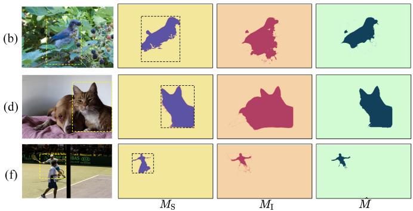
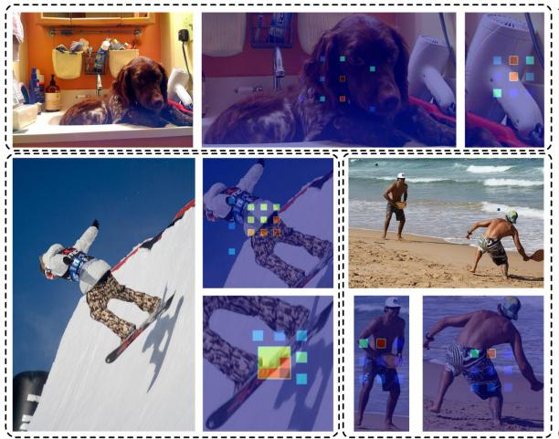

# SIM: Semantic-aware Instance Mask Generation for Box-Supervised Instance Segmentation

Ruihuang Li\*, Chenhang He\*, Yabin Zhang, Shuai Li, Liyi Chen, Lei Zhang† The Hong Kong Polytechnic University {csrhli, csche, cslzhang}@comp.polyu.edu.hk

## Abstract

Weakly supervised instance segmentation using only bounding box annotations has recently attracted much research attention. Most of the current efforts leverage lowlevel image features as extra supervision without explicitly exploiting the high-level semantic information of the objects, which will become ineffective when theforeground objects have similar appearances to the background or other objects nearby. We propose a new box-supervised instance segmentation approach by developing a Semantic-aware Instance Mask (SIM) generation paradigm. Instead of heavily relying on local pair-wise affinities among neighboring pixels, we construct a group of category-wise feature centroids as prototypes to identify foreground objects and assign them semantic-level pseudo labels. Considering that the semantic-aware prototypes cannot distinguish different instances of the same semantics, we propose a selfcorrection mechanism to rectify thefalsely activated regions while enhancing the correct ones. Furthermore, to handle the occlusions between objects, we tailor the Copy-Paste operation for the weakly-supervised instance segmentation task to augment challenging training data. Extensive experimental results demonstrate the superiority of our proposed SIM approach over other state-of-the-art methods. The source code: https://github.com/lslrh/SIM.

## 1. Introduction

Instance segmentation is among the fundamental tasks of computer vision, with many applications in autonomous driving, image editing, human-computer interaction, etc. The performance of instance segmentation has been improved significantly along with the advances in deep learning [6, 12, 34, 38]. However, training robust segmentation networks requires a large number of data with pixel-wise annotations, which consumes intensive human labor and resources. To reduce the reliance on dense annotations, weakly-supervised instance segmentation based on cheap supervisions, such as bounding boxes [14,21,36], points [8] and image-level labels [1,18], has recently attracted increasing research attention.

  
Figure 1. The pipeline of Semantic-aware Instance Mask (SIM) generation method. (a) shows the mask prediction produced by using only low-level affinity supervision, where the foreground heavily blends with background. (b) and (c) show the semantic-aware masks obtained with our constructed prototypes, which perceive the entity of objects but are unable to separate different instances of the same semantics. (d) shows the final instance pseudo mask rectified by our proposed self-correction module.

In this paper, we focus on box-supervised instance segmentation (BSIS), where the bounding boxes provide coarse supervised information for pixel-wise prediction task. To provide pixel-wise supervision, conventional methods [10, 19] usually leverage off-the-shelf proposal techniques, such as MCG [30] and GrabCut [31], to create pseudo instance masks. However, the training pipelines of these methods with multiple iterative steps are cumbersome. Several recent works [14, 36] enable end-to-end training by taking pairwise affinities among pixels as extra supervision. Though these methods have achieved promising performance, they heavily depend on low-level image features, such as color pairs [36], and simply assume that the proximal pixels with similar colors are likely to have the same label. This leads to confusion when foreground objects have similar appearances to the background or other ob jects nearby, as shown in Fig. 1 (a). It is thus error-prone to use only low-level image cues for supervision since they are weak to represent the inherent structure of objects.

Motivated by the fact that high-level semantic information can reveal intrinsic properties of object instances and hence provide effective supervision for segmentation model training, we propose a novel Semantic-aware Instance Mask generation method, namely SIM, to explicitly exploit the semantic information of objects. To distinguish proximal pixels with similar color but different semantics (please refer to Fig. 1 (a)), we construct a group of representative dataset-level prototypes, i.e., the feature centroids of different classes, to perform foreground/background segmentation, producing semantic-aware pseudo masks (see Fig. 1 (b)). These prototypes abstracted from massive training data can capture the structural information of objects, enabling more comprehensive semantic pattern understanding, which is complementary to affinity supervision of pairwise neighboring pixels. However, as shown in Fig. 1 (c), these prototypes are unable to separate the instances of the same semantics, especially for overlapping objects. We consequently develop a self-correction mechanism to rectify the false positives while enhancing the confidence of true-positive foreground objects, resulting in more precise instance-aware pseudo masks, as shown in Fig. 1 (d).

It is worth mentioning that our generated pseudo masks could co-evolve with the segmentation model without cumbersome iterative training procedures in previous methods [10, 21]. In addition, considering that the existing weakly-supervised instance segmentation methods only provide very limited supervision for rare categories and overlapping objects due to the lack of ground truth masks, we propose an online weakly-supervised Copy-Paste approach to create a combinatorial number of augmented training samples. Overall, the major contributions of this work can be summarized as follows:

• A novel BSIS framework is presented by developing a semantic-aware instance mask generation mechanism. Specifically, we construct a group of representative prototypes to explore the intrinsic properties of object instances and identify complete entities, which produces more reliable supervision than low-level features.

• A self-correction module is designed to rectify the semantic-aware pseudo masks to be instance-aware. The falsely activated regions will be reduced, and the correct ones will be boosted, enabling more stable training and progressively improving the segmentation results.

• We tailor the Copy-Paste operation for weakly-supervised segmentation tasks in order to create more occlusion patterns and more challenging training data. The overall framework can be trained in an end-to-end manner. Extensive experiments demonstrate the superiority of our method over other state-of-the-art methods.

## 2. Related Work

Instance Segmentation (IS) is a fundamental task in computer vision fields, which aims to predict the pixel-wise mask for each instance of interest in an image. Many top performing IS methods [6, 15, 25, 42] follow the Mask R-CNN meta-architecture [12], which splits the IS task into two consecutive stages and performs segmentation on the extracted region proposals. Single-stage IS methods have also been rapidly developed during the past few years. YOLACT [3] and BlendMask [5] employ fine-grained FPN features rather than the RoI-aligned features for mask pre diction. However, they still need crop operation for object localization. Some methods segment each instance in a fully convolutional manner without resorting to the detection results. For example, CondInst [34] and SOLO [38] employ instance-aware conditional convolutions and dynamically generate convolution kernels to segment different objects. Universal architectures [7, 41] have emerged with DETR [4] and show that end-to-end set prediction architecture is general enough for any segmentation task. Despite the promising performance, these methods heavily rely on expensive pixel-wise mask annotation, which restricts their usability in many practical applications.

Weakly-Supervised Instance Segmentation (WSIS) with weak annotations is a more attractive yet challenging task. Some works attempt to achieve high-quality segmentation with box-level annotations [14, 17, 21, 36] or image-level annotations [1, 18]. Khoreva et al. [17] employ box supervisory training data for WSIS. However, the proposed method relies on the region proposal techniques, such as GrabCut [31] and MCG [30], to generate pseudo masks in an offline manner. Other recent methods [21, 37] also focus on generating instance labels by using an independent network, which require either extra salient data [38] or some post-processing methods [21]. This inevitably leads to a complicated training pipeline.

To achieve a simple yet effective training pipeline, BBTP [14] formulates WSIS as a multiple-instance learning problem and introduces a structural constraint to maintain the unity of estimated masks. BoxInst [36] builds upon an efficient CondInst [34] framework, and enforces the proximal pixels with similar colors to have the same label through a pairwise loss. Despite the promising performance, these methods depend heavily on local color supervision while neglecting the global structure of the entire object. Different from these methods, our proposed method provides more reliable supervision by leveraging high-level semantic information, which is beneficial for capturing the intrinsic structures of objects.

Pseudo Mask Generation. A widely adopted technique in conventional weakly-supervised semantic segmentation methods is Class Activation Map (CAM) [44], which aims to obtain an object localization map from class labels. However, CAM only identifies the most discriminative object regions and suffers from the problem of limited activation area [2,13,16,32]. Given that bounding boxes could provide the location information of objects in an image, BBAM [21] employs an object detector to produce a bounding box attribute map, which serves as a pseudo ground truth mask. As a more lightweight approach, self-training-based methods [22, 43, 48, 49] select high-scoring predictions on unlabeled data as pseudo labels for training. The idea of assigning labels based on prototypes has also been explored in semantic segmentation [22, 45, 46]. In this work, the prototype technique is adapted to capture the global structure of objects with the same semantics, reducing the noise caused by low-level feature supervision.

  
Figure 2. The framework of our proposed Semantic-aware Instance Mask (SIM) generation method. The model contains the main segmentation network $\mathcal { F } _ { s e g }$ and its momentum-updated version $\mathcal { F } _ { s e g } ^ { \prime } .$ Given an image X, we first pass it through $\mathcal { F } _ { s e g }$ and $\mathcal { F } _ { s e g } ^ { \prime }$ to obtain the corresponding mask features $Z$ and $Z ^ { \prime }$ . The prototypes are then updated as the moving average of feature cluster centroids. Next, we obtain the semantic probability map $M _ { \mathrm { S } }$ by measuring the distance between prototypes and mask features $Z ^ { \prime }$ . After that, the falsely activated instances in $M _ { \mathrm { S } }$ are rectified by the instance probability map $M _ { \mathrm { I } }$ , which is obtained by integrating different positive masks of th same ground truth object. Finally, we obtain the pseudo mask Mˆ by selecting highly-confident pixels with two thresholds.

## 3. Method

## 3.1. Overview

In the setting of box-supervised instance segmentation (BSIS), we are given a set of box annotated training data $\mathcal { D } = \{ X _ { n } , Y _ { n } , B _ { n } \} _ { n = 1 } ^ { N }$ , where N is the number of images. Besides, $Y _ { n } ~ = ~ \{ y _ { n } ^ { k } \} _ { k = 1 } ^ { K }$ and $B _ { n } ~ = ~ \{ b _ { n } ^ { k } \} _ { k = 1 } ^ { K }$ denote the class-level and box-level annotations, where K is the number of instances in the image $X _ { n } , y _ { n } ^ { k } \in \{ 1 , \cdot \cdot \cdot , C \}$ represents the category label of the k-th object in the n-th image, and $b _ { n } ^ { k }$ specifies its corresponding location.

The overview of our method is shown in Fig. 2, where the proposed SIM module is highlighted in the green dotted box. We choose CondInst [34] and Mask2Former [7] as the basic segmentation networks due to their simplicity and effectiveness. Instead of only relying on local pair-wise affinities among pixels as supervision [14,36], we employ a group of semantic-level prototypes to capture global structural information of objects, and produce semantic probability map $M _ { \mathrm { S } }$ by computing the distances between each pixel-wise feature vector and all prototypes. Since these prototypes are unable to separate different objects of the same semantics, we propose a self-correction mechanism to deactivate falsely estimated objects by using an instance probability map $M _ { \mathrm { I } }$ . This map can be obtained by integrating different positive masks corresponding to the same instance with an IoU-based weighting strategy. Finally, we employ two thresholds to select confident predictions as pseudo ground truths $\hat { M }$ , and use them for training the segmentation network $\mathcal { F } _ { s e g }$

## 3.2. Semantic-aware Instance Mask Generation

## 3.2.1 Pseudo Semantic Map

Low-level image features, such as colors, intensity, edges, blobs, etc., could provide useful guidance to identify the object boundaries in an image. However, these features vary significantly with illuminations, motion blurs, and noises. Thus it is error-prone to take only low-level features as supervision for BSIS when object instances are heavily blended with the background. To address this issue, we attempt to explore the intrinsic structures of objects as semantic guidance to provide more robust supervision for BSIS

model training.

We construct a group of representative prototypes to model the structural information of objects, and use them to generate semantic-aware pseudo masks. Considering that a single prototype is insufficient to capture the intra-class variance, we employ multiple prototypes [29, 45] to represent the objects in a category. Specifically, we extract L prototypes $( i . e . ,$ , sub-centers) from each class $c \in \{ 1 , \cdots , C \}$ denoted by $P _ { c } = \{ p _ { 1 } ^ { c } , \cdot \cdot \cdot , p _ { L } ^ { c } \}$ , to depict different characteristics of the same category. Given an input image $I ~ \in ~ \mathbb { R } ^ { h \times w \times 3 }$ , we first pass it through the segmentation model $\mathcal { F } _ { s e g }$ to obtain the feature map $\mathbf { \bar { \boldsymbol { Z } } } \in \mathbb { R } ^ { H \times W \times D }$ , and normalize it with $\begin{array} { r } { z _ { i } = \frac { z _ { i } } { | | z _ { i } | | _ { 2 } } } \end{array}$ , where $z _ { i }$ denotes the i-th feature vector of $Z$ with length $D .$ . Unlike semantic segmentation, which predicts only one mask for each input image, we predict a variable number of masks depending on the number of categories in the image. To this end, we compute the semantic probability map corresponding to the c-th category, denoted by $M _ { \mathrm { S } } ^ { c } ~ \in ~ \mathbb { R } ^ { \hat { H } \times W }$ , using the following formula:

$$
M _ { \mathrm { S } , i } ^ { c } = \sigma ( \operatorname* { m a x } \{ \frac { \langle z _ { i } , p _ { l } ^ { c } \rangle } { \tau } \} _ { l = 1 } ^ { L } ) ,\tag{1}
$$

where $\langle \cdot \rangle$ computes the cosine similarity between two $\ell _ { 2 ^ { - } }$ normalized feature vectors. The sigmoid function $\sigma ( \cdot )$ converts the feature distance to the probability that the pixel belongs to the l-th sub-center, and τ controls the concentration level of representations. Once computed, we assign these semantic probability maps to different objects according to their class labels $Y _ { n }$

Multi-prototype update. We update the prototypes on-thefly with the moving average of cluster centroids computed in previous mini-batches. Specifically, given an image $X _ { n }$ and its corresponding pseudo mask $\hat { M } .$ , we obtain the pixelwise cluster assignments $Q$ of the c-th category by optimizing the following objective function:

$$
\begin{array} { r l r } & { } & { \underset { \boldsymbol { Q } \in \mathbb { Q } } { \operatorname* { m a x } } \operatorname { T r } ( \boldsymbol { Q } ^ { T } \boldsymbol { P } _ { c } ^ { T } \boldsymbol { Z } ) + \varepsilon H ( \boldsymbol { Q } ) , \quad s . t . \boldsymbol { Q } \in \mathbb { Q } , } \\ & { } & { \mathrm { w i t h } \quad \mathbb { Q } : = \{ \boldsymbol { Q } \in \mathbb { R } _ { + } ^ { L \times N _ { c } } | \boldsymbol { Q } \mathbf { 1 } _ { N _ { c } } = r , \ Q ^ { T } \mathbf { 1 } _ { L } = h \} . } \end{array}\tag{2}
$$

The above formula is an instance of the optimal transport problem [9], where $\begin{array} { r } { Q \ = \ \frac { 1 } { N _ { c } } [ q _ { 1 } , \cdots , q _ { N _ { c } } ] } \end{array}$ represents the transport assignment and is restricted to be a probability matrix with the constraint $\mathbb { Q } . \ N _ { c }$ is the number of pixels belonging to the c-th category, H denotes the entropy function with $\begin{array} { r } { H ( Q ) = - \sum _ { i j } Q _ { i j } } \end{array}$ log $Q _ { i j }$ , and ε controls the smoothness of distribution. $\boldsymbol { r } = \frac { 1 } { L } \mathbf { 1 } _ { L }$ and $\begin{array} { r } { h = \frac { 1 } { N _ { c } } \mathbf { 1 } _ { N _ { c } } } \end{array}$ are the marginal projections of $Q$ onto its rows and columns, respectively, where $\mathbf { 1 } _ { L }$ and ${ \mathbf { 1 } } _ { N _ { c } }$ represent the vectors of ones of dimension $L$ and $N _ { c }$

By formulating the cluster assignment as an optimal transport problem, the optimization of Eq. 2 concerning $Q$ can be solved in linear time by the Sinkhorn-Knopp algorithm [9]:

  
Figure 3. (a) The mask quality varies much across different positive samples. (b) The instance-aware masks $M _ { \mathrm { I } }$ obtained by using positive mask weighting strategy.

$$
Q ^ { * } = \mathrm { d i a g } ( u ) \exp ( \frac { P _ { c } ^ { T } Z } { \varepsilon } ) \mathrm { d i a g } ( v ) ,\tag{3}
$$

where $u \in \mathbb { R } ^ { L }$ and $v \in \mathbb { R } ^ { N _ { c } }$ are two renormalization vectors. Finally, we update the prototypes as the moving average of cluster centroids. Particularly, in each iteration $t ,$ the prototype is estimated as:

$$
p _ { l } ^ { c } | _ { t } = \gamma \cdot p _ { l } ^ { c } | _ { t - 1 } + ( 1 - \gamma ) \cdot p _ { n , l } ^ { c } ,\tag{4}
$$

where $\lambda \in [ 0 , 1 ]$ is the momentum coefficient. $p _ { n , l } ^ { c }$ denotes the l-th sub-center of the c-th class in image $X _ { n } ,$ which is computed by:

$$
p _ { n , l } ^ { c } = \frac { \sum _ { i } ^ { N _ { c } } z _ { i } \cdot \mathbb { 1 } ( Q _ { i , l } = 1 ) } { \sum _ { i } ^ { N _ { c } } \mathbb { 1 } ( Q _ { i , l } = 1 ) } ,\tag{5}
$$

where 1 is an indicator function, being 1 if $Q _ { i , l } = 1$

Remarks on prototypes. The pairwise loss used in [36] explores pixel-to-pixel correlations, which provide local supervision but can not ensure the global consistency of objects with the same semantics. In contrast, the prototypes explore pixel-to-center relations, which could ensure the integrity of objects and provide more reliable supervision. Besides, since the prototypes are abstracted from massive training data, they could reveal the intrinsic properties of objects and filter out image-specific noise and outliers. In addition, we treat different categories equally and set the same number of prototypes for each category, which is potentially beneficial for identifying long-tailed objects.

## 3.2.2 Self-Correction

Though the pseudo semantic masks $M _ { \mathrm { S } }$ could provide more reliable supervision from a global perspective, they could not distinguish different objects of the same semantics, especially when there exist overlaps or occlusions among objects. To overcome this limitation, we propose a simple yet effective self-correction module, which could upgrade the semantic-aware masks $M _ { \mathrm { S } }$ to be instance-aware.

X

M'

Positive mask weighting. Let us first revisit some properties of anchor-free detectors such as FCOS [35]. In these works, anchors denote the dense feature points, and positive samples represent the anchors located in the center/bbox region of each object. These methods assign multiple positive samples, which have high enough Intersection over Union (IoU) with ground truth $( g t )$ box, to each object. However, the quality of masks produced by different positive samples varies significantly, as shown in Fig. 3 (a). Those ambiguous anchors, $i . e .$ , anchors that are taken as positive samples for multiple $g t$ objects simultaneously (red dots in Fig. 3), could not separate overlapping objects of the same semantics. Based on these observations, we propose a positive mask weighting strategy to integrate different masks according to their quality, resulting in a high-quality instanceaware mask $M _ { \mathrm { I } }$ . In specific, we define a metric of mask quality based on the IoU between predicted and gt boxes:

$$
w _ { p o s } = e ^ { \mu \cdot I o U } ,\tag{6}
$$

where $\mu$ controls the relative gaps between different weights. Each weight $w _ { p o s }$ is then normalized by the sum of weights for all positive samples. As can be seen in Fig. 3 (b), the pseudo instance masks $M _ { \mathrm { I } }$ could better separate different objects and provide more accurate supervision.

Pseudo mask loss. By employing $M _ { \mathrm { I } }$ , the falsely activated objects or pixels in $M _ { \mathrm { S } }$ could be suppressed, while the confidence of foreground objects could be enhanced. The rectification process is conducted as follows:

$$
\hat { M } _ { p r o b } ^ { k , i } = \left( 1 - \alpha \right) \cdot M _ { \mathrm { S } } ^ { k , i } + \alpha \cdot M _ { \mathrm { I } } ^ { k , i } ,\tag{7}
$$

where $\hat { M } _ { p r o b } ^ { k , i }$ represents the i-th pixel of the k-th pseudo probability map, and $\alpha ~ \in ~ [ 0 , 1 ]$ controls the intensity of modulation. Finally, we set two thresholds $\tau _ { \mathrm { h i g h } }$ and $\tau _ { \mathrm { l o w } }$ to select highly-confident foreground and background predictions as pseudo labels, resulting in $\hat { M }$ . The pseudosupervised mask loss is defined by:

$$
\mathcal { L } _ { p s e u d o } = \frac { 1 } { N _ { p o s } } \sum _ { k } ^ { N _ { p o s } } \ell _ { m a s k } ( M _ { p r e d } , \hat { M } _ { k } , W ) ,\tag{8}
$$

where the mask loss $\ell _ { m a s k }$ consists of two terms: binary cross-entropy loss $\ell _ { b c e }$ and dice loss [28] $\ell _ { d i c e } . \hat { M } _ { k }$ denotes the pseudo mask of the k-th positive sample. W is a binary weight mask that neglects ambiguous regions by using $\tau _ { \mathrm { h i g h } }$ and $\tau _ { \mathrm { l o w } } , i . e . , W ^ { i } = 0 , \mathrm { i f } \ \tau _ { \mathrm { l o w } } < \hat { M } _ { p r o b } ^ { i } < \tau _ { \mathrm { h i g h } }$

## 3.3. Online Weakly-Supervised Copy-Paste

Object-aware Copy-Paste is a simple yet effective way to improve the data efficiency. However, Copy-Paste has rarely been explored for weakly-supervised instance segmentation. It is natural to employ pseudo masks as the guidance to cut object instances from an image X. To achieve online Copy-Paste, we set up a first-in-first-out memory bank M to store training samples and their corresponding pseudo masks from preceding mini-batches, which ensures that the pseudo masks in M could be updated on-the-fly.

X′  

  
Figure 4. Examples of online weakly-supervised Copy-Paste. We use $\hat { M ^ { \prime } }$ to extract instances from $X ^ { \prime }$ and paste them onto X, resulting in new training data $X _ { p a s t e }$

For each training iteration, we randomly sample an image $\{ X ^ { \prime } , Y ^ { \prime } , B ^ { \prime } , \hat { M ^ { \prime } } , S ^ { \prime } \}$ from M and extract a subset of instances from $X ^ { \prime }$ based on importance sampling, where $S ^ { \prime }$ measures the importance of instances (please refer to supplemental materials for more details), so that instances with higher-quality masks are more likely to be selected. We paste the extracted objects onto input image {X, Y, B}, and adjust the annotations accordingly, $i . e . .$ , we remove fully occluded objects and update the masks and bounding boxes of partially occluded objects. Finally, we compute the mask loss only on the pasted instances:

$$
\mathcal { L } _ { p a s t e } = \sum _ { k } \mathbb { 1 } _ { p a s t e } [ \ell _ { m a s k } ( M _ { p r e d } ^ { k } , \hat { M } ^ { \prime k } ) ] ,\tag{9}
$$

where $\mathbb { 1 } _ { p a s t e }$ is the indicator function, being 1 if the k-th instance is copied from $X ^ { \prime }$

## 3.4. Objective Function

As shown in Fig. 2, we employ a momentum encoder to stabilize the pseudo mask generation process. The parameters of the segmentation model are updated by optimizing the following loss function $\mathcal { L } _ { s e g }$

$$
\mathcal { L } _ { s e g } = \mathcal { L } _ { l o w l e v e l } + \lambda _ { 1 } \mathcal { L } _ { p s e u d o } + \lambda _ { 2 } \mathcal { L } _ { p a s t e } ,\tag{10}
$$

where $\lambda _ { 1 }$ and $\lambda _ { 2 }$ are two trade-off parameters. $\mathcal { L } _ { l o w l e v e l }$ denotes low-level pairwise supervision defined in Box-Inst [36]. $\mathcal { L } _ { l o w l e v e l }$ and $\mathcal { L } _ { p s e u d o }$ provide complementary supervision from local and global perspectives, respectively, and work together to bridge the performance gap between box-supervised and fully-supervised settings.

## 4. Experiments

We conduct experiments on COCO [24] and PASCAL VOC [11] datasets. The model is trained on train2017, which contains about 115k images from 80 categories with only box annotations. We use val2017 (5k images) for ablation study and test-dev2017 (20k images) for comparisons with other methods.

<table><tr><td rowspan=1 colspan=1></td><td rowspan=1 colspan=2>method</td><td rowspan=1 colspan=2>backbone</td><td rowspan=1 colspan=1>sche.</td><td rowspan=1 colspan=1>AP</td><td rowspan=1 colspan=1> $\mathrm { { A P } _ { 5 0 } }$    $\mathrm { A P _ { 7 5 } }$ </td><td rowspan=1 colspan=1> $\mathsf { A P } _ { S }$    $\mathsf { A P } _ { M }$    $\mathrm { A P } _ { L }$ </td></tr><tr><td rowspan=6 colspan=1>pu-sed</td><td rowspan=1 colspan=2>Mask R-CNN [12]</td><td rowspan=1 colspan=2>ResNet-101-FPN</td><td rowspan=1 colspan=1>3×</td><td rowspan=1 colspan=1>37.5</td><td rowspan=1 colspan=1>59.3  40.2</td><td rowspan=1 colspan=1>21.1  39.6  48.3</td></tr><tr><td rowspan=1 colspan=2>YOLACT-700 [3]</td><td rowspan=1 colspan=2>ResNet-101-FPN</td><td rowspan=1 colspan=1>4.5×</td><td rowspan=1 colspan=1>31.2</td><td rowspan=1 colspan=1>50.6  32.8</td><td rowspan=1 colspan=1>12.1  33.3  47.1</td></tr><tr><td rowspan=4 colspan=2>PolarMask [40]SOLOv2 [38]CondInst [34]Mask2Fomer† [7]</td><td rowspan=1 colspan=1>Mask [40]</td><td rowspan=1 colspan=2>ResNet-101-FPN</td><td rowspan=1 colspan=1>2×</td><td rowspan=1 colspan=1>32.1</td><td rowspan=1 colspan=1>53.7  33.1</td><td rowspan=1 colspan=1>14.7  33.8  45.3</td></tr><tr><td rowspan=3 colspan=2>ResNet-101-FPNResNet-101-MSDefomAttn</td><td rowspan=1 colspan=1>ResNet-101-FPN</td><td rowspan=1 colspan=1>3×</td><td rowspan=1 colspan=1>39.7</td><td rowspan=1 colspan=1>60.7  42.9</td><td rowspan=1 colspan=1>17.3  42.9  57.4</td></tr><tr><td rowspan=1 colspan=1>3×</td><td rowspan=1 colspan=1>39.1</td><td rowspan=1 colspan=1>60.9  42.0</td><td rowspan=1 colspan=1>21.5  41.7  50.9</td></tr><tr><td rowspan=1 colspan=1>50e</td><td rowspan=1 colspan=1>44.2</td><td rowspan=1 colspan=1></td><td rowspan=1 colspan=1>23.8  47.7  66.7</td></tr><tr><td rowspan=4 colspan=1></td><td rowspan=4 colspan=2>BBTP† [14]BBAM [21]BoxCaseg [37]SIM (Ours)</td><td rowspan=1 colspan=2>ResNet-101-FPN</td><td rowspan=1 colspan=1>1×</td><td rowspan=1 colspan=1>21.1</td><td rowspan=1 colspan=1>45.5  17.2</td><td rowspan=1 colspan=1>11.2  22.0  29.8</td></tr><tr><td rowspan=2 colspan=2>ResNet-101-FPN</td><td rowspan=1 colspan=1>1×</td><td rowspan=1 colspan=1>25.7</td><td rowspan=1 colspan=1>50.0  23.3</td><td rowspan=1 colspan=1></td></tr><tr><td rowspan=2 colspan=2>ResNet-101-FPN</td><td rowspan=1 colspan=1>1×</td><td rowspan=1 colspan=1>30.9</td><td rowspan=1 colspan=1>54.3  30.8</td><td rowspan=1 colspan=1>12.1  32.8  46.3</td></tr><tr><td rowspan=1 colspan=1>1×</td><td rowspan=1 colspan=1>34.0</td><td rowspan=1 colspan=1>56.8  35.0</td><td rowspan=1 colspan=1>17.2  36.8  45.5</td></tr><tr><td rowspan=3 colspan=1></td><td rowspan=1 colspan=2>BoxLevelSet [23]</td><td rowspan=1 colspan=2>ResNet-101-FPN</td><td rowspan=1 colspan=1>3×</td><td rowspan=1 colspan=1>33.4</td><td rowspan=1 colspan=1>56.8  34.1</td><td rowspan=1 colspan=1>15.2  36.8  46.8</td></tr><tr><td rowspan=2 colspan=2>BoxInst [36]SIM (Ours)</td><td rowspan=1 colspan=2>ResNet-101-FPN</td><td rowspan=1 colspan=1>3×</td><td rowspan=1 colspan=1>33.2</td><td rowspan=1 colspan=1>56.5  33.6</td><td rowspan=1 colspan=1>16.2  35.3  45.1</td></tr><tr><td rowspan=1 colspan=2>ResNet-101-FPN</td><td rowspan=1 colspan=1>3×</td><td rowspan=1 colspan=1>35.3</td><td rowspan=1 colspan=1>58.9  36.4</td><td rowspan=1 colspan=1>18.4  38.0  47.5</td></tr><tr><td rowspan=7 colspan=1></td><td rowspan=3 colspan=2>BoxLevelSet [23]BoxInst [36]SIM (Ours)</td><td rowspan=3 colspan=2>ResNet-DCN-101-BiFPNResNet-DCN-101-BiFPNResNet-DCN-101-BiFPN</td><td rowspan=1 colspan=1>3x</td><td rowspan=1 colspan=1>35.4</td><td rowspan=1 colspan=1>59.1  36.7</td><td rowspan=1 colspan=1>16.8  38.5  51.3</td></tr><tr><td rowspan=1 colspan=1>3×</td><td rowspan=1 colspan=1>35.0</td><td rowspan=1 colspan=1>59.3  35.6</td><td rowspan=1 colspan=1>17.1  37.2  48.9</td></tr><tr><td rowspan=1 colspan=1>3×</td><td rowspan=1 colspan=1>37.4</td><td rowspan=1 colspan=1>61.8  38.6</td><td rowspan=1 colspan=1>18.6  40.2  51.6</td></tr><tr><td rowspan=2 colspan=2>BoxInst [36]SIM (Ours)</td><td rowspan=2 colspan=2>Swin-B-FPNSwin-B-FPN</td><td rowspan=1 colspan=1>3x</td><td rowspan=1 colspan=1>37.9</td><td rowspan=1 colspan=1>63.2  39.0</td><td rowspan=1 colspan=1>20.0  41.2  53.1</td></tr><tr><td rowspan=1 colspan=1>3×</td><td rowspan=1 colspan=1>40.2</td><td rowspan=1 colspan=1>66.9  41.3</td><td rowspan=1 colspan=1>21.1  43.5  56.0</td></tr><tr><td rowspan=1 colspan=2>BoxInst [36]</td><td rowspan=1 colspan=2>Mask2Former-ResNet-101</td><td rowspan=1 colspan=1>50e</td><td rowspan=1 colspan=1>35.7</td><td rowspan=1 colspan=1>59.8  36.4</td><td rowspan=1 colspan=1>16.6  38.5  55.4</td></tr><tr><td rowspan=1 colspan=2>SIM† (Ours)</td><td rowspan=1 colspan=2>Mask2Former-ResNet-101</td><td rowspan=1 colspan=1>50e</td><td rowspan=1 colspan=1>37.4</td><td rowspan=1 colspan=1>62.2  38.7</td><td rowspan=1 colspan=1>17.6  41.3  56.6</td></tr></table>

Table 1. Comparisons between SIM and state-of-the-art methods on the COCO test-dev split. Symbol “†” means that the results are evaluated on the COCO val split, and “‡” denotes that BoxCaseg is trained with both box and salient object supervisions.

## 4.1. Implementation Details

We adopt CondInst [34] and Mask2Former [7] as our baseline. For CondInst, the backbone with FPN is pretrained on ImageNet. The training and testing details follow CondInst1 implemented with Detectron2 [39] unless specified. The model is warmed-up for 10k iterations with the projection loss and pairwise loss proposed in [36], and then trained for 80k iterations by adding our pseudo supervision loss and Copy-Paste loss with batch size 16 on 8 TITAN RTX GPUs. When ResNet is used as the backbone, our model is trained with SGDM optimizer. The initial learning rate is set to 0.01, and reduced by a factor of 10 at steps 60k and 80k, respectively. When SwinT [26] is used as the backbone, we adopt the AdamW [27] optimizer and set the initial learning rate to 0.0001. For Mask2Former, we follow its baseline settings2 and replace the original pixelwise mask loss with our designed loss terms. The length of the memory bank is set to 100, and we extract a quarter of the instances from each image with 1 ∼ 3 instances per image. The momentum used to update networks and prototypes is set to 0.9999 and 0.999, respectively. The modulation intensity α is empirically set to 0.5. Besides, λ1, λ2, µ, and τ are empirically set to 0.5, 1, 5, and 0.1, respectively.

<table><tr><td rowspan=1 colspan=2>methods</td><td rowspan=1 colspan=1>backbone</td><td rowspan=1 colspan=1>AP</td><td rowspan=1 colspan=1> $\mathrm { { A P } _ { 5 0 } }$    $\mathrm { A P _ { 7 5 } }$ </td></tr><tr><td rowspan=3 colspan=2>GrabCut* [31]SDI [17]BBTP [14]</td><td rowspan=1 colspan=1>ResNet-101</td><td rowspan=1 colspan=1>19.0</td><td rowspan=1 colspan=1>38.8  17.0</td></tr><tr><td rowspan=1 colspan=1></td><td rowspan=1 colspan=1>VGG-16</td><td rowspan=1 colspan=1></td><td rowspan=1 colspan=1>44.8  16.3</td></tr><tr><td rowspan=1 colspan=1>ResNet-101</td><td rowspan=1 colspan=1>23.1</td><td rowspan=1 colspan=1>54.1  17.1</td></tr><tr><td rowspan=1 colspan=2>BBTP w/ CRF [14]</td><td rowspan=1 colspan=1>ResNet-101</td><td rowspan=1 colspan=1>27.5</td><td rowspan=1 colspan=1>59.1  21.9</td></tr><tr><td rowspan=1 colspan=2>BBAM [21]</td><td rowspan=1 colspan=1>ResNet-101</td><td rowspan=1 colspan=1></td><td rowspan=1 colspan=1>63.7  31.8</td></tr><tr><td rowspan=1 colspan=2>BoxInst [36]</td><td rowspan=1 colspan=1>ResNet-50</td><td rowspan=1 colspan=1>34.3</td><td rowspan=1 colspan=1>59.1  34.2</td></tr><tr><td rowspan=1 colspan=2>BoxInst [36]</td><td rowspan=1 colspan=1>ResNet-101</td><td rowspan=1 colspan=1>36.5</td><td rowspan=1 colspan=1>61.4  37.0</td></tr><tr><td rowspan=1 colspan=2>DiscoBox [20]</td><td rowspan=1 colspan=1>ResNet-50</td><td rowspan=1 colspan=1></td><td rowspan=1 colspan=1>59.8  35.5</td></tr><tr><td rowspan=1 colspan=2>DiscoBox [20]</td><td rowspan=1 colspan=1>ResNet-101</td><td rowspan=1 colspan=1></td><td rowspan=1 colspan=1>62.2  37.5</td></tr><tr><td rowspan=1 colspan=2>BoxLevelSet [23]</td><td rowspan=1 colspan=1>ResNet-50</td><td rowspan=1 colspan=1>36.3</td><td rowspan=1 colspan=1>64.2  35.9</td></tr><tr><td rowspan=1 colspan=2>BoxLevelSet [23]</td><td rowspan=1 colspan=1>ResNet-101</td><td rowspan=1 colspan=1>38.3</td><td rowspan=1 colspan=1>66.3  38.7</td></tr><tr><td rowspan=2 colspan=2>SIM (Ours)SIM (Ours)</td><td rowspan=1 colspan=1>ResNet-50</td><td rowspan=1 colspan=1>36.7</td><td rowspan=1 colspan=1>65.5  35.6</td></tr><tr><td rowspan=1 colspan=1>ResNet-101</td><td rowspan=1 colspan=1>38.6</td><td rowspan=1 colspan=1>67.1  38.3</td></tr></table>

Table 2. Performance comparison on Pascal VOC val2012 split. Symbol $" \ast > "$ denotes that the results are copied from BoxInst.

## 4.2. Comparisons with State-of-the-Arts

We compare the proposed SIM with state-of-the-art BSIS methods on the COCO [24] dataset. The fully supervised methods are also compared as a reference. As shown in Tab. 1, SIM outperforms BoxInst [36] and BoxLevelSet [23] by 1.6% and 1.4% AP with the ResNet-101-FPN backbone and 3× training schedule. This is because we employ dataset-level prototypes to exploit the semantic information of objects while filtering out trivial image-specific noises. It can also be seen that our SIM method produces impressive results on small objects, largely outperforming BoxInst and BoxLevelSet by 2.8% AP and 1.8% AP with ResNet-101-FPN backbone, respectively. This can be attributed to the proposed Copy-Paste operation, which creates many challenging training data of small hard objects. BoxInst lags behind on large objects due to the lack of semantic guidance. BoxLevelSet has lower performance on small objects because small objects lack rich features for level set evolution. By using stronger backbones with BiFPN [33] and DCN [47], the performance can be further boosted to 37.4% AP. By taking Swin transformer [26] as backbone [26], the proposed SIM could surpass BoxInst by 1.7% AP, attaining 39.6% AP. In addition, we also validate the effectiveness of our method on the query-based baseline, i.e., Mask2Former [7]. Our method achieves consistent improvement and outperforms BoxInst by 1.7% AP.

(d)  
  
Figure 5. Qualitative results of BoxInst (in the red box) and our method (in the blue box) on COCO val2017.

Tab. 2 reports the segmentation results on the Pascal VOC [11] dataset. Our method outperforms BoxInst [36] by 2.4% and 2.1% AP with ResNet-50 and ResNet-101 backbones, respectively. BoxLevelSet [23] achieves comparable performance since the level set model could evolve the precise contour of objects, which is beneficial for large objects.

## 4.3. Qualitative Results

Fig. 5 shows the qualitative segmentation results of our method and BoxInst on COCO val split. We have the following observations. First, according to (a), by leveraging the semantic-level supervision, our method is able to segment foreground instances that heavily tangle with background or other objects with similar appearances, because the prototypes explore global structural information of objects and could reduce the noise brought by using only local pair-wise affinity supervision. Second, as can be seen in (b) (c), our method could better separate overlapping instances of the same semantics since we introduce the self-correction module to reduce the falsely activated instances while enhancing the correct ones. Third, as shown in (d) and (f), benefiting from the abstraction of prototypes from massive training data, our method is able to perceive the whole entity of object instances and produce better segmentation results.

<table><tr><td> $\underline { { \mathcal { L } _ { p s e u d o } } }$ </td><td>一  $\underline { { \mathcal { L } _ { p a s t e } } }$ </td><td>AP</td><td> $\mathrm { { A P } _ { 5 0 } }$ </td><td> $\mathrm { A P _ { 7 5 } }$ </td><td> $\mathsf { A P } _ { S }$ </td><td> $\mathsf { A P } _ { M }$ </td><td> $\mathsf { A P } _ { L }$ </td></tr><tr><td>baseline</td><td></td><td>30.7</td><td>52.2</td><td>31.1</td><td>13.8</td><td>33.1</td><td>45.7</td></tr><tr><td>√</td><td></td><td>31.9</td><td>54.0</td><td>32.6</td><td>14.7</td><td>34.7</td><td>47.4</td></tr><tr><td>√</td><td>√</td><td>32.2</td><td>54.0</td><td>33.0</td><td>15.8</td><td>34.5</td><td>48.3</td></tr></table>

Table 3. The Mask AP on COCO val2017 split by applying different loss terms.

<table><tr><td>α</td><td>AP</td><td> $\mathrm { { A P } _ { 5 0 } }$ </td><td> $\mathrm { A P } _ { 7 5 }$ </td><td> $\mathsf { A P } _ { S }$ </td><td> $\mathsf { A P } _ { M }$ </td><td>APL</td></tr><tr><td>0</td><td>30.5</td><td>52.7</td><td>30.6</td><td>14.1</td><td>33.3</td><td>44.8</td></tr><tr><td>0.3</td><td>31.3</td><td>53.1</td><td>31.9</td><td>15.1</td><td>34.0</td><td>46.1</td></tr><tr><td>0.5</td><td>32.2</td><td>54.0</td><td>33.0</td><td>15.8</td><td>34.5</td><td>48.3</td></tr><tr><td>0.7</td><td>32.0</td><td>54.0</td><td>32.4</td><td>15.7</td><td>34.4</td><td>47.9</td></tr><tr><td>1</td><td>31.4</td><td>53.0</td><td>32.3</td><td>15.0</td><td>34.2</td><td>47.0</td></tr></table>

Table 4. Effect of modulation intensity α.

<table><tr><td># prototypes</td><td>AP</td><td> $\mathrm { { A P } _ { 5 0 } }$ </td><td> $\mathrm { A P } _ { 7 5 }$ </td><td> $\mathsf { A P } _ { S }$ </td><td> $\mathrm { A P } _ { M }$ </td><td> $\mathrm { A P } _ { L }$ </td></tr><tr><td>L = 1</td><td>31.6</td><td>53.1</td><td>32.4</td><td>15.3</td><td>34.0</td><td>46.9</td></tr><tr><td> $L = 5$ </td><td>32.0</td><td>53.6</td><td>32.9</td><td>15.7</td><td>34.5</td><td>47.4</td></tr><tr><td> $L = 1 0$ </td><td>32.2</td><td>54.0</td><td>33.0</td><td>15.8</td><td>34.5</td><td>48.3</td></tr><tr><td> $L = 5 0$ </td><td>32.2</td><td>53.9</td><td>33.2</td><td>15.9</td><td>34.3</td><td>48.7</td></tr></table>

Table 5. Effect of the number of prototypes L per category.

## 4.4. Ablation Study

We conduct ablation studies on the COCO dataset, with ResNet-50-FPN backbone and 1× training schedule, to investigate the role of each component in our framework. The Mask AP on COCO val split is reported.

Contribution of the two losses. Tab. 3 shows the contributions of the two loss terms, $i . e . , \mathcal { L } _ { p s e u d o }$ and $\mathcal { L } _ { p a s t e }$ . The baseline is BoxInst [36], which resorts to the color similarity between proximal pixels as supervision. The proposed pseudo mask loss improves the performance by 1.2% AP, especially on large objects (1.7% AP). This demonstrates that by introducing the semantic-aware instance mask generation paradigm, our method could distinguish not only proximal pixels with similar colors but also overlapping objects of the same semantics. Besides, the online weaklysupervised Copy-Paste loss brings a further improvement of 0.3% AP, while the performance on small objects $\mathsf { A P } _ { S }$ is largely improved by 1.1% AP.

  
Figure 6. Visualizations of pseudo semantic masks $M _ { \mathrm { S } } ,$ , pseudo instance masks $M _ { \mathrm { I } } ,$ and final pseudo masks $\hat { M } .$

  
Figure 7. Visualizations of weights for different positive samples.

Effect of the modulation intensity. We use the instance-aware pseudo probability map $M _ { \mathrm { I } }$ to modulate the semantic-aware map $M _ { \mathrm { S } }$ by using a parameter α. Tab. 4 shows the results by setting α to different values. One can draw a conclusion that the integration of semantic mask $M _ { \mathrm { S } }$ and instance mask $M _ { \mathrm { I } }$ leads to better results than any of them. Specifically, $M _ { \mathrm { S } }$ facilitates more holistic object pattern understanding by exploring the semantic information from the entire dataset, while $M _ { \mathrm { I } }$ rectifies the falsely activated objects in $M _ { \mathrm { S } }$ and improves the reliability of pseudo masks. Removing the self-correction module, $i . e . ,$ setting α to $0 ,$ will lead to an obvious performance drop by 1.7% AP. This is not surprising because the semantic mask contains certain noisy supervision caused by the falsely activated objects and pixels. On the other hand, training without semantic masks, $i . e .$ , setting α to 1, will decrease the segmentation performance by 0.8% AP.

Semantic masks vs. instance masks. We explore the complementarity of $M _ { \mathrm { S } }$ and $M _ { \mathrm { I } }$ by visualizing them in Fig. 6. As can be seen in (b-d), $M _ { \mathrm { S } }$ could distinguish object instances that have similar appearances but different semantics from the background and other objects. In comparison, from (a) (e-f), we see that $M _ { \mathrm { I } }$ is good at distinguishing different instances of the same semantics, which are employed to suppress the falsely activated instances in $M _ { \mathrm { S } }$ . They work together to produce more reliable supervision for training. Visualizations of weights. To further understand the effect of the positive mask weighting strategy, we show the visualizations of weights assigned to different positive samples in Fig. 7. It can be seen that large weights are mainly located in the central regions of foreground objects and far from other objects, while the small ones are located in ambiguous regions, such as overlapping regions between different objects and junctions between foreground and background. This weighting strategy facilitates generating higher-quality supervision and reducing the falsely activated instances. More analyses about this weighting strategy are provided in supplemental files.

Effect of the number of prototypes per category. We set multiple prototypes per category to better model intra-class variation. Tab. 5 reports the segmentation results w.r.t. dif ferent number of prototypes per category. The baseline attains 31.6% AP by representing each category with one prototype. There is a clear performance improvement (about 0.4% AP) by increasing the number of prototypes to 5; however, the performance reaches saturation when L is more than 10. We set L as 10 to trade off accuracy and cost.

## 5. Conclusion

We proposed a novel SIM method for box-supervised instance segmentation. To alleviate the limitations of pairwise affinity supervision from low-level image features, we explored high-level image semantic contexts by extracting a group of representative prototypes from the dataset and using them to segment foreground objects from background. To rectify the possible false positive instances in semantic masks, we introduced extra supervision by integrating mask predictions of different positive samples in a weighted manner. Furthermore, we devised an online weakly-supervised Copy-Paste method to create challenging training data by equipping a continuously updated memory bank to store historical images with pseudo masks. Both the qualitative and quantitative experiments demonstrated the superior performance of our SIM method over state-of-the-arts.

## References

[1] Jiwoon Ahn, Sunghyun Cho, and Suha Kwak. Weakly supervised learning of instance segmentation with inter-pixel relations. In Proceedings of the IEEE/CVF conference on computer vision and pattern recognition, pages 2209–2218, 2019. 1, 2

[2] Jiwoon Ahn and Suha Kwak. Learning pixel-level semantic affinity with image-level supervision for weakly supervised semantic segmentation. In Proceedings of the IEEE conference on computer vision and pattern recognition, pages 4981–4990, 2018. 3

[3] Daniel Bolya, Chong Zhou, Fanyi Xiao, and Yong Jae Lee. Yolact: Real-time instance segmentation. In Proceedings of the IEEE/CVF international conference on computer vision, pages 9157–9166, 2019. 2, 6

[4] Nicolas Carion, Francisco Massa, Gabriel Synnaeve, Nicolas Usunier, Alexander Kirillov, and Sergey Zagoruyko. End-toend object detection with transformers. In European conference on computer vision, pages 213–229. Springer, 2020. 2

[5] Hao Chen, Kunyang Sun, Zhi Tian, Chunhua Shen, Yongming Huang, and Youliang Yan. Blendmask: Top-down meets bottom-up for instance segmentation. In Proceedings of the IEEE/CVF conference on computer vision and pattern recognition, pages 8573–8581, 2020. 2

[6] Kai Chen, Jiangmiao Pang, Jiaqi Wang, Yu Xiong, Xiaoxiao Li, Shuyang Sun, Wansen Feng, Ziwei Liu, Jianping Shi, Wanli Ouyang, et al. Hybrid task cascade for instance segmentation. In Proceedings of the IEEE/CVF Conference on Computer Vision and Pattern Recognition, pages 4974– 4983, 2019. 1, 2

[7] Bowen Cheng, Ishan Misra, Alexander G. Schwing, Alexander Kirillov, and Rohit Girdhar. Masked-attention mask transformer for universal image segmentation. In Proceedings of the IEEE/CVF Conference on Computer Vision and Pattern Recognition (CVPR), pages 1290–1299, June 2022. 2, 3, 6, 7

[8] Bowen Cheng, Omkar Parkhi, and Alexander Kirillov. Pointly-supervised instance segmentation. In Proceedings of the IEEE/CVF Conference on Computer Vision and Pattern Recognition, pages 2617–2626, 2022. 1

[9] Marco Cuturi. Sinkhorn distances: Lightspeed computation of optimal transport. Advances in neural information processing systems, 26, 2013. 4

[10] Jifeng Dai, Kaiming He, and Jian Sun. Boxsup: Exploiting bounding boxes to supervise convolutional networks for semantic segmentation. In Proceedings of the IEEE international conference on computer vision, pages 1635–1643, 2015. 1, 2

[11] Mark Everingham, Luc Van Gool, Christopher KI Williams, John Winn, and Andrew Zisserman. The pascal visual object classes (voc) challenge. International journal of computer vision, 88(2):303–338, 2010. 5, 7

[12] Kaiming He, Georgia Gkioxari, Piotr Dollar, and Ross Gir-´ shick. Mask r-cnn. In Proceedings ofthe IEEE international conference on computer vision, pages 2961–2969, 2017. 1, 2, 6

[13] Qibin Hou, PengTao Jiang, Yunchao Wei, and Ming-Ming Cheng. Self-erasing network for integral object attention. Advances in Neural Information Processing Systems, 31, 2018. 3

[14] Cheng-Chun Hsu, Kuang-Jui Hsu, Chung-Chi Tsai, Yen-Yu Lin, and Yung-Yu Chuang. Weakly supervised instance segmentation using the bounding box tightness prior. Advances in Neural Information Processing Systems, 32, 2019. 1, 2, 3, 6

[15] Zhaojin Huang, Lichao Huang, Yongchao Gong, Chang Huang, and Xinggang Wang. Mask scoring r-cnn. In Proceedings of the IEEE/CVF Conference on Computer Vision and Pattern Recognition, pages 6409–6418, 2019. 2

[16] Zilong Huang, Xinggang Wang, Jiasi Wang, Wenyu Liu, and Jingdong Wang. Weakly-supervised semantic segmentation network with deep seeded region growing. In Proceedings of the IEEE conference on computer vision and pattern recognition, pages 7014–7023, 2018. 3

[17] Anna Khoreva, Rodrigo Benenson, Jan Hosang, Matthias Hein, and Bernt Schiele. Simple does it: Weakly supervised instance and semantic segmentation. In Proceedings of the IEEE conference on computer vision and pattern recognition, pages 876–885, 2017. 2, 6

[18] Beomyoung Kim, Youngjoon Yoo, Chae Eun Rhee, and Junmo Kim. Beyond semantic to instance segmentation: Weakly-supervised instance segmentation via semantic knowledge transfer and self-refinement. In Proceedings of the IEEE/CVF Conference on Computer Vision and Pattern Recognition, pages 4278–4287, 2022. 1, 2

[19] Viveka Kulharia, Siddhartha Chandra, Amit Agrawal, Philip Torr, and Ambrish Tyagi. Box2seg: Attention weighted loss and discriminative feature learning for weakly supervised segmentation. In European Conference on Computer Vision, pages 290–308. Springer, 2020. 1

[20] Shiyi Lan, Zhiding Yu, Christopher Choy, Subhashree Radhakrishnan, Guilin Liu, Yuke Zhu, Larry S Davis, and Anima Anandkumar. Discobox: Weakly supervised instance segmentation and semantic correspondence from box supervision. In Proceedings of the IEEE/CVF International Conference on Computer Vision, pages 3406–3416, 2021. 6

[21] Jungbeom Lee, Jihun Yi, Chaehun Shin, and Sungroh Yoon. Bbam: Bounding box attribution map for weakly supervised semantic and instance segmentation. In Proceedings ofthe IEEE/CVF conference on computer vision and pattern recognition, pages 2643–2652, 2021. 1, 2, 3, 6

[22] Ruihuang Li, Shuai Li, Chenhang He, Yabin Zhang, Xu Jia, and Lei Zhang. Class-balanced pixel-level self-labeling for domain adaptive semantic segmentation. In Proceedings of the IEEE/CVF Conference on Computer Vision and Pattern Recognition, pages 11593–11603, 2022. 3

[23] Wentong Li, Wenyu Liu, Jianke Zhu, Miaomiao Cui, Xiansheng Hua, and Lei Zhang. Box-supervised instance segmentation with level set evolution. In European conference on computer vision, 2020. 6, 7

[24] Tsung-Yi Lin, Michael Maire, Serge Belongie, James Hays, Pietro Perona, Deva Ramanan, Piotr Dollar, and C Lawrence´ Zitnick. Microsoft coco: Common objects in context. In

European conference on computer vision, pages 740–755. Springer, 2014. 5, 6

[25] Shu Liu, Lu Qi, Haifang Qin, Jianping Shi, and Jiaya Jia. Path aggregation network for instance segmentation. In Proceedings ofthe IEEE conference on computer vision andpattern recognition, pages 8759–8768, 2018. 2

[26] Ze Liu, Yutong Lin, Yue Cao, Han Hu, Yixuan Wei, Zheng Zhang, Stephen Lin, and Baining Guo. Swin transformer: Hierarchical vision transformer using shifted windows. In Proceedings of the IEEE/CVF International Conference on Computer Vision, pages 10012–10022, 2021. 6, 7

[27] Ilya Loshchilov and Frank Hutter. Decoupled weight decay regularization. In International Conference on Learning Representations, 2018. 6

[28] Fausto Milletari, Nassir Navab, and Seyed-Ahmad Ahmadi. V-net: Fully convolutional neural networks for volumetric medical image segmentation. In 2016 fourth international conference on 3D vision (3DV), pages 565–571. IEEE, 2016. 5

[29] Munan Ning, Donghuan Lu, Dong Wei, Cheng Bian, Chenglang Yuan, Shuang Yu, Kai Ma, and Yefeng Zheng. Multi-anchor active domain adaptation for semantic segmentation. In Proceedings of the IEEE/CVF International Conference on Computer Vision, pages 9112–9122, 2021. 4

[30] Jordi Pont-Tuset, Pablo Arbelaez, Jonathan T Barron, Ferran Marques, and Jitendra Malik. Multiscale combinatorial grouping for image segmentation and object proposal generation. IEEE transactions on pattern analysis and machine intelligence, 39(1):128–140, 2016. 1, 2

[31] Carsten Rother, Vladimir Kolmogorov, and Andrew Blake. ” grabcut” interactive foreground extraction using iterated graph cuts. ACM transactions on graphics (TOG), 23(3):309–314, 2004. 1, 2, 6

[32] Wataru Shimoda and Keiji Yanai. Self-supervised difference detection for weakly-supervised semantic segmentation. In Proceedings of the IEEE/CVF International Conference on Computer Vision, pages 5208–5217, 2019. 3

[33] Mingxing Tan, Ruoming Pang, and Quoc V Le. Efficientdet: Scalable and efficient object detection. In Proceedings of the IEEE/CVF conference on computer vision and pattern recognition, pages 10781–10790, 2020. 7

[34] Zhi Tian, Chunhua Shen, and Hao Chen. Conditional convolutions for instance segmentation. In European conference on computer vision, pages 282–298. Springer, 2020. 1, 2, 3, 6

[35] Zhi Tian, Chunhua Shen, Hao Chen, and Tong He. Fcos: Fully convolutional one-stage object detection. In Proceedings ofthe IEEE/CVF international conference on computer vision, pages 9627–9636, 2019. 5

[36] Zhi Tian, Chunhua Shen, Xinlong Wang, and Hao Chen. Boxinst: High-performance instance segmentation with box annotations. In Proceedings of the IEEE/CVF Conference on Computer Vision and Pattern Recognition, pages 5443– 5452, 2021. 1, 2, 3, 4, 5, 6, 7

[37] Xinggang Wang, Jiapei Feng, Bin Hu, Qi Ding, Longjin Ran, Xiaoxin Chen, and Wenyu Liu. Weakly-supervised instance segmentation via class-agnostic learning with salient images.

In Proceedings of the IEEE/CVF Conference on Computer Vision and Pattern Recognition, pages 10225–10235, 2021. 2, 6

[38] Xinlong Wang, Rufeng Zhang, Tao Kong, Lei Li, and Chunhua Shen. Solov2: Dynamic and fast instance segmentation. Advances in Neural information processing systems, 33:17721–17732, 2020. 1, 2, 6

[39] Yuxin Wu, Alexander Kirillov, Francisco Massa, Wan-Yen Lo, and Ross Girshick. Detectron2. https://github. com/facebookresearch/detectron2, 2019. 6

[40] Enze Xie, Peize Sun, Xiaoge Song, Wenhai Wang, Xuebo Liu, Ding Liang, Chunhua Shen, and Ping Luo. Polarmask: Single shot instance segmentation with polar representation. In Proceedings of the IEEE/CVF conference on computer vision and pattern recognition, pages 12193–12202, 2020. 6

[41] Qihang Yu, Huiyu Wang, Siyuan Qiao, Maxwell Collins, Yukun Zhu, Hartwig Adam, Alan Yuille, and Liang-Chieh Chen. k-means mask transformer. In European Conference on Computer Vision, pages 288–307. Springer, 2022. 2

[42] Gang Zhang, Xin Lu, Jingru Tan, Jianmin Li, Zhaoxiang Zhang, Quanquan Li, and Xiaolin Hu. Refinemask: Towards high-quality instance segmentation with fine-grained features. In Proceedings of the IEEE/CVF Conference on Computer Vision and Pattern Recognition, pages 6861–6869, 2021. 2

[43] Pan Zhang, Bo Zhang, Ting Zhang, Dong Chen, Yong Wang, and Fang Wen. Prototypical pseudo label denoising and target structure learning for domain adaptive semantic segmentation. In Proceedings ofthe IEEE/CVF conference on computer vision and pattern recognition, pages 12414–12424, 2021. 3

[44] Bolei Zhou, Aditya Khosla, Agata Lapedriza, Aude Oliva, and Antonio Torralba. Learning deep features for discriminative localization. In Proceedings of the IEEE conference on computer vision and pattern recognition, pages 2921–2929, 2016. 2

[45] Tianfei Zhou, Wenguan Wang, Ender Konukoglu, and Luc Van Gool. Rethinking semantic segmentation: A prototype view. In Proceedings of the IEEE/CVF Conference on Computer Vision and Pattern Recognition, pages 2582– 2593, 2022. 3, 4

[46] Tianfei Zhou, Meijie Zhang, Fang Zhao, and Jianwu Li. Regional semantic contrast and aggregation for weakly supervised semantic segmentation. In Proceedings of the IEEE/CVF Conference on Computer Vision and Pattern Recognition, pages 4299–4309, 2022. 3

[47] Xizhou Zhu, Han Hu, Stephen Lin, and Jifeng Dai. Deformable convnets v2: More deformable, better results. In Proceedings of the IEEE/CVF conference on computer vision and pattern recognition, pages 9308–9316, 2019. 7

[48] Yang Zou, Zhiding Yu, BVK Kumar, and Jinsong Wang. Unsupervised domain adaptation for semantic segmentation via class-balanced self-training. In Proceedings of the European conference on computer vision (ECCV), pages 289– 305, 2018. 3

[49] Yang Zou, Zhiding Yu, Xiaofeng Liu, BVK Kumar, and Jinsong Wang. Confidence regularized self-training. In

Proceedings of the IEEE/CVF International Conference on Computer Vision, pages 5982–5991, 2019. 3