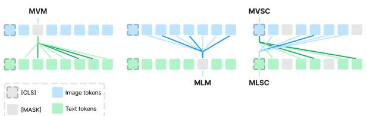
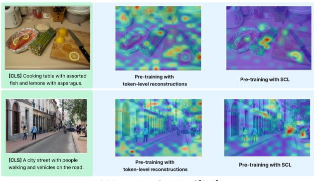
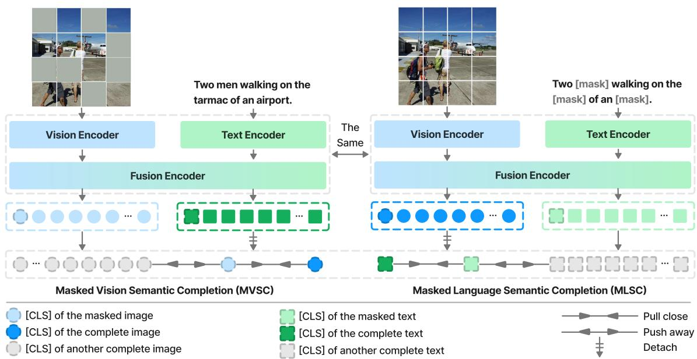
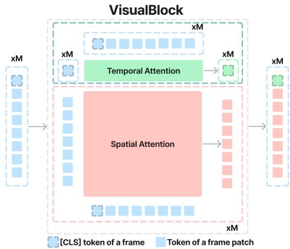
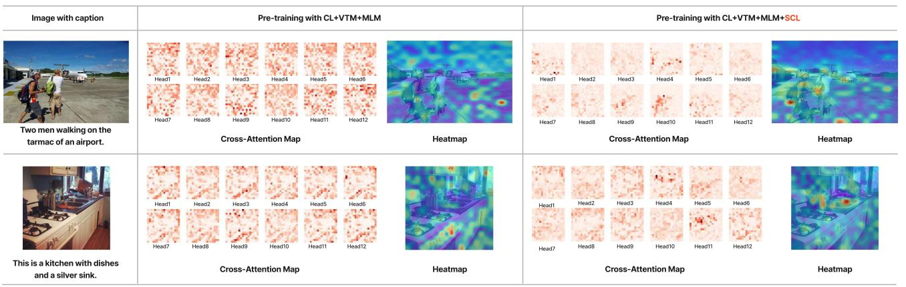

(b) Cross-Attention Map of [CLS]

# Seeing What You Miss: Vision-Language Pre-training with Semantic Completion Learning

Yatai Ji1\* Rongcheng Tu2\* Jie Jiang2\* Wenzhe Zhao2 Hongfa Wang2

Weijie Kong2 Chengfei Cai2 Yujiu Yang1† Wei Liu2†

1Tsinghua University 2Tencent

jyt21@mails.tsinghua.edu.cn turongcheng@gmail.com

{zeus, jacobkong, fletchercai, carsonzhao, hongfawang}@tencent.com yang.yujiu@sz.tsinghua.edu.cn wl2223@columbia.edu

## Abstract

Cross-modal alignment is essential for vision-language pre-training (VLP) models to learn the correct corresponding information across different modalities. For this purpose, inspired by the success ofmasked language modeling (MLM) tasks in the NLP pre-training area, numerous masked modeling tasks have been proposedfor VLP tofurther promote cross-modal interactions. The core idea ofprevious masked modeling tasks is to focus on reconstructing the masked tokens based on visible contextfor learning local-to-local alignment. However, most of them pay little attention to the global semanticfeatures generatedfor the masked data, resulting in a limited cross-modal alignment ability ofglobal representations. Therefore, in this paper, we propose a novel Semantic Completion Learning (SCL) task, complementary to existing masked modeling tasks, to facilitate global-tolocal alignment. Specifically, the SCL task complements the missing semantics of masked data by capturing the corresponding information from the other modality, promoting learning more representative globalfeatures which have a great impact on the performance of downstream tasks. Moreover, we present a flexible vision encoder, which enables our model to perform image-text and video-text multimodal tasks simultaneously. Experimental results show that our proposed method obtains state-of-the-art performance on various vision-language benchmarks, such as visual question answering, image-text retrieval, and video-text retrieval.

## 1. Introduction

Our real-world contains a wide variety of information, such as texts, images, sounds, etc. For a powerful general artificial intelligence system, it is necessary to capture the semantic association from different modality sources. Towards this goal, multimodal representation learning is a crucial technique to bridge the heterogeneity gap between different modalities [6, 36]. In this area, vision-language pre-training models [14, 21, 30, 35, 43] have shown an impressive semantic alignment ability, which brings substantial advances on various downstream tasks, for instance, visual question answering, image-text retrieval, etc.

  
(a) Cross-Attention Interaction of Masked Modeling

  
Figure 1. (a) The comparisons between previous masked modeling tasks and our proposed Semantic Completion Learning (SCL), which is composed of “MVSC” and “MLSC”. (b) The cross-modal attention map visualization of the text global representation ([CLS]) on the input image for our model pre-trained with or without SCL.

Recently, numerous self-supervised vision-language pretraining models [3, 10, 14, 17, 31, 32, 43] have been proposed. These methods model the interactions between vision and language features mainly by using various masked modeling tasks, such as masked language modeling (MLM) and masked vision modeling (MVM). As shown in Fig. 1(a), the basic idea of MLM and MVM is self-reconstructing the masked tokens via leveraging informative visible tokens to realize local-to-local alignment. Specifically, MLM adopted by BERT [24] is to predict the original vocabulary IDs of the masked words. Inspired by the success of MLM in pretraining, there is a flourishing trend to extend it to visual pretraining tasks. Generally, by masking some visual patches, MVM tasks predict their original pixels [13, 17], corresponding discrete tokens [4, 10, 46] generated by the VQ-VAE variants, or Histograms of Oriented Gradients (HOG) features [11], etc.

These masked modeling tasks only focus on reconstructing the local masked tokens, and pay little attention to recovering the missing global semantic information caused by data corruption. The token-level reconstruction may lead to inadequate learning of global representations for cross-modal information. As illustrated in Fig. 1(b), in the situation of token-level reconstructions, the global representation is disordered in its attention on the other modality. It implies that the global-to-local alignment ability of the pre-training model is limited, leading to a degraded global representation. However, the global semantic features have a great impact on the performance of the pre-training model as they are usually used to deal with downstream tasks. Therefore, it is crucial to ensure the global semantic features to learn more accurate global-to-local alignment.

Intuitively, considering that the paired vision and text data are two views of the same semantic information, the missing semantics of masked data can be completed by capturing information from the other modality. From this point of view, we propose a novel pre-training task called Semantic Completion Learning (SCL). Specifically, SCL is composed of dual parts: masked vision semantic completion (MVSC) and masked language semantic completion (MLSC). As shown in Fig. 1(a), MVSC (MLSC) exploits information of complete text (vision) data to recover the global semantic representations of masked vision (text) data. In this way, the model can generate representative global features with accurate global-to-local alignment. For example, as illustrated in Fig. 1(b), compared with the model pre-trained without SCL, the attention maps with SCL pre-training are more discriminative and reasonable.

For the architecture of the vision-language pre-training model, we adopt a general framework that consists of two uni-modal encoders and a fusion encoder. Moreover, we present a flexible vision encoder to enable our model to perform image-text and video-text multimodal tasks simultaneously. Specifically, for video inputs, the vision encoder only adds a few additional learning parameters, and the [CLS] feature of each frame is treated as a bridge associating spatial modeling within the frame and temporal modeling among frames. Inspired by curriculum learning [3], we train the model with image-text and video-text datasets successively to transfer visual knowledge from images to videos.

In a nutshell, our contributions are three-fold. (1) To enhance the global-to-local alignment of global representations, we propose a new pre-training task called Semantic Completion Learning (SCL), which recovers missing semantic information from unmasked data, promoting learning more representative global features. (2) We design an adaptive vision encoder, which can transfer multimodal pre-training knowledge between images and videos readily. (3) We conduct multiple vision-language downstream tasks to demonstrate the generalization of semantic completion learning, and the vision encoder, including visual question answering, visual reasoning, image-text retrieval, and video-text retrieval. Our model SCL achieves state-of-the-art performance based on a similar pre-training data scale. Our code is available at https://github.com/IIGROUP/SCL.

## 2. Related Works

## 2.1. Vision-Language Pre-training

Existing vision-language pre-training works can be divided into two categories: dual-tower and cross-fusion architecture.

The dual-tower architecture based methods [1–3, 12, 22, 39, 49] employ two individual encoders to separately extract the features for the visual data (images or videos) and textual data, and then map these features into a common semantic space. Among them, CLIP [39] exploits contrastive learn ing with a huge quantity of noisy image-text pairs directly collected from the Internet, achieving remarkable results on plenty of vision-language tasks. Similarly, FROZEN [3] proposes a curriculum learning schedule to train the vision language model on both image-text and video-text datasets by treating an image as a single-frame video. Although these two-stream architecture based methods perform well on cross-modal retrieval tasks with high efficiency, their performances on the more complex multimodal downstream tasks are not inspirational due to the insufficient interaction between local vision and text features.

To overcome this limitation, the cross-fusion architecture based methods [5, 9, 30, 31, 43] have been proposed, which employ a cross-modal fusion encoder to enhance the interactions between vision and text features. For example, ALBEF [1] not only aligns the image and text features with contrastive learning but also feeds them into a crossmodal attention-based encoder to obtain the fused features. Clover [18] improves cross-modal feature alignemnt and fusion via a tri-modal alignment pre-training task. Our model also conducts multimodal feature fusion to achieve encouraging performance on more downstream tasks.

  
Figure 2. The overview of our proposed Semantic Completion Learning (SCL). The two versions of an image-text pair are forward propagated, respectively, to perform masked vision/language semantic completion.

## 2.2. Masked Modeling Tasks

Recently, various masked modeling tasks have been proposed, whose strategy is self-reconstructing the masked data. Masked Language modeling (MLM) adopted by BERT [24] is the most classical one. It randomly masks some tokens of the input and then predicts the original vocabulary IDs of the masked words based on their context. By pre-training with the MLM, BERT achieves state-of-the-art results on eleven natural language processing (NLP) tasks. Inspired by the success of MLM in NLP, some works extend it into the visual domain and propose masked vision modeling (MVM). For example, VLMAE [17] proposes the Regional Masked Image Modeling (RMIM) task to facilitate the fusion of multimodal features. The RMIM masks some patches of an input image and then reconstructs the original pixels depending on the visible patches and the corresponding text. Similarly, VIOLET [10] proposes a masked visual-token modeling task, which first maps the original video frame patches into discrete visual tokens and then recovers the corresponding visual tokens of masked patches to train a joint encoder for the vision-language fusion. However, these tasks focus on reconstructing local masked tokens, ignoring the recovery of global semantic information of the masked data after cross-modal interactions. Hence, we propose a novel semantic completion learning (SCL) task.

## 3. Approaches

In this section, we first introduce our pre-training objectives in Sec. 3.1, and then describe the model architecture in Sec. 3.2. Please refer to Appendix A for the whole architec-

ture figure and the details of previous pre-training tasks.

## 3.1. Pre-training Tasks

## 3.1.1 Previous Pre-training Tasks

Contrastive Learning (CL). The input images and texts are projected into vision and language embedding spaces with two uni-modal encoders, respectively. We utilize contrastive learning to adjust the positions of semantic features, enforcing the paired image-text features close and negative samples far apart. Then the token-wise fusion is employed for features of different modalities in the unified semantic space.

Vision-Text Matching (VTM). VTM aims to determine the correspondence of an image-text pair. The model conducts a binary classification on the concatenation of vision and text global representations generated by the fusion encoder, which contributes to the overall alignment of different modalities.

Masked Language Modeling (MLM). MLM was first used as a pretext task in natural language processing and was later introduced to multi-modal pre-training. Following the text tokens masked out with a probability of 15%, the model attempts to predict the original words based on visual information and textual context. The token-level reconstruction task plays an important role in the way that the model learns to associate linguistic words and visual entities, realizing local-to-local semantic alignment.

## 3.1.2 Semantic Completion Learning (SCL)

It is significant for the model to learn multi-modal information fusion, that is, to extract knowledge from the other modality. Instead of local information reconstruction in former masked modeling tasks, we expect that the model can also recover the global semantics of masked images or texts after cross-modal interaction.

As shown in Fig. 2, for each data pair, we first randomly mask the image and text separately to get $\{ I _ { m a s k } , T \}$ and $\{ I , T _ { m a s k } \}$ , so that the masked one manages to learn semantic information from the other complete modality. Then the two couples of data are sent to the model respectively. The recovered features of masked data are obtained by leveraging information from the other modality to complete its missing semantic information:

$$
\begin{array} { r } { I _ { R e } , T _ { C o } = \mathrm { M o d e l } ( I _ { m a s k } , T ) , } \\ { I _ { C o } , T _ { R e } = \mathrm { M o d e l } ( I , T _ { m a s k } ) , } \end{array}\tag{1}
$$

where $I _ { R e } , T _ { R e }$ are recovered global features of masked data, and $I _ { C o } , T _ { C o }$ refer to global features of complete data. Then we conduct masked vision semantic completion (MVSC) and masked language semantic completion (MLSC) simultaneously. Specifically, we bridge the gap between recovered global features and the complete ones in the form of contrastive learning. The InfoNCE loss is adopted to maximize the mutual information (MI) between two versions of the input data pair, $\{ I _ { m a s k } , T \}$ and $\{ I , T _ { m a s k } \}$

$$
\begin{array} { r l } & { { \bf N C E } _ { V } = - \displaystyle \frac { 1 } { N } \sum _ { i = 1 } ^ { N } \log \frac { \exp ( s ( I _ { R e } ^ { i } , I _ { C o } ^ { i } ) / \tau ) } { \sum _ { n = 1 } ^ { N } \exp ( s ( I _ { R e } ^ { i } , I _ { C o } ^ { n } ) / \tau ) } , } \\ & { { \bf N C E } _ { L } = - \displaystyle \frac { 1 } { N } \sum _ { i = 1 } ^ { N } \log \frac { \exp ( s ( T _ { R e } ^ { i } , T _ { C o } ^ { i } ) / \tau ) } { \sum _ { n = 1 } ^ { N } \exp ( s ( T _ { R e } ^ { i } , T _ { C o } ^ { n } ) / \tau ) } , } \end{array}\tag{2}
$$

where s denotes cosine similarity and τ serves as the temperature hyper-parameter. The negative samples are global features of other complete images or texts in a batch. Note that $I _ { C o }$ and $T _ { C o }$ are detached for gradient backward, which makes the model more focused on the learning of recovering global features. Finally, the SCL loss is defined as:

$$
\mathcal { L } _ { S C L } = \mathbf { N C E } _ { V } + \mathbf { N C E } _ { L } .\tag{3}
$$

By minimizing $\operatorname { E q . } ( 3 )$ , it will make the global feature $I _ { R e }$ of the masked image similar to $I _ { C o }$ of the complete image $( T _ { R e }$ similar to $T _ { C o } )$ . To recover the semantic information of masked data, the global representations will learn supplementary knowledge from the corresponding tokens of the other modality, i.e., accurate global-to-local alignment.

## 3.2. Model Architecture

Our model consists of three components: Vision Encoder, Text Encoder, and Fusion Encoder.

  
Figure 3. The architecture of a VisualBlock.

## 3.2.1 Vision Encoder

Input. The vision encoder takes visual data (a video or image) $I \in \mathcal { R } ^ { M \times 3 \times H \times W }$ containing M frame(s) of resolution $H \times W$ as input, and when I is an image, $M = 1$ . The visual data I is first split into $M \times N$ patches $\ l { x } \in \mathcal { R } ^ { M \times 3 \times N \times P \times P }$ where $P \times P$ is the size of patches and $N = H W / P ^ { 2 }$ . Then, the patches x are transformed into M sequences of vision tokens $V = \{ \pmb { v } _ { i } \} _ { i = 1 } ^ { M } \in \mathcal { R } ^ { M \times N \times D } ;$ , where ${ \pmb v } _ { i } \in \mathcal { R } ^ { N \times D }$ denotes the sequence of tokens for the $i ^ { t h }$ frame in the visual data and D denotes the dimension of vision tokens. Next, a learnable [CLS] token is concatenated to every token sequence $v _ { i } ,$ and we obtain $V = \{ \pmb { v } _ { i } \} _ { i = 1 } ^ { M } \in \mathcal { R } ^ { M \times ( N + 1 ) \times D }$ Finally, the tokens V are summed with learnable spatial positional embeddings $E ^ { s } \in \mathcal { R } ^ { ( N + 1 ) \times D }$ and temporal positional embeddings $\check { E } ^ { t } \in \mathcal { R } ^ { M \times D }$

$$
\begin{array} { r } { \pmb { g } _ { i j } ^ { 0 } = \pmb { v } _ { i j } + \pmb { E } _ { i } ^ { t } + \pmb { E } _ { j } ^ { s } , } \end{array}\tag{4}
$$

where all patches in the same spatial location of different frames are given the same spatial positional embedding $\pmb { { E } } _ { j } ^ { s }$ and all patches in the same frame share the same temporal positional embedding $\mathbf { \mathcal { E } } _ { i } ^ { t }$

VisualBlock. The pre-processed vision tokens $\boldsymbol { G } ^ { 0 } \ : = \ :$ $\{ \pmb { g } _ { i } ^ { 0 } \} _ { i = 1 } ^ { M } \in \mathcal { R } ^ { M \times ( N + 1 ) \times D }$ are fed into the vision encoder which can process image and video data. The vision encoder is a modified ViT [8], containing a stack of VisualBlocks.

The detail of each VisualBlock is shown in Fig. 3. Specifically, each VisualBlock will perform temporal attention to exploit the global temporal information of the visual data, and conduct the spatial attention to capture sufficient local spatial semantic information. For temporal attention, we perform multi-head attention for the [CLS] tokens $\{ g _ { i 0 } ^ { l - 1 } \} _ { i = 1 } ^ { \dot { M } }$ of all frames through attending to all $M \times ( N + 1 )$ tokens to produce [CLS] tokens $\{ g _ { i 0 } ^ { l } \} _ { i = 1 } ^ { \breve { M } }$ . Regarding spatial attention, it is the multi-head attention within each frame. Taking the $i ^ { t h }$ frame as an example, we use $\{ g _ { i j } ^ { l - 1 } \} _ { j = \rvert } ^ { N }$ without [CLS] token as queries and all the $N + 1$ tokens in the frame as keys and values to conduct attention and obtain the output tokens $\{ \pmb { g } _ { i j } ^ { l } \} _ { j = 1 } ^ { N }$ . After the temporal attention and spatial attention are conducted, we concatenate the M [CLS] tokens $\{ \pmb { g } _ { i 0 } ^ { l } \} _ { i = 1 } ^ { M }$ with the $M \times N$ tokens $\{ \{ g _ { i j } ^ { l } \} _ { j = 1 } ^ { N } \} _ { i = 1 } ^ { M }$ of frame patches as the output of the VisualBlock, denoted as $G ^ { l } = \bar { \{ \pmb { g } _ { i } ^ { l } \} } _ { i = 1 } ^ { M }$

<table><tr><td rowspan="2">Model</td><td colspan="2">VQA2.0</td><td colspan="2">NLVR2</td></tr><tr><td>test-dev</td><td>test-std</td><td>dev</td><td>test-p</td></tr><tr><td colspan="5">Pre-trained with &gt;10M images</td></tr><tr><td>ALBEF(14M) [29] SimVLM [48] OFA [45]</td><td>75.84 77.87 78.0 78.25</td><td>76.04 78.14 78.1 78.32</td><td>82.55 81.72 82.15</td><td>83.14 81.77 82.24</td></tr><tr><td colspan="5">BLIP [28] Pre-trained with &lt;10M images</td></tr><tr><td>Oscar [31] UNITER [5] ViLT [25]</td><td>73.16 72.70 71.26</td><td>73.44 72.91</td><td>78.07 77.18 75.70</td><td>78.36 77.85 76.13</td></tr><tr><td>TCL [52] VLMo [47]</td><td>74.90 76.64</td><td>74.92 76.89</td><td>80.54 82.77</td><td>81.33 83.34</td></tr><tr><td>METER [9]</td><td>77.68</td><td>77.64</td><td>82.33</td><td>83.05</td></tr><tr><td>Ours</td><td>78.72</td><td>78.78</td><td>83.63</td><td>84.27</td></tr></table>

Table 1. Performance comparison on VQA2.0 and NLVR2.

## 3.2.2 Text Encoder

Given the input text T, we first tokenize it into word embeddings $\{ t _ { i } \} _ { i = 1 } ^ { K }$ , where K is the total number of words. Then, the text encoder, which consists of a stack of bidirectional transformers [44], maps $\{ t _ { i } \} _ { i = 1 } ^ { K }$ into token features ${ \cal W } = \{ w _ { i } \} _ { i = 1 } ^ { K }$ by modeling the contextual relationships.

## 3.2.3 Fusion Encoder

Similar to [9, 43], we adopt a two-stream architecture for the fusion encoder, each layer of which consists of two modalityspecific self-attention blocks and two cross-attention blocks. Specifically, taking the vision features as an example, following intra-modal interactions in the visual self-attention block, we conduct cross-modal interactions in the languageto-vision cross-attention block, which takes the vision tokens ${ \pmb G } = \{ { \pmb g } _ { i } \} _ { i = 1 } ^ { M }$ as queries and the text tokens ${ \cal W } = \{ { w _ { i } } \} _ { i = 1 } ^ { K }$ as keys and values. The text features are conducted with similar operations. In the end, we use the mean pooling of all the frame [CLS] tokens yielded by the fusion encoder as the global representation for visual data and the [CLS] token of text as the global representation for text data.

## 4. Experiments

## 4.1. Implementation Details

Following a recent line of works, we use COCO [33], Visual Genome (VG) [26], Conceptual Captions (CC3M) [41], and SBU Captions [37] for image-text pre-training, which contain 4M images in total. Then the pre-trained model is applied to image-text downstream tasks and the initialization for video-text pre-training. For the following video-text pre-training, we utilize WebVid [3] with 2.5M videos as the pre-training corpus. We employ an extensive set of evaluation benchmarks on a wide variety of vision-language understanding and retrieval tasks, including visual question answering (VQA2.0 [16]), visual reasoning (NLVR2 [42]), image-text retrieval (Flickr30K [38], COCO [33]), and videotext retrieval (MSRVTT [51], LSMDC [40]). We utilize CLIP-ViT-224/16 [39] and RoBERTa [34] to initialize vision and language encoders following METER [9]. For our proposed SCL, we adopt high mask ratios, 80% for images and 40% for texts. Other details of pre-training settings can be found in Appendix B.

<table><tr><td>Model</td><td colspan="6">Flicker30K-ZS</td></tr><tr><td></td><td>IR@1</td><td>IR@5</td><td>IR@10</td><td>TR@1</td><td>TR@5</td><td>TR@10</td></tr><tr><td colspan="7">Evaluate pre-trained models directly</td></tr><tr><td>UNITER [5]</td><td>66.16</td><td>88.40</td><td>92.94</td><td>80.70</td><td>95.70</td><td>98.00</td></tr><tr><td>ViLT [25]</td><td>55.0</td><td>82.5</td><td>89.8</td><td>73.2</td><td>93.6</td><td>96.5</td></tr><tr><td>ALIGN [23]</td><td>75.70</td><td>93.80</td><td>96.80</td><td>88.60</td><td>98.70</td><td>99.70</td></tr><tr><td>METER [9]</td><td>79.60</td><td>94.96</td><td>97.28</td><td>90.90</td><td>98.30</td><td>99.50</td></tr><tr><td>Ours</td><td>79.74</td><td>95.46</td><td>97.86</td><td>91.70</td><td>99.30</td><td>99.90</td></tr><tr><td colspan="7">Evaluate models fine-tuned on COCO</td></tr><tr><td>ALBEF [29]</td><td>76.8</td><td>93.7</td><td>96.7</td><td>90.5</td><td>98.8</td><td>99.7</td></tr><tr><td>ALBEF1 [29]</td><td>82.8</td><td>96.3</td><td>98.1</td><td>94.1</td><td>99.5</td><td>99.7</td></tr><tr><td>TCL [52]</td><td>79.6</td><td>95.1</td><td>97.4</td><td>93.0</td><td>99.1</td><td>99.6</td></tr><tr><td>Ours</td><td>81.74</td><td>96.72</td><td>98.54</td><td>94.80</td><td>99.60</td><td>100.00</td></tr></table>

Table 2. Performance comparison of zero-shot image-text retrieval on Flickr30K.

## 4.2. Evaluation Results

## 4.2.1 Image-Text Understanding

We conduct multimodal understanding tasks on VQA2.0 and NLVR2, which require the model to exploit vision and language semantic fusion. As the results shown in Table 1, SCL achieves new state-of-the-art performance compared with previous models, implying that cross-modal fusion benefits from our new pre-training task. Specifically, when pretrained with fewer than 10M images, our model outperforms METER [9] by +1.04 and +1.14 scores on VQA2.0 test-dev and test-std. On NLVR2, we gain +0.86 and +0.93 score improvements over VLMo [47], respectively. Moreover, our model pre-trained with 4M images also surpasses some models with more than 10M images, for instance, SimVLM [48], BLIP [28].

## 4.2.2 Image-Text Retrieval

We evaluate image-text retrieval in both zero-shot and finetuning scenarios. Our model achieves substantial performance improvements on Flickr30K and COCO datasets with similar model sizes and pre-training data scales. The results are also competitive with models pre-trained on larger datasets, such as ALIGN [23] and ALBEF [29]. In the finetuning phase, the model is trained with CL and VTM losses. During inference, for the sake of efficiency, we first filter top-k candidates with vision and language encoders and then compute VTM scores for ranking.

<table><tr><td rowspan="2">Model</td><td colspan="6">COCO</td><td colspan="6">Flickr30K</td></tr><tr><td>IR@1</td><td>IR@5</td><td>IR@10</td><td>TR@1</td><td>TR@5</td><td>TR@10</td><td>IR@1</td><td>IR@5</td><td>IR@10</td><td>TR@1</td><td>TR@5</td><td>TR@10</td></tr><tr><td colspan="9">Pre-trained with &gt; 10M images</td><td></td><td></td><td></td></tr><tr><td>ALIGN [23]</td><td>59.9</td><td>83.3</td><td>89.8</td><td>77.0</td><td>93.5</td><td>96.9</td><td>84.9</td><td>97.4</td><td>98.6</td><td>95.3</td><td>99.8</td><td>100.0</td></tr><tr><td>ALBEF(14M) [29]</td><td>60.7</td><td>84.3</td><td>90.5</td><td>77.6</td><td>94.3</td><td>97.2</td><td>85.6</td><td>97.5</td><td>98.9</td><td>95.9</td><td>99.8</td><td>100.0</td></tr><tr><td colspan="9">Pre-trained with &lt; 10M images</td><td></td><td></td><td></td></tr><tr><td>UNITER [5]</td><td>52.93</td><td>79.93</td><td>87.95</td><td>65.68</td><td>88.56</td><td>93.76</td><td>75.56</td><td>94.08</td><td>96.76</td><td>87.30</td><td>98.00</td><td>99.20</td></tr><tr><td>PixelBERT [20]</td><td>50.1</td><td>77.6</td><td>86.2</td><td>63.6</td><td>87.5</td><td>93.6</td><td>71.5</td><td>92.1</td><td>95.8</td><td>87.0</td><td>98.9</td><td>99.5</td></tr><tr><td>VinVL [53]</td><td>58.1</td><td>83.2</td><td>90.1</td><td>74.6</td><td>92.6</td><td>96.3</td><td></td><td></td><td></td><td></td><td></td><td></td></tr><tr><td>ALBEF(4M) [29]</td><td>56.80</td><td>81.50</td><td>89.20</td><td>73.10</td><td>91.40</td><td>96.00</td><td>82.80</td><td>96.70</td><td>98.40</td><td>94.30</td><td>99.40</td><td>99.80</td></tr><tr><td>SOHO [19]</td><td>50.6</td><td>78.0</td><td>86.7</td><td>66.4</td><td>88.2</td><td>93.8</td><td>72.5</td><td>92.7</td><td>96.1</td><td>86.5</td><td>98.1</td><td>99.3</td></tr><tr><td>TCL [52]</td><td>59.0</td><td>83.2</td><td>89.9</td><td>75.6</td><td>92.8</td><td>96.7</td><td>84.0</td><td>96.7</td><td>98.5</td><td>94.9</td><td>99.5</td><td>99.8</td></tr><tr><td>METER [9]</td><td>57.08</td><td>82.66</td><td>90.07</td><td>76.16</td><td>93.16</td><td>96.82</td><td>82.22</td><td>96.34</td><td>98.36</td><td>94.30</td><td>99.60</td><td>99.90</td></tr><tr><td>Ours</td><td>60.14</td><td>84.56</td><td>91.45</td><td>77.70</td><td>94.10</td><td>97.44</td><td>84.56</td><td>97.42</td><td>98.94</td><td>95.90</td><td>99.80</td><td>100.00</td></tr></table>

Table 3. Performance comparison of fine-tuned image-text retrieval on Flickr30K and COCO datasets.

<table><tr><td>Model</td><td colspan="3">MSRVTT</td><td colspan="3">LSMDC</td></tr><tr><td></td><td>R@1</td><td>R@5</td><td>R@10</td><td>R@1</td><td>R@5</td><td>R@10</td></tr><tr><td colspan="7">Fine-tune</td></tr><tr><td>VideoCLIP [49]</td><td>30.9</td><td>55.4.</td><td>66.8</td><td></td><td></td><td></td></tr><tr><td>Frozen [3]</td><td>31.0</td><td>59.5</td><td>70.5</td><td>15.0</td><td>30.8</td><td>39.8</td></tr><tr><td>VIOLET [10]</td><td>34.5</td><td>63.0</td><td>73.4</td><td>16.1</td><td>36.6</td><td>41.2</td></tr><tr><td>ALPRO [27]</td><td>33.9</td><td>60.7</td><td>73.2</td><td></td><td></td><td></td></tr><tr><td>MCQ [14]</td><td>37.6</td><td>64.8</td><td>75.1</td><td>17.9</td><td>35.4</td><td>44.5</td></tr><tr><td>MILES [15]</td><td>37.7</td><td>63.6</td><td>73.8</td><td>17.8</td><td>35.6</td><td>44.1</td></tr><tr><td>Clover [18]</td><td>38.6</td><td>67.4</td><td>76.4</td><td>22.7</td><td>42.0</td><td>52.6</td></tr><tr><td>Ours</td><td>43.2</td><td>76.0</td><td>86.7</td><td>32.8</td><td>62.5</td><td>72.9</td></tr><tr><td colspan="7">Zero-shot</td></tr><tr><td>VideoCLIP [49]</td><td>10.4</td><td>22.2</td><td>30.0</td><td></td><td></td><td></td></tr><tr><td>Frozen [3]</td><td>18.7</td><td>39.6</td><td>51.6</td><td>9.3</td><td>22.0</td><td>30.1</td></tr><tr><td>VIOLET [10]</td><td>25.9</td><td>49.5</td><td>59.7</td><td>一</td><td>-</td><td>一</td></tr><tr><td>ALPRO [27]</td><td>24.1</td><td>44.7</td><td>55.4</td><td></td><td></td><td></td></tr><tr><td>MCQ [14]</td><td>26.0</td><td>46.4</td><td>56.4</td><td>12.2</td><td>25.9</td><td>32.2</td></tr><tr><td>MILES [15]</td><td>26.1</td><td>47.2</td><td>56.9</td><td>11.1</td><td>24.7</td><td>30.6</td></tr><tr><td>Clover [18]</td><td>25.8</td><td>49.6</td><td>60.1</td><td>13.8</td><td>28.1</td><td>38.3</td></tr><tr><td>Ours</td><td>30.9</td><td>54.4</td><td>65.0</td><td>17.2</td><td>32.4</td><td>39.1</td></tr></table>

Table 4. Performance comparison of text-to-video retrieval on MSRVTT and LSMDC.

To investigate the generalization ability of our model, we conduct zero-shot experiments on the Flickr30K dataset. As shown in Table 2, SCL achieves the best performance in both settings of zero-shot retrieval on Flickr30K. When we evaluate with the pre-trained model directly, SCL gains a comprehensive boost from previous methods, reaching 79.74% and 91.7% in terms of IR@1 and TR@1. When evaluated with the model fine-tuned on COCO, SCL outperforms models pre-trained on datasets of similar sizes, including ALBEF [29] and TCL [52]. Moreover, compared with ALBEF pre-trained on 14M images, SCL also has a more impressive performance in five out of six recall metrics, further demonstrating the effectiveness of our proposed strategies.

For fine-tuning experiments, our model surpasses previous models by a large margin, as shown in Table 3. TCL [52] has a distinguished retrieval performance with triple contrastive learning, which is cross-modal, intra-modal, and global-local. Compared with TCL, our method brings +1.14%/ + 0.56% IR@1 boost and +2.10%/ + 1.00% TR@1 on COCO and Flickr30K, respectively. It is worth noting that our model also has higher scores than ALIGN [23] with 1.8B image-text pairs pre-trained. Thanks to semantic completion learning, the global features capture more crossmodal information, leading to an encouraging performance on retrieval.

## 4.2.3 Video-Text Retrieval

Due to our adaptable vision encoder, the image-text pretrained model can be readily transferred to video-text pretraining. We evaluate text-to-video retrieval on two popular datasets, MSRVTT and LSMDC, to prove the performance of the video pre-training model. Table 4 summarizes results under both fine-tuning and zero-shot settings. In the fine-tuning situation, compared with the previous SOTA model, SCL achieves notable performance improvements with +4.6% and +10.1% in R@1 on MSRVTT and LSMDC. When doing zero-shot retrieval, SCL also gains remarkable improvements over the existing methods with +4.8% and +3.4% in R@1 on MSRVTT and LSMDC, respectively. These results demonstrate that the knowledge of our SCL model learned from image-text data can be used to improve the performance of video-text retrieval tasks.

<table><tr><td rowspan="2">Pre-training tasks</td><td colspan="6">Flicker30K-ZS</td><td rowspan="2">VQA2.0 test-dev</td><td colspan="2">NLVR2</td></tr><tr><td>IR@1</td><td>IR@5</td><td>IR@10</td><td>TR@1</td><td>TR@5</td><td>TR@10</td><td>dev</td><td>test-p</td></tr><tr><td>Ours (MLM+VTM+CL+SCL)</td><td>70.4</td><td>91.1</td><td>95.2</td><td>86.2</td><td>97.3</td><td>99.2</td><td>77.59</td><td>81.01</td><td>81.89</td></tr><tr><td>w/o MLM</td><td>67.6</td><td>89.5</td><td>94.4</td><td>84.7</td><td>97.5</td><td>99.3</td><td>75.46</td><td>78.93</td><td>79.41</td></tr><tr><td>w/o VTM</td><td>49.7</td><td>78.5</td><td>87.2</td><td>61.1</td><td>86.4</td><td>94.7</td><td>76.96</td><td>77.86</td><td>79.54</td></tr><tr><td>w/o CL</td><td>67.8</td><td>90.7</td><td>94.9</td><td>82.5</td><td>97.3</td><td>99.1</td><td>77.66</td><td>81.10</td><td>82.18</td></tr><tr><td>w/o SCL</td><td>67.0</td><td>89.4</td><td>94.3</td><td>80.0</td><td>96.5</td><td>99.4</td><td>77.31</td><td>80.30</td><td>81.46</td></tr></table>

Table 5. Ablation study of each pre-training task. Note that the model pre-trained without VTM can only conduct zero-shot retrieval with vision and text encoders without feature fusion, so the recall metrics are not comparable to the others.

<table><tr><td rowspan="2">Pre-training tasks</td><td colspan="4">Flickr30K-ZS</td><td rowspan="2">VQA2.0 test-dev</td><td rowspan="2">NLVR2 test-p</td></tr><tr><td>IR@1</td><td>IR@5</td><td>TR@1</td><td>TR@5</td></tr><tr><td>MLM+VTM+CL</td><td>67.0</td><td>89.4</td><td>80.0</td><td>96.5</td><td>77.31</td><td>81.46</td></tr><tr><td>+MLSC</td><td>67.0</td><td>90.0</td><td>80.5</td><td>97.1</td><td>77.60</td><td>81.88</td></tr><tr><td>+MVSC</td><td>69.5</td><td>90.5</td><td>85.5</td><td>98.3</td><td>77.50</td><td>81.69</td></tr><tr><td>+SCL</td><td>70.4</td><td>91.1</td><td>86.2</td><td>97.3</td><td>77.59</td><td>81.89</td></tr></table>

Table 6. Ablation study of MLSC and MVSC.
<table><tr><td colspan="2">mask ratio</td><td rowspan="2"></td><td colspan="3">Flicker30K-ZS</td><td rowspan="2">VQA2.0 test-dev</td></tr><tr><td>image</td><td>text</td><td>IR@1 IR@5</td><td>TR@1</td><td>TR@5</td></tr><tr><td>0.7</td><td>0.4</td><td>68.8</td><td>90.6</td><td>84.0</td><td>97.7</td><td>77.51</td></tr><tr><td>0.8</td><td>0.3</td><td>69.5</td><td>90.5</td><td>83.8</td><td>97.6</td><td>77.63</td></tr><tr><td>0.8</td><td>0.4</td><td>70.4</td><td>91.1</td><td>86.2</td><td>97.3</td><td>77.59</td></tr><tr><td>0.8</td><td>0.5</td><td>68.8</td><td>90.5</td><td>81.9</td><td>97.4</td><td>77.63</td></tr><tr><td>0.9</td><td>0.4</td><td>68.6</td><td>90.6</td><td>82.8</td><td>97.3</td><td>77.57</td></tr></table>

Table 7. Effect of different image and text mask ratios.
<table><tr><td rowspan="2">Vision Encoder</td><td colspan="3">Video Retrieval</td><td colspan="3">Text Retrieval</td></tr><tr><td>R@1</td><td>R@5</td><td>R@10</td><td>R@1</td><td>R@5</td><td>R@10</td></tr><tr><td>Mean Pooling</td><td>23.0</td><td>45.6</td><td>56.5</td><td>22.5</td><td>46.4</td><td>54.9</td></tr><tr><td>Global CLS</td><td>22.5</td><td>45.9</td><td>55.1</td><td>22.4</td><td>45.7</td><td>55.5</td></tr><tr><td>Frame CLS</td><td>23.3</td><td>48.3</td><td>56.8</td><td>24.0</td><td>46.5</td><td>55.7</td></tr></table>

Table 8. Ablation study of the vision encoder on zero-shot retrieval of MSRVTT.

## 4.3. Ablation Studies

We conduct empirical ablation experiments on pretraining tasks and the vision encoder. Since pre-training is time-consuming, we use COCO and VG as pre-training datasets, which is also a common setting in previous works [19, 43, 50].

## 4.3.1 Different Pre-training Tasks

There are four pretext tasks in our method, including CL, VTM, MLM, and SCL. As summarized in Table 5, we explore the impact of each task on both retrieval and understanding datasets. The first row shows the results of our model with all pre-training tasks, and the second to fifth rows reflect the effect of removing each task separately. According to the chart, we observe that the retrieval performance drops most due to the lack of SCL when conducting retrieval with feature fusion. Specifically, SCL brings +3.38% and +6.20% boost in IR@1 and TR@1 on F30K-ZS. The model without MLM loses 2.13% in the accuracy of VQA2.0, which indicates that MLM has a great effect on multimodal understanding tasks. As for NLVR2, VTM has a relatively large impact. However, contrastive learning is only effective for retrieval in our model, which is per haps because the other three pre-training tasks have already learned cross-modal fusion sufficiently for understanding tasks. Overall, comparing the first row with the fifth row, the model with SCL makes progress on all downstream tasks, which demonstrates that the model learns more accurate cross-modal alignment to generate representative global features.

Furthermore, SCL comprises MVSC and MLSC, whose effects we showcase in Table 6. According to the first three rows, either MVSC or MLSC can improve the performance of downstream tasks. We find that MVSC has a superior impact on retrieval tasks, which is probably because it improves the robustness of visual information understanding. In VQA2.0 and NLVR2, MLSC plays a more important role. Additionally, when combining the two sub-tasks, our model performs better in most metrics, which indicates that they are in synergy.

## 4.3.2 Mask Ratio in SCL

As shown in Table 7, we observe that the mask ratios of image and text affect downstream tasks, especially on zeroshot retrieval. VQA2.0 is less sensitive to the mask ratio because the model has been fine-tuned with a large amount of data. Considering the second to fourth rows, when the image mask ratio is fixed, the model with a text mask ratio of 0.4 has almost the best performance. Moreover, when the text mask ratio is set to 0.4, the results of the image mask ratio of 0.8 are the highest. We speculate that when the mask ratio is lower, semantic completion will rely more on intra-modal information and lack learning across modalities, leading to inferior performance. When the mask ratio is too high, the small number of remaining tokens can only perform very limited cross-modal interactions. In conclusion, we choose 0.4 and 0.8 as text and image mask ratios, respectively.

  
Figure 4. The cross-attention visualization of text [CLS] on the whole image for the model pre-trained with or without SCL. The cross-modal attention maps of 12 heads are from the last layer of the fusion encoder. Then we depict heatmaps by max-pooling the attention maps.

## 4.3.3 Vision Encoder Design

To investigate the effectiveness of our designed vision encoder in processing video data, we compare it with two other variants: (1) The first variant, termed Mean Pooling, directly treats a video as M separate images and then uses the mean pooling of M [CLS] tokens as the video representation. (2) The second variant, termed Global CLS, is the vision encoder proposed by MCQ [14]. In this experiment, we pre-train the vision encoder and text encoder on the WebVid [3] dataset via contrastive learning and then conduct zero-shot crossmodal retrieval on the MSRVTT dataset. The experimental results are shown in Table 8, where the Frame CLS denotes our designed vision encoder. It can be found that Frame CLS achieves the best performance on both video-to-text and textto-video retrieval tasks, which demonstrates the outstanding capability of video temporal modeling.

## 4.4. Visualization Analysis

To demonstrate that SCL boosts cross-modal alignment for global representations, we visualize cross-attention maps between text [CLS] and the whole image in the last layer of the fusion encoder. We conduct max-pooling on attention maps of 12 heads to draw heatmaps, as shown in Fig. 1(b) and Fig. 4. Compared with pre-trained by CL, VTM and MLM, the model with SCL can recognize relevant regions more precisely. For example, in the first image of Fig 1(b), the attention distribution of global text representation to the image is scattered without SCL, while after semantic completion learning, [CLS] pays attention to the fish, lemons, asparagus in the image. Taking the second image of Fig 4 as another example, the model pre-trained with SCL identifies the dishes and sink in the kitchen, which indicates a desirable global-to-local alignment ability.

Observing attention maps of 12 heads in Fig. 4, we find that the attention maps without SCL are basically the same for an image, but for the model pre-trained with SCL, the attention maps of different heads are distinctive, which means that each head learns various information from the image. Overall, semantic completion learning encourages global representations to learn cross-modal interactions, extracting useful knowledge from the other modality. There are more visualization cases in Appendix C.

## 5. Conclusion

In this paper, we proposed a new vision-language pretraining task called Semantic Completion Learning (SCL). Different from previous pre-training tasks that reconstruct masked local tokens, SCL leverages cross-modal interactions to recover global semantic information of masked data, promoting cross-modal alignment for global representations. Ablation studies and visualization analysis demonstrate the effectiveness of SCL. Moreover, we introduced a flexible vision encoder, which adapts to image-text and video-text multimodal tasks readily. We conducted image-text and video-text pre-training sequentially and applied our model to various challenging downstream tasks. The extensive evaluations validate the great superiority of our SCL method.

## 6. Acknowledgements

This work was partly supported by the National Natural Science Foundation of China (Grant No. 61991450) and the Shenzhen Science and Technology Program (JSGG20220831093004008; ZDSYS20200811142605016).

## References

[1] Hassan Akbari, Liangzhe Yuan, Rui Qian, Wei-Hong Chuang, Shih-Fu Chang, Yin Cui, and Boqing Gong. VATT: transformers for multimodal self-supervised learning from raw video, audio and text. In NeurIPS, 2021. 2

[2] Alex Andonian, Shixing Chen, and Raffay Hamid. Robust cross-modal representation learning with progressive selfdistillation. In CVPR, 2022. 2

[3] Max Bain, Arsha Nagrani, Gul Varol, and Andrew Zisserman.¨ Frozen in time: A joint video and image encoder for end-toend retrieval. In ICCV, 2021. 1, 2, 5, 6, 8

[4] Hangbo Bao, Wenhui Wang, Li Dong, and Furu Wei. Vl-beit: Generative vision-language pretraining. CoRR, abs/2206.01127, 2022. 2

[5] Yen-Chun Chen, Linjie Li, Licheng Yu, Ahmed El Kholy, Faisal Ahmed, Zhe Gan, Yu Cheng, and Jingjing Liu. Uniter: Universal image-text representation learning. In ECCV, 2020. 2, 5, 6

[6] Xing Cheng, Hezheng Lin, Xiangyu Wu, Fan Yang, and Dong Shen. Improving video-text retrieval by multi-stream corpus alignment and dual softmax loss. CoRR, abs/2109.04290, 2021. 1

[7] Ekin Dogus Cubuk, Barret Zoph, Jonathon Shlens, and Quoc Le. Randaugment: Practical automated data augmentation with a reduced search space. In NeurIPS, 2020. 12

[8] Alexey Dosovitskiy, Lucas Beyer, Alexander Kolesnikov, Dirk Weissenborn, Xiaohua Zhai, Thomas Unterthiner, Mostafa Dehghani, Matthias Minderer, Georg Heigold, Sylvain Gelly, Jakob Uszkoreit, and Neil Houlsby. An image is worth 16x16 words: Transformers for image recognition at scale. In ICLR, 2021. 4

[9] Zi-Yi Dou, Yichong Xu, Zhe Gan, Jianfeng Wang, Shuohang Wang, Lijuan Wang, Chenguang Zhu, Pengchuan Zhang, Lu Yuan, Nanyun Peng, Zicheng Liu, and Michael Zeng. An empirical study of training end-to-end vision-and-language transformers. In CVPR, 2022. 2, 5, 6, 11

[10] Tsu-Jui Fu, Linjie Li, Zhe Gan, Kevin Lin, William Yang Wang, Lijuan Wang, and Zicheng Liu. VIOLET : End-toend video-language transformers with masked visual-token modeling. CoRR, abs/2111.12681, 2021. 1, 2, 3, 6, 12

[11] Tsu-Jui Fu, Linjie Li, Zhe Gan, Kevin Lin, William Yang Wang, Lijuan Wang, and Zicheng Liu. An empirical study of end-to-end video-language transformers with masked visual modeling. CoRR, abs/2209.01540, 2022. 2

[12] Valentin Gabeur, Chen Sun, Karteek Alahari, and Cordelia Schmid. Multi-modal transformer for video retrieval. In ECCV, 2020. 2

[13] Hongyu Gao, Chao Zhu, Mengyin Liu, Weibo Gu, Hongfa Wang, Wei Liu, and Xu-Cheng Yin. Calic: Accurate and efficient image-text retrieval via contrastive alignment and visual contexts modeling. In ACM Multimedia, 2022. 2

[14] Yuying Ge, Yixiao Ge, Xihui Liu, Dian Li, Ying Shan, Xiaohu Qie, and Ping Luo. Bridging video-text retrieval with multiple choice questions. In CVPR, 2022. 1, 6, 8, 12

[15] Yuying Ge, Yixiao Ge, Xihui Liu, Alex Jinpeng Wang, Jianping Wu, Ying Shan, Xiaohu Qie, and Ping Luo. MILES:

visual BERT pre-training with injected language semantics for video-text retrieval. CoRR, abs/2204.12408, 2022. 6

[16] Yash Goyal, Tejas Khot, Douglas Summers-Stay, Dhruv Batra, and Devi Parikh. Making the V in VQA matter: Elevating the role of image understanding in Visual Question Answering. In Proc. ofCVPR, 2017. 5

[17] Sunan He, Taian Guo, Tao Dai, Ruizhi Qiao, Chen Wu, Xiujun Shu, and Bo Ren. VLMAE: vision-language masked autoencoder. CoRR, abs/2208.09374, 2022. 1, 2, 3

[18] Jingjia Huang, Yinan Li, Jiashi Feng, Xiaoshuai Sun, and Rongrong Ji. Clover: Towards A unified video-language alignment and fusion model. CoRR, abs/2207.07885, 2022. 2, 6, 12

[19] Zhicheng Huang, Zhaoyang Zeng, Yupan Huang, Bei Liu, Dongmei Fu, and Jianlong Fu. Seeing out of the box: End-toend pre-training for vision-language representation learning. In CVPR, 2021. 6, 7

[20] Zhicheng Huang, Zhaoyang Zeng, Bei Liu, Dongmei Fu, and Jianlong Fu. Pixel-bert: Aligning image pixels with text by deep multi-modal transformers. CoRR, 2020. 6

[21] Yatai Ji, Junjie Wang, Yuan Gong, Lin Zhang, Yanru Zhu, Hongfa Wang, Jiaxing Zhang, Tetsuya Sakai, and Yujiu Yang. MAP: modality-agnostic uncertainty-aware vision-language pre-training model. CoRR, abs/2210.05335, 2022. 1

[22] Chao Jia, Yinfei Yang, Ye Xia, Yi-Ting Chen, Zarana Parekh, Hieu Pham, Quoc V. Le, Yun-Hsuan Sung, Zhen Li, and Tom Duerig. Scaling up visual and vision-language representation learning with noisy text supervision. In ICML, 2021. 2

[23] Chao Jia, Yinfei Yang, Ye Xia, Yi-Ting Chen, Zarana Parekh, Hieu Pham, Quoc V. Le, Yun-Hsuan Sung, Zhen Li, and Tom Duerig. Scaling up visual and vision-language representation learning with noisy text supervision. In ICML, 2021. 5, 6

[24] Jacob Devlin Ming-Wei Chang Kenton and Lee Kristina Toutanova. Bert: Pre-training of deep bidirectional transformers for language understanding. In NAACL-HLT, 2019. 2, 3, 11

[25] Wonjae Kim, Bokyung Son, and Ildoo Kim. Vilt: Vision-andlanguage transformer without convolution or region supervision. In ICML, 2021. 5

[26] Ranjay Krishna, Yuke Zhu, Oliver Groth, Justin Johnson, Kenji Hata, Joshua Kravitz, Stephanie Chen, Yannis Kalantidis, Li-Jia Li, David A. Shamma, Michael S. Bernstein, and Li Fei-Fei. Visual genome: Connecting language and vision using crowdsourced dense image annotations. Int. J. Comput. Vis., 2017. 5

[27] Dongxu Li, Junnan Li, Hongdong Li, Juan Carlos Niebles, and Steven C. H. Hoi. Align and prompt: Video-and-language pre-training with entity prompts. In CVPR, 2022. 6

[28] Junnan Li, Dongxu Li, Caiming Xiong, and Steven C. H. Hoi. BLIP: bootstrapping language-image pre-training for unified vision-language understanding and generation. In ICML, 2022. 5

[29] Junnan Li, Ramprasaath Selvaraju, Akhilesh Gotmare, Shafiq Joty, Caiming Xiong, and Steven Chu Hong Hoi. Align before fuse: Vision and language representation learning with momentum distillation. NeurIPS, 2021. 5, 6

[30] Wei Li, Can Gao, Guocheng Niu, Xinyan Xiao, Hao Liu, Jiachen Liu, Hua Wu, and Haifeng Wang. UNIMO: towards unified-modal understanding and generation via cross-modal contrastive learning. In ACL, 2021. 1, 2

[31] Xiujun Li, Xi Yin, Chunyuan Li, Pengchuan Zhang, Xiaowe Hu, Lei Zhang, Lijuan Wang, Houdong Hu, Li Dong, Furu Wei, Yejin Choi, and Jianfeng Gao. Oscar: Object-semantics aligned pre-training for vision-language tasks. In ECCV, 2020. 1, 2, 5

[32] Kevin Qinghong Lin, Alex Jinpeng Wang, Mattia Soldan, Michael Wray, Rui Yan, Eric Zhongcong Xu, Difei Gao, Rong-Cheng Tu, Wenzhe Zhao, Weijie Kong, Chengfei Cai, Hongfa Wang, Dima Damen, Bernard Ghanem, Wei Liu, and Mike Zheng Shou. Egocentric video-language pretraining. CoRR, abs/2206.01670, 2022. 1

[33] Tsung-Yi Lin, Michael Maire, Serge Belongie, James Hays, Pietro Perona, Deva Ramanan, Piotr Dollar, and C Lawrence´ Zitnick. Microsoft coco: Common objects in context. In ECCV, 2014. 5, 12

[34] Yinhan Liu, Myle Ott, Naman Goyal, Jingfei Du, Mandar Joshi, Danqi Chen, Omer Levy, Mike Lewis, Luke Zettlemoyer, and Veselin Stoyanov. Roberta: A robustly optimized BERT pretraining approach. CoRR, 2019. 5, 11

[35] Jiasen Lu, Dhruv Batra, Devi Parikh, and Stefan Lee. Vilbert: Pretraining task-agnostic visiolinguistic representations for vision-and-language tasks. In NeurIPS, 2019. 1

[36] Jiasen Lu, Christopher Clark, Rowan Zellers, Roozbeh Mottaghi, and Aniruddha Kembhavi. Unified-io: A unified model for vision, language, and multi-modal tasks. CoRR, abs/2206.08916, 2022. 1

[37] Vicente Ordonez, Girish Kulkarni, and Tamara L. Berg. Im2text: Describing images using 1 million captioned photographs. In NeurIPS, 2011. 5

[38] Bryan A. Plummer, Liwei Wang, Chris M. Cervantes, Juan C. Caicedo, Julia Hockenmaier, and Svetlana Lazebnik. Flickr30k entities: Collecting region-to-phrase correspondences for richer image-to-sentence models. In ICCV, 2015. 5, 12

[39] Alec Radford, Jong Wook Kim, Chris Hallacy, Aditya Ramesh, Gabriel Goh, Sandhini Agarwal, Girish Sastry, Amanda Askell, Pamela Mishkin, Jack Clark, Gretchen Krueger, and Ilya Sutskever. Learning transferable visual models from natural language supervision. In ICML, 2021. 2, 5, 11

[40] Anna Rohrbach, Marcus Rohrbach, Niket Tandon, and Bernt Schiele. A dataset for movie description. In CVPR, 2015. 5, 12

[41] Piyush Sharma, Nan Ding, Sebastian Goodman, and Radu Soricut. Conceptual captions: A cleaned, hypernymed, image alt-text dataset for automatic image captioning. In ACL, 2018. 5

[42] Alane Suhr, Stephanie Zhou, Ally Zhang, Iris Zhang, Huajun Bai, and Yoav Artzi. A corpus for reasoning about natural language grounded in photographs. In ACL, 2019. 5

[43] Hao Tan and Mohit Bansal. LXMERT: learning crossmodality encoder representations from transformers. In EMNLP, 2019. 1, 2, 5, 7

[44] Ashish Vaswani, Noam Shazeer, Niki Parmar, Jakob Uszkoreit, Llion Jones, Aidan N. Gomez, Lukasz Kaiser, and Illia Polosukhin. Attention is all you need. In NeurIPS, 2017. 5

[45] Peng Wang, An Yang, Rui Men, Junyang Lin, Shuai Bai, Zhikang Li, Jianxin Ma, Chang Zhou, Jingren Zhou, and Hongxia Yang. OFA: unifying architectures, tasks, and modalities through a simple sequence-to-sequence learning framework. In ICML, 2022. 5

[46] Wenhui Wang, Hangbo Bao, Li Dong, Johan Bjorck, Zhiliang Peng, Qiang Liu, Kriti Aggarwal, Owais Khan Mohammed, Saksham Singhal, Subhojit Som, and Furu Wei. Image as a foreign language: Beit pretraining for all vision and vision language tasks. CoRR, abs/2208.10442, 2022. 2

[47] Wenhui Wang, Hangbo Bao, Li Dong, and Furu Wei. Vlmo: Unified vision-language pre-training with mixtureof-modality-experts. CoRR, 2021. 5

[48] Zirui Wang, Jiahui Yu, Adams Wei Yu, Zihang Dai, Yulia Tsvetkov, and Yuan Cao. Simvlm: Simple visual language model pretraining with weak supervision. In ICLR, 2022. 5

[49] Hu Xu, Gargi Ghosh, Po-Yao Huang, Dmytro Okhonko, Armen Aghajanyan, Florian Metze, Luke Zettlemoyer, and Christoph Feichtenhofer. Videoclip: Contrastive pre-training for zero-shot video-text understanding. In EMNLP, 2021. 2, 6

[50] Haiyang Xu, Ming Yan, Chenliang Li, Bin Bi, Songfang Huang, Wenming Xiao, and Fei Huang. E2E-VLP: end-toend vision-language pre-training enhanced by visual learning. In ACL, 2021. 7

[51] Jun Xu, Tao Mei, Ting Yao, and Yong Rui. MSR-VTT: A large video description dataset for bridging video and language. In CVPR, 2016. 5, 12

[52] Jinyu Yang, Jiali Duan, Son Tran, Yi Xu, Sampath Chanda, Liqun Chen, Belinda Zeng, Trishul Chilimbi, and Junzhou Huang. Vision-language pre-training with triple contrastive learning. In CVPR, 2022. 5, 6

[53] Pengchuan Zhang, Xiujun Li, Xiaowei Hu, Jianwei Yang, Lei Zhang, Lijuan Wang, Yejin Choi, and Jianfeng Gao. Vinvl: Revisiting visual representations in vision-language models. In CVPR, 2021. 6