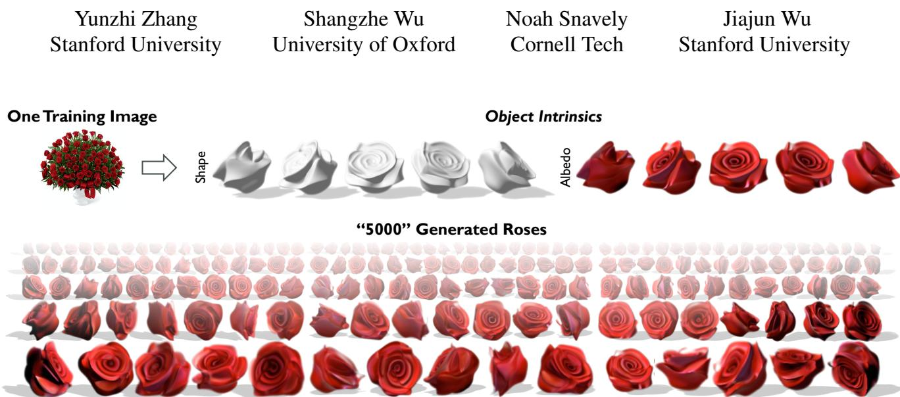
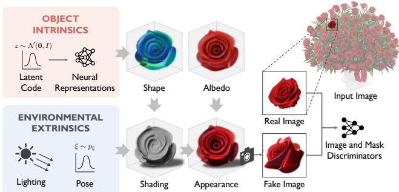
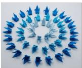
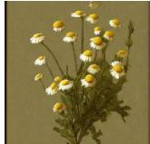
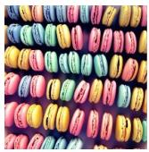
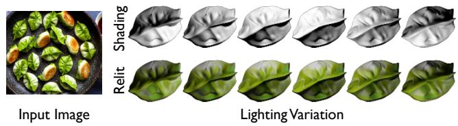
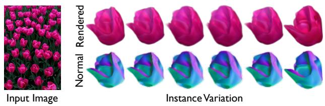
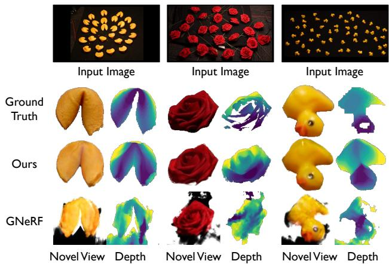
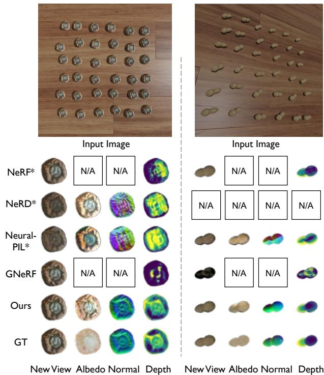

# Seeing a Rose in Five Thousand Ways

  
Figure 1. From a single image, our model learns to infer object intrinsics—the distributions of the geometry, texture, and material of object instances within the image. The model can then generate new instances of the object type, and it allows us to view the object under different poses and lighting conditions. Project page at https://cs.stanford.edu/˜yzzhang/projects/rose/.1

## Abstract

What is a rose, visually? A rose comprises its intrinsics, including the distribution ofgeometry, texture, and material specific to its object category. With knowledge of these intrinsic properties, we may render roses of different sizes and shapes, in different poses, and under different lighting condi tions. In this work, we build a generative model that learns to capture such object intrinsicsfrom a single image, such as a photo of a bouquet. Such an image includes multiple instances of an object type. These instances all share the same intrinsics, but appear different due to a combination of variance within these intrinsics and differences in extrinsic factors, such as pose and illumination. Experiments show that our model successfully learns object intrinsics (distribution ofgeometry, texture, and material)for a wide range ofobjects, each from a single Internet image. Our method achieves superior results on multiple downstream tasks, including intrinsic image decomposition, shape and image generation, view synthesis, and relighting.

## 1. Introduction

The bouquet in Figure 1 contains many roses. Although each rose has different pixel values, we recognize them as individual instances of the same type of object. Such understanding is based on the fact that these instances share the same object intrinsics—the distributions of geometry, texture, and material that characterize a rose. The difference in appearance arises from both the variance within these distributions and extrinsic factors such as object pose and environment lighting. Understanding these aspects allows us to imagine and draw additional, new instances of roses with varying shape, pose, and illumination.

In this work, our goal is to build a model that captures such object intrinsics from a single image, and to use this model for shape and image generation under novel viewpoints and illumination conditions, as illustrated in Figure 1.

This problem is challenging for three reasons. First, we only have a single image. This makes our work fundamentally different from existing works on 3D-aware image generation models [8, 9, 27, 28], which typically require a large dataset of thousands of instances for training. In comparison, the single image contains at most a few dozen instances, making the inference problem highly under-constrained.

Second, these already limited instances may vary significantly in pixel values. This is because they have different poses and illumination conditions, but neither of these factors are annotated or known. We also cannot resort to existing tools for pose estimation based on structure from motion, such as COLMAP [35], because the appearance variations violate the assumptions of epipolar geometry.

Finally, the object intrinsics we aim to infer are probabilistic, not deterministic: no two roses in the natural world are identical, and we want to capture a distribution of their geometry, texture, and material to exploit the underlying multi-view information. This is therefore in stark contrast to existing multi-view reconstruction or neural rendering methods for a fixed object or scene [25, 26, 40]. These challenges all come down to having a large hypothesis space for this highly under-constrained problem, with very limited visual observations or signals. Our solution to address these challenges is to design a model with its inductive biases guided by object intrinsics. Such guidance is two-fold: first, the instances we aim to present share the same object intrinsics, or the same distribution of geometry, texture, and material; second, these intrinsic properties are not isolated, but interweaved in a specific way as defined by a rendering engine and, fundamentally, by the physical world.

Specifically, our model takes the single input image and learns a neural representation of the distribution over 3D shape, surface albedo, and shininess of the object, factoring out pose and lighting variations, based on a set of instance masks and a given pose distribution of the instances. This explicit, physically-grounded disentanglement helps us explain the instances in a compact manner, and enables the model to learn object intrinsics without overfitting the limited observations from only a single image.

The resulting model enables a range of applications. For example, random sampling from the learned object intrinsics generates novel instances with different identities from the input. By modifying extrinsic factors, the synthesized instances can be rendered from novel viewpoints or relit with different lighting configurations.

Our contributions are three-fold:

1. We propose the problem of recovering object intrinsics, including both 3D geometry, texture, and material properties, from just a single image of a few instances with instance masks.

2. We design a generative framework that effectively learns such object intrinsics.

3. Through extensive evaluations, we show that the model achieves superior results in shape reconstruction and generation, novel view synthesis, and relighting.

<table><tr><td></td><td>Object Variance</td><td>Unknown Poses</td><td>Re- lighting</td><td>3D- Aware</td></tr><tr><td>SinGAN [36]</td><td>√</td><td>√</td><td></td><td></td></tr><tr><td>NeRF [26]</td><td></td><td></td><td></td><td>√</td></tr><tr><td>D-NeRF [32] GNeRF [25]</td><td>√</td><td>√</td><td></td><td>√ √</td></tr><tr><td>Neural-PIL [7]</td><td></td><td></td><td>√</td><td></td></tr><tr><td>NeRD [6]</td><td></td><td></td><td></td><td>√</td></tr><tr><td></td><td></td><td></td><td>√</td><td>√</td></tr><tr><td>EG3D [9]</td><td>√</td><td></td><td></td><td>√</td></tr><tr><td>Ours</td><td>√</td><td>√</td><td>√</td><td>√</td></tr></table>

Table 1. Comparisons with prior works. Unlike existing 3D-aware generative models, our method learns from a very limited number of observations. Unlike multi-view reconstruction methods, our method models variance among observations from training inputs.

## 2. Related Work

Generative Models with Limited Data. Training generative models [9, 20, 30] typically requires large datasets of thousands of images. ADA [19] proposes a differentiable data augmentation technique which targets a more data-limited regime, but still in the magnitude of a thousand. Several internal learning methods propose to exploit statistics of local image regions and are able to learn a generative model from a singe image for image synthesis [14, 22, 36, 37, 41] , or learn from a single video for video synthesis [16], but these methods typically do not explicitly reconstruct 3D geometry. Recently, SinGRAV [42] applies the multi-scale learning strategy from the internal learning literature to tackle the task of 3D-consistent scene generation, but training the model requires hundreds of observations for each scene. 3inGAN [18] proposes a generative model for scenes with self-similar patterns, and it requires multiple observations for the same scene with ground truth camera poses.

Intrinsics Image Decomposition. To disentangle object intrinsics from the extrinsic factors, we seek to find the distribution of true surface color for a type of object. This is closely connected to the classic task of intrinsics image decomposition, where an input image is decomposed into an albedo and shading map. This is a highly under-constraint problem, and prior works tackle the task of intrinsics image decomposition from a single image with heuristics assumptions such as global sparsity of the reflectance [3, 4, 23]. Several learning-based approaches [24, 44, 45, 47] adapt the heuristics as regularizations during training. Different from these methods, in this work we seek for training regularizations by exploiting the underlying multiview signals among observations.

Neural Volumetric Rendering. Several recent methods [26, 29, 40, 46] use neural volumetric rendering to learn implicit scene representations for 3D reconstruction tasks. In this work, we integrate an albedo field with the recent NeuS [40] representation for capturing the object intrinsics. These can be further extended to recover not only the geometry, but also material properties and illuminations from scenes [6,7,39,48, 50]. However, they typically require densely captured multiview observations for a single scene, and do not generalize across different instances as ours. Several methods [11, 32] extend the NeRF representation to handle variance among observations, but all these methods require ground truth camera poses while our method does not.

  
Figure 2. Model overview. We propose a generative model that recovers the object intrinsics, including 3D shape and albedo, from a single input image with multiple similar object instances with instance masks. To synthesize an image, we sample from the learned object intrinsics (orange box) to obtain the shape and albedo for a specific instance, whose identity is controlled by an underlying latent space. Then, environmental extrinsics (blue box) are incorporated in the forward rendering procedure to obtain shading and appearance for the instance. Finally, the 3D representation for appearance is used to render images in 2D under arbitrary viewpoints. These synthesized images are then used, along with the real examples from the input image, in a generative adversarial framework to learn the object intrinsics.

Table 1 gives an overall comparison of our method with prior works.

## 3. Method

Given a single 2D image I containing a few instances of the same type of object, together with K instance masks $\{ M _ { k } \} _ { k = 1 } ^ { K }$ and a roughly estimated pose distribution $p _ { \xi }$ over the instances, our goal is to learn a generative model that captures the object intrinsics of that object category, namely the distributions of 3D shape and surface albedo. We do not rely on any other geometric annotations, such as the exact pose of each individual instance, or a template shape.

As illustrated in Figure 2, for training, we sample a 3D neural representation from the object intrinsics (Sec. 3.1), and render 2D images with a physics-based rendering engine (Sec. 3.2), taking into account the environmental extrinsics. The object intrinsics is learned through an adversarial training framework (Sec. 3.3), matching the distribution of rendered 2D images with the distribution of masked instances from the input image.

## 3.1. Representations

We model each factor of the object intrinsics using a neural representation, including geometry, texture, and material. In order to model the variations among instances, the networks are conditioned on a latent vector $\mathbf { z } \in \mathbb { R } ^ { d } \left( d = 6 4 \right)$ drawn from a standard multivariate normal distribution.

To represent the geometry, we adopt a recent neural field representation based on NeuS [40], which parametrizes 3D shape using a Signed Distance Function (SDF). Specifically, $f _ { \theta } : \mathbb { R } ^ { 3 } \times \mathbb { R } ^ { d } $ R maps a spatial location $\mathbf { x } \in \mathbb { R } ^ { 3 }$ and a latent vector $\mathbf { z } \in \mathbb { R } ^ { d }$ to the signed distance of x from the object surface, where θ denotes network parameters. To simplify notations, z is omitted from now. With this SDF $f _ { \theta } ,$ an object surface can be expressed as the zero level set:

$$
S _ { \theta } = \{ \mathbf { x } \in \mathbb { R } ^ { 3 } \mid f _ { \theta } ( \mathbf { x } ) = 0 \} .\tag{1}
$$

To encourage the output of $f _ { \theta }$ to be a signed distance function, we impose an Eikonal regularizer [15]:

$$
\mathcal { L } _ { \mathrm { e i k o n a l } } ( \theta ) = \sum _ { \mathbf { x } \in \mathbb { R } ^ { 3 } } ( \| \nabla f _ { \theta } ( \mathbf { x } ) \| _ { 2 } - 1 ) ^ { 2 } .\tag{2}
$$

The surface normal $\mathbf { n } _ { \theta } : \mathbb { R } ^ { 3 } \times \mathbb { R } ^ { d } \to \mathbb { R } ^ { 3 }$ hence can be derived from the gradient of the SDF $\nabla _ { \mathbf x } f _ { \theta }$ through automatic differentiation.

To represent the texture, we use an albedo network $a _ { \psi }$ $\mathbb { R } ^ { 3 } \times \mathbb { R } ^ { \hat { d } } \to \mathbb { R } ^ { 3 }$ that predicts the RGB value of albedo associated with a spatial point $\mathbf { x } \in \mathbb { R } ^ { 3 }$ and a latent code $\mathbf { z } \in \mathbb { R } ^ { d }$ , where ψ denotes the trainable parameters.

To model the surface material, we optimize a shininess scalar $\alpha \in \mathbb { R }$ using a Phong illumination model, described next in Equation (3).

## 3.2. Forward Rendering

Lighting and Shading. We use a Phong illumination model under the effect of a dominant directional light source.

Let $\mathbf { l } _ { \mathrm { g l o b a l } } \in \mathbb { S } ^ { 2 }$ be the light direction, $k _ { d } , k _ { a } , k _ { s } \in \mathbb { R }$ the diffuse, ambient, and specular coefficients, and $\alpha \in$ R the shininess value. An instance with pose $\xi \in \operatorname { S E } ( 3 )$ receives an incoming light with direction $\mathbf { l } = \xi \mathbf { l } _ { \mathrm { g l o b a l } }$ in its canonical frame. The radiance color at spatial location $\mathbf { x } \in \mathbb { R } ^ { 3 }$ with viewing direction $\mathbf { v } \in \mathbb { R } ^ { 3 }$ is computed as

$$
c ( \mathbf { x } ) = s _ { \theta } ( \mathbf { x } ) a _ { \psi } ( \mathbf { x } ) + k _ { s } \operatorname* { m a x } \{ ( \mathbf { r } _ { \theta } ( \mathbf { x } , \mathbf { l } ) \cdot \mathbf { v } ) ^ { \alpha } , 0 \} ,\tag{3}
$$

where the diffuse component is given by

$$
s _ { \theta } ( { \bf x } ) = k _ { d } \operatorname* { m a x } \{ { \bf n } _ { \theta } ( { \bf x } ) \cdot { \bf l } , 0 \} + k _ { a } ,\tag{4}
$$

and $\mathbf { r } _ { \theta }$ is the reflection of l with normal direction $\mathbf { n } _ { \theta } ( \mathbf { x } )$

For initialization, $k _ { a } = 1 / 3 , k _ { d } = 2 / 3 , k _ { s } = 0 , \alpha =$ 10, and $\mathbf { l _ { \mathrm { { g l o b a l } } } }$ is estimated for each input image. These parameters are jointly optimized during training. $k _ { a } , k _ { d }$ are reparameterized as $k _ { a } = S ( \beta ) , k _ { d } = 1 - S ( \beta )$ , where $\beta \in \mathbb { R }$ and $S ( \beta ) = 1 / ( 1 + e ^ { - \beta } )$ is the sigmoid function.

Neural Volume Rendering. Next, we describe in detail the rendering operation, denoted as $\mathcal { R }$ . Without loss of generality, camera pose is fixed to be the identity. We assume access to an approximate prior pose distribution $p _ { \xi } .$ , from which instance poses $\xi \in \mathrm { S E } ( 3 )$ are sampled during training.

For each pixel to be rendered, we cast a ray from the camera center, which is set to be the origin, through the pixel. Points on the ray $\mathbf { r } ( r ) = r \mathbf { v }$ with viewing direction v are transformed to the canonical object frame $\xi \mathbf { r } ( r )$ before querying the shape and albedo networks.

The final color of the pixel $C ( \mathbf { r } ; \xi )$ is defined as:

$$
C ( \mathbf { r } ; \boldsymbol { \xi } ) = \int _ { 0 } ^ { + \infty } w ( r ) c ( \boldsymbol { \xi } \mathbf { r } ( r ) ) d r ,\tag{5}
$$

$$
\mathrm { w h e r e } w ( r ) = \frac { \phi _ { s } ( f _ { \theta } ( \xi \mathbf { r } ( r ) ) ) } { \int _ { 0 } ^ { + \infty } \phi _ { s } ( f _ { \theta } ( \xi \mathbf { r } ( u ) ) ) \ d u } .\tag{6}
$$

The weight function $w ( r )$ is same as derived in NeuS [40] to ensure unbiased surface reconstruction, where $\phi _ { s } ( x ) = $ $s e ^ { - s x } / ( 1 + e ^ { - s x } ) ^ { 2 }$ is the logistic density distribution with a global scaling parameter s.

The above integration is estimated as the sum of radiance colors of discrete samples along the ray weighted by densities. Specifically, for each ray, $N = 1 6$ points are sampled with training-time noise, and then $N _ { \mathrm { i m p o r t a n c e } } = 4$ points are obtained via importance sampling following the coarse-to-fine strategy in NeRF [26].

## 3.3. Generative Adversarial Training

As we do not assume known object instance poses, the neural field networks cannot be directly optimized using a reconstruction loss, as typically done in NeRFs [26]. Estimating the instance pose is a challenging problem since variations among instances make it difficult to establish correspondences. Instead, we use an adversarial network [13] to train the implicit representation from Sec. 3.2. Specifically, we train an image discriminator $D _ { \eta }$ which receives image crops around instances from real or fake scenes.

Image Crops. Rendering all object instances in the full scene with the volume rendering operation from Sec. 3.2 is memory-inefficient, since each instance typically only occupies a small region in the image plane. Instead, the generator renders only a crop around the object. To decide the crop offset, we project a unit sphere co-centered with the object to the image plane, and only render pixels contained in the axis-aligned bounding box of the projection. The crop-based rendering strategy prevents computing whether each ray from the camera intersects with the rendered object, which requires extra queries of the shape network.

Correspondingly, the discriminator receives image crops as inputs. Real image crops are obtained from $\{ I _ { k } \} _ { k = 1 } ^ { K }$ for

K instances in the input image I, where each $I _ { k }$ is the center crop of $I \odot M _ { k }$ . The crop size is set to be the maximum bounding box size among all instances.

Scale and Translation Augmentations. We design our framework such that the generator is 3D-consistent and the discriminator is 2D-scale- and 2D-translation-invariant. Specifically, we make the discriminator robust to the distribution shift of scale and translation between real and fake data distribution by applying random translation and random scaling to the 2D image crops as data augmentation.

The augmentation is also used in Adaptive discriminator augmentation (ADA) [19]. However, since the generator used in ADA does not have a 3D representation, it requires an augmentation probability $p < 1$ together with a tuning schedule to prevent the distorted distribution of augmented data from being leaked to the generator. The same technique is directly adopted in prior works with 3D-aware generators such as EG3D [9], also with $p < 1$ . In contrast, we exploit the fact that a 3D-aware physical rendering procedure enforces the geometric consistency by design and therefore would not suffer from distribution leakage with 2D augmentations. Therefore, across all experiments, we use $p = 1$

The augmentation stabilizes training given the limited amount of data, and improves robustness to the approximation error between the estimated and the real, unknown pose distribution for instances observed in the input image.

Discriminator Design. To stabilize training, the discriminator predicts the pose of the instance used to generate fake image crops. This regularization term is defined as:

$$
\mathcal { L } _ { \mathrm { p o s e } } = \Vert g _ { \mathrm { G S } } ( \hat { \xi } _ { \mathrm { r o t } } ) - g _ { \mathrm { G S } } ( \xi _ { \mathrm { r o t } } ) \Vert _ { 2 } ^ { 2 } ,\tag{7}
$$

where $\xi _ { \mathrm { r o t } }$ is the rotations sampled at generation, and $\hat { \xi } _ { \mathrm { r o t } }$ the one predicted from $D _ { \eta } ,$ , and $g _ { \mathrm { G S } }$ is the Gram-Schmidt process that maps a SO(3) rotations to a 6D embedding by dropping the last column, following [51].

In addition to $D _ { \eta } ,$ , we use a second discriminator $D _ { \eta _ { \mathrm { m a s k } } }$ for masks, which receives cropped masks from the generator and input instance masks. Empirically, we found the additional discriminator improve training stability.

Training Objective. Similar to GIRAFFE [28], we use the binary cross entropy loss as the adversarial training objective, with a regularization term on gradients of the discriminator:

$$
\begin{array} { r l } & { \quad \mathcal { L } _ { \mathrm { a d v } } ( \theta , \psi , \eta ) = \mathbb { E } _ { \xi \sim p _ { \xi } } \left[ f ( D _ { \eta } ( \mathcal { R } ( \xi ) ) ] \right. } \\ & { \quad \left. + \mathbb { E } _ { k \sim \{ 1 , \cdots , K \} } \left[ f ( - D _ { \eta } ( I _ { k } ) ) - \lambda _ { \mathrm { r e g } } \| \nabla D _ { \eta } ( I _ { k } ) \| ^ { 2 } \right] , \right. } \end{array}\tag{8}
$$

where $\mathcal { R } ( \xi )$ is the forward rendering operation in Sec. 3.2. The final training objective, thus, comprises four terms:

$$
\begin{array} { r l } & { \mathcal { L } ( \theta , \psi , \eta ) = \mathcal { L } _ { \mathrm { a d v } } ( \theta , \psi , \eta ) + \lambda _ { \mathrm { m a s k } } \mathcal { L } _ { \mathrm { a d v } } ( \theta , \psi , \eta _ { \mathrm { m a s k } } ) } \\ & { ~ + \lambda _ { \mathrm { p o s e } } \mathcal { L } _ { \mathrm { p o s e } } ( \eta ) + \lambda _ { \mathrm { e i k o n a l } } \mathcal { L } _ { \mathrm { e i k o n a l } } ( \theta ) . } \end{array}\tag{9}
$$

## 3.4. Training Details

Across all experiments, we use a resolution of $1 2 8 \times 1 2 8$ at training, and augment the background uniformly with a random color on both fake and real images. Weights of the loss terms in Eq. (9) are specified as $\lambda _ { \mathrm { r e g } } = 1 0 , \lambda _ { \mathrm { e i k o n a l } } =$ $1 0 , \lambda _ { \mathrm { p o s e } } ~ = ~ 1$ , and $\lambda _ { \mathrm { m a s k } } ~ = ~ 0 . 1$ or 1 depending on the training image. We adopt the generator backbone from StyleSDF [30] using SIREN [38] as the activation function. The backbone for both discriminators is adapted from GIRAFFE [28]. The detailed architecture is specified in the supplement. The shape network is initialized as a unit sphere centered at the origin. We use an Adam [21] optimizer with learning rates $2 e - 5$ and 1e 4 for the generator and discriminators, respectively.

## 4. Experiments

We test our method on a diverse set of real-world images and evaluate extensively on both real scanned objects and synthetic objects. Experiments show that our proposed method successfully recovers object intrinsics from in-thewild images, and achieves superior 3D reconstruction and synthesis results compared to prior art.

## 4.1. Learning from in-the-Wild Images

It is common to see online images with a group of similar objects placed in a scene. These images have unknown camera intrinsics or extrinsics, unknown object poses, and uncontrolled lighting conditions, all posing significant challenges to the task of 3D reconstruction and generative mod eling. We test whether our method can robustly recover the geometry and texture of objects and capture the variation among object instances under this challenging setting.

Dataset. We collect a set of 11 in-the-wild images containing multiple similar object instances, shown in Figures 1 and 3 to 5. Out of the 11 images, nine are Internet photos, and the other two are generated by Stable Diffusion [34] (the last two rows of Figure 3). These images altogether cover a diverse range of object categories.

To obtain foreground masks, we use a pre-trained model from $U ^ { 2 } .$ -Net [33], or manually segment the immages when $U ^ { 2 }$ -Net fails. We then run a connected-components-finding algorithm [5] on foreground pixels to obtain a set of instance masks. Examples of cropped real instances are shown in supp. mat. For each image, the camera is estimated as a pinhole camera with a field-of-view of $1 0 ^ { \circ }$ after cropping with the obtained instance masks. The pose distribution is estimated as randomly distributed either on a sphere, or across a 3D plane while remaining visible in the image, optionally with random rotations around an axis in the local object frame depending on the input image.

Results. We show qualitative results in Figure 3. For each training image, given only a handful of observations of masked instances, our method faithfully recovers the 3D geometry and texture of the object category.

<table><tr><td rowspan="2"></td><td>Depth</td><td colspan="3">Appearance</td><td rowspan="2">Generation</td></tr><tr><td>MSE↓</td><td>SSIM↑</td><td>PSNR↑</td><td>LPIPS↓</td></tr><tr><td>GNeRF [25]</td><td>0.12</td><td>5.39</td><td>0.29</td><td>0.62</td><td>FID↓ 353.61</td></tr><tr><td>Ours</td><td>0.01</td><td>19.89</td><td>0.75</td><td>0.13</td><td>204.63</td></tr></table>

Table 2. Results on shape and appearance reconstruction averaged over three real-world-captured scenes, evaluated on held-out instances. Compared to GNeRF, our method achieves significantly lower reconstruction error for both geometry and appearance, and better image generation quality measured by FID.

Furthermore, the physical disentanglement of environmental extrinsics and object intrinsics allows the proposed method to perform several inference tasks. Specifically, changes to poses or lighting, both components of the extrinsic configuration, correspond to novel-view synthesis (Figure 3) and test-time relighting (Figure 4), respectively. In addition, different samples from the learned object intrinsics (Figure 5) correspond to different instance identities, making it possible to synthesize novel instances unseen in the original image. In Figure 5, the shape and texture of generated instances vary across latent vectors, but poses remain relatively stable, showing that the model disentangles poses from the identity. See supp. mat. for more visualizations.

## 4.2. Shape Evaluation on Real Captured Scenes

Dataset. In order to quantitatively evaluate the reconstruction quality of the proposed method, we collect three scenes shown in Figure 6, where each scene contains 25-64 object instances of the same category. For each scene, we additionally capture an image held out from training, which contains three object instances in a different layout. We 3D-scan the test scene to obtain the ground truth depth maps. The preprocessing procedure is the same as described in Section 4.1. We approximate the prior pose distribution as follows: instances are randomly placed on the ground with a random rotation around the up axis in their local frames, and the camera has an elevation of $4 5 ^ { \circ }$ relative to the ground.

Metrics. We measure the quality of shape reconstruction using the scale-invariant mean squared error (MSE) on depth map predictions, defined as $\begin{array} { r } { \mathcal L ( \mathbf x , \hat { \mathbf x } ) : = \operatorname* { m i n } _ { \hat { \boldsymbol \alpha } \in \mathbb { R } } \| \mathbf x - \hat { \boldsymbol \alpha } \hat { \mathbf x } \| ^ { 2 } } \end{array}$ following [12]. The image reconstruction quality is measured by Peak Signal-to-Noise Ratio (PSNR), Structural Similarity Index Measure (SSIM) [43], and Learned Perceptual Image Patch Similarity (LPIPS) [49].

To evaluate the quality of image generation, we report Frechet Inception Distance (FID) [17], which measures the statistical difference of distributions of real and fake samples projected to the feature space of an neural network pre-trained on ImageNet [10]. In our case, the real and fake distributions are formed by all real image crops from the

(a) Input Image  

# UMM 光 业 业 米 福 35 CCOOOCODD C COCGGDNDE COCOGDODD

  
(b) Albedo  
(c) Normal  
(d) Shading (two views)  
(e) Shaded  
(f) Relit

Figure 3. Learning from images in the wild. Given a single 2D image containing dozens of similar object instances with masks, our model can recover a distribution of 3D shape and albedo from observations of the instances. We sample from the learnt distribution to obtain albedo and normal for a specific instance, as shown in column (b-c). Two columns in (d) show two different views for the same instance. At tes time, our model can synthesize instances under novel views shown in (e) and novel lighting conditions shown in (f).

training scene, and synthesized image crops rendered with random poses from the prior pose distribution, respectively.

Baselines. Most prior methods for 3D reconstruction are either designed to learn from multiple views of the same object instance or scene with no variations [26], or require a large dataset of on the order of 1k–10k images [9, 30]. Given the limited amount of observations available and with unknown poses, the method closest to our setting is GNeRF [25]. Given a prior pose distribution and a collection of multi-view images of a scene, GNeRF jointly estimates perimage camera poses and optimizes for a 3D representation by iteratively training a pose network and a NeRF [31]-based network with a discriminator loss. To train GNeRF, we use the image crops as multiple views of the same object.

<table><tr><td rowspan="2"></td><td>Normal</td><td>Depth</td><td colspan="3">Albedo</td><td colspan="3">View Synthesis</td><td colspan="3">Relighting</td></tr><tr><td>Angle(°)↓</td><td>MSE↓</td><td>PSNR↑</td><td>SSIM↑</td><td>LPIPS↓</td><td>PSNR↑</td><td>SSIM↑</td><td>LPIPS↓</td><td>PSNR↑</td><td>SSIM↑</td><td>LPIPS↓</td></tr><tr><td>NeRF* [26]</td><td></td><td>0.98</td><td></td><td></td><td>一</td><td>29.95</td><td>0.94</td><td>0.06</td><td>一</td><td>-</td><td></td></tr><tr><td>NeRD* [6]</td><td>79.64</td><td>30.85</td><td>13.63</td><td>0.83</td><td>0.21</td><td>18.47</td><td>0.84</td><td>0.18</td><td>18.22</td><td>0.84</td><td>0.19</td></tr><tr><td>Neural-PIL* [7]</td><td>69.50</td><td>31.03</td><td>18.24</td><td>0.85</td><td>0.15</td><td>25.42</td><td>0.88</td><td>0.10</td><td>24.86</td><td>0.87</td><td>0.11</td></tr><tr><td>GNeRF [25]</td><td></td><td>4.07</td><td></td><td>一</td><td></td><td>22.85</td><td>0.83</td><td>0.19</td><td></td><td></td><td>一</td></tr><tr><td>Ours</td><td>22.69</td><td>1.10</td><td>22.42</td><td>0.87</td><td>0.10</td><td>29.13</td><td>0.93</td><td>0.04</td><td>25.94</td><td>0.91</td><td>0.06</td></tr></table>

Table 3. Results on synthetic data. Our method yields better or comparable reconstruction quality compared to all baseline methods, including those with access to ground truth poses (denoted as ∗). It also achieves superior results on albedo decomposition and test-time relighting across all metrics.

  
Figure 4. Results for test-time relighting. The 6 columns show renderings with different lighting conditions unseen during training.

  
Figure 5. Results of interpolation in the latent space. From left to right, each column of images corresponds to an instance with a specific latent code interpolated between two latent vectors. Instances from all columns are rendered with the same pose.

Other multi-view reconstruction methods, such as-NeRF [26] and NeuS [40], require camera poses for each training image which are typically estimated with COLMAP [35]. Variations among instances and different lighting configurations make pixel-based matching very challenging on the converted multi-view data, and we found that COLMAP does not converge for any of the three scenes, making these baseline methods inapplicable.

Implementation Details. We train our method for 100k iterations for all scenes, and use the same pose distribution, as specified above, for both our method and the baseline.

During inference, for each held-out instance, we use GAN-inversion to find the pose and latent code associated with the instance. We freeze the model after training, and first randomly sample 1,000 poses from the prior pose distribution with a fixed latent code averaged over 10,000 samples in the latent space. The top-5 poses ranked by LPIPS errors are selected, and the latent code gets updated for 2,000 gradient steps for each pose, with an Adam [21] optimizer of learning rate 4e 3. The pose with the lowest LPIPS error after gradient updates is used for evaluation. For GNeRF [25], which is not conditioned on a latent code, we randomly sample 5,000 poses from the prior distribution, and use the one with the lowest LPIPS error for evaluation.

  
Figure 6. Qualitative results on real-world-captured scenes. Our method can reconstruct the geometry and appearance of novel instances held out from training more faithfully compared to the baseline method.

Results. Both quantitatively (Table 2) and qualitatively (Figure 6), our method achieves higher-fidelity synthesis results compared to the baseline method across all three scenes and all metrics. Our neural representations for geometry and appearance capture the distribution across observed instances as opposed to optimizing for one single instance as in GNeRF, which allows our method to better reconstruct novel instances unseen during training.

## 4.3. Intrinsics Evaluation on Synthetic Scenes

Dataset. To test if our model can recover object intrinsic properties such as albedo, we evaluate on synthetic data since we do not have ground truth albedo for real objects.

Our dataset has four scenes containing 36 instances each, rendered from two assets [1, 2] with two pose and lighting configurations. All instances are located on a ground plane, with a uniformly sampled rotation around the normal di rection of the ground plane. For each scene, we render 9 extra instances for evaluating novel view synthesis, and 9 for relighting. All scenes are shown in the supplement.

  
Figure 7. Results of intrinsic decomposition on synthetic datasets. NeRD [6] does not converge on the second dataset, denoted as N/A. GNeRF [25] does not decompose image intrinsics and does not directly predict normal, also denoted as N/A. ∗ denotes methods provided with ground-truth poses.

Metrics. We evaluate the normal prediction accuracy by angle deviation from the ground truth, and the albedo prediction with scale-invariant metrics. We use the same similarity metrics as in Section 4.2 for novel-view synthesis, relighting, and albedo comparisons. We measure depth accuracy with the scale-invariant MSE error. All predictions are first applied with ground truth masks before computing the metrics.

Baselines. While each training image receives a global illumination, the lighting configuration for each instance in the training image varies locally due to difference in poses. Therefore, we compare our model with two inverse rendering methods that handle varying light sources in training images, namely Neural-PIL [7] and NeRD [6]. Both methods jointly optimize for the shape, BRDF, and illumination from multi-view images with a NeRF [26]-based architecture. Neural-PIL additionally proposes to use a neural network as a proxy for the illumination integration procedure in forward rendering. We also compare with NeRF and GNeRF, which only perform 3D reconstruction.

Implementation Details. We train our method for 300k iterations for all scenes. Baseline methods are designed to train on a multi-view dataset, and we convert each scene into a multi-view dataset similar to Sec. 4.2. Neural-PIL, NeRD, and NeRF assume constant, ground-truth camera intrinsics across all multi-view images in the dataset. Since cropping around instances which have different locations in the scene results in inconsistent intrinsic parameters, we re-render each instance in the scene such that it is re-centered at the origin, with its rotation remaining the same. For completeness, we also report the results of training these methods without the re-centering operation in the supplement.

Results. As shown in Table 3, our method achieves significantly lower error in normal and appearance reconstruction compared to GNeRF, evaluated on held-out test views. The quality of both reconstruction and intrinsics decomposition is significantly better than Neural-PIL and NeRD, both requiring ground truth camera poses, and comparable with NeRF which also requires ground truth poses and does not perform intrinsic decomposition. Qualitative results for two exemplar scenes are shown in Figure 7. Full qualitative comparisons are deferred to the supplement.

## 5. Conclusion

We have proposed a method that recovers the object intrinsics—the distributions of geometry, texture, and material, separated from extrinsics such as poses and lighting, from a single image containing multiple instances of the same object type with masks. We have developed a neural representation to model such intrinsics and an adversarial framework for training. The proposed method successfully recovers object intrinsics on various objects from Internet images, enabling many applications including shape and image generation, novel view synthesis, and relighting.

Limitations. The proposed method assumes that multiple similar, non-occluded instances are present in the input image. We leave modeling more cluttered scenes to future work. We also approximate the light source with a single directional light. While this simple parameterization achieves reasonable results for input images with more complex illumination effects, the model is not able to model shadows and inter-reflection and tends to bake them into the albedo. Rows 3–4 of Figure 3 are examples of such failure case.

Acknowledgments. We thank Angjoo Kanazawa, Josh Tenenbaum, Ruocheng Wang, Kai Zhang, Yiming Dou, and Koven Yu for their feedback. This work is in part supported by the Stanford Institute for Human-Centered AI (HAI), NSF CCRI #2120095, NSF RI #2211258, ONR MURI N00014-22-1-2740, AFOSR YIP FA9550-23-1-0127, Amazon, Bosch, Ford, Google, and Samsung.

## References

[1] 3D model bun. https://www.blendswap.com/ blend/18213. 8

[2] 3D model peanut. https://www.blendswap.com/ blend/17808. 8

[3] Jonathan T Barron and Jitendra Malik. Color constancy, intrinsic images, and shape estimation. In ECCV, 2012. 2

[4] Jonathan T. Barron and Jitendra Malik. Shape, Illumination, and Reflectance from Shading. IEEE TPAMI, 2015. 2

[5] Federico Bolelli, Stefano Allegretti, Lorenzo Baraldi, and Costantino Grana. Spaghetti labeling: Directed acyclic graphs for block-based connected components labeling. IEEE TIP, 2019. 5

[6] Mark Boss, Raphael Braun, Varun Jampani, Jonathan T Barron, Ce Liu, and Hendrik Lensch. Nerd: Neural reflectance decomposition from image collections. In ICCV, 2021. 2, 3, 7, 8

[7] Mark Boss, Varun Jampani, Raphael Braun, Ce Liu, Jonathan T. Barron, and Hendrik P.A. Lensch. Neural-pil: Neural pre-integrated lighting for reflectance decomposition. In NeurIPS, 2021. 2, 3, 7, 8

[8] Eric Chan, Marco Monteiro, Petr Kellnhofer, Jiajun Wu, and Gordon Wetzstein. pi-gan: Periodic implicit generative adversarial networks for 3d-aware image synthesis. In CVPR, 2021. 1

[9] Eric R. Chan, Connor Z. Lin, Matthew A. Chan, Koki Nagano, Boxiao Pan, Shalini De Mello, Orazio Gallo, Leonidas Guibas, Jonathan Tremblay, Sameh Khamis, Tero Karras, and Gordon Wetzstein. Efficient geometry-aware 3D generative adversarial networks. In CVPR, 2022. 1, 2, 4, 6

[10] Jia Deng, Wei Dong, Richard Socher, Li-Jia Li, Kai Li, and Li Fei-Fei. Imagenet: A large-scale hierarchical image database. In CVPR, 2009. 5

[11] Yilun Du, Yinan Zhang, Hong-Xing Yu, Joshua B. Tenenbaum, and Jiajun Wu. Neural radiance flow for 4d view synthesis and video processing. In ICCV, 2021. 3

[12] David Eigen, Christian Puhrsch, and Rob Fergus. Depth map prediction from a single image using a multi-scale deep network. NeurIPS, 2014. 5

[13] Ian Goodfellow, Jean Pouget-Abadie, Mehdi Mirza, Bing Xu, David Warde-Farley, Sherjil Ozair, Aaron Courville, and Yoshua Bengio. Generative adversarial nets. In NeurIPS, 2014. 4

[14] Niv Granot, Ben Feinstein, Assaf Shocher, Shai Bagon, and Michal Irani. Drop the gan: In defense of patches nearest neighbors as single image generative models. In CVPR, 2022. 2

[15] Amos Gropp, Lior Yariv, Niv Haim, Matan Atzmon, and Yaron Lipman. Implicit geometric regularization for learning shapes. ICML, 2020. 3

[16] Niv Haim, Ben Feinstein, Niv Granot, Assaf Shocher, Shai Bagon, Tali Dekel, and Michal Irani. Diverse generation from a single video made possible. In ECCV, 2022. 2

[17] Martin Heusel, Hubert Ramsauer, Thomas Unterthiner, Bernhard Nessler, and Sepp Hochreiter. Gans trained by a two time-scale update rule converge to a local nash equilibrium. In NeurIPS, 2017. 5

[18] Animesh Karnewar, Tobias Ritschel, Oliver Wang, and Niloy Mitra. 3inGAN: Learning a 3D generative model from images of a self-similar scene. In 3DV, 2022. 2

[19] Tero Karras, Miika Aittala, Janne Hellsten, Samuli Laine, Jaakko Lehtinen, and Timo Aila. Training generative adversarial networks with limited data. In NeurIPS, 2020. 2, 4

[20] Tero Karras, Samuli Laine, and Timo Aila. A style-based generator architecture for generative adversarial networks. In CVPR, 2019. 2

[21] Diederik P Kingma and Jimmy Ba. Adam: A method for stochastic optimization. ICLR, 2015. 5, 7

[22] Vladimir Kulikov, Shahar Yadin, Matan Kleiner, and Tomer Michaeli. Sinddm: A single image denoising diffusion model. arXiv preprint arXiv:2211.16582, 2022. 2

[23] Pierre-Yves Laffont, Adrien Bousseau, Sylvain Paris, Fredo´ Durand, and George Drettakis. Coherent Intrinsic Images from Photo Collections. ACM TOG, 2012. 2

[24] Yunfei Liu, Yu Li, Shaodi You, and Feng Lu. Unsupervised learning for intrinsic image decomposition from a single image. In CVPR, 2020. 2

[25] Quan Meng, Anpei Chen, Haimin Luo, Minye Wu, Hao Su, Lan Xu, Xuming He, and Jingyi Yu. Gnerf: Gan-based neural radiance field without posed camera. In ICCV, 2021. 2, 5, 6, 7, 8

[26] Ben Mildenhall, Pratul P Srinivasan, Matthew Tancik, Jonathan T Barron, Ravi Ramamoorthi, and Ren Ng. Nerf: Representing scenes as neural radiance fields for view synthesis. In ECCV, 2020. 2, 4, 6, 7, 8

[27] Thu Nguyen-Phuoc, Chuan Li, Lucas Theis, Christian Richardt, and Yong-Liang Yang. Hologan: Unsupervised learning of 3d representations from natural images. In ICCV, 2019. 1

[28] Michael Niemeyer and Andreas Geiger. Giraffe: Representing scenes as compositional generative neural feature fields. In CVPR, 2021. 1, 4, 5

[29] Michael Niemeyer, Lars Mescheder, Michael Oechsle, and Andreas Geiger. Differentiable volumetric rendering: Learning implicit 3d representations without 3d supervision. In CVPR, 2020. 2

[30] Roy Or-El, Xuan Luo, Mengyi Shan, Eli Shechtman, Jeong Joon Park, and Ira Kemelmacher-Shlizerman. StyleSDF: High-Resolution 3D-Consistent Image and Geometry Generation. In CVPR, 2022. 2, 5, 6

[31] Keunhong Park, Utkarsh Sinha, Jonathan T. Barron, Sofien Bouaziz, Dan B Goldman, Steven M. Seitz, and Ricardo Martin-Brualla. Nerfies: Deformable neural radiance fields. ICCV, 2021. 7

[32] Albert Pumarola, Enric Corona, Gerard Pons-Moll, and Francesc Moreno-Noguer. D-NeRF: Neural Radiance Fields for Dynamic Scenes. In CVPR, 2020. 2, 3

[33] Xuebin Qin, Zichen Zhang, Chenyang Huang, Masood Dehghan, Osmar R Zaiane, and Martin Jagersand. U2-net: Going deeper with nested u-structure for salient object detection. Pattern Recognition, 2020. 5

[34] Robin Rombach, Andreas Blattmann, Dominik Lorenz, Patrick Esser, and Bjorn Ommer. High-resolution image¨

synthesis with latent diffusion models. arXiv preprint arXiv:2112.10752, 2021. 5

[35] Johannes Lutz Schonberger and Jan-Michael Frahm.¨ Structure-from-motion revisited. In CVPR, 2016. 2, 7

[36] Tamar Rott Shaham, Tali Dekel, and Tomer Michaeli. Singan: Learning a generative model from a single natural image. In ICCV, 2019. 2

[37] Assaf Shocher, Shai Bagon, Phillip Isola, and Michal Irani. Ingan: Capturing and retargeting the” dna” of a natural image. In ICCV, 2019. 2

[38] Vincent Sitzmann, Julien N.P. Martel, Alexander W. Bergman, David B. Lindell, and Gordon Wetzstein. Implicit neural representations with periodic activation functions. In NeurIPS, 2020. 5

[39] Dor Verbin, Peter Hedman, Ben Mildenhall, Todd Zickler, Jonathan T Barron, and Pratul P Srinivasan. Ref-nerf: Structured view-dependent appearance for neural radiance fields. In CVPR, 2022. 3

[40] Peng Wang, Lingjie Liu, Yuan Liu, Christian Theobalt, Taku Komura, and Wenping Wang. Neus: Learning neural implicit surfaces by volume rendering for multi-view reconstruction. In NeurIPS, 2021. 2, 3, 4, 7

[41] Weilun Wang, Jianmin Bao, Wengang Zhou, Dongdong Chen, Dong Chen, Lu Yuan, and Houqiang Li. Sindiffusion: Learning a diffusion model from a single natural image. arXiv preprint arXiv:2211.12445, 2022. 2

[42] Yujie Wang, Xuelin Chen, and Baoquan Chen. Singrav: Learning a generative radiance volume from a single natural scene. arXiv preprint arXiv:2210.01202, 2022. 2

[43] Zhou Wang, Alan C Bovik, Hamid R Sheikh, and Eero P Simoncelli. Image quality assessment: from error visibility to structural similarity. IEEE TIP, 2004. 5

[44] Felix Wimbauer, Shangzhe Wu, and Christian Rupprecht. De-rendering 3d objects in the wild. In CVPR, 2022. 2

[45] Shangzhe Wu, Ameesh Makadia, Jiajun Wu, Noah Snavely, Richard Tucker, and Angjoo Kanazawa. De-rendering the world’s revolutionary artefacts. In CVPR, 2021. 2

[46] Lior Yariv, Yoni Kasten, Dror Moran, Meirav Galun, Matan Atzmon, Ronen Basri, and Yaron Lipman. Multiview Neural Surface Reconstruction by Disentangling Geometry and Appearance. In NeurIPS, 2020. 2

[47] Ye Yu, Abhimetra Meka, Mohamed Elgharib, Hans-Peter Seidel, Christian Theobalt, and Will Smith. Self-supervised Outdoor Scene Relighting. In ECCV, 2020. 2

[48] Kai Zhang, Fujun Luan, Qianqian Wang, Kavita Bala, and Noah Snavely. Physg: Inverse rendering with spherical gaussians for physics-based material editing and relighting. In CVPR, 2021. 3

[49] Richard Zhang, Phillip Isola, Alexei A. Efros, Eli Shechtman, and Oliver Wang. The unreasonable effectiveness of deep networks as a perceptual metric. In CVPR, 2018. 5

[50] Xiuming Zhang, Pratul P Srinivasan, Boyang Deng, Paul Debevec, William T Freeman, and Jonathan T Barron. Nerfactor: Neural factorization of shape and reflectance under an unknown illumination. In SIGGRAPH Asia, 2021. 3

[51] Yi Zhou, Connelly Barnes, Jingwan Lu, Jimei Yang, and Hao Li. On the continuity of rotation representations in neural networks. In CVPR, 2019. 4