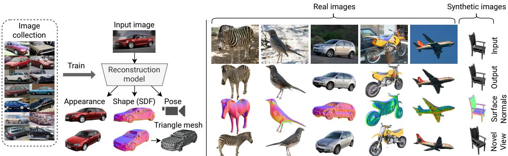
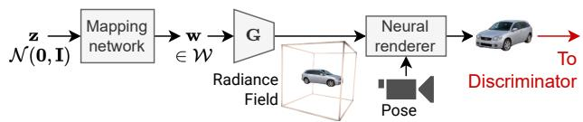
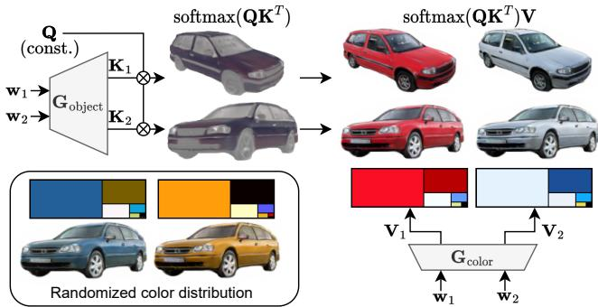
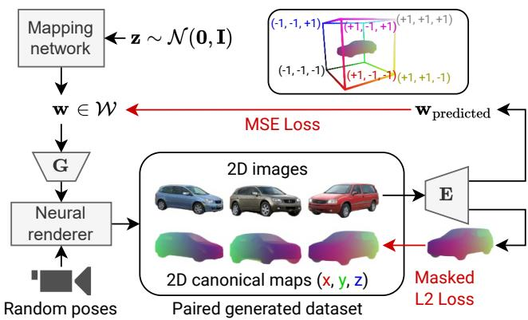
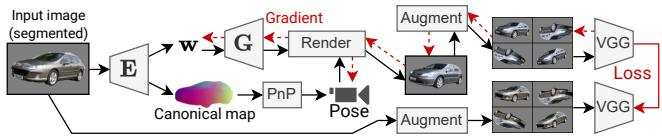
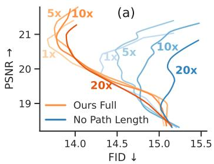
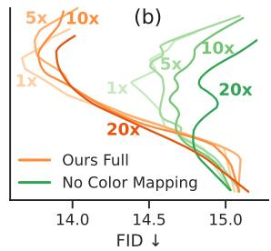
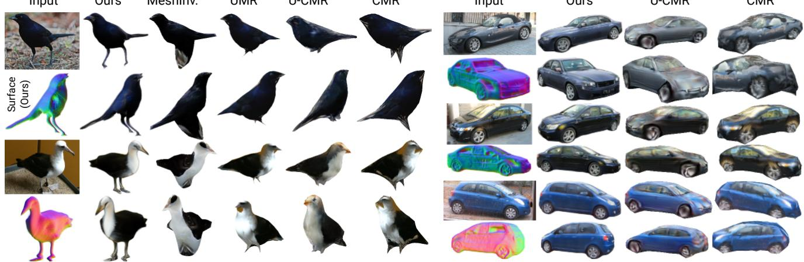
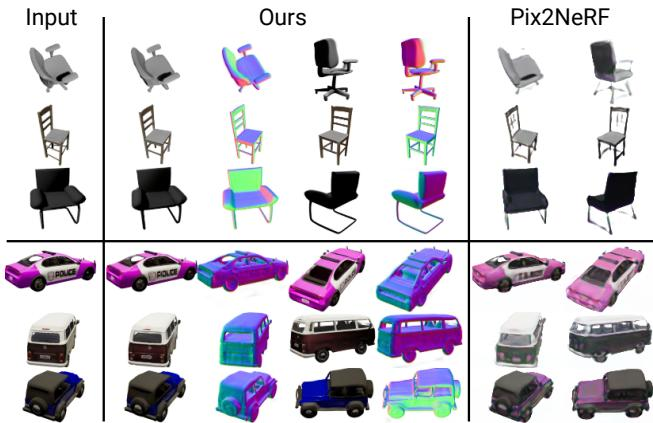
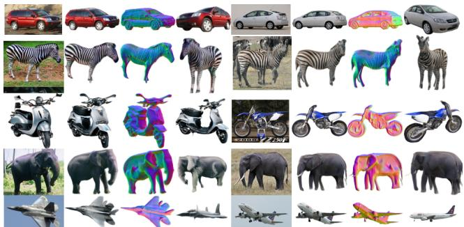

# Shape, Pose, and Appearance from a Single Image via Bootstrapped Radiance Field Inversion

Dario Pavllo1,2∗

David Joseph Tan2

1ETH Zurich

Marie-Julie Rakotosaona2

2Google

Federico Tombari2,3

3TU Munich

  
Figure 1. Given a collection of 2D images representing a specific category (e.g. cars), we learn a model that can fully recover shape, pose, and appearance from a single image, without leveraging multiple views during training. The 3D shape is parameterized as a signed distance function (SDF), which facilitates its transformation to a triangle mesh for further downstream applications.

## Abstract

Neural Radiance Fields (NeRF) coupled with GANs represent a promising direction in the area of 3D reconstruction from a single view, owing to their ability to efficiently model arbitrary topologies. Recent work in this area, however, has mostly focused on synthetic datasets where exact ground-truth poses are known, and has overlooked pose estimation, which is important for certain downstream applications such as augmented reality (AR) and robotics. We introduce a principled end-to-end reconstructionframeworkfor natural images, where accurate groundtruth poses are not available. Our approach recovers an SDF-parameterized 3D shape, pose, and appearancefrom a single image of an object, without exploiting multiple views during training. More specifically, we leverage an unconditional 3D-aware generator, to which we apply a hybrid inversion scheme where a model produces a first guess of the solution which is then refined via optimization. Ourframework can de-render an image in asfew as 10 steps, enabling its use in practical scenarios. We demonstrate state-of-theart results on a variety of real and synthetic benchmarks.

## 1. Introduction

We focus on single-view 3D reconstruction, where the goal is to reconstruct shape, appearance, and camera pose from a single image of an object (Fig. 1). Such a task has applications in content creation, augmented & virtual reality (AR/VR), robotics, and is also interesting from a scientific perspective, as most neural architectures cannot reason about 3D scenes. As humans, we learn object priors, abstract representations that allow us to imagine what a partially-observed object would look like from other viewpoints. Incorporating such knowledge into a model would enable higher forms of 3D reasoning. While early work on 3D reconstruction has focused on exploiting annotated data [16,20,57,63,72], e.g. ground-truth 3D shapes or multiple 2D views, more recent work has relaxed the assumptions required by the task. In particular, there has been effort in learning this task from single-view collections of images depicting a specific category [17, 27, 33] (e.g. a dataset of cars), and we also follow this line of work.

Most established 3D representations in the single-view reconstruction literature are based on deformable triangle meshes [17, 27, 33], although Neural Radiance Fields (NeRF) [1, 39] have recently become more prominent in the broader 3D vision community owing to their ability to efficiently model arbitrary topologies. These have been combined with GANs [18] for unconditional 3D generation tasks [5,6,40,62], as they produce more perceptually pleasing results. There has also been work on combining the two in the single-view reconstruction task, e.g. Pix2NeRF [4], which is however demonstrated on simple settings of faces or synthetic datasets where perfect ground-truth poses are available. Furthermore, there has been less focus overall on producing an end-to-end reconstruction system that additionally tackles pose estimation (beyond simple settings), which is particularly important for AR applications. In our work, we bridge this gap by proposing a more general NeRF-based end-to-end reconstruction pipeline that tackles both reconstruction and pose estimation, and demonstrate its broader applicability to natural images where poses cannot be accurately estimated. We further characterize the problem by comparing encoder-based approaches (the majority of methods in the single-view reconstruction literature) to inversion-based approaches (which invert a generator via optimization), and show that the latter are more suited to real datasets without accurate ground-truth poses.

Motivated by this, we propose a hybrid GAN inversion technique for NeRFs that can be regarded as a compromise between the two: an encoder produces a first guess of the solution (bootstrapping), which is then refined via optimization. We further propose a series of technical contributions, including: (i) the adoption of an SDF representation [65] to improve the reconstructed surfaces and facilitate their conversion to triangle meshes, (ii) regularizers to accelerate inversion, and (iii) the addition of certain equivariances in the model architecture to improve generalization. We show that we can invert an image in as few as 10 optimization steps, making our approach usable even in constrained scenarios. Furthermore, we incorporate a principled pose estimation framework [53] that frames the problem as a regression of a canonical representation followed by Perspective-n-Point (PnP), and show that it boosts pose estimation accuracy without additional data assumptions. We summarize our main contributions as follows:

• We introduce an end-to-end single-view 3D reconstruction pipeline based on NeRFs. In this setting, we successfully demonstrate 360◦ object reconstruction from natural images under the CMR [17] benchmark.

• We propose a hybrid inversion scheme for NeRFs to accelerate the reversal of pre-trained 3D-aware generators.

• Inspired by the literature on pose estimation, we propose a principled PnP-based pose estimator that leverages our framework and does not require extra data assumptions.

To validate our contributions, we obtain state-of-the-art results on both real/synthetic benchmarks. Furthermore, to our knowledge, we are the first to demonstrate NeRF-based reconstruction on in-the-wild datasets such as ImageNet.

We release our code and pretrained models at https:// github.com/google-research/nerf-from-image.

## 2. Related work

Inverse rendering and scene representations. Although 3D reconstruction is an established task, the representations and supervision methods used to tackle this problem have evolved throughout the literature. Early approaches have focused on reconstructing shapes using 3D supervision, adopting voxel grids [16, 20, 57, 63, 72], point clouds [14], or SDFs [43], and require synthetic datasets where ground-truth 3D shapes are available. The introduction of differentiable rendering [8, 9, 30, 35, 36] has enabled a new line of work that attempts to reconstruct shape and texture from single-view datasets, leveraging triangle mesh representations [2, 8, 17, 22, 27, 33, 69]. Each 3D representation, however, comes with its own set of trade-offs. For instance, voxels do not scale efficiently with resolution, while triangle meshes are efficient but struggle with arbitrary topologies (most works deform a sphere template). In recent developments, implicit representations encode a 3D scene as the weights of an MLP that can be queried at specific coordinates, which allows them to model arbitrary topologies using lightweight networks. In such a setting, there has been work on 3D reconstruction using implicit SDFs [12, 34] as well as neural radiance fields (NeRF) [1, 39]. Finally, some works incorporate additional structural information into 3D representations, e.g. [64] reconstructs articulated shapes using skeleton priors, [9,56] disentangle albedo from reflectance, and [61] uses depth cues. These techniques are orthogonal to ours and may positively benefit each other.

NeRF-based reconstruction. The standard use-case of a NeRF is to encode a single scene given multiple 2D views and associated camera poses, which does not necessarily lead to learned shared representations. There have however been attempts at learning an object prior by training such models on a category-specific dataset (e.g. a collection of cars). For instance, [26, 47] train a shared NeRF backbone conditioned on a learned latent code for each object instance. [66] tackles reconstruction conditioned on an image encoder, although it requires multiple ground-truth views for supervision and does not adopt an adversarial setting, thereby relying on accurate poses from synthetic datasets and leading to blurry results. [4, 38] adopt an adversarial setting and only require a single view during training, but they focus on settings with simple pose distributions. Finally, there has been work on using diffusion models [25, 55] and distillation [46] for novel-view synthesis, though such methods do not explicitly recover a 3D surface. Encoder- vs inversion-based methods. Most aforementioned methods can be categorized as encoder-based, where a 2D ConvNet encodes the input image into a latent representation, then decoded into a 3D scene. This paradigm is analogous to an autoencoder, and therefore requires some form of pixel-level loss between predicted and input images. While this is appropriate for synthetic datasets with exact poses, it leads to blurry or distorted results when such poses are inaccurate (i.e. the case in natural images). Following the 2D GAN inversion literature [58], there has been work on applying inversion methods to 3D reconstruction, where the goal is to leverage a pretrained unconditional GAN and find the latent code that best fits the input image via optimization. Since unconditional GANs tend to be more robust to inaccurate poses (as they mostly rely on the overall pose distribution as opposed to the pose of each image), we argue that inversion-based approaches are better suited to natural images. As part of our work, we characterize this phenomenon experimentally. 3D GAN inversion has been applied to untextured shapes [13, 68], textured triangle meshes [69], and its use with NeRF-based approaches is suggested in [4–6], although it is not their focus.

Our work. We propose a hybrid inversion paradigm, where an encoder produces a first guess of the latent representation and pose (bootstrapping), and these are then refined for a few iterations via optimization. Although [13] introduce a similar idea, they focus on shape completion from LiDAR data, whereas we focus on shape, pose, and appearance prediction from an image. Under our setting, Pix2NeRF [4] provides a proof-of-concept of refinement using such a method, but it is still trained using an encoderbased paradigm and is thus affected by the aforementioned issues. By contrast, we propose a principled end-to-end hybrid reconstruction approach that takes full advantage of an unconditional generator and can also optimize with respect to pose (unlike [4–6]), a task that requires a suitable pose parameterization. We also mention that [71] propose a similar idea to bootstrapping (without inversion), but they adopt a 2D image generator as opposed to a 3D-aware one, which does not fully disentangle pose from appearance.

Unconditional generation. Since inversion-based approaches rely on a pretrained generator, we briefly discuss recent architectures for this task. [23, 44, 45] learn to generate triangle meshes and textures using 2D supervision from single-view collections of natural images. [6] learns this task using NeRFs, although it suffers from the high computational cost of MLP-based NeRFs. [5,19,40,42,49,50,62] incorporate both 2D and 3D components as a trade-off between 3D consistency and efficiency. Finally, [15] proposes an approach to train a NeRF-based generator whose outputs can be distilled into triangle meshes. The generator used in our work leverages an EG3D-like backbone [5].

## 3. Method

We now present our single-view reconstruction approach. We break down our method into three main steps. (i) Initially, we train an unconditional generator following the literature on 3D-aware GANs [5, 6], where a NeRFbased generator G is combined with a 2D image discriminator. This framework requires minimal assumptions, namely 2D images and the corresponding pose distribution. We further apply a series of technical improvements to the overall framework in order to positively impact the subsequent reconstruction step, as explained in sec. 3.1. (ii) We freeze G and train an image encoder E that jointly estimates the pose of the object as well as an initial guess of its latent code (bootstrapping). For pose estimation, we adopt a principled approach that predicts a canonical map [53] in screen space followed by a Perspective-n-Point (PnP) algorithm. We explain these steps in sec. 3.2. Finally, (iii) we refine the pose and latent code for a few steps via gradient-based optimization (hybrid inversion), as described in sec. 3.3.

Requirements. For training, our method requires a category-specific collection of images, along with segmentation masks for datasets with a background (we use an offthe-shelf segmentation model, PointRend [32]), which we use to pre-segment the images. An approximate pose distribution must also be known. For inference, only a single, unposed input image is required.

## 3.1. Unconditional generator pre-training

  
Figure 2. Unconditional generation framework.

We adopt EG3D [5] as a starting point for the backbone of our generator. It consists of a mapping network that maps a prior $\mathbf { z } \sim \mathcal { N } ( \mathbf { 0 } , \mathbf { I } )$ to a latent code $\mathbf { w } \in \mathcal { W } .$ , the latter of which is plugged into a StyleGAN2 generator [29]. The output feature map is then split into three orthogonal planes (xy, xz, yz), which are queried at specific coordinates via bilinear sampling. The resulting features are finally summed and plugged into a tiny MLP (triplanar decoder) to output the values of the radiance field (density and color). The generator G is trained using a GAN framework where the discriminator takes 2D renderings as input. We apply some adjustments to the triplanar decoder and training objective, including the ability to model view-dependent effects as well as improvements to the adaptive discriminator augmentation (ADA) technique [28], which is used on small datasets (see Appendix A.1). In the next paragraphs, we focus on the changes that are central to our reconstruction approach. SDF representation. We found it beneficial to parameterize the object surface as a signed distance function (SDF), as opposed to the standard volume density parameterization adopted in EG3D [5]. In addition to an empirical advantage (sec. 5), SDFs facilitate the extraction of the surface and its subsequent conversion to other representations (e.g. triangle meshes), since they provide analytical information about surface boundaries and normals. SDFs have already been explored in unconditional generators [42] and in the broader NeRF literature [41, 54, 65, 67], but less so in the single-view reconstruction setting. We follow VolSDF [65], in which the volume density $\sigma ( \mathbf { x } )$ is described as:

$$
\sigma ( { \bf x } ) = ( 1 / \alpha ) \Psi _ { \beta } ( - d ( { \bf x } ) ) ,\tag{1}
$$

where x are the query coordinates, $d ( \mathbf { x } )$ is the SDF $( i . e .$ the output of the generator), and $\Psi _ { \beta }$ is the cumulative density function (CDF) of the Laplace distribution with scale $\beta$ and zero mean. $\alpha , \beta > 0$ are learnable parameters. We also incorporate an Eikonal loss to encourage the network to approximate a valid distance function:

$$
\mathcal { L } _ { \mathrm { E i k o n a l } } = \mathbb { E } _ { \mathbf { x } } [ ( \| \nabla _ { \mathbf { x } } d ( \mathbf { x } ) \| - 1 ) ^ { 2 } ] .\tag{2}
$$

We efficiently approximate the expectation using stratified sampling across the bounding volume of the scene, and employ a custom bilinear sampling implementation in the triplanar encoder which supports double differentiation w.r.t. the input query points. Furthermore, we initialize the SDF to a unit sphere via pre-training. Implementation details can be found in the Appendix A.1.

Removing super-resolution network. In [5], the rendered image is further processed through a super-resolution network, which increases its resolution and corrects for any distribution mismatch at the expense of 3D consistency. Since we aim to address fully 3D-consistent reconstruction instead of a more relaxed novel-view-synthesis task, we remove this component and feed the rendered image directly through the discriminator. This choice also makes it easier to fairly compare our approach to existing work.

Attention-based color mapping. A robust 3D reconstruction technique should be as much as possible equivariant to certain transformations in order to improve generalization on unseen data. These include geometric transformations (e.g. a 2D translation in the input image should be reflected in the 3D pose, which motivates our principled pose estimation technique in sec. 3.2) as well as color transformations, e.g. changing the hue of an object (an image of a red car into that of a white car) should result in an equivalent change in the radiance field. As an extreme example, without such an equivariance incorporated in the architecture, a model trained on a dataset of red cars will not generalize to one of white cars. This motivates us to disentangle the color distribution from the identity (pseudo-“semantics”) of the generated objects, as shown in Fig. 3.

Our formulation is a soft analogy to UV mapping, where the lookup is done through an attention mechanism instead of texture coordinates. This approach additionally provides simple manipulation capabilities (see Fig. 3). A useful property of our formulation is that the color mapping operator is linear w.r.t. the colors. It can be applied either before (in the radiance field sampler) or after the rendering operation (in the rendered multi-channel “semantic image”), since the rendering operation is also linear w.r.t. the colors.

  
Figure 3. Illustration of our color mapping technique with two objects generated by two different latent codes $\mathbf { w } _ { 1 }$ and $\mathbf { w } _ { 2 }$ . The object generator models a latent radiance field of keys K (each of which represents a semantic embedding at a specific spatial position), which are multiplied with a fixed set of queries Q (i.e. learned prototype embeddings for each “semantic channel”) and processed through a softmax to produce a probability distribution across these semantic channels, whose meaning is learned. In the case of cars, the learned semantic channels include body, headlights, wheels, and reflections. In the image, we show a rendering of the result of this operation in false colors, where the weight of one of the classes (car body) is highlighted. Finally, the latter is multiplied with the values V (color distribution, i.e. a color for each semantic channel) produced by another module (color network), resulting in the final RGB colors. While during training the same latent code goes into both networks so as to learn the correct data distribution, at inference we can split it to swap the color distribution among different object identities (top-right) or randomize it entirely (bottom-left).

In a reconstruction scenario, this allows the end user to efficiently reproduce the color distribution of the input image with a single rendering pass. In sec. 5 we show that, in addition to the useful manipulation properties, this module leads to an empirical advantage in the reconstruction task.

Path Length Regularization revisited. Initially proposed in StyleGAN2 [29], this regularizer encourages the mapping between the latent space W and the output space Y to be orthogonal, which facilitates inversion (recovering the latent code w corresponding to a certain image via optimization). This is achieved by applying a gradient penalty to the Jacobian $\partial g ( \mathbf { w } ) / \partial \mathbf { w }$ . The use of path length regularization on the full backbone, however, is prohibitively expensive as this term requires double differentiation, and this feature was dropped in EG3D [5]. We propose to reinstate a more efficient variant of this regularizer which computes the path length penalty up to the three orthogonal planes, leaving the triplanar decoder unregularized. We find that this compromise provides the desired benefits without a significant added computational cost, as the main bottleneck is represented by the triplanar decoder, and enables us to greatly increase the learning rate during the inversion process (and in turn reduce the number of iterations).

## 3.2. Bootstrapping and pose estimation

Given a pretrained generator, it is in principle possible to invert it using one of the many techniques described in the literature for 2D images [48], which usually involve minimizing some pixel-level loss (e.g. L1 or VGG) w.r.t. the input latent code. For the 3D case, the minimization needs to be carried out over both the latent code and camera pose. In practice, however, recovering the camera pose is a highly non-convex problem that can easily get stuck in local minima. It is also crucial that the initial pose is “good enough”, otherwise the latent code will converge to a degenerate solution. Therefore, most approaches [4, 5] initialize the pose using an off-the-shelf pose estimator and only carry out the optimization w.r.t. the latent code. Moreover, existing approaches start from an average or random latent code [5,69], resulting in a slow convergence (often requiring hundreds of steps), which makes these methods less applicable to realtime scenarios. This motivates our hybrid inversion scheme, where an encoder produces a first guess of the latent code and pose, and these are both refined for a small number of iterations. Thanks to the ensuing acceleration, we can invert an image in as few as 10 optimization steps.

Pose estimation. In previous methods [4, 17, 27, 33], poses are estimated by directly regressing the pose parameters (e.g. view matrix or quaternion/scale/translation). While this strategy can learn the task to some extent, it does not effectively incorporate the equivariances required by the problem (e.g. translation equivariance) and instead relies on learning them from the data, potentially generalizing poorly in settings other than simple synthetic datasets. More principled approaches can be found in the pose estimation literature, such as NOCS [53], which frames the problem as a regression of a canonical map (NOCS map) in image space, i.e. a 2D rendering of the $( x , y , z )$ world-space coordinates of an object (Fig. 4). The mapping is then inverted using a Perspective-n-Point (PnP) solver to recover the pose parameters. The main limitation of NOCS [53] is that it requires either ground-truth 3D meshes or hand-modeled synthetic meshes that are representative of the training dataset, since ground-truth canonical maps are not available on real datasets. By contrast, our availability of an object generator allows us to overcome this limitation, as we describe next.

Training and inference. The main idea underlying our approach – in contrast to NOCS [53] – is that we use data generated from our unconditional generator to train the encoder instead of handcrafted data. This allows us to obtain a mapping between latent codes and images, as well as pseudoground truth canonical maps that we can use for pose estimation. During training, we sample a minibatch of priors $\mathbf { z } \sim \mathcal { N } ( \mathbf { 0 } , \mathbf { I } )$ , feed them through the mapping network to obtain the latent codes $\textbf { w } \in { \mathcal { W } } .$ , and generate the corresponding RGB images and canonical maps from randomlysampled viewpoints1. Finally, we train the network (a Seg-Former [60] segmentation network with a custom regression head) to predict the canonical map and the latent code w from the RGB image. Losses, detailed architecture, and hyperparameters are described in the Appendix A.1. For inference, we feed a real image, convert the predicted canonical map to a point cloud, and run a PnP solver to recover all pose parameters (view matrix and focal length).

  
Figure 4. Data generation process for training the encoder (E). We randomly generate synthetic batches of images and associated 2D canonical maps. The encoder is then trained to predict the latent code and canonical map from the RGB image. We then use real images for inference. See also the bounding volume on top, which describes how colors should be interpreted.

## 3.3. Reconstruction via hybrid GAN inversion

  
Figure 5. Hybrid inversion process. From the input image, the encoder E predicts an initial latent code w and a canonical map, the latter of which is used to recover the pose parameters through a PnP solver. Both w and the pose are then refined via optimization using a multi-crop VGG loss.

The final step of our pipeline is the refinement of the latent code and pose via gradient-based optimization (Fig. 5). In this step, we found it beneficial to split the initial latent code w into a different vector for each layer, which we refer to as $\mathbf { w } ^ { + } \in \mathcal { W } ^ { + }$ . For a fixed number of steps N, we update $\mathbf { w } ^ { + }$ and the pose to minimize a reconstruction error between the rendered image and the input image. We experimented with various loss functions including MSE, L1 and a VGG perceptual loss [70], finding that the former two lead to overly blurry results. Eventually, we settled on a VGG loss [70] with random augmentations, where both the predicted and target images are randomly augmented with geometric image-space transformations (we use 16 augmentations and average their losses). This helps reduce the variance of the gradient, allowing us to further increase the learning rate. We also find that the pose parameterization is an important aspect to consider, and describe it in detail in the Appendix A.1 (among additional details for this step).

## 4. Experimental setting

We compare against two main directions from the singleview 3D reconstruction literature: real images, following CMR [27], and synthetic images, following Pix2NeRF [4]. Real images. Firstly, we adopt the evaluation methodology of CMR [27] and follow-up works [2, 17, 33, 69], which focus on real datasets where ground-truth novel views are not available. These methods evaluate the mean IoU between the input images and the reconstructions rendered from the input view. While this metric describes how much the reconstruction matches the input image, it is limited since it does not evaluate how realistic the object looks from other viewpoints. Therefore, in the comparison to these works, we also include the FID [24] evaluated from random viewpoints, which correlates with the overall generative quality of the reconstructed objects. In this setting, we evaluate our approach on the standard datasets used in prior work – CUB Birds [52] and Pascal3D+ Cars [59] – each of which comprise ∼5k training images and an official test split which we use for reporting. For the pose distribution used to train the unconditional generator, we rely on the poses estimated by CMR [27] using keypoints. It is worth noting that CMR uses a weak-perspective camera projection model. We found this appropriate for birds, which are often photographed from a large distance, but not for cars, which exhibit varying levels of perspective distortion. Therefore, we upgraded the camera model of P3D Cars to a full-perspective one as described in the Appendix A.1.

Extra baselines. To further demonstrate the applicability of our method to real-world datasets, we establish new baselines on a variety of categories from ImageNet: cars, motorbikes, airplanes, as well as deformable categories such as zebras and elephants. For these classes, we use the splits from [44], which comprise 1-4k training images each (allowing us to assess how well our method fares on small datasets), and use the unsupervised pose estimation technique in [44] to obtain the pose distribution, which we also upgrade to a full-perspective camera model. Since no test split is available, we evaluate all metrics on the training split. Moreover, as we observe that the official test set of P3D Cars is too small (∼200 images) to reliably estimate the FID, we construct another larger test set for P3D using non-overlapping images from the car class of ImageNet.

Synthetic images. Secondly, we evaluate our approach on synthetic datasets: ShapeNet-SRN Cars & Chairs [7, 50], and CARLA [11]. We follow the experimental setting of Pix2NeRF [4], in which in addition to the FID from random views, pixel-level metrics (PSNR, SSIM) are also evaluated on ground-truth novel views from the test set. On these datasets, we also evaluate the pose estimation performance, as exact ground-truth poses are known. Following [4], we compute all metrics against a sample of 8k images from the test split, but use all training images. Although ground-truth novel views are available on ShapeNet, we only use such information for evaluation purposes and not for training.

Implementation details. We describe training hyperparameters as well as additional details in the Appendix A.1.

## 5. Results

  
Figure 6. Inversion dynamics and ablations on P3D Cars on a larger test set from ImageNet, under different learning rate gains (1x, 5x, 10x, 20x) for the latent code w. All curves start from the bottom-right corner. When path length regularization is applied (a), the curves exhibit a higher linearity, which allows us to increase the learning rate while reducing the number of optimization steps. Conversely, when the regularizer is not adopted, the curves are more spaced apart and performance degrades quickly as the gain increases. Furthermore, our color mapping module (b) allows for a better reconstruction. We also identify an overfitting region, where the PSNR keeps increasing but the FID starts degrading, indicating that there is a trade-off between these metrics.

Inversion dynamics and settings. Before presenting our main results, we carry out a preliminary study on how to achieve the best speed on the hybrid inversion task. In Fig. 6, we analyze the inversion dynamics under different gain factors for the learning rate of the latent code w (1x, 5x, 10x, 20x) along with a corresponding reduction in the number of optimization steps. When both path length regularization and color mapping are used, we find the dynamics to be almost linear up to a certain point. Both the FID (evaluated on random views) and PSNR (computed on the input view) improve monotonically, eventually reaching a “sweet spot” after which the FID starts degrading, indicating overfitting. When we remove these components, the inversion dynamics become less predictable and the overall performance is affected when higher gains are used. We also find that using a lower learning rate is generally bet-

Ours

U-CMR

  
Figure 7. Qualitative results and side-by-side comparison on the test set of CUB (left) and Pascal3D+ Cars (right), at 128×128. The first row of each sample is rendered from the input viewpoint, whereas the second row illustrates a random view. Compared to the other works, which adopt a triangle mesh representation with a fixed topology, our SDF parameterization can model arbitrary topologies and can easily represent fine details such as the legs of the birds or the geometry of the cars, without enforcing any symmetry constraints. We observe occasional artifacts in the surface that are not visible from the RGB image, e.g. concave areas in the wings of birds or near the headlights of cars, which arise from the unconditional generator and can in principle improve with better supervision techniques.

ter, but requires more iterations. As a result, we propose the following settings: a higher-quality but slower schedule, Hybrid Slow, with N=30 inversion steps at 5x gain, and Hybrid Fast, where we ramp up the gain to 20x and use only N=10 steps. We also experimented with higher gains (up to 50x), but could not get these to reliably converge. Furthermore, for a fair comparison with works that are purely feed-forward-based, we also report a baseline with N=0, i.e. we evaluate the output of the encoder with no inversion. Quantitative evaluation (real images). Table 1 (top) shows our main comparison on datasets of real images, following the CMR [27] protocol. On P3D Cars and CUB, our initial guess of the pose and latent code (N=0) already provides an advantage over existing approaches, with a 36% decrease in FID on CUB over the state-of-the-art, and a 9% increase in IoU on P3D Cars, despite our model not being trained to optimize the latter metric (unlike the other approaches, which are all encoder-based and include a supervised loss). We attribute this improvement to our more powerful NeRF-based representation (as opposed to spheretopology triangle meshes used in prior works), as well as a better pose estimation performance. Following refinement via hybrid inversion, performance is further boosted in as few as 10 steps. Finally, we also establish new baselines on categories from ImageNet (Table 1, bottom), demonstrating that our method is effective beyond benchmark datasets.

Quantitative evaluation (synthetic images). In Table 2, we further evaluate our approach against [4] on synthetic data. Again, even before applying hybrid inversion, we observe an improvement in the FID (-68% on chairs and -83% on CARLA) as well as in the novel-view evaluation (PSNR, SSIM). Applying hybrid inversion further widens this gap.

<table><tr><td colspan="3">Method</td><td colspan="2">Pascal3D+ Cars IoU ↑</td><td colspan="2">CUB Birds</td></tr><tr><td colspan="3">CMR [27]</td><td>FID↓</td><td colspan="2">IoU ↑ 0.706</td><td>FID↓</td></tr><tr><td colspan="3">U-CMR [17]</td><td>0.64 273.28 0.646</td><td colspan="2">0.644</td><td>105.04 69.42</td></tr><tr><td colspan="3">UMR [33]</td><td>223.12</td><td colspan="2">0.734</td><td></td></tr><tr><td colspan="3">SDF-SRN [34]</td><td>0.81</td><td colspan="2"></td><td>43.83</td></tr><tr><td colspan="3"></td><td>254.90</td><td colspan="2"></td><td></td></tr><tr><td colspan="3">ViewGeneralization [2]</td><td colspan="2">0.78 –</td><td colspan="2">0.629</td><td></td></tr><tr><td colspan="3">StyleGANRender [71]</td><td colspan="3">0.80 75.90 (15.08)</td><td colspan="2">1 0.739</td></tr><tr><td colspan="3">Ours Init. (N=0)</td><td colspan="3">0.883</td><td colspan="2">28.15</td></tr><tr><td colspan="3">MeshInv. (N=200) (*) (†) [69]</td><td colspan="3">- 1</td><td colspan="2">0.752 31.60</td></tr><tr><td colspan="3">Ours Hybrid Slow (N=30) (†)</td><td colspan="2">0.920 73.53 (14.36) 0.917</td><td colspan="2">0.844</td><td>24.70 25.65</td></tr><tr><td>Ours Hybrid Fast (N=10) (†)</td><td>Car</td><td colspan="2">Motorcycle</td><td colspan="2">73.12 (14.36) Airplane</td><td colspan="2">0.835 Zebra Elephant</td></tr><tr><td>Method</td><td>IoU↑FID ↓</td><td colspan="2">IoU ↑ FID ↓</td><td colspan="2">IoU↑FID ↓</td><td colspan="2">IoU ↑ FID ↓ IoU↑FID ↓</td></tr><tr><td>Init. N=0</td><td>0.933 9.88</td><td colspan="2">0.804 40.65</td><td>0.749 18.77</td><td colspan="2">0.724 21.58 0.802</td><td>0.781 107.34</td></tr><tr><td>Slow N=30 (†)</td><td>0.953 8.77</td><td colspan="2">0.851 38.6</td><td colspan="2">0.813 19.78</td><td colspan="2">24.47</td></tr><tr><td>Fast N=10 (†)</td><td>0.952 8.91</td><td colspan="2">0.85 39.72</td><td colspan="2">0.805 21.33 0.793</td><td colspan="2">0.848 99.77 26.41 0.845 104.12</td></tr></table>

Table 1. Evaluation on real datasets (CMR setting with predicted camera) on P3D/CUB (upper table) and ImageNet (bottom table). The first rows are purely feed-forward-based, while the remaining are inversion-based. All FIDs have been computed by us at 128×128 under uniform settings, wherever a public implementation was available. Note that the seemingly high FIDs on P3D are due to the small size of the test set (∼200 images), and therefore in parentheses we report an additional FID evaluated against a non-overlapping test set from ImageNet Cars. Legend: (∗) Uses class-conditional model; (†) Uses optimization for N iterations.

Qualitative results. Fig. 7 shows a side-by-side comparison to [17, 27, 33, 69] on P3D/CUB, while Fig. 8 shows a comparison to [4] on synthetic datasets. To further demonstrate the applicability of our approach to real-world images, in Fig. 9 we display extra results on ImageNet. Furthermore, for our method, we also show the surface normals obtained by analytically differentiating the SDF. We refer the reader to the respective figures for a discussion of the advantages and shortcomings of our method. Finally, we include additional qualitative results in Appendix A.2.2.

Figure 8. Qualitative results on synthetic datasets (test set of ShapeNet Chairs & CARLA) and side-by-side comparison to Pix2NeRF [4] on input and random views at 128×128. We observe that our method better predicts fine details such as the legs of the chairs, the text on cars, and color distributions.
<table><tr><td>Method</td><td>SRN Cars PSNR ↑ SSIM ↑</td><td>FID↓</td><td>PSNR ↑ SSIM ↑</td><td>SRN Chairs</td><td>FID↓</td><td>CARLA FID ↓</td></tr><tr><td>Pix2NeRF [4]</td><td>=</td><td></td><td></td><td>18.14 0.84</td><td>26.81</td><td>38.51</td></tr><tr><td>Ours Init. (N=0)</td><td>18.54</td><td>0.848</td><td>12.39</td><td>18.26 0.857</td><td>8.64</td><td>6.49</td></tr><tr><td>Ours Hybrid Slow (N=30)</td><td>19.55</td><td>0.864</td><td>11.37 19.36</td><td>0.875</td><td>7.44</td><td>5.97</td></tr><tr><td>Ours Hybrid Fast (N=10)</td><td>19.24</td><td>0.861</td><td>12.26</td><td>19.02 0.871</td><td>7.62</td><td>6.18</td></tr></table>

Table 2. Evaluation on synthetic datasets. All metrics are computed at 128×128 using predicted poses. PSNR and SSIM are evaluated on novel views (not available on CARLA), and the FID on random views. Since [4] is not evaluated on SRN Cars, we establish baselines on this category.

Pose estimation. We evaluate pose estimation in Table 3. For this experiment, we use synthetic datasets for which exact ground-truth poses are known. We compare our NOCSinspired approach to two baselines: (i) direct regression of pose parameters (using a quaternion-based parameterization, see Appendix A.1), where we keep the SegFormer backbone unchanged and only switch the output regression head for a fair comparison, and (ii) Pix2NeRF’s encoder [4], which is trained to predict azimuth/elevation, a less expressive pose representation specific to the pose distribution of these datasets. We evaluate the mean rotation angle between predicted and ground-truth orientations, and observe that our NOCS-inspired approach achieves a significantly better error (53% and 74% reduction on chairs and CARLA, respectively) while being more general. Interestingly, our direct pose regression baseline achieves a similar performance to Pix2NeRF’s encoder despite using a more expressive transformer architecture, suggesting that the main bottleneck lies in the pose representation itself and not in the architecture. As a side note, we also observe that the NOCS-based model converges much faster than the pose regression baseline, as the NOCS framework better incorporates equivariances to certain geometric transformations, while the baseline method has to learn them from the data.

Figure 9. Additional qualitative results produced by our method on ImageNet. More results can be found in the appendix. Most classes learn a correct geometry despite being trained with only 1-4k images. We only observe some spurious concavities in the shape of the elephants, as well as a failure to correctly disentangle the stripes of the zebra from the surface.
<table><tr><td>Method</td><td>SRN Cars ↓</td><td>SRN Chairs ↓</td><td>CARLA↓</td></tr><tr><td>Pix2NeRF Encoder [4]</td><td>=</td><td>15.55°</td><td>4.23°</td></tr><tr><td rowspan="2">Direct pose regression Ours NOCS + PnP</td><td>17.08°</td><td>19.51°</td><td>3.21°</td></tr><tr><td>10.84°</td><td>7.29°</td><td>1.08°</td></tr></table>

Table 3. Pose estimation accuracy (mean rotation error in degrees) on synthetic datasets, where ground-truth poses are available. All methods are feed-forward (no inversion). Results for [4] are computed after a rigid alignment to the ground-truth reference frame.

Ablations. In addition to those in Fig. 6, we conduct further ablation experiments in Appendix A.2.1. Among other things, we evaluate the impact of SDFs, compare our hybrid inversion method to an encoder baseline with a comparable architecture, and assess the impact of pose estimation.

Conversion to triangle mesh. We can easily convert our reconstructions to triangle meshes in a principled way by extracting the 0-level set of the SDF and using marching cubes [37], as we show in the Appendix A.2.2.

Failure cases. We show and categorize these in Appendix A.2.3. Furthermore, to guide future research, in Appendix A.3 we discuss ideas that we explored but did not work out.

## 6. Conclusion

We introduced a framework for reconstructing shape, appearance, and pose from a single view of an object. Our approach leverages recent advances in NeRF representations and frames the problem as a 3D-aware GAN inversion task. In a hybrid fashion, we accelerate this process by learning an encoder that provides a first guess of the solution and incorporates a principled pose estimation technique. We achieve state-of-the-art performance on both synthetic and real benchmarks, and show that our approach is efficient (requiring as few as 10 inversion steps to reconstruct an image) and effective on small datasets. In the future, we would like to scale to higher resolutions and improve the reconstructed surface quality, e.g. by leveraging semi-supervision on extra views or shape priors. We would also like to explore ways to automatically infer the pose distribution from the data.

## References

[1] Jonathan T Barron, Ben Mildenhall, Matthew Tancik, Peter Hedman, Ricardo Martin-Brualla, and Pratul P Srinivasan. Mip-nerf: A multiscale representation for anti-aliasing neural radiance fields. In Proceedings of the IEEE/CVF International Conference on Computer Vision, pages 5855–5864, 2021. 1, 2

[2] Anand Bhattad, Aysegul Dundar, Guilin Liu, Andrew Tao, and Bryan Catanzaro. View generalization for single image textured 3d models. In Proceedings of the IEEE/CVF Conference on Computer Vision and Pattern Recognition, pages 6081–6090, 2021. 2, 6, 7

[3] G. Bradski. The OpenCV Library. Dr. Dobb’s Journal of Software Tools, 2000. 13

[4] Shengqu Cai, Anton Obukhov, Dengxin Dai, and Luc Van Gool. Pix2nerf: Unsupervised conditional pi-gan for single image to neural radiance fields translation. In Proceedings of the IEEE/CVF Conference on Computer Vision and Pattern Recognition, pages 3981–3990, 2022. 2, 3, 5, 6, 7, 8, 14, 15, 16

[5] Eric R. Chan, Connor Z. Lin, Matthew A. Chan, Koki Nagano, Boxiao Pan, Shalini De Mello, Orazio Gallo, Leonidas Guibas, Jonathan Tremblay, Sameh Khamis, Tero Karras, and Gordon Wetzstein. Efficient geometry-aware 3D generative adversarial networks. In CVPR, 2022. 2, 3, 4, 5, 12, 15, 17

[6] Eric R Chan, Marco Monteiro, Petr Kellnhofer, Jiajun Wu, and Gordon Wetzstein. pi-gan: Periodic implicit generative adversarial networks for 3d-aware image synthesis. In Proceedings of the IEEE/CVF conference on computer vision and pattern recognition, pages 5799–5809, 2021. 2, 3

[7] Angel X. Chang, Thomas Funkhouser, Leonidas Guibas, Pat Hanrahan, Qixing Huang, Zimo Li, Silvio Savarese, Manolis Savva, Shuran Song, Hao Su, Jianxiong Xiao, Li Yi, and Fisher Yu. ShapeNet: An Information-Rich 3D Model Repository. Technical Report arXiv:1512.03012 [cs.GR], Stanford University — Princeton University — Toyota Technological Institute at Chicago, 2015. 6, 12

[8] Wenzheng Chen, Huan Ling, Jun Gao, Edward Smith, Jaakko Lehtinen, Alec Jacobson, and Sanja Fidler. Learning to predict 3d objects with an interpolation-based differentiable renderer. In Neural Information Processing Systems, pages 9605–9616, 2019. 2

[9] Wenzheng Chen, Joey Litalien, Jun Gao, Zian Wang, Clement Fuji Tsang, Sameh Khamis, Or Litany, and Sanja Fidler. Dib-r++: learning to predict lighting and material with a hybrid differentiable renderer. Advances in Neural Information Processing Systems, 34:22834–22848, 2021. 2

[10] Jeff Donahue, Philipp Krahenb¨ uhl, and Trevor Darrell. Ad-¨ versarial feature learning. In International Conference on Learning Representations, 2017. 17

[11] Alexey Dosovitskiy, German Ros, Felipe Codevilla, Antonio Lopez, and Vladlen Koltun. Carla: An open urban driving simulator. In Conference on robot learning, pages 1–16. PMLR, 2017. 6, 12

[12] Shivam Duggal and Deepak Pathak. Topologically-aware deformation fields for single-view 3d reconstruction. In Pro-

ceedings of the IEEE/CVF Conference on Computer Vision and Pattern Recognition, pages 1536–1546, 2022. 2

[13] Shivam Duggal, Zihao Wang, Wei-Chiu Ma, Sivabalan Manivasagam, Justin Liang, Shenlong Wang, and Raquel Urtasun. Mending neural implicit modeling for 3d vehicle reconstruction in the wild. In Proceedings of the IEEE/CVF Winter Conference on Applications of Computer Vision, pages 1900–1909, 2022. 3

[14] Haoqiang Fan, Hao Su, and Leonidas J Guibas. A point set generation network for 3d object reconstruction from a single image. In Proceedings ofthe IEEE Conference on Computer Vision and Pattern Recognition, pages 605–613, 2017. 2

[15] Jun Gao, Tianchang Shen, Zian Wang, Wenzheng Chen, Kangxue Yin, Daiqing Li, Or Litany, Zan Gojcic, and Sanja Fidler. Get3d: A generative model of high quality 3d textured shapes learned from images. In Advances In Neural Information Processing Systems, 2022. 3

[16] Rohit Girdhar, David F Fouhey, Mikel Rodriguez, and Abhinav Gupta. Learning a predictable and generative vector representation for objects. In European Conference on Computer Vision, pages 484–499. Springer, 2016. 1, 2

[17] Shubham Goel, Angjoo Kanazawa, and Jitendra Malik. Shape and viewpoint without keypoints. In European Conference on Computer Vision, pages 88–104. Springer, 2020. 1, 2, 5, 6, 7

[18] Ian Goodfellow, Jean Pouget-Abadie, Mehdi Mirza, Bing Xu, David Warde-Farley, Sherjil Ozair, Aaron Courville, and Yoshua Bengio. Generative adversarial nets. In Neural Information Processing Systems, pages 2672–2680, 2014. 2

[19] Jiatao Gu, Lingjie Liu, Peng Wang, and Christian Theobalt. Stylenerf: A style-based 3d-aware generator for high-resolution image synthesis. arXiv preprint arXiv:2110.08985, 2021. 3

[20] Christian Hane, Shubham Tulsiani, and Jitendra Malik. Hi-¨ erarchical surface prediction for 3d object reconstruction. In 2017 International Conference on 3D Vision (3DV), pages 412–420. IEEE, 2017. 1, 2

[21] Kaiming He, Georgia Gkioxari, Piotr Dollar, and Ross Gir-´ shick. Mask R-CNN. In IEEE International Conference on Computer Vision (ICCV), pages 2961–2969, 2017. 12

[22] Paul Henderson and Vittorio Ferrari. Learning to generate and reconstruct 3d meshes with only 2d supervision. In British Machine Vision Conference 2018, BMVC 2018, Newcastle, UK, September 3-6, 2018, page 1. BMVA Press, 2018. 2

[23] Paul Henderson, Vagia Tsiminaki, and Christoph H Lampert. Leveraging 2d data to learn textured 3d mesh generation. In Proceedings of the IEEE Conference on Computer Vision and Pattern Recognition, 2020. 3

[24] Martin Heusel, Hubert Ramsauer, Thomas Unterthiner, Bernhard Nessler, and Sepp Hochreiter. GANs trained by a two time-scale update rule converge to a local Nash equilibrium. In Neural Information Processing Systems, pages 6626–6637, 2017. 6

[25] Jonathan Ho, Ajay Jain, and Pieter Abbeel. Denoising diffusion probabilistic models. Advances in Neural Information Processing Systems, 33:6840–6851, 2020. 2

[26] Wonbong Jang and Lourdes Agapito. Codenerf: Disentangled neural radiance fields for object categories. In Proceedings of the IEEE/CVF International Conference on Computer Vision, pages 12949–12958, 2021. 2, 17

[27] Angjoo Kanazawa, Shubham Tulsiani, Alexei A. Efros, and Jitendra Malik. Learning category-specific mesh reconstruction from image collections. In European Conference on Computer Vision (ECCV), 2018. 1, 2, 5, 6, 7, 12

[28] Tero Karras, Miika Aittala, Janne Hellsten, Samuli Laine, Jaakko Lehtinen, and Timo Aila. Training generative adversarial networks with limited data. Advances in Neural Information Processing Systems, 33:12104–12114, 2020. 3, 12

[29] Tero Karras, Samuli Laine, Miika Aittala, Janne Hellsten, Jaakko Lehtinen, and Timo Aila. Analyzing and improving the image quality of stylegan. In Proceedings of the IEEE/CVF Conference on Computer Vision and Pattern Recognition, pages 8110–8119, 2020. 3, 4

[30] Hiroharu Kato, Yoshitaka Ushiku, and Tatsuya Harada. Neural 3D mesh renderer. In IEEE Conference on Computer Vision and Pattern Recognition (CVPR), pages 3907–3916, 2018. 2

[31] Diederik P. Kingma and Jimmy Ba. Adam: A method for stochastic optimization. In International Conference on Learning Representions (ICLR), 2014. 14

[32] Alexander Kirillov, Yuxin Wu, Kaiming He, and Ross Girshick. Pointrend: Image segmentation as rendering. In Proceedings of the IEEE/CVF Conference on Computer Vision and Pattern Recognition (CVPR), pages 9799–9808, 2020. 3, 12

[33] Xueting Li, Sifei Liu, Kihwan Kim, Shalini De Mello, Varun Jampani, Ming-Hsuan Yang, and Jan Kautz. Self-supervised single-view 3d reconstruction via semantic consistency. In European Conference on Computer Vision, pages 677–693. Springer, 2020. 1, 2, 5, 6, 7

[34] Chen-Hsuan Lin, Chaoyang Wang, and Simon Lucey. Sdfsrn: Learning signed distance 3d object reconstruction from static images. Advances in Neural Information Processing Systems, 33:11453–11464, 2020. 2, 7

[35] Shichen Liu, Tianye Li, Weikai Chen, and Hao Li. Soft rasterizer: A differentiable renderer for image-based 3d reasoning. In IEEE International Conference on Computer Vision (ICCV), pages 7708–7717, 2019. 2

[36] Matthew M Loper and Michael J Black. Opendr: An approximate differentiable renderer. In European Conference on Computer Vision (ECCV), pages 154–169. Springer, 2014. 2

[37] William E Lorensen and Harvey E Cline. Marching cubes: A high resolution 3d surface construction algorithm. ACM siggraph computer graphics, 21(4):163–169, 1987. 8, 15

[38] Lu Mi, Abhijit Kundu, David Ross, Frank Dellaert, Noah Snavely, and Alireza Fathi. im2nerf: Image to neural radiance field in the wild. arXiv preprint arXiv:2209.04061, 2022. 2

[39] Ben Mildenhall, Pratul P. Srinivasan, Matthew Tancik, Jonathan T. Barron, Ravi Ramamoorthi, and Ren Ng. Nerf: Representing scenes as neural radiance fields for view synthesis. In ECCV, 2020. 1, 2

[40] Michael Niemeyer and Andreas Geiger. Giraffe: Representing scenes as compositional generative neural feature fields. In Proceedings of the IEEE/CVF Conference on Computer Vision and Pattern Recognition, pages 11453–11464, 2021. 2, 3

[41] Michael Oechsle, Songyou Peng, and Andreas Geiger. Unisurf: Unifying neural implicit surfaces and radiance fields for multi-view reconstruction. In Proceedings of the IEEE/CVF International Conference on Computer Vision, pages 5589–5599, 2021. 4

[42] Roy Or-El, Xuan Luo, Mengyi Shan, Eli Shechtman, Jeong Joon Park, and Ira Kemelmacher-Shlizerman. Stylesdf: High-resolution 3d-consistent image and geometry generation. In Proceedings of the IEEE/CVF Conference on Computer Vision and Pattern Recognition, pages 13503– 13513, 2022. 3, 4

[43] Jeong Joon Park, Peter Florence, Julian Straub, Richard Newcombe, and Steven Lovegrove. DeepSDF: Learning continuous signed distance functions for shape representation. In IEEE Conference on Computer Vision and Pattern Recognition (CVPR), pages 165–174, 2019. 2

[44] Dario Pavllo, Jonas Kohler, Thomas Hofmann, and Aurelien Lucchi. Learning generative models of textured 3d meshes from real-world images. In IEEE/CVF International Conference on Computer Vision (ICCV), 2021. 3, 6, 12, 14

[45] Dario Pavllo, Graham Spinks, Thomas Hofmann, Marie-Francine Moens, and Aurelien Lucchi. Convolutional gen-´ eration of textured 3d meshes. In Advances in Neural Information Processing Systems (NeurIPS), 2020. 3, 14

[46] Pierluigi Zama Ramirez, Alessio Tonioni, and Federico Tombari. Unsupervised novel view synthesis from a single image. arXiv preprint arXiv:2102.03285, 2021. 2

[47] Daniel Rebain, Mark Matthews, Kwang Moo Yi, Dmitry Lagun, and Andrea Tagliasacchi. Lolnerf: Learn from one look. In Proceedings of the IEEE/CVF Conference on Computer Vision and Pattern Recognition, pages 1558–1567, 2022. 2, 17

[48] Daniel Roich, Ron Mokady, Amit H Bermano, and Daniel Cohen-Or. Pivotal tuning for latent-based editing of real images. ACM Transactions on Graphics (TOG), 42(1):1–13, 2022. 5

[49] Katja Schwarz, Yiyi Liao, Michael Niemeyer, and Andreas Geiger. Graf: Generative radiance fields for 3d-aware image synthesis. Advances in Neural Information Processing Systems, 33:20154–20166, 2020. 3

[50] Vincent Sitzmann, Michael Zollhofer, and Gordon Wet-¨ zstein. Scene representation networks: Continuous 3dstructure-aware neural scene representations. Advances in Neural Information Processing Systems, 32, 2019. 3, 6

[51] George Terzakis and Manolis Lourakis. A consistently fast and globally optimal solution to the perspective-n-point problem. In European Conference on Computer Vision, pages 478–494. Springer, 2020. 13

[52] C. Wah, S. Branson, P. Welinder, P. Perona, and S. Belongie. The Caltech-UCSD Birds-200-2011 dataset. Technical Report CNS-TR-2011-001, California Institute of Technology, 2011. 6, 12

[53] He Wang, Srinath Sridhar, Jingwei Huang, Julien Valentin, Shuran Song, and Leonidas J. Guibas. Normalized object coordinate space for category-level 6d object pose and size estimation. In IEEE Conference on Computer Vision and Pattern Recognition (CVPR), June 2019. 2, 3, 5, 13

[54] Peng Wang, Lingjie Liu, Yuan Liu, Christian Theobalt, Taku Komura, and Wenping Wang. Neus: Learning neural implicit surfaces by volume rendering for multi-view reconstruction. In Advances in Neural Information Processing Systems (NeurIPS), volume 34, pages 27171–27183, 2021. 4

[55] Daniel Watson, William Chan, Ricardo Martin-Brualla, Jonathan Ho, Andrea Tagliasacchi, and Mohammad Norouzi. Novel view synthesis with diffusion models. arXiv preprint arXiv:2210.04628, 2022. 2

[56] Felix Wimbauer, Shangzhe Wu, and Christian Rupprecht. De-rendering 3d objects in the wild. In Proceedings of the IEEE/CVF Conference on Computer Vision and Pattern Recognition, pages 18490–18499, 2022. 2

[57] Jiajun Wu, Yifan Wang, Tianfan Xue, Xingyuan Sun, Bil Freeman, and Josh Tenenbaum. Marrnet: 3d shape reconstruction via 2.5d sketches. In Neural Information Processing Systems, pages 540–550, 2017. 1, 2

[58] Weihao Xia, Yulun Zhang, Yujiu Yang, Jing-Hao Xue, Bolei Zhou, and Ming-Hsuan Yang. Gan inversion: A survey. IEEE Transactions on Pattern Analysis and Machine Intelligence, 2022. 3

[59] Yu Xiang, Roozbeh Mottaghi, and Silvio Savarese. Beyond PASCAL: A benchmark for 3D object detection in the wild. In IEEE Winter Conference on Applications of Computer Vision (WACV), 2014. 6, 12

[60] Enze Xie, Wenhai Wang, Zhiding Yu, Anima Anandkumar, Jose M Alvarez, and Ping Luo. Segformer: Simple and efficient design for semantic segmentation with transformers. Advances in Neural Information Processing Systems, 34:12077–12090, 2021. 5, 13

[61] Dejia Xu, Yifan Jiang, Peihao Wang, Zhiwen Fan, Humphrey Shi, and Zhangyang Wang. Sinnerf: Training neural radiance fields on complex scenes from a single image. In Computer Vision–ECCV 2022: 17th European Conference, Tel Aviv, Israel, October 23–27, 2022, Proceedings, Part XXII, pages 736–753. Springer, 2022. 2

[62] Yang Xue, Yuheng Li, Krishna Kumar Singh, and Yong Jae Lee. Giraffe hd: A high-resolution 3d-aware generative model. In Proceedings of the IEEE/CVF Conference on Computer Vision and Pattern Recognition, pages 18440– 18449, 2022. 2, 3

[63] Bo Yang, Hongkai Wen, Sen Wang, Ronald Clark, Andrew Markham, and Niki Trigoni. 3d object reconstruction from a single depth view with adversarial learning. In Proceedings of the IEEE International Conference on Computer Vision Workshops, pages 679–688, 2017. 1, 2

[64] Chun-Han Yao, Wei-Chih Hung, Yuanzhen Li, Michael Rubinstein, Ming-Hsuan Yang, and Varun Jampani. LASSIE: Learning articulated shapes from sparse image ensemble via 3d part discovery. In Advances in Neural Information Processing Systems, 2022. 2

[65] Lior Yariv, Jiatao Gu, Yoni Kasten, and Yaron Lipman. Volume rendering of neural implicit surfaces. Advances in Neural Information Processing Systems, 34:4805–4815, 2021. 2, 4, 12, 13

[66] Alex Yu, Vickie Ye, Matthew Tancik, and Angjoo Kanazawa. pixelNeRF: Neural radiance fields from one or few images. In CVPR, 2021. 2

[67] Zehao Yu, Songyou Peng, Michael Niemeyer, Torsten Sattler, and Andreas Geiger. Monosdf: Exploring monocular geometric cues for neural implicit surface reconstruction. arXiv preprint arXiv:2206.00665, 2022. 4

[68] Junzhe Zhang, Xinyi Chen, Zhongang Cai, Liang Pan, Haiyu Zhao, Shuai Yi, Chai Kiat Yeo, Bo Dai, and Chen Change Loy. Unsupervised 3d shape completion through GAN inversion. In Proceedings of the IEEE/CVF Conference on Computer Vision and Pattern Recognition, pages 1768–1777, 2021. 3

[69] Junzhe Zhang, Daxuan Ren, Zhongang Cai, Chai Kiat Yeo, Bo Dai, and Chen Change Loy. Monocular 3d object reconstruction with GAN inversion. In European Conference on Computer Vision, 2022. 2, 3, 5, 6, 7

[70] Richard Zhang, Phillip Isola, Alexei A Efros, Eli Shechtman, and Oliver Wang. The unreasonable effectiveness of deep features as a perceptual metric. In IEEE Conference on Computer Vision and Pattern Recognition (CVPR), pages 586–595, 2018. 5, 6, 14

[71] Yuxuan Zhang, Wenzheng Chen, Huan Ling, Jun Gao, Yinan Zhang, Antonio Torralba, and Sanja Fidler. Image GANs meet differentiable rendering for inverse graphics and interpretable 3d neural rendering. In International Conference on Learning Representations, 2021. 3, 7

[72] Rui Zhu, Hamed Kiani Galoogahi, Chaoyang Wang, and Simon Lucey. Rethinking reprojection: Closing the loop for pose-aware shape reconstruction from a single image. In Proceedings of the IEEE International Conference on Computer Vision, pages 57–65, 2017. 1, 2