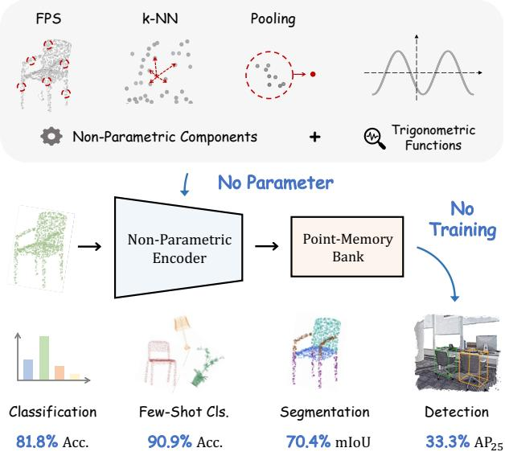
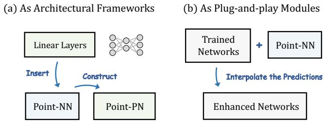
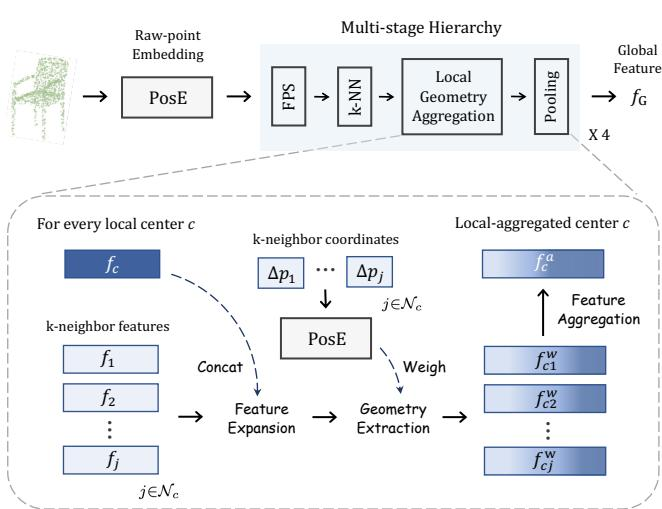
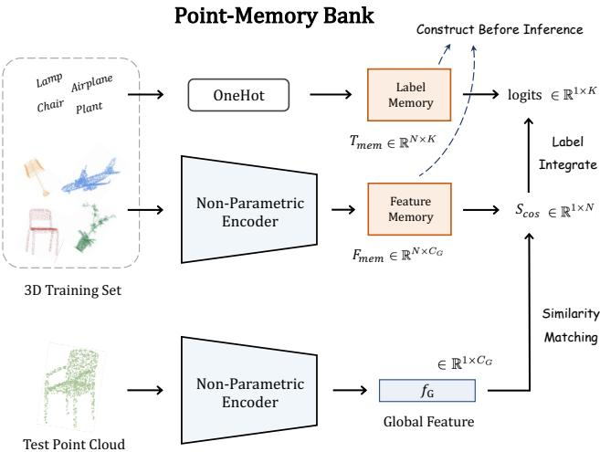
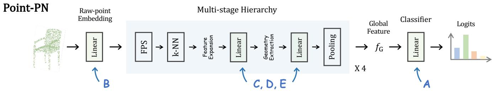
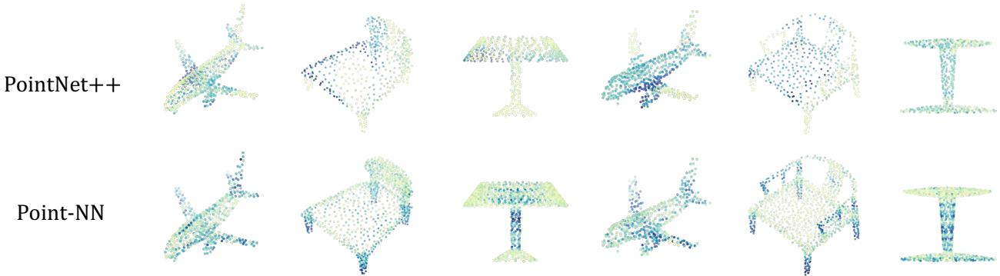

# Starting from Non-Parametric Networks for 3D Point Cloud Analysis

Renrui Zhang1,5, Liuhui Wang2,6, Yali Wang4,5, Peng Gao5, Hongsheng Li1, Jianbo Shi†3

1CUHK MMLab 2Peking University 3University of Pennsylvania 4Shenzhen Institute of Advanced Technology, Chinese Academy of Sciences 5Shanghai Artificial Intelligence Laboratory 6Heisenberg Robotics

{zhangrenrui, gaopeng}@pjlab.org.cn, jshi@seas.upenn.edu wangliuhui0401@pku.edu.cn, hsli@ee.cuhk.edu.hk

## Abstract

We present a Non-parametric Network for 3D point cloud analysis, Point-NN, which consists of purely nonlearnable components: farthest point sampling (FPS), knearest neighbors (k-NN), and pooling operations, with trigonometric functions. Surprisingly, it performs well on various 3D tasks, requiring no parameters or training, and even surpasses existing fully trained models. Starting from this basic non-parametric model, we propose two extensions. First, Point-NN can serve as a base architectural framework to construct Parametric Networks by simply inserting linear layers on top. Given the superior non-parametric foundation, the derived Point-PN exhibits a high performance-efficiency trade-off with only a few learnable parameters. Second, Point-NN can be regarded as a plug-and-play module for the already trained 3D models during inference. Point-NN captures the complementary geometric knowledge and enhances existing methods for different 3D benchmarks without re-training. We hope our work may cast a light on the community for understanding 3D point clouds with non-parametric methods. Code is available at https://github.com/ ZrrSkywalker/Point-NN.

## 1. Introduction

Point cloud 3D data processing is a foundational operation in autonomous driving [4, 12, 21], scene understanding [1, 3, 33, 44], and robotics [5, 20, 26]. Point clouds contain unordered points discretely depicting object surfaces in 3D space. Unlike grid-based 2D images, they are distribution-irregular and permutation-invariant, which leads to non-trivial challenges for algorithm designs.

Since PointNet++ [23], the prevailing trend has been adding advanced local operators and scaled-up learnable parameters. Instead of max pooling for feature aggregation, mechanisms are proposed to extract local geometries, e.g., adaptive point convolutions [14, 16, 30, 37, 38] and graphlike message passing [11, 34, 43]. The performance gain also rises from scaling up the number of parameters, e.g., KPConv [30]’s 14.3M and PointMLP [17]’s 12.6M, is much larger than PointNet++’s 1.7M. This trend has increased network complexity and computational resources.

  
Figure 1. The Pipeline of Non-Parametric Networks. Point-NN is constructed by the basic non-parametric components without any learnable operators. Free from training, Point-NN can achieve favorable performance on various 3D tasks.

Instead, the non-parametric framework underlying all the learnable modules remains nearly the same since Point-Net++, including farthest point sampling (FPS), k-Nearest Neighbors (k-NN), and pooling operations. Given that few works have investigated their efficacy, we ask the question: can we achieve high 3D point cloud analysis performance using only these non-parametric components?

We present a Non-parametric Network, termed Point-NN, which is constructed by the aforementioned nonlearnable components. Point-NN, as shown in Figure 1, consists of a non-parametric encoder for 3D feature extraction and a point-memory bank for task-specific recognition. The multi-stage encoder applies FPS, k-NN, trigonometric functions, and pooling operations to progressively aggregate local geometries, producing a high-dimensional global vector for the point cloud. We only adopt simple trigonometric functions to reveal local spatial patterns at every pooling stage without learnable operators. Then, we adopt the non-parametric encoder of Point-NN to extract the training-set features and cache them as the point-memory bank. For a test point cloud, the bank outputs task-specific predictions via naive feature similarity matching, which validates the encoder’s discrimination ability.

Free from any parameters or training, Point-NN unexpectedly achieves favorable performance on various 3D tasks, e.g., shape classification, part segmentation and 3D object detection, indicating the strength of the long-ignored non-parametric operations. Compared to existing parametric methods, Point-NN even surpasses the fully trained 3DmFV [2] by +2.9% classification accuracy on OBJ-BG split of ScanObjectNN [31]. Especially for few-shot classification, Point-NN significantly exceeds PointCNN [13] and other models [22, 23] by more than +20% accuracy, indicating its superiority in low-data regimes. Starting from this simple-but-effective Point-NN, we propose two approaches by leveraging the non-parametric components to benefit 3D point cloud analysis.

First, Point-NN can serve as an architectural precursor to construct Parametric Networks, termed as Point-PN, shown in Figure 2 (a). As we have fully optimized the non-parametric framework, the Point-PN can be simply derived by inserting linear layers into every stage of Point-NN. Point-PN contains no complicated local operators, but only linear layers and trigonometric functions inherited from Point-NN. Experiments show that Point-PN can achieve competitive performance with a small number of parameters, e.g., 87.1% classification accuracy with 0.8M on the hardest split of ScanObjectNN [31].

Second, Point-NN can be regarded as a plug-and-play module to enhance the already trained 3D models without re-training, as shown in Figure 2 (b). We directly fuse the predictions between Point-NN and off-the-shelf 3D models during inference by linear interpolation. Given the trainingfree manner, Point-NN mainly focuses on low-level 3D structural signals by trigonometric functions, which provides complementary knowledge to the high-level semantics of existing 3D models. On different tasks, Point-NN exhibits consistent performance boost, e.g., +2.0% classification accuracy on ScanObjectNN [31] and +11.02% detection $\mathrm { { A R } _ { 2 5 } }$ on ScanNetV2 [7].

  
Figure 2. Two Applications of Point-NN. (a) As a non-parametric framework to construct parametric networks by simply inserting linear layers. (b) As a plug-and-play module to enhance already trained networks without re-training.

Our contributions are summarized below:

• We propose to revisit the non-learnable components in 3D networks, and, for the first time, develop a nonparametric method, Point-NN, for 3D analysis.

• By using Point-NN as a basic framework, we introduce its parameter-efficient derivative, Point-PN, which exerts superior performance without advanced operators.

• As a plug-and-play module, the complementary Point-NN can boost off-the-shelf trained 3D models for various 3D tasks directly during inference.

## 2. Non-Parametric Networks

In this section, we first investigate the basic nonparametric components in existing 3D models (Sec. 2.1). Then, we integrate them into Point-NN, which consists of a non-parametric encoder (Sec. 2.2) and a point-memory bank (Sec. 2.3). Finally, we introduce how to apply Point-NN for various 3D tasks (Sec. 2.4).

## 2.1. Basic Components

Underlying most of the point cloud processing networks [17, 23] are a series of non-parametric components, i.e., farthest point sampling (FPS), k-Nearest Neighbors (k-NN), and pooling operations. These building blocks are non-learnable during training and iteratively stacked into multiple stages to construct a pyramid hierarchy.

For each stage, we denote the input point cloud representation from the last stage as $\{ p _ { i } , f _ { i } \} _ { i = 1 } ^ { M }$ , where $p _ { i } \in \mathbb { R } ^ { 1 \times 3 }$ and $f _ { i } \in \mathbb { R } ^ { 1 \times C }$ denote the coordinate and feature of point i. First, FPS is adopted to downsample the point number from M to $\textstyle { \frac { M } { 2 } }$ by selecting a subset of local center points,

$$
\left\{ p _ { c } , f _ { c } \right\} _ { c = 1 } ^ { \frac { M } { 2 } } = \mathrm { F P S } \left( \{ p _ { i } , f _ { i } \} _ { i = 1 } ^ { M } \right) .\tag{1}
$$

  
Figure 3. Non-Parametric Encoder of Point-NN. We first utilize trigonometric functions, denoted as PosE(·), to encode raw points into high-dimensional vectors, and then adopt non-learnable operations to hierarchically aggregate local features.

Then, k-NN, or ball query, is responsible for grouping k spatial neighbors for each center c from the original M points, which forms the local 3D region,

$$
\mathcal { N } _ { c } = k \mathrm { - N N } \Big ( p _ { c } , \{ p _ { i } \} _ { i = 1 } ^ { M } \Big ) ,\tag{2}
$$

where $\mathcal { N } _ { c } \in \mathbb { R } ^ { k \times 1 }$ denotes the indices for k nearest neighbors. On top of this, the geometric patterns for each local neighborhood $\mathcal { N } _ { c }$ are extracted by the delicate learnable operator, $\Phi ( \cdot )$ , and finally aggregated by max pooling, MaxP({·}). We formulate it as

$$
f _ { c } ^ { a } = \mathrm { M a x P } \Big ( \{ \Phi ( f _ { c } , f _ { j } ) \} _ { j \in \mathcal { N } _ { c } } \Big ) .\tag{3}
$$

The derived $\{ p _ { c } , f _ { c } ^ { a } \} _ { i = 1 } ^ { \frac { M } { 2 } }$ is then fed into the next network stage to progressively capture 3D geometries with enlarging receptive fields.

To verify the non-parametric efficacy independently from the learnable $\Phi ( \cdot )$ , we present Point-NN, a network purely constructed by these non-learnable basic components along with simple trigonometric functions for 3D coordinate encoding. Point-NN is composed of a nonparametric encoder NPEnc(·) and a point-memory bank PoM(·). Given an input point cloud $P$ for shape classification, the encoder summarizes its high-dimensional global feature $f _ { G }$ , and the bank produces the classification logits by similarity matching. We formulate it as

$$
f _ { G } = \mathrm { E n c N P } ( P ) ; \mathrm { l o g i t s } = \mathrm { P o M } ( f _ { G } ) ,\tag{4}
$$

where $f _ { G } ~ \in ~ \mathbb { R } ^ { 1 \times C _ { G } }$ and the logits $\in \mathbb { R } ^ { 1 \times K }$ denote the predicted possibility for $K$ categories in the dataset.

## 2.2. Non-Parametric Encoder

As shown in Figure 3, the non-parametric encoder conducts initial embedding to transform the raw XYZ coordinates of P into high-dimensional vectors, and progressively aggregates local patterns via the multi-stage hierarchy.

Raw-point Embedding. To achieve feature embedding without learnable layers, we refer to the positional encoding in Transformer [32] and extend it for non-parametric 3D encoding. For a raw point i with $p _ { i } = ( x _ { i } , y _ { i } , z _ { i } ) \in \mathbb { R } ^ { 1 \times 3 }$ we utilize trigonometric functions to embed it into a $C _ { I ^ { - } }$ dimensional vector,

$$
\mathrm { P o s E } ( p _ { i } ) = \mathrm { C o n c a t } ( f _ { i } ^ { x } , ~ f _ { i } ^ { y } , ~ f _ { i } ^ { z } ) \in \mathbb { R } ^ { 1 \times C _ { I } } ,\tag{5}
$$

where $f _ { i } ^ { x } , \ f _ { i } ^ { y } , \ f _ { i } ^ { z } \ \in \ \mathbb { R } ^ { 1 \times \frac { C _ { I } } { 3 } }$ denote the embeddings of three axes, and $C _ { I }$ denotes the initial feature dimension. Taking $f _ { i } ^ { x }$ as an example, for the channel index $m \in$ $\begin{array} { r } { [ 0 , \frac { C _ { I } } { 6 } ] ; } \end{array}$

$$
\begin{array} { c } { f _ { i } ^ { x } [ 2 m ] = \mathrm { s i n e } \left( \alpha x _ { i } / \beta ^ { \frac { 6 m } { C _ { I } } } \right) , } \\ { f _ { i } ^ { x } [ 2 m + 1 ] = \mathrm { c o s i n e } \left( \alpha x _ { i } / \beta ^ { \frac { 6 m } { C _ { I } } } \right) , } \end{array}\tag{6}
$$

where $\alpha , \beta$ control the magnitude and wavelengths, respectively. By the inherent nature of trigonometric functions, the relative position of two points can be revealed by a dot product between their embeddings, which captures fine-grained semantics of different local 3D structures.

Local Geometry Aggregation. Based on the embedding, we adopt a 4-stage network architecture to hierarchically aggregate spatial local features. After the ordinal FPS and k-NN illustrated in Section 2.1, we discard any learnable operators $\Phi ( \cdot )$ , and simply utilize trigonometric functions PosE(·) to reveal the local patterns. In detail, for each center point $\{ p _ { c } , f _ { c } \}$ and its neighborhood $\{ p _ { j } , f _ { j } \} _ { j \in \mathcal { N } _ { c } }$ , we aim to achieve three goals. (1) Feature Expansion. As the network stage goes deeper, each point feature is assigned with larger receptive field and requires higher feature dimension to encode 3D semantics. We conduct such feature expansion by simply concatenating the neighbor feature $f _ { j }$ with the center feature $f _ { c }$ along the feature dimension,

$$
f _ { c j } = \mathrm { C o n c a t } ( f _ { c } , ~ f _ { j } ) , ~ \mathrm { f o r } ~ j \in \mathcal { N } _ { c } ,\tag{7}
$$

where $f _ { c j }$ denotes the expanded feature of each neighbor. (2) Geometry Extraction. To indicate the spatial distribution of k neighbors within the local region, we weigh each $f _ { c j }$ by the relative positional encoding. We normalize their coordinates by the mean and standard deviation, denoted as $\{ \Delta p _ { j } \} _ { j \in \mathcal { N } _ { c } }$ , and embed them via Eq. (5). Then, the $k \mathrm { - }$ neighbor features are weighted as

$$
f _ { c j } ^ { w } = \left( f _ { c j } + \mathrm { P o s E } ( \Delta p _ { j } ) \right) \odot \mathrm { P o s E } ( \Delta p _ { j } ) ,\tag{8}
$$

  
Figure 4. Point-Memory Bank of Point-NN. We construct the memory bank by caching training-set features via the nonparametric encoder. Then, the test point cloud is simply classified by similarity matching without training.

where ⊙ denotes element-wise multiplication. The feature dimension of $\mathrm { P o s E } ( \Delta p _ { j } )$ is set the same as that of $f _ { c j }$ in 4 stages, which are $2 C _ { I } , 4 C _ { I } , 8 C _ { I }$ , and $1 6 C _ { I }$ , due to feature expansion. In this way, the local geometry of the region, i.e., relative positional information of neighbor points $\mathrm { P o s E } ( \Delta p _ { j } )$ , can be implicitly encoded into the features without any learnable parameters. (3) Feature Aggregation. After weighing, we utilize both max and average pooling for local feature aggregation,

$$
f _ { c } ^ { a } = \mathrm { M a x P } \left( \{ f _ { c j } ^ { w } \} _ { j \in N _ { c } } \right) + \mathrm { A v e P } \left( \{ f _ { c j } ^ { w } \} _ { j \in N _ { c } } \right) ,\tag{9}
$$

where $\mathrm { M a x P } ( \{ \cdot \} ) , \mathrm { A v e P } ( \{ \cdot \} )$ are permutation-invariant and summarize neighboring features from different aspects. Here, we obtain the local-aggregated centers $\{ f _ { c } ^ { a } , p _ { c } \} _ { c = 1 } ^ { \frac { M } { 2 } } ,$ which would be fed into the next stage of Point-NN. Finally, after all 4 stages, we apply the two pooling operations to integrate the features and acquire a global representation $f _ { G }$ with $C _ { G }$ feature dimension of the input point cloud.

## 2.3. Point-Memory Bank

Instead of using the traditional learnable classification head, our Point-NN adopts a point-memory bank to involve sufficient category knowledge from the 3D training set. As shown in Figure 4, the bank is first constructed by the nonparametric encoder in a training-free manner, and then outputs the prediction by similarity matching during inference.

Memory Construction. The point memory consists of a feature memory $F _ { m e m }$ and a label memory $T _ { m e m }$ . Taking the task of shape classification as an example, we suppose the given training set contains N point clouds, $\{ P _ { n } \} _ { n = 1 } ^ { N }$ , of

K categories. Via the aforementioned non-parametric encoder, we encode all N global features and convert their ground-truth labels $\{ t _ { n } \} _ { n = 1 } ^ { N }$ as one-hot encoding. We then cache them as two matrices by concatenating along the inter-sample dimension as

$$
F _ { m e m } = \mathrm { C o n c a t } \Big ( \big \{ \mathrm { E n c N P } ( P _ { n } ) \big \} _ { n = 1 } ^ { N } \Big ) ,\tag{10}
$$

$$
T _ { m e m } = \mathrm { C o n c a t } \Big ( \big \{ \mathrm { O n e H o t } ( t _ { n } ) \big \} _ { n = 1 } ^ { N } \Big ) ,\tag{11}
$$

where $F _ { m e m } \in \mathbb { R } ^ { N \times C _ { G } }$ and $T _ { m e m } \in \mathbb { R } ^ { N \times K }$ . Tagged by $T _ { m e m } .$ , the memory $F _ { m e m }$ can be regarded as the encoded category knowledge for the 3D training set. Features tagged with the same label unitedly describe the characteristics of the same category, and the inter-class discrimination can also be reflected by the embedding-space distances.

Similarity-based Prediction. For a test point cloud, we also utilize the non-parametric encoder to extract its global feature as $f _ { G } ^ { t } \in \mathbb { R } ^ { 1 \times C _ { G } }$ , which is within the same embedding space as the feature memory $F _ { m e m }$ . Then, the classification is simply accomplished by two matrix multiplications via the constructed bank. Firstly, we calculate the cosine similarity between the test feature and $F _ { m e m }$ by

$$
S _ { c o s } = \frac { f _ { G } ^ { t } F _ { m e m } ^ { T } } { \Vert f _ { G } ^ { t } \Vert \cdot \Vert F _ { m e m } \Vert } \in \mathbb { R } ^ { 1 \times N } ,\tag{12}
$$

which denotes the semantic correlation of the test point cloud and N training samples. Weighted by $S _ { c o s } ,$ we integrate the one-hot labels in the label memory $T _ { m e m }$ as

$$
\mathrm { l o g i t s } = \varphi ( S _ { c o s } T _ { m e m } ) \ \in \mathbb { R } ^ { 1 \times K } ,\tag{13}
$$

where $\varphi ( x ) = \exp ( - \gamma ( 1 - x ) )$ serves as an activation function from [42]. In $S _ { c o s } .$ , the more similar feature memory of higher score contributes more to the final classification logits, and vice versa. By such similarity-based label integration, the point-memory bank can adaptively discriminate different point cloud instances without any training.

## 2.4. Other 3D Tasks

Except for shape classification, our Point-NN can also be extended for part segmentation and 3D object detection with tasks-specific modifications.

Part Segmentation. Other than extracting global features, the task of part segmentation requires to classify each input point. Therefore, we append a symmetric nonparametric decoder after the encoder, which progressively upsamples the encoded point features into the input point number. In every stage of the decoder, we reversely propagate the features of center points to their k neighbors in a non-parametric manner. For the point-memory bank, we first apply the non-parametric encoder and decoder to extract all point-wise features of the training set. To save the

  
Figure 5. The Pipeline of Point-PN. Given the non-parametric framework of Point-NN, we simply construct the parametric derivative, Point-PN, by inserting linear layers into every stage of the encoder. Performance gain of using linear layers of A∼E is shown in Table 1.

  
Figure 6. Complementary Characteristics of Point-NN. We visualize the point responses after the first network stage for the already trained PointNet++ [23] and our Point-NN, where darker colors indicate higher responses. As shown, they focus on different spatial structures with complementary 3D patterns.

GPU memory, we average the features of points with the same part label in an object, and only cache such aggregated part-wise features with part labels as $F _ { m e m } , T _ { m e m }$

3D Object Detection. Given category-agnostic 3D proposals from a pre-trained 3D region proposal network [8, 19], Point-NN can be utilized as a non-parametric classification head for object detection. Similar to shape classification, we also adopt a pooling operation after the encoder to obtain global features of the detected objects. Differently, we sample the point cloud within each ground-truth 3D bounding box in the training set, and encode the objectwise features as the feature memory $F _ { m e m }$ . Specifically, we do not normalize the point coordinates for each object as the pre-processing like other 3D tasks, which is to preserve the 3D positional information of objects in the original scene.

## 3. Starting from Point-NN

In this section, we introduce two promising applications for Point-NN, which fully unleash the potentials of nonparametric components for 3D point cloud analysis.

## 3.1. As Architectural Frameworks

Point-NN can be extended into learnable parametric networks (Point-PN) without adding complicated operators or too many parameters. As shown in Figure 5 and Table 1, on top of Point-NN, we first replace the point-memory bank with a conventional learnable classifier. This lightweight version achieves 90.3% classification accuracy on Model-Net40 [36] with only 0.3M parameters (A). Then, we upgrade the raw-point embedding into parametric linear layers, which improves the performance to 90.8% (B). To better extract multi-scale hierarchy, we append simple linear layers into every stage of the encoder. For each stage, two learnable linear layers are inserted right before or after the

<table><tr><td>Method</td><td>Raw Embed.</td><td>Linear Layers</td><td>Classifier</td><td>Acc. (%)</td><td>Param.</td></tr><tr><td>Point-NN</td><td>N</td><td>–</td><td>N</td><td>81.8</td><td>0.0 M</td></tr><tr><td>A</td><td>N</td><td>–</td><td>P</td><td>90.3</td><td>0.3 M</td></tr><tr><td>B</td><td>P</td><td>一</td><td>P</td><td>90.8</td><td>0.3 M</td></tr><tr><td>C</td><td>P</td><td>0+1</td><td>P</td><td>93.4</td><td>0.5M</td></tr><tr><td>D</td><td>P</td><td>1+1</td><td>P</td><td>93.2</td><td>0.8M</td></tr><tr><td>E</td><td>P</td><td>2+2</td><td>P</td><td>92.9</td><td>0.7 M</td></tr><tr><td>Point-PN</td><td>P</td><td>1+2</td><td>P</td><td>93.8</td><td>0.8M</td></tr></table>

Table 1. Step-by-step Construction of Point-PN on Model-Net40 [36]. $\mathbf { \Delta } ^ { \ast } \mathbf { N } '$ or $\mathbf { \nabla } ^ { \mathrm { \ell } } \mathbf { P } ^ { \mathrm { * } }$ denotes the non-parametric modules or parametric linear layers. ‘Linear Layers’ denotes the number of linear layers inserted into each network stage. Note that we adopt bottleneck layers with a ratio 0.5 for ‘2’ in ‘Linear Layers’

<table><tr><td>Method</td><td>Split 1</td><td>Split 2</td><td>Split 3</td><td>Param.</td></tr><tr><td>3DmFV [2]</td><td>68.2</td><td>73.8</td><td>63.0</td><td></td></tr><tr><td>PointNet [22]</td><td>73.3</td><td>79.2</td><td>68.2</td><td>3.5M</td></tr><tr><td>SpiderCNN [39]</td><td>77.1</td><td>79.5</td><td>73.7</td><td></td></tr><tr><td>PointNet++ [23]</td><td>82.3</td><td>84.3</td><td>77.9</td><td>1.7 M</td></tr><tr><td>DGCNN [34]</td><td>82.8</td><td>86.2</td><td>78.1</td><td>1.8M</td></tr><tr><td>PointCNN [13]</td><td>86.1</td><td>85.5</td><td>78.5</td><td></td></tr><tr><td>DRNet [24]</td><td></td><td></td><td>80.3</td><td></td></tr><tr><td>GBNet [25]</td><td></td><td></td><td>80.5</td><td>8.4 M</td></tr><tr><td>SimpleView [10]</td><td>=</td><td></td><td>80.5</td><td></td></tr><tr><td>PointMLP [17]</td><td></td><td></td><td>85.2</td><td>12.6 M</td></tr><tr><td>Point-NN</td><td>71.1</td><td>74.9</td><td>64.9</td><td>0.0 M</td></tr><tr><td>Point-PN</td><td>91.0</td><td>90.2</td><td>87.1</td><td>0.8M</td></tr></table>

Table 2. Shape Classification on the Real-world ScanObjectNN [31]. We report the accuracy (%) on three official splits of ScanObjectNN: OBJ-BG, OBJ-ONLY and PB-T50-RS. Our Point-NN outperforms the fully trained 3DmFV as marked in blue.

Geometry Extraction step for capturing higher-level spatial patterns (C, D, E). We observe Point-PN attains the competitive 93.8% accuracy with 0.8M parameters. This final version only contains trigonometric functions for geometry extraction and simple linear layers for feature transformation. This demonstrates that, compared to existing advanced operators or scaled-up parameters, we can alternatively start from a non-parametric framework, i.e., Point-NN, to obtain a powerful and efficient 3D model.

## 3.2. As Plug-and-play Modules

Considering the training-free characteristic, we propose to regard Point-NN as an inference-time enhancement module, which can boost already trained 3D models without extra re-training. For shape classification, we directly fuse the prediction by linear interpolation, namely, adding the classification logits of Point-NN and off-the-shelf models element-wisely. This design produces the ensemble for two types of knowledge: the low-level structural signals from Point-NN, and the high-level semantics from the trained networks. As visualized in Figure 6, the extracted point cloud features by Point-NN produce high response values around the sharp 3D structures, e.g., the airplane’s wingtips, chair’s legs, and lamp poles. In contrast, the trained Point-Net++ focuses more on 3D structures with rich semantics, e.g., airplane’s main body, chair’s bottoms, and lampshades.

## 4. Experiments

We conduct extensive experiments to evaluate the efficacy of Point-NN (Sec. 4.2), and its two extensions as Point-PN (Sec. 4.3) and plug-and-play modules (Sec. 4.4).

<table><tr><td>Method</td><td>Acc. (%)</td><td>Param.</td><td>Train Time</td><td>Test Speed</td></tr><tr><td>PointNet [22]</td><td>89.2</td><td>3.5 M</td><td></td><td></td></tr><tr><td>PointNet++ [23]</td><td>90.7</td><td>1.7 M</td><td>3.4 h</td><td>521</td></tr><tr><td>DGCNN [34]</td><td>92.9</td><td>1.8M</td><td>2.4 h</td><td>617</td></tr><tr><td>RS-CNN [15]</td><td>92.9</td><td>1.3 M</td><td></td><td></td></tr><tr><td>DensePoint [14]</td><td>93.2</td><td></td><td></td><td></td></tr><tr><td>PCT [11]</td><td>93.2</td><td></td><td></td><td></td></tr><tr><td>GBNet [25]</td><td>93.8</td><td>8.4 M</td><td></td><td>189</td></tr><tr><td>CurveNet [37]</td><td>93.8</td><td>2.0 M</td><td>6.7 h</td><td>25</td></tr><tr><td>PointMLP [17]</td><td>94.1</td><td>12.6 M</td><td>14.4 h</td><td>189</td></tr><tr><td>Point-NN</td><td>81.8</td><td>0.0 M</td><td>0</td><td>275</td></tr><tr><td>Point-PN</td><td>93.8</td><td>0.8M</td><td>3.9 h</td><td>1176</td></tr></table>

Table 3. Shape Classification on Synthetic ModelNet40 [36]. All compared methods take 1,024 points as input. Train Time and Test Speed (samples/second) are tested on one RTX 3090 GPU. We report the accuracy without the voting strategy.

<table><tr><td>Method</td><td>Inst. mIoU</td><td>Param.</td><td>Train Time</td><td>Test Speed</td></tr><tr><td>PointNet [22]</td><td>83.7</td><td>8.3 M</td><td></td><td>=</td></tr><tr><td>PointNet++ [23] PAConv [11]</td><td>85.1 86.0</td><td>1.8 M</td><td>26.5 h</td><td>45</td></tr><tr><td>PointMLP [17]</td><td>86.1</td><td>16.8M</td><td>47.1 h</td><td>119</td></tr><tr><td>CurveNet [37]</td><td>86.6</td><td>5.5 M</td><td>56.9 h</td><td>22</td></tr><tr><td>Point-NN</td><td>70.4</td><td>0.0 M</td><td>0</td><td>51</td></tr><tr><td>Point-PN</td><td>86.6</td><td>3.9 M</td><td>29.0 h</td><td>131</td></tr></table>

Table 4. Part Segmentation on ShapeNetPart [41]. All compared methods take 2,048 points as input, and are evaluated by mean IoU scores (%) across instances.

## 4.1. Dataset

For shape classification, we report the performance on two benchmarks: the synthetic ModelNet40 [36] with 40 categories, and real-world ScanObjectNN [31] with 15 categories. Considering the background and data augmentation, ScanObjectNN is officially split into three subsets: OBJ-BG, OBJ-ONLY, and PB-T50-RS. For few-shot classification, we evaluate on the few-shot subset of ModelNet40 with four different settings, 5-way 10-shot, 5-way 20-shot, 10-way 10-shot and 10-way 20-shot. For part segmentation, we adopt ShapeNetPart [41] dataset with synthesized 3D shapes of 50 part categories. For 3D object detection, we conduct the experiments on ScanNetV2 [7] with axisaligned bounding boxes in 3D scenes. We refer to Supplementary Material for implementation details. Note that, we report all results without the voting strategy.

<table><tr><td rowspan="2">Method</td><td colspan="2">5-way</td><td colspan="2">10-way</td></tr><tr><td>10-shot</td><td>20-shot</td><td>10-shot</td><td>20-shot</td></tr><tr><td>DGCNN [34]</td><td>31.6</td><td>40.8</td><td>19.9</td><td>16.9</td></tr><tr><td>FoldingNet [40]</td><td>33.4</td><td>35.8</td><td>18.6</td><td>15.4</td></tr><tr><td>PointNet++ [23]</td><td>38.5</td><td>42.4</td><td>23.0</td><td>18.8</td></tr><tr><td>PointNet [22]</td><td>52.0</td><td>57.8</td><td>46.6</td><td>35.2</td></tr><tr><td>3D-GAN [35]</td><td>55.8</td><td>65.8</td><td>40.3</td><td>48.4</td></tr><tr><td>PointCNN [13]</td><td>65.4</td><td>68.6</td><td>46.6</td><td>50.0</td></tr><tr><td>Point-NN</td><td>88.8</td><td>90.9</td><td>79.9</td><td>84.9</td></tr><tr><td>Improvements</td><td>+23.4</td><td>+22.3</td><td>+33.3</td><td>+34.9</td></tr></table>

Table 5. Few-shot Classification on ModelNet40 [36]. We calculate the average accuracy (%) over 10 independent runs. The reported results of existing methods are taken from [28].

## 4.2. Point-NN

Shape Classification. The results of Point-NN are reported in the green rows of Table 2 and 3, respectively for the two datasets. As shown, Point-NN attains favorable classification accuracy for both real-world and synthetic point clouds, indicating our effectiveness and generalizability. Surprisingly, Point-NN even surpasses the fully trained 3DmFV [2] by +2.9%, +1.1%, +1.9% on the three splits of ScanObjectNN [31]. By this, we demonstrate that, without any parameters or training, the non-parametric network components with simple trigonometric functions can achieve satisfactory 3D point cloud recognition.

Few-shot Classification. As shown in Table 5, compared to existing trained models, our Point-NN exerts leading few-shot performance and exceeds the second-best PointCNN [13] by significant margins, e.g., +34.9% for the 10-way 20-shot setting. Given limited training samples, traditional networks with learnable parameters severely suffer from the over-fitting issue, while our Point-NN inherently tackles it by the training-free manner. This indicates our superior capacity for 3D recognition in low-data regimes.

Part Segmentation. Equipped with a non-parametric decoder illustrated in Sec. 2.4, we extend Point-NN for part segmentation and report the mIoU scores over instances in the green row of Table 4. The 70.4% mIoU reveals that our non-parametric network can also produce well-performed point-wise features, and capture the discriminative characteristics for fine-grained spatial understanding.

3D Object Detection. Regarding Point-NN as a nonparametric classification head, we utilize two popular 3D detectors, VoteNet [8] and 3DETR-m [19], to provide category-agnostic 3D region proposals. In Table 6, we compare the performance of Point-NN with and without the normalization for object-wise point coordinates (Sec. 2.4). As shown, processing the point coordinates without normalization can largely enhance the AP scores of Point-NN, which preserves more positional cues of objects’ 3D locations in the original scene. Also, we observe slight AR score improvement over the region proposal networks, since the classification logits of Point-NN can affect the 3D NMS post-processing to remove the false positive boxes.

<table><tr><td>Method</td><td>AP25</td><td>AP50</td><td>AR25</td><td>AR50</td></tr><tr><td>VoteNet [8]</td><td>57.8</td><td>33.5</td><td>80.9</td><td>51.3</td></tr><tr><td>Point-NN</td><td>4.5</td><td>3.3</td><td>80.9</td><td>51.3</td></tr><tr><td>Point-NN w/o nor.</td><td>23.1</td><td>16.0</td><td>90.0</td><td>51.3</td></tr><tr><td>3DETR-m [19]</td><td>64.6</td><td>46.4</td><td>77.2</td><td>59.2</td></tr><tr><td>Point-NN</td><td>7.7</td><td>5.7</td><td>77.2</td><td>59.2</td></tr><tr><td>Point-NN w/o nor.</td><td>33.3</td><td>24.7</td><td>77.4</td><td>59.3</td></tr></table>

Table 6. 3D Object Detection on ScanNetV2 [7]. We report the mean Average Precision (%) and mean Average Recall (%) with 0.25 and 0.5 IoU thresholds. ‘nor’ denotes to normalize the point coordinates for each object proposal.

Ablation Study. In Table 7, we investigate the designs of Point-NN’s non-parametric encoder. We first explore the non-parametric embedding used as PosE, where the trigonometric functions (‘Our Sin/cos’) from Transformers [32] perform the best. Then, we experiment with different approaches in Geometry Extraction to weigh the kneighbor features, and observe utilizing ‘Add+Multiply can fully reveal the local geometry. In Table 9 for Point-NN’s point-memory bank, we verify that the cosine similarity better exerts the discrimination capacity of the encoder among other distance metrics. In addition, compared to traditional machine learning algorithms, our memory bank can benefit from the non-learnable similarity-based label integration, and exhibit superior classification accuracy.

## 4.3. Point-PN

Shape Classification. As shown in Table 2 and 3, constructed from Point-NN, the derived Point-PN achieves competitive results for both datasets. Compared to the large-scale PointMLP [17] with stacked MLPs of 12.6M parameters, Point-PN only contains simple linear layers and surpasses it by +1.9% accuracy on ScanObjectNN [31] with 16× fewer parameters and 6× faster inference speed. With simple trigonometric functions, Point-PN attains comparable performance to CurveNet [37] with complicated curvebased grouping on ModelNet40 [36], while contains 2.5× fewer parameters and 6× faster inference speed. The superior classification accuracy of Point-PN fully demonstrates the significance of a powerful non-parametric framework.

<table><tr><td>Embedding Function</td><td>Acc (%)</td><td>Weighted by PosE</td><td>Acc (%)</td></tr><tr><td>w/o</td><td>68.6</td><td>w/o</td><td>77.8</td></tr><tr><td>NeRF&#x27;s [18]</td><td>70.1</td><td>Add</td><td>78.3</td></tr><tr><td>Fourier&#x27;s [29]</td><td>76.9</td><td>Multiply</td><td>80.4</td></tr><tr><td>Our Sin/cos</td><td>81.8</td><td>Add+Multiply</td><td>81.8</td></tr></table>

Table 7. Ablation Study of Non-Parametric Encoder. We ablate the non-parametric functions for point embedding, and experiment different weighing methods for local geometry extraction.

<table><tr><td>Method</td><td>ScanObjNN</td><td>+NN</td><td>ModelNet40</td><td>+NN</td></tr><tr><td>Point-NN</td><td>64.9</td><td>=</td><td>81.8</td><td></td></tr><tr><td>PointNet</td><td>68.2</td><td>+2.2</td><td>89.7</td><td>+0.4</td></tr><tr><td>PointNet++</td><td>77.9</td><td>+1.2</td><td>92.6</td><td>+0.5</td></tr><tr><td>PCT</td><td></td><td></td><td>93.2</td><td>+0.2</td></tr><tr><td>PointMLP</td><td>85.2</td><td>+2.0</td><td>94.1</td><td>+0.3</td></tr></table>

Table 8. Plug-and-play for Shape Classification. We report the gain (%) on the PB-T50-RS split of ScanObjectNN.

Part Segmentation. For point-wise segmentation task in Table 4, Point-PN also achieves competitive performance, i.e., 86.6% mIoU, among existing methods. Compared to CurveNet, Point-PN with simple local geometry aggregation can save 28h training time and inference 6× faster.

Ablation Study. In Table 1, we present how to step-bystep construct Point-PN from the non-parametric Point-NN. As illustrated in Section 4.2, we insert linear layers before and after the Geometry Extraction step. ‘C’ of ‘0+1’ denotes only appending one linear layer after the module, and ‘D’ of ‘1+1’ denotes inserting into both positions. The preceding layers pre-transform the point features to better reveal the local geometry, and the latter layers further parse the weighted features for high-level understanding. We observe that Point-PN of ‘1+2’ performs the best.

## 4.4. Plug-and-play

Shape Classification. We evaluate the enhancement capacity of Point-NN on two classification datasets in Table 8. By simple inference-time ensemble, Point-NN effectively boosts existing methods with different margins. On the more challenging ScanObjectNN [31], both PointNet [22] and PointMLP [17] are improved by +2.0% accuracy. This well indicates the effectiveness of complementary knowledge provided by Point-NN.

Segmentation and Detection. In Table 10, we present the plug-and-play performance of Point-NN on part segmentation and 3D object detection tasks. As the segmentation scores have long been saturated on the ShapeNetPart [41] benchmark, the boost of +0.1% mIoU for state-of-the-art CurveNet [37] is still noteworthy. For detection, Point-NN significantly enhances 3DETR-m [19] by +1.02% AP25 and +11.05% AR . By fusing complementary knowledge to the trained classifier, the 3D detector can better judge whether the candidate boxes include objects and correctly remove the false positive ones.

<table><tr><td>Similarity Metric</td><td>Acc (%)</td><td>Traditional Classifier</td><td>Acc (%)</td></tr><tr><td>Chebyshev</td><td>65.9</td><td>Dec. Tree [27]</td><td>57.8</td></tr><tr><td>Euclidean</td><td>79.8</td><td>GBoost [9]</td><td>63.9</td></tr><tr><td>Manhattan</td><td>80.9</td><td>SVM [6]</td><td>79.9</td></tr><tr><td>Cosine</td><td>81.8</td><td>Memory Bank</td><td>81.8</td></tr></table>

Table 9. Ablation Study of Point-Memory Bank. We compare the similarity metrics and machine learning algorithms. ‘GBoost’ and ‘Dec. Tree’ denote Gradient Boosting and Decision Tree.

<table><tr><td>Method</td><td>mIoU</td><td>Method</td><td>AP25</td><td>AR25</td></tr><tr><td>DGCNN</td><td>85.16</td><td>VoteNet</td><td>57.84</td><td>80.92</td></tr><tr><td>+NN</td><td>+0.16</td><td>+NN</td><td>+1.28</td><td>+5.31</td></tr><tr><td>CurveNet</td><td>86.58</td><td>3DETR-m</td><td>64.60</td><td>77.22</td></tr><tr><td>+NN</td><td>+0.07</td><td>+NN</td><td>+1.02</td><td>+11.05</td></tr></table>

Table 10. Plug-and-play for Segmentation and Detection. We report the gain (%) on ShapeNetPart and ScanNetV2, respectively.

## 5. Conclusion

We revisit the non-learnable components in existing 3D models and propose Point-NN, a pure non-parametric network for 3D point cloud analysis. Free from any parameters or training, Point-NN achieves favorable accuracy on various 3D tasks. Starting from this, we propose its two promising applications: architectural frameworks for efficient Point-PN, and plug-and-play modules for performance improvement. For future works, we will focus on exploring more advanced non-parametric models with wider application scenarios for 3D point cloud analysis.

Acknowledgement. This project is funded in part by National Key R&D Program of China Project 2022ZD0161100, by the Centre for Perceptual and Interactive Intelligence (CPII) Ltd under the Innovation and Technology Commission (ITC)’s InnoHK, by General Research Fund of Hong Kong RGC Project 14204021, by the National Natural Science Foundation of China (Grant No. 62206272), and by Shanghai Committee of Science and Technology (Grant No. 21DZ1100100).

## References

[1] Aitor Aldoma, Zoltan-Csaba Marton, Federico Tombari, Walter Wohlkinger, Christian Potthast, Bernhard Zeisl, Radu Bogdan Rusu, Suat Gedikli, and Markus Vincze. Tutorial: Point cloud library: Three-dimensional object recognition and 6 dof pose estimation. IEEE Robotics & Automation Magazine, 19(3):80–91, 2012. 1

[2] Yizhak Ben-Shabat, Michael Lindenbaum, and Anath Fischer. 3dmfv: Three-dimensional point cloud classification in real-time using convolutional neural networks. IEEE Robotics and Automation Letters, 3(4):3145–3152, 2018. 2, 6, 7

[3] Jingdao Chen, Zsolt Kira, and Yong K Cho. Deep learning approach to point cloud scene understanding for automated scan to 3d reconstruction. Journal of Computing in Civil Engineering, 33(4):04019027, 2019. 1

[4] Xiaozhi Chen, Huimin Ma, Ji Wan, Bo Li, and Tian Xia. Multi-view 3d object detection network for autonomous driving. In Proceedings of the IEEE conference on Computer Vision and Pattern Recognition, pages 1907–1915, 2017. 1

[5] Nikolaus Correll, Kostas E Bekris, Dmitry Berenson, Oliver Brock, Albert Causo, Kris Hauser, Kei Okada, Alberto Rodriguez, Joseph M Romano, and Peter R Wurman. Analysis and observations from the first amazon picking challenge. IEEE Transactions on Automation Science and Engineering, 15(1):172–188, 2016. 1

[6] Nello Cristianini, John Shawe-Taylor, et al. An introduction to support vector machines and other kernel-based learning methods. Cambridge university press, 2000. 8

[7] Angela Dai, Angel X Chang, Manolis Savva, Maciej Halber, Thomas Funkhouser, and Matthias Nießner. Scannet: Richly-annotated 3d reconstructions of indoor scenes. In Proceedings of the IEEE conference on computer vision and pattern recognition, pages 5828–5839, 2017. 2, 6, 7

[8] Zhipeng Ding, Xu Han, and Marc Niethammer. Votenet: A deep learning label fusion method for multi-atlas segmentation. In International Conference on Medical Image Computing and Computer-Assisted Intervention, pages 202–210. Springer, 2019. 5, 7

[9] Jerome H Friedman. Greedy function approximation: a gradient boosting machine. Annals of statistics, pages 1189– 1232, 2001. 8

[10] Ankit Goyal, Hei Law, Bowei Liu, Alejandro Newell, and Jia Deng. Revisiting point cloud shape classification with a simple and effective baseline. arXiv preprint arXiv:2106.05304, 2021. 6

[11] Meng-Hao Guo, Jun-Xiong Cai, Zheng-Ning Liu, Tai-Jiang Mu, Ralph R Martin, and Shi-Min Hu. Pct: Point cloud transformer. Computational Visual Media, 7(2):187–199, 2021. 1, 6

[12] Kiyosumi Kidono, Takeo Miyasaka, Akihiro Watanabe, Takashi Naito, and Jun Miura. Pedestrian recognition using high-definition lidar. In 2011 IEEE Intelligent Vehicles Symposium (IV), pages 405–410. IEEE, 2011. 1

[13] Yangyan Li, Rui Bu, Mingchao Sun, Wei Wu, Xinhan Di, and Baoquan Chen. Pointcnn: Convolution on x-transformed

points. Advances in neural information processing systems, 31:820–830, 2018. 2, 6, 7

[14] Yongcheng Liu, Bin Fan, Gaofeng Meng, Jiwen Lu, Shiming Xiang, and Chunhong Pan. Densepoint: Learning densely contextual representation for efficient point cloud processing. In Proceedings of the IEEE/CVF International Conference on Computer Vision, pages 5239–5248, 2019. 1, 6

[15] Yongcheng Liu, Bin Fan, Shiming Xiang, and Chunhong Pan. Relation-shape convolutional neural network for point cloud analysis. In Proceedings ofthe IEEE/CVF Conference on Computer Vision and Pattern Recognition, pages 8895– 8904, 2019. 6

[16] Zhijian Liu, Haotian Tang, Yujun Lin, and Song Han. Pointvoxel cnn for efficient 3d deep learning. arXiv preprint arXiv:1907.03739, 2019. 1

[17] Xu Ma, Can Qin, Haoxuan You, Haoxi Ran, and Yun Fu. Rethinking network design and local geometry in point cloud: A simple residual mlp framework. arXiv preprint arXiv:2202.07123, 2022. 1, 2, 6, 7, 8

[18] Ben Mildenhall, Pratul P Srinivasan, Matthew Tancik, Jonathan T Barron, Ravi Ramamoorthi, and Ren Ng. Nerf: Representing scenes as neural radiance fields for view synthesis. Communications of the ACM, 65(1):99–106, 2021. 8

[19] Ishan Misra, Rohit Girdhar, and Armand Joulin. An end-toend transformer model for 3d object detection. In Proceedings of the IEEE/CVF International Conference on Computer Vision (ICCV), pages 2906–2917, October 2021. 5, 7, 8

[20] Arsalan Mousavian, Clemens Eppner, and Dieter Fox. 6-dof graspnet: Variational grasp generation for object manipulation. In Proceedings ofthe IEEE/CVF International Conference on Computer Vision, pages 2901–2910, 2019. 1

[21] Luis E Navarro-Serment, Christoph Mertz, and Martial Hebert. Pedestrian detection and tracking using threedimensional ladar data. The International Journal of Robotics Research, 29(12):1516–1528, 2010. 1

[22] Charles R Qi, Hao Su, Kaichun Mo, and Leonidas J Guibas. Pointnet: Deep learning on point sets for 3d classification and segmentation. In Proceedings of the IEEE conference on computer vision and pattern recognition, pages 652–660, 2017. 2, 6, 7, 8

[23] Charles R Qi, Li Yi, Hao Su, and Leonidas J Guibas. Pointnet++: Deep hierarchical feature learning on point sets in a metric space. arXiv preprint arXiv:1706.02413, 2017. 1, 2, 5, 6, 7

[24] Shi Qiu, Saeed Anwar, and Nick Barnes. Dense-resolution network for point cloud classification and segmentation. In Proceedings of the IEEE/CVF Winter Conference on Applications ofComputer Vision, pages 3813–3822, 2021. 6

[25] Shi Qiu, Saeed Anwar, and Nick Barnes. Geometric backprojection network for point cloud classification. IEEE Transactions on Multimedia, 2021. 6

[26] Radu Bogdan Rusu, Nico Blodow, Zoltan Csaba Marton, and Michael Beetz. Close-range scene segmentation and reconstruction of 3d point cloud maps for mobile manipulation in domestic environments. In 2009 IEEE/RSJ International

Conference on Intelligent Robots and Systems, pages 1–6. IEEE, 2009. 1

[27] S Rasoul Safavian and David Landgrebe. A survey of decision tree classifier methodology. IEEE transactions on systems, man, and cybernetics, 21(3):660–674, 1991. 8

[28] Charu Sharma and Manohar Kaul. Self-supervised few-shot learning on point clouds. arXiv preprint arXiv:2009.14168, 2020. 7

[29] Matthew Tancik, Pratul Srinivasan, Ben Mildenhall, Sara Fridovich-Keil, Nithin Raghavan, Utkarsh Singhal, Ravi Ramamoorthi, Jonathan Barron, and Ren Ng. Fourier features let networks learn high frequency functions in low dimensional domains. Advances in Neural Information Processing Systems, 33:7537–7547, 2020. 8

[30] Hugues Thomas, Charles R Qi, Jean-Emmanuel Deschaud, Beatriz Marcotegui, Franc¸ois Goulette, and Leonidas J Guibas. Kpconv: Flexible and deformable convolution for point clouds. In Proceedings ofthe IEEE/CVF International Conference on Computer Vision, pages 6411–6420, 2019. 1

[31] Mikaela Angelina Uy, Quang-Hieu Pham, Binh-Son Hua, Thanh Nguyen, and Sai-Kit Yeung. Revisiting point cloud classification: A new benchmark dataset and classification model on real-world data. In Proceedings of the IEEE/CVF International Conference on Computer Vision, pages 1588– 1597, 2019. 2, 6, 7, 8

[32] Ashish Vaswani, Noam Shazeer, Niki Parmar, Jakob Uszkoreit, Llion Jones, Aidan N Gomez, Łukasz Kaiser, and Illia Polosukhin. Attention is all you need. In Advances in neural information processing systems, pages 5998–6008, 2017. 3, 7

[33] Francesco Verdoja, Diego Thomas, and Akihiro Sugimoto. Fast 3d point cloud segmentation using supervoxels with geometry and color for 3d scene understanding. In 2017 IEEE International Conference on Multimedia and Expo (ICME), pages 1285–1290. IEEE, 2017. 1

[34] Yue Wang, Yongbin Sun, Ziwei Liu, Sanjay E Sarma, Michael M Bronstein, and Justin M Solomon. Dynamic graph cnn for learning on point clouds. Acm Transactions On Graphics (tog), 38(5):1–12, 2019. 1, 6, 7

[35] Jiajun Wu, Chengkai Zhang, Tianfan Xue, William T Freeman, and Joshua B Tenenbaum. Learning a probabilistic latent space of object shapes via 3d generative-adversarial modeling. In Proceedings of the 30th International Conference on Neural Information Processing Systems, pages 82– 90, 2016. 7

[36] Zhirong Wu, Shuran Song, Aditya Khosla, Fisher Yu, Linguang Zhang, Xiaoou Tang, and Jianxiong Xiao. 3d shapenets: A deep representation for volumetric shapes. In Proceedings ofthe IEEE conference on computer vision and pattern recognition, pages 1912–1920, 2015. 5, 6, 7

[37] Tiange Xiang, Chaoyi Zhang, Yang Song, Jianhui Yu, and Weidong Cai. Walk in the cloud: Learning curves for point clouds shape analysis. arXiv preprint arXiv:2105.01288, 2021. 1, 6, 7, 8

[38] Mutian Xu, Runyu Ding, Hengshuang Zhao, and Xiaojuan Qi. Paconv: Position adaptive convolution with dynamic kernel assembling on point clouds. In Proceedings of

the IEEE/CVF Conference on Computer Vision and Pattern Recognition, pages 3173–3182, 2021. 1

[39] Yifan Xu, Tianqi Fan, Mingye Xu, Long Zeng, and Yu Qiao. Spidercnn: Deep learning on point sets with parameterized convolutional filters. In Proceedings of the European Conference on Computer Vision (ECCV), pages 87–102, 2018. 6

[40] Yaoqing Yang, Chen Feng, Yiru Shen, and Dong Tian. Foldingnet: Point cloud auto-encoder via deep grid deformation. In Proceedings of the IEEE conference on computer vision and pattern recognition, pages 206–215, 2018. 7

[41] Li Yi, Vladimir G Kim, Duygu Ceylan, I-Chao Shen, Mengyan Yan, Hao Su, Cewu Lu, Qixing Huang, Alla Sheffer, and Leonidas Guibas. A scalable active framework for region annotation in 3d shape collections. ACM Transactions on Graphics (ToG), 35(6):1–12, 2016. 6, 8

[42] Renrui Zhang, Rongyao Fang, Peng Gao, Wei Zhang, Kunchang Li, Jifeng Dai, Yu Qiao, and Hongsheng Li. Tip-adapter: Training-free clip-adapter for better visionlanguage modeling. arXiv preprint arXiv:2111.03930, 2021. 4

[43] Hengshuang Zhao, Li Jiang, Jiaya Jia, Philip HS Torr, and Vladlen Koltun. Point transformer. In Proceedings of the IEEE/CVF International Conference on Computer Vision, pages 16259–16268, 2021. 1

[44] Bo Zheng, Yibiao Zhao, Joey C Yu, Katsushi Ikeuchi, and Song-Chun Zhu. Beyond point clouds: Scene understanding by reasoning geometry and physics. In Proceedings of the IEEE Conference on Computer Vision and Pattern Recognition, pages 3127–3134, 2013. 1