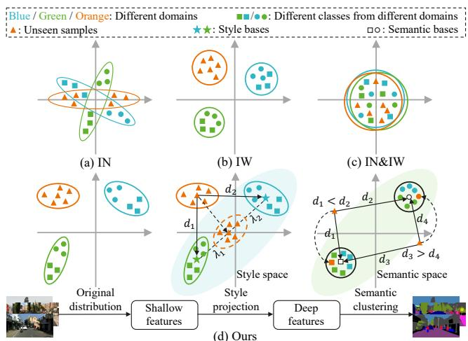
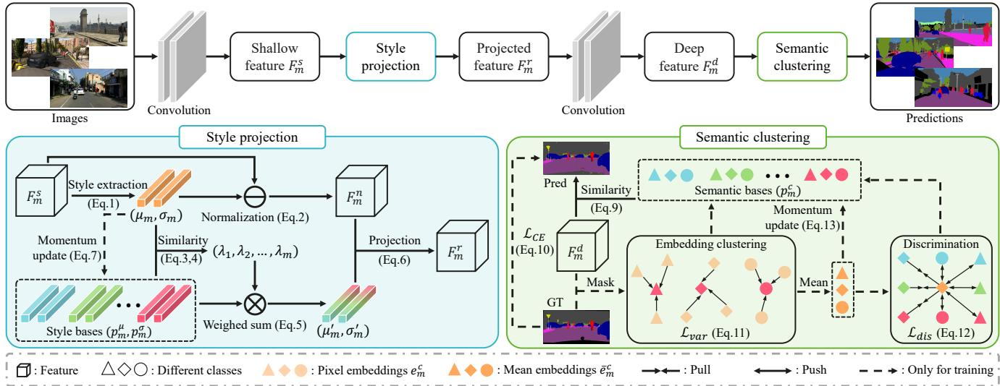
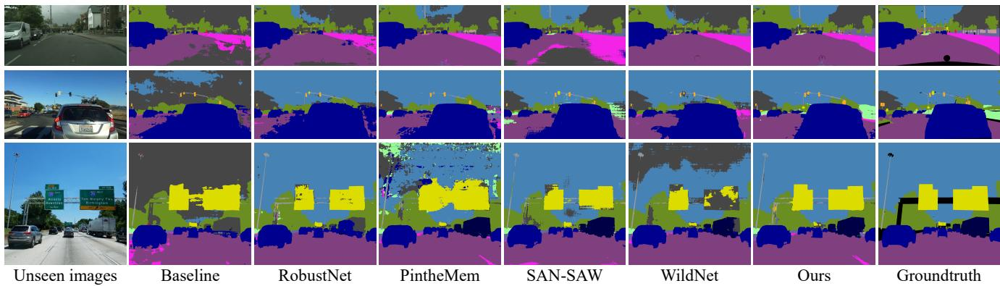
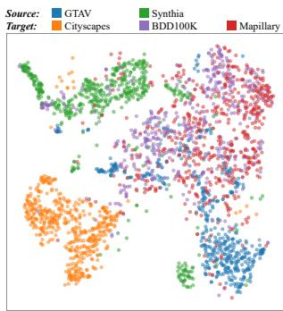
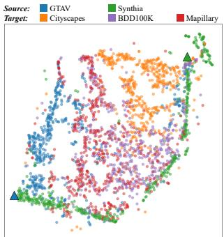
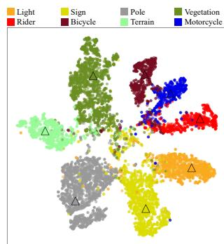
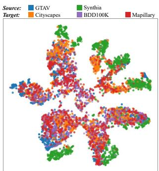

# Style Projected Clustering for Domain Generalized Semantic Segmentation

Wei Huang1\* Chang Chen2† Yong Li2 Jiacheng Li1 Cheng Li2 Fenglong Song2 Youliang Yan2 Zhiwei Xiong1 1University of Science and Technology of China 2Huawei Noah’s Ark Lab

{weih527,jclee}@mail.ustc.edu.cn, zwxiong@ustc.edu.cn, {chenchang25,liyong156,licheng89,songfenglong,yanyouliang}@huawei.com

## Abstract

Existing semantic segmentation methods improve generalization capability, by regularizing various images to a canonical feature space. While this process contributes to generalization, it weakens the representation inevitably. In contrast to existing methods, we instead utilize the difference between images to build a better representation space, where the distinct style features are extracted and stored as the bases of representation. Then, the generalization to unseen image styles is achieved by projecting features to this known space. Specifically, we realize the style projection as a weighted combination of stored bases, where the similarity distances are adopted as the weighting factors. Based on the same concept, we extend this process to the decision part of model and promote the generalization of semantic prediction. By measuring the similarity distances to semantic bases (i.e., prototypes), we replace the common deterministic prediction with semantic clustering. Comprehensive experiments demonstrate the advantage ofproposed method to the state of the art, up to 3.6% mIoU improvement in average on unseen scenarios. Code and models are available at https://gitee.com/mindspore/ models/tree/master/research/cv/SPC-Net.

## 1. Introduction

Domain generalization methods aim to promote the performance of model (trained on source datasets), when applying it to unseen scenarios (target domains) [9, 19, 29, 36, 62, 74, 75]. Recently, domain generalization for semantic segmentation (DGSS) has attracted increasingly more attention due to the rise of safety-critical applications, such as autonomous driving [3, 12, 22, 45].

Existing DGSS methods improve the pixel-wise generalization performance by learning domain-agnostic representations [5, 16, 20, 25, 40, 42, 66, 72]. Researches in this line share the similar goal in general, that is to capture the domain-invariant characteristics of object contents, and eliminates the domain-specific ones (i.e., image styles). As two representatives, Instance Normalization (IN) [56] and Instance Whitening (IW) [17] regularize image features from different domains to a canonical space, as illustrated in Fig. 1(a) and 1(b). Specifically, IN achieves centerlevel feature alignment via channel-wise feature normalization [33,40], and IW realizes uniform feature distribution by removing linear correlation between channels [5,41]. Moreover, the combination of these two methods is proposed in [42] for a better generalization, as shown in Fig. 1(c).

  
Figure 1. Illustration of instance normalization/whitening (IN/IW) [5, 20, 40] and our proposed style projected clustering method. IN and IW regularize image features from different domains to a canonical space (a-c). Our method builds style and semantic representation spaces based on the data from known domains (d).

Nevertheless, feature regularization inevitably weakens the representation capability, as a part of feature information is eliminated. Theoretically, it works under a strong assumption that the eliminated information is strictly the domain-specific ones. Yet in practice, the perfect disentanglement between image style and content is difficult to achieve. It means that a part of content features will also be eliminated in the process of feature regularization, and thus degrades the segmentation performance.

Instead of seeking common ground by feature regularization, we aim to address DGSS in a different way. In this paper, we propose style projection as an alternative, which utilizes the features from different domains as bases to build a better representation space, as shown in Fig. 1(d). The motivation of style projection comes from a basic concept of generalization, that is to represent unseen data based on the known ones. Specifically, following the common practice, we adopt the statistics (i.e., mean and variance) of features in channel dimension to represent image styles. The image styles from source domains are iteratively extracted and stored as the bases of representation. Then, we project the style of given unseen images into this representation space to promote generalization. This projection process is implemented as a weighted combination of stored style bases, where the similarity distance between styles are adopted as the weighting factors, $i . e . , \lambda _ { 1 }$ and $\lambda _ { 2 }$ shown in Fig. 1(d).

Based on the projected style features, we further devise the decision part of model, which is elaborated for semantic segmentation. Typically, existing methods learn a parametric function to map pixel-wise features to semantic predictions. We replace this deterministic prediction with semantic clustering, where the class of each pixel is predicted by the minimal similarity distance to semantic bases, as shown in Fig. 1(d). Notably, it follows the same concept of style projection, that is to predict unseen data based on the known ones. More concretely, to facilitate the performance of semantic clustering, we propose a variant of contrastive loss to align the semantic bases of same classes and enhance discriminability between different classes.

We conduct comprehensive experiments on single- and multi-source settings to demonstrate the superior generalization of our method over existing DGSS methods. In addition, we visually analyze the effective representation of our proposed method for unseen images in both style and semantic spaces.

Contributions of this paper are summarized as follows:

• Beyond existing feature regularization methods, we propose style projected clustering, pointing out a new avenue to address DGSS.

• We propose style projection, which projects unseen styles into the style representation space built on known domains for a better representation.

• We propose semantic clustering to predict the class of each pixel in unseen images by the similarity distance to semantic bases, which further improves the generalization capability for unseen domains.

• Our proposed method outperforms the current state of the arts on multiple DGSS benchmarks.

## 2. Related Work

Domain adaptation and generalization. To reduce the burden of pixel-wise annotations on target domains, domain adaptation (DA) technologies are proposed to narrow the domain gap between source and target domains via image translation [14, 24, 37], feature alignment [55, 60, 61], self-training [2, 39, 77] and meta-learning [13, 34] strategies. However, these DA methods require the access of data on target domains. Domain generalization (DG) aims to address a more practical problem where the target domain cannot be accessed. Numerous DG works have been proposed for image classification via style augmentation [19, 59, 68, 75], domain alignment [29, 31], feature disentanglement [27, 44] and meta-learning [9, 26, 28].

Domain generalization for semantic segmentation. Similar to image classification, DG for semantic segmentation (DGSS) methods are proposed to learn domain-agnostic representations, including style augmentation [16, 25, 43, 72], feature normalization/whitening [5, 40, 42, 66] and meta-learning [20]. To avoid overfitting on source domains, DRPC [72] and FSDR [16] adopt style augmentations in the image space to extend the number of source samples, while WildNet [25] realizes it in the feature space with the aid of ImageNet [8]. Alternatively, normalization and whitening are investigated to achieve distribution alignment between different domains. IBN-Net [40] and RobustNet [5] adopt instance normalization and whitening, respectively, to eliminate the specific style information of each domain. Furthermore, SAN-SAW [42] proposes semantic-aware instance normalization and whitening to enhance the distinguishability between classes. In addition, PintheMem [20] combines the memory-guided network with the meta-learning strategy and obtains competitive performances. Different from these DGSS methods, our method embraces the differences from multiple known domains and takes advantage of their diversity to build a better representation space, realizing the representation of unseen images by the known data.

Prototype learning. Inspired by the cognitive psychology that human use the knowledge learned in the past to judge the class of unknown things [51,69], prototype-based classification methods have attracted increasing attention, where the class of unknown images is determined by its nearest neighbors in the feature space [7, 10]. Owing to its excellent interpretability and generalizability, prototype learning shows good potential in many fields, such as few-shot learning [1, 52], zero-shot learning [67, 71], unsupervised learning [30, 65]. Recently, prototype learning is also introduced in the dense prediction task, including supervised [76], fewshot [54,63] and domain adaptive [53,73] semantic segmentation. To facilitate the learning of prototypes, metric learning [23,50,64] is often adopted to pull samples belonging to the same class together and push those of different classes away from each other in the embedding $( i . e . ,$ feature) space.

  
Figure 2. The framework of style projected clustering, which consists of two components, i.e., style projection and semantic clustering. We iteratively extract the style and semantic information of seen domains as style bases $( p _ { m } ^ { \mu } , p _ { m } ^ { \sigma } )$ and semantic bases $p _ { m } ^ { c }$ . In style projection, we first calculate the similarity between the unseen style $\left( \mu _ { m } , \sigma _ { m } \right)$ from the shallow feature $F _ { m } ^ { s }$ and style bases $( p _ { m } ^ { \mu } , p _ { m } ^ { \sigma } )$ as weighted factors $\lambda _ { m } .$ Then, the weighted combination of style bases $\left( \mu _ { m } ^ { \prime } , \sigma _ { m } ^ { \prime } \right)$ ) is projected on $F _ { m } ^ { n }$ to obtain the projected feature $F _ { m } ^ { r }$ . In semantic clustering, we calculate the similarity between pixel embeddings in the deep feature $F _ { m } ^ { d }$ and semantic bases $p _ { m } ^ { c }$ . Then, the class of each pixel is determined by the nearest semantic base. During the training phase, the cross-entropy loss $\mathcal { L } _ { C E }$ , variance loss $\mathcal { L } _ { v a r }$ and discrimination loss $\mathcal { L } _ { d i s }$ are adopted to supervise the learning of style and semantic bases.

Similar to these methods, we adopt the form of prototypes (i.e. bases) to represent semantics. Yet these semantic bases are learned in a different way to facilitate domain generalization, by using a new variant of contrastive loss.

## 3. Style Projected Clustering

The overall architecture of our proposed method is depicted in Fig. 2, which consists of two components, i.e., style projection and semantic clustering. In style projection, we project the unseen style into the style representation space built on style bases, according to the similarity between the unseen style and style bases. In semantic clustering, we estimate the similarity between pixel embeddings and semantic bases $( i . e .$ , prototypes) to determine the class of pixels in unseen images by the nearest semantic base.

## 3.1. Problem Formulation

In the domain generalized semantic segmentation problem, we are given M source domains $\boldsymbol { S } = \{ S _ { 1 } , S _ { 2 } , . . . , S _ { M } \}$ that are from multiple datasets with different data distributions. The m-th source domain $S _ { m }$ can be represented as $\boldsymbol { S _ { m } } \ = \ \{ ( x _ { m } , y _ { m } ) \}$ }, where $\boldsymbol { x } _ { m } ~ \in ~ \mathbb { R } ^ { H \times W \times 3 }$ is an image from the m-th source domain, $y _ { m } \in \mathbb { R } ^ { H \times W \times C }$ is the corresponding pixel-wise label, C is the number of semantic classes, H and W are the height and width of the image $x _ { m } .$ , respectively. In this work, our goal is to train a semantic segmentation model $\phi$ to obtain the best generalization performance on multiple target domains $\tau$ which cannot be accessed during the training phase.

## 3.2. Style Projection

The style difference of images is the main factor leading to the domain shift, which limits the generalization ability of the learned model. Pioneering works [11,18,40,75] have demonstrated that the feature distribution shift caused by style differences lies mainly in shallow layers of networks. It also shows that the shallow feature distribution of networks can reflect the style information of the input image $x _ { m }$ . Thus, existing works always adopt the channel-wise mean and variance of the shallow feature to represent the style distribution of $x _ { m } \ [ 1 8 , 2 5 ]$ . Following these works, let $\dot { F _ { m } ^ { s } } \in \mathbb { R } ^ { D \times H _ { s } \times W _ { s } }$ be the shallow feature of $x _ { m }$ from the network ϕ, where D denotes the number of channels. The channel-wise mean $\boldsymbol { \mu _ { m } } \in \mathbb { R } ^ { D }$ and variance $\sigma _ { m } \in \mathbb { R } ^ { D }$ of the feature $F _ { m } ^ { s }$ can be calculated as follows:

$$
\begin{array} { l } { \displaystyle \mu _ { m } = \frac { 1 } { H _ { s } W _ { s } } { \sum _ { h = 1 } ^ { H _ { s } } \sum _ { w = 1 } ^ { W _ { s } } F _ { m } ^ { s } } , } \\ { \displaystyle \sigma _ { m } = \sqrt { \frac { 1 } { H _ { s } W _ { s } } { \sum _ { h = 1 } ^ { H _ { s } } \sum _ { w = 1 } ^ { W _ { s } } ( F _ { m } ^ { s } - \mu _ { m } ) ^ { 2 } } } . } \end{array}\tag{1}
$$

To eliminate the specific style information of images, instance normalization [40] is adopted to standardize the feature $F _ { m } ^ { s }$ to a standard distribution (i.e., zeros mean and one standard deviation) as follows:

$$
F _ { m } ^ { n } = \frac { F _ { m } ^ { s } - \mu _ { m } } { \sigma _ { m } + \epsilon } ,\tag{2}
$$

where $F _ { m } ^ { n }$ stands for the normalized feature, and ϵ is a small value to avoid division by zero.

Although instance normalization achieves to remove the specific style information of images, it also eliminates the natural differences between domains, which weakens the representation for target domains and produces limited generalization performance. Therefore, to preserve the specific style information of each domain, we propose style bases $P _ { s t y } = \{ ( p _ { m } ^ { \mu } , p _ { m } ^ { \sigma } ) \} _ { m = 1 } ^ { M }$ to store the style information of source domains, and then leverage the preserved style bases $P _ { s t y }$ to build a style representation space, realizing the projection of unseen style, as shown in Fig. 2. Specifically, we first leverage Wasserstein distance [57] to estimate the style distribution discrepancy between the input image $x _ { m }$ and the m-th style bases $( p _ { m } ^ { \mu } , p _ { m } ^ { \sigma } )$ as follows:

$$
d _ { m } = | | { \mu } _ { m } - { p } _ { m } ^ { \mu } | | _ { 2 } ^ { 2 } + ( { \sigma _ { m } } ^ { 2 } + { p _ { m } ^ { \sigma } } ^ { 2 } - 2 \sigma _ { m } p _ { m } ^ { \sigma } ) ,\tag{3}
$$

where $d _ { m }$ denotes the distribution distance between the current image $x _ { m }$ and the m-th source domain. Then, we use the reciprocal of $d _ { m }$ to characterize the similarity between $x _ { m }$ and m-th style bases as follows:

$$
\lambda _ { m } = \frac { e x p ( 1 / ( 1 + d _ { m } ) ) } { \sum _ { m = 1 } ^ { M } e x p ( 1 / ( 1 + d _ { m } ) ) } ,\tag{4}
$$

where the softmax operation is utilized to make the sum of $\lambda = \{ \lambda _ { m } | m = 1 , 2 , . . . , M \}$ equal to 1. Based on the estimated similarity λ, we can obtain the projected style $( \mu _ { m } ^ { \prime } , \sigma _ { m } ^ { \prime } )$ by the weighted sum of style bases as follows:

$$
{ \mu _ { m } } ^ { \prime } = \sum _ { m = 1 } ^ { M } \lambda _ { m } p _ { m } ^ { \mu } , { \sigma _ { m } } ^ { \prime } = \sum _ { m = 1 } ^ { M } \lambda _ { m } p _ { m } ^ { \sigma } .\tag{5}
$$

Finally, following previous works [11, 18, 19, 25], we inject the projected style $( \mu _ { m } ^ { \prime } , \sigma _ { m } ^ { \prime } )$ into the normalized feature $F _ { m } ^ { n }$ to obtain the projected feature as follows:

$$
F _ { m } ^ { r } = { \sigma _ { m } } ^ { \prime } F _ { m } ^ { n } + { \mu _ { m } } ^ { \prime } .\tag{6}
$$

During the training phase, we adopt the momentum update strategy to achieve the online collection of style information as follows:

$$
\begin{array} { r } { p _ { m } ^ { \mu } = \alpha p _ { m } ^ { \mu } + ( 1 - \alpha ) \mu _ { m } , } \\ { p _ { m } ^ { \sigma } = \alpha p _ { m } ^ { \sigma } + ( 1 - \alpha ) \sigma _ { m } , } \end{array}\tag{7}
$$

where $\alpha \in [ 0 , 1 ]$ is a momentum coefficient. In addition, we randomly initialize $P _ { s t y }$ to start training, where $p _ { m } ^ { \mu }$ and $p _ { m } ^ { \sigma }$ are initialized with zero-mean and one-mean distribution, respectively. By Eq. 7, we realize the style statistic of source domains and store it as style bases efficiently.

After style projection, the projected feature $F _ { m } ^ { r }$ is input into the next layer of the network $\phi .$ Our style projection is designed as a plug-and-play module that can be applied behind any network layer. However, as the layer is deeper, the style information loosens while the semantic information plays a more important role. Thus, in this work, style projection is only used in the first two layers of $\phi$ to obtain the best generalization performance.

## 3.3. Semantic Clustering

To obtain the final pixel-wise predictions, we further propose semantic clustering on the deep feature extracted by the network $\phi .$ Let $F _ { m } ^ { d } \in \mathbb { R } ^ { D \times H _ { d } \times \dot { W } _ { d } }$ be the deep feature of the input image $x _ { m }$ from $\phi .$ Existing DGSS methods generically apply a learnable segmentation classifier $\phi _ { c l s }$ on $F _ { m } ^ { d }$ for the dense prediction. However, the parameters of $\phi _ { c l s }$ is learned on the deep features of source domains $s ,$ and thus its generalization ability on target domain $\tau$ is limited. In addition, the semantic information between different domains is implicitly encoded in the same parameter space, which causes the specific semantic information of domains to be eliminated.

Based on the concept of style bases, we introduce semantic bases $P _ { s e m } = \{ p _ { m } ^ { \stackrel { \cdot } { c } } \} _ { c , m = 1 } ^ { C , M ^ { \cdot } }$ to preserve the semantic information of each domain and each class, where $p _ { m } ^ { c } \in \mathbb { R } ^ { D }$ is the cluster center of training pixel embeddings belonging to the c-th class from the m-th source domain in the feature space. Following the prototype theory [7, 10, 76], the class of each pixel embedding $e \in F _ { m } ^ { d }$ can be determined by its nearest semantic bases as follows:

$$
\begin{array} { r } { c ( e ) = c ^ { * } , \mathrm { w i t h } ( c ^ { * } , m ^ { * } ) = \operatorname * { a r g m i n } _ { c , m } \lbrace d _ { m } ^ { c } \rbrace _ { c , m = 1 } ^ { C , M } , } \end{array}\tag{8}
$$

where $d _ { m } ^ { c } = - c o s ( e , p _ { m } ^ { c } )$ is the negative cosine distance used to estimate the similarity between the current embedding e and semantic bases $p _ { m } ^ { c }$ . In this work, the pixel embedding e and semantic bases $p _ { m } ^ { c }$ are both $l _ { 2 } .$ -normalized. Therefore, the similarity distance can be simply formulated as $d _ { m } ^ { c } = - e p _ { m } ^ { c }$ . Different from the learnable segmentation classifier $\phi _ { c l s } , P _ { s e m }$ not only explicitly captures characteristic properties of each class from each domain, but also determines the class of pixels in unseen images without introducing extra learnable parameters.

To facilitate the training of the network $\phi$ during the training phase, we estimate the probability value of pixel embedding e belonging to class c as follows:

$$
v ( c | e ) = \frac { e x p ( - d ^ { c } ) } { \sum _ { c = 1 } ^ { C } e x p ( - d ^ { c } ) } ,\tag{9}
$$

where $\begin{array} { r } { d ^ { c } = \operatorname* { m i n } _ { m } \{ d _ { m } ^ { c } \} _ { m = 1 } ^ { M } } \end{array}$ denotes the similarity between e and its closet semantic base belonging to class c. Then, we adopt the standard cross-entropy loss to supervise the training of the network $\phi$ as follows:

$$
\mathcal { L } _ { C E } = - \frac { 1 } { H _ { d } W _ { d } } \sum _ { h = 1 } ^ { H _ { d } } \sum _ { w = 1 } ^ { W _ { d } } \sum _ { c = 1 } ^ { C } y _ { m } l o g ( v ( c | e ) ) ,\tag{10}
$$

where $y _ { m }$ is the pixel-wise label corresponding to the input image $x _ { m }$

However, the naive cross-entropy loss only optimizes the relative relations between intra-class and inter-class distance, which ignores the absolute distance constraint between pixel embeddings and semantic bases. That is to say, we expect that the pixel embedding belonging to class c is closer to the c-th semantic base and is farther away from the semantic bases belonging to other classes. Inspired by metric learning [21, 23], we further propose variance and discrimination terms as two extra training objectives. The former is an intra-class cluster that pulls the pixel embedding $e _ { m } ^ { c }$ belonging to class c from the m-th source domain towards the semantic bases $p _ { m } ^ { c }$

$$
\mathcal { L } _ { v a r } = \frac { 1 } { M C } \sum _ { m = 1 } ^ { M } \sum _ { c = 1 } ^ { C } ( 1 - e _ { m } ^ { c } p _ { m } ^ { c } ) ^ { 2 } .\tag{11}
$$

The latter is designed in a contrastive learning way which encourages the current cluster center $\bar { e } _ { m } ^ { c }$ is closer to the c-th semantic bases $\begin{array} { l l } { { p _ { c + } } } \end{array} ( i . e .$ , positive keys) and to be far away from semantic bases belonging to other class $\mathit { p _ { c - } } \left( i . e . \right.$ , negative keys):

$$
\mathcal { L } _ { d i s } = \frac { 1 } { M } \sum _ { p _ { c + } } - l o g \frac { e x p ( \bar { e } _ { m } ^ { c } p _ { c + } / \tau ) } { e x p ( \bar { e } _ { m } ^ { c } p _ { c + } / \tau ) + \sum _ { p _ { c - } } e x p ( \bar { e } _ { m } ^ { c } p _ { c - } / \tau ) } ,\tag{12}
$$

where $\bar { e } _ { m } ^ { c }$ is the cluster center $( i . e . ,$ , mean embedding) of pixel embedding $e _ { m } ^ { c }$ in the current feature $F _ { m } ^ { d }$ , and τ is a temperature hyper-parameter. By Eq. 12, we realize the alignment of semantic bases belonging to the same class c from different domains. Different from existing pixel-wise contrastive learning paradigm [64], the positive and negative samples in Eq. 12 are semantic bases rather than pixel embeddings. Thus, we don’t need to construct a memory bank to store sufficient embedding samples, which also significantly reduces the computational cost.

To achieve the online collocation of semantic information from source domains, we adopt the same momentum update strategy to update semantic bases $P _ { s e m }$ as follows:

$$
p _ { m } ^ { c } = \alpha p _ { m } ^ { c } + ( 1 - \alpha ) \bar { e } _ { m } ^ { c } ,\tag{13}
$$

where α the momentum coefficient. Like style bases, we also randomly initialize the semantic bases $P _ { s e m }$ with zeromean distribution to start our training.

## 3.4. Training and Inference

During the training phase, we combine above three loss terms for the end-to-end training as follows:

$$
\mathcal { L } _ { t o t a l } = \mathcal { L } _ { C E } + \beta \mathcal { L } _ { v a r } + \gamma \mathcal { L } _ { d i s } ,\tag{14}
$$

where $\beta$ and $\gamma$ are weighting coefficients to balance these three terms. For each training iteration, in addition to the parameter update of the network ϕ, the style and semantic bases are also updated online by Eq. 7 and Eq. 13.

During the inference phase, we leverage Eq. 8 to obtain final pixel-wise predictions by the nonparametric cluster of pixel embeddings outputted from the learned network $\phi .$

## 4. Experiments

## 4.1. Datasets

Synthetic datasets. GTAV [47] contains 24966 images with a resolution of 1914 × 1052 captured from the GTA-V game engine. Synthia [48] contains 9400 images with a resolution of 1280 × 760 generated from virtual urban scenes. Real-world datasets. IDD [58] contains 10004 images with an average resolution of 1678 × 968 captured from Indian roads. Cityscapes [6] contains 5000 fine annotated images with a resolution of 2048 × 1024 captured from 50 different cities primarily in Germany. BDD100K [70] contains 10000 image with a resolution of 1280 × 720 captures from different locations in US. Mapillary [38] contains 25000 images with an average resolution of 1920 × 1080 captured from all around the world.

## 4.2. Implementation Details

Following the previous work [5], we adopt DeepLabV3+ [4] with ResNet-50, ResNet-101 [15], MobileNetV2 [49] and ShuffleNetV2 [35] backbones as our segmentation networks, where all backbones are pre-trained on ImageNet [8]. During the training phase, we adopt the SGD optimizer [46] with a momentum of 0.9 and weight decay of $5 e - 4 .$ The initial learning rate is set to 0.01 and is decreased using the polynomial scheduling with a power of 0.9. We train all models for 40K iterations, except for the three-source setting, the model is trained for 100K iterations. In addition to some common data augmentations used in [5], we adopt extra strong style augmentations to enrich the style information of urban-scene images [32], which aims to enhance the proposed style projection ability in networks. More details can be found in our supplementary materials.

## 4.3. Results

Comparison methods. We extensively compare our proposed method against existing DGSS methods, which can be classified into three groups, including style augmentation (WildNet [25]), feature normalization/whitening (IBN-Net [40], RobustNet [5] and SAN-SAW [42]), and metalearning (MLDG [26] and PintheMem [20]). Since SAN-SAW [42] and WildNet [25] are only implemented on the single-source setting in their paper, we reproduce them on the multi-source setting to make a comparison. In particular, WildNet [25] utilizes the external dataset $( i . e . ,$ , ImageNet) to extend the style and content information of source domains. Thus, we re-implement it by replacing the external dataset with the source dataset for a fair comparison, which is marked with \* in our tables.

Multi-source setting. To demonstrate the effectiveness of our proposed method, we first conduct contrast experiments on the multi-source DGSS setting, where multiple source domains can be efficiently used to build a diverse representation space. As listed in Table 1, we quantitatively compare our results with existing DGSS methods on both target and source datasets, where all networks with the ResNet-50 backbone are trained with two synthetic datasets (i.e., GTAV and Synthia). Remarkably, compared with the state-of-the-art method (i.e., WildNet [20]), our method not only shows superior generalization capability on target datasets (up to 3.6% mIoU in average), but also significantly improve the performance on source datasets (up to 7.6% mIoU), which demonstrates our method can enhance the representation ability of the learned model on both source and target domains. Furthermore, We provide visual prediction results for qualitative comparisons as shown in Fig. 3. Our method obtains the best visual results on different target datasets. Following [20], we add one real dataset (i.e., IDD) to source domains to further verify the superiority of our method on more source datasets. As listed in Table 2, our method also outperforms existing methods on both source and target domains by a large margin.

<table><tr><td>Methods</td><td>Publication</td><td>Cityscapes</td><td>BDD100K</td><td>Mapillary</td><td>Avg.-T</td><td>GTAV</td><td>Synthia</td><td>Avg.-S</td><td>Avg.-A</td></tr><tr><td>Baseline†</td><td></td><td>35.46</td><td>25.09</td><td>31.94</td><td>30.83</td><td>68.48</td><td>67.99</td><td>68.24</td><td>45.79</td></tr><tr><td rowspan="3">IBN-Net† [40] RobustNet† [5]</td><td>ECCV 2018</td><td>35.55</td><td>32.18</td><td>38.09</td><td>35.27</td><td>69.72</td><td>66.90</td><td>68.31</td><td>48.49</td></tr><tr><td>CVPR 2021</td><td>37.69</td><td>34.09</td><td>38.49</td><td>36.76</td><td>68.26</td><td>68.77</td><td>68.52</td><td>49.46</td></tr><tr><td></td><td>33.42</td><td>29.07</td><td>32.19</td><td>31.56</td><td>69.63</td><td>63.93</td><td>66.78</td><td>45.65</td></tr><tr><td>Baseline‡ MLDG [26] PintheMem‡ [20]</td><td>AAAI 2018</td><td>38.84</td><td>31.95</td><td>35.60</td><td>35.46</td><td>64.61</td><td>51.69</td><td>58.15</td><td>44.54</td></tr><tr><td rowspan="3">Baseline</td><td>CVPR 2022</td><td>44.51</td><td>38.07</td><td>42.70</td><td>41.76</td><td>65.85</td><td>54.49</td><td>60.17</td><td>49.12</td></tr><tr><td></td><td>36.03</td><td>28.15</td><td>32.61</td><td>32.26</td><td>69.30</td><td>67.61</td><td>68.46</td><td>46.65</td></tr><tr><td>CVPR 2022</td><td>42.13</td><td>37.74</td><td>42.91</td><td>40.93</td><td>63.98</td><td>62.58</td><td>63.28</td><td>49.87</td></tr><tr><td>SAN-SAW [42] WildNet [25]</td><td>CVPR 2022</td><td>43.65</td><td>39.90</td><td>43.28</td><td>42.28</td><td>68.05</td><td>63.98</td><td>66.02</td><td>51.77</td></tr><tr><td>WildNet* [25]</td><td>CVPR 2022</td><td>39.33</td><td>34.76</td><td>41.06</td><td>38.38</td><td>69.70</td><td>62.11</td><td>65.91</td><td>49.39</td></tr><tr><td>Ours</td><td></td><td>46.36</td><td>43.18</td><td>48.23</td><td>45.92</td><td>72.46</td><td>74.87</td><td>73.67</td><td>57.02</td></tr></table>

Table 1. Source (G+S) → Target (C, B, M): Mean IoU(%) comparison of existing DGSS methods, where all networks with the ResNet-50 backbone are trained with two synthetic (GTAV, Synthia) datasets. The best and second best results are highlighted and underlined. Avg.- T, Avg.-S and Avg.-A denote the average results on target, source and all domains, respectively. Results with the † and ‡ sign are from [5] and [20], respectively. \* indicates that we replace the external dataset (i.e., ImageNet) used in WildNet [25] with the source dataset for a fair comparison.

<table><tr><td>Methods</td><td>Cityscapes</td><td>BDD100K</td><td>Mapillary</td><td>Avg.-T</td><td>GTAV</td><td>Synthia</td><td>IDD</td><td>Avg.-S</td><td>Avg.-A</td></tr><tr><td>Baseline‡</td><td>52.51</td><td>47.47</td><td>54.70</td><td>51.56</td><td>70.31</td><td>67.13</td><td>71.56</td><td>69.67</td><td>60.61</td></tr><tr><td>IBN-Net‡ [40]</td><td>54.39</td><td>48.91</td><td>56.06</td><td>53.12</td><td>70.73</td><td>63.68</td><td>71.02</td><td>68.48</td><td>60.80</td></tr><tr><td>RobustNet‡ [5]</td><td>54.70</td><td>49.00</td><td>56.90</td><td>53.53</td><td>70.06</td><td>66.40</td><td>71.02</td><td>69.16</td><td>61.35</td></tr><tr><td>MLDG [26]</td><td>54.76</td><td>48.52</td><td>55.94</td><td>53.07</td><td>69.53</td><td>59.79</td><td>67.73</td><td>65.68</td><td>59.38</td></tr><tr><td>PintheMem‡ [20]</td><td>56.57</td><td>50.18</td><td>58.31</td><td>55.02</td><td>69.99</td><td>62.99</td><td>67.58</td><td>66.85</td><td>60.94</td></tr><tr><td>Baseline</td><td>54.16</td><td>46.24</td><td>55.57</td><td>51.99</td><td>68.35</td><td>65.12</td><td>70.07</td><td>67.85</td><td>59.92</td></tr><tr><td>SAN-SAW [42]</td><td>54.89</td><td>46.50</td><td>56.38</td><td>52.59</td><td>64.49</td><td>64.76</td><td>66.37</td><td>65.21</td><td>58.90</td></tr><tr><td>WildNet [25]</td><td>55.58</td><td>50.31</td><td>57.93</td><td>54.61</td><td>67.65</td><td>61.35</td><td>70.07</td><td>66.36</td><td>60.48</td></tr><tr><td>WildNet* [25]</td><td>53.61</td><td>48.92</td><td>56.18</td><td>52.90</td><td>70.98</td><td>59.69</td><td>64.52</td><td>65.06</td><td>58.98</td></tr><tr><td>Ours</td><td>57.91</td><td>53.26</td><td>61.61</td><td>57.59</td><td>74.64</td><td>78.35</td><td>76.07</td><td>76.35</td><td>66.97</td></tr></table>

Table 2. Source (G+S+I) → Target (C, B, M): Mean IoU(%) comparison of existing DGSS methods, where all networks with the ResNet 50 backbone are trained with two synthetic (GTAV, Synthia) and one real (IDD) datasets. Results with the ‡ sign are from [20].

Single-source setting. We further implement our method in the single-source setting to make a comprehensive comparison, where all network with the ResNet-50 backbone are trained with one synthetic (i.e., GTAV) dataset. As listed in Table 3, our method shows superior generalization performances over existing DGSS methods. Compared with the naive baseline, our method brings approximately 14% mIoU gains in average on target datasets.

Different backbones. To demonstrate the wide applicability of our method, we compare our results with classic DGSS methods (i.e., IBN-Net [40] and RobustNet [5]) with different backbones. As listed in Table 4, our method shows superior performances on both large (i.e., ResNet-101) and lightweight (i.e., MobileNet and ShuffleNet) backbones.

## 4.4. Ablation Studies

We conduct comprehensive ablation studies with the ResNet-50 backbone on two source domains (i.e., GTAV and Synthia) as following.

Proposed strategies. As listed in Table 5, our method shows the best generalization capability when two strategies are adopted at the same time. Remarkably, compared with the first and second lines, we can find that style projection can approximately bring 12% mIoU gains in average over the baseline, which fully demonstrates its effectiveness for the generalization on unseen domains.

  
Figure 3. Source (G+S) → Target (C, B, M): Visualization comparison with existing DGSS methods on three different target domains.

<table><tr><td>Methods</td><td>C</td><td>B</td><td>M</td><td>Avg.-T</td></tr><tr><td>Baseline IBN-Net [40] RobustNet [5]</td><td>28.95 33.85 36.58</td><td>25.14 32.30 35.20</td><td>28.18 37.75 40.33</td><td>27.42 34.63 37.37</td></tr><tr><td>Baseline MLDG [26] PintheMem [20]</td><td>31.60 36.70 41.00</td><td>26.70 32.10 34.60</td><td>29.00 32.20 37.40</td><td>29.10 33.67 37.67</td></tr><tr><td>Baseline SAN-SAW [42]</td><td>29.32 39.75</td><td>25.71 37.34</td><td>28.33 41.86</td><td>27.79 39.65</td></tr><tr><td>Baseline WildNet [25]</td><td>35.16 44.62</td><td>29.71 38.42</td><td>31.29 46.09</td><td>32.05 43.04</td></tr><tr><td>Baseline WildNet* [25] Ours</td><td>32.01 40.10 44.10</td><td>26.04 34.82 40.46</td><td>29.35 39.38 45.51</td><td>29.13 38.10 43.36</td></tr></table>

Table 3. Source (G) → Target (C, B, M): Mean IoU(%) comparison of existing DGSS methods, where all networks with the ResNet-50 backbone are trained with the one synthetic (GTAV) dataset. \* indicates that we replace the external dataset (i.e., ImageNet) used in WildNet [25] with the source dataset for a fair comparison.

Different ways of style projection. As listed in Table 6, we investigate the effect of different ways of style projection. There are two intuitive ways as follows. One way is using the naive instance normalization to project images from different domains into a normalized feature space (i.e., Normalization). The other way is using the extracted style bases to directly substitute the unseen style (i.e., Substitution). We can find that the weighted combination of style bases can effectively enhance the representation of unseen style, producing better generalization on unseen domains.

Loss terms. As listed in Table 7, we conduct ablation experiments to demonstrate the effectiveness of two complementary loss functions in Eq. 11 and Eq. 12. Compared with the naive cross-entropy loss, adding any complementary loss can bring the performance gain, which verifies each of them can effectively supplement the main loss $\mathcal { L } _ { C E }$

<table><tr><td></td><td>Methods</td><td>C</td><td>B</td><td>M</td><td>Avg.-T</td></tr><tr><td>MobliNet</td><td>Baseline IBN-Net [40] RobustNet [5] Ours</td><td>29.16 29.58 30.67 39.88</td><td>20.27 26.02 25.02 34.83</td><td>27.19 26.32 28.27 38.91</td><td>25.24 27.31 27.99 37.87</td></tr><tr><td>ShuNt</td><td>Baseline IBN-Net [40] RobustNet [5] Ours</td><td>29.48 32.61 33.15 38.97</td><td>26.27 29.55 31.98 34.62</td><td>31.35 33.20 34.85 39.66</td><td>29.03 31.79 33.33 37.75</td></tr><tr><td>Ress-101</td><td>Baseline IBN-Net [40] RobustNet [5] Ours</td><td>34.71 39.18 39.96 47.93</td><td>29.32 34.00 34.94 43.62</td><td>37.74 39.32 41.72 48.79</td><td>33.92 37.50 38.87 46.78</td></tr></table>

Table 4. Source (G+S) → Target (C, B, M): Mean IoU(%) comparison of existing DGSS methods with different backbones.

<table><tr><td>Sty.-Pro.</td><td>Sem.-Clu.</td><td>C</td><td>B</td><td>M</td><td>Avg.-T</td></tr><tr><td rowspan="3">V</td><td></td><td>36.03</td><td>28.15</td><td>32.61</td><td>32.26</td></tr><tr><td></td><td>44.87</td><td>42.42</td><td>46.37</td><td>44.55</td></tr><tr><td>V</td><td>39.01</td><td>30.60</td><td>35.19</td><td>34.93</td></tr><tr><td></td><td>V</td><td>46.36</td><td>43.18</td><td>48.23</td><td>45.92</td></tr></table>

Table 5. Ablation results for each strategy used in our method. Sty.-Pro. and Sem.-Clu. indicate style projection and semantic clustering, respectively.

<table><tr><td>Methods</td><td>C</td><td>B</td><td>M</td><td>Avg.-T</td></tr><tr><td>Normalization</td><td>43.83</td><td>40.95</td><td>44.92</td><td>43.23</td></tr><tr><td>Substitution</td><td>45.00</td><td>42.79</td><td>45.16</td><td>44.32</td></tr><tr><td>Ours</td><td>46.36</td><td>43.18</td><td>48.23</td><td>45.92</td></tr></table>

Table 6. Ablation results for different ways of style projection.

<table><tr><td> $\mathcal { L } _ { C E }$ </td><td> $\mathcal { L } _ { v a r }$ </td><td> $\mathcal { L } _ { d i s }$ </td><td>C</td><td>B</td><td>M</td><td>Avg.-T</td></tr><tr><td>V</td><td></td><td></td><td>44.00</td><td>41.82</td><td>45.97</td><td>43.93</td></tr><tr><td>V</td><td>V</td><td></td><td>45.57</td><td>42.78</td><td>46.61</td><td>44.99</td></tr><tr><td>V</td><td></td><td>V</td><td>45.92</td><td>42.42</td><td>47.08</td><td>45.14</td></tr><tr><td>V</td><td>V</td><td>V</td><td>46.36</td><td>43.18</td><td>48.23</td><td>45.92</td></tr></table>

Table 7. Ablation results for each loss term.
<table><tr><td>Methods</td><td># of Params</td><td>GFLOPs</td><td>Time (ms)</td></tr><tr><td>Baseline</td><td>45.08M</td><td>277.77</td><td>7.82</td></tr><tr><td>IBN-Net [40]</td><td>45.08M</td><td>277.82</td><td>8.74</td></tr><tr><td>RobustNet [5]</td><td>45.08M</td><td>277.78</td><td>9.48</td></tr><tr><td>MLDG [26]</td><td>45.08M</td><td>277.77</td><td>9.67</td></tr><tr><td>PintheMem [20]</td><td>45.28M</td><td>278.31</td><td>11.64</td></tr><tr><td>SAN-SAW [42]</td><td>25.63M</td><td>421.86</td><td>57.58</td></tr><tr><td>WildNet [25]</td><td>45.21M</td><td>277.16</td><td>8.61</td></tr><tr><td>Ours</td><td>45.22M</td><td>286.09</td><td>9.98</td></tr></table>

Table 8. Comparison of computational cost. Tested with the image size of 2048×1024 on one NVIDIA Tesla V100 GPU. We average the inference time over 500 trials.

## 5. Discussion and Analysis

Distribution analysis. We adopt the t-SNE visualization tool to analyze the effectiveness of our proposed style projection and semantic clustering strategies. As shown in Fig 4, we show the variations of style distribution between different domains before and after style projection. We can find that the style distribution of different domains is well separated before style projection (Fig. 4(a)), while their style distribution is approximately constrained between two style bases after style projection (Fig. 4(b)), which demonstrates style projection successfully projects unseen styles into the style representation space built on style bases.

Furthermore, we visualize the semantic distribution between different classes and domains as shown in Fig 5. From Fig. 5(a), we can find that pixel samples belonging to the same class are well clustered while those belonging to different classes are well separated. In addition, the preserved semantic bases are approximately located in the cluster center of pixel samples. From Fig. 5(b), we can find that these pixel samples from different domains are well clustered according to their classes, which demonstrates our semantic clustering successfully achieves the class prediction between different domains by the preserved semantic bases. Complexity of networks. As listed in Table 8, we compare the number of parameters and computational cost with existing DGSS methods. Since we need to store style and semantic bases and estimate the similarity between them and unseen images, the number of parameters and computational cost in our method are slightly higher than the naive baseline. However, our inference time is competitive to exiting DGSS methods due to the efficient implementation of distance measures by matrix multiplications.

  
(a) Before projection  
(b) After projection

Figure 4. t-SNE visualization of style statistics between different domains before (a) and after (b) style projection, where the style statistics (concatenation of mean and variance) is computed from the first layer’s feature map of the ResNet-50 trained on two synthetic datasets. Triangles indicate the preserved style bases.  

  
(a) Class distribution  
(b) Domain distribution  
Figure 5. t-SNE visualization of semantic statistics between different classes (a) and domains (b), where the semantic statistics is computed from the last layer’s feature map. Triangles indicate the preserved semantic bases.

## 6. Conclusion

In this paper, we propose a novel style projected clustering method for domain generalized semantic segmentation, which achieves the style and semantic representation of unseen images based on known data. In particular, style projection projects arbitrary unseen styles into the style representation space of source domains and achieves the retention of specific style information between different domains. Semantic clustering predicts the class of each pixel by the minimal similarity distance to semantic bases, which realizes the semantic representation for unseen images and promotes the generalization ability. Through the evaluation on multiple urban-scene datasets, we demonstrate the superior generalization performance of our proposed method over existing DGSS methods.

Acknowledgments. This work was supported in part by the National Natural Science Foundation of China under Grants 62131003 and 62021001. And we gratefully acknowledge the support of MindSpore (https://www. mindspore.cn/).

## References

[1] Kelsey Allen, Evan Shelhamer, Hanul Shin, and Joshua Tenenbaum. Infinite mixture prototypes for few-shot learning. In ICML, 2019. 2

[2] Nikita Araslanov and Stefan Roth. Self-supervised augmentation consistency for adapting semantic segmentation. In CVPR, 2021. 2

[3] Holger Caesar, Varun Bankiti, Alex H Lang, Sourabh Vora, Venice Erin Liong, Qiang Xu, Anush Krishnan, Yu Pan, Giancarlo Baldan, and Oscar Beijbom. nuscenes: A multimodal dataset for autonomous driving. In CVPR, 2020. 1

[4] Liang-Chieh Chen, Yukun Zhu, George Papandreou, Florian Schroff, and Hartwig Adam. Encoder-decoder with atrous separable convolution for semantic image segmentation. In ECCV, 2018. 5

[5] Sungha Choi, Sanghun Jung, Huiwon Yun, Joanne T Kim, Seungryong Kim, and Jaegul Choo. Robustnet: Improving domain generalization in urban-scene segmentation via instance selective whitening. In CVPR, 2021. 1, 2, 5, 6, 7, 8

[6] Marius Cordts, Mohamed Omran, Sebastian Ramos, Timo Rehfeld, Markus Enzweiler, Rodrigo Benenson, Uwe Franke, Stefan Roth, and Bernt Schiele. The cityscapes dataset for semantic urban scene understanding. In CVPR, 2016. 5

[7] Thomas Cover and Peter Hart. Nearest neighbor pattern classification. IEEE Transactions on Information Theory, 13(1):21–27, 1967. 2, 4

[8] Jia Deng, Wei Dong, Richard Socher, Li-Jia Li, Kai Li, and Li Fei-Fei. Imagenet: A large-scale hierarchical image database. In CVPR, 2009. 2, 5

[9] Qi Dou, Daniel Coelho de Castro, Konstantinos Kamnitsas, and Ben Glocker. Domain generalization via model-agnostic learning of semantic features. In NeurIPS, 2019. 1, 2

[10] Salvador Garcia, Joaquin Derrac, Jose Cano, and Francisco Herrera. Prototype selection for nearest neighbor classification: Taxonomy and empirical study. IEEE Transactions on Pattern Analysis and Machine Intelligence, 34(3):417–435, 2012. 2, 4

[11] Leon A Gatys, Alexander S Ecker, and Matthias Bethge. Image style transfer using convolutional neural networks. In CVPR, 2016. 3, 4

[12] Andreas Geiger, Philip Lenz, and Raquel Urtasun. Are we ready for autonomous driving? the kitti vision benchmark suite. In CVPR, 2012. 1

[13] Xiaoqing Guo, Chen Yang, Baopu Li, and Yixuan Yuan. Metacorrection: Domain-aware meta loss correction for unsupervised domain adaptation in semantic segmentation. In CVPR, 2021. 2

[14] Jianzhong He, Xu Jia, Shuaijun Chen, and Jianzhuang Liu. Multi-source domain adaptation with collaborative learning for semantic segmentation. In CVPR, 2021. 2

[15] Kaiming He, Xiangyu Zhang, Shaoqing Ren, and Jian Sun. Deep residual learning for image recognition. In CVPR, 2016. 5

[16] Jiaxing Huang, Dayan Guan, Aoran Xiao, and Shijian Lu. Fsdr: Frequency space domain randomization for domain generalization. In CVPR, 2021. 1, 2

[17] Lei Huang, Dawei Yang, Bo Lang, and Jia Deng. Decorrelated batch normalization. In CVPR, 2018. 1

[18] Xun Huang and Serge Belongie. Arbitrary style transfer in real-time with adaptive instance normalization. In ICCV, 2017. 3, 4

[19] Juwon Kang, Sohyun Lee, Namyup Kim, and Suha Kwak. Style neophile: Constantly seeking novel styles for domain generalization. In CVPR, 2022. 1, 2, 4

[20] Jin Kim, Jiyoung Lee, Jungin Park, Dongbo Min, and Kwanghoon Sohn. Pin the memory: Learning to generalize semantic segmentation. In CVPR, 2022. 1, 2, 5, 6, 7, 8

[21] Shu Kong and Charless C Fowlkes. Recurrent pixel embedding for instance grouping. In CVPR, 2018. 5

[22] Varun Ravi Kumar, Marvin Klingner, Senthil Yogamani, Stefan Milz, Tim Fingscheidt, and Patrick Mader. Syndistnet: Self-supervised monocular fisheye camera distance estimation synergized with semantic segmentation for autonomous driving. In WACV, 2021. 1

[23] Jean Lahoud, Bernard Ghanem, Marc Pollefeys, and Martin R Oswald. 3d instance segmentation via multi-task metric learning. In ICCV, 2019. 2, 5

[24] Seunghun Lee, Sunghyun Cho, and Sunghoon Im. Dranet: Disentangling representation and adaptation networks for unsupervised cross-domain adaptation. In CVPR, 2021. 2

[25] Suhyeon Lee, Hongje Seong, Seongwon Lee, and Euntai Kim. Wildnet: Learning domain generalized semantic segmentation from the wild. In CVPR, 2022. 1, 2, 3, 4, 5, 6, 7, 8

[26] Da Li, Yongxin Yang, Yi-Zhe Song, and Timothy Hospedales. Learning to generalize: Meta-learning for domain generalization. In AAAI, 2018. 2, 5, 6, 7, 8

[27] Da Li, Yongxin Yang, Yi-Zhe Song, and Timothy M Hospedales. Deeper, broader and artier domain generalization. In ICCV, 2017. 2

[28] Da Li, Jianshu Zhang, Yongxin Yang, Cong Liu, Yi-Zhe Song, and Timothy M Hospedales. Episodic training for domain generalization. In ICCV, 2019. 2

[29] Haoliang Li, Sinno Jialin Pan, Shiqi Wang, and Alex C Kot. Domain generalization with adversarial feature learning. In CVPR, 2018. 1, 2

[30] Junnan Li, Pan Zhou, Caiming Xiong, and Steven Hoi. Prototypical contrastive learning of unsupervised representations. In ICLR, 2020. 2

[31] Ya Li, Xinmei Tian, Mingming Gong, Yajing Liu, Tongliang Liu, Kun Zhang, and Dacheng Tao. Deep domain generalization via conditional invariant adversarial networks. In ECCV, 2018. 2

[32] Road Augmentation Library. https : / / github . com / UjjwalSaxena / Automold -- Road - Augmentation-Library. 5

[33] Ping Luo, Jiamin Ren, Zhanglin Peng, Ruimao Zhang, and Jingyu Li. Differentiable learning-to-normalize via switchable normalization. In ICLR, 2018. 1

[34] Xinyu Luo, Jiaming Zhang, Kailun Yang, Alina Roitberg, Kunyu Peng, and Rainer Stiefelhagen. Towards robust semantic segmentation of accident scenes via multi-source mixed sampling and meta-learning. In CVPR, 2022. 2

[35] Ningning Ma, Xiangyu Zhang, Hai-Tao Zheng, and Jian Sun. Shufflenet v2: Practical guidelines for efficient cnn architecture design. In ECCV, 2018. 5

[36] Krikamol Muandet, David Balduzzi, and Bernhard Scholkopf. Domain generalization via invariant feature¨ representation. In ICML, 2013. 1

[37] Zak Murez, Soheil Kolouri, David Kriegman, Ravi Ramamoorthi, and Kyungnam Kim. Image to image translation for domain adaptation. In CVPR, 2018. 2

[38] Gerhard Neuhold, Tobias Ollmann, Samuel Rota Bulo, and Peter Kontschieder. The mapillary vistas dataset for semantic understanding of street scenes. In ICCV, 2017. 5

[39] Fei Pan, Inkyu Shin, Francois Rameau, Seokju Lee, and In So Kweon. Unsupervised intra-domain adaptation for semantic segmentation through self-supervision. In CVPR, 2020. 2

[40] Xingang Pan, Ping Luo, Jianping Shi, and Xiaoou Tang. Two at once: Enhancing learning and generalization capacities via ibn-net. In ECCV, 2018. 1, 2, 3, 5, 6, 7, 8

[41] Xingang Pan, Xiaohang Zhan, Jianping Shi, Xiaoou Tang, and Ping Luo. Switchable whitening for deep representation learning. In ICCV, 2019. 1

[42] Duo Peng, Yinjie Lei, Munawar Hayat, Yulan Guo, and Wen Li. Semantic-aware domain generalized segmentation. In CVPR, 2022. 1, 2, 5, 6, 7, 8

[43] Duo Peng, Yinjie Lei, Lingqiao Liu, Pingping Zhang, and Jun Liu. Global and local texture randomization for synthetic-to-real semantic segmentation. IEEE Transactions on Image Processing, 30:6594–6608, 2021. 2

[44] Vihari Piratla, Praneeth Netrapalli, and Sunita Sarawagi. Efficient domain generalization via common-specific low-rank decomposition. In ICML, 2020. 2

[45] Aditya Prakash, Kashyap Chitta, and Andreas Geiger. Multimodal fusion transformer for end-to-end autonomous driving. In CVPR, 2021. 1

[46] Tiago Ramalho and Marta Garnelo. Adaptive posterior learning: few-shot learning with a surprise-based memory module. In ICLR, 2018. 5

[47] Stephan R Richter, Vibhav Vineet, Stefan Roth, and Vladlen Koltun. Playing for data: Ground truth from computer games. In ECCV, 2016. 5

[48] German Ros, Laura Sellart, Joanna Materzynska, David Vazquez, and Antonio M Lopez. The synthia dataset: A large collection of synthetic images for semantic segmentation of urban scenes. In CVPR, 2016. 5

[49] Mark Sandler, Andrew Howard, Menglong Zhu, Andrey Zhmoginov, and Liang-Chieh Chen. Mobilenetv2: Inverted residuals and linear bottlenecks. In CVPR, 2018. 5

[50] Florian Schroff, Dmitry Kalenichenko, and James Philbin. Facenet: A unified embedding for face recognition and clustering. In CVPR, 2015. 2

[51] Herbert A Simon and Allen Newell. Human problem solving: The state of the theory in 1970. American Psychologist, 26(2):145, 1971. 2

[52] Jake Snell, Kevin Swersky, and Richard Zemel. Prototypical networks for few-shot learning. In NeurIPS, 2017. 2

[53] Haitao Tian, Shiru Qu, and Pierre Payeur. A prototypical knowledge oriented adaptation framework for semantic segmentation. IEEE Transactions on Image Processing, 31:149–163, 2021. 2

[54] Zhuotao Tian, Xin Lai, Li Jiang, Shu Liu, Michelle Shu, Hengshuang Zhao, and Jiaya Jia. Generalized few-shot semantic segmentation. In CVPR, 2022. 2

[55] Yi-Hsuan Tsai, Wei-Chih Hung, Samuel Schulter, Kihyuk Sohn, Ming-Hsuan Yang, and Manmohan Chandraker. Learning to adapt structured output space for semantic segmentation. In CVPR, 2018. 2

[56] Dmitry Ulyanov, Andrea Vedaldi, and Victor Lempitsky. Improved texture networks: Maximizing quality and diversity in feed-forward stylization and texture synthesis. In CVPR, 2017. 1

[57] SS Vallender. Calculation of the wasserstein distance between probability distributions on the line. Theory of Probability & Its Applications, 18(4):784–786, 1974. 4

[58] Girish Varma, Anbumani Subramanian, Anoop Namboodiri, Manmohan Chandraker, and CV Jawahar. Idd: A dataset for exploring problems of autonomous navigation in unconstrained environments. In WACV, 2019. 5

[59] Riccardo Volpi, Hongseok Namkoong, Ozan Sener, John C Duchi, Vittorio Murino, and Silvio Savarese. Generalizing to unseen domains via adversarial data augmentation. In NeurIPS, 2018. 2

[60] Tuan-Hung Vu, Himalaya Jain, Maxime Bucher, Matthieu Cord, and Patrick Perez. Advent: Adversarial entropy mini-´ mization for domain adaptation in semantic segmentation. In CVPR, 2019. 2

[61] Haoran Wang, Tong Shen, Wei Zhang, Ling-Yu Duan, and Tao Mei. Classes matter: A fine-grained adversarial approach to cross-domain semantic segmentation. In ECCV, 2020. 2

[62] Jindong Wang, Cuiling Lan, Chang Liu, Yidong Ouyang, Tao Qin, Wang Lu, Yiqiang Chen, Wenjun Zeng, and Philip Yu. Generalizing to unseen domains: A survey on domain generalization. IEEE Transactions on Knowledge and Data Engineering, 2022. 1

[63] Kaixin Wang, Jun Hao Liew, Yingtian Zou, Daquan Zhou, and Jiashi Feng. Panet: Few-shot image semantic segmentation with prototype alignment. In ICCV, 2019. 2

[64] Wenguan Wang, Tianfei Zhou, Fisher Yu, Jifeng Dai, Ender Konukoglu, and Luc Van Gool. Exploring cross-image pixel contrast for semantic segmentation. In ICCV, 2021. 2, 5

[65] Zhirong Wu, Yuanjun Xiong, Stella X Yu, and Dahua Lin. Unsupervised feature learning via non-parametric instance discrimination. In CVPR, 2018. 2

[66] Qi Xu, Liang Yao, Zhengkai Jiang, Guannan Jiang, Wenqing Chu, Wenhui Han, Wei Zhang, Chengjie Wang, and Ying Tai. Dirl: Domain-invariant representation learning for generalizable semantic segmentation. In AAAI, 2022. 1, 2

[67] Wenjia Xu, Yongqin Xian, Jiuniu Wang, Bernt Schiele, and Zeynep Akata. Attribute prototype network for zero-shot learning. In NeurIPS, 2020. 2

[68] Zhenlin Xu, Deyi Liu, Junlin Yang, Colin Raffel, and Marc Niethammer. Robust and generalizable visual representation learning via random convolutions. In ICLR, 2021. 2

[69] Yi Yang, Yueting Zhuang, and Yunhe Pan. Multiple knowledge representation for big data artificial intelligence: framework, applications, and case studies. Frontiers of Information Technology & Electronic Engineering, 22(12):1551– 1558, 2021. 2

[70] Fisher Yu, Haofeng Chen, Xin Wang, Wenqi Xian, Yingying Chen, Fangchen Liu, Vashisht Madhavan, and Trevor Darrell. Bdd100k: A diverse driving dataset for heterogeneous multitask learning. In CVPR, 2020. 5

[71] Yunlong Yu, Zhong Ji, Jungong Han, and Zhongfei Zhang. Episode-based prototype generating network for zero-shot learning. In CVPR, 2020. 2

[72] Xiangyu Yue, Yang Zhang, Sicheng Zhao, Alberto Sangiovanni-Vincentelli, Kurt Keutzer, and Boqing Gong. Domain randomization and pyramid consistency: Simulation-to-real generalization without accessing target domain data. In ICCV, 2019. 1, 2

[73] Pan Zhang, Bo Zhang, Ting Zhang, Dong Chen, Yong Wang, and Fang Wen. Prototypical pseudo label denoising and target structure learning for domain adaptive semantic segmentation. In CVPR, 2021. 2

[74] Kaiyang Zhou, Ziwei Liu, Yu Qiao, Tao Xiang, and Chen Change Loy. Domain generalization: A survey. IEEE Transactions on Pattern Analysis and Machine Intelligence, 2022. 1

[75] Kaiyang Zhou, Yongxin Yang, Yu Qiao, and Tao Xiang. Domain generalization with mixstyle. In ICLR, 2020. 1, 2, 3

[76] Tianfei Zhou, Wenguan Wang, Ender Konukoglu, and Luc Van Gool. Rethinking semantic segmentation: A prototype view. In CVPR, 2022. 2, 4

[77] Yang Zou, Zhiding Yu, BVK Kumar, and Jinsong Wang. Unsupervised domain adaptation for semantic segmentation via class-balanced self-training. In ECCV, 2018. 2