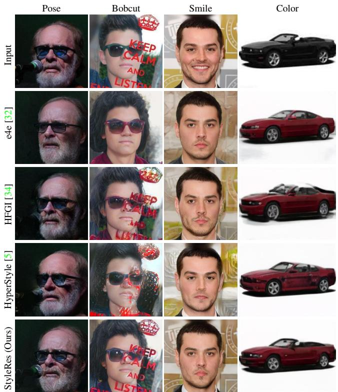
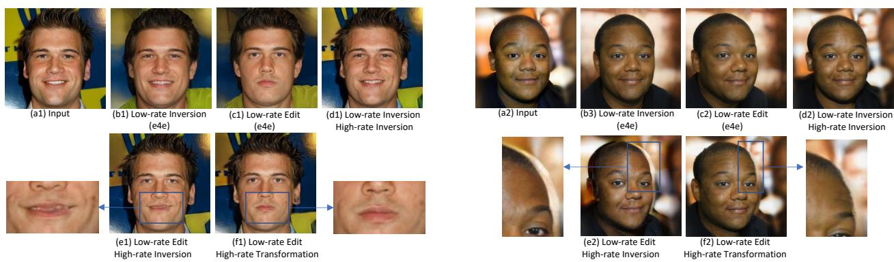
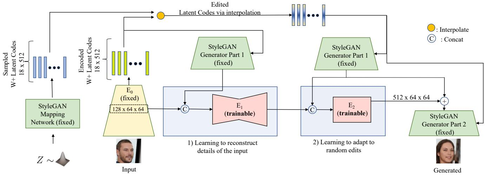
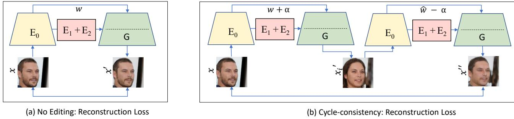
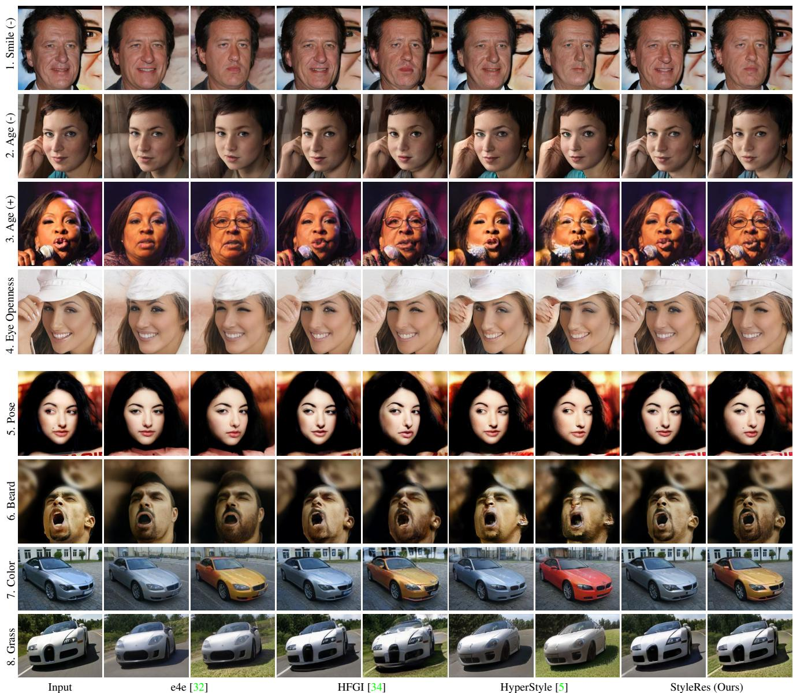
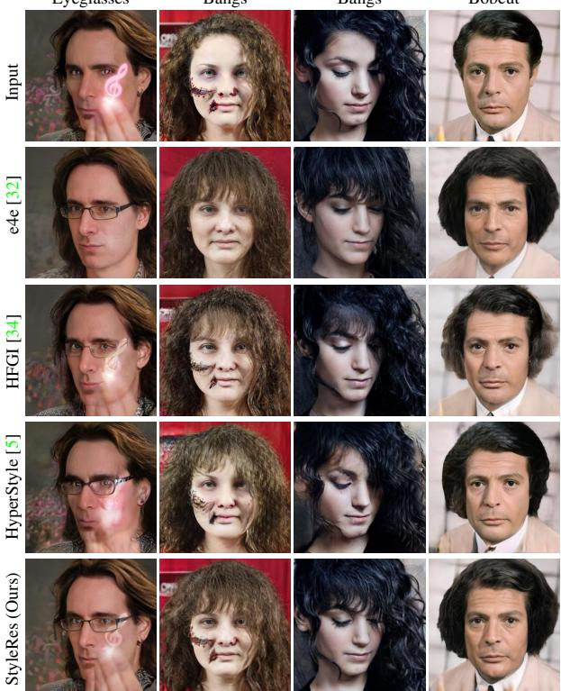
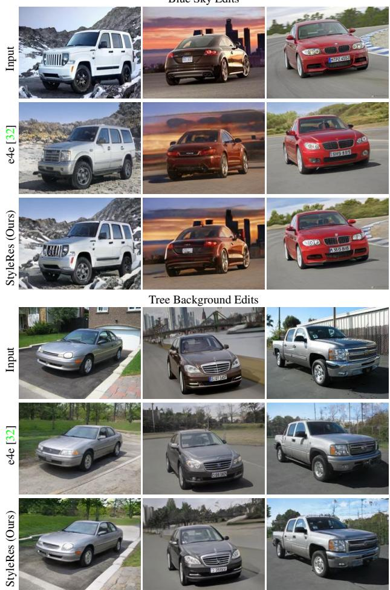
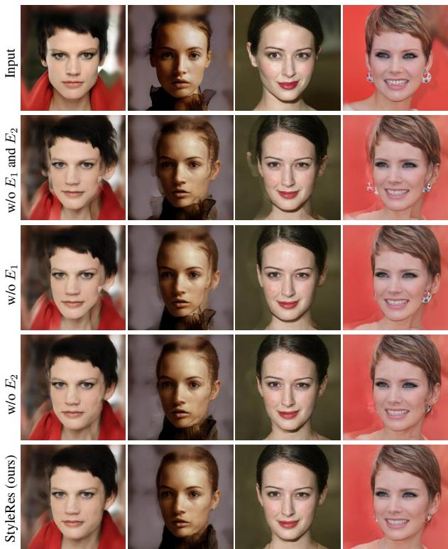
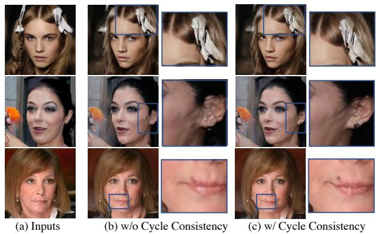

# StyleRes: Transforming the Residuals for Real Image Editing with StyleGAN

Hamza Pehlivan Yusuf Dalva Aysegul Dundar

Bilkent University

{hamza.pehlivan,yusuf.dalva}@bilkent.edu.tr

adundar@cs.bilkent.edu.tr

## Abstract

We present a novel image inversion framework and a training pipeline to achieve high-fidelity image inversion with high-quality attribute editing. Inverting real images into StyleGAN’s latent space is an extensively studied problem, yet the trade-off between the image reconstruction fidelity and image editing quality remains an open challenge. The low-rate latent spaces are limited in their expressiveness power for high-fidelity reconstruction. On the other hand, high-rate latent spaces result in degradation in editing quality. In this work, to achieve high-fidelity inversion, we learn residualfeatures in higher latent codes that lower latent codes were not able to encode. This enables preserving image details in reconstruction. To achieve high-quality editing, we learn how to transform the residual features for adapting to manipulations in latent codes. We train the framework to extract residual features and transform them via a novel architecture pipeline and cycle consistency losses. We run extensive experiments and compare our method with state-of-the-art inversion methods. Qualitative metrics and visual comparisons show significant improvements. Code: https://github.com/hamzapehlivan/StyleRes

## 1. Introduction

Generative Adversarial Networks (GANs) achieve high quality synthesis of various objects that are hard to distinguish from real images [14, 21, 22, 41, 43]. These networks also have an important property that they organize their latent space in a semantically meaningful way; as such, via latent editing, one can manipulate an attribute of a generated image. This property makes GANs a promising technology for image attribute editing and not only for generated images but also for real images. However, for real images, one also needs to find the corresponding latent code that will generate the particular real image. For this purpose, different GAN inversion methods are proposed, aiming to project real images to pretrained GAN latent space [15, 30, 31, 33, 37]. Even though this is an extensively studied problem with significant progress, the trade-off between image reconstruction fidelity and image editing quality remains an open challenge.

  
Figure 1. Comparison of our method with e4e, HFGI, and HyperStyle for the pose, bob cut hairstyle, smile removal, and color change edits. Our method achieves high fidelity to the input and high quality edits.

The trade-off between image reconstruction fidelity and image editing quality is referred to as the distortioneditability trade-off [32]. Both are essential for real image editing. However, it is shown that the low-rate latent spaces are limited in their expressiveness power, and not every image can be inverted with high fidelity reconstruction [1, 27, 32, 34]. For that reason, higher bit encodings and more expressive style spaces are explored for image inversion [1, 2]. Although with these techniques, images can be reconstructed with better fidelity, the editing quality decreases since there is no guarantee that projected codes will naturally lie in the generator’s latent manifold.

In this work, we propose a framework that achieves high fidelity input reconstruction and significantly improved editability compared to the state-of-the-art. We learn residual features in higher-rate latent codes that are missing in the reconstruction of encoded features. This enables us to reconstruct image details and background information which are difficult to reconstruct via low rate latent encodings. Our architecture is single stage and learns the residuals based on the encoded features from the encoder and generated features from the pretrained GANs. We also learn a module to transform the higher-latent codes if needed based on the generated features (e.g. when the low-rate latent codes are manipulated). This way, when low-rate latent codes are edited for attribute manipulation, the decoded features can adapt to the edits to reconstruct details. While the attributes are not edited, the encoder can be trained with image reconstruction and adversarial losses. On the other hand, when the image is edited, we cannot use image reconstruction loss to regularize the network to preserve the details. To guide the network to learn correct transformations based on the generated features, we train the model with adversarial loss and cycle consistency constraint; that is, after we edit the latent code and generate an image, we reverse the edit and aim at reconstructing the original image. Since we do not want our method to be limited to predefined edits, during training, we simulate edits by randomly interpolating them with sampled latent codes.

The closest to our approach is HFGI [34], which also learns higher-rate encodings. Our framework is different as we learn a single-stage architecture designed to learn features that are missing from low-rate encodings and we learn how to transform them based on edits. As shown in Fig. 1, our framework achieves significantly better results than HFGI and other methods in editing quality. In summary, our main contributions are:

• We propose a single-stage framework that achieves highfidelity input embedding and editing. Our framework achieves that with a novel encoder architecture.

• We propose to guide the image projection with cycle consistency and adversarial losses. We edit encoded images by taking a step toward a randomly sampled latent code. We expect to reconstruct the original image when the edit is reversed. This way, edited images preserve the details of the input image, and edits become high quality.

• We conduct extensive experiments to show the effectiveness of our framework and achieve significant improvements over state-of-the-art for both reconstruction and real image attribute manipulations.

## 2. Related Work

GAN Inversion. GAN inversion methods aim at projecting a real image into GANs embedding so that from the embedding, GAN can generate the given image. Currently, the biggest motivation of the inversion is the ability to edit the image via semantically rich disentangled features of GANs; therefore models aim for high reconstruction and editing quality. Inversion methods can be categorized into two; 1) methods that directly optimize the latent vector to minimize the reconstruction error between the output and target image [1, 2, 9, 22, 28], 2) methods that learn encoders to reconstruct images over training images [32, 34, 45]. Op timization based methods require per-image optimization and iterative passes on GANs, which take several minutes per image. Additionally, overfitting on a single image results in latent codes that do not lie in GAN’s natural latent distribution, leading to poor editing quality. Among these methods, PTI [28] takes a different approach, and instead of searching for a latent code that will reconstruct the image most accurately, PTI fine-tunes the generator in order to insert encoded latent code into well-behaved regions of the latent space. It shows better editability; however, the method still suffers from long run-time optimizations and tunings. Encoder based methods leverage the knowledge of training sets while projecting images. They output results with less fidelity to the input, but edits on the projected latents are better quality. They also operate mostly in real time. They either project the latent code with a single feed forward pass [27, 32, 45], or two stage feed-forward passes where the first encoder learns to embed an image, the second learns to reconstruct the missing details [34], or iterative forward passes where the network tries to minimize the reconstruction loss at each pass by taking the original image and reconstructed output as inputs [4, 5]. In this work, we propose a novel encoder architecture that achieves significantly better results than state-of-the-art via a single feedforward pass on the input image.

Image Translation. There is quite an interest in image translation algorithms that can change an attribute of an image while preserving a given content [12, 25, 35], especially for faces editing [3, 8, 10, 13, 17, 24, 29, 36, 38, 42]. These algorithms set an encoder-decoder architecture and train the models with reconstruction and GAN losses [8, 19, 24, 39, 46]. Even though they are successful at image manipulation, they are trained for a given task and rely on predefined translation datasets. On the other hand, it is shown that GANs that are trained to synthesize objects in an unconditional way can be used for attribute manipulation [6, 21, 22] via their semantically rich disentangled features. This makes pretrained GANs promising technology for image editing, given that via their ability of image generation, they can achieve many downstream tasks simultaneously. Many methods have been proposed for finding latent directions to edit images [15, 30, 31, 33, 37]. These directions are explored both in supervised [3, 30] and unsupervised ways [15, 31, 33, 37] resulting in exploration of attribute manipulations beyond the predefined attributes of labeled datasets. However, finding these directions is only one part of the problem; to achieve real image editing, there is a need for a successful image inversion method which is the topic of this paper.

  
Figure 2. When images are encoded to W+ space, as shown in (b), the reconstructions miss many image details. However, the edits are in good quality (c). Additional features can be learned in higher-rate latent codes. For example, skip connections from encoder to generator in higher resolution features can enable high-fidelity reconstruction to input images as shown in (d). However, if the high-rate features do not transform with the edits, they result in ghosting effects as shown in (e). In this work, we propose high-rate encoding and transformation for successful inversions and edits (f).

## 3. Method

In Section 3.1, we describe the motivation for our approach. The model architecture and the training procedure are presented in Sections 3.2 and 3.3, respectively.

## 3.1. Motivation

Current inversion methods aim at learning an encoder to project an input image into StyleGAN’s natural latent space so that the inverted image is editable. However, it is observed by previous works that when images are encoded into GAN’s natural space (low-rate W or W+ space), their reconstructions suffer from low fidelity to input images, as shown in Fig. 2(b). On the other hand, if the image is encoded to higher feature maps of pretrained GANs, they will not be editable since they are not inverted to the semantic space of GANs. On the other hand, low-rate inversion is editable, as shown in Fig. 2(c).

StyleGAN, during training and inference, relies on direct noise inputs to generate stochastic details. These additional noise inputs provide stochastic image details such as for face images, the exact placement of hairs, stubble, freckles, or skin pores which are not modeled by W+ space.

During inversion to W+ space alone, that mechanism is discarded. One can tune the noise maps as well via the reconstruction loss; however, then there will be no mechanism to adapt those stochastic details to attribute manipulation. For example, the freckles should move as the pose is manipulated, but with noise optimization alone, it will not be possible.

We propose to embed images to both low-rate and highrate embeddings. Consistent with the design of StyleGAN, we aim at encoding the overall composition and high-level aspects of the image to W+ space (low-rate encoding). Our goal is to embed the stochastic image details and the diverse background details, which are difficult to reconstruct from W+ space to higher latent codes. However, this setting also requires a mechanism for encoded image details to adopt manipulations in the image. Otherwise, it will cause a ghosting effect, as shown in Fig 2(e). For example, in Fig 2(e1), the smile is removed by W+ code edit; however, the higher-rate encodings stay the same and cause artifacts around the mouth area. In Fig. 2(e2), the pose is edited but higher detail encodings did not move and caused blur.

In this work, we design an encoder architecture and training pipeline to achieve both learning residual features (the ones W+ space could not reconstruct) and how to transform them to be consistent with the manipulations.

## 3.2. StyleRes Architecture

Our method utilizes an encoder $E _ { 0 }$ that can embed images into W+ latent space and a StyleGAN generator G. In our setup, we utilize a pretrained encoder for $E _ { 0 }$ [32] and StyleGAN2 generator [22] and fix them in our training. Because it is difficult to preserve image details only from low-rate latent codes, we also extract high level features from the encoder. First, the high and low rate features are extracted as $F _ { 0 } , W ^ { + } = E _ { 0 } ( x )$ using the encoder $E _ { 0 }$ from the input image x as shown in Fig. 3. $F _ { 0 }$ has the spatial dimension of 64 × 64 and provides us with more image details. Next, from $F _ { 0 } ,$ our aim is to encode residuals that are missing from the image reconstruction. For this goal, we set an encoder, $E _ { 1 }$ , which takes $F _ { 0 }$ as input. Since the goal of $E _ { 1 }$ is to encode residual features, we also feed the generated features with $W ^ { + }$ from the StyleGAN generator, $G _ { W } = G _ { 0 \to n } ( W )$ , where the arrow operator indicates the indices of convolutional layers used from G.

  
Figure 3. StyleRes encodes missing features for high-fidelity reconstruction of given input via the first encoder, $E _ { 1 }$ . Those encoded features are the ones which could not be encoded to low-rate $\mathrm { W } +$ space via $E _ { 0 }$ due to the information bottleneck. Through the second encoder, $E _ { 2 }$ StyleRes learns to transform features based on the manipulated features. During training, latent codes are edited by interpolating encoded W+’s with randomly generated ones by StyleGAN’s mapping network. During inference, they are edited with semantically meaningful directions discovered by methods such as InterfaceGAN and GANSpace. Note that StyleGAN generator is shown as two parts just for the ease of visualizing the diagram. First part includes the layers that generate features to $6 4 \times 6 4$ and the second part generates the higher resolution features and final image.

$$
F _ { a } = E _ { 1 } ( F _ { 0 } , G _ { W + } )\tag{1}
$$

With the inputs of $F _ { 0 }$ and $G _ { W + } , \ E _ { 1 }$ can learn what the missing features are by comparing the encoded features $F _ { 0 }$ and generated ones, $G _ { W + }$ , so far. While $E _ { 1 }$ can learn the residual features, it is not guided on how to transform them if images are edited. For that purpose, we train $E _ { 2 } ,$ , which takes $F _ { a }$ and edited features from the generator. Since we do not target predefined edits (e.g., smile, pose, age), we simulate the edits by taking random directions. Specifically, we sample a z vector from the normal distribution and obtain $W _ { r } ^ { + }$ by StyleGAN’s mapping network, M; $W _ { r } ^ { + } = M ( z )$ . Next, we take a step towards $W _ { r } ^ { + }$ to obtain a mixed style code $W _ { \alpha } ^ { + }$

$$
W _ { \alpha } ^ { + } = W ^ { + } + \alpha \frac { W _ { r } ^ { + } - W ^ { + } } { 1 0 }\tag{2}
$$

where α controls the degree of the edit. During the training, we assign α to 0 (no edit) or a value in the range of

(4, 5) with 50% chance. We adjust $F _ { a }$ to the altered generator features $G _ { \alpha } = G _ { 0 \to n } ( W _ { \alpha } )$ using a second encoder $E _ { 2 }$ and obtain the final feature map F:

$$
F = E _ { 2 } ( F _ { a } , G _ { \alpha } )\tag{3}
$$

Finally, F and $G _ { \alpha }$ are summed, and given as an input to next convolutional layers in the generator. Architectural details of $E _ { 1 }$ and $E _ { 2 }$ are given in Supplementary.

## 3.3. Training Phases

To train our model with the capabilities of high-fidelity inversion and high-quality editing, we use two training phases, as shown in Fig. 4.

No Editing Path. In this path, we reconstruct images with no editing on encoded $W ^ { + }$ . This refers to the case where $\alpha = 0$ in Eq. 2. This is also the training path other inversion methods solely rely on. While this path can teach the network to reconstruct images faithfully, it does not include any edits and cannot guide the network to high-quality editability.

Cycle Translation Path. In this path, we edit images by setting α a value in the range of (4, 5), which we found to work best in our ablation studies. Via the edit, the generator outputs image $x _ { i } ^ { \prime } .$ Next, we feed this intermediate output image to the encoder and reverse the edit by inverting the addition presented in Eq. 2. The generator reconstructs $x ^ { \prime \prime }$ which is supposed to match the input image x. The cycle translation path is important because there is no groundtruth output for the edited image, $x _ { i } ^ { \prime } .$ . Adversarial loss can guide $\boldsymbol { x } _ { i } ^ { \prime }$ to look realistic but will not guide the network to keep the input image details if edited.

  
Figure 4. We train StyleRes with (a) no editing based reconstruction and (b) cycle consistency based reconstruction losses. Many details from the inference pipeline are omitted for brevity. With reconstruction losses, the model learns to preserve the image details. We additionally apply adversarial losses on $x _ { i } ^ { \prime } ;$ this way, when the image is edited, the transformation network learn to output realistic images. With cycle consistency based reconstruction, the network is regularized to keep the input details also during edits. We use additional losses as explained in Section 3.4.

## 3.4. Training Objectives

Reconstruction Losses. For both no editing and cycle consistency path outputs, our goal is to reconstruct the input image. To supervise this behavior, we use $L _ { 2 }$ loss, perceptual loss, and identity loss between the input and output images. The first reconstruction loss is as follows, where x is the input image, $x ^ { \prime }$ and $x ^ { \prime \prime }$ are output images, as given in Fig. 4:

$$
\mathcal { L } _ { r e c - l 2 } = | | x ^ { \prime } - x | | _ { 2 } + | | x ^ { \prime \prime } - x | | _ { 2 }\tag{4}
$$

We use perceptual losses from VGG (Φ) at different feature layers $( j )$ between these images from the loss objective as given in Eq. 5.

$$
\mathcal { L } _ { r e c - p } = | | \Phi _ { j } ( x ^ { \prime } ) - \Phi _ { j } ( x ) | | _ { 2 } + | | \Phi _ { j } ( x ^ { \prime \prime } ) - \Phi _ { j } ( x ) | | _ { 2 }\tag{5}
$$

Identity loss is calculated with a pre-trained network $A .$ $A$ is an ArcFace model [11] when training on the face domain and a domain specific ResNet-50 model [32] for our training on car class.

$$
L _ { r e c - i d } = ( 1 - \langle A ( x ) , A ( x ^ { \prime } ) \rangle ) + ( 1 - \langle A ( x ) , A ( x ^ { \prime \prime } ) \rangle )\tag{6}
$$

Adversarial Losses. We also use adversarial losses to guide the network to output images that match the real image distribution. This objective improves realistic image inversions and edits. We load the pretrained discriminator from StyleGAN training, D, and train the discriminator together with the encoders.

$$
\begin{array} { r } { L _ { a d v } = 2 \log D ( x ) + \log \left( 1 - D ( x ^ { \prime } ) \right) } \\ { + \log \left( 1 - D ( x _ { i } ^ { \prime } ) \right) } \end{array}\tag{7}
$$

Feature Regularizer. To prevent our encoder from deviating much from the original StyleGAN space, we regularize the residual features to be small:

$$
L _ { F } = \sum _ { F \in \phi } \| F \| _ { 2 }\tag{8}
$$

Full Objective. We use the overall objectives given below. The hyper parameters are provided in Supplementary.

$$
\begin{array} { r } { \underset { E _ { 1 } , E _ { 2 } } { \operatorname* { m i n } } \underset { D } { \operatorname* { m a x } } \lambda _ { a } \mathcal { L } _ { a d v } + \lambda _ { r 1 } \mathcal { L } _ { r e c - l 2 } + \lambda _ { r 2 } \mathcal { L } _ { r e c - p } } \\ { + \lambda _ { r 3 } \mathcal { L } _ { r e c - i d } + \lambda _ { f } \mathcal { L } _ { F } } \end{array}\tag{9}
$$

## 4. Experiments

Set-up. For datasets and attribute editing, we follow the previous work [34]. For the human face domain, we train the model on the FFHQ [21] dataset and evaluate it on the CelebA-HQ [20] dataset. For the car domain, we use Stanford Cars [23] for training and evaluation. We run extensive experiments with directions explored with InterfaceGAN [30], GANSpace [15], StyleClip [26], and Grad-Ctrl [7] methods.

Evaluation. We report metrics for reconstruction and editing qualities. For reconstruction, we report Frechet Inception Distance (FID) metric [16], which looks at the realism by comparing the target image distribution and reconstructed images, Learned Perceptual Image Patch Similarity (LPIPS) [44] and Structural Similarity Index Measure (SSIM), which compares the target and output pairs at the feature level of a pretrained deep network and pixel level, respectively. Additionally, FIDs are calculated for adding and removing the smile attributes on the CelebA-HQ dataset. By using the ground-truth attributes, we add smile to images that do not have smile attribute and calculate FIDs between smile addition edited images and smiling ground-truth images. The same set-up is used for smile removal. On the Stanford cars dataset, we change grass and color attribute of images, and since there is no ground-truth attribute, we calculate the FIDs between the edited and original images.

  
Figure 5. Qualitative results of inversion and editing. For each method, the first column shows inversion, and the second shows Interface GAN [30] and GANSpace [15] edits.

Baselines. We compare our method with state-of-theart image inversion methods pSp [27], e4e [32], ReStyle [4], HyperStyle [5], HFGI [34], StyleTransformer [18], and FeatureStyle [40]. We use the author’s released models. Hence, for the Stanford car dataset, some methods are omitted from comparisons if the models are not released. Among those, we only train HFGI for car model with author’s released code since we base our main comparisons with it.

Quantitative Results. In Table 1, we provide reconstruction and editing scores on the CelebA-HQ dataset. Our method achieves better results than all competing methods on all metrics. Most significantly, we achieve better FID scores on both reconstruction and editing qualities. While FeatureStyle achieves comparable SSIM and LPIPS scores on reconstruction, the editing FIDs are worse than our model. As shown in Table 2, we achieve significantly better results than previous methods on the Stanford Car dataset as well. We also compare the runtime of our method and previous methods. Our method is significantly faster than HyperStyle (0.125 sec vs. 0.439 sec). That is because HyperStyle refines its predicted weight offsets gradually via multiple iterations. Our method is also faster than HFGI (0.125 sec vs. 0.130 sec), in addition to achieving better scores. We run a single stage network inference, whereas HFGI first generates an image via e4e and StyleGAN and provides the error map to a second architecture. The table for runtimes is provided in Supplementary.

Table 1. Quantitative results of reconstruction and editing on CelebA-HQ dataset. For reconstruction, we report FID, SSIM, and LPIPS scores. For editing, we report FID metrics for smile addition (+) and removal (-).
<table><tr><td rowspan=1 colspan=1></td><td rowspan=1 colspan=3>Reconstruction</td><td rowspan=1 colspan=2>Editing - FIDs</td></tr><tr><td rowspan=1 colspan=1>Method</td><td rowspan=1 colspan=1>FID</td><td rowspan=1 colspan=1>SSIM</td><td rowspan=1 colspan=1>LPIPS</td><td rowspan=1 colspan=1>Smile(+)</td><td rowspan=1 colspan=1>Smile(-)</td></tr><tr><td rowspan=7 colspan=1>pSp [27]e4e [32]ReStyle [4]HyperStyle [5]HFGI [34]StyleTransformer [18]FeatureStyle [40]</td><td rowspan=2 colspan=1>23.8630.22</td><td rowspan=2 colspan=1>0.750.71</td><td rowspan=1 colspan=1>0.17</td><td rowspan=1 colspan=1>32.47</td><td rowspan=1 colspan=1>34.0</td></tr><tr><td rowspan=1 colspan=1>0.21</td><td rowspan=1 colspan=1>38.58</td><td rowspan=1 colspan=1>39.68</td></tr><tr><td rowspan=1 colspan=1>24.82</td><td rowspan=1 colspan=1>0.73</td><td rowspan=1 colspan=1>0.20</td><td rowspan=1 colspan=1>30.35</td><td rowspan=1 colspan=1>33.69</td></tr><tr><td rowspan=2 colspan=1>16.0812.17</td><td rowspan=1 colspan=1>0.83</td><td rowspan=1 colspan=1>0.11</td><td rowspan=1 colspan=1>26.43</td><td rowspan=2 colspan=1>25.2627.10</td></tr><tr><td rowspan=1 colspan=1>0.85</td><td rowspan=1 colspan=1>0.13</td><td rowspan=1 colspan=1>25.22</td></tr><tr><td rowspan=1 colspan=1>21.82</td><td rowspan=1 colspan=1>0.75</td><td rowspan=1 colspan=1>0.17</td><td rowspan=1 colspan=1>34.32</td><td rowspan=1 colspan=1>34.61</td></tr><tr><td rowspan=1 colspan=1>11.33</td><td rowspan=1 colspan=1>0.90</td><td rowspan=1 colspan=1>0.10</td><td rowspan=1 colspan=1>27.20</td><td rowspan=1 colspan=1>26.15</td></tr><tr><td rowspan=1 colspan=1>StyleRes (Ours)</td><td rowspan=1 colspan=1>7.04</td><td rowspan=1 colspan=1>0.90</td><td rowspan=1 colspan=1>0.09</td><td rowspan=1 colspan=1>23.52</td><td rowspan=1 colspan=1>21.80</td></tr></table>

Table 2. Quantitative results of reconstruction and editing on the Stanford Cars Dataset. For reconstruction, we report FID, SSIM, and LPIPS scores. For editing, we report FID metrics for grass addition and color change.
<table><tr><td></td><td colspan="3">Reconstruction</td><td colspan="2">Editing - FIDs</td></tr><tr><td>Method</td><td>FID</td><td>SSIM</td><td>LPIPS</td><td>Grass</td><td>Color</td></tr><tr><td>e4e [32]</td><td>14.04</td><td>0.50</td><td>0.32</td><td>18.02</td><td>29.79</td></tr><tr><td>ReStyle [4]</td><td>13.38</td><td>0.57</td><td>0.30</td><td>16.01</td><td>21.34</td></tr><tr><td>HyperStyle [5]</td><td>11.64</td><td>0.63</td><td>0.28</td><td>17.13</td><td>26.30</td></tr><tr><td>HFGI [34]</td><td>9.41</td><td>0.83</td><td>0.16</td><td>14.84</td><td>26.65</td></tr><tr><td>StyleTransformer [18]</td><td>14.01</td><td>0.57</td><td>0.28</td><td>19.47</td><td>19.94</td></tr><tr><td>StyleRes (Ours)</td><td>7.60</td><td>0.83</td><td>0.14</td><td>10.64</td><td>18.86</td></tr></table>

Qualitative Results. We show visuals of inversion and editing results of our method, e4e, HFGI, and HyperStyle in Fig. 5. We provide further comparisons in Supplementary with other attribute editings and with other methods. Compared to previous methods, our method achieves significantly better fidelity to the input images and preserves the identity and details when edited. It is the only method in these comparisons that preserves the background, earings (second row), hands (second-fourth rows), and hats (fourth row). Our method also achieves facial detail reconstruction; for example, in the fifth row, the person has a mole at the corner of her mouth. Among the inversions, our method is the only one preserving that. Furthermore, during the pose edit, it is transformed correctly. On the sixth row, our method is the only one that achieves the correct inversion and edit. In car examples, we again achieve high fidelity to the input images both in inversion and editing. e4e and HyperStyle do not reconstruct the image faithfully. On the other hand, HFGI outputs artefacts during edits. We additionally show results with edits explored by StyleClip [26] and GradCtrl [7] methods in Figs. 6 and 7, respectively.

Eyeglasses  
Bangs  
Bangs  
Bobcut  
  
Figure 6. Comparison of our method with e4e, HFGI, and Hyper-Style with StyleClip edits [26]. The first column shows eyeglasses addition, the second and third columns show bangs addition, and the last column shows bob cut hairstyle results.

Ablation Study. We run extensive experiments to validate the role of each proposed design choices. We first experiment with an architecture that does not have $E _ { 1 }$ and $E _ { 2 }$ modules. This experiment refers to the case where we learn a network that does not take input from StyleGAN Part 1 features, neither the original $( G _ { W + } )$ nor the edited features $( G _ { \alpha } )$ . The network directly takes higher layer features $( F _ { 0 } )$ from the encoder and outputs them to the generator. As shown in Fig. 8, the network still tries to learn residual features to achieve reconstructions; however, it achieves poor edits. Without $E _ { 2 }$ refers to the experiment with $E _ { 1 }$ directly outputting features to Generator Part 2 (as shown in Fig. 3). Without $E _ { 1 }$ refers to the experiment where $E _ { 2 }$ directly takes input from the encoder $( F _ { 0 } )$ and $( G _ { \alpha } )$ as defined in Sec. 3.2. None of the networks are able to learn the residual features and how to transform them as well as our final architecture since they are not designed to take the original and edited features separately. We also experiment without cycle consistency losses. Fig. 9 shows visual results of methods trained with and without cycle consistency constrain. We observe that with cycle consistency constrain, our network achieves preserving fine image details even when images are edited.

  
Figure 7. Additional results of our method and e4e with GradCtrl edits [7]. The first three rows show blue sky edit, and the others show tree background edits.

## 5. Conclusion

We present a novel image inversion framework and a training pipeline to achieve high-fidelity image inversion with high-quality attribute editing. In this work, to achieve high-fidelity inversion, we learn residual features in higher latent codes that lower latent codes were not able to encode. This enables preserving image details in reconstruction. To achieve high-quality editing, we learn how to transform the residual features for adapting to manipulations in latent codes. We show state-of-the-art results on a wide range of edits explored with different methods both quantitatively and qualitatively while achieving faster run-time than competing methods.

Figure 8. Ablation Study. Pose edit outputs of our final architecture and architecture with missing modules. w/o $E _ { 1 }$ or $E _ { 2 }$ , networks struggle to transform features correctly.  
  
Figure 9. Ablation Study. Pose edit outputs of models trained with and without cycle consistency loss. The model trained with cycle consistency is better at preserving the details as shown in enlarged boxes.

## Acknowledgement

This work has been funded by The Scientific and Technological Research Council of Turkey (TUBITAK), 3501 Research Project under Grant No 121E097. A. Dundar was supported by Marie Skłodowska-Curie Individual Fellowship.

## References

[1] Rameen Abdal, Yipeng Qin, and Peter Wonka. Image2stylegan: How to embed images into the stylegan latent space? In Proceedings of the IEEE/CVF International Conference on Computer Vision, pages 4432–4441, 2019. 1, 2

[2] Rameen Abdal, Yipeng Qin, and Peter Wonka. Image2stylegan++: How to edit the embedded images? In Proceedings of the IEEE/CVF conference on computer vision and pattern recognition, pages 8296–8305, 2020. 2

[3] Rameen Abdal, Peihao Zhu, Niloy J Mitra, and Peter Wonka. Styleflow: Attribute-conditioned exploration of stylegangenerated images using conditional continuous normalizing flows. ACM Transactions on Graphics (ToG), 40(3):1–21, 2021. 2, 3

[4] Yuval Alaluf, Or Patashnik, and Daniel Cohen-Or. Restyle: A residual-based stylegan encoder via iterative refinement. In Proceedings of the IEEE/CVF International Conference on Computer Vision, pages 6711–6720, 2021. 2, 6, 7

[5] Yuval Alaluf, Omer Tov, Ron Mokady, Rinon Gal, and Amit Bermano. Hyperstyle: Stylegan inversion with hypernetworks for real image editing. In Proceedings of the IEEE/CVF Conference on Computer Vision and Pattern Recognition, pages 18511–18521, 2022. 1, 2, 6, 7

[6] Andrew Brock, Jeff Donahue, and Karen Simonyan. Large scale gan training for high fidelity natural image synthesis. arXiv preprint arXiv:1809.11096, 2018. 2

[7] Zikun Chen, Ruowei Jiang, Brendan Duke, Han Zhao, and Parham Aarabi. Exploring gradient-based multi-directional controls in gans. In European Conference on Computer Vision, pages 104–119. Springer, 2022. 5, 7, 8

[8] Yunjey Choi, Youngjung Uh, Jaejun Yoo, and Jung-Woo Ha. Stargan v2: Diverse image synthesis for multiple domains. In Proceedings ofthe IEEE Conference on Computer Vision and Pattern Recognition, 2020. 2

[9] Antonia Creswell and Anil Anthony Bharath. Inverting the generator of a generative adversarial network. IEEE transactions on neural networks and learning systems, 30(7):1967– 1974, 2018. 2

[10] Yusuf Dalva, Said Fahri Altındis¸, and Aysegul Dundar. Vecgan: Image-to-image translation with interpretable latent directions. In European Conference on Computer Vision, pages 153–169. Springer, 2022. 2

[11] Jiankang Deng, Jia Guo, Niannan Xue, and Stefanos Zafeiriou. Arcface: Additive angular margin loss for deep face recognition. In Proceedings of the IEEE/CVF conference on computer vision and pattern recognition, pages 4690–4699, 2019. 5

[12] Aysegul Dundar, Karan Sapra, Guilin Liu, Andrew Tao, and Bryan Catanzaro. Panoptic-based image synthesis. In Proceedings of the IEEE/CVF Conference on Computer Vision and Pattern Recognition, pages 8070–8079, 2020. 2

[13] Yue Gao, Fangyun Wei, Jianmin Bao, Shuyang Gu, Dong Chen, Fang Wen, and Zhouhui Lian. High-fidelity and arbitrary face editing. In Proceedings of the IEEE/CVF conference on computer vision and pattern recognition, pages 16115–16124, 2021. 2

[14] Ian Goodfellow, Jean Pouget-Abadie, Mehdi Mirza, Bing Xu, David Warde-Farley, Sherjil Ozair, Aaron Courville, and Yoshua Bengio. Generative adversarial nets. Advances in neural information processing systems, 27, 2014. 1

[15] Erik Hark¨ onen, Aaron Hertzmann, Jaakko Lehtinen, and¨ Sylvain Paris. Ganspace: Discovering interpretable gan controls. Advances in Neural Information Processing Systems, 33, 2020. 1, 3, 5, 6

[16] Martin Heusel, Hubert Ramsauer, Thomas Unterthiner, Bernhard Nessler, and Sepp Hochreiter. Gans trained by a two time-scale update rule converge to a local nash equilibrium. Advances in neural information processing systems, 30, 2017. 5

[17] Xianxu Hou, Xiaokang Zhang, Hanbang Liang, Linlin Shen, Zhihui Lai, and Jun Wan. Guidedstyle: Attribute knowledge guided style manipulation for semantic face editing. Neural Networks, 145:209–220, 2022. 2

[18] Xueqi Hu, Qiusheng Huang, Zhengyi Shi, Siyuan Li, Changxin Gao, Li Sun, and Qingli Li. Style transformer for image inversion and editing. In Proceedings of the IEEE/CVF Conference on Computer Vision and Pattern Recognition (CVPR), pages 11337–11346, June 2022. 6, 7

[19] Xun Huang, Ming-Yu Liu, Serge Belongie, and Jan Kautz. Multimodal unsupervised image-to-image translation. Eur. Conf. Comput. Vis., 2018. 2

[20] Tero Karras, Timo Aila, Samuli Laine, and Jaakko Lehtinen. Progressive growing of gans for improved quality, stability, and variation. arXiv preprint arXiv:1710.10196, 2017. 5

[21] Tero Karras, Samuli Laine, and Timo Aila. A style-based generator architecture for generative adversarial networks. In Proceedings of the IEEE/CVF Conference on Computer Vision and Pattern Recognition, pages 4401–4410, 2019. 1, 2, 5

[22] Tero Karras, Samuli Laine, Miika Aittala, Janne Hellsten, Jaakko Lehtinen, and Timo Aila. Analyzing and improving the image quality of stylegan. In Proceedings of the IEEE/CVF Conference on Computer Vision and Pattern Recognition, pages 8110–8119, 2020. 1, 2, 3

[23] Jonathan Krause, Michael Stark, Jia Deng, and Li Fei-Fei. 3d object representations for fine-grained categorization. In Proceedings of the IEEE international conference on computer vision workshops, pages 554–561, 2013. 5

[24] Xinyang Li, Shengchuan Zhang, Jie Hu, Liujuan Cao, Xiaopeng Hong, Xudong Mao, Feiyue Huang, Yongjian Wu, and Rongrong Ji. Image-to-image translation via hierarchical style disentanglement. In Proceedings of the IEEE/CVF Conference on Computer Vision and Pattern Recognition, pages 8639–8648, 2021. 2

[25] Guilin Liu, Aysegul Dundar, Kevin J Shih, Ting-Chun Wang, Fitsum A Reda, Karan Sapra, Zhiding Yu, Xiaodong Yang, Andrew Tao, and Bryan Catanzaro. Partial convolution for padding, inpainting, and image synthesis. IEEE Transactions on Pattern Analysis and Machine Intelligence, 2022. 2

[26] Or Patashnik, Zongze Wu, Eli Shechtman, Daniel Cohen-Or, and Dani Lischinski. Styleclip: Text-driven manipulation of stylegan imagery. In Proceedings of the IEEE/CVF International Conference on Computer Vision, pages 2085–2094, 2021. 5, 7

[27] Elad Richardson, Yuval Alaluf, Or Patashnik, Yotam Nitzan, Yaniv Azar, Stav Shapiro, and Daniel Cohen-Or. Encoding in style: a stylegan encoder for image-to-image translation. In Proceedings of the IEEE/CVF conference on computer vision and pattern recognition, pages 2287–2296, 2021. 1, 2, 6, 7

[28] Daniel Roich, Ron Mokady, Amit H Bermano, and Daniel Cohen-Or. Pivotal tuning for latent-based editing of real images. ACM Transactions on Graphics (TOG), 42(1):1–13, 2022. 2

[29] Wei Shen and Rujie Liu. Learning residual images for face attribute manipulation. In Proceedings of the IEEE conference on computer vision and pattern recognition, pages 4030–4038, 2017. 2

[30] Yujun Shen, Jinjin Gu, Xiaoou Tang, and Bolei Zhou. Interpreting the latent space of gans for semantic face editing. In Proceedings of the IEEE/CVF Conference on Computer Vision and Pattern Recognition, pages 9243–9252, 2020. 1, 3, 5, 6

[31] Yujun Shen and Bolei Zhou. Closed-form factorization of latent semantics in gans. In Proceedings of the IEEE/CVF Conference on Computer Vision and Pattern Recognition, pages 1532–1540, 2021. 1, 3

[32] Omer Tov, Yuval Alaluf, Yotam Nitzan, Or Patashnik, and Daniel Cohen-Or. Designing an encoder for stylegan image manipulation. ACM Transactions on Graphics (TOG), 40(4):1–14, 2021. 1, 2, 3, 5, 6, 7, 8

[33] Andrey Voynov and Artem Babenko. Unsupervised discovery of interpretable directions in the gan latent space. In International Conference on Machine Learning, pages 9786– 9796. PMLR, 2020. 1, 3

[34] Tengfei Wang, Yong Zhang, Yanbo Fan, Jue Wang, and Qifeng Chen. High-fidelity gan inversion for image attribute editing. In Proceedings of the IEEE/CVF Conference on Computer Vision and Pattern Recognition, pages 11379– 11388, 2022. 1, 2, 5, 6, 7

[35] Ting-Chun Wang, Ming-Yu Liu, Jun-Yan Zhu, Andrew Tao, Jan Kautz, and Bryan Catanzaro. High-resolution image synthesis and semantic manipulation with conditional gans. In Proceedings of the IEEE conference on computer vision and pattern recognition, pages 8798–8807, 2018. 2

[36] Po-Wei Wu, Yu-Jing Lin, Che-Han Chang, Edward Y Chang, and Shih-Wei Liao. Relgan: Multi-domain image-to-image translation via relative attributes. In Proceedings of the IEEE/CVF international conference on computer vision, pages 5914–5922, 2019. 2

[37] Zongze Wu, Dani Lischinski, and Eli Shechtman. Stylespace analysis: Disentangled controls for stylegan image generation. In Proceedings of the IEEE/CVF Conference on Computer Vision and Pattern Recognition, pages 12863–12872, 2021. 1, 3

[38] Taihong Xiao, Jiapeng Hong, and Jinwen Ma. Elegant: Exchanging latent encodings with gan for transferring multiple face attributes. In Proceedings of the European conference on computer vision (ECCV), pages 168–184, 2018. 2

[39] Guoxing Yang, Nanyi Fei, Mingyu Ding, Guangzhen Liu, Zhiwu Lu, and Tao Xiang. L2m-gan: Learning to manipulate latent space semantics for facial attribute editing. In

Proceedings of the IEEE/CVF Conference on Computer Vision and Pattern Recognition, pages 2951–2960, 2021. 2

[40] Xu Yao, Alasdair Newson, Yann Gousseau, and Pierre Hellier. A style-based gan encoder for high fidelity reconstruction of images and videos. European conference on computer vision, 2022. 6, 7

[41] Ning Yu, Guilin Liu, Aysegul Dundar, Andrew Tao, Bryan Catanzaro, Larry S Davis, and Mario Fritz. Dual contrastive loss and attention for gans. In Proceedings ofthe IEEE/CVF International Conference on Computer Vision, pages 6731– 6742, 2021. 1

[42] Gang Zhang, Meina Kan, Shiguang Shan, and Xilin Chen. Generative adversarial network with spatial attention for face attribute editing. In Proceedings of the European conference on computer vision (ECCV), pages 417–432, 2018. 2

[43] Han Zhang, Ian Goodfellow, Dimitris Metaxas, and Augustus Odena. Self-attention generative adversarial networks. In International conference on machine learning, pages 7354– 7363. PMLR, 2019. 1

[44] Richard Zhang, Phillip Isola, Alexei A Efros, Eli Shechtman, and Oliver Wang. The unreasonable effectiveness of deep features as a perceptual metric. In Proceedings of the IEEE conference on computer vision and pattern recognition, pages 586–595, 2018. 5

[45] Jiapeng Zhu, Yujun Shen, Deli Zhao, and Bolei Zhou. Indomain gan inversion for real image editing. In European conference on computer vision, pages 592–608. Springer, 2020. 2

[46] Jun-Yan Zhu, Richard Zhang, Deepak Pathak, Trevor Darrell, Alexei A Efros, Oliver Wang, and Eli Shechtman. Multimodal image-to-image translation by enforcing bi-cycle consistency. In Advances in neural information processing systems, pages 465–476, 2017. 2