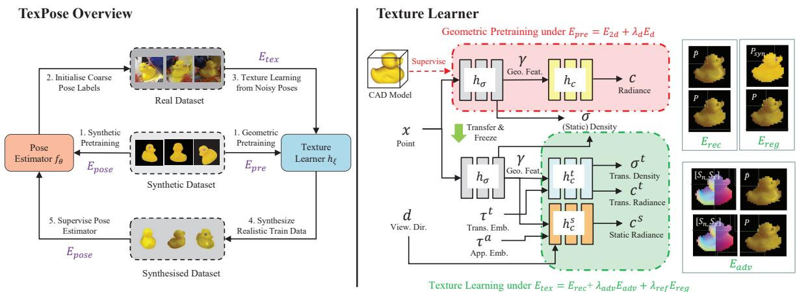
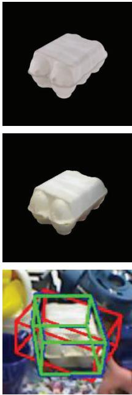
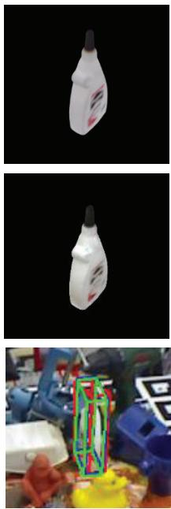
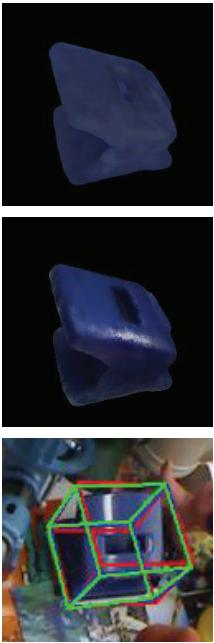
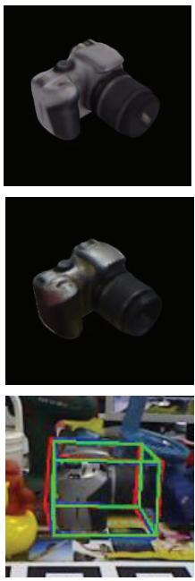
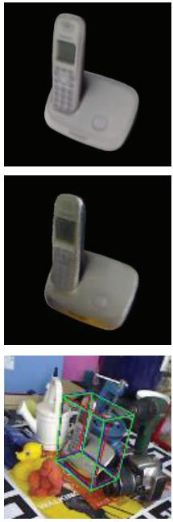
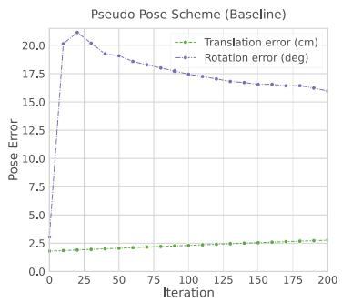
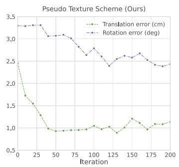
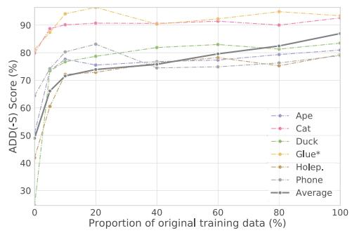

# TexPose: Neural Texture Learning for Self-Supervised 6D Object Pose Estimation

Hanzhi Chen1 Fabian Manhardt2 Nassir Navab1 Benjamin Busam1,3

1 Technical University of Munich 2 Google Inc. 3 3Dwe.ai

hanzhi.chen@tum.de fabianmanhardt@google.com b.busam@tum.de

## Abstract

In this paper, we introduce neural texture learning for 6D object pose estimation from synthetic data and a few unlabelled real images. Our major contribution is a novel learning scheme which removes the drawbacks ofprevious works, namely the strong dependency on co-modalities or additional refinement. These have been previously necessary to provide training signals for convergence. We formulate such a scheme as two sub-optimisation problems on texture learning and pose learning. We separately learn to predict realistic texture ofobjectsfrom real image collections and learn pose estimationfrom pixel-perfect synthetic data. Combining these two capabilities allows then to synthesise photorealistic novel views to supervise the pose estimator with accurate geometry. To alleviate pose noise and segmentation imperfection present during the texture learning phase, we propose a surfel-based adversarial training loss together with texture regularisation from synthetic data. We demonstrate that the proposed approach significantly outperforms the recent state-of-the-art methods without ground-truth pose annotations and demonstrates substantial generalisation improvements towards unseen scenes. Remarkably, our scheme improves the adopted pose estimators substantially even when initialised with much inferior performance.

## 1. Introduction

For spatial interaction with objects, one needs an understanding of the translation and rotation of targets within 3D space. Inferring these 6D object pose parameters from a single RGB image is a core task for 3D computer vision. This visually retrieved information has a wide range of applications in AR/VR [13, 33], autonomous driving [12, 30, 57], and robotic manipulation [24, 51, 53]. Noteworthy, accuracy and runtime have both recently made a huge leap forward thanks to deep learning [19, 23, 31, 39, 40]. Unfortunately, most of these methods heavily rely on a massive amount of labelled data for supervision to learn precise models with strong generalisation capabilities [16, 39, 53, 59]. However, it is very labor-intensive and time consuming to generate accurate annotations for pose data [15, 53]. Meanwhile, this process also easily suffers from labelling errors as precise annotation in 3D is highly challenging [14]. Therefore, most of the benchmarks have only few hundreds images, which does not allow proper learning of large models. In fact, methods training with such low amount of real data tend to strongly overfit to the data domain and fail to generalise to new scenes [18].

As a consequence, many different approaches have been proposed in the literature to tackle this problem. The simplest solution is to employ cut-and-paste strategy to increase domain invariance [11,26]. Nonetheless, this requires highly accurate manual annotations and most models tend to overfit to the original domain. Another alternative is to rely on a large amount of synthetically generated data to prevent overfitting. Though this process is relatively cheap and fast, rendered images can exhibit drastic visual discrepancy in comparison with real images even when advanced physicallybased renderers [9] are used. A handful of approaches try to close the domain gap via the use of generative adversarial networks to translate the synthetic images into the real domain [2, 58]. Unfortunately, these methods do not achieve promising results as the generated images are still easily distinguishable from real imagery. Notably, very recently a new line of work that proposes to self-supervise the pose estimator on real data has emerged. After training in simulation they fine-tune on the new datasets [46, 47]. While these methods achieve impressive results that are even on par with fully supervised methods, they still suffer from significant performance drop when not leveraging additional supervisory signals such as depth data [46] or ground truth camera poses [25, 42]. In this work, we propose a novel way to conduct self-supervised 6D pose estimation that is free from any additional supervision sources and further yields state-of-the-art performance.

The core idea of previous attempts [44,46,47,54] to adapt pretrained pose estimators to the real domain is to conduct render-and-compare using a differentiable renderer. With

CAD models and poses given, a renderer can output several attributes of the current object pose (e.g. mask, colour, depth) which allows to refine the pose through iterative comparison between the renderings and observations. However, when relying on 2D visual contents (mask and colour), such strategies tend to fail due to measured silhouette imperfection, lack of textures, and domain discrepancies. This undesirable behaviour is also discussed in [47].

Thus, different from the previous attempts that heavily rely on render-and-compare for self-supervision [46,47], we instead propose to regard realistic textures of the objects as an intermediate representation before conducting training for the pose estimator. Our approach is formulated as two interconnected sub-optimisation problems on texture learning and pose learning. In the core, we first learn realistic textures of objects from raw image collections, then synthesise training data to supervise the pose estimator with pixel-perfect labels and realistic appearance. The key challenge of our proposed scheme lies in capturing accurate texture under noise introduced by poses initialised by a pretrained pose estimator during supervision. To this end, in addition to leveraging synthetic data to establish geometry priors, we learn robust supervision through adversarial training by conditioning synthesised colours on local surface information. Furthermore, we establish regularisation from synthetic textures to compensate segmentation artefacts during a texture-learning phase. We demonstrate that the proposed approach significantly outperforms the recent stateof-the-art methods without ground-truth pose annotations and demonstrates substantial generalisation improvements towards unseen domains. Our method significantly improves even difficult objects with little variance in appearance and geometry through self-supervision. Impressively, Our approach demonstrates a robust self-improving ability for the employed pose estimators even when initialised with much inferior pose estimates than stronger baselines [46].

To summarise, our main contributions are:

We formulate a new learning scheme, TexPose, that decomposes self-supervision for 6D object pose into Texture learning and Pose learning.

We propose a surfel-conditioned adversarial training loss and a synthetic texture regularisation term to handle pose errors and segmentation imperfection during texture learning, further delivering self-improving ability to the pose estimators.

We show significant improvements over recent strong baselines with additional supervision signals. Our pose estimators demonstrates a substantial generalisation ability even on unseen scenes.

## 2. Related Work

Model-based 6D Pose Estimation To retrieve the 6D pose, early methods use local or global features and search for key points correspondence on CAD models [1,6,7,28]. In recent years, learning-based methods dominate the field and solve the task using convolution neural networks (CNN) under the supervision from annotated data to extract deep features. There are two major approaches for pose estimation, in particular, correspondence-based and regression/classificationbased approaches. Correspondence-based methods establish 2D-3D correspondences [37, 39, 40, 42, 59], prior to leveraging a variant of the RANSAC&PnP paradigm to solve for pose. Regression-based approaches, on the other hand, directly regress or classify the pose of the detected object. Initially these methods usually have shown a lower performance due to the existence of ambiguities [29] such as pose symmetries [53]. Therefore, methods like SSD-6D [19] discretise the rotation space to circumvent this issue. Recently, with better continuous representations for rotation [60], these methods gradually demonstrate high effectiveness [10, 48].

Self-Supervised Pose Learning Considering tremendous effort to collect large amount of annotations for 6D object pose [17, 50], several recent works have been proposed to explore the possibility of self-supervised pose learning using labeled synthetic data together with unlabelled real sensor data. [8] designed a novel labelling pipeline using a manipulator to generate reliable pose annotations for supervision. Self6D [47] proposed a self-supervision workflow by first pretraining a pose estimator with synthetic data, which was then adapted to the real world through a render-and-compare strategy by imposing consistencies between the rendered depth and sensed depth under the current pose estimate. CPS++ [32] used similar approach for categorical-level object pose estimation, and the shape is jointly deformed during optimisation. AAE [45] parameterise SO(3) space using a latent embedding obtained from synthetic images, which is later employed for orientation retrieval. Both works demonstrate the strong requirement for depth data in order to allow for a reasonable performance either in training or testing. However, due to the uninformative appearance and the sim-to-real domain gap, render-and-compare strategies easily diverge when there is no depth data available as shown in [47]. Hence, consecutive works introduce other supervisory signals to prune the need for depth. DSC-PoseNet [54] employs a key point consistency regularisation for dual-scale images with labelled 2D bounding box. Socket al. [44] use photometric consistency from multiple views to refine the raw estimate, while ground-truth masks are required for supervision. Recently, Self6D++ [46] proposed to initialise the render-and-compare process with a powerful deep pose refiner [26] to guide the learning process of the pose estimator, which currently yields state-of-the-art performance among all methods without manual annotations. Chen et al. [4] leverages a tailored heuristics for pseudo labelling under student-teacher learning scheme.

Novel View Synthesis With a few images given, novel view synthesis aims to render scene content from unseen viewpoints, which can be regarded as a process to acquire ”textures” of the scene. NOL [38] is proposed to address the difficulty of CAD model texturing for 6D pose estimation. Though requiring pose annotations, it demonstrates high potential to gain improvement for pose estimators with more synthesised real data in a semi-supervised fashion. Outside the scope of 6D pose, neural scene representation as implicit scene models recently get significant attention due to their ability for photorealistic novel view synthesis. NeRF [36] represent scenes using simple multi-layer perceptrons to encode the density and radiance for every 3D point. Assuming precise poses to transform views into a common reference frame, NeRF is able to capture volumes using an image reconstruction loss. NeRF-w [34] further extends NeRF to handle changing lighting and transient effects for image collections with latent embeddings. To release the rigid requirement of accurate poses, NeRF [52] jointly optimises camera parameters and radiance fields. iNeRF [56] performs a render-and-compare strategy using a trained NeRF for pose refinement. In contrast, BARF [27] demonstrates promising results when encountering imperfect pose initialisation by bundle-adjusting NeRF and camera poses with coarse-to-fine positional encoding scheme. GNeRF [35] formulates the learning of radiance fields and coarse pose estimates as a generative modelling process and then jointly refines both using photometric information. Recently, NeRF-Supervision [55] and NeRF-Pose [25] are proposed to leverage NeRF to learn dense descriptors or 3D representations of a given object under pose annotations when CAD model is inaccessible.

## 3. Method

Our objective is to conduct per-instance 6D pose learning from monocular colour images with no manual labelling effort, namely self-supervised 6D pose estimation originally defined in [47]. Since the CAD model is known as a prior, we follow the two-stage approach of previous works [44, 46, 47,54,56], which first pretrain a pose estimator with labelled synthetic data, and consequently conduct self-training with unannotated real images captured from a specific real scene demanding a more precise deployment (e.g. robotic bin picking). We mainly introduce the self-training process in this section. Notably, in this tuning process, pose estimator tends to suffer from forgetting problem due to little variance in illumination and backgrounds of the fed training samples. In contrast, We will show the strength of our scheme to alleviate this issue in Section. 4. After pretraining we acquire a pose estimator $f _ { \theta }$ able to initialise a coarse pose estimate $T$ and a segmentation mask M for each real image ${ \hat { I } } .$ M is usually used as a pseudo silhouette cue to refine the pose $T$ with render-and-compare strategy [5, 22, 47, 56].

In this section, we first revisit the commonly used strategy of previous methods in this task, then introduce our new formulation requiring no additional supervisory sources clearly advantageous over previous attempts.

## 3.1. Revisiting Self-Supervised 6D Pose Learning

Render-and-compare is a common approach for 6D pose self-supervision [44, 46, 47, 54, 56]. As shown in Eqn. 1, it utilises a differentiable renderer fed with an estimated pose to output a rendered mask, image, $[ M _ { r } , I _ { r } ] = \mathcal { R } ( T )$ $E _ { r e n d }$ enforces consistency between the rendered outputs $[ M _ { r } , I _ { r } ]$ and the observations [M, ˆI]. It aims to refine the pseudo pose labels for each training sample, and further supervise pose estimator $f _ { \theta }$ under $E _ { p o s e } .$ Previous attempts are majorly focused on improving $E _ { r e n d }$ to acquire more accurate pseudo pose annotations for better supervision.

$$
\begin{array} { r l } { \underset { \boldsymbol { \theta } , \{ T _ { i } , \dots , T _ { N } \} } { \operatorname* { m i n } } } & { \underset { \boldsymbol { i } } { \sum _ { i } } E _ { r e n d } ( \mathcal { R } ( T _ { i } ) , [ M _ { i } , \boldsymbol { \hat { I } _ { i } } ] ) } \\ & { + \underset { \boldsymbol { i } } { \sum } E _ { p o s e } ( f _ { \boldsymbol { \theta } } ( \boldsymbol { \hat { I } _ { i } } ) , T _ { i } ) . } \end{array}\tag{1}
$$

When relying on 2D information $[ M _ { r } , I _ { r } ]$ , minimising $E _ { r e n d }$ to improve $\{ T _ { 1 } , \dots , T _ { N } \}$ can be extremely difficult due to uninformative shape and appearance and sim-to-real visual discrepancy (e.g., Duck in Fig. 1). To compensate for the lack of information, related methods introduce additional supervision with varying difficulty levels for the acquisition (e.g, depth [47], weak labels [44, 54], deep pose refiner [46], etc.). Deep pose refiner could be acquired with the least effort as it only requires synthetic pretraining as well. However, it can introduce a strong upper bound as illustrated in [46]. The pose refiner can even lead to divergence of the pose estimator and hence lacks robustness for geometrically and photometrically challenging objects.

## 3.2. TexPose: Learning Pose from Texture

To address the aforementioned limitations, we reformulate self-supervised 6D pose learning as two alternating optimisation problems for a texture learner $h _ { \xi }$ and a pose estimator $f _ { \theta }$ as defined in Eqn. $2 ^ { 1 }$ and depicted in Fig. 1 (Left).

$$
\begin{array} { r l } { \underset { \theta , \xi } { \operatorname* { m i n } } } & { \displaystyle \sum _ { i } E _ { t e x } \big ( h _ { \xi } \circ f _ { \theta } ( \hat { I } _ { i } ) , \hat { I } _ { i } \big ) } \\ & { + \displaystyle \sum _ { j } E _ { p o s e } \big ( f _ { \theta } \circ h _ { \xi } ( \hat { T } _ { j } ) , \hat { T } _ { j } \big ) . } \end{array}\tag{2}
$$

Instead of leveraging raw images as regression targets for poses, we insert object textures as an intermediate representation before pose learning. Specifically, we start with optimising $E _ { t e x }$ by fixing the parameters of pose estimator $f _ { \theta }$ used to initialise poses $\{ T _ { 1 } , \dots , T _ { N } \}$ for each raw image $\{ \hat { I } _ { 1 } , \dotsc , \hat { I } _ { N } \}$ , aiming to provide supervision for the realistic textures embedded by $h _ { \xi }$ . Afterwards, we freeze $h _ { \xi }$ to synthesise training samples $\left\{ { { I } _ { 1 } } , \dotsc , { { I } _ { N ^ { \prime } } } \right\}$ paired with perfect labels $\{ \hat { T } _ { 1 } , \dots , \hat { T } _ { N ^ { \prime } } \}$ . Gradients will thus be propagated through $f _ { \theta }$ to update its parameters during the minimisation for $E _ { p o s e }$ over these train data. We typically chose $N ^ { \prime } > N$

  
Figure 1. Left: Schematic overview of TexPose. We fully explore the benefit of both synthetic and real dataset with perfect geometric labels and realistic appearance to synthesise informative train dataset for pose learning. Right: Details of the texture learner used in our scheme. We first conduct geometric pretraining to acquire geometry branch $h _ { \sigma }$ to ensure consistent coordinates system and geometry aligned with the CAD model. Then, we transfer and freeze $h _ { \sigma }$ to the real together with newly established radiance branch $h _ { c } ^ { s }$ and $h _ { c } ^ { t }$ as our texture learner. It is supervised by $E _ { r e c } , E _ { r e g }$ and $E _ { a d v }$ capable of improving texture quality so as to synthesise more informative dataset for supervision.

With this reformulation, we deliberately omit pose optimisation from 2D information usually sensitive to initialisation and prone to divergence, and bridge the domain gap directly through photorealistic synthesis. Our goal is then shifted to limit texture mapping error under the presence of pose noise so that the synthesised data can be highly informative with perfect geometric labels and as-accurate-as-possible realistic appearance. Intuitively, through multi-view supervision, it’s possible to capture more accurate appearance with compensation for per-view pose noise. Our proposed strategy to further increase reliability of the synthesised data will be discussed later. Notably, different from previous attempts, no additional supervision is required in our design. The pose estimator is equipped with a self-improving ability through intermediate phase for texture learning.

NeRF preliminaries. We leverage neural radiance fields (NeRF) [36] to embed the texture information due to its simplicity and capability of photorealistic view synthesis 2.

NeRF represents the object model with two MLPs to encode information for every queried point x, namely the geometry branch to predict volume density σ and geometric feature γ with $[ \sigma , \gamma ] = h _ { \sigma } ( \mathbf { x } )$ and radiance branch for colour c prediction with $\mathbf { c } = h _ { c } ( \mathbf { x } , \gamma )$ (weight ξ is omitted). When rendering from a given viewpoint, K samples $\{ x _ { k } \} _ { 1 } ^ { K }$ are gathered along the ray $\mathbf { r } = \mathbf { o } + t \mathbf { d }$ where ${ \mathbf o , \mathbf d \in \mathbb R ^ { 3 } }$ represent the camera centre and the view direction respectively and $t \in \mathbb { R }$ is the distance. The colour C(r) will be estimated through numerical quadrature approximation with $w _ { k } =$ $\exp ( - \delta _ { k } \sigma _ { k } )$ and $\begin{array} { r } { \alpha _ { k } = \prod _ { j = 1 } ^ { k - 1 } w _ { j } } \end{array}$ with $\delta _ { k }$ being the step size between adjacent points, and $\begin{array} { r } { \mathbf { C } ( \mathbf { r } ) = \sum _ { k = 1 } ^ { K } \alpha _ { k } ( 1 - w _ { k } ) \mathbf { c _ { k } } } \end{array}$ Rendering for depth $D ( \mathbf { r } )$ and mask $M ( \mathbf { r } )$ is achieved by modifying integration element (see supp. mat. for details).

Geometric pretraining. Though geometry and radiance branch can be trained jointly as shown in NeRF and its variants [21, 34, 36], the pose for supervision in our scenario is highly noisy, and the coordinate system of NeRF can end up as an arbitrary one and further cause erroneous labels for synthesised data. We hence opt to pretrain geometry branch $h _ { \sigma }$ using pixel-perfect data rendered by the CAD model with accurate pose $\hat { \hat { T } }$ , depth Dˆ and mask Mˆ to supervise NeRF following Eqn. 4, where $E _ { d }$ is scale-invariant loss from [20], $\lambda _ { m }$ and $\lambda _ { d }$ are weighting factors.

$$
E _ { 2 d } ( \mathbf { r } ) = \Big \| \mathbf { C } ( \mathbf { r } ) - \hat { \mathbf { C } } ( \mathbf { r } ) \Big \| _ { 2 } ^ { 2 } + \lambda _ { m } \Big \| M ( \mathbf { r } ) - \hat { M } ( \mathbf { r } ) \Big \| _ { 2 } ^ { 2 }\tag{3}
$$

$$
E _ { p r e } ( \mathbf { r } ) = E _ { 2 d } ( \mathbf { r } ) + \lambda _ { d } E _ { d } ( D ( \mathbf { r } ) , \hat { D } ( \mathbf { r } ) ) .\tag{4}
$$

Notably, though our current goal is to establish a geometry branch with precise density output ”aligned” with the CAD model, training for radiance branch is also included, though it will be discarded afterwards. We find this greatly helps to extract meaningful geometric features fed into the radiance branch, and further eases the effort for realistic appearance transfer in the later texture learning stage. We quantitatively detail the necessity of this stage in supp. mat.

Texture learning from noisy poses. Our current goal is to learn texture encoded by the radiance branch $h _ { c }$ using raw images paired with poses initialised by the pose estimator $f _ { \theta } ,$ . Note in this stage, we only re-optimise parameters from $h _ { c }$ with $h _ { \sigma }$ being fixed to capture accurate texture and meanwhile ensure no shift of coordinate system and geometry. Though jointly optimising textures and poses through photometric consistency has a potential to improve both aspects as shown in [21, 27, 56], we find it can easily fail when dealing with the textureless objects. Alternatively, we seek to supervise the texture learner with higher pose error tolerance leveraging stronger radiance branch and robust loss.

Different from the vanilla NeRF used in geometric pretraining, we now employ two radiance branches, $h _ { c } ^ { s }$ and $h _ { c } ^ { t }$ , to translate the extracted geometric features into static radiance (accurate underlying textures) and transient radiance (texture outliers caused by pose errors) respectively. Apart from geometric features $\gamma ,$ , we further condition it on view directions d, lighting embedding $\tau ^ { a }$ and transient embedding $\tau ^ { t }$ [34] (see Fig. 1 Right). For each view, we use $\tau ^ { a }$ to capture illumination variations and $\tau ^ { t }$ to produce transient effect caused by pose noise. Patch-based training strategy [41] is used to preserve the spatial structures for robust loss supervision. An image reconstruction loss $E _ { r e c }$ is incorporated with uncertainty awareness to learn textures robustly. We refer to the supp. mat. for the details of the radiance branches and uncertainty-aware $E _ { r e c } .$

We noticed that supervision from $E _ { r e c }$ is still not adequate to capture accurate texture under pose noise. We further design a surfel-conditioned adversarial loss for sampled patches to tolerate texture shifts caused by pose errors. For each location on the object surface, we compute normalised object coordinate $S _ { x }$ [49] and normal $S _ { n }$ with current pose estimate T to represent its local information. By conditioning the predicted patch colour $P$ on its local surface information $[ S _ { x } , S _ { n } ]$ , we employ an adversarial scheme:

$$
\begin{array} { r l } & { E _ { a d v } ( P ) = \mathbb { E } _ { [ S _ { x } , S _ { n } ] , P } ( 1 - \log D ( [ S _ { x } , S _ { n } ] , P ) ) } \\ & { \qquad + \mathbb { E } _ { [ S _ { x } , S _ { n } ] , \hat { P } } ( \log D ( [ S _ { x } , S _ { n } ] , M \hat { P } ) ) . } \end{array}\tag{5}
$$

We also observed the imperfect predicted mask M can cause background colour artefacts within the object. We therefore establish a regularisation from synthetic cues to compensate the boundary imperfections by generating synthetic patch $P _ { s y n }$ and mask $M _ { s y n }$ with current pose estimate $T ,$ then applying erosion on the predicted mask M to compute a padded mask with $M _ { p a d } = M _ { s y n } ( 1 - M )$ . The foreground boundaries of the real images for supervision are therefore padded with the synthetic colours. This regularisation $E _ { f e a t }$ is realised by minimising the MSE error of deep features extracted by a pretrained VGG19 network [43] to align the boundary features of the predicted patch $P$ with the synthetic patch $P _ { s y n }$ in a more abstract level. The second part of Eqn. 6 ensures that rendered patch region within the mask M are not affected by the synthetic information.

$$
\begin{array} { r l } & { E _ { r e g } ( P ) = E _ { f e a t } ( P , M \hat { P } + M _ { p a d } P _ { s y n } ) } \\ & { ~ + \lambda _ { f g } E _ { f e a t } ( M P + ( 1 - M ) \hat { P } , \hat { P } ) . } \end{array}\tag{6}
$$

Formally, the loss function $E _ { t e x }$ for the texture learner supervision is summarised as:

$$
E _ { t e x } = E _ { r e c } + \lambda _ { a d v } E _ { a d v } + \lambda _ { r e g } E _ { r e g } .\tag{7}
$$

where $\lambda _ { a d v }$ and $\lambda _ { r e g }$ are weighting factors.

Pose learning. The entire pipeline runs by first optimising $E _ { t e x }$ , and subsequent minimisation of $E _ { p o s e }$ with the synthesised dataset as depicted in Fig. 1 (Left). As our scheme operates at data level and thus method-agnostic, $E _ { p o s e }$ can be generalised across methods with different loss designs, e.g., direct pose or correspondence regression. Interestingly, we observed that the pose estimator can converge instantly with only one optimisation loop on $E _ { t e x }$ and $E _ { p o s e } ,$ while adding more loops, i.e., continue to optimise $E _ { t e x }$ with improved poses after $E _ { p o s e }$ , only brings insignificant improvements. We attribute this to the pixel-perfect supervision from texture learner and its strong ability to mitigate pose errors.

## 4. Experiments

In this section we first introduce the employed metrics and dataset before presenting our results for the task of 6D pose estimation, then provide detailed analysis of our proposed scheme in ablation study.

## 4.1. Evaluation Metrics

In line with previous work, we present our results using the ADD(-S) metric, as proposed in [14]. This metric reports 6D pose error by transforming all object vertices with estimated pose and ground-truth pose and measuring the average distance of the two sets of points. If the average distance is below 10% of the object diameter, the estimated pose will be considered correct. For symmetric objects, ADD score is modified to measure the distance to the nearest vertices, here referred to as ADD-S.

## 4.2. Dataset

Synthetic BOP PBR. We pretrain our models using synthetic data from [9, 16], employing physically-based rendering (PBR) techniques. Although PBR can capture more realistic lighting conditions, there still exhibits a large simto-real domain gap. Such discrepancies can strongly degrade the pose estimation performance when being deployed in the real world.

  
Figure 2. Qualitative results on 5 objects from LineMOD. Top: Renderings of the reconstructed CAD models which are part of LineMOD. Middle: Same objects rendered with our learnt textures. Bottom: Demonstration of our pose estimation quality. Thereby, the green, red, and blue boxes depict ground-truth pose as well as estimated pose before and after our self-supervision, respectively.

LineMOD. [14] consists of 13 objects with watertight CAD models. Thereby, each object is accompanied by a small image sequence of around 1k frames, captured in cluttered environment with challenging lighting. Following previous works [40, 47], we employ 15% of the captured RGB images for self-supervision, discarding any manual annotations, and test our model on the remaining samples.

Occluded LineMOD. [3] is an extension of one LineMOD sequence showing eight different objects from LineMOD undergoing severe occlusion. For fairness we adopt the same train/test split for self-supervision as [46].

HomebrewedDB. [18] is a recently established dataset with various kinds of objects and poses. To test generalisability we test on the three objects that it shares with LineMOD [18].

## 4.3. Performance Analysis

Performance on LineMOD and Occluded LineMOD In Table 1, we demonstrate our results for LineMOD with respect to the ADD(-S) metric. Note that GDR-LB and GDR-UB correspond to the performance of our base pose estimators, respectively supervised with synthetic data and real data, reflecting the lower and upper performance bound. As one can easily see there is a significant performance gap between fully-supervised methods and approaches trained with synthetic data instead (c.f. DPODv2 [42], GDR [48]). Self-supervised approaches have proven to be able to almost completely close the domain gap, yet typically require additional modalities to achieve comparable results, as for example Self6D++ [46] with depth supervision. In contrast, our method is able to further close the domain gap whilst relying solely on RGB images, outperforming all other selfsupervised approaches by at least 3% for RGB-D approaches and 6% for RGB-only methods. Noticeably, we are able to improve our lower bound performance from 77.4% to 91.7%, which is even slightly better than the performance of our upper bound model trained with full supervision.

We would like to emphasise that our model is capable of providing significant performance boosts on highly challenging tiny and textureless objects (e.g., Ape, Duck, and Holep.) by improving the lower bound from 50.9%, 24.6%, 32.1% to 80.9%, 83.4%, 79.3%, respectively. These objects are typically hard to handle by other self-supervised methods without real supervision (c.f. results from Self6D++ [46], Sock et al. [44], etc). As the RGB variant of Self6D++ [46] leverages DeepIM to refine the output pose in order to generate pseudo pose annotations, this process imposes a strong upper bound on the pose estimator. In fact, the performance achieved by Self6D++ is clearly inferior to DeepIM for almost all objects. This problem is even more apparent when the pose refiner is worse than the pose estimator (c.f. Holep. results from GDR [48], DeepIM [26] and Self6D++ [46]).

Table 1. Evaluation results on LineMOD dataset. \*: objects with symmetry. \*\*: used as our pretrained pose estimator. -: use no PBR renderings for synthetic pretraining. : re-implemented version from [46], supervision source for Self6D++. : with depth supervision
<table><tr><td rowspan="2">Supervision</td><td colspan="5">Syn</td><td colspan="3">Syn + Real</td><td colspan="6">Syn + Self</td></tr><tr><td></td><td></td><td></td><td></td><td></td><td>Supervision signals required in real domain</td><td></td><td></td><td></td><td></td><td></td><td></td><td></td><td></td></tr><tr><td>Depth</td><td></td><td></td><td></td><td></td><td></td><td></td><td></td><td></td><td>√</td><td></td><td></td><td></td><td>√</td><td></td></tr><tr><td>Pose Refiner</td><td></td><td></td><td></td><td></td><td></td><td></td><td></td><td></td><td></td><td></td><td></td><td>√</td><td>了</td><td></td></tr><tr><td>Weak labels</td><td></td><td></td><td></td><td></td><td></td><td></td><td></td><td></td><td></td><td>√</td><td>√</td><td></td><td></td><td></td></tr><tr><td>GT Pose labels</td><td></td><td></td><td></td><td></td><td></td><td>了</td><td>√</td><td>√</td><td></td><td></td><td>-</td><td></td><td></td><td></td></tr><tr><td rowspan="2">Methods</td><td>AAE*</td><td>MHP *</td><td>DPODv2</td><td>GDR-LB**</td><td>DeepIM†</td><td>DPODv2</td><td>GDR-UB</td><td>SO-Pose</td><td>Self6D</td><td>Sock et al.</td><td>DSC</td><td>Self6D++</td><td>Self6D++‡</td><td></td></tr><tr><td>[45]</td><td>[29]</td><td>[42]</td><td>[48]</td><td>[26]</td><td>[42]</td><td>[48]</td><td>[10]</td><td>[47]</td><td>[44]</td><td>[54]</td><td>[46]</td><td>[46]</td><td>Ours</td></tr><tr><td>Ape</td><td>4.0</td><td>11.9</td><td>62.1</td><td>50.9</td><td>85.8</td><td>80.0</td><td>85.0</td><td></td><td>38.9</td><td>37.6</td><td>31.2</td><td>76.0</td><td>75.4</td><td>80.9</td></tr><tr><td>Benchvise</td><td>20.9</td><td>66.2</td><td>88.3</td><td>99.4</td><td>93.1</td><td>99.7</td><td>99.8</td><td></td><td>75.2</td><td>78.6</td><td>83.0</td><td>91.6</td><td>94.9</td><td>99</td></tr><tr><td>Camera</td><td>30.5</td><td>22.4</td><td>92.5</td><td>89.2</td><td>99.1</td><td>99.2</td><td>96.5</td><td></td><td>36.9</td><td>65.6</td><td>49.6</td><td>97.1</td><td>97.0</td><td>94.8</td></tr><tr><td>Can</td><td>35.9</td><td>59.8</td><td>96.6</td><td>97.2</td><td>99.8</td><td>99.6</td><td>99.3</td><td></td><td>65.6</td><td>65.6</td><td>56.5</td><td>99.8</td><td>99.5</td><td>99.7</td></tr><tr><td>Cat</td><td>17.9</td><td>26.9</td><td>86.1</td><td>79.9</td><td>98.7</td><td>95.1</td><td>93.0</td><td></td><td>57.9</td><td>52.5</td><td>57.9</td><td>85.6</td><td>86.6</td><td>92.6</td></tr><tr><td>Driller</td><td>24.0</td><td>44.6</td><td>90.1</td><td>98.7</td><td>100.0</td><td>98.9</td><td>100.0</td><td></td><td>67.0</td><td>48.8</td><td>73.7</td><td>98.8</td><td>98.9</td><td>97.4</td></tr><tr><td>Duck</td><td>4.9</td><td>8.3</td><td>54.8</td><td>24.6</td><td>61.9</td><td>79.5</td><td>65.3</td><td></td><td>19.6</td><td>35.1</td><td>31.3</td><td>56.5</td><td>68.3</td><td>83.4</td></tr><tr><td>Eggbox*</td><td>81.0</td><td>55.7</td><td>98.6</td><td>81.1</td><td>93.5</td><td>99.6</td><td>99.9</td><td></td><td>99.0</td><td>89.2</td><td>96.0</td><td>91.0</td><td>99.0</td><td>94.9</td></tr><tr><td>Glue*</td><td>45.5</td><td>54.6</td><td>95.4</td><td>81.2</td><td>93.3</td><td>99.8</td><td>98.1</td><td></td><td>94.1</td><td>64.5</td><td>63.4</td><td>92.2</td><td>96.1</td><td>93.4</td></tr><tr><td>Holep.</td><td>17.6</td><td>15.5</td><td>27.0</td><td>41.9</td><td>32.1</td><td>72.3</td><td>73.4</td><td></td><td>16.2</td><td>41.5</td><td>38.8</td><td>35.4</td><td>41.9</td><td>79.3</td></tr><tr><td>Iron</td><td>32.0</td><td>60.8</td><td>98.2</td><td>98.8</td><td>100.0</td><td>99.4</td><td>86.9</td><td></td><td>77.9</td><td>80.9</td><td>61.9</td><td>99.5</td><td>99.4</td><td>99.8</td></tr><tr><td></td><td>60.5</td><td></td><td>91.0</td><td>98.9</td><td>99.1</td><td>96.3</td><td>99.6</td><td></td><td>68.2</td><td>70.7</td><td>64.7</td><td>97.4</td><td>98.9</td><td>98.3</td></tr><tr><td>Lamp</td><td>33.8</td><td>34.4</td><td>74.3</td><td>64.3</td><td>94.8</td><td>96.8</td><td>86.3</td><td></td><td>50.1</td><td>60.5</td><td>54.4</td><td>91.8</td><td>94.3</td><td>78.9</td></tr><tr><td>Phone Average</td><td>31.4</td><td>38.8</td><td>81.2</td><td>77.4</td><td>88.0</td><td>93.5</td><td>91.0</td><td>96.0</td><td>58.9</td><td>60.6</td><td>58.6</td><td>85.6</td><td>88.5</td><td>91.7</td></tr></table>

Table 2. Evaluation results on Occluded LineMOD dataset. \*: objects with symmetry. \*\*: used as our pretrained pose estimator before self-supervision, consistent with Self6D++. :re-implemented version from [46], supervision source for Self6D++. : with depth supervision.
<table><tr><td>Supervision</td><td>Syn</td><td colspan="6">Syn + Self</td></tr><tr><td>Methods</td><td>GDR** [48]</td><td>Self6D [47]</td><td>Sock et al. [44]</td><td>DSC [54]</td><td>Self6D++ [46]</td><td>Self6D++‡ [46]</td><td>Ours</td></tr><tr><td>Ape</td><td>44.0</td><td>13.7</td><td>12.0</td><td>9.1</td><td>57.7</td><td>59.4</td><td>60.5</td></tr><tr><td>Can</td><td>83.9</td><td>43.2</td><td>27.5</td><td>21.1</td><td>95.0</td><td>96.5</td><td>93.4</td></tr><tr><td>Cat</td><td>49.1</td><td>18.7</td><td>12.0</td><td>26.0</td><td>52.6</td><td>60.8</td><td>56.1</td></tr><tr><td>Driller</td><td>88.5</td><td>32.5</td><td>20.5</td><td>33.5</td><td>90.5</td><td>92.0</td><td>92.5</td></tr><tr><td>Duck</td><td>15.0</td><td>14.4</td><td>23.0</td><td>12.2</td><td>26.7</td><td>30.6</td><td>55.5</td></tr><tr><td>Eggbox*</td><td>33.9</td><td>57.8</td><td>25.1</td><td>39.4</td><td>45.0</td><td>51.1</td><td>46.0</td></tr><tr><td>Glue*</td><td>75.0</td><td>54.3</td><td>27.0</td><td>37.0</td><td>87.1</td><td>88.6</td><td>82.8</td></tr><tr><td>Holep.</td><td>34.0</td><td>22.0</td><td>35.0</td><td>20.4</td><td>23.5</td><td>38.5</td><td>46.5</td></tr><tr><td>Average</td><td>52.9</td><td>32.1</td><td>22.8</td><td>24.8</td><td>59.8</td><td>64.7</td><td>66.7</td></tr></table>

On the contrary, our method relies on texture optimisation to synthesise realistic training samples with precise pose annotations for supervision, making self-supervision more robust towards pose errors. We further validate our scheme with another pose estimator, DPODv2 [42] in supp. mat. As for our results on Occluded LineMOD in Table 2, we can make the same observations. We again report the best overall performance of all self-supervised methods, despite not relying on any elaborate design for occlusion-awareness as Self6D++ [46], with 66.7% vs 64.7% and 59.8% for Self6D++ [46] with and without depth data, respectively.

Performance on HomebrewedDB and generalisation In this experiment, we want to study the generalisation ability of our method towards new scenes with changing illumination. From Table 3, we observe that after self-supervision on LineMOD, Self6D++ undergoes a clear performance drop compared to their respective pretrained models when testing on HomebrewedDB (86.8% vs. 80.6%). This reveals that Self6D++’s self-supervision scheme is prone to forgetting.

Table 3. Evaluation results on HomebrewedDB dataset. \*\*: used as our pretrained pose estimator before self-supervision, consistent with Self6D++. : Pre-process testing images with the same intrinsics as LineMOD, different from [46] as they directly feed raw images without scaling. : Use raw images for re-adaptation.
<table><tr><td>Supervision</td><td>Syn</td><td colspan="3">Syn + Self</td></tr><tr><td>Method</td><td>GDR** † [48]</td><td>Sock et al. [44] Self6D++ † [46] Ours †</td><td></td><td>Ours ‡</td></tr><tr><td>Benchvise</td><td>88.8</td><td>57.3 75.7 89.4</td><td>93.1</td><td>92.9</td></tr><tr><td>Driller</td><td>92.8</td><td>46.6</td><td>94.8</td><td>94.2</td></tr><tr><td>Phone</td><td>78.7</td><td>41.5</td><td>79.3</td><td>81.2</td></tr><tr><td>Average</td><td>86.8</td><td>76.8 52.0 80.6</td><td>89.1</td><td>89.4</td></tr></table>

Our method can instead generalise to the new scene with even boosted performance (86.8% vs. 89.1%). We attribute this to the learnt realistic textures, which are used to uniformly synthesise photorealistic data that can further be augmented with random backgrounds to increase domain invariance [11, 26]. Further, we investigate the adaptation ability of our method on these new scenes. To this end, we conduct self-supervision on raw images from HomebrewedDB. We first synthesise novels view with the pre-trained texture learner from LineMOD in an effort to adapt the pose estimator to the camera from HomebrewedDB. Afterwards, we re-train the texture learner with raw images from the new target scene. Our results again illustrate that our method outperforms all other baselines. Interestingly, we notice that the choice of adaptation domain (LineMOD or HomebrewedDB) has marginal effect on our final performance, suggesting that our method has potential to close the sim-to-real domain gap even trained for one scene.

## 4.4. Ablation Study

Dealing with bad initialisation. We randomly sample 200 testing images from the Duck sequence of LineMOD (shown in Fig. 1). For the baseline render-and-compare scheme (pseudo pose), we minimise $E _ { r e n d }$ in Eqn. 1 to refine the pose with the raw initialisation from the pose estimator. For our proposed scheme (pseudo texture), we repeatedly run an evaluation after every 10 weight update steps of the pose estimator. From Fig. 3 (left), we see that the baseline scheme diverges, while our proposed scheme significantly enhances the convergence properties thanks to the synthesised supervision from the texture learner.

  
Figure 3. Ablation of the different schemes and the required amount of data for self-supervision. Left: Pose errors after every 10 iterations for the baseline scheme (pseudo pose) and our proposed pseudo-texture scheme. Right: Self-supervision with different amount of training data.

Table 4. Ablation study on partial objects from LineMOD dataset. \*: objects with symmetry.
<table><tr><td> $\boxed { E _ { a d v } }$ </td><td> $\overline { { E _ { r e g } } }$ </td><td>Ape</td><td>Cat</td><td></td><td>Duck Glue*</td><td>Holep. Phone</td><td></td><td>Average</td></tr><tr><td colspan="2">w/o self-sup.</td><td>50.9</td><td>79.9</td><td>24.6</td><td>81.2</td><td>41.9</td><td>64.3</td><td>57.1</td></tr><tr><td rowspan="3">一  $\checkmark$ </td><td>一</td><td>76.3</td><td>90.3</td><td>65.9</td><td>82.3</td><td>59.6</td><td>65.3</td><td>73.3</td></tr><tr><td></td><td></td><td>80.4 89.4</td><td>76.5</td><td>90.9</td><td>76.5</td><td>70.7</td><td>80.7</td></tr><tr><td> $-$ </td><td> $\checkmark$ </td><td>82.1 87.8</td><td>78.4</td><td>96.4</td><td>77.1</td><td>76.2</td><td>83.0</td></tr><tr><td> $\checkmark$ </td><td> $\checkmark$ </td><td></td><td>80.9 92.6</td><td>83.4</td><td>93.4</td><td>79.3</td><td>78.9</td><td>84.7</td></tr></table>

Impact of $E _ { a d v }$ and $E _ { r e g } .$ We study the individual components of our proposed training objective to guide texture learning under pose noise using the six worst performing objects. As shown in Table 4, even when training the texture learner with noisy poses, we are able to significantly improve the lower bound for most objects. We attribute this behaviour to the strong synthesis capabilities of NeRF [36]. Notably, for objects with richer textures or articulation (Glue, Phone), the baseline model without their supervision yields nearly no improvements. However, when respectively introducing $E _ { a d v }$ and $E _ { r e g }$ to the baseline model, we observe ca. 10% absolute improvement on ADD(-S) score. Further, combining both of them yields the best performance.

Impact of training data size. As the core idea of our method is to learn the object texture from multiple views, instead of optimising per-sample pose for supervision, we believe such formulation has a potential to allow for pose learning with much less data. To this end, we conduct selfsupervision with an increasing dataset size taken from the original training split. On the right of Fig. 3, we can see that the performance keeps steadily increasing when the amount of data is enlarged. Surprisingly, we observe that already with 5% of the training split (only 9 images), our method can bring a significant absolute improvement of ca. 18%, achieving around 75% of the optimal performance. This further confirms our method can even serve as a strong baseline for few-shot learning under extreme data scarcity.

We refer interested readers to supp. mat for further detailed ablation experiments, e.g., analysis on optimisation design (Eqn. 1 and Eqn. 2) in Table 7.

## 5. Conclusion

In this paper, we formulate a new learning paradigm for the task of 6D pose estimation. Separating the task into texture and pose learning enables a novel self-supervision scheme to adapt pretrained 6D pose estimators to the real domain. Only a few unlabelled images are needed within this framework to generate pixel-perfect supervision. With this reformulation, we successfully bridge the gap between synthetic pre-training and real data usage through geometrytransfer from pixel-perfect in silico data onto data-induced appearance information. It successfully addresses the difficulty in optimising pose with raw 2D observations and further prunes the need for additional supervisions as guidance. Although initialised with much inferior accuracy, it improves the state-of-the-art self-supervision RGB method by an impressive 6.1% while even being superior to RGBD methods by 3.2%. We further demonstrates substantial generalisation improvements towards real-world scenarios.

For limitations, though we require as little as nine images for texture learning, they shall have mild occlusions to provide sufficient appearance information of the objects. We also share current limitations with other model-based pose estimation methods and hence need a CAD model to ensure a precise object-centric neural representation. For future works, we strongly believe that our reformulation can impact self-supervision pipelines also for unseen objects with joint optimisation of both geometry and texture.

## References

[1] Herbert Bay, Tinne Tuytelaars, and Luc Van Gool. SURF: speeded up robust features. In Ales Leonardis, Horst Bischof, and Axel Pinz, editors, Computer Vision - ECCV 2006, 9th European Conference on Computer Vision, Graz, Austria, May 7-13, 2006, Proceedings, Part I, volume 3951 of Lecture Notes in Computer Science, pages 404–417. Springer, 2006. 2

[2] Konstantinos Bousmalis, Nathan Silberman, David Dohan, Dumitru Erhan, and Dilip Krishnan. Unsupervised pixellevel domain adaptation with generative adversarial networks. In 2017 IEEE Conference on Computer Vision and Pattern Recognition, CVPR 2017, Honolulu, HI, USA, July 21-26, 2017, pages 95–104. IEEE Computer Society, 2017. 1

[3] Eric Brachmann, Alexander Krull, Frank Michel, Stefan Gumhold, Jamie Shotton, and Carsten Rother. Learning 6d object pose estimation using 3d object coordinates. In David J. Fleet, Tomas Pajdla, Bernt Schiele, and Tinne Tuyte-´ laars, editors, Computer Vision - ECCV 2014 - 13th European Conference, Zurich, Switzerland, September 6-12, 2014, Proceedings, Part II, volume 8690 of Lecture Notes in Computer Science, pages 536–551. Springer, 2014. 6

[4] Kai Chen, Rui Cao, Stephen James, Yichuan Li, Yun-Hui Liu, Pieter Abbeel, and Qi Dou. Sim-to-real 6d object pose estimation via iterative self-training for robotic bin-picking. arXiv preprint arXiv:2204.07049, 2022. 3

[5] Xu Chen, Zijian Dong, Jie Song, Andreas Geiger, and Otmar Hilliges. Category level object pose estimation via neural analysis-by-synthesis. In Andrea Vedaldi, Horst Bischof, Thomas Brox, and Jan-Michael Frahm, editors, Computer Vision - ECCV 2020 - 16th European Conference, Glasgow, UK, August 23-28, 2020, Proceedings, Part XXVI, volume 12371 of Lecture Notes in Computer Science, pages 139–156. Springer, 2020. 3

[6] Alvaro Collet, Manuel Mart´ınez, and Siddhartha S. Srinivasa. The MOPED framework: Object recognition and pose estimation for manipulation. Int. J. Robotics Res., 30(10):1284– 1306, 2011. 2

[7] Alvaro Collet and Siddhartha S. Srinivasa. Efficient multiview object recognition and full pose estimation. In IEEE International Conference on Robotics and Automation, ICRA 2010, Anchorage, Alaska, USA, 3-7 May 2010, pages 2050– 2055. IEEE, 2010. 2

[8] Xinke Deng, Yu Xiang, Arsalan Mousavian, Clemens Eppner, Timothy Bretl, and Dieter Fox. Self-supervised 6d object pose estimation for robot manipulation. In 2020 IEEE International Conference on Robotics and Automation, ICRA 2020, Paris, France, May 31 - August 31, 2020, pages 3665–3671. IEEE, 2020. 2

[9] Maximilian Denninger, Martin Sundermeyer, Dominik Winkelbauer, Youssef Zidan, Dmitry Olefir, Mohamad Elbadrawy, Ahsan Lodhi, and Harinandan Katam. Blenderproc. CoRR, abs/1911.01911, 2019. 1, 5

[10] Yan Di, Fabian Manhardt, Gu Wang, Xiangyang Ji, Nassir Navab, and Federico Tombari. So-pose: Exploiting selfocclusion for direct 6d pose estimation. In 2021 IEEE/CVF International Conference on Computer Vision, ICCV 2021,

Montreal, QC, Canada, October 10-17, 2021, pages 12376– 12385. IEEE, 2021. 2, 7

[11] Debidatta Dwibedi, Ishan Misra, and Martial Hebert. Cut, paste and learn: Surprisingly easy synthesis for instance detection. In IEEE International Conference on Computer Vision, ICCV 2017, Venice, Italy, October 22-29, 2017, pages 1310– 1319. IEEE Computer Society, 2017. 1, 7

[12] Stefano Gasperini, Jan Haug, Mohammad-Ali Nikouei Mahani, Alvaro Marcos-Ramiro, Nassir Navab, Benjamin Busam, and Federico Tombari. Certainnet: Sampling-free uncertainty estimation for object detection. IEEE Robotics Autom. Lett., 7(2):698–705, 2022. 1

[13] Shreyas Hampali, Mahdi Rad, Markus Oberweger, and Vincent Lepetit. Honnotate: A method for 3d annotation of hand and object poses. In 2020 IEEE/CVF Conference on Computer Vision and Pattern Recognition, CVPR 2020, Seattle, WA, USA, June 13-19, 2020, pages 3193–3203. Computer Vision Foundation / IEEE, 2020. 1

[14] Stefan Hinterstoisser, Vincent Lepetit, Slobodan Ilic, Stefan Holzer, Gary R. Bradski, Kurt Konolige, and Nassir Navab. Model based training, detection and pose estimation of texture-less 3d objects in heavily cluttered scenes. In Kyoung Mu Lee, Yasuyuki Matsushita, James M. Rehg, and Zhanyi Hu, editors, Computer Vision - ACCV 2012 - 11th Asian Conference on Computer Vision, Daejeon, Korea, November 5-9, 2012, Revised Selected Papers, Part I, volume 7724 of Lecture Notes in Computer Science, pages 548–562. Springer, 2012. 1, 5, 6

[15] Tomas Hodan, Pavel Haluza, Stepan Obdrz ´ alek, Jiri Matas, ´ Manolis I. A. Lourakis, and Xenophon Zabulis. T-LESS: an RGB-D dataset for 6d pose estimation of texture-less objects. In 2017 IEEE Winter Conference on Applications of Computer Vision, WACV 2017, Santa Rosa, CA, USA, March 24-31, 2017, pages 880–888. IEEE Computer Society, 2017. 1

[16] Tomas Hodan, Martin Sundermeyer, Bertram Drost, Yann ´ Labbe, Eric Brachmann, Frank Michel, Carsten Rother, and´ Jiri Matas. BOP challenge 2020 on 6d object localization. In Adrien Bartoli and Andrea Fusiello, editors, Computer Vision - ECCV 2020 Workshops - Glasgow, UK, August 23-28, 2020, Proceedings, Part II, volume 12536 of Lecture Notes in Computer Science, pages 577–594. Springer, 2020. 1, 5

[17] HyunJun Jung, Patrick Ruhkamp, Guangyao Zhai, Nikolas Brasch, Yitong Li, Yannick Verdie, Jifei Song, Yiren Zhou, Anil Armagan, Slobodan Ilic, et al. Is my depth ground-truth good enough? hammer–highly accurate multimodal dataset for dense 3d scene regression. arXiv preprint arXiv:2205.04565, 2022. 2

[18] Roman Kaskman, Sergey Zakharov, Ivan Shugurov, and Slobodan Ilic. Homebreweddb: RGB-D dataset for 6d pose estimation of 3d objects. In 2019 IEEE/CVF International Conference on Computer Vision Workshops, ICCV Workshops 2019, Seoul, Korea (South), October 27-28, 2019, pages 2767– 2776. IEEE, 2019. 1, 6

[19] Wadim Kehl, Fabian Manhardt, Federico Tombari, Slobodan Ilic, and Nassir Navab. SSD-6D: making rgb-based 3d detection and 6d pose estimation great again. In IEEE International Conference on Computer Vision, ICCV 2017, Venice, Italy,

October 22-29, 2017, pages 1530–1538. IEEE Computer Society, 2017. 1, 2

[20] Johannes Kopf, Xuejian Rong, and Jia-Bin Huang. Robust consistent video depth estimation. In Proceedings of the IEEE/CVF Conference on Computer Vision and Pattern Recognition, pages 1611–1621, 2021. 4

[21] Zhengfei Kuang, Kyle Olszewski, Menglei Chai, Zeng Huang, Panos Achlioptas, and Sergey Tulyakov. Neroic: Neural rendering of objects from online image collections. ACM Trans. Graph., 41(4), jul 2022. 4, 5

[22] Abhijit Kundu, Yin Li, and James M. Rehg. 3d-rcnn: Instancelevel 3d object reconstruction via render-and-compare. In 2018 IEEE Conference on Computer Vision and Pattern Recognition, CVPR 2018, Salt Lake City, UT, USA, June 18-22, 2018, pages 3559–3568. Computer Vision Foundation / IEEE Computer Society, 2018. 3

[23] Yann Labbe, Justin Carpentier, Mathieu Aubry, and Josef´ Sivic. Cosypose: Consistent multi-view multi-object 6d pose estimation. In Andrea Vedaldi, Horst Bischof, Thomas Brox, and Jan-Michael Frahm, editors, Computer Vision - ECCV 2020 - 16th European Conference, Glasgow, UK, August 23- 28, 2020, Proceedings, Part XVII, volume 12362 of Lecture Notes in Computer Science, pages 574–591. Springer, 2020. 1

[24] Yann Labbe, Justin Carpentier, Mathieu Aubry, and Josef ´ Sivic. Single-view robot pose and joint angle estimation via render & compare. In IEEE Conference on Computer Vision and Pattern Recognition, CVPR 2021, virtual, June 19-25, 2021, pages 1654–1663. Computer Vision Foundation / IEEE, 2021. 1

[25] Fu Li, Hao Yu, Ivan Shugurov, Benjamin Busam, Shaowu Yang, and Slobodan Ilic. Nerf-pose: A first-reconstruct-thenregress approach for weakly-supervised 6d object pose estimation. arXiv preprint arXiv:2203.04802, 2022. 1, 3

[26] Yi Li, Gu Wang, Xiangyang Ji, Yu Xiang, and Dieter Fox. Deepim: Deep iterative matching for 6d pose estimation. Int. J. Comput. Vis., 128(3):657–678, 2020. 1, 2, 6, 7

[27] Chen-Hsuan Lin, Wei-Chiu Ma, Antonio Torralba, and Simon Lucey. BARF: bundle-adjusting neural radiance fields. In 2021 IEEE/CVF International Conference on Computer Vision, ICCV 2021, Montreal, QC, Canada, October 10-17, 2021, pages 5721–5731. IEEE, 2021. 3, 5

[28] David G. Lowe. Object recognition from local scale-invariant features. In Proceedings ofthe International Conference on Computer Vision, Kerkyra, Corfu, Greece, September 20-25, 1999, pages 1150–1157. IEEE Computer Society, 1999. 2

[29] Fabian Manhardt, Diego Martin Arroyo, Christian Rupprecht, Benjamin Busam, Tolga Birdal, Nassir Navab, and Federico Tombari. Explaining the ambiguity of object detection and 6d pose from visual data. In Proceedings of the IEEE/CVF International Conference on Computer Vision, pages 6841– 6850, 2019. 2, 7

[30] Fabian Manhardt, Wadim Kehl, and Adrien Gaidon. ROI-10D: monocular lifting of 2d detection to 6d pose and metric shape. In IEEE Conference on Computer Vision and Pattern Recognition, CVPR 2019, Long Beach, CA, USA, June 16-20, 2019, pages 2069–2078. Computer Vision Foundation / IEEE, 2019. 1

[31] Fabian Manhardt, Wadim Kehl, Nassir Navab, and Federico Tombari. Deep model-based 6d pose refinement in RGB. In Vittorio Ferrari, Martial Hebert, Cristian Sminchisescu, and Yair Weiss, editors, Computer Vision - ECCV 2018 - 15th European Conference, Munich, Germany, September 8-14, 2018, Proceedings, Part XIV, volume 11218 of Lecture Notes in Computer Science, pages 833–849. Springer, 2018. 1

[32] Fabian Manhardt, Gu Wang, Benjamin Busam, Manuel Nickel, Sven Meier, Luca Minciullo, Xiangyang Ji, and Nassir Navab. Cps++: Improving class-level 6d pose and shape estimation from monocular images with self-supervised learning. arXiv preprint arXiv:2003.05848, 2020. 2

[33] Eric Marchand, Hideaki Uchiyama, and Fabien Spindler. Pose´ estimation for augmented reality: A hands-on survey. IEEE Trans. Vis. Comput. Graph., 22(12):2633–2651, 2016. 1

[34] Ricardo Martin-Brualla, Noha Radwan, Mehdi S. M. Sajjadi, Jonathan T. Barron, Alexey Dosovitskiy, and Daniel Duckworth. Nerf in the wild: Neural radiance fields for unconstrained photo collections. In IEEE Conference on Computer Vision and Pattern Recognition, CVPR 2021, virtual, June 19-25, 2021, pages 7210–7219. Computer Vision Foundation / IEEE, 2021. 3, 4, 5

[35] Quan Meng, Anpei Chen, Haimin Luo, Minye Wu, Hao Su, Lan Xu, Xuming He, and Jingyi Yu. Gnerf: Gan-based neural radiance field without posed camera. In 2021 IEEE/CVF International Conference on Computer Vision, ICCV 2021, Montreal, QC, Canada, October 10-17, 2021, pages 6331– 6341. IEEE, 2021. 3

[36] Ben Mildenhall, Pratul P. Srinivasan, Matthew Tancik, Jonathan T. Barron, Ravi Ramamoorthi, and Ren Ng. Nerf: Representing scenes as neural radiance fields for view synthesis. In Andrea Vedaldi, Horst Bischof, Thomas Brox, and Jan-Michael Frahm, editors, Computer Vision - ECCV 2020 - 16th European Conference, Glasgow, UK, August 23-28, 2020, Proceedings, Part I, volume 12346 of Lecture Notes in Computer Science, pages 405–421. Springer, 2020. 3, 4, 8

[37] Kiru Park, Timothy Patten, and Markus Vincze. Pix2pose: Pixel-wise coordinate regression of objects for 6d pose estimation. In 2019 IEEE/CVF International Conference on Computer Vision, ICCV 2019, Seoul, Korea (South), October 27 - November 2, 2019, pages 7667–7676. IEEE, 2019. 2

[38] Kiru Park, Timothy Patten, and Markus Vincze. Neural object learning for 6d pose estimation using a few cluttered images. In Andrea Vedaldi, Horst Bischof, Thomas Brox, and Jan-Michael Frahm, editors, Computer Vision - ECCV 2020 - 16th European Conference, Glasgow, UK, August 23-28, 2020, Proceedings, Part IV, volume 12349 of Lecture Notes in Computer Science, pages 656–673. Springer, 2020. 3

[39] Sida Peng, Yuan Liu, Qixing Huang, Xiaowei Zhou, and Hujun Bao. Pvnet: Pixel-wise voting network for 6dof pose estimation. In IEEE Conference on Computer Vision and Pattern Recognition, CVPR 2019, Long Beach, CA, USA, June 16-20, 2019, pages 4561–4570. Computer Vision Foundation / IEEE, 2019. 1, 2

[40] Mahdi Rad and Vincent Lepetit. BB8: A scalable, accurate, robust to partial occlusion method for predicting the 3d poses of challenging objects without using depth. In IEEE International Conference on Computer Vision, ICCV 2017,

Venice, Italy, October 22-29, 2017, pages 3848–3856. IEEE Computer Society, 2017. 1, 2, 6

[41] Katja Schwarz, Yiyi Liao, Michael Niemeyer, and Andreas Geiger. GRAF: generative radiance fields for 3d-aware image synthesis. In Hugo Larochelle, Marc’Aurelio Ranzato, Raia Hadsell, Maria-Florina Balcan, and Hsuan-Tien Lin, editors, Advances in Neural Information Processing Systems 33: Annual Conference on Neural Information Processing Systems 2020, NeurIPS 2020, December 6-12, 2020, virtual, 2020. 5

[42] Ivan Shugurov, Sergey Zakharov, and Slobodan Ilic. Dpodv2: Dense correspondence-based 6 dof pose estimation. IEEE Transactions on Pattern Analysis and Machine Intelligence, 2021. 1, 2, 6, 7

[43] Karen Simonyan and Andrew Zisserman. Very deep convolutional networks for large-scale image recognition. In Yoshua Bengio and Yann LeCun, editors, 3rd International Conference on Learning Representations, ICLR 2015, San Diego, CA, USA, May 7-9, 2015, Conference Track Proceedings, 2015. 5

[44] Juil Sock, Guillermo Garcia-Hernando, Anil Armagan, and Tae-Kyun Kim. Introducing pose consistency and warpalignment for self-supervised 6d object pose estimation in color images. In Vitomir Struc and Francisco Gomez´ Fernandez, editors,´ 8th International Conference on 3D Vision, 3DV 2020, Virtual Event, Japan, November 25-28, 2020, pages 291–300. IEEE, 2020. 1, 2, 3, 6, 7

[45] Martin Sundermeyer, Zoltan-Csaba Marton, Maximilian Durner, Manuel Brucker, and Rudolph Triebel. Implicit 3d orientation learning for 6d object detection from rgb images. In Proceedings of the european conference on computer vision (ECCV), pages 699–715, 2018. 2, 7

[46] Gu Wang, Fabian Manhardt, Xingyu Liu, Xiangyang Ji, and Federico Tombari. Occlusion-aware self-supervised monocular 6D object pose estimation. IEEE Transactions on Pattern Analysis and Machine Intelligence (TPAMI), 2021. 1, 2, 3, 6, 7

[47] Gu Wang, Fabian Manhardt, Jianzhun Shao, Xiangyang Ji, Nassir Navab, and Federico Tombari. Self6d: Self-supervised monocular 6d object pose estimation. In Andrea Vedaldi, Horst Bischof, Thomas Brox, and Jan-Michael Frahm, editors, Computer Vision - ECCV 2020 - 16th European Conference, Glasgow, UK, August 23-28, 2020, Proceedings, Part I, volume 12346 of Lecture Notes in Computer Science, pages 108–125. Springer, 2020. 1, 2, 3, 6, 7

[48] Gu Wang, Fabian Manhardt, Federico Tombari, and Xiangyang Ji. Gdr-net: Geometry-guided direct regression network for monocular 6d object pose estimation. In IEEE Conference on Computer Vision and Pattern Recognition, CVPR 2021, virtual, June 19-25, 2021, pages 16611–16621. Computer Vision Foundation / IEEE, 2021. 2, 6, 7

[49] He Wang, Srinath Sridhar, Jingwei Huang, Julien Valentin, Shuran Song, and Leonidas J. Guibas. Normalized object coordinate space for category-level 6d object pose and size estimation. In IEEE Conference on Computer Vision and Pattern Recognition, CVPR 2019, Long Beach, CA, USA, June 16-20, 2019, pages 2642–2651. Computer Vision Foundation / IEEE, 2019. 5

[50] Pengyuan Wang, HyunJun Jung, Yitong Li, Siyuan Shen, Rahul Parthasarathy Srikanth, Loranzo Garattoni, Sven Meier, Nassir Navab, and Benjamin Busam. Phocal: A multimodal dataset for category-level object pose estimation with photometrically challenging objects. In IEEE/CVF Conference on Computer Vision and Pattern Recognition (CVPR), 2022. 2

[51] Pengyuan Wang, Fabian Manhardt, Luca Minciullo, Lorenzo Garattoni, Sven Meier, Nassir Navab, and Benjamin Busam. Demograsp: Few-shot learning for robotic grasping with human demonstration. In 2021 IEEE/RSJ International Conference on Intelligent Robots and Systems (IROS), pages 5733– 5740. IEEE, 2021. 1

[52] Zirui Wang, Shangzhe Wu, Weidi Xie, Min Chen, and Victor Adrian Prisacariu. Nerf-: Neural radiance fields without known camera parameters. CoRR, abs/2102.07064, 2021. 3

[53] Yu Xiang, Tanner Schmidt, Venkatraman Narayanan, and Dieter Fox. Posecnn: A convolutional neural network for 6d object pose estimation in cluttered scenes. In Hadas Kress-Gazit, Siddhartha S. Srinivasa, Tom Howard, and Nikolay Atanasov, editors, Robotics: Science and Systems XIV, Carnegie Mellon University, Pittsburgh, Pennsylvania, USA, June 26-30, 2018, 2018. 1, 2

[54] Zongxin Yang, Xin Yu, and Yi Yang. Dsc-posenet: Learning 6dof object pose estimation via dual-scale consistency. In IEEE Conference on Computer Vision and Pattern Recognition, CVPR 2021, virtual, June 19-25, 2021, pages 3907– 3916. Computer Vision Foundation / IEEE, 2021. 1, 2, 3, 7

[55] Lin Yen-Chen, Pete Florence, Jonathan T. Barron, Tsung-Yi Lin, Alberto Rodriguez, and Phillip Isola. NeRF-Supervision: Learning dense object descriptors from neural radiance fields. In IEEE Conference on Robotics and Automation (ICRA), 2022. 3

[56] Lin Yen-Chen, Pete Florence, Jonathan T. Barron, Alberto Rodriguez, Phillip Isola, and Tsung-Yi Lin. iNeRF: Inverting neural radiance fields for pose estimation. In IEEE/RSJ International Conference on Intelligent Robots and Systems (IROS), 2021. 3, 5

[57] Sergey Zakharov, Wadim Kehl, Arjun Bhargava, and Adrien Gaidon. Autolabeling 3d objects with differentiable rendering of SDF shape priors. In 2020 IEEE/CVF Conference on Computer Vision and Pattern Recognition, CVPR 2020, Seattle, WA, USA, June 13-19, 2020, pages 12221–12230. Computer Vision Foundation / IEEE, 2020. 1

[58] Sergey Zakharov, Wadim Kehl, and Slobodan Ilic. Deceptionnet: Network-driven domain randomization. In 2019 IEEE/CVF International Conference on Computer Vision, ICCV 2019, Seoul, Korea (South), October 27 - November 2, 2019, pages 532–541. IEEE, 2019. 1

[59] Sergey Zakharov, Ivan Shugurov, and Slobodan Ilic. DPOD: 6d pose object detector and refiner. In 2019 IEEE/CVF International Conference on Computer Vision, ICCV 2019, Seoul, Korea (South), October 27 - November 2, 2019, pages 1941– 1950. IEEE, 2019. 1, 2

[60] Yi Zhou, Connelly Barnes, Jingwan Lu, Jimei Yang, and Hao Li. On the continuity of rotation representations in neural networks. In IEEE Conference on Computer Vision and

Pattern Recognition, CVPR 2019, Long Beach, CA, USA, June 16-20, 2019, pages 5745–5753. Computer Vision Foundation / IEEE, 2019. 2