# Towards Better Decision Forests: Forest Alternating Optimization

Miguel A. Carreira-Perpi˜n´an Magzhan Gabidolla Arman Zharmagam´ betov\*

Dept. CSE, University of California, Merced

{mcarreira-perpinan,mgabidolla,azharmagambetov}@ucmerced.edu

## Abstract

Decision forests are among the most accurate models in machine learning. This is remarkable given that the way they are trained is highly heuristic: neither the individual trees nor the overall forest optimize any well-defined loss. While diversity mechanisms such as bagging or boosting have been until now critical in the success offorests, we think that a better optimization should lead to better forests—ideally eliminating any need for an ensembling heuristic. However, unlike for most other models, such as neural networks, optimizing forests or trees is not easy, because they define a non-differentiable function. We show, for the first time, that it is possible to learn a forest by optimizing a desirable loss and regularization jointly over all its trees and parameters. Our algorithm, Forest Alternating Optimization, is based on defining a forest as a parametric model with afixed number oftrees and structure (rather than adding trees indefinitely as in bagging or boosting). It then iteratively updates each tree in alternation so that the objective function decreases monotonically. The algorithm is so effective at optimizing that it easily overfits, but this can be corrected by averaging. The result is a forest that consistently exceeds the accuracy ofthe state-of-the-art while usingfewer, smaller trees.

## 1. Introduction

In the past two decades, decision tree ensembles (forests) have been recognized as among the most accurate of all machine learning (ML) models for regression, classification and other tasks. This is evidenced by their widespread use in practical applications (from fraud detection to ranking) and by regularly being at the top of leaderboards in ML competitions and practitioner surveys (such as Kaggle or KDnuggets). While achieving the best performance possible does require some hyperparameter tuning, this job is much easier compared to neural networks, for example. For this reason they are often considered off-the-shelf algorithms.

At the same time, the training algorithm for forests seems outdated, given the larger, increasing role that numerical optimization has played in ML in recent years. Indeed, to train a forest, one does not choose a loss function and regularization terms over a parametric model and optimize that on a training set. Instead, one relies on two building blocks. First, a procedure to learn an individual tree. This is almost always based on a greedy recursive partitioning procedure, such as CART [6], C4.5 [26] or its variations. Second, a procedure to create the ensemble. The most successful ones are bagging and feature sampling (in Random Forests (RF)) and boosting (in AdaBoost and Gradient Boosting (GB)). Neither of these building blocks define a global objective function of the forest’s parameters and optimize it, instead they rely on local, proxy objectives (e.g. purity in learning tree splits in CART, or the local loss in GB). Indeed, the only way the model improves its accuracy is by adding more parameters (more nodes in a tree or more trees in a forest), not by optimizing existing parameters. This leads to much larger models than is necessary. The undeniable success of forests has been attributed to intuitive but slippery concepts such as the diversity of the base learners (trees). For RFs and boosting, multiple conflicting theories have been put forward [2, 5, 13, 20, 24, 25, 27, 28]. It is fair to say that nobody really understands why RF, AdaBoost or GB forests work. It also seems reasonable that jointly optimizing over the trees should make them naturally diverse, just as neurons in the same layer of a neural network differ from each other when optimized with backpropagation.

We do not seek to explain why current forest algorithms work. We seek to learnforests using solid optimization principles, bringing them into the mainstream of modern ML, and as a result learn even better forests. Indeed, we can interpret some recent advances as being due to a better optimization. One view of some forms of boosting connected it with optimization [13, 24]. Gradient boosting (GB) [14], possibly the type of forest that generally leads to the highest accuracy, relies on an attempt to make boosting close to an optimization in model space that follows a functional gradient. Unfortunately, GB relies on multiple approximations (including the use of CART to learn individual trees), and results in the number of trees growing indefinitely and greedily. The latter is also true of AdaBoost and Random Forests. Adding more and more trees to a forest (with some care, e.g. using a small step size in GB) often leads to the highest accuracy and overfits very slowly. However, it also is very inefficient in parameter use. Each tree contributes very little to the total, and pruning a forest a posteriori often reduces considerably the number of trees without hurting much the accuracy. It stands to reason that, if we could optimize properly a forest jointly over all parameters in all trees, we could achieve the same accuracy with fewer trees, even.

Another recent advance is the Tree Alternating Optimization (TAO) algorithm, which puts decision trees firmly into modern ML. TAO is able to optimize a well-defined loss function and regularization over a tree of fixed structure, monotonically decreasing the objective function at each iteration, and scaling to large datasets and trees. TAO can learn quite general types of trees, beyond the axis-aligned trees used in traditional forests, and vastly outperforms CART and C4.5 [35]. In particular, sparse oblique trees (having hyperplane splits with few nonzero weights) have proven very powerful. In a series of papers [9, 16, 32, 33], using TAO as base learner with any of the classic ensemble mechanisms (bagging, AdaBoost, GB) has been shown to produce forests that are more accurate while using fewer, shallower trees. This is compelling evidence for the importance of optimization in learning forests.

In this paper, we propose the first algorithm (as far as we know) that can optimize a global objective function of all the parameters of a forest of predetermined structure (number, type and structure oftrees), by iteratively decreasing the objective function given initial random parameters. This makes it possible to pick a loss and regularization, and a parametric form for the forest, and optimize exactly that. Our algorithm, Forest Alternating Optimization (FAO), is described in section 4. It relies heavily on TAO, which we review in section 3. FAO works so well at optimizing on the training set that it can make the forest overfit easily for reasons described in section 5. We can avoid this by averaging several independent FAO forests, and this results in forests that exceed the state of the art in both accuracy and forest size, as shown experimentally in section 6.

## 2. Related work

The ensemble learning literature is very large and we direct the reader to reviews [23, 36]. Here, we focus on the most widespread type of ensembles, forests, where the base learners are trees. A fundamental notion in forests is diversity: the trees must differ from each other for the forest to improve over a single tree. However, this conflicts with the fact that each tree must itself be accurate. Boosting [27] was originally motivated by the use of weak learners (having accuracy just above chance), and indeed forests of stumps have worked well in some applications [30]. However, in practice, stronger learners are generally better [18, section 10.11]. Many mechanisms have been proposed to make the learners diverse. The most important ones are training on different data subsets (bagging [4] or subsampling), on different feature subsets [3, 19], or sequentially by boosting (of which many variants exist, such as AdaBoost [12] or Gradient Boosting (GB) [14]). Exactly what type of forest is best in practice will depend on the task, but it is probably fair to say that Random Forests (RF) can achieve a very high accuracy with little hyperparameter tuning, while GB can improve that somewhat with more hyperparameter tuning. RFs are exceedingly fast to train, since the trees can be trained in parallel. GB is inherently sequential and thus much slower, but some heavily engineered implementations such as XGBoost [10] or LightGBM [22] have made GB very popular in recent years. That traditional algorithms for forests do not optimize a global objective and instead improve accuracy by progressively adding trees has motivated approaches to postprocess a forest, such as removing trees [36], or optimizing the leaves [15] or the step sizes [21].

In terms of algorithms to learn the individual trees, most approaches (including RF, AdaBoost and GB) use CART [6], C4.5 [26] or a variation of them, with axis-aligned trees. The Tree Alternating Optimization (TAO) algorithm [7, 8] has made it possible to optimize a desired loss both for axis-aligned and for oblique trees, and it produces trees that are smaller but more accurate than CART-style algorithms. This has correspondingly translated into smaller but more accurate forests when using TAO with bagging [9, 32], AdaBoost [17, 33, 34] and GB [16].

## 3. Optimizing a single tree: Tree Alternating Optimization (TAO)

Traditional tree learning algorithms such as CART or C4.5 work by greedy recursive partitioning. Starting from a single (root) node, each node is split into two children if doing so improves a locally defined criterion (purity or variance of the labels of the instances it receives). If the node is split, it becomes a decision node and its parameters (feature and threshold) are frozen thereafter. Otherwise it is left as a leaf, whose label is the average (regression) or majority class (classification) of its instances. In contrast, TAO works in the same way one would train, say, a neural network: by defining a parametric model (tree structure and type of decision nodes and leaves) and an objective function (loss and regularization), and optimizing that. But, rather than using gradients (which do not apply, since the tree defines a nondifferentiable function), one uses alternating optimization over groups of nodes.

Assume we have a training set $\begin{array} { r l } { \{ ( \mathbf { x } _ { n } , \mathbf { y } _ { n } ) \} _ { n = 1 } ^ { N } } & { { } \subset } \end{array}$ $\mathbb { R } ^ { D } \ \times \ \mathbb { R } ^ { E }$ of (instance,label) pairs for either regression or classification. A decision tree with parameters $\Theta \ = \ \{ \{ \vartheta _ { i } \} _ { i \in \mathcal { D } } , \{ \pmb \theta _ { j } \} _ { j \in \mathcal { L } } \}$ defines a predictive function $\tau ( \mathbf { x } ; \boldsymbol { \Theta } ) \colon \mathbb { R } ^ { D } \ \to \ \mathbb { R } ^ { E }$ as follows. The tree has a fixed structure with decision nodes indexed by a set D and leaf nodes indexed by a set ${ \mathcal { L } } .$ For simplicity, we will consider a complete binary tree of depth $\Delta$ (i.e., having $2 ^ { \Delta }$ leaves and $2 ^ { \Delta } - 1$ decision nodes). Each decision node $i \in \mathcal { D }$ sends an input instance x to its right child if a test is satisfied, otherwise to its left child $( \mathrm { i . e . }$ ., the decision is binary, not stochastic). The test, with parameters $\vartheta _ { i } ,$ thresholds either a single feature for axis-aligned trees (say, $^ { 6 } x _ { 7 } \geq 0 . 3 ^ { 5 } )$ or a linear combination for oblique trees (say, $^ { * } \mathbf { w } _ { i } ^ { T } \mathbf { x } \geq w _ { i 0 } ^ { \phantom { * } \prime \prime } )$ . Each leaf $j \in { \mathcal { L } }$ outputs a constant prediction $\pmb { \theta } _ { j } \in \mathbb { R } ^ { E }$ . Given this parametric model, TAO seeks to optimize the following objective function:

$$
\begin{array} { l } { \displaystyle \displaystyle \operatorname* { m i n } _ { \Theta } E ( \Theta ) = \sum _ { n = 1 } ^ { N } L ( \mathbf { y } _ { n } , \pmb { \tau } ( \mathbf { x } _ { n } ; \Theta ) ) } \\ { + \lambda \sum _ { i \in \mathcal { D } } \phi ( \pmb { \vartheta } _ { i } ) + \mu \sum _ { j \in \mathcal { L } } \psi ( \pmb { \theta } _ { j } ) } \end{array}\tag{1}
$$

where L is a loss function (say, the $\ell _ { 2 }$ loss), and φ and ψ are regularization terms (say, $\ell _ { 1 }$ or $\ell _ { 2 }$ norms) with hyperparameters $\lambda , \mu \geq 0$ . Sparse oblique trees result from regularizing the decision nodes with an $\ell _ { 1 }$ penalty $( \phi ( \pmb { \vartheta } _ { i } ) = \| \mathbf { w } _ { i } \| _ { 1 } )$ which encourages sparsifying the hyperplanes. (For axisaligned trees, the regularization is interpreted as equalling $\lambda$ if using one feature and 0 if using no features.) This can result in making some decision nodes redundant (when $\mathbf { w } _ { i } = \mathbf { 0 } )$ so they can be pruned at the end. Thus, TAO can actually learn the tree structure, subject to it being a subset of the initial tree.

TAO is based on two theorems [7, 8]. First, eq. (1) separates over any subset of non-descendant nodes (e.g. all the nodes at the same depth); this follows from the fact that the tree makes hard decisions. All such nodes may be optimized in parallel. Second, optimizing over the parameters of a single node i simplifies to a well-defined reduced problem over the instances that currently reach node i (the reduced set $\mathcal { R } _ { i } \subset \{ 1 , \ldots , N \} \rangle$ ). The form of the reduced problem depends on the type of node:

Decision node If node $i \in \mathcal { D }$ sends an input instance x to the left child, propagating x down that subtree (whose parameters are fixed) to a leaf results in a certain output (given by that leaf’s linear predictor). Similar arguments hold for the right child. Therefore, the loss term $L ( \mathbf { y } _ { n } , \tau ( \mathbf { x } _ { n } ; \mathbf { \Theta } ) )$ ) in eq. (1) can take only one of two possible values for each $\mathbf { x } _ { n } \in \mathcal { R } _ { i }$ . Then, the problem of optimizing (1) over $\vartheta _ { i }$ can be equivalently formulated as a weighted 0/1 loss binary classification problem where ${ \bf x } _ { n }$ has a “pseudolabel” which denotes the child achieving the lower loss. It is weighted because the loss of the best child is different for each instance. This problem is NP-hard but can be well approximated with a convex surrogate such as an ℓ1-regularized logistic regression. We can guarantee a monotonic decrease in (1) by updating $\vartheta _ { i }$ only if it improves over the previous step. For axis-aligned splits the optimal solution is found exactly by enumeration.

Leaf Optimizing (1) over leaf $j \in { \mathcal { L } }$ is equivalent to optimizing the $j ^ { \prime } { \bf s }$ predictor on its reduced set ${ \mathcal { R } } _ { j } ,$ , as seen by replacing $\tau ( \mathbf { x } _ { n } ; \mathbf { \Theta } )$ in (1) with $\theta _ { j }$ . The solution is given by an average or soft thresholding operation on the labels of $\mathcal { R } _ { j }$

Given an initial tree structure with initial parameter values, TAO repeatedly visits nodes in reverse breadth-first search order. Each iteration trains all nodes at the same depth (in parallel) from the leaves to the root, by solving their reduced problems, monotonically decreasing the objective (1). With oblique trees, the complexity of one TAO iteration is $\Delta$ times that of a logistic regression on the training set.

## 4. Optimizing a forest: Forest Alternating Optimization (FAO)

Given the definitions and notation of the previous section for single decision trees, we now consider an ensemble of $T$ such trees (axis-aligned or oblique, with constant leaves), i.e., a decision forest. In this paper, we consider a forest predictive function of the form ${ \bf F } ( { \bf x } ; \Theta ) =$ ${ \textstyle \sum _ { t = 1 } ^ { T } } \tau _ { t } ( \mathbf { x } ; \mathbf { \Theta } _ { t } ) \colon \mathbb { R } ^ { D } \ \to \ \mathbb { R } ^ { E }$ (we can also handle other types of function, such as using a majority vote, which will be reported elsewhere). We need not consider a coefficient for each tree (the “step $\mathrm { s i z e } ^ { \mathrm { , \bullet } }$ in Gradient Boosting) because it can be absorbed within each $\tau _ { t }$ (more precisely, within each leaf label). Given a training set $\{ ( \mathbf { x } _ { n } , \mathbf { y } _ { n } ) \} _ { n = 1 } ^ { N }$ of (instance,label) pairs, we want to learn a forest by optimizing the following objective function:

$$
\begin{array} { l } { { \displaystyle { \cal E } ( { \bf \Theta } ) = \sum _ { n = 1 } ^ { N } L ( { \bf y } _ { n } , { \bf F } ( { \bf x } _ { n } ; { \bf \Theta } { \bf \Theta } ) ) } \ ~ } \\ { { \displaystyle ~ + ~ \lambda \sum _ { t = 1 } ^ { T } \sum _ { i \in \mathcal { D } _ { t } } \phi ( \vartheta _ { t i } ) + \mu \sum _ { t = 1 } ^ { T } \sum _ { j \in \mathcal { L } _ { t } } \psi ( \theta _ { t j } ) . } } \end{array}\tag{2}
$$

As in (1), this has the form of a loss function (additive over the training instances), and regularization terms on the parameters of the decision nodes and leaves of all trees (also additively over trees and nodes), with hyperparameters $\lambda , \mu \geq 0$ . The parameters $\Theta _ { t }$ of tree t are the decision node parameters $\{ \pmb { \vartheta } _ { t i } \} _ { i \in \mathcal { D } _ { t } }$ and leaf labels $\{ \pmb { \theta } _ { t j } \} _ { j \in \mathcal { L } _ { t } }$ . For simplicity, we will assume each tree has the same structure (complete of depth $\Delta )$ . Our formulation of the forest learning is perfectly standard when comparing it with how one learns most ML models (such as SVMs or neural nets), i.e., as a regularized empirical risk. However, it is very different from how forests have been traditionally learned in the classic frameworks (Random Forests, AdaBoost, Gradient Boosting), where we greedily add one tree at a time, freezing their parameters as we go. We define the learning as a joint optimization over all the parameters of a well-defined parametric model, loss function and regularization. The hyperparameters of the forest (number of trees $T ,$ , depth $\Delta ,$ regularization $\lambda , \mu )$ can be determined by standard model selection techniques such as cross-validation.

We now show how to optimize eq. (2). Although we can handle quite general types of losses, we give a simplified derivation assuming the loss function satisfies $L ( \mathbf { y } , \mathbf { y } _ { 1 } \textrm { + }$ $\mathbf { y } _ { 2 } ) \mathbf { \Psi } = L ( \mathbf { y } - \mathbf { y } _ { 1 } , \mathbf { y } _ { 2 } ) \forall \mathbf { y } , \mathbf { y } _ { 1 } , \mathbf { y } _ { 2 } \in \mathbb { R } ^ { E }$ . This holds for any loss of the form $L ( \mathbf { y } , \mathbf { y } ^ { \prime } ) = l ( \mathbf { y } - \mathbf { y } ^ { \prime } )$ (such as the $\ell _ { p }$ loss), by the associative property: $l ( \mathbf { y } - ( \mathbf { y } _ { 1 } + \mathbf { y } _ { 2 } ) ) =$ $l ( ( \mathbf { y } - \mathbf { y } _ { 1 } ) - \mathbf { y } _ { 2 } )$ . In this paper we focus primarily on the $\ell _ { 2 } ^ { 2 }$ loss. We cannot apply gradient-based methods to (2) because the forest function F is not differentiable. Instead, we apply alternating optimization in the following two forms.

Alternating optimization over trees In this type of step, we optimize one tree at a time given the remaining trees are fixed. Firstly, the loss over instance n can be written as:

$$
\begin{array} { l } { { \displaystyle { \cal L } ( { \bf y } _ { n } , { \bf F } ( { \bf x } _ { n } ; \Theta ) ) = { \cal L } \bigg ( { \bf y } _ { n } , \displaystyle \sum _ { u = 1 } ^ { T } { \pmb \tau } _ { u } ( { \bf x } _ { n } ; \Theta _ { u } ) \bigg ) = } \ ~ } \\ { { \displaystyle { \cal L } ( { \bf y } _ { n } ^ { t } , { \pmb \tau } _ { t } ( { \bf x } _ { n } ; \Theta _ { t } ) ) , ~ \mathrm { w i t h ~ } { \bf y } _ { n } ^ { t } = { \bf y } _ { n } - \sum _ { u = 1 , u \ne t } ^ { T } { \pmb \tau } _ { u } ( { \bf x } _ { n } ; \Theta _ { u } ) } } \end{array}
$$

by using the previous property. $\mathbf { y } _ { n } ^ { t }$ can be seen as the residual for instance n given the predictions of all trees other than t. Hence, if we fix the parameters of all trees except tree t, we have:

$$
\begin{array} { l } { \displaystyle \displaystyle \operatorname* { m i n } _ { \Theta _ { t } } E ( \cdot \cdot \cdot \Theta _ { t } \cdot \cdot \cdot ) = \sum _ { n = 1 } ^ { N } L ( \mathbf { y } _ { n } ^ { t } , \tau _ { t } ( \mathbf { x } _ { n } ; \Theta _ { t } ) ) } \\ { \displaystyle \qquad + \lambda \sum _ { t = 1 } ^ { T } \sum _ { i \in \mathcal { D } _ { t } } \phi ( \vartheta _ { t i } ) + \mu \sum _ { t = 1 } ^ { T } \sum _ { j \in \mathcal { L } _ { t } } \psi ( \pmb { \theta } _ { t j } ) \Leftrightarrow } \end{array}\tag{3}
$$

$$
\begin{array} { r } { \displaystyle \operatorname* { m i n } _ { \Theta _ { t } } E _ { t } ( \Theta _ { t } ) = \sum _ { n = 1 } ^ { N } L ( \mathbf { y } _ { n } ^ { t } , \tau _ { t } ( \mathbf { x } _ { n } ; \Theta _ { t } ) ) } \\ { + \lambda \displaystyle \sum _ { i \in \mathcal { D } _ { t } } \phi ( \vartheta _ { t i } ) + \mu \sum _ { j \in \mathcal { L } _ { t } } \psi ( \pmb { \theta } _ { t j } ) . } \end{array}\tag{4}
$$

So optimizing over tree $t \mathbf { \hat { s } }$ parameters reduces to a problem of exactly the form (1) that TAO can handle. In, effect, we fit tree t (with its private regularization terms) to the residuals given all the other trees. Since TAO is guaranteed to decrease (4) or leave it unchanged, updating tree t monotonically decreases the overall objective function (2).

Alternating optimization over all leaves In this type of step, we optimize over the labels of all leaves of all trees given the decision nodes’ parameters are fixed. First, write the predictive function of a tree in the following form:

$$
\begin{array} { l } { { \displaystyle \tau \left( { \bf x } ; \{ \vartheta _ { i } \} _ { i \in \mathcal { D } } , \{ \pmb \theta _ { j } \} _ { j \in \mathcal { L } } \right) = \sum _ { j \in \mathcal { L } } \pmb \theta _ { j } \varphi _ { j } ( { \bf x } ) , } } \\ { { \displaystyle \mathrm { w i t h } \quad \varphi _ { j } ( { \bf x } ) = I \left( \rho ( { \bf x } ; \{ \pmb \vartheta _ { i } \} _ { i \in \mathcal { D } } ) = j \right) } } \end{array}\tag{5}
$$

where I is an indicator function and $\rho \colon \mathbb { R } ^ { D }  \mathcal { L }$ is the routing function of the tree, which maps an input instance to the leaf it reaches under the tree. In other words, $\varphi _ { j } ( \mathbf { x } )$ is 1 in the input space region of leaf $j$ and 0 elsewhere. Note $\rho$ depends only on the decision nodes’ parameters. In the above form, the tree can be seen as a sum of nonlinear basis functions $\{ \varphi _ { j } \} _ { j \in \mathcal { L } }$ (whose support is given by the decision nodes) with coefficients $\{ \pmb \theta _ { j } \} _ { j \in \mathcal { L } }$ given by the leaf labels. With that notation, we have that optimizing (2) over all the leaf labels is equivalent to:

$$
\begin{array} { r l r } { \displaystyle \operatorname* { m i n } _ { \{ \{ \pmb { \theta } _ { t j } \} _ { j \in \mathcal { L } _ { t } } \} _ { t = 1 } ^ { T } } \sum _ { n = 1 } ^ { N } L \bigg ( \mathbf { y } _ { n } , \sum _ { t = 1 } ^ { T } \sum _ { j \in \mathcal { L } _ { t } } \pmb { \theta } _ { t j } \varphi _ { t j } ( \mathbf { x } _ { n } ) \bigg ) } & { } & \\ { \displaystyle } & { } & { \qquad + \mu \sum _ { t = 1 } ^ { T } \sum _ { j \in \mathcal { L } _ { t } } \psi ( \pmb { \theta } _ { t j } ) . } \end{array}\tag{6}
$$

Since $\varphi _ { t j }$ does not depend on any leaf labels, the second argument of the loss L is a linear function of the leaf labels. Hence, eq. (6) is a regularized regression problem (ridge regression with the $\ell _ { 2 }$ loss, Lasso with the $\ell _ { 1 }$ loss), which can be solved jointly over all the leaf labels of all the trees with efficient algorithms. Thus, this step also monotonically decreases the overall objective function (2).

Note that optimizing over all the leaves of a single tree separates over each leaf (by the separability condition in TAO), while optimizing over all leaves of all trees does not separate. However, as noted above, it still can be solved effectively, and it makes considerable progress because the leaves make up half of all the nodes in a forest.

## 4.1. Overall FAO algorithm

At each iteration we optimize over tree $t = 1 , \dots , T$ (using TAO) and then optimize over all leaves jointly. The initial parameters are just as in TAO: random for each node of each tree. We terminate when the parameters change less than a set threshold or when we reach a set number of iterations. The complexity of each iteration is T times that of one TAO iteration $( T \Delta$ logistic regressions for all trees total), plus the complexity of the leaves’ optimization. With $\ell _ { 2 }$ regression, the latter is a sparse linear system of $T 2 ^ { \Delta } E$ parameters (T trees each with $2 ^ { \Delta }$ leaves each with an $E ^ { - }$ dimensional vector).

Averaging multiple FAO forests As noted in section $^ { 5 , }$ FAO is very effective at optimizing equation (2) over a training set, so much so that it can easily overfit. While this can be corrected to some extent by model selection (crossvalidation over the forest hyperparameters), we find we obtain better generalization by averaging several FAO forests. Specifically, we train $Q$ forests $\mathbf { F } _ { 1 } ( \mathbf { x } ) , \hdots , \mathbf { F } _ { Q } ( \mathbf { x } )$ (each with T trees) independently on the entire training set, each with a different random initialization. The result is a forest with QT trees ${ \mathbf { F } } ( { \mathbf { x } } ) = \textstyle { \frac { 1 } { O } } ( { \mathbf { F } } _ { 1 } ( { \mathbf { x } } ) + \dots + { \mathbf { F } } _ { Q } ( { \mathbf { x } } ) ) =$ $\begin{array} { r } { \sum _ { q = 1 } ^ { Q } \sum _ { t = 1 } ^ { \bar { T } } \tau _ { q t } ( \mathbf { x } ) } \end{array}$ (where the $\textstyle { \frac { 1 } { Q } }$ factor has been absorbed into each $\tau _ { q t } )$ . As discussed in the next section, this version of FAO forests achieves the most accurate forests, and we evaluate it in different datasets in section 6.

## 5. Optimization vs generalization, and smoothness of the forest

Armed with the FAO algorithm, we can now choose the size and number of trees, the loss function on a training set, and the regularization terms, and efficiently find a good local optimum of (2). In this section, we show that, while this is true, it can easily lead to a phenomenon where the forest predictive function produces local regions of nonsmoothness (“islands”) that hurt the generalization performance. We make our argument in several steps.

FAO is very effective at optimizing the training problem Fig. 1 shows, as a function of the number of FAO iterations, the training and test error for FAO forests under various initialization conditions: random parameters, or the first trees from a GB forest, or bagged TAO trees, or even trees ob tained from an average of FAO forests (each trained on the whole dataset with random initialization). On the training set (left/middle plots), we see the objective function monotonically decreases, achieving in very few iterations a much lower error than a GB forest of the same size. This confirms that a proper optimization can make a much better use of an available parameter budget. However, on the test set (right plot), the error increases practically as soon as FAO starts optimizing, indicating overfitting. While the test error does not always increase, particularly if we use a strong leaf regularization, it generally does, even with noiseless data. What is going on here?

Nonsmooth forests: the “islands” phenomenon The aggressive overfitting observed above is due to forests being a highly flexible model that can be controlled locally. Let us discuss these two things. First, flexibility. Both decision trees and forests define piecewise constant predictive functions. In a tree, each region of constant value is given by a leaf, so there are L regions with L leaves. In a forest with T trees each of L leaves, each region is the intersection of T leaves (one from each tree). So there is an exponential number of regions $( L ^ { T }$ at most, though many are empty because they correspond to non-intersecting leaves). This shows why forests are much more powerful than single trees: while a tree can be grown as large as desired, with a training set of N instances we cannot label more than N leaves. The forest can label an exponential number of regions with those N instances using just T L leaves. Second, locality. In a decision tree, changing the label of a leaf changes the predictive function only in that leaf’s region, but nowhere else. In a forest, the value of a region is now a function of the labels of the T leaves that define it. So, changing the value of a region requires changing the value of (some of) those T leaves, which in turn changes the value of the regions they intersect. But still the changes remain local. This is very different from a global model, such as a linear model, where changing the value at any point affects all other points. The flexibility and locality of forests means that they can happily create a nonsmooth predictive function F, particularly when learned with a powerful optimization algorithm such as FAO, and easily interpolate the training data. This is illustrated in fig. 2, which shows a regression problem of a 2D ground-truth function with no noise. We observe a phenomenon of “islands” of error, where a region has a distinctly larger error than surrounding regions. We can explain this intuitively as follows. Imagine each leaf of each tree is made up of a “good” part, near the training instances in that leaf (on which its label depends), and a “bad” part, far from the data. Since the leaf predicts a constant label, the generalization will be worse in the “bad” part. A region of a forest is the intersection of T leaves, so some regions will result from intersecting “bad” parts, and will generalize worse. Fig. 2 shows examples of “good” and “bad” regions (middle/right plots). The island’s phenomenon arises more aggressively with outliers, since they create entirely “bad” leaves, but we have observed it regularly with noiseless data.

In summary, we conclude that the overfitting tendency observed with FAO is innate to the type of function that forests can represent. FAO, in doing its job well (optimizing the training set problem), simply brings it out. Note that overfitting, particularly with noise or outliers, has also been reported with AdaBoost and GB [11, 31]. In GB, it is controlled by regularizing the leaf labels and by using a smaller step size when adding trees to the forest. However, this forces the forest to have many trees.

Regularization helps but is not good enough As described, forests exhibit a particular kind of nonsmoothness. They are not alone in being able to overfit—many other flexible models, such as neural networks, also are. The standard way to control for this is to use a regularization term that smoothes the model and to tune its hyperparameter via cross-validation. Fig. 3 (left and middle) shows representative results of doing this using an $\ell _ { 1 }$ or $\ell _ { 2 }$ penalty on the label values, which encourages them to be small. Indeed, this helps to determine an optimal amount of regularization, but the resulting forests have higher error than simply bagging TAO trees. There may be other forms or regularization that work better, but here we consider a different approach, described next.

additions  
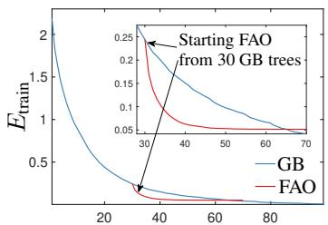  
Tree additions/FAO iterations

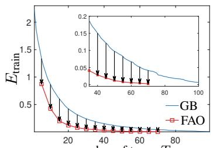  
number of trees, T

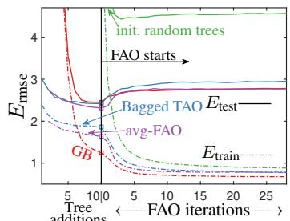  
Figure 1. Optimization ability and overfitting problem of FAO on the cpuact dataset. The errors are RMSE. All trees are oblique and complete of depth ∆ = 6. Left: optimizing 30 trees (initialized from GB) with FAO can exceed the performance of 60 GB trees with no shrinkage. Middle: similar behavior for a range of forest sizes. Right: illustrates overfitting: starting FAO with 10 trees initialized in an of various ways (from GB, bagging, averaged small FAO forests or random initialization) results in a significant increase in test error.

Ground Truth (GT)  
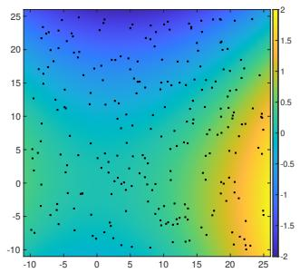

(GT) − (FAO prediction)  
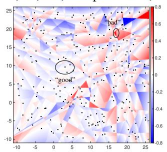

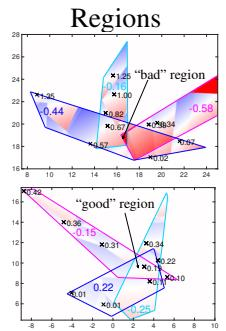

(GT) − (GB prediction)  
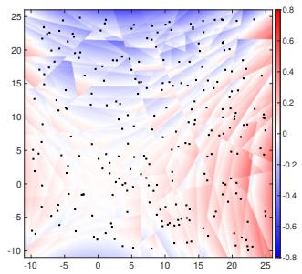  
Figure 2. Illustrative example of the “islands phenomenon” in 2D with T = 3 trees of depth ∆ = 6 fitted on $N = 2 5 0$ points. Left: training set (black dots) and contours of the ground truth function. Middle-left: signed error plot of the FAO forest on the entire input space. Dark-red and dark-blue regions indicate a larger error. Middle-right: example of a “bad” region, i.e., an “island” of large error (top), and of a “good” region (bottom), showing the tree leaves that make up each region. Right: plot of the signed error of the GB forest on the entire input space. It is smoother and has overall a lower test error. This phenomenon is also illustrated in the UC Merced logos in the paper title page, considering the image as a regression dataset from 2D pixel space to 3D RGB space (left: original logo, right: prediction by a forest of 3 trees of depth 10); zoom in to see details.

Averaged FAO forests achieve best results The above arguments show that a FAO forest is a very strong, low-bias, high-variance model. Returning to the spirit of ensemble learning, an average of such models (described in section 4) should remain low-bias but with lower variance, hence generalize better. This is indeed what we observe, consistently. As shown in fig. 3 (right), it now results in lower test error than a bagged or GB forest, while also using fewer trees.

It is instructive to compare an average of FAO forests with a Random Forest (RF). Both average a low-bias, flexible base learner: for RFs, a large, fully grown (unpruned) axis-aligned tree—although this is far less flexible than a FAO forest. Each RF tree is learned using CART, which means it is not well optimized and is bigger than necessary. Also, it is trained using a random subset of features and a random boostrap sample of training instances (bagging), which increases diversity and has been empirically shown to produce more accurate RFs. In contrast, each FAO forest is much better optimized (using FAO) and using all features and all training instances (we observe this works better than bagging or sampling features). The individual FAO forests are diverse enough through their different random initialization. This makes sense in that, as fig 2 shows, the particular geometric arrangement of the exponential number of regions in the forest is somewhat arbitrary (given the much smaller number of training samples) and a different initialization changes it considerably.

## 6. Experiments

This section shows our experimental results on realworld data. We demonstrate that the averaged FAO forests consistently dominate over other tree-based ensembling frameworks in accuracy while generating compact models. In most cases, the accuracy gap is noticeably large compared to the established frameworks, such as XGBoost, which makes FAO a strong competitor with the state-ofthe-art performance. To show that, we consider several regression and classification benchmarks of varying sizes and across different domains. We start with the main comparison results on machine learning benchmarks and report the training runtime of our algorithm. We then finalize the section by analyzing the impact of forest size and number of

Classification  
Regression  
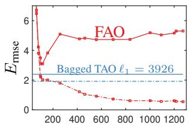  
ℓ1 norm of leaves

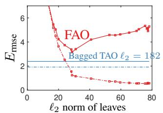

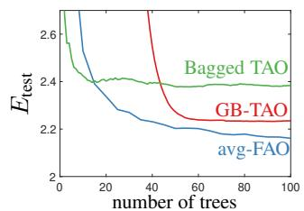  
Figure 3. Left and middle: test (solid lines) and train (dash-dotted lines) RMSE errors when training $T = 1 0$ trees of depth $\Delta = 6$ with FAO for different leaf regularization on the cpuact dataset. Although the training error is lower for FAO, simply bagging TAO trees achieves a better generalization error. Right: generalization error for FAO, GB and bagging. Here, each FAO forest consists of 5 trees. Then, for FAO, 100 trees in the X axis means 20 FAO forests each consisting of 5 trees.

<table><tr><td></td><td>|Forest</td><td> $E _ { \mathrm { t e s t } }$  (%)</td><td>#pars.</td><td>T</td><td> $\Delta$ </td></tr><tr><td>MNN 10) GB-TAO</td><td>SPORF XGBoost LightGBM XğBoost GB-TAO LightGBM</td><td>2.89±0.04 2.20±0.00 2.02±0.00 1.91±0.00 1.65±0.02 1.62±0.00</td><td>(143M) 107k 121k 505k 3M</td><td>1k 1k 1k 10k 500</td><td>50 6 10 6 7</td></tr><tr><td>(16k20)</td><td>avg-FAO avg-FAO avg-FAO SPORF XGBoost SPORF XGBoost LightGBM LightGBM</td><td>1.55±0.02 1.48±0.06 1.39±0.04 1.33±0.04 22.51±0.10 22.19±0.00 21.65±0.26 21.39±0.00 20.69±0.00 20.01±0.00</td><td>658k 968k 4.9M (110M) 84k (1.1B) 705k 1.8M 182k</td><td>60 90 300 100 2k 1k 20k 20k 2k</td><td>6 6 8 569 6 571 6 27 28</td></tr><tr><td>(50k10)</td><td></td><td></td><td></td><td></td><td></td></tr><tr><td>C0</td><td></td><td></td><td></td><td></td><td></td></tr><tr><td></td><td></td><td></td><td></td><td></td><td></td></tr><tr><td></td><td>XğBoost GB-TAO</td><td></td><td></td><td></td><td></td></tr><tr><td></td><td>GB-TAO</td><td></td><td></td><td></td><td></td></tr><tr><td></td><td>avg-FAO</td><td></td><td></td><td></td><td></td></tr><tr><td></td><td></td><td></td><td></td><td></td><td></td></tr><tr><td>neww20</td><td>GB-TAO GB-TAO</td><td>18.76±0.01</td><td>746k</td><td>50</td><td>6</td></tr><tr><td></td><td></td><td>18.13±0.00</td><td>1.0M</td><td>100</td><td>6</td></tr><tr><td></td><td></td><td></td><td></td><td></td><td></td></tr><tr><td></td><td></td><td>17.45±0.21</td><td>500k</td><td>50</td><td>4</td></tr><tr><td></td><td>avg-FAO</td><td>16.65±0.04</td><td>1.7M</td><td>800</td><td>4</td></tr><tr><td></td><td></td><td>16.59±0.13</td><td>998k</td><td>100</td><td>4</td></tr><tr><td></td><td>LightGBM</td><td></td><td></td><td></td><td></td></tr><tr><td></td><td></td><td>30.32±0.00</td><td>1.0M</td><td>14.3k</td><td>18</td></tr><tr><td></td><td></td><td>30.15±0.00</td><td>174k</td><td>100k</td><td>6</td></tr><tr><td></td><td></td><td>29.38±0.04</td><td>39k</td><td>1</td><td>12</td></tr><tr><td></td><td>SPORF</td><td>28.63±0.07</td><td>26k</td><td>10</td><td>20</td></tr><tr><td></td><td>SPORF</td><td>27.07±0.20</td><td>106k</td><td>100</td><td>10</td></tr><tr><td></td><td>GB-TAO</td><td>26.98±0.04</td><td>1.2M</td><td></td><td>8</td></tr><tr><td></td><td>avg-FAO</td><td>26.93±0.07</td><td></td><td>750</td><td>8</td></tr><tr><td></td><td>GB-TAO</td><td>26.86±0.02</td><td>594k</td><td>50</td><td>8</td></tr><tr><td></td><td>SPORF</td><td>26.71±0.05</td><td>2.0M</td><td>1.2k</td><td></td></tr><tr><td></td><td>GB-TAO</td><td>26.64±0.02</td><td>530k 3.3M</td><td>500</td><td>10</td></tr><tr><td></td><td>avg-FAO</td><td>26.55±0.12</td><td>725k</td><td>400 80</td><td>6</td></tr><tr><td></td><td>|SPORF</td><td></td><td></td><td></td><td>6</td></tr><tr><td></td><td></td><td>19.9124</td><td>(271M)</td><td>100</td><td>102</td></tr><tr><td>SUU) 8)</td><td>SPORF</td><td>19.7344</td><td>(2.7B)</td><td>1k</td><td>109</td></tr><tr><td></td><td>XGBoost</td><td>19.6282</td><td></td><td></td><td></td></tr><tr><td></td><td></td><td></td><td>151k</td><td>300</td><td>8</td></tr><tr><td></td><td>XGBoost</td><td>19.6214</td><td></td><td></td><td></td></tr><tr><td></td><td></td><td></td><td>196k</td><td>100</td><td>10</td></tr><tr><td></td><td></td><td>19.6164</td><td></td><td></td><td></td></tr><tr><td></td><td>LightGBM</td><td></td><td>153k</td><td>100</td><td>23</td></tr><tr><td></td><td></td><td>19.5998</td><td></td><td></td><td></td></tr><tr><td></td><td>LightGBM</td><td></td><td>230k</td><td>300</td><td>21</td></tr><tr><td></td><td>XğBoost</td><td>19.5902</td><td>2.0M</td><td>1k</td><td>10</td></tr><tr><td></td><td></td><td></td><td></td><td></td><td></td></tr><tr><td></td><td>LightGBM</td><td>19.5748</td><td>1.5M</td><td>1k</td><td>23</td></tr><tr><td></td><td></td><td></td><td></td><td></td><td></td></tr><tr><td></td><td>avg-FAO</td><td>19.5104</td><td>233k</td><td></td><td></td></tr><tr><td></td><td></td><td></td><td></td><td>50</td><td>8</td></tr><tr><td></td><td></td><td></td><td></td><td></td><td></td></tr><tr><td></td><td></td><td></td><td></td><td></td><td></td></tr><tr><td></td><td></td><td></td><td></td><td></td><td></td></tr><tr><td></td><td></td><td></td><td></td><td></td><td></td></tr><tr><td></td><td></td><td></td><td></td><td></td><td></td></tr><tr><td></td><td></td><td></td><td></td><td></td><td></td></tr><tr><td></td><td></td><td></td><td></td><td></td><td></td></tr><tr><td></td><td></td><td></td><td></td><td></td><td></td></tr><tr><td></td><td>avg-FAO</td><td>19.4994</td><td>459k</td><td>100</td><td></td></tr><tr><td></td><td></td><td></td><td></td><td></td><td>8</td></tr><tr><td></td><td></td><td></td><td></td><td></td><td></td></tr><tr><td></td><td></td><td></td><td></td><td></td><td></td></tr><tr><td></td><td></td><td></td><td></td><td></td><td></td></tr><tr><td></td><td></td><td></td><td></td><td></td><td></td></tr><tr><td></td><td></td><td></td><td></td><td></td><td></td></tr><tr><td></td><td></td><td></td><td></td><td></td><td></td></tr><tr><td></td><td></td><td></td><td></td><td></td><td></td></tr><tr><td></td></table>

<table><tr><td colspan="6">Kegression</td></tr><tr><td colspan="2">Forest</td><td> $E _ { \mathrm { t e s t } }$ </td><td>#pars.</td><td>T</td><td> $\Delta$ </td></tr><tr><td colspan="2">Cp 21)</td><td>XGBoost 2.60±0.00</td><td>60k</td><td>100</td><td>10</td></tr><tr><td rowspan="12"></td><td>XGBoost</td><td>2.51±0.00</td><td>42k</td><td>1k</td><td>4</td></tr><tr><td>GB-TAO</td><td>2.42±0.02</td><td>18k</td><td>30</td><td>6</td></tr><tr><td>LightGBM</td><td>2.27±0.00</td><td>19k</td><td>100</td><td>34</td></tr><tr><td>LightGBM</td><td>2.25±0.00</td><td>91k</td><td>1k</td><td>21</td></tr><tr><td>GB-TAO</td><td>2.23±0.02</td><td>31k</td><td>50</td><td>6</td></tr><tr><td>avg-FAO</td><td>2.22±0.01</td><td>34k</td><td>50</td><td>6</td></tr><tr><td>avg-FAO</td><td>2.20±0.01</td><td>68k</td><td>100</td><td>6</td></tr><tr><td></td><td>avg-FAO 2.18±0.00</td><td>102k</td><td></td><td>150</td></tr><tr><td rowspan="14">CT- (384)</td><td>LightGBM</td><td>6.57±0.00</td><td>9.1k</td><td>100</td><td>6</td></tr><tr><td>XğBoost</td><td>6.40±0.00</td><td>419k</td><td>500</td><td>19 10</td></tr><tr><td>XGBoost</td><td>6.39±0.00</td><td>739k</td><td>1k</td><td>10</td></tr><tr><td>LightGBM</td><td>6.22±0.00</td><td>45.5k</td><td>500</td><td>20</td></tr><tr><td>LightGBM</td><td>6.15±0.00</td><td>91k</td><td>1k</td><td>23</td></tr><tr><td>GB-TAO</td><td>4.61±0.17</td><td>616k</td><td>50</td><td>8</td></tr><tr><td>GB-TAO</td><td>4.60±0.17</td><td>1.7M</td><td>100</td><td>8</td></tr><tr><td>avg-FAO</td><td>4.56±0.12</td><td>1.3M</td><td>100</td><td>8</td></tr><tr><td>GB-TAO</td><td>4.47±0.24</td><td>780k</td><td>50</td><td>10</td></tr><tr><td>avg-FAO</td><td>4.44±0.17</td><td>872k</td><td></td><td>50 10</td></tr><tr><td>GB-TAO</td><td>4.47±0.24</td><td>2.3M</td><td>100</td><td>10</td></tr><tr><td>avg-FAO</td><td>4.37±0.18</td><td>1.7M</td><td>100</td><td>10</td></tr><tr><td>XGBoost</td><td></td><td></td><td></td><td></td></tr><tr><td></td><td>3.66±0.00</td><td>119k</td><td>100</td><td>10</td></tr><tr><td rowspan="14">cap )</td><td>XGBoost</td><td>3.58±0.00</td><td>793k</td><td>1k</td><td>10</td></tr><tr><td>LightGBM</td><td>3.54±0.00</td><td>153k</td><td>100 114</td><td></td></tr><tr><td>GB-TAO</td><td>3.49±0.01</td><td>256k</td><td>50</td><td>12</td></tr><tr><td>LightGBM</td><td>3.48±0.00</td><td>766k</td><td>1k 109</td><td></td></tr><tr><td>avg-FAO</td><td>3.45±0.02</td><td>359k</td><td>50</td><td>12</td></tr><tr><td>GB-TAO</td><td>3.43±0.00</td><td></td><td>100</td><td>12</td></tr><tr><td>avg-FAO</td><td></td><td>481k</td><td>100</td><td></td></tr><tr><td>GB-TAO</td><td>3.40±0.01</td><td>711k</td><td></td><td>12</td></tr><tr><td>avg-FAO</td><td>3.39±0.01 3.37±0.01</td><td>887k 1.4M</td><td>200 200</td><td>12 12</td></tr><tr><td rowspan="14">Year (0)</td><td>XGBoost</td><td></td><td></td><td></td><td></td></tr><tr><td>LightGBM</td><td>9.05±0.00 9.03±0.00</td><td>153k</td><td>100</td><td>10</td></tr><tr><td>XğBoost</td><td>9.00±0.00</td><td>153k</td><td>100 300</td><td>37 10</td></tr><tr><td>LightGBM</td><td>8.92±0.00</td><td>568k 460k</td><td>300</td><td>43</td></tr><tr><td>LightGBM</td><td>8.92±0.00</td><td></td><td>1k</td><td>43</td></tr><tr><td>XğBoost</td><td>8.91±0.00</td><td>1.5M</td><td>1k</td><td></td></tr><tr><td>GB-TAO</td><td></td><td>1.8M</td><td></td><td>10</td></tr><tr><td>GB-TAO</td><td>8.81±0.02</td><td>119k</td><td>30</td><td>6 6</td></tr><tr><td>GB-TAO</td><td>8.77±0.01</td><td>200k</td><td>50</td><td>6</td></tr><tr><td>avg-FAO</td><td>8.73±0.01 8.72±0.00</td><td>402k</td><td>100</td><td></td></tr><tr><td></td><td></td><td>392k</td><td>100</td><td>6</td></tr><tr><td>avg-FAO</td><td>8.70±0.00</td><td>786k</td><td>200</td><td>6</td></tr><tr><td></td><td></td><td></td><td></td><td></td></tr></table>

Table 1. Comparison of different forest-based models, sorted by decreasing test error. We report a 0-1 error $E _ { \mathrm { t e s t } } ( \% )$ for classification, RMSE for regression (mean±std over 5 repeats) and model size. The dataset name is followed by the training set size N, feature dimension D and number of classes K (or nothing for regression). T is the total number of trees in the forest, and $\Delta$ the maximum depth.

FAO iterations.

Setup We compare averaged FAO forests of oblique trees against GB with TAO. We include SPORF [29] forests, which also use sparse oblique trees but they are greedily induced. Additionally, we include highly optimized GB packages of axis-aligned trees: XGBoost [10] and Light-

GBM [22]. We tune important hyperparameters of the baselines such as the depth, number of leaves and a learning rate. For FAO, we tune the tree depth $\Delta$ and the number of trees $T .$ We apply an $\ell _ { 1 }$ penalty for decision node weights, for which we find the optimal hyperparameter $\lambda$ for a single tree, and use it for the whole FAO forest. We apply a small penalty on leaf weights with a fixed parameter $\mu = 0 . 0 1$ for regression we use an $\ell _ { 2 }$ penalty, for classification an $\ell _ { 1 }$ penalty. For an initial tree in the forest, we take a complete tree of depth $\Delta$ and random node parameters. More details on hyperparameters and datasets appear in the suppl. mat.

Main results Table 1 reports the performance of different forests on both classification and regression benchmarks sorted by decreasing test error. The results are self-evident. FAO-avg has the lowest test error in all datasets, often by a considerable margin (e.g. MNIST, CT-slice). Even when the difference is small at the first side (e.g. SUSY), it is im portant to note that a slight improvement in those datasets is already hard to accomplish. Noticeably, we were able to achieve $\sim 1 . 3 \%$ test error on MNIST which is about the same performance as was obtained using multipayer perceptrons. It worth to mention that we are not aware of any other tree ensembling framework that has shown similar results on MNIST using original pixel values. Among other baselines, GB-TAO is the second best approach followed by LightGBM. This again convincingly shows the power of optimization in ensemble training since GB-TAO also uses better optimized trees as base learners.

In terms of model size, our FAO-avg generates trees with total number of parameters that are similar or better than the baseline methods. This is surprising given the fact that it uses oblique splits which generally have more parameters than axis-aligned ones. The reason is twofold: 1) we apply $\ell _ { 1 }$ penalty at each node that encourages sparsity; 2) FAOavg was able to achieve such an outstanding performance by using small number of trees (by better optimizing them).

Training time Training $T = 1 0$ oblique trees of depth $\Delta = 6$ on MNIST for FI = 20 FAO iterations on a single processor takes about 12 minutes. For averaged FAO forests we train multiple of those independently, and so parallelization comes for free, and using just 6 processors on a typical machine we can obtain a forest with test accuracy of 1.5% in a matter of minutes.

Exploring the number of FAO iterations and forest size The left two plots of fig. 4 show the effect of the number of FAO iterations F I on the generalization performance of the averaged FAO ensembles. The general observation is that better optimized individual small forests does indeed help to produce most accurate models. The right two plots show how the size of the individual FAO forests affect the model performance. We can observe that using very few trees gives inferior performance. While the curves with many trees $( T = 2 0 )$ still have the downward trend for the given budget of trees, it will result in a huge ensemble if we set the number of terms $Q$ large.

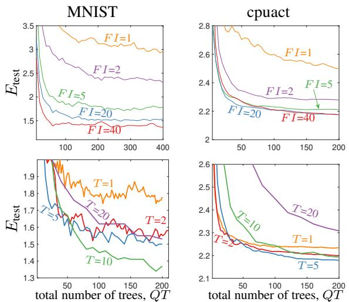  
Figure 4. The effect of the number of FAO iterations FI and FAO forest size T for the overall ensemble of $Q$ averaged FAO forests. We report 0-1 error on the MNIST dataset and RMSE on cpuact.

## 7. Conclusion

Forest-based predictors, from Random Forests to Gradient Boosting forests, are among the most accurate of all machine learning models. Surprisingly, the way they are learned from data is very different from most modern ML algorithms: they lack a well-defined loss function over a parametric model, instead using heuristic procedures to grow each individual tree and to ensemble them together, so that the forest grows by adding new trees greedily at each iteration. We think the reason for this is simple: trees (hence forests) define a non-differentiable function, which is hard to optimize. The recently proposed Tree Alternating Optimization algorithm has made it possible to learn trees by properly optimizing a loss function, and in this paper we show we can do the same for a forest with the FAO algorithm. The experimental results confirm this: we can learn forests that are both smaller and more accurate than with traditional algorithms. The ability to optimize a forest over all its parameters iteratively makes it also possible to use regularization terms, or to quickly retrain a forest as more data is collected, among other possibilities.

Our work also reveals an intriguing phenomenon: forests define such a flexible predictive function that it easily overfits (when properly optimized). Averaging multiple FAO forests avoids this problem, but we suspect there may be a more direct way to train a single forest so it does not overfit.

Acknowledgments. Work partially supported by NSF award IIS–2007147.

## References

[1] Int. J. Conf. Neural Networks (IJCNN’21), Virtual event, July 18–22 2021. 10

[2] G´erard Biau and Erwan Scornet. A random forest guided tour. TEST, 25(2):197–227 (with comments, pp. 228–268), June 2016. 1

[3] Leo Breiman. Random forests. Machine Learning, 45(1):5– 32, Oct. 2001. 2

[4] Leo J. Breiman. Bagging predictors. Machine Learning, 24(2):123–140, Aug. 1996. 2

[5] Leo J. Breiman. Arcing classifiers. Annals of Statistics, 26(3):801–824 (with comments, pp. 824–849), June 1998. 1

[6] Leo J. Breiman, Jerome H. Friedman, R. A. Olshen, and Charles J. Stone. Classification and Regression Trees. Wadsworth, Belmont, Calif., 1984. 1, 2

[7] Miguel A. Carreira-Perpi ˜n´an. The Tree Alternating Opti- ´ mization (TAO) algorithm: A new way to learn decision trees and tree-based models. arXiv, 2022. 2, 3

[8] Miguel A. Carreira-Perpi˜n´an and Pooya Tavallali. Alter-´ nating optimization of decision trees, with application to learning sparse oblique trees. In S. Bengio, H. Wallach, H. Larochelle, K. Grauman, N. Cesa-Bianchi, and R. Garnett, editors, Advances in Neural Information Processing Systems (NEURIPS), volume 31, pages 1211–1221. MIT Press, Cambridge, MA, 2018. 2, 3

[9] Miguel A. Carreira-Perpi˜n´an and Arman Zharmagambetov.´ Ensembles of bagged TAO trees consistently improve over random forests, AdaBoost and gradient boosting. In Proc. of the 2020 ACM-IMS Foundations of Data Science Conference (FODS 2020), pages 35–46, Seattle, WA, Oct. 19–20 2020. 2

[10] Tianqi Chen and Carlos Guestrin. XGBoost: A scalable tree boosting system. In Proc. of the 22nd ACM SIGKDD Int. Conf. Knowledge Discovery and Data Mining (SIGKDD 2016), pages 785–794, San Francisco, CA, Aug. 13–17 2016. 2, 7

[11] Thomas G. Dietterich. An experimental comparison of three methods for constructing ensembles of decision trees: Bagging, boosting, and randomization. Machine Learning, 40(2):139–157, Aug. 2000. 5

[12] Y. Freund and R. Schapire. A decision-theoretic generalization of on-line learning and an application to boosting. J. Computer and System Sciences, 55(1):119–139, 1997. 2

[13] Jerome Friedman, Trevor Hastie, and Robert Tibshirani. Additive logistic regression: A statistical view of boosting. Annals ofStatistics, 28(2):337–407, Apr. 2000. 1

[14] Jerome H. Friedman. Greedy function approximation: A gradient boosting machine. Annals of Statistics, 29(5):1189– 1232, 2001. 1, 2

[15] Jerome H. Friedman and Bogdan E. Popescu. Predictive learning via rule ensembles. Annals of Applied Statistics, 2(3):916–954, Sept. 2008. 2

[16] Magzhan Gabidolla and Miguel A. Carreira-Perpi ˜n´an. Push- ´ ing the envelope of gradient boosting forests via globallyoptimized oblique trees. In Proc. of the 2022 IEEE Computer Society Conf. Computer Vision and Pattern Recognition (CVPR’22), pages 285–294, New Orleans, LA, June 19– 24 2022. 2

[17] Magzhan Gabidolla, Arman Zharmagambetov, and Miguel A. Carreira-Perpi˜n´an. Improved multiclass Ad-´ aBoost using sparse oblique decision trees. In Int. J. Conf. Neural Networks (IJCNN’22), Padua, Italy, July 18–22 2022. 2

[18] Trevor J. Hastie, Robert J. Tibshirani, and Jerome H. Friedman. The Elements of Statistical Learning—Data Mining, Inference and Prediction. Springer Series in Statistics. Springer-Verlag, second edition, 2009. 2

[19] Tin Kam Ho. The random subspace method for constructing decision forests. IEEE Trans. Pattern Analysis and Machine Intelligence, 20(8):832–844, Aug. 1998. 2

[20] Giles Hooker and Lucas Mentch. Bridging Breiman’s brook: From algorithmic modeling to statistical learning. J. Observational Studies, 7(1):107–125, 2021. 1

[21] Rie Johnson and Tong Zhang. Learning nonlinear functions using regularized greedy forest. IEEE Trans. Pattern Analysis and Machine Intelligence, 36(5):942–954, May 2013. 2

[22] Guolin Ke, Qi Meng, Thomas Finley, Taifeng Wang, Wei Chen, Weidong Ma, Qiwei Ye, and Tie-Yan Liu. Light-GBM: A highly efficient gradient boosting decision tree. In I. Guyon, U. v. Luxburg, S. Bengio, H. Wallach, R. Fergus, S. Vishwanathan, and R. Garnett, editors, Advances in Neural Information Processing Systems (NIPS), volume 30, pages 3146–3154. MIT Press, Cambridge, MA, 2017. 2, 8

[23] Ludmila I. Kuncheva. Combining Pattern Classifiers: Methods and Algorithms. John Wiley & Sons, second edition, 2014. 2

[24] Llew Mason, Jonathan Baxter, Peter Bartlett, and Marcus Frean. Boosting algorithms as gradient descent. In Sara A. Solla, Todd K. Leen, and Klaus-Robert M¨uller, editors, Advances in Neural Information Processing Systems (NIPS), volume 12, pages 512–518. MIT Press, Cambridge, MA, 2000. 1

[25] David Mease and Abraham Wyner. Evidence contrary to the statistical view of boosting. J. Machine Learning Research, 9:131–156 (with discussion, pp. 157–201), 2008. 1

[26] J. Ross Quinlan. C4.5: Programs for Machine Learning. Morgan Kaufmann, 1993. 1, 2

[27] Robert E. Schapire and Yoav Freund. Boosting. Foundations and Algorithms. Adaptive Computation and Machine Learning Series. MIT Press, 2012. 1, 2

[28] Robert E. Schapire, Yoav Freund, Peter Bartlett, and Wee S. Lee. Boosting the margin: A new explanation for the effectiveness of voting methods. Annals ofStatistics, 26(5):1651– 1686, 1998. 1

[29] Tyler M. Tomita, James Browne, Cencheng Shen, Jaewon Chung, Jesse L. Patsolic, Benjamin Falk, Carey E. Priebe, Jason Yim, Randal Burns, Mauro Maggioni, and Joshua T. Vogelstein. Sparse projection oblique randomer forests. J. Machine Learning Research, 21:1–39, 2020. 7

[30] Paul Viola and Michael J. Jones. Robust real-time face detection. Int. J. Computer Vision, 57(2):137–154, May 2004. 2

[31] Abraham J. Wyner, Matthew Olson, Justin Bleich, and David Mease. Explaining the success of adaboost and random forests as interpolating classifiers. J. Machine Learning Research, 18(48):1–33, 2017. 5

[32] Arman Zharmagambetov and Miguel A. Carreira-Perpi˜n´an.´ Smaller, more accurate regression forests using tree alternating optimization. In Hal Daum´e III and Aarti Singh, editors, Proc. ofthe 37th Int. Conf. Machine Learning (ICML 2020), pages 11398–11408, Online, July 13–18 2020. 2

[33] Arman Zharmagambetov, Magzhan Gabidolla, and Miguel A. Carreira-Perpi ˜n´an. Improved boosted re- ´ gression forests through non-greedy tree optimization. In Int. J. Conf. Neural Networks (IJCNN’21) [1]. 2

[34] Arman Zharmagambetov, Magzhan Gabidolla, and Miguel A. Carreira-Perpi ˜n´an. Improved multiclass´ AdaBoost for image classification: The role of tree optimization. In IEEE Int. Conf. Image Processing (ICIP 2021), pages 424–428, Online, Sept. 19–22 2021. 2

[35] Arman Zharmagambetov, Suryabhan Singh Hada, Magzhan Gabidolla, and Miguel A. Carreira-Perpi˜n´an. Non-greedy´ algorithms for decision tree optimization: An experimental comparison. In Int. J. Conf. Neural Networks (IJCNN’21) [1]. 2

[36] Zhi-Hua Zhou. Ensemble Methods: Foundations and Algorithms. Chapman & Hall/CRC Machine Learning and Pattern Recognition Series. CRC Publishers, 2012. 2