# Towards Effective Adversarial Textured 3D Meshes on Physical Face Recognition

Xiao Yang1, Chang Liu2, Longlong Xu1, Yikai Wang1, Yinpeng Dong1,3†, Ning Chen1, Hang Su1,4, Jun Zhu1,3,4†

1 Dept. of Comp. Sci. and Tech., Institute for AI, BNRist Center, Tsinghua-Bosch Joint ML Center, THBI Lab, Tsinghua-China Mobile Communications Group Co., Ltd. Joint Institute, Tsinghua University 2 Peking University 3 RealAI 4 Zhongguancun Laboratory

{yangxiao19, xu-ll18}@mails.tsinghua.edu.cn chang.liu@stu.pku.edu.cn yikaiw@outlook.com {dongyinpeng, ningchen, suhangss, dcszj}@tsinghua.edu.cn

## Abstract

Face recognition is a prevailing authentication solution in numerous biometric applications. Physical adversarial attacks, as an important surrogate, can identify the weaknesses offace recognition systems and evaluate their robustness before deployed. However, most existing physical attacks are either detectable readily or ineffective against commercial recognition systems. The goal ofthis work is to develop a more reliable technique that can carry out an endto-end evaluation of adversarial robustness for commercial systems. It requires that this technique can simultaneously deceive black-box recognition models and evade defensive mechanisms. To fulfill this, we design adversarial textured 3D meshes (AT3D) with an elaborate topology on a human face, which can be 3D-printed and pasted on the attacker’s face to evade the defenses. However, the mesh-based optimization regime calculates gradients in high-dimensional mesh space, and can be trapped into local optima with unsatisfactory transferability. To deviatefrom the mesh-based space, we propose to perturb the low-dimensional coefficient space based on 3D Morphable Model, which significantly improves black-box transferability meanwhile enjoyingfaster search efficiency and better visual quality. Extensive experiments in digital andphysical scenarios show that our method effectively explores the security vulnerabilities of multiple popular commercial services, including three recognition APIs, four anti-spoofing APIs, two prevailing mobile phones and two automated access control systems.

## 1. Introduction

Face recognition has become a prevailing authentication solution in biometric applications, ranging from financial payment to automated surveillance systems. Despite its blooming development [4, 26, 33], recent research in adversarial machine learning has revealed that face recognition models based on deep neural networks are highly vulnerable to adversarial examples [10, 41], leading to serious consequences or security problems in real-world applications.

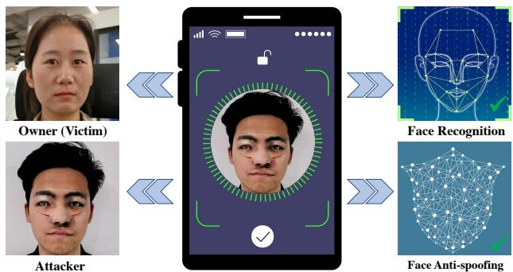  
Figure 1. Demonstration of physical black-box attacks for unlocking one prevailing mobile phone. The attacker wearing the 3Dprinted adversarial mesh can successfully mislead the face recognition model to be recognized as the victim, meanwhile evading face anti-spoofing. More results are shown in Sec. 4.

Due to the imperative need of evaluating model robustness [30, 45], extensive attempts have been devoted to adversarial attacks on face recognition models. Adversarial attacks in the digital world [8, 28, 39, 45] are characterized by adding minimal perturbations to face images in the digital space, aiming to evade being recognized or to impersonate another identity. Since an adversary usually cannot access the digital input of practical systems, physical adversarial examples wearable for real human faces are more feasible for evaluating their adversarial robustness. Some studies have shown the success of physical attacks against popular recognition models by adopting different attack types, such as eyeglass frames [27, 28], hats [17] and stickers [29].

In spite of the remarkable progress, it is challenging to launch practical and effective physical attack methods on automatic face recognition systems. First, the defensive mechanism [14, 42, 43, 46, 48] on face recognition, i.e., face anti-spoofing, has achieved impressive performance among the academic and industry communities. Some popular defenses [18, 34, 49] have injected more sensors (such as depth, multi-spectral and infrared cameras) to provide more effective defenses. However, most of the physical attacks have not evaluated the passing rates against practical defensive mechanisms, as reported in Table. 1. Second, these methods cannot perform satisfactorily for impersonation attacks against diverse commercial black-box recognition models due to the limited black-box transferability. The goal of this work is to develop practical and effective physical adversarial attacks that can simultaneously deceive black-box recognition models and evade defensive mechanisms in commercial face recognition systems, e.g., unlocking mobile phones, as demonstrated in Fig. 1.

<table><tr><td></td><td>Frames [28]</td><td>AdvHat [17]</td><td></td><td></td><td></td><td>FaceAdv [29] PadvFace [50] AdvMask [52] Face3DAdv [40]</td><td>RHDE [35]</td><td>Ours</td></tr><tr><td>3D attack types</td><td>No</td><td>Partially</td><td>Partially</td><td>No</td><td>Yes</td><td>Yes</td><td>Partially</td><td>Yes</td></tr><tr><td>Commercial recognition</td><td>Yes</td><td>No</td><td>No</td><td>No</td><td>No</td><td>No</td><td>Yes</td><td>Yes</td></tr><tr><td>Commercial defenses</td><td>No</td><td>No</td><td>No</td><td>No</td><td>No</td><td>Yes</td><td>No</td><td>Yes</td></tr><tr><td>Number of physical tests</td><td>10</td><td>3</td><td>10</td><td>10</td><td>30</td><td>10</td><td>3</td><td>50</td></tr></table>

Table 1. A comparison among different methods regarding whether using 3D attack types, commercial face recognition models, commercial defenses, and the number of physical evaluation. Partially indicates that this method involved some geometric transformations to make 2D patch approximately approach the realistic 3D patch

Evading the defensive mechanisms. Recent research has found that high-fidelity 3D masks [19, 21] can better fool the prevailing face anti-spoofing methods by 3D printing techniques. It becomes an appealing and feasible way to apply a 3D adversarial mask for evading defensive mechanisms in face recognition systems. To achieve this goal, we first design adversarial textured 3D meshes (AT3D) with an elaborate topology on a human face, which can be usable by standard graphics software such as Blender [9] and Maya [22]. As a primary 3D representation, textured meshes can be immediately 3D-printed and pasted on real faces for physical adversarial attacks, which have geometric details, complex topology and high-quality textures. Experimentally, AT3D can be more conducive to steadily passing commercial face anti-spoofing services, such as FaceID and Tencent anti-spoofing APIs, two mobile phones and two access control systems with multiple sensors.

Misleading the black-box recognition models. The typical 3D mesh attacks [23, 36, 47] proposed to optimize adversarial examples in mesh representation space. Thus, high complexity is virtually inevitable for calculating gradients in such high-dimensional search space due to the thousands of triangle faces on each human face. The procedures are also costly and probably trapped into overfitting [20] with unsatisfactory transferability. Therefore, we aim to perform the optimization trajectory in a low-dimensional manifold as a regularization aiming for escaping from overfitting. The low-dimensional manifold should possess a sufficient capacity that encodes any 3D face in this lowdimensional feature space, thus successfully achieving the white-box adversarial attack against a substitute model. A principled way of spanning such a subspace is considered by leveraging 3D Morphable Model (3DMM) [31] that effectively achieves dimensionality reduction of any highdimensional mesh data. Based on this, we are capable of generating an adversarial mesh by perturbing the lowdimensional coefficients of 3DMM, making it constrained on the data manifold of realistic 3D faces. Therefore, the crafted mesh can obtain a strong semantic feature of a 3D face, which can achieve well-generalizing performance among the white-box and black-box models due to knowledgable semantic pattern characteristics [37, 38, 44]. In addition, low-dimensional optimization can also avoid self intersection and flying vertices problems in mesh-based optimization [47], resulting in better visual appearance.

Experimentally, we have effectively explored the security vulnerabilities of multiple popular commercial services, including 1) recognition APIs—Amazon, Face++, and Tencent; 2) anti-spoofing APIs—FaceID, SenseID, Tencent, and Aliyun; 3) two prevailing mobile phones and two automated access control systems that incorporate multiple sensors. Our main contributions can be summarized as:

• We propose effective and practical adversarial textured 3D meshes with elaborate topology and effective optimization, which can simultaneously evade black-box recognition models and defensive mechanisms.

• Extensive physical experiments demonstrate that our method can consistently mislead multiple commercial systems, including unlocking prevailing mobile phones and automated access control systems.

• We present a reliable technique to evaluate the robustness of face recognition systems, which can be further leveraged as an effective data augmentation strategy to improve defensive ability.

## 2. Related Work

In this section, we review related work about physical adversarial attacks on face recognition, and present a detailed comparison between the different methods in Table 1.

2D physical adversarial attacks on face recognition. Several early works have been developed to craft adversarial patches in the physical world [27, 28] against face recognition systems. By pasting a carefully crafted 2D patch to the face, some research [17, 24] has shown effective physical attacks against state-of-the-art face recognition algorithms. AdvHat [17] adopted the mask type of Hat to achieve an impersonation attack. However, the aforementioned 2D methods are required to be placed on relatively flat regions, limiting practicality when fitting the patch to the real 3D face.

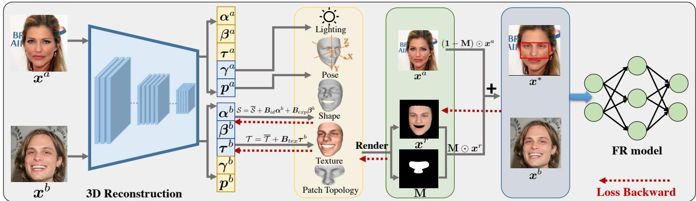  
Figure 2. An overview of crafting adversarial textured 3D meshes in the low-dimensional manifold. The 3D reconstruction model first regresses the coefficients of 3DMM, $i . e . , \{ \alpha , \beta , \tau , \gamma , p \}$ . Thus the shape and texture can be calculated by using the calculated coefficients. After introducing the elaborate local topology, the adversarial generation can be restricted to a specifically designed region. After rendering, we can obtain a rendered image $\pmb { x } ^ { r }$ and a calculated 2D binary matrix M. Since the whole pipeline including the rendering procedure is differentiable, the adversarial mesh can be iteratively updated by backpropagation on the low-dimensional coefficient space of 3DMM.

3D physical adversarial attacks on face recognition. Some studies [40, 52] have exploited simple geometric transformations of the patch for approximatively achieving realistic 3D fitting procedures, e.g., parabolic transformation [17, 35]. Furthermore, 3D affine transformation can be applied to the patch for simulating the corresponding pitch rotation. Besides, some 3D patches [40,52] can be naturally stitched onto the face to make the adversarial patch realistic by fully leveraging the recent advances in 3D face modeling. However, these techniques are only either perceptually satisfactory or ineffective against black-box face recognition systems. As a comparison, ours can simultaneously deceive black-box recognition models and evade defensive mechanisms in commercial face recognition systems.

## 3. Method

We first propose adversarial textured 3D meshes (AT3D) that can bypass general defensive mechanisms in Sec. 3.2. Afterwards, we propose a low-dimensional optimization to boost the transferability of the attack methods in Sec. 3.3. An overview of our proposed method is provided in Fig. 2.

## 3.1. Preliminary

Face recognition consists of two sub-tasks [10], i.e., face verification and face identification. The former aims to distinguish whether a pair of facial images belong to the same identity, while the latter directly predicts the identity of the facial image. We mainly study face verification in this paper, since the attacks can be easily extended to face identification. Denote $f ( \pmb { x } ) : \mathcal { X }  \mathbb { R } ^ { d }$ as a face recognition model that outputs a feature representation in $\mathbb { R } ^ { d }$ . In face verification, the similarity [5, 33] between a pair of images $\{ \pmb { x } ^ { a } , \pmb { x } ^ { b } \} \subset \mathcal { X }$ can be commonly calculated as

$$
J _ { f } ( \pmb { x } ^ { a } , \pmb { x } ^ { b } ) = \frac { < f ( \pmb { x } ^ { a } ) , f ( \pmb { x } ^ { b } ) > } { \lVert f ( \pmb { x } ^ { a } ) \rVert \cdot \lVert f ( \pmb { x } ^ { b } ) \rVert } ,\tag{1}
$$

where $< \cdot , \cdot >$ is the inner product of the vectors. $J _ { f }$ refers to cosine similarity between feature representations of $\pmb { x } ^ { a }$ and $\boldsymbol { x } ^ { b }$ ranging from 0 to 1. Then the prediction of face verification can be formulated as

$$
\mathcal { C } ( \pmb { x } ^ { a } , \pmb { x } ^ { b } ) = \mathbb { I } ( J _ { f } ( \pmb { x } ^ { a } , \pmb { x } ^ { b } ) > \delta ) ,\tag{2}
$$

where I is the indicator function, and δ is a threshold. When $\mathcal { C } ( \pmb { x } ^ { a } , \pmb { x } ^ { b } )$ equals to 1, the two images are regarded as the same identity, otherwise different identities.

We focus on two general types of attacks in terms of dodging and impersonation with different goals. In a dodging attack, an attacker attempts to fool a face recognition system by making one face misidentified, generally bypassing a face recognition system in surveillance. Formally, the attacker aims to modify x to craft an adversarial image $\mathbf { \boldsymbol { x } } ^ { * }$ to make $\mathcal { C } ( \pmb { x } ^ { * } , \pmb { x } ^ { b } ) = 0$ while $\begin{array} { r } { \mathcal { C } ( \pmb { x } ^ { a } , \pmb { x } ^ { b } ) = 1 } \end{array}$ . In contrast, an impersonation attack intends to disguise the attacker as another target identity. The generated adversarial image $\pmb { x } ^ { * }$ will be recognized as the target identity of $\boldsymbol { x } ^ { b }$ that makes $\begin{array} { r } { \mathcal { C } ( \pmb { x } ^ { * } , \pmb { x } ^ { b } ) = 1 } \end{array}$ while $\begin{array} { r } { { \mathcal { C } } ( { \pmb x } ^ { a } , { \pmb x } ^ { b } ) = 0 } \end{array}$

## 3.2. Problem Formulation

For the 3D adversarial attack task, we aim to develop an effective approach that can simultaneously deceive blackbox recognition models and evade defenses in physical face recognition systems. Different from the existing 3D attacks

Depth

in point clouds [47], we propose to craft an adversarial textured 3D mesh with any topology to avoid large errors by reconstruction procedure in point clouds [32]. In addition, textured meshes can fully leverage 3D printing techniques for physically realizable adversarial attacks.

Specifically, we denote the mesh representation of a full face as $\mathcal { M } = ( \mathcal { S } , \mathcal { T } , \mathcal { F } )$ , where $\mathcal { S } \in \mathbb { R } ^ { n \times 3 }$ is the xyz coordinates of n vertices, $\mathcal { T } \in \mathbb { R } ^ { n \times 3 }$ is the rgb value of vertices, and $\mathcal { F } \in \mathbb { Z } ^ { m \times 3 }$ is the set of m triangle faces which encodes each triangle with the indices of vertices. In addition, we are capable of studying 3D adversarial patch $\mathcal { M } ^ { \prime }$ that is restricted to a specifically designed spacial region, which can be generated by modifying the original mesh topology ${ \mathcal F } .$ The topology ${ \mathcal { F } } ^ { \prime }$ of the 3D adversarial patch stems from a subset of the original $\mathcal { F }$ by erasing the triangle faces outside the patch, thus denoted as $\mathcal { M } ^ { \prime } = ( \mathcal { S } , \mathcal { T } , \mathcal { F } ^ { \prime } )$

In this paper, we focus on crafting the Adversarial Textured 3D meshes (AT3D) by modifying the vertex positions and colors. Formally, an adversarial mesh can be denoted as $\mathcal { M } ^ { \ast } = ( S ^ { \ast } , \mathcal { T } ^ { \ast } , \mathcal { F } ^ { \prime } )$ by directly optimizing $s$ and $\tau$ . Since 2D victim images are usually more available than the corresponding explicit 3D mesh, we consider converting 3D mesh representation into 2D images for optimization by introducing differentiable neural rendering [25]. Therefore, the attack objective function of crafting adversarial examples can be formulated as

$$
\operatorname* { m i n } _ { S ^ { * } , T ^ { * } } ~ \mathcal { L } _ { f } ( x ^ { * } , x ^ { b } ) , \mathrm { ~ w h e r e ~ } x ^ { * } = \mathbf { M } \odot x ^ { r } + ( { \mathbf { 1 } } - \mathbf { M } ) \odot x ^ { a } ,
$$

$$
x ^ { r } , { \bf M } = \mathrm { R } ( S ^ { * } , { \mathcal { T } } ^ { * } , { \mathcal { F } } ^ { \prime } , \pmb { \rho } ) ,\tag{3}
$$

where $\odot$ is the element-wise multiplication operation and R is the rendering function. Given the rendering parameters $\rho$ that contain camera position and illumination intensity, we can obtain 1) a rendered image $\pmb { x } ^ { r }$ by rendering the mesh $\mathcal { M } ^ { \prime }$ onto a black background; 2) a calculated 2D binary matrix M that takes 0 if the pixel value derives from the background, and 1 otherwise. In this paper, we adopt the attack loss $\mathcal { L } _ { f } = J _ { f }$ for a dodging attack and $\mathcal { L } _ { f } = - J _ { f }$ for an impersonation attack. By optimizing problem (3) given a 2D face image $\pmb { x } ^ { a }$ , we can obtain the adversarial mesh $\mathcal { M } ^ { \ast } = ( S ^ { \ast } , T ^ { \ast } , \mathcal { F } ^ { \prime } )$

To evade the defensive mechanisms in the systems, we can explicitly elaborate a regional topology ${ \mathcal { F } } ^ { \prime }$ (as detailed in Sec. 4) from a human face. The optimized adversarial mesh can be immediately 3D-printed and pasted on real faces for practical testing. We experimentally found that the adversarial mesh with elaborate topology can present a similar appearance with the original one among RGB-based, depth-based and infrared-based defensive techniques, as illustrated in Fig. 3. It thus becomes a more feasible way to apply the adversarial 3D mesh for physical adversarial attacks compared with 2D attacks. However, the mesh-based optimization by following the objective (3) needs to calculate gradients in high-dimensional mesh space due to thousands of points in each human face. It will easily break the geometric characteristics and surface structure of the underlying mesh manifold, thus trapping into the overfitting [12, 20] with unsatisfactory transferability.

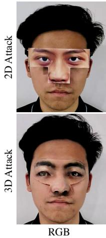

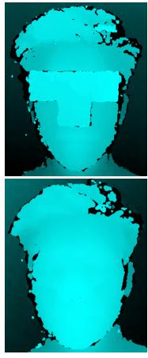

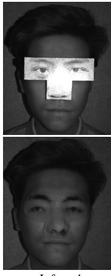  
Figure 3. Visual examples of 2D and 3D attacks with three common modalities (RGB, Depth and Infrared) in face anti-spoofing. 2D attacks present intrinsic spoofing patterns among the depth and infrared modalities, which can be easily detected by the antispoofing detector. As a comparison, 3D attacks are more feasible for evading face anti-spoofing with multiple modalities due to versatile and realistic characteristics.

## 3.3. Low-dimensional Optimization

In this section, we aim to deviate from the existing meshbased optimization regime, and perform the optimization trajectory in a low-dimensional manifold as a regularization for escaping from overfitting. The low-dimensional subspace must have a sufficient capacity that can encode any 3D face in this low-dimensional feature space. A principled way of spanning such a subspace is considered by leveraging 3D Morphable Model (3DMM) [2], which belongs to powerful 3D statistical models of human face shape and texture. 3DMM can effectively achieve dimensionality reduction of any high-dimensional mesh data. Therefore, optimizing in the pre-learnt low-dimensional coefficient space of 3DMM can promote more general semantic features of a 3D face. This can keep the surface structure of the underlying mesh manifold, potentially alleviating the overfitting problem in the optimization phase.

## 3.3.1 Adversarial Mesh Generation

Given a 2D face image $\pmb { x } ^ { a }$ , we can first predict its shape $s$ and texture $\tau$ by using 3DMM coefficients from CNN regression model [6], which can be represented as follows:

$$
\begin{array} { r } { \boldsymbol { S } = \overline { { \boldsymbol { S } } } + B _ { i d } \boldsymbol { \alpha } + B _ { e x p } \boldsymbol { \beta } , \mathcal { T } = \overline { { \boldsymbol { \mathcal { T } } } } + B _ { t e x } \boldsymbol { \tau } , } \end{array}\tag{4}
$$

where $\overline { { \cal S } }$ and $\overline { { \tau } }$ are the averages of face shapes and textures, and $B _ { i d } , B _ { e x p }$ and $\boldsymbol { B } _ { t e x }$ denote the PCA bases of identity, expression and texture, respectively. Besides, a series of coefficients are regressed including $\alpha \in \mathbb { R } ^ { 8 0 } , \beta \in \mathbb { R } ^ { 6 4 }$ and $\tau \in \mathbb { R } ^ { 8 0 }$ . Furthermore, this model can also regress the illumination coefficients $\gamma \in \mathbb { R } ^ { 9 }$ , and the camera position $\pmb { p } \in \mathbb { R } ^ { 6 }$ . Since these coefficients are all differentiable, we thus integrate these coefficients into Eq. (3) and rewrite our objective with a variable formulation as

Algorithm 1 Crafting Adversarial Textured Mesh   
Input: A 3DMM model G, a FR model $f ,$ a real face image ${ \pmb x } ^ { a }$ , a   
target face image $\qquad x ^ { b } ,$ , the set of triangle faces ${ \mathcal { F } } ^ { \prime } .$   
Output: An adversarial 3D mesh $\boldsymbol { \mathcal { M } } ^ { * } .$   
1: Get the coefficients: $\{ \alpha ^ { a } , \beta ^ { a } , \tau ^ { a } , \gamma ^ { a } , p ^ { a } , \}  \mathcal { G } ( { \pmb x } ^ { a } ) ;$   
2: Get the coefficients: $\{ \alpha ^ { b } , \beta ^ { b } , \tau ^ { b } , \gamma ^ { b } , \bar { p ^ { b } } \}  \mathcal { G } ( { \boldsymbol { x } } ^ { \dot { b } } ) ;$   
3: Initializing $\{ \alpha _ { 0 } ^ { * } , \beta _ { 0 } ^ { * } , \tau _ { 0 } ^ { * } , \gamma _ { 0 } ^ { * } , p _ { 0 } ^ { * } \} \gets \{ \alpha ^ { b } , \beta ^ { b } , \tau ^ { b } , \gamma ^ { a } , p ^ { a } \} \ ;$   
4: for $_ n$ in MaxIterations N do   
5: Update the coefficient $\alpha ^ { * } :$   
6: Get $\{ S _ { n } ^ { * } , T _ { n } ^ { * } \}$ given $\{ \alpha _ { n } ^ { * } , \beta _ { n } ^ { * } , \tau _ { n } ^ { * } \}$ via Eq. (4);   
7: Calculate $\pmb { \alpha } _ { n + 1 } ^ { * }$ via Eq. (5) by passing $\{ S _ { n } ^ { * } , T _ { n } ^ { * } \} ;$   
8: Update the coefficient $\beta ^ { * } \colon$   
9: Get $\{ S _ { n } ^ { * } , T _ { n } ^ { * } \}$ given $\{ \pmb { \alpha } _ { n + 1 } ^ { * } , \pmb { \beta } _ { n } ^ { * } , \pmb { \tau } _ { n } ^ { * } \}$ via Eq. (4);   
10: Calculate $\beta _ { n + 1 } ^ { * }$ via Eq. (5) by passing $\{ S _ { n } ^ { * } , T _ { n } ^ { * } \} ;$   
11: Update the coefficient $\tau ^ { * } :$   
12: Get $\{ S _ { n } ^ { * } , T _ { n } ^ { * } \}$ given $\{ \alpha _ { n + 1 } ^ { * } , \beta _ { n + 1 } ^ { * } , \tau _ { n } ^ { * } \}$ via Eq. (4);   
13: Calculate $\tau _ { n + 1 } ^ { * }$ via Eq. (5) by passing $\{ S _ { n } ^ { * } , T _ { n } ^ { * } \} ;$   
14: end for   
15: Get the shape: $S ^ { * } \gets \overline { { S } } + \mathbf { B } _ { d } \pmb { \alpha } _ { N - 1 } ^ { * } + \mathbf { B } _ { e } \pmb { \beta } _ { N - 1 } ^ { * }$   
16: Get the texture: $\mathcal { T } ^ { * }  \overline { { \mathcal { T } } } + \mathbf { B } _ { t } \pmb { \tau } _ { N - 1 } ^ { * }$   
17: return $\mathcal { M } ^ { \ast } = ( \mathcal { S } ^ { \ast } , \mathcal { T } ^ { \ast } , \mathcal { F } ^ { \prime } ) .$

$\operatorname* { m i n } _ { \alpha ^ { * } , \beta ^ { * } , \tau ^ { * } } \mathcal { L } _ { f } ( \pmb { x } ^ { * } , \pmb { x } ^ { b } )$ , where $\pmb { x } ^ { * } = \mathbf { M } \odot \pmb { x } ^ { r } + \left( \mathbf { 1 } - \mathbf { M } \right) \odot \pmb { x } ^ { a }$

$$
x ^ { r } , { \bf M } = \mathrm { R } ( \overline { { S } } + B _ { i d } { \alpha ^ { * } } + B _ { e x p } { \beta ^ { * } } , \overline { { \tau } } + B _ { t e x } \tau ^ { * } , \mathcal { F } ^ { \prime } , \rho ) ,\tag{5}
$$

which achieves a low-dimensional optimization to make an adversarial mesh update on the parameter space of 3DMM, and we call it AT3D-P.

Sensitive initialization problem. Note that the initialization in Eq. (5) lies in 3D mesh representation space, which is different from 2D initialization problems commonly discussed in previous works [30, 37]. As presented in Table 2, we found that selecting different initialization in optimizing Eq. (5) gives rise to inconsistent black-box performances, potentially explained by falling into local optima for some cases. Thus, we apply the coefficients of the 3DMM from the victim to initialize the adversarial mesh. Note that we exploit the attacker’s pose rather than the victim’s one in the initialization, making the generated mesh better fit the attacker’s face.

Optimization. We disturb $\alpha ^ { \ast } , \beta ^ { \ast } , \gamma ^ { \ast }$ alternately in every attack iteration such that they can be synchronized well with each other, maintaining near their optimum during the attack. Besides, the variables can be optimized by adopting a popular optimizer, such as Adam [16]. The detailed optimization procedure is summarized in Algorithm 1.

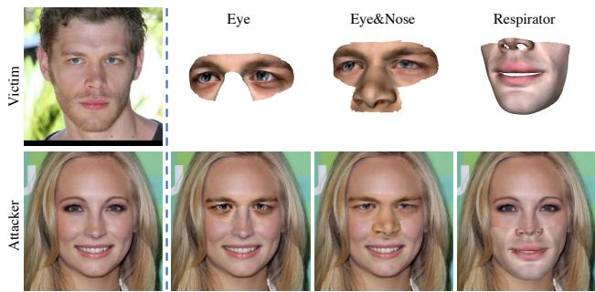  
Figure 4. Three elaborate topology structures of physical adversarial attacks, including Eye, Eye&Nose and Respirator.

## 3.4. Potential Advantages

Naturalness. Optimizing the coefficients of 3DMM indicates constantly searching effective linear combinations of different mesh datas, making generated adversarial mesh constrained on the data manifold of real 3D samples. As shown in Fig. 5, our adversarial meshes crafted by AT3D-P appear more natural to human eyes, thus difficult to be defended by current anti-spoofing algorithms. As a comparison, the fluctuating range of surface curves in the adversarial meshes by mesh-based optimization [36] (AT3D-M) differ significantly from those of the original samples, which also present self-intersection and flying vertices problems.

Escaping from local optima. We experimentally found that the mesh-based optimization suffered from an inferior convergence tendency, resulting in unsatisfactory black-box performance. As illustrated in Fig. 6, we demonstrated that optimizing the adversarial outputs in the low-dimensional space can accelerate the convergence and escape from local optima, thus achieving better transferability. Overall, AT3D-P makes a significant step toward real-world physical attack regarding naturalness and effectiveness.

## 4. Experiments

In this section, we present the experimental results in the digital world and physical world to demonstrate the effectiveness of the proposed method.1

## 4.1. Experiment Settings

Datasets. We conduct the experiments in the digital experiments on LFW [13] and CelebA-HQ [15], belonging to two of the most popular benchmark datasets on both lowquality and high-quality face images. For every dataset, we mainly choose 400 pairs of images with different identities to perform impersonation attacks, considering the more difficult and practical property than dodging attacks [30, 37].

Target recognition models. In the digital space, we study four prevailing face recognition models with different network architectures and training losses for evaluation, including ArcFace [4], MobileFace [3], ResNet50 [11] and CosFace [33]. In testing, a pair of face images is fed into the model to calculate the cosine similarity (in [1, 1]), and each model can obtain over 99% verification accuracy on LFW by following its corresponding optimal threshold. If the distance of two images exceeds the threshold, we view them as the same identities; otherwise different identities. In addition, we also evaluate the performance on three commercial face recognition APIs2, e.g., Amazon, Face++, and Tencent, randomly denoted as API-1, API-2, and API-3.

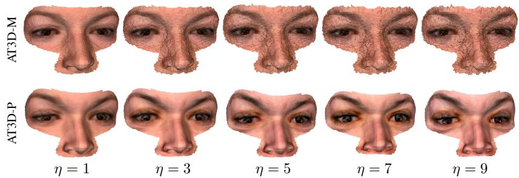

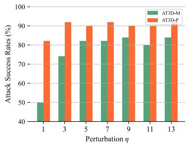  
Figure 5. Experiments on how different η affects the performance. We also further attack success rates (%) of both attacks under different η on LFW. MobileFace is chosen as a white-box model, and test the performance in ResNet50.

Defensive mechanisms. We carefully studied commercial face anti-spoofing services and selected a few of the most widely used ones, such as FaceID, SenseID, Tencent and Aliyun. We randomly call them D-1, D-2, D-3 and D-4.

Physical face recognition systems. We choose two prevailing mobile phones and two automated surveillance systems that have multiple sensors for practical testing, named S-1, S-2, S-3, and S-4. We will not disclose the manufacturer and parameters of the systems for preventing privacy leakage, only the function will be described in Appendix A.

Designed regions of mesh attack. Motivated by 2D adversarial patch [30, 37, 51], we propose three practical topological structures of mesh attacks as illustrated in Fig. 4, including Eyeglasses (Eye), Eyeglasses with nose (Eye&Nose), and Respirator. We evaluate the vulnerability of face recognition models in terms of these types and compare the white-box and black-box performance.

Compared methods. We first choose two representative 2D methods to compare the black-box transferability, including MIM [7] and EOT [1] that synthesizes examples over transformations. As for adversarial 3D meshes, we first typically craft AT3D in a mesh-based space [36], named AT3D-M. Besides, multiple popular losses in meshbased optimization, e.g., chamfer loss, laplacian loss, and edge length loss [47], are blended into the crafted AT3D to improve effectiveness and smoothness, named AT3D-ML.

Implementation details. Note that MIM and EOT select optimal parameters as report for black-box performance by following [37]. We thus set the number of iterations as N = 400, the learning rate α = 1.5, the decay factor µ = 1, and the size of perturbation ϵ = 40 for impersonation under the $\ell _ { \infty }$ norm bound. As for 3D attacks, we set the number of iterations as $N = 3 0 0$ , the budget of perturbation η = 3, which belongs to a balanced choice between the effective and naturalness. These detailed hyperparameters are discussed and reported in Appendix A.

<table><tr><td colspan="2">Initialization</td><td rowspan="2">Res.</td><td rowspan="2">Arc.</td><td rowspan="2">Mob.</td><td rowspan="2">Cos.</td><td rowspan="2">API</td></tr><tr><td>Shape</td><td>Texture</td></tr><tr><td>Noise</td><td>Noise</td><td>100.00</td><td>48.25</td><td>64.75</td><td>34.00</td><td>45.25</td></tr><tr><td>Attacker</td><td>Noise</td><td>100.00</td><td>43.75</td><td>61.25</td><td>30.50</td><td>42.25</td></tr><tr><td>Attacker</td><td>Attacker</td><td>100.00</td><td>42.75</td><td>56.50</td><td>29.75</td><td>41.50</td></tr><tr><td>Victim</td><td>Victim</td><td>98.50</td><td>77.75</td><td>86.25</td><td>56.00</td><td>78.50</td></tr><tr><td>A-Victim</td><td>Noise</td><td>100.00</td><td>79.25</td><td>88.50</td><td>55.50</td><td>80.50</td></tr><tr><td>A-Victim</td><td>A-Victim</td><td>100.00</td><td>86.25</td><td>91.50</td><td>61.25</td><td>84.75</td></tr></table>

Table 2. Ablation study of the different initialization. ResNet50 is a white-box model.  
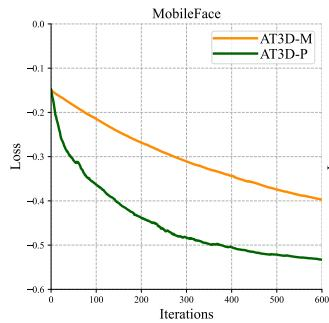

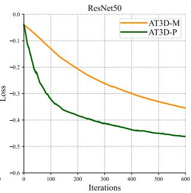  
Figure 6. Comparison of loss convergence on LFW.

## 4.2. Black-box Attacks in the Digital World

In this section, we present the experimental results of white-box and black-box attacks in the digital world. Specifically, we consider three practical topological structures of mesh attacks. Due to the space limitation, we only present the evaluation results on CelebA-HQ in this section, and the results on LFW are listed in Appendix B.

Effectiveness of the proposed method. To verify the effects of different settings, we compare the performance of different methods. Table 3 show the attack success rates (%) of the different face recognition models. Although 2D attacks obtain effective white-box performance, yet failing to steadily present acceptable black-box transferability. Besides, 2D attacks present intrinsic spoofing patterns in

<table><tr><td rowspan="2">Source Model</td><td rowspan="2">Methods</td><td colspan="5">Eye</td><td colspan="5">Eye &amp;Nose</td><td colspan="5">Respirator</td></tr><tr><td>Arc.</td><td>Mob.</td><td> ${ \overline { { \mathbf { \Gamma } } } } { \overline { { \mathbf { \Gamma } } } } { \overline { { \mathbf { \Gamma } } } } \mathbf { 0 } \mathbf { s } .$ </td><td>Res.</td><td>API-1</td><td> $\overline { { \mathrm { A r c . } } }$ </td><td>Mob.</td><td>Cos.</td><td>Res.</td><td>API-1</td><td>Arc.</td><td>Mob.</td><td>Cos.</td><td>Res.</td><td>API-1</td></tr><tr><td rowspan="5">ArcFace</td><td>2D-MIM</td><td>95.25*</td><td>26.25</td><td>17.50</td><td>15.00</td><td>3.75</td><td>100.0*</td><td>66.50</td><td>49.25</td><td>49.50</td><td>10.75</td><td>91.50*</td><td>5.50</td><td>8.50</td><td>7.50</td><td>2.25</td></tr><tr><td>2D-EOT</td><td>99.00*</td><td>49.00</td><td>34.50</td><td>35.75</td><td>16.25</td><td>99.50*</td><td>87.75</td><td>73.75</td><td>79.00</td><td>36.25</td><td>97.75*</td><td>26.00</td><td>29.25</td><td>24.75</td><td>8.75</td></tr><tr><td>AT3D-M</td><td>63.25*</td><td>46.00</td><td>37.75</td><td>33.25</td><td>28.00</td><td>96.75*</td><td>86.00</td><td>83.50</td><td>78.25</td><td>75.00</td><td>59.00*</td><td>24.75</td><td>22.75</td><td>23.25</td><td>32.00</td></tr><tr><td>AT3D-ML</td><td>63.25*</td><td>46.75</td><td>36.75</td><td>34.25</td><td>27.50</td><td>96.75*</td><td>86.50</td><td>83.25</td><td>78.75</td><td>75.00</td><td>58.50*</td><td>24.75</td><td>22.25</td><td>22.25</td><td>32.00</td></tr><tr><td>AT3D-P</td><td>96.50*</td><td>71.00</td><td>59.00</td><td>66.25</td><td>53.75</td><td>100.0*</td><td>95.00</td><td>82.00</td><td>93.75</td><td>87.00</td><td>91.00*</td><td>45.50</td><td>21.75</td><td>45.00</td><td>50.25</td></tr><tr><td rowspan="5">MobileFace</td><td>2D-MIM</td><td>16.75</td><td>94.00*</td><td>42.75</td><td>41.00</td><td>5.50</td><td>54.75</td><td>100.0*</td><td>83.25</td><td>82.75</td><td>13.00</td><td>18.50</td><td>81.50*</td><td>22.50</td><td>25.75</td><td>1.25</td></tr><tr><td>2D-EOT</td><td>27.75</td><td>100.0*</td><td>58.25</td><td>61.00</td><td>11.25</td><td>78.75</td><td>100.0*</td><td>94.50</td><td>96.75</td><td>40.00</td><td>32.75</td><td>99.50*</td><td>36.00</td><td>49.00</td><td>2.25</td></tr><tr><td>AT3D-M</td><td>36.00</td><td>71.25*</td><td>37.75</td><td>35.75</td><td>27.25</td><td>78.50</td><td>99.25*</td><td>81.50</td><td>81.25</td><td>72.25</td><td>28.00</td><td>49.75*</td><td>17.50</td><td>25.25</td><td>27.00</td></tr><tr><td>AT3D-ML</td><td>35.25</td><td>71.75*</td><td>37.50</td><td>35.50</td><td>27.25</td><td>79.00</td><td>99.25*</td><td>81.00</td><td>82.00</td><td>73.25</td><td>29.00</td><td>50.25*</td><td>18.25</td><td>25.00</td><td>27.00</td></tr><tr><td>AT3D-P</td><td>63.75</td><td>98.50*</td><td>66.75</td><td>73.00</td><td>52.00</td><td>92.50</td><td>100.0*</td><td>87.50</td><td>96.00</td><td>88.50</td><td>48.25</td><td>91.00*</td><td>21.25</td><td>49.75</td><td>42.00</td></tr><tr><td rowspan="5">ResNet50</td><td>2D-MIM</td><td>13.75</td><td>40.50</td><td>35.50</td><td>93.25*</td><td>3.50</td><td>53.25</td><td>88.25</td><td>76.25</td><td>100.0*</td><td>13.25</td><td>18.50</td><td>21.50</td><td>23.00</td><td>85.00*</td><td>1.75</td></tr><tr><td>2D-EOT</td><td>20.50</td><td>65.00</td><td>48.50</td><td>100.0*</td><td>13.25</td><td>72.50</td><td>96.25</td><td>86.50</td><td>100.0*</td><td>43.00</td><td>34.50</td><td>49.75</td><td>36.25</td><td>99.00*</td><td>4.25</td></tr><tr><td>AT3D-M</td><td>32.75</td><td>44.75</td><td>35.25</td><td>65.00*</td><td>26.50</td><td>74.75</td><td>85.00</td><td>76.75</td><td>97.00*</td><td>71.25</td><td>28.50</td><td>23.00</td><td>17.25</td><td>48.75*</td><td>26.50</td></tr><tr><td>AT3D-ML</td><td>34.00</td><td>44.50</td><td>34.75</td><td>65.25*</td><td>27.25</td><td>74.50</td><td>84.50</td><td>75.50</td><td>97.00*</td><td>70.50</td><td>28.00</td><td>23.50</td><td>18.00</td><td>47.75*</td><td>26.50</td></tr><tr><td>AT3D-P</td><td>59.75</td><td>74.75</td><td>56.25</td><td>99.00*</td><td>52.50</td><td>92.00</td><td>96.25</td><td>78.75</td><td>100.0*</td><td>88.50</td><td>46.00</td><td>52.00</td><td>20.75</td><td>91.25*</td><td>44.25</td></tr></table>

Table 3. The attack success rates (%) of the face recognition models on CelebA-HQ with adversarial meshes. ∗ indicates white-box attacks.

<table><tr><td rowspan="2">Source Model</td><td rowspan="2">Methods</td><td colspan="5">Eye</td><td colspan="5">Eye &amp;Nose</td><td colspan="5">Respirator</td></tr><tr><td> $\overline { { \mathrm { A r c . } } }$ </td><td>Mob.</td><td> ${ \overline { { \mathbf { \Gamma } } } } { \overline { { \mathbf { \Gamma } } } } { \overline { { \mathbf { \Gamma } } } } \mathbf { 0 } \mathbf { s } .$ </td><td> $\overline { { \mathrm { R e s . } } }$ </td><td>API-1</td><td> $\overline { { \mathrm { A r c . } } }$ </td><td>Mob.</td><td> $\overline { { \mathrm { C o s . } } }$ </td><td> $\overline { { \mathrm { R e s . } } }$ </td><td>API-1</td><td> $\overline { { \mathrm { A r c . } } }$ </td><td>Mob.</td><td>Cos.</td><td>Res.</td><td>API-1</td></tr><tr><td rowspan="3">ArcFace</td><td> $\overline { { \{ \alpha , \beta \} } }$ </td><td>77.75*</td><td>57.75</td><td>53.00</td><td>47.75</td><td>47.75</td><td>98.25*</td><td>89.75</td><td>77.50</td><td>82.50</td><td>84.25</td><td>67.25*</td><td>32.00</td><td>17.75</td><td>31.00</td><td>39.50</td></tr><tr><td> $\{ \tau \}$ </td><td>86.50*</td><td>57.00</td><td>53.25</td><td>51.00</td><td>41.50</td><td>98.50*</td><td>89.00</td><td>73.50</td><td>98.50</td><td>77.50</td><td>73.25*</td><td>34.00</td><td>19.75</td><td>33.50</td><td>42.50</td></tr><tr><td> $\{ \alpha , \beta , \tau \}$ </td><td>96.50*</td><td>71.00</td><td>59.00</td><td>66.25</td><td>53.75</td><td>100.0*</td><td>95.00</td><td>82.00</td><td>93.75</td><td>87.00</td><td>91.00*</td><td>45.50</td><td>21.75</td><td>45.00</td><td>50.25</td></tr><tr><td rowspan="3">MobileFace</td><td>{α, β}</td><td>49.25</td><td>83.25*</td><td>52.75</td><td>52.50</td><td>43.00</td><td>83.25</td><td>99.00*</td><td>77.75</td><td>88.00</td><td>81.75</td><td>34.00</td><td>69.25*</td><td>17.50</td><td>29.50</td><td>32.00</td></tr><tr><td>{T}</td><td>50.75</td><td>90.00*</td><td>57.75</td><td>59.00</td><td>43.00</td><td>85.75</td><td>99.75*</td><td>77.00</td><td>89.50</td><td>78.00</td><td>38.25</td><td>70.00*</td><td>20.25</td><td>34.50</td><td>37.50</td></tr><tr><td> $\{ \alpha , \beta , \tau \}$ </td><td>63.75</td><td>98.50*</td><td>66.75</td><td>73.00</td><td>52.00</td><td>92.50</td><td>100.0*</td><td>87.50</td><td>96.00</td><td>88.50</td><td>48.25</td><td>91.00*</td><td>21.25</td><td>49.75</td><td>42.00</td></tr><tr><td rowspan="3">ResNet50</td><td>{α, β}</td><td>43.25</td><td>55.75</td><td>47.25</td><td>86.00*</td><td>43.50</td><td>82.00</td><td>89.25</td><td>75.25</td><td>98.50*</td><td>80.25</td><td>32.25</td><td>32.75</td><td>18.00</td><td>67.50*</td><td>34.00</td></tr><tr><td>{T}</td><td>44.50</td><td>59.50</td><td>49.75</td><td>89.50*</td><td>42.50</td><td>79.75</td><td>88.50</td><td>72.00</td><td>99.00*</td><td>78.00</td><td>34.50</td><td>34.00</td><td>18.50</td><td>73.00*</td><td>36.00</td></tr><tr><td> $\{ \alpha , \beta , \tau \}$ </td><td>59.75</td><td>74.75</td><td>56.25</td><td>99.00*</td><td>52.50</td><td>92.00</td><td>96.25</td><td>78.75</td><td>100.0*</td><td>88.50</td><td>46.00</td><td>52.00</td><td>20.75</td><td>91.25*</td><td>44.25</td></tr></table>

Table 4. The attack success rates (%) of different coefficients on CelebA-HQ with adversarial meshes. ∗ indicates white-box attacks.

Fig. 3, which are easily detectable by face anti-spoofing. As for 3D attacks, AT3D-ML can enhance smoothness by using multiple losses in mesh-based optimization (as visually presented in Appendix C). However, we found that these losses cannot promote more transferable adversarial meshes. As a whole, AT3D-P can obviously obtain the best black-box attack success of face recognition models among all 2D and 3D attacks in most testing settings. The reason is that AT3D-P fully leverages low-dimensional optimization based on 3DMM, making generated adversarial meshes more effective and transferable for black-box models. In addition, we will have priority to select Eye&Nose for conducting practical attacks considering its effectiveness.

Better visual quality. To further examine the naturalness of crafted adversarial samples, we perform experiments with different η. Fig. 5 shows the evaluation results of AT3D-M and AT3D-P w.r.t naturalness and black-box transferability. As η increases, the generated meshes of AT3D-M present worse visual quality, and expose flying vertices problems. As a comparison, AT3D-P can consistently obtain smooth appearances meanwhile acquiring better attack success rates. This tendency is also verified by common distances of evaluating naturalness, as detailed in Appendix C.

## 4.2.1 Ablation Study

Initialization. In Table 2, we exploit different initialization to demonstrate the effectiveness in the shape and texture space, e,g., pasting uniform noises, original attacker and victim image. Adopting the initialization of the victim performs better among all black-box testings. Furthermore, the best performance can be achieved when adopting the pose of the victim to consistently fit the attacker’s face, denoted as A-Victim. The semantic feature between the victim’s face and the final crafted mesh is usually closer than that between the random noise and the final mesh. Thus an adversary would prefer to accelerate the optimization process and potentially alleviate overfitting by benefiting from the initialization of the victim.

Coefficients of 3DMM. We conduct an ablation study as shown in Table 4 to investigate the coefficients of 3DMM. Optimizing the coefficients $\{ \alpha , \beta , \tau \}$ can obtain a better effective performance than its subsets $\{ \alpha , \beta \}$ and τ . This also indicates that adversarial meshes benefit from texture and shape space in the optimization phase, making them more effective in white-box and black-box testing.

## 4.3. Experiments in the Physical World

In this section, we conduct 50 attacker-to-victim pairs to conduct the experiments to verify the effectiveness of the proposed method in the physical world. The procedure is evaluated by: 1) taking a face photo of a volunteer with a fixed camera under natural light; 2) crafting adversarial textured meshes for each volunteer; 3) achieving 3D printing and pasting them on real faces of the volunteers; 4) testing the attack performance against practical face recognition system. We also provide 3D-printed techniques and testing details in Appendix D.

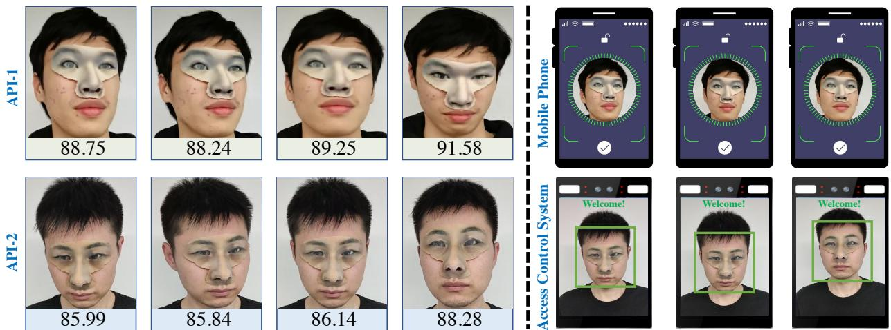  
Figure 7. Experimental results of physical attacks by wearing the 3D adversarial meshes, which can achieve effective impersonation attacks on two recognition APIs, one mobile phone and one automated access control system.

Misleading commercial recognition APIs. The working mechanism and training data in APIs are completely known for us. As illustrated in Table 5 and Fig. 7, blackbox APIs obtain very low similarity when identifying the attackers as the corresponding target identities at first. After wearing the adversarial meshes, the attackers can successfully impersonate the target identities, as predicted by the model. These results illustrate the effectiveness of our method against the commercial face recognition APIs. The main reason is that AT3D benefits from appropriate topology and effective optimization, and presents consistent effectiveness in the both digital and real world.

Bypassing defensive mechanisms. To verify the effectiveness of AT3D-P in face anti-spoofing, we choose several strong commercial face anti-spoofing APIs. The crafted adversarial images by AT3D-P will be fed into the black-box API for evaluating the performance. As shown in Table 5, we can obtain a steady performance on passing the face anti-spoofing API with a high success rate. Thus 3D attacks are also conducive to passing commercial face anti-spoofing due to realistic and versatile characteristics.

Evaluation on practical commercial systems. We further conduct physical experiments on multiple commercial systems, including prevailing mobile phones and automated surveillance systems. For the device S-1, we can easily import the victims’ information in batches into the system when achieving attacker-to-victim adversarial testing. For S-2, S-3 and S-4, we only import every victim’s information in sequence into the system. Considering the limited resources and complicated procedures for these three devices, we randomly choose 10 pairs to conduct these experiments. As shown in Table 6, our method also obtains consistent effective performance in these challenging devices. We will present all detailed results in Appendix D for every testing pair against different recognition systems.

<table><tr><td rowspan="2"></td><td colspan="3">Face Recognition</td><td colspan="3">Face Anti-spoofing</td></tr><tr><td>API-1</td><td>API-2</td><td>API-3</td><td>D-1 D-2</td><td>D-3</td><td>D-4</td></tr><tr><td>Origin</td><td>22.21</td><td>8.50</td><td>24.09</td><td></td><td></td><td></td></tr><tr><td>AT3D</td><td>82.45</td><td>84.20</td><td>74.87</td><td>46/5048/5041/5048/50</td><td></td><td></td></tr><tr><td>Δ</td><td>+60.24</td><td>+75.70</td><td>+50.78</td><td></td><td></td><td></td></tr></table>

Table 5. The mean similarity (%) or passing number of 50 physical pairs with printed adversarial meshes against APIs.

<table><tr><td></td><td>S-1</td><td>S-2</td><td>S-3</td><td>S-4</td></tr><tr><td>Physical Evaluation</td><td>23/50</td><td>6/10</td><td>7/10</td><td>3/10</td></tr></table>

Table 6. The passing number of printed adversarial meshes against the practical systems that achieved face recognition and defense.

## 5. Conclusion

In this paper, we developed effective and practical adversarial textured 3D meshes with an elaborate topology to evade the defenses. Besides, we proposed to perturb the low-dimensional coefficients from 3DMM, which significantly improves black-box transferability meanwhile obtaining faster search efficiency and better visual quality. Extensive experiments demonstrate that our method can consistently mislead multiple commercial recognition systems.

## Acknowledgements

This work was supported by the National Key Research and Development Program of China 2020AAA0106302, NSFC Projects (Nos. 62276149, 61620106010, 62076147, U19A2081, U19B2034, U1811461), Alibaba Group through Alibaba Innovative Research Program, Tsinghua-Huawei Joint Research Program, a grant from Tsinghua Institute for Guo Qiang, Tsinghua-OPPO Joint Research Center for Future Terminal Technology, and the High Performance Computing Center, Tsinghua University. Y. Dong was also supported by the China National Postdoctoral Program for Innovative Talents and Shuimu Tsinghua Scholar Program. C. Liu and L. Xu were intern at RealAI during this work. J. Zhu was also supported by the XPlorer Prize.

## References

[1] Anish Athalye, Logan Engstrom, Andrew Ilyas, and Kevin Kwok. Synthesizing robust adversarial examples. In International Conference on Machine Learning (ICML), 2018. 6

[2] Volker Blanz and Thomas Vetter. A morphable model for the synthesis of 3d faces. In Proceedings of the 26th annual conference on Computer graphics and interactive techniques, pages 187–194, 1999. 4

[3] Sheng Chen, Yang Liu, Xiang Gao, and Zhen Han. Mobilefacenets: Efficient cnns for accurate real-time face verification on mobile devices. In Chinese Conference on Biometric Recognition, pages 428–438. Springer, 2018. 5

[4] Jiankang Deng, Jia Guo, Niannan Xue, and Stefanos Zafeiriou. Arcface: Additive angular margin loss for deep face recognition. In Proceedings of the IEEE Conference on Computer Vision and Pattern Recognition, pages 4690– 4699, 2019. 1, 5

[5] Jiankang Deng, Jia Guo, Niannan Xue, and Stefanos Zafeiriou. Arcface: Additive angular margin loss for deep face recognition. In The IEEE Conference on Computer Vision and Pattern Recognition (CVPR), 2019. 3

[6] Yu Deng, Jiaolong Yang, Sicheng Xu, Dong Chen, Yunde Jia, and Xin Tong. Accurate 3d face reconstruction with weakly-supervised learning: From single image to image set. In Proceedings of the IEEE/CVF Conference on Computer Vision and Pattern Recognition Workshops, pages 0–0, 2019. 4

[7] Yinpeng Dong, Fangzhou Liao, Tianyu Pang, Hang Su, Jun Zhu, Xiaolin Hu, and Jianguo Li. Boosting adversarial attacks with momentum. In Proceedings of the IEEE Conference on Computer Vision and Pattern Recognition (CVPR), 2018. 6

[8] Yinpeng Dong, Hang Su, Baoyuan Wu, Zhifeng Li, Wei Liu, Tong Zhang, and Jun Zhu. Efficient decision-based blackbox adversarial attacks on face recognition. In Proceedings of the IEEE Conference on Computer Vision and Pattern Recognition (CVPR), 2019. 1

[9] Lance Flavell. Beginning blender: open source 3d modeling, animation, and game design. Apress, 2011. 2

[10] Ian J Goodfellow, Jonathon Shlens, and Christian Szegedy. Explaining and harnessing adversarial examples. In International Conference on Learning Representations (ICLR), 2015. 1, 3

[11] Kaiming He, Xiangyu Zhang, Shaoqing Ren, and Jian Sun. Deep residual learning for image recognition. In CVPR, 2016. 5

[12] Qianjiang Hu, Daizong Liu, and Wei Hu. Exploring the devil in graph spectral domain for 3d point cloud attacks. arXiv preprint arXiv:2202.07261, 2022. 4

[13] Gary B Huang, Marwan Mattar, Tamara Berg, and Eric Learned-Miller. Labeled faces in the wild: A database forstudying face recognition in unconstrained environments. In Technical report, 2007. 5

[14] Yunpei Jia, Jie Zhang, and Shiguang Shan. Dual-branch meta-learning network with distribution alignment for face anti-spoofing. IEEE Transactions on Information Forensics and Security, 17:138–151, 2021. 2

[15] Tero Karras, Timo Aila, Samuli Laine, and Jaakko Lehtinen. Progressive growing of gans for improved quality, stability, and variation. arXiv preprint arXiv:1710.10196, 2017. 5

[16] Diederik Kingma and Jimmy Ba. Adam: A method for stochastic optimization. In International Conference on Learning Representations (ICLR), 2015. 5

[17] Stepan Komkov and Aleksandr Petiushko. Advhat: Realworld adversarial attack on arcface face id system. In 2020 25th International Conference on Pattern Recognition (ICPR), pages 819–826. IEEE, 2021. 1, 2, 3

[18] Ajian Liu, Zichang Tan, Jun Wan, Sergio Escalera, Guodong Guo, and Stan Z Li. Casia-surf cefa: A benchmark for multimodal cross-ethnicity face anti-spoofing. In Proceedings of the IEEE/CVF Winter Conference on Applications of Computer Vision, pages 1179–1187, 2021. 2

[19] Ajian Liu, Chenxu Zhao, Zitong Yu, Anyang Su, Xing Liu, Zijian Kong, Jun Wan, Sergio Escalera, Hugo Jair Escalante, Zhen Lei, et al. 3d high-fidelity mask face presentation attack detection challenge. In Proceedings of the IEEE/CVF International Conference on Computer Vision, pages 814– 823, 2021. 2

[20] Daizong Liu and Wei Hu. Imperceptible transfer attack and defense on 3d point cloud classification. IEEE Transactions on Pattern Analysis and Machine Intelligence, 2022. 2, 4

[21] Siqi Liu, Baoyao Yang, Pong C Yuen, and Guoying Zhao. A 3d mask face anti-spoofing database with real world variations. In Proceedings of the IEEE conference on computer vision and pattern recognition workshops, pages 100–106, 2016. 2

[22] Autodesk Maya, 2022. https://www.autodesk. com/products/maya/overview Accessed: 2022-05- 19. 2

[23] Yibo Miao, Yinpeng Dong, Jun Zhu, and Xiao-Shan Gao. Isometric 3d adversarial examples in the physical world. In Advances in Neural Information Processing Systems (NeurIPS), 2022. 2

[24] Mikhail Pautov, Grigorii Melnikov, Edgar Kaziakhmedov, Klim Kireev, and Aleksandr Petiushko. On adversarial patches: real-world attack on arcface-100 face recognition system. In 2019 International Multi-Conference on Engineering, Computer and Information Sciences (SIBIRCON), pages 0391–0396. IEEE, 2019. 3

[25] Nikhila Ravi, Jeremy Reizenstein, David Novotny, Taylor Gordon, Wan-Yen Lo, Justin Johnson, and Georgia Gkioxari. Accelerating 3d deep learning with pytorch3d. arXiv preprint arXiv:2007.08501, 2020. 4

[26] Florian Schroff, Dmitry Kalenichenko, and James Philbin. Facenet: A unified embedding for face recognition and clustering. In CVPR, 2015. 1

[27] Mahmood Sharif, Sruti Bhagavatula, and Bauer. Adversarial generative nets: Neural network attacks on state-of-the-art face recognition. arXiv preprint arXiv:1801.00349, 2017. 1, 3

[28] Mahmood Sharif, Sruti Bhagavatula, Lujo Bauer, and Michael K Reiter. Accessorize to a crime: Real and stealthy attacks on state-of-the-art face recognition. In Proceedings of the 2016 ACM SIGSAC Conference on Computer and Com-

munications Security, pages 1528–1540. ACM, 2016. 1, 2, 3

[29] Meng Shen, Hao Yu, Liehuang Zhu, Ke Xu, Qi Li, and Jiankun Hu. Effective and robust physical-world attacks on deep learning face recognition systems. IEEE Transactions on Information Forensics and Security, 16:4063–4077, 2021. 1, 2

[30] Liang Tong, Zhengzhang Chen, Jingchao Ni, Wei Cheng, Dongjin Song, Haifeng Chen, and Yevgeniy Vorobeychik. Facesec: A fine-grained robustness evaluation framework for face recognition systems. In Proceedings of the IEEE/CVF Conference on Computer Vision and Pattern Recognition, pages 13254–13263, 2021. 1, 5, 6

[31] Anh Tuan Tran, Tal Hassner, Iacopo Masi, and Gerard´ Medioni. Regressing robust and discriminative 3d morphable models with a very deep neural network. In Proceedings ofthe IEEE conference on computer vision and pattern recognition, pages 5163–5172, 2017. 2

[32] Jacob Varley, Chad DeChant, Adam Richardson, Joaqu´ın Ruales, and Peter Allen. Shape completion enabled robotic grasping. In 2017 IEEE/RSJ international conference on intelligent robots and systems (IROS), pages 2442–2447. IEEE, 2017. 4

[33] Hao Wang, Yitong Wang, Zheng Zhou, Xing Ji, Zhifeng Li, Dihong Gong, Jingchao Zhou, and Wei Liu. Cosface: Large margin cosine loss for deep face recognition. In CVPR, 2018. 1, 3, 5

[34] Zezheng Wang, Zitong Yu, Chenxu Zhao, Xiangyu Zhu, Yunxiao Qin, Qiusheng Zhou, Feng Zhou, and Zhen Lei. Deep spatial gradient and temporal depth learning for face anti-spoofing. In Proceedings of the IEEE/CVF Conference on Computer Vision and Pattern Recognition, pages 5042– 5051, 2020. 2

[35] Xingxing Wei, Ying Guo, and Jie Yu. Adversarial sticker: A stealthy attack method in the physical world. IEEE Transactions on Pattern Analysis and Machine Intelligence, 2022. 2, 3

[36] Chaowei Xiao, Dawei Yang, Bo Li, Jia Deng, and Mingyan Liu. Meshadv: Adversarial meshes for visual recognition. In Proceedings of the IEEE/CVF Conference on Computer Vision and Pattern Recognition, pages 6898–6907, 2019. 2, 5, 6

[37] Zihao Xiao, Xianfeng Gao, Chilin Fu, Yinpeng Dong, Wei Gao, Xiaolu Zhang, Jun Zhou, and Jun Zhu. Improving transferability of adversarial patches on face recognition with generative models. In Proceedings of the IEEE/CVF Conference on Computer Vision and Pattern Recognition, pages 11845–11854, 2021. 2, 5, 6

[38] Xiao Yang, Yinpeng Dong, Tianyu Pang, Hang Su, and Jun Zhu. Boosting transferability of targeted adversarial examples via hierarchical generative networks. arXiv preprint arXiv:2107.01809, 2021. 2

[39] Xiao Yang, Yinpeng Dong, Tianyu Pang, Hang Su, Jun Zhu, Yuefeng Chen, and Hui Xue. Towards face encryption by generating adversarial identity masks. In Proceedings of the IEEE/CVF International Conference on Computer Vision, pages 3897–3907, 2021. 1

[40] Xiao Yang, Yinpeng Dong, Tianyu Pang, Zihao Xiao, Hang Su, and Jun Zhu. Controllable evaluation and generation of physical adversarial patch on face recognition. arXiv eprints, pages arXiv–2203, 2022. 2, 3

[41] Xiao Yang, Yinpeng Dong, Wenzhao Xiang, Tianyu Pang, Hang Su, and Jun Zhu. Model-agnostic meta-attack: Towards reliable evaluation of adversarial robustness. arXiv preprint arXiv:2110.08256, 2021. 1

[42] Xiao Yang, Shilong Liu, Yinpeng Dong, Hang Su, Lei Zhang, and Jun Zhu. Towards generalizable detection of face forgery via self-guided model-agnostic learning. Pattern Recognition Letters, 160:98–104, 2022. 2

[43] Xiao Yang, Wenhan Luo, Linchao Bao, Yuan Gao, Dihong Gong, Shibao Zheng, Zhifeng Li, and Wei Liu. Face antispoofing: Model matters, so does data. In Proceedings ofthe IEEE Conference on Computer Vision and Pattern Recognition, pages 3507–3516, 2019. 2

[44] Xiao Yang, Fangyun Wei, Hongyang Zhang, and Jun Zhu. Design and interpretation of universal adversarial patches in face detection. In Computer Vision–ECCV 2020: 16th European Conference, Glasgow, UK, August 23–28, 2020, Proceedings, Part XVII 16, pages 174–191. Springer, 2020. 2

[45] Xiao Yang, Dingcheng Yang, Yinpeng Dong, Wenjian Yu, Hang Su, and Jun Zhu. Robfr: Benchmarking adversarial robustness on face recognition. arXiv preprint arXiv:2007.04118, 2020. 1

[46] Zitong Yu, Chenxu Zhao, Zezheng Wang, Yunxiao Qin, Zhuo Su, Xiaobai Li, Feng Zhou, and Guoying Zhao. Searching central difference convolutional networks for face anti-spoofing. In Proceedings of the IEEE/CVF Conference on Computer Vision and Pattern Recognition, pages 5295– 5305, 2020. 2

[47] Jinlai Zhang, Lyujie Chen, Binbin Liu, Bo Ouyang, Qizhi Xie, Jihong Zhu, Weiming Li, and Yanmei Meng. 3d adversarial attacks beyond point cloud. arXiv preprint arXiv:2104.12146, 2021. 2, 4, 6

[48] Shifeng Zhang, Ajian Liu, Jun Wan, Yanyan Liang, Guodong Guo, Sergio Escalera, Hugo Jair Escalante, and Stan Z Li. Casia-surf: A large-scale multi-modal benchmark for face anti-spoofing. IEEE Transactions on Biometrics, Behavior, and Identity Science, 2(2):182–193, 2020. 2

[49] Shifeng Zhang, Xiaobo Wang, Ajian Liu, Chenxu Zhao, Jun Wan, Sergio Escalera, Hailin Shi, Zezheng Wang, and Stan Z Li. A dataset and benchmark for large-scale multi-modal face anti-spoofing. In Proceedings of the IEEE/CVF Conference on Computer Vision and Pattern Recognition, pages 919–928, 2019. 2

[50] Xin Zheng, Yanbo Fan, Baoyuan Wu, Yong Zhang, Jue Wang, and Shirui Pan. Robust physical-world attacks on face recognition. arXiv preprint arXiv:2109.09320, 2021. 2

[51] Jiayi Zhu, Qing Guo, Felix Juefei-Xu, Yihao Huang, Yang Liu, and Geguang Pu. Masked faces with faced masks. arXiv preprint arXiv:2201.06427, 2022. 6

[52] Alon Zolfi, Shai Avidan, Yuval Elovici, and Asaf Shabtai. Adversarial mask: Real-world adversarial attack against face recognition models. arXiv preprint arXiv:2111.10759, 2021. 2, 3