# Towards Professional Level Crowd Annotation of Expert Domain Data

Pei Wang   
UC San Diego   
pew062@eng.ucsd.edu

Nuno Vasconcelos UC San Diego nuno@ucsd.edu

## Abstract

Image recognition on expert domains is usually finegrained and requires expert labeling, which is costly. This limits dataset sizes and the accuracy of learning systems. To address this challenge, we consider annotating expert data with crowdsourcing. This is denoted as PrOfeSsional lEvel cRowd (POSER) annotation. A new approach, based on semi-supervised learning (SSL) and denoted as SSL with human filtering (SSL-HF) is proposed. It is a human-inthe-loop SSL method, where crowd-source workers act as filters ofpseudo-labels, replacing the unreliable confidence thresholding used by state-of-the-art SSL methods. To enable annotation by non-experts, classes are specified implicitly, via positive and negative sets ofexamples and augmented with deliberative explanations, which highlight regions ofclass ambiguity. In this way, SSL-HF leverages the strong low-shot learning and confidence estimation ability of humans to create an intuitive but effective labeling experience. Experiments show that SSL-HF significantly outperforms various alternative approaches in several benchmarks.

## 1. Introduction

While deep learning enabled tremendous advances in image recognition, high recognition performance is still difficult to achieve in expert domains, such as specialized areas of biology or medicine, due to two challenges. First, these problems involve fine-grained classes, such as the dogs of Figure 1, which differ by subtle visual attributes. Second, large annotated datasets are difficult to produce, since image labeling requires expert knowledge, which can be too expensive or infeasible at scale. This makes it difficult to train models as strong as those available for non-expert domains, where crowd-source annotation enables training with millions, or even billions, of labeled examples. To address this challenge, we consider the problem of how to leverage crowd-source platforms to provide professional level annotation for expert domain data, which is denoted as PrOfeSsional lEvel cRowd (POSER) annotation.

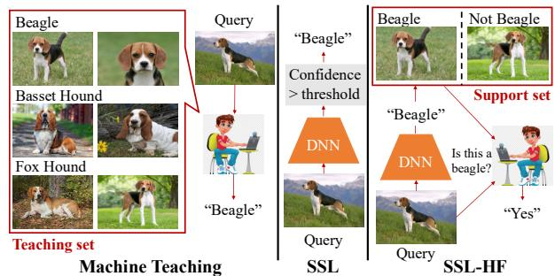  
Figure 1. Different approaches to the labeling of a query image. Left: Machine Teaching [44] generates a teaching set, which is used to teach different classes to crowd source workers, who label the query. Center: SSL [21, 34] methods produce a pseudo-label that is accepted or rejected by thresholding a confidence score. Right: SSL-HF uses crowd source workers to filter pseudo-labels, by comparing the query to a positive (images of the pseudo-label class) and a negative (images from other classes) support set. The annotator implements a binary filter with ‘I don’t know (IDK) option.

Since the difficulty is lack of annotator expertise, one route to POSER annotation is to rely on machine teaching (MT) algorithms [23, 42, 44]. As illustrated in Figure 1, a small teaching set annotated by an expert is used to teach crowd-source workers to discriminate the various classes. The scalability of crowd sourcing is then leveraged to assemble a large labeled dataset [44]. While machine teaching is surprisingly effective for problems of small class cardinality, it is difficult to teach crowd-workers a large number of classes. This is partly because they are averse to complicated training procedures and the teaching relies on shortterm memory, which has limited capacity [13, 29].

The POSER combination of expert domain data and crowd-sourcing also creates challenges to most human-inthe-loop schemes in the crowd-source annotation literature. These are usually based on active learning (AL) [31, 32], assuming an oracle that produces a ground-truth label per example. To minimize the number of labelling iterations and cost, AL selects the hardest examples in the dataset to be labelled. However, this is misguided for POSER annotation, where noisy annotators are inevitable and the oracle assumption is violated. Since hard examples are precisely those where workers make most mistakes, their selection maximizes labeling noise. Hence, while AL is successful

in domains where crowd-source workers are experts, e.g.   
everyday objects, it is not effective for expert domains.

In this work, we consider an alternative formulation, inspired by semi-supervised learning (SSL) methods [4,5,28, 34, 35] where a classifier trained on labelled data produces pseudo-labels for unlabeled examples. These labels are then accepted or rejected by thresholding a classification score, as illustrated in the middle of Figure 1. We refer to this process as pseudo-label filtering. Accepted labels are added to the training set, the classifier retrained, and the process repeated. SSL has been shown successful for datasets of everyday objects [4, 5, 34, 55], such as CIFAR [20], STL-10 [9], SVHN [27], or ImageNet [11] but frequently collapses in expert domains, even under-performing supervised baselines trained on the small labeled dataset [36, 44, 50]. This is due to the increased difficulty of finer-grained classification, and the well-known inability of deep learning to produce well calibrated confidence scores [14, 46].

While SSL, by itself, does not solve POSER annotation, its strategy of choosing the easier examples (higher classification confidence) is more suitable for the noisy POSER annotators than the hardest example strategy of AL. Furthermore, the major SSL weakness - poor pseudo-label filtering - can be significantly improved upon by using humans to filter pseudo-labels. This suggests solving the POSER annotation problem with the SSL with humanfiltering (SSL-HF) approach at the right of Figure 1. Unlike machine teaching, where workers are image classifiers, POSER annotation is framed as an SSL problem where they become filters that verify the pseudo-labels produced by the classifier for unlabeled images. This has the critical benefit of framing the annotator operation as an instantaneous low-shot learning problem, which does not require prior training.

In the proposed SSL-HF solution, given a query image and its pseudo-label (‘Beagle’), the annotator is presented with a small support set containing both positive (‘Beagle’ class) and negative (other classes) images. The annotator then simply declares if they agree with the pseudo-label, based on the similarity of the query image to the support set examples. Due to the well-known ability of humans for confidence calibration [10], this label filtering procedure is much more accurate than that of SSL, enabling POSER annotation with high accuracy. Furthermore, because the filtering is by visual similarity, the labeling is implicit, i.e. the annotator does not even need to know the ‘Beagle’ class. Hence, there is no need to teach annotators a priori, eliminating the short-term memory constraints of MT. Together, these properties enable the ultimate goal of POSER annotation: accurate crowd-sourced annotation of expert datasets with large numbers of classes.

The main insight behind SSL-HF is that the human lowshot learning ability [1, 41, 49] can be leveraged to enable annotators to filter labels in domains where they are not expert. However, when the differences between support set examples are very fine-grained, it can be difficult to identify the object details to look for. To address this problem, we propose to augment SSL-HF with deliberative explanations [43, 45], which visualize image regions of ambiguity between class pairs, tailored to the SSL-HF setting.

Overall, this work makes five contributions. First, we introduce the SSL-HF framework for POSER annotation. Second, we propose an implementation, where the classifier suggests a label for the image and a support set of a few positive and close-negative examples. Third, to enhance the accuracy of the human filtering of pseudo-labels, the support set is complemented with visualization-based explanations. Fourth, we present experiments showing that SSL-HF significantly outperforms SSL, AL, and MT approaches to POSER annotation and that explanations enhance these gains. Finally, to minimize the development cost of POSER annotation methods, we introduce an evaluation protocol based on simulated human labeling. These contributions establish a new research direction at the intersection of human-in-the loop and fine-grained classification, needed to advance the effectiveness of deep learning in expert domains.

## 2. Related Work

The problem of fine-grained classification with scarce labeled data can be addressed with various approaches.

Crowd sourcing: While critical for the success of deep learning, crowd-source platforms such as Amazon Mechanical Turk (MTurk) [18] are not suitable for expert domain data, due to the lack of expert annotators. [40] introduced a tool to collect large-scale fine-grained datasets with crowd annotators who are passionate and knowledgeable about a specific domain. However, this is still a much smaller scale of annotation than MTurk. MTurk workers can also be taught using machine teaching algorithms, but these are only applicable to problems of low class cardinality [44]. SSL-HF is inspired by [30], who addresses binary detection by asking workers to select images similar to a target image, from a large pool. However, it is difficult to search a large number of candidates. [25] introduces AL, only forwarding ‘hard’ examples for human labeling. However, when workers are not domain experts, this induces many false positives. SSL-HF aims to extend these approaches to multiclass classification and increase robustness to lay annotator errors.

Semi-supervised learning (SSL): SSL can be broadly divided into representation learning [7, 16] and pseudolabelling [21, 34]. The latter has achieved better results in fine-grained SSL challenges [37]. Two popular approaches are self-training [6, 21] and consistency-based learning [5, 34]. While some success has been achieved for medical images [2, 3], and sub-classes of birds and dogs [24, 26], SSL is still under-explored for the fine-grained classes typical of expert domains. In fact, studies show that, for fine-grained data, SSL frequently under-performs a supervised baseline trained only on the labelled data [36, 44, 50].

Active learning (AL): AL assumes ground-truth labels produced by an oracle [31, 32]. However, oracle annotators are very expensive in expert domains. On crowd source platforms, noisy annotations are inevitable. A few papers have considered acquisition functions for noisy oracles [12], post-hoc denoising layers to overcome annotation noise [15], or theoretical results on statistical consistency and query complexity in the presence of noise [52]. However, these works either assume coarse-grained data, simulated noise, or both. We focus on the combination of finegrained data and noisy annotators and show, experimentally, that AL performs poorly in this setting.

Machine teaching (MT): MT is a broad research problem [8, 44, 56, 57], which includes the task of leveraging machines to teach humans expert domain knowledge for data labelling. Existing approaches can be grouped into plain [19, 33, 42] or explanations-enhanced [8, 38, 44], depending on whether they use explanations. Motivated by the success of the latter, we introduce deliberative explanations [43] as an aid to the human filtering now proposed.

## 3. Challenges of POSER Annotation

In this section, we formalize the fine-grained expert domain annotation problem. Previous representative methods are also recapped so as to motivate SSL-HF, which is introduced in the next section.

Challenges: Very large datasets are critical for deep learning. In lay domains, such as everyday objects, scalable annotation is feasible on crowd-sourcing platforms, like MTurk. However, in expert domains, annotation is very expensive and unfeasible at scale. While it is typically possible to collect a large dataset $\mathcal { D } = \{ \mathbf { x } _ { i } \} _ { i = 1 } ^ { M + N }$ , only a small subset $\mathcal { D } ^ { a } = \{ \mathbf { x } _ { i } \} _ { i = 1 } ^ { M } , M \ll N$ , can be realistically annotated, to produce a labeled dataset $\mathcal { D } ^ { l } = \{ ( \mathbf { x } _ { i } , y _ { i } ) \} _ { i = 1 } ^ { M }$ where $y _ { i }$ is the label of $\mathbf { x } _ { i } ,$ , and an unlabeled dataset $\mathcal { D } ^ { u } =$ $\mathcal { D } - \mathcal { D } ^ { a }$ . The goal is to label the latter and augment $\mathcal { D } ^ { l }$ with the labeled $\mathcal { D } ^ { u }$ . This can be difficult because expert domain problems typically involve a large number $C$ of fine-grained classes. Intra-class variation, due to factors like object pose, can easily exceed inter-class variation.

SSL: SSL is an automated approach, where a classifier $f$ trained on $\mathcal { D } ^ { l }$ generates pseudo-labels ${ \hat { y } } = f ( \mathbf { x } )$ and confidence scores $\sigma ( \mathbf { x } )$ for each $\textbf { x } \in \mathbf { \Omega } \mathcal { D } ^ { u }$ . As shown in the middle of Figure 1, pseudo-labels are then filtered by confidence score thresholding, $\sigma ( \mathbf { x } ) > \theta$ . Images from $\mathcal { D } ^ { u }$ that survive this test are added to $\mathcal { D } ^ { l }$ , pseudo-labels accepted as labels, and the process iterated. There are, however, two difficulties. First, since $\mathcal { D } ^ { l }$ is originally small, f is not accurate. Second, deep networks produce poorly calibrated confidence scores. Since the two effects compound, pseudolabels $\hat { y }$ are not trustworthy. It is particularly difficult to propagate labels across images of the same class that are not visually similar to those in $\mathcal { D } ^ { l } , \mathsf { e . g }$ . new object poses.

Human in the loop: An alternative is to use human-inthe-loop annotation, which iterates between human image labeling and model training. The challenge is to identify the images $\mathbf { x } \in \mathcal { D } ^ { u }$ most informative for learning $f ,$ to reduce the entire human labelling effort. This is addressed with AL, which is similar to SSL but samples images of larger hardness score $h ( \mathbf { x } )$ according to $f$ and uses humans as label oracles. In the crowd-source setting, AL is sensible for lay domains, e.g. everyday objects, but unsuitable for expert domains, where the oracle assumption is violated and hard examples elicit the most labeling mistakes.

Machine Teaching: In MT, the classifier f is first trained on $\mathcal { D } ^ { l }$ . A MT algorithm then designs a course, composed of images $\mathcal { L } \subset \mathcal { D } ^ { l }$ , for teaching workers to recognize the C target classes. The workers trained with L then label $\mathcal { D } ^ { u }$ . The classifier f is finally re-trained on D. Since the annotators do not have to be experts, crowd-sourcing platforms can be leveraged for scalability. However, most MT algorithms only support a small number of classes.

## 4. SSL with Human Filtering

In this section, we introduce the SSL-HF approach.

## 4.1. Motivation

In expert domains, POSER annotation of $\mathcal { D } ^ { u }$ has several problems. On one hand, crowd workers cannot be taught to be good image classifiers with MT because of a large number of classes. In these domains, label noise is inevitable. This also prevents the use of classical human-in-the-loop solutions based on AL, which equate humans to oracles. On the other, fully automated SSL algorithms cannot be trusted to filter pseudo-labels. While SSL accounts for noisy labels, the pseudo-labels produced by f are usually too poor to enable progress. To address these problems, we propose a combination of SSL and human-in-the-loop, by using humans tofilter pseudo-labels produced by $f .$ This inherits the robustness of SSL to noisy labels but leverages the much superior human classification accuracy to filter pseudo-labels.

The SSL-HF process is illustrated in Figure 1. Given a query image $\textbf { q } \in \mathbf { \Omega } \mathcal { D } ^ { u }$ and a pseudo-label $\hat { y } ,$ in this case ‘Beagle’, the annotator is asked the question ‘do you agree that image q belongs to class ${ \hat { y } } ? { \vec { \mathbf { \sigma } } }$ . The annotator then responds with $\begin{array} { r } { p \ = \ H ( \mathbf { q } , \hat { y } ) } \end{array}$ , where $p \in$ {‘agree’, ‘disagree’, ‘I don’t know (IDK)’} and the IDK option allows the annotator to skip images that are too difficult. Images q for which the annotators select the ‘agree option are labeled with $y = { \hat { y } }$ , as usual in SSL. The problem is that the annotator may not know the ‘Beagle’ class. To overcome this challenge, we propose two mechanisms.

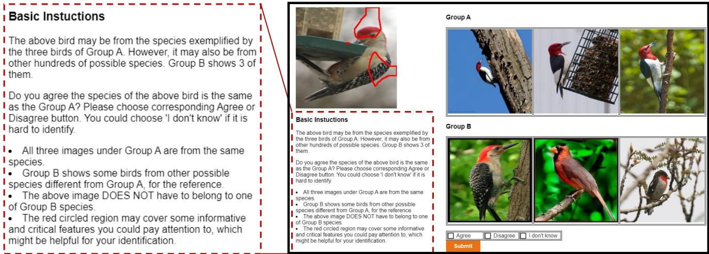  
Figure 2. Interface (black box). In this example, a query image of a ‘Red bellied Woodpecker’ receives pseudo-label ‘Red headed Woodpecker’ (yˆ), which is the the class of the three images in ‘Group $\mathbf { A } ^ { \prime } ( \mathcal { S } _ { \hat { y } } )$ . ‘Group B’ $( S _ { \hat { y } } ^ { c } )$ ) presents images of ‘Red bellied Woodpecker’, ‘Cardinal’, and ‘Rose breasted Grosbeak’.

The first is to ask the question implicitly, with respect to a support set of images, composed by a set $\boldsymbol { S _ { \hat { y } } } \in \mathcal { D } ^ { l }$ of images from class $\hat { y }$ (positives) and a set of images $S _ { \hat { y } } ^ { c } \in \mathcal { D } ^ { l }$ from classes other than $\hat { y }$ (negatives). This is illustrated in Figure 2, which shows a query of the class ‘Red bellied Woodpecker’ that receives the incorrect pseudo-label (yˆ) ‘Red headed Woodpecker’. The annotator can compare the query to three positives $( \boldsymbol { S } _ { \hat { \boldsymbol { y } } }$ , images of ‘Red headed Woodpecker’), shown as ‘Group A,’ and three negatives $( \boldsymbol { S } _ { \hat { \boldsymbol { y } } } ^ { c } ,$ , images of classes ‘Red bellied Woodpecker’, ‘Cardinal’, ‘Rose breasted Grosbeak’), shown as ‘Group B’.

This formulation of label filtering is similar to the definition of low-shot recognition [39, 47] and leverages the ability of humans to solve this problem. Rather than having to know all the classes, as in MT, the annotator only has to reason in terms of the visual similarity between query and support set examples. Note that, in the figure, it is almost immediately obvious that the query is not a ‘Cardinal’. A detailed examination then reveals that it is also not a ‘Red headed Woodpecker,’ because its head is not fully red, nor a ‘Rose breasted Grosbeak,’ because it has a white breast. However, this type of analysis can exceed the effort that crowd-source workers are willing to devote to the task.

The second mechanism targets this problem, by highlighting the image regions of the query most informative for the annotator decision. Namely, the query q is enhanced with visual explanations m(·) that highlight image regions key to distinguish the positives and negatives in the support set. This is based on deliberative explanations [43] derived from $\mathbf { q } , S _ { \hat { y } }$ , and $S _ { \hat { y } } ^ { c }$ . In the figure, the explanation highlights the regions (head and feather texture) most distinctive for the discrimination from the other classes in the support set. Rather than examining the other images in detail, the annotator can then immediately realize that the ‘Red bellied Woodpecker’ shown in the left of Group B is is the only bird to have the same feather pattern as the query.

## 4.2. Support Set Generation

The two components of the support set are assumed to have the same cardinality, $| S _ { \hat { y } } | = | S _ { \hat { y } } ^ { c } | = K$ . Let $\mathcal { D } _ { \hat { y } } ^ { l }$ be the set of examples in $\mathcal { D } ^ { l }$ of ground truth label yˆ. Experimentally, we found no difference between multiple strategies to select the examples of $\mathcal { S } _ { \hat { y } } \subset \mathcal { D } _ { \hat { y } } ^ { l }$ based on the predicted posterior probability $f _ { \hat { y } } ( \mathbf { x } )$ of class yˆ given example x (see detailed discussion in Supp). Since randomly selecting K images from $\mathcal { D } _ { \hat { y } } ^ { l }$ to construct $\boldsymbol { S } _ { \hat { y } }$ was found to be an effective strategy, we use it in the bulk of our experiments.

The assembly of $\mathcal { S } _ { \hat { y } } ^ { c }$ is more complex. First, there is a need to decide whether the K images should come from the same or different classes. We choose to display one image of each of K classes, to maximize the probability that the true class y is part of $S _ { \hat { y } } ^ { c }$ when yˆ is incorrect. Next, there is a need to choose the K classes to display. We select the K classes other than yˆ of largest probabilities in $f _ { \hat { y } } ( \mathbf { q } )$ , since these are the most similar to $\hat { y }$ and thus the potentially most informative for fine-grained class differentiation.

Figure 2 illustrates the importance of including $S _ { \hat { y } } ^ { c }$ . In this example, an annotator may not notice that the ‘Red bellied Woodpecker’ of q has a partially red head, while the ‘Red headed Woodpecker’ of $\boldsymbol { S } _ { \hat { \boldsymbol { y } } }$ does not. The inclusion of a ‘Red bellied Woodpecker’ in $S _ { \hat { y } } ^ { c }$ (left image) forces the annotator to realize that there is a class of birds with partially red heads. This makes it clear that q does not belong to class yˆ, making the annotators more likely to choose the ‘disagree’ option. In the absence of a fine-grained negative set, these details might be lost, originating a falsepositive. Even when $S _ { \hat { y } } ^ { c }$ does not contain images from the groundtruth class y, the visualization of a diverse set of objects that differ in subtle details is likely to encourage the use of the IDK option whenever yˆ is incorrect.

Given the K classes that make up $S _ { \hat { y } } ^ { c }$ , it remains to choose one example per class. Similarly to $\boldsymbol { S } _ { \hat { \boldsymbol { y } } }$ , we have found that random example selection is sufficient.

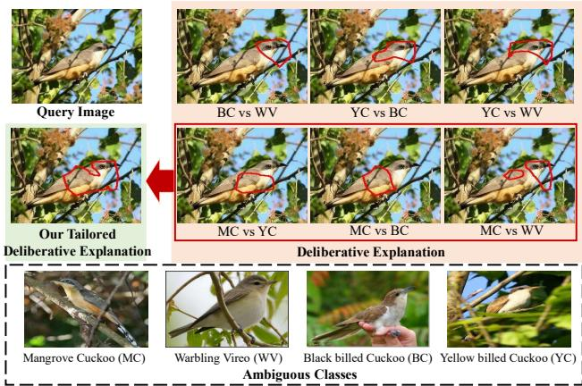  
Figure 3. Deliberative explanation (red box) for a query image of a ‘Mangrove Cuckoo’ and simplified explanation used in SSL-HF (green box). Examples from the ambiguous classes are shown on the bottom for illustration only. The annotator only sees the simplified explanation.

## 4.3. Explanation Generation

A well suited explanation framework for SSL-HF is that of deliberative explanations [43], which highlight the regions that f finds ambiguous, i.e. likely to belong to more than one class. Formally, a deliberative explanation is a list of insecurities, where an insecurity is a triplet (r, a, b), composed by the segmentation mask r of a region of ambiguity between a pair of classes $( a , b )$ . Figure 3 shows an example: a query image q of a ‘Mangrove Cuckoo,’ the three most ambiguous classes for q (‘Black Billed Cuckoo,’ ‘Yellow Billed Cuckoo,’ and ‘Warbling Vireo’), and the deliberative explanation localizing the segments that the classifier deems ambiguous for each pair of classes. We found, however, this to be too much information for the crowd sourcing setting and simplified the explanations as follows. First, there is no need for the explanation to show ambiguities with classes outside the support set. Second, there is no need to even consider ambiguities between pairs of classes in the negative set, only between the prediction $\hat { y }$ and the classes in $S _ { \hat { y } } ^ { c } .$ . So we only consider the insecurities $\mathcal { R } = \{ ( \mathbf { r } _ { i } , a _ { i } , b _ { i } ) | a _ { i } ^ { \circ } = \hat { y } , b _ { i } \in \mathcal { C } ^ { \prime } \}$ where $\scriptstyle { \mathcal { C } } ^ { \prime }$ is the set of K classes in $S _ { \hat { y } } ^ { c } .$ Finally, instead of showing insecurities separately, we combine them into a single image, by taking the union m $( \mathbf { q } ) = 1 - \odot _ { i = 1 } ^ { K } ( 1 - \mathbf { r } _ { i } )$ , where ⊙ denotes element-wise multiplication and $\mathbf { r } _ { i }$ is 1 for ambiguous regions and 0 for background. The middle of Figure 3 shows this operation.

## 4.4. Implementation

Human filtering can produce ‘disagree’ or ‘IDK’ outcomes for the pseudo-label of a particular example. These examples can still be subsequently added to $\mathcal { D } ^ { l }$ if SSL-HF is implemented iteratively. Experimentally, we observed that the human filtering accuracy is positively correlated with the accuracy of the pseudo-labels produced by the classifier f (see section 5.1). Since the accuracy of accepted pseudolabels determines the performance of $f ,$ , there is a positive reinforcement between human filter and classifier accuracy. Hence, best SSL-HF results are usually achieved with a progressive classifier update strategy, where $\mathcal { D } ^ { l }$ grows at each iteration, as unlabeled examples gradually receive labels.

Algorithm 1 SSL-HF   
Input Data $\mathcal { D } ^ { l } = \{ ( \mathbf { x } _ { i } , y _ { i } ) \} _ { i = 1 } ^ { M } , \mathcal { D } ^ { u } = \{ ( \mathbf { x } _ { j } ) \} _ { j = 1 } ^ { N }$ , #max   
iteration τ, confidence threshold θ   
1: Initialization: $\mathcal { D } ^ { l , 0 } ~  ~ \mathcal { D } ^ { l } , ~ \mathcal { D } ^ { u , 0 } ~  ~ \mathcal { D } ^ { u } , ~ f ^ { 0 } ~ $   
arg min $\mathbb { 1 } _ { f } \left. \mathcal { R } _ { \mathcal { D } ^ { l , 0 } } ( f ) , t \gets 1 \right.$   
2: while $t < \tau$ and empirical risk $\mathcal { R } _ { \mathcal { D } ^ { l , t } } ( f )$ decreases do   
3: for each $\mathbf { x } _ { j } \in \mathcal { D } ^ { \hat { u } , t - 1 }$ such that σ $\cdot ( \mathbf { x } _ { j } | f ^ { t - 1 } ) > \theta$ do //   
Data Preparation Loop   
4: $\hat { y } _ { j } = \bar { f } ^ { t - 1 } ( \mathbf { x } _ { j } ) .$   
5: Assemble ${ \cal { S } } _ { \hat { y } _ { j } } , { \cal { S } } _ { \hat { y } _ { j } } ^ { c }$   
6: end for   
7: $\mathcal { L } ^ { t }  \emptyset$   
8: for each $\mathbf { x } _ { j } \in \mathcal { D } ^ { u , t - 1 }$ such that $\sigma ( \mathbf x _ { j } | f ^ { t - 1 } ) > \theta$ do //   
Crowd Sourcing Loop   
9: $p _ { j } = H ( ( \mathbf { x } _ { j } , \hat { y } _ { j } ) | S _ { \hat { y } _ { j } } , S _ { \hat { y } _ { j } } ^ { c } ) \in$ {agree, disagree, IDK}   
10: $\mathbf { i f } \ p _ { j } =$ agree then   
11: $\mathcal { L } ^ { t } = \mathcal { L } ^ { t } \cup ( \mathbf { x } _ { j } , \hat { y } _ { j } )$   
12: end if   
13: end for   
14: $\mathcal { D } ^ { l , t }  \mathcal { D } ^ { l , t - 1 } \cup \mathcal { L } ^ { t }$   
15: $\mathcal { D } ^ { u , t } \gets \mathcal { D } ^ { u , t - 1 } \setminus \mathcal { L } ^ { t }$   
16: classifier update: $f ^ { t } \gets \arg \operatorname* { m i n } _ { f } \mathcal { R } _ { \mathcal { D } ^ { l , t } } ( f ) .$   
17: $t \gets t + 1$   
18: end while   
Output $\mathcal { D } ^ { l , t - 1 } , f ^ { t - 1 }$

The resulting SSL-HF procedure is summarized in Algorithm 1. At iteration t, the classifier f is trained on labeled dataset $\mathcal { D } ^ { l , t - 1 }$ . The classifier is then used to predict labels $\hat { y } _ { j }$ for each image $\mathbf { x } _ { i } \in \mathcal { D } ^ { u , t - 1 }$ . For examples of high confidence score, $\sigma ( \mathbf { x } _ { j } ) > \theta ,$ the pseudo-label $\hat { y } _ { j } = f ( \mathbf { x } _ { j } )$ is used to assemble the support set ${ \cal { S } } _ { \hat { y } _ { j } } , { \cal { S } } _ { \hat { y } _ { j } } ^ { c }$ . The human annotator then produces decision $p = H ( ( \tilde { \mathbf { x } } _ { j } , \hat { y } _ { j } ) | S _ { \hat { y } _ { j } } , S _ { \hat { y } _ { j } } ^ { c } ) \in$ {‘agree,’ ‘disagree,’ ‘IDK’}, that $\mathbf { x } _ { j }$ belongs to class $\hat { y } _ { j }$ Examples denoted as ‘agree’ receive the label $\hat { y }$ and are added to $\mathcal { D } ^ { l }$ . The process is iterated until the empirical risk $\mathcal { R } _ { \mathcal { D } ^ { l } } ( f )$ of $f$ on $\mathcal { D } ^ { l }$ does not decrease. While in our implementation examples are simply selected by thresholding the confidence score, SSL-HF could use more advanced SSL thresholding strategies, such as dynamic thresholding [51] or a class-specific strategy [55]. In fact, since SSL-HF is an implementation of SSL, it can benefit from any advances on this problem. We leave this for future research.

## 4.5. Comparisons to Other Methods

When compared to MT solutions, such as MEMO-RABLE [44], SSL-HF has several benefits. First, filtering labels by comparison to a support set is easier than labeling them from memory. Second, since there is no need to teach annotators a priori, the labeling experience is more pleasing and much cheaper. Third, because SSL-HF is iterative, a difficult image can be seen by several annotators with several support sets. As common in SSL, f becomes more capable as the iterations progress. This allows SSL-HF to converge to higher annotation and classifier accuracies. Finally, SSL-HF is applicable to problems with any number of classes while MT is limited to low class cardinalities.

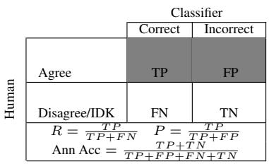

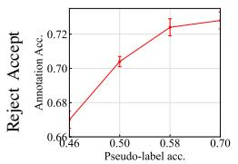  
Figure 5. Human annotation accuracy vs. pseudo label accuracy.

Figure 4. Confusion matrix for human filter results.  
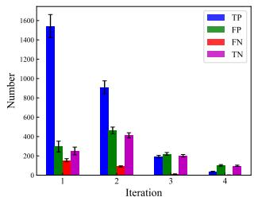

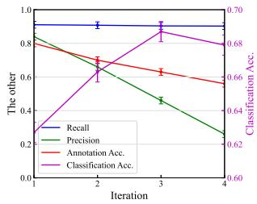  
Figure 6. Labelling accuracy, under different metrics, after each iteration of POSER annotation. Classifier accuracy also shown on the right plot.

When compared to $\mathrm { A L }$ , the main difference is that the SSL-HF annotator is assumed noisy. While AL samples the hardest instances (e.g., an occluded object) as queries, SSL-HF samples the image that $f$ classifies most confidently. Hence, while AL progresses from labeling hardest to easiest examples, SSL-HF does the opposite. This is much better suited for noisy annotators, since it avoids the early addition of incorrect labels to the dataset, which can derail $f .$

When compared to SSL, SSL-HF has the advantage of placing the hardest SSL step, validation of pseudo-labels, on the hands of humans, which are much more competent than any machine learning solution. The downside is the financial cost of the annotations. We compare the costs of the two approaches in the next section.

## 5. Experiments

In this section, we demonstrate the effectiveness of SSL-HF. More details about the experimental set up are provided in the supplementary.

## 5.1. Annotation Performance

We performed a study of annotation performance on the fine-grained birds CUB dataset [48], following the SSL setup of [36]. Figure 4 defines the confusion matrix of human annotators and statistics such as precision (P), recall (R), and annotation accuracy (Ann Acc). Annotation performance depends on a complex interplay between the quality of the pseudo-labels produced by the classifier $f$ and the hardness of the examples to annotate. Several experiments were performed to gain insight on this interplay.

<table><tr><td></td><td>Lab. Acc.</td><td>Cla. Acc.</td></tr><tr><td>A</td><td>60.1</td><td>59.2</td></tr><tr><td>B</td><td>66.2</td><td>64.1</td></tr><tr><td>C</td><td>61.1</td><td>60.2</td></tr><tr><td>D</td><td>68.7</td><td>65.9</td></tr><tr><td>E</td><td>74.3</td><td>68.6</td></tr></table>

Table 1. Labelling and classification accuracy as a function of the support set used by SSL-HF.

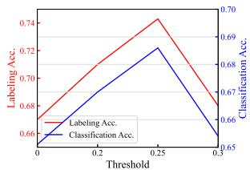  
Figure 7. Labelling and classification accuracy as a function of confidence threshold used by SSL-HF.

To evaluate how pseudo-label accuracy affects annotator performance, we trained four classifiers of increasing strength (accuracies of 0.46, 0.5, 0.58, 0.7 on $\mathcal { D } ^ { u } )$ , using four labeled datasets $\mathcal { D } ^ { l }$ of increasing size. Figure 5 shows the corresponding annotation accuracies on $\mathcal { D } ^ { u }$ after one iteration of SSL-HF. Clearly, human annotation accuracy increases with pseudo-label accuracy. This shows that there is benefit in improving the classifier, i.e. the SSL component is important, and justifies the progressive update of $f$ in Algorithm 1.

We then investigated how example hardness varies with the SSL-HF iteration and how this affects annotator performance. Figure 6 left shows how the confusion matrix of the annotation evolves across four SSL-HF iterations. While true positives dominate in the first iteration, this is no longer true by the 3rd, suggesting that the images remaining to label after each iteration are harder. While $\mathcal { D } ^ { l }$ grows with iteration, the newly accepted examples are noisier. The right of the figure shows the impact on annotation P, $\mathbf { R } ,$ and Ann Acc as well as the accuracy of the classifier $f .$ The three metrics of annotation performance decrease, confirming that annotation degrades in later iterations. The model $f$ reaches the best classification accuracy by the 3rd iteration. Note that this does not contradict Figure 5, where the comparison is for the same unlabeled image set. In Figure $^ { 6 , }$ annotation accuracy declines as the classifier becomes stronger because the unlabeled data consists of harder instances.

## 5.2. Ablation Study

Four different configurations were compared to ablate the mechanisms of section 4. In all cases the query is an image. The first two configurations use only text in the support sets. (A) uses the positive support set only, asking turkers if the query image is from class $\hat { y }$ (replaced with the category name). (B) adds the negative set, displaying the names of $K$ negative categories. The other two configurations test the importance of including images in the support set. (C) displays the positive support set only and (D) shows the full set of images of the interface of Figure 2. None of these experiments use explanations. These are added in a final configuration (E), which corresponds to SSL-HF.

<table><tr><td></td><td></td><td colspan="2">In Distribution</td><td colspan="2">[Out of Distribution</td></tr><tr><td></td><td></td><td>CUB</td><td>Fungi</td><td>CUB</td><td>Fungi</td></tr><tr><td>Baseline</td><td>Sup. expert (on Dl)</td><td>58.7</td><td>53.8 (0.4)</td><td>58.7</td><td>53.8 (0.4)</td></tr><tr><td></td><td>Upper boundSup. oracle (on  $\mathcal { D } ^ { l } \cup \mathcal { D } ^ { u } )$ </td><td>84.5</td><td>73.3 (0.1)</td><td>84.5</td><td>73.3 (0.1)</td></tr><tr><td rowspan="5">SSL</td><td>MoCo [16]</td><td>59.2 (0.6)55.2 (0.2)57.9 (0.5)52.9 (0.3)</td><td></td><td></td><td></td></tr><tr><td>Pseudo-Label [21]</td><td>57.0</td><td>51.5 (1.2)</td><td>59.1</td><td>52.4 (0.2)</td></tr><tr><td>Curr. Pseudo-Label [6]</td><td>57.3</td><td>53.7 (0.2)</td><td>59.6</td><td>54.2 (0.2)</td></tr><tr><td>FixMatch [34]</td><td>53.2</td><td>56.3 (0.5)</td><td>52.8</td><td>51.2 (0.6)</td></tr><tr><td>Self-Training [36]</td><td>61.3</td><td>56.9 (0.3)</td><td>61.4</td><td>55.7 (0.3)</td></tr><tr><td>POSER</td><td>SSL-HF</td><td>68.6 (0.6)60.0 (0.4)65.0 (0.9)57.8 (0.5)</td><td></td><td></td><td></td></tr></table>

Table 2. Classification accuracy (mean(std)) comparison with the state of the art SSL. Missing std indicates no std reported in the original literature.

Table 1 compares the labeling and classification accuracy of all methods, enabling two conclusions. First, without explanations (A to D), it is more important to add a negative support set than example images of the positive set. Note that adding a text-based negative set increases annotator performance by 6%, while adding all images only has an additional gain of 2.5%. However, the addition of visual explanations enables a large gain of almost 9%. Second, as expected from the experiments above, improved annotation accuracy leads to better classifiers. Overall, the classifier learned with SSL-HF is almost 10% better than with the simple baseline of A. The use of negative sets, asking questions implicitly via images, and explanations all contribute to this significant gain.

Note how these results demonstrate the importance of SSL-HF for expert domains. For the coarse-grained classification of everyday objects, the baseline of A (“is this a picture of a shoe?”) is sufficient to achieve very high annotation accuracies. In fact, we hypothesize that the performance of text-based only configurations is over-estimated on this dataset, where the class name is very indicative of visual features. For example, a bird without a red head cannot be a ‘Red headed Woodpecker.’ On datasets where class names are not so informative of visual attributes the gains of simply adding images (configurations C D), over the textonly baselines (A B), are likely to increase.

We also ablated the threshold of confidence scores used to accept labels (step 3 and 8 in Algorithm 1), with the results of Figure 7. The optimal threshold, 0.25, is very different from those used for SSL approaches to object recognition (e.g., 0.95 in [34]) and object detection (e.g., 0.7 in [22]). This confirms the claim that human filtering of labels is much more robust than the simple thresholding of confidence scores. Even though most pseudo-labels of low confidence are incorrect, human annotators can still assign the images to the correct class by visually analogy to the examples in the support set, as also demonstrated by the high true positive rates of Figure 6. It is only for extremely low values of confidence that the support sets are totally uninformative and human filtering becomes ineffective.

In fact, the confidence threshold cannot be too high for

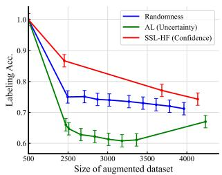

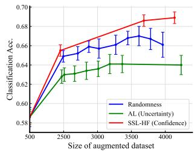  
Figure 8. Labelling (left) and classifier (right) accuracy vs size of the POSER annotated dataset for different query selection strategies.

SSL-HF, as this leads to the acceptance of only the examples that are relatively easier. Such examples fail to induce improvement of the classifier, which subsequently fails to produce better pseudo labels for the next iteration. In result, the gradual update of the classifier does not happen. Results of a comprehensive ablation study of the other algorithm parameters, such as image sampling strategy for creation of support sets sets, support set cardinality, etc. are discussed in the Supp.

## 5.3. Comparisons on Crowd-source Platforms

POSER annotation with SSL-HF, using MTurk workers, was compared to various other approaches, on several expert-domain datasets: CUB [48] (100 classes) and Fungi [36] (200), which have large class cardinality, and Butterflies [23] (5) and Gulls [44] (5), which are machine teaching datasets.

SSL: Table 2 compares SSL-HF to SSL methods on the benchmarks of [36, 44]. These include both an indistribution setting, where unlabeled and labeled data are drawn from the same class space, and an out-of distribution setting, where the unlabeled data comes from novel classes. The importance of data annotations is reflected by the large gap between supervised learning from $\mathcal { D } ^ { l }$ (expert labeled dataset) and $\mathcal { D } ^ { l } \cup \mathcal { D } ^ { l }$ (upper bound, fully labeled) for all datasets. However, vanilla SSL is of little help, since all methods have little to no gain over learning from $\mathcal { D } ^ { l }$ alone. This is unlike POSER annotation with SSL-HF, which achieves significant gains over expert annotation alone. The gains can be as high as 10% for in-distribution and 6% for out-of distribution data.

AL: SSL-HF was compared to AL and random example selection. These were implemented with Algorithm 1, by replacing the function used to select examples in steps 3 and 8. For AL $[ 1 7 , 5 3 , 5 4 ] , \sigma ( \mathbf { x } _ { j } | f ^ { t - 1 } )$ was replaced by an entropybased acquisition function [17], which forwards images of high classification uncertainty to the turkers. For random selection it was replaced by a sample from a uniform distribution in [0, 1]. Figure 8 shows how annotation and classification accuracy vary with the amount of data from $\mathcal { D } ^ { u }$ that is labeled. SSL-HF is always the best method and AL the worst, even worse than random. This confirms our claims that the selection of hard examples performed by AL is not suitable for the noisy annotators of POSER annotation.

<table><tr><td rowspan=1 colspan=1></td><td rowspan=1 colspan=1></td><td rowspan=1 colspan=1>Labeling Acc.Butterflies Gulls</td><td rowspan=1 colspan=1>Classification Acc.ButterfliesGulls</td></tr><tr><td rowspan=1 colspan=1>BaselineUpper bound</td><td rowspan=1 colspan=1>Sup. expert (on $\overline { { \mathcal { D } ^ { l } ) } }$ Sup. oracle (on $\mathcal { D } ^ { l } \cup \mathcal { D } ^ { u } )$ </td><td rowspan=1 colspan=1>–       -</td><td rowspan=1 colspan=1>58.7  53.8 (0.4)84.5  73.3 (0.1)</td></tr><tr><td rowspan=1 colspan=1>MT</td><td rowspan=1 colspan=1>MEMORABLE [44]</td><td rowspan=1 colspan=1>77.1 (1.2) 68.3 (1.8)</td><td rowspan=1 colspan=1>77.5 (0.5) 60.2 (1.1)</td></tr><tr><td rowspan=1 colspan=1>SSL-HF</td><td rowspan=1 colspan=1>SSL-HF</td><td rowspan=1 colspan=1>73.6 (0.8) 74.1 (0.5)|</td><td rowspan=1 colspan=1>73.0 (0.7) 63.3 (0.5)</td></tr></table>

Table 3. Labeling and classification accuracy (mean(std)) comparison.

MT: Table 3 compares SSL-HF with a state of the art MT algorithm [44]. These experiments are restricted to the small class cardinality datasets supported by MT. They confirm the previous observation that higher labeling accuracy leads to higher classification accuracy. Regarding relative performance, the results are mixed, with better results for [44] in Butterfies and for SSL-HF in Gulls. This is explained by the fact that Butterflies is not as fine-grained as Gulls, a fact confirmed by the higher classification accuracies of the former. In result, Gull classes are harder to commit to short-term memory and the annotation performance of MT degrades. Note that while SSL-HF is slightly inferior to MT on the easier dataset, it has similar annotation accuracy on the two datasets. This suggests that visual reasoning in terms of support sets and visual explanations is quite robust, unlike the memorization required by MT. This and the scalabilty of SSL-HF with class cardinality make SSL-HF a clearly better overall solution.

## 5.4. Comparisons by Human Simulation

Protocol: Crowd source experiments are difficult to replicate and expensive. Hence, there is a benefit to simulated evaluation protocols that facilitate algorithmic development. These should mimic human annotations as closely as possible. Following [44], we propose a simulated protocol to evaluate SSL-HF, based on estimates of the confusion matrix of Figure 4, obtained on a small dataset. R examples are sampled from $\mathcal { D } ^ { u }$ , forwarded to human annotators, the confusion matrix is computed and used to simulate the annotators for the remaining unlabeled examples. Given a new example $\left( \mathbf { x } , y \right)$ and pseudo-label $\hat { y } ,$ a random number (p) is sampled from a uniform distribution in [0, 1]. $\operatorname { I f } { \hat { y } } = y ,$ the human decision is simulated as ‘Agree’ when $\begin{array} { r } { p < \frac { T ^ { \prime } { \cal F } ^ { \prime } } { T { \cal P } + F N } } \end{array}$ and ‘Disagree/IDK’ otherwise. If yˆ $\neq y ,$ ‘Agree’ is declared when $\begin{array} { r } { p < \frac { F P } { F P + T N } } \end{array}$ and ‘Disagree/IDK’ otherwise.

To determine how many examples R are needed to produce a realistic confusion matrix, we performed a twosample two-tailed T test comparing the classification accuracies of human and simulated labeling. Table 4 lists statistics for different values of R. The null-hypothesis is that the underlying population means are the same. The t-scores are computed for a p-value of 0.05, and the null-hypothesis is accepted for all $R \geq 5 0 0$ . This suggests that simulation is a very economical alternative to user experiments.

Cost-accuracy trade-off: We used simulation to compare supervised learning from $\mathcal { D } ^ { l }$ , SSL-HF, SSL, and AL with respect to the trade-off between classifier accuracy and annotation cost (dollars). These experiments are too expensive to perform on MTurk, due to the need to explore various points along the trade-off.

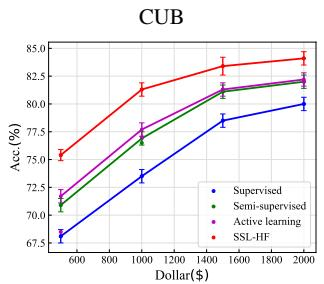

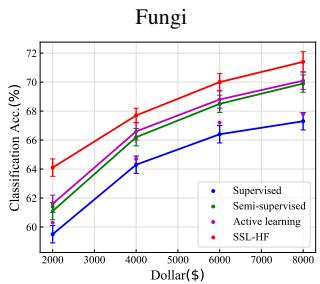

Figure 9. Trade-off between accuracy and annotation cost of different labeling strategies.
<table><tr><td rowspan="2">R</td><td colspan="5">Simulated</td><td rowspan="2">Real 3885</td></tr><tr><td>400</td><td>500</td><td>1000</td><td>1500</td><td>2000</td></tr><tr><td>Accuracy</td><td>69.8(0.4)</td><td>69.6(0.4)</td><td>69.2(0.3)</td><td>68.9(0.4)</td><td>68.5(0.3)</td><td>68.6</td></tr><tr><td>t-score</td><td>2.95</td><td>2.40</td><td>1.58</td><td>0.72</td><td>-0.26</td><td></td></tr><tr><td>Conclusion</td><td>Reject</td><td>Accept</td><td>Accept</td><td>Accept</td><td>Accept</td><td></td></tr></table>

Table 4. Classification accuracy (mean(std)) of simulated experiments with different R, and results (t-score) of two-sample two-tailed T test, for pvalue 0.05.

For supervised and SSL methods, the entire labeling budget is spent on expert annotations. SSL-HF and AL split labels between experts and crowd source workers. These annotations have very different costs. For workers, we assume the rate of \$0.01 per image, used in all experiments above and customary on MTurk. The cost of an expert can vary significantly with the application, e.g. doctors tend to be more expensive than botanists. We used the conservative estimate of \$1 (more details given in Supp.). We then assumed a total dollar budget and determined the number of images labeled by experts and workers. Figure 9 shows the plots of cost vs classification accuracy of the different methods on CUB. SSL-HF achieves the best trade-off. For example, its accuracy for a cost of \$800 equals those of SSL for \$1, 200 and Supervised for \$1, 700.

## 6. Conclusion

In this work, we have proposed SSL-HF, a new humanin-the-loop method that uses crowd-source workers for POSER annotation. Experiments have shown that SSL-HF significantly outperforms alternatives such as semisupervised learning, machine teaching or active learning for expert domain problems of large numbers of classes. It is unclear whether the SSL-HF originates serious negative societal impacts. By enabling easier training of large-scale fine-grained recognition, the proposed techniques could facilitate negative or illegal uses of deep learning.

Acknowledgement This work was partially funded by NSF awards IIS-1924937, IIS-2041009, and NVIDIA GPU donations. We also acknowledge and thank the use of the Nautilus platform for some of the experiments discussed above.

## References

[1] Fazel Ansari, Selim Erol, and Wilfried Sihn. Rethinking human-machine learning in industry 4.0: how does the paradigm shift treat the role of human learning? Procedia manufacturing, 23:117–122, 2018.

[2] Sarpong Kwadwo Asare, Fei You, and Obed Tettey Nartey. Learning to classify skin lesions via self-training and selfpaced learning. In BIBM, pages 963–967. IEEE, 2020.

[3] Sarpong Kwadwo Asare, Fei You, and Obed Tettey Nartey. A semisupervised learning scheme with self-paced learning for classifying breast cancer histopathological images. Computational Intelligence and Neuroscience, 2020, 2020.

[4] David Berthelot, Nicholas Carlini, Ekin D Cubuk, Alex Kurakin, Kihyuk Sohn, Han Zhang, and Colin Raffel. Remixmatch: Semi-supervised learning with distribution alignment and augmentation anchoring. arXiv preprint arXiv:1911.09785, 2019.

[5] David Berthelot, Nicholas Carlini, Ian Goodfellow, Nicolas Papernot, Avital Oliver, and Colin A Raffel. Mixmatch: A holistic approach to semi-supervised learning. NeurIPS, 32, 2019.

[6] Paola Cascante-Bonilla, Fuwen Tan, Yanjun Qi, and Vicente Ordonez. Curriculum labeling: Revisiting pseudolabeling for semi-supervised learning. arXiv preprint arXiv:2001.06001, 2020.

[7] Ting Chen, Simon Kornblith, Mohammad Norouzi, and Geoffrey Hinton. A simple framework for contrastive learning of visual representations. In ICML, pages 1597–1607. PMLR, 2020.

[8] Yuxin Chen, Oisin Mac Aodha, Shihan Su, Pietro Perona, and Yisong Yue. Near-optimal machine teaching via explanatory teaching sets. In ICAIS, pages 1970–1978. PMLR, 2018.

[9] Adam Coates, Andrew Ng, and Honglak Lee. An analysis of single-layer networks in unsupervised feature learning. In Proceedings of the fourteenth international conference on artificial intelligence and statistics, pages 215–223. JMLR Workshop and Conference Proceedings, 2011.

[10] Leda Cosmides and John Tooby. Are humans good intuitive statisticians after all? rethinking some conclusions from the literature on judgment under uncertainty. cognition, 58(1):1– 73, 1996.

[11] Jia Deng, Wei Dong, Richard Socher, Li-Jia Li, Kai Li, and Li Fei-Fei. Imagenet: A large-scale hierarchical image database. In CVPR, pages 248–255. Ieee, 2009.

[12] Jun Du and Charles X Ling. Active learning with human-like noisy oracle. In ICDM, 2010.

[13] Gyslain Giguere and Bradley C Love. Limits in deci-\` sion making arise from limits in memory retrieval. PNAS, 110(19):7613–7618, 2013.

[14] Chuan Guo, Geoff Pleiss, Yu Sun, and Kilian Q Weinberger. On calibration of modern neural networks. In ICML, 2017.

[15] Gaurav Gupta, Anit Kumar Sahu, and Wan-Yi Lin. Learning in confusion: Batch active learning with noisy oracle. 2019.

[16] Kaiming He, Haoqi Fan, Yuxin Wu, Saining Xie, and Ross Girshick. Momentum contrast for unsupervised visual representation learning. In CVPR, pages 9729–9738, 2020.

[17] Alex Holub, Pietro Perona, and Michael C Burl. Entropybased active learning for object recognition. In CVPR Workshops, pages 1–8. IEEE, 2008.

[18] https://www.mturk.com/.

[19] Edward Johns, Oisin Mac Aodha, and Gabriel J Brostow. Becoming the expert-interactive multi-class machine teaching. In CVPR, pages 2616–2624, 2015.

[20] Alex Krizhevsky, Geoffrey Hinton, et al. Learning multiple layers of features from tiny images. 2009.

[21] Dong-Hyun Lee et al. Pseudo-label: The simple and efficient semi-supervised learning method for deep neural networks. In ICML Workshop, volume 3, page 896, 2013.

[22] Yen-Cheng Liu, Chih-Yao Ma, Zijian He, Chia-Wen Kuo, Kan Chen, Peizhao Zhang, Bichen Wu, Zsolt Kira, and Peter Vajda. Unbiased teacher for semi-supervised object detection. arXiv preprint arXiv:2102.09480, 2021.

[23] Oisin Mac Aodha, Shihan Su, Yuxin Chen, Pietro Perona, and Yisong Yue. Teaching categories to human learners with visual explanations. In CVPR, pages 3820–3828, 2018.

[24] Daniele Mugnai, Federico Pernici, Francesco Turchini, and Alberto Del Bimbo. Soft pseudo-labeling semi-supervised learning applied to fine-grained visual classification. In ICPR, pages 102–110. Springer, 2021.

[25] Ravi Teja Mullapudi, Fait Poms, William R Mark, Deva Ramanan, and Kayvon Fatahalian. Learning rare category classifiers on a tight labeling budget. In ICCV, pages 8423–8432, 2021.

[26] Obed Tettey Nartey, Guowu Yang, Jinzhao Wu, and Sarpong Kwadwo Asare. Semi-supervised learning for finegrained classification with self-training. IEEE Access, 8:2109–2121, 2019.

[27] Yuval Netzer, Tao Wang, Adam Coates, Alessandro Bissacco, Bo Wu, and Andrew Y Ng. Reading digits in natural images with unsupervised feature learning. 2011.

[28] Avital Oliver, Augustus Odena, Colin A Raffel, Ekin Dogus Cubuk, and Ian Goodfellow. Realistic evaluation of deep semi-supervised learning algorithms. NeurIPS, 31, 2018.

[29] Kaustubh R Patil, Jerry Zhu, Łukasz Kopec, and Bradley C´ Love. Optimal teaching for limited-capacity human learners. NeurIPS, 27, 2014.

[30] Genevieve Patterson, Grant Van Horn, Serge Belongie, Pietro Perona, and James Hays. Tropel: Crowdsourcing detectors with minimal training. In AAAI, volume 3, 2015.

[31] Pengzhen Ren, Yun Xiao, Xiaojun Chang, Po-Yao Huang, Zhihui Li, Brij B Gupta, Xiaojiang Chen, and Xin Wang. A survey of deep active learning. ACM computing surveys (CSUR), 54(9):1–40, 2021.

[32] Burr Settles. Active learning literature survey. 2009.

[33] Adish Singla, Ilija Bogunovic, Gabor Bart´ ok, Amin Karbasi,´ and Andreas Krause. Near-optimally teaching the crowd to classify. In ICML, pages 154–162. PMLR, 2014.

[34] Kihyuk Sohn, David Berthelot, Nicholas Carlini, Zizhao Zhang, Han Zhang, Colin A Raffel, Ekin Dogus Cubuk, Alexey Kurakin, and Chun-Liang Li. Fixmatch: Simplifying semi-supervised learning with consistency and confidence. NeurIPS, 33:596–608, 2020.

[35] Jost Tobias Springenberg. Unsupervised and semisupervised learning with categorical generative adversarial networks. arXiv preprint arXiv:1511.06390, 2015.

[36] Jong-Chyi Su, Zezhou Cheng, and Subhransu Maji. A realistic evaluation of semi-supervised learning for fine-grained classification. In CVPR, pages 12966–12975, 2021.

[37] Jong-Chyi Su and Subhransu Maji. The semi-supervised inaturalist challenge at the fgvc8 workshop. arXiv preprint arXiv:2106.01364, 2021.

[38] Shihan Su, Yuxin Chen, Oisin Mac Aodha, Pietro Perona, and Yisong Yue. Interpretable machine teaching via feature feedback. 2017.

[39] Flood Sung, Yongxin Yang, Li Zhang, Tao Xiang, Philip HS Torr, and Timothy M Hospedales. Learning to compare: Relation network for few-shot learning. In CVPR, pages 1199– 1208, 2018.

[40] Grant Van Horn, Steve Branson, Ryan Farrell, Scott Haber, Jessie Barry, Panos Ipeirotis, Pietro Perona, and Serge Belongie. Building a bird recognition app and large scale dataset with citizen scientists: The fine print in fine-grained dataset collection. In CVPR, pages 595–604, 2015.

[41] Sen Wan, Yimin Hou, Feng Bao, Zhiquan Ren, Yunfeng Dong, Qionghai Dai, and Yue Deng. Human-in-the-loop low-shot learning. IEEE T-NNLS, 32(7):3287–3292, 2020.

[42] Pei Wang, Kabir Nagrecha, and Nuno Vasconcelos. Gradient-based algorithms for machine teaching. In CVPR, pages 1387–1396, 2021.

[43] Pei Wang and Nuno Vasconcelos. Deliberative explanations: visualizing network insecurities. NeurIPS, 32, 2019.

[44] Pei Wang and Nuno Vasconcelos. A machine teaching framework for scalable recognition. In ICCV, pages 4945– 4954, October 2021.

[45] Pei Wang and Nuno Vasconcelos. A generalized explanation framework for visualization of deep learning model predictions. IEEE T-PAMI, 2023.

[46] Yezhen Wang, Bo Li, Tong Che, Kaiyang Zhou, Ziwei Liu, and Dongsheng Li. Energy-based open-world uncertainty modeling for confidence calibration. In ICCV, pages 9302– 9311, 2021.

[47] Yaqing Wang, Quanming Yao, James T Kwok, and Lionel M Ni. Generalizing from a few examples: A survey on few-shot learning. ACM computing surveys (csur), 53(3):1–34, 2020.

[48] P. Welinder, S. Branson, T. Mita, C. Wah, F. Schroff, S. Belongie, and P. Perona. Caltech-UCSD Birds 200. Technical Report CNS-TR-2010-001, California Institute of Technology, 2010.

[49] Xingjiao Wu, Luwei Xiao, Yixuan Sun, Junhang Zhang, Tianlong Ma, and Liang He. A survey of human-in-the-loop for machine learning. Future Generation Computer Systems, 2022.

[50] Tete Xiao, Xiaolong Wang, Alexei A Efros, and Trevor Darrell. What should not be contrastive in contrastive learning. arXiv preprint arXiv:2008.05659, 2020.

[51] Yi Xu, Lei Shang, Jinxing Ye, Qi Qian, Yu-Feng Li, Baigui Sun, Hao Li, and Rong Jin. Dash: Semi-supervised learning with dynamic thresholding. In ICML, pages 11525–11536. PMLR, 2021.

[52] Songbai Yan, Kamalika Chaudhuri, and Tara Javidi. Active learning from imperfect labelers. NeurIPS, 29, 2016.

[53] Yazhou Yang and Marco Loog. Active learning using uncertainty information. In ICPR, pages 2646–2651. IEEE, 2016.

[54] Yi Yang, Zhigang Ma, Feiping Nie, Xiaojun Chang, and Alexander G Hauptmann. Multi-class active learning by uncertainty sampling with diversity maximization. IJCV, 113(2):113–127, 2015.

[55] Bowen Zhang, Yidong Wang, Wenxin Hou, Hao Wu, Jindong Wang, Manabu Okumura, and Takahiro Shinozaki. Flexmatch: Boosting semi-supervised learning with curriculum pseudo labeling. NeurIPS, 34:18408–18419, 2021.

[56] Xiaojin Zhu. Machine teaching: An inverse problem to machine learning and an approach toward optimal education. In AAAI, volume 29, 2015.

[57] Xiaojin Zhu, Adish Singla, Sandra Zilles, and Anna N Rafferty. An overview of machine teaching. arXiv preprint arXiv:1801.05927, 2018.