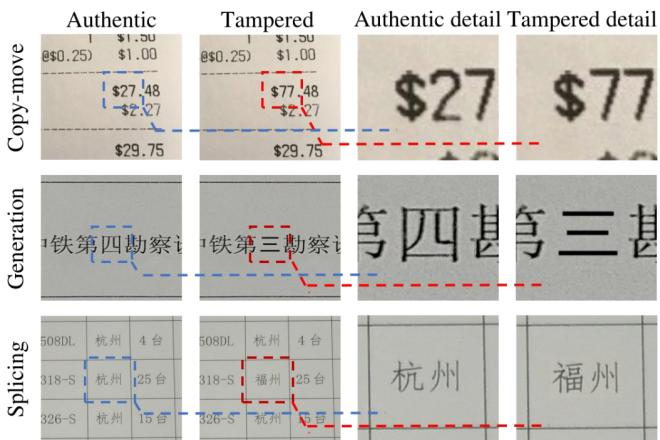
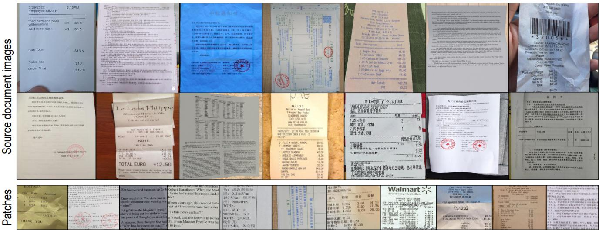
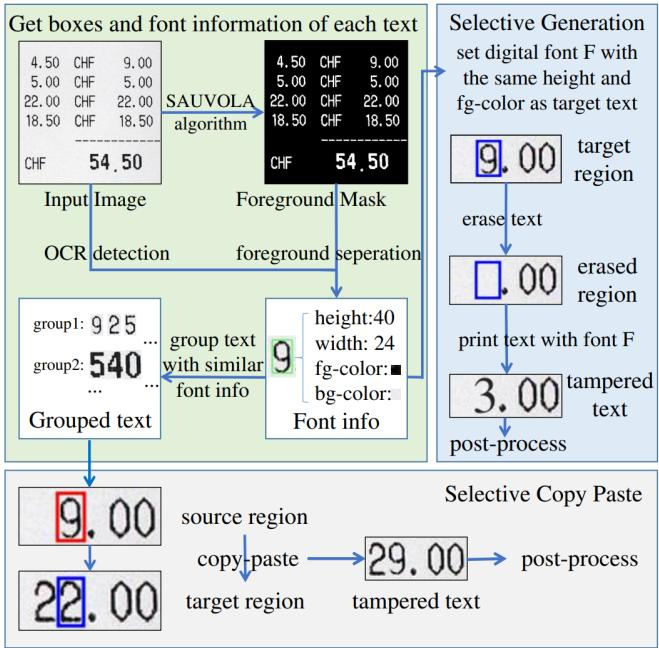
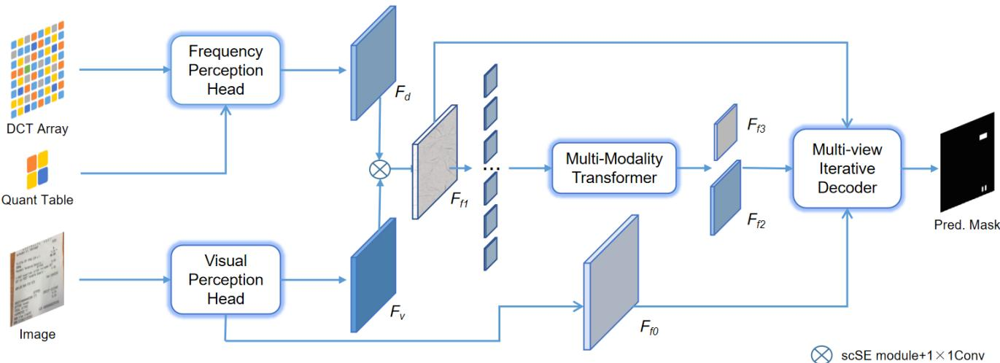
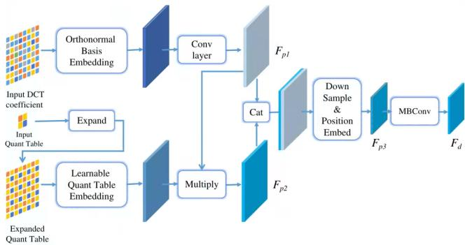
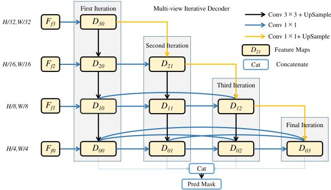
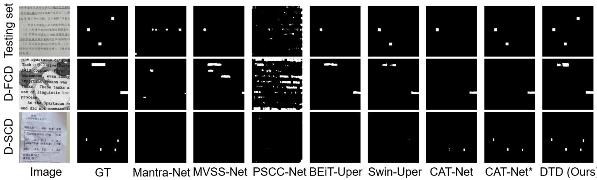

# Towards Robust Tampered Text Detection in Document Image: New dataset and New Solution

Chenfan Qu1, Chongyu Liu1, Yuliang Liu2, Xinhong Chen1, Dezhi Peng1, Fengjun Guo3, Lianwen Jin1,\*

1South China University of Technology, 2Huazhong University of Science and Technology, 3IntSig Information Co., Ltd

202221012612@mail.scut.edu.cn, eelwjin@scut.edu.cn

## Abstract

Recently, tampered text detection in document image has attracted increasingly attention due to its essential role on information security. However, detecting visually consistent tampered text in photographed document images is still a main challenge. In this paper, we propose a novel framework to capture more fine-grained clues in complex scenarios for tampered text detection, termed as Document Tampering Detector (DTD), which consists of a Frequency Perception Head (FPH) to compensate the deficiencies caused by the inconspicuous visual features, and a Multi-view Iterative Decoder (MID) for fully utilizing the information of features in different scales. In addition, we design a new training paradigm, termed as Curriculum Learningfor Tampering Detection (CLTD), which can address the confusion during the training procedure and thus to improve the robustness for image compression and the ability to generalize. To further facilitate the tampered text detection in document images, we construct a large-scale document image dataset, termed as DocTamper, which contains 170,000 document images of various types. Experiments demonstrate that our proposed DTD outperforms previous state-of-the-art by 9.2%, 26.3% and 12.3% in terms of F-measure on the DocTamper testing set, and the crossdomain testing sets of DocTamper-FCD and DocTamper-SCD, respectively. Codes and dataset will be available at https://github.com/qcf-568/DocTamper.

## 1. Introduction

Document images are one of the most essential media for information transmission in modern society, which contains amounts of sensitive and privacy information such as telephone numbers. As the rapid development of the image editing technologies, such sensitive text information can be more easily to be tampered for malicious purposes such as defraud, causing serious information security risks [33,42,48,50]. Therefore, detecting tampering in document images has become an important research topic in recent years [18,47]. It is crucial to develop effective methods to examine whether a document image is modified, meanwhile identifying the exact location of the tampered text.

  
Figure 1. Tampered text in document images usually have relatively small areas and few visual tampering clue.

Most text tamper methods in documents images can be generally categorized into three types: (1) Splicing, which copies regions from one image and paste to other images; (2) Copy-move, which shifts the spatial locations of objects within images; (3) Generation, which replaces regions of images with visually plausible but different contents, As shown in Fig. 1. Though tampering detection in natural images has been studied for years [14, 49], it differs a lot from that in document images. For natural images, tampering detection mainly relies on the relatively obvious visual tampered clues on edge or surface of the object, which hardly exist in documents, especially for copy-move and splicing [1, 47]. This is because document images mostly have the same background color, and text within clusters usually has the same font and size. Therefore, the tampered text regions can not be effectively detected based only on visual clues. To this end, in this paper we propose to incorporate both visual and frequency clues to improve the ability on identifying the tampered text regions in documents.

Recently, some promising methods have been proposed for tampered text detection [8,18,47] by analysing the text’s appearance on scanned documents. Though significant progresses have been achieved on simple and clean documents, detecting elaborately tampered text regions in various photographed documents is still an open challenge.

In this paper, we propose a multi-modality Transformerbased method, termed as Document Tampering Detector (DTD), for Document Image Tampering Detection (DITD). The proposed model utilizes features from both visual domain and frequency domain. The former one are extracted from Visual Perception Head with the original image as input. For the latter one, different from the previous work [43] that leveraged the high-pass filtered results of RGB images, we utilize the DCT coefficients as the input of our model’s Frequency Perception Head to obtain the corresponding embedding. Through a fusion module with a concatenation operation and an attention module, the features in these two modules are incorporated effectively and then fed into a Swin-Transformer [27] based encoder. Finally, we introduce a new Multi-view Iterative Decoder to progressively perceive the tampered text regions.

From our experiments, we find image compression can cover up some of tampering clues and models usually lack robustness to it at start. Training in randomly compressed images will bring confusion to models and they couldn’t work well on the challenging DITD tasks. Therefore, we further propose a new training paradigm, termed as Curriculum Learning for Tampering Detection (CLTD), to train the models in an easy-to-hard manner. In such way, the model can firstly learn how to spot tampering clues accurately and then gradually gain the robustness to image compression.

As there lack large-scale tampered document dataset, We introduce a new method to create realistic tampered text data and construct a large-scale dataset, termed as DocTamper, with 170k tampered document images of diverse types.

We conduct sufficient experiments on both our proposed DocTamper and the T-SROIE dataset [47]. Both the qualitative and quantitative results demonstrate that our DTD can significantly outperform previous state-of-the-art methods.

In summary, our main contributions are as follows:

• We introduce DTD, a powerful multi-modality model for tampered text detection in document images.

• We propose CLTD, a new training paradigm to enhance the generalization ability and robustness of the proposed tampering detection model

• We propose a novel data synthetic method to generate realistic tampered documents efficiently with only unlabeled document images.

• We construct a comprehensive large-scale dataset with various scenarios and tampering methods to further facilitate the research on tampered text detection task.

## 2. Related Works

## 2.1. Natural Image Manipulation Detection

Early studies on natural image manipulation detection mainly focused on detecting a specific type of manipulation [12, 13]. Gradually, the rapid development of neural networks boosts the general manipulation detection research considerably [4, 17, 49]. Zhou et al. [51] introduced to add SRM kernel [15] to Faster-RCNN [31] and located forgeries with bounding boxes. Bappy et al. [4] proposed to use SRM kernel [15] as long as constrained convolution [6] in feature extraction and detected manipulations in pixelwise manner. Kwon et al. [19] utilized HRNet [39] to localize tampered regions in both RGB domain and frequency domain. Dong et al. [14] extracted features with a twostream CNN and constrained convolution [6], they introduced Edge-Supervised Branch to enhance the feature maps and used Dual Attention Module to fuse the output of the two-stream CNN. Liu et al. [26] introduced a novel attention mechanism to improve performance. Wang et al. [43] used both images and their high-pass filter results as the input of their two-stream CNN and introduced a set of queries to help the model localize manipulation in object-level. Although the above methods achieved significant progress, they may not work very well in document image tampering detection as the tampered text regions usually have much more visual consistency with the authentic regions.

## 2.2. Document Image Tampering Detection

Early document image tampering detection was mainly achieved by printer classification [20, 30, 36] or template matching [2]. Some works [5,8,53] used font features to distinguish between real texts and tampered texts. Beusekom et al. [41] analyzed whether the position of a text line in the document image is aligned with other text lines to determine whether a text line has been tampered. James et al. [18] used graph neural network (GNN) to detect tampered regions in document images with the help of the graph attention mechanism. The above methods only work well on very clear and neat documents, such as scanned documents. Abramova et.al. [1] detected copy-move tampering in document images based on double quantization artifacts, which doesn’t works well when document images are compressed more than once after tampering. Wang et al. [47] used a two-stream Faster-RCNN [31] network to capture the high frequency clues the SRNet [48] left. However, this type of tampering clues mostly exists on generative tampering and could hardly be find on careful copy-paste tampering.

Figure 2. We collect 50562 document images in various types from public websites and public datasets. We apply copy-move, splicing, and generation to create tampered patches and construct the DocTamper dataset.  
  
Figure 3. The pipeline of the proposed data synthesis method. We first record size, foreground color and background color of each text and then do selective synthesis based on that.

The above methods have made promising progress, but they are mostly designed for some specific scenarios. Therefore, they lack enough robustness and cross-domain generalization ability when encountering some complex scenarios on various photographed documents.

## 3. DocTamper Dataset

In this section, we propose a novel data synthesis approach to generate realistic tampered document images efficiently with only unlabeled document images. With this

method, we construct a comprehensive large-scale dataset to promote the research of the tampered text detection task.

## 3.1. Proposed data synthesis method

Selective Tampering Synthesis In traditional image manipulation detection task, copy-move and splicing data are synthesised by copying objects from images and pasting them to random target regions [29, 43, 51]. In the field of tampered text detection in document images, however, random copy-paste will generate obvious visual inconsistency, which will cause a huge gap between the synthetic data and real-world text tampering. Therefore, we propose selective tampering synthesis to generate realistic tampered document images. It contains selective copy-paste and selective generation. The former obtains text groups with similar styles and does copy-paste within the grouped text instances to generate tampered text. The latter first erases their original text contents with OpenCV [9] or G’MIC [40], then prints new text with the pre-set similar style and font. As we can’t directly access the exact text font of the document images in various scenarios, we propose to represent them with the size (including height and width), foreground color and background color of these text.

Overall Pipeline As shown in Fig. 3, the proposed data synthesis pipeline for text tampering can be described as follows: (1) We get the bounding boxes of the words and characters with powerful open-source OCR tools, such as Paddle-OCR [21] and TesseractOCR [37]. (2) We separate the foreground of the document images from their background using SAUVOLA algorithm [35] and record the foreground color and background color for each text. (3) We apply both selective copy-paste and selective generation to obtain the tampered document images. (4) Finally, post processing is also applied to improve visual consistency.

Table 1. Comparison between DocTamper and other public tampered text detection datasets. ‘G‘ denotes Generative tampering, ‘C‘ denotes Copy-move, and ‘S‘ denotes Splicing.
<table><tr><td>Dataset</td><td>Year</td><td>Scenario</td><td>Language</td><td>Number of images</td><td>Tampering Method</td></tr><tr><td>T-SROIE [47]</td><td>2022</td><td>Receipts</td><td>English</td><td>986</td><td>G</td></tr><tr><td>T-IC13* [46]</td><td>2022</td><td>Scene Text</td><td>English</td><td>462</td><td>G</td></tr><tr><td>DocTamper</td><td>2022</td><td>Contracts, Invoices, Receipts, etc.</td><td>English+Chinese</td><td>170,000</td><td>CSG</td></tr></table>

\*Although T-IC13 is a tampered dataset for scene text rather than document text, we still list it here for reference to the community.

Table 2. Basic configuration about the DocTamper Dataset, ‘DocTamper-FCD‘ denotes the first cross-domain subset, ‘DocTamper-SCD‘ denotes the second cross-domain subset.
<table><tr><td colspan="2">DocTamper</td><td>Number of images</td></tr><tr><td rowspan="2">Language</td><td>English</td><td>95,000</td></tr><tr><td>Chinese</td><td>75,000</td></tr><tr><td rowspan="3">Tampering Type</td><td>Copy-move</td><td>60,000</td></tr><tr><td>Splicing</td><td>50,000</td></tr><tr><td>Generation</td><td>60,000</td></tr><tr><td rowspan="4">Data Split</td><td>Training set</td><td>120,000</td></tr><tr><td>Testing set</td><td>30,000</td></tr><tr><td>DocTamper-FCD</td><td>2,000</td></tr><tr><td>DocTamper-SCD</td><td>18,000</td></tr></table>

## 3.2. Proposed Dataset

Considering the small-scale of the existing datasets [46, 47], we construct a large-scale dataset for tampered text detection task, termed as DocTamper.

Dataset Description As shown in Table 2, DocTamper has a total number of 170k tampered document images, including both Chinese and English. Copy-move, splicing and generation are all included and applied approximately uniform in out dataset. Moreover, we split the dataset into four subsets: a training set with 120k samples; a general testing set of 30k samples, and two cross-domain testing sets of 2k and 18k samples, respectively. All of the tampered images are stored without compression, thus they could be trained or tested with customized compression configurations. For all the images, we provide pixel-level annotations denoting the tampered text regions.

Cross-domain Testing Sets Most of the previous works [14,19,26,49] tested their models in a cross-domain manner, by which the image source and style of testing sets are different from training sets. Such cross-domain evaluation can further evaluate the generalization ability of the methods. It motivates us to introduce two cross-domain testing sets. The image source of our first cross-domain (FCD) testing set is from the Noisy Office Dataset [10], while the image source of the second cross-domain (SCD) testing set is from HUAWEI Cloud [11]. Compared to the common testing set, the images in cross-domain testing sets will be much different from the training set in texture and document styles.

The main features of the proposed DocTamper dataset can be summarized as follows:

• Large Scale. As shown in Table 1, the public datasets in previous works only have less than 1k images, while DocTamper has total 170k images. Such a large scale dataset is more likely to be a better benchmark for the DITD task.

• Board Diversity. As shown in Fig. 2, to build the Doc-Tamper Dataset, we collect 50,562 document images from various publicly available websites and document image datasets [10, 16, 23, 38]. Various bilingual realworld document images including contracts, invoices, receipts, etc., are included in the source images of our dataset (Some representative source images of Doc-Tamper are shown in appendix). It’s worth mentioning that the previous datasets contains only one scenario respectively, as shown in Table 1.

• Comprehensiveness. All the three commonly used text tampering methods are included in our dataset to imitate the real-world applications. In Addition, we introduce two cross-domain testing subsets to fully evaluate the generalization ability of different methods.

## 4. Proposed Model

In this section, we propose Document Tampering Detector (DTD), a novel model for document image tampering detection. The overall architecture is shown in Fig. 4. It consists of four modules: (1) Visual Perception Head to extract visual features from the original images; (2) Frequency Perception Head to convert the Discrete Cosine Transform (DCT) coefficients of the images to frequency domain feature embeddings; (3) a Multi-Modality Encoder and (4) a Multi-view Iterative Decoder for final prediction.

## 4.1. Visual Perception Head

We apply seven stacked convolution blocks as our Visual Perception Head (VPH) to extract visual features. Given an input image $I \in \mathbb { R } ^ { H \times W \times 3 }$ , we first extract two visual feature embeddings of $I ,$ including $F _ { f 0 } \in \mathbb { R } ^ { \frac { H } { 4 } \times \frac { W } { 4 } \times C _ { 0 } }$ and $F _ { v } \in \mathbb { R } ^ { \frac { H } { 8 } \times \frac { W } { 8 } \times C _ { v } }$ through the VPH.

  
Figure 4. The overall architecture of our model. We extract visual domain features from image with Visual Perception Head and extract frequency domain features from DCT coefficients with Frequency Perception Head. Then fuse them and extract multi-modality features by multi-modality Transformer. At last, we utilize Multi-view Iterative Decoder to get predictions with encoder’s output features.

## 4.2. Frequency Perception Head

During the process that images are captured by digital devices such as cameras and smart phones, they will be patched and compressed by quantifying their DCT coefficients, which will cause Block Artifact Grids (BAG) [22]. Tampering on images will mostly disturb the original distribution of their DCT coefficients, causing the BAG’s discontinuities between tampered regions and authentic regions. Therefore, DCT coefficients’ features are good at capturing the BAG’s discontinuities and can serve as another important clue for locating the tampered regions and make up for the deficiencies caused by the inconspicuous visual features. Accordingly, we design Frequency Perception Head (FPH) to capture tampering clues in frequency domain. Our DTD benefits a lot in identifying the tampered texts that have few visual tampering trace from the proposed FPH.

As shown in Fig. 5, the structure of the proposed FPH follows a dual-head design. Given an input image $I \in$ $\mathbb { R } ^ { H \times W \times 3 }$ , we first convert it to YCrCb color space and compute its Y channel DCT coefficient map of size $H \times W$ Then the first head embeds the DCT coefficient map using a set of orthonormal basis before obtaining features $\bar { F _ { p 1 } } ~ \in ~ \mathbb { R } ^ { H \times W \times C _ { p 1 } }$ with two stacked convolution layers. For the second head, we first extract Y-channel quantization table from the image I. Subsequently, we expand the quantization table to match the DCT coefficients and then embed them using a set of learnable parameters. Then we multiply the quantization table embeddings with $F _ { p 1 }$ and get $\bar { F } _ { p 2 } ^ { \mathrm { ~ ~ } } \in \bar { \mathbb { R } ^ { H \times W \times C _ { p 2 } } }$ . With $F _ { p 1 }$ and $F _ { p 2 }$ , we directly concatenate them together and down-sample them to $F _ { p 3 } \overset { \cdot } { \in } \mathbb { R } ^ { \frac { H } { 8 } \times \frac { W } { 8 } \times C _ { p 3 } }$ using a convolution layer with stride 8. In this way, each pixel of $F _ { p 3 }$ can represent each 8×8 block from the original DCT coefficients, matching the BAG of the input image. Additionally, we apply position embedding on $F _ { p 3 }$ by CoordConv [25] to enhance their position information, for their better alignment with visual features. Then three MoblieConv Layers [34], which effectively enlarge the receptive field and enhance the features, are applied on $F _ { p 3 }$ to obtain the frequency feature embedding $F _ { d } .$

  
Figure 5. The structure of our Frequency Perception Head. It takes DCT coefficients with the quantization table of the image I as input, and outputs frequency feature embeddings.

## 4.3. Multi-Modality Modeling

We propose to fuse the features of frequency domain and visual domain by multi-modality Transformer. As shown in Fig. 4, given the visual perception head’s output $F _ { v }$ and Frequency Perception Head’s output $F _ { d } .$ , we concatenate and incorporate them together by a scSE module [32]. Then a $1 \times 1$ convolution layer is applied for dimension reduction to get $F _ { f 1 } \in \mathbb { R } ^ { \frac { H } { 8 } \times \frac { \mathbf { \tilde { W } } } { 8 } \times C _ { 1 } }$ Through several Swin Transformer [27] blocks, two higher level multi-modality features, $\dot { F _ { f 2 } } \stackrel { \cdot } { \in } \mathbb { R } ^ { \frac { H } { 1 6 } \times \frac { W } { 1 6 } \times C _ { 2 } }$ and $F _ { f 3 } \in \mathbb { R } ^ { \frac { H } { 3 2 } \times \frac { W } { 3 2 } \times C _ { 3 } }$ , are extracted for the decoder.

## 4.4. Multi-view Iterative Decoder

When people analyze whether a small region on an image is abnormal, they always zoom it in an out over and over again, combining multi-view of information iteratively to get a final conclusion. To mimic the human perception way, we propose a new decoder framework termed Multi-view Iterative Decoder (MID) to make the best use of the different features in sizes so that to predict more accurate results. The structure of our MID is shown in Fig. 6. Given the encoder’s output features $F _ { f 0 } , F _ { f 1 } , F _ { f 2 } , F _ { f 3 }$ , we calculate the decoder features $D _ { 0 , n }$ for $n = 0 , 1 , 2 , 3$ by four cascaded iteration operations. Finally, the $D _ { 0 , n }$ for $n = 0 , 1 , 2 , 3$ are concatenated together to predict the final results $M _ { p }$ . The process can be formulated by eq. (1) and (2):

$$
D _ { 0 , n } = \mathrm { M I D } ( F _ { f n } ) , n = 0 , 1 , 2 , 3\tag{1}
$$

$$
M _ { p } = \mathrm { P r o j e c t } ( \mathrm { C a t } ( D _ { 0 , 0 } , D _ { 0 , 1 } , D _ { 0 , 2 } , D _ { 0 , 3 } ) )\tag{2}
$$

where $C a t ( . )$ means concatenate operation and $P r o j e c t ( . )$ denotes a convolution layer to get the final predictions.

## 4.5. Loss Function

Given a prediction mask $M _ { p }$ of an input image I, whose ground-truth mask is $M _ { g }$ . We train our model with the following loss function: $\bar { L } \bar { = } L _ { c e } ( M _ { p } , M _ { g } ) + L _ { l o v } ( M _ { p } , M _ { g } )$ where $L _ { c e }$ means Cross-Entropy Loss and $L _ { l o v }$ means Lovasz Loss [7].

## 4.6. Curriculum Learning for Tampering Detection

Curriculum learning (CL) is a training strategy that trains a machine learning model from easier data to harder data, which imitates the meaningful learning order in human curricula [44]. In the section, we design a new training paradigm, termed as Curriculum Learning for Tampering Detection (CLTD) to train tampered text detection models in such an easy-to-hard manner by controlling the quality of image compression augmentation dynamically. We find that it could significantly boost the model’s robustness regrading to different image compression and its cross-domain generalization ability. In the concrete implement, we dynamically choose random JPEG compression quality factors from range $( B _ { 1 } , 1 0 0 )$ , where $B _ { 1 }$ is randomly and dynamically chosen from $( 1 0 0 - S / T , 1 0 0 )$ ), S is the number of current training steps and T is a constant manually pre-set. Compared to uniformly choosing random quality factors during the whole training process, models with CLTD are more likely to meet uncompressed images in the beginning.

## 5. Experiments

We evaluate our models on the testing set of the Doc-Tamper dataset and the public T-SROIE dataset [47].

  
Figure 6. The structure of our Multi-view Iterative Decoder. It mimics the process people do careful analysis and utilizes the encoder’s output features in different resolution iteratively to find out subtle tampering clues.

## 5.1. Evaluation Metric

Following the previous works in image manipulation detection [14, 19, 26, 49], we model the tampering detection task as binary semantic segmentation and adopt IoU, Precision, Recall and F-score as the evaluation metric of our DocTamper dataset. For the T-SROIE dataset, we use Precision, Recall and F-score following the previous work [47].

## 5.2. Implementation Details

We set the input size of our model as $5 1 2 \times 5 1 2$ , and utilize the last three stages of the Swin-small [27] for multimodality modeling. We use AdamW [28] for optimization with an initial learning rate of 3e-4. We train our models 100k iterations with a batch-size of 12, and the learning rate is decayed to 1e-5 monotonically in a cosine-curve manner. T is set to 8192 for CLTD. All models are trained with dynamically JPEG compression to match the testing sets’ configuration. The quality factors of JPEG compression are randomly choiced from 75 to 100 and the compression times are randomly choiced from 1 to 3. Predictions are binarized with a threshold of 0.5. For the experiment on T-SROIE dataset [47], we get the inference result in a sliding-window manner due to the large sizes of the images.

## 5.3. Ablation Analysis

The Frequency Perception Head (FPH) is designed to find out tampering clues in frequency domain with DCT coefficients, while the Multi-view Iterative Decoder (MID) is utilized to make full use of the encoder’s output features and capture subtle tampering clues. The proposed Curriculum Learning for Tampering Detection (CLTD) is to help model obtain more robustness and generalization ability. To evaluate the effectiveness of FPH, MID and CLTD, we remove them separately from our DTD and evaluate the tampered text detection performance on the DocTamper dataset. DTD without any of the proposed FPH, MID and CLTD serves as the baseline model in the ablation studies. The quantitative results are listed in Table 3. We also conduct ablation experiments on testing sets with different image compression settings, results are shown in Table 5.

Table 3. Ablation study on DocTamper dataset. All images in the testing sets are compressed randomly one to three times with random quality factors choiced from 75 to 100 and the same random seed. ‘P‘ denotes precision, ‘R‘ denotes recall and ‘F‘ denotes F-score.
<table><tr><td rowspan="2">Method</td><td colspan="4">Testing set</td><td colspan="4">DocTamper-FCD</td><td colspan="4">DocTamper-SCD</td></tr><tr><td> $\overline { { \mathrm { I o U } } }$ </td><td>P</td><td>R</td><td>F</td><td>IoU</td><td>P</td><td>R</td><td>F</td><td>IoU</td><td>P</td><td>R</td><td>F</td></tr><tr><td>Baseline</td><td>0.616</td><td>0.562</td><td>0.495</td><td>0.526</td><td>0.318</td><td>0.565</td><td>0.347</td><td>0.430</td><td>0.481</td><td>0.509</td><td>0.521</td><td>0.515</td></tr><tr><td>w/o FPH</td><td>0.745</td><td>0.697</td><td>0.638</td><td>0.666</td><td>0.528</td><td>0.649</td><td>0.588</td><td>0.617</td><td>0.576</td><td>0.626</td><td>0.653</td><td>0.639</td></tr><tr><td>w/o MID</td><td>0.724</td><td>0.708</td><td>0.634</td><td>0.669</td><td>0.710</td><td>0.835</td><td>0.742</td><td>0.786</td><td>0.560</td><td>0.622</td><td>0.621</td><td>0.622</td></tr><tr><td>w/o CLTD</td><td>0.600</td><td>0.750</td><td>0.689</td><td>0.718</td><td>0.601</td><td>0.813</td><td>0.611</td><td>0.698</td><td>0.620</td><td>0.681</td><td>0.683</td><td>0.682</td></tr><tr><td>DTD (Ours)</td><td>0.828</td><td>0.814</td><td>0.771</td><td>0.792</td><td>0.749</td><td>0.849</td><td>0.786</td><td>0.816</td><td>0.691</td><td>0.745</td><td>0.762</td><td>0.754</td></tr></table>

Table 4. Comparison on DocTamper dataset. All images in the testing sets are compressed randomly one to three times using random quality factors with a lowest bound 75 and the same random seed. ‘P‘ denotes precision, ‘R‘ denotes recall and ‘F‘ denotes F-score. ‘Params‘ denotes the number of parameters of the models.
<table><tr><td rowspan="2">Method</td><td colspan="3">Testing set</td><td colspan="3">DocTamper-FCD</td><td colspan="3">DocTamper-SCD</td><td rowspan="2">Params</td></tr><tr><td>P</td><td>R</td><td>F</td><td>P</td><td>R</td><td>F</td><td>P</td><td>R</td><td>F</td></tr><tr><td>Mantra-Net [49]</td><td>0.123</td><td>0.204</td><td>0.153</td><td>0.175</td><td>0.261</td><td>0.209</td><td>0.124</td><td>0.218</td><td>0.157</td><td>4M</td></tr><tr><td>MVSS-Net [14]</td><td>0.494</td><td>0.383</td><td>0.431</td><td>0.480</td><td>0.381</td><td>0.424</td><td>0.478</td><td>0.366</td><td>0.414</td><td>143M</td></tr><tr><td>PSCC-Net [26]</td><td>0.309</td><td>0.506</td><td>0.384</td><td>0.330</td><td>0.580</td><td>0.420</td><td>0.286</td><td>0.540</td><td>0.374</td><td>4M</td></tr><tr><td>BEiT-Uper [3]</td><td>0.564</td><td>0.451</td><td>0.501</td><td>0.550</td><td>0.436</td><td>0.487</td><td>0.408</td><td>0.395</td><td>0.402</td><td>120M</td></tr><tr><td>Swin-Uper [27]</td><td>0.671</td><td>0.608</td><td>0.638</td><td>0.642</td><td>0.475</td><td>0.546</td><td>0.541</td><td>0.612</td><td>0.574</td><td>121M</td></tr><tr><td>CAT-Net [19]</td><td>0.737</td><td>0.666</td><td>0.700</td><td>0.644</td><td>0.484</td><td>0.553</td><td>0.645</td><td>0.618</td><td>0.631</td><td>114M</td></tr><tr><td>CAT-Net [19] + CLTD</td><td>0.768</td><td>0.680</td><td>0.721</td><td>0.795</td><td>0.695</td><td>0.741</td><td>0.674</td><td>0.665</td><td>0.670</td><td>114M</td></tr><tr><td>DTD (Ours)</td><td>0.814</td><td>0.771</td><td>0.792</td><td>0.849</td><td>0.786</td><td>0.816</td><td>0.745</td><td>0.762</td><td>0.754</td><td>66M</td></tr></table>

Table 5. Ablation study on DocTamper dataset with different compression quality. IoU metric is used in all the experiments. ‘Q‘ denotes the lowest compression quality factor. ‘D-FCD’ denotes DocTamper-FCD, ‘D-SCD‘ denotes DocTamper-SCD.
<table><tr><td rowspan="2">Method</td><td colspan="2">Testing set</td><td colspan="2">D-FCD</td><td colspan="2">D-SCD</td></tr><tr><td>Q75</td><td>Q90</td><td>Q75</td><td>Q90</td><td>Q75</td><td>Q90</td></tr><tr><td>Baseline</td><td>0.62</td><td>0.67</td><td>0.32</td><td>0.38</td><td>0.48</td><td>0.54</td></tr><tr><td>w/o FPH</td><td>0.75</td><td>0.80</td><td>0.53</td><td>0.61</td><td>0.58</td><td>0.64</td></tr><tr><td>w/o MID</td><td>0.72</td><td>0.84</td><td>0.71</td><td>0.81</td><td>0.56</td><td>0.70</td></tr><tr><td>w/o CLTD</td><td>0.60</td><td>0.70</td><td>0.60</td><td>0.78</td><td>0.62</td><td>0.74</td></tr><tr><td>DTD (Ours)</td><td>0.83</td><td>0.89</td><td>0.75</td><td>0.83</td><td>0.69</td><td>0.78</td></tr></table>

Table 6. Comparison on public T-SROIE dataset. ‘P‘ denotes precision, ‘R‘ denotes recall and ‘F‘ denotes F-score.
<table><tr><td>Method</td><td>P</td><td>R</td><td>F</td></tr><tr><td>EAST [52]</td><td>0.9191</td><td>0.8960</td><td>0.9075</td></tr><tr><td>ATRR [45]</td><td>0.9471</td><td>0.9249</td><td>0.9359</td></tr><tr><td>Wang et al. [47]</td><td>0.9607</td><td>0.9755</td><td>0.9680</td></tr><tr><td>DTD (Ours)</td><td>0.9923</td><td>0.9930</td><td>0.9927</td></tr></table>

We can observe that without FPH, the model’s performance have a significant drop in all the experiments. This indicates that the frequency domain features extracted by FPH can greatly help our model capture invisible tampering traces in document images. Moreover, the model’s crossdomain generalization ability suffers a much more drop without the proposed FPH. This explains the proposed FPH could help model learn the essential feature of tampering instead of over-fitting specific visual patterns unrelated to tampering operation.

In the ablation studies about the proposed MID module, we replace it with a common FPN [24] structure decoder with comparable parameters. The model also shows a significant performance drop in all the experiments. It shows that the MID could help model capture subtle tampering traces and distinguish tampering features from unrelated visual patterns by interacting the features of multi-view in a thorough and efficient way.

When the dynamic image compression’s quality factors are choiced uniformly from a random range, instead of using the proposed CLTD, both the model’s performance and generalization ability on all dataset tested shows an obvious degradation. That is because the model are too confused to learn to extract features well. It is notable that the previous state-of-the-art model in this dataset, CAT-Net [19], could also benefit a lot from CLTD, as shown in Table 4, which showing the promising generalization capability of CLTD.

Table 7. Comparison on DocTamper dataset with different image compression settings. IoU metric is used in all the experiments. ‘Q denotes the lowest compression quality factor in a series image compression.
<table><tr><td rowspan="2">Method</td><td colspan="4">Testing set</td><td colspan="4">DocTamper-FCD</td><td colspan="4">DocTamper-SCD</td></tr><tr><td>Q 75</td><td>Q 80</td><td>Q 85</td><td>Q 90</td><td>Q75</td><td>Q 80</td><td>Q 85</td><td>Q 90</td><td>Q 75</td><td>Q 80</td><td>Q 85</td><td>Q 90</td></tr><tr><td>Mantra-Net [49]</td><td>0.18</td><td>0.18</td><td>0.18</td><td>0.19</td><td>0.17</td><td>0.17</td><td>0.18</td><td>0.18</td><td>0.16</td><td>0.16</td><td>0.16</td><td>0.17</td></tr><tr><td>MVSS-Net [14]</td><td>0.43</td><td>0.43</td><td>0.44</td><td>0.45</td><td>0.41</td><td>0.41</td><td>0.41</td><td>0.42</td><td>0.40</td><td>0.41</td><td>0.41</td><td>0.42</td></tr><tr><td>PSCC-Net [26]</td><td>0.17</td><td>0.18</td><td>0.18</td><td>0.18</td><td>0.16</td><td>0.16</td><td>0.17</td><td>0.17</td><td>0.19</td><td>0.20</td><td>0.21</td><td>0.23</td></tr><tr><td>BEiT-Uper [3]</td><td>0.59</td><td>0.59</td><td>0.60</td><td>0.60</td><td>0.35</td><td>0.35</td><td>0.35</td><td>0.36</td><td>0.34</td><td>0.34</td><td>0.35</td><td>0.35</td></tr><tr><td>Swin-Uper [27]</td><td>0.70</td><td>0.71</td><td>0.72</td><td>0.74</td><td>0.41</td><td>0.41</td><td>0.41</td><td>0.44</td><td>0.51</td><td>0.51</td><td>0.52</td><td>0.55</td></tr><tr><td>CAT-Net [19]</td><td>0.74</td><td>0.76</td><td>0.77</td><td>0.78</td><td>0.42</td><td>0.44</td><td>0.43</td><td>0.51</td><td>0.55</td><td>0.56</td><td>0.58</td><td>0.61</td></tr><tr><td>CAT-Net [19] + CLTD</td><td>0.71</td><td>0.72</td><td>0.74</td><td>0.76</td><td>0.60</td><td>0.65</td><td>0.66</td><td>0.75</td><td>0.54</td><td>0.57</td><td>0.61</td><td>0.66</td></tr><tr><td>DTD (Ours)</td><td>0.83</td><td>0.85</td><td>0.87</td><td>0.89</td><td>0.75</td><td>0.79</td><td>0.80</td><td>0.83</td><td>0.69</td><td>0.72</td><td>0.75</td><td>0.78</td></tr></table>

  
Figure 7. Qualitative results on DocTamper of comparing DTD with state-of-the-art methods. ‘D-FCD‘ denotes the DocTamper-FCD, ‘D-SCD‘ denotes the DocTamper-SCD. ‘GT‘ denotes ground-truth labels. ‘CAT-Net\*‘ denotes CAT-Net trained with the proposed CLTD.

## 5.4. Comparison with state-of-the-art methods

We compare our methods with some state-of-the-art image manipulation detection methods [14, 19, 26, 49] and semantic segmentation methods [3,27] with their officially released codes, as shown in Table 4. We also implement them with the same training configuration as ours and choose the better results as the final results. The results show that our DTD outperforms all other methods with a significant margin in both document image tampering detection ability and cross-domain generalization ability. We also observe that other models, especially for those pure visual models, are more likely to over-fit some specific visual patterns in training data instead of learning the ability to find out tampering clues. As a result, on the two cross-domain subsets, they show bad cross-domain generalization ability, which is crucial in real-world document image tampering detection applications. The qualitative results for visual comparisons are illustrated in Fig.7. Moreover, we conduct the experiments using testing sets with different compression configurations, as given in Table 7. We find that our method shows excellent performance, robustness and outstanding generalization ability in various scenarios. As shown in Table 6, our model also outperforms other methods significantly on the public T-SROIE dataset.

## 6. Conclusion

In this paper, we propose a novel tampered text detection framework, termed as the Document Tampering Detector (DTD). To be specific, DTD designs a Frequency Perception Head for making up for the deficiencies caused by the inconspicuous visual features. With the incorporation of visual and frequency features, DTD adopts a Multi-view Iterative Decoder to progressively perceive the tampered text regions to predict more accurate results. Besides, to improve the robustness and generalization ability, Curriculum Learning for Tampering Detection is introduced into DTD’s optimization process to address the confusion caused by image compression. To facilitate the tampered text detection in documents, we further propose a novel selective tampering synthesis method to generate sufficient realistic data and construct a large-scale dataset, termed as DocTamper, with 170k document images in various types. Extensive experiments demonstrate the superior performance of our model, which can achieve the state-of-the-art results on both Doc-Tamper and T-SROIE benchmarks.

Acknowledgement This research is supported in part by NSFC (Grant No.: 61936003), Zhuhai Industry Core and Key Technology Research Project (no. 2220004002350) and GD-NSF (No.2021A1515011870).

## References

[1] Svetlana Abramova et al. Detecting copy–move forgeries in scanned text documents. Electronic Imaging, 2016(8):1–9, 2016.

[2] Amr Gamal Hamed Ahmed and Faisal Shafait. Forgery detection based on intrinsic document contents. In 2014 11th IAPR International Workshop on Document Analysis Systems, pages 252–256. IEEE, 2014.

[3] Hangbo Bao, Li Dong, Songhao Piao, and Furu Wei. BEit: BERT pre-training of image transformers. In International Conference on Learning Representations, 2022.

[4] Jawadul H Bappy, Cody Simons, Lakshmanan Nataraj, BS Manjunath, and Amit K Roy-Chowdhury. Hybrid lstm and encoder–decoder architecture for detection of image forgeries. IEEE Transactions on Image Processing, 28(7):3286– 3300, 2019.

[5] Bilal Bataineh, Siti Norul Huda Sheikh Abdullah, and Khairudin Omar. A statistical global feature extraction method for optical font recognition. In Asian Conference on Intelligent Information and Database Systems, pages 257– 267. Springer, 2011.

[6] Belhassen Bayar and Matthew C Stamm. Constrained convolutional neural networks: A new approach towards general purpose image manipulation detection. IEEE Transactions on Information Forensics and Security, 13(11):2691–2706, 2018.

[7] Maxim Berman, Amal Rannen Triki, and Matthew B Blaschko. The lovasz-softmax loss: A tractable surrogate for´ the optimization of the intersection-over-union measure in neural networks. In Proceedings of the IEEE conference on computer vision and pattern recognition, pages 4413–4421, 2018.

[8] Romain Bertrand, Oriol Ramos Terrades, Petra Gomez-Kramer, Patrick Franco, and Jean-Marc Ogier. A conditional¨ random field model for font forgery detection. In 2015 13th International Conference on Document Analysis and Recognition (ICDAR), pages 576–580. IEEE, 2015.

[9] G. Bradski. The OpenCV Library. Dr. Dobb’s Journal of Software Tools, 2000.

[10] Maria Jose Castro-Bleda, Salvador Espana-Boquera, Joan˜ Pastor-Pellicer, and Francisco Zamora-Mart´ınez. The noisyoffice database: A corpus to train supervised machine learning filters for image processing. The Computer Journal, 63(11):1658–1667, 2020.

[11] HuaWei Cloud. Huawei cloud visual information extraction competition. 2022.

[12] Davide Cozzolino, Giovanni Poggi, and Luisa Verdoliva. Efficient dense-field copy–move forgery detection. IEEE Transactions on Information Forensics and Security, 10(11):2284–2297, 2015.

[13] Davide Cozzolino, Giovanni Poggi, and Luisa Verdoliva. Splicebuster: A new blind image splicing detector. In 2015 IEEE International Workshop on Information Forensics and Security (WIFS), pages 1–6. IEEE, 2015.

[14] Chengbo Dong, Xinru Chen, Ruohan Hu, Juan Cao, and Xirong Li. Mvss-net: Multi-view multi-scale supervised net-

works for image manipulation detection. IEEE Transactions on Pattern Analysis and Machine Intelligence, 2022.

[15] Jessica Fridrich and Jan Kodovsky. Rich models for steganalysis of digital images. IEEE Transactions on information Forensics and Security, 7(3):868–882, 2012.

[16] Adam W Harley, Alex Ufkes, and Konstantinos G Derpanis. Evaluation of deep convolutional nets for document image classification and retrieval. In 2015 13th International Conference on Document Analysis and Recognition (ICDAR), pages 991–995. IEEE, 2015.

[17] Xuefeng Hu, Zhihan Zhang, Zhenye Jiang, Syomantak Chaudhuri, Zhenheng Yang, and Ram Nevatia. Span: Spatial pyramid attention network for image manipulation localization. In European conference on computer vision, pages 312–328. Springer, 2020.

[18] Hailey James, Otkrist Gupta, and Dan Raviv. Learning document graphs with attention for image manipulation detection. In International Conference on Pattern Recognition and Artificial Intelligence, pages 263–274. Springer, 2022.

[19] Myung-Joon Kwon, Seung-Hun Nam, In-Jae Yu, Heung-Kyu Lee, and Changick Kim. Learning jpeg compression artifacts for image manipulation detection and localization. International Journal ofComputer Vision, pages 1875–1895, 2022.

[20] Christoph H Lampert, Lin Mei, and Thomas M Breuel. Printing technique classification for document counterfeit detection. In 2006 International Conference on Computational Intelligence and Security, volume 1, pages 639–644. IEEE, 2006.

[21] Chenxia Li, Weiwei Liu, Ruoyu Guo, Xiaoting Yin, Kaitao Jiang, Yongkun Du, Yuning Du, Lingfeng Zhu, Baohua Lai, Xiaoguang Hu, et al. Pp-ocrv3: More attempts for the improvement of ultra lightweight ocr system. arXiv preprint arXiv:2206.03001, 2022.

[22] Weihai Li, Yuan Yuan, and Nenghai Yu. Passive detection of doctored jpeg image via block artifact grid extraction. Signal Processing, 89(9):1821–1829, 2009.

[23] Xiaoyu Li, Bo Zhang, Jing Liao, and Pedro V Sander. Document rectification and illumination correction using a patchbased cnn. ACM Transactions on Graphics (TOG), 38(6):1– 11, 2019.

[24] Tsung-Yi Lin, Piotr Dollar, Ross Girshick, Kaiming He,´ Bharath Hariharan, and Serge Belongie. Feature pyramid networks for object detection. In Proceedings of the IEEE conference on computer vision and pattern recognition, pages 2117–2125, 2017.

[25] Rosanne Liu, Joel Lehman, Piero Molino, Felipe Petroski Such, Eric Frank, Alex Sergeev, and Jason Yosinski. An intriguing failing of convolutional neural networks and the coordconv solution. Advances in neural information processing systems, 31, 2018.

[26] Xiaohong Liu, Yaojie Liu, Jun Chen, and Xiaoming Liu. Pscc-net: Progressive spatio-channel correlation network for image manipulation detection and localization. IEEE Transactions on Circuits and Systemsfor Video Technology, 2022.

[27] Ze Liu, Han Hu, Yutong Lin, Zhuliang Yao, Zhenda Xie, Yixuan Wei, Jia Ning, Yue Cao, Zheng Zhang, Li Dong, et al.

Swin transformer v2: Scaling up capacity and resolution. In Proceedings of the IEEE/CVF Conference on Computer Vision and Pattern Recognition, pages 12009–12019, 2022.

[28] Ilya Loshchilov and Frank Hutter. Decoupled weight decay regularization. arXiv preprint arXiv:1711.05101, 2017.

[29] Gael Mahfoudi, Badr Tajini, Florent Retraint, Frederic¨ Morain-Nicolier, Jean Luc Dugelay, and PIC Marc. Defacto: Image and face manipulation dataset. In 2019 27th European Signal Processing Conference (EUSIPCO), pages 1–5. IEEE, 2019.

[30] Aravind K Mikkilineni, Pei-Ju Chiang, Gazi N Ali, George T-C Chiu, Jan P Allebach, and Edward J Delp. Printer identification based on texture features. In NIP & digital fabrication conference, volume 2004, pages 306–311. Society for Imaging Science and Technology, 2004.

[31] Shaoqing Ren, Kaiming He, Ross Girshick, and Jian Sun. Faster r-cnn: Towards real-time object detection with region proposal networks. In C. Cortes, N. Lawrence, D. Lee, M. Sugiyama, and R. Garnett, editors, Advances in Neural Information Processing Systems, volume 28. Curran Associates, Inc., 2015.

[32] Abhijit Guha Roy, Nassir Navab, and Christian Wachinger. Concurrent spatial and channel ‘squeeze excitation’ in fully convolutional networks. In International conference on medical image computing and computer-assisted intervention, pages 421–429. Springer, 2018.

[33] Prasun Roy, Saumik Bhattacharya, Subhankar Ghosh, and Umapada Pal. Stefann: Scene text editor using font adaptive neural network. In Proceedings ofthe IEEE/CVF Conference on Computer Vision and Pattern Recognition, pages 13228– 13237, 2020.

[34] Mark Sandler, Andrew Howard, Menglong Zhu, Andrey Zhmoginov, and Liang-Chieh Chen. Mobilenetv2: Inverted residuals and linear bottlenecks. In Proceedings of the IEEE conference on computer vision and pattern recognition, pages 4510–4520, 2018.

[35] Jaakko Sauvola and Matti Pietikainen. Adaptive document¨ image binarization. Pattern recognition, 33(2):225–236, 2000.

[36] Christian Schulze, Marco Schreyer, Armin Stahl, and Thomas Breuel. Using dct features for printing technique and copy detection. In IFIP International Conference on Digital Forensics, pages 95–106. Springer, 2009.

[37] Ray Smith et al. Tesseract ocr engine. Lecture. Google Code. Google Inc, 2007.

[38] Hongbin Sun, Zhanghui Kuang, Xiaoyu Yue, Chenhao Lin, and Wayne Zhang. Spatial dual-modality graph reasoning for key information extraction. arXiv preprint arXiv:2103.14470, 2021.

[39] Ke Sun, Bin Xiao, Dong Liu, and Jingdong Wang. Deep high-resolution representation learning for human pose estimation. In Proceedings of the IEEE/CVF conference on computer vision and pattern recognition, pages 5693–5703, 2019.

[40] David Tschumperle and S ´ ebastien Fourey. Gmic: Greycs´ magic for image computing: A full-featured open-source framework for image processing. ]. URL: https://gmic. eu ( : 07.04. 2021), 2016.

[41] Joost Van Beusekom, Faisal Shafait, and Thomas M Breuel. Text-line examination for document forgery detection. International Journal on Document Analysis and Recognition (IJDAR), 16(2):189–207, 2013.

[42] Luisa Verdoliva. Media forensics and deepfakes: An overview. IEEE Journal of Selected Topics in Signal Processing, 14(5):910–932, 2020.

[43] Junke Wang, Zuxuan Wu, Jingjing Chen, Xintong Han, Abhinav Shrivastava, Ser-Nam Lim, and Yu-Gang Jiang. Objectformer for image manipulation detection and localization. In Proceedings of the IEEE/CVF Conference on Computer Vision and Pattern Recognition, pages 2364–2373, 2022.

[44] Xin Wang, Yudong Chen, and Wenwu Zhu. A survey on curriculum learning. IEEE Transactions on Pattern Analysis and Machine Intelligence, 44(9):4555–4576, 2022.

[45] Xiaobing Wang, Yingying Jiang, Zhenbo Luo, Cheng-Lin Liu, Hyunsoo Choi, and Sungjin Kim. Arbitrary shape scene text detection with adaptive text region representation. In Proceedings of the IEEE/CVF Conference on Computer Vision and Pattern Recognition (CVPR), June 2019.

[46] Yuxin Wang, Hongtao Xie, Mengting Xing, Jing Wang, Shenggao Zhu, and Yongdong Zhang. Detecting tampered scene text in the wild. In European Conference on Computer Vision, pages 215–232. Springer, 2022.

[47] Yuxin Wang, Boqiang Zhang, Hongtao Xie, and Yongdong Zhang. Tampered text detection via rgb and frequency relationship modeling. Chinese Journal of Network and Information Security, 8(3):29–40.

[48] Liang Wu, Chengquan Zhang, Jiaming Liu, Junyu Han, Jingtuo Liu, Errui Ding, and Xiang Bai. Editing text in the wild. In Proceedings of the 27th ACM international conference on multimedia, pages 1500–1508, 2019.

[49] Yue Wu, Wael AbdAlmageed, and Premkumar Natarajan. Mantra-net: Manipulation tracing network for detection and localization of image forgeries with anomalous features. In Proceedings of the IEEE/CVF Conference on Computer Vision and Pattern Recognition, pages 9543–9552, 2019.

[50] Qiangpeng Yang, Jun Huang, and Wei Lin. Swaptext: Image based texts transfer in scenes. In Proceedings of the IEEE/CVF Conference on Computer Vision and Pattern Recognition, pages 14700–14709, 2020.

[51] Peng Zhou, Xintong Han, Vlad I Morariu, and Larry S Davis. Learning rich features for image manipulation detection. In Proceedings of the IEEE conference on computer vision and pattern recognition, pages 1053–1061, 2018.

[52] Xinyu Zhou, Cong Yao, He Wen, Yuzhi Wang, Shuchang Zhou, Weiran He, and Jiajun Liang. East: An efficient and accurate scene text detector. In Proceedings of the IEEE Conference on Computer Vision and Pattern Recognition (CVPR), July 2017.

[53] Abdelwahab Zramdini and Rolf Ingold. Optical font recognition using typographical features. IEEE Transactions on pattern analysis and machine intelligence, 20(8):877–882, 1998.