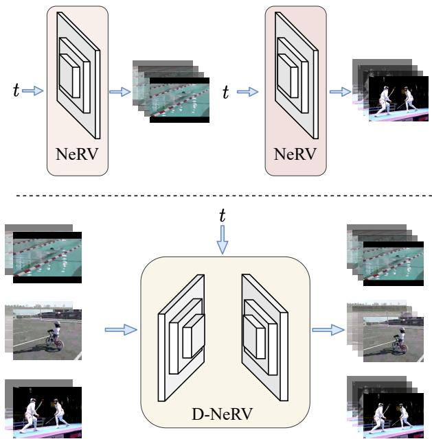
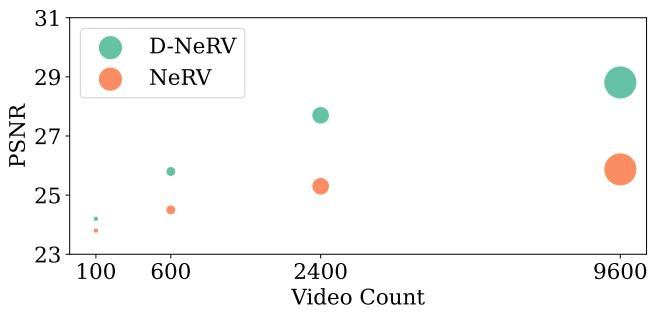
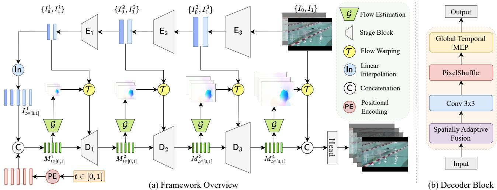
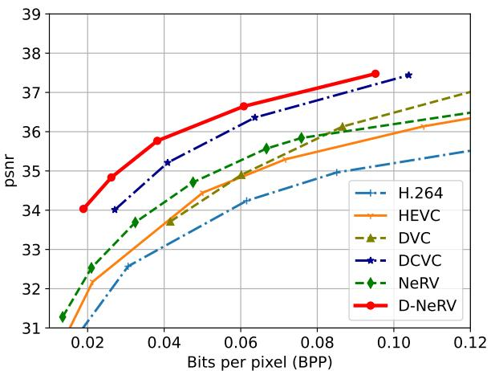
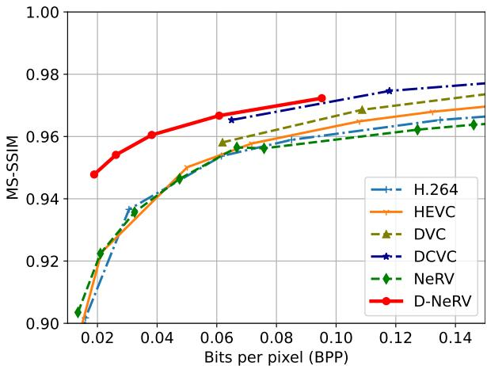
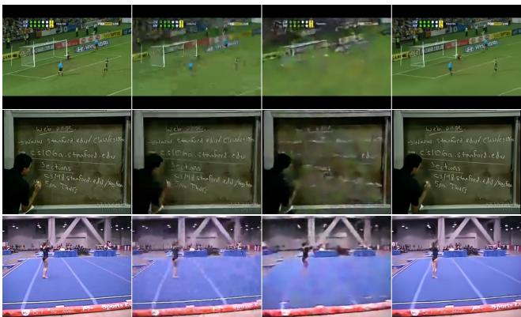
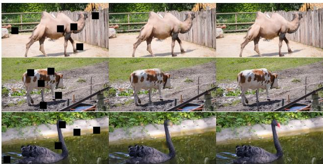

# Towards Scalable Neural Representation for Diverse Videos

Bo He1 Xitong Yang2 Hanyu Wang1 Zuxuan Wu3 Hao Chen1 Shuaiyi Huang1 Yixuan Ren1 Ser-Nam Lim2 Abhinav Shrivastava1

1University of Maryland, College Park 2Meta AI 3Fudan University

https://boheumd.github.io/D-NeRV/

## Abstract

Implicit neural representations (INR) have gained increasing attention in representing 3D scenes and images, and have been recently applied to encode videos (e.g., NeRV [1], E-NeRV [2]). While achieving promising results, existing INR-based methods are limited to encoding a handful of short videos (e.g., seven 5-second videos in the UVG dataset) with redundant visual content, leading to a model design that fits individual video frames independently and is not efficiently scalable to a large number ofdiverse videos. This paper focuses on developing neural representations for a more practical setup – encoding long and/or a large number of videos with diverse visual content. We first show that instead ofdividing videos into small subsets and encoding them with separate models, encoding long and diverse videos jointly with a unified model achieves better compression results. Based on this observation, we propose D-NeRV, a novel neural representationframework designed to encode diverse videos by (i) decoupling clip-specific visual content from motion information, (ii) introducing temporal reasoning into the implicit neural network, and (iii) employing the task-orientedflow as intermediate output to reduce spatial redundancies. Our new model largely surpasses NeRV and traditional video compression techniques on UCF101 and UVG datasets on the video compression task. Moreover, when used as an efficient data-loader, D-NeRV achieves 3%- 10% higher accuracy than NeRV on action recognition tasks on the UCF101 dataset under the same compression ratios.

## 1. Introduction

Implicit neural representations (INR) have achieved great success in parameterizing various signals, such as 3D scenes [3–5], images [6,7], audio [6], and videos [1,2,8–10]. The key idea is to represent signals as a function approximated by a neural network, mapping a reference coordinate to its corresponding signal value. Recently, INR has received increasing attention in image and video compression tasks [1, 2, 8, 11–15]. Compared with learning-based video compression techniques [16–18], INR-based methods (e.g., NeRV [1]) are more favorable due to simpler training pipelines and much faster video decoding speed.

  
Figure 1. Comparison of D-NeRV and NeRV when representing diverse videos. NeRV optimizes representation to every video independently while D-NeRV encodes all videos by a shared model.

While impressive progress has been made, existing INRbased methods are limited to encoding a single short video at a time. This prohibits the potential applications in most realworld scenarios, where we need to represent and compress a large number of diverse videos. A straightforward strategy for encoding diverse videos is to divide them into multiple subsets and model each of them by a separate neural network, as shown in Figure 1 (top). However, since this strategy is unable to leverage long-term redundancies across videos, it achieves inferior results compared to fitting all diverse videos with a single shared model. As shown in Figure 2, under the same compression ratio (bits per pixel), the performance of NeRV is consistently better when fitting a larger number of videos. This suggests that representing multiple videos by a single large model is generally more beneficial.

However, as observed empirically, the current design of NeRV offers diminishing returns when scaling to large and diverse videos. We argue that the current coupled design of content and motion information modeling exaggerates the difficulty of memorizing diverse videos. To address this, we propose D-NeRV, a novel implicit neural representation that is specifically designed to efficiently encode long or a large number of diverse videos1. A representative overview of differences between D-NeRV and NeRV is shown in Figure 1. When representing diverse videos, NeRV encodes each video into a separate model or simply concatenates multiple videos into a long video and encodes it, while our D-NeRV can represent different videos in a single model by conditioning on key-frames from each video clip.

Compared to NeRV, we have the following improvements. First, we observe that the visual content of each video often represents appearance, both background and foreground, which vary significantly among different videos, while the motion information often represents the semantic structure (e.g., similar motion for the same action class) and can be shared across different videos. Therefore, we decouple each video clip into two parts: clip-specific visual content and motion information, which are modeled separately in our method. Second, motivated by the vital importance of temporal modeling in video-related tasks, instead of outputting each frame independently, we introduce temporal reasoning into the INR-based network by explicitly modeling global temporal dependencies across different frames. Finally, considering the significant spatial redundancies in videos, rather than predicting the raw pixel values directly, we propose to predict the task-oriented flow [19–22] as an intermediate output, and use it in conjunction with the key-frames to get the final refined output. It alleviates the complexity of memorizing the same pixel value across different frames.

With these improvements, our D-NeRV significantly outperforms NeRV, especially when increasing the number of videos as shown in Figure 2. To summarize, our main contributions are as follows:

• We propose D-NeRV, a novel implicit neural representation model, to represent a large and diverse set of videos as a single neural network.

• We conduct extensive experiments on video reconstruction and video compression tasks. Our D-NeRV consistently outperforms state-of-the-art INR-based methods (E-NeRV [2]), traditional video compression approaches (H.264 [23], HEVC [24]), and the recent learning-based video compression methods (DCVC [18]).

  
Figure 2. Comparison of D-NeRV and NeRV with fixed compression ratio on UCF101. The size of circles indicates model sizes.

• We further show the advantage of D-NeRV on the action recognition task by its higher accuracy and faster decoding speed, and reveal its intriguing properties on the video inpainting task.

## 2. Related Work

Implicit neural representations. Neural networks can be used to approximate the functions which maps the input coordinates to various types of signals. It has brought great interest and has been widely adopted to represent 3D shape [5, 25], novel view synthesis [3, 4]. These approaches train a neural network to fit a single scene or object such that it is encoded by the network weights. Implicit neural representations have also been applied to represent images [6, 7, 11], videos [1, 12] and audios [6]. Among them, NeRV proposes the first image-wise implicit neural representation for videos, which takes the frame index and outputs the corresponding RGB frame. Compared to the pixel-wise implicit neural representation SIREN [6], NeRV shows superior efficiency, which improves the encoding and decoding speed greatly and achieves better video reconstruction quality. Based on NeRV, E-NeRV [2] boosts the video reconstruction performance via decomposing the image-wise implicit neural representation into separate spatial and temporal contexts. NRFF [12] and IPF [13] predict the motion compensation and residual between consecutive video frames to better reduce the spatial redundancies. CNeRV [8] proposes a hybrid video neural representation with content-adaptive embedding to further introduce internal generalization.

Video Compression. Video compression techniques can be divided into traditional video compression algorithms, such as MPEG [26], H.264 [23], HEVC [24] and deep learningbased compression approaches, such as DVC [16], LVC [27], HLVC [17], DCVC [18]. The learning-based compression approaches often use convolutional neural networks (CNN) to replace certain components while still following the traditional video compression pipeline. Recently, INR-based models have been adopted to compress image and video data. They encode images and videos into neural networks and apply general model compression techniques, which convert the image and video compression task to a standard model compression task. COIN [11] uses a vanilla pixelwise INR model to fit images and adopts weight quantization to do model compression. NeRV [1] applies model pruning, weight quantization, and entropy encoding to further reduce the model size.

  
Figure 3. (a) Frame Overview. D-NeRV takes in key-frame pairs of each video clip along with all the frame indices and outputs a whole video clip at a time. (b) The decoder block predicts the flow estimation to warp the visual content feature from the encoder, then fuses the visual content by the spatially-adaptive fusion module and finally models temporal relationship by the global temporal MLP module.

Among these INR-based methods, NeRV [1] is the first image-wise INR-based model specifically designed for videos. As is shown in Figure 1, NeRV takes in the time index t as input and outputs the corresponding frame directly, which can represent a video as a neural network. Specifically, NeRV consists of a positional encoding function, stacked NeRV blocks, and a prediction head. More details can be found in NeRV paper [1]. Although with such a simple architecture, NeRV shows promising results in the video com pression task. However, for large-scale and diverse videos, NeRV encodes each video into a separate model or simply concatenates them into one longer video. This design is not optimal when modeling such massive information into a neural network, which motivates us to design a more effective framework for diverse video encoding.

## 3. Method

To effectively represent diverse videos by a single model, we propose D-NeRV. Figure 3(a) illustrates the overview of D-NeRV framework. Given each video clip, we decouple the clip-specific visual content from the motion information and model each of them by two main components of our D-NeRV. Specifically, we introduce a visual content encoder to encode the clip-specific visual content from the sampled key-frames and a motion-aware decoder to output video frames. We elaborate on the details of the visual content encoder (Sec. 3.1), the motion-aware decoder (Sec. 3.2), and the training process (Sec. 3.3) in the following sections.

## 3.1. Visual Content Encoder

Different videos have various content information, e.g., the appearance and the background scene of each video vary greatly. The first component of D-NeRV is a visual content encoder E to capture clip-specific visual content. In contrast to existing works which memorize the content of diverse videos solely by the model itself [1, 2, 12, 13], we propose to provide the network with the visual content via sampled key-frames. Intuitively, we divide each video into consecutive clips. For each video clip, we sample the start and end key-frames $( I _ { 0 } , I _ { 1 } )$ , which are then fed into the content encoder E to extract visual content at multiple stages $\{ I _ { 0 } ^ { l } , I _ { 1 } ^ { l } \} _ { l = 1 } ^ { L } = \{ \mathsf { E } ( I _ { 0 } ) , \mathsf { E } ( I _ { 1 } ) \}$ (L is the total number of stages). These extracted features are clip-specific and highly representative of video content. Specifically, the content encoder E consists of stacked convolution layers and gradually down-samples the key-frames.

## 3.2. Motion-aware Decoder

Although different videos have distinctive appearances or backgrounds, videos of the same action type can share similar motion information. Motivated by this observation, we propose to model the motion information by a shared implicit neural network based decoder. With visual content from key-frames, the motion-aware decoder provides motion information to reconstruct the full video. While the standard implicit neural network only takes in the coordinates and outputs the corresponding signal values [1, 6, 11, 14], our motion-aware decoder takes in both the time coordinates and the content feature map. Then it predicts task-oriented flows as intermediate output, which are used to warp the generated content features. Besides that, we propose a spatiallyadaptive fusion module to fuse the content information into the decoder in a more effective manner. Finally, we equip the decoder with temporal modeling ability by the proposed global temporal MLP module.

Multi-scale Flow Estimation. The first component is the multi-scale flow estimation network used for predicting the task-oriented flow at each time step. At the first stage, given two content feature maps $I _ { 0 } ^ { 1 }$ and $I _ { 1 } ^ { 1 }$ from the encoder’s output, we apply linear interpolation along the time axis to generate the feature map at every intermediate time step $I _ { t } ^ { 1 } =$ Interpolat $\mathrm { i o n } ( I _ { 0 } ^ { 1 } , I _ { 1 } ^ { 1 } ) ( t )$ . Then, following NeRV [1], we map the input time index t by the positional encoding function PE into a higher dimensional embedding space, which is then concatenated with the feature map $I _ { t } ^ { 1 }$ before fed into the flow estimation module $\mathcal { G }$ at the first stage:

$$
M _ { t } ^ { 1 } = { \mathsf { C o n c a t } } ( I _ { t } ^ { 1 } , { \mathsf { P E } } ( t ) )\tag{1}
$$

Next, we compute the forward flow $F _ { t  0 }$ and backward flow $F _ { t  1 }$ at each time $t \in [ 0 , 1 ]$ simultaneously, where $F _ { t  0 }$ and $F _ { t  1 }$ represent the pixel displacement map from the current frame t to the start and end key-frames. For the later stages, the input of the flow estimation module is the feature map $M _ { t } ^ { l }$ generated from the previous decoder stage:

$$
F _ { t  0 } ^ { l } , F _ { t  1 } ^ { l } = \mathcal { G } ^ { l } ( M _ { t } ^ { l } ) , l \in \{ 1 , \cdots , L \}\tag{2}
$$

where $\mathcal { G }$ is a stack of convolutions which calculates the perpixel flow. In order to generate a high-quality content feature map for each timestep, we strategically propagate the visual content of key-frames $\{ I _ { 0 } ^ { l } , I _ { 1 } ^ { l } \}$ to the current frame index t under the guidance of our estimated flows $\{ F _ { t  0 } ^ { l } , F _ { t  1 } ^ { l } \}$ Concretely, we first generate the forward (resp. backward) warped feature map $\breve { \hat { I } } _ { t  0 } ^ { l }$ (resp. $\hat { I } _ { t  1 } ^ { l } )$ at time index t given the content features of key frame $I _ { 0 } ^ { l }$ (resp. $I _ { 1 } ^ { l } )$ with its corresponding flow $F _ { t  0 } ^ { l } ( F _ { t  1 } ^ { \bar { l } } )$ by a bilinear warp operation $\tau { : }$

$$
\hat { I } _ { t \left. 0 \right)} ^ { l } = \mathcal { T } \left( I _ { 0 } ^ { l } , F _ { t \right. 0 } ^ { l }  , \hat { I } _ { t \left. 1 \right)} ^ { l } = \mathcal { T } \left( I _ { 1 } ^ { l } , F _ { t \right. 1 } ^ { l }\tag{3}
$$

To fuse the forward and backward warped feature map in a reliable way, we devise a distance-aware confidence score to weighted sum the warped features and generate the fused warping feature $\hat { I } _ { t } ^ { l . }$

$$
\hat { I } _ { t } ^ { l } = ( 1 - t ) \cdot \hat { I } _ { t  0 } ^ { l } + t \cdot \hat { I } _ { t  1 } ^ { l }\tag{4}
$$

Spatially-adaptive Fusion (SAF). The warped feature map $\hat { I } _ { t } ^ { l } \in \mathbb { R } ^ { \mathbf { \overline { { { H } } } } ^ { l } \times W ^ { \hat { l } } \times C }$ contains the clip-specific content information for each timestep. We further introduce the second module of our motion-aware decoder, a spatially-adaptive fusion module to fuse the clip-specific content information. This is motivated by the recent success of modulation layers [28–30]. Specifically, we learn pixel-wise modulation parameters $\gamma _ { t } ^ { l } , \beta _ { t } ^ { l }$ by passing the content feature $\hat { I } _ { t } ^ { l }$ into two fully-connected layers:

$$
\gamma _ { t } ^ { l } = F C _ { 1 } ( \hat { I } _ { t } ^ { l } ) , \beta _ { t } ^ { l } = F C _ { 2 } ( \hat { I } _ { t } ^ { l } )\tag{5}
$$

where $\gamma _ { t } ^ { l } , \beta _ { t } ^ { l } \in \mathbb { R } ^ { H ^ { l } \times W ^ { l } \times 1 }$ . Then we fuse $M _ { t } ^ { l }$ as follows:

$$
J _ { t } ^ { l } = \gamma _ { t } ^ { l } M _ { t } ^ { l } + \beta _ { t } ^ { l }\tag{6}
$$

It introduces an additional inductive bias guided by the content feature $\hat { I } _ { t } ^ { l } .$ , which integrates two feature maps in a more effective way than simple concatenation. After the modulation operation, we adopt the same block architecture as NeRV [1], which consists of one convolution layer, a GELU [31] activation layer, and a PixelShuffle layer [32] to gradually upsample the feature map as below:

$$
O _ { t } ^ { l } = \mathsf { P i x e l s h u f f l e } \left( \mathsf { G E L U } ( \mathsf { C o n v } ( J _ { t } ^ { l } ) ) \right)\tag{7}
$$

Global Temporal MLP (GTMLP). Recall that NeRV takes the time index as input and outputs the corresponding frame directly without considering the rich intrinsic temporal correlations across frames. Inspired by the recent success of attention-based transformers [33, 34] and MLP-based models [35–38] in image and video recognition tasks, we introduce a global temporal MLP module to further exploit the temporal relationship of videos. Compared to transformers, MLP-based models are more lightweight and efficient, which only consist of highly optimized fully-connected lay ers. Motivated by this, we propose a global temporal MLP module to model the temporal relationship across different frames. Specifically, given the feature map of $T$ frames, $O ^ { l } \in \mathbb { R } ^ { C \times \mathbf { \bar { H } } \times W \times T }$ , the fully connected layer with weight $W ^ { l } \in \mathbb { R } ^ { C \times T \times T }$ is applied for each channel along the time axis to model the global temporal dependencies, which then adds with the original feature map $O ^ { l }$ in a residual manner.

$$
M ^ { l + 1 } = O ^ { l } + \mathrm { \ m a t m u 1 } ( O ^ { l } , W ^ { l } )\tag{8}
$$

Final Stage. To generate the final reconstructed frame $I _ { t } ^ { \prime }$ at time index $t ,$ we concatenate the decoder feature map $M _ { t } ^ { L }$ the warped frame $\hat { I } _ { t }$ as input, feeding it into a stack of two convolution layers for the final refinement.

## 3.3. Training

We adopt a combination of L1 and SSIM loss as [39] between the reconstructed frame $I _ { t } ^ { \prime }$ and the ground-truth frame $I _ { t }$ for optimization same as NeRV, without any explicit supervision on flow estimation.

$$
\mathcal { L } = \frac { 1 } { T } \sum _ { t } \Vert I _ { t } ^ { \prime } - I _ { t } \Vert _ { 1 } + \alpha \left( 1 - \mathrm { S S I M } ( I _ { t } ^ { \prime } , I _ { t } ) \right)\tag{9}
$$

During training, we feed consecutive video clips over the entire dataset in a mini-batch manner and encode the selected key-frames with existing image compression algorithms.

Once trained, each video clip can be reconstructed by feeding time indices and clip-specific key-frames into D-NeRV. Our decoupled model design and novel learning strategy open up possibilities for large-scale video training, which fundamentally differs from the existing INR-based work that either fits videos into separate models or requires concatenating all videos as input with one model.

## 4. Experiments

## 4.1. Setup

Datasets. We evaluate our model on one widely used video action recognition dataset UCF101 [40], one standard video compression dataset UVG [41] and DAVIS [42] dataset for the video inpainting task. UCF101 contains 13320 videos of 101 different action classes and has a large diversity of action types with the presence of large variations in video content. We extract all videos at 2 fps with 256×320 spatial resolution. We follow the first training/testing split. UVG consists of 7 videos and 3900 frames in total. To compare with other learning-based video compression methods [16, 18], we also crop the UVG videos to 1024x1920. We take 10 videos from DAVIS validation split and crop them to the spatial size of 384x768.

Evaluation Tasks. To understand the video representation capability of different INR-based methods, we compare with SOTA INR-based methods (NeRV [1], E-NeRV [2]) on the task of video reconstruction in Section 4.2. Next, as video compression is considered as the most promising downstream application of INR-based video representations, we also validate the effectiveness of our D-NeRV on the UVG and UCF101 datasets in Section 4.3. Furthermore, since our D-NeRV can represent large-scale and diverse videos in a single model, we naturally extend the application of our D-NeRV to use it as an efficient dataloader, and demonstrate its effectiveness on the downstream video understanding tasks [43–51] (e.g., action recognition) in Section 4.5. Finally, we show intriguing properties and advantages of D-NeRV on the video inpainting task in Section 4.6.

Implementation Details. In our ablation experiments, we train D-NeRV using the AdamW [52] optimizer. We use the cosine annealing learning rate schedule, the batch size of 32, the learning rate of 5e-4, training epochs of 800 and 400, and warmup epochs of 160 and 80 for UCF101 and UVG datasets, respectively. The key-frames for each video are sampled at stride 8 on both datasets. Following [18], we compress key-frames by using the image compression technique [53]. When comparing with other implicit neural representations such as NeRV and E-NeRV, we sum the compressed key-frame size and model size as the total size for D-NeRV, and keep the total size of D-NeRV equal to the model size of NeRV and E-NeRV for a fair comparison. The total sizes of different model variants (S/M/L) on the UCF101 dataset are 79.2/94.5/114.5 MB respectively. More dataset-specific training and testing details are available in the supplementary material.

## 4.2. Comparison with SOTA INRs

We compare our D-NeRV with NeRV [1] and E-NeRV [2] on the UVG dataset for the video reconstruction task (without any compression steps). E-NeRV is the state-of-theart INR-based video representation model. The results are shown in Table 1, our D-NeRV can consistently outperform NeRV and E-NeRV on different videos of the UVG dataset. We first note that E-NeRV surpasses NeRV by 0.9 dB PSNR with the same model size. As we mentioned before, encoding all the videos jointly with a shared model achieve better compression results (NeRV∗), which brings about a 0.6 dB performance boost than fitting each video along (NeRV). Despite that, our D-NeRV achieves the best performance among these methods. Specifically, it outperforms the previous state-of-the-art INR-based method E-NeRV by 3.4 dB for the averaged PSNR.

## 4.3. Video Compression

We further evaluate the effectiveness of D-NeRV on the video compression task. For video compression, we follow the same practice as NeRV for model quantization and entropy encoding but without model pruning to expedite the training process.

UCF101 Dataset. To demonstrate the effectiveness of D-NeRV in representing large-scale and diverse videos, in Table 2, we show the comparison results of D-NeRV with NeRV [1] and H.264 [23] on the UCF101 dataset. First, we observe that D-NeRV vastly outperforms the baseline model NeRV. Especially when changing the model size from small (S) to large (L), the gap between D-NeRV and NeRV becomes larger, increasing from 1.4 dB to 2.5 dB. It demonstrates that D-NeRV is more capable of compressing largescale videos with high quality than NeRV. Also, we can see that D-NeRV consistently surpasses traditional video compression techniques H.264, showing its great potential in real-world large-scale video compression.

UVG Dataset. Although D-NeRV is specifically designed for representing large-scale and diverse videos, which is not the case for the UVG dataset (7 videos), it can still consistently outperform NeRV greatly as shown in Figure 4. Specifically, it surpasses NeRV by more than 1.5 dB under the same BPP ratios. Despite that INR-based and learningbased methods are indeed two different frameworks, we still follow the NeRV paper to compare with learning-based video compression methods for completeness, such as DVC [16] and DCVC [18]. D-NeRV outperforms all of them in both PSNR and MS-SSIM metrics. It greatly reveals the effectiveness of our D-NeRV for the video compression task.

## 4.4. Ablation

Contribution of each component. In Table 3, we conduct an ablation study to investigate the contribution of each component of D-NeRV. First, we observe that adding the encoder with the spatially-adaptive fusion (SAF) can largely enhance the performance of the baseline model NeRV by

Table 1. Video reconstruction comparison between our D-NeRV, NeRV [1] and E-NeRV [2] on 7 videos from the UVG dataset. We keep the total size of D-NeRV including the key-frame size and model size to be the same as the model size of NeRV and E-NeRV for a fair comparison. We report the PSNR results for each video. NeRV and E-NeRV are trained in separate models for each video while NeRV∗ and D-NeRV fit multiple videos in a shared model.  
Table 2. Video compression results on the UCF-101 dataset.
<table><tr><td>Video</td><td>Beauty</td><td>Bosphorus</td><td>Bee</td><td>Jockey</td><td>SetGo</td><td>Shake</td><td>Yacht</td><td>avg.</td></tr><tr><td>NeRV</td><td>33.06</td><td>32.38</td><td>37.88</td><td>31.18</td><td>24.02</td><td>33.48</td><td>26.91</td><td>31.27</td></tr><tr><td>E-NeRV</td><td>33.07</td><td>33.52</td><td>39.36</td><td>30.88</td><td>25.19</td><td>34.6</td><td>28.21</td><td>32.12</td></tr><tr><td>NeRV*</td><td>32.71</td><td>33.36</td><td>36.74</td><td>32.16</td><td>26.93</td><td>32.69</td><td>28.48</td><td>31.87</td></tr><tr><td>D-NeRV</td><td>33.77</td><td>38.66</td><td>37.97</td><td>35.51</td><td>33.93</td><td>35.04</td><td>33.73</td><td>35.52</td></tr></table>

<table><tr><td>Method</td><td>PSNR</td><td>MS-SSIM</td></tr><tr><td>H.264-S</td><td>26.29</td><td>0.903</td></tr><tr><td>NeRV-S</td><td>26.79</td><td>0.910</td></tr><tr><td>D-NeRV-S</td><td>28.15</td><td>0.916</td></tr><tr><td>H.264-M</td><td>27.42</td><td>0.925</td></tr><tr><td>NeRV-M</td><td>27.35</td><td>0.921</td></tr><tr><td>D-NeRV-M</td><td>29.18</td><td>0.937</td></tr><tr><td>H.264-L</td><td>28.54</td><td>0.941</td></tr><tr><td>NeRV-L</td><td>27.57</td><td>0.928</td></tr><tr><td>D-NeRV-L</td><td>30.06</td><td>0.951</td></tr></table>

  
(a) PSNR vs. BPP

  
(b) MS-SSIM vs. BPP  
Figure 4. Rate distortion plots on the UVG dataset.

1.7 and 2.8 dB on UVG and UCF101 datasets respectively. With the clip-specific visual content fed into the network, it greatly reduces the complexity of memorization for diverse videos. Second, adding the global temporal MLP module (GTMLP) can further improve performance. It is interesting to note that simply adding the global temporal MLP module on NeRV can not facilitate the final result. This is because when representing multiple videos, NeRV concatenates all the videos along the time axis. The input of NeRV is the absolute time index normalized by the length of the concatenated video, which can not reflect motion between relative frames. On the contrary, the input for D-NeRV is the relative time index normalized by each video’s length, it can represent the motion across frames which are shared across different videos. Therefore, adding the global temporal MLP module with the relative time index can help model the motion information between frames. Please note that simply using the relative time index alone is not feasible, which needs to be conditioned on the sampled key-frames to represent different videos. Finally, to further reduce the inherent spatial redundancies across video frames, we add the task-oriented flow as an intermediate output, which can boost the final results to another level by 0.67 dB and 0.5 dB on UVG and UCF101 datasets respectively.

Component design choices ablation. Table 4 demonstrates the results of different temporal modeling designs. Compared to the baseline, incorporating the local temporal relationship by adding depth-wise temporal convolution can slightly improve the performances and the gap becomes larger while increasing the kernel size from 3 to 11, which validates the importance of temporal modeling for effective video representation. Inspired by the success of Transformer [54], we also try to add a temporal attention module. Different from convolution operation with the local receptive field, the temporal attention module can model global temporal dependencies, which achieves higher results than depth-wise convolutions. However, due to the heavy computation cost of the attention operation, the training speed of the attention module is much slower than other variants. Finally, motivated by the success of MLP-based models [35–38], our global temporal MLP module combines the efficiency from fully-connected layer and the global temporal modeling ability from the attention module. It attains the highest results with a much faster training speed than the attention module.

Table 3. Contribution of each component. SAF, GTMLP, Flow denote spatially-adaptive fusion, global temporal MLP, and multi-scale flow estimation, respectively.
<table><tr><td rowspan="2">Model</td><td colspan="2">UVG</td><td colspan="2">UCF101</td></tr><tr><td>PSNR</td><td>MS-SSIM</td><td>PSNR</td><td>MS-SSIM</td></tr><tr><td>NeRV</td><td>34.13</td><td>0.948</td><td>28.00</td><td>0.935</td></tr><tr><td>+ GTMLP</td><td>33.94</td><td>0.946</td><td>27.96</td><td>0.935</td></tr><tr><td>+ SAF</td><td>35.84</td><td>0.960</td><td>30.78</td><td>0.962</td></tr><tr><td>+ GTMLP</td><td>36.32</td><td>0.963</td><td>30.94</td><td>0.964</td></tr><tr><td>+ Flow</td><td>36.99</td><td>0.977</td><td>31.44</td><td>0.968</td></tr></table>

Table 4. Temporal modeling ablation. “DWConv" indicates the depth-wise temporal conv.  
Table 5. Fusion methods ablation.
<table><tr><td>Model</td><td>PSNR</td><td>MS-SSIM</td></tr><tr><td>Baseline</td><td>31.10</td><td>0.964</td></tr><tr><td>DWConv-k3</td><td>31.13</td><td>0.965</td></tr><tr><td>DWConv-k7</td><td>31.15</td><td>0.966</td></tr><tr><td>DWConv-k11</td><td>31.16</td><td>0.966</td></tr><tr><td>Attention</td><td>31.34</td><td>0.967</td></tr><tr><td>GTMLP</td><td>31.44</td><td>0.968</td></tr></table>

<table><tr><td></td><td>PSNR</td><td>MS-SSIM</td></tr><tr><td>U-Net</td><td>30.09</td><td>0.954</td></tr><tr><td>SAF</td><td>31.44</td><td>0.968</td></tr></table>

Table 6. Impact of multi-scale.
<table><tr><td>MS</td><td>PSNR</td><td>MS-SSIM</td></tr><tr><td>√</td><td>31.06 31.44</td><td>0.965 0.968</td></tr></table>

Table 9. Model runtime comparison (video per second).

Table 7. Video diversity ablation. We fix the total video count at 1000 while changing the number of action classes.  
Table 8. Top-1 action recognition accuracy on UCF101. Models are trained on compressed videos and tested on uncompressed videos (“Train” setting) and vice versa (“Test” setting). S/M/L denote different compression ratios.
<table><tr><td></td><td>#Class</td><td>PSNR MS-SSIM</td></tr><tr><td rowspan="3">10 NeRV 100 ∇</td><td>27.95</td><td>0.935</td></tr><tr><td>26.66</td><td>0.915</td></tr><tr><td>-1.29</td><td>-0.02</td></tr><tr><td rowspan="3">D-NeRV</td><td>10</td><td>29.74</td><td>0.950</td></tr><tr><td>100</td><td>29.36</td><td>0.946</td></tr><tr><td>∇</td><td>-0.38</td><td>-0.004</td></tr></table>

<table><tr><td rowspan="2">Model</td><td colspan="3">Train</td><td colspan="3">Test</td></tr><tr><td>S</td><td>M</td><td>L</td><td>S</td><td>M</td><td>L</td></tr><tr><td>GT</td><td>91.3</td><td>91.3</td><td>91.3</td><td>91.3</td><td>91.3</td><td>91.3</td></tr><tr><td>H.264</td><td>86.7</td><td>87.9</td><td>88.9</td><td>77.2</td><td>82.4</td><td>85.5</td></tr><tr><td>NeRV</td><td>84.5</td><td>85.8</td><td>86.9</td><td>71.9</td><td>75.9</td><td>80.0</td></tr><tr><td>D-NeRV</td><td>87.9</td><td>89.0</td><td>90.0</td><td>81.1</td><td>84.4</td><td>86.4</td></tr></table>

<table><tr><td>Method</td><td>VPS ↑</td></tr><tr><td>Frame (Tab. 8 GT)</td><td>273</td></tr><tr><td>H.264 DCVC</td><td>265</td></tr><tr><td>NeRV (fp32)</td><td>0.9</td></tr><tr><td>D-NeRV (fp32)</td><td>383 266</td></tr><tr><td>NeRV (fp16)</td><td>454</td></tr><tr><td></td><td></td></tr><tr><td>D-NeRV (fp16)</td><td>363</td></tr></table>

We also compare different fusion strategies to fuse the content information from encoder to decoder in Table 5. While U-Net [55] concatenates the output feature map of each encoder stage to the input of the decoder, the proposed SAF module utilizes the content feature map as a modulation for decoder features, which proves to be a more effective design than simple concatenation. In addition, Table 6 shows that the multi-scale design can enhance the final performances.

Impact of video diversity. To analyze the impact of video diversity, we conduct experiments with the following settings: (i) 1000 videos selected from 10 classes where each class has 100 videos; (ii) 1000 videos selected from 100 classes where each class has 10 videos. The results are shown in Table 7. When increasing the video diversity from 10 classes to 100 classes, although the performances of D-NeRV and NeRV both decrease, the results of D-NeRV drop much slower than NeRV. It verifies that D-NeRV is more effective especially when representing diverse videos.

## 4.5. Action Recognition

As D-NeRV can effectively represent large and diverse videos, a natural extension of its application could be treating it as an efficient video dataloader, considering it can greatly reduce the video loading time due to the INR-based model design. In this section, to validate the above assumption, we perform experiments on the action recognition task.

Action recognition accuracy. In our experiment, we adopt the widely used TSM [43] as the backbone to evaluate the action recognition accuracy of compressed videos from H.264, NeRV, and D-NeRV. Specifically, we follow two settings below: i) “Train”: models are trained on compressed videos and tested on uncompressed ground-truth videos. ii) “Test”: models are trained on uncompressed ground-truth videos and tested on compressed videos. S/M/L denotes different BPP values as Table 2. The lower BPP value means a higher compression ratio. The results are shown in Table 8. We can see that, the action recognition accuracy of D-NeRV consistently outperforms NeRV by 3-4% and 6-10% for the “train” and “test” settings, respectively. In addition, D-NeRV consistently outperforms H.264, which proves the superior advantage of D-NeRV when used as an efficient dataloader in the real-world scenario.

Model runtime. In Table 9, we compare the model runtime of the following settings: (i) Frame: reading from pre-extracted uncompressed ground-truth frames directly; (ii) H.264: reading and decoding from the H.264 compressed videos; (iii) DCVC: recent learning-based video compression method; (iv) NeRV and (iv) D-NeRV. The experiments are conducted on a single node with 8 RTX 2080ti GPU and 32-core CPU. Although reading from uncompressed groundtruth frames can preserve the highest quality of video and achieve higher accuracy for downstream tasks, it has a much higher storage cost because it reads from uncompressed frames. On the contrary, directly reading from compressed videos (e.g., H.264) can save the storage cost while achieving a similar speed because of the highly optimized video decoding techniques. The model runtime speed of NeRV and D-NeRV shows a great advantage over the learning-based compression method DCVC. Due to its auto-regressive decoding design, DCVC has achieved a much slower model runtime speed than D-NeRV and NeRV. Note that although NeRV has the highest model runtime speed due to the simplicity of its architecture, its compression quality is much inferior to the D-NeRV as shown in Table 2 and Table 8.

Table 10. Video inpainting comparison between our D-NeRV and NeRV. NeRV∗ and D-NeRV fit all the videos in a shared model. PSNR results of the mask areas are reported here.
<table><tr><td>Video</td><td>bike</td><td>b-swan</td><td>bmx</td><td>b-dance</td><td>camel</td><td>c-round</td><td>c-shadow</td><td>cowS</td><td>dance-twirl</td><td>dog</td><td>avg.</td></tr><tr><td>NeRV</td><td>19.00</td><td>21.10</td><td>18.26</td><td>18.50</td><td>18.59</td><td>16.78</td><td>19.66</td><td>18.25</td><td>17.97</td><td>21.79</td><td>18.99</td></tr><tr><td>NeRV*</td><td>20.45</td><td>21.86</td><td>19.96</td><td>19.69</td><td>20.15</td><td>18.23</td><td>20.83</td><td>18.75</td><td>18.92</td><td>22.20</td><td>19.88</td></tr><tr><td>D-NeRV</td><td>23.53</td><td>22.27</td><td>19.50</td><td>21.85</td><td>22.89</td><td>18.9</td><td>21.06</td><td>22.27</td><td>19.08</td><td>22.01</td><td>21.3</td></tr></table>

## 4.6. Video Inpainting

We further explore the potential ability of D-NeRV on the video inpainting task with NeRV. We apply 5 random box masks with a width of 50 for each frame. The results are shown in Table 10. Although we do not have any specific design for the video inpainting task, our D-NeRV can still outperform NeRV by 1.4 dB for the PSNR results. Also, it is interesting to see that encoding all videos in a shared model can also improve the inpainting performance (NeRV v.s. NeRV∗), which further validates our previous claim of encoding all videos in a shared model is more beneficial.

## 4.7. Qualitative Results

In Figure 5, we compare the visualization results of the decoded frames for the compression task. At the same BPP budget, D-NeRV produces clearer images with higher quality in both the main objects and the background compared to the classic video compression method (H.264) and baselines (NeRV), such as the court, blackboard, and stadium. Figure 6 shows the visualization results for the video inpainting task. Compared to NeRV, our D-NeRV can inpaint the mask area more naturally with better quality. More qualitative results are shown in the supplementary material.

## 5. Conclusion

In this paper, we present a novel implicit neural network based framework to represent large-scale and diverse videos. We decouple videos into clip-specific visual content and motion information, and then model them separately, which proves to be more effective than modeling them jointly as previous work NeRV does. Because it alleviates the difficulty of memorizing diverse videos. We also introduce temporal reasoning into the implicit neural network to exploit the temporal relationships across frames. We further validate our design on multiple datasets and different tasks (e.g., video reconstruction, video compression, action recognition, and video inpainting). Our method provides new insight into representing videos in a scalable manner, which makes it one step closer to real-world applications.

  
(a) Ground Truth  
(b) H.264-S  
(c) NeRV-S  
(d) D-NeRV-S

Figure 5. Visualization of ground-truth, H.264, NeRV and D-NeRV on the UCF101 dataset. Please zoom in to view the details.  
  
(a) Ground Truth  
(b) NeRV  
(c) D-NeRV  
Figure 6. Video inpainting visualization on the DAVIS dataset.

Acknowledgements. This project was partially funded an independent grant from Facebook AI.

## References

[1] Hao Chen, Bo He, Hanyu Wang, Yixuan Ren, Ser Nam Lim, and Abhinav Shrivastava. Nerv: Neural representations for videos. Advances in Neural Information Processing Systems, 34, 2021. 1, 2, 3, 4, 5, 6

[2] Zizhang Li, Mengmeng Wang, Huaijin Pi, Kechun Xu, Jianbiao Mei, and Yong Liu. E-nerv: Expedite neural video representation with disentangled spatial-temporal context. In European Conference on Computer Vision, pages 267–284. Springer, 2022. 1, 2, 3, 5, 6

[3] Ben Mildenhall, Pratul P Srinivasan, Matthew Tancik, Jonathan T Barron, Ravi Ramamoorthi, and Ren Ng. Nerf: Representing scenes as neural radiance fields for view synthesis. In European conference on computer vision, pages 405–421. Springer, 2020. 1, 2

[4] Alex Yu, Vickie Ye, Matthew Tancik, and Angjoo Kanazawa. pixelnerf: Neural radiance fields from one or few images. In Proceedings of the IEEE/CVF Conference on Computer Vision and Pattern Recognition, pages 4578–4587, 2021. 1, 2

[5] Vincent Sitzmann, Michael Zollhöfer, and Gordon Wetzstein. Scene representation networks: Continuous 3d-structureaware neural scene representations. Advances in Neural Information Processing Systems, 32, 2019. 1, 2

[6] Vincent Sitzmann, Julien Martel, Alexander Bergman, David Lindell, and Gordon Wetzstein. Implicit neural representations with periodic activation functions. Advances in Neural Information Processing Systems, 33:7462–7473, 2020. 1, 2, 3

[7] Yinbo Chen, Sifei Liu, and Xiaolong Wang. Learning continuous image representation with local implicit image function. In Proceedings of the IEEE/CVF Conference on Computer Vision and Pattern Recognition, pages 8628–8638, 2021. 1, 2

[8] Hao Chen, Matt Gwilliam, Bo He, Ser-Nam Lim, and Abhinav Shrivastava. Cnerv: Content-adaptive neural representation for visual data. British Machine Vision Conference (BMVC), 2022. 1, 2

[9] Shishira R Maiya, Sharath Girish, Max Ehrlich, Hanyu Wang, Kwot Sin Lee, Patrick Poirson, Pengxiang Wu, Chen Wang, and Abhinav Shrivastava. Nirvana: Neural implicit representations of videos with adaptive networks and autoregressive patch-wise modeling. In Proceedings of the IEEE/CVF Conference on Computer Vision and Pattern Recognition, 2023. 1

[10] Hao Chen, Matthew Gwilliam, Ser-Nam Lim, and Abhinav Shrivastava. Hnerv: A hybrid neural representation for videos. In Proceedings of the IEEE/CVF Conference on Computer Vision and Pattern Recognition, 2023. 1

[11] Emilien Dupont, Adam Golinski, Milad Alizadeh, Yee Whye´ Teh, and Arnaud Doucet. Coin: Compression with implicit neural representations. arXiv preprint arXiv:2103.03123, 2021. 1, 2, 3

[12] Daniel Rho, Junwoo Cho, Jong Hwan Ko, and Eunbyung Park. Neural residual flow fields for efficient video representations. In Proceedings of the Asian Conference on Computer Vision, pages 3447–3463, 2022. 1, 2, 3

[13] Yunfan Zhang, Ties van Rozendaal, Johann Brehmer, Markus Nagel, and Taco Cohen. Implicit neural video compression. arXiv preprint arXiv:2112.11312, 2021. 1, 2, 3

[14] Emilien Dupont, Hrushikesh Loya, Milad Alizadeh, Adam Golinski, Yee Whye Teh, and Arnaud Doucet. Coin++:´ Data agnostic neural compression. arXiv preprint arXiv:2201.12904, 2022. 1, 3

[15] Yannick Strümpler, Janis Postels, Ren Yang, Luc Van Gool, and Federico Tombari. Implicit neural representations for image compression. arXiv preprint arXiv:2112.04267, 2021. 1

[16] Guo Lu, Wanli Ouyang, Dong Xu, Xiaoyun Zhang, Chunlei Cai, and Zhiyong Gao. Dvc: An end-to-end deep video compression framework. In Proceedings of the IEEE/CVF Conference on Computer Vision and Pattern Recognition, pages 11006–11015, 2019. 1, 2, 5

[17] Ren Yang, Fabian Mentzer, Luc Van Gool, and Radu Timofte. Learning for video compression with hierarchical quality and recurrent enhancement. In Proceedings of the IEEE/CVF Conference on Computer Vision and Pattern Recognition, pages 6628–6637, 2020. 1, 2

[18] Jiahao Li, Bin Li, and Yan Lu. Deep contextual video compression. Advances in Neural Information Processing Systems, 34, 2021. 1, 2, 5

[19] Tianfan Xue, Baian Chen, Jiajun Wu, Donglai Wei, and William T Freeman. Video enhancement with task-oriented flow. International Journal ofComputer Vision, 127(8):1106– 1125, 2019. 2

[20] Fitsum Reda, Janne Kontkanen, Eric Tabellion, Deqing Sun, Caroline Pantofaru, and Brian Curless. Film: Frame interpolation for large motion. arXiv preprint arXiv:2202.04901, 2022. 2

[21] Shuaiyi Huang, Qiuyue Wang, Songyang Zhang, Shipeng Yan, and Xuming He. Dynamic context correspondence network for semantic alignment. In Proceedings of the IEEE/CVF International Conference on Computer Vision, pages 2010–2019, 2019. 2

[22] Shuaiyi Huang, Luyu Yang, Bo He, Songyang Zhang, Xuming He, and Abhinav Shrivastava. Learning semantic correspondence with sparse annotations. In Computer Vision– ECCV 2022: 17th European Conference, Tel Aviv, Israel, October 23–27, 2022, Proceedings, Part XIV, pages 267–284. Springer, 2022. 2

[23] Thomas Wiegand, Gary J Sullivan, Gisle Bjontegaard, and Ajay Luthra. Overview of the h. 264/avc video coding standard. IEEE Transactions on circuits and systems for video technology, 13(7):560–576, 2003. 2, 5

[24] Gary J Sullivan, Jens-Rainer Ohm, Woo-Jin Han, and Thomas Wiegand. Overview of the high efficiency video coding (hevc) standard. IEEE Transactions on circuits and systemsfor video technology, 22(12):1649–1668, 2012. 2

[25] Lars Mescheder, Michael Oechsle, Michael Niemeyer, Sebastian Nowozin, and Andreas Geiger. Occupancy networks: Learning 3d reconstruction in function space. In Proceedings

of the IEEE/CVF Conference on Computer Vision and Pattern Recognition, pages 4460–4470, 2019. 2

[26] Didier Le Gall. Mpeg: A video compression standard for multimedia applications. Communications ofthe ACM, 34(4):46– 58, 1991. 2

[27] Oren Rippel, Sanjay Nair, Carissa Lew, Steve Branson, Alexander G Anderson, and Lubomir Bourdev. Learned video compression. In Proceedings ofthe IEEE/CVF International Conference on Computer Vision, pages 3454–3463, 2019. 2

[28] Taesung Park, Ming-Yu Liu, Ting-Chun Wang, and Jun-Yan Zhu. Semantic image synthesis with spatially-adaptive normalization. In Proceedings of the IEEE/CVF conference on computer vision and pattern recognition, pages 2337–2346, 2019. 4

[29] Xun Huang and Serge Belongie. Arbitrary style transfer in real-time with adaptive instance normalization. In Proceedings of the IEEE international conference on computer vision, pages 1501–1510, 2017. 4

[30] Tero Karras, Samuli Laine, and Timo Aila. A style-based generator architecture for generative adversarial networks. In Proceedings ofthe IEEE/CVF conference on computer vision and pattern recognition, pages 4401–4410, 2019. 4

[31] Dan Hendrycks and Kevin Gimpel. Gaussian error linear units (gelus). arXiv preprint arXiv:1606.08415, 2016. 4

[32] Wenzhe Shi, Jose Caballero, Ferenc Huszár, Johannes Totz, Andrew P Aitken, Rob Bishop, Daniel Rueckert, and Zehan Wang. Real-time single image and video super-resolution using an efficient sub-pixel convolutional neural network. In Proceedings of the IEEE conference on computer vision and pattern recognition, pages 1874–1883, 2016. 4

[33] Gedas Bertasius, Heng Wang, and Lorenzo Torresani. Is space-time attention all you need for video understanding. arXiv preprint arXiv:2102.05095, 2(3):4, 2021. 4

[34] Haoqi Fan, Bo Xiong, Karttikeya Mangalam, Yanghao Li, Zhicheng Yan, Jitendra Malik, and Christoph Feichtenhofer. Multiscale vision transformers. In Proceedings of the IEEE/CVF International Conference on Computer Vision, pages 6824–6835, 2021. 4

[35] Ilya O Tolstikhin, Neil Houlsby, Alexander Kolesnikov, Lucas Beyer, Xiaohua Zhai, Thomas Unterthiner, Jessica Yung, Andreas Steiner, Daniel Keysers, Jakob Uszkoreit, et al. Mlpmixer: An all-mlp architecture for vision. Advances in Neural Information Processing Systems, 34, 2021. 4, 6

[36] Hugo Touvron, Piotr Bojanowski, Mathilde Caron, Matthieu Cord, Alaaeldin El-Nouby, Edouard Grave, Gautier Izacard, Armand Joulin, Gabriel Synnaeve, Jakob Verbeek, et al. Resmlp: Feedforward networks for image classification with data-efficient training. arXiv preprint arXiv:2105.03404, 2021. 4, 6

[37] Bo He, Xitong Yang, Zuxuan Wu, Hao Chen, Ser-Nam Lim, and Abhinav Shrivastava. Gta: Global temporal attention for video action understanding. British Machine Vision Conference (BMVC), 2021. 4, 6

[38] Dongze Lian, Zehao Yu, Xing Sun, and Shenghua Gao. Asmlp: An axial shifted mlp architecture for vision. arXiv preprint arXiv:2107.08391, 2021. 4, 6

[39] Zhou Wang, Eero P Simoncelli, and Alan C Bovik. Multiscale structural similarity for image quality assessment. In The Thrity-Seventh Asilomar Conference on Signals, Systems & Computers, 2003, volume 2, pages 1398–1402. Ieee, 2003. 4

[40] Khurram Soomro, Amir Roshan Zamir, and Mubarak Shah. Ucf101: A dataset of 101 human actions classes from videos in the wild. arXiv preprint arXiv:1212.0402, 2012. 5

[41] Alexandre Mercat, Marko Viitanen, and Jarno Vanne. Uvg dataset: 50/120fps 4k sequences for video codec analysis and development. In Proceedings of the 11th ACM Multimedia Systems Conference, pages 297–302, 2020. 5

[42] Federico Perazzi, Jordi Pont-Tuset, Brian McWilliams, Luc Van Gool, Markus Gross, and Alexander Sorkine-Hornung. A benchmark dataset and evaluation methodology for video object segmentation. In Proceedings ofthe IEEE conference on computer vision and pattern recognition, pages 724–732, 2016. 5

[43] Ji Lin, Chuang Gan, and Song Han. Tsm: Temporal shift module for efficient video understanding. In Proceedings of the IEEE/CVF International Conference on Computer Vision, pages 7083–7093, 2019. 5, 7

[44] Christoph Feichtenhofer, Haoqi Fan, Jitendra Malik, and Kaiming He. Slowfast networks for video recognition. In Proceedings of the IEEE/CVF international conference on computer vision, pages 6202–6211, 2019. 5

[45] Xitong Yang, Haoqi Fan, Lorenzo Torresani, Larry S Davis, and Heng Wang. Beyond short clips: End-to-end video-level learning with collaborative memories. In Proceedings of the IEEE/CVF Conference on Computer Vision and Pattern Recognition, pages 7567–7576, 2021. 5

[46] Hengduo Li, Zuxuan Wu, Abhinav Shrivastava, and Larry S Davis. 2d or not 2d? adaptive 3d convolution selection for efficient video recognition. In Proceedings of the IEEE/CVF conference on computer vision and pattern recognition, pages 6155–6164, 2021. 5

[47] Nirat Saini, Bo He, Gaurav Shrivastava, Sai Saketh Rambhatla, and Abhinav Shrivastava. Recognizing actions using object states. In ICLR2022 Workshop on the Elements of Reasoning: Objects, Structure and Causality, 2022. 5

[48] Bo He, Xitong Yang, Le Kang, Zhiyu Cheng, Xin Zhou, and Abhinav Shrivastava. Asm-loc: action-aware segment modeling for weakly-supervised temporal action localization. In Proceedings of the IEEE/CVF Conference on Computer Vision and Pattern Recognition, pages 13925–13935, 2022. 5

[49] Junke Wang, Xitong Yang, Hengduo Li, Li Liu, Zuxuan Wu, and Yu-Gang Jiang. Efficient video transformers with spatialtemporal token selection. In Computer Vision–ECCV 2022: 17th European Conference, Tel Aviv, Israel, October 23–27, 2022, Proceedings, Part XXXV, pages 69–86. Springer, 2022. 5

[50] Rui Wang, Dongdong Chen, Zuxuan Wu, Yinpeng Chen, Xiyang Dai, Mengchen Liu, Yu-Gang Jiang, Luowei Zhou, and Lu Yuan. Bevt: Bert pretraining of video transformers. In Proceedings of the IEEE/CVF Conference on Computer Vision and Pattern Recognition, pages 14733–14743, 2022. 5

[51] Bo He, Jun Wang, Jielin Qiu, Trung Bui, Abhinav Shrivastava, and Zhaowen Wang. Align and attend: Multimodal summarization with dual contrastive losses. In Proceedings of the IEEE/CVF Conference on Computer Vision and Pattern Recognition (CVPR), 2023. 5

[52] Ilya Loshchilov and Frank Hutter. Decoupled weight decay regularization. arXiv preprint arXiv:1711.05101, 2017. 5

[53] Zhengxue Cheng, Heming Sun, Masaru Takeuchi, and Jiro Katto. Learned image compression with discretized gaussian mixture likelihoods and attention modules. In Proceedings of the IEEE/CVF Conference on Computer Vision and Pattern Recognition, pages 7939–7948, 2020. 5

[54] Ashish Vaswani, Noam Shazeer, Niki Parmar, Jakob Uszkoreit, Llion Jones, Aidan N Gomez, Łukasz Kaiser, and Illia Polosukhin. Attention is all you need. Advances in neural information processing systems, 30, 2017. 6

[55] Olaf Ronneberger, Philipp Fischer, and Thomas Brox. U-net: Convolutional networks for biomedical image segmentation. In International Conference on Medical image computing and computer-assisted intervention, pages 234–241. Springer, 2015. 7