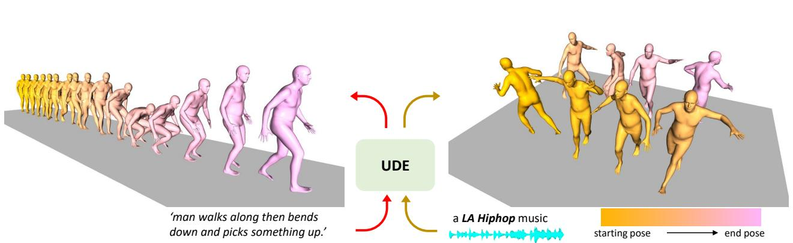
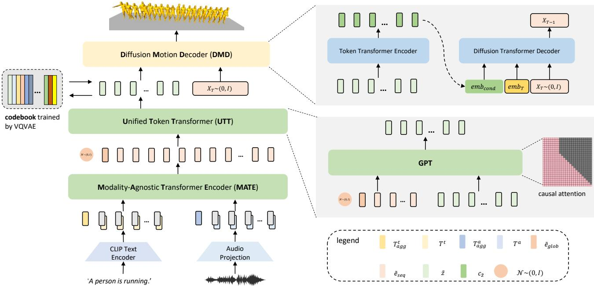
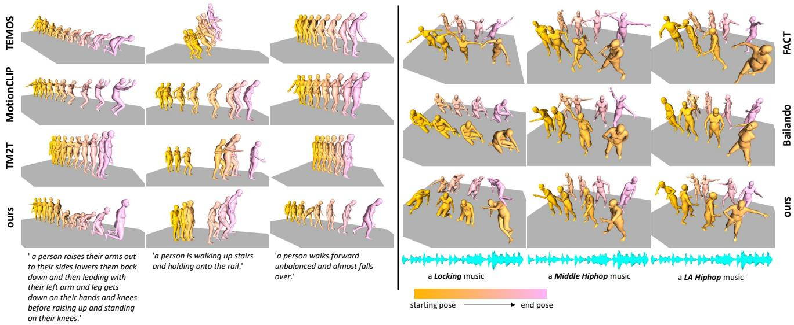
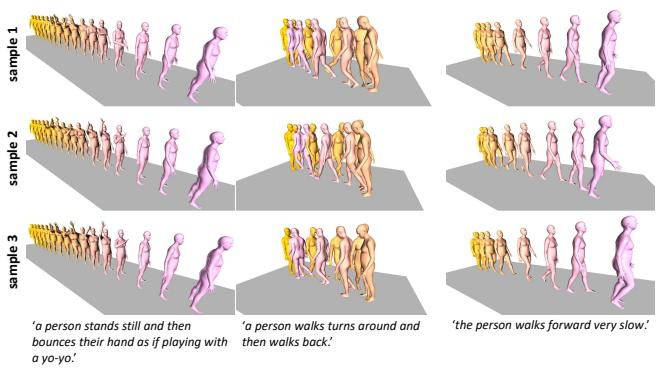
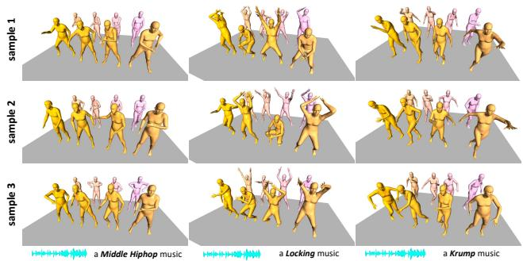

# UDE: A Unified Driving Engine for Human Motion Generation

Zixiang Zhou zhouzixiang@xiaobing.ai

Baoyuan Wang wangbaoyuan@xiaobing.ai

  
Figure 1. Our shared Unified Driving Engine (UDE) can support both text-driven and audio-driven human motion generation. Left shows an example of a motion sequence driven by a text description while Right shows an example driven by a LA Hiphop music clip.

## Abstract

Generating controllable and editable human motion sequences is a key challenge in 3D Avatar generation. It has been labor-intensive to generate and animate human motion for a long time until learning-based approaches have been developed and applied recently. However, these approaches are still task-specific or modality-specific [1] [6] [5] [18]. In this paper, we propose “UDE”, the first unified driving engine that enables generating human motion sequences from natural language or audio sequences (see Fig. 1). Specifically, UDE consists of the following key components: 1) a motion quantization module based on VQVAE that represents continuous motion sequence as discrete latent code [33], 2) a modality-agnostic transformer encoder [34] that learns to map modality-aware driving signals to a joint space, and 3) a unified token transformer (GPT-like [24]) network to predict the quantized latent code index in an auto-regressive manner. 4) a diffusion motion decoder that takes as input the motion tokens and decodes them into motion sequences with high diversity. We evaluate our method on HumanML3D [8] and AIST+ [19] benchmarks, and the experiment results demonstrate our method achieves state-of-the-art performance. Project website: https://zixiangzhou916.github.io/UDE/

## 1. Introduction

Synthesizing realistic human motion sequences has been a pilar component in many real-world applications. It is labor-intensive and tedious, and requires professional skills to achieve the creation of one single piece of motion sequence synthesis, making it hard to be democratized for broad content generations. Recently, the emergence of motion capture and pose estimation [15] [38] [27] [36] have made it possible to synthesize human motion sequences from VTubers or source videos thanks to the advances of deep learning. Although these approaches have simplified the creation of motion sequences, actors or highly correlated videos are still necessary, thus limiting the scalability as well as the controllability.

The development of multi-modal machine learning paves a new way to human motion synthesis [1] [6] [8] [12] [17] [2]. For example, natural language descriptions could be used to drive human motion sequences directly [1] [6] [8]. The language description is a straightforward representation for human users to control the synthesis. It provides a semantic clue of what the synthesized motion sequence should look like, and the editing could be conducted by simply changing the language description. Language, however, does not cover the full domain of human motion sequences. In terms of dancing motion synthesis, for example, the natural language is not sufficient to describe the dance rhythm.

For such scenarios, audio sequences are used as guidance to help motion synthesis, so the synthesized motion could match the music beat rhythmically and choreography style. However, these approaches are studied separately in prior works. In many real-world applications, the characters are likely to perform a complex motion sequence composed of both rhythmic dances from music and certain actions described by language, and smooth transition between mixed modality inputs becomes vital important. As a result, multimodal motion consistency would become an urgent issue to solve if employed siloed modality-specific models.

To address above mentioned problems, in this work, we propose a Unified Driving Engine (UDE) which unifies the human motion generation driven by natural language and music clip in one shared model. Our model consists of four key components. First, we train a codebook using VQ-VAE. For the codebook, each code represents a certain pattern of the motion sequence. Second, we introduce a Modality-Agnostic Transformer Encoder (MATE). It takes the input of different modalities and transforms them into sequential embedding in one joint space. The third component is a Unified Token Transformer (UTT). We feed it with sequential embedding obtained by MATE and predict the motion token sequences in an auto-regressive manner. The fourth component is a Diffusion Motion Decoder (DMD). Unlike recent modality-specific works [30] [37], our DMD is modality-agnostic. Given the motion token sequences, DMD decodes them to motion sequences in continuous space by the reversed diffusion process.

We summarize our contributions in four folds: 1) We model the continuous human motion generation problem as a discrete token prediction problem. 2) We unify the textdriven and audio-driven motion generation into one single unified model. By learning MATE, we can map input sequences of different modalities into joint space. Then we can predict motion tokens with UTT regardless of the modality of input. 3) We propose DMD to decode the motion tokens to motion sequence. Compared to the decoder in VQ-VAE, which generates deterministic samples, our DMD can generate samples with high diversity. 4) We evaluate our method extensively and the results suggest that our method outperforms existing methods in both text-driven and audio-driven scenarios. More importantly, our experiment also suggests that our UDE enables smooth transition between mixed modality inputs.

## 2. Related Work

Text to Motion The recent success of multi-modal machine learning makes it possible to synthesize human motion from text descriptions. [1] proposed a method to generate human motion from natural language. They learn joint embedding between language and poses with different encoders, and use a GRU-based motion decoder to map the embedding to human motion. [6] further proposed to learn a joint embedding among natural language, human upper body, and lower body. They use a two-stream encoder to map the upper body poses and lower body poses to the joint embedding space, and a pre-trained BERT model [3] to encode the text description. In general, multiple motion sequences could be derived from a single text description. To enable probabilistic text-guided synthesis, [22] proposed to learn a joint distribution from motion sequence and natural language. Instead of learning a continuous latent space, discrete latent space is also successfully verified in representing human motion [7]. In this work, motion sequences are discretized into a codebook. A text-to-motion module is proposed to predict motion code index from text descriptions, and a motion-to-text module is used to introduce cycle consistency. In addition, motion synthesis also benefits from the recent development of multi-modal pre-training such as CLIP [23]. The concept of CLIP is employed in [29] to synthesize human motion from natural language. Recently, Diffusion models have emerged as an alternative in motion generation [30] [37]. They encode text descriptions using pretrained models, and estimate the Gaussian noise [37] and final results [30] directly at every reversed diffusion step.

Music to Motion Music-to-motion, compared with textto-motion, has different philosophy. There is no strict mapping between music and motion, but the rhythm, beat, and style [2] are critical points that build the correlation between music and motion. [5] proposed a GAN-based method to synthesize dance motion from music input. They use a CNN encoder to extract music features and use an ST-GCN [35] module to decode the dance motions. An auto-regressive approach is introduced in [12], where the music sequence is encoded by a transformer encoder at first. Then an RNN-based decoder is employed to predict step-wise pose given music feature and previous poses. Similarly, [25] [18] synthesize dance poses auto-regressively, but with transformer [34] architectures. These approaches encode audio sequence and previous motion sequence with different transformer encoders, respectively, and a fusion module is used to synthesize future poses conditioned on music and dance poses. These two approaches are deterministic. To introduce diversity, [32] proposed a normalizing-flow [26] based approach. In this work, the same cross-modal feature described in [18] is used to extract the conditioned feature, while a normalizing-flow module [10] is used to generate poses given the cross-modal feature and random noise. [16] proposed a GAN-based approach to synthesize diverse dance motions conditioned on music input. They use a transformer decoder to map the input music and seed poses to long-range motion poses, where the dance genre is constrained by mapping the genre to a style latent code. A transformer encoder is used as a discriminator to distinguish the synthesized motion between fake and real. Instead of representing the condition information with continuous latent, [28] proposed to use a discrete representation. Their approach first learns a codebook using VQ-VAE, then a GPT-like transformer module is used to predict the motion code index given music input. In addition, they proposed to decompose a human pose into its upper body and lower body parts, and the final synthesized pose is a composition of upper body and lower body poses.

These methods, however, are all modality-specific. There is a lack of a solution to unify the multi-modality driven human motion generation tasks.

## 3. Method

The overview of our entire framework is illustrated in Fig. 2, which contains four modules: 1) Motion Quantization module, 2) Modality-Agnostic Transformer module, 3) Unified Token Transformer module, and 4) Diffusion Motion Decoder module, which will be described in the following respectively.

## 3.1. Motion Quantization (MQ)

We learn a semantic-rich codebook by training a VQ-VAE model. We denote a motion sequence as $\boldsymbol { x } \in \mathbb { R } ^ { T \times c }$ where T is the length of the motion sequence, and c is the dimension per frame. To learn the codebook $\mathcal { Z } = \{ z ^ { q } | z ^ { q } \in$ $\mathbb { R } ^ { T ^ { q } \times d } \}$ , we train an encoder to map x to e $\in \mathbb { R } ^ { T ^ { \prime } \times \mathsf { \bar { d } } }$ . Given the sequential embedding $e \in \mathbb { R } ^ { T ^ { \star } \times d } .$ , we quantize them by replacing each $e _ { i }$ with its nearest code $z _ { j } ^ { q }$ in $\mathcal { Z }$ as Eq. (1)

$$
\mathcal { Q } ( e _ { i } ) = \underset { z _ { j } ^ { q } \in \mathcal { Z } } { \arg \operatorname* { m i n } } \| e _ { i } - z _ { j } ^ { q } \|\tag{1}
$$

To reconstruct the motion from $z ^ { q }$ , we employ a decoder to decode the sequential codes $z ^ { q } \in \mathbb { R } ^ { T ^ { \prime } \times \hat { d } }$ back to motion sequence $\tilde { { \boldsymbol { x } } } ~ = ~ \mathcal { D } ( z ^ { q } ) ~ \in ~ \mathbb { R } ^ { T ^ { \prime } \times d }$ . The encoder, decoder, and codebook are trained simultaneously by optimizing the following loss function:

$$
\mathcal { L } _ { V Q } = \mathcal { L } _ { r e c } ( \tilde { x } , x ) + \beta _ { 1 } \| s g [ e ] - \mathcal { Q } ( e ) \| + \beta _ { 2 } \| e - s g [ \mathcal { Q } ( e ) ] \|\tag{2}
$$

In $\ E q . ( 2 ) , \mathcal { L } _ { r e c } ( \tilde { x } , x )$ is the reconstruction term, which encourages the decoded x˜ to be close to x as much as possible. The second term, $\lVert s g [ e ] - \mathcal { Q } ( e ) \rVert$ , is the codebook loss, which encourages the $z _ { j } ^ { q }$ to move close to encoded embedding $e _ { i }$ . The third term $\| e - s g [ \mathcal { Q } ( e ) ] \|$ is commitment loss, it encourages the embedding $e _ { i }$ to stay close to corresponding discrete codes $z _ { j } ^ { q }$ so that the training process could be stabilized. Both the encoder and decoder adopt a 1D temporal convolution architecture.

## 3.2. Motion-Agnostic Transformer Encoder(MATE)

MATE is designed to convert multi-modal input data to modality-agnostic output. Our encoder takes as input two different modalities, text descriptions, and audio sequences. For text input, the CLIP text encoder [23] is used to extract word-level embedding. We skip the last step in CLIP text encoder, which is a max-pooling operation, to obtain the word level sequential embedding of input text description as $\tilde { e } ^ { t } = \mathcal { E } ( x _ { t } )$ . For audio input, we simply apply a linear layer to project the raw audio input sequential feature vectors as $\tilde { e } ^ { a } = \mathcal { E } ( x _ { a } )$ . For simplicity, we express our MATE mapping as $\tilde { e } ^ { k } = \mathcal { E } ( x ^ { k } )$ , where ${ \dot { x } } ^ { k }$ stands for the input of modality k, here k could either refer to audio or text. Before feeding sequential feature vectors of each modality into the model, we add learnable token embedding for each modality to them and also prepend learnable aggregation token embedding to the feature sequence. Finally, we apply position encoding to the feature sequence to obtain the final input sequence:

$$
\tilde { e } = [ T _ { a g g } ^ { k } , \tilde { e } _ { 0 } ^ { k } + T ^ { k } , \tilde { e } _ { 1 } ^ { k } + T ^ { k } , . . . , \tilde { e } _ { i } ^ { k } + T ^ { k } , . . . , \tilde { e } _ { I } ^ { k } + T ^ { k } ] + e _ { p o s }\tag{3}
$$

where in Eq (3), $\boldsymbol { T } _ { a g g } ^ { k }$ is the learnable aggregation token embedding for modality $k ,$ and $T _ { k }$ is the learnable token embedding added to feature sequence of modality k. The transformer architecture follows [4], where n transformer encoder layers are stacked and full self-attention mechanism is employed. For the output sequence of length m, we take the first element as the global embedding $\tilde { e } _ { g l o b }$ , while the rest $m - 1$ elements are sequential embedding $\tilde { e } _ { s e q }$ , respectively.

## 3.3. Unified Token Transformer (UTT)

Our UTT adopts a stacked transformer encoder layers architecture with a causal attention mechanism. We feed the embedding $\tilde { e } _ { g l o b }$ and $\tilde { e } _ { s e q }$ to UTT as conditions, as well as the embedding of target motion tokens $\tilde { e } _ { m o t } .$ We concatenate them along temporal dimension as $e _ { i n } =$ $[ \tilde { e } _ { g l o b } , \tilde { e } _ { s e q } , \tilde { e } _ { m o t } ]$ . We employ causal self-attention in training the UTT to make sure the future information is inaccessible. However, we want the condition information always be accessible during the training process, we don’t mask the region of conditions, but only mask out the region corresponding to future motion tokens. Denote the condition as $\tilde { e } _ { c o n d } ^ { 0 : \bar { L } }$ and motion tokens embedding as ${ \tilde { e } } _ { m o t } ^ { 0 : T }$ , the attention region of motion token embedding ${ \tilde { e } _ { m o t } ^ { i } }$ is $[ \tilde { e } _ { c o n d } ^ { 0 : L } , \tilde { e } _ { m o t } ^ { < = i } ]$ Then UTT transforms $e _ { i n }$ to token sequence $z ^ { q } \in \mathbb { R } ^ { T \times d }$ auto-regressively.

As shown in Fig. 2, we can inject $z \sim \mathcal { N } ( 0 , I )$ for diversity. Given a sampled z, we map it to z˜ through a MLP, so that z has the same dimension as $\tilde { e } _ { g l o b }$ , then we get the new global condition embedding as $\tilde { e } _ { g l o b } ^ { \tilde { z } } = \tilde { z } + \tilde { e } _ { g l o b }$ . So the new input to UTT now becomes $e _ { i n } = [ \tilde { e } _ { q l o b } ^ { z } , \tilde { e } _ { s e q } , \tilde { e } _ { m o t } ] .$

We introduce a discriminator to help training the UTT and MATE end-to-end. We use a conditional discriminator, which takes as input the global embedding $\tilde { e } _ { g l o b }$ and the motion sequence. Instead of predicting one score per sequence as conventional discriminators do, we adopt the strategy described in PatchGAN [13]. The motion sequence $\boldsymbol { x } \in \mathbb { R } ^ { T \times c }$ is fed to the discriminator and the sequential feature vector $\tilde { e } _ { x } ^ { D } \in \mathbb { R } ^ { T ^ { \prime } \times c }$ is extracted by a 1D temporal convolution architecture, where $T \ : = \ : T / 4$ . We apply a linear layer to the $\tilde { e } _ { g l o b }$ to get $\tilde { e } _ { q l o b } ^ { D } = \dot { F } C ( \tilde { e } _ { g l o b } )$ so that both $\tilde { e } _ { x } ^ { \bar { D } }$ and $\tilde { e } _ { g l o b } ^ { D }$ have same dimension. Then we feed the added features $\tilde { e } ^ { D } = \tilde { e } _ { q l o b } ^ { D } + \tilde { e } _ { x } ^ { D }$ to a two-layer transformer encoder to compute its sequential embedding. For each embedding, a linear projection is applied to transform it into a validity score.

  
Figure 2. Pipeline of our method. Left is the overview of our method. We learn a codebook by training a VQVAE we called Motion Quantization (MQ). Then a Modality-Agnostic Transformer Encoder (MATE) takes as input text description or audio sequence and maps them to sequential embedding e˜ in joint space. The sequential embedding e˜ is then fed to Unified Token Transformer Decoder (UTT) to predict the token sequence z˜. Finally, we propose a Diffusion Motion Decoder (DMD) to map the token sequence z˜ to a motion sequence with high diversity. The details of UTT and DMD are shown in the zoomed-in panels on the Right.

The overall objective of MATE and UTT is:

$$
\mathcal { L } = \mathcal { L } _ { c e } + \beta _ { a d v } \mathcal { L } _ { a d v }\tag{4}
$$

where $\mathcal { L } _ { c e }$ is the cross entropy loss to token prediction, and $\mathcal { L } _ { a d v }$ is the adversarial loss on motion sequence.

$$
\mathcal { L } _ { c e } = - \sum _ { i = 1 } ^ { I } p ( z _ { i } ^ { q } ) \log q _ { \theta } ( \tilde { z } _ { i } ^ { q } )\tag{5}
$$

$$
\mathcal { L } _ { a d v } = - \mathbb { E } _ { p \sim P _ { g e n } , q \sim Q _ { d a t a } } D ( G ( p ) , q )\tag{6}
$$

where in Eq $( 6 ) , p \sim P _ { g e n }$ is the generated sample distribution, and $q \sim Q _ { d a t a }$ is the real sample distribution, respectively. $\beta _ { a d v }$ is the balancing weight.

## 3.4. Diffusion Motion Decoder (DMD)

The pre-trained VQ-decoder produces deterministic outputs given same input tokens $\tilde { x } = \mathcal { D } ( z ^ { q } )$ However, diversity is also desirable at the token decoding stage. We propose a diffusion motion decoder to replace the VQdecoder to introduce additional diversity. Unlike [30] [37], which take as input text descriptions directly, making them modality-specific. Our method is a modality-agnostic model which takes as input discrete tokens as condition, regardless what modality the raw input is. The diffusion process [11] is a Markov noising process, starting from real data $X _ { 0 } ,$ , Gaussian noise is added at each step to convert $X _ { 0 }$ to $X _ { T } \sim \mathcal { N } ( 0 , I )$ . This process is expressed as

$$
q ( X _ { t } | X _ { t - 1 } ) = \mathcal { N } ( X _ { t } ; \sqrt { 1 - \beta _ { t } } X _ { t - 1 } , \beta \mathbf { I } )\tag{7}
$$

The entire diffusion process could be formulated as

$$
q ( X _ { 1 : T } | X _ { 0 } ) = \prod _ { t = 0 } ^ { T } q ( X _ { t } | X _ { t - 1 } )\tag{8}
$$

Letting $\alpha _ { t } ~ = ~ 1 - \beta _ { t }$ and $\tilde { \alpha } _ { t } = \prod _ { i = 1 } ^ { t } \alpha _ { i }$ , the noisy data at arbitrary step t could be derived from $X _ { 0 }$ as

$$
q ( X _ { t } | X _ { 0 } ) = \mathcal { N } ( X _ { t } ; \sqrt { \tilde { \alpha } _ { t } } X _ { 0 } , ( 1 - \tilde { \alpha } _ { t } ) \mathbf { I } )\tag{9}
$$

The reversed diffusion process attempts to gradually denoise $X _ { t }$ . In our context, this reversed diffusion process is conditioned on $c _ { \tilde { z } } = \mathcal { E } _ { z } ( z ^ { q } )$ , where $z ^ { q }$ is the predicted tokens in the codebook, and $\mathcal { E } _ { z } ( z ^ { q } )$ extracts embedding from the token sequence. We follow the strategy in [11] where we predict the noise ϵ added to $X _ { t }$ as $\epsilon _ { t } ~ = ~ \epsilon _ { \theta } ( X _ { t } , t , c _ { \tilde { z } } )$ Our diffusion motion decoder is shown in Fig. 2. It consists of two parts. The first part is a token transformer encoder, which maps codebook token sequence to sequential embedding as $c _ { \tilde { z } } = \mathcal { E } _ { z } ( z ^ { q } )$ The sequential embedding $c _ { \tilde { z } }$ is served as condition embedding. For each reversed diffusion step t, the diffusion transformer decoder takes as input the sequential embedding $c _ { \tilde { z } } .$ , the embedding of timestep embT, and the noisy data $X _ { t } ,$ and predicts the noise as ${ \epsilon _ { t } = \epsilon _ { \theta } ( c _ { \tilde { z } } , e m b _ { T } , X _ { t } ) }$ , where θ are learnable parameters of the diffusion transformer decoder. We train the diffusion motion decoder by optimizing the following objective as

<table><tr><td rowspan="2">Method</td><td colspan="2">Text Retrieval Acc.</td><td colspan="2">FID</td><td colspan="2">Diversity</td><td colspan="2">Multimodality</td><td colspan="4">Recon Acc.</td></tr><tr><td>Top-1 Acc. ↑</td><td>Top-5 Acc. ↑</td><td> $\overline { { \mathrm { F I D } _ { K } \downarrow } }$ </td><td> $\overline { { \mathrm { F I D } _ { m } \downarrow } }$ </td><td> $\overline { { \operatorname { D i v } _ { k } \uparrow } }$ </td><td> $\overline { { \mathrm { \ D i v } _ { m } \ : \uparrow } }$ </td><td>MMk ↑</td><td> $\overline  { \mathbf { M M } _ { m } \mathrm { ~ \} } }$ </td><td> $\overline { { \mathrm { A P E } \downarrow } }$ </td><td> $\overline { { \mathrm { A V E \downarrow } } }$ </td><td>APE(root) ↓</td><td>AVE(root) ↓</td></tr><tr><td>GT</td><td>9.99</td><td>27.74</td><td>4.84</td><td>1.11</td><td>7.82</td><td>6.47</td><td></td><td></td><td>0.00</td><td>0.00</td><td>0.00</td><td>0.00</td></tr><tr><td>TEMOS [22]</td><td>4.86</td><td>16.58</td><td>45.31</td><td>21.37</td><td>3.48</td><td>7.63</td><td></td><td></td><td>0.24</td><td>0.03</td><td>0.50</td><td>0.38</td></tr><tr><td>MotionCLIP [29]</td><td>7.01</td><td>22.49</td><td>37.46</td><td>10.76</td><td>4.11</td><td>9.07</td><td></td><td></td><td>0.26</td><td>0.03</td><td>0.52</td><td>0.37</td></tr><tr><td>TM2T [7]</td><td> $7 . 7 6 ^ { \pm 1 . 1 2 }$ </td><td> $2 2 . 5 4 ^ { \pm \pm \pm }$ </td><td> $\overline { { 1 3 . 2 5 ^ { \pm 1 . 1 3 6 } } }$ </td><td> $\underline { { 6 . 3 9 ^ { \pm 0 . 9 3 8 } } }$ </td><td>4.78±0.289</td><td> $\overline { { 6 . 3 4 ^ { \pm 0 . 1 1 7 } } }$ </td><td> $2 . 6 3 ^ { \pm 2 . 4 6 4 }$ </td><td> $2 . 1 7 ^ { \pm 2 . 1 1 8 }$ </td><td> $\mathbf { 0 . 1 9 ^ { \pm 0 . 0 0 0 2 } }$ </td><td> $\overline { { { \bf 0 . 0 2 } ^ { \pm 0 . 0 0 0 0 } } }$ </td><td>0.44±0.0007</td><td>0.34±0.0014</td></tr><tr><td>Ours</td><td> $\overline { { \mathbf { 8 . 2 1 ^ { \pm 1 . 0 0 } } } }$ </td><td> $\overline { { 2 6 . 0 6 ^ { \pm 1 . 3 3 } } }$ </td><td> $\overline { { 1 9 . 3 5 ^ { \pm 0 . 5 4 8 } } }$ </td><td> $\overline { { 2 . 6 7 ^ { \pm 0 . 1 9 0 } } }$ </td><td>6.75±0.049</td><td> $\underline { { 7 . 8 2 ^ { \pm 0 . 1 0 7 } } }$ </td><td> $\overline { { 2 . 3 4 ^ { \pm 1 . 1 2 3 } } }$ </td><td> $\overline { { 2 . 5 1 } } ^ { \pm 0 . 6 0 5 }$ </td><td> $\mathbf { 0 . 1 9 ^ { \pm 0 . 0 0 0 2 } }$ </td><td> $\overline { { { \bf 0 . 0 2 } ^ { \pm 0 . 0 0 0 0 } } }$ </td><td> $\overline { { 0 . 4 4 ^ { \pm } \frac { 0 . 0 0 1 1 } { } } }$ </td><td> $\overline { { { \bf 0 . 3 3 ^ { \pm } } } } \underline { { { 0 . 0 0 1 6 } } }$ </td></tr></table>

Table 1. Quantitative results of text-to-motion task under various metrics. For fair comparison, we reproduce the results of [22] [29] [7] on HumanML3D dataset [8] using same splits. The motion representation is the same as ours and trained using their official codes. For ours, we generate 3 samples per input with UTT, and for each token sequence, we generate 30 samples with DMD. Then we report the average metrics and 95% confidence interval(±). Bold indicates best results, and underlined indicates the second best.
<table><tr><td rowspan="2">Method</td><td rowspan="2">Beat Align ↑</td><td colspan="2">FID</td><td colspan="2">Diversity</td><td colspan="2">Multimodality</td><td colspan="4">Recon Acc.</td></tr><tr><td> $\overline { { \mathrm { ~ F I D } _ { K } \downarrow } }$ </td><td> $\mathrm { F I D } _ { m } \downarrow$ </td><td>Divk ↑</td><td> $\operatorname { D i v } _ { m } \uparrow$ </td><td>MMk ↑</td><td> $\overline  { \mathbf { M } \mathbf { M } _ { m } \mathrm { ~ \} } }$ </td><td>APE↓</td><td>AVE↓</td><td>APE(root) ↓</td><td>AVE(root) ↓</td></tr><tr><td>GT</td><td>0.237</td><td>17.10</td><td>10.60</td><td>8.19</td><td>7.45</td><td></td><td></td><td>0.00</td><td>0.00</td><td>0.00</td><td>0.00</td></tr><tr><td>FACT [18]</td><td>0.2209</td><td>35.35</td><td>22.11</td><td>5.94</td><td>6.18</td><td></td><td></td><td>0.26</td><td>0.04</td><td>0.70</td><td>0.11</td></tr><tr><td>Bailando [28]</td><td>0.2332</td><td>28.16</td><td>9.62</td><td>7.83</td><td>6.34</td><td></td><td></td><td>0.27</td><td>0.03</td><td>0.32</td><td>0.13</td></tr><tr><td>Ours</td><td> $\overline { { 0 . 2 3 1 1 ^ { \pm 0 . 0 1 9 3 7 } } }$ </td><td>17.25±1.442</td><td> $\overline { { { \bf 8 . 6 9 } ^ { \pm 1 . 5 6 8 } } }$ </td><td>7.78±0.543</td><td>5.81±0.253</td><td>4.27±1.123</td><td>2.82±0.706</td><td>0.29±0.0010</td><td>0.03±0.0004</td><td>0.28±0.0312</td><td>0.12±0.0596</td></tr></table>

Table 2. Quantitative results of audio-to-motion task. For ours, we generate 3 samples per input with UTT, and for each token sequence, we generate 30 samples with DMD. Then we report the average metrics and 95% confidence interval(±).

<table><tr><td rowspan="2">Method</td><td colspan="2">Text-to-Motion</td><td colspan="3">Audio-to-Motion</td></tr><tr><td>Top-1 Acc. ↑</td><td>Top-5 Acc. ↑</td><td> $\overline { { \mathrm { F I D } _ { K } \ d } }$  FIDm ↓</td><td>Divk ↑</td><td> $\overline { { \mathrm { D i v } _ { m } \mathrm { ~ \textuparrow ~ } } }$ </td></tr><tr><td>Ours (gru)</td><td>7.89</td><td>23.45</td><td>47.21 23.13</td><td>6.71</td><td>3.72</td></tr><tr><td>Ours (gpt)</td><td>8.11</td><td>25.01</td><td>28.44 15.70</td><td>6.13</td><td>4.07</td></tr></table>

Table 3. Ablation on architecture of Unified Token Transformer (UTT). Ours (gru) means the architecture of UTT is GRU-based, and Ours (gpt) means we use GPT-based architecture for UTT. Both architectures adopt a deterministic token prediction strategy, indicating no injection of $z \sim \mathcal { N } ( 0 , I )$ during inference.

$$
\mathcal { L } _ { d i f f } = \mathbb { E } _ { t \in [ 1 , T ] , X _ { 0 } \sim q ( X _ { 0 } ) , \epsilon \sim \mathcal { N } ( 0 , \mathbf { I } ) } [ \| \epsilon - \epsilon _ { \theta } ( c _ { \tilde { z } } , e m b _ { T } , X _ { t } ) \| ]\tag{10}
$$

## 4. Experiments

We train MQ, DMD, and MATE + UTT seperately, and evaluate it on two types of tasks: text-to-motion generation and audio-to-motion generation, which will be described in detail.

## 4.1. Datasets

As there is no public dataset that supports text-driven and audio-driven motion generation simultaneously, we use two separate datasets in our experiment. The first dataset is HumanML3D [8], which is a text-to-motion dataset built upon AMASS dataset [20] and HumanAct12 [9]. It provides a wide range of motion-language pairs which cover ordinary activities, such as ‘jumping’, ‘walking’, ‘running’, etc. The second dataset is AIST++ [18], a large-scale dance motion dataset built from [31]. It contains 1409 sequences of dance motions, covering 10 different dance genres with hundreds of choreographies.

## 4.2. Implementation Details

Data Preprocessing. The raw motion format of HumanML3D follows the SMPL skeleton with 22 joints, while the format of AIST++ follows the SMPL skeleton with 24 joints, preprocessing is conducted to unify their format. For each dataset, we use [21] to convert their motion representation to SMPL skeleton with 24 joints representation. Furthermore, we normalize each motion sequence by transforming the initial pose heading toward the same direction. For audio preprocessing, a public toolbox, Librosa [14], is used to extract the audio features. The feature consists of Mel Frequency Cepstral Coefficients (MFCC), MFCC delta, constant-Q chromagram, tempogram, and onset strength. For each audio feature sequence, it is represented as a $T \times 4 3 8$ matrix.

Motion Quantization. The codebook size is set to 2048× 1024, where the number of discrete tokens is 2048, and the dimension of each token is 1024. For VQ-encoder and VQdecoder, three-layer temporal 1D convolution networks are adopted. We set $\beta _ { 1 } = 1$ , and $\beta _ { 2 } = 1$

  
Figure 3. Qualitative comparison with existing methods on Text-to-Motion (Left) and Audio-to-Motion (Right) tasks. Left shows the comparison between ours and [22] [29] [7] driven by the same text descriptions. Right shows the comparison between ours and [18] [28]. We appropriately adjust the position of each pose for better visualization.

<table><tr><td rowspan="2">Method</td><td colspan="5">Text-to-Motion</td><td rowspan="2"></td><td colspan="3">Audio-to-Motion</td><td rowspan="2"> $\overline { { \mathrm { D i v } _ { m } \mathrm { ~ \uparrow ~ } } }$ </td></tr><tr><td>Top-1 Acc. ↑</td><td>Top-5 Acc. ↑</td><td> $\overline { { \mathrm { F I D } _ { K } \downarrow } }$ </td><td> $\overline { { \mathrm { F I D } _ { m } \downarrow } }$ </td><td> $\overline { { \mathrm { D i v } _ { k } \mathrm { ~ } \mathrm { ~ \uparrow ~ } } }$ </td><td> $\overline { { \mathrm { D i v } _ { m } \mathrm { ~ \uparrow ~ } } }$   $\overline { { \mathrm { F I D } _ { K } \downarrow } }$ </td><td> $\overline { { \mathrm { F I D } _ { m } \downarrow } }$ </td><td>Divk ↑</td></tr><tr><td>ours</td><td>8.11</td><td>25.01</td><td>27.66</td><td>4.92</td><td>4.28</td><td>6.77</td><td>28.44</td><td>15.70</td><td>6.13</td><td>4.07</td></tr><tr><td>ours+z</td><td>8.33</td><td>25.78</td><td>26.93</td><td>4.49</td><td>5.05</td><td>7.63</td><td>27.99</td><td>15.26</td><td>6.32</td><td>4.14</td></tr></table>

Table 4. Ablation on diversity at token prediction. We validate the performance our Unified Token Transformer (UTT) with or without injecting $z \sim \mathcal { N } ( 0 , I )$ , where ours means deterministic prediction, and ours+z means probabilistic prediction mode. For ours+z, we generate 30 samples per input and measure the average metrics.

Modality-Agnostic Transformer Encoder. For the text encoder, we use the pre-trained CLIP text encoder, for audio encoder, a 1-layer FC is adopted. For inputs of both modalities, we project them to the dimension of 256. The number of transformer encoder layers is set to 6, the number of attention heads is 8 and the hidden dimension is 1024.

Unified Token Transformer. We set the number of transformer encoder layers to 8 and set the hidden dimension to 1024. For the loss, we set $\beta _ { a d v } = 1$

Diffusion Motion Decoder. For condition encoder $\mathcal { E } _ { z }$ , the number of encoder layers is 8, and the number of layers of the decoder is also set to 8. For both encoder and decoder, the hidden dimension is 1024, and the number of attention heads is 8. The number of diffusion steps is set to 1000 in

our experiments.

Learning rate and Optimizer. For all stages, we use Adam as our optimizer with a learning rate of 0.0001.

## 4.3. Evaluation Metrics

Text-to-Motion Evaluation Metrics. We evaluate our method on text-to-motion tasks with five types of metrics. 1) Text Retrieval Accuracy. We evaluate the correlation between motion sequence and text description by Top-1 Acc, and Top-5 Acc. respectively. Following [29], we train a motion encoder with a contrastive learning paradigm to make the embedding of paired motion and text description close to each other. During the evaluation, we compute the embedding of paired motion and text description, and another randomly select 60 irrelevant text descriptions from testset. Then we calculate the similarity between motion embedding and 61 text embedding. If the paired text’s embedding is the most similar one among these text embedding, it is considered as Top-1 Acc., similar for Top-5 Acc. 2) Frechet Inception Distance (FID). FID measures the similarity between two distributions, and we use a pre-defined model to extract features. Here we define $\mathrm { F I D } _ { k }$ to measure the kinetic feature, and $\mathrm { F I D } _ { m }$ to measure the manual defined geometric feature. 3) Diversity. We measure the diversity of the kinetic and geometric features. The features are extracted by the same model as FID does. 4) Multimodality. We measure the average variance of the feature of motion sequences generated by single driven signal. The features are extracted same as before. 5) Reconstruction Accuracy. We measure the average joints positions distance and root trajectory distance [22] between ground truth samples and generated samples to indicate how close the generated samples are to the ground truth samples in terms of pose geometry.

<table><tr><td rowspan="2">Method</td><td colspan="6">Text-to-Motion</td><td colspan="4">Audio-to-Motion</td></tr><tr><td>Top-1 Acc. ↑</td><td>Top-5 Acc. ↑</td><td>FIDK↓</td><td>FIDm ↓</td><td>Divk ↑</td><td> $\overline { { \mathrm { \ D i v } _ { m } } } ^ { } \cdot$  ←</td><td> $\overline { { \mathrm { F I D } _ { K } \downarrow } }$ </td><td> $\overline { { \mathrm { F I D } _ { m } \downarrow } }$ </td><td>Divk ↑</td><td> $\overline { { \mathrm { D i v } _ { m } \mathrm { ~ \uparrow ~ } } }$ </td></tr><tr><td>vq-decoder</td><td>8.11</td><td>25.01</td><td>27.66</td><td>4.92</td><td>4.28</td><td>6.77</td><td>28.44</td><td>15.70</td><td>6.13</td><td>4.07</td></tr><tr><td>diffusion-decoder</td><td>8.12</td><td>25.18</td><td>23.93</td><td>3.15</td><td>6.98</td><td>7.17</td><td>18.43</td><td>10.39</td><td>6.84</td><td>5.03</td></tr></table>

Table 5. Ablation on diversity at token decoding. We compare the performance of token decoding using our Diffusion Motion Decoder (DMD) and pretrained VQ-Decoder. For fair comparison, both experiments take input as the token sequence predicted by our GPT-based UTT without injecting $z \sim \mathcal { N } ( 0 , I )$ . For DMD, we generate 30 samples per input.

  
Figure 4. Diversity of Text-to-Motion. Each column shows 3 samples generated by the same text descriptions. We observe that our method generates motion sequences with high diversity while maintaining the semantic meaning of the driving text descriptions.

Audio-to-Motion Evaluation Metrics. We evaluate our method on audio-to-motion tasks with four types of metrics. 1) Beat Align. We measure how close are generated motion is to the driving audio sequence in terms of rhythmic beat. The Beat Alignment Score is calculated as: $\begin{array} { r } { \frac { 1 } { \left| B ^ { a } \right| } \sum _ { t ^ { a } \in B ^ { a } } \exp \left\{ - \frac { \operatorname* { m i n } _ { t } m \in B ^ { m } \left\| t ^ { m } - t ^ { a } \right\| ^ { 2 } } { 2 \sigma ^ { 2 } } \right\} } \end{array}$ , where $B ^ { m }$ and $B ^ { a }$ correspond to the motion beat and audio beat, respectively. For FID, Diversity, and Reconstruction Accuracy, we follow the same definition as described in the text-tomotion section.

## 4.4. Results

We compare our method with several state-of-the-art methods. For text-to-motion, we compare ours with

  
Figure 5. Diversity of Audio-to-Motion. We show results driven by 3 different music clips. 3 samples are generated for each clip. For better visualization, we evenly extract 8 frames per sample and display them in a grid format. As observed, our method generates audio-driven motion sequences with high diversity.

TEMOS [22], MotionCLIP [29], and TM2T [7]. For audioto-motion, we compare with FACT [18] and Bailando [28]. Quantitative Comparison. Tab. 1 and Tab. 2 summarize the quantitative comparison results. 1) For the textto-motion task, Tab. 1 shows that our method outperforms all the competitive prior methods on Text Retrieval Acc. and Recon Acc. metrics. Specifically, our results significantly outperform all prior methods on Text Retrieval Acc., which indicates our method generates semantically more correlated samples among all of them. Thanks to our probabilistic token prediction(UTT) and token decoding(DMD), our method achieves the significantly higher kinetic feature diversity among all methods. 2) Tab. 2 shows that our method achieves much better results in terms of $\mathrm { F I D } _ { k }$ and $\mathrm { F I D } _ { m } .$ The significant improvement of FID scores of ours indicating the samples generated by our method show best kinetic and geometric quality among all. Also, ours achieves second best on $\operatorname { D i v } _ { k }$ score, slightly lower than [28]. It indicates that our method is also able to generate audio-driven motion with competitive kinetic diversity.

Qualitative Comparison. Fig. 3 shows the qualitative comparison between ours and the prior methods. 1) For the text-to-motion task, our method shows the best quality and semantic correlation. $i . e . .$ for the sample-driven by text ’a person raises their arms out to their sides lowers them back down and then leading with their left arm and leg gets down on their hands and knees before raising up and standing on their knees.’, which describes a very complex scenario, the results generated by [22] fails to show the action ’standing on their knees’, and [29] only shows the action ’raises their arms out to their sides’, the results of [7], similarly, only shows the action ’raises their arms out to their sides’, while ours shows the full action sequence described in the text description. 2) For the audio-to-motion task, ours also shows the highest quality and correlation compared with [18] and [28]. For example, when driven by Locking music, the motion sequence of [28] repeats a similar pattern, and the motion sequence of [18] looks like the person is dancing to a Ballet style music, but not a Locking style music, while ours shows diverse poses and maintains the high correlation to the driving music style at the same time.

Diversity. Fig. 4 and Fig. 5 show the qualitative results on text-driven and audio-driven task, respectively. For each figure, we show 3 samples generated by the same driving input. We can observe that our method generates motion sequences with high diversity while maintaining semantic correlation as well. For example the samples driven by text ’the person walks forward very slowly’. The motion sequences correctly match the text input while displaying different details even for such simple scenario. Fig. 5 shows the evenly cropped poses of the results of the audio-driven task. We show results driven by 3 different types of music, and for each music sequence, 3 samples are shown. As we can see, our method generates motion sequences with high quality and diversity.

Smooth Transition We also generate motion sequences conditioned on text description and music clip sequentially, and we show the results in our supplementary material (Fig. 1).

## 4.5. Ablation Study

We conduct ablation studies on (1) design of UTT, (2) deterministic v.s. probabilistic generation of UTT, and (3) diversity of DMD compared with VQ-Decoder.

Variants of Unified Token Transformer. We explore the design of UTT with two different architectures, GRU-based and GPT-based, where GPT-based is the model adopted in our work. We don’t inject random noise $z \sim \mathcal { N } ( 0 , I )$ to eliminate randomness. Tab. 3 shows the quantitative comparison between these designs. We can observe that the GPT-based achieves better results on both text-to-motion task and audio-to-motion task. For text-to-motion task, GPT-based method achieves higher text retrieval accuracy, meaning that the samples are more semantically correlated to the input text. In addition, GPT-based method also outperforms on FIDs remarkably on audio-to-motion task, indicating that its capacity in generating more realistic motion to audio. This is likely because a token can attend to all its previous tokens in GPT-based approach, making its longterm generation more stable and semantically correlated.

Diversity at Unified Token Transformer. We explore the diversity of token prediction of Unified Token Transformer UTT. We adopt the VQ-Decoder as our token decoder to eliminate the influence of diversity at token decoding to our final results. For probabilistic prediction mode(ours+z), we generate 30 samples for each input and measure the average metrics. And for deterministic prediction mode(ours), we only generate 1 sample for each input. Tab. 4 summarizes the quantitative results. It shows that our UTT with probabilistic generation achieves better results compared with deterministic generation. Specifically, on text-to-motion task, ours+z outperforms on Top-1 Acc. and Top-5 Acc., and also achieves higher $\operatorname { D i v } _ { k }$ and $\operatorname { D i v } _ { m }$ scores, respectively, as expected. For audio-to-motion task, ours+z also achieves better results compared with ours. For $\mathrm { F I D } _ { k }$ and $\mathrm { F I D } _ { m }$ metrics, probabilistic generation mode brings better kinetic quality (28.44 vs 27.99) and geometric quality (15.70 vs 15.26). It also shows that injecting $z \sim \mathcal { N } ( 0 , I )$ to token prediction stage brings slightly higher kinetic diversity $\mathrm { D I V } _ { k }$ and geometric diversity $\mathrm { D I V } _ { m }$ , respectively. The quantitative comparison shows that injecting $z \sim \mathcal { N } ( 0 , I )$ to UTT not only brings motion quality gain but also brings higher diversity, as expected.

Diversity at Diffusion Motion Decoder. We explore the performance of our DMD at token decoding in terms of the motion quality and diversity, compared with VQ-Decoder. In this experiment, we adopt the GPT-based UTT and don’t inject $z \sim \mathcal { N } ( 0 , I )$ to eliminate randomness at token prediction stage. We compare the motion decoding between our probabilistic generation module DMD and deterministic generation module VQ-Decoder. Tab. 5 summarizes the comparison results. For the text-to-motion task, we can observe that DMD achieves slightly higher text retrieval accuracy. It also outperforms on $\mathrm { F I D } _ { k } , \mathrm { F I D } _ { m } , \mathrm { D i v } _ { k }$ and $\operatorname { D i v } _ { m }$ largely. The similar trends is observed on audio-to-motion task, where DMD outperforms on $\mathrm { F I D } _ { k }$ and $\mathrm { F I D } _ { m }$ significantly. For $\mathrm { F I D } _ { k } .$ DMD reduces it by 35%(28.44 to 18.43), and for $\mathrm { F I D } _ { m } ,$ , DMD also brings 33% quality gain(15.70 to 10.39). In terms of Diversity, DMD also brings noticeable performance gain. The comparison suggests that our DMD design plays a vital role in generating diversity while maintaining high sample quality. It is especially obvious that this design performs better on audio-to-motion task.

## 5. Discussion

In this paper, we propose a Unified Driving Engine for human motion generation. Our method unifies text-driven and audio-driven human motion generation tasks into one model. We learn a semantic-rich codebook to represent various patterns of human motions and propose a Modality-Agnostic Transformer Encoder to map inputs of different modalities into a joint space. We propose a Unified Token Transformer to predict motion tokens with high diversity, and finally, we propose Diffusion Motion Decoder to bring additional diversity to the token decoding process. Experiments show that our method achieves state-of-the-art performance on text-to-motion and audio-to-motion tasks, respectively. Our current method can be regarded as a late fusion mechanism, it would be interesting to explore an early fusion between different modalities in future work.

## References

[1] Chaitanya Ahuja and Louis-Philippe Morency. Language2pose: Natural language grounded pose forecasting. In 2019 International Conference on 3D Vision (3DV), pages 719–728. IEEE, 2019. 1, 2

[2] Kang Chen, Zhipeng Tan, Jin Lei, Song-Hai Zhang, Yuan-Chen Guo, Weidong Zhang, and Shi-Min Hu. Choreomaster: choreography-oriented music-driven dance synthesis. ACM Transactions on Graphics (TOG), 40(4):1–13, 2021. 1, 2

[3] Jacob Devlin, Ming-Wei Chang, Kenton Lee, and Kristina Toutanova. Bert: Pre-training of deep bidirectional transformers for language understanding. arXiv preprint arXiv:1810.04805, 2018. 2

[4] Alexey Dosovitskiy, Lucas Beyer, Alexander Kolesnikov, Dirk Weissenborn, Xiaohua Zhai, Thomas Unterthiner, Mostafa Dehghani, Matthias Minderer, Georg Heigold, Sylvain Gelly, et al. An image is worth 16x16 words: Transformers for image recognition at scale. arXiv preprint arXiv:2010.11929, 2020. 3

[5] Joao P Ferreira, Thiago M Coutinho, Thiago L Gomes, Jose F Neto, Rafael Azevedo, Renato Martins, and Erick-´ son R Nascimento. Learning to dance: A graph convolutional adversarial network to generate realistic dance motions from audio. Computers & Graphics, 94:11–21, 2021. 1, 2

[6] Anindita Ghosh, Noshaba Cheema, Cennet Oguz, Christian Theobalt, and Philipp Slusallek. Synthesis of compositional animations from textual descriptions. In Proceedings of the IEEE/CVF International Conference on Computer Vision, pages 1396–1406, 2021. 1, 2

[7] Chuan Guo, Xinxin Xuo, Sen Wang, and Li Cheng. Tm2t: Stochastic and tokenized modeling for the reciprocal generation of 3d human motions and texts. arXiv preprint arXiv:2207.01696, 2022. 2, 5, 6, 7

[8] Chuan Guo, Shihao Zou, Xinxin Zuo, Sen Wang, Wei Ji, Xingyu Li, and Li Cheng. Generating diverse and natural 3d human motions from text. In Proceedings of the IEEE/CVF Conference on Computer Vision and Pattern Recognition (CVPR), pages 5152–5161, June 2022. 1, 5

[9] Chuan Guo, Xinxin Zuo, Sen Wang, Shihao Zou, Qingyao Sun, Annan Deng, Minglun Gong, and Li Cheng. Action2motion: Conditioned generation of 3d human motions. In Proceedings ofthe 28th ACM International Conference on Multimedia, pages 2021–2029, 2020. 5

[10] Gustav Eje Henter, Simon Alexanderson, and Jonas Beskow. Moglow: Probabilistic and controllable motion synthesis using normalising flows. ACM Transactions on Graphics (TOG), 39(6):1–14, 2020. 2

[11] Jonathan Ho, Ajay Jain, and Pieter Abbeel. Denoising diffusion probabilistic models. Advances in Neural Information Processing Systems, 33:6840–6851, 2020. 4, 5

[12] Ruozi Huang, Huang Hu, Wei Wu, Kei Sawada, Mi Zhang, and Daxin Jiang. Dance revolution: Long-term dance generation with music via curriculum learning. arXiv preprint arXiv:2006.06119, 2020. 1, 2

[13] Phillip Isola, Jun-Yan Zhu, Tinghui Zhou, and Alexei A Efros. Image-to-image translation with conditional adver-

sarial networks. In Proceedings of the IEEE conference on computer vision and pattern recognition, pages 1125–1134, 2017. 4

[14] Yanghua Jin, Jiakai Zhang, Minjun Li, Yingtao Tian, Huachun Zhu, and Zhihao Fang. Towards the automatic anime characters creation with generative adversarial networks. arXiv preprint arXiv:1708.05509, 2017. 5

[15] Hanbyul Joo, Tomas Simon, and Yaser Sheikh. Total capture: A 3d deformation model for tracking faces, hands, and bodies. In Proceedings of the IEEE conference on computer vision and pattern recognition, pages 8320–8329, 2018. 1

[16] Jinwoo Kim, Heeseok Oh, Seongjean Kim, Hoseok Tong, and Sanghoon Lee. A brand new dance partner: Musicconditioned pluralistic dancing controlled by multiple dance genres. In Proceedings of the IEEE/CVF Conference on Computer Vision and Pattern Recognition, pages 3490– 3500, 2022. 2

[17] Buyu Li, Yongchi Zhao, Shi Zhelun, and Lu Sheng. Danceformer: Music conditioned 3d dance generation with parametric motion transformer. In Proceedings ofthe AAAI Conference on Artificial Intelligence, volume 36, pages 1272– 1279, 2022. 1

[18] Ruilong Li, Shan Yang, David A Ross, and Angjoo Kanazawa. Ai choreographer: Music conditioned 3d dance generation with aist++. In Proceedings ofthe IEEE/CVF International Conference on Computer Vision, pages 13401– 13412, 2021. 1, 2, 5, 6, 7, 8

[19] Ruilong Li, Shan Yang, David A. Ross, and Angjoo Kanazawa. Learn to dance with aist++: Music conditioned 3d dance generation, 2021. 1

[20] Naureen Mahmood, Nima Ghorbani, Nikolaus F Troje, Gerard Pons-Moll, and Michael J Black. Amass: Archive of motion capture as surface shapes. In Proceedings of the IEEE/CVF international conference on computer vision, pages 5442–5451, 2019. 5

[21] Georgios Pavlakos, Vasileios Choutas, Nima Ghorbani, Timo Bolkart, Ahmed A. A. Osman, Dimitrios Tzionas, and Michael J. Black. Expressive body capture: 3d hands, face, and body from a single image. In Proceedings IEEE Conf. on Computer Vision and Pattern Recognition (CVPR), 2019. 5

[22] Mathis Petrovich, Michael J Black, and Gul Varol. Temos:¨ Generating diverse human motions from textual descriptions. arXiv preprint arXiv:2204.14109, 2022. 2, 5, 6, 7

[23] Alec Radford, Jong Wook Kim, Chris Hallacy, Aditya Ramesh, Gabriel Goh, Sandhini Agarwal, Girish Sastry, Amanda Askell, Pamela Mishkin, Jack Clark, et al. Learning transferable visual models from natural language supervision. In International Conference on Machine Learning, pages 8748–8763. PMLR, 2021. 2, 3

[24] Alec Radford, Jeffrey Wu, Rewon Child, David Luan, Dario Amodei, Ilya Sutskever, et al. Language models are unsupervised multitask learners. OpenAI blog, 1(8):9, 2019. 1

[25] Xuanchi Ren, Haoran Li, Zijian Huang, and Qifeng Chen. Music-oriented dance video synthesis with pose perceptual loss. arXiv preprint arXiv:1912.06606, 2019. 2

[26] Danilo Rezende and Shakir Mohamed. Variational inference with normalizing flows. In International conference on machine learning, pages 1530–1538. PMLR, 2015. 2

[27] Yu Rong, Takaaki Shiratori, and Hanbyul Joo. Frankmocap: Fast monocular 3d hand and body motion capture by regression and integration. arXiv preprint arXiv:2008.08324, 2020. 1

[28] Li Siyao, Weijiang Yu, Tianpei Gu, Chunze Lin, Quan Wang, Chen Qian, Chen Change Loy, and Ziwei Liu. Bailando: 3d dance generation by actor-critic gpt with choreographic memory. In Proceedings of the IEEE/CVF Conference on Computer Vision and Pattern Recognition, pages 11050– 11059, 2022. 3, 5, 6, 7, 8

[29] Guy Tevet, Brian Gordon, Amir Hertz, Amit H Bermano, and Daniel Cohen-Or. Motionclip: Exposing human motion generation to clip space. arXiv preprint arXiv:2203.08063, 2022. 2, 5, 6, 7

[30] Guy Tevet, Sigal Raab, Brian Gordon, Yonatan Shafir, Daniel Cohen-Or, and Amit H Bermano. Human motion diffusion model. arXiv preprint arXiv:2209.14916, 2022. 2, 4

[31] Shuhei Tsuchida, Satoru Fukayama, Masahiro Hamasaki, and Masataka Goto. Aist dance video database: Multi-genre, multi-dancer, and multi-camera database dance information processing. In Proceedings of the 20th International Society for Music Information Retri Conference, ISMIR 2019, pages 501–510, Delft, Netherlands, Nov. 2019. 5

[32] Guillermo Valle-Perez, Gustav Eje Henter, Jonas Beskow,´ Andre Holzapfel, Pierre-Yves Oudeyer, and Simon Alexanderson. Transflower: probabilistic autoregressive dance generation with multimodal attention. ACM Transactions on Graphics (TOG), 40(6):1–14, 2021. 2

[33] Aaron Van Den Oord, Oriol Vinyals, et al. Neural discrete representation learning. Advances in neural information processing systems, 30, 2017. 1

[34] Ashish Vaswani, Noam Shazeer, Niki Parmar, Jakob Uszkoreit, Llion Jones, Aidan N Gomez, Łukasz Kaiser, and Illia Polosukhin. Attention is all you need. Advances in neural information processing systems, 30, 2017. 1, 2

[35] Sijie Yan, Yuanjun Xiong, and Dahua Lin. Spatial temporal graph convolutional networks for skeleton-based action recognition. In Thirty-second AAAI conference on artificial intelligence, 2018. 2

[36] Ye Yuan, Umar Iqbal, Pavlo Molchanov, Kris Kitani, and Jan Kautz. Glamr: Global occlusion-aware human mesh recovery with dynamic cameras. In Proceedings of the IEEE/CVF Conference on Computer Vision and Pattern Recognition, pages 11038–11049, 2022. 1

[37] Mingyuan Zhang, Zhongang Cai, Liang Pan, Fangzhou Hong, Xinying Guo, Lei Yang, and Ziwei Liu. Motiondiffuse: Text-driven human motion generation with diffusion model. arXiv preprint arXiv:2208.15001, 2022. 2, 4

[38] Yuxiang Zhang, Zhe Li, Liang An, Mengcheng Li, Tao Yu, and Yebin Liu. Lightweight multi-person total motion capture using sparse multi-view cameras. In Proceedings of the IEEE/CVF International Conference on Computer Vision, pages 5560–5569, 2021. 1