# Unbalanced Optimal Transport: A Unified Framework for Object Detection

Henri De Plaen1\* Pierre-Franc¸ois De Plaen2\* Johan A. K. Suykens1 Marc Proesmans2 Tinne Tuytelaars2 Luc Van Gool2,3

1ESAT-STADIUS, KU Leuven, Belgium 2ESAT-PSI, KU Leuven, Belgium 3Computer Vision Lab, ETH Zurich, Switzerland ¨

## Abstract

During training, supervised object detection tries to correctly match the predicted bounding boxes and associated classification scores to the ground truth. This is essential to determine which predictions are to be pushed towards which solutions, or to be discarded. Popular matching strategies include matching to the closest ground truth box (mostly used in combination with anchors), or matching via the Hungarian algorithm (mostly used in anchorfree methods). Each of these strategies comes with its own properties, underlying losses, and heuristics. We show how Unbalanced Optimal Transport unifies these different approaches and opens a whole continuum of methods in between. This allows for a finer selection of the desired properties. Experimentally, we show that training an object detection model with Unbalanced Optimal Transport is able to reach the state-of-the-art both in terms ofAverage Precision and Average Recall as well as to provide afaster initial convergence. The approach is well suited for GPU implementation, which proves to be an advantagefor large-scale models.

## 1. Introduction

Object detection models are in essence multi-task models, having to both localize objects in an image and classify them. In the context of supervised learning, each of these tasks heavily depends on a matching strategy. Indeed, determining which predicted object matches which ground truth object is a non-trivial yet essential task during the training (Figure 1a). In particular, the matching strategy must ensure that there is ideally exactly one prediction per ground truth object, at least during inference. Various strategies have emerged, often relying on hand-crafted components. They are proposed as scattered approaches that seem to have nothing in common, at least at first glance.

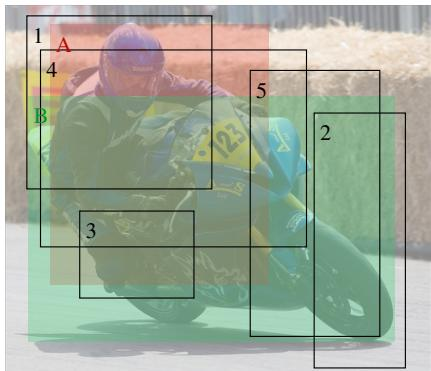

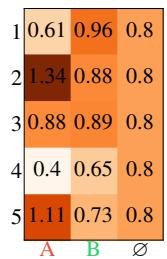  
(b) Costs between the predictions and the ground truth (1 − GIoU). The background cost is c∅ = 0.8.

(a) Image №163 from the COCO training dataset. The ground truth boxes are colored, and the predictions are outlined in black.  
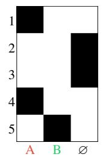

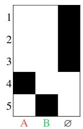

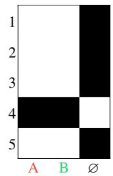  
(d) Hungarian matching (OT with ϵ = 0, τ1 → +∞ and τ2 → +∞).

(c) Prediction to best ground truth (Unbalanced OT with ϵ = 0, τ1 → +∞ and 0)  
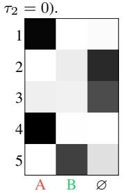  
(f) Unbalanced OT with ϵ = 0.05, τ1 = 100 and τ2 = 0.01.

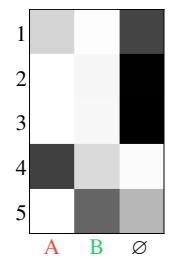  
(g) OT with ϵ = 0.05 (τ1 → +∞ and τ2 → +∞).

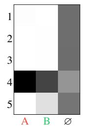  
(h) Unbalanced OT with ϵ = 0.05, τ1 = 0.01 and τ2 = 100.  
Figure 1. Different matching strategies. All are particular cases of Unbalanced Optimal Transport.

## 1.1. A Unifying Framework

To perform any match, a matching cost has to be determined. The example at Fig. 1b uses the Generalized Intersection over Union (GIoU) [46]. Given such a cost matrix, matching strategies include:

• Matching each prediction to the closest ground truth object. This often requires that the cost lies under a certain threshold [37, 45, 44, 33], to avoid matching predictions that may be totally irrelevant for the current image. The disadvantage of this strategy is its redundancy: many predictions may point towards the same ground truth object. In Fig. 1c, both predictions 1 and 4 are matched towards ground truth object A. Furthermore, some ground truth objects may be unmatched. A solution to this is to increase the number of predicted boxes drastically. This is typically the case with anchors boxes and region proposal methods.

• The opposite strategy is to match each ground truth object to the best prediction [25, 37]. This ensures that there is no redundancy and every ground truth object is matched. This also comes with the opposite problem: multiple ground truth objects may be matched to the same prediction. In Fig. 1e, both ground truth objects A and B are matched to prediction 4. This can be mitigated by having more predictions, but then many of those are left unmatched, slowing convergence [37].

• A compromise is to perform a Bipartite Matching (BM), using the Hungarian algorithm [29, 40], for example [6, 55]. The matching is one-to-one, minimizing the total cost (Definition 2). Every ground truth object is matched to a unique prediction, thus reducing the number of predictions needed, as shown in Fig. 1d. A downside is that the one-to-one matches may vary from one epoch to the next, again slowing down convergence [31]. This strategy is difficult to parallelize, i.e. to take advantage of GPU architectures.

All of these strategies have different properties and it seems that one must choose either one or the other, optionally combining them using savant heuristics [37]. There is a need for a unifying framework. As we show in this paper, Unbalanced Optimal Transport [9] offers a good candidate for this (Figure 1). It not only unifies the different strategies here above, but also allows to explore all cases in between. The cases presented in Figures 1c, 1d and 1e correspond to the limit cases. This opens the door for all intermediate settings. Furthermore, we show how regularizing the problem induces smoother matches, leading to faster convergence of DETR, avoiding the problem described for the BM. In addition, the particular choice of entropic regularization leads to a class of fast parallelizable algorithms on GPU known as scaling algorithms [10, 8], of which we provide a compiled implementation on GPU. Our code and additional resources are publicly available1.

## 1.2. Related Work

Matching Strategies Most two-stage models often rely on a huge number of initial predictions, which is then progressively reduced in the region proposal stage and refined in the classification stage. Many different strategies have been proposed for the initial propositions and subsequent reductions, ranging from training no deep learning networks [21], to only train those for the propositions [20, 32, 25], to training networks for both propositions and reductions [45, 42, 24, 5, 11]. Whenever a deep learning network is trained, each prediction is matched to the closest ground truth object provided it lies beneath a certain threshold. Moreover, the final performance of these models heavily depends on the hand-crafted anchors [35].

Many one-stage models rely again on predicting a large number of initial predictions or anchor boxes, covering the entire image. As before, each anchor box is matched towards the closest ground truth object with certain threshold constraints [44, 33]. In [37], this is combined with matching each ground truth object to the closest anchor box and a specific ratio heuristic between the matched and unmatched predictions. The matching of the fixed anchors is justified to avoid a collapse of the predictions towards the same ground truth objects. Additionally, this only works if the number of initial predictions is sufficiently large to ensure that every ground truth object is matched by at least one prediction. Therefore, it requires further heuristics, such as Non-Maximal Suppression (NMS) to guarantee a unique prediction per ground truth object, at least during the inference.

By using the Hungarian algorithm, DETR [6] removed the need for a high number of initial predictions. The matched predictions are improved with a multi-task loss, and the remaining predictions are trained to predict the background class ∅. Yet, the model converges slowly due to the instability of BM, causing inconsistent optimization goals at early training stages [31]. Moreover, the sequential nature of the Hungarian algorithm does not take full advantage of the GPU architecture. Several subsequent works accelerate the convergence of DETR by improving the architecture of the model [55, 36] and by adding auxiliary losses [31], but not by exploring the matching procedure.

Optimal Transport The theory of Optimal Transport (OT) emerges from an old problem [38], relaxed by a newer formulation [26]. It gained interest in the machine learning community since the re-discovery of Sinkhorn’s algorithm [10] and opened the door for improvements in a wide variety of applications ranging from graphical models [39], kernel methods [28, 13], loss design [17], auto-encoders [50, 27, 47] or generative adversarial networks [3, 22].

More recent incursions in computer vision have been attempted, $e . g .$ . for the matching of predicted classes [23], a loss for rotated object boxes [54] or a new metric for performance evaluation [41]. Considering the matching of predictions to ground truth objects, recent attempts using OT bare promising results [18, 19]. However, when the Hungarian algorithm is mentioned, it is systematically presented in opposition to OT [18, 53]. We lay a rigorous connection between those two approaches in computer vision.

Unbalanced OT has seen a much more recent theoretical development [9, 7]. The hard mass conservation constraints in the objective function are replaced by soft penalization terms. Its applications are scarcer, but we must mention here relatively recent machine learning applications in motion tracking [30] and domain adaptation [16].

## 1.3. Contributions

1. We propose a unifying matching framework based on Unbalanced Optimal Transport. It encompasses both the Hungarian algorithm, the matching of the predictions to the closest ground truth boxes and the ground truth boxes to the closest predictions;

2. We show that these three strategies correspond to particular limit cases and we subsequently present a much broader class of strategies with varying properties;

3. We demonstrate how entropic regularization can speed up the convergence during training and additionally take advantage of GPU architectures;

4. We justify the relevancy of our framework by exploring its interaction with NMS and illustrate how it is on par with the state-of-the-art.

## 1.4. Notations and Definitions

Notations Throughout the paper, we use small bold letters to denote a vector ${ \pmb a } \in \mathbb { R } ^ { N }$ , with elements $a _ { i } \in \mathbb { R }$ Similarly, matrices are denoted by bold capital letters such as $\pmb { A } \in \mathrm { \dot { \mathbb { R } } } ^ { N \times M }$ , with elements $A _ { i , j } \in \mathbb { R }$ . The notation $\mathbf { 1 } _ { N }$ represents a column-vector of ones, of size $N ,$ and ${ \bf 1 } _ { N \times M }$ the matrix equivalent of size $N \times M$ . The identity matrix of size N is ${ \cal I } _ { N , N }$ . With $[ [ N ] ] = \{ 1 , 2 , \dots , N \}$ , we denote the set of integers from 1 to N. The probability simplex uses the notation $\begin{array} { r } { \Delta ^ { N } = \{ \pmb { u } \in \mathbb { R } _ { > 0 } ^ { N } \vert \sum _ { i } u _ { i } = 1 \} } \end{array}$ and represents the set of discrete probability distributions of dimension $N$ This extends to the set of discrete joint probability distributions $\Delta ^ { N \times M }$

Definitions For each image, the set $\{ \hat { y } _ { i } \} _ { i = 1 } ^ { N _ { p } }$ denotes the predictions and $\{ y _ { j } \} _ { j = 1 } ^ { N _ { g } }$ the ground truth samples. Each ground truth sample combines a target class and a bounding box position: $\pmb { y } _ { j } = [ \pmb { c } _ { j } , \pmb { b } _ { j } ] \in \mathbb { R } ^ { N _ { c } + 4 }$ where $\pmb { c } _ { j } \in \{ 0 , 1 \} ^ { N _ { c } }$ is the target class in one-hot encoding with $N _ { c }$ the number of classes and $b _ { j } \in [ 0 , 1 ] ^ { 4 }$ defines the relative bounding box center coordinates and dimensions. The predictions are defined similarly $\pmb { \hat { y } } _ { i } = [ \hat { \pmb { c } } _ { i } , \hat { \pmb { b } } _ { i } ] \in \mathbb { R } ^ { N _ { c } + 4 }$ , but the predicted classes may be non-binary $\hat { c } _ { i } \in [ 0 , 1 ] ^ { N _ { c } }$ . Sometimes, predictions are defined relatively to fixed anchor boxes $\tilde { \mathbf { b } } _ { i }$

## 2. Optimal Transport

In this section, we show how Optimal Transport and then its Unbalanced extension unify both the Hungarian algorithm used in DETR [6], and matching each prediction to the closest ground truth object used in both Faster R-CNN [45] and SSD [37]. We furthermore stress the advantages of entropic regularization, both computationally and qualitatively. This allows us to explore a new continuum of matching methods, with varying properties.

Definition 1 (Optimal Transport). Given a distribution α ∈ $\Delta ^ { N _ { p } }$ associated to the predictions $\{ \hat { y } _ { i } \} _ { i = 1 } ^ { N _ { p } }$ , and another distribution $\beta \in \Delta ^ { N _ { g } }$ associated with the ground truth objects $\{ y _ { j } \} _ { j = 1 } ^ { N _ { g } }$ . Let us consider a pair-wise matching cost $\mathcal { L } _ { m a t c h } ( \hat { { \bf y } } _ { i } , \stackrel { \sim } { { \bf y } } _ { j } )$ between a prediction $\hat { y } _ { i }$ and a ground truth object ${ \pmb y } _ { j }$ . We now define Optimal Transport (OT) as finding the match $_ { P }$ that minimizes thefollowing problem:

$$
\hat { P } = \underset { P \in \mathcal { U } ( \alpha , \beta ) } { \arg \operatorname* { m i n } } \left\{ \sum _ { i , j = 1 } ^ { N _ { p } , N _ { g } } P _ { i , j } \mathcal { L } _ { m a t c h } \left( \hat { \pmb { y } } _ { i } , \pmb { y } _ { j } \right) \right\} ,\tag{1}
$$

with transport polytope (admissible solutions) ${ \mathcal { U } } ( \alpha , \beta ) =$ $\left\{ P \in \mathbb { R } _ { \geq 0 } ^ { N _ { p } \times N _ { g } } : \sum _ { j = 1 } ^ { N _ { g } } P _ { i , j } = \alpha _ { i } , \sum _ { i = 1 } ^ { N _ { p } } P _ { i , j } = \beta _ { j } \right\}$

Provided that certain conditions apply to the underlying cost ${ \mathcal { L } } _ { \mathrm { m a t c h } }$ , the minimum defines a distance between α and $\beta ,$ , referred to as the Wasserstein distance $\mathcal { W } ( \alpha , \beta )$ (for more information, we refer to monographs $[ 5 2 , 4 8 , 4 3 ] ;$ see also Appendix A.2).

## 2.1. The Hungarian Algorithm

The Hungarian algorithm solves the Bipartite Matching (BM). We will now show how this is a particular case of Optimal Transport.

Definition 2 (Bipartite Matching). Given the same objects as in Definition 1, the Bipartite Matching (BM) minimizes the cost of the pairwise matches between the ground truth objects with the predictions:

$$
\hat { \sigma } = \arg \operatorname* { m i n } \left\{ \sum _ { j = 1 } ^ { N _ { g } } \mathcal { L } _ { m a t c h } \left( \hat { { \pmb y } } _ { \sigma ( j ) } , { \pmb y } _ { j } \right) : \sigma \in \mathcal { P } _ { N _ { g } } \big ( \big [ N _ { p } \big ] \big ) \right\} ,\tag{2}
$$

where $\mathcal { P } _ { N _ { g } } ( [ [ N _ { p } ] ] ) =  \{ \sigma \in \mathcal { P } ( [ [ N _ { p } ] ] ) \vert \vert \sigma \vert = N _ { g } \}$ is the set of possible combinations of $N _ { g }$ in $N _ { p } ,$ , with $\mathcal { P } ( [ [ N _ { p } ] ] )$ the power set of $[ [ N _ { p } ] ]$ (the set of all subsets).

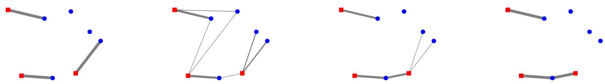  
(a) BM as a particular case of OT (b) OT with regularization $( \epsilon \_ { } \neq $ (c) Unbalanced OT with regulariza- (d) Matching each ground truth obwith no regularization $\begin{array} { r l r } { ( \epsilon } & { { } = } & { 0 ) . } \end{array}$ 0). The regularization smoothens the tion (ϵ $\neq ~ 0$ and $\tau _ { 1 } ~ \ll ~ \tau _ { 2 } )$ . The ject to the closest prediction as Un-The Hungarian algorithm obtains the matching allowing for multiple con- smoothing is also visible. balanced OT without regularization same solution. nections. with $\epsilon = 0 , \tau _ { 1 } = 0$ and $\tau _ { 2 } \to \infty$  
Figure 2. Example of the influence of the parameters. The blue dots represent predictions $\hat { y } _ { i }$ . The red squares represent ground truth objects ${ \bf { \mathscr { y } } } _ { j }$ . The distributions α and $\beta$ are defined as in Prop. 1. The thickness of the lines is proportional to the amount transported $P _ { i , j }$ Only sufficiently thick lines are plotted. The dummy background ground truth ${ \pmb y } _ { N _ { g } + 1 } = \emptyset$ is not shown, nor are the connections to it.

BM tries to assign each ground truth ${ \bf { \nabla } } _ { \bf { { y } } } \mathrm { { _ { j } } }$ to a different prediction yˆ in a way to minimize the total cost. In contrast to OT, BM does not consider any underlying distributions α and $\beta ,$ all ground truth objects and predictions are implicitly considered to be of same mass. Furthermore, it only allows one ground truth to be matched to a unique prediction, some of these predictions being left aside and matched to nothing (which is then treated as a matching to the background ∅). The OT must match all ground truth objects to all predictions, not allowing any predictions to be left aside. However, the masses of the ground truth objects are allowed to be split between different predictions and inversely, as long as their masses correctly sum up $( P \in \mathcal { U } ( \alpha , \beta ) )$ .

Particular Case of OT A solution for an imbalanced number of predictions compared to the number of ground truth objects would be to add dummy ground truth objects— the background ${ \cal O } { - } \mathrm { - } \mathrm { t } 0$ even the balance. Concretely, one could add a new ground truth ${ \pmb y } _ { N _ { q } + 1 } = \emptyset$ , with the mass equal to the unmatched number of predictions. In fact, doing so directly results in performing a BM.

Proposition 1. The Hungarian algorithm with $N _ { p }$ predictions and $N _ { g } \ \leq \ N _ { p }$ ground truth objects is a particular case of OT with $\pmb { P } ^ { \prime } \in \mathcal { U } ( \pmb { \alpha } , \beta ) \subset \mathbb { R } ^ { N _ { p } \times ( N _ { g } + 1 ) }$ , consisting ofthe predictions and the ground truth objects, with the background added $\{ \pmb { y } _ { j } \} _ { j = 1 } ^ { N _ { g } + 1 } = \{ \pmb { y } _ { j } \} _ { j = 1 } ^ { N _ { g } } \cup \left( \pmb { y } _ { N _ { g } + 1 } = \emptyset \right)$ The chosen underlying distributions are

$$
\begin{array} { r c l } { \pmb { \alpha } } & { = } & { \displaystyle \frac { 1 } { N _ { p } } [ \underbrace { 1 , 1 , 1 , \ldots , 1 } _ { N _ { p } p r e d i c t i o n s } ] , } \end{array}\tag{3}
$$

$$
\beta ~ = ~ \frac { 1 } { N _ { p } } [ \underbrace { 1 , \ 1 , \ \dots , \ 1 } _ { N _ { g \ g r o u n d t r u t h \ o b j e c t s } } , \ \underbrace { ( N _ { p } - N _ { g } ) } _ { b a c k g r o u n d \emptyset } ] ,\tag{4}
$$

provided the background cost is constant: $\mathcal { L } _ { m a t c h } \left( \hat { \pmb { y } } _ { i } , \mathcal { D } \right) =$ $c _ { \mathscr { O } } .$ . In particular for $j ~ \in ~ \ [ N _ { g } ] $ , we have $\hat { \sigma } ( j ) ~ =$ $\{ i : P _ { i , j } \neq 0 \}$ , or equivalently $\hat { \sigma } ( j ) \overset { \cdot } { = } \{ i : P _ { i , j } = 1 / N _ { p } \}$

Proof. We refer to Appendix B.1.

□

In other words, we can read the matching to each ground truth in the columns of ${ \hat { P } } .$ The last columns represents all the predictions matched to the background $\hat { \sigma } ( N _ { g } + 1 )$ . Alternatively and equivalently, we can read the matching of each prediction i in the rows, the ones being matched to the background have a $\hat { P } _ { i , N _ { q } + 1 } = 1 / N _ { p } .$

Solving the Problem Both OT and BM are linear programs. Using generic formulations would lead to a $\left( N _ { p } + N _ { g } + 1 \right) \times N _ { p } \left( N _ { g } + 1 \right)$ equality constraint matrix. It is thus better to exploit the particular bipartite structure of the problem. In particular, two families of algorithms have emerged: Dual Ascent Methods and Auction $A l g o -$ rithms [43]. The Hungarian algorithm is a particular case of the former and classically runs with an $\mathcal { O } \left( N _ { p } ^ { 4 } \right)$ complexity [40], further reduced to cubic by [14]. Although multiple GPU implementations of a BM solver have been proposed [51, 12, 15], the problem remains poorly parallelizable because of its sequential nature. To allow for efficient parallelization, we must consider a slightly amended problem.

## 2.2. Regularization

We show here how we can replace the Hungarian algorithm by a class of algorithms well-suited for parallelization, obtained by adding an entropy regularization.

Definition 3 (OT with regularization). We consider a regularization parameter $\epsilon \in \mathbb { R } _ { \geq 0 } .$ . Extending Definition 1 (OT), we define the Optimal Transport with regularization as the following minimization problem:

$$
\hat { \pmb { P } } = \underset { \pmb { P } \in \mathcal { U } ( \pmb { \alpha } , \pmb { \beta } ) } { \arg \operatorname* { m i n } } \left\{ \sum _ { i , j = 1 } ^ { N _ { p } , N _ { g } } P _ { i , j } \mathcal { L } _ { m a t c h } \left( \hat { \pmb { y } } _ { i } , \pmb { y } _ { j } \right) - \epsilon \mathrm { H } ( \pmb { P } ) \right\} ,\tag{5}
$$

with H : $\begin{array} { r } { \Delta ^ { N \times M } \to \mathbb { R } _ { \geq 0 } : P \mapsto - \sum _ { i , j } P _ { i , j } ( \log ( P _ { i , j } ) - 1 ) } \end{array}$ the entropy of the match $P ,$ , with $0 \ln ( 0 ) = 0$ by definition.

Sinkhorn’s Algorithm The entropic regularization used when finding the match $\hat { P }$ ensures that the problem is smooth for $\epsilon \neq 0$ (see Figure 3). The advantage is that it can now be solved very efficiently using scaling algorithms and in this particular case the algorithm of Sinkhorn. It is particularly suited for parallelization [10], with some later speed refinements [2, 1]. Reducing the regularization progressively renders the scaling algorithms numerically unstable, although some approaches have been proposed to reduce the regularization further by working in log-space [49, 8]. In the limit of $\epsilon  0 .$ , we recover the exact OT (Definition 1) and the scaling algorithms cannot be used anymore. Parallelization is lost and we must resolve to use the sequential algorithms developed in Section 2.1. In brief, regularization allows to exploit GPU architectures efficiently, whereas the Hungarian algorithm and similar cannot.

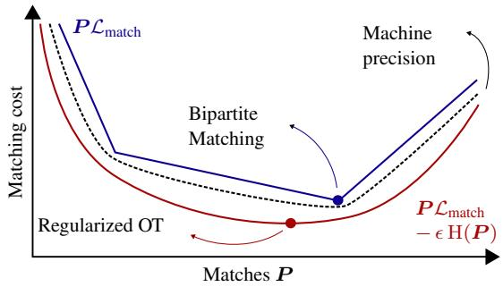  
Figure 3. Effect of the regularization on the minimization of the matching cost. The red line corresponds to the regularized problem $( \epsilon \neq 0 )$ and the blue to the unregularized one $( \epsilon = 0 )$ .

Smoother Matches When no regularization is used as in the Hungarian algorithm, close predictions and ground truth objects can exchange their matches from one epoch to the other, during the training. This causes a slow convergence of DETR in the early stages of the training [31]. The advantage of the regularization not only lies in the existence of efficient algorithms but also allows for a reduction of sparsity. This results in a less drastic match than the Hungarian algorithm obtains. A single ground truth could be matched to multiple predictions and inversely. The proportion of these multiple matches is controlled by the regularization parameter ϵ. An illustration can be found in Figures 2a and 2b.

## 2.3. Unbalanced Optimal Transport

We will now show how considering soft constraints instead of hard leads to an even greater generalization of the various matching techniques used in object detection models. In particular, matching each prediction to the closest ground truth is a limit case of the Unbalanced OT.

Definition 4 (Unbalanced OT). We consider two constraint parameters $\tau _ { 1 } , \tau _ { 2 } \in \mathbb { R } _ { \geq 0 }$ . Extending Definition 3 (OT with regularization), we define the Unbalanced OT with regularization [8] as the following minimization problem:

$$
\begin{array} { r l r } & { } & { \hat { \pmb { P } } = \underset { { \pmb { P } } \in \mathbb { R } _ { \geq 0 } ^ { N _ { p } \times N _ { g } } } { \arg \operatorname* { m i n } } \bigg \{ \epsilon \mathrm { K L } ( { \pmb { P } } \parallel \pmb { K } _ { \epsilon } ) + \tau _ { 1 } \mathrm { K L } ( { \pmb { P } } \mathbf { 1 } _ { N _ { g } } \parallel \pmb { \alpha } ) } \\ & { } & { + \tau _ { 2 } \mathrm { K L } ( \mathbf { 1 } _ { N _ { p } } ^ { \top } \pmb { P } \parallel \beta ) \bigg \} , } \end{array}\tag{6}
$$

where KL $\ : : \mathbb { R } _ { \geq 0 } ^ { N \times M } \times \mathbb { R } _ { > 0 } ^ { N \times M } \ :  \ : \mathbb { R } _ { \geq 0 } : ( U , V )$ 7→ $\begin{array} { r } { \sum _ { i , j = 1 } ^ { N \times M } U _ { i , j } \log \overline { { ( U _ { i , j } / V _ { i , j } ) } } - U _ { i , j } + V _ { i , j } } \end{array}$ is the Kullback-Leibler divergence – also called relative entropy – between matrices or vectors when $M \ = \ 1$ , with $0 \ln ( 0 ) ~ = ~ 0 ~ b y$ definition. The Gibbs kernel Kϵ is given by $( K _ { \epsilon } ) _ { i , j } ~ =$ exp $\left( - \mathcal { L } _ { m a t c h } \left( \hat { \pmb y } _ { i } , \pmb y _ { j } \right) / \epsilon \right)$

We can see by development that the first term corresponds to the matching term $P \mathcal { L } _ { \mathrm { m a t c h } }$ and an extension of the entropic regularization term $\mathrm { H } ( P )$ The two additional terms replace the transport polytope’s hard constraints $\mathcal { U } ( \alpha , \beta )$ that required an exact equality of mass for both marginals. These new soft constraints allow for a more subtle sensitivity to the mass constraints as it allows to slightly diverge from them. It is clear that in the limit of $\tau _ { 1 } , \tau _ { 2 } \to + \infty$ , we recover the “balanced” problem (Definition 3). This definition naturally also defines Unbalanced OT without regularization if $\epsilon = 0$ The matching term would remain and the entropic one disappear.

Matching to the Closest Another limit case is however particularly interesting in the quest for a unifying framework of the matching strategies. If the mass constraint is to be perfectly respected for the predictions $( \tau _ { 1 } \to \infty )$ but not at all for the ground truth objects $( \tau _ { 2 } = 0 )$ , it suffices to assign the closest ground truth to each prediction. The same ground truth object could be assigned to multiple predictions and another could not be matched at all, not respecting the hard constraint for the ground truth β. Each prediction however is exactly assigned once, perfectly respecting the mass constraint for the predictions α. By assigning a low enough value to the background, a prediction would be assigned to it provided all the other ground truth objects are further. In other words, the background cost would play the role of a threshold value.

Proposition 2 (Matching to the closest). We consider the same objects as Proposition 1. In the limit of $\tau _ { 1 } $ ∞ and ${ \tau _ { 2 } } ~ = ~ 0 ,$ Unbalanced OT (Definition 4) without regularization $( \epsilon ~ = ~ 0 )$ admits as solution each prediction being matched to the closest ground truth object unless that distance is greater than a threshold value $\mathcal { L } _ { m a t c h } \left( \hat { \pmb { y } } _ { i } , \pmb { y } _ { N _ { q } + 1 } = \emptyset \right) = c _ { \pmb { \mathcal { O } } }$ . It is then matched to the background ∅. In particular, we have

$$
\hat { P } _ { i , j } = \left\{ \begin{array} { l l } { \frac { 1 } { N _ { p } } } & { i f j = \arg \operatorname* { m i n } _ { j \in [ N _ { g } + 1 ] } \left\{ \mathcal { L } _ { m a t c h } \left( \pmb { \hat { y } } _ { i } , \pmb { y } _ { j } \right) \right\} , } \\ { 0 } & { o t h e r w i s e . } \end{array} \right.\tag{7}
$$

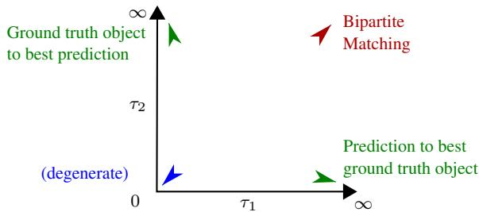  
Figure 4. Limit cases of Unbalanced OT without regularization $( \epsilon = 0 )$

The converse also holds. If the ground truth objects mass constraints were to be perfectly respected $( \tau _ { 2 }  \infty )$ but not the predictions $( \tau _ { 1 }  0 )$ , each ground truth would then be matched to the closest prediction. The background would be matched to the remaining predictions. Some predictions could not be matched and other ones multiple times. The limits of Unbalanced OT are illustrated in Fig. 4. By setting the threshold sufficiently high, we get an exact minimum, i.e., where every prediction is matched to the closest ground truth. This can be observed in Figure 2d.

Scaling Algorithm Similarly as before, adding entropic regularization $( \epsilon \neq 0 )$ to the Unbalanced OT allows it to be solved efficiently on GPU with a scaling algorithm, as an extension of Sinkhorn’s algorithm [8, 7]. The regularization still also allows for smoother matches, as shown in Figure 2c.

Softmax In the limit of $\tau _ { 1 } \to + \infty$ and $\tau _ { 2 } = 0 .$ , the solution corresponds to a softmax over the ground truth objects for each prediction. The regularization ε controls then the “softness” of the softmax, with $\varepsilon = 1$ corresponding to the conventional softmax and $\varepsilon  0$ the matching to the closest. We refer to Appendix C.2 for more information.

## 3. Matching

Following previous work [6, 55, 45, 44, 37], we define a multi-task matching cost between a prediction $\hat { y } _ { i }$ and a ground truth object ${ \pmb y } _ { j }$ as the composition of a classification loss ensuring that similar object classes are matched together and a localization loss ensuring the correspondence of the positions and shapes of the matched boxes $\begin{array} { r } { \mathcal { L } ( \hat { y } _ { i } , y _ { j } ) = \mathcal { L } _ { \mathrm { c l a s s i f i c a t i o n } } ( \hat { c } _ { i } , c _ { j } ) + \mathcal { L } _ { \mathrm { l o c a l i z a t i o n } } ( \hat { b } _ { i } , b _ { j } ) } \end{array}$ . Most models, however, do not use the same loss to determine the matches as the one used to train the model. We therefore refer to these two losses as ${ \mathcal { L } } _ { \mathrm { m a t c h } }$ and ${ \mathcal { L } } _ { \mathrm { t r a i n } } .$ . The training procedure is the following: first find a match $\hat { P }$ given a matching strategy and matching cost ${ \mathcal { L } } _ { \mathrm { m a t c h } }$ , then compute the loss $\begin{array} { r } { N _ { p } \sum _ { i = 1 } ^ { N _ { p } } \sum _ { j = 1 } ^ { N _ { g } } \hat { P } _ { i j } \mathcal { L } _ { \mathrm { t r a i n } } ( \hat { \pmb y } _ { i } , \pmb y _ { j } ) } \end{array}$ where the particular training loss for the background ground truth includes only a classification term $\mathcal { L } _ { \mathrm { t r a i n } } ( \hat { \pmb { y } } _ { i } , \mathcal { D } ) = \mathcal { L } _ { \mathrm { c l a s s i f i c a t i o n } } ( \hat { \pmb { c } } _ { i } , \mathcal { D } )$

The object detection is performed by matching the predictions to the ground truth boxes with the Hungarian algorithm applied to the loss ${ \mathcal { L } } _ { \mathrm { m a t c h } } ( { \hat { \pmb { y } } } _ { i } , { \pmb { y } } _ { j } ) ~ = ~ \lambda _ { \mathrm { p r o b } } ( 1 ~ -$ $\begin{array} { r } { \langle \hat { c } _ { i } , c _ { j } \rangle ) + \lambda _ { \ell ^ { 1 } } \lVert \hat { b } _ { i } - b _ { j } \rVert _ { 1 } + \lambda _ { \mathrm { G I o U } } ( 1 - \mathrm { G I o U } ( \hat { b } _ { i } , b _ { j } ) ) } \end{array}$ (Definition 2). To do so, the number of predictions and ground truth boxes must be of the same size. This is achieved by padding the ground truths with $( N _ { p } - N _ { g } )$ dummy background $\mathcal { D }$ objects. Essentially, this is the same as what is developed in Proposition 1. The obtained match is then used to define an object-specific loss, where each matched prediction is pushed toward its corresponding ground truth object. The predictions that are not matched to a ground truth object are considered to be matched with the background and are pushed to predict the background class. The training loss uses the cross-entropy (CE) for classification: $\mathcal { L } _ { \mathrm { t r a i n } } ( \hat { y } _ { i } , y _ { j } ) = \lambda _ { \mathrm { C E } } \mathcal { L } _ { \mathrm { C E } } ( \hat { c } _ { i } , c _ { j } ) + \lambda _ { \ell ^ { 1 } } \Vert \hat { b } _ { i } - b _ { j } \Vert _ { 1 } +$ $\lambda _ { \mathrm { G I o U } } ( 1 - \mathrm { G I o U } ( \hat { b } _ { i } , b _ { j } ) )$ . By directly applying Proposition 1 and adding entropic regularization (Definition 3), we can use Sinkhorn’s algorithm and push each prediction $\hat { y } _ { i }$ to ground truth ${ \pmb y } _ { j }$ according to weight $\hat { P } _ { i , j }$ . In particular, for any non-zero $\hat { P } _ { i , N _ { g } + 1 } \neq 0$ , the prediction $\hat { y } _ { i }$ is pushed toward the background ${ \pmb y } _ { N _ { g } + 1 } = \emptyset$ with weight $\hat { P } _ { i , N _ { g } + 1 }$

## 3.2. Single Shot MultiBox Detector (SSD)

The Single Shot MultiBox Detector [37] uses a matching cost only comprised of the IoU between the fixed anchor boxes $\tilde { \mathbf { \pmb { b } } } _ { i }$ and the ground truth boxes: $\mathcal { L } _ { \mathrm { m a t c h } } ( \hat { \pmb y } _ { i } , \pmb y _ { j } ) =$ $\begin{array} { r } { { 1 - \mathrm { I o U } ( \tilde { \pmb { b } } _ { i } , \pmb { b } _ { j } ) } } \end{array}$ (the GIoU was not published yet [46]). Each ground truth is first matched toward the closest anchor box. Anchor boxes are then matched to a ground truth object if the matching cost is below a threshold of 0.5. In our framework, this corresponds to applying $\tau _ { 1 } = 0$ and $\tau _ { 2 }  \infty$ for the first phase and then $\tau _ { 1 } \ \to \ \infty$ and $\tau _ { 2 } = 0$ with $c _ { \delta } = 0 . 5$ (see Proposition 2). Here again, by adding entropic regularization (Definition 4), we can solve this using a scaling algorithm. We furthermore can play with the parameters $\tau _ { 1 }$ and $\tau _ { 2 }$ to make the matching tend slightly more towards a matching done with the Hungarian algorithm (Figure 2). Again, the training uses a different loss than the matching, in particular $\mathcal { L } _ { \mathrm { t r a i n } } ( \hat { \pmb y } _ { i } , \pmb y _ { j } ) =$ $\lambda _ { \mathrm { C E } } \mathcal { L } _ { \mathrm { C E } } ( \hat { \pmb { c } } _ { i } , \pmb { c } _ { j } ) + \lambda _ { \mathrm { s m o o t h } \ell ^ { 1 } } \mathcal { L } _ { \mathrm { s m o o t h } \ell ^ { 1 } } ( \hat { \pmb { b } } _ { i } , \pmb { b } _ { j } )$

Hard Negative Mining Instead of using all negative examples $N _ { \mathrm { n e g } } = \left( N _ { p } - N _ { g } \right)$ (predictions matched to background), the method sorts them using the highest confidence loss $\mathcal { L } _ { \mathrm { C E } } ( \hat { \mathbf { c } } _ { i } , \mathcal { O } )$ and picks the top ones so that the ratio between the hard negatives and positives $N _ { \mathrm { p o s } } = N _ { g }$ is at most 3 to 1. Since $\hat { P }$ is non-binary, we define the number of negatives and positives to be the sum of the matches to the background $\begin{array} { r } { N _ { \mathrm { n e g } } = N _ { p } \sum _ { i = 1 } ^ { N _ { p } } \hat { P } _ { i , ( N _ { g } + 1 ) } } \end{array}$ and to the ground truth objects $\begin{array} { r } { N _ { \mathrm { p o s } } = N _ { p } \sum _ { j = 1 } ^ { N _ { g } } \sum _ { i = 1 } ^ { N _ { p } } \hat { P } _ { i j } } \end{array}$ . We verify that for any

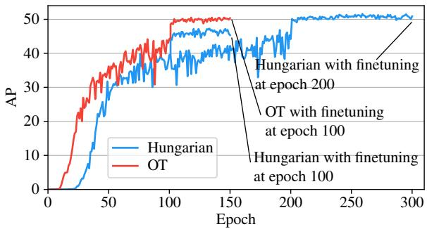  
Figure 5. Convergence curves for DETR on the Color Boxes dataset. The model converges faster with a regularized matching.

$P \in \mathcal { U } ( \alpha , \beta )$ , we have the same number of positives and negatives as the initial model: $N _ { \mathrm { n e g } } ~ = ~ \left( N _ { p } - N _ { g } \right)$ and $N _ { \mathrm { p o s } } = N _ { g }$ . Hence, hard negatives are the K predictions with the highest confidence loss $\hat { P } _ { k , ( N _ { q } + 1 ) } \mathcal { L } _ { \mathrm { C E } } ( \hat { \boldsymbol { c } } _ { k } , \boldsymbol { \emptyset } )$ such that the mass of kept negatives is at most triple the number of positives: $N _ { p } \bar { \sum _ { k = 1 } ^ { K } \hat { P _ { k , ( N _ { g } + 1 ) } ^ { s } } } \leq 3 N _ { \mathrm { p o s } }$ , where $\hat { P } ^ { s }$ is a permutation of transport matrix $\hat { P }$ with rows sorted by highest confidence loss.

## 4. Experimental Results & Discussion

We show that matching based on Unbalanced Optimal Transport generalizes many different matching strategies and performs on par with methods that use either Bipartite Matching or anchor boxes along with matching each prediction to the closest ground truth box with a threshold. We then analyze the influence of constraint parameter τ2 by training SSD with and without NMS for multiple parameter values. Finally, we show that OT with entropic regularization both improves the convergence and is faster to compute than the Hungarian algorithm in case of many matches.

## 4.1. Setup

Datasets We perform experiments on a synthetic object detection dataset with 4.800 training and 960 validation images and on the large-scale COCO [34] dataset with 118,287 training and 5,000 validation test images. We report on mean Average Precision (AP) and mean Average Recall (AR). The two metrics are an average of the perclass metrics following COCO’s official evaluation procedure. For the Color Boxes synthetic dataset, we uniformly randomly draw between 0 and 30 rectangles of 20 different colors from each image. Appendix I provides the detailed generation procedure and sample images.

Training For a fair comparison, the classification and localization costs for matching and training are identical to the ones used by the models. Unless stated otherwise, we train the models with their default hyper-parameter sets. DETR and Deformable DETR are trained with hyperparameters $\lambda _ { \mathrm { p r o b } } = \lambda _ { \mathrm { C E } } = 2 , \lambda _ { \ell ^ { 1 } } = 5 \mathrm { a n d } \lambda _ { \mathrm { G I o U } } = 2$

<table><tr><td></td><td>Model</td><td>Matching</td><td>T2</td><td>Epochs</td><td>AP</td><td>AR</td></tr><tr><td rowspan="4">ColooorBes</td><td>DETR</td><td>Hungarian</td><td>(∞)</td><td>300</td><td>50.9</td><td>65.7</td></tr><tr><td>DETR</td><td>Hungarian</td><td>(∞)</td><td>150</td><td>45.3</td><td>60.7</td></tr><tr><td>DETR</td><td>OT</td><td>(∞)</td><td>150</td><td>50.3</td><td>65.7</td></tr><tr><td>D. DETR</td><td>Hungarian</td><td>(∞)</td><td>50</td><td>64.0</td><td>75.9</td></tr><tr><td rowspan="4">COCO</td><td>D. DETR</td><td>OT</td><td>(∞)</td><td>50</td><td>63.5</td><td>76.5</td></tr><tr><td>D. DETR</td><td>Hungarian</td><td>(∞)</td><td>50</td><td>44.5</td><td>63.0</td></tr><tr><td>D. DETR</td><td>OT</td><td>(∞)</td><td>50</td><td>44.2</td><td>62.0</td></tr><tr><td>SSD300 SSD300</td><td>Two Stage Unb. OT</td><td>0.01</td><td>120 120</td><td>24.9 24.7</td><td>36.8 36.4</td></tr></table>

Table 1. Object detection metrics for different models and loss functions on the Color Boxes and COCO datasets.

For Deformable DETR, we found the classification cost to be overwhelmed by the localization costs in the regularized minimization problem (Definition 3). We therefore set $\lambda _ { \mathrm { p r o b } } ~ = ~ 5 .$ We, however keep $\lambda _ { \mathrm { C E } } ~ = ~ 2$ so that the final loss value for a given matching remains unchanged. SSD is trained with original hyper-parameters $\lambda _ { \mathrm { C E } } = \lambda _ { \mathrm { s m o o t h } \ell ^ { 1 } } = 1$ . For OT, we set the entropic regularization to $\epsilon = \epsilon _ { 0 } / ( \log { ( 2 N _ { p } ) } + 1 )$ where $\epsilon _ { 0 } = 0 . 1 2$ for all models (App. D). In the following experiments, the Unbalanced OT is solved with multiple values of $\tau _ { 2 }$ whereas $\tau _ { 1 }$ is fixed to a large value $\tau _ { 1 } = 1 0 0$ to simulate a hard constraint. In practice, we limit the number of iterations of the scaling algorithm. This provides a good enough approximation [19].

## 4.2. Unified Matching Strategy

DETR and Deformable DETR Convergence curves for DETR on the Color Boxes dataset are shown in Fig. 5 and associated metrics are presented in Table 1. DETR converges in half the number of epochs with the regularized balanced OT formulation. This confirms that one reason for slow DETR convergence is the discrete nature of BM, which is unstable, especially in the early stages of training. Training the model for more epochs with either BM or OT does not improve metrics as the model starts to overfit. Appendix E provides qualitative examples and a more detailed convergence analysis. We evaluate how these results translate to faster converging DETR-like models by additionally training Deformable DETR [55]. In addition to model improvements, Deformable DETR makes three times more predictions than DETR and uses a sigmoid focal loss [33] instead of a softmax cross-entropy loss for both classification costs. Table 1 gives results on Color Boxes and COCO. We observe that the entropy term does not lead to faster convergence. Indeed, Deformable DETR converges in 50 epochs with both matching strategies. Nevertheless, both OT and bipartite matching lead to similar AP and AR.

SSD and the Constraint Parameter To better understand how unbalanced OT bridges the gap between DETR’s and SSD’s matching strategies, we analyze the variation in performance of SSD for different values of $\tau _ { 2 }$ . Results for an initial learning rate of 0.0005 are displayed in Table 2. In the second row, the parameter value is close to zero. From Proposition 2 and when $\epsilon  0 .$ , each prediction is matched to the closest ground truth box unless the matching cost exceeds 0.5. Thus, multiple predictions are matched to each ground truth box, and NMS is needed to eliminate near duplicates. When NMS is removed, AP drops by 25.8 points and AR increases by 10.2 points. We observe similar results for the original SSD matching strategy $( 1 ^ { \mathrm { s t } }$ row), which suggests matching each ground truth box to the closest anchor box does not play a huge role in the two-stage matching procedure from SSD. The lower part of Table 1 shows the same for COCO. When $\tau _ { 2 }  + \infty$ , one recovers the balanced formulation used in DETR (last row). Removing NMS leads to a 2.9 points drop for AP and a 9.7 points increase for AR. Depending on the field of application, it may be preferable to apply a matching strategy with a low $\tau _ { 2 }$ and with NMS when precision is more important or without NMS when the recall is more important. Moreover, varying parameter $\tau _ { 2 }$ offers more control on the matching strategy and therefore on the precision-recall trade-off [4].

<table><tr><td rowspan="2">Matching</td><td rowspan="2"> $\tau _ { 2 }$ </td><td colspan="2">with NMS</td><td colspan="2">w/o NMS</td></tr><tr><td>AP</td><td>AR</td><td>AP</td><td>AR</td></tr><tr><td>Two Stage</td><td>一</td><td>51.6</td><td>67.0</td><td>23.2</td><td>77.8</td></tr><tr><td>Unb. OT</td><td>0.01</td><td>51.1</td><td>66.3</td><td>25.3</td><td>76.5</td></tr><tr><td>Unb. OT</td><td>0.1</td><td>50.9</td><td>66.8</td><td>35.9</td><td>75.4</td></tr><tr><td>Unb. OT</td><td>1</td><td>48.3</td><td>64.4</td><td>44.3</td><td>73.4</td></tr><tr><td>Unb. OT</td><td>10</td><td>48.0</td><td>64.1</td><td>44.9</td><td>72.9</td></tr><tr><td>OT</td><td>(∞)</td><td>48.1</td><td>64.3</td><td>45.2</td><td>73.0</td></tr></table>

Table 2. Comparison of matching strategies on the Color Boxes dataset. SSD300 is evaluated both with and without NMS.

Computation Time For a relatively small number of predictions, implementations of Sinkhorn perform on par with the Hungarian algorithm (Fig. 6). The “balanced” algorithm is on average 2.6ms slower than the Hungarian algorithm for 100 predictions (DETR) and 1.5ms faster for 300 predictions (Deformable DETR). For more predictions, GPU parallelization of the Sinkhorn algorithm makes a large difference (more than 50x speedup). As a reference point, SSD300 and SSD512 make $\begin{array} { r } { 8 , } \end{array}$ 732 and 24, 564 predictions.

## 5. Conclusion and Future Work

Throughout the paper, we showed both theoretically and experimentally how Unbalanced Optimal Transport unifies the Hungarian algorithm, matching each ground truth object to the best prediction and each prediction to the best ground truth, with or without threshold.

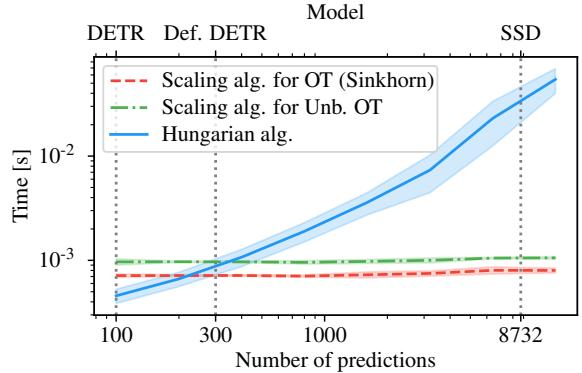  
Figure 6. Average and standard deviation of the computation time for different matching strategies on COCO with batch size 16. The Hungarian algorithm is computed with SciPy and its time includes the transfer of the cost matrix from GPU memory to RAM. We run 20 Sinkhorn iterations. Computed with an Nvidia TITAN X GPU and Intel Core i7-4770K CPU @ 3.50GHz.

Experimentally, using OT and Unbalanced OT with entropic regularization is on par with the state-of-the-art for DETR, Deformable DETR and SSD. Moreover, we showed that entropic regularization lets DETR converge faster on the Color Boxes dataset and that parameter $\tau _ { 2 }$ offers better control of the precision-recall trade-off. Finally, we showed that the scaling algorithms compute large numbers of matches faster than the Hungarian algorithm.

Limitations and Future Work The convergence improvement of the regularized OT formulation compared to bipartite matching seems to hold only for DETR and on small-scale datasets. Further investigations may include Wasserstein-based matching costs for a further unification of the theory and the reduction of the entropy with time, as it seems to boost convergence only in early phases, but not in fine-tuning.

## Acknowledgements

EU: The research leading to these results has received funding from the European Research Council under the European Union’s Horizon 2020 research and innovation program / ERC Advanced Grant E-DUALITY (787960). This paper reflects only the authors views and the Union is not liable for any use that may be made of the contained information. Research Council KUL: Optimization frameworks for deep kernel machines C14/18/068. Flemish Government: FWO: projects: GOA4917N (Deep Restricted Kernel Machines: Methods and Foundations), PhD/Postdoc grant; This research received funding from the Flemish Government (AI Research Program). All the authors are also affiliated to Leuven.AI - KU Leuven institute for AI, B-3000, Leuven, Belgium.

## References

[1] Mokhtar Z Alaya, Maxime Berar, Gilles Gasso, and Alain Rakotomamonjy. Screening sinkhorn algorithm for regularized optimal transport. In Advances in Neural Information Processing Systems, volume 32, 2019. 5

[2] Jason Altschuler, Jonathan Niles-Weed, and Philippe Rigollet. Near-linear time approximation algorithms for optimal transport via sinkhorn iteration. In I. Guyon, U. Von Luxburg, S. Bengio, H. Wallach, R. Fergus, S. Vishwanathan, and R. Garnett, editors, Advances in Neural Information Processing Systems, volume 30. Curran Associates, Inc., 2017. 5

[3] Martin Arjovsky, Soumith Chintala, and Leon Bottou.´ Wasserstein generative adversarial networks. In International conference on machine learning, pages 214–223. PMLR, 2017. 3

[4] Michael Buckland and Fredric Gey. The relationship between recall and precision. Journal of the American society for information science, 45(1):12–19, 1994. 8

[5] Zhaowei Cai and Nuno Vasconcelos. Cascade r-cnn: Delving into high quality object detection. In Proceedings of the IEEE conference on computer vision and pattern recognition, pages 6154–6162, 2018. 2

[6] Nicolas Carion, Francisco Massa, Gabriel Synnaeve, Nicolas Usunier, Alexander Kirillov, and Sergey Zagoruyko. End-toend object detection with transformers. In European conference on computer vision, pages 213–229. Springer, 2020. 2, 3, 6

[7] Lenaic Chizat. Unbalanced Optimal Transport : Models, Numerical Methods, Applications. Theses, Universite Paris´ sciences et lettres, Nov. 2017. 3, 6

[8] Lenaic Chizat, Gabriel Peyre, Bernhard Schmitzer, and´ Franc¸ois-Xavier Vialard. Scaling algorithms for unbalanced optimal transport problems. Mathematics of Computation, 87(314):2563–2609, 2018. 2, 5, 6

[9] Lenaic Chizat, Gabriel Peyre, Bernhard Schmitzer, and´ Franc¸ois-Xavier Vialard. Unbalanced optimal transport: Dynamic and kantorovich formulations. Journal of Functional Analysis, 274(11):3090–3123, 2018. 2, 3

[10] Marco Cuturi. Sinkhorn distances: Lightspeed computation of optimal transport. Advances in neural information processing systems, 26, 2013. 2, 5

[11] Jifeng Dai, Yi Li, Kaiming He, and Jian Sun. R-fcn: Object detection via region-based fully convolutional networks. Advances in neural information processing systems, 29, 2016. 2

[12] Ketan Date and Rakesh Nagi. Gpu-accelerated hungarian algorithms for the linear assignment problem. Parallel Computing, 57:52–72, 2016. 4

[13] Henri De Plaen, Michael Fanuel, and Johan AK Suykens.¨ Wasserstein exponential kernels. In 2020 International Joint Conference on Neural Networks (IJCNN), pages 1–6. IEEE, 2020. 2

[14] Jack Edmonds and Richard M. Karp. Theoretical improvements in algorithmic efficiency for network flow problems. J. ACM, 19(2):248–264, apr 1972. 4

[15] Bas O Fagginger Auer and Rob H Bisseling. A gpu algorithm for greedy graph matching. In Facing the Multicore-Challenge II, pages 108–119. Springer, 2012. 4

[16] Kilian Fatras, Thibault Sejourn ´ e, R ´ emi Flamary, and Nicolas´ Courty. Unbalanced minibatch optimal transport; applications to domain adaptation. In International Conference on Machine Learning, pages 3186–3197. PMLR, 2021. 3

[17] Charlie Frogner, Chiyuan Zhang, Hossein Mobahi, Mauricio Araya, and Tomaso A Poggio. Learning with a wasserstein loss. Advances in neural information processing systems, 28, 2015. 2

[18] Zheng Ge, Songtao Liu, Zeming Li, Osamu Yoshie, and Jian Sun. Ota: Optimal transport assignment for object detection. In Proceedings of the IEEE/CVF Conference on Computer Vision and Pattern Recognition, pages 303–312, 2021. 3

[19] Zheng Ge, Songtao Liu, Feng Wang, Zeming Li, and Jian Sun. Yolox: Exceeding yolo series in 2021. arXiv preprint arXiv:2107.08430, 2021. 3, 7

[20] Ross Girshick. Fast r-cnn. In Proceedings of the IEEE International Conference on Computer Vision (ICCV), pages 1440–1448, December 2015. 2

[21] Ross Girshick, Jeff Donahue, Trevor Darrell, and Jitendra Malik. Rich feature hierarchies for accurate object detection and semantic segmentation. In Proceedings ofthe IEEE conference on computer vision and pattern recognition, pages 580–587, 2014. 2

[22] Ishaan Gulrajani, Faruk Ahmed, Martin Arjovsky, Vincent Dumoulin, and Aaron C Courville. Improved training of wasserstein gans. Advances in neural information processing systems, 30, 2017. 3

[23] Yuzhuo Han, Xiaofeng Liu, Zhenfei Sheng, Yutao Ren, Xu Han, Jane You, Risheng Liu, and Zhongxuan Luo. Wasserstein loss-based deep object detection. In Proceedings of the IEEE/CVF Conference on Computer Vision and Pattern Recognition (CVPR) Workshops, June 2020. 3

[24] Kaiming He, Georgia Gkioxari, Piotr Dollar, and Ross Gir-´ shick. Mask r-cnn. In Proceedings ofthe IEEE international conference on computer vision, pages 2961–2969, 2017. 2

[25] Kaiming He, Xiangyu Zhang, Shaoqing Ren, and Jian Sun. Spatial pyramid pooling in deep convolutional networks for visual recognition. IEEE transactions on pattern analysis and machine intelligence, 37(9):1904–1916, 2015. 2

[26] L. Kantorovitch. On the translocation of masses. Management Science, 5(1):1–4, 1958. 2

[27] Soheil Kolouri, Phillip E Pope, Charles E Martin, and Gustavo K Rohde. Sliced wasserstein auto-encoders. In International Conference on Learning Representations, 2018. 3

[28] Soheil Kolouri, Yang Zou, and Gustavo K Rohde. Sliced wasserstein kernels for probability distributions. In Proceedings ofthe IEEE Conference on Computer Vision and Pattern Recognition, pages 5258–5267, 2016. 2

[29] Harold W Kuhn. The hungarian method for the assignment problem. Naval research logistics quarterly, 2(1-2):83–97, 1955. 2

[30] John Lee, Nicholas P. Bertrand, and Christopher J. Rozell. Unbalanced optimal transport regularization for imaging problems. IEEE Transactions on Computational Imaging, 6:1219–1232, 2020. 3

[31] Feng Li, Hao Zhang, Shilong Liu, Jian Guo, Lionel M Ni, and Lei Zhang. Dn-detr: Accelerate detr training by introducing query denoising. In Proceedings of the IEEE/CVF Conference on Computer Vision and Pattern Recognition, pages 13619–13627, 2022. 2, 5

[32] Tsung-Yi Lin, Piotr Dollar, Ross Girshick, Kaiming He,´ Bharath Hariharan, and Serge Belongie. Feature pyramid networks for object detection. In Proceedings of the IEEE conference on computer vision and pattern recognition, pages 2117–2125, 2017. 2

[33] Tsung-Yi Lin, Priya Goyal, Ross Girshick, Kaiming He, and Piotr Dollar. Focal loss for dense object detection. In´ Proceedings of the IEEE international conference on computer vision, pages 2980–2988, 2017. 2, 7

[34] Tsung-Yi Lin, Michael Maire, Serge Belongie, James Hays, Pietro Perona, Deva Ramanan, Piotr Dollar, and C Lawrence´ Zitnick. Microsoft coco: Common objects in context. In European conference on computer vision, pages 740–755. Springer, 2014. 7

[35] Li Liu, Wanli Ouyang, Xiaogang Wang, Paul Fieguth, Jie Chen, Xinwang Liu, and Matti Pietikainen. Deep learning¨ for generic object detection: A survey. International journal ofcomputer vision, 128(2):261–318, 2020. 2

[36] Shilong Liu, Feng Li, Hao Zhang, Xiao Yang, Xianbiao Qi, Hang Su, Jun Zhu, and Lei Zhang. Dab-detr: Dynamic anchor boxes are better queries for detr. In International Conference on Learning Representations, 2021. 2

[37] Wei Liu, Dragomir Anguelov, Dumitru Erhan, Christian Szegedy, Scott Reed, Cheng-Yang Fu, and Alexander C Berg. Ssd: Single shot multibox detector. In European conference on computer vision, pages 21–37. Springer, 2016. 2, 3, 6

[38] Gaspard Monge. Memoire sur la th ´ eorie des d ´ eblais et des´ remblais. Mem. Math. Phys. Acad. Royale Sci., pages 666– 704, 1781. 2

[39] Gregoire Montavon, Klaus-Robert M´ uller, and Marco Cu-¨ turi. Wasserstein training of restricted boltzmann machines. Advances in Neural Information Processing Systems, 29, 2016. 2

[40] James Munkres. Algorithms for the assignment and transportation problems. Journal ofthe societyfor industrial and applied mathematics, 5(1):32–38, 1957. 2, 4

[41] Mayu Otani, Riku Togashi, Yuta Nakashima, Esa Rahtu, Janne Heikkila, and Shin’ichi Satoh. Optimal correction¨ cost for object detection evaluation. In Proceedings of the IEEE/CVF Conference on Computer Vision and Pattern Recognition, pages 21107–21115, 2022. 3

[42] Jiangmiao Pang, Kai Chen, Jianping Shi, Huajun Feng, Wanli Ouyang, and Dahua Lin. Libra r-cnn: Towards balanced learning for object detection. In Proceedings of the IEEE/CVF conference on computer vision and pattern recognition, pages 821–830, 2019. 2

[43] Gabriel Peyre, Marco Cuturi, et al. Computational optimal´ transport: With applications to data science. Foundations and Trends® in Machine Learning, 11(5-6):355–607, 2019. 3, 4

[44] Joseph Redmon, Santosh Divvala, Ross Girshick, and Ali Farhadi. You only look once: Unified, real-time object detection. In Proceedings of the IEEE conference on computer vision and pattern recognition, pages 779–788, 2016. 2, 6

[45] Shaoqing Ren, Kaiming He, Ross Girshick, and Jian Sun. Faster r-cnn: Towards real-time object detection with region proposal networks. In Advances in Neural Information Processing Systems, volume 28. Curran Associates, Inc., 2015. 2, 3, 6

[46] H. Rezatofighi, N. Tsoi, J. Gwak, A. Sadeghian, I. Reid, and S. Savarese. Generalized intersection over union: A metric and a loss for bounding box regression. In 2019 IEEE/CVF Conference on Computer Vision and Pattern Recognition (CVPR), pages 658–666, Los Alamitos, CA, USA, jun 2019. IEEE Computer Society. 2, 6

[47] Paul K Rubenstein, Bernhard Schoelkopf, and Ilya Tolstikhin. On the latent space of wasserstein auto-encoders. arXiv preprint arXiv:1802.03761, 2018. 3

[48] Filippo Santambrogio. Optimal transport for applied mathematicians. calculus of variations, pdes and modeling. 2015. 3

[49] Bernhard Schmitzer. Stabilized sparse scaling algorithms for entropy regularized transport problems. SIAM Journal on Scientific Computing, 41(3):A1443–A1481, 2019. 5

[50] Ilya Tolstikhin, Olivier Bousquet, Sylvain Gelly, and Bernhard Schoelkopf. Wasserstein auto-encoders. In International Conference on Learning Representations, 2018. 3

[51] Cristina Nader Vasconcelos and Bodo Rosenhahn. Bipartite graph matching computation on gpu. In International Workshop on Energy Minimization Methods in Computer Vision and Pattern Recognition, pages 42–55. Springer, 2009. 4

[52] Cedric Villani.´ Optimal transport: old and new, volume 338. Springer, 2009. 3

[53] Xuan-Thuy Vo and Kang-Hyun Jo. A review on anchor assignment and sampling heuristics in deep learning-based object detection. Neurocomputing, 2022. 3

[54] Xue Yang, Junchi Yan, Qi Ming, Wentao Wang, Xiaopeng Zhang, and Qi Tian. Rethinking rotated object detection with gaussian wasserstein distance loss. In Marina Meila and Tong Zhang, editors, Proceedings of the 38th International Conference on Machine Learning, volume 139 of Proceedings of Machine Learning Research, pages 11830–11841. PMLR, 18–24 Jul 2021. 3

[55] Xizhou Zhu, Weijie Su, Lewei Lu, Bin Li, Xiaogang Wang, and Jifeng Dai. Deformable detr: Deformable transformers for end-to-end object detection. In International Conference on Learning Representations, 2021. 2, 6, 7