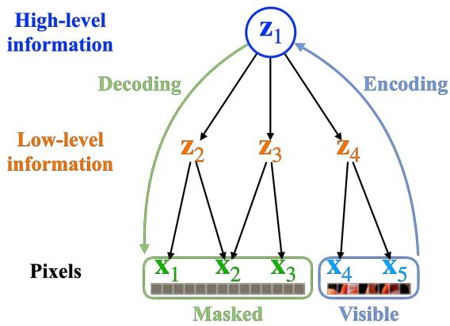
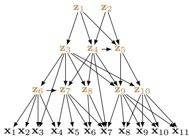
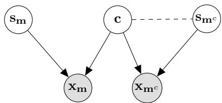
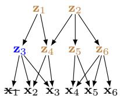
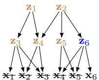
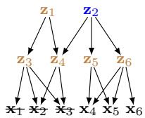
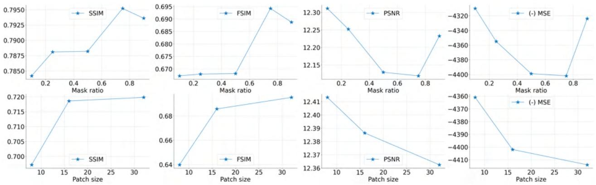
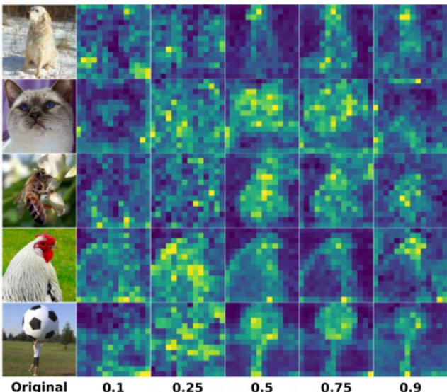
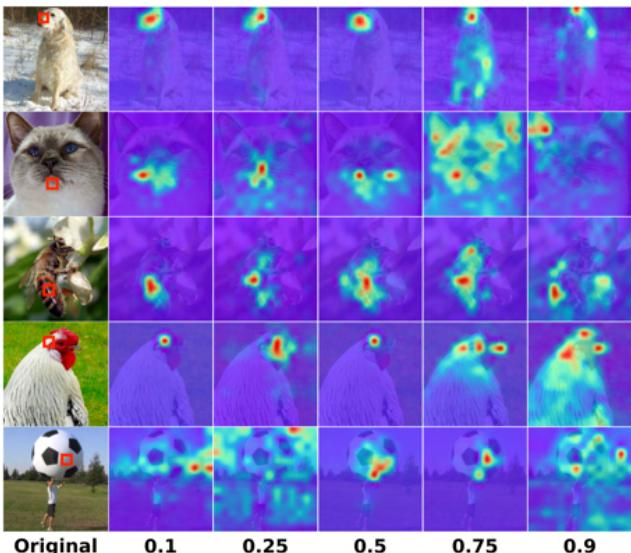
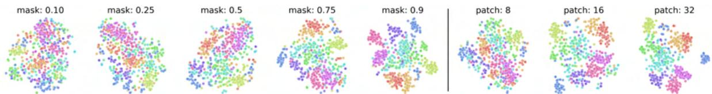

# Understanding Masked Autoencoders via Hierarchical Latent Variable Models

Lingjing Kong\*1 Martin Q. Ma∗1 Guangyi Chen1,2 Eric P. Xing1,2 Yuejie Chi1 Louis-Philippe Morency†1 Kun Zhang†1,2 1Carnegie Mellon University 2Mohamed bin Zayed University of Artificial Intelligence

## Abstract

Masked autoencoder (MAE), a simple and effective selfsupervised learningframework based on the reconstruction of masked image regions, has recently achieved prominent success in a variety of vision tasks. Despite the emergence of intriguing empirical observations on MAE, a theoretically principled understanding is still lacking. In this work, we formally characterize and justify existing empirical insights and provide theoretical guarantees of MAE. We formulate the underlying data-generating process as a hierarchical latent variable model, and show that under reasonable assumptions, MAE provably identifies a set of latent variables in the hierarchical model, explaining why MAE can extract high-level information from pixels. Further, we show how key hyperparameters in MAE (the masking ratio and the patch size) determine which true latent variables to be recovered, therefore influencing the level of semantic information in the representation. Specifically, extremely large or small masking ratios inevitably lead to low-level representations. Our theory offers coherent explanations ofexisting empirical observations and provides insightsfor potential empirical improvements and fundamental limitations of the masked-reconstruction paradigm. We conduct extensive experiments to validate our theoretical insights.

## 1. Introduction

Self-supervised learning (SSL) has achieved tremendous success in learning transferable representations without labels, showing strong results in a variety of downstream tasks [12,14,16,23,49]. As a major SSL paradigm, masked image modeling (MIM) [1–3,11,13,22,41,63,69] performs the reconstruction of purposely masked image pixels as the pretraining task. Among MIM methods, masked autoencoding (MAE) [22] has gained significant traction due to its computational efficiency and state-of-the-art performance in a wide range of downstream tasks.

Empirical observations from previous work reveal various intriguing properties of MAE. In particular, aggressive masking has been shown critical to downstream task performances [22, 28, 61, 63]. It is conjectured that such masking forces the model to learn meaningful high-level semantic understanding of the objects and scenes rather than the low-level information such as texture. However, it remains largely unclear whether such intuitions are sound in principle. Theoretically verifying and characterizing these empirical insights would not only grant a certificate to the current approaches but would also offer theoretical insights for algorithmic advancements.

  
Figure 1. Masking-reconstruction under a hierarchical generating process. In a hierarchical data-generating process, high-level latent variables (e.g., z ) represent high-level information such as semantics, and low-level latent variables (e.g., [z2, z3, z4]) represent low-level information such as texture. We show that through proper masking, MAE learns to recover high-level latent variables with identifiability guarantees.

In this work, we establish a principled yet intuitive framework for understanding MAE and providing identifiability guarantees. Concretely, we first formulate the underlying data-generating process as a hierarchical latent variable model (Figure 1), with high-level variables corresponding to abstract and semantic information like classes, and low-level variables corresponding to elaborate and granular information like texture. Such latent variable models have been studied in causal discovery [29, 62]. In [27, 50], it is hypothesized that complex data, such as images, follow a hierarchical latent structure.

Stemming from this formulation, we show that under reasonable assumptions, MAE can recover a subset of the true latent variables within the hierarchy, where the levels of the learned latent variables are explicitly determined by how masking is performed. Our theoretical framework not only unifies existing empirical observations in a coherent fashion but also gives rise to insights for potential empirical improvements and fundamental limitations of MAE. Our theory improves the existing nonlinear identifiability results [45, 58] and can be of independent interest.

Empirically, we deduce several insights from our theoretical results and verify them with experiments. Unlike common belief, MAE trained with extremely high masking ratios (e.g., 90%) captures low-level information, similar to models trained with extremely low ratios (e.g., 10%). Our results suggest that learning high-level semantic information is only possible in the non-extreme masking regime. We also discuss masking designs that can potentially improve current empirical performance.

Contributions. We highlight the following contributions:

• We formulate the underlying data-generating process as a hierarchical latent variable model. Under such a formulation, we provide a theoretical guarantee for MAE by showing that it can recover true latent variables in the hierarchical model.

• Based on our theoretical results, we establish the connection between masking hyperparameters (i.e., masking ratios and patch sizes) and the learned representation and discuss potential improvements and inherent limitations of MAE.

• We validate our theoretical insights with extensive experimental results. We illustrate how the semantic level of the learned representation varies with the aggressiveness of the masking strategy. Interestingly, representations learned under overly aggressive masking (e.g. 90% masking ratio) exhibit similar properties to their counterparts learned with overly conservative masking (e.g. 10% masking ratio).

## 2. Theoretical understanding

## 2.1. A hierarchical data-generating process

Images, despite their high dimensionality, are well structured – there is a multitude of statistical dependencies among pixels determined by their relative distances and visual semantics. For instance, pixels in close proximity are often highly dependent, whereas pixels far apart typically share less information. There has been a plethora of work adopting this intuition for vision tasks such as image generation [47, 55, 67]. Similar insights are also addressed in attempts to learn a part-whole image representation [27,50].

  
Figure 2. A hierarchical data-generating process. z represents the latent variables and x stands for the observable variables (i.e. image pixels). The hierarchical model is generic and is capable of modeling arbitrary DAGs in the latent space.

In this work, we formulate such an underlying structure of images with a hierarchical data-generating process [1, 29, 62] (Figure 2). Under this formulation, we reveal the underpinning principle of MAE and provide identifiability guarantees. In particular, we show that through masking-reconstruction, MAE learns the long-range statistical dependencies within the image, which renders it capable of extracting high-level semantic representations.

Formally, the generating process is defined with a graph structure $\mathbf { G } : = ( \mathbf { V } , \mathbf { E } )$ where E is the set of all directed edges and $\mathbf { V } : = ( \mathbf { X } , \mathbf { Z } )$ comprises all observable variables $\mathbf { X } : = \{ \mathbf { x } _ { 1 } , \hdots , \mathbf { x } _ { m } \}$ (i.e., all pixels) and all latent variables $\textbf { Z } : = \{ \mathbf { z } _ { 1 } , \ldots , \mathbf { z } _ { n } \}$ . Each variable $\mathbf { x } _ { i }$ or $\mathbf { z } _ { j }$ represents a multidimensional vector. 1 The hierarchical latent structure G fulfills the following assumption:

Assumption 1. (Data-generating process): There is no direct edge between any two observables: $\forall \mathbf { x } _ { i } , \mathbf { x } _ { j } \ \in \textbf { X }$ $( \mathbf { x } _ { i } , \mathbf { x } _ { j } ) \not \in \mathbf { E }$ and $( \mathbf { x } _ { j } , \mathbf { x } _ { i } ) \not \in \mathbf { E }$ . Each variable is generated by its parents in a directed acyclic graph (DAG) according to:

$$
\begin{array} { r l } & { \mathbf { z } _ { i } = g _ { \mathbf { z } _ { i } } ( P a ( \mathbf { z } _ { i } ) , \pmb { \varepsilon } _ { i } ) , } \\ & { \mathbf { x } _ { j } = g _ { \mathbf { x } _ { j } } ( P a ( \mathbf { x } _ { j } ) , \pmb { \varepsilon } _ { j } ) , } \end{array}\tag{1}
$$

where $g _ { { \mathbf { z } } _ { i } }$ and $g _ { \mathbf { x } _ { j } }$ are invertible functions, $\varepsilon _ { i }$ denotes exogenous random variables, and $P a ( \cdot )$ denotes the parents of a certain node.

The invertible data-generating-module assumption $( g _ { i }$ and $g _ { j }$ being invertible) is adopted from prior work identifying latent variables in deep generative models [18, 58]. We make the following remarks on the hierarchical generating process. First, we note that we impose minimal constraints on the graph structure among the latent variables $( \mathrm { i . e . } ,$ , the connectivity among latent variables z); therefore, the hierarchical model class is generic and encompasses all possible DAG structures over latent variables (Figure 2). Next, we interpret the latent variables z as information related to semantic/content information, such as the shape and contour in the image, whereas the exogenous variables ε injected in each layer represent nuanced information such as the texture and contrast of the image. Each structural function $g _ { i }$ mixes the two sources of information and generates a more low-level variable until pixels x. Lastly, for the upcoming theoretical results, as long as the data-generating process conforms to the hierarchical graph assumption, our theory holds and the insights do not rely on the knowledge of a specific graph structure.

## 2.2. Masked Autoencoder

As a canonical method of masking-reconstruction learning, MAE [22] randomly masks a subset of pixel patches in the original image and then reconstructs the masked patches from the encoded representation of the visible part. More formally, we formulate the MAE training as follows.

Mask sampling: random masks m are sampled from a distribution $p _ { \mathbf { m } }$ which is parameterized by the masking ratio $r ~ ( \mathrm { i . e }$ ., the ratio between the number of masked pixels and the number of all pixels) and patch size $s \ ( \mathrm { i . e . }$ , the size of the minimal masking unit).

MAE encoding: $E _ { \mathbf { m } ^ { c } } ( \mathbf { x _ { m } } . c )$ maps the unmasked part $\mathbf { X _ { m } } c$ to a latent representation ${ \hat { \mathbf { c } } } \ { } ^ { 2 } .$ , where $\mathbf { m } ^ { c }$ denotes the complement of the mask index set m and is passed to the encoder as positional embeddings to indicate the positions of the visible patches.

MAE decoding: $D _ { \mathbf { m } } ( \hat { \mathbf { c } } , \hat { \mathbf { s } } _ { \mathbf { m } } )$ reconstructs the masked image $\mathbf { x _ { m } }$ from the estimated latent variable ${ \hat { \mathbf { c } } } \ ( { \mathrm { i . e . } }$ , the encoder output), and the auxiliary information $\hat { \mathbf { s } } _ { \mathbf { m } }$ embodying positional embeddings and [MASK] token which are fed to the decoder in MAE. Although $\hat { \mathbf { s } } _ { \mathbf { m } }$ is deterministic in MAE implementation, we view it as a random variable in our analysis.

With the notation above, the MAE training objective can be expressed as follows:

$$
L ( E , D ) : = \mathbb { E } _ { \mathbf { m } , \mathbf { x } , \hat { \mathbf { s } } _ { \mathbf { m } } } \left[ \left\| D _ { \mathbf { m } } \left( E _ { \mathbf { m } ^ { c } } ( \mathbf { x _ { m } } \boldsymbol { \hat { c } } ) , \hat { \mathbf { s } } _ { \mathbf { m } } \right) - \mathbf { x _ { m } } \right\| ^ { 2 } \right] .\tag{2}
$$

## 2.3. Identifiability theory

Building upon the formalization above, we show in Theorem 1 that each random mask m would induce a specific (sub)set of latent variables that fully captures the statistical dependency between the masked part and the visible part. We denote this relationship as $\mathbf c \subset \mathbf Z$ where c is the subset of the latent variable set Z.

Theorem 1. (Locating the shared information c): In a hierarchical latent variable structure G,for each specific mask m, there exists a corresponding minimal set of latent variables c such that the generating process of x can be expressed as in Figure 3 where the following conditions are satisfied:

  
Figure 3. Information sharing latent models. Here, $\mathbf { x _ { m } }$ and $\mathbf { x } _ { \mathbf { m } } c$ denote the masked part and the visible part of the image $\mathbf { x } ,$ respectively. c stands for the maximally shared information between $\mathbf { x _ { m } }$ and $\mathbf { x _ { m } } c , \mathbf { s _ { m } }$ and $\mathbf { s } _ { \mathbf { m } ^ { c } }$ refer to the information specific to $\mathbf { x _ { m } }$ and $\mathbf { x } _ { \mathbf { m } } c$ respectively. The dashed line indicates the potential existence of statistical dependence.

1. $\mathbf { x _ { m } } = g _ { \mathbf { x _ { m } } } ( \mathbf { c } , \mathbf { s _ { m } } )$ and $\mathbf { x _ { m ^ { c } } } = g _ { \mathbf { x _ { m ^ { c } } } } ( \mathbf { c } , \mathbf { s _ { m ^ { c } } } )$ where both $g _ { \mathbf { x _ { m } } }$ and $g _ { \mathbf { x } _ { \mathbf { m } } c }$ are invertible;

2. $\mathbf { s _ { m } } \perp ( \mathbf { c } , \mathbf { s _ { m ^ { c } } } ) ;$

3. c is minimal: $\forall \mathbf { c } ^ { \prime } \subset \mathbf { Z }$ such that $d i m ( { \bf c } ^ { \prime } ) < d i m ( { \bf c } ) , { \bf c } ^ { \prime }$ cannot satisfy the two conditions above.

Such c and the corresponding $\mathbf { s _ { m } }$ are unique and can be located from the hierarchical structure by executing Algorithm 1. Furthermore, $\mathbf { S _ { m } } c$ can be found through $A l g o -$ rithm 2.

The proof, Algorithm 1, and Algorithm 2 can be found in Appendix A. We note that although the minimal c and its corresponding $\mathbf { s _ { m } }$ are unique for a given mask m, there is no unique $\mathbf { S _ { m } } c$ in general. Algorithm 2 returns one such instance.

Theorem 1 states that for each mask m, there exists a corresponding c that represents all the information contained in the visible part $\mathbf { X _ { m } } c$ that is conducive to reconstructing the masked part $\mathbf { x _ { m } } .$ Algorithm 1 can locate such c in the hierarchy and directly characterizes the impact of masking on the property of c.

Next, in Theorem 2, we show that MAE learning objective (Equation 2) estimates c specified in Theorem 1, and MAE attains a form of identifiability of c. We first lay out the assumptions:

Assumption 2. (MAE model): For any mask m, the MAE decoder $D _ { \mathbf { m } } ( \hat { \mathbf { c } } , \hat { \mathbf { s } } _ { \mathbf { m } } )$ has a non-singular Jacobian matrix almost anywhere, and there exists an invertible function $\tilde { g } _ { \mathbf { m } ^ { c } } ( \cdot )$ such that MAE encoder $E _ { \mathbf { m } ^ { c } } ( \cdot ) \ = \ [ \tilde { g } _ { \mathbf { m } ^ { c } } ^ { - 1 } ( \cdot ) ] _ { 1 : d _ { c } }$ where $[ \cdot ] _ { 1 : d _ { c } }$ denotes the dimensions corresponding to c. Moreover, $( D _ { \mathbf { m } } , \tilde { g } _ { \mathbf { m } ^ { c } } )$ forms an invertible mapping between $( \hat { \mathbf { c } } , \hat { \mathbf { s } } _ { \mathbf { m } } , \hat { \mathbf { s } } _ { \mathbf { m } ^ { c } } )$ and $\left( \mathbf { x _ { m } } , \mathbf { x _ { m ^ { c } } } \right)$

Next, we show MAE identifies the shared information c:

Theorem 2. (Identifiability of c): For each mask m, given the dimensions $( d _ { \mathbf { c } } , d _ { \mathbf { s } _ { \mathbf { m } } } )$ the encoder function $E _ { \mathbf { m } ^ { c } } ( \cdot )$ recovers all information ofc located in Theorem $I , i . e . ,$ , there exists a one-to-one mapping $h , s . t . , h ( \mathbf { c } ) = \hat { \mathbf { c } }$

In the following, we discuss our assumptions and results. The proof can be found in Appendix B.

Assumption interpretation. Assumption 1 follows prior work identifying latent variables in deep generative models [18, 58] to ensure that latent variables are recoverable from pixels. Assumption 2 requires the MAE encoder $E _ { \mathbf { m } ^ { c } }$ to be part of an invertible function output – this is mild and allows the encoder to be more flexible than invertible functions. The decoder $D _ { \mathbf { m } } ( \hat { \mathbf { c } } , \hat { \mathbf { s } } _ { \mathbf { m } } )$ is assumed to be locally invertible in cˆ almost surely, allowing for a broader class than invertible functions, e.g., nondegenerate polynomials. The joint invertibility of $( D _ { \mathbf { m } } , \tilde { g } _ { \mathbf { m } ^ { c } } )$ is assumed to ensure no information during the estimation process.

How does MAE work? Theorem 2 states that the MAE objective (Equation 2) essentially serves to estimate the shared variable c and is able to restore all information in c. Therefore, the efficacy of MAE stems from its ability to extract high-level semantic representations from low-level features like image pixels. Moreover, our theory indicates the possibility of fully identifying a latent hierarchical structure via properly designed self-supervised objectives, opening up research avenues for future work.

Takeaway: MAE provably recovers high-level representationsfrom low-levelfeatures like pixels.

How does masking influence the learned representation? Theorem 1 establishes a direct connection between the mask m and the shared information c which is further connected to the MAE estimate cˆ in Theorem 2. We can observe that conservative masking with overly small masking ratios and masking patch sizes inevitably leads to low-level latent variables. To see this, in Figure 4a, the mask is not large enough to cover all observable descendants of a desirable high-level variable $\mathbf { z } _ { 1 }$ , thus following Algorithm 1 a low-level variable $\mathbf { z } _ { 3 }$ will mix in cˆ, preventing the model from learning $\mathbf { z } _ { 1 }$ . This insight highlights the necessity of nontrivial masking ratios and patch sizes and resonates with the empirical observations in [22, 28, 63].

Surprisingly, the above reasoning can be applied to the case with extremely aggressive masking: in Figure 4b lowlevel latent variables $\mathbf { z } _ { 6 }$ will be learned by MAE when the visible part is too small to cover all observable descendants of a desirable high-level variable $\mathbf { z } _ { 2 }$ . Thus, the learned representation does not become monotonically more high-level with increasing masking aggressiveness – overly aggressive masking also gives rise to low-level representations. This insight echoes the empirical finding in [61, 63] where the extremely large masking degrades the performance of highlevel downstream tasks like classification [63] but yields relatively low-level representations like the object locations / scales in the image [61]. In Section 3, we present empirical evidence to verify our theoretical insights.

  
(a) Conservative mask

  
(b) Aggressive mask

  
(c) Ideal mask  
Figure 4. The impact of masking on the learned representation. We label the masked pixels with x. We locate the MAE learned latent variables with Algorithm 1 and label them with blue. We can observe that extremely low (left) and high (middle) masking intensities lead to low-level representations, whereas the desirable masking intensity that yields a high-level representation lies in the intermediate masking aggressiveness.

Takeaway: (1) MAE under different masking intensities learns representations of different abstraction levels; (2) Learning high-level representations is very hard with extreme masking.

Is current MAE optimal for representation learning? As reflected in the discussion above, although MAE offers the flexibility of tuning the masking scheme to learn representations of various levels, it is inherently challenging to learn high-level representations by random masking without prior knowledge of the latent structure. In contrast, contrastive learning [5,9,10,12,14,23,64] actively leverages the prior knowledge encoded in data augmentations to extract the augmentation-invariant latent variables [58] which correspond to the high-level latent variables in our hierarchical model. Our theory suggests an explanation for why representations learned by contrastive learning are superior to those of MAE on high-level tasks like linear-probing classification.

Takeaway: Learning high-level representations can be challenging for random masking.

## 3. Experiments

We conduct five sets of experiments and then provide insights into possible empirical improvements over MAE. We investigate the following question: how does the masking aggressiveness influence the representation? To this end, we pretrain MAE using different masking ratios and making patch sizes, and then conduct the following evaluations: 1) measuring structure-level and pixel-level similarities between the reconstructed and the original images; 2) visualizing self-attentions to understand what is learned; 3) performing linear probing on ImageNet-1K (IN1K) and different ImageNet variants; 4) measuring the shape bias [19] which estimates how much a network leverages high-level shape information over low-level texture information; and

  
Figure 5. Reconstruction evaluation using the validation set without masking, based on two structural-level similarity metrics (SSIM and FSIM) and two pixel-level metrics (PSNR and MSE). We plot negative MSE for easier visualization. Higher SSIM and FSIM indicate high-level information is better captured, while higher PSNR and negative MSE indicates better low-level reconstruction.

5) transfer learning on object detection and segmentation.   
Details of experiments can be found in Appendix.

Pretraining overview. We conduct pretraining on IN1K using the MAE pipeline [22], with ViT-Base as the backbone of our study. We conduct two sets of pretraining: 1) fixing patch size at 16 and varying the masking ratios from {0.1, 0.25, 0.5, 0.75, 0.9}. Larger masking ratios suggest larger portions of pixels being masked, i.e., 0.9 suggests 90% of pixels being randomly masked for the encoder. 2) Fix the masking ratio at 0.75 and vary the patch size from {8, 16, 32}. To decouple the patch size for masking images and the patch size hyperparameter in the Vision Transformer, we adopt the implementation from [28]. The patch size studied in this paper refers to the minimal masking unit size, and the hyperparameter of the ViT patch size remains fixed at 8.

## 3.1. Reconstructing high-level or low-level representations

Setup. We begin our study by evaluating the high-level structural similarities and low-level pixel-wise similarities between the reconstructed images from MAE and the original inputs. We choose two metrics for high-level similarities and two metrics for low-level similarities. If the structural similarities are high, MAE captures more perceivable structural semantics from the input. The two high-level similarities are structural similarity index measure [60] (SSIM) and feature similarity index measure [65] (FSIM). Both metrics consider the change of perceptions in structural information [33]. SSIM considers the normalized mean value of the structural similarity between the original and reconstructed images, and FSIM considers the normalized mean value of the feature similarity between the two images. A higher SSIM or a higher FSIM suggests a better reconstruction of high-level information (structural or feature-wise). On the other hand, if the pixel-level similarity between reconstructed images and the original input is high, then MAE is deemed to capture the low-level information about the input better. The two low-level metrics are the mean squared error (MSE), which is the squared differences between the original and reconstructed images in the pixel space, and the peak signal-to-noise ratio (PSNR), which measures the ratio between the power of the maximum possible pixel value and the power of corruption noise. A lower MSE or a higher PSNR suggests a better reconstruction at the pixel level. Note that a very low MSE or a very high PSNR may also suggest that the model captures high-level information well. All four metrics are full reference, meaning that the assessment is based on comparing original and reconstructed images rather than the reconstructed output. We introduce the high-level and low-level metrics below and perform the reconstructions on the IN1K evaluation set. The full details and comparisons of the four metrics can be found in [51].

Evaluation of image reconstructions. We include the results in Figure 5. We plot the negative of the MSE to show a consistent trend with PSNR, so higher means better lowlevel reconstruction. From the first row, varying masking ratios from 0.1 to 0.75, higher masking ratios produce reconstructions with higher structural information similarities with the original image (higher SSIM and FSIM), but the model trained with the extremely high ratio 0.9 captures more low-level information (higher PSNR and higher negative MSE). On the other hand, lower masking ratios tend to reconstruct images that capture low-level information better. From the second row, larger patch sizes produce image reconstructions that capture high-level similarities better, while smaller patch sizes have low-level metrics. The empirical observations validate our insight from Section 2.3: higher masking ratios and patch sizes capture high-level structural information better, but extreme masking ratios (both low and high) capture less high-level and more low-level information.

  
Figure 6. Self-attention of the [CLS] tokens averaged across the heads of the last layer in MAE.

  
Figure 7. Self-attention of an object-related token. Chosen tokens are shown in red squares: dog nose, cat chin, bee abdomen, chicken head, and football center, respectively.

## 3.2. Attention Analysis

In this section, we measure the property of the learned representations of MAE by probing the attention heads. We would like to understand visually how masking ratios and patch sizes influence MAE’s capacity to capture objectcentric semantics. We provide two types of visualization: self-attention on the [CLS] token and self-attention on an object-related token. [CLS] has been considered a compact token to represent the whole image for downstream tasks, although recent work [22] suggests that average pooling of all tokens may achieve slightly better results. Therefore, we also provide an analysis of object-related tokens to evaluate if MAE can contextualize object information

across tokens.

We plot examples of self-attention of the [CLS] token in Figure 6, and self-attention of non-CLS tokens related to the object in Figure 7. From the visualizations, as the masking ratio increases from 10% to 90%, the model is increasingly more able to grasp succinct information about the holistic objects rather than only focusing on the regions around the chosen token. However, extreme ratio 0.9 contains more low-level information and background information and cannot capture most of the remaining tokens related to objects (e.g., the dog, cat, and bee images in Figure 7). Extremely low masking ratios such as 0.1 capture both object-related and background tokens. Similarly, extreme masking ratios contextualize over other object-related tokens worse than intermediate masking ratios. We include the visualizations for patch sizes in Appendix. We observe that models trained with larger patch sizes better capture high-level information, but extreme patch size hurts, which validates our theoretical insight that moderate masking ratios and patch sizes are critical for MAE to learn succinct and comprehensive object information.

## 3.3. Representation linear separability

T-SNE embedding visualizations. To gain a visual understanding of how masking ratios and patch sizes influence the representation structure, we visualize T-SNE [57] embeddings of different models. We randomly select ten classes from ImageNet. The results are shown in Figure 8. From 0.1 to 0.75, a larger masking ratio consistently produces a more linearly separable representation, while the linear separability of representations with masking ratios 0.75 and 0.9 looks visually similar. For different patch sizes, the embeddings are more separated as the patch sizes grow. Non-extreme masking ratios and larger patch sizes generate more linearly separable embeddings.

Linear probing on IN1K. We use linear probing to test how linearly separable the features are in the learned MAE representation. We show the linear probing results in Table 1 in row 1N1K. For different masking ratios, similar to the observation in [22], the accuracy increases steadily until the masking ratio reaches the sweet point of 0.75. Extremely large masking ratio (0.9) hurts performance. For different patch sizes, which are not shown in [22], we observe that the accuracy increases first from 8 to 16, then decreases significantly when the patch size is 32. From the results, higher masking ratios and larger patch sizes perform better at linear probing than lower masking ratios, but extreme masking hurts linear probing.

Robustness evaluation on ImageNet variants. We evaluate the robustness of the MAE models on different variants of ImageNet validation datasets, or object detection datasets that share similar class information with ImageNet-1K: ImageNet-v2 (INV2) [52], ObjectNet (OJN) [4], ImageNet-Adversarial (IN-A) [25], ImageNet-Rendition [4], and ImageNet-Sketch (IN-S) [59]. These datasets share similar semantics and labels with ImageNet but are under different data distributions. The MAE models are first trained in a supervised fashion on IN1K for linear probing, and inference is run on the evaluation sets without any training. Table 1 shows for all evaluation datasets, a reasonably large masking ratio (i.e., 0.75) achieves better robustness than smaller (i.e., 0.25) masking ratios, although extremely large (0.9) or small (0.1) masking ratios hurt the performance. For patch sizes, larger patch sizes yield better robustness evaluations on IN-v2, OJN, IN-R, and IN-S. Non-extreme masking ratios and large patch sizes have stronger robustness performances than extreme masking ratios or patch sizes.

  
Figure 8. T-SNE embeddings of different MAE models under varied masking ratios and patch sizes. We fix the patch size at 16 to vary the masking ratios and fix the masking ratio at 0.75 to change the patch sizes. Each color represents one ImageNet class.

<table><tr><td>mask ratio</td><td>patch size</td><td>IN1K IN-v2</td><td>OJN</td><td>IN-R</td><td>IN-A</td><td>IN-S</td></tr><tr><td>0.1</td><td>16</td><td>47.45 34.72</td><td>9.42</td><td>14.63</td><td>2.00</td><td>7.25</td></tr><tr><td>0.25</td><td>16</td><td>53.58</td><td>40.34 11.54</td><td>18.68</td><td>2.49</td><td>10.27</td></tr><tr><td>0.5</td><td>16</td><td>60.07 46.71</td><td>13.94</td><td>22.44</td><td>2.89</td><td>12.58</td></tr><tr><td>0.75</td><td>16</td><td>67.41 54.23</td><td>18.24</td><td>25.20</td><td>3.76</td><td>15.51</td></tr><tr><td>0.9</td><td>16</td><td>62.97</td><td>49.52 15.87</td><td>19.11</td><td>2.76</td><td>10.46</td></tr><tr><td>0.75</td><td>8</td><td>62.57</td><td>49.17</td><td>13.44 19.42</td><td>3.73</td><td>10.73</td></tr><tr><td>0.75</td><td>16</td><td>68.96</td><td>55.94 13.73</td><td>24.23</td><td>6.29</td><td>18.81</td></tr><tr><td>0.75</td><td>32</td><td>73.31</td><td>61.35</td><td>19.03</td><td>27.84 12.69</td><td>28.30</td></tr></table>

Table 1. Accuracy (%) of linear probing and robustness evaluation on ImageNet variants and ObjectNet. We linear-probe MAE via supervised training on IN1K, and then perform inference on IN1K as well as other evaluation sets.

## 3.4. Shape Bias

Texture vs. shape bias. Next, we analyze to what extent different MAE models rely on high-level vs. low-level information. We follow the analysis in [19], where the authors study whether a model leverages more low-level textures than high-level shapes for classification. As shown in Table 2, intermediate masking ratios (i.e., 0.25, 0.5, and 0.75) show a high level of shape bias, suggesting that the corresponding models exploit more high-level shape information. In contrast, extreme masking ratios (i.e., 0.1 and 0.9) leverage more low-level textures. This suggests that extreme masking schemes make it more difficult to capture high-level shapesfor MAE.

## 3.5. Transfer Learning

Next, we evaluate the quality of MAE models on different downstream tasks. Specifically, we look at object detection and segmentation on the COCO dataset [43], which requires a strong semantic understanding of the scenes. We finetune Mask R-CNN [24] end-to-end using MAEpretrained ViT weights. Following the practice in [22], we adapt the ViT backbone to make it compatible with FPN [42]. In Table 3, we report box AP for object detection and mask AP for instance segmentation. We reduce the number of epochs to 45 due to computational constraints. We observe that the 0.75 masking ratio yields the best detection and segmentation average precision, suggesting that the masking ratio 0.75 generates representation with the best semantic understanding. The extremely high masking ratio of 0.9 and a low masking ratio of 0.1 hurt the performance. Results of different patch size experiments are included in Appendix. The results suggest that higher, but not extreme, masking ratios generate the best representation of object detection and segmentation tasks.

<table><tr><td>mask ratio</td><td>0.1</td><td>0.25</td><td>0.5</td><td>0.75</td><td>0.9</td></tr><tr><td>shape bias</td><td>0.1352</td><td>0.2545</td><td>0.2458</td><td>0.2563</td><td>0.2014</td></tr></table>

Table 2. Shape bias [19] measurement, a higher metric indicates that the model classifies images relying on the high-level shape feature rather than the low-level texture feature.
<table><tr><td>mask ratio</td><td>mask size</td><td>Apbox</td><td>APmask</td></tr><tr><td>0.1</td><td>16</td><td>30.47</td><td>28.24</td></tr><tr><td>0.25</td><td>16</td><td>32.38</td><td>29.95</td></tr><tr><td>0.5</td><td>16</td><td>34.87</td><td>32.11</td></tr><tr><td>0.75</td><td>16</td><td>39.72</td><td>36.35</td></tr><tr><td>0.9</td><td>16</td><td>37.17</td><td>34.35</td></tr></table>

Table 3. COCO object detection and segmentation using a ViT Mask R-CNN baseline.

## 3.6. Potential algorithmic improvements

Lastly, we discuss empirical suggestions based on our results that could benefit the performance of MAE.

First, as discussed in Section 2, when reconstructing the masked pixels near the boundary between the masked and unmasked regions, the model uses nearby visible pixels to interpolate, therefore capturing low-level pixel information. If high-level representation is desired for downstream tasks, the boundary pixels may be ignored when calculating the objective function.

Next, in light of the limitation of random masking in Section 2, one may leverage the latent structure of the underlying data-generating process for masking designs, which can serve as a more principle approach than recent work that exploits auxiliary information for masking [34, 40, 41, 53]. To this end, one may take advantage of the recent development of causal discovery [29, 62] to identify the latent structure.

Lastly, if low-level information is preferable for downstream tasks, an extremely high masking ratio can retain such information and is more computationally efficient than its low masking ratio counterpart.

## 4. Related work

## 4.1. Masked Autoencoders

Masked image modeling (MIM) [1–3, 11, 13, 22, 41, 63, 69] has been gaining momentum recently due to their sotaof-the-art performances over many downstream tasks. The pretraining objective is simple in its basic form: the model is tasked to predict the masked-out image pixels with the information of the unmasked part. Despite the simplicity of the task, many intriguing properties have been observed on MIM that escape rigorous analysis. For instance, small masking ratios and masking patch sizes are empirically shown detrimental to downstream tasks like classification [22, 28]. It is hypothesized that aggressive masking forces to model to leverage more global information, rather than local interpolation [22]. However, whether such intuition is theoretically justifiable remains elusive. In this work, we provide theoretical verification of such intuitions and further derive insights into MAE’s empirical behavior.

## 4.2. Theoretical Understanding of MAE

Despite the prominent success of MAE, only a limited number of papers are dedicated to understanding its underlying mechanism in a principled manner [8, 39, 48, 66]. Lee et al. [39] establish the connection between the inpainting pretraining task and downstream tasks by assuming that the downstream task target captures the statistical dependency between the visible part and the masked part in the inpainting. Under this assumption, they show that the sampling complexity of the downstream task can be largely reduced by pretraining. Cao et al. [8] inquire into the interactions between the transformer architecture and the MAE representation, highlighting the critical role of the attention mechanism in the success of MAE. Pan et al. [48] make a multi-view assumption on the samples, showing that MAE can extract class-relevant semantics with shallow convolutional models. Zhang et al. [66] study masking through the data-augmentation perspective and employ the augmentation graph [21] to illustrate the impact of masking on downstream task performance. In contrast, our work employs the hierarchical latent variable model, which lets us directly examine the relationship between the masking operation and the learned representations. Also, our theoretical guarantee is on the statistical identifiability of the true data-generating process rather than the statistical/optimization complexities

as in most prior work.

## 4.3. Identifiability guarantees for nonlinear latentvariable models

In unsupervised learning, identifiability means latent variables involved in the underlying data-generating process can be estimated from observational data. This is critical to tasks like feature disentanglement [7, 26, 30, 35] in the image generation community. However, principled disentanglement in the non-linear regime is challenging and even proved impossible without additional assumptions on the data-generating process [44]. Recent advances in independent component analysis (ICA) [6, 15, 31] obtain identifiability in the non-linear regime by imposing additional constraints on either the latent variable distribution or the function class variables [20, 32, 36–38, 45, 54, 58, 68]. Most relevant to ours are the identifiability theories in [45, 58] in which similar latent causal models (Figure 3) are studied. Specifically, our model allows the generating functions $g _ { \mathbf { m } } \neq g _ { \mathbf { m } ^ { c } }$ to be distinct (cf. identical functions assumed in [58]) and statistical dependence between c and $\mathbf { s _ { m ^ { c } } }$ (cf. independence assumed in [46]). Additionally, both works [46, 58] focus on contrastive learning with data augmentation, while our subject is MAE.

## 5. Conclusion

In this work, we formulate the data-generating process as a hierarchical latent variable model and provide guarantees that MAE can identify the true variables in such a hierarchical latent model. We then show how different masking ratios and patch sizes determine the set of true latent variables to be recovered, which influences the representation abstractions learned in MAE. Empirically, we show that non-extreme masking ratios or patch sizes often capture succinct and robust high-level information, while extreme masking ratios capture more low-level information.

Acknowledgement We thank the Google TRC program for the TPU Research Cloud support, Ronghang Hu and Xinlei Chen for the MAE TPU code, Biwei Huang for technical discussions, Tao Lin for feedback on the manuscript, and anonymous reviewers for valuable feedback. The work of LK and YC is supported in part by NSF under the grants CCF-1901199 and DMS-2134080, and by ONR under the grant N00014-19-1-2404. The work of MM and LP is partially supported by BMW, National Science Foundation awards 1722822 and 1750439, and National Institutes of Health awards R01MH125740, R01MH096951, R21MH130767 and R01MH132225. This project is also partially supported by the National Institutes of Health (NIH) under Contract R01HL159805, by the NSF-Convergence Accelerator Track-D award 2134901, by a grant from Apple Inc., a grant from KDDI Research Inc, and generous gifts from Salesforce Inc., Microsoft Research, and Amazon Research.

## References

[1] Animashree Anandkumar, Daniel Hsu, Adel Javanmard, and Sham Kakade. Learning linear bayesian networks with latent variables. In International Conference on Machine Learning, pages 249–257. PMLR, 2013. 1, 2, 8

[2] Alexei Baevski, Wei-Ning Hsu, Qiantong Xu, Arun Babu, Jiatao Gu, and Michael Auli. Data2vec: A general framework for self-supervised learning in speech, vision and language. arXiv preprint arXiv:2202.03555, 2022. 1, 8

[3] Hangbo Bao, Li Dong, and Furu Wei. Beit: Bert pre-training of image transformers. arXiv preprint arXiv:2106.08254, 2021. 1, 8

[4] Andrei Barbu, David Mayo, Julian Alverio, William Luo, Christopher Wang, Dan Gutfreund, Josh Tenenbaum, and Boris Katz. Objectnet: A large-scale bias-controlled dataset for pushing the limits of object recognition models. Advances in neural information processing systems, 32, 2019. 7, 14

[5] Adrien Bardes, Jean Ponce, and Yann LeCun. Vicreg: Variance-invariance-covariance regularization for selfsupervised learning. arXiv preprint arXiv:2105.04906, 2021. 4

[6] Anthony J Bell and Terrence J Sejnowski. An informationmaximization approach to blind separation and blind deconvolution. Neural computation, 7(6):1129–1159, 1995. 8

[7] Christopher P Burgess, Irina Higgins, Arka Pal, Loic Matthey, Nick Watters, Guillaume Desjardins, and Alexander Lerchner. Understanding disentangling in beta vae. arXiv preprint arXiv:1804.03599, 2018. 8

[8] Shuhao Cao, Peng Xu, and David A. Clifton. How to understand masked autoencoders, 2022. 8

[9] Mathilde Caron, Ishan Misra, Julien Mairal, Priya Goyal, Piotr Bojanowski, and Armand Joulin. Unsupervised learning of visual features by contrasting cluster assignments. ArXiv, abs/2006.09882, 2020. 4

[10] Mathilde Caron, Hugo Touvron, Ishan Misra, Herve J´ egou,´ Julien Mairal, Piotr Bojanowski, and Armand Joulin. Emerging properties in self-supervised vision transformers. In Proceedings of the IEEE/CVF International Conference on Computer Vision, pages 9650–9660, 2021. 4, 14

[11] Mark Chen, Alec Radford, Rewon Child, Jeffrey Wu, Heewoo Jun, David Luan, and Ilya Sutskever. Generative pretraining from pixels. In Hal Daume III and Aarti Singh,´ editors, Proceedings of the 37th International Conference on Machine Learning, volume 119 of Proceedings of Machine Learning Research, pages 1691–1703. PMLR, 13–18 Jul 2020. 1, 8

[12] Ting Chen, Simon Kornblith, Mohammad Norouzi, and Geoffrey Hinton. A simple framework for contrastive learning of visual representations. In International conference on machine learning, pages 1597–1607. PMLR, 2020. 1, 4

[13] Xiaokang Chen, Mingyu Ding, Xiaodi Wang, Ying Xin, Shentong Mo, Yunhao Wang, Shumin Han, Ping Luo, Gang Zeng, and Jingdong Wang. Context autoencoder for self-supervised representation learning. arXiv preprint arXiv:2202.03026, 2022. 1, 8

[14] Xinlei Chen, Saining Xie, and Kaiming He. An empirical study of training self-supervised vision transformers. In Proceedings of the IEEE/CVF International Conference on Computer Vision, pages 9640–9649, 2021. 1, 4

[15] Pierre Comon. Independent component analysis, a new concept? Signal processing, 36(3):287–314, 1994. 8

[16] Jacob Devlin, Ming-Wei Chang, Kenton Lee, and Kristina Toutanova. Bert: Pre-training of deep bidirectional transformers for language understanding. arXiv preprint arXiv:1810.04805, 2018. 1

[17] Alexey Dosovitskiy, Lucas Beyer, Alexander Kolesnikov, Dirk Weissenborn, Xiaohua Zhai, Thomas Unterthiner, Mostafa Dehghani, Matthias Minderer, Georg Heigold, Sylvain Gelly, et al. An image is worth 16x16 words: Transformers for image recognition at scale. arXiv preprint arXiv:2010.11929, 2020. 14

[18] Locatello et al. Weakly-supervised disentanglement without compromises. 2, 4

[19] Robert Geirhos, Patricia Rubisch, Claudio Michaelis, Matthias Bethge, Felix A Wichmann, and Wieland Brendel. Imagenet-trained cnns are biased towards texture; increasing shape bias improves accuracy and robustness. arXiv preprint arXiv:1811.12231, 2018. 4, 7, 15

[20] Hermanni Halv ¨ a and Aapo Hyvarinen. Hidden markov non-¨ linear ica: Unsupervised learning from nonstationary time series. In Conference on Uncertainty in Artificial Intelligence, pages 939–948. PMLR, 2020. 8

[21] Jeff Z HaoChen, Colin Wei, Adrien Gaidon, and Tengyu Ma. Provable guarantees for self-supervised deep learning with spectral contrastive loss. Advances in Neural Information Processing Systems, 34:5000–5011, 2021. 8

[22] Kaiming He, Xinlei Chen, Saining Xie, Yanghao Li, Piotr Dollar, and Ross Girshick. Masked autoencoders are scalable´ vision learners, 2021. 1, 3, 4, 5, 6, 7, 8, 14, 15

[23] Kaiming He, Haoqi Fan, Yuxin Wu, Saining Xie, and Ross Girshick. Momentum contrast for unsupervised visual representation learning. In Proceedings of the IEEE/CVF conference on computer vision and pattern recognition, pages 9729–9738, 2020. 1, 4

[24] Kaiming He, Georgia Gkioxari, Piotr Dollar, and Ross Gir-´ shick. Mask r-cnn. In Proceedings of the IEEE international conference on computer vision, pages 2961–2969, 2017. 7, 15

[25] Dan Hendrycks, Kevin Zhao, Steven Basart, Jacob Steinhardt, and Dawn Song. Natural adversarial examples. In Proceedings of the IEEE/CVF Conference on Computer Vision and Pattern Recognition, pages 15262–15271, 2021. 7, 14

[26] Irina Higgins, Loic Matthey, Arka Pal, Christopher Burgess, Xavier Glorot, Matthew Botvinick, Shakir Mohamed, and Alexander Lerchner. beta-VAE: Learning basic visual concepts with a constrained variational framework. In International Conference on Learning Representations, 2017. 8

[27] Geoffrey Hinton. How to represent part-whole hierarchies in a neural network. arXiv preprint arXiv:2102.12627, 2021. 1, 2

[28] Ronghang Hu, Shoubhik Debnath, Saining Xie, and Xinlei Chen. Exploring long-sequence masked autoencoders. arXiv preprint arXiv:2210.07224, 2022. 1, 4, 5, 8, 14

[29] Biwei Huang, Charles Jia Han Low, Feng Xie, Clark Glymour, and Kun Zhang. Latent hierarchical causal structure discovery with rank constraints. arXiv preprint arXiv:2210.01798, 2022. 1, 2, 8

[30] Xun Huang, Ming-Yu Liu, Serge Belongie, and Jan Kautz. Multimodal unsupervised image-to-image translation. In Proceedings of the European conference on computer vision (ECCV), pages 172–189, 2018. 8

[31] A. Hyvarinen, J. Karhunen, and E. Oja.¨ Independent Component Analysis. John Wiley & Sons, Inc, 2001. 8

[32] Aapo Hyvarinen, Hiroaki Sasaki, and Richard Turner. Nonlinear ica using auxiliary variables and generalized contrastive learning. In The 22nd International Conference on Artificial Intelligence and Statistics, pages 859–868. PMLR, 2019. 8

[33] Justin Johnson, Alexandre Alahi, and Li Fei-Fei. Perceptual losses for real-time style transfer and super-resolution. In European conference on computer vision, pages 694–711. Springer, 2016. 5

[34] Ioannis Kakogeorgiou, Spyros Gidaris, Bill Psomas, Yannis Avrithis, Andrei Bursuc, Konstantinos Karantzalos, and Nikos Komodakis. What to hide from your students: Attention-guided masked image modeling. arXiv preprint arXiv:2203.12719, 2022. 8

[35] Tero Karras, Samuli Laine, and Timo Aila. A style-based generator architecture for generative adversarial networks. In Proceedings of the IEEE/CVF Conference on Computer Vision and Pattern Recognition (CVPR), June 2019. 8

[36] Ilyes Khemakhem, Diederik Kingma, Ricardo Monti, and Aapo Hyvarinen. Variational autoencoders and nonlinear ica: A unifying framework. In International Conference on Artificial Intelligence and Statistics, pages 2207–2217. PMLR, 2020. 8

[37] Lingjing Kong, Shaoan Xie, Weiran Yao, Yujia Zheng, Guangyi Chen, Petar Stojanov, Victor Akinwande, and Kun Zhang. Partial disentanglement for domain adaptation. In Kamalika Chaudhuri, Stefanie Jegelka, Le Song, Csaba Szepesvari, Gang Niu, and Sivan Sabato, editors, Proceedings of the 39th International Conference on Machine Learning, volume 162 of Proceedings of Machine Learning Research, pages 11455–11472. PMLR, 17–23 Jul 2022. 8

[38] Sebastien Lachapelle, Pau Rodr´ ´ıguez Lopez, Yash Sharma,´ Katie Everett, Remi Le Priol, Alexandre Lacoste, and Si-´ mon Lacoste-Julien. Disentanglement via mechanism sparsity regularization: A new principle for nonlinear ica. arXiv preprint arXiv:2107.10098, 2021. 8

[39] Jason D. Lee, Qi Lei, Nikunj Saunshi, and Jiacheng Zhuo. Predicting what you already know helps: Provable selfsupervised learning, 2021. 8

[40] Gang Li, Heliang Zheng, Daqing Liu, Chaoyue Wang, Bing Su, and Changwen Zheng. Semmae: Semantic-guided masking for learning masked autoencoders. arXiv preprint arXiv:2206.10207, 2022. 8

[41] Zhaowen Li, Zhiyang Chen, Fan Yang, Wei Li, Yousong Zhu, Chaoyang Zhao, Rui Deng, Liwei Wu, Rui Zhao, Ming

Tang, et al. Mst: Masked self-supervised transformer for visual representation. Advances in Neural Information Processing Systems, 34:13165–13176, 2021. 1, 8

[42] Tsung-Yi Lin, Piotr Dollar, Ross Girshick, Kaiming He,´ Bharath Hariharan, and Serge Belongie. Feature pyramid networks for object detection. In Proceedings of the IEEE conference on computer vision and pattern recognition, pages 2117–2125, 2017. 7, 15

[43] Tsung-Yi Lin, Michael Maire, Serge Belongie, James Hays, Pietro Perona, Deva Ramanan, Piotr Dollar, and C Lawrence´ Zitnick. Microsoft coco: Common objects in context. In European conference on computer vision, pages 740–755. Springer, 2014. 7, 15

[44] Francesco Locatello, Stefan Bauer, Mario Lucic, Gunnar Raetsch, Sylvain Gelly, Bernhard Scholkopf, and Olivier¨ Bachem. Challenging common assumptions in the unsupervised learning of disentangled representations. In international conference on machine learning, pages 4114–4124. PMLR, 2019. 8

[45] Qi Lyu, Xiao Fu, Weiran Wang, and Songtao Lu. Latent correlation-based multiview learning and self-supervision: A unifying perspective. arXiv preprint arXiv:2106.07115, 2021. 2, 8

[46] Qi Lyu, Xiao Fu, Weiran Wang, and Songtao Lu. Understanding latent correlation-based multiview learning and self-supervision: An identifiability perspective. In International Conference on Learning Representations, 2022. 8

[47] Lars Maaløe, Marco Fraccaro, Valentin Lievin, and Ole´ Winther. Biva: A very deep hierarchy of latent variables for generative modeling. Advances in neural information processing systems, 32, 2019. 2

[48] Jiachun Pan, Pan Zhou, and Shuicheng Yan. Towards understanding why mask-reconstruction pretraining helps in downstream tasks. arXiv preprint arXiv:2206.03826, 2022. 8

[49] Alec Radford, Jong Wook Kim, Chris Hallacy, Aditya Ramesh, Gabriel Goh, Sandhini Agarwal, Girish Sastry, Amanda Askell, Pamela Mishkin, Jack Clark, et al. Learning transferable visual models from natural language supervision. In International Conference on Machine Learning, pages 8748–8763. PMLR, 2021. 1

[50] Sara Sabour, Nicholas Frosst, and Geoffrey E Hinton. Dynamic routing between capsules. Advances in neural information processing systems, 30, 2017. 1, 2

[51] Umme Sara, Morium Akter, and Mohammad Shorif Uddin. Image quality assessment through fsim, ssim, mse and psnr—a comparative study. Journal of Computer and Communications, 7(3):8–18, 2019. 5

[52] Vaishaal Shankar, Rebecca Roelofs, Horia Mania, Alex Fang, Benjamin Recht, and Ludwig Schmidt. Evaluating machine accuracy on imagenet. In International Conference on Machine Learning, pages 8634–8644. PMLR, 2020. 7, 14

[53] Yuge Shi, N. Siddharth, Philip H. S. Torr, and Adam R. Kosiorek. Adversarial masking for self-supervised learning, 2022. 8

[54] Peter Sorrenson, Carsten Rother, and Ullrich Kothe. Dis-¨ entanglement by nonlinear ica with general incompressible-

flow networks (gin). arXiv preprint arXiv:2001.04872, 2020. 8

[55] Arash Vahdat and Jan Kautz. Nvae: A deep hierarchical variational autoencoder. Advances in Neural Information Processing Systems, 33:19667–19679, 2020. 2

[56] Laurens Van Der Maaten. Accelerating t-sne using treebased algorithms. The Journal of Machine Learning Research, 15(1):3221–3245, 2014. 14

[57] Laurens Van der Maaten and Geoffrey Hinton. Visualizing data using t-sne. Journal of machine learning research, 9(11), 2008. 6

[58] Julius Von Kugelgen, Yash Sharma, Luigi Gresele, Wieland¨ Brendel, Bernhard Scholkopf, Michel Besserve, and ¨ Francesco Locatello. Self-supervised learning with data augmentations provably isolates content from style. Advances in neural information processing systems, 34:16451–16467, 2021. 2, 4, 8

[59] Haohan Wang, Songwei Ge, Zachary Lipton, and Eric P Xing. Learning robust global representations by penalizing local predictive power. Advances in Neural Information Processing Systems, 32, 2019. 7, 14

[60] Zhou Wang, Alan C Bovik, Hamid R Sheikh, and Eero P Simoncelli. Image quality assessment: from error visibility to structural similarity. IEEE transactions on image processing, 13(4):600–612, 2004. 5

[61] Zhirong Wu, Zihang Lai, Xiao Sun, and Stephen Lin. Extreme masking for learning instance and distributed visual representations. arXiv preprint arXiv:2206.04667, 2022. 1, 4

[62] Feng Xie, Biwei Huang, Zhengming Chen, Yangbo He, Zhi Geng, and Kun Zhang. Identification of linear non-gaussian latent hierarchical structure. In International Conference on Machine Learning, pages 24370–24387. PMLR, 2022. 1, 2, 8

[63] Zhenda Xie, Zheng Zhang, Yue Cao, Yutong Lin, Jianmin Bao, Zhuliang Yao, Qi Dai, and Han Hu. Simmim: A simple framework for masked image modeling. In Proceedings of the IEEE/CVF Conference on Computer Vision and Pattern Recognition, pages 9653–9663, 2022. 1, 4, 8

[64] Jure Zbontar, Li Jing, Ishan Misra, Yann LeCun, and Stephane Deny. Barlow twins: Self-supervised learning via´ redundancy reduction. In International Conference on Machine Learning, pages 12310–12320. PMLR, 2021. 4

[65] Lin Zhang, Lei Zhang, Xuanqin Mou, and David Zhang. Fsim: A feature similarity index for image quality assessment. IEEE transactions on Image Processing, 20(8):2378– 2386, 2011. 5

[66] Qi Zhang, Yifei Wang, and Yisen Wang. How mask matters: Towards theoretical understandings of masked autoencoders. arXiv preprint arXiv:2210.08344, 2022. 8

[67] Shengjia Zhao, Jiaming Song, and Stefano Ermon. Learning hierarchical features from generative models. arXiv preprint arXiv:1702.08396, 2017. 2

[68] Yujia Zheng, Ignavier Ng, and Kun Zhang. On the identifiability of nonlinear ica: Sparsity and beyond. arXiv preprint arXiv:2206.07751, 2022. 8

[69] Jinghao Zhou, Chen Wei, Huiyu Wang, Wei Shen, Cihang Xie, Alan Yuille, and Tao Kong. ibot: Image bert pre-training with online tokenizer. arXiv preprint arXiv:2111.07832, 2021. 1, 8