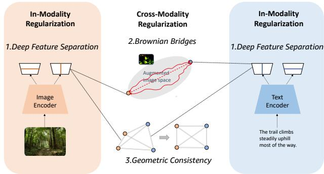
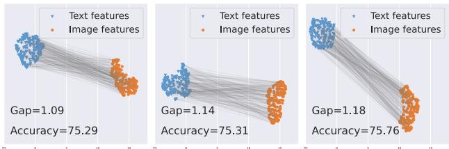
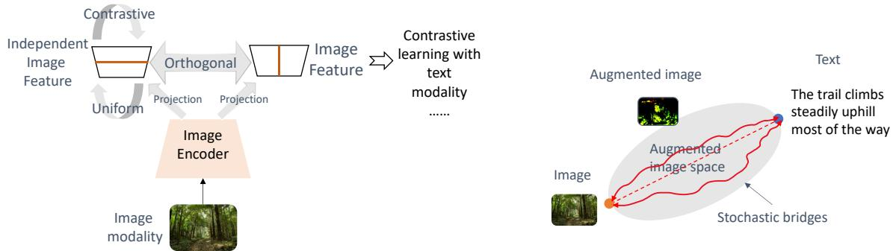
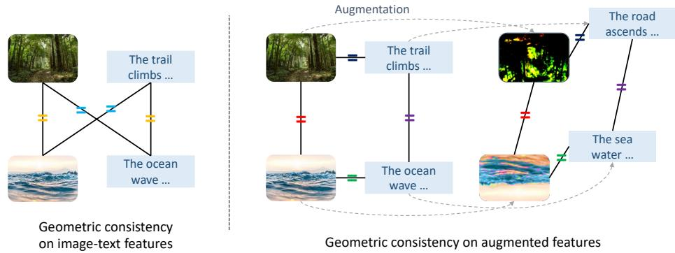
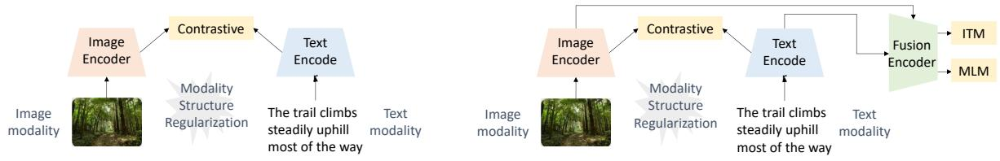

# Understanding and Constructing Latent Modality Structures in Multi-Modal Representation Learning

Qian Jiang1, Changyou Chen2,3, Han Zhao1,3, Liqun Chen\*, Qing Ping3, Son Dinh Tran3, Yi Xu3, Belinda Zeng3, Trishul Chilimbi3 1University of Illinois at Urbana-Champaign 2University at Buffalo 3Amazon

qianj3@illinois.edu lqchen06@outlook.com

vchencha, uhanzhao, pingqing, sontran, yxaamzn, zengb, trishulc @amazon.com

## Abstract

Contrastive loss has been increasingly used in learning representations from multiple modalities. In the limit, the nature of the contrastive loss encourages modalities to exactly match each other in the latent space. Yet it remains an open question how the modality alignment affects the downstream task performance. In this paper, based on an information-theoretic argument, we first prove that exact modality alignment is sub-optimal in general for downstream prediction tasks. Hence we advocate that the key of better performance lies in meaningful latent modality structures instead of perfect modality alignment. To this end, we propose three general approaches to construct latent modality structures. Specifically, we design 1) a deep feature separation loss for intra-modality regularization; 2) a Brownian-bridge lossfor inter-modality regularization; and 3) a geometric consistency loss for both intra- and intermodality regularization. Extensive experiments are conducted on two popular multi-modal representation learning frameworks: the CLIP-based two-tower model and the ALBEF-based fusion model. We test our model on a variety of tasks including zero/few-shot image classification, image-text retrieval, visual question answering, visual reasoning, and visual entailment. Our method achieves consistent improvements over existing methods, demonstrating the effectiveness and generalizability of our proposed approach on latent modality structure regularization.

## 1. Introduction

Vision-language representation learning aims to learn generic representations from images and texts that could benefit multimodal downstream applications. As the two modalities are essentially from different data sources and distributions, how to effectively fuse the two modalities has become an important question. Some work aims to unify the representations of two modalities in one encoder, where the image and text are usually tokenized into sequences [60, 61, 65, 66]. Another line of research represents the image and text modality separately with modality-specific encoders and utilizes contrastive learning to align the modalities, achieving state-of-the-art performance on multiple downstream applications [13, 26, 31, 32, 41, 49, 53, 54, 70].

  
Figure 1. Constructing latent modality structures to improve multimodal representation learning.

Despite the successful empirical practice of contrastive loss in multi-modal representation learning, it remains an open question whether bridging and aligning the two modalities always brings benefits to downstream tasks. One concept closely related to this question is the modality gap [35, 49, 68, 72], where it is defined as the distance between the feature distributions of the two modalities. Modality alignment can be considered as reducing the modality gap. At a first glance, one would conjecture that contrastive loss would reduce the modality gap by pulling positive (paired) image and text data together for better representation. However, a recent study [35] shows evidence that contrastive learning does not always reduce the modality gap. Furthermore, we also show in our empirical analysis that a reduced modality gap does not always guarantee better performance in downstream applications. Motivated by these empirical observations, in this paper we first theoretically study the modality gap problem, by showing that when the modality gap is zero, i.e., exact alignment between the two modalities, the learned representations necessarily have to pay a price for the downstream prediction task, which we term as the information gap between the two modalities (Theorem 3.1). Intuitively, this is because that representations with zero modality gap can only preserve predictive information present in both of the modalities at the cost of losing the modality-specific information.

Our theory then suggests that instead of exact modality matching, whether learned representations are meaningful is an important factor in multi-modal representation learning. In particular, we propose to improve on top of contrastive learning with regularizations to construct better latent structures. We consider intra-modality, inter-modality, and intra-inter-modality regularizations. These regularizations are generalizable and can be applied to various visionlanguage models with modality-specific encoders. Specifically, for intra-modality regularization, motivated by our theoretic result, we propose deep feature separation to encourage the model to preserve both the modality-shared and modality-specific information in different components. For inter-modality regularization, we aim to bridge two modalities with their augmentations. Consequently, we proposed a Brownian bridge loss between the triplet of (text, augmented image, image) to regularize the inter-modality structures. For intra-inter-modality regularization, we introduce the geometric consistency loss that promotes geometric symmetry in the latent space. In summary, the main contributions of this paper are:

• We conduct empirical and theoretical analysis on understanding the impact of the modality alignment on downstream tasks. We show that a reduced modality gap does not always guarantee better performance, and can instead hurt the performance when the information gap between the two modalities is large (Theorem 3.1). Combined with the existing theory of contrastive learning, our theory suggests preserving both modality-shared and modality-specific information.

• Inspired by our theory, we propose three instrumental regularizations on top of the contrastive loss, i.e., the intra-modality, inter-modality, and intra-inter-modality regularizations to improve latent modality structures.

• We conduct extensive and comprehensive experiments on various vision-language models to show that the proposed methods consistently improve over the baselines for different model families (e.g., CLIP and AL-BEF) and for different downstream applications (e.g., cross-modality retrieval, VQA, VR and etc).

## 2. Related work

Most recent works on vision-language representation learning can be categorized based on how information from different modalities is used for joint learning. The first category applies unified models [60, 61, 65, 66] to process both images and texts, where the inputs are usually tokenized into sequences [2, 48]. Unified models feature simpler and more universal designs, but typically underperform methods with modality-specific encoders (the second category). These methods use separate encoders for images and texts (e.g. CLIP [41, 49, 53], ALIGN [26]), and rely on contrastive loss [6, 21, 45] to align multiple modalities. These methods have been shown to achieve state-of-theart (SOTA) performance on image-text retrieval; but the support is lacking for multi-modality tasks requiring intermodality interaction, e.g. VQA. To conquer this problem, most recent approaches use a hybrid fashion where the models have separate encoders for images and texts along with a late-fusion multi-modal encoder [13,31,32,54,70]. Specifically, image-text matching (ITM) loss and masked language modeling (MLM) loss are usually applied for training the fusion encoder.

The methods in the later category utilize separate encoders for different modalities. However, this can lead to the phenomenon that image embeddings and text embeddings reside in different regions of the joint latent space. Such a phenomenon, termed modality gap, is observed in many multi-modal models [49, 68, 72]. A recent study [35] shows that the modality gap presents from the initialization and can be preserved during contrastive training. This naturally brings in another variety in multi-modality models – the latent modality gap and modality structures. Cy-CLIP [18] advocates for the benefit of consistency in latent modality structures. Other works [20,58,69] investigate the modality-specific and modality-shared information. Yet to the best of our knowledge, no other prior work has studied the modality gap from a theoretical view. In this work, we show that directly reducing the modality gap does not help in performance gain from both empirical experiments and theoretical analysis. Consequently, we propose to study the impact of latent modality structures, and propose three approaches to obtain more meaningful latent modality structures that can improve downstream applications.

## 3. Understanding the Impact of Modality Gap on Downstream Performance

Despite being used extensively as a heuristic in practice [35, 68, 70, 72], it remains an open question whether modality alignment in the feature space through contrastive learning is optimal for downstream performance [35]. In this section, we first formally formulate the modality gap problem, present our empirical evidence on the relationship between the modality gap and the performance of downstream tasks, and then probe into its theoretical underpinning by providing an information-theoretical analysis.

Notation Throughout the paper, we will use $X _ { T }$ and $X _ { V }$ to denote the random variables corresponding to the input texts and images, respectively. We shall use $Y$ to denote the target variable in the downstream task of interest. For example, in the context of online shopping, $X _ { T }$ and $X _ { V }$ could be the textual and visual descriptions of a product, and in this case $Y$ is the expected sale of this product. When dealing with data with multi-modalities, we often use modalityspecific encoder $g _ { T }$ and $g _ { V }$ to obtain features in the same latent space, i.e., $Z _ { T } = g _ { T } ( X _ { T } )$ and $Z _ { V } = g _ { V } ( X _ { V } )$ are the extracted features from textual and visual inputs. In this work, we focus on the setting where inputs from different modalities are paired with each other, meaning that a sample consists of the tuple $( x _ { T } , x _ { V } , y )$ from the underlying joint distribution $p .$ The goal of reducing the modality gap in the latent space is then to shrink the statistical distance (e.g., KL-divergence, etc) between $Z _ { T }$ and $Z _ { V }$

For two random variables $X _ { T }$ and $X _ { V }$ , we define $I ( X _ { T } ; X _ { V } )$ to be the Shannon mutual information between $X _ { T }$ and $X _ { V }$ . Similarly, we use $H ( Y \mid X _ { T } , X _ { V } )$ to denote the conditional entropy of $Y$ given the two modalities as input. Following common practice, for classification tasks, $\ell _ { \mathrm { C E } } ( \hat { y } , y )$ is the cross-entropy loss between the prediction $\hat { y }$ and the ground-truth label $y .$ One useful fact about the conditional entropy $H ( Y \mid X _ { T } , X _ { V } )$ and the cross-entropy loss is the following variational form $[ 1 4 , 7 3 ] \colon H ( Y \ )$ $\begin{array} { r } { X _ { T } , X _ { V } ) = \operatorname* { i n f } _ { f } \mathbb { E } _ { p } [ \ell _ { \mathrm { { C E } } } ( f ( X _ { T } , X _ { V } ) , Y ) ] } \end{array}$ , where the infimum is over all the prediction functions that take both $X _ { T }$ and $X _ { V }$ as input to predict the target $Y$ and the expectation is taken over the joint distribution p of $( X _ { T } , X _ { V } , Y )$

## 3.1. Empirical Analysis on Modality Gap

Given paired multi-modal data, one natural idea explored in the literature [35, 70, 72] is to use contrastive pretraining by treating paired multimodal data as the positive pairs and others as negative pairs. The goal is to align the positive pairs so that they are closer to each other in the feature space while at the same time ensuring the negative pairs to be farther away. More specifically, let $( x _ { T } , x _ { V } , y )$ and $( x _ { T } ^ { \prime } , x _ { V } ^ { \prime } , y ^ { \prime } )$ be two tuples sampled from the joint distribution. Then, in order to align the two modalities, $( x _ { T } , x _ { V } )$ $( x _ { T } ^ { \prime } , x _ { V } ^ { \prime } )$ are used as positive pairs while $( x _ { T } , x _ { V } ^ { \prime } )$ and $( x _ { T } ^ { \prime } , x _ { V } )$ are constructed as negative pairs.

Based on the contrastive loss principle [63, Theorem 1], a better model should come with smaller modality gaps (better alignment). However, despite being extensively used as a pretraining strategy in practice, it is unclear how the modality alignment affects the downstream tasks of interest. To approach this important question, we first conduct experiments to explore the effect of reducing modality gap on the task of image/text retrieval.

  
Figure 2. Visualization of the modality gap between text and image features. There is no clear-cut relationship between the gap of these two modalities and the downstream retrieval performance.

We plot the alignment between paired image/text data in the feature space and also compute the average distance between them as the gap measure in Fig. 2. We perform pre-training on COCO [36] dataset and evaluate the zero-shot retrieval performance on Flick30K [71] test set. We optimize an additional alignment loss during training, $\mathcal { L } _ { \mathrm { A l i g n } } = 1 / \langle Z _ { T } , Z _ { V } \rangle ^ { 2 }$ , to reduce the gap between modalities. We control the gap by adjusting the scale of ${ \mathcal { L } } _ { \mathrm { A l i g n } }$ with $\{ 1 , 0 . 5 , 0 \}$ . From Fig. 2, we can see that the retrieval performance barely changes when changing the gap between two modalities. Note that as we normalized the data in the feature space, the gap difference in the figure is significant.

## 3.2. An Information-Theoretic Analysis on Modality Gap

Inspired by the empirical observation, we conjecture that reducing the modality gap in feature space does not always lead to better downstream task performance. Nevertheless, it is instructive to theoretically understand when and in what kind of downstream tasks reducing the modality gap could help. To do so, we first define the information gap $\Delta _ { p } : = | I ( X _ { T } ; Y ) - I ( X _ { V } ; Y ) |$ to characterize the gap of utility provided by two modalities towards predicting the target variable $Y$ . Note that by definition, the information gap $\Delta _ { p }$ only depends on the joint distribution $p ,$ i.e., the multimodal prediction problem itself, and is independent of the modality encoders $g _ { T }$ and $g _ { V }$ . Hence, it is a constant during the modality learning process. As we shall see shortly, the information gap will serve as a lower bound of the downstream prediction error if we seek to find features that admit a zero modality gap. From this perspective, the information gap is the price we have to pay for using perfectly aligned features among different modalities. Thus, it well corresponds to the modality gap we are interested in. We can now state our theorem as follows.

Theorem 3.1. For a pair of modality encoders $g _ { T } ( \cdot )$ and $g _ { V } ( \cdot )$ , if the multi-modal features $Z _ { T } ~ = ~ g _ { T } ( X _ { T } )$ and $Z _ { V } ~ = ~ g _ { V } ( X _ { V } )$ are perfectly aligned in the feature space, i.e., $Z _ { T } = Z _ { V }$ , then in $\mathrm { f } _ { h } \mathbb { E } _ { p } [ \ell _ { \mathrm { C E } } ( h ( Z _ { T } , Z _ { V } ) , Y ) ] -$ in $\mathrm { f } _ { h ^ { \prime } } \mathbb { E } _ { p } [ \ell _ { \mathrm { C E } } ( h ^ { \prime } ( X _ { T } , X _ { V } ) , Y ) ] \geq \bar { \Delta } _ { p }$

Remark We discuss some of the implications of the above theorem. At a high level, Theorem 3.1 states that if the information gap $\Delta _ { p }$ between the two modalities is large, then the optimal prediction error we can hope to achieve by using modality-aligned features is at least $\Delta _ { p }$ larger than that we can achieve from the input modalities. In particular, when only one of the modalities contains predictive information w.r.t. the downstream target $Y ,$ enforcing perfect modality alignment could render the learned modalityaligned features $Z _ { T }$ and $Z _ { V }$ uninformative of $Y$ , leading to a large downstream prediction error. Intuitively, such a phenomenon will happen because modality alignment enforces the aligned features to only contain predictive information present in both of the input modalities $X _ { T }$ and $X _ { V }$

In practice, because of the use of contrastive loss, due to the asymptotic behavior of it [63, Theorem 1], in the limit of infinity amount of data, the contrastive loss will force positive pairs to be perfectly aligned. In the context of multimodal learning, this means that the assumption $Z _ { T } = Z _ { V }$ of Theorem 3.1 will hold. As a last note, we comment that the requirement of perfect alignment in Theorem 3.1 is not necessary: the lower bound could be extended when the features $Z _ { T }$ and $Z _ { V }$ are only approximately aligned.

Due to space limit, we defer the proof of Theorem 3.1 to Appendix $\mathrm { A } .$ In fact, it can be readily seen from the proof in the appendix that we could relax the exact modality alignment condition in Theorem 3.1 even further. In other words, as long as there exists a bijection between $Z _ { T }$ and $Z _ { V }$ , then the conditional mutual information satisfies $I ( Z _ { V } ; Y \mid Z _ { T } ) = I ( Z _ { T } ; Y \mid Z _ { V } ) = 0 ,$ , so the exact same lower bound in Theorem 3.1 will hold.

## 4. Method

Motivated by Theorem 3.1, instead of seeking exact modality matching, in this section we propose to construct meaningful latent modality structures. They can play an important role in learning generalizable multi-modal representations by preventing pure modality alignment. In the following, we propose three designs from different perspectives to construct the latent modality structures, by considering variations in intra- and inter-modalities. We visualize these designs in Fig. 3. We first introduce the basic contrastive learning framework that we develop our methods on. Following previous work [13, 49], we adopt the multi-modal training framework with contrastive loss, which uses both cross-modal and in-modal contrastive loss, $\begin{array} { r } { i . e . , \mathcal { L } _ { \mathrm { C o n } } = \frac { 1 } { 4 } ( \mathcal { L } _ { \mathrm { V 2 T } } + \mathcal { L } _ { \mathrm { T 2 V } } + \mathcal { L } _ { \mathrm { V 2 V } } + \mathcal { L } _ { \mathrm { T 2 T } } ) } \end{array}$ with:

$$
\begin{array} { r l } & { \mathcal { L } _ { \mathrm { V 2 T } } = - \displaystyle \frac { 1 } { N } \sum _ { j = 1 } ^ { N } \log \frac { e ^ { \langle z _ { V _ { j } } , z _ { T _ { j } } \rangle / \tau } } { \sum _ { k = 1 } ^ { N } e ^ { \langle z _ { V _ { j } } , z _ { T _ { k } } \rangle / \tau } } } \\ & { \mathcal { L } _ { \mathrm { V 2 V } } = - \displaystyle \frac { 1 } { N } \sum _ { j = 1 } ^ { N } \log \frac { e ^ { \langle z _ { V _ { j } } , z _ { V _ { j } } ^ { \mathrm { a } } \rangle / \tau } } { \sum _ { k = 1 } ^ { N } e ^ { \langle z _ { V _ { j } } , z _ { V _ { k } } \rangle / \tau } } } \end{array}
$$

where N denotes the batch size; $z _ { V _ { j } }$ denote the feature of the j-th image in the mini-batch, with its augmentation $z _ { V _ { i } } ^ { \mathrm { a } }$ and corresponding text feature $z _ { T _ { j } }$ . The remaining losses $( \mathcal { L } _ { \mathrm { T 2 V } } , \mathcal { L } _ { \mathrm { T 2 T } } )$ are defined in the same way by switching between text modality (T) and image modality (V).

## 4.1. Intra-modality Regularization via Deep Feature Separation

This subsection aims to construct intra-modality structures to regularize in-modality representations. Based on Theorem 3.1, we first define two types of information, modality-shared information that is shared by all modalities, and modality-independent information that is modality-specific. Our motivation stems from our theoretical finding that exact modality matching is sub-optimal due to the loss of modality-independent information. To overcome this limitation, we propose to explicitly model the modality-independent information. We achieve this by applying the idea of feature separation [4] on multi-modal representation learning. Our basic construction is shown in Figure 3a. On top of the contrastive learning framework, we use additional projection layers to construct new features to store such information. We term these independent features, meaning that they contain modality-specific information independent of the other modality. We take extra constraints to ensure that a) independent features contain complementary information from the original features; and b) independent features are meaningful representations.

To ensure a), we constrain the features to be orthogonal to the original features by forcing their inner product to be small, $i . e . \ \langle u , v \rangle = 0$ . We define an orthogonal loss over minibatch optimization as follows:

$$
\mathcal { L } _ { \mathrm { O r t h o } } = \frac { 1 } { N } \sum _ { j = 1 } ^ { N } ( \langle z _ { V _ { j } } , z _ { V _ { j } } ^ { \mathrm { i } } \rangle ^ { 2 } + \langle z _ { T _ { j } } , z _ { T _ { j } } ^ { \mathrm { i } } \rangle ^ { 2 } )
$$

where $z _ { V _ { i } } ^ { \mathrm { i } }$ denote the independent feature of the $i ^ { t h }$ image feature in the batch.

To avoid the degenerate case where the independent features are learned to be non-informative noises independent of the other modality, we further constrain that the independent features are informative. To this end, we adopt the contrastive loss and uniformity loss on the independent features, $i . e . .$ , we first adopt in-modality contrastive loss for independent text features and independent image features separately, $i . e . , \mathcal { L } _ { \mathrm { C o n } } ^ { \mathrm { i } } = \mathcal { L } _ { \mathrm { V 2 V } } ^ { \mathrm { i } } + \mathcal { L } _ { \mathrm { T 2 T } } ^ { \mathrm { i } }$ with

  
(b) Building Brownian bridges between the image and text modali ties to regularize inter-modality representations. Each red curve illustrates a stochastic bridge connecting an image-text pair; and the augmented images are enforced to stay on the path, guiding a crossmodality structure to connect the image and text modalities.

(a) Building deep feature separation to preserve modality-independent information. Independent image features are enforced to be complimentary from original feature (with orthogonal loss) and store meaningful information (with contrastive and uniform losses).  
  
(c) Building geometric consistency between features. Each solid line represents the distance between two features. Same colored = signs indicate that the symmetry is encouraged, i.e. the two distances are encouraged to be the same.  
Figure 3. Illustration of our three designed regularizer for constructing latent feature structure.

$$
\mathcal { L } _ { \mathrm { V 2 V } } ^ { \mathrm { i } } = - \frac { 1 } { N } \sum _ { j = 1 } ^ { N } \log \frac { e ^ { \langle z _ { V _ { j } } ^ { \mathrm { i } } , z _ { V _ { j } } ^ { \mathrm { i } } \rangle / \tau } } { \sum _ { k = 1 } ^ { N } e ^ { \langle z _ { V _ { j } } ^ { \mathrm { i } } , z _ { V _ { k } } ^ { \mathrm { i } } \rangle / \tau } } ,
$$

and $\mathcal { L } _ { \mathrm { T 2 T } } ^ { \mathrm { i } }$ is defined similarly. Then we enhance the independent features with the uniformity loss [64] that maximizes the pairwise Gaussian potential [1,11]. Such a uniformity loss encourages the learned features to preserve maximal information:

$$
\begin{array} { r l } & { \mathcal { L } _ { \mathrm { U n i } } ^ { \mathrm { i } } = \displaystyle \log \frac { 1 } { N } \sum _ { j = 1 } ^ { N } \sum _ { k = 1 } ^ { N } G _ { t } ( z _ { V _ { j } } ^ { \mathrm { i } } , z _ { V _ { k } } ^ { \mathrm { i } } ) + G _ { t } ( z _ { T _ { j } } ^ { \mathrm { i } } , z _ { T _ { k } } ^ { \mathrm { i } } ) , } \end{array}
$$

where $G _ { t } ( u , v ) = e ^ { - t \left\| u - v \right\| ^ { 2 } }$ is the Gaussian potential kernel with $t = 2$ . In this way, we can preserve both modalityshared information and modality-independent information. Finally we obtain the total loss: $\begin{array} { r } { \mathcal { L } _ { \mathrm { S e p } } = \mathcal { L } _ { \mathrm { O r t h o } } + \mathcal { L } _ { \mathrm { C o n } } ^ { \mathrm { i } } + \mathcal { L } _ { \mathrm { U n i } } ^ { \mathrm { i } } . } \end{array}$

## 4.2. Inter-modality Regularization via Brownian Bridge

Next, we consider regularizing inter-modality structures. With the existence of modality gap, a natural idea is to constrain paired modality features in some subspace so that they are better separated from other feature pairs. To this end, we propose to construct a latent structure to explicitly guide the transition from the image modality to the associated text modality. Such a modality transition can be seamlessly modeled by the so-called Brownian bridge [40, 62], which is a special type of Brownian motion with constraints that define stochastic paths (called bridges) between a pair of fixed starting and ending points (corresponding to the two modalities in our setting). Our basic construction is illustrated in Figure 3b.

To formulate this, given two random variables $( Z _ { V } , Z _ { T } )$ of image-text feature pairs, we denote the feature of augmented image as $Z _ { V } ^ { \mathrm { a } }$ . We define a stochastic path such that $Z _ { V } ^ { \mathrm { a } }$ is constrained to stay on the path between $Z _ { V }$ and $Z _ { T }$ From the property of Brownian bridge, this endows a conditional Gaussian distribution of the form:

$$
p ( Z _ { V } ^ { \mathfrak { a } } | Z _ { V } , Z _ { T } ) = \mathcal { N } ( Z _ { V } ^ { \mathfrak { a } } ; \mu ( Z _ { V } , Z _ { T } , t ) , t ( 1 - t ) \mathbf { I } )\tag{1}
$$

where $t \in [ 0 , 1 ]$ is a hyperparameter, which can be randomly sampled at each time or fixed to a pre-defined value (we fix it to 0.25 in our experiments for simplicity); $\begin{array} { r } { \mu ( Z _ { V } , Z _ { T } , t ) \triangleq \frac { t Z _ { V } + ( 1 - t ) Z _ { T } } { \| t Z _ { V } + ( 1 - t ) Z _ { T } \| } } \end{array}$ , and the normalizer is applied in order to constrain the mean to lie on the hypersphere feature space. Based on the maximal likelihood principle, to fit the model, we can simply align the $Z _ { V } ^ { \mathrm { a } }$ with the mean of the Brownian bridge in (1). When applying stochastic optimization, this ends up with optimizing the following objective at each time over a mini-batch:

(a) Two-tower-based models.  
  
Figure 4. Illustration of two-tower-based models (e.g. CLIP) and fusion-based models (e.g. ALBEF). Our latent modality regularization can be applied to both type of models at their feature level.

$$
\begin{array} { c l } { \displaystyle \mathcal { L } _ { \mathrm { B r } } = \frac { 1 } { N } \sum _ { j = 1 } ^ { N } \| z _ { V _ { j } } ^ { \mathrm { a } } - \mu ( z _ { V _ { j } } , z _ { T _ { j } } , t ) \| ^ { 2 } } \\ { = \displaystyle \frac { 1 } { N } \sum _ { j = 1 } ^ { N } \frac { t \langle z _ { V _ { j } } , z _ { V _ { j } } ^ { \mathrm { a } } \rangle + ( 1 - t ) \langle z _ { T _ { j } } , z _ { V _ { j } } ^ { \mathrm { a } } \rangle } { t ^ { 2 } + ( 1 - t ) ^ { 2 } + 2 t ( 1 - t ) \langle z _ { V _ { j } } , z _ { T _ { j } } \rangle } } \end{array}
$$

## 4.3. Intra-Inter Regularization via Geometric Consistency

In the previous subsections, we consider either intra- or inter-modality structures between the two modalities. Is it possible to relate these two types of relationships together? In this subsection, we aim to design a general regularizer that considers both intra- and inter-modality structures. We achieve this goal by enforcing geometric symmetry within and between modality representations and their augmentations. Specifically, we generalize the idea in CyCLIP [18] so that it also includes geometric consistency for the augmented features, which is demonstrated in the experiments to achieve significant improvement.

Specifically, we apply two types of geometric consistency losses that achieve symmetry in the following settings. First, we enforce geometric consistency among the original modality features, by optimizing the similarity between the mismatched image and text pairs, and the similarity between image pairs and text pairs. As shown in Figure 3c, we achieve this by encouraging the geometric consistency such that $\langle z _ { V _ { 1 } } , z _ { T _ { 2 } } \rangle \sim \langle z _ { V _ { 2 } } , z _ { T _ { 1 } } \rangle$ and $\langle z _ { V _ { 1 } } , z _ { V _ { 2 } } \rangle \sim$ $\langle z _ { T _ { 1 } } , z _ { T _ { 2 } } \rangle$ , where a b means a is close to b in some sense (defined below). We define the following geometric consistency objective over mini-batch:

$$
\begin{array} { l l } { \displaystyle \mathcal { L } _ { \mathrm { G C } } = \frac { 1 } { N } \sum _ { j = 1 } ^ { N } \sum _ { k = 1 } ^ { N } [ ( \langle z _ { V _ { j } } , z _ { T _ { k } } \rangle - \langle z _ { V _ { k } } , z _ { T _ { j } } \rangle ) ^ { 2 } } \\ { \displaystyle \qquad + ( \langle z _ { V _ { j } } , z _ { V _ { k } } \rangle - \langle z _ { T _ { j } } , z _ { T _ { k } } \rangle ) ^ { 2 } ] } \end{array}
$$

Second, we optimize the geometric consistency of augmented features. As shown in Fig. 3c we optimize geometric symmetry between feature pairs and augmented feature

pairs in the text and image space. The following objective is used to enforce this goal:

$$
\begin{array} { l } { \displaystyle \mathcal { L } _ { \mathrm { G C } } ^ { \mathrm { a } } = \displaystyle \frac { 1 } { N } \sum _ { j = 1 } ^ { N } \sum _ { k = 1 } ^ { N } [ ( \langle z _ { V _ { j } } , z _ { V _ { k } } \rangle - \langle z _ { V _ { j } } ^ { \mathrm { a } } , z _ { V _ { k } } ^ { \mathrm { a } } \rangle ) ^ { 2 } } \\ { \displaystyle + ( \langle z _ { T _ { j } } , z _ { T _ { k } } \rangle - \langle z _ { T _ { j } } ^ { \mathrm { a } } , z _ { T _ { k } } ^ { \mathrm { a } } \rangle ) ^ { 2 } ] + \displaystyle \frac { 1 } { N } \sum _ { j = 1 } ^ { N } ( \langle z _ { V _ { j } } , z _ { T _ { j } } \rangle - \langle z _ { V _ { j } } ^ { \mathrm { a } } , z _ { T _ { j } } ^ { \mathrm { a } } \rangle ) ^ { 2 } } \end{array}
$$

Overall, the total combination of geometric consistency loss can be written as: $\mathcal { L } _ { \mathrm { G C } } + \mathcal { L } _ { \mathrm { G C } } ^ { \mathrm { a } }$

Final Loss We can now define a final loss by combining the standard contrastive loss with one or several of our proposed modality regularization losses. The effect of each regularization could be task-dependent, i.e. certain task could benefit more from certain regularization, which we will show comprehensively in the next section.

## 5. Experiments

Our proposed methods are general purposed. Thus, we choose to evaluate them with two popular multi-modal representation frameworks: the two-tower based models (e.g, CLIP) and the fusion based models (e.g., ALBEF), as illustrated in Fig. 4. Note that in CLIP, text inputs are augmented with EDA [67], and image inputs are augmented with random augmentation such as flipping and cropping. In ALBEF, augmented features are obtained with additional momentum encoders.

## 5.1. Two-Tower-based Models

For this set of experiments, we adopt the CLIP-based models, where two separate encoders are trained to align features from the image and text modalities. To regularize latent modality structures, our regularization losses are separately applied along with the standard contrastive loss for pre-training2. We then evaluate on standard benchmarks.

Setup: Our CLIP model adopts ResNet-50 [22] as the image encoder and BERT [12] as the text encoder. We adopt the official code from CyCLIP to incorporate our regularizations, as well as to reproduce the baselines. Our reproduced CLIP results are consistent with the recent works [17, 42], although they are slightly lower than reported in the original CLIP paper. The reason could be that the number of GPUs we use is different and we provide details in Appendix C.1. For both baselines, we can reproduce better performance on linear probing but slightly under-perform on zero-shot transfer, which we consider reasonable. Note that all methods are under the same codebase and same hyper-parameter setting, thus the comparisons are fair.

Table 1. Zero-shot TopK classification accuracy (%) on CIFAR10, CIFAR100 and ImageNet1K.
<table><tr><td rowspan="2">Method</td><td colspan="3">CIFAR10</td><td colspan="3">CIFAR100</td><td colspan="3">ImageNet1K</td></tr><tr><td>Top1</td><td>Top3</td><td>Top5</td><td>Top1</td><td>Top3</td><td>Top5</td><td>Top1</td><td>Top3</td><td>Top5</td></tr><tr><td>CLIP [49]</td><td>44.95</td><td>72.58</td><td>88.3</td><td>15.05</td><td>29.51</td><td>37.53</td><td>16.72</td><td>28.61</td><td>34.38</td></tr><tr><td> $\mathrm { C y C L I P [ 1 8 ] }$ </td><td>43.22</td><td>71.43</td><td>83.22</td><td>15.09</td><td>27.39</td><td>34.35</td><td>17.77</td><td>30.06</td><td>36.20</td></tr><tr><td> $\mathrm { O U R S } _ { \mathrm { S e p } }$ </td><td>46.61</td><td>81.21</td><td>92.44</td><td>19.37</td><td>36.66</td><td>46.26</td><td>20.21</td><td>33.25</td><td>39.60</td></tr><tr><td> ${ \mathrm { O U R S } } _ { \mathrm { B r } }$ </td><td>43.15</td><td>72.77</td><td>86.72</td><td>14.22</td><td>26.46</td><td>33.28</td><td>20.45</td><td>33.56</td><td>39.28</td></tr><tr><td> ${ \mathrm { O U R S } } _ { \mathrm { G C } }$ </td><td>56.36</td><td>80.47</td><td>90.27</td><td>22.70</td><td>41.66</td><td>51.78</td><td>20.25</td><td>33.50</td><td>39.91</td></tr></table>

Table 2. Zero-shot TopK classification accuracy (%) on Natural Distribution Shifts.
<table><tr><td rowspan="2">Method</td><td colspan="3">ImageNetV2</td><td colspan="3">ImageNetSketch</td><td colspan="3">ImageNet-A</td><td colspan="3">ImageNet-R</td></tr><tr><td>Top1</td><td>Top3</td><td>Top5</td><td>Top1</td><td>Top3</td><td>Top5</td><td>Top1</td><td>Top3</td><td>Top5</td><td>Top1</td><td>Top3</td><td>Top5</td></tr><tr><td>CLIP [49]</td><td>14.11</td><td>25.76</td><td>31.80</td><td>8.61</td><td>16.47</td><td>21.13</td><td>2.81</td><td>7.31</td><td>11.32</td><td>19.07</td><td>31.99</td><td>39.03</td></tr><tr><td>CyCLIP [18]</td><td>15.25</td><td>26.59</td><td>32.15</td><td>8.30</td><td>16.18</td><td>20.77</td><td>3.27</td><td>8.45</td><td>13.07</td><td>19.85</td><td>33.35</td><td>40.35</td></tr><tr><td> $\mathrm { O U R S } _ { \mathrm { S e p } }$ </td><td>16.78</td><td>28.97</td><td>35.68</td><td>9.22</td><td>17.86</td><td>23.00</td><td>3.45</td><td>9.88</td><td>15.81</td><td>22.06</td><td>35.65</td><td>43.01</td></tr><tr><td> $\mathrm { O U R S } _ { \mathrm { B r } }$ </td><td>17.02</td><td>29.39</td><td>35.53</td><td>10.34</td><td>18.39</td><td>23.05</td><td>3.01</td><td>7.50</td><td>11.45</td><td>20.40</td><td>32.43</td><td>38.45</td></tr><tr><td> ${ \mathrm { O U R S } } _ { \mathrm { G C } }$ </td><td>17.37</td><td>29.84</td><td>36.65</td><td>10.90</td><td>20.77</td><td>26.11</td><td>3.87</td><td>11.36</td><td>16.76</td><td>23.85</td><td>37.90</td><td>45.03</td></tr></table>

Table 3. Linear probing Top1 classification accuracy (%) on visual benchmarks.
<table><tr><td></td><td>Cah01</td><td>NHAS</td><td>STL10</td><td>CIAR10</td><td>CAR10</td><td>DTD</td><td>FRGran</td><td>Oxodpets</td><td>ST2</td><td>Fo0o01</td><td>GTSRB</td><td>Stanupoocars</td><td></td><td>FIowe5102</td><td>Imat1K</td><td>Average</td></tr><tr><td>CLIP [49]</td><td>78.57</td><td>57.07</td><td>87.22</td><td>79.74</td><td></td><td>56.36 59.84</td><td>37.17</td><td>59.66</td><td>53.98</td><td></td><td>58.11</td><td>74.21</td><td>23.96</td><td>76.66</td><td>52.10</td><td>61.05</td></tr><tr><td>CyCLIP [18]</td><td>77.86</td><td>54.29</td><td>87.61</td><td></td><td>77.53</td><td>54.23</td><td>58.19</td><td>33.00</td><td>62.63</td><td>54.81</td><td>60.82</td><td>72.95</td><td>23.36</td><td>72.89</td><td>52.83</td><td>60.14</td></tr><tr><td> ${ \mathrm { O U R S } } _ { \mathrm { S e p } }$ </td><td>84.45</td><td>69.82</td><td>90.96</td><td>81.51</td><td>61.19</td><td>67.50</td><td>41.70</td><td>67.16</td><td>54.26</td><td>63.08</td><td></td><td>82.35</td><td>31.76</td><td>81.69</td><td>56.73</td><td>66.73</td></tr><tr><td> ${ \mathrm { O U R S } } _ { \mathrm { B r } }$ </td><td>82.18</td><td>57.46</td><td>90.69</td><td>79.42</td><td>57.72</td><td>64.84</td><td>34.74</td><td>65.71</td><td></td><td>54.04</td><td>60.52</td><td>73.61</td><td>26.50</td><td>78.44</td><td>53.87</td><td>62.84</td></tr><tr><td> ${ \mathrm { O U R S } } _ { \mathrm { G C } }$ </td><td>83.23</td><td>63.58</td><td>91.31</td><td>80.92</td><td>58.89</td><td>65.43</td><td>34.83</td><td>64.51</td><td>55.19</td><td></td><td>60.80</td><td>76.84</td><td>26.95</td><td>78.76</td><td>54.96</td><td>64.01</td></tr></table>

Pre-training: We follow the protocol of previous works to pre-train the model with the CC3M [52] dataset, which contains 3M unique images and 4M image-text pairs.

## 5.1.1 Zero-Shot Transfer Learning Evaluation

We perform zero-shot transfer on standard image classification tasks, with the CIFAR10, CIFAR100 [30] and ImageNet1K [51] datasets. We use the standard evaluation strategy of prompt engineering. For each dataset, we construct the text prompts using the name of the class, e.g. ”a photo of the [class name]”. For each class, we obtain the normalized class text embedding. During the evaluation, the class with the highest similarity score to the image embedding is predicted to be the label. Following previous works, we report Top-K classification accuracy with $K = 1 , 3 , 5 .$

As shown in Tab. 1, our method significantly outperforms CLIP and CyCLIP on all three datasets, demonstrating the importance of latent modality structures. It is also interesting to see the differences our three regularizers perform in different datasets, i.e., the feature-separation regularizer performs best in CIFAR10, while Brownian bridge regularizer performs best on ImageNet1K, and geometry consistency regularizer performs the best on CIFAR100.

## 5.1.2 Natural Distribution Shift Evaluation

We further evaluate variants [23, 24, 50, 59] of ImageNet1K dataset with shifted distributions. These datasets contain sketches, cartoons and adversarial generated images. As shown in Tab. 2, all methods suffer from performance degradation on natural distribution shift benchmarks compared to the performance on original ImageNet1K in Tab. 1. Nevertheless, our method consistently outperforms the baselines on all benchmarks. In contrast to the other experiments, our geometric consistency regularization performs the best on all the benchmarks.

Table 4. Downstream tasks performance on fusion-based models.
<table><tr><td rowspan="2">Method</td><td colspan="2">VQA</td><td colspan="2"> $\overline { { { \bf N L V R } ^ { 2 } } }$ </td><td colspan="2">SNLI-VE</td></tr><tr><td>test-dev</td><td>test-std</td><td>dev</td><td>test-P</td><td>val</td><td>test</td></tr><tr><td>ImageBERT [33]</td><td>70.80</td><td>71.00</td><td>67.40</td><td>67.00</td><td></td><td></td></tr><tr><td>LXMERT [57]</td><td>72.42</td><td>72.54</td><td>74.90</td><td>74.50</td><td></td><td></td></tr><tr><td>12-in-1 [38]</td><td>73.15</td><td></td><td>- 78.87</td><td></td><td>76.95</td><td></td></tr><tr><td>UNITER [7]</td><td>72.70</td><td>72.91</td><td>77.81</td><td>77.85</td><td>78.59</td><td>78.28</td></tr><tr><td>OSCAR [34]</td><td>73.16</td><td>73.44</td><td>78.07</td><td>78.36</td><td></td><td></td></tr><tr><td>VILLA [16]</td><td>73.59</td><td>73.67</td><td>78.39</td><td>79.30</td><td>79.47</td><td>79.03</td></tr><tr><td>ViLT [27]</td><td>70.94</td><td></td><td>75.24</td><td>76.21</td><td></td><td></td></tr><tr><td>ViCHA [54]</td><td>73.55</td><td></td><td>78.14</td><td>77.00</td><td>79.20</td><td>78.65</td></tr><tr><td>ALBEF [32]</td><td>73.38</td><td>73.52</td><td>78.36</td><td>79.54</td><td>79.69</td><td>79.91</td></tr><tr><td>CODIS [13]</td><td>73.15</td><td>73.29</td><td>78.58</td><td>79.92</td><td>79.45</td><td>80.13</td></tr><tr><td> ${ \mathrm { O U R S } } _ { \mathrm { S e p } }$ </td><td>73.52</td><td>73.59</td><td>79.05</td><td>79.76</td><td>79.95</td><td>79.61</td></tr><tr><td> $\mathrm { O U R S _ { B r } }$ </td><td>74.26</td><td>74.36</td><td>78.70</td><td>79.36</td><td>79.86</td><td>79.95</td></tr><tr><td> ${ \mathrm { O U R S } } _ { \mathrm { G C } }$ </td><td>73.90</td><td>73.87</td><td>78.96</td><td>79.53</td><td>79.82</td><td>80.16</td></tr></table>

## 5.1.3 Linear Probing Evaluation

We demonstrate better latent structure can also benefit downstream tasks with in-domain supervision. We evaluate this on linear probing tasks by fitting a linear classifier with in-domain supervision using the learned visual encoder. In total, we evaluate on 14 standard benchmarks [3,9,10,15,25,28,30,39,43,44,47,51,55]. As shown in Tab. 3, all our methods outperform the baselines on all benchmarks by large margins. Remarkably, our deep feature separation regularization performs particularly well on this task. We believe this is partially because such regularization can learn to preserve more information that could be useful with extra in-domain supervision.

## 5.2. Fusion-based Models

We next test our methods on fusion-based models. We adopt the ALBEF [32] framework, where a fusion encoder is applied to fuse the modality as shown in Fig. 8b. Such fusion-based models are known to be more powerful in learning inter-model interaction compared to simple two-tower-based models. Thus, we evaluate our methods on various vision-language downstream tasks including VQA [19], $\mathrm { \Delta N L V R ^ { 2 } }$ [56], SNLI-VE [5]. Here we incorporate all three regularizations for these tasks. We additionally provide ablation study on smaller scale experiments.

Setup We use ViT-B/16 as our vision encoder and 12- layer $\mathbf { B E R T } _ { b a s e }$ as the text encoder. Note the first 6 layers of $\mathbf { B E R T } _ { b a s e }$ are used purely as the text encoder and the remaining are used as fusion encoder. We reproduced ALBEF and CODIS results for fair comparisons. All experiments we run are under the same codebase and hyper-parameter settings. The details are included in Appendix C.2.

Pre-training: We follow the previous experiments protocols [13, 32] using a union of four datasets for pre-training, which include Conceptual Captions (CC3M) [52], Visual

Genome (VG) [29], SBU Captions [46] and COCO [36], constituting 4M unique images and 5M image-text pairs.

## 5.2.1 Vision-Language Tasks Evaluation

Visual Question Answering (VQA): We fine-tune and evaluate our pre-trained model on VQA v2.0. Following [8, 13, 32], we consider VQA as a generation task. During fine-tuning, we apply 6-layer transformer-based decoder to generate the answer. We fine-tune on the training set and evaluate on the test-dev and test-std set. The results are presented in Table 4. Consistently, our method performs the best and achieves a 1% improvement on both the test-dev and test-std sets.

Natural Language for Visual Reasoning (NLVR2): We use the $\mathrm { \Delta N L V R ^ { 2 } }$ dataset, which contains 100K texts paired with web images. To enable our model to reason over two images, we follow [32] to extend the fusion encoder with an MLP prediction head and perform additional pre-training of one epoch to prepare the fusion encoder on text-assignment task. As shown in Table 4, our method achieves an improvement of 2% on the dev set and matches the performance of SOTA on the test-P set.

Visual Entailment (VE): We follow [7, 32] and consider this as a classification problem with three classes (entailment, neutral, contradictory). Thus, we adopt an MLP prediction head on top of the fusion encoder. Again, our method is comparable to the baselines on the val set and outperforms all baselines on the test set.

We provide additional results including analysis and visualization of constructing latent structures, suggestions to choose regularizer, visualization of experimental results, as well as ablation studies in Appendix B.

## 6. Conclusion

In this paper, we investigate the latent modality structures in multi-modal representation learning. We analyze and examine the modality gap in the latent feature space and reveal that reducing modality gap to zero does not always lead to better performance. Instead we advocate that more meaningful latent features structures will benefit the downstream applications. Thus we design three regularization methods to construct meaningful latent structures. We propose to use 1) deep feature separation loss 2) brownian bridge loss 3) geometric consistency loss to improve the latent features from different perspectives. Extensive experiments on multiple vision-language tasks including image classification, linear probing, visual question answering, visual reasoning, visual entailment confirm the effectiveness and the generalizability of our proposed approach on popular contrastive representation learning frameworks.

## References

[1] Philip Bachman, R. Devon Hjelm, and William Buchwalter. Learning representations by maximizing mutual information across views. In Proc. NeurIPS, 2019. 5

[2] Hangbo Bao, Li Dong, and Furu Wei. Beit: Bert pre-training of image transformers. ArXiv, abs/2106.08254, 2022. 2

[3] Lukas Bossard, Matthieu Guillaumin, and Luc Van Gool. Food-101 – mining discriminative components with random forests. In Proc. ECCV, 2014. 8

[4] Konstantinos Bousmalis, George Trigeorgis, Nathan Silberman, Dilip Krishnan, and Dumitru Erhan. Domain separation networks. In Proc. NeurIPS, 2016. 4

[5] Samuel R. Bowman, Gabor Angeli, Christopher Potts, and Christopher D. Manning. A large annotated corpus for learning natural language inference. In Proceedings of the 2015 Conference on Empirical Methods in Natural Language Processing, pages 632–642, Lisbon, Portugal, Sept. 2015. Association for Computational Linguistics. 8

[6] Ting Chen, Simon Kornblith, Mohammad Norouzi, and Geoffrey Hinton. A simple framework for contrastive learning of visual representations. In Proc. ICML, 2020. 2

[7] Yen-Chun Chen, Linjie Li, Licheng Yu, Ahmed El Kholy, Faisal Ahmed, Zhe Gan, Yu Cheng, and Jingjing Liu. Uniter: Universal image-text representation learning. In Proc. ECCV, 2020. 8

[8] Jaemin Cho, Jie Lei, Hao Tan, and Mohit Bansal. Unifying vision-and-language tasks via text generation. In Proc. ICML. PMLR, 2021. 8

[9] M. Cimpoi, S. Maji, I. Kokkinos, S. Mohamed, , and A. Vedaldi. Describing textures in the wild. In Proc. CVPR, 2014. 8

[10] Adam Coates, A. Ng, and Honglak Lee. An analysis of single-layer networks in unsupervised feature learning. In AISTATS, 2011. 8

[11] Henry Cohn and Abhinav Kumar. Universally optimal distribution of points on spheres. arXiv: Metric Geometry, 2006. 5

[12] Jacob Devlin, Ming-Wei Chang, Kenton Lee, and Kristina Toutanova. Bert: Pre-training of deep bidirectional transformers for language understanding. arXiv preprint arXiv:1810.04805, 2018. 6

[13] Jiali Duan, Liqun Chen, Son Tran, Jinyu Yang, Yi Xu, Belinda Zeng, and Trishul Chilimbi. Multi-modal alignment using representation codebook. In Proc. CVPR, 2022. 1, 2, 4, 8, 12, 13

[14] Farzan Farnia and David Tse. A minimax approach to supervised learning. In Proc. NeurIPS, volume 29, 2016. 3

[15] Li Fei-Fei, R. Fergus, and P. Perona. One-shot learning of object categories. IEEE TPAMI, 2006. 8

[16] Zhe Gan, Yen-Chun Chen, Linjie Li, Chen Zhu, Yu Cheng, and Jingjing Liu. Large-scale adversarial training for vision-and-language representation learning. ArXiv, abs/2006.06195, 2020. 8

[17] Peng Gao, Shijie Geng, Renrui Zhang, Teli Ma, Rongyao Fang, Yongfeng Zhang, Hongsheng Li, and Yu Qiao. Clip-adapter: Better vision-language models with feature adapters. arXiv preprint arXiv:2110.04544, 2021. 7

[18] Shashank Goel, Hritik Bansal, Sumit Kaur Bhatia, Ryan A. Rossi, Vishwa Vinay, and Aditya Grover. Cyclip: Cyclic contrastive language-image pretraining. ArXiv, abs/2205.14459, 2022. 2, 6, 7, 13

[19] Yash Goyal, Tejas Khot, Douglas Summers-Stay, Dhruv Batra, and Devi Parikh. Making the V in VQA matter: Elevating the role of image understanding in Visual Question Answering. In Proc. CVPR, 2017. 8

[20] Devamanyu Hazarika, Roger Zimmermann, and Soujanya Poria. Misa: Modality-invariant and-specific representations for multimodal sentiment analysis. In Proceedings of the 28th ACM International Conference on Multimedia, pages 1122–1131, 2020. 2

[21] Kaiming He, Haoqi Fan, Yuxin Wu, Saining Xie, and Ross Girshick. Momentum contrast for unsupervised visual representation learning. In Proc. CVPR, 2020. 2

[22] Kaiming He, X. Zhang, Shaoqing Ren, and Jian Sun. Deep residual learning for image recognition. Proc. CVPR, 2016. 6

[23] Dan Hendrycks, Steven Basart, Norman Mu, Saurav Kadavath, Frank Wang, Evan Dorundo, Rahul Desai, Tyler Lixuan Zhu, Samyak Parajuli, Mike Guo, Dawn Xiaodong Song, Jacob Steinhardt, and Justin Gilmer. The many faces of robustness: A critical analysis of out-of-distribution generalization. In Proc. ICCV, 2021. 7

[24] Dan Hendrycks, Kevin Zhao, Steven Basart, Jacob Steinhardt, and Dawn Xiaodong Song. Natural adversarial examples. In Proc. CVPR, 2021. 7

[25] Sebastian Houben, Johannes Stallkamp, Jan Salmen, Marc Schlipsing, and Christian Igel. Detection of traffic signs in real-world images: The German Traffic Sign Detection Benchmark. In International Joint Conference on Neural Networks, number 1288, 2013. 8

[26] Chao Jia, Yinfei Yang, Ye Xia, Yi-Ting Chen, Zarana Parekh, Hieu Pham, Quoc Le, Yun-Hsuan Sung, Zhen Li, and Tom Duerig. Scaling up visual and vision-language representation learning with noisy text supervision. In Proc. ICML, 2021. 1, 2

[27] Wonjae Kim, Bokyung Son, and Ildoo Kim. Vilt: Visionand-language transformer without convolution or region supervision. In Proc. ICML, 2021. 8

[28] Jonathan Krause, Michael Stark, Jia Deng, and Li Fei-Fei. 3d object representations for fine-grained categorization. In IEEE Workshop on 3D Representation and Recognition (3dRR-13), 2013. 8

[29] Ranjay Krishna, Yuke Zhu, Oliver Groth, Justin Johnson, Kenji Hata, Joshua Kravitz, Stephanie Chen, Yannis Kalantidis, Li-Jia Li, David A. Shamma, Michael S. Bernstein, and Li Fei-Fei. Visual genome: Connecting language and vision using crowdsourced dense image annotations. IJCV, 123(1), 2017. 8

[30] Alex Krizhevsky. Learning multiple layers of features from tiny images. 2009. 7, 8

[31] Gukyeong Kwon, Zhaowei Cai, Avinash Ravichandran, Erhan Bas, Rahul Bhotika, and Stefan 0 Soatto. Masked vision and language modeling for multi-modal representation learning. ArXiv, abs/2208.02131, 2022. 1, 2

[32] Junnan Li, Ramprasaath R. Selvaraju, Akhilesh Deepak Gotmare, Shafiq Joty, Caiming Xiong, and Steven Hoi. Align before fuse: Vision and language representation learning with momentum distillation. In Proc. NeurIPS, 2021. 1, 2, 8, 12, 13

[33] Liunian Harold Li, Mark Yatskar, Da Yin, Cho-Jui Hsieh, and Kai-Wei Chang. Visualbert: A simple and performant baseline for vision and language. ArXiv, abs/1908.03557, 2019. 8

[34] Xiujun Li, Xi Yin, Chunyuan Li, Xiaowei Hu, Pengchuan Zhang, Lei Zhang, Lijuan Wang, Houdong Hu, Li Dong, Furu Wei, Yejin Choi, and Jianfeng Gao. Oscar: Objectsemantics aligned pre-training for vision-language tasks. In Proc. ECCV, 2020. 8

[35] Weixin Liang, Yuhui Zhang, Yongchan Kwon, Serena Yeung, and James Zou. Mind the gap: Understanding the modality gap in multi-modal contrastive representation learning. In Proc. NeurIPS, 2022. 1, 2, 3

[36] Tsung-Yi Lin, Michael Maire, Serge Belongie, James Hays, Pietro Perona, Deva Ramanan, Piotr Dollar, and C. Lawrence´ Zitnick. Microsoft coco: Common objects in context. In David Fleet, Tomas Pajdla, Bernt Schiele, and Tinne Tuytelaars, editors, Proc. ECCV, 2014. 3, 8

[37] Ilya Loshchilov and Frank Hutter. Decoupled weight decay regularization. In Proc. ICLR, 2019. 13

[38] Jiasen Lu, Vedanuj Goswami, Marcus Rohrbach, Devi Parikh, and Stefan Lee. 12-in-1: Multi-task vision and language representation learning. In Proc. CVPR, 2020. 8

[39] S. Maji, J. Kannala, E. Rahtu, M. Blaschko, and A. Vedaldi. Fine-grained visual classification of aircraft. Technical report, 2013. 8

[40] Roger Mansuy and Marc Yor. Aspects of brownian motion. 2008. 5

[41] Ron Mokady, Amir Hertz, and Amit H Bermano. Clipcap: Clip prefix for image captioning. arXiv preprint arXiv:2111.09734, 2021. 1, 2

[42] Norman Mu, Alexander Kirillov, David Wagner, and Saining Xie. Slip: Self-supervision meets language-image pretraining, 2021. 7

[43] Yuval Netzer, Tao Wang, Adam Coates, A. Bissacco, Bo Wu, and A. Ng. Reading digits in natural images with unsupervised feature learning. In NeurIPS Workshop on Deep Learning and Unsupervised Feature Learning, 2011. 8

[44] Maria-Elena Nilsback and Andrew Zisserman. Automated flower classification over a large number of classes. Indian Conference on Computer Vision, Graphics & Image Processing, 2008. 8

[45] Aaron van den Oord, Yazhe Li, and Oriol Vinyals. Representation learning with contrastive predictive coding. arXiv preprint arXiv:1807.03748, 2018. 2

[46] Vicente Ordonez, Girish Kulkarni, and Tamara Berg. Im2text: Describing images using 1 million captioned photographs. In Proc. NeurIPS, 2011. 8

[47] Omkar M. Parkhi, Andrea Vedaldi, Andrew Zisserman, and C. V. Jawahar. Cats and dogs. In Proc. CVPR, 2012. 8

[48] Zhiliang Peng, Li Dong, Hangbo Bao, Qixiang Ye, and Furu Wei. Beit v2: Masked image modeling with vector-quantized visual tokenizers. ArXiv, abs/2208.06366, 2022. 2

[49] Alec Radford, Jong Wook Kim, Chris Hallacy, Aditya Ramesh, Gabriel Goh, Sandhini Agarwal, Girish Sastry, Amanda Askell, Pamela Mishkin, Jack Clark, et al. Learning transferable visual models from natural language supervision. In Proc. ICML, 2021. 1, 2, 4, 7

[50] Benjamin Recht, Rebecca Roelofs, Ludwig Schmidt, and Vaishaal Shankar. Do imagenet classifiers generalize to imagenet? In Proc. ICML, 2019. 7

[51] Olga Russakovsky, Jia Deng, Hao Su, Jonathan Krause, Sanjeev Satheesh, Sean Ma, Zhiheng Huang, Andrej Karpathy, Aditya Khosla, Michael S. Bernstein, Alexander C. Berg, and Li Fei-Fei. Imagenet large scale visual recognition challenge. International Journal ofComputer Vision, 115, 2015. 7, 8

[52] Piyush Sharma, Nan Ding, Sebastian Goodman, and Radu Soricut. Conceptual captions: A cleaned, hypernymed, image alt-text dataset for automatic image captioning. In Proceedings of the 56th Annual Meeting of the Association for Computational Linguistics (Volume 1: Long Papers). Association for Computational Linguistics, 2018. 7, 8

[53] Sheng Shen, Liunian Harold Li, Hao Tan, Mohit Bansal, Anna Rohrbach, Kai-Wei Chang, Zhewei Yao, and Kurt Keutzer. How much can clip benefit vision-and-language tasks? arXiv preprint arXiv:2107.06383, 2021. 1, 2

[54] Mustafa Shukor, Guillaume Couairon, and Matthieu Cord. Efficient vision-language pretraining with visual concepts and hierarchical alignment. ArXiv, abs/2208.13628, 2022. 1, 2, 8

[55] Richard Socher, Alex Perelygin, Jean Wu, Jason Chuang, Christopher D. Manning, Andrew Ng, and Christopher Potts. Recursive deep models for semantic compositionality over a sentiment treebank. In Proc. EMNLP. Association for Computational Linguistics, 2013. 8

[56] Alane Suhr, Stephanie Zhou, Ally Zhang, Iris Zhang, Huajun Bai, and Yoav Artzi. A corpus for reasoning about natural language grounded in photographs. In Proceedings of the 57th Annual Meeting of the Association for Computational Linguistics. Association for Computational Linguistics, 2019. 8

[57] Hao Hao Tan and Mohit Bansal. Lxmert: Learning crossmodality encoder representations from transformers. ArXiv, abs/1908.07490, 2019. 8

[58] Yao-Hung Hubert Tsai, Yue Wu, Ruslan Salakhutdinov, and Louis-Philippe Morency. Self-supervised learning from a multi-view perspective. In Proc. ICLR, 2021. 2

[59] Haohan Wang, Songwei Ge, Zachary Lipton, and Eric P Xing. Learning robust global representations by penalizing local predictive power. In Proc. NeurIPS, 2019. 7

[60] Jianfeng Wang, Xiaowei Hu, Zhe Gan, Zhengyuan Yang, Xiyang Dai, Zicheng Liu, Yumao Lu, and Lijuan Wang. Ufo: A unified transformer for vision-language representation learning. ArXiv, abs/2111.10023, 2021. 1, 2

[61] Peng Wang, An Yang, Rui Men, Junyang Lin, Shuai Bai, Zhikang Li, Jianxin Ma, Chang Zhou, Jingren Zhou, and Hongxia Yang. Unifying architectures, tasks, and modalities through a simple sequence-to-sequence learning framework. In Proc. ICML, 2022. 1, 2

[62] Rose E. Wang, Esin Durmus, Noah D. Goodman, and Tatsunori Hashimoto. Language modeling via stochastic processes. ArXiv, abs/2203.11370, 2022. 5

[63] Tongzhou Wang and Phillip Isola. Understanding contrastive representation learning through alignment and uniformity on the hypersphere. In International Conference on Machine Learning, pages 9929–9939. PMLR, 2020. 3, 4

[64] Tongzhou Wang and Phillip Isola. Understanding contrastive representation learning through alignment and uniformity on the hypersphere. In Proc. ICML. PMLR, 2020. 5

[65] Wenhui Wang, Hangbo Bao, Li Dong, Johan Bjorck, Zhiliang Peng, Qiang Liu, Kriti Aggarwal, Owais Mohammed, Saksham Singhal, Subhojit Som, and Furu Wei. Image as a foreign language: Beit pretraining for all vision and visionlanguage tasks. ArXiv, abs/2208.10442, 2022. 1, 2

[66] Wenhui Wang, Hangbo Bao, Li Dong, and Furu Wei. Vlmo: Unified vision-language pre-training with mixture-ofmodality-experts. ArXiv, abs/2111.02358, 2021. 1, 2

[67] Jason Wei and Kai Zou. EDA: Easy data augmentation techniques for boosting performance on text classification tasks. In Proc. EMNLP. Association for Computational Linguistics, 2019. 6

[68] Hu Xu, Gargi Ghosh, Po-Yao Huang, Dmytro Okhonko, Armen Aghajanyan, Florian Metze, Luke Zettlemoyer, and Christoph Feichtenhofer. VideoCLIP: Contrastive pretraining for zero-shot video-text understanding. In Proc. EMNLP. Association for Computational Linguistics, 2021. 1, 2

[69] Zihui Xue, Zhengqi Gao, Sucheng Ren, and Hang Zhao. The modality focusing hypothesis: Towards understanding crossmodal knowledge distillation. In Proc. ICLR, 2023. 2

[70] Jinyu Yang, Jiali Duan, Son Tran, Yi Xu, Sampath Chanda, Liqun Chen, Belinda Zeng, Trishul Chilimbi, and Junzhou Huang. Vision-language pre-training with triple contrastive learning. In Proc. CVPR, 2022. 1, 2, 3

[71] Peter Young, Alice Lai, Micah Hodosh, and J. Hockenmaier. From image descriptions to visual denotations: New similarity metrics for semantic inference over event descriptions. Transactions of the Association for Computational Linguistics, 2, 2014. 3, 13

[72] Yuhao Zhang, Hang Jiang, Yasuhide Miura, Christopher D Manning, and Curtis P Langlotz. Contrastive learning of medical visual representations from paired images and text. arXiv preprint arXiv:2010.00747, 2020. 1, 2, 3

[73] Han Zhao, Chen Dan, Bryon Aragam, Tommi S. Jaakkola, Geoffrey J. Gordon, and Pradeep Ravikumar. Fundamental limits and tradeoffs in invariant representation learning, 2020. 3